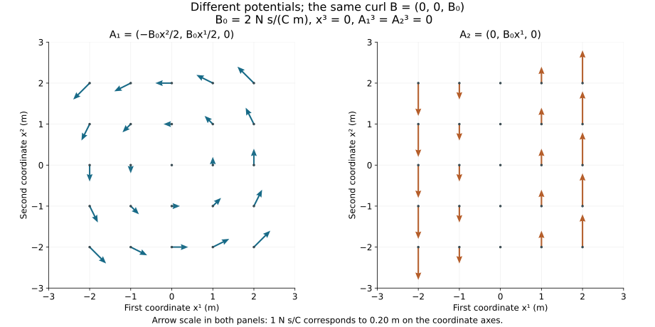

# Electromagnetism and gauge freedom

Lesson YM-F02 · Geometry and states in Yang–Mills theory

An electromagnetic field assigns an electric field and a magnetic field
to each spacetime point. We can also describe these fields using
potentials. The potentials contain freedom: different potential functions
can produce exactly the same electric and magnetic fields.

This lesson constructs that freedom, proves what it preserves, and tests
its limits on explicit domains. Maxwell's equations provide the physical
model. The calculus identities and every consequence used here are derived
from that model and the preparation in [Lesson 1](../fields-coordinates-quantities.html).

## 1. Fields, sources and units

Fix a right-handed Cartesian coordinate system
\(x=(x^1,x^2,x^3)\), an open time interval \(I\), and an open spatial
set \(\Omega\subseteq\mathbb R^3\). Time remains \(t\); it is not
replaced by a length coordinate. Unless a smaller regularity class is
explicitly stated, all functions in this lesson are smooth on
\(I\times\Omega\). Smooth means that partial derivatives of every
finite order exist and are continuous.

The unknown fields and prescribed sources are

\[
 E,B:I\times\Omega\longrightarrow\mathbb R^3,
 \qquad \rho:I\times\Omega\longrightarrow\mathbb R,
 \qquad j:I\times\Omega\longrightarrow\mathbb R^3.
 \tag{F2.1}
\]

Here \(\rho\) is electric charge per volume, and \(j\) is electric
current per area, with direction. The symbol \(\rho\) has this meaning
in the present lesson; it is not the quadratic transport density used in
Lesson 1.

For vectors \(a,b\), our products are defined by

\[
 \begin{aligned}
 a\cdot b&=a^1b^1+a^2b^2+a^3b^3,\\
 a\times b&=(a^2b^3-a^3b^2,\ a^3b^1-a^1b^3,\ a^1b^2-a^2b^1),\\
 |a|^2&=(a^1)^2+(a^2)^2+(a^3)^2.
 \end{aligned}
 \tag{F2.2}
\]

In SI units, a test particle with charge \(q\) and velocity \(v\)
experiences electromagnetic force

\[
 F=q(E+v\times B).
 \tag{F2.3}
\]

This is a physical law specifying the role of the fields, not a theorem
of vector arithmetic. A test particle means that its effect on the given
field is neglected in this description. The formula is evaluated at the
particle's time and position.

We retain the vacuum constants \(\epsilon_0>0\) and \(\mu_0>0\),
with

\[
 c^2=\frac{1}{\epsilon_0\mu_0},\qquad c>0.
 \tag{F2.4}
\]

The following table uses metres (m), seconds (s), coulombs (C) and
newtons (N). The coulomb measures electric charge, and the newton measures
force. Each vector component has the unit displayed for its vector.

| Quantity | SI unit |
|---|---|
| \(E\) | \(\mathrm{N}/\mathrm{C}\) |
| \(B\) | \(\mathrm{N\,s}/(\mathrm{C\,m})\) |
| \(\rho\) | \(\mathrm{C}/\mathrm{m}^3\) |
| \(j\) | \(\mathrm{C}/(\mathrm{m}^2\mathrm{\,s})\) |
| \(\epsilon_0\) | \(\mathrm{C}^2/(\mathrm{N\,m}^2)\) |
| \(\mu_0\) | \(\mathrm{N\,s}^2/\mathrm{C}^2\) |
| scalar potential \(\phi\) | \(\mathrm{N\,m}/\mathrm{C}\) |
| vector potential \(A\) | \(\mathrm{N\,s}/\mathrm{C}\) |
| gauge function \(\chi\) | \(\mathrm{N\,m\,s}/\mathrm{C}\) |

For instance, \(v\times B\) has unit
\((\mathrm m/\mathrm s)(\mathrm{N\,s}/(\mathrm{C\,m}))
=\mathrm N/\mathrm C\), matching \(E\). Also,
\(\epsilon_0\mu_0\) has unit \(\mathrm s^2/\mathrm m^2\),
as (F2.4) requires. The potentials and gauge function will be defined
below; their units already specify which derivatives can be added.

## 2. The vector calculus we need

Write \(\partial_i=\partial/\partial x^i\). For a scalar \(f\)
and a vector \(V\), define

\[
 \begin{aligned}
 \nabla f&=(\partial_1f,\partial_2f,\partial_3f),\\
 \operatorname{div}V&=\partial_1V^1+\partial_2V^2+\partial_3V^3,\\
 \operatorname{curl}V
 &=(\partial_2V^3-\partial_3V^2,\
    \partial_3V^1-\partial_1V^3,\
    \partial_1V^2-\partial_2V^1),\\
 \Delta f&=\partial_1^2f+\partial_2^2f+\partial_3^2f,\qquad
 (\Delta V)^i=\Delta V^i\quad(i=1,2,3).
 \end{aligned}
 \tag{F2.5}
\]

The notation \(\nabla\cdot V\) also means divergence, and
\(\nabla\times V\) means curl. These are differential operators;
the displayed component formulas define them.

### Lemma 2.1. Mixed derivatives commute

For a \(C^2\) function, any two coordinate derivatives commute,
including a time and a spatial derivative.

**Proof.** Let \(y\) denote all coordinates, and let \(e_a,e_b\)
be two different coordinate vectors. For a sufficiently small rectangle
in the domain, apply the fundamental theorem of calculus twice to the
four-corner difference

\[
 D=f(y+he_a+ke_b)-f(y+he_a)-f(y+ke_b)+f(y).
 \tag{F2.6}
\]

Differencing first along the \(a\)-direction gives
\(D=\int_0^h\int_0^k
\partial_b\partial_af(y+se_a+re_b)\,dr\,ds\).
Differencing first along the \(b\)-direction gives
\(D=\int_0^k\int_0^h
\partial_a\partial_bf(y+se_a+re_b)\,ds\,dr\).
Take \(h,k>0\), divide both expressions by \(hk\), and let both
lengths tend to zero. Continuity makes the limits the corresponding
mixed derivatives at \(y\). They are equal because both expressions
equal \(D/(hk)\). Equal-coordinate derivatives require no interchange.
\(\square\)

### Proposition 2.2. Three differential identities

For \(C^2\) fields,

\[
 \operatorname{curl}(\nabla f)=0,\qquad
 \operatorname{div}(\operatorname{curl}V)=0,\qquad
 \operatorname{curl}(\operatorname{curl}V)
       =\nabla(\operatorname{div}V)-\Delta V.
 \tag{F2.7}
\]

**Proof.** The three components of the first expression are

\[
 (\partial_2\partial_3f-\partial_3\partial_2f,\
  \partial_3\partial_1f-\partial_1\partial_3f,\
  \partial_1\partial_2f-\partial_2\partial_1f).
 \tag{F2.8}
\]

Each is zero by Lemma 2.1. Expanding the second expression gives all six
terms

\[
 \partial_1\partial_2V^3-\partial_1\partial_3V^2
 +\partial_2\partial_3V^1-\partial_2\partial_1V^3
 +\partial_3\partial_1V^2-\partial_3\partial_2V^1=0.
 \tag{F2.9}
\]

For the third identity, the three components of its left side are

\[
 \begin{aligned}
 &\partial_2\partial_1V^2-\partial_2^2V^1
       -\partial_3^2V^1+\partial_3\partial_1V^3,\\
 &\partial_3\partial_2V^3-\partial_3^2V^2
       -\partial_1^2V^2+\partial_1\partial_2V^1,\\
 &\partial_1\partial_3V^1-\partial_1^2V^3
       -\partial_2^2V^3+\partial_2\partial_3V^2.
 \end{aligned}
 \tag{F2.10}
\]

For component \(i\), expand

\[
 \partial_i(\partial_1V^1+\partial_2V^2+\partial_3V^3)
 -(\partial_1^2V^i+\partial_2^2V^i+\partial_3^2V^i).
\]

The \(\partial_i^2V^i\) terms cancel, and Lemma 2.1 identifies
the remaining four terms with the corresponding line of (F2.10).
This proves all three components. \(\square\)

We will also use, for \(C^1\) vectors \(E,B\),

\[
 \operatorname{div}(E\times B)
 =B\cdot\operatorname{curl}E-E\cdot\operatorname{curl}B.
 \tag{F2.11}
\]

To prove it, expand
\(\partial_1(E^2B^3-E^3B^2)\),
\(\partial_2(E^3B^1-E^1B^3)\), and
\(\partial_3(E^1B^2-E^2B^1)\) with the product rule.
The terms differentiating \(E\), grouped by their undifferentiated
factor, are

\[
 B^1(\partial_2E^3-\partial_3E^2)
 +B^2(\partial_3E^1-\partial_1E^3)
 +B^3(\partial_1E^2-\partial_2E^1).
 \tag{F2.12}
\]

The other six terms are

\[
 -E^1(\partial_2B^3-\partial_3B^2)
 -E^2(\partial_3B^1-\partial_1B^3)
 -E^3(\partial_1B^2-\partial_2B^1).
 \tag{F2.13}
\]

Their sum is (F2.11).

## 3. Maxwell's equations and compatible sources

In vacuum, with the charge and current sources of (F2.1), Maxwell's
equations in SI units are

\[
 \begin{aligned}
 \operatorname{div}E&=\rho/\epsilon_0,
 &\operatorname{div}B&=0,\\
 \operatorname{curl}E&=-\partial_tB,
 &\operatorname{curl}B&=\mu_0j+\mu_0\epsilon_0\partial_tE.
 \end{aligned}
 \tag{F2.14}
\]

The first two are Gauss constraints. The last two describe time
evolution. The word vacuum specifies the constitutive setting: we have
not introduced a material's polarization or magnetization. It does not
require the prescribed \(\rho\) and \(j\) to vanish.

These physical equations are input to the model. Once adopted, they have
mathematical consequences that can be proved.

### Proposition 3.1. Charge continuity and constraint propagation

Every smooth solution of (F2.14) obeys

\[
 \partial_t\rho+\operatorname{div}j=0.
 \tag{F2.15}
\]

Conversely, suppose the two curl equations in (F2.14) hold and the sources
satisfy (F2.15). Then the two constraint defects

\[
 \operatorname{div}B,\qquad
 \operatorname{div}E-\rho/\epsilon_0
 \tag{F2.16}
\]

are constant in time at every fixed point. In particular, constraints
that hold at one time hold throughout \(I\).

**Proof.** Take divergence of the last equation in (F2.14), use
(F2.9), and then use electric Gauss:

\[
 0=\mu_0\operatorname{div}j
   +\mu_0\epsilon_0\partial_t(\operatorname{div}E)
   =\mu_0(\operatorname{div}j+\partial_t\rho).
 \tag{F2.17}
\]

Since \(\mu_0>0\), this proves (F2.15). For the converse,
divergence of Faraday's equation gives
\(\partial_t\operatorname{div}B=0\).
Solving the last equation in (F2.14) for \(\partial_tE\) gives

\[
 \partial_t(\operatorname{div}E-\rho/\epsilon_0)
 =-\frac{\operatorname{div}j+\partial_t\rho}{\epsilon_0}=0.
 \tag{F2.18}
\]

Integration in time proves the assertions. \(\square\)

For a finite box, (F2.15) says that the change in charge is minus
outgoing current through its six faces. To state every boundary term,
put \(K=\prod_{i=1}^3[a_i,b_i]\), with \(a_i<b_i\). Denote by
\(x_{i,+}\) the point with coordinate \(i\) set to \(b_i\),
and by \(x_{i,-}\) the point with it set to \(a_i\).
The other two coordinates are integrated over their stated intervals;
write their product measure as \(d^2x_{\widehat i}\). Then

\[
 \frac d{dt}\int_K\rho\,d^3x
 =-\sum_{i=1}^3\int_{\prod_{r\ne i}[a_r,b_r]}
       \bigl(j^i(t,x_{i,+})-j^i(t,x_{i,-})\bigr)
       \,d^2x_{\widehat i}.
 \tag{F2.19}
\]

Differentiating the finite-box integral is justified by uniform
continuity on compact sets, exactly as in Lesson 1, Proposition 7.1.
Integrating each \(\partial_i j^i\) in its own coordinate and using
the fundamental theorem of calculus proves (F2.19).

## 4. Potentials and the equations they satisfy

A scalar potential \(\phi\) and a vector potential \(A\) give fields
by

\[
 \begin{aligned}
 E^1&=-\partial_1\phi-\partial_tA^1,&
 B^1&=\partial_2A^3-\partial_3A^2,\\
 E^2&=-\partial_2\phi-\partial_tA^2,&
 B^2&=\partial_3A^1-\partial_1A^3,\\
 E^3&=-\partial_3\phi-\partial_tA^3,&
 B^3&=\partial_1A^2-\partial_2A^1.
 \end{aligned}
 \tag{F2.20}
\]

Thus \(E=-\nabla\phi-\partial_tA\) and
\(B=\operatorname{curl}A\). Both terms in \(E\) have unit
\(\mathrm N/\mathrm C\), and curl \(A\) has the unit of \(B\).

### Proposition 4.1. Exact passage from potentials to fields

The fields (F2.20) satisfy magnetic Gauss and Faraday's equation
identically. They satisfy the other two Maxwell equations with given
\(\rho,j\) exactly when

\[
 \Delta\phi+\partial_t(\operatorname{div}A)
       =-\rho/\epsilon_0
 \tag{F2.21}
\]

and, for every \(i=1,2,3\),

\[
 \Delta A^i-\mu_0\epsilon_0\partial_t^2 A^i
 -\partial_i\bigl(\operatorname{div}A
                   +\mu_0\epsilon_0\partial_t\phi\bigr)
 =-\mu_0j^i.
 \tag{F2.22}
\]

**Proof.** Magnetic Gauss is \(\operatorname{div}\operatorname{curl}A=0\).
For Faraday, commuting the time derivative and the spatial derivatives
gives

\[
 \operatorname{curl}E+\partial_tB
 =-\operatorname{curl}\nabla\phi
  -\partial_t\operatorname{curl}A
  +\partial_t\operatorname{curl}A=0.
 \tag{F2.23}
\]

Electric Gauss follows by substituting
\(\operatorname{div}E=-\Delta\phi-\partial_t\operatorname{div}A\).
For the remaining equation, Proposition 2.2 gives its left side as
\(\nabla\operatorname{div}A-\Delta A\), and its right side as
\(\mu_0j-\mu_0\epsilon_0\nabla\partial_t\phi
-\mu_0\epsilon_0\partial_t^2A\). Bringing all terms to the
indicated sides gives (F2.22). Every step is reversible, so these
conditions are also sufficient. \(\square\)

Arbitrary potentials therefore produce the two homogeneous identities.
The source equations still impose (F2.21) and (F2.22). Introducing
potentials does not remove those equations.

## 5. Gauge transformations, with two complete examples

For a smooth real function \(\chi:I\times\Omega\to\mathbb R\),
define

\[
 \phi'=\phi-\partial_t\chi,\qquad
 (A')^i=A^i+\partial_i\chi\quad(i=1,2,3).
 \tag{F2.24}
\]

The units listed in Section 1 ensure that both additions have the
required dimensions. This is a gauge transformation by a globally
defined real function on the stated domain.

### Theorem 5.1. Gauge invariance

Transformation (F2.24) preserves \(E\) and \(B\) pointwise. It
therefore preserves Maxwell's equations with the same sources, and the
test-particle force for the same charge and velocity.

**Proof.** For every spatial component,

\[
 (E')^i=-\partial_i\phi+\partial_i\partial_t\chi
             -\partial_tA^i-\partial_t\partial_i\chi=E^i.
 \tag{F2.25}
\]

Lemma 2.1 cancels the two added terms. Also
\(B'=\operatorname{curl}A+\operatorname{curl}\nabla\chi=B\)
by (F2.8). Substitution into (F2.14) and (F2.3) proves the other
statements. \(\square\)

Successive transformations by \(\chi_1\) and \(\chi_2\) give
the transformation by \(\chi_1+\chi_2\). The zero function acts
as the identity, and \(-\chi\) reverses the transformation, directly
from (F2.24). A constant \(\chi\) acts trivially.

### Example 5.2. A uniform magnetic field

Let \(B_0\) be a real constant with the unit of magnetic field. On
all \(\mathbb R\times\mathbb R^3\), take

\[
 \phi_1=0,\qquad
 A_1=\left(-\frac{B_0x^2}{2},\frac{B_0x^1}{2},0\right),\qquad
 \chi=\frac{B_0x^1x^2}{2}.
 \tag{F2.26}
\]

Here \(\nabla\chi=(B_0x^2/2,B_0x^1/2,0)\), so the second
potential is

\[
 \phi_2=0,\qquad A_2=(0,B_0x^1,0).
 \tag{F2.27}
\]

Both give \(E=(0,0,0)\). For \(A_1\), the third curl component
is \(B_0/2-(-B_0/2)=B_0\); the other two are zero. For \(A_2\),
the third component is \(B_0-0=B_0\), and the other two are zero.
Thus both give \(B=(0,0,B_0)\). These constant fields satisfy all
four Maxwell equations with \(\rho=0\), \(j=(0,0,0)\).

*Figure 1. The slice \(x^3=0\) of (F2.26) and (F2.27), with
\(B_0=2\,\mathrm{N\,s}/(\mathrm{C\,m})\). Arrows plot the
first two potential components at the labelled coordinates. Their
lengths use the same declared plotting scale in both panels. The
third potential component is zero. The two curls are exactly
\((0,0,B_0)\); the arrows show potentials, not magnetic field
lines. Equations (F2.26)–(F2.27) and Example 5.2 give the complete
calculation.*

### Example 5.3. A uniform electric field in temporal gauge

Let \(E_0\) be constant with the unit of electric field. Start from
\(\phi=-E_0x^1\), \(A=(0,0,0)\), giving
\(E=(E_0,0,0)\) and \(B=(0,0,0)\). Choose
\(\chi=-E_0tx^1\). Then

\[
 \phi'=0,\qquad A'=(-E_0t,0,0),\qquad
 -\nabla\phi'-\partial_tA'=(E_0,0,0).
 \tag{F2.28}
\]

The same electric field now comes entirely from the time derivative of
the vector potential. The potentials change while the fields remain
constant. Both field descriptions satisfy source-free Maxwell equations.

## 6. When are all equivalent potentials gauge related?

Theorem 5.1 starts from a gauge function and proves equal fields.
The reverse question begins with equal fields and asks for a gauge
function. A spatial domain has to be specified to answer it.

### Theorem 6.1. The converse on a star-shaped domain

Suppose \(\Omega\) is star-shaped about \(x_0\in\Omega\):
every segment \(x_0+s(x-x_0)\), \(0\le s\le1\), lies in
\(\Omega\). Two smooth potential pairs \((\phi,A)\) and
\((\widetilde\phi,\widetilde A)\) on \(I\times\Omega\)
give equal fields if and only if they are related by (F2.24) for a
smooth real \(\chi\) on that domain.

**Proof.** One direction is Theorem 5.1. For the other, put
\(a=\widetilde A-A\) and \(\psi=\widetilde\phi-\phi\).
Equality of fields says

\[
 \operatorname{curl}a=0,\qquad \nabla\psi+\partial_ta=0.
 \tag{F2.29}
\]

Writing \(y=x-x_0\), define the actual candidate

\[
 h(t,x)=\int_0^1\sum_{i=1}^3
                  y^i a^i(t,x_0+sy)\,ds.
 \tag{F2.30}
\]

All segments lie in the domain. For a fixed segment, compactness
and openness give a neighbourhood in which the integrand and every
derivative are defined. Differentiation under this finite integral
is justified by the same uniform-continuity argument as in Lesson 1.
Consequently \(h\) is smooth. Vanishing curl means
\(\partial_j a^i=\partial_i a^j\) for all \(i,j\). Hence

\[
 \begin{aligned}
 \partial_jh(t,x)
 &=\int_0^1\left(a^j(t,x_0+sy)
       +s\sum_{i=1}^3 y^i\partial_j a^i(t,x_0+sy)\right)ds\\
 &=\int_0^1\frac d{ds}\bigl(s a^j(t,x_0+sy)\bigr)ds
 =a^j(t,x).
 \end{aligned}
 \tag{F2.31}
\]

The term at \(s=0\) is zero. Equations (F2.29) and (F2.31)
give \(\nabla(\psi+\partial_th)=0\). Integrating the gradient
along the segment from \(x_0\) to \(x\) shows that this function
is spatially constant. Since \(h(t,x_0)=0\), its value is
\(\psi(t,x_0)\). Fix any \(t_0\in I\) and set

\[
 \chi(t,x)=h(t,x)-\int_{t_0}^{t}\psi(s,x_0)\,ds.
 \tag{F2.32}
\]

Then \(\nabla\chi=a\) and \(\partial_t\chi=-\psi\).
These are precisely the two relations (F2.24). \(\square\)

### Theorem 6.2. Constructing potentials from the homogeneous equations

On the same star-shaped domain, every smooth pair \(E,B\) satisfying
\(\operatorname{div}B=0\) and
\(\operatorname{curl}E=-\partial_tB\) has smooth potentials.
Consequently the map (F2.20), with potential pairs identified when
they differ by (F2.24), is a bijection onto these homogeneous-field
pairs.

**Proof.** Continue to write \(y=x-x_0\). Define all three vector
components by

\[
 \begin{aligned}
 A^1(t,x)&=\int_0^1s\bigl(y^3B^2(t,x_0+sy)-y^2B^3(t,x_0+sy)\bigr)ds,\\
 A^2(t,x)&=\int_0^1s\bigl(y^1B^3(t,x_0+sy)-y^3B^1(t,x_0+sy)\bigr)ds,\\
 A^3(t,x)&=\int_0^1s\bigl(y^2B^1(t,x_0+sy)-y^1B^2(t,x_0+sy)\bigr)ds.
 \end{aligned}
 \tag{F2.32a}
\]

These formulas retain the segment parameter and all coordinate
factors. They define smooth functions by the compact-segment
argument in Theorem 6.1. For each of the ordered triples
\((i,j,k)=(1,2,3),(2,3,1),(3,1,2)\), the \(i\)-th curl
component, obtained by differentiating (F2.32a), is

\[
 \begin{aligned}
 (\operatorname{curl}A)^i
 &=\int_0^1\bigl[2sB^i
    +s^2(y^j\partial_jB^i+y^k\partial_kB^i
          -y^i\partial_jB^j-y^i\partial_kB^k)\bigr](t,x_0+sy)\,ds\\
 &=\int_0^1\left[
       \frac d{ds}\bigl(s^2B^i(t,x_0+sy)\bigr)
       -s^2y^i(\operatorname{div}B)(t,x_0+sy)
       \right]ds\\
 &=B^i(t,x).
 \end{aligned}
 \tag{F2.32b}
\]

In the first line, the evaluation applies to \(B\) and its
derivatives; the coordinates \(y\) remain fixed. The chain rule
supplies each factor \(s\). The second equality adds and subtracts
\(s^2y^i\partial_iB^i\). The divergence term is zero by
hypothesis, the upper endpoint gives \(B^i(t,x)\), and the
lower endpoint is zero because \(s^2B^i(t,x_0+sy)\) tends to zero.

Now set \(C=-E-\partial_tA\). Its curl is
\(-\operatorname{curl}E-\partial_tB=0\). Apply the already
proved gradient construction (F2.30)–(F2.31) to this vector:

\[
 \phi(t,x)=\int_0^1\sum_{i=1}^3y^i
       \bigl(-E^i-\partial_tA^i\bigr)(t,x_0+sy)\,ds,
 \qquad \nabla\phi=-E-\partial_tA.
 \tag{F2.32c}
\]

Thus (F2.20) holds. This proves existence of potentials for every
homogeneous-field pair on the stated domain. Theorem 5.1 says that
the map is constant on each gauge-equivalence class, and Theorem 6.1
says that two classes cannot give the same field pair. Existence
gives surjectivity, so the resulting map is a bijection. \(\square\)

For a uniform \(B=(0,0,B_0)\), with \(x_0=0\), the three
integrals (F2.32a) give exactly
\((-B_0x^2/2,B_0x^1/2,0)\), the first potential in Example 5.2.
The inhomogeneous source equations still correspond exactly to
(F2.21)–(F2.22), by Proposition 4.1.

### A domain with a missing axis

Consider

\[
 \Omega=\{x\in\mathbb R^3:(x^1)^2+(x^2)^2>0\},\qquad
 r^2=(x^1)^2+(x^2)^2,
 \tag{F2.33}
\]

and a constant \(\kappa\ne0\) with the unit of \(\chi\).
Take the time-independent potential

\[
 \phi=0,\qquad
 a=\left(-\frac{\kappa x^2}{r^2},\
          \frac{\kappa x^1}{r^2},\ 0\right).
 \tag{F2.34}
\]

It is smooth everywhere on this domain. The first two curl components
vanish because the third component is zero and there is no dependence
on \(x^3\). The other derivatives are

\[
 \partial_1 a^2
 =\frac{\kappa((x^2)^2-(x^1)^2)}{r^4}
 =\partial_2 a^1.
 \tag{F2.35}
\]

Thus its curl is zero. Its time derivative is also zero, so the fields
are \(E=B=(0,0,0)\), exactly as for the zero potential.

For a smooth path \(\gamma:[a,b]\to\Omega\), define its potential
integral by

\[
 \int_\gamma a\cdot dx
 =\int_a^b\sum_{i=1}^3a^i(\gamma(s))\dot\gamma^i(s)\,ds.
 \tag{F2.36}
\]

For the circle
\(\gamma(\theta)=(R\cos\theta,R\sin\theta,z_0)\),
where \(R>0\) and \(0\le\theta\le2\pi\), substitution gives

\[
 a(\gamma(\theta))\cdot\dot\gamma(\theta)
 =\kappa\sin^2\theta+\kappa\cos^2\theta=\kappa,
 \qquad \int_\gamma a\cdot dx=2\pi\kappa.
 \tag{F2.37}
\]

If a globally defined real \(\chi\) had \(a=\nabla\chi\),
the path derivative proved in Lesson 1 would instead give
\(\int_\gamma a\cdot dx=\chi(\gamma(2\pi))-\chi(\gamma(0))=0\).
Since \(\kappa\ne0\), no such global function exists.

There are explicit local gauge functions. On the half-space
\(x^1>0\), set \(\chi=\kappa\arctan(x^2/x^1)\).
Differentiating gives
\(\partial_1\chi=-\kappa x^2/r^2\),
\(\partial_2\chi=\kappa x^1/r^2\), and
\(\partial_3\chi=0\). More generally, every point has a small
ball avoiding the axis, and Theorem 6.1 applies there. The nonzero
circle integral records the failure to combine those local gradients
into one globally defined real gradient.

Adding any globally defined real gradient preserves this circle
integral, by the same closed-path calculation. This is a precise
global invariant for the gauge transformations defined here. Later
lessons introduce group-valued gauge transformations and specify their
global identifications separately.

## 7. Choosing a gauge and tracking the freedom that remains

Three frequently used conditions on potentials are

\[
 \begin{array}{ll}
 \text{Coulomb:}&\operatorname{div}A=0,\\
 \text{Lorenz:}&\operatorname{div}A+\mu_0\epsilon_0\partial_t\phi=0,\\
 \text{temporal:}&\phi=0.
 \end{array}
 \tag{F2.38}
\]

For the Lorenz condition, \(\mu_0\epsilon_0=1/c^2\) is retained.
A gauge condition is a restriction on potential descriptions.
It need not leave a unique description.

Let \(G=\operatorname{div}A+\mu_0\epsilon_0\partial_t\phi\).
Substituting (F2.24), with every derivative term included, gives

\[
 \begin{aligned}
 \operatorname{div}A'&=\operatorname{div}A+\Delta\chi,\\
 G'&=G+\Delta\chi-\mu_0\epsilon_0\partial_t^2\chi,\\
 \phi'&=\phi-\partial_t\chi.
 \end{aligned}
 \tag{F2.39}
\]

Consequently a transformation preserves Coulomb gauge exactly when
\(\Delta\chi=0\), preserves Lorenz gauge exactly when
\(\Delta\chi-\mu_0\epsilon_0\partial_t^2\chi=0\), and
preserves temporal gauge exactly when \(\partial_t\chi=0\).
These equivalences follow directly from (F2.39).

Temporal gauge can be reached explicitly on the product domain:

\[
 \chi(t,x)=\int_{t_0}^{t}\phi(s,x)\,ds
 \quad\Longrightarrow\quad \phi'=0.
 \tag{F2.40}
\]

Reaching Coulomb gauge requires solving
\(\Delta\chi=-\operatorname{div}A\); reaching Lorenz gauge
requires solving
\(\Delta\chi-\mu_0\epsilon_0\partial_t^2\chi=-G\).
These are the exact equations obtained from the transformation.
Their boundary and initial data are part of any particular gauge
selection problem. We have constructed the temporal transformation
and the explicit examples above; we do not infer global solvability
of an unspecified boundary problem from these formulas.

For example, when smooth boundary values have been specified, if one
additionally requires \(n\cdot A=0\) on a
given spatial boundary with unit normal \(n\), a transformation
preserves that requirement exactly when \(n\cdot\nabla\chi=0\)
there. If a boundary value of \(\phi\) is fixed, preservation
requires \(\partial_t\chi=0\) there. These statements follow by
substitution and show why extra conditions must be retained.

In Lorenz gauge, (F2.21) and (F2.22) become

\[
 \Delta\phi-\mu_0\epsilon_0\partial_t^2\phi=-\rho/\epsilon_0,
 \qquad
 \Delta A^i-\mu_0\epsilon_0\partial_t^2A^i=-\mu_0j^i
 \quad(i=1,2,3).
 \tag{F2.41}
\]

For the scalar equation, substitute
\(\operatorname{div}A=-\mu_0\epsilon_0\partial_t\phi\)
into (F2.21). For the vector equations, the gradient of \(G=0\)
in (F2.22) vanishes. No coupling constant has been discarded.

## 8. Waves and the energy they carry

### Proposition 8.1. Field wave equations with their source terms

Every smooth Maxwell solution satisfies

\[
 \begin{aligned}
 \Delta E-\mu_0\epsilon_0\partial_t^2E
      &=\frac{1}{\epsilon_0}\nabla\rho+\mu_0\partial_tj,\\
 \Delta B-\mu_0\epsilon_0\partial_t^2B
      &=-\mu_0\operatorname{curl}j.
 \end{aligned}
 \tag{F2.42}
\]

**Proof.** Curl of Faraday gives
\(\nabla\operatorname{div}E-\Delta E
=-\mu_0\partial_tj-\mu_0\epsilon_0\partial_t^2E\).
Substitute electric Gauss and rearrange to obtain the first line.
Curl of the last Maxwell equation gives
\(-\Delta B=\mu_0\operatorname{curl}j
-\mu_0\epsilon_0\partial_t^2B\), using magnetic Gauss and
Faraday. Rearrangement gives the second line. These vector equalities
hold in each of the three components by (F2.10). \(\square\)

The Maxwell constraints remain required; the wave equations alone
are not a replacement for the full system.

### Example 8.2. An exact plane wave

Let \(k>0\) have unit inverse length, let \(\omega=ck\), and
let \(A_0\) be a real constant with the unit of \(A\). Put
\(\theta=kx^1-\omega t\), and choose

\[
 \phi=0,\qquad A=(0,A_0\sin\theta,0).
 \tag{F2.43}
\]

Direct differentiation gives

\[
 E=(0,A_0\omega\cos\theta,0),\qquad
 B=(0,0,A_0k\cos\theta).
 \tag{F2.44}
\]

Their divergences are zero, since the nonzero electric component
has no \(x^2\) dependence and the nonzero magnetic component has
no \(x^3\) dependence. The two curl equations are verified by

\[
 \begin{aligned}
 \operatorname{curl}E&=(0,0,-A_0\omega k\sin\theta)
                         =-\partial_tB,\\
 \operatorname{curl}B&=(0,A_0k^2\sin\theta,0),\\
 \mu_0\epsilon_0\partial_tE
       &=(0,\mu_0\epsilon_0 A_0\omega^2\sin\theta,0)
        =(0,A_0k^2\sin\theta,0).
 \end{aligned}
 \tag{F2.45}
\]

Thus all four Maxwell equations hold with zero sources. The phase
is constant along \(x^1=ct+\xi\); this exact wave travels in the
positive first direction at speed \(c\). It is an infinite plane
wave, not a claim about a finite-energy pulse or a general existence
theorem.

### Proposition 8.3. Local electromagnetic energy balance

Define the field energy density and flux by

\[
 w=\frac{\epsilon_0}{2}\bigl((E^1)^2+(E^2)^2+(E^3)^2\bigr)
    +\frac{1}{2\mu_0}\bigl((B^1)^2+(B^2)^2+(B^3)^2\bigr),
 \qquad S=\frac{1}{\mu_0}E\times B.
 \tag{F2.46}
\]

For every smooth Maxwell solution,

\[
 \partial_tw+\operatorname{div}S=-j\cdot E.
 \tag{F2.47}
\]

**Proof.** The product rule and the evolution equations give

\[
 \begin{aligned}
 \partial_tw
 &=\epsilon_0 E\cdot\partial_tE
       +\frac1{\mu_0}B\cdot\partial_tB\\
 &=\frac1{\mu_0}E\cdot\operatorname{curl}B-j\cdot E
       -\frac1{\mu_0}B\cdot\operatorname{curl}E\\
 &=-\frac1{\mu_0}\operatorname{div}(E\times B)-j\cdot E,
 \end{aligned}
 \tag{F2.48}
\]

where the last line is the proved product identity (F2.11).
This is (F2.47). \(\square\)

For the box and face notation of Section 3, the full integrated
identity is

\[
 \frac d{dt}\int_Kw\,d^3x
 =-\sum_{i=1}^3\int_{\prod_{r\ne i}[a_r,b_r]}
       \bigl(S^i(t,x_{i,+})-S^i(t,x_{i,-})\bigr)
            \,d^2x_{\widehat i}
   -\int_K\sum_{i=1}^3 j^iE^i\,d^3x.
 \tag{F2.49}
\]

The finite-box proof is the same coordinatewise fundamental-theorem
argument that established (F2.19), now with the additional volume
term. Even when \(j=0\), energy inside the box can change through
its boundary. Because (F2.46) depends only on \(E,B\), Theorem 5.1
also proves that both \(w\) and \(S\) are gauge invariant.

## 9. Exercises with complete solutions

### Exercise 1. Compute all vector derivatives

For constants \(\alpha,\gamma\), take
\(V=(-\alpha x^2,\alpha x^1,\gamma x^3)\). Calculate its
divergence and all components of its curl.

**Solution.** The divergence is \(0+0+\gamma=\gamma\).
The first curl component is \(0-0=0\), the second is \(0-0=0\),
and the third is \(\alpha-(-\alpha)=2\alpha\). Therefore
\(\operatorname{curl}V=(0,0,2\alpha)\). Divergence and curl
are different operations even when applied to the same vector.

### Exercise 2. A potential with a prescribed charge density

Take constant \(\rho_0\), \(A=0\), and
\(\phi=-\rho_0((x^1)^2+(x^2)^2+(x^3)^2)/(6\epsilon_0)\)
on all space. Find the fields and the sources for which they solve
Maxwell's equations.

**Solution.** For each \(i\), differentiation gives
\(E^i=\rho_0x^i/(3\epsilon_0)\), and \(B=0\).
The electric divergence is the sum of three terms
\(\rho_0/(3\epsilon_0)\), hence \(\rho_0/\epsilon_0\).
Its curl is zero because each component depends only on its own
coordinate. All time derivatives and the magnetic curl vanish.
Thus \(\rho=\rho_0\), \(j=0\) give all four equations.
The same result follows from
\(\Delta\phi=-\rho_0(2+2+2)/(6\epsilon_0)=-\rho_0/\epsilon_0\).
For \(\rho_0\ne0\), this is a spatially uniform, nonlocalized
source; no assumption of finite total charge is being made.

### Exercise 3. Both time and space derivatives matter

Start with \(\phi=0,A=0\), and choose
\(\chi=\beta t x^1x^2\), where \(\beta\) is a constant with
unit \(\mathrm N/(\mathrm{C\,m})\). Calculate the transformed
potentials and their fields directly.

**Solution.** They are

\[
 \phi'=-\beta x^1x^2,\qquad
 A'=(\beta t x^2,\beta t x^1,0).
 \tag{F2.50}
\]

The two contributions to the electric field are
\(-\nabla\phi'=(\beta x^2,\beta x^1,0)\) and
\(-\partial_tA'=(-\beta x^2,-\beta x^1,0)\); their sum is zero.
The first two magnetic components vanish, and the third is
\(\beta t-\beta t=0\). Thus the two nonconstant potentials
still describe zero fields. Omitting either electric contribution
would produce an incorrect answer.

### Exercise 4. Incompatible prescribed sources

Let \(\rho(t,x)=\rho_0t/T_0\), with \(T_0>0\) a fixed time
and \(\rho_0\ne0\) a constant charge density. Take \(j=0\).
Can these be the sources of a smooth Maxwell solution on a nonempty
open time interval and spatial domain?

**Solution.** Their continuity expression is
\(\partial_t\rho+\operatorname{div}j=\rho_0/T_0\ne0\).
Proposition 3.1 proves that every Maxwell solution has zero continuity
expression. These specified sources therefore admit no such solution.
The obstruction is the explicit scalar source defect
\(\rho_0/T_0\), not a failure of the gauge description.

### Exercise 5. Evolution does not impose the initial constraints

For \(\lambda\ne0\), set \(E=(\lambda x^1,0,0)\),
\(B=0\), \(\rho=0\), and \(j=0\). Test all four equations.

**Solution.** All time derivatives vanish. Both curls vanish,
so the two evolution equations hold. Magnetic Gauss also holds.
But \(\operatorname{div}E=\lambda\ne0=\rho/\epsilon_0\).
The electric constraint fails at every time. Its defect is constant
in time, as (F2.18) predicts. This also gives a source-free solution
of the field wave equations that is not a Maxwell solution:
\(\Delta E=0\), \(\partial_t^2E=0\), and both terms for \(B\)
vanish.

### Exercise 6. Gauge conditions can leave many representatives

Show that both magnetic potentials in Example 5.2 satisfy Coulomb,
Lorenz and temporal gauge. Explain why their difference does not
contradict any of those conditions.

**Solution.** Their divergences are respectively
\(\partial_1(-B_0x^2/2)+\partial_2(B_0x^1/2)+0=0\)
and \(\partial_2(B_0x^1)=0\). Their scalar potentials are zero.
Thus all three conditions in (F2.38) hold. Their gauge function
\(\chi=B_0x^1x^2/2\) obeys \(\Delta\chi=0\) and
\(\partial_t\chi=\partial_t^2\chi=0\), exactly the three
residual conditions in (F2.39). These gauge conditions alone do
not choose a unique representative.

### Exercise 7. Classify the missing-axis family

Allow any real \(\kappa\), including zero, in (F2.34).
For which \(\kappa_1,\kappa_2\) are the two resulting potential
pairs related by a globally defined real gauge function on
\(I\times\Omega\)?

**Solution.** Their difference is (F2.34) with coefficient
\(\kappa_2-\kappa_1\). Its integral around the specified circle
is \(2\pi(\kappa_2-\kappa_1)\). If the difference is a gradient,
that integral must be zero, so \(\kappa_2=\kappa_1\).
If the coefficients are equal, the potentials are identical and
\(\chi=0\) supplies a gauge transformation. Thus equality of
coefficients is both necessary and sufficient within this family
and the declared class of real gauge functions.

### Exercise 8. Energy and direction of the plane wave

For Example 8.2, calculate the complete energy density and flux.
Verify directly that \(S^1=cw\) and \(S^2=S^3=0\), keeping
both electric and magnetic contributions visible.

**Solution.** Substitution into (F2.46) gives

\[
 \begin{aligned}
 w&=\frac{\epsilon_0 A_0^2\omega^2}{2}\cos^2\theta
       +\frac{A_0^2k^2}{2\mu_0}\cos^2\theta,\\
 S&=\left(\frac{A_0^2\omega k}{\mu_0}\cos^2\theta,0,0\right).
 \end{aligned}
 \tag{F2.51}
\]

Since \(\omega=ck\) and \(\epsilon_0c^2=1/\mu_0\),
each of the two terms in \(cw\) equals
\(A_0^2ck^2\cos^2\theta/(2\mu_0)\). Their sum is
\(A_0^2\omega k\cos^2\theta/\mu_0=S^1\).
The other components are zero from the explicit cross product.
Finally, both terms in \(w\) depend on \(x^1,t\) through
\(x^1-ct\), so \(\partial_tw+c\partial_1w=0\).
With \(S^1=cw\) this verifies (F2.47) directly for the wave.

## 10. Reading and the next step

The source convention used for the potential and gauge formulas is
José A. Heras, [*How potentials in different gauges yield the same
retarded electric and magnetic fields*](https://arxiv.org/abs/physics/0702217v1),
*American Journal of Physics* **75** (2007), 176–183,
[doi:10.1119/1.2400238](https://doi.org/10.1119/1.2400238).
Section II, equations (1)–(5) and (8), states SI potential relations,
gauge transformations, coupled equations and gauge conditions. The
opening of Section III gives the Lorenz-gauge wave equations.

Our \(\phi\) denotes the source's \(\Phi\), our \(j\) its
\(\mathbf J\), and \(\Delta\) its \(\nabla^2\).
Its \(\Box^2\) is exactly
\(\Delta-(1/c^2)\partial_t^2
=\Delta-\mu_0\epsilon_0\partial_t^2\). The full source factors
are retained in (F2.20)–(F2.24) and (F2.38)–(F2.41), whose receiving
derivations are supplied here. The original author LaTeX was read
at bounded coverage; the course provenance records it. This lesson
does not use the paper's retarded integral formulas or its further
interpretations of potentials. Our examples and theorems have the
explicit domains and hypotheses stated above, including examples
that are not localized sources.

The exposition, proofs, exercises and figure are independently written
course material. The star-shaped-domain proof and missing-axis
calculation are elementary treatments, with no novelty claim.

The [next lesson](../symmetry-through-matrices.html) introduces phases, rotations and matrices. Those
objects will let us specify how symmetry acts on fields and prepare
the passage from the scalar gauge function used here to the group
actions of Yang–Mills theory.

[Course plan](../curriculum.html) · Proof and authorship record
