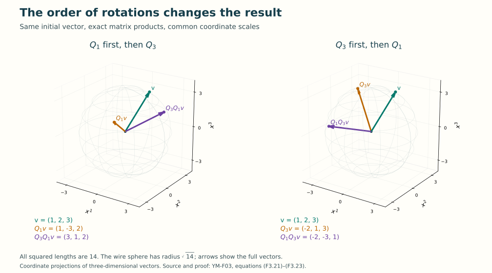

# Symmetry through matrices

Lesson YM-F03 · Geometry and states in Yang–Mills theory

A rotation changes a vector's components while preserving its length.
A complex phase changes a complex number while preserving its absolute
value. Matrices put both operations into a common language. They also
record a feature that ordinary numbers can conceal: the order of two
transformations can matter.

We will build that language from arithmetic, then apply it to fields.
The final calculations connect complex phases directly to the gauge
transformations of [Lesson 2](../electromagnetism-gauge-freedom.html),
including the domain with a missing axis.

Preparation is [Lesson 1](../fields-coordinates-quantities.html), the
gauge formulas of Lesson 2, and elementary trigonometry. We use the
usual sine and cosine, their derivatives, their addition formulas and
their parametrization of the unit circle with period \(2\pi\).
No prior abstract algebra or quantum mechanics is assumed.

## 1. Complex numbers and phases

A complex number is a pair of real numbers, written \(z=a+ib\),
with the multiplication rule \(i^2=-1\). The operations are

\[
 \begin{aligned}
 (a+ib)+(c+id)&=(a+c)+i(b+d),\\
 (a+ib)(c+id)&=(ac-bd)+i(ad+bc),\\
 \overline{a+ib}&=a-ib,\qquad
 |a+ib|^2=a^2+b^2.
 \end{aligned}
 \tag{F3.1}
\]

The bar means complex conjugation, and \(|z|\) is the nonnegative
square root of \(|z|^2\). The real numbers are the pairs with
second component zero.

These rules make addition and multiplication associative and
distributive. Here is the multiplication check that will matter for
matrices. For \(z=a+ib\), \(w=c+id\), and \(u=e+if\), both
\((zw)u\) and \(z(wu)\) have real part

\[
 ace-bde-adf-bcf
 \tag{F3.2}
\]

and imaginary part

\[
 acf-bdf+ade+bce.
 \tag{F3.3}
\]

Expanding (F3.1) in either order gives those four terms. Addition
and distributivity follow by expanding the two real coordinates.
The multiplicative identity is \(1+0i\). If \(z\ne0\), then

\[
 z^{-1}=\frac{\overline z}{|z|^2}
       =\frac{a-ib}{a^2+b^2},\qquad zz^{-1}=z^{-1}z=1.
 \tag{F3.4}
\]

The denominator is strictly positive. Zero has no multiplicative
inverse, because (F3.1) makes its product with every number zero.

Conjugation preserves sums and products, as direct expansion shows.
In particular,

\[
 \begin{aligned}
 |zw|^2
 &=(ac-bd)^2+(ad+bc)^2\\
 &=a^2c^2-2abcd+b^2d^2+a^2d^2+2abcd+b^2c^2\\
 &=(a^2+b^2)(c^2+d^2)=|z|^2|w|^2.
 \end{aligned}
 \tag{F3.5}
\]

Taking nonnegative square roots gives \(|zw|=|z|\,|w|\).

For a real angle \(\theta\), write

\[
 p(\theta)=e^{i\theta}=\cos\theta+i\sin\theta.
 \tag{F3.6}
\]

This defines the notation \(e^{i\theta}\) needed in this lesson.
The trigonometric identities and derivatives give

\[
 \begin{aligned}
 |p(\theta)|&=1,&
 p(\theta+\eta)&=p(\theta)p(\eta),\\
 p(-\theta)&=\overline{p(\theta)}=p(\theta)^{-1},&
 \frac d{d\theta}p(\theta)&=i p(\theta).
 \end{aligned}
 \tag{F3.7}
\]

Every complex number of absolute value one is \(p(\theta)\)
for some \(\theta\). Its angle is determined modulo \(2\pi\):
\(p(\theta)=p(\eta)\) exactly when
\(\theta-\eta\in2\pi\mathbb Z\). Here \(\mathbb Z\) denotes
the integers, including zero and negative integers.

A phase is a number of absolute value one. Multiplying by a phase
preserves \(|z|\) by (F3.5). For \(z=a+ib\), its complete effect
on the real coordinates is

\[
 p(\theta)z
 =(a\cos\theta-b\sin\theta)
   +i(a\sin\theta+b\cos\theta).
 \tag{F3.8}
\]

Thus a phase is exactly a rotation of the real coordinate pair.

## 2. Matrices are maps with a specified order

Throughout the matrix calculations, the sizes \(m,n,r\) are positive
integers.

A complex \(m\)-by-\(n\) matrix \(M=(M_{ab})\) represents the
map \(\mathbb C^n\to\mathbb C^m\) given by

\[
 (Mv)^a=\sum_{b=1}^n M_{ab}v^b\qquad(1\le a\le m).
 \tag{F3.9}
\]

The first index is the row and output component; the second is
the column and input component. A vector here is a column. A map
is complex-linear when it preserves addition and multiplication
by every complex scalar. Formula (F3.9) has both properties by
distributivity.

If \(N\) is \(n\)-by-\(r\), composition has the matrix

\[
 (MN)_{ac}=\sum_{b=1}^n M_{ab}N_{bc},
 \qquad MN:\mathbb C^r\longrightarrow\mathbb C^m.
 \tag{F3.10}
\]

The rightmost matrix acts first. Indeed,
\((M(Nv))^a=\sum_b\sum_c M_{ab}N_{bc}v^c=(MNv)^a\).
All sums are finite, so changing their order uses only distributivity.

For compatible matrices \(L,M,N\), associativity follows entry by
entry:

\[
 ((LM)N)_{ad}
 =\sum_c\sum_b L_{ab}M_{bc}N_{cd}
 =\sum_b\sum_c L_{ab}M_{bc}N_{cd}
 =(L(MN))_{ad}.
 \tag{F3.11}
\]

Each sum ranges over its indicated intermediate coordinate space.
Matrix addition and scalar multiplication are entrywise, and the
same finite-sum calculation proves distributivity.

The \(n\)-by-\(n\) identity \(I_n\) has entries
\((I_n)_{ab}=1\) if \(a=b\), and zero otherwise. A square
matrix \(M\) is invertible if a matrix \(M^{-1}\) satisfies
\(MM^{-1}=M^{-1}M=I_n\). Its inverse is unique: if \(L\) is
a left inverse and \(R\) a right inverse, then
\(L=L(MR)=(LM)R=R\).

### Lemma 2.1. A coordinate fact about square matrices

If an \(n\)-by-\(n\) matrix \(M\) has no nonzero vector in
its kernel, then it is invertible.

**Proof.** Its columns \(v_1,\ldots,v_n\) are independent:
\(\sum_j a_jv_j=0\) means \(M(a_1,\ldots,a_n)^T=0\),
so every coefficient is zero. We prove by induction that \(n\)
independent vectors in \(\mathbb C^n\) span it. For \(n=1\),
the one nonzero coordinate is invertible by (F3.4).

For \(n>1\), some coordinate of \(v_1\) is nonzero. Reorder
coordinates to make it the first. For \(j=2,\ldots,n\), set
\(w_j=v_j-(v_j^1/v_1^1)v_1\). These vectors have zero first
coordinate. They are independent, since a relation among them would
give a relation among the original \(v_j\). Their last \(n-1\)
coordinates therefore form an independent list in \(\mathbb C^{n-1}\)
and span it by induction. For any \(v\in\mathbb C^n\), the
vector \(v-(v^1/v_1^1)v_1\) has zero first coordinate, so is a
combination of the \(w_j\). It follows that \(v\) is a
combination of the original columns. Independence makes its
coefficients unique.

Thus the map \(v\mapsto Mv\) is bijective. The inverse is linear:
applying \(M\) to a sum or scalar multiple of inverse images
gives the required sum or scalar multiple, and uniqueness identifies
the inverse image. Its values on the coordinate vectors give an
inverse matrix with both products equal to \(I_n\). \(\square\)

### A real rotation matrix for every phase

Define

\[
 R(\theta)=
 \begin{pmatrix}\cos\theta&-\sin\theta\\
                 \sin\theta&\cos\theta\end{pmatrix},
 \qquad F(a+ib)=\begin{pmatrix}a\\b\end{pmatrix}.
 \tag{F3.12}
\]

Equation (F3.8) is the exact map identity

\[
 F(p(\theta)z)=R(\theta)F(z).
 \tag{F3.13}
\]

The trigonometric addition formulas, or composition in (F3.13), give
\(R(\theta)R(\eta)=R(\theta+\eta)\).
Its inverse is \(R(-\theta)\). Expanding the two coordinates of
\(R(\theta)(a,b)^T\) gives

\[
 (a\cos\theta-b\sin\theta)^2
 +(a\sin\theta+b\cos\theta)^2=a^2+b^2;
 \tag{F3.14}
\]

the cross terms cancel and each coefficient of \(a^2,b^2\)
is \(\cos^2\theta+\sin^2\theta=1\).

## 3. Adjoints, lengths and unitary matrices

For \(v,w\in\mathbb C^n\), define

\[
 \langle v,w\rangle=\sum_{a=1}^n\overline{v^a}w^a,
 \qquad \|v\|^2=\langle v,v\rangle
                  =\sum_{a=1}^n|v^a|^2.
 \tag{F3.15}
\]

The first variable is conjugate-linear and the second is linear.
This choice fixes the signs in later identities. The squared norm
is nonnegative and is zero exactly when every coordinate is zero.

The adjoint of an \(m\)-by-\(n\) matrix is the
\(n\)-by-\(m\) matrix

\[
 (M^\dagger)_{ba}=\overline{M_{ab}}.
 \tag{F3.16}
\]

It satisfies

\[
 \langle Mv,w\rangle=\langle v,M^\dagger w\rangle,
 \qquad (MN)^\dagger=N^\dagger M^\dagger,
 \qquad (M^\dagger)^\dagger=M.
 \tag{F3.17}
\]

For the first equality, expand its left side as
\(\sum_a\sum_b\overline{M_{ab}}\,\overline{v^b}w^a\)
and group by \(b\). For the second,
\(\overline{(MN)_{ac}}=\sum_b\overline{N_{bc}}\,
\overline{M_{ab}}\), which is precisely the \((c,a)\) entry
of \(N^\dagger M^\dagger\). The last equality follows from
conjugating twice and transposing twice.

### Theorem 3.1. Equivalent tests for unitarity

For a square matrix \(U\), the following conditions are equivalent:
it preserves the inner product; it preserves the norm of every vector;
it satisfies \(U^\dagger U=I_n\). When they hold, \(U\) is
invertible, \(U^{-1}=U^\dagger\), and \(UU^\dagger=I_n\).
Such a matrix is called unitary.

**Proof.** Inner-product preservation gives norm preservation by
setting the two arguments equal. Conversely, direct expansion of
(F3.15) gives the polarization identity

\[
 \langle v,w\rangle=\frac14\left(
  \|v+w\|^2-\|v-w\|^2
  -i\|v+iw\|^2+i\|v-iw\|^2\right).
 \tag{F3.18}
\]

The first difference is \(4\operatorname{Re}\langle v,w\rangle\);
the difference of the last two norms before multiplication by
\(-i\) is \(-4\operatorname{Im}\langle v,w\rangle\).
Thus preservation of every norm, together with complex linearity,
preserves the inner product.

By (F3.17), inner-product preservation is
\(\langle v,(U^\dagger U-I_n)w\rangle=0\) for every \(v,w\).
Taking coordinate vectors for \(v,w\) proves that every entry of
\(U^\dagger U-I_n\) is zero. Conversely that matrix equality
immediately preserves the inner product.

Finally, \(Uv=0\) implies \(v=U^\dagger Uv=0\), so Lemma 2.1
gives an inverse. The left inverse \(U^\dagger\) must equal it
by uniqueness of inverses. Therefore \(UU^\dagger=I_n\) too.
\(\square\)

A real unitary matrix is called orthogonal; its adjoint is its
ordinary transpose. The matrices \(R(\theta)\) in (F3.12) are
orthogonal by (F3.14). For a two-by-two real matrix
\(\left(\begin{smallmatrix}a&b\\c&d\end{smallmatrix}\right)\),
the determinant is \(ad-bc\). The determinant of \(R(\theta)\)
is one.

In fact every orthogonal two-by-two matrix of determinant one is
\(R(\theta)\). To check this, write its first column as \((a,b)^T\),
with \(a^2+b^2=1\). A unit column perpendicular to it must be
\(\sigma(-b,a)^T\), with \(\sigma=1\) or \(-1\): the
perpendicular space is spanned by \((-b,a)^T\). Indeed, if
\(au+bv=0\) and \(a\ne0\), then
\((u,v)=(v/a)(-b,a)\). If \(a=0\), then \(b\ne0\),
\(v=0\), and \((u,0)=(-u/b)(-b,0)\). The unit norm
forces the real coefficient to have absolute value one.
The determinant is \(\sigma(a^2+b^2)=\sigma\). Determinant one
therefore selects the column \((-b,a)^T\). Choose \(\theta\)
with \(a=\cos\theta,b=\sin\theta\), giving (F3.12).

## 4. Groups, representations and order

A group is a set with an associative operation, an identity, and
an inverse for each element. The identity acts without changing an
element, and the inverse undoes the operation. Commutativity is not
required. A group is called abelian when all pairs commute.

Invertible \(n\)-by-\(n\) complex matrices form a group
\(\operatorname{GL}_n(\mathbb C)\) under multiplication. The
identity and associativity were proved above, and the inverse of
\(MN\) is \(N^{-1}M^{-1}\): multiplying in either order and
using associativity gives \(I_n\).

The unitary matrices form a group \(U(n)\). Indeed,

\[
 (UV)^\dagger(UV)=V^\dagger U^\dagger UV=V^\dagger V=I_n,
 \tag{F3.19}
\]

and the identity and inverse are unitary. For the inverse, use
\((U^\dagger)^\dagger U^\dagger=UU^\dagger=I_n\).
The group \(U(1)\) is the complex unit circle from Section 1.
It is abelian because complex multiplication commutes.

A representation of a group \(G\) on \(\mathbb C^n\) is a map
\(\pi:G\to\operatorname{GL}_n(\mathbb C)\) satisfying

\[
 \pi(gh)=\pi(g)\pi(h),\qquad \pi(e)=I_n.
 \tag{F3.20}
\]

These equations make \((g,v)\mapsto\pi(g)v\) a group action:
applying \(h\), then \(g\), has the same effect as applying
\(gh\). They also imply \(\pi(g^{-1})=\pi(g)^{-1}\).
A representation is unitary when its values are unitary matrices,
and faithful when different group elements give different matrices.
Representations on real coordinate spaces are defined in the same
way with real matrices.

Here are three exact examples:

1. The action of \(U(n)\) on \(\mathbb C^n\) by its defining
   matrices is unitary and faithful.
2. For any integer \(m\), \(z\mapsto z^m\) is a one-dimensional
   unitary representation of \(U(1)\). Negative powers use (F3.4).
   The identity \((zw)^m=z^mw^m\) holds by repeated multiplication
   for nonnegative \(m\) and by inverses for negative \(m\).
3. The map \(a+ib\mapsto\left(\begin{smallmatrix}a&-b\\b&a\end{smallmatrix}\right)\)
   for \(a^2+b^2=1\) is a faithful real representation onto the
   orthogonal two-by-two matrices of determinant one. The exact
   intertwining map is \(F\) in (F3.13), and Section 3 proved
   surjectivity onto that set.

### Two three-dimensional rotations that do not commute

Consider the actual matrices

\[
 Q_3=\begin{pmatrix}0&-1&0\\1&0&0\\0&0&1\end{pmatrix},
 \qquad
 Q_1=\begin{pmatrix}1&0&0\\0&0&-1\\0&1&0\end{pmatrix}.
 \tag{F3.21}
\]

They send \((x^1,x^2,x^3)\) to
\((-x^2,x^1,x^3)\) and \((x^1,-x^3,x^2)\), respectively.
Each preserves the sum of the three coordinate squares and is
therefore orthogonal. They are right-angle rotations about the
third and first coordinate axes. Multiplication gives

\[
 Q_3Q_1=\begin{pmatrix}0&0&1\\1&0&0\\0&1&0\end{pmatrix},
 \qquad
 Q_1Q_3=\begin{pmatrix}0&-1&0\\0&0&-1\\1&0&0\end{pmatrix}.
 \tag{F3.22}
\]

For the same vector \(v=(1,2,3)^T\), the two full calculations are

\[
 \begin{aligned}
 v&\overset{Q_1}{\longmapsto}(1,-3,2)^T\overset{Q_3}{\longmapsto}(3,1,2)^T,\\
 v&\overset{Q_3}{\longmapsto}(-2,1,3)^T\overset{Q_1}{\longmapsto}(-2,-3,1)^T.
 \end{aligned}
 \tag{F3.23}
\]

The final vectors differ. Both have squared length \(14\), the
same as the initial vector; norm preservation does not imply that
the operations commute.

*Figure 1. The two paths in (F3.23), drawn in three-dimensional
coordinate projections with the same axis scales. Each arrow runs
from the origin to the exact displayed vector. The initial,
intermediate and final squared lengths are all \(14\). The
wire sphere has radius \(\sqrt{14}\); no vector has been divided
by its length. The matrices and proof are (F3.21)–(F3.23).*

### What the difference of the two orders satisfies

For square matrices define the commutator
\([M,N]=MN-NM\). It is bilinear, \([M,M]=0\), and
\([M,N]=-[N,M]\), directly by distributivity. It also satisfies

\[
 [L,[M,N]]+[M,[N,L]]+[N,[L,M]]=0.
 \tag{F3.24}
\]

Here is the full proof, reusing the associative-algebra calculation
of RT-LIE-01, Proposition 1.1, in this matrix setting. Its required
associativity is (F3.11). The three terms expand to

\[
 \begin{aligned}
 [L,[M,N]]&=LMN-LNM-MNL+NML,\\
 [M,[N,L]]&=MNL-MLN-NLM+LNM,\\
 [N,[L,M]]&=NLM-NML-LMN+MLN.
 \end{aligned}
 \tag{F3.25}
\]

Each ordered product has one positive and one negative occurrence,
so their sum is zero. This is the Jacobi identity. The next lesson
will use it when defining Lie algebras; its complete matrix proof
is already present here. The exact CC0 component and authorship
reference appear at the end of this lesson.

## 5. Constant actions, moving frames and local transformations

Let \(\psi:I\times\Omega\to\mathbb C^n\) be a smooth field,
where \(I\) is an open interval and \(\Omega\subseteq\mathbb R^3\)
is open. The superscript on \(\psi^a\) labels an internal
component, \(1\le a\le n\); it is not a spatial coordinate.
All components have the same physical unit, if a physical unit has
been assigned. The transformation matrices are dimensionless.

A constant matrix \(U\in U(n)\) acts by \(\psi'=U\psi\).
This is often called a global internal transformation: the same
matrix is used at every point. It preserves
\(\|\psi(t,x)\|^2\) pointwise by Theorem 3.1. Whether it is
a symmetry of a dynamical model also depends on that model's
equations and any imposed boundary or initial conditions.

### A complete equation test

Fix a speed \(c>0\) and a constant \(\lambda\ge0\) with
unit inverse length. Define the componentwise differential operator

\[
 L\psi=\frac1{c^2}\partial_t^2\psi
           -\sum_{i=1}^3\partial_i^2\psi+\lambda^2\psi.
 \tag{F3.26}
\]

Every term has the unit of \(\psi\) divided by length squared.
For any constant matrix \(M\), finite-sum differentiation gives
\(L(M\psi)=M(L\psi)\). Thus any constant invertible \(M\)
maps solutions of \(L\psi=0\) bijectively to solutions, with
inverse transformation \(M^{-1}\). This equation alone has a
larger constant-matrix invariance than \(U(n)\): every element
of \(\operatorname{GL}_n(\mathbb C)\) works. The unitary
subgroup additionally preserves the chosen Hermitian norm.
Initial data transform by the same matrix; a requirement to fix
particular data is an additional restriction.

Now let \(U:I\times\Omega\to U(n)\) vary smoothly. The product
rule gives, for each coordinate derivative \(\partial_\mu\),

\[
 \partial_\mu(U\psi)
   =U\partial_\mu\psi+(\partial_\mu U)\psi,
 \qquad \partial_0=\partial_t,\quad \mu=0,1,2,3.
 \tag{F3.27}
\]

This identity follows componentwise from
\(\partial_\mu\sum_b U_{ab}\psi^b
=\sum_b(U_{ab}\partial_\mu\psi^b
+(\partial_\mu U_{ab})\psi^b)\).
Applying it twice retains all terms in the equation:

\[
 \begin{aligned}
 L(U\psi)
 &=U(L\psi)
   +\left(\frac1{c^2}\partial_t^2U
                 -\sum_{i=1}^3\partial_i^2U\right)\psi\\
 &\quad+\frac2{c^2}(\partial_tU)\partial_t\psi
                 -2\sum_{i=1}^3(\partial_iU)\partial_i\psi.
 \end{aligned}
 \tag{F3.28}
\]

The \(\lambda^2\) term is already included in \(U(L\psi)\).
For a concrete failure of local invariance, take \(n=1\),
\(\lambda=0\), \(\psi=1\), and
\(U=e^{ikx^1}\) with real \(k\ne0\) of unit inverse length.
Then \(L\psi=0\), but

\[
 L(U\psi)=k^2e^{ikx^1}\ne0.
 \tag{F3.29}
\]

Pointwise norm preservation still holds, but this specified equation
has not been preserved.

The spatial derivative quantity also displays the complete change:

\[
 \begin{aligned}
 \sum_{i=1}^3\|\partial_i(U\psi)\|^2
 &=\sum_{i=1}^3\left[
      \|\partial_i\psi\|^2
      +2\operatorname{Re}\langle U\partial_i\psi,
                                  (\partial_iU)\psi\rangle
      +\|(\partial_iU)\psi\|^2\right].
 \end{aligned}
 \tag{F3.30}
\]

To prove it, substitute (F3.27), expand the Hermitian norm, use
\(\langle b,a\rangle=\overline{\langle a,b\rangle}\), and
use unitarity on \(U\partial_i\psi\). The cross term and the
last nonnegative term are both required.

### The exact relation to a change of frame

An orthonormal frame at a point is an ordered orthonormal basis
\(b_1,\ldots,b_n\) of \(\mathbb C^n\). Put these vectors in
the columns of a matrix \(B\). Its column inner products give
\(B^\dagger B=I_n\), so it is unitary. A vector with component
column \(\psi\) in that frame is \(W=B\psi\).

If the frame and components are changed together by

\[
 B'=BU^{-1},\qquad \psi'=U\psi,
 \quad\hbox{then}\quad B'\psi'=B\psi=W.
 \tag{F3.31}
\]

This is an exact identity, including when the frames vary with
\((t,x)\). In contrast, keeping \(B\) fixed and applying the
matrix to the vector's components sends \(W\) to \(BU\psi\),
which can be a different vector. The formulas specify whether a
matrix changes the vector or its description. They also explain
why derivatives of a varying frame matter:
\(\partial_\mu W=(\partial_\mu B)\psi+B\partial_\mu\psi\).
The field's internal components and the spatial coordinate labels
have been kept separate throughout this calculation.

## 6. The electromagnetic phase and its exact derivative

We can now connect (F3.27) directly to the potentials in Lesson 2.
Let \(q\) be a real charge and let \(\hbar>0\) be a constant
with the unit of action, \(\mathrm{N\,m\,s}\). The familiar
physical use of this constant is Planck's constant divided by
\(2\pi\); no numerical value or quantization postulate is needed
for the identities below.

For a real gauge function \(\chi\) with the units fixed in
Lesson 2, \(q\chi/\hbar\) is dimensionless. Define

\[
 U_\chi=e^{iq\chi/\hbar},\qquad
 \psi'=U_\chi\psi,\qquad
 A_i'=A_i+\partial_i\chi,\qquad
 \phi'=\phi-\partial_t\chi.
 \tag{F3.32}
\]

Here \(\psi\) is a complex scalar field. In the Cartesian
coordinates of this lesson, \(A_i\) denotes the same numerical
spatial component as \(A^i\) in Lesson 2; no spacetime index has
been lowered using a Lorentzian metric.

Introduce the operators on smooth complex functions

\[
 D_i\psi=\partial_i\psi-\frac{iq}{\hbar}A_i\psi
       \quad(i=1,2,3),\qquad
 D_t\psi=\partial_t\psi+\frac{iq}{\hbar}\phi\psi.
 \tag{F3.33}
\]

The coefficients \(qA_i/\hbar\) and \(q\phi/\hbar\)
have units inverse length and inverse time, respectively. These
operators are called covariant derivatives because their transformation
law is the following exact one.

### Theorem 6.1. Covariance with every coefficient retained

Let \(D_i',D_t'\) use the transformed potentials in (F3.32).
Then

\[
 D_i'\psi'=U_\chi D_i\psi\quad(i=1,2,3),\qquad
 D_t'\psi'=U_\chi D_t\psi.
 \tag{F3.34}
\]

**Proof.** Differentiating the phase with (F3.7) gives
\(\partial_\mu U_\chi=(iq/\hbar)
(\partial_\mu\chi)U_\chi\). Therefore

\[
 \begin{aligned}
 D_i'(U_\chi\psi)
 &=U_\chi\partial_i\psi
    +\frac{iq}{\hbar}(\partial_i\chi)U_\chi\psi
    -\frac{iq}{\hbar}(A_i+\partial_i\chi)U_\chi\psi\\
 &=U_\chi\left(\partial_i\psi-\frac{iq}{\hbar}A_i\psi\right),\\
 D_t'(U_\chi\psi)
 &=U_\chi\partial_t\psi
    +\frac{iq}{\hbar}(\partial_t\chi)U_\chi\psi
    +\frac{iq}{\hbar}(\phi-\partial_t\chi)U_\chi\psi\\
 &=U_\chi\left(\partial_t\psi+\frac{iq}{\hbar}\phi\psi\right).
 \end{aligned}
 \tag{F3.35}
\]

The two added derivative terms cancel with the indicated signs.
This proves all four identities, also for \(q=0\), when the
phase is one and the operators are ordinary derivatives. \(\square\)

Because \(|U_\chi|=1\), the identities preserve
\(|\psi|^2\), each \(|D_i\psi|^2\), and \(|D_t\psi|^2\).
They also intertwine the second-order operator

\[
 L_{A,\phi}\psi
 =\frac1{c^2}D_tD_t\psi-\sum_{i=1}^3D_iD_i\psi
       +\lambda^2\psi:
 \qquad
 L_{A',\phi'}(U_\chi\psi)=U_\chi L_{A,\phi}\psi.
 \tag{F3.36}
\]

Indeed, (F3.34) holds for every smooth function. Apply it first to
\(\psi\) and then to \(D_i\psi\) or \(D_t\psi\); the scalar
coefficient \(\lambda^2\) commutes with the phase.
Here \(\lambda\) is the inverse-length parameter already defined
in (F3.26); no physical mass identification is assumed.

Equation (F3.36) is a precise covariance statement for this specified
classical complex-field operator. Together with Lesson 2's preservation
of \(E,B\), it gives an explicit bridge from electromagnetic
potentials to the phase action on a charged scalar. It does not
construct a quantum field theory.

## 7. Global phases need not have a global real angle

The distinction matters already on the missing-axis domain of
Lesson 2. We now make the larger class of transformations explicit.
Assume \(q\ne0\), and let
\(g:I\times\Omega\to U(1)\) be any smooth, single-valued phase.
Define

\[
 \begin{aligned}
 \psi'&=g\psi,\\
 A_i'&=A_i+\frac{\hbar}{iq}g^{-1}\partial_i g
                  \quad(i=1,2,3),\\
 \phi'&=\phi-\frac{\hbar}{iq}g^{-1}\partial_t g.
 \end{aligned}
 \tag{F3.37}
\]

The added potential components are real. To prove this,
differentiate \(\overline g g=1\). It gives
\(\overline{g^{-1}\partial_\mu g}=-g^{-1}\partial_\mu g\),
so \(g^{-1}\partial_\mu g\) is purely imaginary. Division
by \(i\) is real, and \(\hbar/q\) is real.

The covariance proof in (F3.35) works here without assuming a
global angle: the additional spatial term in \(D_i'(g\psi)\)
is

\[
 (\partial_i g)\psi
 -\frac{iq}{\hbar}\frac{\hbar}{iq}
       g^{-1}(\partial_i g)g\psi=0,
 \tag{F3.38}
\]

and the temporal cancellation has the same two opposite terms.
Thus (F3.34) and (F3.36) hold with \(g\) in place of \(U_\chi\).

These transformations also preserve the electromagnetic fields.
For any two coordinates \(\mu,\nu\), differentiating an inverse
and using commutativity of scalar multiplication gives

\[
 \begin{aligned}
 \partial_\mu(g^{-1}\partial_\nu g)
 -\partial_\nu(g^{-1}\partial_\mu g)
 &=-g^{-2}(\partial_\mu g)(\partial_\nu g)
   +g^{-2}(\partial_\nu g)(\partial_\mu g)\\
 &\quad+g^{-1}(\partial_\mu\partial_\nu g
                         -\partial_\nu\partial_\mu g)=0.
 \end{aligned}
 \tag{F3.39}
\]

The spatial cases give zero curl for the added vector potential;
the time-spatial cases cancel the changes in
\(-\partial_i\phi-\partial_tA_i\). If
\(g=e^{iq\chi/\hbar}\) for a globally defined real \(\chi\),
(F3.37) reduces exactly to (F3.32). Thus the previous transformations
are included, with an explicit map between the two descriptions.

### Lemma 7.1. A phase along an interval has an angle

Let \(z:[a,b]\to U(1)\) be smooth. Choose a real \(\beta_a\)
with \(e^{i\beta_a}=z(a)\), and define

\[
 \beta(s)=\beta_a+\frac1i\int_a^s z(r)^{-1}z'(r)\,dr.
 \tag{F3.40}
\]

Then \(\beta\) is real and \(z(s)=e^{i\beta(s)}\).
If \(z(a)=z(b)\), the difference \(\beta(b)-\beta(a)\)
is \(2\pi m\) for an integer \(m\).

**Proof.** Reality follows from the imaginary-valued derivative
calculation preceding (F3.38). Differentiate
\(e^{-i\beta(s)}z(s)\). Its derivative is
\(e^{-i\beta}(z'-i\beta'z)=0\), since
\(i\beta'=z^{-1}z'\). At \(s=a\), this product is one, so
the fundamental theorem of calculus makes it one throughout the
interval. The endpoint statement follows from the exact phase
periodicity in (F3.7). \(\square\)

### Theorem 7.2. Exact equivalence in the missing-axis family

On \(\Omega=\{(x^1)^2+(x^2)^2>0\}\), set
\(r=\sqrt{(x^1)^2+(x^2)^2}\). Let \(\kappa\) be a real
constant with unit action divided by charge, and define

\[
 A_\kappa=\kappa\left(-\frac{x^2}{r^2},
                            \frac{x^1}{r^2},0\right),
 \qquad \phi_\kappa=0.
 \tag{F3.41}
\]

Two members with coefficients \(\kappa_1,\kappa_2\) are related
by a smooth global transformation (F3.37) exactly when

\[
 \frac{q(\kappa_2-\kappa_1)}{\hbar}\in\mathbb Z.
 \tag{F3.42}
\]

**Proof.** For necessity, fix time and restrict a proposed \(g\)
to the circle \(\gamma(\theta)=(R\cos\theta,R\sin\theta,z_0)\),
with \(R>0\). Write \(z(\theta)=g(t,\gamma(\theta))\).
The endpoints agree. By Lemma 7.1,

\[
 \int_\gamma (A_{\kappa_2}-A_{\kappa_1})\cdot dx
 =\frac{\hbar}{iq}\int_0^{2\pi}z^{-1}z'\,d\theta
 =\frac{2\pi\hbar m}{q}
 \tag{F3.43}
\]

for some integer \(m\). Lesson 2's complete circle calculation
makes the left side \(2\pi(\kappa_2-\kappa_1)\), proving
(F3.42).

For sufficiency, let \(m=q(\kappa_2-\kappa_1)/\hbar\in\mathbb Z\)
and define the smooth global function

\[
 g(x)=\left(\frac{x^1+ix^2}{r}\right)^m.
 \tag{F3.44}
\]

The denominator is positive everywhere on the domain, the factor
has absolute value one, and integer powers, including negative
powers, are single-valued. Put \(h=(x^1+ix^2)/r\).
Using \(\partial_1r=x^1/r\), \(\partial_2r=x^2/r\) and
\(h^{-1}=(x^1-ix^2)/r\), direct differentiation gives

\[
 h^{-1}\partial_1h=-\frac{i x^2}{r^2},\qquad
 h^{-1}\partial_2h=\frac{i x^1}{r^2},\qquad
 \partial_3h=\partial_th=0.
 \tag{F3.45}
\]

The product rule for integer powers, and differentiation of
\(hh^{-1}=1\) for negative powers, gives
\(g^{-1}\partial_\mu g=m h^{-1}\partial_\mu h\).
Substitution in (F3.37) adds the following vector to \(A\):

\[
 (\hbar m/q)(-x^2/r^2,x^1/r^2,0)
 =(\kappa_2-\kappa_1)(-x^2/r^2,x^1/r^2,0).
\]

The scalar potential remains \(\phi=0\). This constructs the
required transformation.
\(\square\)

For example, \(m=1\) in (F3.44) has no single-valued global real
angle on this domain. If \(g=e^{i\beta}\) with such a \(\beta\),
the integral of \(g^{-1}dg/i=d\beta\) around the circle would
be zero; (F3.45) makes it \(2\pi\). Locally the angle exists by
the same elementary construction as in Lesson 2.

The earlier classification under real gauge functions remains
unchanged: it required \(\kappa_2=\kappa_1\). The enlarged,
explicitly defined phase action now identifies coefficients differing
by integer multiples of \(\hbar/q\). Equivalently, the complete
invariant for this particular family under (F3.37) is

\[
 \exp\!\left(\frac{iq}{\hbar}\int_\gamma A_\kappa\cdot dx\right)
       =e^{2\pi i q\kappa/\hbar}.
 \tag{F3.46}
\]

Equality of these phases is equivalent to (F3.42), by periodicity,
so both invariance and completeness within the family are proved.
Every value in \(U(1)\) occurs: for a target phase \(e^{i\alpha}\),
choose \(\kappa=\hbar\alpha/(2\pi q)\). Consequently (F3.46)
gives a bijection from the set of gauge classes of this family onto
\(U(1)\). Changing \(\alpha\) by \(2\pi m\) changes
\(\kappa\) by \(\hbar m/q\), exactly the equivalence already
proved, so the construction of a class from a phase is well-defined.
This is a statement about the declared classical potentials and
their action on complex fields. No claim about a quantum spectrum
or a Yang–Mills mass gap follows from this calculation.

## 8. Exercises with full solutions

Try each exercise before reading its solution. The exercises use the
same conventions, domains and constants as the lesson.

### Exercise 1. Arithmetic without losing the imaginary part

For \(z=2-3i\) and \(w=-1+4i\), calculate \(zw\),
\(z^{-1}\), and \(z/w\). Check the modulus identity for the
product by computing both sides.

**Solution.** Distributing all four terms gives

\[
 \begin{aligned}
 zw&=-2+8i+3i-12i^2=10+11i,\\
 z^{-1}&=\frac{2+3i}{2^2+(-3)^2}=\frac{2+3i}{13},\\
 \frac zw&=\frac{(2-3i)(-1-4i)}{(-1)^2+4^2}
          =\frac{-2-8i+3i+12i^2}{17}
          =\frac{-14-5i}{17}.
 \end{aligned}
 \tag{F3.47}
\]

Here \(|zw|^2=10^2+11^2=221\), while
\(|z|^2|w|^2=(4+9)(1+16)=13\cdot17=221\).
Both denominators are nonzero, as required for the inverse operations.

### Exercise 2. A complex unitary matrix

Let

\[
 U=\frac1{\sqrt2}\begin{pmatrix}1&i\\i&1\end{pmatrix}.
 \tag{F3.48}
\]

Find \(U^\dagger\), verify unitarity, and compute \(U^2\).
Apply \(U\) to \((1,i)^T\) and check its squared norm.

**Solution.** Conjugation changes both occurrences of \(i\) to
\(-i\), and transposition leaves their positions interchanged:

\[
 \begin{aligned}
 U^\dagger&=\frac1{\sqrt2}
       \begin{pmatrix}1&-i\\-i&1\end{pmatrix},\\
 U^\dagger U
  &=\frac12\begin{pmatrix}1+(-i)i&i-i\\-i+i&(-i)i+1\end{pmatrix}
    =\begin{pmatrix}1&0\\0&1\end{pmatrix},\\
 U^2&=\frac12\begin{pmatrix}1+i^2&i+i\\i+i&i^2+1\end{pmatrix}
     =\begin{pmatrix}0&i\\i&0\end{pmatrix},\\
 U\begin{pmatrix}1\\i\end{pmatrix}
  &=\frac1{\sqrt2}\begin{pmatrix}1+i^2\\i+i\end{pmatrix}
    =\begin{pmatrix}0\\\sqrt2 i\end{pmatrix}.
 \end{aligned}
 \tag{F3.49}
\]

The input squared norm is \(1+1=2\), and the output squared
norm is \(0+2=2\). The factor \(1/\sqrt2\) in (F3.48)
is essential to this equality and to \(U^\dagger U=I_2\).

### Exercise 3. When two different orders agree on a vector

Use the exact rotations \(Q_3,Q_1\) in (F3.21). Find every
real vector \(v\) for which \(Q_3Q_1v=Q_1Q_3v\).
Then compute the difference of the two outputs for \(v=(1,2,3)^T\).

**Solution.** Subtracting the matrices in (F3.22) gives

\[
 [Q_3,Q_1]=
 \begin{pmatrix}0&1&1\\1&0&1\\-1&1&0\end{pmatrix}.
 \tag{F3.50}
\]

For \(v=(a,b,d)^T\), its product with this matrix is
\((b+d,a+d,-a+b)^T\). All three coordinates vanish exactly
when \(a=b=-d\). The complete set of vectors sought is therefore
\(\{s(1,1,-1)^T:s\in\mathbb R\}\), including zero.
On \((1,2,3)^T\), the difference is \((5,4,1)^T\), also
obtained directly by subtracting the two final vectors in (F3.23).
Agreement on the displayed line does not make the two matrix
products equal: their difference (F3.50) is a nonzero matrix.

### Exercise 4. Which phase representations are faithful?

For each integer \(m\), find the kernel and image of
\(\pi_m:U(1)\to U(1)\), \(\pi_m(z)=z^m\).
Here the kernel means the set of inputs mapped to the identity
\(1\). Determine exactly when the representation is faithful.

**Solution.** If \(m=0\), every input maps to one, so the kernel
is all of \(U(1)\) and the image is \(\{1\}\).
For \(m\ne0\), write \(z=e^{i\theta}\). The equation
\(z^m=1\) is \(m\theta\in2\pi\mathbb Z\). Reducing
angles modulo \(2\pi\) gives the exact set

\[
 \ker\pi_m=
 \left\{e^{2\pi i k/|m|}:k=0,1,\ldots,|m|-1\right\}.
 \tag{F3.51}
\]

These \(|m|\) values are distinct, since equality for two
listed indices requires their difference to be a multiple of
\(|m|\). The image is all of \(U(1)\): for any target
\(e^{i\eta}\), the input \(e^{i\eta/m}\) maps to it.
Finally \(\pi_m(z)=\pi_m(w)\) exactly when \(zw^{-1}\)
belongs to the kernel. Thus faithfulness is equivalent to the
kernel being \(\{1\}\), which occurs exactly for \(m=1\)
and \(m=-1\).

### Exercise 5. A phase can preserve one solution but fail on another

Work on all of \(\mathbb R\times\mathbb R^3\) with the
operator \(L\) in (F3.26), setting \(\lambda=0\). Let
\(k\ne0\) have unit inverse length and let \(\omega\) have
unit inverse time. Put \(U=e^{i(kx^1-\omega t)}\).
Calculate \(L(U\psi)\) for a smooth scalar \(\psi\).
If \(\omega^2=c^2k^2\), multiplication by \(U\) takes
the solution \(\psi=1\) to another solution. Does it take
every solution to a solution?

**Solution.** The four nonzero derivatives of the phase are
\(\partial_tU=-i\omega U\),
\(\partial_t^2U=-\omega^2U\),
\(\partial_1U=ikU\), and \(\partial_1^2U=-k^2U\).
Substituting all of them into (F3.28) gives

\[
 L(U\psi)=U\left[
 L\psi-\frac{2i\omega}{c^2}\partial_t\psi
       -2ik\partial_1\psi
       +\left(k^2-\frac{\omega^2}{c^2}\right)\psi
 \right].
 \tag{F3.52}
\]

For \(\psi=1\), all derivative terms vanish and the assumed
relation cancels the last coefficient. For \(\psi=x^1\),
all second derivatives are zero, so \(L\psi=0\); but
\(\partial_1\psi=1\) and \(\partial_t\psi=0\).
Equation (F3.52) then gives \(L(U\psi)=-2ikU\ne0\).
One successful transformed solution is insufficient to establish
symmetry of the equation's entire solution set.

### Exercise 6. A gauge transformation depending on time and position

Start with \(A=0\), \(\phi=0\), and \(\psi=1\).
Choose \(\chi=\beta t x^1\), where the real constant \(\beta\)
has the unit of \(\chi\) divided by time and length. Use
(F3.32), retaining \(q\) and \(\hbar\), to calculate the
transformed potentials, fields, and all four covariant derivatives
of \(\psi'\).

**Solution.** The derivatives of \(\chi\) are
\(\partial_1\chi=\beta t\),
\(\partial_t\chi=\beta x^1\), and zero for the other two
spatial directions. Thus

\[
 A'=(\beta t,0,0),\qquad \phi'=-\beta x^1,
 \qquad \psi'=e^{iq\beta t x^1/\hbar}.
 \tag{F3.53}
\]

Every spatial derivative of \(A'\) is zero, so \(B'=0\).
The first electric component is
\(-\partial_1\phi'-\partial_t A'_1=\beta-\beta=0\);
the other two are zero term by term. The complete derivative check is

\[
 \begin{aligned}
 D_1'\psi'&=\frac{iq\beta t}{\hbar}\psi'
                  -\frac{iq\beta t}{\hbar}\psi'=0,\\
 D_2'\psi'&=0,\qquad D_3'\psi'=0,\\
 D_t'\psi'&=\frac{iq\beta x^1}{\hbar}\psi'
                  +\frac{iq}{\hbar}(-\beta x^1)\psi'=0.
 \end{aligned}
 \tag{F3.54}
\]

The cancellation includes the temporal sign and both physical
constants. It also holds for \(q=0\), when \(\psi'=1\).

### Exercise 7. Differentiate a changing frame completely

Let \(B=I_2\), \(\psi=(f,h)^T\), and
\(U=\operatorname{diag}(e^{i\theta},e^{-i\theta})\), where
\(f,h\) are smooth complex functions and \(\theta\) is a
smooth real dimensionless function of \((t,x)\). Use (F3.31)
to change the frame and components. Calculate both terms in
\(\partial_\mu(B'\psi')\). Also find
\(\Gamma'_\mu=(B')^{-1}\partial_\mu B'\) and verify the
exact identity
\((\partial_\mu+\Gamma'_\mu)\psi'=U\partial_\mu\psi\).

**Solution.** The new frame and components are
\(B'=\operatorname{diag}(e^{-i\theta},e^{i\theta})\) and
\(\psi'=(e^{i\theta}f,e^{-i\theta}h)^T\), so their product
is \((f,h)^T\). Write \(\theta_\mu=\partial_\mu\theta\).
Differentiating both factors gives

\[
 \begin{aligned}
 (\partial_\mu B')\psi'
   &=\begin{pmatrix}-i\theta_\mu f\\i\theta_\mu h\end{pmatrix},\\
 B'\partial_\mu\psi'
   &=\begin{pmatrix}\partial_\mu f+i\theta_\mu f\\
                     \partial_\mu h-i\theta_\mu h\end{pmatrix},\\
 \Gamma'_\mu
   &=\begin{pmatrix}-i\theta_\mu&0\\0&i\theta_\mu\end{pmatrix}.
 \end{aligned}
 \tag{F3.55}
\]

The sum of the first two columns in (F3.55) is
\((\partial_\mu f,\partial_\mu h)^T\), as the unchanged
vector requires. Directly in the new components,

\[
 \begin{aligned}
 (\partial_\mu+\Gamma'_\mu)\psi'
 &=\begin{pmatrix}
 e^{i\theta}(\partial_\mu f+i\theta_\mu f-i\theta_\mu f)\\
 e^{-i\theta}(\partial_\mu h-i\theta_\mu h+i\theta_\mu h)
 \end{pmatrix}\\
 &=\begin{pmatrix}e^{i\theta}\partial_\mu f\\
                   e^{-i\theta}\partial_\mu h\end{pmatrix}
   =U\partial_\mu\psi.
 \end{aligned}
 \tag{F3.56}
\]

This example constructs the compensating matrix from the frame
itself and shows every term it cancels. The coefficient has unit
inverse time for \(\mu=0\) and inverse length for a spatial
\(\mu\).

### Exercise 8. Three potentials and two different gauge actions

Fix \(q\ne0\) and a real \(\kappa\) with the units in
(F3.41). On the missing-axis domain, compare the three potentials
with coefficients
\(\kappa\), \(\kappa+3\hbar/q\), and
\(\kappa+\hbar/(2q)\), all with scalar potential zero.
Which are equivalent under global real gauge functions? Which
are equivalent under (F3.37)? Construct any phase transformation
needed and calculate the three circle invariants.

**Solution.** Under global real gauge functions, two coefficients
must be equal, by Lesson 2's integral around the circle. All three
coefficients here are distinct because \(\hbar>0\) and
\(q\ne0\), so no distinct pair is equivalent under that action.

For (F3.37), the first two differ by \(3\hbar/q\) and are
equivalent, using

\[
 g(x)=\left(\frac{x^1+ix^2}{\sqrt{(x^1)^2+(x^2)^2}}\right)^3.
 \tag{F3.57}
\]

Equations (F3.44)–(F3.45) verify the transformation everywhere on
the domain. The third coefficient differs from the first by
\(\hbar/(2q)\) and from the second by \(-5\hbar/(2q)\).
Multiplication by \(q/\hbar\) gives \(1/2\) and \(-5/2\),
neither an integer. Theorem 7.2 therefore excludes both equivalences.
The three invariants are, in order,

\[
 e^{2\pi iq\kappa/\hbar},\qquad
 e^{2\pi iq\kappa/\hbar}e^{6\pi i}
       =e^{2\pi iq\kappa/\hbar},\qquad
 e^{2\pi iq\kappa/\hbar}e^{\pi i}
       =-e^{2\pi iq\kappa/\hbar}.
 \tag{F3.58}
\]

All three have \(E=B=0\) on the specified domain, as proved
in Lesson 2. The invariant records additional global information.
The phase (F3.57) cannot be written as \(e^{i\beta}\) for a
global single-valued real \(\beta\): its integral
\(\int_\gamma g^{-1}dg/i=6\pi\) would instead have to be zero.

## 9. Sources and the next step

The lesson supplies all its matrix and gauge calculations from
the stated arithmetic, trigonometric and calculus preparation.
The finite-coordinate argument in Lemma 2.1 is included so that
unitarity does not depend on an unstated dimension theorem.

The commutator proof in Section 4 uses the CC0 component
RT-LIE-01, Proposition 1.1, “Lie algebras: definitions, examples
and first constructions”.
Its recorded authorship is GPT-6.1 Sol (OpenAI), Codex Ultra,
with foundation proofs and integration by GPT-6 Astra (OpenAI),
Ultra. The receiving calculation here is (F3.24)–(F3.25), after
matrix associativity has been proved in (F3.11). The complete
matrix proof is present here. This reuse makes no claim to have
checked every result elsewhere in that course, and imports none
of its separately licensed human-source components.

The physical units, electromagnetic conventions and the missing-axis
potential family come from [Lesson 2](../electromagnetism-gauge-freedom.html),
whose source section gives the scholarly reference for its conventions.
The enlargement to the explicitly defined \(U(1)\) action is
proved here in Section 7. These are elementary teaching derivations;
no research novelty is claimed. The figure has reproducible source
in [figures_f03.py](../build/figures_f03.py).

The [next lesson](../lie-groups-and-lie-algebras.html) develops Lie groups and Lie algebras. We will
differentiate smooth matrix transformations, construct their
exponentials, and relate the infinitesimal commutator to the finite
transformations it describes.
