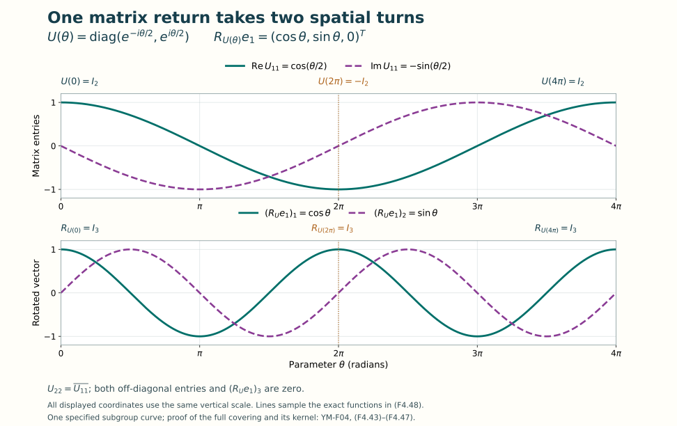

# Lie groups and Lie algebras

Lesson YM-F04 · Geometry and states in Yang–Mills theory

In [Lesson 3](../symmetry-through-matrices.html), matrices described
finite transformations. Now we will describe transformations that vary
smoothly and calculate their derivatives. A finite transformation belongs
to a Lie group. Its possible velocities at the identity form a Lie
algebra. The exponential connects these two objects by an actual curve
of matrices.

We will construct that connection, including the convergence and inverse
maps it needs. The main examples are \(U(1)\), \(SU(2)\) and
\(SU(3)\). Their matrices, real dimensions, generator conventions and
commutators will all be explicit. The rotation example will also show
why an infinitesimal description does not by itself specify every global
identification in a group.

Preparation is Lesson 3 and elementary real calculus: differentiation,
integration, the real exponential and logarithm, sine and cosine, and
completeness of the real numbers. Matrix power series and the local
coordinate arguments used below are proved here. All parameter spaces
and Lie algebras in this lesson are real unless a different ground field
is explicitly given. Matrix entries may still be complex.

## 1. Estimates and determinants we will need

Fix a positive integer \(n\). For an \(n\)-by-\(n\) complex
matrix define the Frobenius norm and trace by

\[
 \|A\|_F=\left(\sum_{j=1}^n\sum_{k=1}^n|A_{jk}|^2\right)^{1/2},
 \qquad \operatorname{tr}A=\sum_{j=1}^n A_{jj}.
 \tag{F4.1}
\]

In particular, \(\|I_n\|_F=\sqrt n\). We retain that value;
this norm does not assign norm one to the identity when \(n>1\).

### Lemma 1.1. Finite-dimensional estimates

For compatible square matrices,

\[
 \begin{aligned}
 \|A+B\|_F&\leq\|A\|_F+\|B\|_F,&
 \|AB\|_F&\leq\|A\|_F\|B\|_F,\\
 \|A^\dagger\|_F&=\|A\|_F,&
 |\operatorname{tr}A|&\leq\sqrt n\,\|A\|_F.
 \end{aligned}
 \tag{F4.2}
\]

**Proof.** First, the inner product of Lesson 3 obeys
\(|\langle v,w\rangle|\leq\|v\|\|w\|\). For \(v\ne0\),
expand the nonnegative quantity

\[
 \left\|w-\frac{\langle v,w\rangle}{\|v\|^2}v\right\|^2
 =\|w\|^2-\frac{|\langle v,w\rangle|^2}{\|v\|^2}.
 \tag{F4.3}
\]

For \(v=0\), the assertion is immediate. Apply this inequality
to arrays of entries to expand \(\|A+B\|_F^2\) and bound its
two cross terms by \(2\|A\|_F\|B\|_F\). Taking square roots
gives the first inequality. For the product, apply it to each row
and column, giving

\[
 \begin{aligned}
 \|AB\|_F^2
 &\leq\sum_{j,k}
       \left(\sum_l|A_{jl}|^2\right)
       \left(\sum_m|B_{mk}|^2\right)\\
 &=\left(\sum_{j,l}|A_{jl}|^2\right)
   \left(\sum_{m,k}|B_{mk}|^2\right).
 \end{aligned}
 \tag{F4.4}
\]

Conjugation and transposition preserve the sum of squared absolute
values. Finally apply the same inner-product inequality to the \(n\)
diagonal entries and the vector of \(n\) ones; the sum of squared
diagonal entries is at most the sum over all entries. \(\square\)

Every matrix entry has absolute value at most \(\|A\|_F\).
Thus an absolutely convergent matrix series converges entry by entry.
It converges in this norm because there are finitely many entries.

### The determinant as a full finite sum

Let \(S_n\) be the set of permutations of \(1,\ldots,n\).
The sign \(\operatorname{sgn}\sigma\) is \((-1)^r\), where
\(r\) is the number of inversions in that permutation. Define

\[
 \det A=\sum_{\sigma\in S_n}(\operatorname{sgn}\sigma)
                  \prod_{j=1}^n A_{j,\sigma(j)}.
 \tag{F4.5}
\]

This agrees with \(ad-bc\) for a two-by-two matrix. Reindexing
the sum by \(\sigma^{-1}\) proves \(\det A^T=\det A\).
It also expresses the determinant as a multilinear function of
its columns. Interchanging two adjacent columns reverses its sign:
reindex the permutations by that interchange, which reverses the
parity of the inversion count. Any column interchange is a product
of an odd number of adjacent interchanges. A matrix with repeated
columns consequently has determinant zero. Finally, \(\det I_n=1\).

These facts prove multiplicativity without omitting any terms. If
\(f\) is any alternating multilinear function of \(n\) columns,
expand each column in the coordinate vectors. Terms with a repeated
coordinate vector vanish. In a remaining term the coordinate vectors
are a permutation of the standard basis, so column interchanges give

\[
 f(v_1,\ldots,v_n)=\det(v_1,\ldots,v_n)f(e_1,\ldots,e_n).
 \tag{F4.6}
\]

Here the coefficient sum is exactly (F4.5), in its column form.
Apply (F4.6) to \(f(v_1,\ldots,v_n)=\det(Av_1,\ldots,Av_n)\).
Its value on the standard basis is \(\det A\), proving

\[
 \det(AB)=\det A\det B,\qquad
 \det A^\dagger=\overline{\det A}.
 \tag{F4.7}
\]

The second identity also follows directly from the real signs in
(F4.5) and the transpose identity.

For a subset \(S\subseteq\{1,\ldots,n\}\), let \(X[S,S]\)
be the submatrix with its rows and columns both in \(S\), in their
original increasing order. Give the empty determinant the value one.
Multilinearity in all columns yields the exact polynomial identity

\[
 \begin{aligned}
 \det(I_n+tX)
 &=\sum_{S\subseteq\{1,\ldots,n\}}t^{|S|}\det X[S,S]\\
 &=1+t\operatorname{tr}X
   +\sum_{\substack{S\subseteq\{1,\ldots,n\}\\|S|\geq2}}
                 t^{|S|}\det X[S,S].
 \end{aligned}
 \tag{F4.8}
\]

To verify the coefficient for a chosen \(S\), use columns from \(X\)
at those positions and identity columns elsewhere. The identity columns
force the complementary rows. Moving the remaining rows and columns
to the same end gives the two identical permutation signs, whose
product is one, and leaves precisely the principal minor in (F4.8).
In particular the derivative of determinant at the identity is trace.

The adjugate has entries
\((\operatorname{adj}A)_{jk}=(-1)^{j+k}\det A[\widehat k,\widehat j]\),
where the hats mean omission of the indicated row and column. Expansion
of (F4.5) along a row gives

\[
 A\operatorname{adj}A=(\operatorname{adj}A)A=(\det A)I_n.
 \tag{F4.9}
\]

For an off-diagonal entry of the first product, that expansion is the
determinant of a matrix with one row repeated, hence zero. The diagonal
entry is the determinant of \(A\). The column expansion proves the
other product. The convention for the empty minor includes \(n=1\).
Consequently \(A\) is invertible exactly when \(\det A\ne0\):
(F4.9) supplies its inverse in that case, and (F4.7) rules out zero
determinant for an invertible matrix.

The entries of the inverse are therefore quotients of polynomials with
nonzero denominator. They are smooth on the open set of invertible
matrices. Here smooth means that every order of partial derivative
exists and is continuous in the real and imaginary matrix entries.

For a differentiable curve \(A(t)\) of invertible matrices, the chain
rule, (F4.7), and the derivative in (F4.8) give

\[
 \frac d{dt}\det A(t)
 =\det A(t)\operatorname{tr}\big(A(t)^{-1}A'(t)\big).
 \tag{F4.10}
\]

Indeed, at a fixed time \(t_0\), factor
\(A(t)=A(t_0)(A(t_0)^{-1}A(t))\). The second factor equals
the identity at \(t_0\) and has derivative \(A(t_0)^{-1}A'(t_0)\).
Applying the ordinary derivative of the finite polynomial (F4.8)
proves (F4.10).

## 2. Constructing the matrix exponential

For every complex square matrix \(X\), define

\[
 \exp X=I_n+\sum_{k=1}^{\infty}\frac{X^k}{k!}.
 \tag{F4.11}
\]

The series is absolutely convergent. To see this, put \(r=\|X\|_F\).
Lemma 1.1 gives \(\|X^k\|_F\leq r^k\) for every \(k\geq1\).
The scalar series \(\sum_{k\geq0}r^k/k!\) converges, since successive
terms have ratio \(r/(k+1)\), at most \(1/2\) for all sufficiently
large \(k\). Its sum is the usual real exponential \(e^r\): on any
bounded real interval the series and its differentiated series converge
uniformly by the same bound, so its derivative equals itself and its
value at zero is one. Multiplication by the ordinary function \(e^{-r}\)
then shows that its sum is \(e^r\).

The corresponding matrix estimates retain the identity contribution:

\[
 \begin{aligned}
 \|\exp X\|_F&\leq\sqrt n+e^r-1,\\
 \|\exp X-I_n\|_F&\leq e^r-1,\\
 \left\|\exp X-\sum_{k=0}^{m}\frac{X^k}{k!}\right\|_F
 &\leq\sum_{k=m+1}^{\infty}\frac{r^k}{k!}
 \leq\frac{r^{m+1}e^r}{(m+1)!}\quad(m\geq0).
 \end{aligned}
 \tag{F4.12}
\]

For the last inequality, write \(k=m+1+j\) and use
\((m+1+j)!\geq(m+1)!j!\). These are bounds on the full
series, which remains (F4.11).

### Lemma 2.1. Differentiation of the exponential

The exponential is smooth in all real matrix coordinates, and

\[
 \frac d{dt}\exp(tX)=X\exp(tX)=\exp(tX)X.
 \tag{F4.13}
\]

**Proof.** For a fixed order \(p\geq1\), differentiating \(X^k\)
in \(p\) specified directions inserts those \(p\) direction matrices
in distinct positions among its \(k\) factors, in every order. There
are \(k!/(k-p)!\) terms when \(k\geq p\), and zero otherwise.
On \(\|X\|_F\leq R\), their norms are bounded in sum by

\[
 \frac{k!}{(k-p)!}R^{k-p}
           \prod_{j=1}^{p}\|H_j\|_F.
 \tag{F4.14}
\]

Zero powers here mean that there are no remaining \(X\) factors,
not an extra identity factor with a silently changed norm. After
division by \(k!\), the scalar majorants sum to
\(e^R\prod_j\|H_j\|_F\). Thus every differentiated series
converges uniformly on a bounded matrix ball.

For completeness, the elementary justification for differentiation of
these limits is the fundamental theorem of calculus on a coordinate
line: write the difference of each finite partial sum at two endpoints
as the integral of its derivative. Uniform convergence lets both the
endpoint values and that integral pass to the limit, since the integral
of an error is bounded by interval length times its uniform bound.
The resulting identity proves the claimed derivative. Repeating this
argument for each derivative order proves smoothness. Differentiating
(F4.11) with \(X\) fixed and \(t\) varying now gives (F4.13), with
the index shift from \(k/k!\) to \(1/(k-1)!\). \(\square\)

If \(XY=YX\), absolute convergence permits multiplication and regrouping
of the two series, and the finite binomial identity gives

\[
 \begin{aligned}
 (\exp X)(\exp Y)
 &=\sum_{m=0}^{\infty}\sum_{j=0}^{m}
          \frac{X^jY^{m-j}}{j!(m-j)!}
   =\sum_{m=0}^{\infty}\frac{(X+Y)^m}{m!}
   =\exp(X+Y).
 \end{aligned}
 \tag{F4.15}
\]

Absolute convergence of the original double sum follows from the product
of the two finite scalar bounds in (F4.12). The commutativity condition
is needed for the binomial step. Taking \(Y=-X\) proves invertibility
and \((\exp X)^{-1}=\exp(-X)\). Entrywise operations in the series
also prove

\[
 (\exp X)^\dagger=\exp(X^\dagger),\qquad
 S(\exp X)S^{-1}=\exp(SXS^{-1})
 \quad(S\text{ invertible}).
 \tag{F4.16}
\]

The curve \(U(t)=\exp(tX)\) is the unique differentiable solution
of \(U'=XU\), \(U(0)=I_n\): for any other solution, the
product \(\exp(-tX)U(t)\) has zero derivative and initial value
\(I_n\). This uses only the product rule and the fundamental theorem
of calculus for each entry.

It is also the unique differentiable one-parameter subgroup with initial
derivative \(X\). A one-parameter subgroup means a map \(U:\mathbb R\to
\operatorname{GL}_n(\mathbb C)\) satisfying \(U(t+s)=U(t)U(s)\)
and \(U(0)=I_n\). Differentiating that identity in \(s\) at zero gives
\(U'(t)=U(t)X\); differentiating in the other order gives
\(U'(t)=XU(t)\). The uniqueness just proved applies.

For \(n=1\), the series \(\exp(i\theta)\) agrees with the phase
notation from Lesson 3. Both it and \(\cos\theta+i\sin\theta\)
solve \(u'=iu\), \(u(0)=1\). The uniqueness proof therefore gives
\(\exp(i\theta)=\cos\theta+i\sin\theta\) for every real \(\theta\).

Finally, apply (F4.10) and (F4.13) to \(f(t)=\det\exp(tX)\).
They give \(f'(t)=(\operatorname{tr}X)f(t)\) and \(f(0)=1\).
The scalar complex exponential is the case \(n=1\) of (F4.11),
so the same product-rule uniqueness proof gives

\[
 \det\exp(tX)=\exp\big(t\operatorname{tr}X\big)
 \qquad(t\in\mathbb R).
 \tag{F4.17}
\]

This proves the determinant identity from its full finite and infinite
sums; it uses no diagonalization theorem.

## 3. Logarithms and actual local coordinates

For \(\|B\|_F<1\), define

\[
 \log(I_n+B)=\sum_{k=1}^{\infty}
                  \frac{(-1)^{k+1}}{k}B^k.
 \tag{F4.18}
\]

Writing \(r=\|B\|_F\), absolute convergence and the bound are

\[
 \|\log(I_n+B)\|_F
 \leq\sum_{k=1}^{\infty}\frac{r^k}{k}
 \leq\frac{r}{1-r}.
 \tag{F4.19}
\]

On a ball of radius \(R<1\), the order-\(p\) differentiated terms
have scalar majorants
\((k-1)!R^{k-p}/(k-p)!\) times the norms of the direction
matrices, for \(k\geq p\geq1\). Their successive-term ratios
tend to \(R<1\), so they sum to a finite number. The uniform
derivative argument in Lemma 2.1 therefore proves smoothness of
(F4.18) on this open ball.

The finite geometric identity

\[
 (I_n+B)\sum_{j=0}^{N}(-B)^j
 =\left(\sum_{j=0}^{N}(-B)^j\right)(I_n+B)
 =I_n-(-B)^{N+1}
 \tag{F4.20}
\]

and \(\|B\|_F<1\) show that the limit of these partial sums
is the two-sided inverse of \(I_n+B\). If \(B(t)\) commutes
with \(B'(t)\) and stays inside this ball, differentiation of all
terms in (F4.18) consequently gives

\[
 \frac d{dt}\log(I_n+B(t))=(I_n+B(t))^{-1}B'(t).
 \tag{F4.21}
\]

For a general matrix curve the factors need not commute, and the
order-\(1\) insertion sum from (F4.14) must instead be used.

### Theorem 3.1. Exact inverse identities

The logarithm and exponential satisfy

\[
 \begin{aligned}
 \exp\big(\log(I_n+B)\big)&=I_n+B&&\text{if }\|B\|_F<1,\\
 \log(\exp X)&=X&&\text{if }\|X\|_F<\log2.
 \end{aligned}
 \tag{F4.22}
\]

**Proof.** For the first statement put \(Y(t)=\log(I_n+tB)\),
\(0\leq t\leq1\). Equation (F4.21) gives
\(Y'(t)=(I_n+tB)^{-1}B\). Both \(Y(t)\) and \(Y'(t)\)
are convergent expressions in the same matrix \(B\), so they commute.
The differentiated exponential series therefore gives
\((\exp(-Y))'=-Y'\exp(-Y)\). It follows that
\(\exp(-Y(t))(I_n+tB)\) has zero derivative and initial value
\(I_n\). Multiply by \(\exp Y(t)\) and set \(t=1\).

For the second statement, (F4.12) gives
\(\|\exp(tX)-I_n\|_F\leq e^{t\|X\|_F}-1<1\) throughout
\(0\leq t\leq1\). The curve \(B(t)=\exp(tX)-I_n\) commutes
with its derivative. Equation (F4.21) thus makes
\(\frac d{dt}\log\exp(tX)=X\). Its value at zero is zero,
and integration gives the result. \(\square\)

### Smooth groups in matrix coordinates

An open set in a real coordinate space contains a ball about each
of its points. A local coordinate chart on a subset of matrix space
is a continuous bijection from an open set in \(\mathbb R^d\)
onto a relatively open part of that subset, with continuous inverse.
A smooth manifold is a Hausdorff space with a countable base of open
sets and a covering by such charts whose coordinate transition maps
are smooth. The charts we construct inherit the first two properties
from finite-dimensional matrix space: distinct matrices have disjoint
small balls, and balls with rational centres and radii give a countable
base before restriction to the subset.

A real Lie group is a smooth manifold with a group operation such that
multiplication and inversion are smooth in its charts. The next proof
constructs those charts for the groups used here.

Define

\[
 \begin{aligned}
 U(n)&=\{U\in M_n(\mathbb C):U^\dagger U=I_n\},\\
 SU(n)&=\{U\in U(n):\det U=1\},\\
 O(n)&=\{R\in M_n(\mathbb R):R^TR=I_n\},\\
 SO(n)&=\{R\in O(n):\det R=1\}.
 \end{aligned}
 \tag{F4.23}
\]

These are groups: Lesson 3 proves the unitary and orthogonal assertions,
and (F4.7) shows that determinant one is preserved by products and inverses.
Their candidate coordinate spaces are the following real vector spaces:

\[
 \begin{aligned}
 \mathfrak u(n)&=\{X:X^\dagger=-X\},\\
 \mathfrak{su}(n)&=\{X:X^\dagger=-X,\ \operatorname{tr}X=0\},\\
 \mathfrak{so}(n)&=\{X\in M_n(\mathbb R):X^T=-X\}.
 \end{aligned}
 \tag{F4.24}
\]

The coefficients in their linear combinations are real. Multiplication
by \(i\) generally changes a nonzero skew-Hermitian matrix into a
Hermitian matrix, so \(\mathfrak u(n)\) and \(\mathfrak{su}(n)\)
are not being described as complex vector subspaces.

### Theorem 3.2. Explicit charts and dimensions

The groups in (F4.23) are real Lie groups. Their dimensions are

\[
 \dim U(n)=n^2,\qquad \dim SU(n)=n^2-1,\qquad
 \dim O(n)=\dim SO(n)=\frac{n(n-1)}2.
 \tag{F4.25}
\]

**Proof.** If \(X^\dagger=-X\), (F4.15)–(F4.16) show that
\((\exp X)^\dagger\exp X=\exp(-X)\exp X=I_n\).
If also \(\operatorname{tr}X=0\), (F4.17) gives determinant
one. For real skew-symmetric \(X\), the exponential is real and
orthogonal, and its zero trace again gives determinant one. Thus
each space in (F4.24) exponentiates into its stated group, with
\(\mathfrak{so}(n)\) serving both orthogonal groups.

For the converse near the identity, use the explicit positive constants

\[
 r_n=\frac1{8\sqrt n+1},\qquad
 \delta_n=\frac1{8\sqrt n},\qquad
 \frac{r_n}{1-r_n}=\delta_n<\log2.
 \tag{F4.26}
\]

The last inequality follows, for example, from
\(\log2=\int_1^2 ds/s\geq1/2>1/8\).
If \(U\in U(n)\) and \(\|U-I_n\|_F<r_n\), put \(A=\log U\).
Equation (F4.19) gives \(\|A\|_F<\delta_n\). Taking adjoints
term by term gives \(A^\dagger=\log(U^\dagger)\); this
logarithm exists since \(\|U^\dagger-I_n\|_F=\|U-I_n\|_F\).
Also \(U^\dagger=U^{-1}=\exp(-A)\) by (F4.22) and
(F4.15). Applying the second identity in (F4.22) to \(-A\)
proves \(A^\dagger=-A\).

If \(U\in SU(n)\), then \(\exp(\operatorname{tr}A)=1\)
by (F4.17). Its trace is purely imaginary and satisfies
\(|\operatorname{tr}A|\leq\sqrt n\|A\|_F<1/8\).
An imaginary number whose exponential is one belongs to
\(2\pi i\mathbb Z\), by the phase periodicity in Lesson 3.
The bound therefore forces \(\operatorname{tr}A=0\).
For real orthogonal \(U\), the logarithm series is real and the
adjoint argument makes it skew-symmetric. Its trace is zero
automatically. This also proves that an orthogonal matrix in this
neighborhood has determinant one.

For the appropriate space \(\mathfrak g\) in (F4.24), set

\[
 \begin{aligned}
 V_G&=\{X\in\mathfrak g:\|X\|_F<\delta_n,
                      \ \|\exp X-I_n\|_F<r_n\},\\
 N_G&=\{U\in G:\|U-I_n\|_F<r_n\}.
 \end{aligned}
 \tag{F4.27}
\]

The set \(V_G\) is open in the indicated real vector space and
contains zero. The preceding estimates and (F4.22) prove that
\(\exp:V_G\to N_G\) and \(\log:N_G\to V_G\) are inverse
smooth maps. These are actual mutually inverse domains, including
the group constraints and all size conditions.

For every \(g_0\in G\), the chart \(X\mapsto g_0\exp X\)
maps \(V_G\) onto the relatively open set \(g_0N_G\). These sets
cover the group. On an overlap the coordinate transition is
\(X\mapsto\log(g_1^{-1}g_0\exp X)\), a composition of the
smooth maps already proved. Matrix multiplication is a polynomial
in its entries, and inverse is smooth by (F4.9). Expressing them
between these charts proves smooth group operations.

It remains to count real coordinates. In a skew-Hermitian matrix,
each diagonal entry is one imaginary parameter and each pair of
off-diagonal entries is determined by one arbitrary complex number.
There are \(n+2\binom n2=n^2\) parameters. Trace zero imposes
one real linear equation on the diagonal parameters, leaving \(n^2-1\).
For a real skew-symmetric matrix the diagonal is zero and there is
one real parameter for each pair of distinct indices, giving
\(\binom n2\). These descriptions also provide bases and hence
linear identifications with the real coordinate spaces required
by the charts. For \(n=1\), the zero-dimensional groups \(SU(1)\)
and \(SO(1)\) are singletons, while \(O(1)=\{1,-1\}\) has two
singleton charts. \(\square\)

All four groups are compact. Their defining equations are closed
conditions, and every column has squared length one, so their entries
are bounded in finite-dimensional real coordinate space. Here is the
finite-dimensional compactness fact being used. A closed bounded subset
is contained in a closed cube. If an open cover of that cube had no
finite subcover, divide it into finitely many half-sized cubes and
select one without a finite subcover, repeatedly. Completeness gives
a common point of the nested cubes. An open member covering that
point contains a ball about it, and the shrinking cube diameter
eventually puts a selected cube wholly inside that member, a contradiction.
For a closed subset of the cube, add its open complement to a cover
and then remove that extra member from the resulting finite subcover.
This proves compactness in the sense of the finite-subcover property.

## 4. Tangent generators and the Lie bracket

A tangent velocity at \(U\in G\) is the entrywise derivative \(V'(0)\)
of a differentiable curve \(V(t)\in G\) with \(V(0)=U\), on an
open interval containing zero. The charts above make this the ordinary
notion of tangent vector on a manifold.

### Theorem 4.1. Every allowed velocity is realized

For \(U(n)\), \(SU(n)\) and either orthogonal group, the tangent
velocities at the identity are exactly their respective spaces in
(F4.24). At \(U\in G\), all tangent velocities are

\[
 T_UG=\{UX:X\in\mathfrak g\}.
 \tag{F4.28}
\]

**Proof.** Differentiate \(V(t)^\dagger V(t)=I_n\) at \(t=0\)
when \(V(0)=I_n\). With \(X=V'(0)\), this gives
\(X^\dagger+X=0\). If the determinant is one along the curve,
(F4.10) gives \(\operatorname{tr}X=0\). A real matrix curve has
real derivative, giving the orthogonal condition.

Conversely, for every matrix satisfying the corresponding equations,
\(V(t)=\exp(tX)\) stays in the group by the proof of Theorem 3.2,
and (F4.13) gives \(V'(0)=X\). At a general point \(U\),
differentiate the curve \(U^{-1}V(t)\) to get
\(U^{-1}V'(0)\in\mathfrak g\). The curve \(U\exp(tX)\) realizes
every velocity \(UX\). This proves both inclusions in (F4.28).
\(\square\)

The commutator closes on these tangent spaces. If \(X^\dagger=-X\)
and \(Y^\dagger=-Y\), then

\[
 [X,Y]^\dagger
 =Y^\dagger X^\dagger-X^\dagger Y^\dagger
 =YX-XY=-[X,Y].
 \tag{F4.29}
\]

Real matrices remain real. Also

\[
 \operatorname{tr}(XY)=\sum_{j,k}X_{jk}Y_{kj}
                     =\operatorname{tr}(YX),
 \qquad \operatorname{tr}[X,Y]=0.
 \tag{F4.30}
\]

The commutator is real bilinear and alternating. Its Jacobi identity
has the complete twelve-term expansion in Lesson 3, (F3.24)–(F3.25).
A real vector space with a bilinear alternating bracket satisfying
that identity is a real Lie algebra. Thus (F4.24), with
\([X,Y]=XY-YX\), are Lie algebras.

### Why this bracket belongs to the group geometry

The vector field generated by \(X\) through left translation is
\(\mathcal X(U)=UX\). It is tangent by (F4.28) and is left invariant:
the derivative of \(U\mapsto gU\) sends \(UX\) to \(gUX\).

For smooth vector fields \(V,W\), their bracket is the differential
operator \(f\mapsto V(Wf)-W(Vf)\). In local coordinates, the full
product rule gives

\[
 \begin{aligned}
 V(Wf)-W(Vf)
 &=\sum_{a,b}
       \big(V^a\partial_a W^b-W^a\partial_a V^b\big)\partial_bf\\
 &\quad+\sum_{a,b}(V^aW^b-W^aV^b)\partial_a\partial_bf\\
 &=\sum_b\big((DW)V-(DV)W\big)^b\partial_bf.
 \end{aligned}
 \tag{F4.31}
\]

The second-derivative sum is zero because its coefficient reverses
sign under \(a\leftrightarrow b\), while the mixed partial derivatives
agree. For the matrix fields, \(D\mathcal Y(H)=HY\) and
\(D\mathcal X(H)=HX\). Consequently their bracket at \(U\) is
\((UX)Y-(UY)X=U[X,Y]\). Thus the matrix bracket is exactly the
bracket of the group's left-invariant vector fields.

There is also a finite transformation calculation. Set

\[
 C(s,t)=\exp(sX)\exp(tY)\exp(-sX)\exp(-tY).
 \tag{F4.32}
\]

Its values on both coordinate axes are \(I_n\). Differentiation gives

\[
 \partial_tC(s,0)=\exp(sX)Y\exp(-sX)-Y,\qquad
 \partial_s\partial_tC(0,0)=XY-YX.
 \tag{F4.33}
\]

No omitted remainder is needed to state its leading effect: the
fundamental theorem of calculus twice gives the exact identity

\[
 C(s,t)-I_n
 =\int_0^s\int_0^t\partial_u\partial_vC(u,v)\,dv\,du.
 \tag{F4.34}
\]

The integral of the constant matrix \([X,Y]\) is \(st[X,Y]\).
Subtracting it from (F4.34) leaves the same integral with integrand
\(\partial_u\partial_vC(u,v)-[X,Y]\). Its norm divided by
\(|st|\) is bounded by the maximum norm of that integrand on the
rectangle between the endpoints, which tends to zero as \(s,t\to0\).
Hence \((C(s,t)-I_n)/(st)\to[X,Y]\) whenever \(st\ne0\).
This specifies exactly how the infinitesimal bracket measures the
difference between two orders of finite transformations.

## 5. The circle and its global period

For \(U(1)\), the tangent space is \(i\mathbb R\), and its
bracket is zero because scalar multiplication commutes. The exponential
and its equality condition are

\[
 \exp(i\theta)=\cos\theta+i\sin\theta,\qquad
 \exp(i\theta)=\exp(i\eta)
 \ \Longleftrightarrow\ \theta-\eta\in2\pi\mathbb Z.
 \tag{F4.35}
\]

Thus the real-line parameter and the circle have the same local
coordinate dimension, but the exponential identifies parameters
differing by \(2\pi m\). The entire identification is present in
(F4.35), beyond the derivative at zero.

For any real \(\nu\), the real-linear map
\(i\alpha\mapsto i\nu\alpha\) is a Lie-algebra homomorphism
\(i\mathbb R\to i\mathbb R\): both brackets are zero.
It is the derivative of a differentiable circle homomorphism exactly
when \(\nu\) is an integer.

To prove necessity, compose such a homomorphism with
\(\theta\mapsto e^{i\theta}\). This is a differentiable one-parameter
subgroup with initial derivative \(i\nu\), so Section 2 forces it to
be \(e^{i\nu\theta}\). The inputs at zero and \(2\pi\) agree,
which forces \(e^{2\pi i\nu}=1\), or \(\nu\in\mathbb Z\).
For sufficiency, Lesson 3's homomorphism \(z\mapsto z^m\), \(m\in
\mathbb Z\), differentiates to \(i\alpha\mapsto im\alpha\).
This is a complete period test, with both directions proved.

## 6. \(SU(2)\), its generators and ordinary rotations

The equations \(U^\dagger U=I_2\) and \(\det U=1\) imply
\(U^{-1}=U^\dagger\). Compare the two-by-two adjugate formula
with \(U^\dagger\). This gives exactly

\[
 U=\begin{pmatrix}a&b\\-\overline b&\overline a\end{pmatrix},
 \qquad |a|^2+|b|^2=1.
 \tag{F4.36}
\]

Conversely multiplication of this matrix by its adjoint gives
\((|a|^2+|b|^2)I_2\), and its determinant is the same scalar.
Thus (F4.36) is both necessary and sufficient.

Introduce the Pauli matrices

\[
 \sigma_1=\begin{pmatrix}0&1\\1&0\end{pmatrix},\qquad
 \sigma_2=\begin{pmatrix}0&-i\\i&0\end{pmatrix},\qquad
 \sigma_3=\begin{pmatrix}1&0\\0&-1\end{pmatrix}.
 \tag{F4.37}
\]

For \(a_0,a_1,a_2,a_3\in\mathbb R\), the same group element is

\[
 U=a_0I_2-i\sum_{j=1}^3a_j\sigma_j
  =\begin{pmatrix}
    a_0-ia_3&-a_2-ia_1\\
    a_2-ia_1&a_0+ia_3
   \end{pmatrix},
 \qquad a_0^2+a_1^2+a_2^2+a_3^2=1.
 \tag{F4.38}
\]

This identifies \(SU(2)\) with the three-dimensional sphere in
\(\mathbb R^4\) by a map and inverse linear in the real matrix
coordinates. The source coordinates in (F4.36) are
\(a=a_0-ia_3\), \(b=-a_2-ia_1\); their squared absolute values
give exactly the equation in (F4.38).

Direct multiplication gives all nine Pauli products:

| Left factor | Right factor \(\sigma_1\) | Right factor \(\sigma_2\) | Right factor \(\sigma_3\) |
| --- | --- | --- | --- |
| \(\sigma_1\) | \(I_2\) | \(i\sigma_3\) | \(-i\sigma_2\) |
| \(\sigma_2\) | \(-i\sigma_3\) | \(I_2\) | \(i\sigma_1\) |
| \(\sigma_3\) | \(i\sigma_2\) | \(-i\sigma_1\) | \(I_2\) |

Equivalently, with \(\epsilon_{123}=1\), full antisymmetry and zero
when indices repeat,

\[
 \sigma_a\sigma_b=\delta_{ab}I_2+
                    i\sum_{c=1}^3\epsilon_{abc}\sigma_c.
 \tag{F4.39}
\]

Our anti-Hermitian generator convention and its exact factors are

\[
 T_a=-\frac i2\sigma_a,\qquad
 [T_a,T_b]=\sum_{c=1}^3\epsilon_{abc}T_c,\qquad
 \operatorname{tr}(T_aT_b)=-\frac12\delta_{ab}.
 \tag{F4.40}
\]

These identities follow by inserting both factors \(-i/2\) in
(F4.39) and subtracting the reverse product for the bracket. The
identity matrix has trace two and the three Pauli matrices have
trace zero, giving the last equality. The three \(T_a\) are a
real basis of \(\mathfrak{su}(2)\): the diagonal imaginary entry
and the real and imaginary parts of the upper off-diagonal entry
are recovered independently. Explicitly, for

\[
 X=\begin{pmatrix}i\alpha&z\\-\overline z&-i\alpha\end{pmatrix},
 \qquad
 X=\sum_{a=1}^3\omega_aT_a,\quad
 (\omega_1,\omega_2,\omega_3)
   =(-2\operatorname{Im}z,-2\operatorname{Re}z,-2\alpha).
 \tag{F4.41}
\]

Each coefficient also equals \(-2\operatorname{tr}(T_aX)\), by
(F4.40). This is a full coordinate dictionary, including its signs.

For \(\omega=(\omega_1,\omega_2,\omega_3)\), put
\(\rho=(\omega_1^2+\omega_2^2+\omega_3^2)^{1/2}\). The antisymmetric
terms in (F4.39) cancel in the square, giving
\(X^2=-(\rho^2/4)I_2\). Separating the absolutely convergent
series (F4.11) into its even and odd powers proves

\[
 \exp(sX)=
 \begin{cases}
 \displaystyle\cos\!\left(\frac{s\rho}{2}\right)I_2
       +\frac{2\sin(s\rho/2)}{\rho}X,&\rho>0,\\[6pt]
 I_2,&\rho=0.
 \end{cases}
 \tag{F4.42}
\]

Here \(s\in\mathbb R\). No factor of two or magnitude of the
original coefficient vector has been absorbed into \(X\).

Every element (F4.38) is an exponential. If
\(a=(a_1,a_2,a_3)\ne0\), choose \(\theta\in(0,2\pi)\) with
\(\cos(\theta/2)=a_0\) and \(\sin(\theta/2)=|a|\), and set
\(\omega=\theta a/|a|\). Formula (F4.42) at \(s=1\) gives
exactly (F4.38). If \(a=0,a_0=1\), use \(X=0\); if
\(a=0,a_0=-1\), use \(X=2\pi T_3\). In particular the paths
\(s\mapsto\exp(sX)\), \(0\leq s\leq1\), join the identity
to every group element.

### The exact map to three-dimensional rotations

Write \(v\cdot\sigma=\sum_{j=1}^3v_j\sigma_j\) for
\(v\in\mathbb R^3\). This is a real-linear bijection onto the
Hermitian trace-zero matrices. Conjugation by \(U\in SU(2)\)
preserves that space, so it defines a unique real-linear map \(R_U\)
by

\[
 U(v\cdot\sigma)U^{-1}=(R_Uv)\cdot\sigma.
 \tag{F4.43}
\]

This equation proves \(R_{UV}=R_UR_V\) with the indicated order.
For \(U=a_0I_2-i\,a\cdot\sigma\), (F4.39) expands it completely:

\[
 R_Uv=(a_0^2-|a|^2)v+2a(a\cdot v)+2a_0(a\times v).
 \tag{F4.44}
\]

To verify the expansion, (F4.39) first gives
\((a\cdot\sigma)(v\cdot\sigma)=(a\cdot v)I_2+
i(a\times v)\cdot\sigma\). The two cross terms in the conjugation
product sum to \(2a_0(a\times v)\cdot\sigma\), and the quadratic
term is
\((a\cdot\sigma)(v\cdot\sigma)(a\cdot\sigma)
=(2a(a\cdot v)-|a|^2v)\cdot\sigma\).
The latter equality follows by a second use of (F4.39), or by
expanding its three components with \(\epsilon_{abc}\). In that
expansion the vector identity is
\((a\times v)\times a=|a|^2v-(a\cdot v)a\), obtained by the
same paired epsilon sums as the vector identities of Lesson 2.

The trace formula
\(\tfrac12\operatorname{tr}((v\cdot\sigma)(w\cdot\sigma))
=v\cdot w\), again from (F4.39), proves that \(R_U\) is orthogonal:
conjugation preserves the trace of a product. Its determinant is one.
Indeed \(U\) has an exponential path from the identity; the corresponding
determinant is a continuous function with values in \(\{1,-1\}\),
since orthogonality squares it to one by (F4.7). A continuous function
on an interval cannot change between those two values without taking
an intermediate value. It starts at one.

For a unit vector \(u\) and
\(U=\cos(\theta/2)I_2-i\sin(\theta/2)u\cdot\sigma\), (F4.44) becomes

\[
 R_Uv=\cos\theta\,v+(1-\cos\theta)u(u\cdot v)
                         +\sin\theta\,(u\times v).
 \tag{F4.45}
\]

This fixes \(u\) and rotates its perpendicular plane through angle
\(\theta\), with the orientation specified by the cross product.

Every \(R\in SO(3)\) arises in this way. Here is an elementary
axis argument that avoids assuming a matrix spectral theorem.
Determinant multiplicativity and \(R^{-1}=R^T\) give

\[
 \det(R-I_3)
 =\det R\,\det(I_3-R^{-1})
 =\det(I_3-R^T)
 =\det(I_3-R)
 =-\det(R-I_3).
 \tag{F4.46}
\]

Thus \(R-I_3\) is singular. The real version of Lesson 3,
Lemma 2.1, supplies a nonzero real kernel vector, which gives a
unit axis \(u\) after division by its positive length. Its perpendicular
plane is invariant, because
\(u\cdot Rv=(R^{-1}u)\cdot v=u\cdot v\).
Choose a unit \(v\) perpendicular to \(u\) and put \(w=u\times v\).
Such a \(v\) is obtained by projecting a coordinate vector not parallel
to \(u\) onto that plane and dividing by its nonzero length; the
coordinate cross-product identities show that \(u,v,w\) are an
orthonormal basis. In this basis \(R\) is the direct sum of one and
an orthogonal two-by-two matrix with determinant one. Lesson 3 proves
that this planar block is a rotation by an angle \(\theta\).
Equation (F4.45) realizes exactly this \(R\).

The kernel of \(U\mapsto R_U\) is \(\{I_2,-I_2\}\).
An element in the kernel commutes with every \(v\cdot\sigma\).
Commuting with \(\sigma_3\) forces it to be diagonal; commuting
also with \(\sigma_1\) forces the two diagonal entries to coincide.
Unitarity and determinant one make that common value \(1\) or \(-1\).
Conversely these two matrices commute with all matrices. Consequently
every \(R\in SO(3)\) has exactly two preimages, \(U\) and \(-U\).

This is a smooth double covering, and that assertion also has explicit
local inverses. Taking trace and antisymmetric entries in (F4.44) gives

\[
 \begin{aligned}
 \operatorname{tr}R_U&=4a_0^2-1,\\
 (R_U)_{32}-(R_U)_{23}&=4a_0a_1,\\
 (R_U)_{13}-(R_U)_{31}&=4a_0a_2,\\
 (R_U)_{21}-(R_U)_{12}&=4a_0a_3.
 \end{aligned}
 \tag{F4.47}
\]

On the open set \(\{R:\operatorname{tr}R>-1\}\) about the identity,
choose \(a_0=\tfrac12\sqrt{1+\operatorname{tr}R}>0\), and recover
the three \(a_j\) by dividing the indicated differences by \(4a_0\).
Surjectivity and the two-element fibres already proved show that this
is the unique positive-\(a_0\) lift. The other lift is its negative.
Both formulas are smooth there, and their images are the disjoint open
sets \(a_0>0\) and \(a_0<0\) in the preimage. Translating this
description by any \(R_0\), with either selected lift \(U_0\),
gives two such sheets near every \(R_0\). This is precisely the
local two-sheet definition of a smooth covering.

For the specific curve \(U(\theta)=\exp(\theta T_3)\), the full
matrices and the action on \(e_1=(1,0,0)^T\) are

\[
 U(\theta)=
 \begin{pmatrix}e^{-i\theta/2}&0\\0&e^{i\theta/2}\end{pmatrix},
 \qquad
 R_{U(\theta)}e_1=(\cos\theta,\sin\theta,0)^T.
 \tag{F4.48}
\]

At \(\theta=2\pi\), the first matrix is \(-I_2\) while the
spatial rotation is the identity. At \(\theta=4\pi\), both are
the identity. The half-angle in the matrix exponential and the
two-element kernel describe the same exact phenomenon.

*Figure 1. The curve (F4.48), with its parameter from zero to
\(4\pi\). The upper panel gives both real coordinates of \(U_{11}\);
\(U_{22}=\overline{U_{11}}\) and the off-diagonal entries are zero.
The lower panel gives the first two coordinates of \(R_Ue_1\);
the third coordinate remains zero. This is one specified subgroup
curve, not a drawing of the whole three-dimensional groups.
Proofs and every factor: (F4.42)–(F4.48).*

## 7. The eight directions of \(SU(3)\)

By (F4.23), \(SU(3)\) acts on \(\mathbb C^3\) by unitary
three-by-three matrices with determinant one. Its tangent algebra is
the real eight-dimensional space of skew-Hermitian trace-zero matrices.
A standard Hermitian basis used to describe it consists of the
Gell-Mann matrices. We specify the complete matrices:

\[
 \begin{aligned}
 \lambda_1&=\begin{pmatrix}0&1&0\\1&0&0\\0&0&0\end{pmatrix},&
 \lambda_2&=\begin{pmatrix}0&-i&0\\i&0&0\\0&0&0\end{pmatrix},&
 \lambda_3&=\begin{pmatrix}1&0&0\\0&-1&0\\0&0&0\end{pmatrix},\\
 \lambda_4&=\begin{pmatrix}0&0&1\\0&0&0\\1&0&0\end{pmatrix},&
 \lambda_5&=\begin{pmatrix}0&0&-i\\0&0&0\\i&0&0\end{pmatrix}.
 \end{aligned}
 \tag{F4.49}
\]

\[
 \lambda_6=\begin{pmatrix}0&0&0\\0&0&1\\0&1&0\end{pmatrix},\qquad
 \lambda_7=\begin{pmatrix}0&0&0\\0&0&-i\\0&i&0\end{pmatrix},\qquad
 \lambda_8=\frac1{\sqrt3}
        \begin{pmatrix}1&0&0\\0&1&0\\0&0&-2\end{pmatrix}.
 \tag{F4.50}
\]

Write \(T_a^{(3)}=-i\lambda_a/2\), \(1\leq a\leq8\). The
superscript records their three-dimensional defining representation,
keeping them distinct from the two-by-two \(T_a\) of Section 6.
The factor \(1/\sqrt3\) in \(\lambda_8\) and both factors
\(-i/2\) in each product give

\[
 \operatorname{tr}(\lambda_a\lambda_b)=2\delta_{ab},
 \qquad
 \operatorname{tr}(T_a^{(3)}T_b^{(3)})=-\frac12\delta_{ab}.
 \tag{F4.51}
\]

Here is a direct verification of all pairings. Each off-diagonal
matrix has support on one unordered pair of indices. Matrices
supported on distinct pairs have zero trace pairing, since a diagonal
entry of their product would require both opposite positions to lie
in the same pair. On one pair, the real and imaginary matrices
square to a diagonal matrix with two ones and have opposite imaginary
diagonal entries in their mutual product, of trace zero. A diagonal
matrix pairs to zero with every off-diagonal matrix. Finally
\(\operatorname{tr}\lambda_3^2=2\),
\(\operatorname{tr}\lambda_8^2=(1+1+4)/3=2\), and
\(\operatorname{tr}(\lambda_3\lambda_8)=(1-1+0)/\sqrt3=0\).
This covers all pairs and proves (F4.51).

For a general element of \(\mathfrak{su}(3)\), write

\[
 X=\begin{pmatrix}
 i\alpha_1&z_{12}&z_{13}\\
 -\overline z_{12}&i\alpha_2&z_{23}\\
 -\overline z_{13}&-\overline z_{23}&-i(\alpha_1+\alpha_2)
 \end{pmatrix}.
 \tag{F4.52}
\]

The \(\alpha_j\) are real and the three \(z_{jk}\) are arbitrary
complex numbers. Its exact basis coefficients in
\(X=\sum_{a=1}^8x_aT_a^{(3)}\) are

\[
 \begin{aligned}
 x_1&=-2\operatorname{Im}z_{12},&
 x_2&=-2\operatorname{Re}z_{12},&
 x_3&=\alpha_2-\alpha_1,\\
 x_4&=-2\operatorname{Im}z_{13},&
 x_5&=-2\operatorname{Re}z_{13},&
 x_8&=-\sqrt3(\alpha_1+\alpha_2),\\
 x_6&=-2\operatorname{Im}z_{23},&
 x_7&=-2\operatorname{Re}z_{23}.&&
 \end{aligned}
 \tag{F4.53}
\]

To verify the diagonal part, its entries from \(x_3,x_8\) are
\(-ix_3/2-ix_8/(2\sqrt3)\),
\(ix_3/2-ix_8/(2\sqrt3)\), and \(ix_8/\sqrt3\).
Substitution gives precisely the three entries in (F4.52).
The displayed off-diagonal pairs give the other six entries directly.
Thus the matrices span the whole algebra; their trace pairings prove
independence. Equivalently, every coefficient is recovered by
\(x_a=-2\operatorname{tr}(T_a^{(3)}X)\).

### All independent brackets

For matrix units \(E_{jk}\), whose only nonzero entry is one at
\((j,k)\), entrywise multiplication proves

\[
 E_{jk}E_{lm}=\delta_{kl}E_{jm},\qquad
 [E_{jk},E_{lm}]=\delta_{kl}E_{jm}-\delta_{mj}E_{lk}.
 \tag{F4.54}
\]

Writing every matrix in (F4.49)–(F4.50) in these units gives the
following full table. It includes all \(28\) pairs \(a<b\).
The diagonal brackets are zero and reversing a pair changes its sign.

| \(a,b\) | \([T_a^{(3)},T_b^{(3)}]\) |
| --- | --- |
| \(1,2\) | \(T_3^{(3)}\) |
| \(1,3\) | \(-T_2^{(3)}\) |
| \(1,4\) | \(\tfrac12T_7^{(3)}\) |
| \(1,5\) | \(-\tfrac12T_6^{(3)}\) |
| \(1,6\) | \(\tfrac12T_5^{(3)}\) |
| \(1,7\) | \(-\tfrac12T_4^{(3)}\) |
| \(1,8\) | \(0\) |
| \(2,3\) | \(T_1^{(3)}\) |
| \(2,4\) | \(\tfrac12T_6^{(3)}\) |
| \(2,5\) | \(\tfrac12T_7^{(3)}\) |
| \(2,6\) | \(-\tfrac12T_4^{(3)}\) |
| \(2,7\) | \(-\tfrac12T_5^{(3)}\) |
| \(2,8\) | \(0\) |
| \(3,4\) | \(\tfrac12T_5^{(3)}\) |
| \(3,5\) | \(-\tfrac12T_4^{(3)}\) |
| \(3,6\) | \(-\tfrac12T_7^{(3)}\) |
| \(3,7\) | \(\tfrac12T_6^{(3)}\) |
| \(3,8\) | \(0\) |
| \(4,5\) | \(\tfrac12T_3^{(3)}+\tfrac{\sqrt3}{2}T_8^{(3)}\) |
| \(4,6\) | \(\tfrac12T_2^{(3)}\) |
| \(4,7\) | \(\tfrac12T_1^{(3)}\) |
| \(4,8\) | \(-\tfrac{\sqrt3}{2}T_5^{(3)}\) |
| \(5,6\) | \(-\tfrac12T_1^{(3)}\) |
| \(5,7\) | \(\tfrac12T_2^{(3)}\) |
| \(5,8\) | \(\tfrac{\sqrt3}{2}T_4^{(3)}\) |
| \(6,7\) | \(-\tfrac12T_3^{(3)}+\tfrac{\sqrt3}{2}T_8^{(3)}\) |
| \(6,8\) | \(-\tfrac{\sqrt3}{2}T_7^{(3)}\) |
| \(7,8\) | \(\tfrac{\sqrt3}{2}T_6^{(3)}\) |

For clarity, the table can be checked from a single entry formula that
retains every summand. If
\([T_a^{(3)},T_b^{(3)}]=\sum_c f_{ab}{}^cT_c^{(3)}\), the coordinate
recovery proved above gives

\[
 \begin{aligned}
 f_{ab}{}^c
 &=-2\operatorname{tr}\big([T_a^{(3)},T_b^{(3)}]T_c^{(3)}\big)\\
 &=-\frac i4\sum_{j,k,l=1}^{3}
   \big((\lambda_a)_{jk}(\lambda_b)_{kl}
       -(\lambda_b)_{jk}(\lambda_a)_{kl}\big)(\lambda_c)_{lj}.
 \end{aligned}
 \tag{F4.55}
\]

This follows because \((-i/2)^3=i/8\). It proves that checking
these coefficients checks every matrix entry, since the basis spans.
For example, \([\lambda_1,\lambda_4]=E_{23}-E_{32}=i\lambda_7\),
so multiplying by \((-i/2)^2=-1/4\) gives the \(1,4\) entry.
Also \([\lambda_4,\lambda_5]=2i(E_{11}-E_{33})\). Since
\(E_{11}-E_{33}=(\lambda_3+\sqrt3\lambda_8)/2\), this gives
the \(4,5\) entry with both coefficients. Formula (F4.54), applied
to each of the explicitly listed matrices, gives the remaining rows;
the table records each resulting linear combination, including zeros.

The coefficients are totally antisymmetric in \(a,b,c\) with these
trace pairings. Antisymmetry in \(a,b\) follows from the bracket;
cyclicity follows from
\(\operatorname{tr}([A,B]C)=\operatorname{tr}(A[B,C])\), which
is (F4.30) applied to products. In compact notation, the nonzero
coefficients with increasing indices are

\[
 \begin{aligned}
 f_{12}{}^3&=1,\\
 f_{14}{}^7=f_{24}{}^6=f_{25}{}^7=f_{34}{}^5&=\frac12,\\
 f_{15}{}^6=f_{36}{}^7&=-\frac12,\\
 f_{45}{}^8=f_{67}{}^8&=\frac{\sqrt3}{2}.
 \end{aligned}
 \tag{F4.56}
\]

All other increasing triples have coefficient zero. Antisymmetry
recovers exactly the complete table above.

The first three generators also specify a concrete relation to
\(SU(2)\). The maps

\[
 U\longmapsto\begin{pmatrix}U&0\\0&1\end{pmatrix},
 \qquad
 X\longmapsto\begin{pmatrix}X&0\\0&0\end{pmatrix}
 \tag{F4.57}
\]

are respectively an injective group homomorphism \(SU(2)\to SU(3)\)
and its derivative \(\mathfrak{su}(2)\to\mathfrak{su}(3)\).
Block multiplication proves both homomorphism assertions, and the
determinant and adjoint act blockwise by (F4.5) and their definitions.
The derivative map sends the three \(T_a\) of (F4.40) to
\(T_a^{(3)}\), \(a=1,2,3\), with all zero entries retained.

## 8. Connecting every group element to the identity

The charts prove local smooth structure. We can also prove a global
fact needed when we compare representations: \(U(n)\), \(SU(n)\)
and \(SO(n)\) are path connected. A path means a continuous map
from \([0,1]\) into the group.

For complex numbers \(a,b\) with
\(r=(|a|^2+|b|^2)^{1/2}>0\), form the exact two-by-two matrix

\[
 S(a,b)=\frac1r
        \begin{pmatrix}\overline a&\overline b\\-b&a\end{pmatrix},
 \qquad
 S(a,b)\begin{pmatrix}a\\b\end{pmatrix}
      =\begin{pmatrix}r\\0\end{pmatrix}.
 \tag{F4.58}
\]

The numerator times its adjoint is \(r^2I_2\), and its determinant
is \(r^2\), so \(S(a,b)\in SU(2)\). If \(a=b=0\), use the
identity matrix and leave that zero pair unchanged.

Let \(U\in SU(n)\), \(n\geq2\). On its first column, use (F4.58)
on rows \(1,2\), then \(1,3\), through \(1,n\), embedding the
two-by-two matrix and keeping every other coordinate fixed. Previously
zeroed entries remain zero. The accumulated first coordinate ends
at the positive square root of the original column's squared norm,
which is one. Thus a product \(K\) of embedded \(SU(2)\) matrices
makes the first column of \(KU\) equal to \(e_1\).
Orthogonality of the remaining columns to that one makes their
first entries zero. Hence

\[
 KU=\begin{pmatrix}1&0\\0&V\end{pmatrix},
 \qquad V\in SU(n-1).
 \tag{F4.59}
\]

Unitarity and determinant one for \(V\) follow from the block
equations. Induction, starting with \(SU(1)=\{1\}\), expresses
every \(U\in SU(n)\) as a finite product of embedded \(SU(2)\)
matrices and their inverses. Each factor has an exponential path
from the identity by Section 6; inverse paths are obtained by
negating the generator. Multiplying the finitely many paths gives
a path with the required endpoint. This proves path connectedness
of every \(SU(n)\), including \(SU(3)\).

For \(U\in U(n)\), (F4.7) gives \(|\det U|^2=1\). Put
\(D=\operatorname{diag}(\det U,1,\ldots,1)\) and \(V=D^{-1}U\).
Then \(V\in SU(n)\) and \(U=DV\). A phase path to \(\det U\)
gives a path to \(D\); combine it with the path to \(V\).

For \(SO(n)\), use the real version of (F4.58) on real column
pairs. Its two-by-two block is an orthogonal determinant-one
matrix, hence a planar rotation by Lesson 3. The same elimination
ends with a block in \(SO(n-1)\). Induction and the angle paths
for the blocks prove path connectedness. The case \(SO(1)=\{1\}\)
starts the induction.

Finally \(O(n)\) has exactly two connected components. The determinant
takes only the values \(1,-1\); its fibres are open and closed, since
it is continuous. The positive fibre is \(SO(n)\). Multiplication
by the fixed reflection
\(\operatorname{diag}(-1,1,\ldots,1)\) is a homeomorphism from
it to the negative fibre. Each fibre is path connected by the result
just proved, and no connected set can meet two disjoint open-and-closed
fibres. This includes the two singleton components when \(n=1\).

## 9. Adjoint action, invariant lengths and representations

For \(G\) one of the matrix groups above, conjugation differentiates
to the map on its Lie algebra

\[
 \operatorname{Ad}_U X=UXU^{-1}.
 \tag{F4.60}
\]

The result belongs to \(\mathfrak g\): the group curve
\(U\exp(tX)U^{-1}\) stays in \(G\), has initial value \(I_n\),
and its initial derivative is the displayed matrix. Matrix products
give

\[
 \operatorname{Ad}_{UV}=\operatorname{Ad}_U\operatorname{Ad}_V,\qquad
 [\operatorname{Ad}_UX,\operatorname{Ad}_UY]
       =\operatorname{Ad}_U[X,Y],\qquad
 \left.\frac d{dt}\right|_{t=0}\operatorname{Ad}_{\exp(tX)}Y=[X,Y].
 \tag{F4.61}
\]

Each equality is on the stated real vector space \(\mathfrak g\).
The first two follow by retaining and cancelling adjacent inverse
factors; the last is the product rule in (F4.13).

For skew-Hermitian \(X,Y\), define

\[
 (X,Y)_{\mathfrak g}=-\operatorname{tr}(XY).
 \tag{F4.62}
\]

This is a positive definite real inner product, including on every
subalgebra used here. Indeed, cyclicity of trace gives symmetry and

\[
 \overline{\operatorname{tr}(XY)}
 =\operatorname{tr}((XY)^\dagger)
 =\operatorname{tr}(Y^\dagger X^\dagger)
 =\operatorname{tr}(YX)=\operatorname{tr}(XY).
\]

It is real bilinear, and

\[
 (X,X)_{\mathfrak g}
 =\operatorname{tr}(X^\dagger X)
 =\sum_{j,k}|X_{jk}|^2=\|X\|_F^2.
 \tag{F4.63}
\]

Thus it is positive for every nonzero \(X\). It is invariant under
the adjoint group action and satisfies the infinitesimal identity

\[
 \begin{aligned}
 (\operatorname{Ad}_UX,\operatorname{Ad}_UY)_{\mathfrak g}
    &=(X,Y)_{\mathfrak g},\\
 ([Z,X],Y)_{\mathfrak g}+(X,[Z,Y])_{\mathfrak g}&=0.
 \end{aligned}
 \tag{F4.64}
\]

For the first, the product inside the trace is \(UXYU^{-1}\),
whose trace is \(\operatorname{tr}(XY)\) by (F4.30).
For the second, expand both brackets:
\(-\operatorname{tr}(ZXY-XZY+XZY-XYZ)=0\), again by cyclicity.
In the declared \(SU(2)\) and \(SU(3)\) bases this metric has
entries \(\tfrac12\delta_{ab}\), by (F4.40) and (F4.51).
Consequently \(X=\sum x_aT_a\) has squared norm
\(\tfrac12\sum_a x_a^2\). The factor \(1/2\) is part of these
specific generator conventions.

### Differentiating a smooth representation

Let \(\pi:G\to\operatorname{GL}_N(\mathbb C)\) be a smooth
group homomorphism, in the charts already constructed. Its derivative
at the identity is the real-linear map

\[
 d\pi(X)=\left.\frac d{dt}\right|_{t=0}\pi(\exp(tX)).
 \tag{F4.65}
\]

Linearity follows because it is the ordinary derivative between real
coordinate spaces; the exponential has derivative the identity at zero,
as follows from its first two terms and the remainder estimate (F4.12).
The composite \(t\mapsto\pi(\exp(tX))\) is a differentiable
one-parameter subgroup with initial derivative \(d\pi(X)\).
The uniqueness result of Section 2 therefore proves

\[
 \pi(\exp(tX))=\exp(t\,d\pi(X)).
 \tag{F4.66}
\]

It also preserves brackets. First differentiate
\(\pi(U\exp(tY)U^{-1})=\pi(U)\pi(\exp(tY))\pi(U)^{-1}\)
at \(t=0\). The exact exponential conjugation identity (F4.16)
makes the result

\[
 d\pi(\operatorname{Ad}_UY)=\pi(U)d\pi(Y)\pi(U)^{-1}.
 \tag{F4.67}
\]

Now put \(U=\exp(sX)\) and differentiate in \(s\) at zero.
Equations (F4.61), (F4.66), and linearity of \(d\pi\) give

\[
 d\pi([X,Y])=[d\pi(X),d\pi(Y)].
 \tag{F4.68}
\]

When \(\pi\) is unitary for the fixed Hermitian inner product on
\(\mathbb C^N\), differentiation of
\(\pi(\exp(tX))^\dagger\pi(\exp(tX))=I_N\) also gives
\(d\pi(X)^\dagger=-d\pi(X)\). This statement uses the same
specified inner product on both sides.

For a path-connected group \(G\) here, \(\pi\) is determined by
\(d\pi\). To prove this, let \(H\) be the subgroup generated by
the exponential identity neighborhood \(N_G\) in (F4.27).
It is open, being a union of products of open sets and their
translates. Every coset is open, so its complement is open too.
The inverse image of \(H\) under any path from the identity is
both open and closed in \([0,1]\) and contains zero. An interval
is connected, hence the entire path stays in \(H\). Path connectedness
therefore gives \(H=G\). Formula (F4.66) determines \(\pi\) on
the exponential generators and hence on every finite product.

The circle calculation in Section 5 still imposes an additional
restriction in the other direction: an arbitrary map of Lie algebras
need not satisfy a group's periods. Exercise 8 will show a second
global issue, caused by disconnected components.

### The centre of \(SU(n)\) and the kernel of its adjoint action

The centre of a group consists of the elements commuting with every
group element. For \(n\geq1\),

\[
 Z(SU(n))=\ker(\operatorname{Ad}:SU(n)\to
                     \operatorname{GL}(\mathfrak{su}(n)))
 =\{e^{2\pi i k/n}I_n:k=0,\ldots,n-1\}.
 \tag{F4.69}
\]

The Lie-algebra centre of \(\mathfrak{su}(n)\) is zero, so its
map \(X\mapsto\operatorname{ad}_X=[X,\,\cdot\,]\) is injective.

**Proof.** For \(n=1\) all three group sets are the singleton
identity and the algebra is zero. Let \(n\geq2\). If a matrix
commutes with every element of \(\mathfrak{su}(n)\), commuting
with each \(i(E_{jj}-E_{kk})\), \(j\ne k\), forces its
\((j,k)\) entry to be zero. It is therefore diagonal.
Commuting also with \(E_{jk}-E_{kj}\) forces its \(j\)-th
and \(k\)-th diagonal entries to agree. Thus it is a scalar matrix.
A group element in the kernel of the adjoint action consequently has
the form \(\zeta I_n\); its unitary and determinant conditions are
\(|\zeta|=1\) and \(\zeta^n=1\), exactly the list in (F4.69).
Every listed scalar matrix is central and acts trivially by conjugation.
Conversely a central group element commutes with every \(\exp(tX)\);
differentiation at zero puts it in the adjoint kernel. This proves
all group equalities.

The same entry argument applies to a matrix in the Lie-algebra centre.
It is a scalar skew-Hermitian matrix \(i\alpha I_n\), with real
\(\alpha\). Its zero trace gives \(in\alpha=0\), hence \(\alpha=0\).
This proves injectivity of the infinitesimal adjoint action. \(\square\)

The finite central kernel in (F4.69) is therefore compatible with an
injective derivative. Both facts describe different, explicitly related
parts of the same adjoint homomorphism.

## 10. Exercises with full solutions

### Exercise 1. Retain every determinant coefficient

For

\[
 X=\begin{pmatrix}1&2&0\\0&-1&3\\4&0&2\end{pmatrix},
 \tag{F4.70}
\]

compute the entire polynomial \(\det(I_3+tX)\) from (F4.8).
Check its constant, linear, quadratic and cubic coefficients separately.

**Solution.** The constant coefficient is one and the linear coefficient
is \(\operatorname{tr}X=1-1+2=2\).
The three two-element principal minors, in the order
\(\{1,2\},\{1,3\},\{2,3\}\), are
\(1(-1)-2(0)=-1\), \(1(2)-0(4)=2\), and
\((-1)(2)-3(0)=-2\). Their sum is \(-1\).
The six signed permutation terms of the full determinant are

\[
 \det X=1(-1)2+2(3)4+0(0)0
             -0(-1)4-2(0)2-1(3)0=22.
 \tag{F4.71}
\]

Thus the exact polynomial is
\(\det(I_3+tX)=1+2t-t^2+22t^3\).
As a second direct expansion, the two nonzero permutation products
of \(I_3+tX\) are \((1+t)(1-t)(1+2t)\) and
\((2t)(3t)(4t)\). Their sum gives the same polynomial,
including its cubic coefficient \(-2+24=22\).

### Exercise 2. Why exponentials cannot always be combined

Let \(X=E_{12}\) and \(Y=E_{21}\) in \(M_2(\mathbb C)\).
Compute \(\exp X\), \(\exp Y\), their product and \(\exp(X+Y)\).
Show exactly where the last two matrices differ.

**Solution.** The squares \(X^2,Y^2\) are zero, so their series end
after the linear term. Their sum instead satisfies \((X+Y)^2=I_2\).
Separating even and odd powers gives

\[
 \begin{aligned}
 \exp X&=\begin{pmatrix}1&1\\0&1\end{pmatrix},&
 \exp Y&=\begin{pmatrix}1&0\\1&1\end{pmatrix},\\
 (\exp X)(\exp Y)&=\begin{pmatrix}2&1\\1&1\end{pmatrix},&
 \exp(X+Y)&=\begin{pmatrix}C&S\\S&C\end{pmatrix},
 \end{aligned}
 \quad
 C=\frac{e+e^{-1}}2,\quad S=\frac{e-e^{-1}}2.
 \tag{F4.72}
\]

The equal diagonal entries of \(\exp(X+Y)\) cannot simultaneously
equal the two distinct diagonal entries of the product. More explicitly
their difference is
\(\left(\begin{smallmatrix}C-2&S-1\\S-1&C-1\end{smallmatrix}\right)\),
which is nonzero. Both determinants are one:
\(2(1)-1(1)=1\) and \(C^2-S^2=1\), respectively.
The determinant agreement does not remove the matrix difference.
The commutativity condition in (F4.15) fails, since
\([X,Y]=E_{11}-E_{22}\ne0\).

### Exercise 3. A half-integer derivative and its exact domain

Consider the Lie-algebra map \(i\alpha\mapsto(3i/2)\alpha\).
Show that it does not integrate to a homomorphism \(U(1)\to U(1)\).
Then construct a smooth homomorphism on the subgroup
\(\{U(\theta)=\exp(\theta T_3):\theta\in\mathbb R\}\subset SU(2)\)
with parameter derivative \(3i/2\).

**Solution.** On the first circle, any proposed homomorphism must have
value \(e^{3i\theta/2}\) at \(e^{i\theta}\), by Section 5.
The same circle input is represented by \(\theta=0\) and \(2\pi\),
but the proposed outputs are one and minus one. It is not well-defined.

For the displayed \(SU(2)\) subgroup, (F4.48) proves that
\(U(\theta)=U(\eta)\) exactly when \(\theta-\eta\in4\pi\mathbb Z\).
The rule

\[
 \chi(U(\theta))=e^{3i\theta/2}
 \tag{F4.73}
\]

is well-defined because replacing \(\theta\) by \(\theta+4\pi m\)
multiplies the output by \(e^{6\pi im}=1\). Addition of parameters
proves the homomorphism law. It is smooth without a choice of angle:
its value is \((U_{22})^3\), a polynomial in a matrix entry.
Its derivative at zero is \(3i/2\). At \(\theta=2\pi\), its
value on \(-I_2\) is minus one, so it does not descend through
the rotation map, which identifies \(I_2\) and \(-I_2\).
This computes both the successful domain and the obstruction to descent.

### Exercise 4. A complete \(SU(2)\) exponential and rotation

Use the two-by-two generators of Section 6 and set
\(X=2T_1-T_2+2T_3\). Find \(\exp(sX)\), its least positive
return time to \(I_2\), and the value of \(R_{\exp(sX)}e_1\)
at \(s=\pi/3\).

**Solution.** The original coefficient vector is \((2,-1,2)\),
of length three, and the matrix is

\[
 X=\begin{pmatrix}-i&\tfrac12-i\\-\tfrac12-i&i\end{pmatrix},
 \qquad
 \exp(sX)=\cos(3s/2)I_2+\frac23\sin(3s/2)X.
 \tag{F4.74}
\]

The two linearly independent matrices \(I_2,X\) make this equal
to \(I_2\) exactly when \(\cos(3s/2)=1\) and
\(\sin(3s/2)=0\). Thus the return parameters are
\(s\in(4\pi/3)\mathbb Z\), with least positive value \(4\pi/3\).
At \(s=2\pi/3\), the matrix is \(-I_2\) and its spatial action
is already the identity.

For \(s=\pi/3\), the spatial angle in (F4.45) is \(\pi\)
about \(u=(2,-1,2)/3\). Retaining the original vector and its
length factor gives

\[
 R_{\exp((\pi/3)X)}e_1
 =-e_1+\frac{2}{9}(2,-1,2)^T\big((2,-1,2)\cdot e_1\big)
 =\left(-\frac19,-\frac49,\frac89\right)^T.
 \tag{F4.75}
\]

Its squared length is \((1+16+64)/81=1\), as required.

### Exercise 5. Combine nonabelian directions with every coefficient

In \(\mathfrak{su}(3)\), take
\(A=2T_4^{(3)}-T_6^{(3)}\) and
\(B=T_5^{(3)}+3T_7^{(3)}\).
Calculate \([A,B]\), its squared norm for (F4.62), and its
inner product with \(A\).

**Solution.** Bilinearity retains all four contributions:

\[
 \begin{aligned}
 [A,B]
 &=2[T_4^{(3)},T_5^{(3)}]+6[T_4^{(3)},T_7^{(3)}]
       -[T_6^{(3)},T_5^{(3)}]-3[T_6^{(3)},T_7^{(3)}]\\
 &=T_3^{(3)}+\sqrt3T_8^{(3)}+3T_1^{(3)}
       -\tfrac12T_1^{(3)}
       +\tfrac32T_3^{(3)}-\tfrac{3\sqrt3}{2}T_8^{(3)}\\
 &=\frac52T_1^{(3)}+\frac52T_3^{(3)}
                       -\frac{\sqrt3}{2}T_8^{(3)}.
 \end{aligned}
 \tag{F4.76}
\]

The metric has entries \(\tfrac12\delta_{ab}\), so the squared
norm is
\(\tfrac12(25/4+25/4+3/4)=53/8\).
The coefficients of \(A\) are supported at indices \(4,6\),
while those of \([A,B]\) are supported at \(1,3,8\);
their inner product is zero. This also checks the special case
\(([A,B],A)_{\mathfrak g}=0\) of infinitesimal invariance (F4.64).

### Exercise 6. The diagonal \(SU(3)\) curve and its central values

Compute \(\exp(\theta T_8^{(3)})\) and its least positive period.
Find every value of this curve in \(Z(SU(3))\), retaining the
\(\sqrt3\) in the generator. Determine its adjoint action at those values.

**Solution.** Powers of a diagonal matrix are entrywise powers, so the
full exponential is

\[
 \exp(\theta T_8^{(3)})=
 \operatorname{diag}\left(
 e^{-i\theta/(2\sqrt3)},
 e^{-i\theta/(2\sqrt3)},
 e^{i\theta/\sqrt3}\right).
 \tag{F4.77}
\]

It is the identity exactly when \(\theta/(2\sqrt3)\in2\pi\mathbb Z\);
that condition automatically makes the third entry one. Thus its
least positive period is \(4\pi\sqrt3\).
It is central exactly when the third entry equals the first, or
\(e^{3i\theta/(2\sqrt3)}=1\). The central parameters are
\(\theta=(4\pi/\sqrt3)m\), \(m\in\mathbb Z\), at which the
common diagonal entry is \(e^{-2\pi im/3}\).
Modulo the full period, these give all three elements in (F4.69).
Every one acts as the identity by conjugation on \(\mathfrak{su}(3)\),
even though only the value with \(m\) divisible by three is
the identity matrix in the defining representation.

### Exercise 7. Transport the bracket to Hermitian matrices

Let \(\mathcal H_0(n)\) be the real vector space of Hermitian
trace-zero matrices. Use the real-linear bijection
\(J:\mathcal H_0(n)\to\mathfrak{su}(n)\), \(J(H)=-iH\),
to determine the bracket and inner product on \(\mathcal H_0(n)\)
that make \(J\) preserve both structures.

**Solution.** The inverse map is \(X\mapsto iX\).
For Hermitian \(H,K\), the commutator satisfies
\([H,K]^\dagger=-[H,K]\), so \(-i[H,K]\) is Hermitian,
and its trace is zero by (F4.30). Compute

\[
 [J(H),J(K)]=-[H,K]
            =J\big(-i[H,K]\big).
 \tag{F4.78}
\]

Thus the transported bracket is
\(\{H,K\}=-i(HK-KH)\). Real bilinearity, alternation and
Jacobi follow by the bijection and the corresponding identities in
\(\mathfrak{su}(n)\); applying \(J\) to each complete bracket
expression proves them, and its injectivity returns the identity.
The transported inner product is

\[
 (J(H),J(K))_{\mathfrak g}
 =-\operatorname{tr}((-iH)(-iK))
 =\operatorname{tr}(HK).
 \tag{F4.79}
\]

It is real and positive definite because \(J\) is bijective and
(F4.62) is positive definite. For \(H_a=\sigma_a/2\),
the ordinary matrix commutator is \([H_a,H_b]=
i\sum_c\epsilon_{abc}H_c\); multiplying it by \(-i\)
gives exactly the transported real Lie bracket.
This proves the full relation between Hermitian and anti-Hermitian
generator conventions without losing a factor of \(i\).

### Exercise 8. Equal derivatives on a disconnected group

Consider the two smooth one-dimensional unitary representations of
\(O(3)\) defined by \(\pi_0(R)=1\) and \(\pi_1(R)=\det R\).
Show that their derivatives agree on \(\mathfrak{so}(3)\) although
the group representations differ.

**Solution.** The determinant representation is a homomorphism by
(F4.7), is smooth because determinant is a polynomial, and takes values
\(\pm1\subset U(1)\) by orthogonality. The other representation
is constant one. Every \(X\in\mathfrak{so}(3)\) has zero trace,
so (F4.17) gives
\(\pi_1(\exp(tX))=e^{t\operatorname{tr}X}=1\).
Both derivatives are therefore the zero map.
At the specified reflection
\(R=\operatorname{diag}(-1,1,1)\), their values are one and
minus one. Section 8 proves that this reflection lies in the
other connected component of \(O(3)\). The derivative at the
identity determines the representation on the identity component;
these two formulas explicitly exhibit the additional global choice.

## 11. Sources and the next step

This lesson develops its matrix analysis from the stated calculus
preparation and the complete elementary matrix proofs in
[Lesson 3](../symmetry-through-matrices.html). The determinant,
series, local charts, tangent maps, basis calculations and every
exercise solution are supplied here. The chart proof specifies
concrete neighborhoods in (F4.26)–(F4.27).

Pavel Etingof's [*Lie groups and Lie algebras*, arXiv:2201.09397v5](https://arxiv.org/abs/2201.09397v5),
Sections 2.1, 2.3 and 6.1, provides the scholarly comparison for
smooth groups, the matrix description of \(SU(2)\), and the
exponential/logarithm construction for classical groups.
The [original author LaTeX source](https://arxiv.org/src/2201.09397v5),
file LGLA.tex, was read at bounded coverage recorded in the source
provenance. Our receiving formulas (F4.11) and (F4.18) retain the
complete series and their coefficients. The explicit norm bounds,
derivative arguments and local inverse domains used in this lesson
are proved here; no spectral-radius convergence assertion is needed.
The source's treatment of additional classical groups is not a
prerequisite for the groups in this lesson.

Two existing CC0 components provide additional comparisons and reused
arguments, with complete receiving proofs above:

- RT-CPT-05, “Compact Lie groups, their Lie algebras and the adjoint
  representation”,
  Proposition 2.2 and the opening adjoint calculations in Section 3:
  the classical tangent algebras, real dimensions, conjugation and
  infinitesimal invariance. Here the local charts and every exponential
  identity needed by these calculations have their own proofs.
- RT-CPT-04, “SU(2), SO(3) and spherical harmonics”,
  “A covering group built from unit quaternions” and “Ordinary rotations
  and the factor of two”: the concrete two-to-one rotation mechanism.
  Its matrix in coordinates \((a,b,c,d)\) equals our (F4.38) under
  \((a,b,c,d)=(a_0,-a_3,-a_2,-a_1)\). This exact dictionary matches
  every matrix entry. Equations (F4.43)–(F4.47) give the receiving
  conjugation calculation, the elementary determinant proof of an axis,
  and the explicit local lifts.

The recorded author of both course components is GPT-6.1 Sol (OpenAI),
Codex Ultra; their original lesson expression and solutions are CC0.
Reading and reuse here are limited to the stated components. Their
more advanced representation, integration and topological results
have not been imported as assumptions. The present lesson is
independently written CC0 teaching material with the identified
component reuse and scholarly credit. No research novelty or
independent human review is claimed.

The [next lesson](../covariant-derivatives-and-curvature.html) uses this group and Lie-algebra language to develop
covariant derivatives and curvature. We will derive their full
transformation laws and see how the commutator terms calculated here
enter the field strength of a nonabelian connection.
