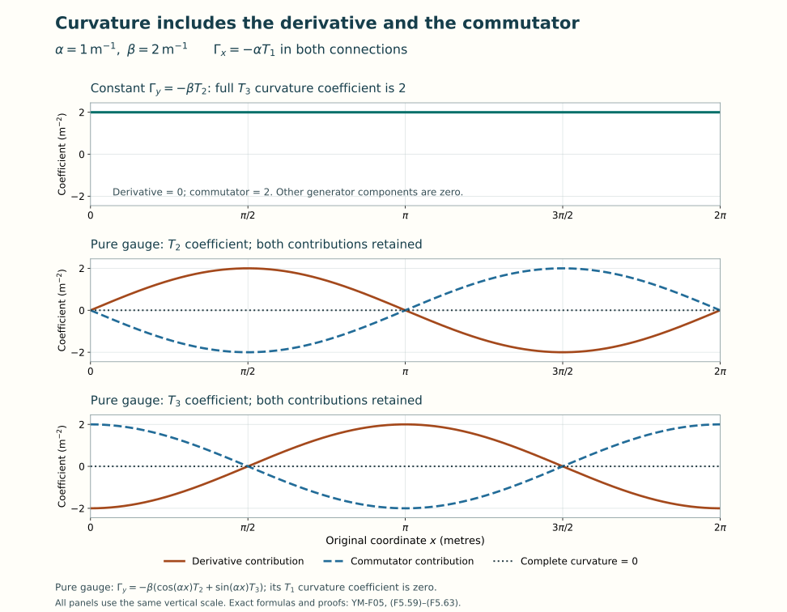

# Covariant derivatives and curvature

Lesson YM-F05 · Geometry and states in Yang–Mills theory

An ordinary derivative compares the entries of a field at nearby
points. If the basis used for those entries changes from point to
point, its derivative contributes too. A connection records the
additional matrix needed to make differentiation respect the chosen
change of basis.

We will construct this derivative, calculate its curvature, and prove
the identities satisfied by that curvature. The calculation begins
with matrices and the product rule. Differential forms will then
organize the same complete expressions, including every sign and
factor. The electromagnetic formulas of Lessons 2–3 will appear as
an exact special case.

Preparation is [Lesson 4](../lie-groups-and-lie-algebras.html), together
with the field and coordinate calculus in Lessons 1–3. All functions
in this lesson are smooth. Unless physical units are specified,
\(U\) is an open subset of \(\mathbb R^m\) with coordinates
\(x^1,\ldots,x^m\). Fields take values in \(\mathbb C^N\), and
matrices act on column vectors from the left. Every sum below is
written explicitly.

## 1. What a connection adds to a derivative

Choose \(m\) smooth matrix functions
\(\Gamma_\mu:U\to M_N(\mathbb C)\). For a field
\(\psi:U\to\mathbb C^N\), define

\[
 D_\mu\psi=\partial_\mu\psi+\Gamma_\mu\psi,
 \qquad
 D_X\psi=\sum_{\mu=1}^m X^\mu D_\mu\psi,
 \quad
 X=\sum_{\mu=1}^m X^\mu\partial_\mu.
 \tag{F5.1}
\]

A vector field \(X\) has real smooth coefficients. The operators
are complex linear in \(\psi\), real linear in \(X\), and satisfy

\[
 D_{fX}\psi=fD_X\psi,\qquad
 D_X(h\psi)=(Xh)\psi+hD_X\psi.
 \tag{F5.2}
\]

Here \(f\) is real smooth and \(h\) is complex smooth. The second
identity is the Leibniz rule. It follows by differentiating the
product and retaining the multiplication term \(\Gamma_\mu h\psi\).
A covariant derivative on this product field space means operators
with precisely these linearity and Leibniz properties.

Conversely these properties determine matrices as in (F5.1).
Let \(e_1,\ldots,e_N\) be the constant coordinate columns. Make
the \(j\)-th column of \(\Gamma_\mu\) equal to \(D_{\partial_\mu}e_j\).
Writing \(\psi=\sum_j\psi^j e_j\), the Leibniz rule gives

\[
 D_{\partial_\mu}\psi
 =\sum_{j=1}^N(\partial_\mu\psi^j)e_j
   +\sum_{j=1}^N\psi^jD_{\partial_\mu}e_j
 =\partial_\mu\psi+\Gamma_\mu\psi.
 \tag{F5.3}
\]

Linearity over smooth real functions in the direction gives (F5.1)
for every \(X\). Thus the matrix description loses none of the stated
operator data. The array \(\Gamma_\mu\) is the connection in this
chosen frame.

### Changing the field coordinates

Let \(g:U\to\operatorname{GL}_N(\mathbb C)\) be smooth, and declare
the new field coordinates to be

\[
 \psi'=g\psi.
 \tag{F5.4}
\]

The inverse is smooth by Lesson 4's adjugate formula. We require the
new derivative to describe the same operation in these coordinates:
\(D'_\mu(g\psi)=gD_\mu\psi\) for every smooth \(\psi\).

### Theorem 1.1. The full connection transformation

The required covariance holds exactly when

\[
 \Gamma'_\mu
 =g\Gamma_\mu g^{-1}-(\partial_\mu g)g^{-1}.
 \tag{F5.5}
\]

**Proof.** Apply the product rule without combining its terms:

\[
 \begin{aligned}
 D'_\mu(g\psi)
 &=(\partial_\mu g)\psi+g\partial_\mu\psi
                         +\Gamma'_\mu g\psi,\\
 gD_\mu\psi&=g\partial_\mu\psi+g\Gamma_\mu\psi.
 \end{aligned}
 \tag{F5.6}
\]

Equality for every constant test column \(\psi=e_j\), at each point,
is equivalent to
\(\partial_\mu g+\Gamma'_\mu g=g\Gamma_\mu\). Multiplication by
\(g^{-1}\) gives (F5.5). Substitution into (F5.6) proves
sufficiency, for every field. \(\square\)

This convention also specifies a passive frame change. If a geometric
vector is written \(e(x)\psi(x)\), where \(e(x)\) is a row of basis
vectors, the same vector in the frame \(e'=eh\) has coordinates
\(\psi'=h^{-1}\psi\). Set \(g=h^{-1}\) in (F5.5). Differentiating
\(h^{-1}h=I_N\) gives

\[
 \partial_\mu(h^{-1})
   =-h^{-1}(\partial_\mu h)h^{-1},\qquad
 \Gamma'_\mu=h^{-1}\Gamma_\mu h+h^{-1}\partial_\mu h.
 \tag{F5.7}
\]

Thus the two commonly used signs describe the same map with inverse
coordinate conventions. Hereafter (F5.4) fixes our convention.

These transformations form a group action. Write \(\Gamma^g\)
for (F5.5). A subsequent field change by \(h\) is multiplication
by \(hg\), and

\[
 \begin{aligned}
 (\Gamma^g)^h_\mu
 &=hg\Gamma_\mu g^{-1}h^{-1}
   -h(\partial_\mu g)g^{-1}h^{-1}
   -(\partial_\mu h)h^{-1}\\
 &=hg\Gamma_\mu(hg)^{-1}
   -\big((\partial_\mu h)g+h(\partial_\mu g)\big)(hg)^{-1}
 =\Gamma^{hg}_\mu.
 \end{aligned}
 \tag{F5.8}
\]

The identity acts trivially and \(g^{-1}\) reverses the change. This
also proves exactly which order of transformations is being used.

### Preserving a fixed inner product

With \(\langle u,v\rangle=u^\dagger v\), the derivative is compatible
with that fixed inner product when

\[
 \partial_\mu\langle\psi,\eta\rangle
 =\langle D_\mu\psi,\eta\rangle+
                       \langle\psi,D_\mu\eta\rangle
 \quad\hbox{for all }\psi,\eta.
 \tag{F5.9}
\]

Expansion of the right side adds
\(\psi^\dagger(\Gamma_\mu^\dagger+\Gamma_\mu)\eta\)
to the left side. Testing every pair of constant coordinate columns
shows that (F5.9) holds exactly when
\(\Gamma_\mu^\dagger=-\Gamma_\mu\).

If \(g\) is unitary, its conjugation preserves skew-Hermitian
matrices. Also differentiation of \(gg^\dagger=I_N\) gives

\[
 \big((\partial_\mu g)g^{-1}\big)^\dagger
 =g(\partial_\mu g^\dagger)
 =-(\partial_\mu g)g^{-1}.
 \tag{F5.10}
\]

Thus (F5.5) preserves compatible connections. If
\(g:U\to SU(N)\), the determinant derivative proved in Lesson 4
gives
\(\operatorname{tr}(g^{-1}\partial_\mu g)=0\).
Cyclicity of trace shows that trace-zero connection matrices remain
trace zero as well. We may therefore work with
\(\Gamma_\mu\in\mathfrak u(N)\) or \(\mathfrak{su}(N)\) and
the corresponding group of frame changes. Real skew-symmetric
matrices and orthogonal changes satisfy the same argument with
transpose in place of adjoint.

## 2. Curvature is an actual commutator

Two coordinate covariant derivatives need not commute. Expand their
composition on an arbitrary field:

\[
 \begin{aligned}
 D_\mu D_\nu\psi
 &=\partial_\mu\partial_\nu\psi
   +(\partial_\mu\Gamma_\nu)\psi
   +\Gamma_\nu\partial_\mu\psi
   +\Gamma_\mu\partial_\nu\psi
   +\Gamma_\mu\Gamma_\nu\psi,\\
 D_\nu D_\mu\psi
 &=\partial_\nu\partial_\mu\psi
   +(\partial_\nu\Gamma_\mu)\psi
   +\Gamma_\mu\partial_\nu\psi
   +\Gamma_\nu\partial_\mu\psi
   +\Gamma_\nu\Gamma_\mu\psi.
 \end{aligned}
 \tag{F5.11}
\]

Mixed partial derivatives agree for smooth functions, and the two
first-derivative terms cancel in pairs. The result is multiplication
by a matrix:

\[
 [D_\mu,D_\nu]\psi=F_{\mu\nu}\psi,\qquad
 F_{\mu\nu}=\partial_\mu\Gamma_\nu-\partial_\nu\Gamma_\mu
                         +[\Gamma_\mu,\Gamma_\nu].
 \tag{F5.12}
\]

This matrix is the curvature component. In particular
\(F_{\nu\mu}=-F_{\mu\nu}\) and \(F_{\mu\mu}=0\).
When the connection matrices lie in one of Lesson 4's real matrix
Lie algebras, derivatives and brackets remain in that same algebra.
So does \(F_{\mu\nu}\).

### Theorem 2.1. Curvature covariance

Under (F5.4)–(F5.5),

\[
 F'_{\mu\nu}=gF_{\mu\nu}g^{-1}.
 \tag{F5.13}
\]

**Proof.** Theorem 1.1 holds for every field, so it also holds
when the input field is \(D_\nu\psi\). Apply it twice and subtract:

\[
 \begin{aligned}
 [D'_\mu,D'_\nu](g\psi)
 &=D'_\mu(gD_\nu\psi)-D'_\nu(gD_\mu\psi)\\
 &=gD_\mu D_\nu\psi-gD_\nu D_\mu\psi
 =gF_{\mu\nu}\psi.
 \end{aligned}
 \tag{F5.14}
\]

The left side equals \(F'_{\mu\nu}g\psi\) by the full expansion
(F5.11), now for the primed connection. Constant coordinate columns
determine a matrix; hence \(F'_{\mu\nu}g=gF_{\mu\nu}\), proving
(F5.13). No derivatives of the varying matrix \(g\) have been
discarded: their cancellations are precisely Theorem 1.1. \(\square\)

For general directions, ordinary vector fields themselves need not
commute. Their bracket is

\[
 [X,Y]^\nu=\sum_{\mu=1}^m
       (X^\mu\partial_\mu Y^\nu-Y^\mu\partial_\mu X^\nu).
 \tag{F5.15}
\]

Expanding the two compositions using (F5.2) gives

\[
 \begin{aligned}
 D_XD_Y\psi
 &=\sum_{\mu,\nu=1}^m
       X^\mu(\partial_\mu Y^\nu)D_\nu\psi
   +\sum_{\mu,\nu=1}^m X^\mu Y^\nu D_\mu D_\nu\psi,\\
 D_YD_X\psi
 &=\sum_{\mu,\nu=1}^m
       Y^\mu(\partial_\mu X^\nu)D_\nu\psi
   +\sum_{\mu,\nu=1}^m Y^\mu X^\nu D_\mu D_\nu\psi.
 \end{aligned}
 \tag{F5.16}
\]

Subtract the first sums using (F5.15), and interchange the dummy
indices in the second composition's last sum. This proves

\[
 (D_XD_Y-D_YD_X-D_{[X,Y]})\psi
 =\left(\sum_{\mu,\nu=1}^m
                     X^\mu Y^\nu F_{\mu\nu}\right)\psi.
 \tag{F5.17}
\]

The subtraction of \(D_{[X,Y]}\) is essential: it removes the
variation of the directions. The remaining expression is linear
over smooth real functions in both directions and over smooth
complex functions in \(\psi\).

## 3. Differential forms, with their coefficients retained

At \(x\in U\), a scalar \(p\)-form is an alternating \(p\)-linear
function on \((\mathbb R^m)^p\), varying smoothly with \(x\).
A zero-form is a smooth function. The coordinate one-form
\(dx^\mu\) sends a vector \(v\) to its component \(v^\mu\).
For a list of coordinate covectors, define their exterior product by

\[
 (dx^{i_1}\wedge\cdots\wedge dx^{i_p})(v_1,\ldots,v_p)
   =\det\big(v_b^{\,i_a}\big)_{a,b=1}^p.
 \tag{F5.18}
\]

For \(p=0\) the empty product is the scalar one. If
\(\alpha_{i_1\ldots i_p}=\alpha(\partial_{i_1},\ldots,\partial_{i_p})\),
multilinearity and alternation give both exact coordinate formulas

\[
 \alpha
 =\frac1{p!}\sum_{i_1,\ldots,i_p=1}^m
       \alpha_{i_1\ldots i_p}\,
       dx^{i_1}\wedge\cdots\wedge dx^{i_p}
 =\sum_{i_1<\cdots<i_p}
       \alpha_{i_1\ldots i_p}\,
       dx^{i_1}\wedge\cdots\wedge dx^{i_p}.
 \tag{F5.19}
\]

To prove the first equality, evaluate on coordinate vectors.
Repeated indices vanish by alternation. For any ordered list of
distinct indices, the \(p!\) permutations each contribute the same
coefficient: the sign of the coefficient permutation cancels the
determinant sign. The factor \(1/p!\) removes exactly these
repetitions. Equality on the coordinate basis proves equality on
all vectors. This argument also proves the second formula and
uniqueness of its coefficients. For \(p>m\) every form is zero.

For forms of degrees \(p,q\), define

\[
 \begin{aligned}
 (\alpha\wedge\beta)(v_1,\ldots,v_{p+q})
 =\frac1{p!q!}\sum_{\sigma\in S_{p+q}}
  (\operatorname{sgn}\sigma)\,
  \alpha(v_{\sigma(1)},\ldots,v_{\sigma(p)})
  \beta(v_{\sigma(p+1)},\ldots,v_{\sigma(p+q)}).
 \end{aligned}
 \tag{F5.20}
\]

This is the same as the sum over permutations that preserve order
inside each of the two blocks: reordering within them gives
\(p!q!\) identical signed contributions. This is the shuffle
description of the product.

The product is associative. For three forms, either parenthesization
of the shuffle sum chooses the same division of the input list into
three ordered blocks, of lengths \(p,q,r\). Its sign is the sign
of the full permutation, because successive permutations multiply
their signs. Equivalently both parenthesizations equal the full
permutation sum with coefficient \(1/(p!q!r!)\).
In degree-one coordinate products this is also the determinant
expansion in (F5.18). Exchanging the two blocks in (F5.20)
requires \(pq\) crossings, so scalar-valued forms satisfy
\(\beta\wedge\alpha=(-1)^{pq}\alpha\wedge\beta\).

### Matrix and vector coefficients

For matrix-valued forms use (F5.20) with matrix multiplication in
the displayed order. Equivalently
\((\alpha\wedge\beta)_{ab}=\sum_{c=1}^N
\alpha_{ac}\wedge\beta_{cb}\).
For a matrix-valued form and a column-valued form the same rule uses
matrix action on the column. Associativity follows from the same
three-block argument and associativity of matrix multiplication.
Matrix-valued forms generally do not satisfy scalar graded
commutativity.

Their graded commutator is

\[
 [\alpha,\beta]_\wedge
 =\alpha\wedge\beta-(-1)^{pq}\beta\wedge\alpha.
 \tag{F5.21}
\]

For scalar forms \(a,b\) and constant matrices \(X,Y\),

\[
 [aX,bY]_\wedge
 =(a\wedge b)(XY-YX).
 \tag{F5.22}
\]

Indeed the sign from moving \(b\) past \(a\) cancels the
\((-1)^{pq}\) in (F5.21). Expanding in a fixed real basis
therefore shows that the bracket of Lie-algebra-valued forms is
again Lie-algebra-valued. This also proves that the definition
does not depend on the chosen basis: it is already an operation
on the actual matrices.

### The exterior derivative

Define exterior differentiation entry by entry:

\[
 d\alpha
 =\frac1{p!}\sum_{\mu,i_1,\ldots,i_p=1}^m
       (\partial_\mu\alpha_{i_1\ldots i_p})\,
       dx^\mu\wedge dx^{i_1}\wedge\cdots\wedge dx^{i_p}.
 \tag{F5.23}
\]

The full coefficient formula is

\[
 (d\alpha)_{i_0\ldots i_p}
 =\sum_{r=0}^p(-1)^r
   \partial_{i_r}\alpha_{i_0\ldots\widehat{i_r}\ldots i_p}.
 \tag{F5.24}
\]

The hat omits exactly that argument. To verify the formula,
evaluate (F5.23) on the coordinate list. The derivative covector
can occupy each of its \(p+1\) positions. Moving it to the front
gives \((-1)^r\); the remaining \(p!\) permutations cancel
the factor in (F5.23). This proves every coefficient, including
the cases with repeated indices.

The two identities used below are

\[
 d^2\alpha=0,\qquad
 d(\alpha\wedge\beta)=d\alpha\wedge\beta+
                                  (-1)^p\alpha\wedge d\beta.
 \tag{F5.25}
\]

For the first, applying (F5.23) twice gives all terms
\((\partial_\nu\partial_\mu\alpha_I)
dx^\nu\wedge dx^\mu\wedge dx^I/p!\).
Terms with \(\mu=\nu\) vanish. The two terms indexed by
\((\nu,\mu)\) and \((\mu,\nu)\) cancel because their partial
derivatives agree and their first two covectors reverse sign.
For the second, expand both forms in (F5.19), retaining their
factors, and apply the ordinary coefficient product rule.
The terms differentiating \(\alpha_I\) give \(d\alpha\wedge\beta\).
For the others, moving the new \(dx^\mu\) past the \(p\) covectors
of \(\alpha\) contributes \((-1)^p\), giving the second term.
No matrix factors change order in either argument, so (F5.25)
also holds for the matrix and vector products just defined.

## 4. The same connection and curvature as forms

Package the original connection matrices in a one-form and the
original curvature matrices in a two-form:

\[
 \Gamma=\sum_{\mu=1}^m\Gamma_\mu dx^\mu,\qquad
 F=\frac12\sum_{\mu,\nu=1}^mF_{\mu\nu}dx^\mu\wedge dx^\nu
   =\sum_{\mu<\nu}F_{\mu\nu}dx^\mu\wedge dx^\nu.
 \tag{F5.26}
\]

Both presentations of \(F\) retain the same coefficients:
the antisymmetry of \(F_{\mu\nu}\) and of the coordinate wedge
makes the two ordered terms equal. The diagonal terms are zero.
From (F5.20),

\[
 \begin{aligned}
 (\Gamma\wedge\Gamma)(\partial_\mu,\partial_\nu)
   &=\Gamma_\mu\Gamma_\nu-\Gamma_\nu\Gamma_\mu,\\
 d\Gamma(\partial_\mu,\partial_\nu)
   &=\partial_\mu\Gamma_\nu-\partial_\nu\Gamma_\mu.
 \end{aligned}
 \tag{F5.27}
\]

Consequently the exact form of (F5.12) is

\[
 F=d\Gamma+\Gamma\wedge\Gamma
   =d\Gamma+\frac12[\Gamma,\Gamma]_\wedge.
 \tag{F5.28}
\]

The last factor is essential: a one-form has odd degree, so
\([\Gamma,\Gamma]_\wedge=2\Gamma\wedge\Gamma\).
The transformation laws become

\[
 \Gamma^g=g\Gamma g^{-1}-(dg)g^{-1},\qquad
 F^g=gFg^{-1}.
 \tag{F5.29}
\]

Multiplication by a matrix-valued zero-form has no permutation
sign. Evaluating these equalities on coordinate vectors recovers
exactly (F5.5) and (F5.13).

### Smooth maps of the coordinate domain

Let \(f:V\to U\) be smooth, with coordinates \(y^1,\ldots,y^l\)
on the open set \(V\subset\mathbb R^l\). Pullback of a form means

\[
 (f^*\alpha)_y(v_1,\ldots,v_p)
  =\alpha_{f(y)}(df_yv_1,\ldots,df_yv_p).
 \tag{F5.30}
\]

In coordinates this replaces every coefficient by its composition
with \(f\), and every \(dx^\mu\) by
\(df^\mu=\sum_a(\partial_a f^\mu)dy^a\).
These rules follow directly from multilinearity in (F5.19), with
the factor \(1/p!\) unchanged. They imply

\[
 f^*(\alpha\wedge\beta)=f^*\alpha\wedge f^*\beta,\qquad
 d(f^*\alpha)=f^*(d\alpha).
 \tag{F5.31}
\]

The first identity follows by inserting \(df\,v_j\) in the full
sum (F5.20). For the second, expand the coordinate rule just given.
Differentiating a coefficient uses the chain rule
\(d(a\circ f)=\sum_\mu(\partial_\mu a)\circ f\,df^\mu\).
Differentiating any factor \(df^\mu\) gives zero: its second
partial derivatives cancel in antisymmetric pairs, the degree-zero
case of (F5.25). The product rule now proves the second identity
for each coordinate term and hence for their sum.

The pulled-back connection has coefficients

\[
 \Gamma^f_a(y)=\sum_{\mu=1}^m
        (\partial_a f^\mu)(y)\Gamma_\mu(f(y)).
 \tag{F5.32}
\]

The chain rule verifies

\[
 D^f_a(\psi\circ f)
   =\sum_{\mu=1}^m(\partial_a f^\mu)(D_\mu\psi)\circ f.
 \tag{F5.33}
\]

Applying (F5.28) and (F5.31) proves \(F^f=f^*F\), including
the complete coefficient formula

\[
 F^f_{ab}
 =\sum_{\mu,\nu=1}^m
       (\partial_a f^\mu)(\partial_b f^\nu)
                          F_{\mu\nu}\circ f.
 \tag{F5.34}
\]

No invertibility of \(f\) was assumed. A coordinate diffeomorphism
is one special case; an arbitrary smooth pullback has the same
formula.

## 5. Covariant exterior derivatives and the Bianchi identity

For a column-valued \(p\)-form \(\eta\), extend (F5.1) by

\[
 D_\Gamma\eta=d\eta+\Gamma\wedge\eta.
 \tag{F5.35}
\]

The output is a column-valued \((p+1)\)-form. For a matrix-valued
\(p\)-form \(\alpha\), the corresponding derivative of endomorphisms
is

\[
 \mathcal D_\Gamma\alpha
 =d\alpha+\Gamma\wedge\alpha-(-1)^p\alpha\wedge\Gamma
 =d\alpha+[\Gamma,\alpha]_\wedge.
 \tag{F5.36}
\]

These are different actions of the same connection on specified
spaces. For example, at degree zero, \(\eta\) is a column field,
while a matrix field \(K\) acts on such columns. Direct expansion
proves the exact compatibility

\[
 D_\mu(K\psi)
  =\big(\partial_\mu K+[\Gamma_\mu,K]\big)\psi+KD_\mu\psi.
 \tag{F5.37}
\]

Indeed its right side is
\((\partial_\mu K)\psi+\Gamma_\mu K\psi-K\Gamma_\mu\psi+
K\partial_\mu\psi+K\Gamma_\mu\psi\), with the last two connection
terms of opposite signs cancelling. Thus the endomorphism
derivative is forced by the action on the original fields.

The full graded versions follow from (F5.25):

\[
 \begin{aligned}
 D_\Gamma(\alpha\wedge\eta)
   &=(\mathcal D_\Gamma\alpha)\wedge\eta
                         +(-1)^p\alpha\wedge D_\Gamma\eta,\\
 \mathcal D_\Gamma(\alpha\wedge\beta)
   &=(\mathcal D_\Gamma\alpha)\wedge\beta
                         +(-1)^p\alpha\wedge\mathcal D_\Gamma\beta.
 \end{aligned}
 \tag{F5.38}
\]

Here \(\beta\) is another matrix-valued form. To check the second
formula, substitute (F5.36). The two inserted middle products
\(-(-1)^p\alpha\wedge\Gamma\wedge\beta\) and
\(( -1)^p\alpha\wedge\Gamma\wedge\beta\) cancel.
The remaining connection terms are
\(\Gamma\wedge\alpha\wedge\beta-
(-1)^{p+q}\alpha\wedge\beta\wedge\Gamma\), exactly the
endomorphism term in degree \(p+q\). The derivative terms are
(F5.25). The first formula has the same middle cancellation,
and no final right multiplication because \(\eta\) is a column.
This proves both rules with their actual domains.

### Theorem 5.1. The squares of these derivatives

For every column-valued form \(\eta\) and matrix-valued form
\(\alpha\),

\[
 D_\Gamma^2\eta=F\wedge\eta,\qquad
 \mathcal D_\Gamma^2\alpha=F\wedge\alpha-\alpha\wedge F.
 \tag{F5.39}
\]

**Proof.** The first calculation retains all terms:

\[
 \begin{aligned}
 D_\Gamma^2\eta
 &=d^2\eta+d\Gamma\wedge\eta-\Gamma\wedge d\eta
                  +\Gamma\wedge d\eta+\Gamma\wedge\Gamma\wedge\eta\\
 &=(d\Gamma+\Gamma\wedge\Gamma)\wedge\eta.
 \end{aligned}
 \tag{F5.40}
\]

For the second, let \(p=\deg\alpha\). Expanding the three
contributions to \(\mathcal D_\Gamma^2\alpha\) gives

\[
 \begin{aligned}
 d(\mathcal D_\Gamma\alpha)
 &=d\Gamma\wedge\alpha-\Gamma\wedge d\alpha
     -(-1)^p d\alpha\wedge\Gamma-\alpha\wedge d\Gamma,\\
 \Gamma\wedge\mathcal D_\Gamma\alpha
 &=\Gamma\wedge d\alpha+\Gamma\wedge\Gamma\wedge\alpha
                       -(-1)^p\Gamma\wedge\alpha\wedge\Gamma,\\
 -(-1)^{p+1}(\mathcal D_\Gamma\alpha)\wedge\Gamma
 &=(-1)^p d\alpha\wedge\Gamma
   +(-1)^p\Gamma\wedge\alpha\wedge\Gamma
                       -\alpha\wedge\Gamma\wedge\Gamma.
 \end{aligned}
 \tag{F5.41}
\]

Their sum cancels the two \(d\alpha\) pairs and the middle
connection pair. The terms left are
\((d\Gamma+\Gamma\wedge\Gamma)\wedge\alpha-
\alpha\wedge(d\Gamma+\Gamma\wedge\Gamma)\).
This is the second assertion. \(\square\)

The matrix-valued derivative respects frame changes in the appropriate
representation:

\[
 D_{\Gamma^g}(g\eta)=gD_\Gamma\eta,\qquad
 \mathcal D_{\Gamma^g}(g\alpha g^{-1})
                       =g(\mathcal D_\Gamma\alpha)g^{-1}.
 \tag{F5.42}
\]

For the first identity, differentiating \(g\eta\) gives
\(dg\wedge\eta+g\,d\eta\); the connection in (F5.29) supplies
\(g\Gamma\wedge\eta-dg\wedge\eta\).
For the second, the complete derivative is

\[
 d(g\alpha g^{-1})
 =dg\wedge\alpha g^{-1}+g\,d\alpha\,g^{-1}
                      +(-1)^p g\alpha\wedge d(g^{-1}).
 \tag{F5.43}
\]

Differentiating \(g^{-1}g=I_N\) gives
\(d(g^{-1})=-g^{-1}(dg)g^{-1}\).
The left connection product in (F5.36) contributes
\(g\Gamma\wedge\alpha g^{-1}-dg\wedge\alpha g^{-1}\).
The right one contributes
\(-(-1)^p g\alpha\wedge\Gamma g^{-1}
 +(-1)^p g\alpha g^{-1}\wedge dg\,g^{-1}\).
Its last term cancels the last term in (F5.43); the two terms
beginning with \(dg\) cancel as well. The remaining three
terms are exactly the second identity in (F5.42).

### Theorem 5.2. Bianchi identity

Every connection defined in this lesson satisfies

\[
 \mathcal D_\Gamma F=dF+\Gamma\wedge F-F\wedge\Gamma=0.
 \tag{F5.44}
\]

**Proof.** Differentiate the full definition (F5.28):

\[
 \begin{aligned}
 dF&=d\Gamma\wedge\Gamma-\Gamma\wedge d\Gamma,\\
 \Gamma\wedge F-F\wedge\Gamma
 &=\Gamma\wedge d\Gamma+\Gamma\wedge\Gamma\wedge\Gamma
   -d\Gamma\wedge\Gamma-\Gamma\wedge\Gamma\wedge\Gamma.
 \end{aligned}
 \tag{F5.45}
\]

Every term in their sum has its opposite. Associativity, already
proved for these products, identifies the two cubic terms.
This proves (F5.44). \(\square\)

Evaluating this three-form on coordinate vectors gives

\[
 \begin{aligned}
 0={}&\partial_\lambda F_{\mu\nu}
      +\partial_\mu F_{\nu\lambda}
      +\partial_\nu F_{\lambda\mu}\\
    &+[\Gamma_\lambda,F_{\mu\nu}]
      +[\Gamma_\mu,F_{\nu\lambda}]
      +[\Gamma_\nu,F_{\lambda\mu}].
 \end{aligned}
 \tag{F5.46}
\]

Formula (F5.24) gives the three derivatives with these signs,
and the shuffle rule gives the three commutators. Thus Bianchi
does not generally say \(dF=0\): the connection terms in
(F5.46) are part of the identity. We will calculate an example
where they are nonzero.

## 6. Other representations, coupling constants and invariant quantities

Let \(G\) be one of Lesson 4's matrix groups, with real Lie algebra
\(\mathfrak g\), and let \(\rho:G\to\operatorname{GL}_K(\mathbb C)\)
be a smooth representation. Its real-linear derivative
\(r=d\rho_e\) preserves brackets by Lesson 4, (F4.68).
For a \(\mathfrak g\)-valued connection put

\[
 \Gamma^\rho_\mu=r(\Gamma_\mu),\qquad
 D^\rho_\mu\eta=\partial_\mu\eta+r(\Gamma_\mu)\eta,
 \quad \eta:U\to\mathbb C^K.
 \tag{F5.47}
\]

Real linearity commutes with the coordinate derivatives, and bracket
preservation gives the exact curvature map

\[
 F^\rho_{\mu\nu}
 =r(\partial_\mu\Gamma_\nu-\partial_\nu\Gamma_\mu)
                +[r(\Gamma_\mu),r(\Gamma_\nu)]
 =r(F_{\mu\nu}).
 \tag{F5.48}
\]

The varying group transformation is also respected. Fix a point \(x\)
and a coordinate direction. For a curve \(g(t)\) through \(g_0=g(x)\),
the curve \(g(t)g_0^{-1}\) passes through the identity with velocity
\(g'(0)g_0^{-1}\in\mathfrak g\). Differentiate
\(\rho(g(t))=\rho(g(t)g_0^{-1})\rho(g_0)\) to get

\[
 r\big((\partial_\mu g)g^{-1}\big)
       =\partial_\mu(\rho(g))\,\rho(g)^{-1}.
 \tag{F5.49}
\]

Lesson 4, (F4.67), also gives
\(r(gXg^{-1})=\rho(g)r(X)\rho(g)^{-1}\).
Applying these two identities to (F5.5) proves the same
transformation formula for \(\Gamma^\rho\), with \(\rho(g)\)
acting on \(\eta\). This constructs the exact relation between the
two state spaces and derivatives.

The defining representation gives our original column derivative.
For the adjoint representation, \(r(X)K=[X,K]\), giving (F5.36)
on Lie-algebra-valued forms. Unitary representations have
skew-Hermitian \(r(X)\), again by Lesson 4, so they preserve their
specified Hermitian inner products.

### Keeping a physical coupling visible

Let \(T_1,\ldots,T_d\) be a fixed real basis of \(\mathfrak g\)
with \([T_a,T_b]=\sum_c f_{ab}{}^cT_c\), exactly as declared
in Lesson 4 for \(SU(2)\) and \(SU(3)\). Suppose a model
specifies real functions \(A_\mu^a\) and a constant real parameter
\(g_{\mathrm{YM}}\) through

\[
 \Gamma_\mu=g_{\mathrm{YM}}\sum_{a=1}^d A_\mu^aT_a.
 \tag{F5.50}
\]

The full curvature of that connection is

\[
 F_{\mu\nu}
 =\sum_{c=1}^d
   \left[
    g_{\mathrm{YM}}(\partial_\mu A_\nu^c-\partial_\nu A_\mu^c)
    +g_{\mathrm{YM}}^2\sum_{a,b=1}^d
                          f_{ab}{}^c A_\mu^aA_\nu^b
   \right]T_c.
 \tag{F5.51}
\]

This follows by expanding (F5.12), including both factors of
\(g_{\mathrm{YM}}\) in the matrix product. It is valid at zero
coupling too. At zero coupling the connection does not determine
the original \(A_\mu^a\), so no inversion of (F5.50) is available.
The dimensions assigned to \(A_\mu^a\) and \(g_{\mathrm{YM}}\)
must make \(\Gamma_\mu\) have the same dimension as
\(\partial_\mu\). This lesson does not fix a quantum-field
convention for those separate factors.

If Hermitian generators \(H_a=iT_a\) are preferred, the identical
connection is
\(\Gamma_\mu=-ig_{\mathrm{YM}}\sum_a A_\mu^aH_a\).
Exercise 7 of Lesson 4 proves the bracket map
\(\{H,K\}=-i(HK-KH)\). In this basis
\([H_a,H_b]=i\sum_c f_{ab}{}^cH_c\).
Substituting \(T_c=-iH_c\) in the full sum (F5.51) retains
every coupling and every factor of \(i\); it describes the same
matrix curvature.

### Quantities unaffected by an internal frame change

For skew-Hermitian curvature matrices, Lesson 4's trace metric gives

\[
 \begin{aligned}
 -\operatorname{tr}(F^g_{\mu\nu}F^g_{\rho\sigma})
   &=-\operatorname{tr}(F_{\mu\nu}F_{\rho\sigma}),\\
 -\operatorname{tr}(F_{\mu\nu}^2)
   &=\operatorname{tr}(F_{\mu\nu}^\dagger F_{\mu\nu})
     =\sum_{a,b=1}^N|(F_{\mu\nu})_{ab}|^2\geq0.
 \end{aligned}
 \tag{F5.52}
\]

The first equality cancels adjacent \(g^{-1}g\) and uses cyclicity
of trace. The second uses skew-Hermiticity and the entrywise trace.
It vanishes exactly when that curvature matrix is zero.

These statements concern changes of the internal field frame in
fixed base coordinates. They are not claims of invariance under
arbitrary changes of those coordinates. Equation (F5.34) supplies
the separate coordinate map. Constructing an action from these
quantities also needs a metric and an integration measure; that
will be part of Lesson 7.

## 7. Recovering electromagnetism with its original units

Use the physical coordinates \((t,x^1,x^2,x^3)\) on the domain
of Lessons 2–3. Time is not multiplied by the speed of light.
Let \(q\) be a real charge, \(\hbar>0\) have the unit of action,
\(\phi\) be the electric scalar potential, and
\(A=(A_1,A_2,A_3)\) the vector potential. Define the scalar
skew-Hermitian connection

\[
 \Gamma=\frac{iq}{\hbar}
       \left(\phi\,dt-\sum_{j=1}^3 A_j\,dx^j\right),
 \qquad
 \Gamma_t=\frac{iq}{\hbar}\phi,\quad
 \Gamma_j=-\frac{iq}{\hbar}A_j.
 \tag{F5.53}
\]

Thus \(D_t=\partial_t+iq\phi/\hbar\) and
\(D_j=\partial_j-iqA_j/\hbar\), exactly the operators of
Lesson 3. The temporal coefficient has dimension inverse time,
and the spatial coefficients have dimension inverse length:
\(q\phi\) is energy and \(qA_j\) has dimension momentum.
Each product in the one-form (F5.53) is dimensionless.

Since these coefficients commute, \(\Gamma\wedge\Gamma=0\).
Using \(E_j=-\partial_j\phi-\partial_tA_j\) and
\(B_k=\sum_{i,j}\epsilon_{kij}\partial_iA_j\) from Lesson 2,
all curvature components are

\[
 \begin{aligned}
 F_{tj}
 &=\partial_t\!\left(-\frac{iq}{\hbar}A_j\right)
   -\partial_j\!\left(\frac{iq}{\hbar}\phi\right)
   =\frac{iq}{\hbar}E_j,\\
 F_{ij}
 &=-\frac{iq}{\hbar}(\partial_i A_j-\partial_j A_i)
   =-\frac{iq}{\hbar}\sum_{k=1}^3\epsilon_{ijk}B_k.
 \end{aligned}
 \tag{F5.54}
\]

The last equality is the epsilon contraction identity proved in
Lesson 2, or the three direct cases \(12,23,31\).
The full two-form is therefore

\[
 F=\frac{iq}{\hbar}
  \left[
    \sum_{j=1}^3E_j\,dt\wedge dx^j
    -B_1\,dx^2\wedge dx^3
    -B_2\,dx^3\wedge dx^1
    -B_3\,dx^1\wedge dx^2
  \right].
 \tag{F5.55}
\]

The signs in this expression are consequences of the original
temporal and spatial operators. No metric signature or change
of time coordinate was introduced to obtain them.

For a real gauge function \(\chi\), take \(g=e^{iq\chi/\hbar}\).
Then \((dg)g^{-1}=(iq/\hbar)d\chi\). Substitution in (F5.29)
is exactly

\[
 A'_j=A_j+\partial_j\chi,\qquad
 \phi'=\phi-\partial_t\chi,\qquad
 \psi'=e^{iq\chi/\hbar}\psi.
 \tag{F5.56}
\]

When \(q\ne0\), every smooth \(U(1)\)-valued \(g\), including
one without a global real angle, gives the full transformation
of Lesson 3, (F3.37). The connection law in (F5.29) itself is
defined without dividing by \(q\).

Here \(\mathcal D_\Gamma F=dF\), because all scalar coefficients
commute and a one-form commutes in the graded sense with a
two-form. The spatial Bianchi component is

\[
 \partial_1F_{23}+\partial_2F_{31}+\partial_3F_{12}
 =-\frac{iq}{\hbar}
            (\partial_1B_1+\partial_2B_2+\partial_3B_3).
 \tag{F5.57}
\]

For the three cyclic choices \((i,j,k)=(1,2,3),(2,3,1),(3,1,2)\),
the temporal components are

\[
 \begin{aligned}
 \partial_tF_{ij}+\partial_iF_{jt}+\partial_jF_{ti}
 &=-\frac{iq}{\hbar}
       (\partial_tB_k+\partial_iE_j-\partial_jE_i)\\
 &=-\frac{iq}{\hbar}
       \big(\partial_tB_k+(\nabla\times E)_k\big).
 \end{aligned}
 \tag{F5.58}
\]

These four equations exhaust the independent components of a
three-form in four dimensions. For \(q\ne0\), the Bianchi
identity is exactly the two homogeneous Maxwell equations
\(\nabla\cdot B=0\) and \(\partial_tB+\nabla\times E=0\).
For \(q=0\), the connection and its curvature are zero for every
choice of the original potentials, and Bianchi gives no information
from which to recover \(E,B\). This is the neutral-field case,
not a reason to divide by zero.

Neither the sourced Gauss law nor the sourced Ampère law follows
from this calculation. Those are equations of motion with their
specified sources. Bianchi is the identity obeyed by the curvature
of every connection, before imposing an equation of motion.

## 8. Complete nonabelian examples

Use the exact generators \(T_a=-i\sigma_a/2\) of Lesson 4, so
\([T_a,T_b]=\sum_c\epsilon_{abc}T_c\) and
\(-\operatorname{tr}(T_aT_b)=\tfrac12\delta_{ab}\).

### Constant coefficients can have curvature

On the whole \((x,y)\)-plane take real constants \(a,b\) and

\[
 \Gamma=aT_1\,dx+bT_2\,dy.
 \tag{F5.59}
\]

All partial derivatives of its coefficients are zero, but its
complete curvature is

\[
 F=abT_3\,dx\wedge dy,\qquad
 -\operatorname{tr}(F_{xy}^2)=\frac{a^2b^2}{2}.
 \tag{F5.60}
\]

If \(ab\ne0\), no smooth internal frame change makes this connection
zero on any nonempty open set. A zero connection would have zero
curvature there, contradicting (F5.13) and invertibility of the
conjugating matrix. This proves the precise local obstruction and
identifies its nonzero invariant.

### A varying pure gauge and both cancelling contributions

Every smooth \(g:U\to G\) gives a connection
\(\Gamma=-(dg)g^{-1}\), obtained by transforming the zero
connection. Its curvature is zero by (F5.13). We can check this
for a noncommuting example in full.

Let

\[
 g(x,y)=\exp(\alpha xT_1)\exp(\beta yT_2),
 \qquad \alpha,\beta\in\mathbb R.
 \tag{F5.61}
\]

This is a smooth, single-valued \(SU(2)\) function on the entire
plane. Differentiation gives

\[
 \begin{aligned}
 \Gamma_x&=-\alpha T_1,\\
 \Gamma_y&=-\beta\,\exp(\alpha xT_1)T_2\exp(-\alpha xT_1)\\
 &=-\beta\big(\cos(\alpha x)T_2+\sin(\alpha x)T_3\big).
 \end{aligned}
 \tag{F5.62}
\]

The final identity is the conjugation rotation formula
(F4.43)–(F4.45), applied to the generator direction \(T_2\)
about the \(T_1\) axis. Its signs also follow by differentiating
the conjugation: its derivative at zero is \([T_1,T_2]=T_3\).
The full curvature contributions are

\[
 \begin{aligned}
 \partial_x\Gamma_y-\partial_y\Gamma_x
   &=\alpha\beta\sin(\alpha x)T_2
                     -\alpha\beta\cos(\alpha x)T_3,\\
 [\Gamma_x,\Gamma_y]
   &=-\alpha\beta\sin(\alpha x)T_2
                     +\alpha\beta\cos(\alpha x)T_3,\\
 F_{xy}&=0.
 \end{aligned}
 \tag{F5.63}
\]

At \(x=0\), these connection matrices have the same values as
the constant connection \(-\alpha T_1dx-\beta T_2dy\).
Their derivatives are different. The constant connection has
curvature \(\alpha\beta T_3\), whereas (F5.62) has zero
curvature everywhere. A connection value at one point is
therefore insufficient to determine the curvature at that point.

*Figure 1. The constant and pure-gauge connections in (F5.59)–(F5.63),
with \(a=-\alpha\), \(b=-\beta\), \(\alpha=1\,\mathrm m^{-1}\)
and \(\beta=2\,\mathrm m^{-1}\). The two pure-gauge component
plots retain both the \(T_2\) and \(T_3\) terms. Their derivative
and commutator contributions add to zero at every shown value
of \(x\); the constant connection retains \(2T_3\,\mathrm m^{-2}\).
The formulas specify all components; the plotted curves are samples
of those exact functions.*

### Bianchi with nonzero ordinary exterior derivative

On \(\mathbb R^3\) use coordinates \(x,y,z\) and constants
\(a,b,c\), with

\[
 \Gamma=aT_1\,dx+bxT_2\,dy+cyT_3\,dz.
 \tag{F5.64}
\]

The three independent curvature components, with all derivative
and commutator terms evaluated, are

\[
 \begin{aligned}
 F_{xy}&=bT_2+abxT_3,\\
 F_{xz}&=-acyT_2,\\
 F_{yz}&=cT_3+bcxyT_1.
 \end{aligned}
 \tag{F5.65}
\]

For example \([T_1,T_3]=-T_2\) fixes the middle sign.
The coefficient of \(dx\wedge dy\wedge dz\) in \(dF\) is

\[
 \partial_xF_{yz}+\partial_yF_{zx}+\partial_zF_{xy}
        =bcyT_1+acT_2.
 \tag{F5.66}
\]

The three remaining Bianchi terms are

\[
 \begin{aligned}
 [\Gamma_x,F_{yz}]&=[aT_1,cT_3+bcxyT_1]=-acT_2,\\
 [\Gamma_y,F_{zx}]&=[bxT_2,acyT_2]=0,\\
 [\Gamma_z,F_{xy}]&=[cyT_3,bT_2+abxT_3]=-bcyT_1.
 \end{aligned}
 \tag{F5.67}
\]

They cancel (F5.66) exactly. When \(a,c\ne0\), the ordinary
\(dF\) is nonzero at every point, since its \(T_2\) coefficient
is \(ac\). The full covariant Bianchi identity still holds.
If \(x,y,z\) have length units, the stated connection uses
\([a]=\mathrm{length}^{-1}\) and
\([b]=[c]=\mathrm{length}^{-2}\); each curvature coefficient
then has dimension inverse length squared, and every term in
(F5.66)–(F5.67) has dimension inverse length cubed.

## 9. Differences, variations and infinitesimal gauge changes

Two connections in the same field frame differ by a matrix-valued
one-form \(a=\Gamma_1-\Gamma_0\). Their inhomogeneous terms in
(F5.29) cancel, so

\[
 a^g=ga g^{-1}.
 \tag{F5.68}
\]

Conversely adding any such smooth one-form to a connection preserves
the Leibniz law in (F5.2), as direct substitution shows. If both
connections must be compatible with a fixed Hermitian metric, the
allowed difference has skew-Hermitian coefficients by (F5.9).
For \(SU(N)\), retain trace zero as well. This describes an affine
space: differences belong to a vector space, and addition acts
freely and transitively. A preferred zero connection depends on
the frame, as (F5.29) demonstrates.

For a real parameter \(s\), the full curvature polynomial is

\[
 \begin{aligned}
 F_{\Gamma+s a}
 &=d\Gamma+s\,da+
       (\Gamma+s a)\wedge(\Gamma+s a)\\
 &=F_\Gamma+s\big(da+\Gamma\wedge a+a\wedge\Gamma\big)
                            +s^2a\wedge a\\
 &=F_\Gamma+s\,\mathcal D_\Gamma a+s^2a\wedge a.
 \end{aligned}
 \tag{F5.69}
\]

The plus sign in \(a\wedge\Gamma\) is (F5.36) at degree one.
In particular

\[
 \left.\frac d{ds}\right|_0 F_{\Gamma+s a}
       =\mathcal D_\Gamma a,\qquad
 \frac{d^2}{ds^2}F_{\Gamma+s a}=2a\wedge a.
 \tag{F5.70}
\]

No quadratic contribution has been omitted from (F5.69).

For a smooth \(\mathfrak g\)-valued function \(\chi(x)\), set
\(g_s(x)=\exp(s\chi(x))\). Lesson 4 proves smoothness jointly
in \(s,x\), so derivatives may be interchanged. At \(s=0\),
\(g_0=I\), \(\partial_sg_s=\chi\), and
\(\partial_sg_s^{-1}=-\chi\). Differentiating (F5.29) gives

\[
 \begin{aligned}
 \delta_\chi\Gamma
   &:=\left.\frac d{ds}\right|_0\Gamma^{g_s}
     =\chi\Gamma-\Gamma\chi-d\chi
     =-\mathcal D_\Gamma\chi,\\
 \delta_\chi F
   &:=\left.\frac d{ds}\right|_0F^{g_s}
     =\chi F-F\chi.
 \end{aligned}
 \tag{F5.71}
\]

These two derivatives agree with the variation formula. For a general
differentiable connection family \(\Gamma_s\), differentiating its
full expression \(d\Gamma_s+\Gamma_s\wedge\Gamma_s\) at zero
gives \(\mathcal D_{\Gamma_0}(\partial_s\Gamma_s|_0)\), by
the same product rule as (F5.69). Applying (F5.39) to the
zero-form \(\chi\) therefore yields

\[
 \mathcal D_\Gamma(-\mathcal D_\Gamma\chi)
       =-(F\chi-\chi F)=\chi F-F\chi,
 \tag{F5.72}
\]

exactly the second line of (F5.71). This is a proved relation
between infinitesimal field-coordinate changes and variations
of the original connection.

## 10. Exercises with full solutions

The coordinates in Exercises 1–6 are mathematical real coordinates;
no additional physical unit assignment is assumed.

### Exercise 1. A derivative caused entirely by a changing frame

Start with \(\Gamma=0\) on \(\mathbb R^2\) and the constant field
\(\psi=(1,1)^T\). For real \(\kappa\), use
\(g(x,y)=\operatorname{diag}(e^{i\kappa x},e^{-i\kappa x})\).
Find the transformed connection, field, curvature and derivative.

**Solution.** The determinant of \(g\) is one and its adjoint is
its inverse, so \(g\) takes values in \(SU(2)\). Direct
differentiation gives

\[
 \psi'=\begin{pmatrix}e^{i\kappa x}\\e^{-i\kappa x}\end{pmatrix},
 \qquad
 \Gamma'_x=\begin{pmatrix}-i\kappa&0\\0&i\kappa\end{pmatrix}
                  =2\kappa T_3,\qquad
 \Gamma'_y=0.
 \tag{F5.73}
\]

All derivatives of \(\Gamma'\) vanish and its two coefficients
commute, so \(F'=0\). Nevertheless the ordinary derivative
\(\partial_x\psi'=(i\kappa e^{i\kappa x},
-i\kappa e^{-i\kappa x})^T\) is nonzero when \(\kappa\ne0\).
The matrix product \(\Gamma'_x\psi'\) is its negative.
Thus \(D'_x\psi'=D'_y\psi'=0\), as covariance requires.
Its squared field length remains \(1+1=2\). This computes
the connection term that removes the change of basis itself.

### Exercise 2. Pull back through a map with a singular derivative

Take \(\Gamma=aT_1dx+bT_2dy\) on \(\mathbb R^2\), and
let \(f(u,v)=(u^2-v^2,2uv)\). Find the entire pulled-back
connection and curvature, including at \((u,v)=(0,0)\).

**Solution.** The differentials are
\(dx=2u\,du-2v\,dv\) and \(dy=2v\,du+2u\,dv\). Hence

\[
 \Gamma^f_u=2uaT_1+2vbT_2,\qquad
 \Gamma^f_v=-2vaT_1+2ubT_2.
 \tag{F5.74}
\]

The two derivative contributions are both \(2bT_2\), so
they cancel. The bracket contributes

\[
 \begin{aligned}
 [\Gamma^f_u,\Gamma^f_v]
 &=4u^2ab[T_1,T_2]-4v^2ab[T_2,T_1]\\
 &=4ab(u^2+v^2)T_3.
 \end{aligned}
 \tag{F5.75}
\]

The other two products have repeated generators and zero bracket.
Thus \(F^f=4ab(u^2+v^2)T_3\,du\wedge dv\).
This agrees with the full pullback:
\(f^*(dx\wedge dy)=(4u^2+4v^2)du\wedge dv\).
At the origin both connection coefficients and the pulled-back
curvature vanish. The original curvature can still be nonzero.
There is no contradiction: \(df_0=0\), and (F5.34) evaluates
the original two-form on two zero image directions.

### Exercise 3. Curvature in the eight-generator basis

Use Lesson 4's three-by-three generators \(T_a^{(3)}\), and take
\(\Gamma_x=aT_4^{(3)}\),
\(\Gamma_y=bT_5^{(3)}+cT_7^{(3)}\), with constant real \(a,b,c\).
Calculate \(F_{xy}\), its squared trace length and exactly when
it vanishes.

**Solution.** There are no coefficient derivatives. The complete
bracket table in Lesson 4 gives

\[
 F_{xy}
   =\frac{ab}{2}T_3^{(3)}
     +\frac{\sqrt3\,ab}{2}T_8^{(3)}
     +\frac{ac}{2}T_1^{(3)}.
 \tag{F5.76}
\]

The trace metric is \(\tfrac12\delta_{jk}\), with the original
generator factors retained. Therefore

\[
 -\operatorname{tr}(F_{xy}^2)
   =\frac12\left(\frac{a^2b^2}{4}
                +\frac{3a^2b^2}{4}+\frac{a^2c^2}{4}\right)
   =\frac{a^2(4b^2+c^2)}8.
 \tag{F5.77}
\]

It is zero exactly when \(a=0\), or when both \(b=0\) and
\(c=0\). Positivity of the trace metric makes this exactly
the condition \(F_{xy}=0\). In particular a zero \(ab\)
does not by itself eliminate the \(T_1^{(3)}\) contribution.

### Exercise 4. Differentiate an adjoint field twice

On \(\mathbb R^3\) use the constant connection
\(\Gamma=aT_1dx+bT_2dy+cT_3dz\) and matrix field
\(K=xT_1+yT_2+zT_3\). Write
\(\nabla_\mu K=\partial_\mu K+[\Gamma_\mu,K]\).
Compute all three derivatives and
\((\nabla_x\nabla_y-\nabla_y\nabla_x)K\) directly.

**Solution.** Each component is obtained from the stated bracket:

\[
 \begin{aligned}
 \nabla_xK&=T_1-azT_2+ayT_3,\\
 \nabla_yK&=bzT_1+T_2-bxT_3,\\
 \nabla_zK&=-cyT_1+cxT_2+T_3.
 \end{aligned}
 \tag{F5.78}
\]

Now retain the coefficient derivative and the bracket in each
second derivative:

\[
 \begin{aligned}
 \nabla_x\nabla_yK
 &=-bT_3+[aT_1,bzT_1+T_2-bxT_3]
   =(a-b)T_3+abxT_2,\\
 \nabla_y\nabla_xK
 &=aT_3+[bT_2,T_1-azT_2+ayT_3]
   =(a-b)T_3+abyT_1.
 \end{aligned}
 \tag{F5.79}
\]

Subtracting gives \(ab(xT_2-yT_1)\).
On the other hand \(F_{xy}=abT_3\), so
\([F_{xy},K]=ab(xT_2-yT_1)\), the same answer.
This checks the endomorphism action of curvature, including
the ordinary derivatives of the field coefficients.

### Exercise 5. An ordinary derivative that Bianchi does not set to zero

Set \(\Gamma=xT_1dy+yT_2dz\) on \(\mathbb R^3\).
Compute \(F\), \(dF\) and the full \(\mathcal D_\Gamma F\).

**Solution.** Here \(\Gamma_x=0\), \(\Gamma_y=xT_1\),
\(\Gamma_z=yT_2\), giving

\[
 F_{xy}=T_1,\qquad F_{xz}=0,\qquad
 F_{yz}=T_2+xyT_3.
 \tag{F5.80}
\]

Thus \(dF=yT_3\,dx\wedge dy\wedge dz\), which is nonzero
where \(y\ne0\). The connection contribution in the same
three-form coefficient is

\[
 [\Gamma_x,F_{yz}]+[\Gamma_y,F_{zx}]+[\Gamma_z,F_{xy}]
 =0+0+[yT_2,T_1]=-yT_3.
 \tag{F5.81}
\]

Adding the two coefficients gives
\(\mathcal D_\Gamma F=0\) on all of \(\mathbb R^3\),
including the plane \(y=0\). The computation verifies the
full identity and the exact region where its ordinary-derivative
part alone is nonzero.

### Exercise 6. Keep the second-order curvature change

Let \(\Gamma=\alpha T_1dx+\beta T_2dy\), and perturb it by
\(\eta=pT_2dx+rT_3dy\), with all four coefficients constant
and real. Compute \(F_{\Gamma+\tau\eta}\) for every real
\(\tau\), its first derivative at zero and its second derivative.

**Solution.** Expanding both factors in the only independent
curvature bracket gives

\[
 \begin{aligned}
 (F_{\Gamma+\tau\eta})_{xy}
 &=[\alpha T_1+\tau pT_2,\beta T_2+\tau rT_3]\\
 &=\alpha\beta T_3-\tau\alpha rT_2
                         +\tau p\beta[T_2,T_2]+\tau^2prT_1\\
 &=\alpha\beta T_3-\tau\alpha rT_2+\tau^2prT_1.
 \end{aligned}
 \tag{F5.82}
\]

Consequently the first derivative at zero is \(-\alpha rT_2\)
and the second derivative is \(2prT_1\), both multiplying
\(dx\wedge dy\). Directly,
\(\mathcal D_\Gamma\eta=-\alpha rT_2dx\wedge dy\) and
\(\eta\wedge\eta=prT_1dx\wedge dy\).
This is exactly the full polynomial in (F5.69). When \(pr\ne0\),
the linear variation alone cannot give the finite curvature change.

### Exercise 7. Flatness and a global phase obstruction

On the punctured plane
\(\Omega=\{(x,y):x^2+y^2>0\}\), define

\[
 \omega=\frac{-y\,dx+x\,dy}{x^2+y^2},\qquad
 \Gamma=-\frac i2\,\omega.
 \tag{F5.83}
\]

Prove \(F=0\), but show that no smooth single-valued
\(g:\Omega\to U(1)\) makes \(\Gamma^g=0\).
Find such a change on the half-plane \(x>0\).

**Solution.** Write \(r^2=x^2+y^2\). The only independent
coefficient of \(d\omega\) is

\[
 \partial_x\!\left(\frac{x}{r^2}\right)
 -\partial_y\!\left(\frac{-y}{r^2}\right)
 =\frac{r^2-2x^2+r^2-2y^2}{r^4}=0.
 \tag{F5.84}
\]

The scalar coefficient products commute, so
\(\Gamma\wedge\Gamma=0\) and \(F=0\).
On a counterclockwise circle \((x,y)=(R\cos\theta,R\sin\theta)\),
\(R>0\), the form \(\omega\) is exactly \(d\theta\).
Hence

\[
 \oint\Gamma=-i\pi.
 \tag{F5.85}
\]

If \(\Gamma^g=0\), (F5.29) gives \(g^{-1}dg=\Gamma\).
Lemma 7.1 of Lesson 3 proves that the integral of \(g^{-1}dg\)
around any such closed phase path is \(2\pi i n\) for an
integer \(n\). Equality with \(-i\pi\) would require
\(n=-1/2\), impossible. This proves the obstruction for the
specified domain and the full class of smooth global phases.

On \(x>0\), let \(\theta=\arctan(y/x)\).
Differentiation gives
\(\partial_x\theta=-y/(x^2+y^2)\) and
\(\partial_y\theta=x/(x^2+y^2)\). Thus \(d\theta=\omega\)
there. The smooth function \(g=e^{-i\theta/2}\) satisfies
\(g^{-1}dg=-i\,d\theta/2=\Gamma\), so it makes
\(\Gamma^g=0\) on this half-plane.

For nonzero charge this is the original electromagnetic
missing-axis family with \(\kappa=\hbar/(2q)\);
substitution in (F5.53) gives precisely (F5.83).
The full scalar period diagnostic is
\(\exp(-\oint\Gamma)=e^{i\pi}=-1\).
The local and global statements are related by the actual
restriction map and the phase just constructed.

### Exercise 8. Even equal nonzero curvature need not fix the connection

On \(\mathbb R^2\), with \(ab\ne0\), compare

\[
 \Gamma=aT_1dx+bT_2dy,\qquad
 \widetilde\Gamma=abxT_3dy.
 \tag{F5.86}
\]

Show that their curvature two-forms are identical. Then prove
that they are not related by any smooth internal \(SU(2)\)
frame change on a nonempty open set.

**Solution.** For the first connection, (F5.60) gives
\(F=abT_3dx\wedge dy\). For the second, the bracket term
is zero, and \(\partial_x(abxT_3)=abT_3\), giving the
same complete two-form.

In the fixed Cartesian coordinates, let \(K=F_{xy}\), and define
the covariant coefficient derivatives
\(\nabla_\mu K=\partial_\mu K+[\Gamma_\mu,K]\).
This is (F5.36) applied to the matrix-valued zero-form \(K\).
Curvature covariance and (F5.42) imply
\((\nabla_\mu K)^g=g(\nabla_\mu K)g^{-1}\).
Consequently the following real number at each point is invariant
under internal frame changes:

\[
 \mathcal I_\Gamma
  =-\operatorname{tr}\big((\nabla_xF_{xy})^2\big)
   -\operatorname{tr}\big((\nabla_yF_{xy})^2\big).
 \tag{F5.87}
\]

For the first connection, the constant curvature coefficient has
derivatives

\[
 \nabla_xF_{xy}=-a^2bT_2,\qquad
 \nabla_yF_{xy}=ab^2T_1,\qquad
 \mathcal I_\Gamma=\frac{a^4b^2+a^2b^4}{2}>0.
 \tag{F5.88}
\]

For the second, all ordinary derivatives of its same curvature
coefficient vanish, and both connection coefficients commute
with \(T_3\). Thus
\(\widetilde\nabla_xF_{xy}=\widetilde\nabla_yF_{xy}=0\)
and \(\mathcal I_{\widetilde\Gamma}=0\).
The invariant values disagree at every point, which rules out
the proposed frame change on any nonempty open set.

The operations here are derivatives of a specified matrix
coefficient in fixed base coordinates. They are not the
alternating three-form \(\mathcal D_\Gamma F\), which is zero
for both connections. The different domains of these operators
and their proved covariance make the comparison exact.

## 11. The precise relation to bundle-coordinate formulas

The local formulas can already be related to a geometric connection
without assuming the global bundle theory of the next lesson.
First let the matrices and fields be real. On the product
\(U\times\mathbb R^N\), write a tangent vector at \((x,v)\)
as \((X,V)\in\mathbb R^m\oplus\mathbb R^N\). Define

\[
 P_{(x,v)}(X,V)
   =\left(0,\ V+\sum_{\mu=1}^m X^\mu\Gamma_\mu(x)v\right).
 \tag{F5.89}
\]

It is a smooth projection onto the vertical vectors
\(\{0\}\oplus\mathbb R^N\): a second application leaves
its value unchanged, and it is the identity on every vertical
vector. Its kernel is the exact horizontal graph

\[
 V=-\sum_{\mu=1}^m X^\mu\Gamma_\mu(x)v.
 \tag{F5.90}
\]

For the section \(x\mapsto(x,\psi(x))\), its derivative on
\(X\) is \((X,X\psi)\). Applying (F5.89) gives
\((0,D_X\psi)\); identifying a vertical vector with its
second component recovers our covariant derivative. This
proves the morphism from the connection projection to the
original operator, including its sign.

In the notation of Saldaña Moncada and Weingart cited below,
the coefficient comparison is

\[
 \Gamma^\alpha_\mu(x,v)
   =\sum_{\omega=1}^N\Gamma^\alpha_{\mu\omega}(x)v^\omega,
 \qquad
 \Gamma^\alpha_{\mu\omega}(x)=(\Gamma_\mu(x))_{\alpha\omega}.
 \tag{F5.91}
\]

Here the source's first expression is a function on the total
product space, whereas our \(\Gamma_\mu\) is a matrix on the
base. Formula (F5.91) proves their full relation by evaluation
on the original fibre coordinate \(v\).

The horizontal coordinate fields of this projection are

\[
 H_\mu=\partial_\mu-
   \sum_{\alpha,\omega=1}^N
       (\Gamma_\mu)_{\alpha\omega}v^\omega\partial_{v^\alpha}.
 \tag{F5.92}
\]

They project to \(\partial_\mu\), so their bracket is vertical.
Applying the coordinate vector-field bracket to their coefficients
retains all four matrix contributions:

\[
 \begin{aligned}
 [H_\mu,H_\nu]
 &=\sum_{\alpha=1}^N
 \left[
  \big(-\partial_\mu\Gamma_\nu+\partial_\nu\Gamma_\mu
          +\Gamma_\nu\Gamma_\mu-\Gamma_\mu\Gamma_\nu\big)v
 \right]^\alpha\partial_{v^\alpha}\\
 &=-\sum_{\alpha,\omega=1}^N
           (F_{\mu\nu})_{\alpha\omega}v^\omega\partial_{v^\alpha}.
 \end{aligned}
 \tag{F5.93}
\]

For instance differentiating the \(-\Gamma_\nu v\) coefficient
along the vertical part \(-\Gamma_\mu v\) gives
\(+\Gamma_\nu\Gamma_\mu v\), fixing that order.
For arbitrary vector fields \(V,W\) on the total product space,
the source starts with the full projection formula

\[
 R(V,W)
 =-P[(I-P)V,(I-P)W]-(I-P)[PV,PW].
\]

The second contribution is zero here for a proved structural
reason. Both \(PV\) and \(PW\) have only fibre-coordinate
components. If these are \(v^\alpha_0(x,v)\) and
\(w^\alpha_0(x,v)\), their bracket is the full vertical field

\[
 [PV,PW]
 =\sum_{\alpha,\beta=1}^N
  \big(v^\alpha_0\partial_{v^\alpha}w^\beta_0
      -w^\alpha_0\partial_{v^\alpha}v^\beta_0\big)
                          \partial_{v^\beta}.
\]

The projection \(I-P\) kills that field. On the specified
horizontal pair \(H_\mu,H_\nu\), the first contribution is
therefore exactly \(-P[H_\mu,H_\nu]\); (F5.93) gives
\(+F_{\mu\nu}v\). This accounts for both terms in the source's
original definition before comparing the coordinate expression.
Entry by entry the result is

\[
 (F_{\mu\nu})_{\alpha\omega}
 =\partial_\mu\Gamma^\alpha_{\nu\omega}
  -\partial_\nu\Gamma^\alpha_{\mu\omega}
  +\sum_{\beta=1}^N
    \big(\Gamma^\alpha_{\mu\beta}\Gamma^\beta_{\nu\omega}
       -\Gamma^\alpha_{\nu\beta}\Gamma^\beta_{\mu\omega}\big).
 \tag{F5.94}
\]

This is the full source formula labeled *ccurv*, with no terms
removed. It also recovers (F5.12) by the definition of matrix
multiplication.

For complex fields the exact passage to real coordinates is

\[
 J(\psi)=\begin{pmatrix}\operatorname{Re}\psi\\
                        \operatorname{Im}\psi\end{pmatrix},
 \qquad
 \mathcal R(A)=
 \begin{pmatrix}
  \operatorname{Re}A&-\operatorname{Im}A\\
  \operatorname{Im}A& \operatorname{Re}A
 \end{pmatrix}.
 \tag{F5.95}
\]

The inverse of \(J\) sends \((u,v)\) to \(u+iv\).
For \(A=B+iC\) and \(A'=B'+iC'\), with real matrices,
both \(\mathcal R(A)\mathcal R(A')\) and
\(\mathcal R(AA')\) equal

\[
 \begin{pmatrix}
  BB'-CC'&-BC'-CB'\\
  CB'+BC'&BB'-CC'
 \end{pmatrix}.
 \tag{F5.96}
\]

Thus \(\mathcal R\) preserves the full product and consequently
the commutator. The definition also gives
\(J(A\psi)=\mathcal R(A)J(\psi)\), and it commutes with
all real coordinate derivatives. It is injective because
both real and imaginary entries are displayed. Substituting
\(\mathcal R(\Gamma_\mu)\) in (F5.89) therefore supplies the
real product-space connection for our complex field, with
curvature \(\mathcal R(F_{\mu\nu})\).
These identities prove the comparison with real-vector-bundle
notation for every original coordinate and matrix entry.

## 12. Sources and the next step

The lesson supplies its local operator, matrix and exterior-calculus
proofs from the stated preparation. It specializes and compares
the following existing geometry components at their exact private
edition:

- *Connections and parallel transport*, DG-FND,
  Theorem A.3 for the local potential law and Theorem D.1 for
  the associated local derivative. Its passive convention uses
  \(h^{-1}\Gamma h+h^{-1}dh\); (F5.7) proves the exact
  inverse-coordinate comparison used here.
- *Curvature and holonomy groups*, DG-FND,
  Part A, especially Lemma A.1 and Theorems A.5–A.7:
  Lie-algebra-valued forms, covariant exterior differentiation,
  curvature, Bianchi and covariance. Our shuffle and graded
  commutator definitions prove the same factor-of-two relation
  in (F5.28), and the complete receiving proofs are in
  Sections 3–6.

The recorded author of these selected CC0 components is
GPT-6 Astra (OpenAI), October 2026. They supply their own human
source credits. Only the stated components are used here;
their global bundle, transport and holonomy results are not
unstated prerequisites for this lesson.

The original human source used for the coordinate comparison is
Gustavo Amilcar Saldaña Moncada and Gregor Weingart,
[*On Connections and their Curvatures*, arXiv:2207.06542v1,
13 July 2022](https://arxiv.org/abs/2207.06542v1), Section 4
and Appendix A. The [original author LaTeX](https://arxiv.org/src/2207.06542v1)
was read at the bounded coverage recorded in the provenance.
The source equations labeled *cex*, *lineq* and *ccurv* are
matched by the proved maps (F5.89)–(F5.96). The full source
coefficients and summations remain identifiable. This comparison
does not claim that the entire paper was read.

The present exposition, exercises, solutions and figure are
independently written CC0 material, with the stated component
reuse and scholarly credit. No original research result or
independent human review is claimed.

The [next lesson](../bundles-transport-holonomy.html) constructs bundles, parallel transport and holonomy.
It will place these local formulas on overlapping coordinate
domains and turn the derivative along a path into an actual
transport map, including the transformation of closed-loop
observables. The connection and curvature conventions used
there will remain those proved here.
