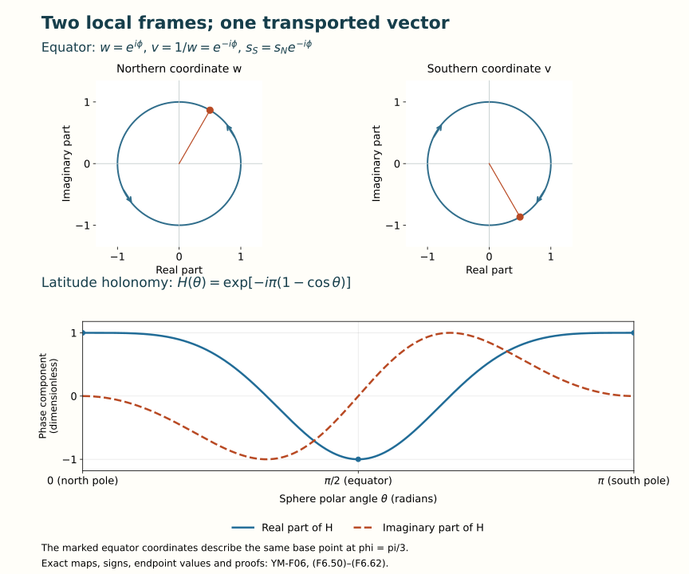

# Bundles, parallel transport and holonomy

Lesson YM-F06 · Geometry and states in Yang–Mills theory

A field need not have one set of coordinates valid everywhere.
It may have one description in each region, with a specified invertible
map on overlaps. A bundle is the space obtained by putting those
descriptions together. A connection differentiates its sections.
Parallel transport solves that differentiation rule along a path.
Holonomy records the resulting map when the path returns to its
starting point.

This lesson constructs those objects and their maps. It proves the
transport equation by a convergent matrix series, retains the order
of every factor around a loop, and works through a bundle on the sphere
that has no global frame. Preparation is
[Lesson 5](../covariant-derivatives-and-curvature.html) and its
earlier matrix and calculus lessons. No classification theorem for
bundles or general existence theorem for differential equations is
needed for the constructions below.

## 1. Coordinate regions and the spaces they describe

A topological space specifies which subsets are open: arbitrary unions
and finite intersections of open sets are open, and the empty set and
the whole space are open. A continuous map has open inverse images
of open sets. A homeomorphism is a continuous bijection with continuous
inverse. The space is Hausdorff if distinct points have disjoint
open neighbourhoods. It is second countable if a countable family
of open sets is a basis: every open neighbourhood of a point contains
a member of that family containing the point.

A smooth manifold \(M\) of dimension \(m\) is a Hausdorff,
second-countable space with coordinate charts
\(x_i:U_i\to V_i\subset\mathbb R^m\) that are homeomorphisms
onto open sets. On an overlap both coordinate changes are smooth.
Maps and functions on \(M\) are smooth when their coordinate
expressions are smooth. The chain rule proves that this definition
is independent of the chosen charts.

A tangent vector at \(p\) is a coordinate velocity, with the exact
identification

\[
 v_j=D(x_j\circ x_i^{-1})_{x_i(p)}v_i.
 \tag{F6.1}
\]

The derivative of the inverse chart makes this map invertible;
the chain rule makes three successive identifications agree.
Vector fields and differential forms therefore have compatible
coordinate expressions. For forms the map is precisely the pullback
proved in Lesson 5, (F5.30)–(F5.34), retaining all derivatives of the
coordinate maps. Exterior differentiation agrees on overlaps by
(F5.31), so it is defined on \(M\).

Only elementary consequences of these definitions will be used.
A second-countable space has a countable subcover of any open cover:
for each basis member contained in a cover member choose one such
member. Every point belongs to a basis member of this kind.
The chosen countable collection therefore covers the space.
A compact set means one for which every open cover has a finite
subcover. Closed bounded coordinate balls and closed intervals
are compact by the finite-dimensional compactness argument of Lesson 4.
Continuous images and finite unions of compact sets are compact:
pull an open cover back for the first assertion and take the union
of finitely many finite subcovers for the second.

A compact subset \(K\) of a Hausdorff space is closed. For
\(p\notin K\), separate \(p\) from each point of \(K\).
Finitely many of the neighbourhoods in \(K\) cover it. The
intersection of their corresponding neighbourhoods of \(p\)
misses \(K\); hence its complement is open. These facts justify
the gluing and finite path subdivisions used below.

## 2. Gluing vector coordinates

Fix a positive integer \(N\) and an open cover \((U_i)\) of \(M\).
For every overlap choose a smooth map
\(h_{ij}:U_i\cap U_j\to\operatorname{GL}_N(\mathbb C)\)
with

\[
 h_{ii}=I_N,\qquad h_{ij}h_{jk}=h_{ik}
 \quad\hbox{on }U_i\cap U_j\cap U_k.
 \tag{F6.2}
\]

In particular \(h_{ji}=h_{ij}^{-1}\). Our frame convention is
\(e_j=e_i h_{ij}\). Thus coordinates of the same vector satisfy

\[
 e_i\psi_i=e_j\psi_j,\qquad
 \psi_i=h_{ij}\psi_j,\qquad \psi_j=h_{ji}\psi_i.
 \tag{F6.3}
\]

Define \(E\) to be the equivalence classes in the disjoint union
of the products \(U_i\times\mathbb C^N\), with the relation

\[
 (j,x,v)\sim(i,x,h_{ij}(x)v),\qquad
 \pi[i,x,v]=x.
 \tag{F6.4}
\]

### Theorem 2.1. The gluing really is a smooth vector bundle

Each map \(e_i(x)v=[i,x,v]\) is a smooth product chart over
\(U_i\). The total space is Hausdorff and second countable.
Its fibres are vector spaces, and their linear operations are
smooth in these charts. Conversely local frames of a vector bundle
produce (F6.2) and recover the original bundle by (F6.4).

**Proof.** Reflexivity, symmetry and transitivity of the relation
are exactly the identity, inverse and triple identities in (F6.2).
Every class over \(x\in U_i\) has exactly one \(i\)-representative.
Thus the proposed product map is a bijection onto \(\pi^{-1}(U_i)\).

Give \(E\) the quotient topology: a subset is open exactly when its
inverse image in the disjoint union is open. The quotient map is
open. Indeed the saturation of an open set in its \(i\)-component
is the union of its other components' images under
\((x,v)\mapsto(x,h_{ij}(x)v)\) on overlaps. Each such map is a
homeomorphism, with smooth inverse using \(h_{ji}\). Its image
is open. Hence our product bijections and their inverses are
continuous and their images are open.

Points over different base points can be separated by inverse
images of disjoint base neighbourhoods. Two different points over
the same base point lie in one open product chart and can be
separated there. This proves Hausdorffness. Choose a countable
subcover of \((U_i)\). Each product has a countable basis, from a
base basis and rational balls in \(\mathbb R^{2N}\). Their countable
union, carried into the open products, is a countable basis of \(E\).

The chart changes are exactly
\((x,v)\mapsto(x,h_{ij}(x)v)\), combined with the base coordinate
changes where necessary. They and their inverses are smooth, giving
a smooth atlas. Addition and scalar multiplication agree between
charts because every \(h_{ij}(x)\) is linear. Their coordinate
formulas prove smoothness. Finally, in an existing bundle,
\([i,x,v]\mapsto e_i(x)v\) is well defined by (F6.3).
It and its inverse are the identity in each fibre chart, proving
the recovery assertion. \(\square\)

A section is a smooth \(s:M\to E\) with \(\pi s(x)=x\).
The exact section data are smooth columns \(\psi_i\) satisfying
(F6.3). Agreement on overlaps makes the local sections glue;
the local product charts prove the converse and smoothness.

Changing frames to \(e'_i=e_i k_i\), with smooth invertible \(k_i\),
changes the transition matrices and column coordinates by

\[
 h'_{ij}=k_i^{-1}h_{ij}k_j,\qquad
 \psi'_i=k_i^{-1}\psi_i.
 \tag{F6.5}
\]

The first identity follows by comparing
\(e'_j=e_i h_{ij}k_j\) with \(e'_i h'_{ij}\).
The map from the primed gluing to the old gluing is
\([i,x,v]'\mapsto[i,x,k_i(x)v]\).
Equation (F6.5) proves it is well defined; its inverse uses
\(k_i^{-1}\). Thus this is an actual bundle isomorphism.

For a smooth \(f:L\to M\), the pullback bundle has fibres
\((f^*E)_y=E_{f(y)}\), represented as pairs \((y,v)\) with
\(\pi(v)=f(y)\). Its charts over \(f^{-1}(U_i)\) have transitions
\(h_{ij}\circ f\). The map \((y,z)\mapsto(y,e_i(f(y))z)\)
and its inverse fibre coordinate prove both the subspace topology
and the smooth bundle structure, without assuming \(f\) invertible.

## 3. Principal frames and associated fields

Let \(G\) be one of the matrix Lie groups already constructed in
Lesson 4, and let every \(h_{ij}\) take values in \(G\).
Replace the column \(v\) in (F6.4) by a group element \(a\):

\[
 P=\{[i,x,a]:a\in G\},\qquad
 [j,x,a]=[i,x,h_{ij}(x)a],\qquad
 [i,x,a]b=[i,x,ab].
 \tag{F6.6}
\]

The same open-chart, separation and countability proof applies
with \(G\) in place of \(\mathbb C^N\). Its smooth group operations
give the smooth chart changes and right action. On each fibre the
action is free and transitive, since it is right multiplication
in a product chart. This is a principal right \(G\)-bundle.
The sections \(s_i(x)=[i,x,I]\) satisfy \(s_j=s_i h_{ij}\).

There is a smooth division map on pairs in the same fibre:

\[
 \delta:P\times_M P\longrightarrow G,\qquad
 q=p\,\delta(p,q),\qquad
 \delta(s_i(x)a,s_i(x)b)=a^{-1}b.
 \tag{F6.7}
\]

Freeness gives uniqueness, and the local expression proves
smoothness and independence of the chart. In particular
\(\delta(pa,qb)=a^{-1}\delta(p,q)b\).
A global section \(s\) gives the product isomorphism
\((x,a)\mapsto s(x)a\), with inverse
\(p\mapsto(\pi(p),\delta(s(\pi(p)),p))\).
Conversely a product isomorphism gives a section by \(a=I\).
Thus a principal bundle is trivial exactly when it has a global
smooth section.

For a vector bundle \(E\), its full frame fibre consists of all
linear isomorphisms \(p:\mathbb C^N\to E_x\), with right action
\(pa=p\circ a\). In a local frame every such \(p=e_i(x)a\),
uniquely. These charts give the principal
\(\operatorname{GL}_N(\mathbb C)\)-bundle \(\operatorname{Fr}(E)\).
If the specified transitions belong to \(G\), the frames
\(e_i(x)a\), \(a\in G\), form the corresponding principal
\(G\)-bundle inside it. The actual transition law verifies
agreement of this subset on every overlap.

Now let \(\rho:G\to\operatorname{GL}_K(\mathbb C)\) be a smooth
representation, with derivative \(r=d\rho_e\). The associated
vector bundle is the quotient

\[
 E_\rho=P\times_G\mathbb C^K,\qquad
 (p,v)\sim(pa,\rho(a^{-1})v).
 \tag{F6.8}
\]

The map \([s_i(x),v]\) gives its local fibre coordinates.
Indeed if \(p=s_i(x)a\), then

\[
 [p,v]=[s_i(x),\rho(a)v],\qquad
 \psi_i=\rho(h_{ij})\psi_j.
 \tag{F6.9}
\]

This proves uniqueness of the coordinate. To check the actual
quotient topology, the quotient map is open because the saturation
of an open set is the union of its images under the smooth group
action. Its coordinate map before quotienting is
\((x,a,v)\mapsto(x,\rho(a)v)\); it is continuous, and the inverse
product chart is its restriction to \(a=I\). Thus the quotient
charts are homeomorphisms. Their transitions are the smooth linear
matrices \(\rho(h_{ij})\), so Theorem 2.1 proves the remaining
bundle assertions.

Sections of \(E_\rho\) correspond precisely to smooth maps
\(u:P\to\mathbb C^K\) with

\[
 u(pa)=\rho(a^{-1})u(p),\qquad
 \sigma(x)=[p,u(p)],\qquad
 u(s_i(x)a)=\rho(a^{-1})\psi_i(x).
 \tag{F6.10}
\]

The relation (F6.8) proves independence of \(p\); the last formula
proves smoothness and constructs the inverse correspondence.
For the standard representation of the full frame bundle,
\([p,v]\mapsto p(v)\) is well defined since
\((pa)(a^{-1}v)=p(v)\). In fibre charts it is the identity;
it is therefore the exact isomorphism back to \(E\).
For the adjoint representation, the transition on \(X\in\mathfrak g\)
is \(X\mapsto h_{ij}Xh_{ij}^{-1}\). Bracket preservation from
Lesson 4 makes the fibrewise commutator well defined. This is
the adjoint bundle \(\operatorname{ad}(P)\).

## 4. Connections agree across the overlaps

Let \(\Gamma_i\) be matrix-valued one-forms on \(U_i\).
All equations between these forms on an overlap use the actual
base pullback when the two coordinate lists differ.
The local rule for a section is
\((D\sigma)_i=d\psi_i+\Gamma_i\psi_i\).
By (F6.3) and Lesson 5's product-rule proof, these local outputs
are coordinates of the same bundle-valued one-form exactly when

\[
 \Gamma_j=h_{ij}^{-1}\Gamma_i h_{ij}
                         +h_{ij}^{-1}dh_{ij}.
 \tag{F6.11}
\]

This is the convention \(g=h_{ij}^{-1}\) in (F5.5), with no
change of the original derivative. Sufficiency follows by direct
substitution. Necessity follows by testing every local constant
column in the equality
\(D_j(h_{ij}^{-1}\psi_i)=h_{ij}^{-1}D_i\psi_i\).
Thus (F6.11) gives an intrinsic derivative on all local sections,
and on global sections in particular.

The curvature and differences of connections have simpler overlap
rules, proved in Lesson 5:

\[
 F_i=d\Gamma_i+\Gamma_i\wedge\Gamma_i,\quad
 F_j=h_{ij}^{-1}F_i h_{ij},\quad
 (\Gamma'_j-\Gamma_j)
       =h_{ij}^{-1}(\Gamma'_i-\Gamma_i)h_{ij}.
 \tag{F6.12}
\]

Hence \(F\) is an \(\operatorname{End}(E)\)-valued two-form,
and a difference of connections is an
\(\operatorname{End}(E)\)-valued one-form. In a principal
\(G\)-description these take values in \(\operatorname{ad}(P)\).
The trace pairings of F05 agree across overlaps.

### The full principal connection form

For \(\mathfrak g\)-valued \(\Gamma_i\), define on \(p=s_i(x)a\)

\[
 \omega_{(x,a)}(X,V)
       =a^{-1}\Gamma_i(X)a+a^{-1}V,\qquad V\in T_aG.
 \tag{F6.13}
\]

The tangent \(a^{-1}V\) lies in \(\mathfrak g\), by translating
a curve through \(a\) to the identity. On an overlap write
\(a_i=h_{ij}a_j\). Differentiation gives
\(da_i=(dh_{ij})a_j+h_{ij}da_j\); inserting both terms in
(F6.13) gives

\[
 a_i^{-1}\Gamma_i a_i+a_i^{-1}da_i
 =a_j^{-1}\bigl(h_{ij}^{-1}\Gamma_i h_{ij}
                    +h_{ij}^{-1}dh_{ij}\bigr)a_j+a_j^{-1}da_j.
 \tag{F6.14}
\]

Equation (F6.11) proves that these forms glue on the whole total
space. The fundamental vertical vector for \(Y\in\mathfrak g\)
is the velocity of \(p\exp(tY)\), namely \((0,aY)\) in this
chart. It has \(\omega\)-value \(Y\). For constant \(b\in G\),
right translation sends \((X,V)\) to \((X,Vb)\) at \((x,ab)\),
so

\[
 \omega(\zeta_Y)=Y,\qquad R_b^*\omega=b^{-1}\omega b.
 \tag{F6.15}
\]

The horizontal tangent vectors, defined by \(\omega=0\), have
the exact graph

\[
 V=-\Gamma_i(X)a.
 \tag{F6.16}
\]

They complement the vertical vectors and are preserved by right
translations. Conversely, a smooth right-invariant complement
defines its vertical projection; write each vertical vector
uniquely as \(\zeta_Y(p)\), and set \(\omega\) equal to that \(Y\).
In local product coordinates the complement is a graph, so this
form is smooth. The same vertical decomposition proves (F6.15),
and splitting a tangent into its base and group components gives
(F6.13) with \(\Gamma_i=s_i^*\omega\). This proves the equivalence
between local connection data, the principal form and its horizontal
distribution.

The full curvature upstairs is

\[
 \Omega=d\omega+\omega\wedge\omega=a^{-1}F_i a.
 \tag{F6.17}
\]

Here the right side is the pullback of \(F_i\) to \(U_i\times G\)
followed by conjugation; it vanishes if either tangent argument
is vertical. To prove (F6.17) without omitting the group derivatives,
pull \(\Gamma_i\) back by the product projection and apply F05's
full gauge formula on every coordinate chart of \(U_i\times G\),
with the varying matrix \(g(x,a)=a^{-1}\).
Its transformed connection is
\(a^{-1}\Gamma_i a-d(a^{-1})a
=a^{-1}\Gamma_i a+a^{-1}da=\omega\).
The already proved curvature covariance, including the differentiated
inverse, gives exactly (F6.17).

For an associated representation the local connection is \(r(\Gamma_i)\);
F05 (F5.48)–(F5.49) proves its compatibility and curvature \(r(F_i)\).
This gives the global derivative on \(E_\rho\), not merely a
similar-looking collection of local operators.

### Existence of connection data

Every bundle just constructed over the stated manifold admits a
connection. For an empty base the assertion is the unique empty
construction. Assume the base nonempty below. We supply the smooth
weights needed for the proof.

Choose relatively compact coordinate balls about every base point.
The countable-subcover argument gives open balls \(O_n\) covering
\(M\), with compact closures \(C_n\) contained in their charts.
Take increasing finite unions \(K_j\) of these closures so that
\(K_j\subset\operatorname{int}K_{j+1}\) and
\(\bigcup_jK_j=M\). Recursively, after choosing \(K_j\), finitely
many \(O_n\) cover it; include their closures and the next unused
indexed closure in \(K_{j+1}\). The open union of those balls
contains \(K_j\), proving the interior inclusion and exhaustion.

Put \(K_{-1}=K_{-2}=\varnothing\). Each compact layer
\(K_j\setminus\operatorname{int}K_{j-1}\) lies in the open shell
\(\operatorname{int}K_{j+1}\setminus K_{j-2}\).
Cover that layer by finitely many smaller coordinate balls whose
larger closed balls lie in the shell and a bundle chart. Such
choices exist by openness in a coordinate chart and compactness
of the layer. Over all layers these smaller balls cover \(M\).
The larger balls are locally finite: a neighbourhood inside
\(\operatorname{int}K_k\) misses every shell with \(j\geq k+2\);
only finitely many balls from the preceding layers remain.

In each larger coordinate ball of radius \(R_\ell\) and centre
\(c_\ell\), set

\[
 b_\ell(x)=
 \begin{cases}
  \exp\!\bigl(-1/(R_\ell^2-|x-c_\ell|^2)^2\bigr),
                         &|x-c_\ell|<R_\ell,\\
  0,&\text{outside that ball},
 \end{cases}
 \qquad
 \phi_\ell=\dfrac{b_\ell}{\sum_k b_k}.
 \tag{F6.18}
\]

The coordinate expression is extended by zero to \(M\).
Every derivative of \(e^{-1/s^2}\) for \(s>0\) is a polynomial
in \(1/s\) times that exponential. Each tends to zero at \(s=0\):
for any power \(s^{-d}\), put \(y=1/s^2\) and use
\(e^y\geq y^n/n!\) with \(n>d/2\).
Induction and the definition of a derivative at the endpoint show
that the zero extension has all derivatives zero there.
Thus all \(b_\ell\) are smooth. Their supports are compact inside
the larger bundle charts, so extension by zero is smooth also
across the chart boundary. The sum in (F6.18) is locally finite
and positive, because the smaller balls cover \(M\). Consequently
the \(\phi_\ell\) are smooth, sum to one, and have the same
controlled supports.

On each corresponding principal product choose the connection
with local potential zero. Denote its full form by \(\omega_\ell\).
Then

\[
 \omega=\sum_\ell(\phi_\ell\circ\pi)\omega_\ell
 \tag{F6.19}
\]

is a well-defined smooth form, each term extended by zero outside
that principal chart. The support and local-finiteness facts just
proved justify this extension and sum. Right translation fixes
each weight, so the equivariance in (F6.15) is retained.
On \(\zeta_Y\) the value is \((\sum_\ell\phi_\ell)Y=Y\).
The equivalence proved above makes (F6.19) a connection.
The same construction on \(\operatorname{Fr}(E)\) supplies
a connection on every vector bundle here. No agreement between
the unweighted local zero potentials was assumed.

## 5. Global gauge transformations

A gauge transformation of \(P\) is a smooth map
\(\Phi:P\to P\) over the identity of \(M\) that commutes with
the right action. Write
\(\Phi(s_i)=s_i k_i\). Equivariance forces

\[
 \Phi(s_i(x)a)=s_i(x)k_i(x)a,\qquad
 k_j=h_{ij}^{-1}k_i h_{ij}.
 \tag{F6.20}
\]

The second identity follows by computing \(\Phi(s_j)=\Phi(s_i h_{ij})\)
in both charts and using freeness. Conversely compatible \(k_i\)
define such a map; the local inverse uses \(k_i^{-1}\), proving
that it is an automorphism. Thus on a general bundle its gauge
data are compatible local functions, not an arbitrary unqualified
single function \(M\to G\).

On the associated bundle, \([p,v]\mapsto[\Phi(p),v]\) sends
\(\psi_i\) to \(\rho(k_i)\psi_i\). For the defining representation
write the resulting derivative as \(D'=\Phi D\Phi^{-1}\) on
sections. F05 gives

\[
 \Gamma'_i=k_i\Gamma_i k_i^{-1}-(dk_i)k_i^{-1},
 \qquad F'_i=k_iF_i k_i^{-1}.
 \tag{F6.21}
\]

Compatibility (F6.20) and the intrinsic definition of \(D'\)
show these are valid connection data on the same bundle.
This transformation changes sections by \(\psi'_i=k_i\psi_i\).
The passive replacement \(e'_i=e_i k_i\), in contrast, uses
\(\psi'_i=k_i^{-1}\psi_i\) and (F6.5). Their precise inverse
relation is already (F5.7). Stating which map acts on the section
fixes the sign and prevents a convention from being guessed.

## 6. Solving the transport equation

Let \(\gamma:[a,b]\to U_i\) be a smooth path, smooth up to its
endpoints. Write its full connection coefficient as

\[
 B(t)=\Gamma_{i,\gamma(t)}(\dot\gamma(t))
     =\sum_{\mu=1}^m
         \Gamma_{i,\mu}(\gamma(t))\,\dot\gamma^\mu(t).
 \tag{F6.22}
\]

A parallel column satisfies \(v'(t)+B(t)v(t)=0\).
We construct its fundamental matrix rather than assume a solution.

### Theorem 6.1. The ordered series and its error bound

For continuous \(B:[a,b]\to M_N(\mathbb C)\), the unique solution
of \(U'=-BU,\ U(a)=I_N\) is

\[
 \begin{aligned}
 U(t,a)&=I_N+\sum_{n=1}^{\infty}(-1)^n
  \int_a^t dt_1\int_a^{t_1}dt_2\cdots\int_a^{t_{n-1}}dt_n\,
                    B(t_1)B(t_2)\cdots B(t_n).
 \end{aligned}
 \tag{F6.23}
\]

Later times stand to the left. With the original Frobenius matrix
norm, \(M=\sup_{[a,b]}\|B(t)\|_{\mathrm F}\), \(L=b-a\),
and \(U^{[k]}\) the sum through \(n=k\), we have

\[
 \begin{aligned}
 \|U_n(t,a)\|_{\mathrm F}
    &\leq \sqrt N\,\frac{(M(t-a))^n}{n!},\\
 \|U(t,a)\|_{\mathrm F}&\leq\sqrt N\,e^{M(t-a)},\\
 \|U(t,a)-U^{[k]}(t,a)\|_{\mathrm F}
    &\leq\sqrt N\,e^{ML}\frac{(ML)^{k+1}}{(k+1)!}.
 \end{aligned}
 \tag{F6.24}
\]

The first bound includes \(n=0\), where \(U_0=I_N\) and its
norm is exactly \(\sqrt N\).

**Proof.** Equivalently set \(U_0=I_N\) and
\(U_n(t)=-\int_a^t B(s)U_{n-1}(s)\,ds\).
Submultiplicativity from F04 and induction give the first bound,
since integrating \((s-a)^{n-1}/(n-1)!\) gives
\((t-a)^n/n!\). Iterating the integral gives exactly (F6.23).
The scalar exponential series dominates uniformly on the interval,
so the matrix series converges uniformly.

Multiplication by bounded \(B\) and integration preserve its limit:
the difference of integrals is at most \(LM\) times the uniform
difference of the matrix partial sums. Passing to the limit in
the recursive identity therefore gives
\(U(t)=I_N-\int_a^t B(s)U(s)\,ds\).
The fundamental theorem makes \(U\) continuously differentiable
and gives the stated equation and initial value.

If \(v,w\) are two solutions with the same initial value, their
difference \(z\) obeys \(z(t)=-\int_a^t B(s)z(s)\,ds\).
Let \(C=\sup\|z(t)\|\), finite by continuity. Iterating this
identity \(n\) times bounds \(\|z(t)\|\) by
\(C(ML)^n/n!\), which tends to zero: successive terms have
ratio \(ML/(n+1)\). Hence \(z=0\). This proves uniqueness
for columns and, column by column, matrices.

The exponential bound is the sum of the first inequalities.
For the remainder put \(A=ML\) and \(n=k+1+j\).
Since \((k+1+j)!\geq(k+1)!\,j!\), its majorant is at most
\(\sqrt N A^{k+1}e^A/(k+1)!\), proving the final bound.
For \(M=0\) the series is exactly \(I_N\) and the same
statements hold. \(\square\)

The right matrix equation \(V'=VB,\ V(a)=I_N\) is constructed
by the identical integral argument with multiplication on the
other side. Its product satisfies
\((VU)'=VBU-VBU=0\), so \(VU=I_N\).
The finite square-matrix inverse criterion of F03 then gives
\(UV=I_N\). Thus \(U(t,a)\) is invertible at every time,
and every initial column is transported to \(U(t,a)v(a)\).

Uniqueness gives the full identities, for times in any order
where the indicated oriented transport is defined:

\[
 U(t,s)U(s,r)=U(t,r),\qquad
 U(s,t)=U(t,s)^{-1},\qquad U(s,s)=I_N.
 \tag{F6.25}
\]

For increasing times the product solves the same differential
equation with the same initial value; inversion defines and
verifies the reversed direction. A piecewise smooth path has
finitely many continuous coefficient pieces. Solve successively
on them, passing the exact endpoint matrix to the next piece.
This gives existence and uniqueness across all corners.

### Smooth parameters and preservation of the group

If \(B(t,\lambda)\) is smooth in a finite set of parameters and
smooth up to each fixed time piece, \(U\) is smooth in those
parameters. Here is a direct justification. On a compact parameter
box let \(C_r\geq1\) bound every derivative of \(B\) of order
at most \(r\). Differentiating a product of \(n\) factors \(r\)
times in specified parameter coordinates gives at most \(n^r\)
terms, each bounded by \(C_r^n\). Thus the differentiated \(n\)-th integral is
bounded by

\[
 \sqrt N\,n^r\frac{(C_rL)^n}{n!}\qquad(n\geq1).
 \tag{F6.26}
\]

The ratio test proves uniform convergence for each derivative
order. Integrating a derivative along a parameter coordinate
segment proves that the derivative of the sum is that uniform
limit, by the fundamental theorem; induction proves all orders.
The equation \(U'=-BU\) then gives every time and mixed derivative.
Varying endpoints can be put on a fixed interval by an affine
time parametrization; the same argument applies. This proves
the parameter regularity used later for moving rectangles and paths.

If \(B^\dagger=-B\), differentiation gives
\((U^\dagger U)'=-U^\dagger(B^\dagger+B)U=0\).
Thus \(U^\dagger U=I_N\). If also \(\operatorname{tr}B=0\),
the determinant derivative of F04 gives

\[
 (\det U)'=(\det U)\operatorname{tr}(U^{-1}U')
          =-(\det U)\operatorname{tr}B=0.
 \tag{F6.27}
\]

The determinant is therefore one. This proves preservation
of \(U(N)\) and \(SU(N)\). Real coefficients give real solutions
by the series; transposes give preservation of \(O(N)\).
Its determinant cannot change from \(+1\) to \(-1\) continuously
without vanishing, so an orthogonal solution starting at the
identity lies in \(SO(N)\). Invertibility already proves the
assertion for the real and complex general linear groups.

For a smooth representation, the actual group curve
\(U(t+h)U(t)^{-1}\) has velocity \(-B(t)\) at \(h=0\).
The chain rule therefore gives

\[
 \frac{d}{dt}\rho(U(t,a))=-r(B(t))\rho(U(t,a)).
 \tag{F6.28}
\]

Its initial value is \(I_K\), so uniqueness identifies it with
transport for the associated connection \(r(\Gamma)\).
This constructs the transport map between the actual representations.

## 7. Transport across several coordinate regions

For a smooth piece of path in an overlap, let \(g(t)=h_{ij}(\gamma(t))^{-1}\).
The same product rule as in F05 shows that the two fundamental
matrices satisfy the endpoint formula

\[
 U_j(t,s)
   =h_{ij}(\gamma(t))^{-1}
                  U_i(t,s)h_{ij}(\gamma(s)).
 \tag{F6.29}
\]

Indeed the right side has value \(I_N\) at \(t=s\).
Differentiating it and using (F6.11) gives \(-B_j\) times
that same right side. Theorem 6.1 proves equality. This is
the precise cancellation that lets a solution cross an overlap.

Every continuous piecewise smooth path on a compact interval has
a finite subdivision whose closed pieces lie in bundle charts.
To prove this, take the inverse images of the charts as an open
cover of the interval. Around each time choose a relative interval
of radius \(2\epsilon\) inside a cover member. Finitely many
intervals of radius \(\epsilon\) cover the interval. Choose
\(\delta>0\) below the minimum of these finitely many radii.
Any interval of length below \(\delta\) lies in a larger chosen
interval: select one of its points in a smaller interval and
use the triangle inequality. Divide time into pieces this short,
also inserting its finitely many original corners.

Suppose segment \(j\), from \(t_{j-1}\) to \(t_j\), uses frame
\(i_j\), for \(j=1,\ldots,k\), and write \(U_j=U_{i_j}(t_j,t_{j-1})\).
The complete coordinate transport is

\[
 U_k\,h_{i_k i_{k-1}}(\gamma(t_{k-1}))\,U_{k-1}
       \cdots
 h_{i_2 i_1}(\gamma(t_1))\,U_1.
 \tag{F6.30}
\]

It maps initial coordinates in frame \(i_1\) to final coordinates
in frame \(i_k\). At a crossing (F6.3) says exactly that the new
coordinates are \(h_{i_j i_{j-1}}\) times the old ones.
Every transition factor in (F6.30) is therefore required.

Refining a segment changes no result by (F6.25). Two chart choices
have a common finite refinement, and (F6.29) makes their transported
vectors agree on every overlap. Starting with the same initial
vector and proceeding through the common refinement proves
independence of all the choices. We have constructed a linear
isomorphism of actual fibres

\[
 T_\gamma:E_{\gamma(a)}\longrightarrow E_{\gamma(b)}.
 \tag{F6.31}
\]

It preserves the given metric for a unitary or orthogonal connection,
by the local calculation and metric-compatible transitions.
It has inverse \(T_{\bar\gamma}\), where
\(\bar\gamma(t)=\gamma(a+b-t)\); the reversed solution satisfies
the reversed equation by the chain rule.
If \(\gamma_2\) is followed after \(\gamma_1\), then

\[
 T_{\gamma_2*\gamma_1}=T_{\gamma_2}\circ T_{\gamma_1}.
 \tag{F6.32}
\]

The concatenated solution and uniqueness prove the order.
An increasing piecewise smooth change of time, including pauses,
also leaves the map unchanged: composing a solution with the
new time multiplies both terms of its equation by that time's
derivative. There is no division by the derivative, so its zero
values cause no problem. The preimages of the finitely many
old corner times are points or intervals; inserting their endpoints
gives the needed finite smooth subdivision.

For the principal bundle the local horizontal equation (F6.16)
is \(a'=-B a\); thus \(a(t)=U(t,s)a(s)\) and remains in \(G\).
This defines principal transport, denoted \(T_\gamma^P\).
It obeys
\(T_\gamma^P(pb)=T_\gamma^P(p)b\).
The associated transport is exactly

\[
 [p,v]\longmapsto[T_\gamma^P(p),v].
 \tag{F6.33}
\]

Changing the representative by \(b\) gives the same output by
equivariance and (F6.8). In local coordinates (F6.28) identifies
this map with the solution already constructed for \(E_\rho\).

Transport varies smoothly with a finite-dimensional smooth family
of paths having a fixed finite set of time pieces. Locally in its
parameters, one finite subdivision and set of charts works for
all paths near a given one. For each closed segment this follows
by continuity at every time, a finite time subcover and the
intersection of the resulting finitely many parameter neighbourhoods.
The parameter series proof and the finite product (F6.30) then
give the asserted smoothness, including smoothly varying endpoints.

Under the gauge action (F6.21), transport intertwines the endpoint
actions:

\[
 T'_\gamma=\Phi_{\gamma(b)}T_\gamma\Phi_{\gamma(a)}^{-1}.
 \tag{F6.34}
\]

Locally this is \(U'=k(\gamma(b))U k(\gamma(a))^{-1}\),
proved as in (F6.29). The intermediate endpoint factors cancel
in (F6.30), giving the intrinsic formula.

## 8. Closed paths and Wilson loops

For a loop \(\gamma\) based at \(x\), transport is an automorphism
of \(E_x\). In a chosen principal frame \(p\in P_x\), define
\(H_p(\gamma)\in G\) by

\[
 T_\gamma^P(p)=pH_p(\gamma).
 \tag{F6.35}
\]

The division map proves existence and uniqueness. Its matrices
act on the coordinates of the associated fibre by \(\rho(H_p)\).
The set of all \(H_p(\gamma)\) is the holonomy group at \(p\).
It is a subgroup: the constant path gives the identity, reversal
gives inverses, and (F6.32) with equivariance gives

\[
 H_p(\gamma_2*\gamma_1)=H_p(\gamma_2)H_p(\gamma_1),
 \qquad H_{pa}(\gamma)=a^{-1}H_p(\gamma)a.
 \tag{F6.36}
\]

For the first formula,
\(T_{\gamma_2}^P(pH_1)=T_{\gamma_2}^P(p)H_1=pH_2H_1\).
For the second,
\(T_\gamma^P(pa)=pH_pa=(pa)(a^{-1}H_pa)\).
This proves both orders without a convention about chronological
products being left implicit.

If a path \(\eta\) goes from \(x\) to \(y\), set \(q=T_\eta^P(p)\).
For a loop \(\gamma\) at \(y\), the loop that first follows
\(\eta\), then \(\gamma\), then \(\bar\eta\) has
\(H_p=H_q(\gamma)\). This follows by transporting the actual
point \(p\) through those three maps and using equivariance on
the return. Thus the groups at different base points in one path
component are identified after a transport frame is specified.

For a fixed representation the Wilson trace is

\[
 W_\rho(\gamma)=\operatorname{tr}\rho(H_p(\gamma)).
 \tag{F6.37}
\]

It is independent of the chosen frame and invariant under gauge
transformations, by conjugation in (F6.34)–(F6.36) and cyclicity
of trace. We retain the full trace; no division by the dimension
of the representation is included. For a unitary representation,
reversal replaces the matrix by its adjoint, so
\(W_\rho(\bar\gamma)=\overline{W_\rho(\gamma)}\).
Gauge invariance does not make a single trace a complete
description of a connection.

Holonomy need not depend only on endpoints or on the homotopy
class of a loop. The next calculation shows precisely how
curvature enters. Nor have we assumed that the holonomy subgroup
is a closed subset of \(G\); Exercise 8 gives a nonclosed example.

## 9. Curvature is the leading small-loop transport

Work in a base chart with coordinates \(x,y\) near \((0,0)\).
Restrict any remaining coordinates to their fixed values and
write \(A(x,y)=\Gamma_x(x,y)\), \(B(x,y)=\Gamma_y(x,y)\).
Let \(L(a,y)\) transport from \((0,y)\) to \((a,y)\), and
\(V(x,b)\) from \((x,0)\) to \((x,b)\).
They are smooth functions of their parameters by Section 6.
For the rectangle traversed first in positive \(x\), then positive
\(y\), then back in \(x\), then back in \(y\), its full holonomy is

\[
 H(a,b)=V(0,b)^{-1}L(a,b)^{-1}V(a,b)L(a,0).
 \tag{F6.38}
\]

### Theorem 9.1. Sign, coefficient and controlled remainder

On a sufficiently small closed coordinate rectangle
\(|a|,|b|\leq\epsilon\), put

\[
 K=\max_{|s|,|t|\leq\epsilon}
 \max\{\|\partial_a^2\partial_bH(s,t)\|_{\mathrm F},
        \|\partial_a\partial_b^2H(s,t)\|_{\mathrm F}\}.
 \tag{F6.39}
\]

This is finite, and the exact bound is

\[
 \left\|H(a,b)-I_N+abF_{xy}(0,0)\right\|_{\mathrm F}
       \leq \frac K2\,|ab|(|a|+|b|).
 \tag{F6.40}
\]

**Proof.** The axes satisfy \(H(a,0)=H(0,b)=I_N\).
At the origin the transport equations give
\(L_a=-A_0\), \(V_b=-B_0\),
and their inverse derivatives have the opposite signs.
The mixed derivative of \(V(a,b)\) at zero is \(-\partial_xB_0\);
the mixed derivative of \(L(a,b)^{-1}\) is \(+\partial_yA_0\).
These follow by differentiating \(V_b(x,0)=-B(x,0)\)
and \(L_a(0,y)=-A(0,y)\), respectively; the inverse is
the identity along the corresponding zero axis.

In the product (F6.38), the nonzero cross terms in the mixed
derivative, in their actual order, are

\[
 B_0A_0-B_0A_0-A_0B_0+B_0A_0.
 \tag{F6.41}
\]

They come from the factor pairs \(1,2\), \(1,4\), \(2,3\)
and \(3,4\). Including the two individual mixed derivatives gives

\[
 \partial_a\partial_bH(0,0)
   =\partial_yA_0-\partial_xB_0+B_0A_0-A_0B_0
   =-F_{xy}(0,0).
 \tag{F6.42}
\]

All products use the column convention of F05.
Twice integrating the mixed derivative, using both constant axis
values, yields

\[
 H(a,b)-I_N
      =\int_0^a\int_0^b
                  \partial_a\partial_bH(s,t)\,dt\,ds.
 \tag{F6.43}
\]

The third derivatives are continuous, hence bounded on the compact
rectangle. Integrate each along the coordinate segment from
\((0,0)\) to \((s,0)\) to \((s,t)\); (F6.39) bounds the
change of the mixed derivative by \(K(|s|+|t|)\).
Integrating that bound with absolute values for either orientation
gives exactly (F6.40). The formula includes \(a=0\) or \(b=0\),
where both sides are zero. \(\square\)

### Moving an entire path

For a smooth family \(\gamma(s,t)\), \(0\leq t\leq1\), inside
one bundle chart, pull the connection back to the parameter
rectangle and write
\(\gamma^*\Gamma=A(s,t)\,ds+B(s,t)\,dt\).
Let \(U(s,t)\) solve \(U_t=-BU,\ U(s,0)=I_N\).
Its pullback curvature coefficient is
\(F_{st}=\partial_sB-\partial_tA+[A,B]\).
A direct calculation retaining both endpoint terms gives

\[
 \begin{aligned}
 \partial_sU(s,1)
  ={}&-A(s,1)U(s,1)+U(s,1)A(s,0)\\
    &-U(s,1)\int_0^1
                 U(s,t)^{-1}F_{st}(s,t)U(s,t)\,dt.
 \end{aligned}
 \tag{F6.44}
\]

To prove it, set \(Z=\partial_sU+AU\).
Differentiating \(U_t=-BU\) and using the product rule gives
\(Z_t=-BZ-F_{st}U\).
Since \((U^{-1})_t=U^{-1}B\), we get
\((U^{-1}Z)_t=-U^{-1}F_{st}U\).
At \(t=0\) its value is \(A(s,0)\), because the initial
matrix is constant in \(s\). Integration and multiplication
by \(U(s,1)\) prove (F6.44).

For fixed endpoints, \(\partial_s\gamma(s,0)=
\partial_s\gamma(s,1)=0\), so both \(A\)-endpoint terms vanish.
For a flat connection \(F=0\), (F6.44) then proves that
transport is unchanged under this homotopy.

This last statement extends to a fixed-endpoint homotopy that is
smooth on each rectangle of a fixed finite parameter subdivision,
with continuity across their boundaries. This is the piecewise
smooth homotopy convention used here. It may meet several bundle
charts. Cover its compact parameter
square by inverse images of charts. The finite-radius argument
used for the interval, using Euclidean disks and the diameter
of a small square, gives a finite rectangular grid with each
small square mapping into one chart. Insert the fixed smooth
piece boundaries as well. In one such chart and with \(F=0\),
(F6.44) proves that its two boundary paths with the same endpoints
have the same transport: deform one into the other by linear
paths in the parameter square, split into finitely many smooth
pieces. Replacing one boundary path by the other across
successive squares proves the equality across a whole strip
and then the whole grid. Shared edges cancel by reversal.
At fixed endpoints the two vertical boundary transports are
identities. Thus the original and final paths have equal
transport on the actual fibres. Only the stated piecewise
smooth homotopies are used in this argument.

### Flatness supplies a local parallel frame

On a star-shaped coordinate domain \(U\) about \(x_0\), suppose
\(F=0\). Let \(S(x)\) be transport from \(x_0\) to \(x\) along
the segment \(x_0+t(x-x_0)\). Section 6 proves that \(S\) is
smooth and invertible. Apply (F6.44) to
\(\gamma(s,t)=x_0+t(x(s)-x_0)\). The initial endpoint is fixed,
the curvature term vanishes, and the final endpoint term is
\(\Gamma_x(\dot x)\). Consequently

\[
 dS=-\Gamma S,\qquad
 \Gamma=-dS\,S^{-1},\qquad
 \Gamma^{S^{-1}}=0.
 \tag{F6.45}
\]

The last identity is direct substitution in (F5.29).
Thus flatness gives a proved local trivializing gauge, with its
actual construction. The converse follows from curvature
covariance: a gauge transformation of zero has zero curvature.
Coordinate balls give this equivalence locally on any bundle.
Global loops can still prevent one global parallel frame.

## 10. Two complete loop calculations

### Noncommuting constant coefficients

Use F04's \(T_a=-i\sigma_a/2\), with
\([T_1,T_2]=T_3\) and
\(-\operatorname{tr}(T_aT_b)=\delta_{ab}/2\).
For \(\Gamma=aT_1dx+bT_2dy\), travel around
\([0,\ell]\times[0,h]\) in the positive order of Section 9.
The four exact segment matrices and their total are

\[
 e^{-a\ell T_1},\quad e^{-bhT_2},\quad
 e^{a\ell T_1},\quad e^{bhT_2},\qquad
 H=e^{bhT_2}e^{a\ell T_1}e^{-bhT_2}e^{-a\ell T_1}.
 \tag{F6.46}
\]

All factors are obtained from the constant-coefficient version
of (F6.23), which is the full matrix exponential of F04.
The leading term is
\(-ab\ell hT_3\), in agreement with the original curvature
\(F_{xy}=abT_3\) and the sign in (F6.40).

Put \(A=a\ell\), \(B=bh\) solely as labels for the displayed
products; these full factors remain present in the answer.
The identity \(e^{AT_j}=\cos(A/2)I_2+2\sin(A/2)T_j\)
and the conjugation
\(e^{BT_2}T_1e^{-BT_2}=\cos B\,T_1-\sin B\,T_3\)
give

\[
 \operatorname{tr}H
   =2\cos^2(a\ell/2)+2\sin^2(a\ell/2)\cos(bh)
   =2-4\sin^2(a\ell/2)\sin^2(bh/2).
 \tag{F6.47}
\]

For the first equality, multiply the conjugated first exponential
by \(e^{-AT_1}\). The scalar terms contribute
\(2\cos^2(A/2)\); the product of the \(T_1\) terms contributes
\(-4\sin^2(A/2)\cos B\,\operatorname{tr}T_1^2
=2\sin^2(A/2)\cos B\). All other terms have zero trace.
The second equality is the elementary cosine double-angle identity.
When \(a\ell=bh=\pi\), the matrix is \(-I_2\), with trace \(-2\).
Multiplying the four matrices \(2T_j\) and their inverses
using the Pauli products proves that endpoint directly.

### A flat connection with nontrivial transport

On \(\mathbb R^2\setminus\{0\}\), put

\[
 \omega_0=\frac{-y\,dx+x\,dy}{x^2+y^2},\qquad
 \Gamma_\kappa=-i\kappa\omega_0,\quad \kappa\in\mathbb R.
 \tag{F6.48}
\]

F05 Exercise 7 calculated \(d\omega_0=0\), retaining both quotient
derivatives. The scalar product term is zero, hence \(F=0\).
For a path, scalar commutativity makes the exact solution
\(U=\exp(i\kappa\int_\gamma\omega_0)\): differentiating this
expression proves the equation and its initial value.

For a closed path the phase
\(z(t)=(x(t)+iy(t))/\sqrt{x(t)^2+y(t)^2}\) is a smooth
unit-complex-valued path on each piece, and direct differentiation
gives \(z^{-1}dz=i\omega_0\).
F03's phase-lifting lemma therefore gives
\(\int_\gamma\omega_0=2\pi n\) for an integer \(n\).
Every integer occurs by traversing a circle \(n\) times, reversing
orientation for negative \(n\). Thus the entire holonomy group is

\[
 \operatorname{Hol}(\Gamma_\kappa)
       =\{e^{2\pi i\kappa n}:n\in\mathbb Z\}.
 \tag{F6.49}
\]

For \(\kappa=1/2\), once-around transport is \(-1\);
the group is \(\{1,-1\}\). A global gauge killing the connection
would conjugate every loop transport to the identity by (F6.34),
which is impossible. Equation (F6.45) still constructs a parallel
frame on every small coordinate ball.
For charge \(q\ne0\), the electromagnetic vector-potential family
has physical parameter \(\kappa_{\mathrm{em}}=\hbar\kappa/q\);
substitution into F05 (F5.53) gives exactly (F6.48).
The transport retains the full phase \(q\int A\cdot dx/\hbar\).

## 11. A bundle on the sphere with no global frame

Define \(\mathbb{CP}^1\) to be the set of complex one-dimensional
subspaces of \(\mathbb C^2\). A nonzero pair \((z_0,z_1)\)
represents the same point as \((\lambda z_0,\lambda z_1)\)
for \(\lambda\ne0\); write its point as \([z_0:z_1]\).
Give the space the quotient topology from
\(\mathbb C^2\setminus\{0\}\).
The quotient map is open: the saturation of an open set is
the union of its nonzero scalar multiples, each open.

On \(z_0\ne0\) use \(w=z_1/z_0\), and on \(z_1\ne0\)
use \(v=z_0/z_1\). Their inverses are \(w\mapsto[1:w]\)
and \(v\mapsto[v:1]\); the quotient definition proves continuity
in both directions. On the overlap,

\[
 v=1/w,\qquad
 \Theta(w)=\frac{(2\operatorname{Re}w,\,
                 2\operatorname{Im}w,\,1-|w|^2)}{1+|w|^2}.
 \tag{F6.50}
\]

The map \(\Theta\) lands on the unit sphere \(S^2\).
Its inverse off the south pole is \(w=(X+iY)/(1+Z)\).
The second chart maps to
\((2\operatorname{Re}v,-2\operatorname{Im}v,|v|^2-1)/(1+|v|^2)\),
with inverse \(v=(X-iY)/(1-Z)\) off the north pole.
Substitution using \(X^2+Y^2+Z^2=1\) verifies all inverse
identities. They agree when \(v=1/w\), so this is a homeomorphism
and a smooth chart identification with \(S^2\).
In particular the base is Hausdorff and second countable.
The spheres themselves are smooth in elementary hemisphere charts:
choose a nonzero real coordinate and express it as
\(\pm\sqrt{1-\text{sum of the other coordinate squares}}\).
These open charts cover the sphere and have smooth transitions.

Let \(P=S^3=\{(z_0,z_1):|z_0|^2+|z_1|^2=1\}\), projecting
to the represented line. Scalar multiplication by \(a\in U(1)\)
is the right action. Define unit local sections

\[
 s_N(w)=\frac{(1,w)^T}{\sqrt{1+|w|^2}},\qquad
 s_S(v)=\frac{(v,1)^T}{\sqrt{1+|v|^2}}.
 \tag{F6.51}
\]

For \(z_0\ne0\), the unique product coordinates are
\(w=z_1/z_0\) and \(a=z_0/|z_0|\), with
\(z=s_N(w)a\); the identity
\(|z_0|^2(1+|w|^2)=1\) verifies it.
The second chart uses \(v=z_0/z_1\) and \(a=z_1/|z_1|\).
These formulas and their inverses are smooth and equivariant.
They prove directly that \(P\to\mathbb{CP}^1\) is a principal
\(U(1)\)-bundle. Its exact transition is

\[
 s_S(1/w)=s_N(w)h_{NS}(w),\qquad
 h_{NS}(w)=\frac{|w|}{w}\quad(w\ne0).
 \tag{F6.52}
\]

Indeed multiplying \(s_N\) by \(|w|/w\) gives
\((|w|/w,|w|)^T/\sqrt{1+|w|^2}\), exactly \(s_S(1/w)\).

Its associated standard line is the tautological line: the fibre
over \(\ell\) is \(\ell\subset\mathbb C^2\). The full map is

\[
 [z,\xi]\longmapsto([z],\,\xi z).
 \tag{F6.53}
\]

The relation \((z,\xi)\sim(za,a^{-1}\xi)\) preserves the product.
In each unit frame (F6.51) this is the identity on \(\xi\),
proving a smooth fibrewise linear isomorphism with smooth inverse.

### The connection and its two full potentials

On \(S^3\) define

\[
 \omega=z^\dagger dz=\bar z_0\,dz_0+\bar z_1\,dz_1.
 \tag{F6.54}
\]

A tangent vector \(V\) satisfies
\(2\operatorname{Re}(z^\dagger V)=0\), by differentiating
\(z^\dagger z=1\). Thus \(\omega\) is \(i\mathbb R\)-valued.
On the fundamental vector \(i\lambda z\) it gives
\(i\lambda z^\dagger z=i\lambda\); under constant unit scalar
right translation, \((za)^\dagger(Va)=z^\dagger V\).
These are both identities (F6.15), so it is a principal connection.

Differentiate the complete sections (F6.51), including their
positive square-root factors. With \(D=1+|w|^2\),
\(dD=\bar w\,dw+w\,d\bar w\), and

\[
 \begin{aligned}
 \Gamma_N=s_N^\dagger ds_N
  &=D^{-1}\bar w\,dw-\frac{dD}{2D}
    =\frac{\bar w\,dw-w\,d\bar w}{2(1+|w|^2)},\\
 \Gamma_S
  &=\frac{\bar v\,dv-v\,d\bar v}{2(1+|v|^2)}.
 \end{aligned}
 \tag{F6.55}
\]

On the overlap use \(w=r e^{i\phi}\), \(r>0\).
The differentials \(d\phi\) in this computation denote the
well-defined local angle differential; the final relations
are unchanged between angle branches. Substitution gives

\[
 \Gamma_N=\frac{i r^2}{1+r^2}\,d\phi,\qquad
 \Gamma_S=-\frac{i}{1+r^2}\,d\phi,\qquad
 h_{NS}^{-1}dh_{NS}=-i\,d\phi.
 \tag{F6.56}
\]

Hence \(\Gamma_S=\Gamma_N+h_{NS}^{-1}dh_{NS}\), exactly
(F6.11). Every coefficient is present; these potentials
are distinct descriptions of the same connection.

Its full scalar curvature is

\[
 F_N=d\Gamma_N
     =\frac{d\bar w\wedge dw}{(1+|w|^2)^2}
     =\frac{2i\,dx\wedge dy}{(1+x^2+y^2)^2},
 \quad w=x+iy.
 \tag{F6.57}
\]

For the first equality, put \(N_w=\bar w\,dw-w\,d\bar w\).
Then \(dN_w=2\,d\bar w\wedge dw\) and
\(dD\wedge N_w=2|w|^2d\bar w\wedge dw\).
Differentiating \(N_w/(2D)\) yields
\((D-|w|^2)d\bar w\wedge dw/D^2\), proving the formula.
Also \(d\bar w\wedge dw=2i\,dx\wedge dy\).
In the southern chart the same expression uses \(v\);
substituting \(v=1/w\) gives
\(d\bar v\wedge dv/(1+|v|^2)^2
=d\bar w\wedge dw/(1+|w|^2)^2\).
Thus the two curvatures agree as actual forms on the overlap.

The complex orientation of the \(w\)-chart agrees with the
outward sphere orientation in (F6.50). In real coordinates,
put \(D=1+x^2+y^2\). Its two derivatives are

\[
 \partial_x\Theta=\frac{(2D-4x^2,-4xy,-4x)}{D^2},
 \qquad
 \partial_y\Theta=\frac{(-4xy,2D-4y^2,-4y)}{D^2}.
 \tag{F6.58}
\]

Their cross product is \(4\Theta/D^2\), as expanding the
three components verifies. In particular it points outward
and the area form is \(4\,dx\wedge dy/D^2\).
The southern formula gives the same orientation.
Integration of the original curvature gives

\[
 \begin{aligned}
 \int_{S^2}F
   &=2i\int_0^{2\pi}\int_0^\infty
                      \frac{r}{(1+r^2)^2}\,dr\,d\phi
     =2\pi i,\\
 \frac{i}{2\pi}\int_{S^2}F&=-1.
 \end{aligned}
 \tag{F6.59}
\]

The radial integral from \(0\) to \(R\) is
\(\tfrac12(1-(1+R^2)^{-1})\); its tail tends to zero.
The omitted south pole has zero area, since the spherical
cap outside that coordinate disk has area \(4\pi/(1+R^2)\).
This justifies the chart integral and its limit with the full
factor and orientation. We will relate such curvature integers
to characteristic classes later; (F6.59) is already a complete
calculation of this flux.

### Why there is no global frame

We first prove the needed disk statement. If \(k\) is a smooth
\(U(1)\)-valued function on a disk about the origin, then the
one-form \(\alpha=k^{-1}dk\) is closed:
\(d(k^{-1})=-k^{-2}dk\), and
\(d\alpha=-k^{-2}dk\wedge dk=0\).
For a closed smooth one-form
\(\alpha=\alpha_1dx+\alpha_2dy\) on a star-shaped domain, define

\[
 f(x,y)=\int_0^1
               \bigl(x\alpha_1(tx,ty)+y\alpha_2(tx,ty)\bigr)\,dt.
 \tag{F6.60}
\]

Differentiation under the integral and
\(\partial_j\alpha_i=\partial_i\alpha_j\) turn its \(j\)-th
derivative into
\(\int_0^1 \frac{d}{dt}(t\alpha_j(tx,ty))\,dt=\alpha_j(x,y)\).
The lower endpoint is zero by smoothness. Thus \(\alpha=df\),
and its integral around the boundary circle is zero by the
one-variable fundamental theorem along the closed path.
The argument applies entrywise to complex coefficients.

If a global principal section existed, write it
\(s_N(w)k_N(w)=s_S(v)k_S(v)\).
Here \(k_N,k_S\) are smooth maps from the full respective
complex planes to \(U(1)\). On the equator \(w=e^{i\phi}\),
\(v=e^{-i\phi}\), (F6.52) implies

\[
 k_N(e^{i\phi})
       =e^{-i\phi}k_S(e^{-i\phi}),\qquad
 \oint k_N^{-1}dk_N
       =-2\pi i+\oint k_S^{-1}dk_S.
 \tag{F6.61}
\]

Both integrals involving \(k_N,k_S\) vanish by their disk
extensions, including the reversed orientation of the latter.
Equation (F6.61) would say \(0=-2\pi i\), a contradiction.
Thus the principal bundle is not a product.

A global nonzero frame of the associated line would also supply
a global principal section: its vector value \(u(\ell)\in\ell\)
has positive smooth length
\(\lambda(\ell)=\sqrt{u(\ell)^\dagger u(\ell)}\).
The explicit map \(u\mapsto u/\lambda\) is a smooth unit vector
in that line, hence a section of \(S^3\to\mathbb{CP}^1\).
The original frame is recovered as
\(u=\lambda(u/\lambda)\); its length factor has not been discarded.
The preceding contradiction rules out that frame too.

### Transport around a latitude

For \(w(\phi)=r e^{i\phi}\), \(0\leq\phi\leq2\pi\),
the northern coefficient in (F6.56) is constant along the path.
Solving its scalar equation gives

\[
 U_N(\phi,0)=
           \exp\!\left(-\frac{i r^2\phi}{1+r^2}\right),
 \qquad
 H(r)=\exp\!\left(-\frac{2\pi i r^2}{1+r^2}\right).
 \tag{F6.62}
\]

The southern description gives
\(U_S(\phi,0)=\exp(i\phi/(1+r^2))\).
Its full endpoint relation is
\(U_S=h_{NS}(\phi)^{-1}U_Nh_{NS}(0)=e^{i\phi}U_N\).
At \(2\pi\) both give the same \(H(r)\), although their
partial-path matrices differ.
At \(r=1\), the holonomy is \(-1\).
Writing the sphere's polar angle as \(\theta\),
\(r=\tan(\theta/2)\) gives
\(H=\exp(-i\pi(1-\cos\theta))\).
The limiting values at both poles are \(1\), also the
transport of their actual constant loops.

The connection on the associated line is the orthogonal
projection of ordinary differentiation in the product
\(\mathbb C^2\)-bundle. In a unit frame \(s=s_N\), projection
onto the line is \(Q(v)=s(s^\dagger v)\):
\(s^\dagger(v-Qv)=0\) and \(Q\) fixes that line.
For a section \(s\psi\), direct differentiation gives
\(Q\,d(s\psi)=s(d\psi+s^\dagger ds\,\psi)\),
precisely \(d+\Gamma_N\) in its coordinate.
The same proof in the other chart agrees by (F6.11).
This supplies a second exact construction of the same derivative.

*Figure 1. The overlap formulas (F6.51)–(F6.56) use
\(w=e^{i\phi}\), \(v=e^{-i\phi}\) and
\(s_S=s_Ne^{-i\phi}\). The graphs below show the full phase
\(H=\exp[-i\pi(1-\cos\theta)]\) from (F6.62).
They are numerical samples of that exact function, with the
pole values specified above. The equator gives \(H=-1\);
the separate real and imaginary components retain the phase
information.*

## 12. Exercises with full solutions

### Exercise 1. A complete transport series that terminates

On the interval take
\(B(t)=tN\), \(N=\begin{pmatrix}0&1\\0&0\end{pmatrix}\).
Find \(U(t,s)\) for arbitrary real \(s,t\), verify its composition
and compute the transport of \((u,v)^T\).

**Solution.** Since \(N^2=0\), every series term with two or more
factors is zero. Hence

\[
 U(t,s)=I_2-\frac{t^2-s^2}{2}N,\qquad
 U(t,s)\binom uv
     =\binom{u-\frac12(t^2-s^2)v}{v}.
 \tag{F6.63}
\]

Differentiation gives \(U_t=-tN=-tNU\), since \(N^2=0\).
Its value at \(t=s\) is \(I_2\). In the product
\(U(t,s)U(s,r)\), the two linear coefficients add to
\(-(t^2-r^2)/2\), and the quadratic product vanishes.
This proves composition for every ordering of the real times.
The reversed factor has the opposite coefficient and is the
inverse. No infinite-series tail was ignored: every such term
is exactly zero.

### Exercise 2. A coordinate change at an intermediate time

In a two-dimensional product bundle along \([0,L]\), use a frame
with zero connection and another frame \(e_2=e_1h(t)\),
\(h(t)=e^{tT_3}\). Change from the first to the second frame
at \(t=c\), \(0<c<L\). Compute the endpoint coordinates of
the transported initial column \(\psi\) in the second frame.

**Solution.** Equation (F6.11) gives
\(\Gamma_2=h^{-1}dh=T_3dt\).
Transport in the first frame from \(0\) to \(c\) is \(I_2\).
At the crossing, the new column is \(h(c)^{-1}\psi=e^{-cT_3}\psi\).
Transport in the second frame is \(e^{-(L-c)T_3}\), so the
full result is

\[
 e^{-(L-c)T_3}e^{-cT_3}\psi=e^{-LT_3}\psi.
 \tag{F6.64}
\]

The equality uses the same-generator exponential addition rule
proved in F04. It is independent of \(c\) and equals the final
coordinates of the original constant vector in frame \(e_2(L)\).
Leaving out the crossing factor would give the incorrect dependence
on \(c\).

### Exercise 3. Electromagnetic loop phase with all factors

On the plane use physical coordinates of length, zero scalar
potential and vector potential
\(A_x=0,\ A_y=B_0x\), where \(B_0\) is a constant magnetic
field. Use charge \(q\) and \(\hbar>0\). Compute transport
around the rectangle \([0,\ell]\times[0,h]\).

**Solution.** F05 gives
\(\Gamma=-iqB_0x\,dy/\hbar\) and
\(F_{xy}=-iqB_0/\hbar\).
On both horizontal edges \(dy=0\); on the left edge \(x=0\).
Only the upward right edge contributes. Its parallel equation
has coefficient \(-iqB_0\ell/\hbar\), so

\[
 H=\exp\!\left(\frac{iqB_0\ell h}{\hbar}\right).
 \tag{F6.65}
\]

The exponent is dimensionless: \(qB_0\ell h\) has the units
of action. For \(q=0\) it is exactly \(1\). Reversing the loop
gives its inverse. Its leading change is
\(iqB_0\ell h/\hbar=-\ell hF_{xy}\), agreeing with (F6.40).
The result was obtained from all four segment equations.

### Exercise 4. The Wilson trace can agree for different loop matrices

In the same fixed fibre compare
\(H_1=e^{\alpha T_1}\) and \(H_2=e^{\alpha T_2}\).
Calculate their traces and their action on \((1,0)^T\).
Determine when the two matrices themselves agree.

**Solution.** Put \(c=\cos(\alpha/2)\) and \(s=\sin(\alpha/2)\).
The exact Pauli matrices give

\[
 H_1=\begin{pmatrix}c&-is\\-is&c\end{pmatrix},\qquad
 H_2=\begin{pmatrix}c&-s\\s&c\end{pmatrix}.
 \tag{F6.66}
\]

Both have trace \(2c\), while their images of \((1,0)^T\)
are \((c,-is)^T\) and \((c,s)^T\).
Their equality forces \(-is=s\), hence \(s=0\), since \(s\)
is real. Conversely \(s=0\) makes both equal to \(cI_2\).
Thus they agree exactly when \(\alpha\in2\pi\mathbb Z\).
For other values the matrices differ, although they are
conjugate by a rotation of generator axes as proved in F04.
A trace is a gauge-invariant scalar, not the action matrix
on an already specified frame.

### Exercise 5. Recover the curvature from a moving abelian path

Let \(\Gamma=i x\,dy\) on the plane and
\(\gamma(s,t)=(t,sf(t))\), \(0\leq t\leq1\), where \(f\)
is smooth with \(f(0)=f(1)=0\). Calculate endpoint transport
and verify the full variation formula.

**Solution.** Pullback gives
\(A=i t f(t)\) in the \(ds\)-direction and
\(B=i s t f'(t)\) in the \(dt\)-direction.
Thus
\(F_{st}=\partial_sB-\partial_tA=-i f(t)\);
the commutator is zero. Direct scalar integration gives

\[
 U(s,1)=\exp\!\left(-is\int_0^1t f'(t)\,dt\right)
        =\exp\!\left(is\int_0^1f(t)\,dt\right).
 \tag{F6.67}
\]

The boundary term in integration by parts is
\([tf(t)]_0^1=0\), by the stated endpoint values.
In (F6.44), \(A(s,0)=A(s,1)=0\), and scalar conjugation
does not change \(F_{st}\). Its right side is therefore
\(iU(s,1)\int_0^1f(t)\,dt\), exactly the derivative of
(F6.67). The curvature evaluates on the ordered pair
\((\partial_s\gamma,\partial_t\gamma)\);
reversing that order would reverse its sign.

### Exercise 6. Both charts for the same latitude

For \(r=\sqrt3\) in Section 11, compute both partial-path
transport matrices, their endpoint relation, the full holonomy,
and the principal point obtained by transporting \(s_N(r)\).

**Solution.** Here \(r^2/(1+r^2)=3/4\). Therefore

\[
 U_N(\phi,0)=e^{-3i\phi/4},\qquad
 U_S(\phi,0)=e^{i\phi/4},\qquad H=i.
 \tag{F6.68}
\]

The transition is \(h_{NS}=e^{-i\phi}\), with value \(1\)
at \(\phi=0\), so \(U_S=e^{i\phi}U_N\) exactly as required.
At \(2\pi\), \(e^{-3\pi i/2}=e^{\pi i/2}=i\).
The transported principal endpoint is \(s_N(\sqrt3)i\),
not \(s_N(\sqrt3)\). At intermediate times
\(s_N(w(\phi))U_N(\phi,0)
=s_S(v(\phi))U_S(\phi,0)\), by (F6.52).
This also verifies the equality of the actual lifted paths.

### Exercise 7. Associated integer charges on the sphere

For \(n\in\mathbb Z\), use the representation
\(\rho_n(a)=a^n\) of \(U(1)\). Construct its associated
line transitions, connection, curvature flux and latitude
transport. Determine whether it can have a global nonzero frame.

**Solution.** Integer powers, including inverse powers and the
zero power, are smooth and multiplicative; F04 gives precisely
these single-valued circle characters. Their derivative sends
\(i\lambda\) to \(ni\lambda\). Thus the complete data are

\[
 h_{NS}^{(n)}=\left(\frac{|w|}{w}\right)^n,\qquad
 \Gamma^{(n)}=n\Gamma,\qquad F^{(n)}=nF,\qquad
 H^{(n)}(r)=\exp\!\left(-\frac{2\pi i n r^2}{1+r^2}\right),
 \qquad \int_{S^2}F^{(n)}=2\pi i n.
 \tag{F6.69}
\]

These statements follow from (F6.9), (F6.28), and the full
curvature and integral in Section 11; no new scale convention
has been introduced. If a global nonzero frame existed, divide
its local coordinates by its positive length, retaining that
length as in Section 11. The equator phase relation would now
make (F6.61) read \(0=-2\pi i n\).
It is impossible for \(n\ne0\).
For \(n=0\), every transition is \(1\), every local connection
is zero, and the constant coordinate \(1\) is a global nonzero
frame. Thus this family is trivial exactly at \(n=0\).
Negative \(n\) reverses the curvature flux and all phase
exponents; it does not remove the obstruction.

### Exercise 8. A holonomy subgroup that is not closed

For (F6.48), determine the holonomy when \(\kappa=m/n\)
with relatively prime integers \(m,n\), \(n>0\), and prove
that for irrational \(\kappa\) it is a proper dense subgroup
of \(U(1)\).

**Solution.** In the rational case,
\(e^{2\pi i m k/n}=1\) exactly when \(n\) divides \(mk\),
equivalently when \(n\) divides \(k\). To see the last step,
the Euclidean algorithm gives integers \(u,v\) with \(um+vn=1\);
multiplying by \(k\) shows \(n\mid k\) when \(n\mid mk\).
Such \(u,v\) follow by successively substituting back the
integer remainders in the algorithm whose final nonzero
remainder is the greatest common divisor \(1\).
Thus there are exactly \(n\) distinct phases, and they are
all the \(n\)-th roots of unity: multiplication by \(m\)
permutes the residues modulo \(n\).

For irrational \(\kappa\), partition \([0,1)\) into \(Q\)
equal intervals and consider the \(Q+1\) fractional parts of
\(0,\kappa,\ldots,Q\kappa\). Two lie in one interval.
Their difference gives integers \(j\ne0,l\) with
\(0<|j\kappa-l|<1/Q\). The difference cannot be zero by
irrationality. Replace both integers by their negatives
if necessary, obtaining a positive number
\(\delta=j\kappa-l<1/Q\).
Its phase \(e^{2\pi i\delta}\) belongs to the holonomy group.

For any \(\theta\in[0,1)\), choose the nonnegative integer
\(k=\lfloor\theta/\delta\rfloor\). Then
\(0\leq\theta-k\delta<\delta<1/Q\), with \(k\delta<1\).
The group element \(e^{2\pi i k\delta}\) approximates
\(e^{2\pi i\theta}\) to distance at most \(2\pi/Q\),
by integrating the derivative of \(e^{2\pi it}\) along that
short interval. Taking arbitrarily large \(Q\) proves density.
The group is proper: \(-1\) would require
\(\kappa k=l+1/2\) for integers \(k,l\); \(k=0\) cannot
give it, and \(k\ne0\) would make \(\kappa\) rational.
A proper dense subset is not closed, since a closed set
contains all its limit points. This completes the claimed
example without identifying a subgroup with its closure.

## 13. Sources and the next step

The lesson contains the receiving proofs from the stated earlier
preparation. The following exact CC0 geometry components were read
and used as comparisons:

- DG-FND, *Principal bundles and associated bundles*,
  A.1–A.3, B.1–B.2, C.1–C.2 and E.1: gluing, division,
  pullback, associated sections, frames and Hopf coordinates.
- DG-FND, *Connections and parallel transport*,
  A.1–A.4, B.1, C.1–C.2, D.1–D.2, E.3 and Exercise F.4:
  principal forms, existence, transport, associated derivatives,
  Hopf transport and rectangle order.
- DG-FND, *Local tools for bundles and transport*,
  Section 3, Lemmas 3.A–3.B and Theorem 3.E: the locally finite
  weights used in (F6.18)–(F6.19). Section 2 was read as analytic
  context; the matrix-specific series and estimates needed here
  are fully proved in Section 6 of this lesson.

The selected components credit GPT-6 Astra (OpenAI), October 2026,
as the author of their original CC0 exposition. Their own human
source credits remain identifiable at the pinned sources.
This lesson does not claim direct reading of all those additional
human references or import their unexamined results.

The human author source read directly is Gustavo Amilcar Saldaña
Moncada and Gregor Weingart,
[*On Connections and their Curvatures*, arXiv:2207.06542v1,
13 July 2022](https://arxiv.org/abs/2207.06542v1).
The [original LaTeX](https://arxiv.org/src/2207.06542v1),
Section 3, was read for the principal-bundle definition,
vertical trivialization, equation *omega* and the principal
connection axiom *cpb*. Our correspondence is explicit:
their right action is (F6.6), their fibre division is (F6.7),
and their vertical trivialization sends \((0,aY)\) to \(Y\).
Composing that map with the vertical projection gives exactly
(F6.13)–(F6.16).

One source expression in the displayed calculation after *omega*
has its factors reversed: it prints \((\gamma g_0)^{-1}\)
where right translation requires \((g_0\gamma)^{-1}\).
For a principal point only the latter right action is specified.
The correctly typed calculation uses the fibre division:
if \(p(t)=p(0)c(t)\), then
\(\delta(p(0)\gamma,p(t)\gamma)=\gamma^{-1}c(t)\gamma\).
Differentiation gives
\(\gamma^{-1}c'(0)\gamma\), precisely (F6.15).
This is an identified correction of that intermediate source
expression; its subsequent stated equivariance law is the same
law proved here.

The present exposition, proofs, exercises, solutions and figure
are independently written CC0 material, with the identified
component use and scholarly credit. No original research result
or independent human review is claimed.

The [next lesson](../action-and-field-equations.html) adds a spacetime metric and an action. It will
derive the Yang–Mills field equations, retaining the coupling
constants, variations and boundary terms. The connection, curvature
and transport conventions will remain those proved here.
