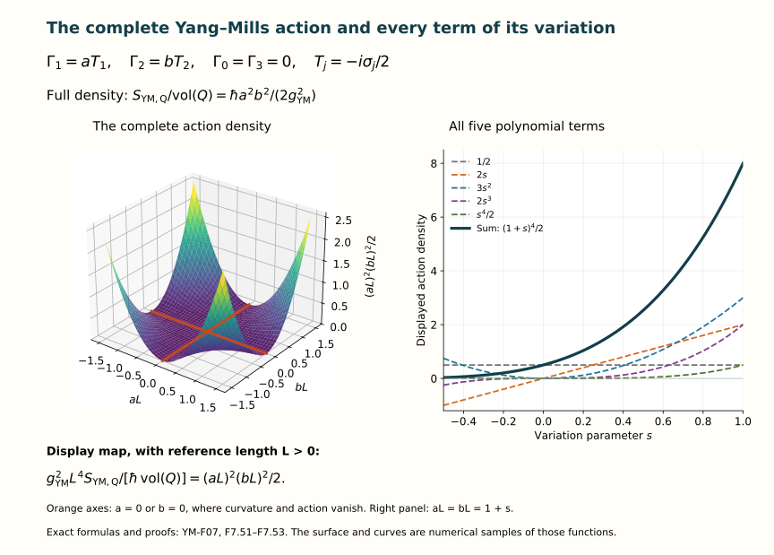

# The Yang–Mills action and field equations

Lesson YM-F07 · Geometry and states in Yang–Mills theory

A connection tells us how to differentiate a field. An action assigns
a real number to a specified field configuration on a specified region.
Its first variation tests whether changing that configuration changes
the action to first order. The Yang–Mills equations are the resulting
stationarity equations.

We will derive them, including the boundary contribution. We will also
derive the equations for a complex scalar field coupled to the connection.
The preparation is [Lesson 5](../covariant-derivatives-and-curvature.html)
and [Lesson 6](../bundles-transport-holonomy.html), together with their
earlier calculus and matrix material.

## 1. The data in an action

Use four coordinates \(x^0,x^1,x^2,x^3\) on an open region
\(U\subset\mathbb R^4\). A metric is a smooth real symmetric invertible
matrix \(g_{\mu\nu}(x)\) specifying
\(g(v,w)=\sum_{\mu,\nu=0}^3g_{\mu\nu}v^\mu w^\nu\).
Its inverse has entries \(g^{\mu\nu}\). We will use either a positive
definite metric, called Euclidean signature, or a metric with one
negative and three positive directions, called Lorentzian signature.
Here and below a repeated coordinate index is summed from \(0\) to \(3\).
The sums in formulas containing repeated indices are complete ordered sums.

Define

\[
 w=\sqrt{|\det(g_{\mu\nu})|},\qquad
 F^{\mu\nu}=g^{\mu\rho}g^{\nu\sigma}F_{\rho\sigma},\qquad
 \sigma=
 \begin{cases}
 +1,&\text{Euclidean signature},\\
 -1,&\text{Lorentzian signature}.
 \end{cases}
 \tag{F7.1}
\]

Smoothness of the inverse follows from its cofactor formula and the
nonzero determinant. The positive function \(w\) is smooth for the
same reason. In particular, differentiating a raised tensor must
differentiate the inverse metric too.

Take a specified matrix Lie group \(G\subset U(N)\), such as \(U(N)\),
\(SU(N)\), or the real orthogonal groups regarded inside \(U(N)\).
Its real Lie algebra \(\mathfrak g\) consists of the corresponding
skew-Hermitian matrices. We use the original defining trace pairing

\[
 \kappa(X,Y)=-\operatorname{tr}(XY),\qquad X,Y\in\mathfrak g.
 \tag{F7.2}
\]

It is real: complex conjugation of \(\operatorname{tr}(XY)\)
gives \(\operatorname{tr}(Y^\dagger X^\dagger)=\operatorname{tr}(YX)\).
It is symmetric by trace cyclicity, and
\(\kappa(X,X)=\sum_{j,k}|X_{jk}|^2\), positive unless \(X=0\).
The same cyclicity proves both

\[
 \kappa(hXh^{-1},hYh^{-1})=\kappa(X,Y),\qquad
 \kappa([Z,X],Y)+\kappa(X,[Z,Y])=0.
 \tag{F7.3}
\]

For the second formula the two expanded traces contain \(ZXY\)
and \(XYZ\) with opposite signs after cyclic permutation; the
remaining \(XZY\) terms cancel directly. These are the precise
invariance properties needed in the variation.

A connection is the one from the earlier lessons:

\[
 D_\mu\psi=\partial_\mu\psi+\Gamma_\mu\psi,\qquad
 F_{\mu\nu}=\partial_\mu\Gamma_\nu-\partial_\nu\Gamma_\mu
                         +[\Gamma_\mu,\Gamma_\nu],\qquad
 \mathcal D_\mu X=\partial_\mu X+[\Gamma_\mu,X].
 \tag{F7.4}
\]

Here \(\Gamma_\mu,F_{\mu\nu},X\) take values in \(\mathfrak g\).
The full curvature form is
\(F=\tfrac12F_{\mu\nu}dx^\mu\wedge dx^\nu\).
The factor \(1/2\) removes the double counting in that ordered sum;
it does not remove either occurrence from later tensor contractions.

Let \(g_{\mathrm{YM}}\ne0\) be a fixed real coupling and
\(\hbar>0\) the action unit. On a closed coordinate box
\(Q=\prod_{\mu=0}^3[a_\mu,b_\mu]\) inside \(U\), define

\[
 S_{\mathrm{YM},Q}[\Gamma]
  =\frac{\sigma\hbar}{2g_{\mathrm{YM}}^2}
       \int_Q w\,\kappa(F_{\mu\nu},F^{\mu\nu})\,d^4x.
 \tag{F7.5}
\]

Fields and metrics are smooth on a neighbourhood of the box.
Thus this integral and every variation used below exist. On an
unbounded region we use this same action when its integral converges.
Local field equations also make sense without a finite total action:
for a compactly supported variation the difference of actions is
an integral over a compact set, even when the separate infinite-volume
actions have no finite value. No subtraction of two infinite numbers
is involved.

If all four coordinates have length units, \(g_{\mu\nu}\) is
dimensionless, \(\Gamma_\mu\) has unit length\(^{-1}\), and
\(F_{\mu\nu}\) has unit length\(^{-2}\). In four dimensions a
dimensionless \(g_{\mathrm{YM}}\) makes (F7.5) have the unit of
\(\hbar\). Physical time will be kept explicitly in Section 7.

## 2. Coordinate changes and the integration measure

Let \(x=f(y)\) be a smooth coordinate change with smooth inverse.
Put \(J^\mu{}_a=\partial x^\mu/\partial y^a\) and
\(K^a{}_\mu=\partial y^a/\partial x^\mu\), so \(KJ=JK=I_4\).
Pullback, already proved for forms in F05, gives the exact data

\[
 \begin{aligned}
 \widetilde g_{ab}&=J^\mu{}_a g_{\mu\nu}(f(y))J^\nu{}_b,\\
 \widetilde g^{ab}&=K^a{}_\mu g^{\mu\nu}(f(y))K^b{}_\nu,\\
 \widetilde\Gamma_a&=J^\mu{}_a\Gamma_\mu(f(y)),\\
 \widetilde F_{ab}&=J^\mu{}_aJ^\nu{}_bF_{\mu\nu}(f(y)),\\
 \widetilde F^{ab}&=K^a{}_\mu K^b{}_\nu F^{\mu\nu}(f(y)),\\
 \widetilde w&=|\det J|\,w(f(y)).
 \end{aligned}
 \tag{F7.6}
\]

The inverse-metric identity follows by multiplying the first
two matrices. The determinant identity follows from
\(\det(J^TgJ)=(\det J)^2\det g\). Contracting both curvature
indices cancels the four inverse-Jacobian factors in pairs:

\[
 \widetilde w\,\kappa(\widetilde F_{ab},\widetilde F^{ab})
  =|\det J|\,\bigl[w\kappa(F_{\mu\nu},F^{\mu\nu})\bigr]\circ f.
 \tag{F7.7}
\]

This identifies the actual integration density, including an
orientation-reversing coordinate change. We use positive coordinate
volume, hence the absolute determinant.

### The change-of-variables fact used here

For completeness, if \(f\) is a \(C^1\) diffeomorphism on a
neighbourhood of a compact box \(B\subset\mathbb R^n\), and \(h\)
is continuous on \(f(B)\), then

\[
 \int_{f(B)}h(x)\,d^nx
       =\int_B h(f(y))\,|\det Df(y)|\,d^ny.
 \tag{F7.8}
\]

Here integrals over bounded regions are Riemann integrals, obtained
by upper and lower box sums; boundary sets of zero box volume do
not change them. The following argument supplies the needed fact,
rather than assuming that a nonlinear map has a constant Jacobian.

Subdivide \(B\) into boxes with side lengths proportional to a
mesh size \(d\), using fixed coordinate proportions. On a small
box \(C\) with centre \(z\), write
\(f(y)=f(z)+A(y-z)+r(y)\), \(A=Df(z)\).
The fundamental theorem along line segments gives
\(\|r(y)-r(y')\|\leq\omega(d)\|y-y'\|\), where
\(\omega(d)\to0\) uniformly over all boxes, by uniform continuity
of \(Df\). Inverses \(A^{-1}\) have a uniform bound on \(B\),
by continuity and compactness.

In the original box coordinates, \(A^{-1}r\) therefore moves
each point by at most \(\epsilon(d)d\), with \(\epsilon(d)\to0\).
Consequently \(f(C)\) is contained in the affine image of the
box enlarged by that amount in each coordinate. It contains
the affine image of the correspondingly shrunken box.
For this last inclusion, if \(y_0\) lies in the shrunken box,
solve \(y=y_0-A^{-1}r(y)\). The right side maps \(C\) into
itself and has Lipschitz constant less than \(1/2\) for small
enough \(d\). Iteration converges: successive differences are
bounded by a geometric series, the closed box contains the
limit, and continuity makes it a fixed point. Its image under
\(f\) is \(f(z)+A(y_0-z)\).

An invertible linear map multiplies box volume by \(|\det A|\).
This follows by decomposing it through Gaussian elimination
into coordinate interchanges, nonzero coordinate dilations
and shears. Their factors are respectively \(1\), the absolute
dilation factor, and \(1\). A shear preserves volume by integrating
the translated one-dimensional slices; repeated integration gives
the result in dimension \(n\). The same slicing proves the
volume statement for the intervening parallelepipeds.
The enlarged and shrunken boxes thus bound the volume of \(f(C)\)
by \(|\det A|\operatorname{vol}(C)\) with uniform error
at most \(C_0\epsilon(d)d^n\).

The regions used here have Riemann volume. A \(C^1\) map on the
compact neighbourhood is Lipschitz. Cover a box face by
\(O(\delta^{-(n-1)})\) face boxes of diameter \(O(\delta)\).
Their images fit in ordinary boxes of total volume \(O(\delta)\).
Hence the image of every face has zero box volume. A homeomorphism
takes the boundary of \(C\) to that of \(f(C)\); its interior
maps to the interior. The image region's boundary therefore has
zero volume, as required for upper and lower Riemann sums.

The images of the small-box interiors are disjoint and their
union misses only those zero-volume boundaries. Uniform continuity
of \(h\) makes its oscillation on each image tend uniformly to zero.
The integral over each image equals
\(h(f(z))|\det Df(z)|\operatorname{vol}(C)\), up to an error whose
sum tends to zero: the volume error above has \(O(d^{-n})\)
terms, and the oscillation error is bounded by the total image
volume times the maximum oscillation. Their sum is the Riemann
sum on the right of (F7.8). This proves the formula.

Applying (F7.8) to (F7.7) proves invariance of the action under
the specified coordinate change and corresponding change of region.
For a compactly supported smooth density on a manifold, cover its
support by finitely many charts and use the smooth weights constructed
in F06. The densities agree on overlaps, and inserting those weights
gives compactly supported chart integrands, which can be integrated
on containing coordinate boxes. Independence of the weights follows
by inserting their pairwise products and using (F7.8) on the overlaps.
The same construction works on compact regions whose chart boundaries
have zero coordinate volume, including piecewise smooth boundaries.
Thus no global bundle frame is required; no Riemann-integrability
claim is made for an arbitrary irregular compact region.

### Gauge invariance

For a smooth internal transformation \(u:U\to G\),

\[
 \Gamma^u=u\Gamma u^{-1}-(du)u^{-1},\qquad F^u=uFu^{-1}.
 \tag{F7.9}
\]

The metric and coordinate density are unaffected by this internal
map. Equations (F7.3) and (F7.9) give
\(S_{\mathrm{YM},Q}[\Gamma^u]=S_{\mathrm{YM},Q}[\Gamma]\).
On a nontrivial bundle the compatible local transformations of
F06 give precisely the same equality in each chart. The action
therefore depends on the connection as a geometric object.

## 3. Varying a connection

A difference of connections is an adjoint-bundle-valued one-form,
as proved in F06. Thus a valid variation is
\(\Gamma(s)=\Gamma+s\alpha\), with the same homogeneous overlap
law for \(\alpha\). The metric, coupling, region and \(\hbar\)
are held fixed. Direct expansion, keeping the quadratic term,
gives

\[
 \begin{aligned}
 F_{\mu\nu}(s)&=F_{\mu\nu}+sB_{\mu\nu}+s^2C_{\mu\nu},\\
 B_{\mu\nu}&=\mathcal D_\mu\alpha_\nu-\mathcal D_\nu\alpha_\mu,\\
 C_{\mu\nu}&=[\alpha_\mu,\alpha_\nu],\\
 F'_{\mu\nu}(0)&=B_{\mu\nu},\qquad F''_{\mu\nu}(0)=2C_{\mu\nu}.
 \end{aligned}
 \tag{F7.10}
\]

The contraction
\(\kappa(X_{\mu\nu},Y^{\mu\nu})\) is symmetric in \(X,Y\):
exchange the two pairs of summed indices, using the symmetry
of \(g^{\mu\nu}\) and of \(\kappa\). Therefore

\[
 \begin{aligned}
 S'_{\mathrm{YM},Q}(0)
   &=\frac{\sigma\hbar}{g_{\mathrm{YM}}^2}
       \int_Q w\,\kappa(B_{\mu\nu},F^{\mu\nu})\,d^4x\\
   &=\frac{2\sigma\hbar}{g_{\mathrm{YM}}^2}
       \int_Q w\,\kappa(\mathcal D_\mu\alpha_\nu,F^{\mu\nu})\,d^4x.
 \end{aligned}
 \tag{F7.11}
\]

The second line relabels \(\mu,\nu\) in the second term of \(B\)
and uses \(F^{\nu\mu}=-F^{\mu\nu}\). Its factor \(2\) is essential.
Differentiation under the integral is justified here without
a limiting argument: the integrand is a polynomial of degree
at most four in \(s\), with smooth coefficients on a compact set.

Trace invariance (F7.3) also gives the exact product rule

\[
 \partial_\mu\!\left[w\,\kappa(\alpha_\nu,F^{\mu\nu})\right]
  =w\,\kappa(\mathcal D_\mu\alpha_\nu,F^{\mu\nu})
       +\kappa\!\left(\alpha_\nu,
                         \mathcal D_\mu(wF^{\mu\nu})\right).
 \tag{F7.12}
\]

Indeed the commutator terms on the right sum to zero, leaving
the ordinary product derivative, including \(\partial_\mu w\)
and the derivatives of both inverse-metric factors in \(F^{\mu\nu}\).

### Every face of the boundary

For a vector of functions \(V^\mu\), write

\[
 \mathcal B_Q[V]
   =\sum_{\mu=0}^3
       \left[
         \int_{\prod_{\lambda\ne\mu}[a_\lambda,b_\lambda]}
                  V^\mu(x)\prod_{\lambda\ne\mu}dx^\lambda
       \right]_{x^\mu=a_\mu}^{x^\mu=b_\mu}.
 \tag{F7.13}
\]

Thus upper faces have positive sign and lower faces negative sign.
Integrating \(\partial_\mu V^\mu\) first in \(x^\mu\) and applying
the one-variable fundamental theorem proves
\(\int_Q\partial_\mu V^\mu d^4x=\mathcal B_Q[V]\).
Summing over \(\mu\) gives every face. Interchange of the integrals
for these continuous functions follows directly from rectangular
Riemann sums: the same finite multiple sums can be grouped in
either order, and uniform continuity gives their common limit.

Define the field-equation coefficient

\[
 \begin{aligned}
 \mathcal E^\nu(\Gamma)
  &=\frac1w\,\mathcal D_\mu(wF^{\mu\nu})\\
  &=\frac1w\,\partial_\mu
       \left(wg^{\mu\rho}g^{\nu\sigma}F_{\rho\sigma}\right)
       +g^{\mu\rho}g^{\nu\sigma}[\Gamma_\mu,F_{\rho\sigma}].
 \end{aligned}
 \tag{F7.14}
\]

Equations (F7.11)–(F7.13) give the complete first variation

\[
 S'_{\mathrm{YM},Q}(0)
   =\frac{2\sigma\hbar}{g_{\mathrm{YM}}^2}
      \left\{
       \mathcal B_Q\!\left[w\kappa(\alpha_\nu,F^{\mu\nu})\right]
       -\int_Qw\,\kappa(\alpha_\nu,\mathcal E^\nu)\,d^4x
      \right\}.
 \tag{F7.15}
\]

In the boundary expression, \(\mu\) is the free face index of
\(V^\mu=w\kappa(\alpha_\nu,F^{\mu\nu})\), and \(\nu\) is summed.
This notation does not omit a normal or its sign: those are
the specified upper and lower coordinate faces in (F7.13).

## 4. Why stationarity gives the field equations

We first prove the required fundamental lemma. Suppose \(Y^\nu\)
is a continuous \(\mathfrak g\)-valued field and

\[
 \int_Qw\,\kappa(\alpha_\nu,Y^\nu)\,d^4x=0
 \quad\text{for every smooth \(\alpha\) supported in the interior.}
 \tag{F7.16}
\]

If \(Y^\nu(p)\ne0\) for one index and interior point, put
\(X=Y^\nu(p)\). Continuity makes
\(\kappa(X,Y^\nu(x))>0\) in a sufficiently small ball about \(p\).
The smooth bump
\(\beta(x)=\exp[-1/(r^2-|x-p|^2)^2]\) inside that ball and zero
outside is nonnegative and positive inside. Its smooth zero
extension was proved in F06. Set that one component
\(\alpha_\nu=\beta X\), and all others zero.
Then the integral is strictly positive: \(w>0\), and on a
smaller closed ball the continuous integrand has a positive
lower bound. This contradicts (F7.16). Hence every \(Y^\nu=0\)
in the interior. The converse is immediate.

### Theorem 4.1. The Yang–Mills variational equation

A smooth connection is stationary for every compactly supported
interior variation if and only if

\[
 \mathcal D_\mu(wF^{\mu\nu})=0\quad(\nu=0,1,2,3),
 \quad\text{equivalently}\quad \mathcal E^\nu=0.
 \tag{F7.17}
\]

**Proof.** Such variations have zero boundary term in (F7.15).
The coefficient \(2\sigma\hbar/g_{\mathrm{YM}}^2\) is nonzero.
The fundamental lemma gives \(\mathcal E^\nu=0\). Conversely
this equation and the vanishing boundary term give zero first
variation. \(\square\)

For a constant metric \(w\) is constant, so this becomes
\(\mathcal D_\mu F^{\mu\nu}=0\). For a varying metric the
derivatives in (F7.14) remain. One cannot replace (F7.17)
by an equation that discards them.

At the boundary there are several actual variational problems.

- **Fixed connection on the boundary.** Require
  \(\alpha_\nu=0\) there. Then solutions of (F7.17) are
  stationary for all those variations.
- **Fixed tangential connection on each face.** On a face
  \(x^\mu=\text{constant}\), require \(\alpha_\nu=0\) for
  \(\nu\ne\mu\). The remaining term is zero because
  \(F^{\mu\mu}=0\). Thus fixing the pullback of the connection
  suffices.
- **Free connection on the boundary.** Arbitrary variations on
  the relative interior of a face require
  \(F^{\mu\nu}=0\) there for every \(\nu\), where \(\mu\) is that
  face's fixed index.

For necessity of the last condition, after imposing the interior
equations use a bump supported near one face, away from its edges,
with arbitrary smooth tangential boundary values. A product of
a tangential bump and a normal function equal to one at the face
extends those values smoothly into the box. The same positivity
argument proves each face coefficient \(wF^{\mu\nu}=0\).
Continuity extends it to the face edges. Conversely these face
conditions kill (F7.15) for every variation. Corners have zero
face measure and create no additional term in (F7.13).

Mixed problems fix selected boundary components and require
the coefficient of each remaining freely varied component to
vanish. This follows component by component from the displayed
pairing. Choosing a boundary condition is part of defining the
problem, not a term to erase during differentiation.

### Covariance of the equation

For an adjoint field \(X^u=uXu^{-1}\), the full product rule in
F05 gives \(\mathcal D^u_\mu X^u=u(\mathcal D_\mu X)u^{-1}\).
Consequently

\[
 \mathcal E^\nu(\Gamma^u)=u\mathcal E^\nu(\Gamma)u^{-1}.
 \tag{F7.18}
\]

There is an equally exact coordinate map:

\[
 \widetilde{\mathcal E}^{\,a}(y)
       =K^a{}_\nu(y)\,\mathcal E^\nu(f(y)).
 \tag{F7.19}
\]

To prove it without suppressing metric derivatives, calculate
the first variation in both coordinate systems with compact
support in their overlap. Their actions agree by (F7.6)–(F7.8).
Their variations obey
\(\widetilde\alpha_a=J^\nu{}_a\alpha_\nu\circ f\).
Changing variables in the integral part of (F7.15) therefore gives
\(\int\widetilde w\,\kappa(\widetilde\alpha_a,
\widetilde{\mathcal E}^{\,a}-K^a{}_\nu\mathcal E^\nu\circ f)=0\)
for every such variation. The fundamental lemma proves (F7.19).
The coordinate and gauge maps thus identify the same equation
on actual overlaps of a general bundle.

## 5. Coupling constants and complete component equations

Keep F05's exact basis \(T_a\) of \(\mathfrak g\), with
\([T_a,T_b]=f_{ab}{}^cT_c\), and write
\(\kappa_{ab}=-\operatorname{tr}(T_aT_b)\).
Indices \(a,b,c\) in this section label the real Lie algebra,
not coordinate directions. Every such index is summed over the
full basis when repeated. The matrix \((\kappa_{ab})\) is
positive definite and invertible.

The original parameterization and its full curvature are

\[
 \begin{aligned}
 \Gamma_\mu&=g_{\mathrm{YM}}A_\mu^aT_a,\\
 F_{\mu\nu}
   &=\left[g_{\mathrm{YM}}
          (\partial_\mu A_\nu^c-\partial_\nu A_\mu^c)
       +g_{\mathrm{YM}}^2 f_{ab}{}^c A_\mu^aA_\nu^b\right]T_c,\\
 f_{\mu\nu}^c
   &:=\partial_\mu A_\nu^c-\partial_\nu A_\mu^c
                          +g_{\mathrm{YM}}f_{ab}{}^cA_\mu^aA_\nu^b,\\
 F_{\mu\nu}&=g_{\mathrm{YM}}f_{\mu\nu}^cT_c.
 \end{aligned}
 \tag{F7.20}
\]

The lowercase \(f_{\mu\nu}^c\) labels the displayed coefficient
expression; the original curvature and both coupling powers
remain explicit. Substitution into the action gives the exact
comparison

\[
 \begin{aligned}
 S_{\mathrm{YM},Q}[g_{\mathrm{YM}}A]
   &=\frac{\sigma\hbar}{2g_{\mathrm{YM}}^2}
      \int_Qw\,g_{\mathrm{YM}}^2\kappa_{ab}
        g^{\mu\rho}g^{\nu\sigma}f_{\mu\nu}^a f_{\rho\sigma}^b\,d^4x\\
   &=\frac{\sigma\hbar}{2}
      \int_Qw\,\kappa_{ab}
        g^{\mu\rho}g^{\nu\sigma}f_{\mu\nu}^a f_{\rho\sigma}^b\,d^4x.
 \end{aligned}
 \tag{F7.21}
\]

The coupling remains in every nonlinear \(f_{\mu\nu}^a\).
For the Pauli generators \(T_a=-i\sigma_a/2\),
\(\kappa_{ab}=\delta_{ab}/2\), so the final coefficient in
front of the full colour sum is \(\sigma\hbar/4\).
Using \(\delta_{ab}\) in place of the original trace matrix
would change the action by a factor of two.

Since \(g_{\mathrm{YM}}\ne0\), the map from the \(A_\mu^a\)
to \(\Gamma_\mu\) is invertible: divide its unique basis
coordinates by \(g_{\mathrm{YM}}\). Equation (F7.17) is therefore
equivalent to the complete component equation

\[
 \frac1w\partial_\mu
       \left(wg^{\mu\rho}g^{\nu\sigma}f_{\rho\sigma}^c\right)
  +g_{\mathrm{YM}}f_{ab}{}^c
                A_\mu^a g^{\mu\rho}g^{\nu\sigma}f_{\rho\sigma}^b=0.
 \tag{F7.22}
\]

This follows by substituting (F7.20) into (F7.14), keeping
the derivative term with one coupling and the commutator
term with two, then dividing their common nonzero factor.

At \(g_{\mathrm{YM}}=0\), (F7.5) is undefined and the map
\(A\mapsto\Gamma\) collapses. There is nevertheless an exact
different object to study: the last expression in (F7.21)
is a polynomial in \(g_{\mathrm{YM}}\) and defines an action
for every real value. Its value at zero is

\[
 S_{A,0}
  =\frac{\sigma\hbar}{2}\int_Qw\,\kappa_{ab}
     g^{\mu\rho}g^{\nu\sigma}
     (\partial_\mu A_\nu^a-\partial_\nu A_\mu^a)
     (\partial_\rho A_\sigma^b-\partial_\sigma A_\rho^b)\,d^4x.
 \tag{F7.23}
\]

Its variation gives (F7.22) with \(g_{\mathrm{YM}}=0\).
Indeed the same calculation (F7.10)–(F7.17) now has ordinary
derivatives on the real colour coordinates and the invertible
pairing \(\kappa_{ab}\). This proves the polynomial extension
and its field equation, while retaining the fact that the
zero connection \(\Gamma=0\) no longer determines those
independent \(A\)-fields.

## 6. Second variation and gauge directions

Let \(B,C\) be exactly (F7.10). Define the integrated metric
pairing of two adjoint-valued two-forms by
\((X,Y)_Q=\int_Qw\,\kappa(X_{\mu\nu},Y^{\mu\nu})d^4x\).
This is symmetric, but need not be positive in Lorentzian
signature. The complete polynomial is

\[
 \begin{aligned}
 S_{\mathrm{YM},Q}[\Gamma+s\alpha]
  =\frac{\sigma\hbar}{2g_{\mathrm{YM}}^2}
    \bigl\{&(F,F)_Q+2s(F,B)_Q\\
           &+s^2[(B,B)_Q+2(F,C)_Q]
               +2s^3(B,C)_Q+s^4(C,C)_Q\bigr\}.
 \end{aligned}
 \tag{F7.24}
\]

Every term follows by multiplying the two copies of
\(F+sB+s^2C\). In particular

\[
 S''_{\mathrm{YM},Q}(0)
    =\frac{\sigma\hbar}{g_{\mathrm{YM}}^2}
           \bigl[(B,B)_Q+2(F,C)_Q\bigr].
 \tag{F7.25}
\]

The term involving the background curvature is present even
though \(C\) is quadratic in the variation. Stationarity
means zero first variation; it does not mean that this second
variation is positive.

The mixed Hessian is also explicit. Put
\(B_\alpha=\mathcal D\alpha\) with components as in (F7.10), and
\(C_{\alpha,\beta;\mu\nu}
=[\alpha_\mu,\beta_\nu]+[\beta_\mu,\alpha_\nu]\).
Expanding in two real parameters gives

\[
 \operatorname{Hess}_\Gamma(\alpha,\beta)
  =\frac{\sigma\hbar}{g_{\mathrm{YM}}^2}
       \bigl[(B_\alpha,B_\beta)_Q+(F,C_{\alpha,\beta})_Q\bigr].
 \tag{F7.26}
\]

For \(\alpha=\beta\), \(C_{\alpha,\alpha}=2C\), agreeing with
(F7.25).

Now choose a smooth compactly supported
\(\epsilon:Q^\circ\to\mathfrak g\) and
\(u(s)=\exp(s\epsilon)\). Differentiating (F7.9) at zero gives

\[
 \left.\frac{d}{ds}\right|_0\Gamma^{u(s)}_\mu
     =[\epsilon,\Gamma_\mu]-\partial_\mu\epsilon
     =-\mathcal D_\mu\epsilon.
 \tag{F7.27}
\]

Gauge invariance gives
\(DS_\Gamma(-\mathcal D_\Gamma\epsilon)=0\) for every connection.
Differentiate this identity in a compactly supported direction
\(\beta\). The direction itself varies by
\(-[\beta_\mu,\epsilon]\). Consequently

\[
 \operatorname{Hess}_\Gamma(\beta,-\mathcal D_\Gamma\epsilon)
      +DS_\Gamma(-[\beta,\epsilon])=0.
 \tag{F7.28}
\]

At a solution of the field equations the last term vanishes by
Theorem 4.1. Thus every such gauge direction pairs to zero with
every interior variation in the Hessian. The degeneracy is
a proved consequence of the actual gauge map. It motivates
the treatment of gauges and constraints in the [next lesson](../constraints-initial-data-energy.html).

## 7. Physical time and the Maxwell equations

Use the actual physical coordinates
\((x^0,x^1,x^2,x^3)=(t,x^1,x^2,x^3)\), with \(c>0\)
the speed of light. The flat Lorentzian metric, its inverse
and density are

\[
 (g_{\mu\nu})=\operatorname{diag}(-c^2,1,1,1),\qquad
 (g^{\mu\nu})=\operatorname{diag}(-c^{-2},1,1,1),\qquad w=c.
 \tag{F7.29}
\]

The metric evaluates a spacetime displacement as
\(-c^2dt^2+\sum_j(dx^j)^2\). A temporal curvature component
has unit time\(^{-1}\)length\(^{-1}\); its two raised-index
contraction therefore carries the displayed \(c^{-2}\).
With
\(\mathsf E_j=F_{tj}\) and
\(\mathsf B_1=F_{23},\mathsf B_2=F_{31},\mathsf B_3=F_{12}\),
the full ordered contraction is

\[
 \kappa(F_{\mu\nu},F^{\mu\nu})
   =2\sum_{j=1}^3
       \left[\kappa(\mathsf B_j,\mathsf B_j)
                    -c^{-2}\kappa(\mathsf E_j,\mathsf E_j)\right].
 \tag{F7.30}
\]

Each unordered index pair occurs twice. Raising a temporal
index multiplies by \(-c^{-2}\); raising spatial indices
does not change the sign. This proves (F7.30) term by term.
Consequently the Lorentzian action is

\[
 S_{\mathrm{YM},Q}
   =\frac{\hbar}{g_{\mathrm{YM}}^2}
       \int_Q\left[
         c^{-1}\sum_j\kappa(\mathsf E_j,\mathsf E_j)
               -c\sum_j\kappa(\mathsf B_j,\mathsf B_j)
       \right]\,dt\,d^3x.
 \tag{F7.31}
\]

The relative sign is part of the variational problem.
For the Euclidean metric the corresponding terms have positive
signs. More generally, at a point of a positive definite metric,
Gram–Schmidt produces an orthonormal basis: subtract each preceding
metric projection and divide by the positive length of the
nonzero remainder. The resulting invertible change of basis
and (F7.6) turn the contraction into
\(2\sum_{\mu<\nu}\kappa(F_{\mu\nu},F_{\mu\nu})\).
Thus the Euclidean action is nonnegative and vanishes precisely
when \(F=0\) throughout the region. The latter implication uses
continuity and a positive-volume neighbourhood of any nonzero
curvature value. This does not say that every bundle admits a
flat connection. In Lorentzian signature both signs occur in
the action; stationary configurations need not minimize it.

### The exact electromagnetic correspondence

Return to F05's scalar \(U(1)\) connection, with real charge \(q\):

\[
 \Gamma=\frac{iq}{\hbar}(\phi\,dt-A_jdx^j),\qquad
 F_{tj}=\frac{iq}{\hbar}E_j,\qquad
 F_{ij}=-\frac{iq}{\hbar}\epsilon_{ijk}B_k.
 \tag{F7.32}
\]

Here \(E=-\nabla\phi-\partial_tA\) and \(B=\nabla\times A\).
The physical magnetic field \(B\) and the matrix coefficient
\(\mathsf B\) therefore have the exact factor
\(\mathsf B_j=-iqB_j/\hbar\); they are not identical symbols
for the same component.

All commutators vanish. Inserting (F7.32) into (F7.14) gives

\[
 \mathcal E^t
     =\frac{iq}{\hbar c^2}\nabla\cdot E,\qquad
 \mathcal E^j
     =\frac{iq}{\hbar}
           \left[(\nabla\times B)_j-c^{-2}\partial_tE_j\right].
 \tag{F7.33}
\]

For example \(F^{jt}=iqE_j/(\hbar c^2)\) and
\(F^{tj}=-iqE_j/(\hbar c^2)\); these fix the two temporal
signs. The spatial sum uses
\(\sum_i\epsilon_{ijk}\partial_iB_k=-(\nabla\times B)_j\).
For \(q\ne0\), (F7.17) is exactly the source-free Gauss and
Ampère–Maxwell equations. Bianchi supplies the other two
Maxwell equations by F05 (F5.57)–(F5.58).

Since the one-dimensional defining trace has
\(\kappa(i,i)=1\), substitution in (F7.31) yields

\[
 S_{\mathrm{YM},Q}
   =\frac{q^2}{g_{\mathrm{YM}}^2\hbar c}
                  \int_Q(|E|^2-c^2|B|^2)\,dt\,d^3x.
 \tag{F7.34}
\]

The usual electromagnetic action with permittivity
\(\epsilon_0>0\) and permeability
\(\mu_0=1/(\epsilon_0c^2)\) is

\[
 S_{\mathrm{EM},Q}
     =\frac{\epsilon_0}{2}
           \int_Q(|E|^2-c^2|B|^2)\,dt\,d^3x.
 \tag{F7.35}
\]

These are identical under the explicit parameter choice
\(g_{\mathrm{YM}}^2=2q^2/(\epsilon_0\hbar c)\).
The factor \(2\) reflects the specified \(U(1)\) trace, whereas
the Pauli generators have squared trace length \(1/2\).
Equations (F7.34)–(F7.35) retain both conventions and the map
between them. If \(q=0\), (F7.32) is zero for every potential
and gives no inverse recovery of \(E,B\). The independent
electromagnetic action (F7.35) still has its stated meaning.

### Specified external electromagnetic sources

For smooth prescribed charge and current densities \(\rho,j\),
add their actual potential coupling

\[
 S_{\mathrm{ext}}[\phi,A]
   =S_{\mathrm{EM},Q}[\phi,A]
                 +\int_Q(-\rho\phi+j\cdot A)\,dt\,d^3x.
 \tag{F7.36}
\]

Let \(\delta\phi=\varphi,\delta A=a\).
Then \(\delta E=-\nabla\varphi-\partial_ta\),
\(\delta B=\nabla\times a\), and direct differentiation gives

\[
 \begin{aligned}
 \delta S_{\mathrm{ext}}
   ={}&\int_Q
       \left[(\epsilon_0\nabla\cdot E-\rho)\varphi
        +(\epsilon_0\partial_tE-\epsilon_0c^2\nabla\times B+j)
                                                        \cdot a\right]
                                                        \,dt\,d^3x\\
      &+\mathcal B_Q[V],\\
 V^t={}&-\epsilon_0E\cdot a,\qquad
 V^k=-\epsilon_0E_k\varphi-\epsilon_0c^2(a\times B)_k.
 \end{aligned}
 \tag{F7.37}
\]

To check the spatial term, expand the epsilon symbols to get
\(\nabla\cdot(a\times B)
=B\cdot(\nabla\times a)-a\cdot(\nabla\times B)\).
The temporal term is the product derivative of \(E\cdot a\).
The gradient term is that of \(E_k\varphi\). Integration by
the face formula (F7.13) gives exactly (F7.37).
For interior variations the fundamental lemma therefore gives

\[
 \nabla\cdot E=\rho/\epsilon_0,\qquad
 \nabla\times B-c^{-2}\partial_tE=\mu_0j.
 \tag{F7.38}
\]

Taking the divergence of the second equation and using the
first proves \(\partial_t\rho+\nabla\cdot j=0\):
the divergence of a curl vanishes by the cancellation of
mixed second derivatives established in F02.

This conservation law is also exactly what compactly supported
gauge invariance requires for the source term. Under
\(\phi'=\phi-\partial_t\chi,\ A'=A+\nabla\chi\), its change is

\[
 \Delta S_{\mathrm{ext}}
   =\mathcal B_Q[(\rho\chi,j\chi)]
        -\int_Q\chi(\partial_t\rho+\nabla\cdot j)\,dt\,d^3x.
 \tag{F7.39}
\]

This follows by the ordinary product rule, with all boundary
faces retained. Compact support kills precisely the first term;
the real scalar version of the fundamental lemma proves necessity
and sufficiency of current conservation.

## 8. A scalar field coupled to the connection

External sources do not describe the dynamics of the matter producing
them. We now specify one complete dynamical model. Let
\(\rho_G:G\to U(K)\) be a smooth unitary representation with
derivative \(r:\mathfrak g\to\mathfrak u(K)\). The subscript
distinguishes this representation from the preceding charge density.
Let \(\psi\) be a section of its associated complex vector bundle.
Its derivative, with the exact representation map from F05–F06, is

\[
 D_\mu^\rho\psi=\partial_\mu\psi+r(\Gamma_\mu)\psi,\qquad
 D^{\rho,\mu}\psi=g^{\mu\nu}D_\nu^\rho\psi.
 \tag{F7.40}
\]

Choose \(m\geq0\), \(c>0\), and \(\lambda\geq0\), and put
\(\mathfrak m=mc/\hbar\). In length coordinates take
\(\psi\) to have dimension length\(^{-1}\) and \(\lambda\)
dimensionless. Define

\[
 \begin{aligned}
 V(\psi)&=\mathfrak m^2\psi^\dagger\psi
                        +\frac{\lambda}{2}(\psi^\dagger\psi)^2,\\
 S_{\mathrm{matter},Q}
   &=-\hbar\int_Qw
        \left[g^{\mu\nu}(D_\mu^\rho\psi)^\dagger D_\nu^\rho\psi
                                            +V(\psi)\right]d^4x,\\
 S_{\mathrm{total},Q}&=S_{\mathrm{YM},Q}+S_{\mathrm{matter},Q},
                  \qquad \sigma=-1.
 \end{aligned}
 \tag{F7.41}
\]

The kinetic term is real: conjugating it exchanges \(\mu,\nu\)
and the real symmetric metric restores it. The potential is real
and nonnegative. All terms have the dimension required for an
action. We use the Lorentzian sign in this model. Euclidean
scalar models require their own stated action; no complex change
of integration contour is being assumed.

Unitary transformations \(\psi^u=\rho_G(u)\psi\) obey
\(D^{\rho,u}\psi^u=\rho_G(u)D^\rho\psi\), proved in F05.
Thus both terms in \(S_{\mathrm{matter}}\) are gauge invariant.
Under coordinate change \(\psi\) composes with \(f\), its
derivative transforms by \(J^\mu{}_a\), and (F7.6)–(F7.8)
prove coordinate invariance too. The associated-bundle overlap
maps give the same identities in every local frame.

### Varying the matter field

Hold \(\Gamma\) fixed and take \(\psi(s)=\psi+s\eta\), for
a real parameter \(s\) and arbitrary complex section \(\eta\).
The derivative of \(\psi^\dagger\psi\) is
\(2\operatorname{Re}(\eta^\dagger\psi)\). Therefore

\[
 \begin{aligned}
 \delta_\psi S_{\mathrm{matter}}
  ={}&-2\hbar\,\mathcal B_Q
        \left[w\operatorname{Re}
                    (\eta^\dagger D^{\rho,\mu}\psi)\right]\\
    &+2\hbar\int_Qw\operatorname{Re}\!
        \left\{\eta^\dagger
         \left[\frac1wD_\mu^\rho(wD^{\rho,\mu}\psi)
                -\mathfrak m^2\psi
                -\lambda(\psi^\dagger\psi)\psi\right]\right\}d^4x.
 \end{aligned}
 \tag{F7.42}
\]

The integration identity used here is
\(\partial_\mu(\eta^\dagger Z^\mu)
=(D_\mu^\rho\eta)^\dagger Z^\mu+\eta^\dagger D_\mu^\rho Z^\mu\).
Expanding both derivatives cancels the two \(r(\Gamma_\mu)\)
terms because \(r(\Gamma_\mu)^\dagger=-r(\Gamma_\mu)\).
Use \(Z^\mu=wD^{\rho,\mu}\psi\) and the face formula to obtain
(F7.42), including every derivative of \(w\) and \(g^{\mu\nu}\).

Applying the fundamental lemma to the real and imaginary
coordinates of \(\eta\) proves the matter equation

\[
 \frac1wD_\mu^\rho(wg^{\mu\nu}D_\nu^\rho\psi)
                  -\frac{m^2c^2}{\hbar^2}\psi
                  -\lambda(\psi^\dagger\psi)\psi=0.
 \tag{F7.43}
\]

For \(\Gamma=0,\lambda=0\) and (F7.29), it becomes the full
massive wave equation
\(-c^{-2}\partial_t^2\psi+\sum_j\partial_j^2\psi
-m^2c^2\psi/\hbar^2=0\).
Fixed boundary values mean \(\eta=0\) there.
Free boundary values instead give \(D^{\rho,\mu}\psi=0\)
on a face of fixed \(x^\mu\), by the same localized face
argument as in Section 4.

### Varying the connection and constructing the current

Hold \(\psi\) fixed. A variation \(\alpha_\mu\) changes
\(D_\mu^\rho\psi\) by \(r(\alpha_\mu)\psi\). Define the
adjoint-valued current \(J^\nu\) by the exact real pairing

\[
 \kappa(X,J^\nu)
   =\operatorname{Re}\!\left[
            (r(X)\psi)^\dagger D^{\rho,\nu}\psi\right]
       \quad\text{for every }X\in\mathfrak g.
 \tag{F7.44}
\]

This is a construction, not an assumed existence statement.
Writing \((\kappa^{ab})=(\kappa_{ab})^{-1}\), its unique value is

\[
 J^\nu
   =\sum_{a,b}\kappa^{ab}
       \operatorname{Re}\!\left[
            (r(T_b)\psi)^\dagger D^{\rho,\nu}\psi\right]T_a.
 \tag{F7.45}
\]

Multiplication by \(\kappa_{ca}\) verifies (F7.44) on each
basis vector and hence on every \(X\); invertibility proves
uniqueness. Thus its definition is independent of the chosen
Lie-algebra basis. It transforms by
\(J^{u,\nu}=uJ^\nu u^{-1}\). To prove this, move the unitary
\(\rho_G(u)\) out of both factors in (F7.44), and use
\(r(u^{-1}Xu)=\rho_G(u)^{-1}r(X)\rho_G(u)\).
Equation (F7.3) and nondegeneracy of \(\kappa\) then identify
the stated transformed matrix.
Under the coordinate map (F7.6), the raised matter derivative
transforms by \(K^a{}_\nu\). Substituting this into (F7.44)
and again using nondegeneracy gives
\(\widetilde J^{\,a}=K^a{}_\nu J^\nu\circ f\). This is the
same coordinate map as (F7.19), so both sides of the coupled
field equation below agree across coordinate charts.

The matter variation is
\(-2\hbar\int_Qw\kappa(\alpha_\nu,J^\nu)d^4x\).
Combining it with (F7.15), with \(\sigma=-1\), yields

\[
 \begin{aligned}
 \delta_\Gamma S_{\mathrm{total}}
   ={}&-\frac{2\hbar}{g_{\mathrm{YM}}^2}
          \mathcal B_Q[w\kappa(\alpha_\nu,F^{\mu\nu})]\\
     &+2\hbar\int_Qw\,
          \kappa\!\left(\alpha_\nu,
                  g_{\mathrm{YM}}^{-2}\mathcal E^\nu-J^\nu
                \right)d^4x.
 \end{aligned}
 \tag{F7.46}
\]

Consequently the coupled connection equation is precisely

\[
 \mathcal D_\mu(wF^{\mu\nu})
                       =g_{\mathrm{YM}}^2wJ^\nu.
 \tag{F7.47}
\]

Together, (F7.43) and (F7.47), with the chosen boundary
conditions, are the Euler–Lagrange equations of the specified
total action. The current is a function of both original fields;
it is not independent external data.

### Compatibility and current conservation

There is an identity for every connection, before imposing
either field equation:

\[
 \mathcal D_\nu(w\mathcal E^\nu)
   =\mathcal D_\nu\mathcal D_\mu(wF^{\mu\nu})
   =\frac{w}{2}[F_{\nu\mu},F^{\mu\nu}]=0.
 \tag{F7.48}
\]

The first double derivative equals half its commutator because
\(wF^{\mu\nu}\) is antisymmetric in \(\mu,\nu\); relabel the
summed indices in the reversed derivative to check the sign.
F05 gives \([\mathcal D_\nu,\mathcal D_\mu]X=[F_{\nu\mu},X]\).
Finally the full sum of commutators is zero:
\(-g^{\mu\rho}g^{\nu\sigma}[F_{\mu\nu},F_{\rho\sigma}]\)
changes sign when the two index pairs are exchanged, whereas
its coefficient is unchanged. This proof retains varying metric
and density derivatives inside the original double derivative.

The matter equation supplies exactly the corresponding condition

\[
 \mathcal D_\nu(wJ^\nu)=0.
 \tag{F7.49}
\]

Here is a direct verification. For any fixed \(X\in\mathfrak g\),
differentiate (F7.44), include the adjoint commutator on \(J\),
and use the representation bracket rule. The result is

\[
 \begin{aligned}
 \frac1w\kappa\!\left(X,\mathcal D_\nu(wJ^\nu)\right)
   =\operatorname{Re}\bigl[&
       (r(X)D_\nu^\rho\psi)^\dagger D^{\rho,\nu}\psi\\
       &+(r(X)\psi)^\dagger
                 w^{-1}D_\nu^\rho(wD^{\rho,\nu}\psi)\bigr].
 \end{aligned}
 \tag{F7.50}
\]

For clarity, the differentiated representation term cancels
against \(r([\Gamma_\nu,X])=[r(\Gamma_\nu),r(X)]\);
the remaining derivatives are exactly the two in (F7.50).
The first real part is zero: expand the raised index, exchange
the two coordinate indices, and use the real symmetry of
\(g^{\mu\nu}\) and skew-Hermiticity of \(r(X)\).
By (F7.43) the second equals
\((\mathfrak m^2+\lambda\psi^\dagger\psi)
\operatorname{Re}[(r(X)\psi)^\dagger\psi]\), also zero.
Nondegeneracy of the pairing proves (F7.49).
Thus the matter equation implies the exact compatibility
condition required by the connection equation (F7.47).

## 9. Concrete actions and stationary fields

A pure gauge \(\Gamma=-(du)u^{-1}\) has \(F=0\) by F05,
so it solves the pure Yang–Mills equation for either metric.
Its action is zero on every compact region. On a bundle or
region with nontrivial loops there may also be flat connections
without one global gauge of this form: F06 gives their precise
local parallel frames and loop obstruction. Equation (F7.17)
still holds because it is an equation for the actual curvature.

Curvature alone does not decide stationarity. In the Euclidean
metric on four-dimensional coordinate space take the F05–F06
constant connection

\[
 \Gamma_1=aT_1,\qquad\Gamma_2=bT_2,\qquad
 \Gamma_0=\Gamma_3=0,\qquad T_j=-i\sigma_j/2.
 \tag{F7.51}
\]

Its only independent nonzero curvature is \(F_{12}=abT_3\).
The full equation and the action per coordinate volume are

\[
 \begin{aligned}
 \mathcal E^1&=[bT_2,-abT_3]=-ab^2T_1,\\
 \mathcal E^2&=[aT_1,abT_3]=-a^2bT_2,\qquad
 \mathcal E^0=\mathcal E^3=0,\\
 \frac{S_{\mathrm{YM},Q}}{\operatorname{vol}(Q)}
      &=\frac{\hbar}{2g_{\mathrm{YM}}^2}a^2b^2.
 \end{aligned}
 \tag{F7.52}
\]

The two action terms \(12\) and \(21\) each contribute
\(a^2b^2/2\) to the original trace contraction.
The equations vanish exactly when \(ab=0\).
Thus this constant noncommuting field is generally not a solution,
despite its constant curvature.

For a variation of \(a\) with \(b\) fixed, differentiating the
last line gives \(\hbar ab^2/g_{\mathrm{YM}}^2\).
In (F7.15) the same result is
\(-2\hbar\kappa(T_1,-ab^2T_1)/g_{\mathrm{YM}}^2\).
There is no derivative in the connection variation, and opposite
constant face terms cancel. These are two exact calculations
of the same derivative.

Along \(a(s)=a_0+s\alpha,\ b(s)=b_0+s\beta\), the action density is

\[
 \begin{aligned}
 \frac{\hbar}{2g_{\mathrm{YM}}^2}\bigl[
  &a_0^2b_0^2
  +2s(a_0\alpha b_0^2+a_0^2b_0\beta)\\
  &+s^2(\alpha^2b_0^2+4a_0\alpha b_0\beta+a_0^2\beta^2)\\
  &+2s^3(\alpha^2b_0\beta+a_0\alpha\beta^2)
  +s^4\alpha^2\beta^2\bigr].
 \end{aligned}
 \tag{F7.53}
\]

In particular at \(a_0=b_0=0\) the first and second derivatives
along this family vanish, but its action is positive for
\(s\alpha\beta\ne0\). A zero quadratic term does not imply
a constant action.

*Figure 1. The plotted quantity is
\(g_{\mathrm{YM}}^2L^4 S_{\mathrm{YM},Q}/
(\hbar\operatorname{vol}(Q))=(aL)^2(bL)^2/2\),
with a stated reference length \(L>0\). This is the explicit
display map from (F7.52), not a change to the action.
The second panel uses
\(a_0L=b_0L=\alpha L=\beta L=1\), giving
\((1+s)^4/2\), and displays its constant, linear, quadratic,
cubic and quartic contributions from (F7.53).
The curves and surface are samples of these exact functions.*

## 10. Exercises with full solutions

### Exercise 1. Changing physical time without losing its factors

Set \(y^0=ct,\ y^j=x^j\) in (F7.29) and (F7.32).
Compute the metric, connection, curvature and integration
measure in the new coordinates and recover (F7.34).

**Solution.** Here \(t=y^0/c\), so
\(J=\operatorname{diag}(c^{-1},1,1,1)\). Formula (F7.6) gives

\[
 \begin{aligned}
 \widetilde g&=\operatorname{diag}(-1,1,1,1),\quad
 \widetilde w=1,\quad d^4y=c\,dt\,d^3x,\\
 \widetilde\Gamma_0&=\frac{iq}{\hbar c}\phi,\qquad
 \widetilde\Gamma_j=-\frac{iq}{\hbar}A_j,\\
 \widetilde F_{0j}&=\frac{iq}{\hbar c}E_j,\qquad
 \widetilde F_{ij}=-\frac{iq}{\hbar}\epsilon_{ijk}B_k.
 \end{aligned}
 \tag{F7.54}
\]

The scalar potentials and fields on the right are evaluated
at \(t=y^0/c\). Hence the contraction is
\(2q^2(|B|^2-|E|^2/c^2)/\hbar^2\), and the action coefficient
is \(-\hbar/(2g_{\mathrm{YM}}^2)\). Multiplying by
\(d^4y=c\,dt\,d^3x\) gives exactly (F7.34).
Conversely \(t=y^0/c\), \(\Gamma_t=c\widetilde\Gamma_0\)
and \(F_{tj}=c\widetilde F_{0j}\) recover every original factor.

### Exercise 2. The dimension in conformal invariance

Replace \(g_{\mu\nu}\) by
\(\widehat g_{\mu\nu}=\Omega^2g_{\mu\nu}\), where \(\Omega>0\)
is smooth, keeping the connection fixed. First use a general
dimension \(n\geq2\) in the same index formulas. Derive the
action density and field-equation coefficient, then specialize
to \(n=4\).

**Solution.** Determinants give
\(\widehat w=\Omega^n w\), inverse metrics give
\(\widehat F^{\mu\nu}=\Omega^{-4}F^{\mu\nu}\).
Thus the full density changes by \(\Omega^{n-4}\).
Differentiating that factor, rather than treating it as a
constant, gives

\[
 \widehat{\mathcal E}^{\,\nu}
   =\Omega^{-4}\left[
        \mathcal E^\nu
          +(n-4)\Omega^{-1}
                     (\partial_\mu\Omega)F^{\mu\nu}\right].
 \tag{F7.55}
\]

Indeed insert
\(\widehat w\widehat F^{\mu\nu}
=\Omega^{n-4}wF^{\mu\nu}\) into (F7.14) and apply the
product rule, retaining both terms, then divide by
\(\Omega^nw\). At \(n=4\) the action density is identical
and \(\widehat{\mathcal E}^{\,\nu}=\Omega^{-4}\mathcal E^\nu\).
This proves conformal invariance of the four-dimensional
pure classical equation and action. For other dimensions the
displayed derivative contribution remains. The exercise is
an algebraic comparison of the specified \(n\)-dimensional
formulas; the action units and coupling dimensions must still
be assigned for any proposed physical model in that dimension.
It asserts no quantum conformal invariance.

### Exercise 3. A solution whose boundary variation is nonzero

On the Euclidean unit coordinate box take
\(\Gamma_2=ax^1T_3\), with all other coefficients zero.
Use the variation \(\alpha_2=x^1T_3\), all others zero.
Compute the equation, action and full first variation.
The coordinates and \(a\) here are assigned dimensionless
mathematical values.

**Solution.** We have \(F_{12}=aT_3\), all other independent
components zero, and all commutators of the connection with
its curvature vanish. Thus \(\mathcal E^\nu=0\).
The action is \(\hbar a^2/(2g_{\mathrm{YM}}^2)\), so its
derivative in this variation is \(\hbar a/g_{\mathrm{YM}}^2\).
On the upper \(x^1=1\) face the boundary integrand in
(F7.15) is \(\kappa(T_3,aT_3)=a/2\); on the lower face
it is zero. Other face terms are zero. Consequently
\(2\hbar(a/2)/g_{\mathrm{YM}}^2\) is the same derivative.
For \(a\ne0\) the field is stationary for interior variations
but not for free-boundary variations. It fails exactly the
free-face condition \(F^{12}=0\).

### Exercise 4. An electromagnetic plane wave

In physical coordinates set
\(\phi=0,\ A_1=f(t-x^3/c),\ A_2=A_3=0\), where
\(f\) is any smooth real function. Compute \(E,B\), verify
all four vacuum Maxwell equations, and calculate the
electromagnetic action density.

**Solution.** Put \(u=t-x^3/c\). The complete fields are

\[
 E=(-f'(u),0,0),\qquad B=(0,-f'(u)/c,0).
 \tag{F7.56}
\]

Their divergences vanish because the only nonzero components
are independent of \(x^1\) and \(x^2\).
The only nonzero curl component of \(E\) is
\((\nabla\times E)_2=\partial_3E_1=f''(u)/c\),
which cancels \(\partial_tB_2=-f''(u)/c\).
For \(B\), \((\nabla\times B)_1=-\partial_3B_2
=-f''(u)/c^2=c^{-2}\partial_tE_1\).
Every other component is zero. Finally
\(|E|^2-c^2|B|^2=0\) at every point.
Thus a nonzero field can have zero Lorentzian action density.
Its curvature is nonzero whenever \(qf'\ne0\) in (F7.32);
zero action density has not made it a pure gauge.

### Exercise 5. The metric derivative in polar coordinates

In Euclidean coordinates \((z^0,x,y,z^3)\) take
\(\Gamma=\tfrac B2(x\,dy-y\,dx)T\), with constant real \(B\)
and fixed \(T\in\mathfrak g\). Use
\(x=r\cos\theta,\ y=r\sin\theta\), on a coordinate patch
with \(r>0\) and a single angle branch. Verify the equation
in both coordinate systems.

**Solution.** Cartesian differentiation gives
\(F_{xy}=BT\); every other independent component is zero.
The commutators vanish because all coefficients are multiples
of \(T\). Thus the Cartesian equation is zero.
In polar coordinates direct substitution gives

\[
 \begin{aligned}
 g&=\operatorname{diag}(1,1,r^2,1)
       \quad\text{in the order }(z^0,r,\theta,z^3),\quad w=r,\\
 \Gamma_\theta&=\tfrac B2r^2T,\quad \Gamma_r=0,\quad
 F_{r\theta}=BrT,\quad F^{r\theta}=B T/r.
 \end{aligned}
 \tag{F7.57}
\]

For the \(\theta\) equation,
\(w^{-1}\partial_r(wF^{r\theta})
=r^{-1}\partial_r(BT)=0\).
For the \(r\) equation the only possible derivative is
\(\partial_\theta(-BT)=0\); the other equations vanish.
All commutators again vanish. By contrast
\(\partial_rF^{r\theta}=-BT/r^2\) alone is generally nonzero.
The density term is required to recover the exact coordinate
map (F7.19). No statement is made at the excluded polar
coordinate singularity \(r=0\); the original Cartesian field
is smooth there.

### Exercise 6. A scalar solution is not automatically a coupled solution

For \(G=U(1)\) use the representation \(\rho_G(a)=a^n\),
\(n\in\mathbb Z\), the Lorentzian metric (F7.29),
\(\Gamma=0\), and \(\psi=R e^{-i\omega t}\) with
\(R>0,\omega\in\mathbb R\). Determine exactly when both
coupled equations hold.

**Solution.** The derivative of the representation sends
\(i\) to \(in\), and \(\kappa(i,i)=1\).
The scalar equation is

\[
 \frac{\omega^2}{c^2}
       =\frac{m^2c^2}{\hbar^2}+\lambda R^2.
 \tag{F7.58}
\]

Here \(D^{\rho,t}\psi=i\omega\psi/c^2\), so (F7.44) gives
\(\kappa(i,J^t)=n\omega R^2/c^2\) and
\(J^t=in\omega R^2/c^2\), with \(J^j=0\).
But \(\mathcal E=0\) for the zero connection.
Since \(g_{\mathrm{YM}}\ne0\), the connection equation therefore
requires \(n\omega=0\), in addition to (F7.58).
These two conditions are also sufficient.
For \(n=0\) the scalar is neutral and its allowed frequencies
give coupled solutions with zero connection.
For \(n\ne0\), one needs \(\omega=0\) and
\(m^2c^2/\hbar^2+\lambda R^2=0\); under the stated
nonnegative parameters and \(R>0\), this means \(m=\lambda=0\).
The current has not been discarded after solving only one
of the two equations.

### Exercise 7. The full defining-representation current

For the defining representation of \(U(N)\), put
\(v=D^{\rho,\nu}\psi\) for one fixed spacetime index.
Find \(J^\nu\) as a matrix. Then find it for \(SU(N)\),
retaining its trace correction.

**Solution.** The exact matrices are

\[
 J_{U(N)}^\nu=\frac12(v\psi^\dagger-\psi v^\dagger),\qquad
 J_{SU(N)}^\nu=
       \frac12(v\psi^\dagger-\psi v^\dagger)
       -\frac{\psi^\dagger v-v^\dagger\psi}{2N}I_N.
 \tag{F7.59}
\]

Both are skew-Hermitian; the second has trace zero.
For skew-Hermitian \(X\),

\[
 \begin{aligned}
 \operatorname{Re}[(X\psi)^\dagger v]
   &=-\tfrac12(\psi^\dagger Xv-v^\dagger X\psi)\\
   &=-\operatorname{tr}[X(v\psi^\dagger-\psi v^\dagger)/2].
 \end{aligned}
\]

This is (F7.44) for \(U(N)\). When \(\operatorname{tr}X=0\),
the subtracted identity term pairs to zero, proving the
\(SU(N)\) formula by uniqueness. As a concrete check, for
\(\psi=(R,0)^T,\ v=(0,V)^T\), real \(R,V\), the result is
\(\begin{pmatrix}0&-RV/2\\RV/2&0\end{pmatrix}=RV T_2\).
The full factor \(1/2\) agrees with the original trace metric.

### Exercise 8. The trace pairing and the Killing form

For \(N\geq2\), compare the defining trace used in this lesson
with the Killing form
\(K(X,Y)=\operatorname{tr}_{\mathfrak{su}(N)}
(\operatorname{ad}_X\operatorname{ad}_Y)\).
The trace in this definition is the real trace of an operator
on the real Lie algebra.

**Solution.** First work with all complex \(N\times N\) matrices.
Left and right multiplication satisfy
\(\operatorname{ad}_X=L_X-R_X\). On the matrix units \(E_{ij}\),
the diagonal coefficient of \(L_A R_B(E_{ij})\) is \(A_{ii}B_{jj}\).
Therefore
\(\operatorname{Tr}_{M_N}(L_A R_B)=\operatorname{tr}A\operatorname{tr}B\).
Likewise
\(\operatorname{Tr}_{M_N}(L_A L_B)
=N\operatorname{tr}(AB)\) and
\(\operatorname{Tr}_{M_N}(R_A R_B)=N\operatorname{tr}(AB)\);
for the latter use \(R_A R_B=R_{BA}\) and cyclicity.
Expanding the four terms gives

\[
 \operatorname{Tr}_{M_N}(\operatorname{ad}_X\operatorname{ad}_Y)
     =2N\operatorname{tr}(XY)
                      -2\operatorname{tr}X\operatorname{tr}Y.
 \tag{F7.60}
\]

For traceless \(X,Y\), the scalar-matrix subspace is annihilated
and \(M_N(\mathbb C)=\mathbb CI_N\oplus\mathfrak{sl}_N(\mathbb C)\).
Thus the trace on the traceless summand is \(2N\operatorname{tr}(XY)\).
The complexification of \(\mathfrak{su}(N)\) is that summand:
a traceless complex matrix is the sum of its skew-Hermitian
part and \(i\) times a skew-Hermitian matrix, using
\(Z=(Z-Z^\dagger)/2+i(Z+Z^\dagger)/(2i)\).
Both parts are traceless. Complexifying a real matrix for an
operator leaves its diagonal entries and hence its trace
unchanged. Consequently the original real Killing form is

\[
 K(X,Y)=2N\operatorname{tr}(XY)=-2N\kappa(X,Y).
 \tag{F7.61}
\]

For Hermitian generators \(H_a=iT_a\), with the actual
Hermitian Lie bracket \(\{H,K\}=-i(HK-KH)\), the map
\(H\mapsto-iH\) is the Lie-algebra isomorphism from F04.
Its transported Killing form is
\(-2N\operatorname{tr}(HK)\).
If \(\operatorname{tr}(H_aH_b)=\delta_{ab}/2\), this is
\(-N\delta_{ab}\), while the defining trace is \(\delta_{ab}/2\).
The factors and sign demonstrate exactly which pairing the
action uses; the two names are not interchangeable without
this comparison.

## 11. Sources and the next step

The geometric conventions, exterior derivative, representation maps
and curvature variations use the complete proofs in F04–F06.
This lesson supplies the integration and variational arguments
needed to pass from those objects to dynamics.

The original author source read for the action convention is
David Tong, [*TASI Lectures on Solitons*,
arXiv:hep-th/0509216v5, 19 December 2005](https://arxiv.org/abs/hep-th/0509216v5),
Section 1.1, “The Basics,” equations labelled *lag1* and *eom1*
in the [author's LaTeX source](https://arxiv.org/src/hep-th/0509216v5).
The source uses Hermitian matrices, the curvature
\(F^{\mathrm T}_{\mu\nu}
=\partial_\mu A^{\mathrm T}_\nu-\partial_\nu A^{\mathrm T}_\mu
-i[A^{\mathrm T}_\mu,A^{\mathrm T}_\nu]\),
and the full coefficient \(1/(2e^2)\) in the Euclidean trace action.
The exact receiving map is

\[
 \begin{aligned}
 \Gamma_\mu&=-iA^{\mathrm T}_\mu,\qquad
 F_{\mu\nu}=-iF^{\mathrm T}_{\mu\nu},\qquad
 g_{\mathrm{YM}}=e,\\
 \mathcal D_\mu(-iX^{\mathrm T})
   &=-i\bigl(\partial_\mu X^{\mathrm T}
                              -i[A^{\mathrm T}_\mu,X^{\mathrm T}]\bigr),\\
 S_{\mathrm{YM},Q}/\hbar
   &=\frac1{2e^2}\int_Q
          \operatorname{tr}(F^{\mathrm T}_{\mu\nu}
                            F^{\mathrm T,\mu\nu})\,d^4x
           \quad\text{for the Euclidean identity metric}.
 \end{aligned}
 \tag{F7.62}
\]

The first curvature identity follows by substituting
\(-iA^{\mathrm T}\) in both derivative terms and the commutator
of (F7.4): its commutator contributes
\(-[A^{\mathrm T}_\mu,A^{\mathrm T}_\nu]\).
The derivative identity follows by the same multiplication.
Finally \(-\operatorname{tr}[(-iF^{\mathrm T})(-iF^{\mathrm T})]
=\operatorname{tr}(F^{\mathrm T}F^{\mathrm T})\), proving the
action equality and all its factors. If the component variables
of (F7.20) are used, the additional exact relation is
\(A^{\mathrm T}_\mu=g_{\mathrm{YM}}A_\mu^aH_a\).

The source's footnote calls its chosen trace pairing a Killing
form; Exercise 8 records the precise relation to the real
adjoint-trace definition, retaining the source's actual
\(\operatorname{tr}(H_aH_b)=\delta_{ab}/2\) in (F7.62).
No change to its action is made. Reading of neighbouring
instanton discussion does not import an unproved classification
or asymptotic assertion into this lesson. The scalar model
(F7.41) is explicitly specified here and is not presented as
the full collection of the source's different soliton models.

The text, receiving proofs, examples, exercises, solutions and
figure are independently written CC0 material with this scholarly
credit. No original research novelty or independent human review
is claimed.

Next comes initial data, constraints, gauges and energy.
The \(\nu=t\) equation and the boundary flux already calculated
here will be retained in that analysis. We have derived classical
equations from a stated action; constructing a quantum field theory
and studying its spectrum requires the further mathematics developed
in the later course units.
