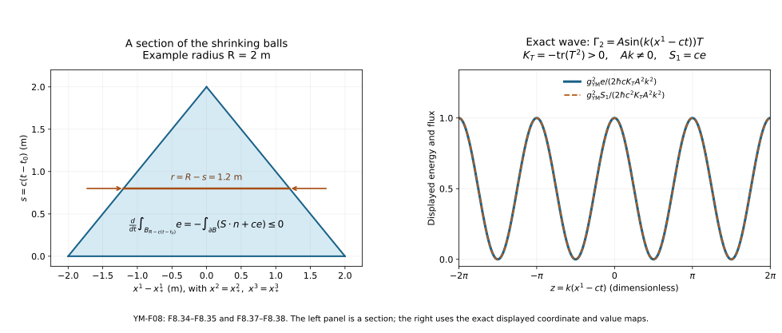

# Constraints, initial data and energy

This lesson answers three questions about a classical Yang–Mills field.
Which data may be prescribed at one time? How can a gauge be chosen without
changing those data's physical content? What quantity is conserved, and
how does it leave a region?

The preparation is [the action and field equations](../action-and-field-equations.html),
with the connection and transport constructions of
[Lesson 6](../bundles-transport-holonomy.html). All fields in Sections 1–9
are smooth. Smoothness here means that every derivative used exists and
is continuous. Existence for general initial data is the subject of the
next lesson; none of the energy identities below assumes such an
existence theorem as its proof.

## 1. Keep the time coordinate and the action

Work on \(I\times U\), where \(I\) is an open interval containing \(t_0\)
and \(U\subset\mathbb R^3\) is open. The time coordinate is \(t\), and the
spatial coordinates are \(x^1,x^2,x^3\). The constants
\(\hbar>0\), \(c>0\), and \(g_{\mathrm{YM}}\ne0\) retain their meanings
from Lesson 7. Write \(g_{\mathrm{YM}}\) in full to distinguish the coupling
from the metric. In these coordinates,

\[
 (g_{\mu\nu})=\operatorname{diag}(-c^2,1,1,1),\qquad
 (g^{\mu\nu})=\operatorname{diag}(-c^{-2},1,1,1),\qquad
 w=\sqrt{|\det g|}=c.
 \tag{F8.1}
\]

The group \(G\) is a closed matrix Lie subgroup of \(U(N)\). Its Lie algebra
\(\mathfrak g\) consists of skew-Hermitian matrices. We use the real,
positive definite pairing \(\kappa(X,Y)=-\operatorname{tr}(XY)\).
The connection is \(\Gamma=\Gamma_t\,dt+\Gamma_i\,dx^i\);
repeated spatial indices run from 1 to 3. Retain the definitions

\[
 \begin{aligned}
 \mathcal D_\mu X&=\partial_\mu X+[\Gamma_\mu,X],\\
 F_{\mu\nu}&=\partial_\mu\Gamma_\nu-\partial_\nu\Gamma_\mu
                    +[\Gamma_\mu,\Gamma_\nu],\\
 \mathcal E^\nu&=\mathcal D_\mu F^{\mu\nu},\qquad
 F^{\mu\nu}=g^{\mu\alpha}g^{\nu\beta}F_{\alpha\beta}.
 \end{aligned}
 \tag{F8.2}
\]

The density \(c\) is constant, so \(\mathcal E^\nu\) agrees with
\(w^{-1}\mathcal D_\mu(wF^{\mu\nu})\) in Lesson 7.
Define connection-valued electric and magnetic components by

\[
 E_i=F_{ti},\qquad B_1=F_{23},\quad B_2=F_{31},\quad B_3=F_{12},
 \qquad F_{ij}=\epsilon_{ijk}B_k,\quad \epsilon_{123}=1.
 \tag{F8.3}
\]

These \(E_i,B_i\) are matrices. The conversion to the physical
electromagnetic fields appears in Exercise 6. Define
\(|E|_\kappa^2=\sum_i\kappa(E_i,E_i)\), and similarly for \(B\).
Counting both orders of every antisymmetric pair gives

\[
 \begin{aligned}
 \kappa(F_{\mu\nu},F^{\mu\nu})
     &=-2c^{-2}|E|_\kappa^2+2|B|_\kappa^2,\\
 S_{\mathrm{YM}}
     &=-\frac{\hbar}{2g_{\mathrm{YM}}^2}
        \int c\,\kappa(F_{\mu\nu},F^{\mu\nu})\,dt\,d^3x\\
     &=\int \mathscr L_{\mathrm{YM}}\,dt\,d^3x,\qquad
 \mathscr L_{\mathrm{YM}}
       =\frac{\hbar}{g_{\mathrm{YM}}^2}
          \bigl(c^{-1}|E|_\kappa^2-c|B|_\kappa^2\bigr).
 \end{aligned}
 \tag{F8.4}
\]

For example the \((t,i)\) and \((i,t)\) summands are each
\(-c^{-2}\kappa(E_i,E_i)\). The spatial terms have the opposite sign
and occur twice. This proves the displayed contraction without absorbing
its factor 2 into the pairing or coupling.

## 2. What can be prescribed at one time?

The pure equation is \(\mathcal E^\nu=0\). More generally, use the
current convention of Lesson 7, \(\mathcal E^\nu=g_{\mathrm{YM}}^2J^\nu\).
Because \(F^{it}=c^{-2}E_i\) and \(F^{tj}=-c^{-2}E_j\), its four
components are exactly

\[
 \begin{aligned}
 \sum_i\mathcal D_iE_i&=c^2g_{\mathrm{YM}}^2J^t,\\
 \mathcal D_tE_j&=c^2\sum_i\mathcal D_iF_{ij}
                         -c^2g_{\mathrm{YM}}^2J^j
                     &&(j=1,2,3).
 \end{aligned}
 \tag{F8.5}
\]

The first equation has no time derivative of \(E\). It is the
**Gauss constraint**. Initial data for the pure field consist of
three connection coefficients \(a_i(x)=\Gamma_i(t_0,x)\) and three
electric coefficients \(e_i(x)=E_i(t_0,x)\), obeying

\[
 \sum_i\bigl(\partial_i e_i+[a_i,e_i]\bigr)=0,\qquad
 b_1=f_{23},\ b_2=f_{31},\ b_3=f_{12},\quad
 f_{ij}=\partial_i a_j-\partial_j a_i+[a_i,a_j].
 \tag{F8.6}
\]

Thus \(b_i\) are computed from \(a_i\). The magnetic field is fixed by
the connection data. Smooth pure data satisfying (F8.6) will be called
**smooth constraint data**. This definition concerns the constraint;
it makes no assertion about finite energy or a solution's lifespan.

Specifying \(a_i\) and \(e_i\) is also different from specifying
\(\Gamma_i\) and \(\partial_t\Gamma_i\) without a gauge:

\[
 E_i=\partial_t\Gamma_i-\mathcal D_i\Gamma_t,\qquad
 \partial_t\Gamma_i(t_0)=e_i+
               \partial_i\Gamma_t(t_0)+[a_i,\Gamma_t(t_0)].
 \tag{F8.7}
\]

The equality follows by expanding \(F_{ti}\), including
\([\Gamma_t,\Gamma_i]=-[\Gamma_i,\Gamma_t]\).
It shows the precise role of the time component.

There are many actual constraint data. Fix \(T\in\mathfrak g\), choose
smooth real functions \(a_i^{\mathrm{ab}}\), and a smooth real vector
field \(v\). Set

\[
 a_i=T a_i^{\mathrm{ab}},\qquad
 e_i=T(\nabla\times v)_i.
 \tag{F8.8}
\]

All commutators vanish and
\(\sum_i\partial_i(\nabla\times v)_i=0\), since the mixed second
derivatives cancel in pairs. Compactly supported choices have finite
energy. Conversely, \(a_i=0\), \(e_1=x^1T\), \(e_2=e_3=0\), with
\(T\ne0\), fail the constraint on every open set. The ability to write
smooth functions does not make them permissible data.

Noncommutativity matters even when the coefficients are constant.
For \(T_j=-i\sigma_j/2\) in \(\mathfrak{su}(2)\),
\([T_i,T_j]=\epsilon_{ijk}T_k\) and
\(\kappa(T_i,T_j)=\delta_{ij}/2\). The constant choice
\(a_1=\alpha T_1,\ e_1=\beta T_2,\ a_2=a_3=e_2=e_3=0\)
has constraint residual \(\alpha\beta T_3\).
In contrast, \(a_i=\alpha_iT_i,\ e_i=\beta_iT_i\), with no sum in
these definitions, satisfies (F8.6). Its magnetic field can still be
nonzero: \(f_{12}=\alpha_1\alpha_2T_3\). On all of \(\mathbb R^3\)
nonzero constant field strengths have infinite total energy; on a
finite periodic box the same data have finite energy.

## 3. Temporal gauge is an actual construction

A gauge transformation is a smooth map \(u:I\times U\to G\) acting by

\[
 \Gamma_\mu^u=u\Gamma_\mu u^{-1}-(\partial_\mu u)u^{-1},\qquad
 F_{\mu\nu}^u=uF_{\mu\nu}u^{-1}.
 \tag{F8.9}
\]

The **temporal gauge** condition is \(\Gamma_t^u=0\).
It is equivalent to a matrix ordinary differential equation with the
multiplication on the indicated side:

\[
 \partial_tu(t,x)=u(t,x)\Gamma_t(t,x),\qquad u(t_0,x)=I_N.
 \tag{F8.10}
\]

To construct it, solve \(\partial_tP=-\Gamma_tP\), \(P(t_0,x)=I_N\),
by the ordered-integral series in Lesson 6, Section 6. Set \(u=P^{-1}\).
Differentiating \(P^{-1}P=I_N\) gives
\(\partial_t(P^{-1})=P^{-1}\Gamma_t\), exactly (F8.10).
On a compact time interval and a compact spatial neighbourhood let
\(\|\Gamma_t\|\le M\) and \(|t-t_0|\le L\). The term with \(n\) factors
has norm at most \(M^nL^n/n!\); the series and its differentiated
parameter series converge as proved there. They give a smooth solution
on every such compact set. Uniqueness makes the solutions agree on
overlaps, so they define \(u\) throughout \(I\times U\).
The group-preservation argument of Lesson 6 gives \(P,u\in U(N)\)
and, for traceless coefficients, \(P,u\in SU(N)\).
For \(U(N)\) the inverse equation can also be checked directly:
\(\partial_t(uu^\dagger)=u(\Gamma_t+\Gamma_t^\dagger)u^\dagger=0\).
Here is the extension to any closed matrix Lie subgroup \(G\subset U(N)\).
For \(X\in\mathfrak g\), take a differentiable curve
\(\gamma(h)\in G\) with \(\gamma(0)=I_N,\ \gamma'(0)=X\).
For fixed real \(s\), \(\gamma(s/n)=I_N+sX/n+o(1/n)\).
The difference-of-powers identity, with the order of factors retained,
bounds
\(\|\gamma(s/n)^n-(I_N+sX/n)^n\|\) by
\(n\,o(1/n)(1+C/n)^n\), which tends to zero for a suitable fixed \(C\).
The binomial expansion of \((I_N+sX/n)^n\) tends to \(e^{sX}\):
the coefficient of \((sX)^k\) tends to \(1/k!\), and its norm is
bounded by \(\|sX\|^k/k!\), whose series converges.
Closedness of \(G\) therefore gives \(e^{sX}\in G\).
Approximate the continuous function \(\Gamma_t\) uniformly on a compact
time interval by step functions \(B_n\) taking its actual values.
The associated solutions \(P_n\) are finite ordered products of
\(e^{-\Delta t B_n}\), hence belong to \(G\).
Variation of the integral equation, or direct differentiation, gives

\[
 P_n(t)-P(t)=\int_{t_0}^t
       P(t)P(s)^{-1}(\Gamma_t(s)-B_n(s))P_n(s)\,ds.
\]

Each factor \(P(t),P(s),P_n(s)\) is unitary. In the operator norm this
bounds the difference by
\(|t-t_0|\sup_s\|\Gamma_t(s)-B_n(s)\|\), also for \(t<t_0\)
after reversing the integration interval. Thus \(P_n\to P\),
and closedness gives \(P\in G\), whence \(u=P^{-1}\in G\).
No assumption about the Yang–Mills equation was needed.

At \(t_0\), the function \(u(t_0,x)\) is the constant identity, so
\(\partial_i u(t_0,x)=0\). Consequently
\(\Gamma_i^u(t_0)=a_i\) and \(E_i^u(t_0)=e_i\). The construction
preserves the specified initial data, and (F8.7) becomes
\(\partial_t\Gamma_i^u(t_0)=e_i\).

Two temporal-gauge representatives are related by a gauge transformation
preserving temporal gauge exactly when \(\partial_tu=0\).
Indeed, (F8.9) gives \(0=-(\partial_tu)u^{-1}\).
These **residual gauges** have the form \(u=h(x)\), with data action

\[
 a_i^h=ha_ih^{-1}-(\partial_i h)h^{-1},\qquad
 e_i^h=he_ih^{-1},\qquad
 \sum_i\mathcal D_i^{a^h}e_i^h
       =h\left(\sum_i\mathcal D_i^a e_i\right)h^{-1}.
 \tag{F8.11}
\]

The last equality is the derivative covariance of Lesson 5, applied
to each \(e_i\). It proves that the gauge action preserves the constraint.
In particular, saying that temporal gauge is fixed does not remove the
spatial gauge freedom.

For a bundle over \(U\) presented by time-independent spatial transition
maps, the same construction works in local frames: on an overlap,
uniqueness of the time ODE gives \(P_a=g_{ab}P_bg_{ab}^{-1}\), and hence
\(u_a=g_{ab}u_bg_{ab}^{-1}\). These are exactly the compatibility
relations for a bundle gauge transformation. This statement applies to
the pullback bundle over \(I\times U\) in those frames; it does not assume
a single spatial frame exists.

The **Coulomb gauge** condition is
\(\sum_i\partial_i\Gamma_i=0\). The **Lorenz gauge** condition in the
present coordinates is
\(-c^{-2}\partial_t\Gamma_t+\sum_i\partial_i\Gamma_i=0\).
They are conditions on connection representatives, not additional
curvature equations. For the abelian form \(\Gamma_\mu=i a_\mu\)
and \(u=e^{i\theta}\), their exact gauge equations are

\[
 \begin{aligned}
 a_\mu^u&=a_\mu-\partial_\mu\theta,\\
 \Delta\theta&=\sum_i\partial_i a_i
                  &&\text{for Coulomb gauge},\\
 (-c^{-2}\partial_t^2+\Delta)\theta
        &=-c^{-2}\partial_t a_t+\sum_i\partial_i a_i
                  &&\text{for Lorenz gauge}.
 \end{aligned}
 \tag{F8.12}
\]

These follow by substitution, including the negative time coefficient.
Exercise 3 constructs Coulomb gauge for every finite Fourier example
specified there. A nonabelian substitution in (F8.9) retains the products
with \(u,u^{-1}\) and gives a nonlinear spatial equation. We have proved
the time ODE construction; we have not replaced that spatial equation
by the abelian one.

## 4. Why the constraint persists

This section proves propagation along a smooth solution of the three
spatial evolution equations. It does not presume the fourth equation.
The connection identity established in Lesson 7 is

\[
 \mathcal D_\nu\mathcal E^\nu
   =\mathcal D_\nu\mathcal D_\mu F^{\mu\nu}
   =\tfrac12[F_{\nu\mu},F^{\mu\nu}]=0.
 \tag{F8.13}
\]

For clarity, exchanging \(\mu,\nu\) and using antisymmetry turns the
double derivative into half its commutator. The curvature commutator
formula gives the middle expression. Its sum vanishes: the coefficient
\(g^{\mu\alpha}g^{\nu\beta}\) is unchanged when the pairs
\((\nu,\mu)\) and \((\beta,\alpha)\) exchange, whereas their bracket
changes sign. In our diagonal metric each nonzero contracted summand
is already a scalar multiple of \([F_{\nu\mu},F_{\nu\mu}]=0\).

Set \(R^\nu=\mathcal E^\nu-g_{\mathrm{YM}}^2J^\nu\), and define
the constraint residual

\[
 C=\sum_i\mathcal D_iE_i-c^2g_{\mathrm{YM}}^2J^t=c^2R^t.
 \tag{F8.14}
\]

For pure Yang–Mills take \(J^\nu=0\). With matter, require its actual
equation, which supplies
\(\mathcal D_\nu J^\nu=0\); the specified scalar model and proof are
given in Section 7. If \(R^j=0\) for \(j=1,2,3\), (F8.13) now yields

\[
 \mathcal D_t C=0.
 \tag{F8.15}
\]

Let \(P\) be the transport of Section 3. Differentiating directly gives
\(\partial_t(P^{-1}CP)=P^{-1}(\mathcal D_tC)P=0\).
Therefore

\[
 C(t,x)=P(t,x)C(t_0,x)P(t,x)^{-1}.
 \tag{F8.16}
\]

Zero initial residual remains zero. In temporal gauge \(P=I_N\),
so \(C(t,x)=C(t_0,x)\). More strongly, the norm
\(\kappa(C,C)\) remains constant along each time line, by invariance
of \(\kappa\). Constraint violation is transported by these exact
evolution equations; they do not automatically remove incorrect data.
If an externally specified current fails covariant conservation, the
same calculation gives
\(\mathcal D_tC=-c^2g_{\mathrm{YM}}^2\mathcal D_\nu J^\nu\).
This formula identifies the compatibility failure explicitly.

## 5. The stress tensor, derived from the metric

The **stress tensor** records the response of the action to the metric.
For a compactly supported symmetric variation \(h^{\mu\nu}=\delta
g^{\mu\nu}\), hold the connection fixed and define its covariant
components by
\(\delta_gS=-\tfrac12\int w T_{\mu\nu}h^{\mu\nu}\,d^4x\).
The metric is varied within nondegenerate metrics of the same signature.
Differentiate \(g_{\mu\alpha}g^{\alpha\nu}=\delta_\mu^\nu\) and
the determinant identity to obtain

\[
 \delta g_{\mu\nu}=-g_{\mu\alpha}h^{\alpha\beta}g_{\beta\nu},
 \qquad
 \delta w=-\tfrac12w g_{\mu\nu}h^{\mu\nu}.
 \tag{F8.17}
\]

The determinant derivative follows by multilinearity in its columns:
\(\delta\det g=(\det g)\operatorname{tr}(g^{-1}\delta g)\).
The sign of \(\det g\) is locally constant, so the same logarithmic
derivative applies to \(|\det g|\). Taking its square root gives
(F8.17).

Put \(K=\kappa(F_{\alpha\beta},F^{\alpha\beta})\) and
\(Q_{\mu\nu}=\kappa(F_{\mu\alpha},F_\nu{}^\alpha)\).
Varying each of the two inverse metrics in
\(K=g^{\alpha\gamma}g^{\beta\delta}
\kappa(F_{\alpha\beta},F_{\gamma\delta})\) gives \(Q_{\mu\nu}h^{\mu\nu}\)
twice. Pair symmetry of \(\kappa\) and antisymmetry of \(F\) show that
\(Q_{\mu\nu}=Q_{\nu\mu}\). Thus

\[
 \begin{aligned}
 \delta K&=2Q_{\mu\nu}h^{\mu\nu},\\
 T^{\mathrm{YM}}_{\mu\nu}
   &=\frac{2\hbar}{g_{\mathrm{YM}}^2}
       \left(\kappa(F_{\mu\alpha},F_\nu{}^\alpha)
                         -\tfrac14g_{\mu\nu}K\right).
 \end{aligned}
 \tag{F8.18}
\]

This is the stress tensor for the full action (F8.4), including its
pairing and factor \(1/2\). Its useful components are

\[
 \begin{aligned}
 T^{\mathrm{YM}}_{tt}
     &=\frac{\hbar}{g_{\mathrm{YM}}^2}
                   (|E|_\kappa^2+c^2|B|_\kappa^2),\\
 T^{\mathrm{YM}}_{ti}
     &=\frac{2\hbar}{g_{\mathrm{YM}}^2}
                     \sum_{j,k}\epsilon_{ijk}\kappa(E_j,B_k),\\
 T^{\mathrm{YM}}_{ij}
     &=\frac{2\hbar}{g_{\mathrm{YM}}^2}
       \left[-c^{-2}\kappa(E_i,E_j)-\kappa(B_i,B_j)
          +\tfrac12\delta_{ij}
                  (c^{-2}|E|_\kappa^2+|B|_\kappa^2)\right].
 \end{aligned}
 \tag{F8.19}
\]

To check the spatial line, multiply
\(\epsilon_{ik\ell}\epsilon_{jkm}\) and sum over \(k\); the result is
\(\delta_{ij}\delta_{\ell m}-\delta_{im}\delta_{\ell j}\).
The time summand in \(Q_{ij}\) is
\(-c^{-2}\kappa(E_i,E_j)\). Substituting (F8.4) in the metric term
then gives the displayed expression. All components are gauge
invariant real numbers by conjugation invariance of \(\kappa\).

We also need their divergence, including the force term when a current
is present. Pairing invariance implies
\(\partial_\mu\kappa(X,Y)=
\kappa(\mathcal D_\mu X,Y)+\kappa(X,\mathcal D_\mu Y)\).
At the fixed constant metric of (F8.1), the Bianchi identity gives

\[
 \kappa(F^{\mu\alpha},\mathcal D_\mu F_{\nu\alpha})
             =\tfrac14\partial_\nu K.
 \tag{F8.20}
\]

Here is the contraction in full. Write its left side as \(A\).
Pair \(F^{\mu\alpha}\) with
\(\mathcal D_\mu F_{\nu\alpha}-\mathcal D_\nu F_{\mu\alpha}
+\mathcal D_\alpha F_{\mu\nu}=0\). The middle contraction is
\(-\tfrac12\partial_\nu K\). In the last contraction exchange
\(\mu,\alpha\); antisymmetry of both \(F^{\mu\alpha}\) and
\(F_{\alpha\nu}\) makes it \(A\). Hence
\(2A-\tfrac12\partial_\nu K=0\), proving (F8.20).
The product rule in (F8.18) now cancels these derivative terms exactly:

\[
 \partial_\mu (T^{\mathrm{YM}})^\mu{}_\nu
    =\frac{2\hbar}{g_{\mathrm{YM}}^2}
                   \kappa(\mathcal E^\alpha,F_{\nu\alpha})
    =2\hbar\,\kappa(J^\alpha,F_{\nu\alpha}).
 \tag{F8.21}
\]

The final equality uses the gauge field equation. Pure Yang–Mills
has zero divergence. This proof used Bianchi, the field equation and
the actual metric variation, rather than an assumption that any
quadratic expression should be conserved.

## 6. Energy, its gauge term, and its flux

The momentum paired with a variation of \(\partial_t\Gamma_i\) in
\(\mathscr L_{\mathrm{YM}}\) is
\(\pi_i=2\hbar E_i/(g_{\mathrm{YM}}^2c)\).
There is no derivative \(\partial_t\Gamma_t\) in the action, so its
momentum is zero. In temporal gauge the Legendre expression
\(\sum_i\kappa(\pi_i,\partial_t\Gamma_i)-\mathscr L_{\mathrm{YM}}\)
equals

\[
 e_{\mathrm{YM}}
    =\frac{\hbar}{g_{\mathrm{YM}}^2}
              (c^{-1}|E|_\kappa^2+c|B|_\kappa^2)
    =\frac{T^{\mathrm{YM}}_{tt}}{c}.
 \tag{F8.22}
\]

We call \(e_{\mathrm{YM}}\) the energy density relative to the coordinate
measure \(d^3x\). It is nonnegative and vanishes exactly when every
\(E_i,B_i\) is zero. The factor \(1/c\) on the right follows from
the action measure \(c\,dt\,d^3x\); replacing it by \(1/c^2\) would
give a different Legendre expression.

For a general time component, use (F8.7) and the invariant product rule:

\[
 \begin{aligned}
 \mathscr H_{\mathrm{YM}}
 &=e_{\mathrm{YM}}+\sum_i\kappa(\pi_i,\mathcal D_i\Gamma_t)\\
 &=e_{\mathrm{YM}}
   +\sum_i\partial_i\kappa(\pi_i,\Gamma_t)
   -\frac{2\hbar}{g_{\mathrm{YM}}^2c}
                   \kappa\left(\sum_i\mathcal D_iE_i,\Gamma_t\right).
 \end{aligned}
 \tag{F8.23}
\]

On pure constraint data the last term is zero; the middle term remains
a boundary contribution. On a box it integrates to the signed values
of \(\kappa(\pi_i,\Gamma_t)\) on its two \(i\)-faces. On a torus
opposite faces cancel. This identifies exactly when the canonical
integral agrees with the gauge invariant energy integral.

Define the energy flux by

\[
 S_i^{\mathrm{YM}}=-cT^{\mathrm{YM}}_{it}
     =-\frac{2\hbar c}{g_{\mathrm{YM}}^2}
                      \sum_{j,k}\epsilon_{ijk}\kappa(E_j,B_k).
 \tag{F8.24}
\]

Since \(T^t{}_t=-T_{tt}/c^2\), the \(\nu=t\) component of (F8.21),
multiplied by \(-c\), is

\[
 \partial_te_{\mathrm{YM}}+\sum_i\partial_iS_i^{\mathrm{YM}}
                    =-2\hbar c\sum_i\kappa(J^i,E_i).
 \tag{F8.25}
\]

The minus sign in (F8.24) belongs to the matrix convention \(E_i=F_{ti}\).
Exercise 6 verifies that the physical electromagnetic flux has the
usual \(E_{\mathrm{phys}}\times B_{\mathrm{phys}}\) sign.

For a fixed rectangular region \(\Omega=\prod_i[a_i,b_i]\), integrate
(F8.25) and apply the one-dimensional fundamental theorem of calculus
to each \(x^i\). With \(n\) the outward unit normal on its faces,

\[
 \begin{aligned}
 \frac{d}{dt}\int_\Omega e_{\mathrm{YM}}\,d^3x
  &=-\int_{\partial\Omega} S^{\mathrm{YM}}\cdot n\,dA
             -2\hbar c\int_\Omega\sum_i\kappa(J^i,E_i)\,d^3x,\\
 \int_{\partial\Omega}S\cdot n\,dA
  &=\sum_i\left(\int_{x^i=b_i}S_i\,d^2x
                         -\int_{x^i=a_i}S_i\,d^2x\right).
 \end{aligned}
 \tag{F8.26}
\]

The second line specifies the orientation and retains both faces.
The same identity holds for a bounded \(C^1\) domain by the divergence
formula. One can derive that formula locally on a graph
\(x^3=f(x^1,x^2)\): integrating \(\partial_3S_3\) supplies \(S_3\)
on the graph, while differentiating the variable upper integration
limit in \(\partial_1S_1,\partial_2S_2\) supplies
\(-S_1\partial_1f-S_2\partial_2f\). Their sum is
\(S\cdot(-\partial_1f,-\partial_2f,1)\,dx^1dx^2=S\cdot n\,dA\).
Graph patches and a smooth partition as constructed in Lesson 6 reduce
a compact boundary to this calculation; derivative terms from the
partition sum to zero. The lower-boundary graph has the opposite
orientation. This proves the formula used here, including on a ball.

## 7. Charged scalar data and the energy exchanged with matter

Use precisely the scalar model from Lesson 7. A unitary representation
\(\rho:G\to U(K)\) has Lie algebra map \(r:\mathfrak g\to\mathfrak u(K)\).
The field \(\psi:I\times U\to\mathbb C^K\) has derivative
\(D_\mu^\rho\psi=\partial_\mu\psi+r(\Gamma_\mu)\psi\).
Let \(m\ge0\), \(\lambda\ge0\), and set

\[
 \begin{aligned}
 V(\psi)&=\frac{m^2c^2}{\hbar^2}\psi^\dagger\psi
                     +\frac{\lambda}{2}(\psi^\dagger\psi)^2,\\
 S_{\mathrm m}&=-\hbar\int c\,
       \left[g^{\mu\nu}(D_\mu^\rho\psi)^\dagger D_\nu^\rho\psi
                                    +V(\psi)\right]dt\,d^3x,\\
 D_\mu^\rho D^{\rho,\mu}\psi
          &=\left(\frac{m^2c^2}{\hbar^2}
                           +\lambda\psi^\dagger\psi\right)\psi,\\
 \kappa(X,J^\nu)&=
           \operatorname{Re}\bigl[(r(X)\psi)^\dagger D^{\rho,\nu}\psi\bigr]
                    \quad(X\in\mathfrak g).
 \end{aligned}
 \tag{F8.27}
\]

Nondegeneracy of \(\kappa\) makes the last line a unique element
\(J^\nu\in\mathfrak g\), at every point. If \(\{T_a\}\) is a real basis
and \(K_{ab}=\kappa(T_a,T_b)\), its explicit coefficients are
\(J^\nu=\sum_{a,b}T_a(K^{-1})_{ab}
\operatorname{Re}[(r(T_b)\psi)^\dagger D^{\rho,\nu}\psi]\).
This is a finite-dimensional formula, including the pairing matrix.

Write \(p=\psi(t_0)\) and \(v=D_t^\rho\psi(t_0)\).
The coupled constraint on \((a_i,e_i,p,v)\) is, for every
\(X\in\mathfrak g\),

\[
 \kappa\left(X,\sum_i(\partial_i e_i+[a_i,e_i])\right)
        =-g_{\mathrm{YM}}^2
                        \operatorname{Re}[(r(X)p)^\dagger v].
 \tag{F8.28}
\]

Indeed \(D^{\rho,t}=-c^{-2}D_t^\rho\), which cancels the \(c^2\)
in (F8.5). Residual gauges act by
\(p^h=\rho(h)p,\ v^h=\rho(h)v\), together with (F8.11).
Equivariance \(r(hXh^{-1})=\rho(h)r(X)\rho(h)^{-1}\)
and unitarity show that (F8.28) is preserved.

For use in Section 4, we verify current conservation. At a given point,
extend \(X\) to a smooth Lie-algebra field whose first derivatives there
are \(\partial_\nu X=-[\Gamma_\nu,X]\). These prescribed first
derivatives can be realized by an affine function in local coordinates.
Differentiate the defining pairing at that point, using the invariant
product rule, to get

\[
 \begin{aligned}
 \kappa(X,\mathcal D_\nu J^\nu)
   =\operatorname{Re}\bigl[
       (r(X)D_\nu^\rho\psi)^\dagger D^{\rho,\nu}\psi
       +(r(X)\psi)^\dagger
                          D_\nu^\rho D^{\rho,\nu}\psi\bigr]=0.
 \end{aligned}
 \tag{F8.29}
\]

The first contracted term is real zero: the metric contraction is
symmetric and \(r(X)^\dagger=-r(X)\), so complex conjugation changes
its sign. The second is a real coefficient times
\(\operatorname{Re}[(r(X)\psi)^\dagger\psi]=0\), by the scalar equation.
Since \(X\) was arbitrary, \(\mathcal D_\nu J^\nu=0\).

Metric variation as in Section 5 now gives

\[
 T^{\mathrm m}_{\mu\nu}
    =2\hbar\operatorname{Re}
          [(D_\mu^\rho\psi)^\dagger D_\nu^\rho\psi]
      -\hbar g_{\mu\nu}
          \left[g^{\alpha\beta}(D_\alpha^\rho\psi)^\dagger
                              D_\beta^\rho\psi+V(\psi)\right].
 \tag{F8.30}
\]

To see every contribution, the inverse-metric variation of the kinetic
term is \(h^{\mu\nu}\operatorname{Re}[(D_\mu^\rho\psi)^\dagger
D_\nu^\rho\psi]\); \(V\) is held fixed. The measure variation is
(F8.17). Multiplication by \(-\hbar\) and comparison with
\(-\tfrac12T_{\mu\nu}h^{\mu\nu}\) gives (F8.30).
Thus

\[
 \begin{aligned}
 e_{\mathrm m}=\frac{T^{\mathrm m}_{tt}}c
     &=\hbar\left[c^{-1}|D_t^\rho\psi|^2
                +c\sum_i|D_i^\rho\psi|^2+cV(\psi)\right],\\
 S_i^{\mathrm m}=-cT^{\mathrm m}_{it}
     &=-2\hbar c\,\operatorname{Re}
                        [(D_t^\rho\psi)^\dagger D_i^\rho\psi].
 \end{aligned}
 \tag{F8.31}
\]

The norm here is the usual Hermitian norm on \(\mathbb C^K\).
Its kinetic, spatial and potential contributions all have the
nonnegative signs displayed.

We prove, rather than assume, the cancellation of force densities.
Differentiate (F8.30), use the Hermitian product rule, and pair the
scalar equation with \(D_\nu^\rho\psi\).
The derivative of the potential is

\[
 \partial_\nu V
  =2\left(\frac{m^2c^2}{\hbar^2}+\lambda\psi^\dagger\psi\right)
                     \operatorname{Re}[\psi^\dagger D_\nu^\rho\psi].
\]

The connection contribution to this derivative is zero because it is
skew-Hermitian. These potential terms cancel. The remaining kinetic
terms are

\[
 2\hbar\operatorname{Re}\left[
 (D^{\rho,\alpha}\psi)^\dagger
          (D_\alpha^\rho D_\nu^\rho-D_\nu^\rho D_\alpha^\rho)\psi
                         \right].
\]

The commutator is \(r(F_{\alpha\nu})\psi\), by Lesson 5. Reversing
the antisymmetric pair and using (F8.27) proves

\[
 \begin{aligned}
 \partial_\mu(T^{\mathrm m})^\mu{}_\nu
          &=-2\hbar\kappa(J^\alpha,F_{\nu\alpha}),\\
 \partial_te_{\mathrm m}+\sum_i\partial_iS_i^{\mathrm m}
          &=+2\hbar c\sum_i\kappa(J^i,E_i),\\
 \partial_te+\sum_i\partial_iS_i&=0,\qquad
 e=e_{\mathrm{YM}}+e_{\mathrm m},\quad
 S=S^{\mathrm{YM}}+S^{\mathrm m}.
 \end{aligned}
 \tag{F8.32}
\]

The total energy obeys (F8.26) with the force term removed. Each
subsystem can exchange energy with the other; the displayed signs
show exactly which exchange cancels.

There is a matching canonical statement. The scalar Legendre pairing,
viewing complex components as pairs of real variables, is
\(2\hbar c^{-1}\operatorname{Re}[(D_t^\rho\psi)^\dagger
\partial_t\psi]\). Since
\(\partial_t\psi=D_t^\rho\psi-r(\Gamma_t)\psi\), its Hamiltonian
density is \(e_{\mathrm m}+2\hbar c\kappa(\Gamma_t,J^t)\).
Adding (F8.23) proves

\[
 \mathscr H_{\mathrm{total}}
    =e+\sum_i\partial_i\kappa(\pi_i,\Gamma_t)
            -\frac{2\hbar}{g_{\mathrm{YM}}^2c}\kappa(C,\Gamma_t).
 \tag{F8.33}
\]

The coupled Gauss constraint removes the final term, and the surface
term remains. This proves the relation for the actual coupled action,
including the charged scalar's contribution.

## 8. Local energy and the speed in the metric

For either the pure field or the coupled system of Section 7,
\(e\ge0\) and the flux obeys, for every spatial unit vector \(n\),

\[
 |S\cdot n|\le c e.
 \tag{F8.34}
\]

For the Yang–Mills part, \(n\cdot(E\times_\kappa B)\), where
\((E\times_\kappa B)_i=\epsilon_{ijk}\kappa(E_j,B_k)\), is the
pairing of \(E\) with a spatial rotation of \(B\). Decomposing
\(B\) into its component along \(n\) and perpendicular component shows
that the latter rotation has norm at most \(|B|_\kappa\).
Cauchy–Schwarz therefore bounds its absolute value by
\(|E|_\kappa|B|_\kappa\). The nonnegative square
\((|E|_\kappa-c|B|_\kappa)^2\) gives

\[
 \frac{2\hbar c}{g_{\mathrm{YM}}^2}|E|_\kappa|B|_\kappa
       \le\frac{\hbar}{g_{\mathrm{YM}}^2}
                 (|E|_\kappa^2+c^2|B|_\kappa^2)
       =ce_{\mathrm{YM}}.
\]

The scalar bound follows from

\[
 2\hbar c\,|\operatorname{Re}[(D_t^\rho\psi)^\dagger D_n^\rho\psi]|
 \le\hbar(|D_t^\rho\psi|^2+c^2|D_n^\rho\psi|^2)
 \le ce_{\mathrm m},
\]

where \(D_n^\rho=\sum_i n_iD_i^\rho\);
the last inequality uses
\(|D_n^\rho\psi|^2\le\sum_i|D_i^\rho\psi|^2\) and \(V\ge0\).
The triangle inequality proves (F8.34) for their sum.

Fix a centre \(x_*\), radius \(R>0\), and times
\(t_0\le t<t_0+R/c\) with the closed shrinking balls inside \(U\).
Their radii are \(r(t)=R-c(t-t_0)\). For a smooth solution,

\[
 \frac{d}{dt}\int_{|x-x_*|<r(t)}e(t,x)\,d^3x
   =-\int_{|x-x_*|=r(t)}(S\cdot n+ce)\,dA\le0.
 \tag{F8.35}
\]

Here is the moving-domain derivative. Substitute \(x=x_*+r(t)y\)
and differentiate the integral over the fixed unit ball.
The derivative is the integral of
\(\partial_te+(r'/r)((x-x_*)\cdot\nabla e+3e)\).
The second parenthesis is
\(\nabla\cdot((x-x_*)e)\), whose boundary integral is \(r e\).
The result is \(\int\partial_te+r'\int_{\partial B}e\).
Use (F8.32), the divergence formula proved in Section 6,
and \(r'=-c\). Inequality (F8.34) finishes (F8.35).

In particular, zero initial energy in the radius-\(R\) ball implies
zero energy throughout its forward shrinking cone. Nonnegativity and
continuity justify the pointwise conclusion: a positive value would
have a neighbourhood with a positive integral. For pure Yang–Mills,
every \(F_{\mu\nu}\) then vanishes there. For the coupled model,
also \(D_\mu^\rho\psi=0\) and \(V(\psi)=0\). If \(m>0\) or
\(\lambda>0\), the potential formula further gives \(\psi=0\).
If \(m=\lambda=0\), a nonzero covariantly constant scalar is allowed.
These are conclusions about energy and curvature along an existing
smooth solution. A general uniqueness statement for two nonzero
solutions needs an estimate for their difference.

*Figure 1. Left: a spatial section of the shrinking domain in (F8.35);
the plotted time is \(s=c(t-t_0)\), so the radius is \(R-s\).
The drawing is a section of three-dimensional balls, not the spatial
domain itself. Right: the exact outgoing example of Section 9.
The plotted energy and flux retain their displayed conversion factors;
the two curves coincide because \(S_1=ce\). The source reproduces both
panels from the stated formulas.*

On a periodic box, opposite boundary terms in (F8.26) cancel.
Thus the total energy is constant there. On \(\mathbb R^3\), a useful
precise statement is the following. Suppose the smooth solution has
finite \(E_{\mathrm{tot}}(t)=\int_{\mathbb R^3}e(t,x)\,d^3x\) at
each time under consideration, and
\(\int_a^b E_{\mathrm{tot}}(t)\,dt<\infty\) on every compact time
interval. Then \(E_{\mathrm{tot}}(b)=E_{\mathrm{tot}}(a)\).
To prove it, choose a smooth function \(0\le\chi\le1\), equal to
1 on the unit ball, zero outside the radius-2 ball, and with
\(|\nabla\chi|\le C_\chi\). Such a function follows from the bumps
constructed in Lesson 6. Set \(\chi_R(x)=\chi(x/R)\).
Integration by parts in the compactly supported balance law gives

\[
 \left|\int\chi_R e(b)-\int\chi_Re(a)\right|
   \le \frac{c C_\chi}{R}\int_a^b E_{\mathrm{tot}}(t)\,dt.
 \tag{F8.36}
\]

At either endpoint the difference between \(\int\chi_R e\) and
\(E_{\mathrm{tot}}\) is bounded by the integrable tail
\(\int_{|x|>R}e\), which tends to zero. The right side tends to zero
as well, proving the claim. Thus no unmentioned flux assumption at
spatial infinity has been inserted. For fields supported in a fixed
bounded spatial set on each compact time slab, the stated integrability
is immediate from smoothness.

## 9. Two exact examples

First take \(T\in\mathfrak g\setminus\{0\}\), \(K_T=\kappa(T,T)>0\),
and any smooth real function \(f\) of one real variable. The connection

\[
 \Gamma_t=\Gamma_1=\Gamma_3=0,\qquad
 \Gamma_2=f(x^1-ct)T
 \tag{F8.37}
\]

has \(E_2=-cf'(x^1-ct)T,\ B_3=f'(x^1-ct)T\), with all other
electric and magnetic components zero. Every matrix coefficient is
a multiple of \(T\), so the commutators vanish. The constraint is
\(\partial_2E_2=0\). The \(j=2\) evolution equation is
\(\partial_tE_2=c^2f''T=c^2\partial_1F_{12}\); the other two
equations have zero on both sides. Thus it is an exact pure solution,
not an approximation to one. Its energy and flux are

\[
 e_{\mathrm{YM}}
       =\frac{2\hbar c K_T}{g_{\mathrm{YM}}^2}(f')^2,\qquad
 S^{\mathrm{YM}}
       =\frac{2\hbar c^2K_T}{g_{\mathrm{YM}}^2}(f')^2(1,0,0).
 \tag{F8.38}
\]

It saturates (F8.34) and moves in the positive \(x^1\) direction.
For \(f(z)=A\sin(kz)\), retain
\((f')^2=A^2k^2\cos^2(kz)\). On
\([a,b]\times[0,L_2]\times[0,L_3]\), its energy is

\[
 \frac{2\hbar cK_T A^2k^2L_2L_3}{g_{\mathrm{YM}}^2}
   \left[\frac{b-a}{2}
     +\frac{\sin(2k(b-ct))-\sin(2k(a-ct))}{4k}\right]
\]

for \(k\ne0\); at \(k=0\) the connection is zero and the energy is
zero. Differentiating the expression gives
\(-L_2L_3(S_1(b)-S_1(a))\), as in (F8.26).
On a spatial torus with \(kL_1\in2\pi\mathbb Z\setminus\{0\}\),
the sine terms cancel and the energy is
\(\hbar cK_TA^2k^2 L_1L_2L_3/g_{\mathrm{YM}}^2\).
On \(\mathbb R^3\) this wave is not a finite-total-energy example:
its density is independent of \(x^2,x^3\).

Second, on a periodic box take \(T_j=-i\sigma_j/2\) and the
homogeneous temporal connection

\[
 \Gamma_i(t,x)=q(t)T_i\quad(i=1,2,3),\qquad \Gamma_t=0.
 \tag{F8.39}
\]

Then \(E_i=q'T_i,\ F_{ij}=q^2\epsilon_{ijk}T_k\), and
\(\sum_i[\Gamma_i,E_i]=0\). For fixed \(j\), the two indices \(i\ne j\)
each contribute \(-q^3T_j\) to
\(\sum_i[\Gamma_i,F_{ij}]\). For example when \(j=1\),
\([\Gamma_2,F_{21}]=[qT_2,-q^2T_3]=-q^3T_1\) and
\([\Gamma_3,F_{31}]=[qT_3,q^2T_2]=-q^3T_1\).
The other \(j\)'s follow by the same cyclic permutation. Therefore
the full field equation in this family is exactly

\[
 q''+2c^2q^3=0,\qquad
 e_{\mathrm{YM}}
     =\frac{3\hbar}{2g_{\mathrm{YM}}^2}
                         (c^{-1}(q')^2+cq^4),\qquad S=0.
 \tag{F8.40}
\]

The flux vanishes because \(\kappa(T_j,T_k)=0\) for \(j\ne k\).
Multiplying the scalar equation by \(2q'\) shows
\(\frac{d}{dt}((q')^2+c^2q^4)=0\), so it also checks the energy
law directly.

For completeness this family has a solution for every real initial
pair \(q(t_0)=q_0,\ q'(t_0)=p_0\), for all real time.
Write \(y=(q,p)\), \(V(y)=(p,-2c^2q^3)\). On a closed radius-\(R\)
rectangle about \(y_0\), let \(M\) bound \(|V|\) in the maximum norm
and let \(L\) bound its derivative in the induced matrix norm.
Both exist because the entries are polynomials on a compact rectangle.
On continuous paths staying there, the map
\(\Phi y(t)=y_0+\int_{t_0}^tV(y(s))\,ds\) stays there when
\(\delta M\le R\), and
\(\|\Phi y-\Phi z\|_\infty\le\delta L\|y-z\|_\infty\).
Choose \(\delta L<1\). Successive iterates then have differences
bounded by a geometric series, converge uniformly, and satisfy the
integral equation by continuity of \(V\). The same inequality proves
uniqueness. The integral equation makes the solution differentiable,
and repeated differentiation makes it smooth.
The conserved number \(H_0=p_0^2+c^2q_0^4\) bounds
\(|p|\le\sqrt{H_0}\) and
\(|q|\le(H_0/c^2)^{1/4}\). On a rectangle larger than these bounds,
the same \(M,L,\delta\) work at every new initial time. Repeating the
local construction covers all positive and negative times. If
\(H_0=0\) the identically zero solution already gives the conclusion.
This proves global existence for this explicit invariant family;
it is not a proof for arbitrary spatially varying data.

## 10. Eight exercises, with full solutions

### Exercise 1. Transport a nonzero constraint residual

Suppose the pure spatial evolution equations hold and at one spatial
point \(\Gamma_t=\omega T_3\) is constant in time,
\(C(t_0)=aT_1\), where \(T_j=-i\sigma_j/2\).
Find \(C(t)\) without imposing the Gauss equation.

**Solution.** Equation (F8.15) reads
\(\partial_tC=-\omega[T_3,C]\). Since
\([T_3,T_1]=T_2\) and \([T_3,T_2]=-T_1\), its solution is

\[
 C(t)=a\bigl(\cos(\omega(t-t_0))T_1
                   -\sin(\omega(t-t_0))T_2\bigr).
 \tag{F8.41}
\]

Differentiate each trigonometric term and use the two brackets to
check the equation and initial value. Alternatively insert
\(P=e^{-\omega(t-t_0)T_3}\) in (F8.16).
Its squared norm is \(a^2/2\), so the residual never becomes zero
when \(a\ne0\). This is the evolution of a residual if such spatial
evolution data are being followed; it is not a construction of a
solution of all four Yang–Mills equations with nonzero residual.

### Exercise 2. A residual gauge changes the potential derivatives

Start with \(\Gamma=0\) on \(I\times\mathbb R^3\).
For \(G=U(1)\), use \(h(x)=e^{iM(x^1)^2}\), \(M\in\mathbb R\).
Compute the transformed field, curvature and energy.

**Solution.** Since \(\partial_1h=2iMx^1h\),

\[
 \Gamma_t^h=0,\quad \Gamma_1^h=-2iMx^1,\quad
 \Gamma_2^h=\Gamma_3^h=0,\quad
 \partial_1\Gamma_1^h=-2iM,\quad F^h=0,\quad e^h=0.
 \tag{F8.42}
\]

The sole nonzero spatial derivative cancels from the antisymmetric
curvature, and the \(U(1)\) bracket is zero. Temporal gauge therefore
permits arbitrarily large potential derivatives at exactly zero
energy. The exact morphism is the gauge transformation (F8.9);
curvature and energy are preserved while connection derivatives
need not be. Energy alone cannot bound these derivatives in an
arbitrary representative. If compact support is desired, replace
\(M(x^1)^2\) by any compactly supported smooth real function with
large second derivative; the same curvature calculation applies.

### Exercise 3. Construct a periodic Coulomb representative

Let \(a_i(x)=\sum_{n\in\mathcal F}a_{i,n}e^{ik_n\cdot x}\) be a
finite real Fourier sum on the torus of side lengths \(L_1,L_2,L_3>0\),
where \(k_{n,i}=2\pi n_i/L_i\), \(\mathcal F\subset\mathbb Z^3\)
is finite and closed under \(n\mapsto-n\), and
\(a_{i,-n}=\overline{a_{i,n}}\). Construct a real periodic \(\theta\)
such that \(\Gamma_i=i a_i\), transformed by \(e^{i\theta}\),
satisfies Coulomb gauge. State what happens to the zero mode.

**Solution.** Take

\[
 \theta_0=0,\qquad
 \theta_n=-\frac{i\sum_i k_{n,i}a_{i,n}}{|k_n|^2}\ (n\ne0),
 \qquad \theta(x)=\sum_{n\in\mathcal F}\theta_ne^{ik_n\cdot x}.
 \tag{F8.43}
\]

The denominator is positive for \(n\ne0\). Direct conjugation gives
\(\theta_{-n}=\overline{\theta_n}\), so \(\theta\) is real.
Each nonzero mode satisfies
\(-|k_n|^2\theta_n=i\sum_i k_{n,i}a_{i,n}\), and the zero mode
of the divergence is zero. Hence
\(\Delta\theta=\sum_i\partial_i a_i\) term by term.
Equation (F8.12) gives \(a_i^u=a_i-\partial_i\theta\), whose
nonzero coefficients are

\[
 a_{i,n}^u=a_{i,n}
       -\frac{k_{n,i}\sum_j k_{n,j}a_{j,n}}{|k_n|^2}.
 \tag{F8.44}
\]

Their contraction with \(k_{n,i}\) is zero. The zero coefficient
\(a_{i,0}\) is unchanged; a periodic real \(\theta\) cannot remove
it by a constant derivative. Larger periodic \(U(1)\) gauge maps
can have winding: \(u=e^{i\sum_i2\pi m_i x^i/L_i}\) shifts it by
\(-2\pi m_i/L_i\), even though the real exponent is not periodic.
Thus the construction fixes a representative using periodic real
gauge parameters without falsely asserting uniqueness under all
periodic gauge maps.

### Exercise 4. Recover the magnetic constraints and evolution

Use Bianchi to find the equations for \(B_i\) in the conventions
of (F8.3).

**Solution.** Its \((1,2,3)\) component gives

\[
 \sum_i\mathcal D_i B_i=0,\qquad
 \mathcal D_tB_k=\sum_{i,j}\epsilon_{kij}\mathcal D_i E_j.
 \tag{F8.45}
\]

For the second line start with
\(\mathcal D_tF_{ij}+\mathcal D_iF_{jt}
+\mathcal D_jF_{ti}=0\), substitute \(F_{jt}=-E_j\),
and obtain \(\mathcal D_tF_{ij}=\mathcal D_iE_j-\mathcal D_jE_i\).
For \(k=1\) this is
\(\mathcal D_tB_1=\mathcal D_2E_3-\mathcal D_3E_2\);
the other cyclic choices give (F8.45).
The positive curl sign follows from \(E_i=F_{ti}\).
Both equations are identities for a connection, so the magnetic
constraint is already contained in computing \(b\) from \(a\)
in (F8.6).

### Exercise 5. Derive the pure local energy balance directly

Prove (F8.25) for \(J=0\), without first using the stress tensor.

**Solution.** Differentiate (F8.22), use the invariant product rule,
and insert (F8.5) and (F8.45). This gives

\[
 \partial_te_{\mathrm{YM}}
 =\frac{2\hbar c}{g_{\mathrm{YM}}^2}
     \left[\sum_{j,i,k}\epsilon_{ijk}\kappa(E_j,\mathcal D_iB_k)
       +\sum_{k,i,j}\epsilon_{kij}\kappa(B_k,\mathcal D_iE_j)\right].
 \tag{F8.46}
\]

The cyclic equality \(\epsilon_{kij}=\epsilon_{ijk}\) turns the
two sums into
\((2\hbar c/g_{\mathrm{YM}}^2)
\partial_i\sum_{j,k}\epsilon_{ijk}\kappa(E_j,B_k)\).
This is \(-\partial_i S_i^{\mathrm{YM}}\), including its sign.
If \(J\ne0\), the extra \(-c^2g_{\mathrm{YM}}^2J^j\) in
(F8.5) contributes
\(-2\hbar c\sum_j\kappa(E_j,J^j)\), recovering the complete
(F8.25). This proof also independently checks the stress-derived flux.

### Exercise 6. Convert the energy and flux to electromagnetism

Use the one-dimensional charged representation of Lesson 7:
\(\Gamma_t=iq\phi/\hbar\), \(\Gamma_i=-iqA_i/\hbar\),
with real \(q\ne0\),
\(E_{\mathrm{phys}}=-\partial_tA-\nabla\phi\),
\(B_{\mathrm{phys}}=\nabla\times A\), and
\(g_{\mathrm{YM}}^2=2q^2/(\epsilon_0\hbar c)\).
Derive the physical energy and flux.

**Solution.** The connection components are
\(E_i=(iq/\hbar)E_{\mathrm{phys},i}\) and
\(B_i=(-iq/\hbar)B_{\mathrm{phys},i}\).
For \(U(1)\), \(\kappa(ix,iy)=xy\). Hence

\[
 \begin{aligned}
 |E|_\kappa^2&=\frac{q^2}{\hbar^2}|E_{\mathrm{phys}}|^2,\qquad
 |B|_\kappa^2=\frac{q^2}{\hbar^2}|B_{\mathrm{phys}}|^2,\\
 e_{\mathrm{YM}}
      &=\frac{\epsilon_0}{2}|E_{\mathrm{phys}}|^2
                     +\frac{1}{2\mu_0}|B_{\mathrm{phys}}|^2,\\
 S^{\mathrm{YM}}&=\frac1{\mu_0}
                      E_{\mathrm{phys}}\times B_{\mathrm{phys}},
 \qquad \mu_0=\frac1{\epsilon_0c^2}.
 \end{aligned}
 \tag{F8.47}
\]

The electric-magnetic pairing in (F8.24) is
\(-q^2E_{\mathrm{phys},j}B_{\mathrm{phys},k}/\hbar^2\);
it cancels that formula's minus sign. The remaining coefficient is
\(2q^2c/(g_{\mathrm{YM}}^2\hbar)=\epsilon_0c^2\).
For a physical electric current \(j\), the spatial field equation
of Lesson 7 gives \(J^i= i qj_i/(\hbar\epsilon_0c^2
g_{\mathrm{YM}}^2)\). Substitution into
\(-2\hbar c\kappa(J^i,E_i)\) gives
\(-j\cdot E_{\mathrm{phys}}\). Thus the full electromagnetic
balance is \(\partial_te+\nabla\cdot S=-j\cdot E_{\mathrm{phys}}\).

### Exercise 7. Find and test charged scalar constraint data

For \(G=U(1)\), \(K=1\), \(r(ix)=ix\), on a neighbourhood of
the origin in \(\mathbb R^3\), take \(a_i=0\), \(p=A\),
\(v=i\omega A\), with \(A,\omega\) real constants.
Find linear electric data satisfying (F8.28). Can the same constant
\(p,v\) occur with periodic electric data on a torus?

**Solution.** Write \(e_i=i\eta_i\) with real \(\eta_i\).
For \(X=ix\),
\(\operatorname{Re}[(ixA)^\dagger i\omega A]=x\omega A^2\).
Equation (F8.28) becomes
\(\sum_i\partial_i\eta_i=-g_{\mathrm{YM}}^2\omega A^2\).
One choice is

\[
 e_1=-i g_{\mathrm{YM}}^2\omega A^2 x^1,\qquad e_2=e_3=0.
 \tag{F8.48}
\]

These data are smooth locally; on all of \(\mathbb R^3\) they have
infinite energy when \(\omega A\ne0\), and no finite-energy claim
is being made. On a torus, integration of the divergence is zero
because the opposite faces cancel. The proposed right side has
integral \(-g_{\mathrm{YM}}^2\omega A^2\operatorname{Vol}\).
Periodic data therefore require \(\omega A^2=0\).
When that condition holds, \(e_i=0\) supplies such data.
This is an exact global compatibility condition, even though the
same local constraint has the explicit solution (F8.48).

### Exercise 8. Prove a bound for energy in an expanding ball

Let \(r(t)=R+c(t-t_0)\), and assume the solution is smooth on the
closed balls under consideration. Prove the counterpart of (F8.35).
State the conclusion for energy initially inside the radius-\(R\) ball.

**Solution.** The moving-domain calculation in Section 8, now with
\(r'=c\), gives

\[
 \frac{d}{dt}\int_{|x-x_*|<R+c(t-t_0)}e(t,x)\,d^3x
       =\int_{|x-x_*|=R+c(t-t_0)}(ce-S\cdot n)\,dA\ge0.
 \tag{F8.49}
\]

The inequality is precisely (F8.34). Thus the energy in the expanding
ball is at least the energy in its initial ball. With the global
conservation hypotheses of Section 8 and zero initial energy outside
the radius-\(R\) ball, the expanding ball has at least the whole
initial energy and at most the conserved total energy. Equality
holds, and the energy outside it is zero. By continuity this gives
the curvature and matter conclusions stated after (F8.35).
The boundary speed is the original \(c\), not an unspecified unit speed.

## 11. Source comparison and the next step

The classical data and constraint are standard in the subject.
A primary reference used here is Sung-Jin Oh,
[*Finite energy global well-posedness of the Yang–Mills equations
on \(\mathbb R^{1+3}\): An approach using the Yang–Mills heat flow*,
arXiv:1210.1557v2](https://arxiv.org/abs/1210.1557v2),
29 June 2015, published in *Duke Mathematical Journal* 164(9)
(2015), 1669–1732. The original author TeX was read in its background
subsection (lines 386–465, labels eq:YMconstraint and eq:YMenergy),
the gauge discussion (lines 536–546), and the beginning of the
initial-data definitions (lines 783–812). This is bounded source
reading, not a claim to have verified that paper's global analytic proof.

Here is the exact comparison, retaining the factors instead of changing
our action to the source's energy convention. Write the source time
coordinate as \(y^0=ct\), its spatial coordinates as \(y^i=x^i\),
and use \(G=SU(N)\). Its connection and curvature are

\[
 A^{\mathrm{Oh}}_0(y)=c^{-1}\Gamma_t(y^0/c,y^i),\qquad
 A^{\mathrm{Oh}}_i(y)=\Gamma_i(y^0/c,y^i),\qquad
 F^{\mathrm{Oh}}_{0i}=c^{-1}E_i,\quad
 F^{\mathrm{Oh}}_{ij}=F_{ij}.
 \tag{F8.50}
\]

The chain rule gives the time derivative factor \(1/c\); the
connection transformation is that of a one-form, so the same factor
also occurs in its time coefficient. Substitution into the curvature
definition verifies both curvature formulas, term by term.
In particular, \(\mathcal D^{\mathrm{Oh}}_0=c^{-1}\mathcal D_t\)
and \(\mathcal D^{\mathrm{Oh}}_i=\mathcal D_i\). Raising indices with
the source metric \(\operatorname{diag}(-1,1,1,1)\) gives
\(\mathcal E_{\mathrm{Oh}}^0=c\mathcal E^t\) and
\(\mathcal E_{\mathrm{Oh}}^i=\mathcal E^i\), evaluated at \(t=y^0/c\).
The source writes its equation with the final index lowered:
\((\mathcal D^{\mathrm{Oh}})^\mu F^{\mathrm{Oh}}_{\mu\nu}
=\operatorname{diag}(-1,1,1,1)_{\nu\alpha}
\mathcal E_{\mathrm{Oh}}^\alpha\).
Since that metric and the coordinate map are invertible, all four
pure equations correspond in both directions.
The source inner product is
\((X,Y)_{\mathrm{Oh}}=\operatorname{tr}(XY^\dagger)\).
On its skew-Hermitian Lie algebra this equals
\(-\operatorname{tr}(XY)=\kappa(X,Y)\), without a further factor.
Its constraint is \(c^{-1}\sum_i\mathcal D_iE_i=0\), and its
displayed energy \(\mathbf E_{\mathrm{Oh}}\) is exactly

\[
 \begin{aligned}
 \mathbf E_{\mathrm{Oh}}(ct)
   &=\frac12\int_{\mathbb R^3}
       \left[c^{-2}|E(t,x)|_\kappa^2
                       +\sum_{i<j}\kappa(F_{ij}(t,x),F_{ij}(t,x))\right]d^3x,\\
 E_{\mathrm{YM}}(t)
   &=\frac{2\hbar c}{g_{\mathrm{YM}}^2}\,
                                  \mathbf E_{\mathrm{Oh}}(ct).
 \end{aligned}
 \tag{F8.51}
\]

The equality \(\sum_{i<j}\kappa(F_{ij},F_{ij})=|B|_\kappa^2\)
follows from (F8.3), including \(F_{13}=-B_2\).
Thus this is an exact map of data, equations and energy.

Two small source statements need explicit correction when using this
edition. Its line 419 names \(SU(1)\) as the electromagnetic group.
But \(SU(1)=\{1\}\) has zero Lie algebra and hence only zero curvature.
The electromagnetic specialization uses \(U(1)\), whose Lie algebra
is \(i\mathbb R\), as proved directly in Exercise 6.
Also an inner product takes values in \(\mathbb R\), not always
\([0,\infty)\) as written in line 389: for nonzero \(X\),
\(\kappa(X,-X)=-\kappa(X,X)<0\). Nonnegativity applies to
\(\kappa(X,X)\). Neither correction changes the source constraint or
energy formula on \(SU(N)\) for \(N\ge2\), and neither is presented
as a new research result.

The source's later low-regularity data use
\(a\in\dot H^1\cap L^3,\ e\in L^2\) and the distributional constraint;
its solution class includes a specified approximation by classical
solutions. Those are additional analytic definitions, not synonyms
for the smooth constraint data of Section 2. The next lesson develops
the norms, solution notions and existence arguments needed to discuss
classical evolution and their relation to such research results.
The present lesson supplies complete proofs of its constraint,
gauge, stress, flux and explicit-solution claims.

All teaching text, proofs, solutions and figures here are independently
written and dedicated under CC0-1.0. The original author source retains
its own terms and is not included in the course download.
