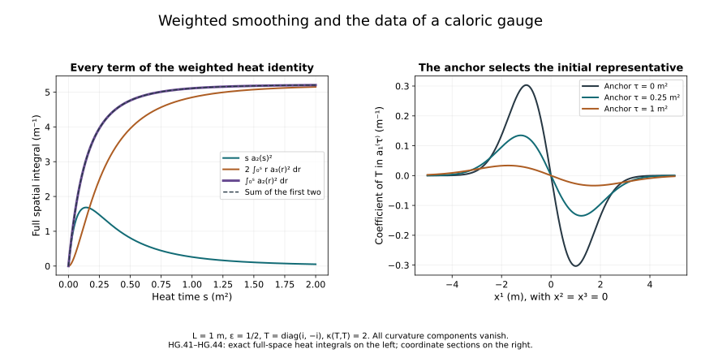

# Heat smoothing and the caloric gauge

The [construction chapter](../classical-heat-construction.html)
produced a DeTurck solution for every spatial connection in
\(\dot H^1(\mathbb R^3)\). This chapter constructs its caloric
representative, proves quantitative dependence on the original
connection, and identifies exactly the solution map extended from
regular data.

Keep the same \(x^1,x^2,x^3\), heat parameter \(s\), closed matrix
group \(G\subset U(N)\), trace inner product and reference length
\(\ell>0\). No spatial coordinate or heat endpoint is changed.
The heat parameter has units of length squared. On the Lie algebra
the matrix norm is the norm of \(\kappa(X,Y)=-\operatorname{tr}(XY)\);
on general matrices use the Hilbert–Schmidt norm. Undifferentiated
gauge matrices in \(L^\infty\) are measured in operator norm. A
unitary matrix has operator norm one, and multiplication by it
preserves the Hilbert–Schmidt norm.

The source comparison is Sung-Jin Oh's
[*Gauge choice for the Yang–Mills equations using the Yang–Mills
heat flow and local well-posedness in \(H^1\)*,
arXiv:1210.1558v2](https://arxiv.org/abs/1210.1558v2),
Section 5 and its gauge appendix, together with the heat-flow
discussion in
[*Finite energy global well-posedness of the Yang–Mills equations
on \(\mathbb R^{1+3}\)*,
arXiv:1210.1557v2](https://arxiv.org/abs/1210.1557v2).
The constants, proofs, examples and teaching organization here
are independent course exposition.

## 1. The two norms needed by the gauge

For every ordered derivative define

\[
a_j(A;s)^2=
\sum_{i=1}^3\sum_{k_1,\ldots,k_j=1}^3
\|\partial_{k_1}\cdots\partial_{k_j}A_i(s)\|_2^2.
\tag{HG.1}
\]

Write

\[
\begin{aligned}
X_S(A)&=\sup_{0\le s\le S}a_1(A;s)
       +\left(\int_0^S a_2(A;s)^2\,ds\right)^{1/2},\\
Y_S(A)&=\sup_{0<s\le S}\sqrt{s}\,a_2(A;s)
       +\left(\int_0^S s\,a_3(A;s)^2\,ds\right)^{1/2}.
\end{aligned}
\tag{HG.2}
\]

The underlying \(X_S\) space includes continuity into the concrete
\(\dot H^1\) representative: a function in \(L^6\) with full
gradient in \(L^2\). Its completeness and approximation by smooth
compactly supported data were proved in F09 and (HC.20).
For a difference, \(X_\delta\) and \(Y_\delta\) mean these same
norms applied to \(A-B\), not differences of two numerical norms.

Retain the Sobolev constants from H9.8–H9.11:

\[
C_S=\frac4{\sqrt3},\qquad
C_M=2\sqrt{A_*B_*},\qquad
A_*=(4\pi/3)^{-1/6},\quad
B_*=(4\pi)^{-1}(20\pi/3)^{5/6}.
\tag{HG.3}
\]

In particular,
\(\|A\|_6\le C_Sa_1\),
\(\|\nabla A\|_3\le C_S^{1/2}\sqrt{a_1a_2}\), and
\(\|A\|_\infty\le C_MC_S\sqrt{a_1a_2}\).
The last inequality for the homogeneous representative, without
an \(L^2\) assumption on \(A\), was proved in HC.21.

Use the actual ordered equation

\[
\begin{aligned}
\partial_sA_i-\Delta A_i&=N(A)_i,\\
Q(A,B)_i&=\sum_j\{2[A_j,\partial_jB_i]-[A_j,\partial_iB_j]\},\\
T(A,B,C)_i&=\sum_j[A_j,[B_j,C_i]],\\
N(A)&=Q(A,A)+T(A,A,A).
\end{aligned}
\tag{HG.4}
\]

Fix a positive radius \(R\), in the units of \(a_1\), and set

\[
\begin{aligned}
D_2&=18\sqrt3\,C_MC_S,\qquad D_3=12\sqrt3\,C_S^3,\\
S_R&=\min\{(32D_2R)^{-4},(48D_3R^2)^{-2}\}.
\end{aligned}
\tag{HG.5}
\]

For \(a_1(A_0)<R/4\), HC.23–HC.31 construct a unique DeTurck
solution in \(X_{S_R}\) with \(X_{S_R}(A)\le R\). For any two
such data their solutions satisfy
\(X_{S_R}(A-B)\le(8/3)a_1(A_0-B_0)\).
We use any \(0<S\le S_R\) below.

## 2. A full derivative of the nonlinear equation

Differentiating the four actual quadratic terms gives

\[
\partial_k Q(A,B)_i=\sum_j
\{2[\partial_kA_j,\partial_jB_i]
 +2[A_j,\partial_{kj}B_i]
 -[\partial_kA_j,\partial_iB_j]
 -[A_j,\partial_{ki}B_j]\}.
\tag{HG.6}
\]

There are nine output pairs \((i,k)\). For each fixed output the
sum of the original coefficients over \(j\) is nine in each
of the two derivative placements. The bracket bound is
\(|[X,Y]|\le2|X||Y|\). Applying \(L^3L^6\to L^2\) to the first
placement and \(L^\infty L^2\to L^2\) to the second, then taking
the full output norm, proves

\[
\begin{aligned}
K&=54(C_S^{3/2}+C_MC_S),\qquad J=36C_S^3,\\
\|\nabla Q(A,B)\|_2
 &\le K\,a_1(A)^{1/2}a_2(A)^{1/2}a_2(B),\\
\|\nabla T(A,B,C)\|_2
 &\le J\{a_2(A)a_1(B)a_1(C)
       +a_1(A)a_2(B)a_1(C)
       +a_1(A)a_1(B)a_2(C)\}.
\end{aligned}
\tag{HG.7}
\]

For the cubic inequality, differentiate each of the three factors
in its original position. Each nested bracket costs four, its
\(j\)-sum costs three and the nine output components cost three.
The differentiated factor has \(L^6\) norm at most \(C_Sa_2\);
each other factor has \(L^6\) norm at most \(C_Sa_1\). These
facts give exactly the coefficient \(J\) for each placement.

Time Hölder now yields

\[
\begin{aligned}
\|\nabla N(A)\|_{L^1_sL^2_x}
 &\le KS^{1/4}X_S(A)^2+3J\sqrt S\,X_S(A)^3,\\
\|\sqrt{s}\nabla Q(A,B)\|_{L^2_sL^2_x}
 &\le KS^{1/4}X_S(A)^{1/2}Y_S(A)^{1/2}X_S(B),\\
\|\sqrt{s}\nabla T(A,B,C)\|_{L^2_sL^2_x}
 &\le3J\sqrt S\,X_S(A)X_S(B)X_S(C).
\end{aligned}
\tag{HG.8}
\]

For the first quadratic bound,
\(\int a_2^{3/2}\le S^{1/4}(\int a_2^2)^{3/4}\);
multiply by \(\sup a_1^{1/2}\).
For its cubic bound use \(\int a_2\le\sqrt S\|a_2\|_{L^2}\).
For the second line, \(\sqrt{s}a_2(A)^{1/2}
\le s^{1/4}Y_S(A)^{1/2}\), and then use \(s^{1/4}\le S^{1/4}\)
with the \(L^2_s\) norm of \(a_2(B)\).
For each term in the last line, keep the differentiated factor
in \(L^2_s\) and bound \(\sqrt s\) by \(\sqrt S\).
This proves every time factor in (HG.8).

## 3. The first weighted smoothing bound

Initially let the data and solution be regular, meaning smooth
in \(s\) with all spatial Sobolev derivatives square-integrable.
Pair the equation for \(\nabla A\) with \(-s\Delta\nabla A\).
Integration by parts in space and then time gives

\[
\frac12 s a_2(s)^2+\int_0^s r a_3(r)^2\,dr
=\frac12\int_0^s a_2(r)^2\,dr
 +\int_0^s r\langle\nabla N(A),-\Delta\nabla A\rangle\,dr .
\tag{HG.9}
\]

Here \(\|\Delta\nabla A\|_2=a_3\): the sum of the squares of all
ordered third-derivative multipliers is \(|\xi|^6\).
The weighted initial term is zero. Spatial cutoff errors vanish
by the same \(L^2\) integration-by-parts argument as HC.25.
Use \(2uv\le u^2+v^2\) in the last integral. Taking the supremum
of the endpoint term and the final value of the integral
separately gives

\[
Y_S(A)\le2\{X_S(A)+
\|\sqrt{s}\nabla N(A)\|_{L^2_sL^2_x}\}.
\tag{HG.10}
\]

Put \(X=X_S(A)\), \(Y=Y_S(A)\). The last two lines of (HG.8)
bound its right-hand side by
\(2X+2KS^{1/4}X^{3/2}\sqrt Y+6J\sqrt S X^3\).
Since
\(2KS^{1/4}X^{3/2}\sqrt Y
\le Y/2+2K^2\sqrt S X^3\), we obtain

\[
Y_S(A)\le4X_S(A)+4(K^2+3J)\sqrt S\,X_S(A)^3.
\qquad
Y_R=4R+4(K^2+3J)\sqrt S\,R^3.
\tag{HG.11}
\]

This holds uniformly on every existing regular subinterval of
\([0,S]\). The next section proves that no regular approximation
loses its regularity before this common endpoint.

## 4. A common lifespan for every regular approximation

Keep the original Fourier transform
\(\widehat f(\xi)=\int e^{-ix\cdot\xi}f(x)\,d^3x\), with inverse
factor \((2\pi)^{-3}\). Splitting frequency space at \(\rho>0\)
and applying Cauchy–Schwarz gives

\[
\begin{aligned}
\|\widehat A\|_1
&\le\sqrt{4\pi\rho}\,\||\xi|\widehat A\|_2
 +\sqrt{4\pi/\rho}\,\||\xi|^2\widehat A\|_2,\\
\|\widehat A\|_1&\le C_0\sqrt{a_1a_2},\qquad
\|\widehat{\nabla A}\|_1\le C_0\sqrt{a_2a_3},\\
C_0&=4\sqrt\pi(2\pi)^{3/2}.
\end{aligned}
\tag{HG.12}
\]

Indeed \(\int_{|\xi|<\rho}|\xi|^{-2}\,d^3\xi=4\pi\rho\) and
\(\int_{|\xi|>\rho}|\xi|^{-4}\,d^3\xi=4\pi/\rho\).
Set \(\rho=a_2/a_1\) and use Parseval in the first line.
If either norm is zero, the regular \(L^2\) function is zero;
the conclusion follows directly. Apply the same calculation
to the full tuple \(\nabla A\) for the third inequality.

Let \(M_q\) be the full \(H^q_\ell\) norm from HC.1. For \(r=q-1\ge2\)
put \(p_r=2^{r-1}(2\pi)^{-3}\), \(v_0=(2\pi)^{-3}\).
The weight inequality used in F09, followed by convolution Young,
gives the exact useful bound

\[
\|XY\|_{H^r_\ell}
\le p_r\{\|X\|_{H^r_\ell}\|\widehat Y\|_1
       +\|\widehat X\|_1\|Y\|_{H^r_\ell}\}.
\tag{HG.13}
\]

Keep both terms; the reference length remains inside each Sobolev
weight. The bracket has an additional factor two.
Apply (HG.13) to each term of (HG.4), and use
\(\|\partial_iA\|_{H^{q-1}_\ell}\le\ell^{-1}M_q\). The result is

\[
\begin{aligned}
\|N(A)\|_{H^{q-1}_\ell}&\le L_q(s)M_q(A;s),\\
L_q(s)&=18\sqrt3\,p_rC_0
  \{\sqrt{a_2a_3}+\ell^{-1}\sqrt{a_1a_2}\}\\
&\quad+12\sqrt3\,p_r(v_0+2p_r)C_0^2a_1a_2.
\end{aligned}
\tag{HG.14}
\]

To check the cubic constant, write \(F=\|\widehat A\|_1\).
The inner bracket has Fourier \(L^1\) norm at most \(2v_0F^2\)
and \(H^r_\ell\) norm at most \(4p_rM_qF\).
The outer bracket therefore costs
\(4p_r(v_0+2p_r)M_qF^2\). Its three summands and three output
components give the factor \(12\sqrt3\).
The original quadratic coefficient sum is nine; the bracket and
output norm give \(18\sqrt3\).

Suppose a regular solution has maximal endpoint \(T_*<S\).
On its interval it equals the already constructed \(X_S\)
DeTurck solution by HC's uniqueness. Hence \(X\le R\) and
(HG.11) bounds \(Y\le Y_R\) uniformly up to that endpoint.
Choose \(0<\tau<T_*\). On \([\tau,T_*)\),
\(\sup a_2\le Y_R/\sqrt\tau\) and
\(\int a_3^2\le Y_R^2/\tau\). In particular \(L_q\in L^4\),
with the following bound independent of \(T_*\):

\[
\begin{aligned}
\|L_q\|_{L^4(\tau,T_*)}\le M
&=18\sqrt3\,p_rC_0
\{Y_R/\sqrt\tau+
\ell^{-1}\sqrt{RY_R}\,\tau^{-1/4}(S-\tau)^{1/4}\}\\
&\quad+12\sqrt3\,p_r(v_0+2p_r)C_0^2
RY_R\,\tau^{-1/2}(S-\tau)^{1/4}.
\end{aligned}
\tag{HG.15}
\]

The heat multiplier of HC.6 is
\(h_\ell(s)=1+\ell/\sqrt{2es}\). Its exact Hölder bound is

\[
\|h_\ell\|_{L^{4/3}(0,\eta)}
\le H_\ell(\eta):=
\eta^{3/4}+\ell3^{3/4}\eta^{1/4}/\sqrt{2e}.
\tag{HG.16}
\]

When \(M>0\), take
\(\eta=\min\{(4M)^{-4/3},
(\sqrt{2e}/(4\ell3^{3/4}M))^4\}\).
Then \(M H_\ell(\eta)\le1/2\).
On an interval starting at \(\tau\), Duhamel gives

\[
M_q(s)\le M_q(\tau)+
\int_\tau^s h_\ell(s-r)L_q(r)M_q(r)\,dr.
\tag{HG.17}
\]

Divide \([\tau,T_*)\) into intervals of length at most \(\eta\).
If \(V\) bounds the preceding supremum, the earlier-history
part of the integral is at most \(MH_\ell(S-\tau)V\).
The current part is at most one half of the current supremum.
Since \(V\ge M_q(\tau)\), the new cumulative bound is at most
\((2+2MH_\ell(S-\tau))V\).
There are at most \(\lceil(S-\tau)/\eta\rceil\) intervals.
This proves a finite bound for \(M_q\) up to \(T_*\).
If \(M=0\), (HG.17) directly gives \(M_q(s)\le M_q(\tau)\).

There is also a strong \(H^q_\ell\) limit at \(T_*\).
For the Duhamel integral, the portion within \(2\varepsilon\)
of the endpoint is bounded by a fixed constant times
\(M H_\ell(2\varepsilon)\), which tends to zero. In its earlier
portion, the heat semigroup converges strongly in \(H^q_\ell\),
with an integrable majorant supplied by (HG.14) and the positive
time separation. The initial semigroup term converges strongly
as well. HC's regular local construction restarts at these
endpoint data. The endpoint values for different \(q\) agree
because the Sobolev inclusions are continuous and their limits
are limits of the same function. Its common-interval
higher-regularity result gives a regular extension past \(T_*\),
a contradiction.

Thus every regular initial datum in the ball in (HG.5) has
a regular DeTurck solution on the entire same interval \([0,S]\).
No bound on its initial higher derivatives enters that lifespan.

## 5. Weighted differences and smoothing of the rough solution

For \(\delta=A-B\) retain the exact difference

\[
N(A)-N(B)=Q(\delta,A)+Q(B,\delta)
 +T(\delta,A,A)+T(B,\delta,A)+T(B,B,\delta).
\tag{HG.18}
\]

For regular solutions with \(X\le R\), (HG.7)–(HG.8) give

\[
\begin{aligned}
\|\nabla(N(A)-N(B))\|_{L^1L^2}
 &\le(2KS^{1/4}R+9J\sqrt S R^2)X_\delta,\\
\|\sqrt{s}\nabla(N(A)-N(B))\|_{L^2L^2}
 &\le KS^{1/4}
 \{R\sqrt{X_\delta Y_\delta}+\sqrt{RY_R}X_\delta\}
 +9J\sqrt S R^2X_\delta .
\end{aligned}
\tag{HG.19}
\]

Each of the three cubic summands has three derivative placements;
this is the factor nine. For the first quadratic summand in the
first line, use Hölder exponents \(4,2,4\) on
\(a_2(\delta)^{1/2},a_2(A),1\), together with
\(\sup a_1(\delta)^{1/2}\). The second is treated with \(A\)
and \(\delta\) in their displayed order. This gives two terms
bounded by \(KS^{1/4}RX_\delta\). For the weighted estimate
apply the second line of (HG.8) to these same two placements.

Apply (HG.9)–(HG.10) to the difference equation. Absorb

\[
2KS^{1/4}R\sqrt{X_\delta Y_\delta}
\le Y_\delta/2+2K^2\sqrt S R^2X_\delta.
\]

The result is

\[
\begin{aligned}
Y_\delta&\le B_R X_\delta,\\
B_R&=4+4K^2\sqrt S R^2+
4KS^{1/4}\sqrt{RY_R}+36J\sqrt S R^2.
\end{aligned}
\tag{HG.20}
\]

Take smooth compactly supported initial approximations converging
in \(\dot H^1\), with all norms at most \(R/4\); choose \(R/4\)
strictly larger than the norm of the limiting datum if needed.
Their solutions exist on the whole same interval by Section 4.
HC.31 and (HG.20) make them Cauchy in both \(X_S\) and \(Y_S\).
The \(X_S\) limit is HC's DeTurck solution by uniqueness.
The weighted Hessians converge uniformly in \(L^2\), and their
third derivatives converge in \(L^2(s\,ds\,d^3x)\).
Testing against compactly supported smooth functions identifies
both limits with the derivatives of that solution. This also
proves completeness in these additional norms.

For each approximation, \(\sqrt{s}\nabla^2A\) is continuous on
\([0,S]\) and is zero at zero. Uniform convergence preserves
these two properties. On every \([\tau,S]\), the Hessian is
continuous in \(L^2\). Thus (HG.11), (HG.19) and (HG.20) hold
for the rough solutions themselves, by the proved convergence.
The \(L^1L^2\) nonlinear derivatives converge by the first line
of (HG.19), and their limit is the distributional derivative
of the actual polynomial (HG.4).

## 6. The gauge equation and its first spatial derivative

Set

\[
b(s)=\sum_{i=1}^3\partial_iA_i(s),\qquad
\partial_sV=Vb,\quad V(0)=I .
\tag{HG.21}
\]

The divergence is an \(L^2\) Lie-algebra function continuous
down to zero. Define

\[
C_\infty=\sqrt3\,C_MC_S3^{3/4},
\qquad C_p=\sqrt3\,C_S^{1/2}3^{3/4}.
\tag{HG.22}
\]

The full divergence contraction has factor \(\sqrt3\).
The scalar interpolation estimates applied to \(\nabla A\)
therefore give
\(\|b\|_\infty\le\sqrt3 C_MC_S\sqrt{a_2a_3}\),
\(\|\nabla b\|_3\le\sqrt3 C_S^{1/2}\sqrt{a_2a_3}\), and
\(\|\nabla b\|_6\le\sqrt3 C_Sa_3\).
Retaining the heat powers, Hölder with exponents \(4/3,4\) gives

\[
\begin{aligned}
\int_0^s\sqrt{a_2(r)a_3(r)}\,dr
&\le
\bigl(\sup\sqrt r\,a_2(r)\bigr)^{1/2}
\int_0^s r^{-1/2}(\sqrt r\,a_3(r))^{1/2}\,dr\\
&\le3^{3/4}s^{1/4}Y_S(A).
\end{aligned}
\]

Consequently

\[
\begin{aligned}
\int_0^s\|b(r)\|_\infty\,dr&\le C_\infty s^{1/4}Y_S(A),\\
\int_0^s\|\nabla b(r)\|_3\,dr&\le C_p s^{1/4}Y_S(A),\\
\|V(s)-I\|_2&\le\sqrt3\,sX_S(A),\\
p_V(s):=\|\nabla V(s)\|_3&\le C_ps^{1/4}Y_S(A).
\end{aligned}
\tag{HG.23}
\]

For regular coefficients, the unitary ODE proved in F09 gives
the unique \(G\)-valued \(V\). Integration of \(V_s=Vb\) gives
the \(L^2\) estimate. Differentiation gives
\((\partial_iV)_s=(\partial_iV)b+V\partial_i b\).
The right-multiplication evolution generated by the
skew-Hermitian \(b\) preserves the matrix norm. Variation of
constants followed by the \(L^3\) triangle inequality proves
the last line of (HG.23).
The integrability in the first line will also allow the rough
coefficient; Section 8 constructs the limit and its uniqueness
for the ODE explicitly.

## 7. The signed primitive and the second spatial derivative

Directly integrating an absolute third-derivative norm would
lose the needed estimate. The divergence of (HG.4) gives the
following exact signed primitive instead:

\[
\begin{aligned}
J_A(s)&=\int_0^s\Delta b(r)\,dr\\
&=b(s)-b(0)-\int_0^s\operatorname{div}N(A)(r)\,dr,\\
\sup_{0\le s\le S}\|J_A(s)\|_2
&\le J_R:=
2\sqrt3 R+\sqrt3(KS^{1/4}R^2+3J\sqrt S R^3).
\end{aligned}
\tag{HG.24}
\]

The first equality initially concerns regular solutions.
For rough solutions the second line defines a continuous
\(L^2\) primitive with \(J_A(0)=0\), by Section 5. Its
distributional derivative is \(\Delta b\). Thus the same
identity survives without asserting \(\Delta b\in L^1L^2\).

Put \(Z_V=(\Delta V)V^{-1}\). Differentiation of the actual
matrix ODE gives

\[
\partial_s Z_V
=V(\Delta b)V^{-1}
 +2\sum_i(\partial_iV)(\partial_i b)V^{-1}.
\]

Since
\((VJ_AV^{-1})_s=V(\partial_sJ_A+[b,J_A])V^{-1}\),
integration by parts in the signed primitive gives

\[
Z_V(s)=V(s)J_A(s)V(s)^{-1}
 -\int_0^s V[b,J_A]V^{-1}\,dr
 +2\sum_i\int_0^s(\partial_iV)(\partial_i b)V^{-1}\,dr.
\tag{HG.25}
\]

All products retain their order. The initial boundary term
is zero. The bracket integral is bounded by
\(2J_RC_\infty S^{1/4}Y_R\).
For the last integral, spatial Hölder gives
\(\sum_i\|(\partial_iV)(\partial_i b)\|_2
\le\|\nabla V\|_3\|\nabla b\|_6\).
The exact time estimate

\[
\int_0^S s^{1/4}a_3(s)\,ds
\le\left(\int_0^S s^{-1/2}ds\right)^{1/2}
\left(\int_0^S s a_3(s)^2ds\right)^{1/2}
\le\sqrt2 S^{1/4}Y_R
\]

then proves

\[
\begin{aligned}
h_V(s):=\|\nabla^2V(s)\|_2&=\|\Delta V(s)\|_2\le H_R,\\
H_R&=J_R(1+2C_\infty S^{1/4}Y_R)
 +2C_p\sqrt3 C_S\sqrt2 S^{1/4}Y_R^2 .
\end{aligned}
\tag{HG.26}
\]

For a regular gauge, \(V-I\in L^2\) with all spatial derivatives
in \(L^2\), by HC.18. Parseval identifies the full Hessian
norm with the Laplacian norm; multiplication by \(V^{-1}\)
preserves the latter. This proves the equality in (HG.26),
not only an inequality between two selected derivatives.

## 8. Differences of the gauges

For two DeTurck solutions A,B write \(b=\operatorname{div}A\),
\(c=\operatorname{div}B\), and let V,W solve (HG.21) with the
same anchor \(0\). Set
\(q_\delta(s)=\|V(s)-W(s)\|_\infty\) in operator norm.
The exact ODE difference and its spatial derivative are

\[
\begin{aligned}
(V-W)_s&=(V-W)b+W(b-c),\\
\partial_i(V-W)_s&=\partial_i(V-W)b+(V-W)\partial_i b
 +(\partial_iW)(b-c)+W\partial_i(b-c).
\end{aligned}
\tag{HG.27}
\]

Variation of constants with the norm-preserving right
evolution of \(b\), followed by (HG.23), gives

\[
\begin{aligned}
q_\delta(s)&\le C_\infty s^{1/4}Y_\delta,\\
\|\nabla(V-W)(s)\|_3
&\le C_ps^{1/4}Y_\delta
       (1+2C_\infty s^{1/4}Y_R).
\end{aligned}
\tag{HG.28}
\]

For the second inequality, its three forcing terms are
bounded by
\(q_\delta(s)\int_0^s\|\nabla b\|_3\),
\(C_ps^{1/4}Y_R\int_0^s\|b-c\|_\infty\), and
\(\int_0^s\|\nabla(b-c)\|_3\), respectively.
This proves the factor two in the last parentheses.

For explicit second-derivative differences introduce the
following numerical quantities; none replaces the underlying
matrix objects:

\[
\begin{aligned}
Q_\delta&=C_\infty Y_\delta,\qquad q=Q_\delta S^{1/4},\\
P&=C_pY_R,\qquad
P_\delta=C_pY_\delta(1+2C_\infty S^{1/4}Y_R),\\
J_\delta&=
\{2\sqrt3+\sqrt3(2KS^{1/4}R+9J\sqrt S R^2)\}X_\delta,\\
I_R&=C_\infty S^{1/4}Y_R,\qquad
I_\delta=C_\infty S^{1/4}Y_\delta .
\end{aligned}
\tag{HG.29}
\]

Here (HG.24) and (HG.19) show
\(\sup_s\|J_A(s)-J_B(s)\|_2\le J_\delta\).
Subtract (HG.25) for V and W. Its endpoint has norm at most
\(J_\delta+2qJ_R\).
For its bracket integral use
\([b,J_A]-[c,J_B]=[b-c,J_A]+[c,J_A-J_B]\);
the change of conjugation costs another \(2q\).
This gives the bound
\(2J_RI_\delta+2J_\delta I_R+4qJ_RI_R\).
The difference of its last integrand is exactly

\[
\begin{aligned}
&(\partial_iV)(\partial_i b)V^{-1}
 -(\partial_iW)(\partial_i c)W^{-1}\\
&=\partial_i(V-W)(\partial_i b)V^{-1}
 +(\partial_iW)\partial_i(b-c)V^{-1}
 +(\partial_iW)(\partial_i c)(V^{-1}-W^{-1}).
\end{aligned}
\tag{HG.30}
\]

Use (HG.28), \(\|\nabla b\|_6\le\sqrt3 C_Sa_3(A)\),
the time estimate preceding (HG.26), and
\(\int_0^S s^{1/2}a_3(s)ds\le\sqrt S\,Y_R\).
The complete bound is

\[
\begin{aligned}
\sup_s\|Z_V-Z_W\|_2\le Z_\delta
&:=J_\delta+2qJ_R
 +2J_RI_\delta+2J_\delta I_R+4qJ_RI_R\\
&\quad+2\sqrt3 C_S\{
\sqrt2 S^{1/4}(P_\delta Y_R+P Y_\delta)
 +Q_\delta P\sqrt S\,Y_R\},\\
\sup_s\|\nabla^2(V-W)\|_2&\le h_\delta:=Z_\delta+qH_R.
\end{aligned}
\tag{HG.31}
\]

The final line follows from
\(\Delta(V-W)=(Z_V-Z_W)V+Z_W(V-W)\), and the full
Hessian–Laplacian identity. Every term on its right is
linear in \(X_\delta,Y_\delta\) for fixed R,S.

Apply these inequalities to the regular approximations
constructed in Section 5. Their gauges converge uniformly
in \(C_sL^\infty_x\), their gradients in \(C_sL^3_x\), and
their Hessians in \(C_sL^2_x\). In addition, (HG.27) gives

\[
\sup_s\|V-W\|_2
\le\sqrt3 S(qR+X_\delta).
\tag{HG.32}
\]

Indeed integrate its two terms in \(L^2\), using the already
proved uniform operator-norm bound and \(\|b-c\|_2
\le\sqrt3 a_1(A-B)\).
Thus \(V-I\) has a continuous \(L^2\) limit too. Distributional
testing identifies every derivative of the limit. A subsequence
converges almost everywhere in space-time, so closedness of G
preserves its values in G. The ODE passes to the limit since
\(b_n\to b\) in \(L^1L^\infty\) by (HG.23) for differences and
the gauges converge uniformly. Its initial value is I.
If two bounded gauges solve this ODE with that same initial
value, their difference solves \(U_s=Ub\) with zero initial
value; the integral inequality and the integrability of
\(\|b\|_\infty\) give \(U=0\) by Gronwall.
This proves existence and uniqueness of the rough gauge.
All estimates above pass to it. Its inverse is its adjoint,
so the corresponding norms and differences of inverse
matrices and their derivatives are identical.

## 9. The caloric connection and its dependence on the data

Define the actual transformed components by

\[
a_i=VA_iV^{-1}-(\partial_iV)V^{-1},\qquad
a_s=VbV^{-1}-(\partial_sV)V^{-1}=0.
\tag{HG.33}
\]

For \(Y_i^V=(\partial_iV)V^{-1}\), direct differentiation gives
the complete formula

\[
\partial_j a_i=
V(\partial_jA_i)V^{-1}
 +[Y_j^V,VA_iV^{-1}]
 -(\partial_{ji}V)V^{-1}+Y_i^VY_j^V .
\tag{HG.34}
\]

By Sobolev, \(\|\nabla V\|_6\le C_Sh_V\).
For regular gauges this follows from \(V-I\in H^\infty\);
for the rough gauge it follows by the proved convergence.
Spatial Hölder applied to (HG.34) gives

\[
a_1(a;s)\le(1+2C_Sp_V(s))R+(1+C_Sp_V(s))h_V(s).
\]

Also \(\|a(s)\|_6\le C_SR+C_Sh_V(s)\).
Thus each formula defines the same concrete \(\dot H^1\)
representative used throughout the course.

For two connections, write \(a,\widetilde a\) for (HG.33)
formed from \((A,V),(B,W)\). Put

\[
p=P S^{1/4},\qquad
p_* =P_\delta S^{1/4}+q p.
\]

The full \(L^3\) norm of \(Y^V-Y^W\) is at most \(p_*\).
Subtracting (HG.34) term by term proves

\[
\begin{aligned}
\sup_s a_1(a-\widetilde a;s)
\le\mathcal L_{R,S}(X_\delta,Y_\delta)
&:=X_\delta+2qR+2C_Sp_*R\\
&\quad+2C_Sp(X_\delta+2qR)
 +h_\delta+qH_R+2C_Sp_*H_R .
\end{aligned}
\tag{HG.35}
\]

Here \(q,p_*,h_\delta\) are exactly the expressions in
(HG.29)–(HG.31). For the commutator term use
\(|[Y_j,A_i]|\le2|Y_j||A_i|\), summed in the full output
tuple. For the last product, expand
\(Y_i^VY_j^V-Y_i^WY_j^W
=(Y_i^V-Y_i^W)Y_j^V+Y_i^W(Y_j^V-Y_j^W)\),
and use \(L^3L^6\to L^2\).
The conjugation change in \(\partial A\) costs \(2qR\);
the second-gauge-derivative change costs \(h_\delta+qH_R\).
These account for every term in (HG.35).
The right-hand side is an explicit homogeneous linear
function of its two arguments, with nonnegative coefficients.

Equations (HG.20), (HC.31) and (HG.35) prove the data estimate

\[
\sup_{0\le s\le S}a_1(a(A_0;s)-a(B_0;s))
\le\frac83\,\mathcal L_{R,S}(1,B_R)\,a_1(A_0-B_0).
\tag{HG.36}
\]

Writing the coefficient through (HG.29)–(HG.35) retains all
its factors and summands. The two arguments \(1,B_R\) here
specify the coefficients of the linear bound; they do not
set a physical field, unit or heat endpoint equal to one.

For regular approximations, (HG.35) shows uniform convergence
of the transformed connections in \(C([0,S];\dot H^1)\).
Consequently \(a(0)=A_0\) and \(a\) is continuous in that
space. It solves the caloric Yang–Mills heat equation:

\[
\partial_s a_i=\sum_j D^a_jF^a_{ji},\qquad
F^a_{ji}=\partial_j a_i-\partial_i a_j+[a_j,a_i],
\quad D^a_jX=\partial_jX+[a_j,X].
\tag{HG.37}
\]

For clarity, this is a distributional assertion for rough data.
Here \(\nabla a_n\to\nabla a\) in \(C_sL^2\) and
\(a_n\to a\) in \(C_sL^6\). The curvature therefore converges
in \(C_s(L^2+L^3)\). Its product with \(a_n\) converges in
\(C_s(L^{3/2}+L^2)\): the differentiated term uses
\(L^6L^2\to L^{3/2}\), and the cubic term uses
\(L^6L^6L^6\to L^2\).
All are locally integrable. Test (HG.37) for the regular
approximations against a compactly supported smooth function,
integrate by parts, and pass each of these convergences through
the integral. The time derivative passes by the same convergence
of \(a_n\). This proves (HG.37) with the original initial data.

We now identify the uniqueness assertion for this construction.
It is the unique continuous extension, to \(\dot H^1\) data
on each bounded-data common interval, of the regular caloric
solution map. Indeed smooth compactly supported data are dense;
(HG.36) makes their images Cauchy and independent of the chosen
approximating sequence. Any continuous extension agrees on that
dense set and hence at its limits. The next section proves
uniqueness of those regular caloric solutions themselves.
Uniqueness among every distributional solution in
\(C_s\dot H^1\) is a stronger assertion and is not used here.

## 10. Uniqueness of regular caloric solutions

Let a and \(\widetilde a\) be regular caloric solutions with
the same initial value. Set \(e=a-\widetilde a\),
\(K_{ij}=F^a_{ij}-F^{\widetilde a}_{ij}\), and write
\(|K|^2=\sum_{i<j}|K_{ij}|^2\).
Subtracting their actual equations gives

\[
\partial_s e_i=\sum_j D^a_jK_{ji}
 +\sum_j[e_j,F^{\widetilde a}_{ji}],\qquad
D^a_je_i-D^a_ie_j=K_{ji}+[e_j,e_i].
\tag{HG.38}
\]

Pair the first formula with \(e_i\), sum all components and
integrate. Covariant integration by parts, antisymmetry and
the second formula give the full identity

\[
\frac12\frac d{ds}\|e\|_2^2+\|K\|_2^2
=-\sum_{i<j}\int\langle[e_i,e_j],K_{ij}\rangle\,d^3x
 +\sum_{i,j}\int\langle e_i,[e_j,F^{\widetilde a}_{ji}]
\rangle\,d^3x .
\tag{HG.39}
\]

The initial \(L^2\) difference is zero. All integrations are
valid for regular solutions; insert expanding spatial cutoffs
if desired, whose errors tend to zero by their Sobolev bounds.
Pointwise
\(\sum_{i<j}|[e_i,e_j]|^2\le2|e|^4\), while the absolute
value of the second summand is at most
\(2\sqrt2|e|^2|F^{\widetilde a}|\).
Use Cauchy–Schwarz and \(uv\le(u^2+v^2)/2\) on the first
summand. With \(u(s)=\|e(s)\|_2^2\) this proves

\[
u'(s)\le
\{2\|e(s)\|_\infty^2+
4\sqrt2\|F^{\widetilde a}(s)\|_\infty\}\,u(s).
\tag{HG.40}
\]

The coefficient is bounded on every compact regular interval.
Multiplying by the exponential of minus its time integral
shows \(u(s)\le u(0)\exp(\int\cdots)=0\).
Thus the regular caloric solution is unique. In conjunction
with (HG.36), this proves the extension statement in Section 9
and its independence of the auxiliary approximations.

## 11. The anchor of a gauge is part of its data

For the exact commuting example HC.35, let \(u(s)=H_sf\) and
fix a heat anchor \(\tau\in[0,S]\). Keeping every component,
define

\[
\begin{aligned}
A_i(s)&=\partial_i u(s)T,\qquad b(s)=\Delta u(s)T,\\
V_\tau(s)&=\exp((u(s)-u(\tau))T),\\
a_i^{(\tau)}(s)&=\partial_i u(\tau)T,\qquad a_s^{(\tau)}=0 .
\end{aligned}
\tag{HG.41}
\]

Because all factors commute with T, differentiating the
exponential gives
\(\partial_sV_\tau=V_\tau b\) and \(V_\tau(\tau)=I\).
The spatial gauge term subtracts
\((\partial_i u(s)-\partial_i u(\tau))T\), proving the
third line. The comparison between two anchors is the exact
time-independent gauge

\[
W_{\sigma,\tau}(x)=\exp((u(\sigma,x)-u(\tau,x))T),
\qquad V_\tau=V_\sigma W_{\sigma,\tau}.
\tag{HG.42}
\]

Here the factors commute, so this also equals
\(W_{\sigma,\tau}V_\sigma\). Its action transforms
\(\partial_i u(\sigma)T\) into \(\partial_i u(\tau)T\).

For an explicit nonidentity choose \(T=\operatorname{diag}(i,-i)\)
and \(f(x)=\varepsilon\exp(-|x|^2/(2L^2))\),
\(L>0\), \(0<\varepsilon<\pi/2\). Then

\[
u(s,x)=\varepsilon\left(\frac{L^2}{L^2+2s}\right)^{3/2}
\exp\left(-\frac{|x|^2}{2(L^2+2s)}\right).
\]

For \(\tau>0\), at \(s=0,x=0\), \(V_0=I\) while
\(V_\tau=\exp(\theta T)\), with
\(\theta=\varepsilon\{1-(L^2/(L^2+2\tau))^{3/2}\}\in(0,\pi/2)\).
Its two eigenvalues are \(e^{i\theta},e^{-i\theta}\), so it
is not I. Equal DeTurck coefficients alone therefore cannot
give a zero difference between gauges anchored at distinct
times. The same-anchor requirement in (HG.27) is essential.
This also resolves the mismatched anchor in the literal
difference item of Oh's companion author TeX at line 1965,
whose preceding ODE permits arbitrary \(s_0\).

### A finite-endpoint calculation for the Gaussian

The same example displays exactly the weighted smoothing
terms used in this chapter. Let
\(\kappa_T=-\operatorname{tr}(T^2)\) and \(v=L^2+2s\).
Its scalar Fourier transform is
\(\widehat u(s,\xi)=\varepsilon(2\pi)^{3/2}L^3
\exp(-v|\xi|^2/2)\). Keeping all ordered derivatives of
\(A_i=\partial_i uT\), Parseval and polar integration give

\[
\begin{aligned}
a_1(s)^2&=\frac{15\pi^{3/2}}4
 \kappa_T\varepsilon^2L^6v^{-7/2},\\
a_2(s)^2&=\alpha_2v^{-9/2},\qquad
\alpha_2=\frac{105\pi^{3/2}}8\kappa_T\varepsilon^2L^6,\\
a_3(s)^2&=\alpha_3v^{-11/2},\qquad
\alpha_3=\frac{945\pi^{3/2}}{16}\kappa_T\varepsilon^2L^6 .
\end{aligned}
\tag{HG.43}
\]

To verify these constants, the full multiplier square at
order j is \(|\xi|^{2j+2}\); its radial integral, including
the Fourier factors, is
\(4\pi\kappa_T\varepsilon^2L^6
\int_0^\infty r^{2j+4}e^{-vr^2}dr\).
Starting from \(\int_0^\infty e^{-vr^2}dr=\sqrt\pi/(2\sqrt v)\),
integration by parts gives
\(\int r^{2m}e^{-vr^2}dr
=(2m-1)/(2v)\int r^{2m-2}e^{-vr^2}dr\).
The boundary terms vanish at both endpoints. Taking
\(m=3,4,5\) proves all three lines.

Direct integration at the original finite endpoint gives

\[
\begin{aligned}
\int_0^s a_2(r)^2dr
&=\frac{\alpha_2}{7}\{(L^2)^{-7/2}-v^{-7/2}\},\\
\int_0^s r a_3(r)^2dr
&=\alpha_3\left\{
\frac{(L^2)^{-7/2}}{63}
-\frac{v^{-7/2}}{14}+\frac{L^2v^{-9/2}}{18}\right\},\\
s a_2(s)^2+2\int_0^s r a_3(r)^2dr
&=\int_0^s a_2(r)^2dr .
\end{aligned}
\tag{HG.44}
\]

For the second line substitute \(z=L^2+2r\), retaining
\(r=(z-L^2)/2\) and \(dr=dz/2\). Integrating
\((z^{-9/2}-L^2z^{-11/2})/4\) gives exactly its three
displayed terms. The third line follows using
\(\alpha_3=(9/2)\alpha_2\); it is also (HG.9) with
the zero commutator nonlinearity. The initial endpoint
of each integral is zero.

**Figure HG.** The left panel plots all three quantities
in the last line of (HG.44), including the sum of its
two left-hand terms. The right panel plots the coefficient
of T in \(a_1^{(\tau)}=\partial_1u(\tau)T\) for three
anchors, on the coordinate section \(x^2=x^3=0\).
Both panels use \(L=1\) metre, \(\varepsilon=1/2\) and
\(T=\operatorname{diag}(i,-i)\), so \(\kappa_T=2\).
The left panel uses full three-dimensional integrals.
The right panel is a coordinate section of (HG.41).
All curves are numerical samples of the exact proved
formulas, with their units shown.

## 12. Exercises with complete solutions

### Exercise 1. The two weighted time factors

Derive both
\(\int_0^S s^{1/4}a_3(s)ds\le\sqrt2 S^{1/4}Y_S\)
and
\(\int_0^S s^{1/2}a_3(s)ds\le\sqrt S\,Y_S\).

**Solution.** In the first write the integrand as
\(s^{-1/4}(\sqrt{s}a_3)\). Cauchy–Schwarz gives the
factor \((\int_0^S s^{-1/2}ds)^{1/2}
=(2\sqrt S)^{1/2}=\sqrt2 S^{1/4}\).
For the second, pair \(\sqrt{s}a_3\) with the constant
function of value one, whose \(L^2(0,S)\) norm is \(\sqrt S\).
The second summand of \(Y_S\) bounds the remaining factor.

### Exercise 2. Recover the Fourier constant

Prove the second line of (HG.12) with the displayed
\(C_0\), including the inverse-transform factor.

**Solution.** The low-frequency term is
\(\sqrt{4\pi\rho}(2\pi)^{3/2}a_1\), and the high-frequency
term is \(\sqrt{4\pi/\rho}(2\pi)^{3/2}a_2\).
At \(\rho=a_2/a_1\) their sum is
\(4\sqrt\pi(2\pi)^{3/2}\sqrt{a_1a_2}\).
If \(a_1=0\), A is a constant distribution and its regular
\(L^2\) representative is zero. If \(a_2=0\), its Fourier
transform is supported at zero, and the \(L^2\) function
again vanishes. These cases satisfy the same inequality.
Replacing A by its full gradient tuple proves the other
displayed inequality.

### Exercise 3. Why the same interval survives

In Section 4 verify the two entries in the choice of
\(\eta\), and show how the earlier-history integral is
retained after the first interval.

**Solution.** The first entry gives
\(M\eta^{3/4}\le1/4\). The second gives
\(M\ell3^{3/4}\eta^{1/4}/\sqrt{2e}\le1/4\).
Their sum is at most \(1/2\).
On a later interval split the integral in (HG.17) at its
left endpoint. Hölder bounds the earlier part by
\(MH_\ell(S-\tau)V\), where V is the entire earlier
supremum. Moving the current half-supremum to the left
gives \(2M_q(\tau)+2MH_\ell(S-\tau)V\).
Since \(V\ge M_q(\tau)\), this is at most
\((2+2MH_\ell(S-\tau))V\). Iterating through the stated
finite number of intervals proves the bound without
discarding the earlier portion.

### Exercise 4. The signed primitive has a zero initial value

For the rough DeTurck solution, prove that the second
line of (HG.24) defines a continuous \(L^2\) function
with value zero at zero.

**Solution.** Since \(A\in C_s\dot H^1\), its divergence
is continuous in \(L^2\), so \(b(s)-b(0)\to0\) there.
By (HG.8) and the limit in Section 5,
\(\operatorname{div}N(A)\in L^1_sL^2_x\).
Its Bochner integral is continuous in \(L^2\), vanishes
at zero, and has that integrand as its distributional
derivative. The divergence of (HG.4) now gives
\(\partial_sJ_A=\Delta b\). No estimate of
\(\int\|\Delta b\|_2\) has entered this proof.

### Exercise 5. Check the matrix integration by parts

Derive (HG.25), retaining the sign of its commutator.

**Solution.** Since \((V^{-1})_s=-bV^{-1}\),

\[
(VJ_AV^{-1})_s
=VbJ_AV^{-1}+VJ_A'V^{-1}-VJ_AbV^{-1}
=V(J_A'+[b,J_A])V^{-1}.
\]

Consequently the integral of \(VJ_A'V^{-1}\) is
the endpoint \(VJ_AV^{-1}\) minus the commutator
integral. The initial endpoint is zero by Exercise 4.
Expanding \(\Delta(Vb)\) gives
\((\Delta V)b+2\sum_i\partial_iV\partial_i b+V\Delta b\);
the first term cancels the derivative of \(V^{-1}\)
in \((\Delta V)V^{-1}\). Combining these two identities
gives every term and sign in (HG.25).

### Exercise 6. Why the rough equation passes to the limit

Specify the spaces of the derivative, quadratic and
cubic terms in (HG.37), and justify convergence against
every compactly supported smooth test function.

**Solution.** The first derivatives converge in
\(C_sL^2\), the quadratic products in \(C_sL^3\), and
the cubic products in \(C_sL^2\). A product of one
potential and one first derivative converges in
\(C_sL^{3/2}\). For example
\(a_n\nabla a_n-a\nabla a
=(a_n-a)\nabla a_n+a(\nabla a_n-\nabla a)\);
Hölder bounds both terms by the respective \(L^6,L^2\)
norms. Cubic differences have the three ordered
single-difference terms and the same Hölder argument.
All these convergences are in \(L^1\) on the compact
support of a test function by finite-measure Hölder.
Move distributional derivatives onto that test function.
Each resulting integral converges, including the time
derivative term. This proves the actual limiting equation.

### Exercise 7. Uniqueness and the curvature coefficients

Prove the two pointwise constants used after (HG.39).

**Solution.** The bracket inequality gives

\[
\sum_{i<j}|[e_i,e_j]|^2
\le4\sum_{i<j}|e_i|^2|e_j|^2
=2\left\{\left(\sum_i|e_i|^2\right)^2-\sum_i|e_i|^4\right\}
\le2|e|^4 .
\]

For the other term, Cauchy–Schwarz over all ordered pairs
gives

\[
\sum_{i,j}2|e_i||e_j||F_{ji}|
\le2\left(\sum_{i,j}|e_i|^2|e_j|^2\right)^{1/2}
\left(\sum_{i,j}|F_{ji}|^2\right)^{1/2}
=2\sqrt2\,|e|^2|F|.
\]

The last equality retains the factor two from the two
orders of each antisymmetric curvature component.
These are exactly the constants leading to (HG.40).

### Exercise 8. Change the anchor and identify the new initial field

For (HG.41), compute \(a^{(\tau)}(0)\), its curvature
and the exact transformation from anchor \(\sigma\)
to anchor \(\tau\).

**Solution.** Its initial spatial field is
\(\partial_i u(\tau)T\), not generally \(\partial_i fT\).
All its spatial curvature terms vanish: mixed derivatives
commute and every bracket is a multiple of \([T,T]=0\).
Its heat curvature is zero because this spatial field
is independent of s and \(a_s=0\).
For \(W_{\sigma,\tau}\) of (HG.42),
\((\partial_iW_{\sigma,\tau})W_{\sigma,\tau}^{-1}
=(\partial_i u(\sigma)-\partial_i u(\tau))T\).
Conjugation fixes \(\partial_i u(\sigma)T\); subtracting
this derivative gives \(\partial_i u(\tau)T\).
This verifies the exact gauge action and the changed
initial representative.

## 13. What this supplies to classical evolution

We now have the actual DeTurck flow and its caloric gauge
for one-derivative initial connections, an explicit common
lifespan, weighted smoothing and quantitative data dependence.
The caloric map is the proved continuous extension of the
unique regular caloric solution map. Its initial value,
gauge equation and distributional heat equation have all
been established by actual limits.

The global spatial heat continuation and the original time
component are now proved in [Global heat flow and the time component](../classical-dynamic-heat.html).
The physical-time and general global-evolution estimates remain
subsequent parts of Lesson 9. The constructions here supply
the spatial auxiliary flow used in that analysis.
