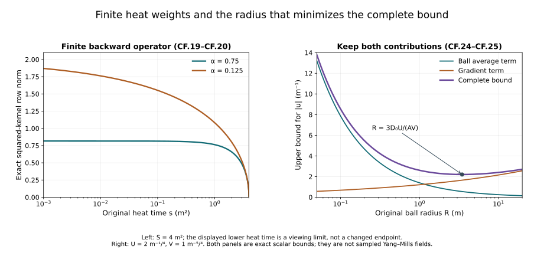

# Curl-free interaction and backward heat bounds

[Tension, spatial decomposition and the nonlinear wave equation](../classical-tension-null-structure.html)
controlled the divergence-free interaction by an exact null-form map.
We now control the curl-free interaction. Its useful structure is the
actual divergence equation along the heat extension. We calculate the
inverse-Laplacian kernel, prove its complete norm bound, and retain the
full derivatives of the original product.

The second half proves the low-order backward heat estimates needed
by that product bound. It includes every term of the original heat
equation, both finite heat endpoints, and the exact mixed-norm orders.
The resulting expressions depend on the actual receiving wave norms.
They do not yet constitute the final closed physical-time estimate.

The prerequisites are the full proofs in
[heat analysis](../classical-heat-analysis.html),
[potential estimates](../classical-potential-estimates.html),
[fixed-time estimates](../classical-fixed-time-estimates.html),
[wave estimates](../classical-wave-estimates.html), and the
[preceding tension chapter](../classical-tension-null-structure.html).
We use their original physical coordinate, speed \(c>0\), energy
parameter \(d\), and heat interval \(0<s\le S\). The field is the
already constructed regular caloric-temporal solution.

The human-source comparison is Sung-Jin Oh,
[*Gauge choice for the Yang–Mills equations using the Yang–Mills heat
flow and local well-posedness in \(H^1\)*, arXiv:1210.1558v2](https://arxiv.org/abs/1210.1558v2),
the curl-free nonlinear estimate and low-order heat-curvature
integration argument. The complete receiving proofs below are
independently written. The original author TeX remains identifiable;
its bounded reading coverage is recorded in the provenance.
No novelty or whole-paper acceptance is claimed.

## 1. The original Newton kernel and its exact bound

Use the original three-dimensional Laplacian and Fourier convention
HW.1. Its inverse kernel and gradient are

\[
E(x)=-\frac1{4\pi|x|},\qquad
K(x)=\nabla E(x)=\frac{x}{4\pi|x|^3}\quad(x\ne0).
\tag{CF.1}
\]

Here is an exact way to fix both the sign and any distributional
ambiguity. For the already proved Gaussian
\(H_r(x)=(4\pi r)^{-3/2}e^{-|x|^2/(4r)}\),
substitution \(v=|x|^2/(4r)\) gives
\(-\int_0^\infty H_r(x)dr=-1/(4\pi|x|)\).
The remaining integral is
\(\int_0^\infty v^{-1/2}e^{-v}dv=\sqrt\pi\), obtained by
the substitution \(v=z^2\) and the full Gaussian integral.
The heat integral is also convergent as a tempered distribution:
for a Schwartz test function, the interval \(0<r\le1\) is
bounded by its supremum and Gaussian mass, and \(r\ge1\) by
\((4\pi r)^{-3/2}\) times its L1 norm.
Fourier transformation therefore gives exactly
\(\widehat E(\xi)=-|\xi|^{-2}\), since that locally integrable
function is \(-\int_0^\infty e^{-r|\xi|^2}dr\).
Tonelli with the absolute value of a Schwartz test function
justifies the frequency-side integral as well. There is no added
distribution at zero. Differentiating proves the actual kernel
and symbol of \(K\).

For a matrix-valued \(f\in L^2\cap L^4(\mathbb R^3)\), the integral
\(K*f\) is absolutely convergent at every point after choosing
its usual representatives almost everywhere; the following uniform
bound gives the continuous representative by approximation.
Split the original integral at any radius \(R>0\), in the original
length units. Hölder gives

\[
\|K*f\|_\infty
\le A R^{1/4}\|f\|_4+B R^{-1/2}\|f\|_2,\qquad
A=\frac{(12\pi)^{3/4}}{4\pi},\quad
B=\frac1{2\sqrt\pi}.
\tag{CF.2}
\]

Indeed the near integral has kernel norm
\((4\pi)^{-1}(4\pi\int_0^R r^{-2/3}dr)^{3/4}
=A R^{1/4}\).
The far norm is
\((4\pi)^{-1}(4\pi\int_R^\infty r^{-2}dr)^{1/2}
=B R^{-1/2}\).
The Euclidean length of the vector kernel is exactly
\((4\pi|x|^2)^{-1}\), so the result includes all three gradient
components without an extra component constant.
For matrices use the Hilbert–Schmidt norm inside these integrals.

If \(f\ne0\), both norms are positive. The derivative of the
right side of CF.2 vanishes at the original physical radius
\(R=(2B\|f\|_2/(A\|f\|_4))^{4/3}\).
The derivative is negative before and positive after this point.
Substitution yields

\[
\|K*f\|_\infty\le
K_*\,\|f\|_2^{1/3}\|f\|_4^{2/3},\qquad
K_*=3\,2^{-2/3}A^{2/3}B^{1/3}
   =\frac{3\sqrt3}{2^{4/3}\pi^{1/3}}.
\tag{CF.3}
\]

The zero field also satisfies this bound. Both original kernel
constants remain specified; the last equality only evaluates their
product and does not change the operator.

For the actual regular L2 vector \(B\), let \(f=\operatorname{div}B\).
Approximate \(B\) by Schwartz vectors in \(H^2\). Their divergences
converge in L2 and L4, the latter by L2/L6 interpolation and the
proved Sobolev inequality. CF.3 makes the convolutions converge
uniformly. The Fourier projection NX.22 converges in L2. On the
Schwartz approximants the two are identical by CF.1, so their
limits agree as distributions. Thus
\(P_{\rm cf}B=K*\operatorname{div}B\) on the actual field,
without a polynomial choice. The same approximation proves the
continuous representative asserted above.

Applying CF.3 at each physical time, and then Hölder with
exponents 3 and 3/2 in the squared time integral, gives

\[
\|P_{\rm cf}B\|_{L^2_tL^\infty_x}
\le K_*\|\operatorname{div}B\|_{L^2_tL^2_x}^{1/3}
        \|\operatorname{div}B\|_{L^2_tL^4_x}^{2/3}.
\tag{CF.4}
\]

The physical measure is \(dt\) throughout.

## 2. Apply the actual divergence equation

Set \(B(s)=a(s)-a(S)=-\int_s^S G(r)dr\).
For each positive s this is a regular L2 vector because the
integral is over a closed positive heat interval and G is regular.
NX.23 gives, with its actual sign,

\[
f(s)=\operatorname{div}B(s)
     =\int_s^S\sum_j[a_j(r),G_j(r)]\,dr .
\tag{CF.5}
\]

Define the following norms of the actual regular solution:

\[
\begin{aligned}
A_\infty&=\sup_{0<r\le S}r^{1/4}
                         \|a(r)\|_{L^\infty_{t,x}},\\
A_4&=\sup_{0<r\le S}r^{1/8}\|a(r)\|_{L^4_tL^\infty_x},\\
G_2&=\left(\int_0^S
                \|G(r)\|_{L^2_{t,x}}^2\,dr\right)^{1/2},\\
G_4&=\left(\int_0^S
       [r^{3/4}\|G(r)\|_{L^4_{t,x}}]^2\,\frac{dr}{r}\right)^{1/2}.
\end{aligned}\tag{CF.6}
\]

All spatial vector norms here include the full three components.
These quantities are finite for the current regular solution on
its compact physical and heat intervals. They are actual measured
norms, not assumed bounds in terms of energy. The subsequent
calculation must bound their dependence for continuation.

Pointwise contraction and the bracket bound give
\(|\sum_j[a_j,G_j]|\le2|a||G|\).
Minkowski, time Hölder and then heat Cauchy–Schwarz prove

\[
\begin{aligned}
\sup_s\|f(s)\|_{L^2_tL^2_x}
 &\le C_2:=2\sqrt2\,S^{1/4}A_\infty G_2,\\
\sup_s\|f(s)\|_{L^2_tL^4_x}
 &\le C_4:=4S^{1/8}A_4G_4 .
\end{aligned}\tag{CF.7}
\]

For the first line write the integral of
\(r^{-1/4}\|G(r)\|_{L^2_{t,x}}\) in dr as the integral of
\(r^{1/4}(r^{1/2}\|G(r)\|_{L^2_{t,x}})\) in dr/r.
The first scalar L2 norm is
\((\int_0^S r^{1/2}dr/r)^{1/2}=\sqrt2 S^{1/4}\).
For the second line use L4 in time on both factors. The remaining
heat factor is \(r^{1-1/8-3/4}=r^{1/8}\); its L2(dr/r)
norm is \(2S^{1/8}\). Each calculation retains the bracket factor two.

HT.40 at \(q=0\) and Tonelli give
\(G_2\le |I|^{1/2}\sqrt{18}R_0d\).
This uses the fixed-time heat integral and the physical-time
integral, both with exponent two. Also
\(A_\infty\le\sqrt3\sup_{t\in I}M_0(t)\).
No interchange of a heat integral and a time supremum is made.
In particular a bound on
\(\sup_t\int\|G(t,s)\|^2ds\) does not by itself bound
\(\int\sup_t\|G(t,s)\|^2ds\).

Equations CF.4 and CF.7 now prove

\[
\sup_{0<s\le S}\|P_{\rm cf}B(s)\|_{L^2_tL^\infty_x}
\le K_* C_2^{1/3}C_4^{2/3}.
\tag{CF.8}
\]

## 3. Higher coefficient derivatives from fixed-time bounds

Let \(L_q^\infty\) be the exact individual-word constants HT.40.
The full q-derivative tuple of CF.5 satisfies, at each physical time,

\[
\begin{aligned}
\|\partial_x^{(q)}f(s)\|_2
 &\le C_q^{\rm div}F_q(s,S),\\
C_q^{\rm div}
 &=6\,3^{q/2}d\sum_{l=0}^q{q\choose l}M_l L_{q-l}^\infty,\\
F_q(s,S)&=\int_s^S r^{-q/2-3/4}dr
 =\frac{s^{-(q/2-1/4)}-S^{-(q/2-1/4)}}{q/2-1/4}.
\end{aligned}\tag{CF.9}
\]

The denominator is nonzero for every nonnegative integer q,
including \(q=0\). The coefficient six retains three contracted
indices and bracket factor two. There are \(3^q\) output words,
hence the safe \(3^{q/2}\) tuple bound. Every ordered Leibniz
subset appears with its binomial multiplicity. Its heat power
is \(l/2+1/4+(q-l+1)/2=q/2+3/4\).
The finite difference is retained; in particular
\(F_0=4(S^{1/4}-s^{1/4})\).

For the original Fourier projection, summing all derivative
indices proves exactly
\(\|\partial^{(q+1)}P_{\rm cf}B\|_2
=\|\partial^{(q)}f\|_2\): the squared multiplier for
\(\nabla\nabla\Delta^{-1}\) sums to one at each nonzero
frequency. The original L2 domain removes no field at zero.
Apply the proved Morrey–Sobolev estimate to the full q-word tuple:

\[
\|\partial^{(q)}P_{\rm cf}B(s)\|_\infty
\le C_MC_S
 \sqrt{C_q^{\rm div}C_{q+1}^{\rm div}F_q(s,S)F_{q+1}(s,S)} .
\tag{CF.10}
\]

For \(q\ge1\), the complete integrals imply

\[
\sup_s s^{q/2}\|\partial^{(q)}P_{\rm cf}B(s)\|_\infty
\le V_q:=
\frac{C_MC_S\sqrt{C_q^{\rm div}C_{q+1}^{\rm div}}}
 {\sqrt{(q/2-1/4)((q+1)/2-1/4)}}.
\tag{CF.11}
\]

For a physical time interval use the supremum of these actual
explicit constants. The \(q=0\) estimate CF.10 need not be uniformly
bounded as s approaches zero; it is precisely the term handled
by the space-time estimate CF.8.

## 4. The full curl-free product in the wave forcing

For each integer \(j\ge1\), let the actual energy contribution be

\[
\mathcal E_j^p=
\left\|s^{(j+1)/2}
 \|\partial_x^{(j)}G(s)\|_{L^\infty_tL^2_x}
\right\|_{L^p((0,S],ds/s)},\qquad p=2,\infty .
\tag{CF.12}
\]

These are bounded by the corresponding actual full wave norms
HW.26–HW.36, since those norms contain this energy tuple. That
inclusion does not assert a closed energy-only bound on them.
The order of the supremum and heat norm is part of the definition.

Retain the entire curl-free product, all three connection indices
and all three output components of G. For \(m\ge1\), the full
ordinary Leibniz rule gives

\[
\begin{aligned}
&\left\|s^{(m+1)/2}
 \left\|\partial_x^{(m-1)}
       \left(\sum_i[(P_{\rm cf}B)_i,\partial_iG]\right)
 \right\|_{L^2_{t,x}}\right\|_{L^p(ds/s)}
\\
&\quad\le
2K_*C_2^{1/3}C_4^{2/3}\mathcal E_m^p
 +2|I|^{1/2}\sum_{l=1}^{m-1}{m-1\choose l}
       \left(\sup_{t\in I}V_l(t)\right)\mathcal E_{m-l}^p .
\end{aligned}\tag{CF.13}
\]

For the \(l=0\) term, use CF.8 in L2 time/L-infinity space and
the remaining derivative of G in L-infinity time/L2 space.
For \(l\ge1\) use CF.11 uniformly in time, followed by the
factor \(|I|^{1/2}\). At each heat time the exact powers are
\(s^{(m+1)/2}=s^{l/2}s^{(m-l+1)/2}\).
For each fixed Leibniz subset, rearranging the full derivative
tuple is a bijection of its ordered indices. Cauchy–Schwarz
in the contracted spatial index bounds that tensor contraction
by the product of the full two tuple norms; bracket factor
two is retained. Summing all subsets gives the displayed
binomial coefficients. Minkowski gives the final \(L^p(ds/s)\)
bound for both stated p. The sum is empty for m=1.

This proves the actual curl-free interaction in the stated solution
norms. Sections 5–9 below now evaluate its A4 and G4 inputs
from the complete backward heat equation. The receiving wave
norms remain present until the subsequent physical-time closure.

**Visible source sign correction.** The original definition at author line 4325 has
\(P_{\rm cf}B=-(-\Delta)^{-1}\nabla\operatorname{div}B
=\nabla\Delta^{-1}\operatorname{div}B\). The restatement at
4355 drops the first minus sign. CF.1 and the exact multiplier
NX.22 prove the receiving sign. Norm estimates using absolute
values are unaffected by that local restatement error.

## 5. The entire heat forcing and its finite weighted bound

Work on the original compact physical interval I and heat interval
(0,S], in the already constructed caloric-temporal gauge. All
constants below use the original speed c and energy parameter d.
The curvature heat equation gives, without a schematic remainder,

\[
\begin{aligned}
\partial_sG_i&=\Delta G_i+N_i,\\
N_i&=2\sum_j[a_j,\partial_jG_i]
 +\sum_j[\partial_ja_j,G_i]
 +\sum_j[a_j,[a_j,G_i]]
 +2\sum_j[F_{ij},G_j],\\
F_{ij}&=\partial_i a_j-\partial_j a_i+[a_i,a_j].
\end{aligned}\tag{CF.14}
\]

Indeed \((D_s-D^jD_j)F_{si}=-2\sum_j[F_{sj},F_{ij}]\).
Bracket antisymmetry gives its last term, and expanding each
\(D_jD_j\) gives the other three. The full curvature in CF.14
remains the original tensor; using its proved norm bound does
not remove any of its three defining contributions.

Take the supremum of the explicit HT.26 constants M_q(t) over
the unchanged physical interval and denote it by \(\overline M_q\).
These are finite values of the previously constructed polynomials
and constants; no energy-only bound beyond those proofs is asserted.
Let \(\overline L_q^\infty\) be the corresponding HT.40 constants
using these upper values in their nonnegative polynomials. Set

\[
\begin{aligned}
U_0&=\sqrt3\,\overline M_0,& U_1&=3\,\overline M_1,\\
J_q&=3^{(q+1)/2}\overline L_q^\infty,&
\mathcal V_q&=C_S^{3/4}J_q^{1/4}J_{q+1}^{3/4}.
\end{aligned}\tag{CF.15}
\]

The letter \(J_q\) here is a scalar coefficient, not the two-index
finite kernel \(J_{ml}\) of NX.38. The earlier full-tuple estimates give
\(\|a(s)\|_\infty\le U_0s^{-1/4}\),
\(\|\partial a(s)\|_\infty\le U_1s^{-3/4}\) and
\(\|\partial^{(q)}G(s)\|_2\le dJ_qs^{-(q+1)/2}\).
Spatial Hölder and the proved Sobolev inequality give
\(\|\partial^{(q)}G\|_4
\le\|\partial^{(q)}G\|_2^{1/4}
(C_S\|\partial^{(q+1)}G\|_2)^{3/4}\).
This proves the full-tuple bound
\(d\mathcal V_qs^{-q/2-7/8}\). The coefficient \(\mathcal V_q\)
is distinct from the curl-free derivative coefficient \(V_q\) in CF.11.

Each original term of CF.14 now gives the pointwise-in-time estimate

\[
\begin{aligned}
\|N(s)\|_{L^4_x}
&\le D\,s^{-13/8}+E\,s^{-11/8},\\
D&=4U_0d\mathcal V_1+2\sqrt3\,U_1d\mathcal V_0
                   +4\sqrt2\,H_Fd^2\mathcal V_0,\\
E&=4U_0^2d\mathcal V_0 .
\end{aligned}\tag{CF.16}
\]

For the first term Cauchy–Schwarz in the contracted index gives
\(4|a||\partial G|\). For the second,
\(|\sum_j\partial_ja_j|\le\sqrt3|\partial a|\) gives
\(2\sqrt3|\partial a||G|\). The double bracket contributes
\(4|a|^2|G|\). For the last term,
\((\sum_{i,j}|F_{ij}|^2)^{1/2}
\le\sqrt2|F|_c\) gives \(4\sqrt2|F|_c|G|\).
The curvature bound is \(\|F\|_{\infty,c}\le H_Fds^{-3/4}\),
with \(H_F\) from NX.8. The first, second and fourth powers are
13/8; the double bracket power is 11/8. All four terms are retained.

Integrate in the original \(dt\) and \(ds/s\) measures. The full weighted
forcing norm is bounded explicitly by

\[
\begin{aligned}
\left(\int_0^S
 [s^{7/4}\|N(s)\|_{L^4_{t,x}(I)}]^2\frac{ds}{s}\right)^{1/2}
&\le \mathcal N_4,\\
\mathcal N_4&=|I|^{1/4}
 \left(2D S^{1/8}+\frac2{\sqrt3}E S^{3/8}\right).
\end{aligned}\tag{CF.17}
\]

The remaining heat powers are 1/8 and 3/8. Their squared
integrals are \(4S^{1/4}\) and \((4/3)S^{3/4}\).
Minkowski, not cancellation between terms, yields CF.17.

The same actual fixed-time L4 bound at the original endpoint gives

\[
\|G(S)\|_{L^4_{t,x}(I)}
\le Z_4:=|I|^{1/4}d\mathcal V_0 S^{-7/8}.
\tag{CF.18}
\]

## 6. The finite backward operator

For \(\alpha>0\), define on the unchanged heat interval

\[
(T_\alpha h)(s)
 =\int_s^S(s/r)^\alpha h(r)\,\frac{dr}{r}.
\tag{CF.19}
\]

Its nonnegative kernel has row integral
\((1-(s/S)^\alpha)/\alpha\) and column integral \(1/\alpha\).
For completeness, Cauchy–Schwarz with this kernel gives
\(|T_\alpha h(s)|^2
\le\alpha^{-1}\int_s^S(s/r)^\alpha|h(r)|^2dr/r\).
Integrating \(ds/s\) and using Tonelli and the column integral proves
the first bound below. Ordinary Cauchy–Schwarz using the squared
kernel, whose exact row integral is
\((1-(s/S)^{2\alpha})/(2\alpha)\), proves the second:

\[
\|T_\alpha h\|_{L^2(ds/s)}
\le\alpha^{-1}\|h\|_{L^2(ds/s)},\qquad
\|T_\alpha h\|_{L^\infty_s}
\le(2\alpha)^{-1/2}\|h\|_{L^2(ds/s)} .
\tag{CF.20}
\]

No upper endpoint has been replaced. For a Banach-valued
integral, Minkowski reduces the same bound to h equal to the
norm of its original integrand.

The exact equation CF.14 gives
\(G(s)=G(S)-\int_s^S(\Delta G(r)+N(r))dr\).
Let \(D_2=\|r^{7/4}\|\partial_x^{(2)}G(r)\|_{L^4_{t,x}}\|_{L^2(dr/r)}\).
Contracting the two spatial derivative indices costs \(\sqrt3\).
Apply CF.20 with \(\alpha=3/4\) to the two original integrals.
For the actual \(G_4^p=\|s^{3/4}\|G(s)\|_{L^4_{t,x}}\|_{L^p(ds/s)}\),
including CF.6's \(G_4=G_4^2\), this proves

\[
\begin{aligned}
G_4^2&\le \sqrt{2/3}\,S^{3/4}Z_4
                   +\tfrac43(\sqrt3D_2+\mathcal N_4),\\
G_4^\infty&\le S^{3/4}Z_4
                   +\sqrt{2/3}(\sqrt3D_2+\mathcal N_4).
\end{aligned}\tag{CF.21}
\]

The endpoint factors follow by integrating the unchanged scalar
\(s^{3/4}\): its \(L^2(ds/s)\) norm is \(\sqrt{2/3}S^{3/4}\).
Every term of the actual heat equation has now been estimated.

## 7. Exact receiving wave inputs

Define the actual full-vector wave quantities, for \(k\ge1\), by

\[
\mathcal F_k^p
=\left\|s^{(k+1)/2}\|G(s)\|_{\mathsf S_c^k(I)}
  \right\|_{L^p((0,S],ds/s)} .
\tag{CF.22}
\]

These are exactly HW.35–HW.36 at \(\ell=5/4\), retaining both
energy and differentiated forcing. They are finite on the current
regular solution. The wave equation still has to close a bound on
these actual quantities; no such bound is assumed here.

Let \(d_c=\sqrt2(2\pi c)^{-1/4}\). HW.33, for k=2 and k=1
respectively, and HW.32 give

\[
\begin{aligned}
D_2&\le d_c\mathcal F_{5/2}^2
       \le d_c\sqrt{\mathcal F_2^2\mathcal F_3^2},\\
D_1&:=\left\|s^{5/4}\|\partial_xG(s)\|_{L^4_{t,x}}\right\|_{L^2(ds/s)}
       \le d_c\mathcal F_{3/2}^2
       \le d_c\sqrt{\mathcal F_1^2\mathcal F_2^2}.
\end{aligned}\tag{CF.23}
\]

Here the superscript 2 denotes the heat integrability exponent,
not the square of a number. The interpolation follows first at
each original s from HW.32. The weight at the intermediate k
is the geometric mean of the adjacent full weights; Cauchy–Schwarz
in \(ds/s\) proves the two displayed mixed bounds. No time supremum
is exchanged with a heat integral. In HW.33 the full spatial
derivative tuple is included in the physical derivative tuple,
so the inequalities retain all components with no added factor.

## 8. A complete L4-to-supremum inequality

For any smooth finite-dimensional vector or matrix field u in
\(W^{1,4}(\mathbb R^3)\), average its original values on the
ball of radius R about x. The fundamental theorem along each
radius and Fubini give the exact identity

\[
u(x)-\frac1{|B_R|}\int_{|z|<R}u(x+z)\,dz
=-\frac1{4\pi}\int_{|z|<R}
 \left(|z|^{-2}-\frac{|z|}{R^3}\right)
 \frac z{|z|}\cdot\nabla u(x+z)\,dz .
\tag{CF.24}
\]

To verify the coefficient, use \(3/(4\pi R^3)\) for the ball
average, insert \(u(x)-u(x+r\omega)
=-\int_0^r\omega\cdot\nabla u(x+\rho\omega)d\rho\),
then integrate \(r^2\) over \(\rho<r<R\).
Its value \((R^3-\rho^3)/3\) produces precisely the kernel
in CF.24 after conversion to dz. Both kernel terms remain in
this exact identity.

The average is at most
\(D_0R^{-3/4}\|u\|_4\), where \(D_0=(3/(4\pi))^{1/4}\).
The positive radial kernel in CF.24 is at most
\((4\pi|z|^2)^{-1}\), so CF.2's near-kernel calculation bounds
the other term by \(AR^{1/4}\|\nabla u\|_4\).
If both norms are nonzero, minimizing their sum at
\(R=3D_0\|u\|_4/(A\|\nabla u\|_4)\) gives

\[
\|u\|_\infty
\le C_4^{\rm Mor}\|u\|_4^{1/4}\|\nabla u\|_4^{3/4},\qquad
C_4^{\rm Mor}=4\,3^{-3/4}D_0^{1/4}A^{3/4}.
\tag{CF.25}
\]

If \(\|u\|_4=0\), the field is zero. If the derivative norm
is zero, the smooth field is constant on each line, hence on
space, and its finite L4 norm again forces zero. The derivative
of the radius-dependent bound changes sign from negative to
positive at the displayed value, proving the minimum. Density,
or the same direct identity for the current regular fields,
gives the stated inequality on the required domain. No spatial
scale or original field has been replaced.

Apply CF.25 to G at every physical time. Hölder first in \(dt\),
then in \(ds/s\), gives

\[
\begin{aligned}
\|G(s)\|_{L^4_tL^\infty_x}
&\le C_4^{\rm Mor}
       \|G(s)\|_{L^4_{t,x}}^{1/4}
       \|\partial_xG(s)\|_{L^4_{t,x}}^{3/4},\\
\left\|s^{9/8}\|G(s)\|_{L^4_tL^\infty_x}\right\|_{L^2(ds/s)}
&\le C_4^{\rm Mor}(G_4^2)^{1/4}D_1^{3/4}.
\end{aligned}\tag{CF.26}
\]

The exact weight identity is
\((3/4)(1/4)+(5/4)(3/4)=9/8\).
For the first line, raise to the fourth power and apply time
Hölder with exponents 4 and 4/3. For the second, square and
apply the same exponents in \(ds/s\). Thus each mixed-norm order
is explicitly justified.

## 9. Finish the two curl-free input bounds

The original backward identity
\(a(s)=a(S)-\int_s^SG(r)dr\) and CF.20 with \(\alpha=1/8\)
now prove

\[
A_4
\le S^{1/8}|I|^{1/4}\sqrt3
       \max_{t\in I}P_0(|t-t_*|)
 +2C_4^{\rm Mor}(G_4^2)^{1/4}D_1^{3/4}.
\tag{CF.27}
\]

The endpoint bound uses the actual endpoint polynomial HP.26;
its three spatial components give the factor \(\sqrt3\).
The backward integral has precisely the input
\(r^{9/8}\|G(r)\|_{L^4_tL^\infty_x}\), and the original
output weight is \(s^{1/8}\). Its L2-to-supremum kernel
constant is \((2/8)^{-1/2}=2\).

For an explicit closed expression for these two inputs, put

\[
\begin{aligned}
\mathcal G&=\sqrt{2/3}S^{3/4}Z_4
  +\tfrac43\left(\sqrt3\,d_c
                    \sqrt{\mathcal F_2^2\mathcal F_3^2}
                              +\mathcal N_4\right),\\
\mathcal A&=S^{1/8}|I|^{1/4}\sqrt3
       \max_{t\in I}P_0(|t-t_*|)
   +2C_4^{\rm Mor}\mathcal G^{1/4}
             \left(d_c\sqrt{\mathcal F_1^2\mathcal F_2^2}\right)^{3/4},\\
G_4&\le\mathcal G,\qquad A_4\le\mathcal A,\qquad
C_4\le4S^{1/8}\mathcal A\mathcal G .
\end{aligned}\tag{CF.28}
\]

All coefficients in this expression were evaluated above from
the original tensors, intervals, endpoint polynomials, energy
and receiving wave norms. Substituting it in CF.8 and CF.13
fully estimates the curl-free product in those same quantities.
The symbols \(\mathcal F_k^2\) retain their full definitions
CF.22, including the wave forcing. They have not been declared
energy-bounded. The [potential wave chapter](../classical-potential-wave.html),
[space-time tension chapter](../classical-spacetime-tension.html), and
[temporal boundary chapter](../classical-temporal-boundary.html)
supply the next receiving estimates. Combining all interactions
into the finite physical-time bound remains required. That
closure is not assumed in CF.14–CF.28.

**Figure CF.** The left panel plots the exact squared-kernel row
norm \(\sqrt{(1-(s/S)^{2\alpha})/(2\alpha)}\) from CF.20, for
\(\alpha=3/4,1/8\), on the original interval with \(S=4\) square
metres. The lower plotting endpoint is a viewing limit; the
formula retains the whole interval \(0<s\le S\).
The right panel shows the complete upper bound
\(D_0R^{-3/4}U+AR^{1/4}V\) from CF.24–CF.25, for the
specified norm values \(U=2\) metres to the power \(-1/4\)
and \(V=1\) metre to the power \(-5/4\). Its radius is in
metres and the bound has unit inverse metre. The two
contributions and their sum remain visible. The marked radius
is the exact minimizer \(3D_0U/(AV)\).
Both panels depict proved scalar expressions, not sampled
Yang–Mills fields.

## 10. Exercises with complete solutions

### Exercise 1. The original sign of the inverse Laplacian

Recover the sign and coefficient of CF.1 from the actual heat kernel.

**Solution.** For \(x\ne0\), let \(\rho=|x|\) and put
\(v=\rho^2/(4r)\). Then

\[
\begin{aligned}
\int_0^\infty(4\pi r)^{-3/2}e^{-\rho^2/(4r)}dr
 &=\frac1{4\pi^{3/2}\rho}
       \int_0^\infty v^{-1/2}e^{-v}dv
 =\frac1{4\pi\rho}.
\end{aligned}\tag{CF.29}
\]

The heat integral therefore gives the negative of this function
for \(\Delta^{-1}\). Its Fourier transform is
\(-\int_0^\infty e^{-r|\xi|^2}dr=-|\xi|^{-2}\).
The frequency singularity is locally integrable in three
dimensions. The distributional estimates in Section 1 justify
the transform and exclude an added zero-frequency distribution.
Differentiating \(-1/(4\pi\rho)\) gives \(x/(4\pi\rho^3)\).

### Exercise 2. The original radius in the kernel bound

Find the minimizing radius in CF.2 and evaluate the resulting coefficient.

**Solution.** Write \(a=\|f\|_4>0\), \(b=\|f\|_2>0\).
The derivative of \(AaR^{1/4}+BbR^{-1/2}\), multiplied by
\(4R^{3/2}\), is \(AaR^{3/4}-2Bb\).
Its unique zero is

\[
R_*=\left(\frac{2Bb}{Aa}\right)^{4/3},\quad
AaR_*^{1/4}+BbR_*^{-1/2}
=3\,2^{-2/3}A^{2/3}B^{1/3}b^{1/3}a^{2/3}.
\tag{CF.30}
\]

The sign changes from negative to positive, and the cost diverges
at both endpoints, proving the minimum. The ratio \(b/a\) has
unit length to the power \(3/4\), so \(R_*\) has the original
length unit. No dimensionful factor has been removed.

### Exercise 3. Every derivative placement in the curl-free product

For \(m=3\), expand one ordered two-derivative word in CF.13.

**Solution.** For fixed derivative indices j,k, each summand is

\[
\begin{aligned}
\partial_j\partial_k[B_i,\partial_iG]
={}&[\partial_j\partial_kB_i,\partial_iG]
 +[\partial_kB_i,\partial_j\partial_iG]\\
&+[\partial_jB_i,\partial_k\partial_iG]
 +[B_i,\partial_j\partial_k\partial_iG].
\end{aligned}\tag{CF.31}
\]

Here \(B_i\) denotes the curl-free coefficient only within this
display. The terms have respectively l=2,1,1,0 coefficient
derivatives, giving the multiplicities 1,2,1. Matrix order is
unchanged in each bracket. Summing i and the complete output
and derivative tuples, Cauchy–Schwarz in the contracted index
gives precisely the product of the two full tuple norms used
in CF.13. At \(l=0\) use CF.8; at \(l=1,2\) use CF.11.

### Exercise 4. The finite backward kernel on an exact input

Evaluate \(T_\alpha(r^\delta)\) for \(\alpha,\delta>0\).

**Solution.** Integrating the original interval gives

\[
T_\alpha(r^\delta)(s)=
\begin{cases}
s^\alpha\dfrac{S^{\delta-\alpha}-s^{\delta-\alpha}}
                    {\delta-\alpha},&\delta\ne\alpha,\\[4pt]
s^\alpha\log(S/s),&\delta=\alpha.
\end{cases}\tag{CF.32}
\]

The first line is the antiderivative of
\(s^\alpha r^{\delta-\alpha-1}\). The second is its exponent
zero case. Both vanish at s=S, have the correct lower-limit
derivative, and retain the original upper endpoint.
The input is in L2(dr/r) since \(\delta>0\).

### Exercise 5. Account for both heat powers in the forcing

Verify the two coefficients in CF.17 from the complete bound CF.16.

**Solution.** Multiplication by \(s^{7/4}\) gives
\(D s^{1/8}+E s^{3/8}\). Their squared norms in \(ds/s\) are

\[
\int_0^S s^{1/4}\frac{ds}{s}=4S^{1/4},\qquad
\int_0^S s^{3/4}\frac{ds}{s}=\frac43S^{3/4}.
\tag{CF.33}
\]

Taking square roots gives \(2S^{1/8}\) and
\(2S^{3/8}/\sqrt3\). The physical-time L4 norm of a uniform
bound contributes \(|I|^{1/4}\). Minkowski adds the two
contributions and yields CF.17 without deleting either term.

### Exercise 6. Keep the time and heat norms in order

Derive the first interpolation bound of CF.23 directly from HW.32.

**Solution.** At each actual s,
\(\|G\|_{\mathsf S_c^{5/2}}\le
\|G\|_{\mathsf S_c^2}^{1/2}\|G\|_{\mathsf S_c^3}^{1/2}\).
The exact weights obey
\(s^{7/4}=(s^{3/2})^{1/2}(s^2)^{1/2}\).
Consequently Cauchy–Schwarz in \(ds/s\) gives

\[
\mathcal F_{5/2}^2
\le\left(\mathcal F_2^2\mathcal F_3^2\right)^{1/2}.
\tag{CF.34}
\]

Every time supremum and forcing integral stays inside its
original wave norm. The superscript 2 on each F denotes the
heat integrability exponent. This proof does not exchange a
time supremum and a heat integral. Multiplication by the
unchanged \(d_c\) gives the required derivative L4 bound.

### Exercise 7. The radius in the Morrey bound

Find the exact minimizer used in CF.25 and verify the exponents.

**Solution.** Put \(U=\|u\|_4>0\), \(V=\|\nabla u\|_4>0\).
Differentiating \(D_0UR^{-3/4}+AVR^{1/4}\) and multiplying
by \(4R^{7/4}\) gives \(-3D_0U+AVR\). Thus

\[
R_*=\frac{3D_0U}{AV},\qquad
\min_R\bigl(D_0UR^{-3/4}+AVR^{1/4}\bigr)
=4\,3^{-3/4}D_0^{1/4}A^{3/4}U^{1/4}V^{3/4}.
\tag{CF.35}
\]

The derivative changes sign from negative to positive.
The ratio U/V has unit length. The zero-norm cases give
the zero field as proved in Section 8. The time and heat
Hölder calculations in CF.26 therefore preserve the same
one-quarter and three-quarter exponents and their complete
physical weights.

### Exercise 8. An exact Gaussian curl-free field

For \(L>0\), real amplitude \(a\), and fixed matrix \(T\), put
\(\phi(x)=a e^{-|x|^2/(2L^2)}T\) and \(B=\nabla\phi\).
Find its divergence and recover B by the original kernel.

**Solution.** Direct differentiation gives

\[
B_i(x)=-\frac{ax_i}{L^2}e^{-|x|^2/(2L^2)}T,\qquad
f(x)=\operatorname{div}B
=a\left(\frac{|x|^2}{L^4}-\frac3{L^2}\right)
                      e^{-|x|^2/(2L^2)}T.
\tag{CF.36}
\]

Both are Schwartz fields, so all kernel and Fourier calculations
in Section 1 apply. The actual transforms satisfy
\(\widehat B=i\xi\widehat\phi\) and
\(\widehat f=-|\xi|^2\widehat\phi\). The kernel symbol
\(-i\xi/|\xi|^2\) therefore gives \(K*f=B\).
The single zero-frequency point has no L2 mass.
Thus \(P_{\rm cf}B=B\), \(P_{\rm df}B=0\).
Every antisymmetric numerator in NX.24 is zero.
This verifies the original projection on a regular,
noncompact field while retaining its amplitude, length,
matrix and full Gaussian polynomial.

## 11. The remaining physical-time argument

The full curl-free product and its low-order backward heat
inputs now have complete estimates. The next step estimates
the remaining nonlinear terms and boundary gauge contribution,
then uses the actual wave equation to close a physical-time
continuation bound. The wave norms in CF.22 retain their
forcing terms throughout that next step. The main Lesson 9
exercise set also remains required before the unit is complete.
