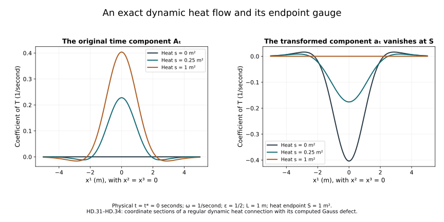

# Global heat flow and the time component

The [heat-analysis chapter](../classical-heat-analysis.html)
proved curvature bounds with an explicit common threshold.
The [construction chapter](../classical-heat-construction.html)
and [caloric-gauge chapter](../classical-caloric-gauge.html)
constructed the actual local flow. We now continue the spatial
flow through every finite heat time, prove its smooth dependence
on a physical-time parameter, and construct the original time
component of the connection.

Keep the coordinates \(t,x^1,x^2,x^3\), physical speed \(c>0\),
reference length \(\ell>0\), heat parameter \(s\), closed matrix
group \(G\subset U(N)\) and trace inner product already used in
F09. Physical time has units of time; heat time has units of
length squared. The two equations are kept distinct throughout.

The source comparison is Sung-Jin Oh's
[*Finite energy global well-posedness of the Yang–Mills equations
on \(\mathbb R^{1+3}\)*,
arXiv:1210.1557v2](https://arxiv.org/abs/1210.1557v2),
its spatial and dynamic heat-flow sections and its construction
of the caloric-temporal gauge. We also compare the original
linear heat discussion in
[*Gauge choice for the Yang–Mills equations using the Yang–Mills
heat flow and local well-posedness in \(H^1\)*,
arXiv:1210.1558v2](https://arxiv.org/abs/1210.1558v2),
Section 5. This is independent course exposition with complete
receiving arguments.

## 1. The original dynamic equation and its data

For \(\mu=t,1,2,3\), the caloric dynamic heat equation is

\[
\begin{aligned}
A_s&=0,\qquad \partial_sA_\mu=\sum_{j=1}^3D_jF_{j\mu},\\
F_{\mu\nu}&=\partial_\mu A_\nu-\partial_\nu A_\mu+
[A_\mu,A_\nu],\qquad D_\mu X=\partial_\mu X+[A_\mu,X].
\end{aligned}
\tag{HD.1}
\]

Only the spatial index j is contracted in this heat equation.
In particular no time coordinate is silently multiplied by c.
Let \(I\) be an open physical-time interval. For this chapter,
regular initial data mean

\[
A_\mu^0\in C^\infty\bigl(I;H^\infty_\ell(\mathbb R^3;\mathfrak g)\bigr)
\quad\text{for every }\mu=t,1,2,3,\qquad
H^\infty_\ell=\bigcap_{q=0}^{\infty}H^q_\ell .
\tag{HD.2}
\]

The smoothness assertion into this intersection means smoothness
into each stated Sobolev space, with the resulting derivatives
agreeing under the inclusions. A regular solution has this
property jointly in t and s on every compact parameter rectangle,
including the initial heat boundary. The condition on the initial
time component is essential; Section 7 gives an exact example.

For the first part, fix t and consider only the spatial datum.
Set

\[
d^2=\sum_{i<j}\|F_{ij}(0)\|_2^2,\qquad
\mathcal M(s)=\frac12\sum_{i<j}\|F_{ij}(s)\|_2^2,\qquad
\mathcal M'(s)=-\sum_i\|F_{si}(s)\|_2^2 .
\tag{HD.3}
\]

The last identity, with its factor one half and every boundary
limit, was proved in H9.29. Regular data have finite d because
their derivatives and products lie in \(L^2\).

## 2. Continuing the spatial flow through all heat time

Retain the exact constants from H9.39 and H9.47:

\[
\begin{aligned}
e_*&=2+\sqrt2,&K_0&=12\sqrt6\,C_S^{3/2},&
K_1&=36\sqrt{18}\,C_S^{3/2},\\
a_*&=e_*(1+e_*),&
b_*&=e_*((1+e_*)K_0+K_1),&
\varepsilon_*&=(8a_*b_*)^{-1},\\
R_1&=2a_*,&
Q_2&=12\sqrt{6\,3^2}
\{4C_MC_SR_1^2+3C_S^{3/2}R_1^2\},&
R_2&=e_*(\sqrt2R_1+Q_2\varepsilon_*).
\end{aligned}
\tag{HD.4}
\]

Here \(C_S,C_M\) are the unchanged constants in HG.3.
If d is zero, the initial curvature vanishes. The original
connection held constant in heat time then solves the spatial
equation, since \(D^jF_{ji}=0\). Regular uniqueness HG.38–HG.40
identifies this stationary solution as its flow for all heat time.

For \(d>0\), use the actual heat interval of length

\[
\Theta=\left(\frac{\varepsilon_*}{2d}\right)^4 .
\tag{HD.5}
\]

This has units of length squared. It does not change the initial
field or spatial coordinates. On any existing regular solution
segment with endpoint at most \(\Theta\), H9.40 gives

\[
\|DF(s)\|_2\le R_1d\,s^{-1/2},\qquad
\|D^{(2)}F(s)\|_2\le R_2d\,s^{-1}.
\tag{HD.6}
\]

The spatial specialization of that theorem is exact. Extend
the spatial solution independently of t with \(A_t=0\).
All its \(F_{ti}\) vanish, so the positive curvature norm
\(c^{-2}\sum_i|F_{ti}|^2+\sum_{i<j}|F_{ij}|^2\)
reduces to the displayed spatial sum for every original c.
The threshold holds because \(\Theta^{1/4}d=\varepsilon_*/2\).

Put \(G_i=F_{si}=D^jF_{ji}\). H9.48 and covariant Sobolev give

\[
\begin{aligned}
\|G(s)\|_2&\le\sqrt6 R_1d\,s^{-1/2},&
\|DG(s)\|_2&\le\sqrt6 R_2d\,s^{-1},\\
\|G(s)\|_6&\le\sqrt6 C_SR_2d\,s^{-1},&
\|G(s)\|_3&\le
\sqrt6 C_S^{1/2}\sqrt{R_1R_2}\,d\,s^{-3/4}.
\end{aligned}
\tag{HD.7}
\]

Every norm is the full component norm. The last line follows
from \(\|G\|_3\le\|G\|_2^{1/2}\|G\|_6^{1/2}\);
the contraction factor \(\sqrt6\) is retained.

Suppose that the maximal regular heat endpoint \(T_*\) is
at most \(\Theta\). Choose \(s_0\) strictly between zero and
the endpoint of the initial local solution. Integrating
\(\partial_sA=G\) from that positive heat time proves

\[
\begin{aligned}
\|A(s)\|_6
&\le\|A(s_0)\|_6+\sqrt6 C_SR_2d\log(s/s_0)\le M_6,\\
M_6&=\|A(s_0)\|_6+\sqrt6 C_SR_2d\log(\Theta/s_0),
\qquad s_0\le s<T_*.
\end{aligned}
\tag{HD.8}
\]

The logarithm is finite. The calculation has not integrated
the \(s^{-1}\) estimate from zero.
Since \(\partial_jG_i=D_jG_i-[A_j,G_i]\), spatial Hölder and
the full bracket inequality give

\[
\begin{aligned}
\|\nabla G(s)\|_2
&\le\sqrt6 R_2d\,s^{-1}
 +2\sqrt6 C_S^{1/2}\sqrt{R_1R_2}\,dM_6s^{-3/4},\\
a_1(A;s)
&\le a_1(A;s_0)+\sqrt6R_2d\log(s/s_0)\\
&\quad+
8\sqrt6 C_S^{1/2}\sqrt{R_1R_2}\,dM_6
(s^{1/4}-s_0^{1/4}).
\end{aligned}
\tag{HD.9}
\]

Here \(a_1\) is the full gradient norm HG.1. The coefficient
eight keeps both the bracket factor two and the integral
\(\int_{s_0}^s r^{-3/4}dr=4(s^{1/4}-s_0^{1/4})\).
Regularity bounds the part before \(s_0\); (HD.9) bounds
the remainder uniformly up to \(T_*\).

Choose a positive R with R/4 strictly larger than that full
gradient supremum. HG.5 and Section 4 of the caloric-gauge
chapter supply a regular caloric solution from every one of
these regular time slices for the common heat length

\[
S_R=\min\{(32D_2R)^{-4},(48D_3R^2)^{-2}\},\qquad
D_2=18\sqrt3 C_MC_S,\quad D_3=12\sqrt3 C_S^3 .
\tag{HD.10}
\]

Take regular times \(s_n\uparrow T_*\). For sufficiently large n,
\(s_n+S_R>T_*\). Regular uniqueness makes the new solution
coincide with the original one on their overlap, so it extends
the original solution beyond \(T_*\). This contradicts maximality.
It also avoids assuming any higher-order limit at \(T_*\).

Thus the solution exists through \(\Theta\). At that endpoint
(HD.3) shows that the new initial curvature norm is at most d.
The same heat length \(\Theta\) therefore works at every new
starting time, with zero-curvature data treated as above.
Finitely many such intervals reach every prescribed finite heat
time. Uniqueness on overlaps proves a unique global regular
spatial heat flow.

## 3. Smooth dependence on physical time

We give the parameter argument because (HD.1) requires the
actual derivative \(\partial_tA_i\). In this section t is the
parameter of the original initial-data curve, while s is the
evolution variable.

Use the exact quadratic and trilinear maps Q,T from HC.2.
Their derivative and remainder are

\[
\begin{aligned}
DN(A)[H]&=Q(H,A)+Q(A,H)
 +T(H,A,A)+T(A,H,A)+T(A,A,H),\\
N(A+H)-N(A)-DN(A)[H]
&=Q(H,H)+T(H,H,A)+T(H,A,H)+T(A,H,H)+T(H,H,H).
\end{aligned}
\tag{HD.11}
\]

For \(q\ge3\), put \(r=q-1\) and keep
\(k_{r,\ell}=2^{r-1}\pi/((2\pi)^{3/2}\ell^{3/2})\).
The same complete product calculation as HC.3–HC.4 gives,
on the path space \(E_q=C([0,\eta];(H^q_\ell)^3)\),

\[
\begin{aligned}
C_{2,q}&=36\sqrt3\,k_{r,\ell}/\ell,\qquad
C_{3,q}=48\sqrt3\,k_{r,\ell}^2,\\
\|Q(A,B)\|_{C_sH^{q-1}_\ell}
&\le C_{2,q}\|A\|_{E_q}\|B\|_{E_q},\\
\|T(A,B,C)\|_{C_sH^{q-1}_\ell}
&\le C_{3,q}\|A\|_{E_q}\|B\|_{E_q}\|C\|_{E_q},\\
\theta&=J_\ell(\eta)(2C_{2,q}\mathcal R+3C_{3,q}\mathcal R^2)
\le\frac14,\qquad
J_\ell(\eta)=\eta+\ell\sqrt{2\eta/e}.
\end{aligned}
\tag{HD.12}
\]

Choose a ball radius \(\mathcal R\) greater than twice the
nearby initial \(H^q_\ell\) norms. A sufficiently small positive
\(\eta\), explicitly as in HC.8 with these constants, gives
the last inequality and the same invariant ball construction.
Let \(\mathcal K\) be its actual Duhamel operator and set

\[
B(t)=\mathcal KDN(A(t)),\qquad
\mathcal T(t)=(I-B(t))^{-1}=\sum_{n=0}^\infty B(t)^n,\qquad
\|\mathcal T(t)\|\le\frac43 .
\tag{HD.13}
\]

The operator series converges in norm because
\(\|B(t)\|\le\theta\). The regular data estimate gives
\(\|A(t+h)-A(t)\|_{E_q}\le(4/3)D_h\), where
\(D_h=\|A_0(t+h)-A_0(t)\|_{H^q_\ell}\).
Subtract the two integral equations and use (HD.11).
The exact difference-quotient formula has remainder bounded by

\[
\begin{aligned}
\frac{A(t+h)-A(t)}h
&=\mathcal T(t)H_s\frac{A_0(t+h)-A_0(t)}h+E_h,\\
\|E_h\|_{E_q}
&\le\frac{4J_\ell(\eta)}{3|h|}
\left\{(C_{2,q}+3C_{3,q}\mathcal R)
\left(\frac43D_h\right)^2+
C_{3,q}\left(\frac43D_h\right)^3\right\}.
\end{aligned}
\tag{HD.14}
\]

For a \(C^1\) data curve \(D_h=O(|h|)\), so this tends to zero.
It proves \(A^{(1)}(t)=\mathcal T(t)H_sA_0^{(1)}(t)\), with
the superscript denoting the physical-time derivative.
Continuity follows from the exact resolvent identity
\(\mathcal T(t+h)-\mathcal T(t)
=\mathcal T(t+h)(B(t+h)-B(t))\mathcal T(t)\).
When B is differentiable this identity also gives
\(\mathcal T'=\mathcal T B'\mathcal T\).

For every \(m\ge1\), define the complete lower-order sum

\[
\begin{aligned}
\mathcal P_m={}&
\sum_{k=1}^{m-1}{m\choose k}Q(A^{(k)},A^{(m-k)})\\
&+\sum_{\substack{k+l+n=m\\0\le k,l,n\le m-1}}
\frac{m!}{k!\,l!\,n!}\,
T(A^{(k)},A^{(l)},A^{(n)}).
\end{aligned}
\tag{HD.15}
\]

An empty sum is zero. Repeated differentiation gives the
actual recursion

\[
A^{(m)}(t)=\mathcal T(t)
\{H_sA_0^{(m)}(t)+\mathcal K\mathcal P_m(t)\}.
\tag{HD.16}
\]

To justify existence of these derivatives inductively,
differentiate the previously proved formula for order \(m-1\).
Its remainder involves only derivatives through \(m-2\),
which are differentiable when A is \(C^{m-1}\).
The resolvent identity supplies the derivative of its inverse
operator. The two-factor and three-factor Leibniz rules give
exactly the binomial and multinomial coefficients in (HD.15).
The terms containing \(A^{(m)}\) are precisely \(DN(A)[A^{(m)}]\)
and move to the left. This proves existence and continuity
of the next derivative and hence smooth dependence on the block.

The caloric gauge has the corresponding actual derivatives:

\[
\partial_sV^{(m)}=V^{(m)}b+
\sum_{k=0}^{m-1}{m\choose k}V^{(k)}b^{(m-k)},
\qquad V^{(m)}(t,0)=0\quad(m\ge1),\qquad b=\operatorname{div}A .
\tag{HD.17}
\]

The original gauge has \(V(t,0)=I\). In the affine algebra
\(I+H^q_\ell\), \(q\ge2\), the proved product estimate makes
the integral matrix ODE a contraction on sufficiently short
heat intervals. The bilinear difference remainder, or directly
its Gronwall estimate, makes difference quotients converge to
the displayed equations. Induction proves every derivative.
The inverse is \(V^*\), so its derivatives are the adjoints.
To obtain a caloric connection in \(H^q_\ell\), use the
DeTurck construction in \(H^{q+2}_\ell\): then b and \(V-I\)
are in \(H^{q+1}_\ell\), and the differentiated spatial gauge
term is in \(H^q_\ell\). Thus the spatial derivative in the
gauge formula is fully accounted for.

Finally fix one physical time and a finite heat interval in
its global regular caloric solution. For each q, cover this
interval by finitely many local constructions just described,
using its actual higher Sobolev bounds. Endpoint evaluation
is bounded linear, so each subsequent block receives smoothly
dependent data. Shrink the physical-time neighbourhood finitely
many times to preserve their contraction bounds. The neighbouring
solutions already exist by Section 2, and regular uniqueness
identifies them with these local constructions.
This proves smooth parameter dependence on the entire interval.
Do this for every q; their derivatives agree under Sobolev
inclusion as limits of the same difference quotients.
The PDE and the gauge ODE give all heat derivatives, using
larger q when a derivative is needed. This proves the asserted
joint regularity of the spatial caloric flow.

## 4. Constructing the original time component

Now write \(U=A_t\). Because
\(F_{jt}=D_jU-\partial_tA_j\), its original equation (HD.1)
is the explicit linear forced equation

\[
\begin{aligned}
(\partial_s-\Delta)U&=\mathcal L_AU+\mathcal F_A,\\
\mathcal L_AU&=\sum_j\{2[A_j,\partial_jU]
 +[\partial_jA_j,U]+[A_j,[A_j,U]]\},\\
\mathcal F_A&=-\sum_j\{\partial_j\partial_tA_j+
[A_j,\partial_tA_j]\}.
\end{aligned}
\tag{HD.18}
\]

All its spatial coefficients and their physical-time derivatives
have been constructed in Section 3. For \(q\ge3\), \(r=q-1\),
let \(M_q(A)\) be the full spatial tuple norm and keep
\(U_q=\|U\|_{H^q_\ell}\). The original product estimates give

\[
\begin{aligned}
\|\mathcal L_AU\|_{H^{q-1}_\ell}
&\le L_q(A)U_q,\\
L_q(A)&=36k_{r,\ell}\ell^{-1}M_q(A)
 +48k_{r,\ell}^2M_q(A)^2,\\
\|\mathcal F_A\|_{H^{q-1}_\ell}
&\le(\sqrt3\ell^{-1}+4k_{r,\ell}M_q(A))
 M_q(\partial_tA).
\end{aligned}
\tag{HD.19}
\]

For the first two terms of the operator, the tame bracket
estimate costs \(4k_{r,\ell}\ell^{-1}M_q(A)U_q\) for each
unmultiplied summand. The coefficient two and the three
spatial indices give respectively 24 and 12 in the first
line of \(L_q\). Each nested bracket costs
\(16k_{r,\ell}^2M_q(A)^2U_q\); its three summands give 48.
For the derivative part of the forcing, the full tuple
Cauchy–Schwarz inequality gives \(\sqrt3\ell^{-1}\).
For its bracket part, Cauchy–Schwarz in j in each of the
two tame-product terms gives \(4k_{r,\ell}\).
This derives all factors in (HD.19).

On a compact physical-time interval and a prescribed finite
heat interval \([0,S]\), the regular coefficients give finite
uniform bounds L and F for \(L_q(A)\) and the forcing norm.
For \(L>0\) choose

\[
\eta=\min\{(4L)^{-1},e/(32\ell^2L^2)\},\qquad
LJ_\ell(\eta)\le\frac12 .
\tag{HD.20}
\]

The first and second parts of the kernel integral each
contribute at most one quarter. The affine Duhamel map on
\(C([s_0,s_0+\eta];H^q_\ell)\), shortened at S if needed,
is therefore a contraction on the whole Banach space.
Completeness and geometric convergence of its iterates
give the actual unique solution from each initial value.
Its supremum on that block is at most
\(2U_q(s_0)+2J_\ell(\eta)F\).
After n blocks this gives

\[
\sup_{0\le s\le\min\{n\eta,S\}}U_q(s)
\le2^nU_q(0)+2J_\ell(\eta)F(2^n-1),
\tag{HD.21}
\]

with the final interval shortened at S. The same bound
also includes all preceding block suprema, since its
right-hand side increases with n. If L is zero, the
forced heat formula directly supplies the solution.
For each q only finitely many blocks are needed to reach
the same prescribed S. Uniqueness at a lower q identifies
these constructions, so every spatial derivative persists.
The mild equation has the original initial value; the
equation and successively larger q give all heat derivatives.

Physical-time differentiation is also justified by an
actual contraction and difference-quotient argument.
The full differentiated equation is

\[
(\partial_s-\Delta)U^{(m)}
=\mathcal L_AU^{(m)}
 +\sum_{k=1}^m{m\choose k}
(\partial_t^k\mathcal L_A)U^{(m-k)}
 +\partial_t^m\mathcal F_A.
\tag{HD.22}
\]

Holding the argument W fixed, retain all coefficient terms:

\[
\begin{aligned}
(\partial_t^k\mathcal L_A)W
&=\sum_j\left\{2[A_j^{(k)},\partial_jW]
 +[\partial_jA_j^{(k)},W]
 +\sum_{l=0}^k{k\choose l}
[A_j^{(l)},[A_j^{(k-l)},W]]\right\},\\
\partial_t^m\mathcal F_A
&=-\sum_j\partial_jA_j^{(m+1)}
 -\sum_j\sum_{k=0}^m{m\choose k}
[A_j^{(k)},A_j^{(m-k+1)}].
\end{aligned}
\tag{HD.23}
\]

The initial value of \(U^{(m)}\) is the given mth derivative
of \(A_t^0\). At each order the right-hand forcing contains
only lower U derivatives and already constructed coefficients.
On a block the inverse of \(I-\mathcal K\mathcal L_A\)
has norm at most two. Subtract the fixed-point equations
at \(t+h,t\). The coefficients and forcing are smooth;
their exact polynomial differences, given by (HD.23),
have remainders tending to zero after division by h.
The bounded inverse thus makes the difference quotients
converge to (HD.22). The same resolvent identity as in
Section 3 proves continuity. Induction gives every order,
and the finite block covering gives the assertion on
the whole heat interval. The PDE supplies all mixed
heat derivatives. This constructs the regular \(A_t\)
in the original dynamic equation.

## 5. Curvature identification and dynamic uniqueness

The time component just constructed is an actual connection
component. Its actual curvature
\(B_i=F_{ti}=\partial_tA_i-D_iA_t\) satisfies H9's complete
curvature identity, which here is

\[
(\partial_s-D^jD_j)B_i=2\sum_j[F_{ij},B_j].
\tag{HD.24}
\]

This is exactly the linear electric-curvature equation used
in the source's alternative construction. To prove the
identification, let C be the difference of two regular
solutions to (HD.24) with the same original initial curvature.
Covariant integration by parts and every component sum give

\[
\begin{aligned}
\frac12\frac d{ds}\|C\|_2^2+\|DC\|_2^2
&=2\sum_{i,j}\int
\langle C_i,[F_{ij},C_j]\rangle\,d^3x\\
&\le4\sqrt2\|F\|_\infty\|C\|_2^2.
\end{aligned}
\tag{HD.25}
\]

The factor four retains the equation coefficient two and
the bracket bound two. The factor \(\sqrt2\) converts the
full ordered curvature sum to \(\sum_{i<j}|F_{ij}|^2\).
The coefficient is bounded on each compact regular heat
interval. Gronwall with zero initial difference gives C=0.
Thus a regular solution constructed by the linear curvature
route is exactly the curvature of (HD.18).
Existence in this argument is supplied by the actual
connection construction, not by assuming a curvature field
already comes from a connection. Multiplication of every
term in (HD.25) by the original positive \(c^{-2}\) retains
the physical electric-curvature weighting.

For dynamic uniqueness, two regular solutions with the
same initial connection have identical spatial components
by HG.38–HG.40 at every physical time. Their difference
\(Z=A_t-\widetilde A_t\) therefore solves
\(\partial_sZ=D^jD_jZ\) with zero initial value. The exact
energy identity is

\[
\frac12\frac d{ds}\|Z\|_2^2+\|DZ\|_2^2=0 .
\tag{HD.26}
\]

Its nonnegative terms force Z=0. This proves a unique
regular solution of (HD.1) on \(I\times\mathbb R^3
\times[0,S]\) for every finite S. Uniqueness makes these
solutions agree as S increases, yielding all heat time.
This theorem concerns auxiliary heat evolution of the
given physical-time curve.

## 6. Making the time component vanish at the heat endpoint

Fix a positive endpoint S, a physical reference time
\(t_*\in I\), and a regular spatial gauge \(W_0\), meaning
\(W_0(x)\in G\) and \(W_0-I\in H^\infty_\ell\).
Solve the actual physical-time ODE

\[
\partial_tW(t,x)=W(t,x)A_t(t,x,S),\qquad
W(t_*,x)=W_0(x),\qquad \partial_sW=0 .
\tag{HD.27}
\]

F09's unitary gauge ODE gives its unique G-valued solution.
For completeness, on every compact t interval the integral
equation for \(W-I\) has a locally bounded linear coefficient
in each \(H^q_\ell\), \(q\ge2\), plus the known forcing
\(A_t(t,S)\). On short intervals Picard iteration converges;
the product estimate and Gronwall bound prevent a finite
endpoint inside the compact interval. Thus it exists
throughout I. Spatial and physical-time derivatives follow
by differentiating this matrix ODE with the same convergent
iteration argument as (HD.17). Its inverse is its adjoint.

Apply this s-independent gauge to every original component:

\[
\begin{aligned}
a_i&=WA_iW^{-1}-(\partial_iW)W^{-1},\\
a_t&=W\{A_t(t,s)-A_t(t,S)\}W^{-1},\qquad a_s=0,\\
f_{\mu\nu}&=WF_{\mu\nu}W^{-1},\qquad
D_a^\nu f_{\nu\mu}=W(D_A^\nu F_{\nu\mu})W^{-1}.
\end{aligned}
\tag{HD.28}
\]

The second line follows by substituting (HD.27) into
the original gauge formula, so \(a_t(t,S)=0\).
The covariant-derivative identities of F05 apply to all
indices, including s, and prove that the dynamic heat
equation is preserved. In the last identity the raised
physical index uses exactly \(\operatorname{diag}(-c^{-2},1,1,1)\);
matrix conjugation commutes with these fixed scalar entries.
Thus the physical field equation at the initial heat
slice transforms with its full original metric.

There is a useful exact choice of \(W_0\) whenever the
original DeTurck flow at \(t_*\) exists through S, for
example the explicit S in HG.5. Let \(V(t_*,s)\) be its
gauge to the unique caloric spatial flow. Choose

\[
W_0=V(t_*,S)^{-1}.
\qquad
a_i(t_*,S)=A_i^{\mathrm{DeTurck}}(t_*,S).
\tag{HD.29}
\]

To prove the equality, apply first V and then \(V(S)^{-1}\)
to the spatial connection at that slice. The composed
gauge is \(V(S)^{-1}V(S)=I\); its spatial derivative is
zero by the product rule. This proves the exact identity
of the endpoint fields, including the differentiated
gauge terms. It gives the relation between the caloric
endpoint and the DeTurck representative used for heat
regularization. Quantitative high-order estimates from
low-order physical data are developed separately.

## 7. The domain of the regular initial-value statement

The global source's dynamic initial-data definition at
author TeX line 1703 imposes its \(H^\infty\) condition only
on the spatial components, while its regular solution
definition imposes it on all components. The discrepancy
can be tested on an exact connection.

Take a nonzero dimensionless \(T\in\mathfrak g\) and a
positive frequency \(\omega\), in inverse physical-time
units. The connection and its time gauge are

\[
A_i=0,\qquad A_t=\omega T,\qquad
F_{\mu\nu}=0,\qquad
W(t)=\exp(\omega(t-t_*)T),\qquad
a_\mu=0 .
\tag{HD.30}
\]

All its curvature components and its energy vanish. It
satisfies the spatial initial regularity condition, but
the nonzero constant \(A_t\) is not in \(L^2(\mathbb R^3)\).
It cannot be the initial value of a solution continuous
into \(H^\infty_\ell\) at \(s=0\). Nevertheless its actual
dynamic heat solution exists: it is constant in s.
The displayed time gauge satisfies
\(W_tW^{-1}=\omega T\), so it maps that connection exactly
to zero. Its spatial constancy preserves the curvature
and does not make the original representative square-integrable.
Definition (HD.2) states the condition on every initial
component needed by the regular Sobolev construction,
while (HD.30) identifies the exact relation to this larger
smooth class. Physical temporal-gauge data have \(A_t^0=0\)
and satisfy that part of the condition.

## 8. A complete dynamic Gaussian example

This example displays the forcing in the time-component
equation and the endpoint gauge for a regular parametrized
connection. Let \(L>0\), \(\varepsilon\) be dimensionless,
\(\omega>0\) have inverse-time units, and
\(T=\operatorname{diag}(i,-i)\). Put

\[
\begin{aligned}
g(x)&=\exp(-|x|^2/(2L^2)),\qquad
\alpha(t)=\varepsilon\sin(\omega(t-t_*)),\\
h_s(x)&=\left(\frac{L^2}{L^2+2s}\right)^{3/2}
\exp\left(-\frac{|x|^2}{2(L^2+2s)}\right),\\
A_i^0(t,x)&=\alpha(t)\partial_i g(x)T,\qquad A_t^0=0 .
\end{aligned}
\tag{HD.31}
\]

Every component has the regularity (HD.2) on compact
physical-time intervals. The exact dynamic caloric solution is

\[
\begin{aligned}
A_i(t,s,x)&=\alpha(t)\partial_i g(x)T,\\
A_t(t,s,x)&=\alpha'(t)(g(x)-h_s(x))T,\\
F_{ij}&=0,\qquad F_{ti}=\alpha'(t)\partial_i h_s(x)T,\\
F_{si}&=0,\qquad F_{st}=-\alpha'(t)\Delta h_s(x)T .
\end{aligned}
\tag{HD.32}
\]

All commutators vanish. The spatial equation is zero on
both sides. The time equation reads
\(\partial_sA_t=-\alpha'\Delta h_sT
=\Delta A_t-\partial_t\operatorname{div}A\), since
\(\operatorname{div}A=\alpha\Delta g\,T\).
The Gaussian formula HC.36 proves \(\partial_sh_s=\Delta h_s\)
with its full three-dimensional coefficient. At s=0,
\(h_0=g\), so both original initial components agree.
Direct differentiation proves every curvature component
in (HD.32). Thus uniqueness identifies it with the
constructed dynamic solution.

At endpoint S, choose \(W_0=I\) in (HD.27).
Since \(\alpha(t_*)=0\), the exact gauge and transformed
components are

\[
\begin{aligned}
W(t,x)&=\exp(\alpha(t)(g(x)-h_S(x))T),\\
a_i(t,s,x)&=\alpha(t)\partial_i h_S(x)T,\\
a_t(t,s,x)&=\alpha'(t)(h_S(x)-h_s(x))T,\qquad a_s=0 .
\end{aligned}
\tag{HD.33}
\]

Differentiation gives \(W_t=WA_t(t,S)\); its spatial
derivative subtracts \(\alpha(\partial_i g-\partial_i h_S)T\).
The time component is the difference in (HD.28), and it
vanishes at s=S. Its electric curvature remains
\(\alpha'\partial_i h_sT\), as direct calculation also shows.
The exponents are dimensionless, while the spatial and
time components retain their inverse-length and inverse-time
units respectively.

The scope of this example can be checked directly.
At the original heat boundary its Gauss expression is

\[
\sum_iD_iF_{ti}(t,0)
=\alpha'(t)\Delta g\,T
=\alpha'(t)\left(\frac{|x|^2}{L^4}-\frac3{L^2}\right)g\,T .
\tag{HD.34}
\]

It is generally nonzero. The example is a regular dynamic
heat connection, and does not assert a vacuum physical
Yang–Mills solution. This computes the precise defect
against that additional physical constraint.

The original physical curvature-energy functional on
each heat slice is also explicit. With
\(\kappa_T=-\operatorname{tr}(T^2)=2\),

\[
\mathcal E(t,s)=
\frac{\hbar}{g_{\mathrm{YM}}^2c}\,
\kappa_T\varepsilon^2\omega^2
\cos^2(\omega(t-t_*))
\frac{3\pi^{3/2}L^6}{2(L^2+2s)^{5/2}} .
\tag{HD.35}
\]

Indeed its magnetic term is zero, and its electric term is
\(\hbar/(g_{\mathrm{YM}}^2c)\int\sum_i|F_{ti}|^2d^3x\),
the same formula as F09. Fourier transformation of \(h_s\)
and the radial Gaussian integral give
\(\int|\nabla h_s|^2d^3x=3\pi^{3/2}L^6/
(2(L^2+2s)^{5/2})\). This follows from the same recurrence
used in HG.43, here at radial moment \(m=2\).
The finite heat endpoint, physical frequency, coupling,
\(\hbar\) and c all remain visible. Its physical-time
variation is consistent with the computed nonzero Gauss
defect; physical energy conservation has not been invoked.

**Figure HD.** At physical \(t=t_*=0\), with
\(L=1\) metre, \(\varepsilon=1/2\), \(\omega=1\)
per second and \(S=1\) square metre, the two panels
plot the coefficients of T in \(A_t\) from (HD.32)
and \(a_t\) from (HD.33). These are coordinate sections
at \(x^2=x^3=0\) of the full three-dimensional formulas.
Although \(W(t_*)=I\), its physical-time derivative is
nonzero, so it changes the time component at that time.
The right-hand field vanishes at the chosen heat endpoint.
The example's Gauss expression is computed in (HD.34).

## 9. Exercises with complete solutions

### Exercise 1. The two contributions to continuation

Derive the second line of (HD.9), retaining both endpoint
terms and every coefficient.

**Solution.** The norm of \(\partial_s\nabla A=\nabla G\)
is bounded by the first line. The first integral is
\(\sqrt6R_2d\int_{s_0}^s r^{-1}dr
=\sqrt6R_2d\log(s/s_0)\).
The second is its constant coefficient
\(2\sqrt6 C_S^{1/2}\sqrt{R_1R_2}dM_6\)
times \(4(s^{1/4}-s_0^{1/4})\). Add the original
\(a_1(A;s_0)\) to obtain exactly the displayed formula.
Both integrals start at the chosen positive \(s_0\).

### Exercise 2. Why bounded gradient suffices for the restart

Prove the contradiction to a finite \(T_*\le\Theta\)
without assuming an \(H^\infty\) limit at \(T_*\).

**Solution.** Choose R as after (HD.9). At each
\(s_n<T_*\) the original solution is still regular,
so its actual data at \(s_n\) satisfy the regular local
construction. Their gradient norms are all less than
R/4, giving the same positive \(S_R\). Select n with
\(T_*-s_n<S_R\). Uniqueness makes the new solution
agree on the entire overlap and extend past \(T_*\).
No initial value at \(T_*\) is used.

### Exercise 3. All third physical derivatives of the cubic term

List the terms in the third derivative of \(T(A,A,A)\),
including their multiplicities and the terms containing
\(A^{(3)}\).

**Solution.** The triples of derivative orders summing
to three are the three placements of (3,0,0), each with
coefficient one; the six ordered placements of (2,1,0),
each with coefficient three; and (1,1,1), with coefficient
six. Thus the result is

\[
T(A^{(3)},A,A)+T(A,A^{(3)},A)+T(A,A,A^{(3)})
+3\sum_{\text{six ordered placements of }(2,1,0)}
T(A^{(k)},A^{(l)},A^{(n)})
+6T(A^{(1)},A^{(1)},A^{(1)}).
\]

The first three terms are exactly the cubic portion of
\(DN(A)[A^{(3)}]\); the others belong to \(\mathcal P_3\).
The ordering is retained because the original trilinear
map need not be symmetric.

### Exercise 4. The affine heat bound after n intervals

Prove (HD.21) from its one-interval bound.

**Solution.** Put \(b=2J_\ell(\eta)F\). If the first
endpoint bound is \(v_1\le2v_0+b\), induction gives

\[
v_n\le2^nv_0+b(1+2+\cdots+2^{n-1})
=2^nv_0+b(2^n-1).
\]

The same induction bounds the supremum on each block,
not only its right endpoint, because the one-interval
estimate is a supremum estimate. The right-hand side
is increasing in n. Shortening the final interval
decreases its kernel integral and preserves the bound.

### Exercise 5. The operator on the time component

Expand \(D^jD_jU-\sum_jD_j\partial_tA_j\) and recover
every term in (HD.18).

**Solution.** For each j,

\[
D_jD_jU=\partial_{jj}U+[\partial_jA_j,U]
+2[A_j,\partial_jU]+[A_j,[A_j,U]].
\]

Also \(D_j\partial_tA_j=\partial_j\partial_tA_j+
[A_j,\partial_tA_j]\).
Summing the first formula and subtracting the second
gives \(\Delta U+\mathcal L_AU+\mathcal F_A\).
This proves equality with the original curvature equation,
including the factor two and both forcing signs.

### Exercise 6. Which components the endpoint gauge changes

For (HD.27), derive its s component, its time component,
and the condition at the heat endpoint directly.

**Solution.** Since W is independent of s,
\(a_s=WA_sW^{-1}=0\). Since
\((\partial_tW)W^{-1}=WA_t(t,S)W^{-1}\),
the full time gauge formula gives
\(a_t=W(A_t(t,s)-A_t(t,S))W^{-1}\).
At s=S the difference is zero. The spatial component
still contains \(-(\partial_iW)W^{-1}\); it is exactly
the first line of (HD.28) and cannot be discarded.

### Exercise 7. The original constant time component

Verify (HD.30) in the dynamic equation and in its
Sobolev-domain comparison.

**Solution.** Every derivative of its constant
components is zero and every bracket contains either
zero or two multiples of T, so all curvature vanishes.
Both sides of every dynamic heat equation are zero.
For any ball of radius R in space,
\(\int_{B_R}|A_t|^2d^3x
=\omega^2\kappa_T(4\pi R^3/3)\), which diverges as
R increases. Thus the original time component is not
in \(L^2\). The gauge is spatially constant and
has \(W_tW^{-1}=\omega T\); the transformed connection
is zero. These statements refer to their respective
representatives and retain the exact map between them.

### Exercise 8. The Gaussian time component and its actual curvature

Verify the time equation in (HD.32), the electric
curvature after (HD.33), and the endpoint s=S.

**Solution.** Since \(\partial_sh_s=\Delta h_s\),
\(\partial_sA_t=-\alpha'\Delta h_sT\).
Meanwhile

\[
\Delta A_t-\partial_t\operatorname{div}A
=\alpha'(\Delta g-\Delta h_s)T-\alpha'\Delta gT
=-\alpha'\Delta h_sT.
\]

After the gauge change,

\[
\partial_ta_i-\partial_ia_t
=\alpha'\partial_i h_ST
-\alpha'(\partial_i h_S-\partial_i h_s)T
=\alpha'\partial_i h_sT .
\]

The bracket term is zero. At s=S the transformed
time component vanishes and the electric curvature
is still \(\alpha'\partial_i h_ST\).
At s=0 the original \(A_t\) is zero, as prescribed.
Thus both boundary values and the intervening curvature
agree with their exact equations.

## 10. The next step in physical evolution

The course now has a global regular spatial heat flow,
its smooth physical-parameter dependence, the original
dynamic time component, regular uniqueness and the
caloric-temporal gauge on every prescribed finite heat
interval. These constructions supply the auxiliary
connection needed for the physical Yang–Mills analysis.

The estimates that control physical-time evolution by
the initial physical data, and the general global
physical continuation argument, remain the next parts
of Lesson 9. The auxiliary heat existence theorem proved
here is not counted as that physical conclusion.
