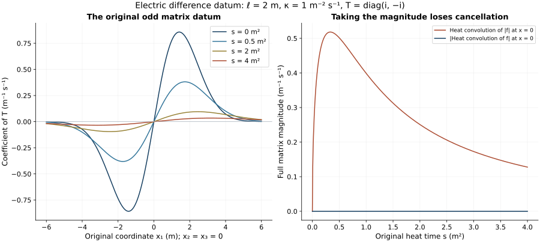

# Electric curvature differences and the original heat datum

This analytic chapter of Unit 9 subtracts the two electric heat
equations and bounds the resulting difference. One proof uses scalar
comparison. A second keeps cancellation in the original matrix-valued
datum and gives explicit linear dependence on its stated difference
norms. Both have complete receiving maps to the temporal-boundary proof.

Read [electric smoothing](../classical-electric-smoothing.html), ES.1–ES.6,
[the fixed-time curvature proof](../classical-heat-analysis.html), H9.16–H9.42,
and [temporal differences](../classical-temporal-difference.html), TD.1–TD.9.
The electric datum here is prescribed at heat time zero over the whole
physical interval. Its relation to data at one physical time is a
subsequent evolution argument.

Human-source context: Sung-Jin Oh,
[*Gauge choice for the Yang–Mills equations using the Yang–Mills heat flow
and local well-posedness in H1*, arXiv:1210.1558v2](https://arxiv.org/abs/1210.1558v2).
The proofs here use the complete linked course arguments and are
independent exposition. They make no novelty claim. Exact source
versions and bounded reading are retained in the course provenance.

## 1. Original objects, datum, and finite coefficient inputs

Let the two actual regular connections be exactly those in TD.1.
They live on the same original
\(I\times\mathbb R^3\times[0,S]\), where \(I\) is compact and
nondegenerate, \(S>0\), and the original speed is \(c>0\).
Both have \(a_s=a_s'=0\). Write

\[
\begin{gathered}
E_i=F_{ti}^{a},\qquad E_i'=F_{ti}^{a'},\qquad
u_i=E_i-E_i',\qquad f_i(t,x)=u_i(t,x,0),\\
\eta_j=a_j-a_j',\qquad B_{ij}=F_{ij}^{a}-F_{ij}^{a'},\qquad
D_j=\partial_j+[a_j,\cdot],\quad
D_j'=\partial_j+[a_j',\cdot].
\end{gathered}\tag{ED.1}
\]

For its exact comparison with ST.9, put
\(\vartheta=a_t-a_t'\), with all quantities below evaluated at
the unchanged heat boundary \(s=0\). Then

\[
f_i=\partial_t\eta_i-\partial_i\vartheta
             +[\vartheta,a_i]+[a_t',\eta_i].
\]

The first bracket is
\([\vartheta,a_i']+[\vartheta,\eta_i]\); thus its full quadratic
difference is retained. This identity follows by subtracting both
original expressions \(E_i=\partial_ta_i-\partial_ia_t+[a_t,a_i]\).
No physical derivative has been replaced by a heat derivative.

All tuple norms use Hilbert–Schmidt matrix norms and the square sum
over every ordered derivative and output label. In particular
\(F_x=(F_{ij})_{i,j=1}^3\) and \(B=(B_{ij})_{i,j=1}^3\) have nine
ordered entries, including three zero diagonal entries. No replacement
of the original electric field by \(c^{-1}E\) is made. The physical
measure is \(dt\,d^3x\). Heat measure is \(ds\), except when
\(ds/s\) is displayed.

Retain TD.2's \(A_0,A_1,A_0',A_1',\delta A_0,\delta A_1\), namely
the suprema of \(s^{r/2+1/4}\|\partial^{(r)}a_x\|_\infty\), its
primed version, and its difference version, for \(r=0,1\). Also set

\[
\begin{aligned}
C_F&=\sup_{0<s\le S}s^{3/4}\|F_x(s)\|_{L^\infty_{t,x}},&
C_F'&=\sup_{0<s\le S}s^{3/4}\|F_x'(s)\|_{L^\infty_{t,x}},\\
\delta C_F&=\sup_{0<s\le S}s^{3/4}\|B(s)\|_{L^\infty_{t,x}},&
\Phi(s)&=16C_Fs^{1/4},\\
D_4&=\|f\|_{L^4_{t,x}},&
M_f&=\sup_{t\in I}\|f(t)\|_{L^2_x}.
\end{aligned}\tag{ED.2}
\]

The individual coefficients satisfy \(A_r\le U_r\) and
\(C_F\le C_0^F\), and similarly with primes, by ES.3–ES.4 and
ST.26. Thus all individual coefficient bounds already have the
proved fixed-time providers. The difference coefficients in ED.2
are actual differences, rather than differences of upper bounds.
The current regularity makes \(D_4,M_f\) finite: continuity into
spatial \(H^2\) on the compact physical interval bounds both the
spatial \(L^2\) and \(L^\infty\) norms; their interpolation bounds
\(L^4_x\), and integration gives \(D_4\).

Let \(d'\) be the primed initial full curvature bound used by H9.40,
uniform in physical time, with the same original physical factors as
H9.33–H9.41. The already established fixed-time bounds give

\[
\begin{aligned}
\sup_{t,s}\|E'(t,s)\|_2&\le m_0':=cR_0d',\\
\sup_{t,s}s^{1/2}\|D_x'E'(t,s)\|_2&\le m_1':=cR_1d',\\
\sup_t\left(\int_0^S\|D_x'E'(t,s)\|_2^2ds\right)^{1/2}
 &\le b_0':=cR_0d'.
\end{aligned}\tag{ED.3}
\]

Indeed each electric subtuple has norm at most \(c\) times the
unchanged positive curvature norm \(|F|_c\). Apply respectively
\(A_0,A_1,B_0\) of H9.38–H9.40 to that subtuple. The symbols
\(A_m\) in that cited curvature statement are distinct from TD.2's
potential constants. The factor \(c\) in each line of ED.3 is
necessary. One may replace these three upper bounds by smaller proved
actual bounds without changing any argument below. The individual
H9.40 hypotheses are already part of the accepted fixed-time setting;
the present paired estimate adds no difference smallness hypothesis.

The complete original curvature difference is

\[
\begin{aligned}
B_{ij}={}&\partial_i\eta_j-\partial_j\eta_i
 +[\eta_i,a_j]+[a_i',\eta_j]\\
={}&\partial_i\eta_j-\partial_j\eta_i
 +[\eta_i,a_j']+[a_i',\eta_j]+[\eta_i,\eta_j],\\
\delta C_F\le{}&2\delta A_1
 +2S^{1/4}\delta A_0(A_0+A_0'),\\
\delta C_F\le{}&2\delta A_1
 +S^{1/4}(4A_0'\delta A_0+2(\delta A_0)^2).
\end{aligned}\tag{ED.4}
\]

The derivative estimate follows from
\(|(\partial_i\eta_j-\partial_j\eta_i)_{ij}|
\le2|\partial\eta|\). Each full ordered bracket tensor is bounded
by twice the product of the two complete potential norms. Multiplying
its \(s^{-1/2}\) bound by \(s^{3/4}\) leaves \(s^{1/4}\le S^{1/4}\).
These calculations prove both inequalities, including their quadratic
difference term. Thus \(\delta C_F\) can also be eliminated using
either displayed provider, if only potential differences are given.

## 2. Both electric equations and the complete operator difference

H9.35 at \((\mu,\nu)=(t,i)\), or ES.5, gives both equations

\[
\begin{aligned}
(\partial_s-\sum_jD_jD_j)E_i&=2\sum_j[F_{ij},E_j],\\
(\partial_s-\sum_jD_j'D_j')E_i'&=2\sum_j[F_{ij}',E_j'].
\end{aligned}\tag{ED.5}
\]

The sign is \(-2[E_j,F_{ij}]=2[F_{ij},E_j]\). Subtracting yields

\[
\begin{aligned}
(\partial_s-\sum_jD_jD_j)u_i
 &=2\sum_j[F_{ij},u_j]+H_i,\qquad u_i(0)=f_i,\\
H_i={}&2\sum_j[\eta_j,\partial_jE_i']
 +[\sum_j\partial_j\eta_j,E_i']\\
&+\sum_j[\eta_j,[a_j,E_i']]
 +\sum_j[a_j',[\eta_j,E_i']]
 +2\sum_j[B_{ij},E_j'].
\end{aligned}\tag{ED.6}
\]

This retains all five original coefficient-difference terms. To check
the nested difference, expand

\[
[a_j,[a_j,X]]-[a_j',[a_j',X]]
=[\eta_j,[a_j,X]]+[a_j',[\eta_j,X]].
\]

Substituting \(a_j=a_j'+\eta_j\) gives, separately,
\([\eta_j,[a_j',X]]\), \([a_j',[\eta_j,X]]\), and
\([\eta_j,[\eta_j,X]]\). Similarly the curvature contraction in
the full difference equals
\([F_{ij}',u_j]+[B_{ij},E_j']+[B_{ij},u_j]\).
Its last term is already in \([F_{ij},u_j]\) in ED.6.

There are two useful exact alternative forms of the same forcing:

\[
\begin{aligned}
H_i={}&2\sum_j[\eta_j,D_j'E_i']
 +[\sum_jD_j'\eta_j,E_i']
 +\sum_j[\eta_j,[\eta_j,E_i']]
 +2\sum_j[B_{ij},E_j'],\\
H_i={}&\sum_jD_j\mathcal Z_{ji}+\mathcal R_i,\qquad
\mathcal Z_{ji}=[\eta_j,E_i'],\\
\mathcal R_i={}&\sum_j[\eta_j,D_j'E_i']
                       +2\sum_j[B_{ij},E_j'].
\end{aligned}\tag{ED.7}
\]

For the first identity,

\[
D^2-D'^2=2\operatorname{ad}(\eta_j)D_j'
 +\operatorname{ad}(D_j'\eta_j)
 +\operatorname{ad}(\eta_j)^2,
\]

summed over \(j\).
On expanding \(D_j'\), Jacobi gives

\[
[[a_j',\eta_j],X]=[a_j',[\eta_j,X]]
-[\eta_j,[a_j',X]].
\]

Consequently the coefficient two multiplying
\([\eta_j,[a_j',X]]\) leaves exactly one occurrence after this
identity, reproducing all the terms in ED.6. For the second identity,
the operator equality
\(D^2-D'^2=D(D-D')+(D-D')D'\), separately for every \(j\),
gives exactly its displayed covariant divergence and remainder.
These are proved equalities of the original operators; no summand has
been deleted on the ground that it is a lower-order term.

Full-index Cauchy–Schwarz and \(|[X,Y]|\le2|X||Y|\) give
\(|(2\sum_j[F_{ij},u_j])_i|\le4|F_x||u|\).
The same argument applies to \(B,E'\). The first line of ED.7
therefore gives, uniformly in \(t\),

\[
\begin{aligned}
\|H(t,s)\|_2&\le P s^{-3/4}+Q s^{-1/2},\\
P&=4\delta A_0m_1'
          +2\sqrt3\,\delta A_1m_0'+4\delta C_Fm_0',\\
Q&=4A_0'\delta A_0m_0'+4(\delta A_0)^2m_0'.
\end{aligned}\tag{ED.8}
\]

The trace map \((\partial_j\eta_k)_{jk}\mapsto\sum_j\partial_j\eta_j\)
has norm \(\sqrt3\), by Cauchy–Schwarz on its three diagonal
entries. Its bracket with \(E'\) supplies the factor two in \(P\).
The other part of \(\sum_jD_j'\eta_j\) is
\(\sum_j[a_j',\eta_j]\), bounded by \(2|a'||\eta|\); its
outer bracket contributes the first term of \(Q\). The quadratic
term of ED.7 contributes the second. This proves ED.8 using every
term, with no extra output-count factor.

For comparison, estimating ED.6 before the Jacobi calculation gives
the same \(P\) and the valid larger coefficient

\[
Q_{\rm expanded}=8\delta A_0A_0'm_0'
 +4\delta A_0A_0m_0'+4A_0'\delta A_0m_0'.
\tag{ED.9}
\]

Here the first term arises from
\(\partial E'=D'E'-[a',E']\) in the first term of ED.6; the last
two terms are its two original nested brackets. Since
\(\delta A_0\le A_0+A_0'\), ED.8 is no larger. ED.9 records
the exact comparison and the reason the stronger coefficient is valid.

## 3. Covariant energy closes without a derivative of the difference connection

At each fixed physical time, the second form of ED.7 gives

\[
\begin{aligned}
\|\mathcal Z\|_{L^2((0,S),ds;L^2_x)}
 &\le Z_*:=2\sqrt2\,\delta A_0m_0'S^{1/4},\\
\|\mathcal R\|_{L^1((0,S),ds;L^2_x)}
 &\le R_*:=2\sqrt2\,\delta A_0b_0'S^{1/4}
                     +16\delta C_Fm_0'S^{1/4}.
\end{aligned}\tag{ED.10}
\]

Indeed \(|\mathcal Z|\le2|\eta||E'|\), and
\(\int_0^S s^{-1/2}ds=2\sqrt S\). For the first remainder,
heat Cauchy–Schwarz is applied to
\(2\delta A_0s^{-1/4}\|D'E'(t,s)\|_2\), using the third
line of ED.3. For the second remainder, integrate
\(4\delta C_Fm_0's^{-3/4}\), obtaining its factor 16.
This proof is at fixed physical time; it never exchanges an outer
heat \(L^2\) norm with a physical \(L^4\) norm.

Put

\[
Y_*=R_*+\sqrt{R_*^2+M_f^2+Z_*^2},\qquad
M_*=e^{\Phi(S)}Y_*.
\tag{ED.11}
\]

Then

\[
\sup_{t,s}\|u(t,s)\|_2\le M_*,\qquad
\sup_t\left(\int_0^S\|D_xu(t,s)\|_2^2ds\right)^{1/2}
 \le M_*.
\tag{ED.12}
\]

Here is the complete energy argument. With \(M(s)=\|u(t,s)\|_2\)
and \(J(s)=\|D_xu(t,s)\|_2\), covariant integration by parts in
ED.6–ED.7 yields

\[
\frac12\partial_sM^2+J^2
 \le4C_Fs^{-3/4}M^2+J\|\mathcal Z\|_2+M\|\mathcal R\|_2.
\]

The divergence pairing has sign
\(-\sum_{j,i}\langle D_ju_i,\mathcal Z_{ji}\rangle\);
its absolute value is the displayed product. Multiply this inequality
by the scalar integrating factor \(e^{-2\Phi(s)}\), where
\(\Phi'=4C_Fs^{-3/4}\). Young's inequality for the flux gives

\[
\partial_s(e^{-2\Phi}M^2)+e^{-2\Phi}J^2
 \le e^{-2\Phi}\|\mathcal Z\|_2^2
       +2(e^{-\Phi}M)e^{-\Phi}\|\mathcal R\|_2.
\]

For \(Y_s=\sup_{0\le r\le s}e^{-\Phi(r)}M(r)\), integration
and ED.10 imply \(Y_s^2\le M_f^2+Z_*^2+2Y_sR_*\).
The nonnegative root is \(Y_*\). The same integrated inequality
then bounds the weighted gradient square by
\(M_f^2+Z_*^2+2Y_*R_*=Y_*^2\). Removing the scalar integrating
factor proves both statements of ED.12. The original field is never
changed. Spatial cutoffs have vanishing boundary terms by regularity
and the displayed integrable norms. Integrating from positive heat
time and then using continuity at zero proves the initial term exactly.

In particular ED.12 needs \(\delta A_0,\delta C_F\), but no
\(\delta A_1\). Both the initial electric difference and the flux
term are present under the square root. If \(f=\eta=B=0\), all
these bounds vanish and ED.12 proves \(E=E'\).

## 4. Exact scalar heat constants and preservation of the mixed norm order

Let the spatial heat operator be exactly

\[
H_hv=k_h*v,\qquad
k_h(x)=(4\pi h)^{-3/2}\exp(-|x|^2/(4h)).
\]

It acts in the original spatial variables, at each unchanged physical
time. For the full tuple norm, Young's inequality gives

\[
\begin{aligned}
\|H_hv\|_{L^4_x}&\le K_{24}h^{-3/8}\|v\|_{L^2_x},\qquad
K_{24}=(4\pi)^{-3/8}(4/3)^{-9/8},\\
\left\|\sum_j\partial_jH_hV_j\right\|_{L^4_x}
 &\le J_{24}h^{-7/8}\|V\|_{L^2_x},\\
J_{24}&=\tfrac12(4\pi)^{-3/2}
       \left(2\pi\,3^{13/6}\Gamma(13/6)\right)^{3/4}.
\end{aligned}\tag{ED.13}
\]

The first constant is exactly \(\|k_1\|_{4/3}\), computed by
Gaussian integration. For the second, contraction in the input label
gives the pointwise convolution bound \(|\nabla k_h|*|V|\), without
a factor three. In spherical coordinates, for \(q=4/3\),

\[
\begin{aligned}
\|\nabla k_h\|_q^q
 &=(2h)^{-q}(4\pi h)^{-3q/2}
     2\pi(4h/q)^{(q+3)/2}\Gamma((q+3)/2).
\end{aligned}
\]

Taking the \(q\)-th root gives exactly ED.13. This is an evaluation
of a norm of the original kernel, with no change to any field, measure,
or physical coefficient. Young also gives \(\|H_hv\|_4\le\|v\|_4\).

Define the positive finite integrals

\[
\begin{aligned}
B_1&=\int_0^1v^{-3/4}(1-v)^{-3/8}dv
                         =\mathrm B(1/4,5/8),\\
B_2&=\int_0^1v^{-1/2}(1-v)^{-3/8}dv
                         =\mathrm B(1/2,5/8),\\
B_3&=\int_0^1v^{-1/4}(1-v)^{-7/8}dv
                         =\mathrm B(3/4,1/8),\\
B_4&=\int_0^1v^{-1/2}(1-v)^{-3/4}dv
                         =\mathrm B(1/2,1/4),\\
\omega_2(\gamma)&=S^\gamma/\sqrt{2\gamma},\qquad
\omega_\infty(\gamma)=S^\gamma\quad(\gamma>0).
\end{aligned}\tag{ED.14}
\]

The exponents at both endpoints of each integral exceed \(-1\).
Substitution \(r=sv\) in the original heat integral proves

\[
\begin{aligned}
s^{1/4}\int_0^s(s-r)^{-3/8}r^{-3/4}dr&=B_1s^{1/8},\\
s^{1/4}\int_0^s(s-r)^{-3/8}r^{-1/2}dr&=B_2s^{3/8},\\
s^{1/4}\int_0^s(s-r)^{-7/8}r^{-1/4}dr&=B_3s^{1/8}.
\end{aligned}\tag{ED.15}
\]

This is a substitution in a scalar integral, not a redefinition of
the solution or the heat interval. Direct integration of
\(s^{2\gamma}ds/s\) proves
\(\|s^\gamma\|_{L^p(ds/s)}=\omega_p(\gamma)\).
In particular \(\omega_2(1/8)=2S^{1/8}\) and
\(\omega_2(3/8)=2S^{3/8}/\sqrt3\).
The same substitution also gives

\[
s^{1/4}\left(\int_0^s(s-r)^{-3/4}r^{-1/2}dr\right)^{1/2}
       =\sqrt{B_4}s^{1/8}.
\]

Consequently the primed heat-gradient energy in ED.3 implies, at
each fixed physical time,

\[
s^{1/4}\int_0^s(s-r)^{-3/8}r^{-1/4}
                    \|D'E'(t,r)\|_2dr
 \le\min\{B_1m_1',\sqrt{B_4}b_0'\}\,s^{1/8}.
\]

The first bound uses the second line of ED.3; the second is
Cauchy–Schwarz in \(dr\) and the third line of ED.3. Each is
uniform in physical time and can therefore be followed by the
physical \(L^4\) integration below.

Whenever \(\|v(t,r)\|_{L^2_x}\le A(r)\) uniformly in \(t\),
ED.13 gives \(\|H_hv(r)\|_{L^4_{t,x}}
\le |I|^{1/4}K_{24}h^{-3/8}A(r)\), and its divergence version
has \(J_{24}h^{-7/8}\). First perform this physical-time integration,
then the Duhamel integral by Minkowski in \(L^4_{t,x}\), and only
then take the heat \(L^p(ds/s)\) norm. Thus ED.14–ED.15 apply in
exactly TD.3's order. No assertion involving
\(L^4_tL^2_s\) has been substituted for an
\(L^2_sL^4_t\) assertion.

## 5. Direct diamagnetic difference bound from the actual electric datum

For the datum alone define two computable linear-heat quantities

\[
\begin{aligned}
\mathcal D_p(f)&=
 \|s^{1/4}\|H_sf\|_{L^4_{t,x}}\|_{L^p((0,S],ds/s)},\\
\mathcal D_p^{\rm abs}(f)&=
 \|s^{1/4}\|H_s|f|\|_{L^4_{t,x}}\|_{L^p((0,S],ds/s)}.
\end{aligned}\tag{ED.16}
\]

The first retains the original tuple inside the convolution; in the
second \(|f|\) is the actual scalar full-tuple magnitude used only
for scalar comparison. These quantities depend on the datum alone,
not on the unknown electric difference at positive heat time. They
obey the proved explicit bounds

\[
\mathcal D_p(f)\le\mathcal D_p^{\rm abs}(f)
 \le\omega_p(1/4)D_4,\qquad p=2,\infty.
\tag{ED.17}
\]

Indeed positivity and Minkowski give \(|H_sf|\le H_s|f|\), and
heat contraction in \(L^4_{t,x}\) gives the second inequality.
Hence no unevaluated datum-regularity assertion is needed to use the
bound below on the current regular connections.

For the actual \(u\), the Bochner calculation H9.19 gives

\[
(\partial_s-\Delta)|u|
 \le4C_Fs^{-3/4}|u|+|H|
\]

in distributions. More explicitly, for
\(\rho_\varepsilon=(|u|^2+\varepsilon^2)^{1/2}\), the derivative
identity is

\[
(\partial_s-\Delta)\rho_\varepsilon
=\frac{\langle u,2[F_x,u]+H\rangle}{\rho_\varepsilon}
-\frac{|Du|^2}{\rho_\varepsilon}
+\frac{\sum_j\langle u,D_ju\rangle^2}{\rho_\varepsilon^3}.
\]

Here \(2[F_x,u]\) means the exact contracted tuple in ED.6, not an
additional bracket convention. Cauchy–Schwarz bounds the last two
terms above by zero, and
\(\langle u,2[F_x,u]\rangle/\rho_\varepsilon
\le4C_Fs^{-3/4}\rho_\varepsilon\).
Apply the scalar integrating factor and the kernel comparison proof
of H9.20 on a positive heat interval. After subtracting the harmless
constant \(\varepsilon\), its remaining error is at most
\(4C_Fs^{-3/4}\varepsilon\), integrable down to zero. Let
\(\varepsilon\downarrow0\) and then take the initial heat endpoint
by regularity and the integrable bound ED.8. This proves

\[
|u(t,x,s)|\le e^{\Phi(s)}H_s|f(t)|(x)
 +\int_0^s e^{\Phi(s)-\Phi(r)}H_{s-r}|H(t,r)|(x)\,dr.
\tag{ED.18}
\]

No derivative of a heat kernel of the covariant operator is being
assumed. ED.18 follows from the displayed Bochner identity and the
original scalar kernel. The spatial cutoff argument in H9.20 applies
on every positive compact heat interval, and ED.8 and ED.13 provide
integrable endpoint domination in the receiving norms.

Define

\[
\begin{aligned}
\mathfrak E_p^{\rm dia}
 =e^{\Phi(S)}\bigl[\mathcal D_p^{\rm abs}(f)
  +|I|^{1/4}K_{24}
       \{B_1P\omega_p(1/8)+B_2Q\omega_p(3/8)\}\bigr].
\end{aligned}\tag{ED.19}
\]

Then the requested norms satisfy

\[
\delta e_p:=
 \|s^{1/4}\|E(s)-E'(s)\|_{L^4_{t,x}}\|_{L^p(ds/s)}
 \le\mathfrak E_p^{\rm dia},\qquad p=2,\infty.
\tag{ED.20}
\]

To prove this, use \(e^{\Phi(s)-\Phi(r)}\le e^{\Phi(S)}\),
ED.8, ED.13, and each of the first two lines of ED.15 in ED.18.
Take the physical and heat norms in the order proved in Section 4.
Every term of ED.19 is finite. A completely explicit version replaces
\(\mathcal D_p^{\rm abs}(f)\) by
\(\omega_p(1/4)D_4\). Its two forms are

\[
\begin{aligned}
\delta e_2\le e^{16C_FS^{1/4}}\bigl[
 &\sqrt2 S^{1/4}D_4
 +|I|^{1/4}K_{24}
    (2B_1PS^{1/8}+\tfrac2{\sqrt3}B_2QS^{3/8})\bigr],\\
\delta e_\infty\le e^{16C_FS^{1/4}}\bigl[
 &S^{1/4}D_4
 +|I|^{1/4}K_{24}
    (B_1PS^{1/8}+B_2QS^{3/8})\bigr].
\end{aligned}\tag{ED.21}
\]

This closes the requested electric difference norms from finite actual
datum and coefficient differences. Neither \(\delta e_2\) nor
\(\delta e_\infty\) occurs on the right. The only individual electric
providers are \(cR_0d',cR_1d'\), not growing physical wave norms.

## 6. A second bound preserving cancellation in the datum

The modulus datum in ED.18 can lose spatial cancellation. A separate
ordinary-kernel estimate retains \(H_sf\) itself and uses the closed
energy bound ED.12 to control every individual coefficient term.
It also avoids \(\delta A_1\): the entire differentiated connection
difference remains inside the heat-kernel divergence. The exact
identity in the second line of ED.7 reads

\[
H_i=\sum_j\partial_j[\eta_j,E_i']
+\sum_j[a_j,[\eta_j,E_i']]+\mathcal R_i.
\]

The full ordinary equation is

\[
\begin{aligned}
(\partial_s-\Delta)u_i
={}&2\sum_j[a_j,\partial_ju_i]
 +[\sum_j\partial_ja_j,u_i]
 +\sum_j[a_j,[a_j,u_i]]
 +2\sum_j[F_{ij},u_j]+H_i\\
={}&\sum_j\partial_j\mathcal V_{ji}+\mathcal T_i,\\
\mathcal V_{ji}&=2[a_j,u_i]+[\eta_j,E_i'],\\
\mathcal T_i&=-[\sum_j\partial_ja_j,u_i]
              +\sum_j[a_j,[a_j,u_i]]+2\sum_j[F_{ij},u_j]\\
 &\quad+\sum_j[a_j,[\eta_j,E_i']]
       +\sum_j[\eta_j,D_j'E_i']+2\sum_j[B_{ij},E_j'].
\end{aligned}\tag{ED.22}
\]

The sign of the divergence term in \(\mathcal T\) is negative:
the product rule for the two first-order occurrences subtracts two
copies from the original positive copy. In particular this step
retains, and proves the combination of, all original terms.
For every \(t\), ED.12 implies

\[
\begin{aligned}
\|\mathcal V(t,s)\|_2
 &\le(4A_0M_*+2\delta A_0m_0')s^{-1/4},\\
\|\mathcal T(t,s)\|_2
 &\le\{(2\sqrt3A_1+4C_F)M_*+4\delta C_Fm_0'\}s^{-3/4}\\
 &\quad+(4A_0^2M_*+4A_0\delta A_0m_0')s^{-1/2}
             +2\delta A_0s^{-1/4}\|D'E'(t,s)\|_2.
\end{aligned}\tag{ED.23}
\]

Duhamel's identity for ED.22 is

\[
u(s)=H_sf+\int_0^s\sum_j\partial_jH_{s-r}\mathcal V_j(r)dr
                  +\int_0^sH_{s-r}\mathcal T(r)dr.
\]

It holds first between positive heat times by differentiating
\(H_{s-r}u(r)\). The two estimates in ED.13, followed by
ED.23, have the integrable kernels ED.15 and the subsequent
Cauchy–Schwarz kernel estimate, so they
justify the limit to the original heat boundary in \(L^4_{t,x}\)
for each positive \(s\) and in both required weighted heat norms.

Put

\[
\begin{aligned}
L_1={}&J_{24}B_3(4A_0M_*+2\delta A_0m_0')\\
 &+K_{24}B_1\{(2\sqrt3A_1+4C_F)M_*+4\delta C_Fm_0'\}\\
 &+2K_{24}\delta A_0
                    \min\{B_1m_1',\sqrt{B_4}b_0'\},\\
L_2={}&K_{24}B_2(4A_0^2M_*+4A_0\delta A_0m_0'),\\
\mathfrak E_p^{\rm vec}
 ={}&\mathcal D_p(f)
           +|I|^{1/4}\{L_1\omega_p(1/8)+L_2\omega_p(3/8)\}.
\end{aligned}\tag{ED.24}
\]

The same Minkowski and kernel calculations prove

\[
\delta e_p\le\mathfrak E_p^{\rm vec},\qquad p=2,\infty.
\tag{ED.25}
\]

For the last term of \(L_1\), apply the final fixed-time kernel
estimate after ED.15, then integrate in physical time; all other
terms follow directly from ED.13–ED.15. Thus ED.25 requires only
\(\delta A_0,\delta C_F\), with no differentiated potential
difference. Choosing the second entry in its minimum uses only
\(m_0'=b_0'=cR_0d'\), so even \(m_1'\) is unnecessary for
this bound. Every original derivative of \(\eta\) is still in the
exact divergence of \([\eta,E']\), whose derivative is transferred
to the kernel by the proved Duhamel identity.

One can state this consequence as an explicit linear difference bound.
Define coefficients depending only on the individual proved inputs by

\[
\begin{aligned}
T_p={}&|I|^{1/4}\bigl[
 \{4J_{24}A_0B_3+K_{24}B_1(2\sqrt3A_1+4C_F)\}\omega_p(1/8)
 +4K_{24}B_2A_0^2\omega_p(3/8)\bigr],\\
J_p={}&|I|^{1/4}\bigl[
 (2J_{24}B_3m_0'+2K_{24}\sqrt{B_4}b_0')\omega_p(1/8)
 +4K_{24}B_2A_0m_0'\omega_p(3/8)\bigr],\\
K_p={}&4|I|^{1/4}K_{24}B_1m_0'\omega_p(1/8).
\end{aligned}\tag{ED.25a}
\]

Choosing the heat-energy entry in ED.24's minimum gives

\[
\delta e_p\le\mathcal D_p(f)+T_pM_*+J_p\delta A_0+K_p\delta C_F.
\]

For nonnegative numbers, \(\sqrt{x^2+y^2+z^2}\le x+y+z\), so
ED.11 gives

\[
M_*\le e^{\Phi(S)}\bigl[
 M_f+(2\sqrt2m_0'+4\sqrt2b_0')S^{1/4}\delta A_0
                       +32m_0'S^{1/4}\delta C_F\bigr].
\]

Substitution proves the fully expanded inequality

\[
\begin{aligned}
\delta e_p\le{}&\mathcal D_p(f)+T_pe^{\Phi(S)}M_f\\
 &+\{J_p+T_pe^{\Phi(S)}(2\sqrt2m_0'+4\sqrt2b_0')S^{1/4}\}
                                                        \delta A_0\\
 &+\{K_p+32T_pe^{\Phi(S)}m_0'S^{1/4}\}\delta C_F,
 \qquad p=2,\infty.
\end{aligned}\tag{ED.25b}
\]

In particular it is a Lipschitz estimate in the displayed actual
datum and coefficient norms on every set with bounded individual
providers. Every coefficient of every difference is displayed. The
linear upper bound does not remove the quadratic terms from ED.6;
the exact divergence identity places those terms in the actual
coefficient \(a\), which is retained in \(A_0\).

Again ED.17 gives a finite bound entirely in \(D_4,M_f\) and the
listed coefficient differences. ED.25 is useful when the linear heat
datum norm is better than the magnitude-datum estimate. It is not
asserted that one of ED.20 and ED.25 always dominates the other.

All arguments can be applied after interchanging the two connections:
\(u,f,\eta,B\) change sign, their displayed norms do not, while
the primed and unprimed reference constants interchange. The equation
is rederived with \(D'\) and curvature \(F'\); consequently the
new exponential is \(e^{16C_F'S^{1/4}}\). Define

\[
\mathfrak E_p=
\min\{\mathfrak E_p^{\rm dia},\mathfrak E_p^{\rm vec},
       (\mathfrak E_p^{\rm dia})_{a\leftrightarrow a'},
       (\mathfrak E_p^{\rm vec})_{a\leftrightarrow a'}\}.
\qquad \delta e_p\le\mathfrak E_p.
\tag{ED.26}
\]

Each entry is an independently proved bound; taking their minimum is
legitimate. In particular a purely explicit version is obtained in all
four entries by the replacements ED.17 and ED.3. No lower bound on
\(d\), \(d'\), or on any difference is used. If \(d'=0\), all
primed electric providers and both \(P,Q\) vanish. If all paired
differences vanish, all entries in ED.26 vanish. At \(s=0\) the
field tends to the actual datum; the weighted profile tends to zero
by the assumed regularity. At \(s=S\) the displayed suprema and
the original terminal values remain included.

## 7. Exact insertion into the temporal electric forcing

Retain TD.1–TD.3's original \(G,G',\delta G,g,g',e,e'\) and
\(\delta g\). TD.7's forcing is the full exact expression

\[
Q_\delta=2\sum_j([u_j,G_j]+[E_j',\delta G_j]).
\]

Physical Hölder and full-index Cauchy–Schwarz give

\[
\|Q_\delta(s)\|_2\le
4(\|u(s)\|_4\|G(s)\|_4+
\|E'(s)\|_4\|\delta G(s)\|_4).
\]

The original heat differential is exactly
\(ds=s^{1/4}s^{3/4}ds/s\). Therefore ED.26 proves the concrete
replacement in TD.9

\[
\int_0^S\|Q_\delta(s)\|_{L^2_{t,x}}ds
 \le4(\mathfrak E_2g+e'\delta g)
 \le4(\mathfrak E_2g+(e_0^2)'\delta g).
\tag{ED.27}
\]

Here \((e_0^2)'\) is precisely the primed ST.11 bound, whose
original complete formula is

\[
(e_0^p)'=cd_c(\overline P_{3/2}^p)'
 +|I|^{1/4}c(d')^2\mathscr R_1'
                       (\mathfrak H_1^p(1/4))'
 +2\mathcal A'c(d')^2\mathscr R_0'
                       (\mathfrak H_0^p(1/8))',
\qquad d_c=\sqrt2(2\pi c)^{-1/4}.
\]

Primes here label the second connection's providers, not derivatives.
The original definitions ST.3 and ST.6–ST.8 are unchanged. There is
no new \(c^{-2}\) in TD.9 or ED.27: those equations concern temporal
forcing \(2[E,G]\). The \(c^{-2}\) in ST.2 concerns a different,
spatial-tension contraction and has not been moved into this equation.

Alternatively, the exact identity
\(Q_\delta=2\sum_j([u_j,G_j']+[E_j,\delta G_j])\)
gives the further proved bound

\[
\int_0^S\|Q_\delta(s)\|_2ds
 \le4\min\{\mathfrak E_2g+e'\delta g,
                  \mathfrak E_2g'+e\delta g\}.
\tag{ED.28}
\]

The first choice is the original TD.9 ordering. In TD.11, TD.16,
and all constants depending on \(L_Q\), one may now replace that
quantity by the right side of ED.27 or ED.28. Every other term of
TD.11 and TD.16 remains as written; monotonicity of their additions,
square roots, and minima then propagates the established improvement
through TD.19–TD.27. This states the exact receiving map in the same original norms.

## 8. Strength and exact boundary of the completed estimate

ED.21 is a complete, finite difference estimate on the actual regular
solutions using the actual heat-boundary electric difference in
\(L^4_{t,x}\) and every required spatial coefficient difference.
ED.24–ED.26 additionally retain the possibly smaller explicitly
computed linear-heat datum norm. The target nonlinear heat norm does
not occur among the inputs. The energy estimate ED.12 and the
alternative datum estimate ED.25 both avoid derivatives of the
connection difference, if the actual curvature difference is retained
as an input. They are proved strengthenings of the direct ED.21
calculation. ED.4 gives the exact provider when one instead wants
only potential differences.

For an additional explicit datum option, if \(12/5<r\le4\), set
\(\sigma_r=\tfrac32(1/r-1/4)<1/4\) and choose
\(q\in[1,6/5)\) by \(1+1/4=1/r+1/q\). Gaussian Young gives

\[
\mathcal D_p^{\rm abs}(f)
 \le (4\pi)^{-\sigma_r}q^{-3/(2q)}
       \omega_p(1/4-\sigma_r)\|f\|_{L^4_tL^r_x}.
\tag{ED.29}
\]

This follows by the pointwise spatial estimate, then physical-time
integration, and then the displayed elementary heat integral. At
\(r=12/5\) the same argument gives the heat-supremum estimate with
\(\omega_\infty(0)=1\); it does not give a heat-square estimate
because \(\int_0^Sds/s=\infty\). This identifies exactly which
endpoint needs additional information rather than postulating it.

A heat-equation estimate based solely on an arbitrary
\(L^\infty_tL^2_x\) heat datum cannot supply the weighted norm in
ED.20. To prove the precise operator obstruction, take a nonzero
smooth compactly supported Lie-algebra-valued electric tuple
\(v(x)\), constant in physical time, and set
\(f_\lambda(t,x)=\lambda^{3/2}v(\lambda x)\). Its
\(L^\infty_tL^2_x\) norm is \(\|v\|_2\) for every \(\lambda\).
This family is a test of the fixed original heat operator; no solution
in the preceding proof is replaced by it. Direct substitution in the
original convolution proves

\[
\begin{aligned}
\|s^{1/4}\|H_sf_\lambda\|_{L^4_{t,x}}\|_{L^2((0,S],ds/s)}
={}&|I|^{1/4}\lambda^{1/4}
 \left(\int_0^{\lambda^2S}
   \tau^{1/2}\|H_\tau v\|_4^2\frac{d\tau}{\tau}\right)^{1/2}.
\end{aligned}\tag{ED.30}
\]

The integral on any fixed positive compact \(\tau\)-interval is
strictly positive. For large \(\tau\), the \(L^1\to L^4\)
heat bound makes its integrand integrable; near zero, \(L^4\)
contraction does so. Thus ED.30 grows like a positive constant times
\(\lambda^{1/4}\). The supremum analogue has the same power by
evaluating at a fixed positive \(\tau\). This is a proved failure
of that specific arbitrary-heat-datum operator bound, not a claimed
counterexample to the physical Yang–Mills initial-value theory.

The exact datum space singled out by this calculation is

\[
\begin{aligned}
\mathcal X_S={}&\{f\in L^\infty(I;L^2_x):
                   \mathcal D_2(f)+\mathcal D_\infty(f)<\infty\},\\
\|f\|_{\mathcal X_S}={}&\|f\|_{L^\infty_tL^2_x}
                         +\mathcal D_2(f)+\mathcal D_\infty(f).
\end{aligned}
\]

It retains the original electric tuple, physical interval, coordinates,
and heat operator. It is a Banach space. To verify completeness, let
\(f_n\) be Cauchy in its displayed norm. Its first component converges
to some \(f\in L^\infty_tL^2_x\); the two weighted heat images
converge in their respective Banach spaces. For each fixed \(s>0\),
ED.13 gives

\[
\|H_s(f_n-f)\|_{L^4_{t,x}}
\le |I|^{1/4}K_{24}s^{-3/8}\|f_n-f\|_{L^\infty_tL^2_x}\to0.
\]

A subsequence of the heat-square convergence is pointwise almost
everywhere in \(s\) in \(L^4_{t,x}\); the heat-supremum convergence
has the same almost-everywhere limit. Both limits therefore equal
\(s^{1/4}H_sf\). Thus \(f\in\mathcal X_S\) and the original
sequence converges in its full norm. This proves completeness.
The exact linear map
\(f\mapsto(s\mapsto H_sf)\) has the two norms ED.16 by definition,
and ED.17 proves the continuous inclusion
\(L^\infty_tL^2_x\cap L^4_{t,x}\to\mathcal X_S\), with the
explicit heat coefficients already displayed. Consequently every
current regular electric datum belongs to this space by a proved
bound, and ED.25b proves the nonlinear paired estimate from this
datum space and \((\delta A_0,\delta C_F)\). This construction
records the positive receiving object determined by ED.30's precise
operator obstruction.

The actual datum \(f=E(t,0)-E'(t,0)\) satisfies the physical
equations as well. Relating ED.16 or ED.21 to differences prescribed
at one physical time requires that physical evolution. The exact next
calculation is to apply the paired physical wave identity to this
actual datum and estimate \(\mathcal D_p(f)\) in ED.24, retaining
its spatial cancellation and the original physical forcing. ED.24
provides the proved receiving estimate for that calculation; ED.21
already supplies the finite regular-solution estimate without assuming
the missing physical initial-data comparison. Consequently this note
does not announce an initial-energy-topology nonlinear closure that its
heat argument alone has not proved.

## 9. Worked example: cancellation in the original heat datum

Fix \(\ell>0\), \(\kappa>0\) and \(T=\operatorname{diag}(i,-i)\).
Let the single nonzero component of the time-independent datum be
\(f(x)=\kappa x_1e^{-|x|^2/\ell^2}T\). Its heat convolution is

\[
 H_sf(x)=\kappa\left(\frac{\ell^2}{\ell^2+4s}\right)^{5/2}
 x_1\exp\left(-\frac{|x|^2}{\ell^2+4s}\right)T.
\]

Indeed \(x_1e^{-|x|^2/\ell^2}=-(\ell^2/2)\partial_1
e^{-|x|^2/\ell^2}\). Convolving the Gaussian, by completing
the square in all three original coordinates, gives
\((\ell^2/(\ell^2+4s))^{3/2}
e^{-|x|^2/(\ell^2+4s)}\).
Its derivative supplies the remaining factor
\(\ell^2/(\ell^2+4s)\). The Gaussian and its derivative are
integrable, so differentiation commutes with this convolution.

At \(x=0\) the original matrix convolution is zero. Its magnitude
datum gives a different value:

\[
 H_s|f|(0)=
 \frac{2\sqrt2\,\kappa\ell^4\sqrt s}
 {\sqrt\pi(\ell^2+4s)^2}>0.
\]

To check every factor, put
\(a=(\ell^2+4s)/(4s\ell^2)\). The one-dimensional integrals
are \(\int_{\mathbb R}|y_1|e^{-ay_1^2}dy_1=1/a\)
and \(\int_{\mathbb R}e^{-ay_j^2}dy_j=\sqrt{\pi/a}\)
for \(j=2,3\). Multiply them by the original kernel factor
\((4\pi s)^{-3/2}\) and \(|T|_{\rm HS}=\sqrt2\).
This yields the displayed expression. Thus keeping \(H_sf\)
in ED.24 retains cancellation that \(H_s|f|\) can lose.

*Figure: the exact example above, with \(\ell=2\,\mathrm m\),
\(\kappa=1\,\mathrm m^{-2}\mathrm s^{-1}\), and original heat
endpoint \(S=4\,\mathrm m^2\). The first panel shows the coefficient
of \(T\) on \(x_2=x_3=0\); the second uses the full matrix modulus
at \(x=0\). This is a heat datum, not a Yang–Mills solution.
Reproducible source:* [figure builder](../build/figures_f09_differences.py).

## 10. Exercises with full solutions

### Exercise 1. Retain the physical electric difference

Derive the formula for \(f\) following ED.1.

**Solution.** Subtract
\(E_i=\partial_ta_i-\partial_i a_t+[a_t,a_i]\)
and its primed version. The first two differences are
\(\partial_t\eta_i-\partial_i\vartheta\). For the bracket,
add and subtract \([a_t',a_i]\); the result is
\([\vartheta,a_i]+[a_t',\eta_i]\).
Evaluating at \(s=0\) gives \(f_i\). Expanding \(a_i=a_i'+\eta_i\)
shows the quadratic term \([\vartheta,\eta_i]\) explicitly.

### Exercise 2. Transfer the differentiated coefficient

Prove the second form of ED.7 as an operator identity.

**Solution.** For each \(j\),

\[
D_jD_j-D'_jD'_j=D_j(D_j-D'_j)+(D_j-D'_j)D'_j.
\]

Apply this to \(E_i'\). The first term is
\(D_j[\eta_j,E_i']\), and the second is
\([\eta_j,D'_jE_i']\). The remaining curvature difference is
\(2\sum_j[B_{ij},E_j']\). These are exactly the divergence
and remainder in ED.7; no derivative of \(\eta\) has been deleted.

### Exercise 3. Integrate the original flux weight

Derive the coefficient in \(Z_*\) from ED.10.

**Solution.** The pointwise tuple bound is
\(\|\mathcal Z(t,s)\|_2\le2\delta A_0m_0's^{-1/4}\).
Squaring and integrating gives
\(4(\delta A_0m_0')^2(2\sqrt S)\).
Its nonnegative root is
\(2\sqrt2\delta A_0m_0'S^{1/4}\).
All norms are taken at fixed physical time before the supremum.

### Exercise 4. The signed datum and its magnitude

Why can \(\mathcal D_p(f)\) be smaller than
\(\mathcal D_p^{\rm abs}(f)\)?

**Solution.** Positivity and the integral triangle inequality give
\(|H_sf(x)|\le H_s|f|(x)\), hence the corresponding norm inequality.
The worked example has \(H_sf(0)=0\), while

\[
H_s|f|(0)=2\sqrt2\kappa\ell^4\sqrt s/
(\sqrt\pi(\ell^2+4s)^2)>0.
\]

The two pointwise functions therefore differ for every \(s>0\).
This demonstrates the cancellation retained by the signed datum;
it does not assert strictness of every possible later upper bound.

### Exercise 5. A complete \(L^3_x\) datum estimate

Evaluate ED.29 at \(r=3\).

**Solution.** The exponent is
\(\sigma_3=(3/2)(1/3-1/4)=1/8\).
The convolution relation gives \(1/q=11/12\), hence \(q=12/11\).
Thus

\[
 \mathcal D_2^{\rm abs}(f)
 \le2(4\pi)^{-1/8}(12/11)^{-11/8}S^{1/8}
       \|f\|_{L^4_tL^3_x}.
\]

For the heat supremum the coefficient two is omitted, since
\(\omega_\infty(1/8)=S^{1/8}\).
Both follow from the exact scalar heat integrals in ED.14.

### Exercise 6. Check the arbitrary-datum obstruction

Derive the power \(\lambda^{1/4}\) in ED.30.

**Solution.** Convolution gives
\(H_sf_\lambda(x)=\lambda^{3/2}
(H_{\lambda^2s}v)(\lambda x)\). Its spatial \(L^4\) norm has
factor \(\lambda^{3/2-3/4}=\lambda^{3/4}\).
Writing \(\tau=\lambda^2s\) in the scalar integral contributes
\(\lambda^{-1/2}\) from \(s^{1/4}\); the measure stays
\(ds/s=d\tau/\tau\).
The remaining factor is \(\lambda^{1/4}\), with upper endpoint
\(\lambda^2S\) retained. This tests the original heat operator
on a family of data; it does not replace a physical solution.

### Exercise 7. Why the datum space is complete

Identify the two heat-image limits of a Cauchy sequence in \(\mathcal X_S\).

**Solution.** The first norm gives a limit \(f\) in
\(L^\infty_tL^2_x\). At each fixed positive \(s\), ED.13
then gives \(H_sf_n\to H_sf\) in \(L^4_{t,x}\).
The heat-square limit has a subsequence converging almost everywhere
in \(s\) in this same space. The heat-supremum limit agrees almost
everywhere with the fixed-slice limit as well. Both weighted images
are therefore \(s^{1/4}H_sf\). Their norm convergence and the
first component's convergence prove completeness in the full stated norm.

### Exercise 8. Insert the electric estimate into TD

Derive ED.27, including its coefficient and heat measure.

**Solution.** Each bracket in
\(Q_\delta=2\sum_j([u_j,G_j]+[E_j',\delta G_j])\)
has norm coefficient two, so physical Hölder gives the coefficient
four. Write \(ds=s^{1/4}s^{3/4}ds/s\) and apply heat
Cauchy–Schwarz to each product. The result is
\(4(\delta e_2g+e'\delta g)\).
ED.26 bounds the first difference by \(\mathfrak E_2\), giving
ED.27. No factor \(c^{-2}\) belongs to this temporal equation.
