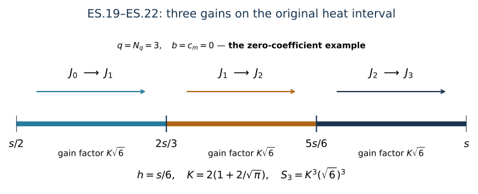

# Electric-curvature smoothing through every finite order

This analytic chapter belongs to Unit 9. The heat equation gains spatial
derivatives at positive heat time. The electric curvature obeys a heat
equation with additional potential and curvature terms. We retain every
one of them and prove how to gain any specified finite number of
derivatives, using only the lowest electric input.

Read [space-time tension](../classical-spacetime-tension.html), especially
ST.9–ST.12 and ST.22–ST.26, and the heat kernel in
[heat analysis](../classical-heat-analysis.html), H9.16–H9.18.
[Potential estimates](../classical-potential-estimates.html), HP.22–HP.24,
supplies the exact conversion between covariant and ordinary derivatives.
The coefficient bounds come from
[fixed-time estimates](../classical-fixed-time-estimates.html) and
[backward heat bounds](../classical-curlfree-backward-heat.html), CF.15.

The proof divides the actual interval \([s/2,s]\) into finitely many
pieces. On each piece the full heat-kernel estimate absorbs its own
forcing. Some pieces propagate the current norm; the last pieces gain
one derivative each. The number of pieces and the resulting constants
are explicit. Physical time is never changed in this construction.

Human-source credit: Sung-Jin Oh,
[*Gauge choice for the Yang–Mills equations using the Yang–Mills heat flow
and local well-posedness in H1*](https://arxiv.org/abs/1210.1558v2)
and [*Finite energy global well-posedness of the Yang–Mills equations
on R1+3*](https://arxiv.org/abs/1210.1557v2).
The complete receiving calculation uses the course proofs linked above;
it makes no novelty claim. Exact reading coverage is recorded in the
course provenance.

**Result.** On the current regular solution and original heat interval
\([0,S]\), every finite ordinary spatial order satisfies

\[
 \|\partial_x^{(q)}E(s)\|_{L^4(I\times\mathbb R^3)}
 \le S_q s^{-q/2}\|E(s/2)\|_{L^4(I\times\mathbb R^3)},
 \qquad 0<s\le S,\quad q\in\mathbb Z_{\ge0}.
 \tag{ES.1}
\]

The finite constants \(S_q\) are constructed explicitly in ES.19 below
from the already proved \(U_j,C_l^F,S\). Consequently

\[
 \left\|s^{q/2+1/4}
       \|\partial_x^{(q)}E(s)\|_{L^4_{t,x}}\right\|_{L^p((0,S],ds/s)}
 \le 2^{1/4}S_q e_0^p,\qquad p=2,\infty.
 \tag{ES.2}
\]

This supplies a replacement for the electric derivative inputs in
ST.22–ST.25 using only ST.11's lowest electric input \(e_0^p\).
It also supplies the missing replacement for \(e_1^p\) in ST.12.
The remaining wave estimates use these quantities as proved inputs.

## 1. Objects, hypotheses already satisfied, and source use

The physical time interval \(I\) is the same compact nondegenerate
interval as in ST. The spatial domain is \(\mathbb R^3\), its measure is
\(d^3x\), physical time has measure \(dt\), and heat time has measure
\(ds/s\) only where explicitly displayed. The original speed is \(c>0\).
We retain \(E_i=F_{ti}\), \(D_j=\partial_j+[a_j,\cdot]\), the caloric
gauge \(a_s=0\), the original matrix bracket, and its proved
Hilbert–Schmidt bound \(|[A,B]|\le2|A||B|\).

For a word \(I_k=(i_1,\ldots,i_k)\in\{1,2,3\}^k\),
\(\partial_{I_k}=\partial_{i_1}\cdots\partial_{i_k}\). The expression
\(\partial^{(k)}E\) contains every word and every output \(i=1,2,3\),
with the Hilbert–Schmidt norm in each matrix entry and the Euclidean
square sum over all word and output labels. Put

\[
 X_k(r):=\|\partial_x^{(k)}E(r)\|_{L^4_{t,x}},\qquad
 A_l(r):=\|\partial_x^{(l)}a(r)\|_{L^\infty_{t,x}},\qquad
 F_l(r):=\|(\partial_x^{(l)}F_{ij}(r))_{i,j=1}^3\|_{L^\infty_{t,x}}.
 \tag{ES.3}
\]

In particular the curvature norm has all nine ordered pairs, including
its three zero diagonal entries. These are the actual tuples, not
component maxima. The already proved inputs are

\[
 A_l(r)\le U_l r^{-l/2-1/4},\qquad
 F_l(r)\le C_l^F r^{-l/2-3/4}.
 \tag{ES.4}
\]

The \(U_l\) are precisely those in ST Section 7, obtained from CF.15,
and the \(C_l^F\) are precisely ST.26. We do not replace their formulas
or their dependence on the existing fixed-time estimates. In
particular \(C_0^F=\sqrt2 H_Fd\). The assumed existence and regularity
are those of the current solution already used in ST; no new existence
or smallness hypothesis is imposed.

Their explicit original coefficient formulas are

\[
\begin{aligned}
 U_l&=3^{(l+1)/2}\overline M_l,\\
 H_l^F&=C_MC_S\sqrt{R_{l+1}R_{l+2}},\\
 C_l^F&=\sqrt2\,3^{l/2}d\,
 b_l\bigl((S^{1/4}\overline M_h)_{0\le h<l};
                         (H_r^F)_{0\le r\le l}\bigr).
\end{aligned}
\]

Here \(b_l\) is exactly the finite reverse-expansion polynomial
HP.24, with its full potential-leaf and covariant-leaf terms.
The base input used in ES.2 is, explicitly, ST.11's

\[
\begin{split}
 e_0^p={}&c d_c\overline P_{3/2}^p
 +|I|^{1/4}cd^2\mathscr R_1\mathfrak H_1^p(1/4)\\
 &+2\mathcal A\,cd^2\mathscr R_0\mathfrak H_0^p(1/8),
 \qquad d_c=\sqrt2(2\pi c)^{-1/4},\qquad p=2,\infty.
\end{split}
\]

The unchanged definitions are ST.3 for \(\mathscr R_l\), ST.6–ST.7
for \(\mathfrak H_l^p\), ST.8 for \(\overline P_{3/2}^p\), and
CF.28 for \(\mathcal A\). In particular the endpoint wave norm,
its wave forcing, \(|I|^{1/4}\), and every factor of the original
speed remain in this input.

For completeness, finiteness of every \(X_k\) on a positive closed
heat interval does not assume ES.1. H9.40 bounds the covariant
curvature in \(L^2\); H9.8 and the next covariant derivatives bound it
in \(L^\infty\). The exact HP.22–HP.24 expansion, with the already
bounded potential derivatives, therefore bounds the ordinary electric
derivatives in both spaces, uniformly in \(t\) and on each such heat
interval. The original positive electric metric contributes the
original factor \(c\) when these bounds are applied to \(E\).
The elementary inequality
\(\|u\|_4\le\|u\|_2^{1/2}\|u\|_\infty^{1/2}\), followed by
integration over \(I\), proves the required finiteness and permits
the following a priori calculations. Those auxiliary upper bounds
are not inserted into the constants \(S_q\).

## 2. The original equation and every differentiated term

Set \((\mu,\nu)=(t,i)\) in H9.35. Its right-hand side is
\(-2\sum_j[E_j,F_{ij}]=2\sum_j[F_{ij},E_j]\). Since \(a_s=0\), this is
exactly

\[
 \partial_r E_i=\sum_jD_jD_jE_i+2\sum_j[F_{ij},E_j].
 \tag{ES.5}
\]

Expanding both covariant derivatives gives

\[
\begin{split}
 (\partial_r-\Delta)E_i={}&
 2\sum_j[a_j,\partial_jE_i]
 +\left[\sum_j\partial_ja_j,E_i\right]
 +\sum_j[a_j,[a_j,E_i]]
 +2\sum_j[F_{ij},E_j].
\end{split}
 \tag{ES.6}
\]

Thus the divergence term and both nested-bracket factors remain.
The equation contains no physical-time derivative and no additional
speed factor: the electric field itself remains \(F_{ti}\), and its
speed dependence remains in ST.11's original bound.

Let \(P_k=\{1,\ldots,k\}\). For each subset of positions, the subword
retains its original order. For every word \(I_k\), define the exact
right-hand side \(N_{I_k,i}=(\partial_r-\Delta)\partial_{I_k}E_i\).
The full Leibniz formula is

\[
\begin{split}
 N_{I_k,i}={}&
 2\sum_j\sum_{J\subseteq P_k}
   [\partial_{I_J}a_j,\partial_{I_{J^c}}\partial_jE_i]\\
 &+\sum_{J\subseteq P_k}
   \left[\sum_j\partial_{I_J}\partial_ja_j,
                       \partial_{I_{J^c}}E_i\right]\\
 &+\sum_j\sum_{J_1\sqcup J_2\sqcup J_3=P_k}
   [\partial_{I_{J_1}}a_j,
      [\partial_{I_{J_2}}a_j,\partial_{I_{J_3}}E_i]]\\
 &+2\sum_j\sum_{J\subseteq P_k}
   [\partial_{I_J}F_{ij},\partial_{I_{J^c}}E_j].
\end{split}
 \tag{ES.7}
\]

Each ordered partition in the third line retains its three distinct
roles. Empty subsets have derivative order zero. Consequently the
coefficient multiplicities are \({k\choose l}\) and
\(k!/(r!h!n!)\), even if some spatial index values coincide.

Let \(N_k\) denote the full word/output tuple in ES.7. Direct
Cauchy–Schwarz in the contracted spatial index, the matrix bracket
bound, and Hölder in the unchanged physical variables prove

\[
\begin{split}
 \|N_k(r)\|_{L^4_{t,x}}\le{}&4 A_0(r)X_{k+1}(r)\\
 &+4\sum_{l=1}^k{k\choose l}A_l(r)X_{k-l+1}(r)\\
 &+2\sqrt3\sum_{l=0}^k{k\choose l}A_{l+1}(r)X_{k-l}(r)\\
 &+4\sum_{r_1+h+n=k}\frac{k!}{r_1!h!n!}
                  A_{r_1}(r)A_h(r)X_n(r)\\
 &+4\sum_{l=0}^k{k\choose l}F_l(r)X_{k-l}(r).
\end{split}
 \tag{ES.8}
\]

Here the \(r\) argument denotes heat time, whereas \(r_1\) in the
fourth line is an integer derivative count. To verify that no output
or word factor is missing, fix a subset or partition of positions.
The map from the full word to the ordered subwords is a bijection
onto the corresponding Cartesian product of word sets. Thus the
square sum of a tensor product is the product of its square sums.
For the first line, the \(j\) contraction has operator bound
\(2|a||\partial E|\); the coefficient two in ES.6 gives four.
For the divergence,
\(\left|\sum_j\partial_j a_j\right|\le\sqrt3|\partial a|\),
which gives \(2\sqrt3\). The two nested brackets give four and
Cauchy–Schwarz handles their shared \(j\). For the last line,
\(\left|(\sum_j[F_{ij},E_j])_i\right|\le2|(F_{ij})_{i,j}||E|\),
again multiplied by the displayed two. The same proofs with the
extra word labels establish every term of ES.8.

In particular all \(k\) one-derivative placements on the first
potential have been retained in the \(l=1\) term. They act on
\(\partial^{(k)}E\), rather than on a presumed lower derivative.

## 3. A finite sum of the original derivative norms

Fix the target heat time \(s\in(0,S]\) for this section. Throughout
\([s/2,s]\), define only numerical upper coefficients

\[
 a_l^*=2^{l/2+1/4}U_l,\qquad
 f_l^*=2^{l/2+3/4}C_l^F.
 \tag{ES.9}
\]

Then \(A_l(r)\le a_l^*s^{-l/2-1/4}\) and
\(F_l(r)\le f_l^*s^{-l/2-3/4}\) on that interval. Every power of two
comes from its actual left endpoint \(s/2\).

For a nonnegative integer \(m\), use the scalar norm sums

\[
 J_m(r)=\sum_{k=0}^m s^{k/2}X_k(r),\qquad
 G_m(r)=\sum_{k=0}^m s^{k/2}X_{k+1}(r).
 \tag{ES.10}
\]

No new field, coordinate, or metric is defined here: these are sums
of norms of the original derivatives with their stated heat weights.
The Laplacian and all terms in ES.7 remain unchanged. This choice of
sum is useful because the one-derivative gain needed at the next
stage is one of the terms already present in \(G_m\).

Define the nonnegative finite numbers

\[
\begin{split}
 b={}&4a_0^*S^{1/4},\\
 c_m={}&4S^{1/4}\sum_{k=1}^m\sum_{l=1}^k{k\choose l}a_l^*\\
 &+2\sqrt3 S^{1/4}\sum_{k=0}^m\sum_{l=0}^k{k\choose l}a_{l+1}^*\\
 &+4\sqrt S\sum_{k=0}^m\sum_{r_1+h+n=k}
                       \frac{k!}{r_1!h!n!}a_{r_1}^*a_h^*\\
 &+4S^{1/4}\sum_{k=0}^m\sum_{l=0}^k{k\choose l}f_l^* .
\end{split}
 \tag{ES.11}
\]

An empty sum is zero. Each new \(k\)-slice is nonnegative, hence
\(c_m\) is nondecreasing in \(m\). Multiplying ES.8 by \(s^{k/2}\)
and summing gives

\[
 \sum_{k=0}^m s^{k/2}\|N_k(r)\|_{L^4_{t,x}}
 \le B_sG_m(r)+C_{m,s}J_m(r),\qquad
 B_s=4a_0^*s^{-1/4},\quad C_{m,s}=c_m/s.
 \tag{ES.12}
\]

Indeed, in a differentiated first-order coefficient with \(l\ge1\),
the ratio to the retained weight on \(X_{k-l+1}\) is exactly
\(s^{-3/4}\). In the divergence and curvature terms the ratio is
also \(s^{-3/4}\); for the double bracket it is \(s^{-1/2}\).
The inequalities
\(s^{-3/4}\le S^{1/4}s^{-1}\) and
\(s^{-1/2}\le\sqrt S\,s^{-1}\) give ES.11. The leading term has
been kept as \(B_sG_m\). Every other derivative index is at most
\(m\), including the \(l=1\) first-order coefficient term, so its
weighted norm is one of the summands of \(J_m\). This proves ES.12.

## 4. Exact spatial heat-kernel bound in the physical space-time norm

Keep H9.16's three-dimensional kernel
\(K_h(x)=(4\pi h)^{-3/2}e^{-|x|^2/(4h)}\).
Its mass is one and
\(\nabla K_h=-xK_h/(2h)\). Direct radial integration gives

\[
\begin{split}
 \|\nabla K_h\|_{L^1_x}
 &=\frac{4\pi}{2h}(4\pi h)^{-3/2}
                     \int_0^\infty \rho^3e^{-\rho^2/(4h)}d\rho\\
 &=\frac{4\pi}{2h}(4\pi h)^{-3/2}(8h^2)
   =\kappa_1h^{-1/2},\qquad \kappa_1=\frac2{\sqrt\pi}.
\end{split}
 \tag{ES.13}
\]

The gradient norm in this equality is the full three-component
Euclidean norm inside the integral. For any finite tuple \(v\),
Minkowski's integral inequality and translation invariance in the
original \(x\) variables imply

\[
 \|K_h*_xv\|_{L^4_{t,x}}\le\|v\|_{L^4_{t,x}},\qquad
 \|\nabla K_h*_xv\|_{L^4_{t,x}}
 \le\kappa_1h^{-1/2}\|v\|_{L^4_{t,x}}.
 \tag{ES.14}
\]

The convolution acts only in \(x\). The physical interval \(I\),
its endpoints, and its measure have not changed. The same argument
works for every tuple in ES.7 with precisely the same constants.

Take a slab \([r_0,r_0+h]\subseteq[s/2,s]\). The actual regular
solution satisfies, for each \(k\le m\),

\[
 \partial^{(k)}E(r_0+\tau)
 =K_\tau*_x\partial^{(k)}E(r_0)
   +\int_0^\tau K_{\tau-\rho}*_xN_k(r_0+\rho)d\rho.
 \tag{ES.15}
\]

To justify this identity directly in \(L^4_{t,x}\), differentiate
\(K_{\tau-\rho}*_x\partial^{(k)}E(r_0+\rho)\) on a truncated
interval \([0,\tau-\epsilon]\), use the original equation and the
heat-kernel equation, and integrate. The regular positive-heat
solution has the finite continuous derivative norms established in
Section 1. The terms therefore converge as \(\epsilon\downarrow0\)
by the strong continuity H9.18 and boundedness of the integrand.
Spatial differentiation of the integral is permitted because
\((\tau-\rho)^{-1/2}\) is integrable and the forcing is bounded on
the closed positive-heat interval. This also establishes the
gradient version of ES.15.

Set

\[
 \mathcal M_m=
  \sup_{0\le\tau\le h}J_m(r_0+\tau)
  +\sup_{0<\tau\le h}\sqrt\tau\,G_m(r_0+\tau).
 \tag{ES.16}
\]

It is finite by the established regularity. ES.12–ES.15 imply

\[
 \mathcal M_m\le(1+\kappa_1)J_m(r_0)
 +\left((2+\pi\kappa_1)B_s\sqrt h
        +(1+2\kappa_1)C_{m,s}h\right)\mathcal M_m.
 \tag{ES.17}
\]

Here are all four convolution coefficients. The undifferentiated
first-order term uses
\(\int_0^\tau\rho^{-1/2}d\rho=2\sqrt\tau\); its zero-order term
uses \(\int_0^\tau d\rho=\tau\). The differentiated first-order
term uses
\(\sqrt\tau\int_0^\tau(\tau-\rho)^{-1/2}\rho^{-1/2}d\rho
=\pi\sqrt\tau\), where \(\rho=\tau\sin^2\theta\) proves the
integral is \(\pi\). The differentiated zero-order term uses
\(\sqrt\tau\int_0^\tau(\tau-\rho)^{-1/2}d\rho=2\tau\).
ES.13 multiplies the last two by \(\kappa_1\). These are precisely
the coefficients in ES.17. Thus, whenever its parenthesized
coefficient is at most \(1/2\),

\[
 \mathcal M_m\le KJ_m(r_0),\qquad K=2(1+\kappa_1).
 \tag{ES.18}
\]

This is absorption in a proved finite norm of the actual solution.
It does not assume a new solution, an inverse heat estimate, or a
bound on a higher electric input.

## 5. A completely finite construction of every smoothing constant

For the desired order \(q\ge0\), define

\[
\begin{aligned}
 m_*&=\max(q-1,0),&
 \alpha&=2+\pi\kappa_1,& \beta&=1+2\kappa_1,\\
 N_q&=\max\left\{1,q,
       \left\lceil8\alpha^2b^2\right\rceil,
       \left\lceil2\beta c_{m_*}\right\rceil\right\},\\
 S_q&=K^{N_q}(2N_q)^{q/2}.
\end{aligned}
 \tag{ES.19}
\]

These are finite explicit integers and constants. No denominator is
zero, including when every input coefficient vanishes. For \(q\ge1\),
only \(U_0,\ldots,U_q\) and \(C_0^F,\ldots,C_{q-1}^F\) are used;
for \(q=0\), only \(U_0,U_1,C_0^F\) are used. The finite original
heat endpoint \(S\) remains in ES.11.

Set
\(h=s/(2N_q)\) and \(r_n=s/2+nh\), \(0\le n\le N_q\).
For every \(m\le m_*\),

\[
 \alpha B_s\sqrt h+\beta C_{m,s}h
 \le\frac{\alpha b}{\sqrt{2N_q}}+
                  \frac{\beta c_{m_*}}{2N_q}
 \le\frac14+\frac14=\frac12.
 \tag{ES.20}
\]

The first inequality uses \(s^{1/4}\le S^{1/4}\) and monotonicity
of \(c_m\). The last inequality follows separately from the two
ceiling terms in ES.19. ES.18 therefore holds on every slab at
every order that will be used.

For the first \(N_q-q\) slabs, apply ES.18 at \(m=0\) and use
\(J_0(r_{n+1})\le KJ_0(r_n)\). On each of the last \(q\) slabs,
gain one derivative. If the incoming order is \(m\), ES.10 gives
the exact identity and following inequalities:

\[
\begin{split}
 J_{m+1}(r_{n+1})
 &=J_m(r_{n+1})+s^{(m+1)/2}X_{m+1}(r_{n+1})\\
 &\le J_m(r_{n+1})+\sqrt s\,G_m(r_{n+1})\\
 &\le \sqrt{2N_q}\left(
     \sup_{0\le\tau\le h}J_m(r_n+\tau)
     +\sup_{0<\tau\le h}\sqrt\tau\,G_m(r_n+\tau)\right)\\
 &\le K\sqrt{2N_q}\,J_m(r_n).
\end{split}
 \tag{ES.21}
\]

In the third line, the coefficient of the first supremum could be
one; \(\sqrt{2N_q}\ge1\) is a valid upper coefficient. The coefficient
of the second is exactly \(\sqrt{s/h}=\sqrt{2N_q}\).
The incoming orders on these last slabs are \(0,1,\ldots,q-1\), so
they are all covered by ES.20.

More explicitly, put
\(k_n=\max(0,n-(N_q-q))\). Starting at
\(J_{k_0}(r_0)=X_0(s/2)\), the finite scalar recurrence is

\[
 L_0=1,\qquad
 L_{n+1}=
 \begin{cases}
 K L_n,&n<N_q-q,\\
 K\sqrt{2N_q}\,L_n,&n\ge N_q-q,
 \end{cases}
 \quad
 J_{k_n}(r_n)\le L_nX_0(s/2).
 \tag{ES.22}
\]

The induction proving its last inequality is exactly ES.18 or
ES.21 at each step. Its final value is
\(L_{N_q}=K^{N_q}(2N_q)^{q/2}=S_q\). Since \(r_{N_q}=s\) and
\(s^{q/2}X_q(s)\le J_q(s)\), ES.1 follows.

At \(q=0\), all slabs use the propagation step, with no derivative
gain; this proves the stated zero-order estimate. It does not
incorrectly assume that the electric \(L^4\) norm is contractive
in the presence of the curvature multiplication term.
At \(s=S\), the same finite slabs have the actual upper endpoint
\(S\). At any \(s>0\), the lower endpoint is strictly positive and
no limit of an unweighted derivative at heat time zero has entered.
If \(d=0\), H9.40 makes the full curvature zero and therefore
\(E=0\); both sides of ES.1 vanish. The construction itself also
handles this case without division by \(d\), whether or not the
chosen potential representative is zero. If \(X_0(s/2)=0\) at any
particular positive slice, the same recurrence directly proves
every claimed later norm zero on the corresponding interval.

## 6. The exact outer heat norm and its receiver

Multiplication of ES.1 by \(s^{q/2+1/4}\) gives

\[
 s^{q/2+1/4}X_q(s)
 \le 2^{1/4}S_q\,(s/2)^{1/4}X_0(s/2).
 \tag{ES.23}
\]

For \(p=2\), substituting \(r=s/2\) in its squared outer integral
gives exactly

\[
\begin{split}
 \int_0^S [s^{q/2+1/4}X_q(s)]^2\frac{ds}{s}
 &\le 2^{1/2}S_q^2
       \int_0^{S/2}[r^{1/4}X_0(r)]^2\frac{dr}{r}\\
 &\le2^{1/2}S_q^2(e_0^2)^2.
\end{split}
 \tag{ES.24}
\]

The exponent in the last expression is a square of the ST.11
quantity whose superscript labels the heat integrability exponent.
For \(p=\infty\), taking the supremum in ES.23 gives the same
factor \(2^{1/4}\) and the supremum over \((0,S/2]\), bounded by
the original one over \((0,S]\). This proves ES.2 in both cases.
The substitution is in the scalar heat integral only; the actual
\(L^4_{t,x}\) norm has always been taken first. No exchange with a
physical-time supremum or a heat integral has occurred.

Define new explicit inputs, retaining the stronger existing
zero-order bound,

\[
 \widehat\eta_0^p=e_0^p,\qquad
 \widehat\eta_q^p=2^{1/4}S_qe_0^p\quad(q\ge1),
 \qquad p=2,\infty.
 \tag{ES.25}
\]

For every \(q\ge0\), the exact covariant derivative formula is

\[
 \partial_I(D_jE_i)=\partial_I\partial_jE_i
   +\sum_{J\subseteq P_q}
             [\partial_{I_J}a_j,\partial_{I_{J^c}}E_i].
 \tag{ES.26}
\]

Its full tuple norm, ES.4, ES.2, and the remaining weight
\(s^{1/4}\le S^{1/4}\) prove

\[
\begin{aligned}
 \widehat\delta_q^p&=\widehat\eta_{q+1}^p
      +2S^{1/4}\sum_{l=0}^q{q\choose l}U_l\widehat\eta_{q-l}^p,\\
 \left\|s^{q/2+3/4}
       \|\partial_x^{(q)}D_xE(s)\|_{L^4_{t,x}}\right\|_{L^p(ds/s)}
 &\le\widehat\delta_q^p,\qquad q\ge0,\quad p=2,\infty.
\end{aligned}
 \tag{ES.27}
\]

In particular the formerly separate first-derivative input can be
bounded without \(\overline P_{5/2}^p\):

\[
 \widehat\delta_0^p=
       (2^{1/4}S_1+2S^{1/4}U_0)e_0^p.
 \tag{ES.28}
\]

The existing ST.11 bound \(e_1^p\) remains another valid bound;
the minimum can be taken when useful. ES.28 is the bound that
has no additional wave input.

Retain the original forcing identity ST.2,
\(Q_i=-2c^{-2}\sum_j[E_j,D_iE_j-2D_jE_i]\).
Differentiating every ordered word, using the full tuple bracket
constant twelve already proved there, and applying physical then
heat Hölder gives

\[
\begin{aligned}
 \widehat Q_q^1&=12c^{-2}\sum_{l=0}^q{q\choose l}
                 \widehat\eta_l^2\widehat\delta_{q-l}^2,\\
 \widehat Q_q^2&=12c^{-2}\sum_{l=0}^q{q\choose l}
      \min\{\widehat\eta_l^\infty\widehat\delta_{q-l}^2,
             \widehat\eta_l^2\widehat\delta_{q-l}^\infty\},\\
 \widehat Q_q^\infty&=12c^{-2}\sum_{l=0}^q{q\choose l}
                    \widehat\eta_l^\infty\widehat\delta_{q-l}^\infty,\\
 \left\|s^{q/2+1}
         \|\partial_x^{(q)}Q(s)\|_{L^2_{t,x}}\right\|_{L^p(ds/s)}
 &\le\widehat Q_q^p,\qquad p=1,2,\infty.
\end{aligned}
 \tag{ES.29}
\]

For each fixed derivative placement, the weights are exactly
\(l/2+1/4\) and \((q-l)/2+3/4\), adding to \(q/2+1\).
Thus no heat contribution is omitted. At \(q=0\), ES.29 gives
the three replacements for ST.12 by using \(e_0^p\) and
\(\widehat\delta_0^p\).

The zero-order replacements can be inserted into ST.16, ST.18,
and ST.21. At every subsequent order, insert \(\widehat Q_q^2\)
and \(\widehat Q_q^\infty\) into the already proved ST.28–ST.32
recurrence. All its other inputs are the existing fixed-time
coefficients. This removes the growth in required wave derivative
orders that entered through ST.22. It retains the actual lowest
wave quantity inside \(e_0^p\), all factors \(c,c^{-2}\), the
physical interval, and the original endpoint wave data.

## 7. Worked example: three derivative gains on the actual interval

In the case \(b=c_m=0\), ES.19 gives \(N_3=3\). For each original
target \(s>0\), the four endpoints are
\(r_0=s/2\), \(r_1=2s/3\), \(r_2=5s/6\), \(r_3=s\), and
\(h=s/6\). ES.21, used successively at \(m=0,1,2\), gives

\[
 J_1(2s/3)\le K\sqrt6 X_0(s/2),\quad
 J_2(5s/6)\le K^2(\sqrt6)^2 X_0(s/2),\quad
 J_3(s)\le K^3(\sqrt6)^3 X_0(s/2).
\]

Here \(K=2(1+2/\sqrt\pi)\) is the proved general constant; it is
not claimed to be sharp for the free heat equation. The example
displays the induction and all original heat endpoints. For nonzero
coefficients use the actual larger integer in ES.19; its first
\(N_q-q\) intervals propagate order zero before the final gains.

*Figure: ES.19–ES.22 with \(q=N_q=3\) and zero coefficient bounds.
Each arrow represents the proved finite estimate, not backward heat
evolution. Reproducible source:*
[figure builder](../build/figures_f09_endpoint_gauge.py).

## 8. Exercises with full solutions

### Exercise 1. Recover the divergence term

Expand \(D_jD_jE_i\) for one fixed \(j\), retaining both
first-order bracket terms before combining them.

**Solution.** The product rule gives

\[
 D_jD_jE_i=\partial_j^2E_i+[\partial_ja_j,E_i]
 +[a_j,\partial_jE_i]+[a_j,\partial_jE_i]
 +[a_j,[a_j,E_i]].
\]

Summing over \(j=1,2,3\) gives the first three terms in ES.6.
The separate curvature term \(2\sum_j[F_{ij},E_j]\) is then
added from ES.5. Neither the divergence nor the inner potential is lost.

### Exercise 2. The differentiated first-order coefficient

In \(\partial_\ell\{2[a_j,\partial_jE_i]\}\), which term still
contains one spatial derivative of \(E\), and why does it belong
to \(J_1\) rather than to an order-zero bound?

**Solution.** The two terms are
\(2[\partial_\ell a_j,\partial_jE_i]\) and
\(2[a_j,\partial_\ell\partial_jE_i]\).
The first has bound \(4A_1X_1\), while the second has bound
\(4A_0X_2\). After multiplying by \(s^{1/2}\), the first is
bounded by \(4a_1^*s^{-3/4}(s^{1/2}X_1)\); the bracketed norm
is a summand of \(J_1\). The second is part of \(B_sG_1\).
Replacing \(X_1\) by \(X_0\) would omit a derivative.

### Exercise 3. Evaluate the gradient-kernel integral

Evaluate \(\int_0^\infty \rho^3e^{-\rho^2/(4h)}d\rho\)
for \(h>0\), and deduce ES.13.

**Solution.** With \(u=\rho^2/(4h)\),
\(\rho^2=4hu\) and \(\rho\,d\rho=2h\,du\), so the integral is
\(8h^2\int_0^\infty ue^{-u}du=8h^2\).
Integration by parts gives the last integral equal to one, with zero
endpoint terms. Multiplication by
\(4\pi(2h)^{-1}(4\pi h)^{-3/2}\) yields
\(2\pi^{-1/2}h^{-1/2}\), the full gradient's \(L^1\) norm.

### Exercise 4. The singular convolution has a finite exact value

Compute \(\int_0^\tau(\tau-\rho)^{-1/2}\rho^{-1/2}d\rho\)
for \(\tau>0\).

**Solution.** Put \(\rho=\tau\sin^2\theta\) for
\(0<\theta<\pi/2\). The numerator becomes
\(2\tau\sin\theta\cos\theta\,d\theta\); the denominator is
\(\tau\sin\theta\cos\theta\). The integral is
\(2\int_0^{\pi/2}d\theta=\pi\). Both endpoint singularities
are integrable, as this substitution also proves. Multiplication by
\(\kappa_1\sqrt\tau\) gives the corresponding term of ES.17.

### Exercise 5. Verify the chosen integer

Prove both quarter bounds in ES.20 directly from ES.19, including
the cases \(b=0\) or \(c_{m_*}=0\).

**Solution.** Since \(N_q\ge8\alpha^2b^2\) and \(N_q\ge1\),
squaring the nonnegative expression gives
\(\alpha^2b^2/(2N_q)\le1/16\), hence
\(\alpha b/\sqrt{2N_q}\le1/4\).
Also \(N_q\ge2\beta c_{m_*}\) gives
\(\beta c_{m_*}/(2N_q)\le1/4\).
When either numerator is zero its inequality follows directly,
without division by that numerator. Their sum is at most one half.

### Exercise 6. The exact heat weight

Derive the factor \(2^{1/4}\) in ES.23 and the upper endpoint
\(S/2\) in ES.24.

**Solution.** ES.1 first gives
\(s^{q/2+1/4}X_q(s)\le S_qs^{1/4}X_0(s/2)\).
The identity \(s^{1/4}=2^{1/4}(s/2)^{1/4}\) gives ES.23.
Squaring and substituting \(r=s/2\) preserves \(ds/s=dr/r\)
and maps \((0,S]\) to \((0,S/2]\). The squared coefficient is
\(2^{1/2}S_q^2\). The remaining integral is bounded by the
original electric norm over \((0,S]\), proving ES.24.

### Exercise 7. Why keep the better zero-order input?

State the order-zero input used in ES.25 and derive ES.28.

**Solution.** The already established bound is \(e_0^p\), so
\(\widehat\eta_0^p=e_0^p\). For order one the new bound is
\(\widehat\eta_1^p=2^{1/4}S_1e_0^p\). Substituting \(q=0\)
in ES.27 retains its single potential bracket contribution:

\[
 \widehat\delta_0^p=2^{1/4}S_1e_0^p+2S^{1/4}U_0e_0^p.
\]

This is ES.28 with both summands retained. Using
\(2^{1/4}S_0e_0^p\) at order zero would give a valid but larger
coefficient; the proved direct bound is stronger.

### Exercise 8. Match both product weights

For derivative placement \(l\) in the electric tension forcing,
verify its total heat exponent and compute \(\widehat Q_0^1\).

**Solution.** The two original exponents add as
\((l/2+1/4)+((q-l)/2+3/4)=q/2+1\).
Physical Hölder uses \(L^4L^4\to L^2\); heat Hölder uses
\(L^2(ds/s)L^2(ds/s)\to L^1(ds/s)\). For \(q=0\),

\[
 \widehat Q_0^1=12c^{-2}e_0^2
    \bigl(2^{1/4}S_1e_0^2+2S^{1/4}U_0e_0^2\bigr).
\]

Both superscripts on \(e_0^2\) label heat exponent two. The
product squares that quantity; the physical factor \(c^{-2}\)
has not been absorbed into its definition.

## Further reading: comparing two connections

[Electric curvature differences](../classical-electric-difference.html),
ED.1–ED.30 including ED.25a–ED.25b, subtracts two actual equations, keeps cancellation in the heat datum and supplies the complete temporal difference input.
