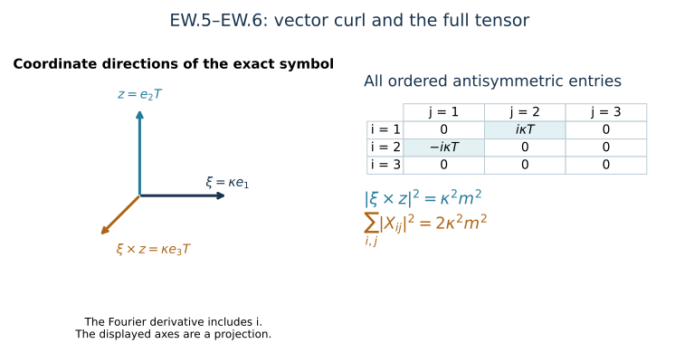

# Endpoint wave bounds and the div–curl identity

This analytic chapter belongs to Unit 9. A wave estimate needs both
initial energy and a bound for its forcing. At the upper heat endpoint,
the potential has a particularly useful temporal gauge condition.
We use it to compute that forcing, then evaluate every coefficient
from the previously proved heat bounds.

Read [potential estimates](../classical-potential-estimates.html),
HP.19–HP.28, [wave energy](../classical-wave-estimates.html), HW.1–HW.5,
and [tension](../classical-tension-null-structure.html), NX.18, first.
The [potential wave chapter](../classical-potential-wave.html), PW.1–PW.3,
supplies the complete quadratic and cubic terms. The lesson retains
physical time, the speed \(c\), and the original interval endpoints.

The geometric step is the exact relation between a vector curl and an
antisymmetric tensor. The factor of two in their squared norms comes
from the two ordered entries for each independent component. The
analytic step is to integrate the complete forcing bound in time.
The result controls the endpoint on the existing regular interval.

**Reading route.** Sections 1–2 establish the equations and the exact
div–curl map. Sections 3–5 evaluate the wave bounds. Section 6 records
local corrections to the source displays, with explicit diagnostics.
The example and eight solved exercises make the main calculations
available without substituting them for the general proof.

Human-source comparison: Sung-Jin Oh,
[*Gauge choice for the Yang–Mills equations using the Yang–Mills heat flow
and local well-posedness in H1*, arXiv:1210.1558v2](https://arxiv.org/abs/1210.1558v2),
original author TeX lines 4110–4346. The derivation below is independent
exposition. The corrections concern the named displays, not the truth
of the paper's theorem.

## 1. Original endpoint fields and signs

Keep the physical coordinates \((t,x^1,x^2,x^3)\), the metric
\(\operatorname{diag}(-c^2,1,1,1)\), \(c>0\), the actual
heat endpoint \(S>0\), and the caloric-temporal solution
already constructed. On \(I=[t_-,t_+]\), with \(t_*\in I\), put

\[
A_i(t,x)=a_i(t,x,S),\quad v_i=\partial_t A_i,\quad
D=\sum_j\partial_jA_j,\quad
W^S=W(t,x,S),\quad w_i^S=w_i(t,x,S).
\tag{EW.1}
\]

Here \(a_t(t,x,S)=0\), hence \(E_i(t,x,S)=v_i\).
\(D\) in this chapter is the displayed ordinary divergence,
not the covariant derivative \(D_\mu^a\).
All matrix norms are the original Hilbert–Schmidt norms.
Spatial derivative tuples contain every ordered word and
every indicated output component. There is no quotient of
the potential by constant or polynomial fields.

NX.2 at \(S\) gives
\(w_t^S=-W^S=\sum_j(\partial_jv_j+[A_j,v_j])\).
PW.1–PW.2 gives the exact spatial covariant divergence of curvature.
Consequently

\[
\begin{aligned}
\partial_tD&=-\sum_j[A_j,v_j]-W^S,\\
\Box_c A_i-\partial_iD&=-N'_i(A)-w_i^S,\\
N'_i(A)&=2\sum_j[A_j,\partial_jA_i]
 -\sum_j[A_j,\partial_iA_j]
 +\sum_j[\partial_jA_j,A_i]
 +\sum_j[A_j,[A_j,A_i]],\\
\Box_c&=-c^{-2}\partial_t^2+\Delta_x .
\end{aligned}\tag{EW.2}
\]

Indeed \(w_i^S=c^{-2}\partial_t^2A_i-G_i(S)\) and
\(G_i(S)=\Delta A_i-\partial_iD+N'_i(A)\).
Substitution proves the second line, including the negative
source sign. The first line retains the physical time component;
there is no cancellation of a physical \(c\) by changing coordinates.

Define the vector curl, with exactly the source's convention,

\[
C_k=(\operatorname{curl}A)_k
 =\sum_{i,j=1}^3\varepsilon_{kij}\partial_iA_j,\qquad
\varepsilon_{123}=1 .
\tag{EW.3}
\]

The ordinary partial derivatives commute. Thus
\(\operatorname{curl}\nabla D=0\), and

\[
\begin{aligned}
\Box_c C={}&-2\operatorname{curl}
     \left(\sum_j[A_j,\partial_jA_i]\right)_{i=1}^3
 +\operatorname{curl}
     \left(\sum_j[A_j,\partial_iA_j]\right)_{i=1}^3\\
&+\operatorname{curl}([A_i,D])_{i=1}^3
 -\operatorname{curl}
     \left(\sum_j[A_j,[A_j,A_i]]\right)_{i=1}^3
 -\operatorname{curl}w^S .
\end{aligned}\tag{EW.4}
\]

The sign of the third term follows from
\(-[D,A_i]=[A_i,D]\). This also proves the compact exact
identity \(\Box_c C=-\operatorname{curl}N'(A)
-\operatorname{curl}w^S\), without discarding any term.

## 2. Exact div–curl map, including the tensor metric

For a spatial three-vector \(B\), define
\(X_{ij}=\partial_iB_j-\partial_jB_i\).
The maps between its full ordered antisymmetric tensor and
the vector curl are

\[
(\operatorname{curl}B)_k
 =\tfrac12\sum_{i,j}\varepsilon_{kij}X_{ij},\qquad
X_{ij}=\sum_k\varepsilon_{kij}(\operatorname{curl}B)_k,\qquad
\sum_{i,j}|X_{ij}|^2=2|\operatorname{curl}B|^2 .
\tag{EW.5}
\]

The identities
\(\sum_k\varepsilon_{kij}\varepsilon_{kpq}
=\delta_{ip}\delta_{jq}-\delta_{iq}\delta_{jp}\) and
\(\sum_{i,j}\varepsilon_{kij}\varepsilon_{\ell ij}
=2\delta_{k\ell}\) prove both compositions and the norm formula.
These are inverse linear maps on the antisymmetric tensors.
They retain all six ordered entries and the original
three-vector metric.

For the Fourier transform HW.1 and every integer \(q\ge0\),
the exact integrated identity is

\[
\|\partial_x^{(q+1)}B\|_2^2
 =\|\partial_x^{(q)}\operatorname{curl}B\|_2^2
  +\|\partial_x^{(q)}\operatorname{div}B\|_2^2
 =\tfrac12\|\partial_x^{(q)}X\|_2^2
  +\|\partial_x^{(q)}\operatorname{div}B\|_2^2 .
\tag{EW.6}
\]

In frequency space,
\(|\xi\times z|^2+|\sum_i\xi_i z_i|^2
=|\xi|^2\sum_i|z_i|^2\), with complex conjugation in every
matrix-entry inner product. Multiply by \(|\xi|^{2q}\)
and the original Plancherel factor \((2\pi)^{-3}\).
HW.27 identifies every ordered derivative. This proves EW.6.
In the derivative-regular class use bounded annular cutoffs
on the actual derivatives and pass in L2, as in PW.
The potential is not replaced by a polynomial representative.

The same calculation proves, with constant exactly one,

\[
\|\partial_x^{(q)}\operatorname{curl}B\|_2
 \le\|\partial_x^{(q+1)}B\|_2,\qquad
\|\partial_x^{(q)}\operatorname{div}B\|_2
 \le\|\partial_x^{(q+1)}B\|_2 .
\tag{EW.7}
\]

These are L2 differential bounds, not a pointwise replacement
of a contracted tensor by its full norm.

## 3. Already proved finite endpoint inputs

Keep \(d,S,R_l,\Gamma_l,C_M,C_S\) and the heat threshold
exactly as in HP.19–HP.21. Define no new assumed estimates.
The proved numerical inputs are

\[
\begin{aligned}
e_l^{(2)}&=cR_ldS^{-l/2},&
e_l^{(\infty)}&=cC_MC_S\sqrt{R_{l+1}R_{l+2}}\,
                       dS^{-l/2-3/4},\\
C_h^0&=C_MC_S\sqrt{\Gamma_h\Gamma_{h+1}}\,
                       S^{-h/2-1/4},&
D_h^0&=\Gamma_{h-1}S^{-(h-1)/2}\quad(h\ge1).
\end{aligned}\tag{EW.8}
\]

The superscript \(0\) distinguishes the initial constants
from the vector curl \(C\) and divergence \(D\). It changes
neither formula nor original input. In particular \(D_h^0\)
bounds the full initial derivative tuple, rather than just
one component.

Use the exact polynomial HP.24:

\[
b_0=y_0,\qquad
b_{k+1}
 =\sum_{h=0}^{k-1}x_{h+1}\frac{\partial b_k}{\partial x_h}
  +\sum_{l=0}^k(y_{l+1}+2x_0y_l)
                    \frac{\partial b_k}{\partial y_l}.
\tag{EW.9}
\]

It records the full signed expansion obtained from
\(\partial_j=D_j^a-\operatorname{ad}(A_j)\) by bounding
each bracket by twice the product of its original factors.
No covariant derivatives are commuted. Each polynomial is
linear in \(y\), and every monomial has
\(\sum_\nu(h_\nu+1)+l=k\). Empty lists and sums retain
their actual empty value.

For original elapsed time \(\theta\ge0\), HP.26–HP.28 proves

\[
\begin{aligned}
P_0(\theta)&=C_0^0+\theta e_0^{(\infty)},\\
P_h(\theta)&=C_h^0+\int_0^\theta
 b_h((P_j(u))_{j<h};(e_l^{(\infty)})_{l\le h})\,du
                       &&(h\ge1),\\
Q_h(\theta)&=D_h^0+\int_0^\theta
 b_h((P_j(u))_{j<h};(e_l^{(2)})_{l\le h})\,du
                       &&(h\ge1),\\
\mathsf U_h(\theta)&=3^{(h+1)/2}P_h(\theta),\\
\mathsf A_h(\theta)&=3^{(h+1)/2}Q_h(\theta)&& (h\ge1),\\
\mathsf V_h(\theta)&=3^{(h+1)/2}
 b_h((P_j(\theta))_{j<h};(e_l^{(2)})_{l\le h}) .
\end{aligned}\tag{EW.10}
\]

These bound, respectively, the full
\(\|\partial^{(h)}A(t)\|_\infty\),
\(\|\partial^{(h)}A(t)\|_2\), and
\(\|\partial^{(h)}v(t)\|_2\), at \(\theta=|t-t_*|\).
For each fixed order the formulas are finite polynomials
with nonnegative coefficients. Their coefficients retain
physical dimensions. There is no sum of quantities of
different derivative order without its displayed factor.

The covariant bounds HT.23 and NX.18, followed by the very
same exact polynomial expansion, give the endpoint constants

\[
\begin{aligned}
\mathsf Z_q(\theta)
 &=cd^2\,3^{q/2}
 b_q((P_j(\theta))_{j<q};
                  (K_l S^{-l/2-1/4})_{l\le q}),\\
\mathsf T_q(\theta)
 &=d^2\,3^{(q+1)/2}
 b_q((P_j(\theta))_{j<q};
                  (K_l^w S^{-l/2-1/4})_{l\le q}),\\
\|\partial_x^{(q)}W^S(t)\|_2&\le\mathsf Z_q(\theta),&
\|\partial_x^{(q)}w^S(t)\|_2&\le\mathsf T_q(\theta).
\end{aligned}\tag{EW.11}
\]

For the first line there is one temporal output and \(3^q\)
words; for the second there are three spatial outputs.
All \(K_l,K_l^w\) already have complete finite recurrences.
Factoring \(cd^2\) or \(d^2\) out of \(b_q\) is exactly
its proved linearity in the single curvature/tension leaf.
There is no division by \(d\); \(d=0\) is included.

For completeness the actual endpoint belongs to L6.
Its initial value is the DeTurck endpoint from HP.21, so
\(\|A(t_*)\|_6\le C_SD_1^0\). Since \(v\in L^2\) and
\(\partial v\in L^2\), the established Sobolev inequality
gives \(\|v(t)\|_6\le C_S\mathsf V_1(\theta)\).
The exact time integral \(A(t)=A(t_*)+\int_{t_*}^t v(r)dr\)
then gives

\[
\|A(t)\|_6\le
\mathsf L_6(\theta):=
C_S D_1^0+C_S\int_0^\theta\mathsf V_1(u)\,du .
\tag{EW.12}
\]

Thus the cubic estimate below does not silently assume
an undifferentiated L2 potential or omit a constant field.

## 4. Every nonlinear derivative and the divergence estimate

For an ordered word \(I\), \(\partial_I\mathcal B(A,A)\)
is the sum over every subset \(J\) of its positions of
\(\mathcal B(\partial_{I_J}A,\partial_{I_{J^c}}A)\);
the internal derivative in PW.2 commutes with the ordinary
word. Similarly \(\partial_I\mathcal C(A,A,A)\) is the sum
over all ordered partitions of the positions into three
subsets, with each subword in its original order. This is
an equality of ordered matrix expressions, proved by the
ordinary Leibniz rule one derivative at a time.

For each \(q\ge1\) and \(r+h+n=q\), let
\(\rho=(r,h,n)\) and let \(j(\rho)\) be the first position
in the displayed order \(1,2,3\) with \(\rho_j>0\). Set

\[
\begin{aligned}
\mathsf C_0(\theta)&=4\mathsf L_6(\theta)^3,\\
\mathsf C_q(\theta)&=
4\sum_{\substack{r,h,n\ge0\\r+h+n=q}}
 \frac{q!}{r!h!n!}\,
 \mathsf A_{\rho_{j(\rho)}}(\theta)
 \prod_{\substack{i=1,2,3\\i\ne j(\rho)}}\mathsf U_{\rho_i}(\theta)
                                      &&(q\ge1),\\
\mathsf N_q(\theta)&=
\sum_{l=0}^q {q\choose l}
 \left(6\mathsf U_l(\theta)\mathsf A_{q-l+1}(\theta)
       +2\mathsf A_{l+1}(\theta)\mathsf U_{q-l}(\theta)\right)
 +\mathsf C_q(\theta),\\
\|\partial_x^{(q)}N'(A(t))\|_2&\le\mathsf N_q(\theta).
\end{aligned}\tag{EW.13}
\]

The first quadratic contribution retains the two original
coefficients four and two through their sum six in PW.3;
the divergence contribution retains its bracket coefficient two.
In that term the differentiated divergence factor is put in
L2. The exact integrated bound EW.7 gives
\(\|\partial^{(l)}D\|_2\le\|\partial^{(l+1)}A\|_2\),
so its coefficient is two, with no pointwise contraction loss.
The other factor is put in L infinity. This avoids an undefined
\(\mathsf A_0\). The pointwise contraction bound also gives a valid larger coefficient
\(2\sqrt3\). EW.6–EW.7 proves the stronger integrated bound used here.
The cubic has two bracket factors, hence four.
For \(q=0\), its three actual L6 factors give L2. For \(q>0\),
the specified positive-order factor is put in L2 and the
other two in L infinity. Choosing which factor supplies a
norm does not reorder or alter the matrix product.
The binomial and multinomial counts group all ordered
position subsets, and none is deleted. Full tensor product
norms factor; contracted output indices satisfy
Cauchy–Schwarz exactly as PW.3. This proves EW.13.

Differentiating the first equation EW.2 now yields

\[
\begin{aligned}
\|\partial_x^{(q)}\partial_tD(t)\|_2
 &\le\mathsf R_q(\theta):=
  2\sum_{l=0}^q{q\choose l}
       \mathsf U_l(\theta)\mathsf V_{q-l}(\theta)
  +\mathsf Z_q(\theta),\\
\|\partial_x^{(q)}D(t)\|_2
 &\le\mathsf L_q(\theta):=
 D_{q+1}^0+\int_0^\theta\mathsf R_q(u)\,du .
\end{aligned}\tag{EW.14}
\]

The contraction \(\sum_j[A_j,v_j]\) is bounded by
\(2|A||v|\) on the full three-vectors. Every derivative
subset remains. The initial bound is \(D_{q+1}^0\)
with coefficient one by EW.7, not a pointwise divergence
estimate. The oriented fundamental theorem followed by
its absolute integral proves the second line on both
sides of \(t_*\). These are explicit finite polynomials.

## 5. Complete endpoint wave bounds, with finite time integrals

Write
\(\theta_+=t_+-t_*\), \(\theta_-=t_*-t_-\),
\(\Theta=\max(\theta_+,\theta_-)\) and
\(|I|=\theta_++\theta_-\). For a nonnegative polynomial \(H\), define

\[
\mathfrak I_1(H)=\int_0^\Theta H(u)\,du,\qquad
\mathfrak I_2(H)=
 \left(\int_0^{\theta_+}H(u)^2du+
       \int_0^{\theta_-}H(u)^2du\right)^{1/2}.
\tag{EW.15}
\]

These retain both actual endpoints. They are computed by
integrating every monomial; the square contains all cross
terms before integration. For example, if
\(H(u)=\sum_{j=0}^J h_j u^j\),

\[
\begin{aligned}
\mathfrak I_1(H)
 &=\sum_{j=0}^J\frac{h_j\Theta^{j+1}}{j+1},\\
\mathfrak I_2(H)^2
 &=\sum_{j,k=0}^J\frac{h_jh_k}{j+k+1}
       \left(\theta_+^{j+k+1}+\theta_-^{j+k+1}\right).
\end{aligned}\tag{EW.16}
\]

The source's interval can be recovered by its actual symmetric
choice, but no such choice has replaced the original interval here.

For every integer \(k\ge1\), define

\[
\begin{aligned}
\mathsf H_{k-1}(\theta)
 &=\mathsf L_k(\theta)+\mathsf N_{k-1}(\theta)
                             +\mathsf T_{k-1}(\theta),\\
\mathsf E_k^0
 &=\left((D_k^0)^2+c^{-2}\mathsf V_{k-1}(0)^2\right)^{1/2},\\
\mathcal W_c^k(A;I)
 &\le\mathsf E_k^0+
 c\mathfrak I_1(\mathsf H_{k-1})
 +c|I|^{1/2}\mathfrak I_2(\mathsf H_{k-1}) .
\end{aligned}\tag{EW.17}
\]

Here \(\mathcal W_c^k\) is the actual derivative-regular wave
quantity PW uses: the full energy supremum plus
\(c|I|^{1/2}\|\partial_x^{(k-1)}\Box_c A\|_{L^2_{t,x}}\).
Its first derivative-regular domain was proved in PW.
EW.2 and EW.13–EW.14 prove the forcing bound
\(\|\partial^{(k-1)}\Box_cA(t)\|_2
\le\mathsf H_{k-1}(|t-t_*|)\). HW.5 then gives the energy
supremum contribution \(c\mathfrak I_1\).
Integrating the forcing square on the two original sides of
\(t_*\) gives the second contribution exactly as EW.15.
The initial energy uses \(D_k^0\), the full original initial
derivative bound, and the physical \(c^{-2}\) temporal factor.
This proves every term in EW.17; no unknown endpoint wave
norm appears on its right.

The curl has the corresponding complete estimate

\[
\begin{aligned}
\mathsf H^{\rm curl}_{k-1}(\theta)
 &=\mathsf N_k(\theta)+\mathsf T_k(\theta),\\
\mathsf E^{\rm curl,0}_k
 &=\left((D_{k+1}^0)^2+c^{-2}\mathsf V_k(0)^2\right)^{1/2},\\
\|\operatorname{curl}A\|_{\mathsf S_c^k(I)}
 &\le\mathsf E^{\rm curl,0}_k+
 c\mathfrak I_1(\mathsf H^{\rm curl}_{k-1})
 +c|I|^{1/2}\mathfrak I_2(\mathsf H^{\rm curl}_{k-1}) .
\end{aligned}\tag{EW.18}
\]

EW.4 and EW.7 give
\(\|\partial^{(k-1)}\Box_c\operatorname{curl}A\|_2
\le\mathsf N_k+\mathsf T_k\).
EW.7 also gives both initial energy terms.
The curl itself is L2 by the already proved \(A_1\) bound,
so the norm, rather than just its extension, is appropriate.
The same energy proof completes EW.18.

As a check on the highest physical derivative, EW.6 applied
to the original \(v\) gives, for \(M\ge1\),

\[
\|\partial_x^{(M)}v(t)\|_2^2
 =\|\partial_x^{(M-1)}\partial_t C(t)\|_2^2
  +\|\partial_x^{(M-1)}\partial_t D(t)\|_2^2
 \le c^2\|C\|_{\mathsf S_c^M(I)}^2+
             \mathsf R_{M-1}(\Theta)^2 .
\tag{EW.19}
\]

Thus the exact div–curl route also supplies the top temporal
derivative, with the original speed. It agrees with the
direct HP bound \(\mathsf V_M\); neither requires an
unproved top derivative on the right.
For \(1\le k\le30\) and the additional curl norm \(k=30\),
EW.17–EW.18 furnish the entire endpoint range used by the
source's finite system. Every input is one of the previously
proved \(R,\Gamma,K,K^w,b,P,Q\) coefficients and \(d,S,c,I\).
Higher finite ranges follow from the same proved formulas.

This is an endpoint estimate on the existing regular interval.
It does not by itself control the heat-dependent physical wave
forcing norms \(\mathcal F_k^p\), prove extension beyond the
interval, or settle the final finite coupled wave closure.
Their proofs belong to the subsequent analytic chapters.

## 6. Visible source corrections and explicit checks

Source line 4155 writes a negative curl of three quadratic
terms, while its preceding line 4149 has two positive ones.
Its displayed curl equation minus EW.4 is exactly

\[
-2\operatorname{curl}
 \left([A_i,D]+\sum_j[A_j,\partial_iA_j]\right)_{i=1}^3 .
\tag{EW.20}
\]

This is not identically zero. Retain local coordinates and
original amplitudes \(\kappa,\lambda\), and take on a ball

\[
A_1=\kappa x^1T_1,\qquad
A_2=\lambda(x^2)^2T_2,\qquad A_3=0,\qquad
K=[T_1,T_2].
\tag{EW.21}
\]

Then \(D=\kappa T_1+2\lambda x^2T_2\),
\(\sum_j[A_j,\partial_iA_j]=0\), and
\(([A_i,D])_i=(2\kappa\lambda x^1x^2K,
-\kappa\lambda(x^2)^2K,0)\).
Its curl is \((0,0,-2\kappa\lambda x^1K)\).
Therefore the defect EW.20 is
\((0,0,4\kappa\lambda x^1K)\).
A smooth spatial cutoff equal to one on that ball supplies
a compactly supported test with the same local defect.
This is an algebraic diagnostic, not a claimed solution.

Source line 4201 assigns coefficient \(1/2\) to the
three-vector curl norm. EW.5–EW.6 proves that coefficient
belongs to the full ordered antisymmetric tensor, while
the vector curl coefficient is one. The exact comparison
map explains the two metrics and preserves their relationship.

Source line 4242 uses derivative order 30 on its curl forcing
while the displayed energy is of order 30. The actual energy
requires order 29 on the curl forcing, hence order 30 on
the original \(N'\) and \(w^S\), precisely EW.18.
This correction is necessary to keep its stated finite
derivative count. No failure of the source's theorem is
inferred from these local display corrections.

The stronger receiving consequence is that the previously
proved HP endpoint polynomials already remove the unknown
endpoint wave norms from this part of the estimate:
EW.17–EW.18 are explicit finite bounds.
This is a consequence within this course's existing proof
chain, not a novelty claim. The remaining heat-dependent
wave closure is not assumed.

## 7. Worked example: both curl conventions at one frequency

Choose an original nonzero frequency \(\xi=(\kappa,0,0)\),
\(\kappa>0\), and a matrix-valued Fourier amplitude
\(z=(0,T,0)\), where \(|T|_{\rm HS}=m\).
The derivative amplitude is \(i\xi_i z_j\). Thus the divergence
amplitude is zero, the curl is \((0,0,i\kappa T)\), and the full
antisymmetric tensor has exactly the entries
\(X_{12}=i\kappa T\), \(X_{21}=-i\kappa T\).
Consequently

\[
 |\xi|^2|z|^2=\kappa^2m^2,
 \qquad |\xi\times z|^2=\kappa^2m^2,
 \qquad \sum_{i,j}|X_{ij}|^2=2\kappa^2m^2.
\]

This is an exact Fourier-symbol calculation, not an integrable plane
wave asserted to be a finite-energy solution. Plancherel in EW.6
integrates this identity for the original admissible fields.

*Figure: exact symbol and the two tensor entries in EW.5–EW.6. The
parameters \(\kappa\) and \(m\) remain symbolic; the arrows indicate
coordinate directions. Reproducible source:*
[figure builder](../build/figures_f09_endpoint_gauge.py).

## 8. Exercises with full solutions

### Exercise 1. Recover all tensor entries from the curl

For \(C=(C_1,C_2,C_3)\), write the matrix \((X_{ij})\) in EW.5
and verify the norm relation directly.

**Solution.** The formula \(X_{ij}=\sum_k\varepsilon_{kij}C_k\)
gives

\[
 (X_{ij})=\begin{pmatrix}0&C_3&-C_2\\-C_3&0&C_1\\C_2&-C_1&0\end{pmatrix}.
\]

Each \(C_k\) appears twice, once with each sign. Squaring the full
Hilbert–Schmidt tuple norm gives \(2\sum_k|C_k|^2\), including all
three zero diagonal entries. Contracting the displayed matrix with
\(\varepsilon_{kij}/2\) returns \(C_k\) for each \(k\).

### Exercise 2. The longitudinal part

At a nonzero real frequency \(\xi\), let \(z=\xi T\). Compute both
terms on the right of EW.6 at that frequency.

**Solution.** Antisymmetry gives \(\xi\times(\xi T)=0\).
The divergence amplitude is \(i|\xi|^2T\), whose squared norm is
\(|\xi|^4|T|^2\). The derivative amplitude has squared norm
\(|\xi|^2|z|^2=|\xi|^4|T|^2\). Thus the entire derivative energy
in this example is carried by divergence. Curl alone cannot recover it.

### Exercise 3. The first two reverse-expansion polynomials

Compute \(b_1,b_2\) from EW.9, retaining each contribution.

**Solution.** The empty first sum for \(k=0\) gives
\(b_1=y_1+2x_0y_0\). At the next step,
\(x_1\partial_{x_0}b_1=2x_1y_0\),
\((y_1+2x_0y_0)\partial_{y_0}b_1=2x_0y_1+4x_0^2y_0\), and
\((y_2+2x_0y_1)\partial_{y_1}b_1=y_2+2x_0y_1\).
Their sum is

\[
 b_2=2x_1y_0+2x_0y_1+4x_0^2y_0+y_2+2x_0y_1.
\]

The two separate \(2x_0y_1\) contributions come from different
derivative placements. Every term is linear in a single \(y\) leaf.

### Exercise 4. An asymmetric physical interval

Let \(H(u)=h_0+h_1u\), with nonnegative coefficients. Evaluate
both functionals EW.15 for arbitrary \(\theta_+,\theta_-\ge0\).

**Solution.** With \(\Theta=\max(\theta_+,\theta_-)\),

\[
 \mathfrak I_1(H)=h_0\Theta+\tfrac12h_1\Theta^2,
\]

\[
 \mathfrak I_2(H)^2=h_0^2(\theta_++\theta_-)
 +h_0h_1(\theta_+^2+\theta_-^2)
 +\tfrac13h_1^2(\theta_+^3+\theta_-^3).
\]

The mixed term follows by integrating \(2h_0h_1u\) on each side.
Taking the nonnegative square root supplies \(\mathfrak I_2\).
The supremum of an integral from the anchor uses the larger side;
the squared forcing norm adds both sides.

### Exercise 5. Test the curl sign

For the local connection in EW.21, compute the third component of
the defect EW.20 without using the stated answer.

**Solution.** Each \([A_j,\partial_iA_j]\) vanishes because both
factors have the same matrix generator. Set
\(V_i=[A_i,D]\). Then
\(V_1=2\kappa\lambda x^1x^2K\),
\(V_2=-\kappa\lambda(x^2)^2K\), and \(V_3=0\).
Therefore
\(\partial_1V_2-\partial_2V_1=-2\kappa\lambda x^1K\).
Multiplication by the coefficient \(-2\) in EW.20 gives
\(4\kappa\lambda x^1K\). It can be nonzero whenever the generators
do not commute, so the sign difference cannot be removed by an identity.

### Exercise 6. Count the derivative placements

Differentiate \([A,[B,C]]\) twice with ordered derivatives
\(\partial_i\partial_j\). Describe every term and explain why the
number is nine even when \(i=j\).

**Solution.** Each derivative chooses one of the three labelled factors.
The three terms with both choices on one factor are
\([\partial_i\partial_jA,[B,C]]\),
\([A,[\partial_i\partial_jB,C]]\), and
\([A,[B,\partial_i\partial_jC]]\).
The other six are
\([\partial_iA,[\partial_jB,C]]\),
\([\partial_jA,[\partial_iB,C]]\),
\([\partial_iA,[B,\partial_jC]]\),
\([\partial_jA,[B,\partial_iC]]\),
\([A,[\partial_iB,\partial_jC]]\), and
\([A,[\partial_jB,\partial_iC]]\).
For \(i=j\), paired expressions agree but occur twice in the
Leibniz expansion. Matrix bracket order is unchanged in all nine terms.

### Exercise 7. Read the forcing order from the energy

For an integer \(k\ge1\), state the spatial derivative order needed
on \(\Box_c C\) to control the order-\(k\) wave energy of \(C\),
and then the order needed on \(N'\) and \(w^S\).

**Solution.** Apply the order-one wave energy identity to
\(\partial^{(k-1)}C\). Its forcing is
\(\partial^{(k-1)}\Box_c C\). EW.4 adds one curl derivative,
so EW.7 bounds it by order \(k\) derivatives of \(N'\) and
\(w^S\). In particular \(k=30\) uses 29 derivatives of the curl
forcing and 30 of the original two fields. No order-31 input is needed.

### Exercise 8. Preserve the physical speed

Derive the coefficient of the curl wave norm in EW.19.

**Solution.** In the order-\(M\) wave energy of \(C\), the temporal
term is \(c^{-2}\|\partial^{(M-1)}\partial_tC\|_2^2\).
Thus this derivative's squared norm is at most
\(c^2\|C\|_{\mathsf S_c^M(I)}^2\). Apply EW.6 to \(v\), and use
\(\operatorname{curl}v=\partial_tC\),
\(\operatorname{div}v=\partial_tD\). EW.14 bounds the second term
by \(\mathsf R_{M-1}(\Theta)^2\). Adding proves exactly EW.19.
