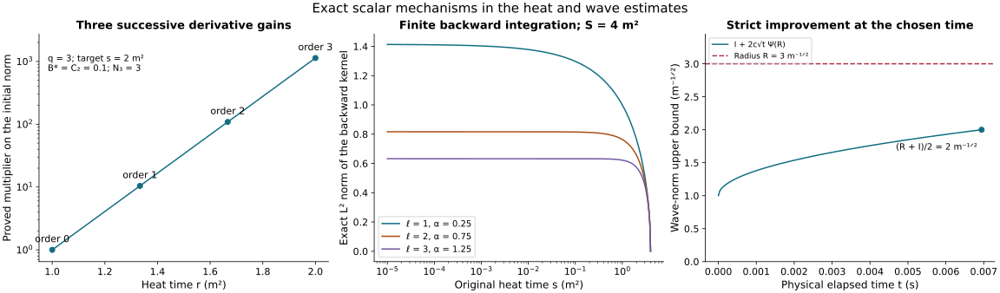

# A finite wave bound and its physical gauge receiver

This analytic chapter belongs to Unit 9. We now combine every term of
the original wave equation. The preceding estimates reduce their
coefficient dependence to six low-order wave norms. A complete
continuity argument bounds those six norms on an explicit positive
physical interval. The same interval then controls every specified
finite derivative order.

Read [wave interactions](../classical-wave-interactions.html),
[spatial smoothing](../classical-spatial-smoothing.html), and
[tension forcing](../classical-tension-forcing.html), together with
[endpoint wave bounds](../classical-endpoint-wave.html) and
[physical temporal gauge](../classical-physical-gauge.html).
The original wave-energy inequality is HW.31 in
[wave estimates](../classical-wave-estimates.html).

The interval throughout is part of the already existing regular
solution. The final section evaluates the exact physical gauge map.
Regular continuation and convergence from energy data require the
subsequent proofs; this chapter establishes the uniform estimates
they receive.

Human-source credit: Sung-Jin Oh,
[*Gauge choice for the Yang–Mills equations using the Yang–Mills heat flow
and local well-posedness in H1*, arXiv:1210.1558v2](https://arxiv.org/abs/1210.1558v2).
This is independent exposition of the complete receiving arguments. It
makes no novelty claim. Exact author-source and local-provider reading
coverage is retained in the course provenance.

## 1. The initial norms come from the data, including the time derivative

Let the anchor \(t_*\) be the one used in the caloric-temporal construction.
The positive curvature norm is the original conserved quantity

\[
d^2=c^{-2}\sum_i\|E_i(t,0)\|_2^2
       +\sum_{i<j}\|F_{ij}(t,0)\|_2^2
       =\frac{g_{\mathrm{YM}}^2}{\hbar c}\mathcal E_{\mathrm{YM}}.
\tag{FC.1}
\]

S is the actual positive interval already chosen in HP.19, with
\(S^{1/4}d\le\epsilon_*\) and \(S\le S_R\) for the reference datum. No coordinate
or field is rescaled. Evaluate HT.26 and HT.39 at \(t=t_*\) and define

\[
\begin{aligned}
\mathcal B_m^*[v]&=b_m((S^{1/4}M_h(t_*))_{h<m};(v_l)_{l\le m}),\\
L_k^{2,*}&=\mathcal B_k^*[(\sqrt6R_l)_{l\le k}],\qquad
L_k^{\infty,*}=\mathcal B_k^*[(\sqrt6R_{l+1})_{l\le k}],\\
J_k^p&=3^{(k+1)/2}dL_k^{p,*},\qquad p=2,\infty.
\end{aligned}\tag{FC.2}
\]

The J here are initial scalar bounds, not the temporal finite kernels
in NX.38. HT.40 proves
\(\|s^{(k+1)/2}\partial^{(k)}G(t_*,s)\|_{L^p(ds/s;L^2_x)}\le J_k^p\).
All full output entries are included in the factor \(3^{(k+1)/2}\).

Retain the four original terms of HT.36 for \(\partial_tG\). To write their
already proved initial constants explicitly, set

\[
\begin{aligned}
C_l&=12\,3^{(l+1)/2}C_MC_S
  \sum_{r=0}^l{l\choose r}\sqrt{R_{r+1}R_{r+2}}R_{l-r},\\
H_0&=C_MC_S\sqrt{K_1K_2},\qquad
\Lambda_h^*=\mathcal B_h^*[(C_MC_S\sqrt{K_{l+1}K_{l+2}})_{l\le h}],\\
A_h^*&=\frac{2\Lambda_h^*}{h}\quad(h\ge1),\\
T_m^\infty&=3^{(m+1)/2}\{
 \sqrt3cd\mathcal B_m^*[(R_{l+2})_{l\le m}]
 +cd^2S^{1/4}(\mathcal B_m^*[C]+\mathcal B_m^*[(K_{l+1})_{l\le m}])
 +2cd^3\sqrt S(\frac{2}{e}H_0L_m^{\infty,*}
       +\sum_{h=1}^m{m\choose h}A_h^*L_{m-h}^{\infty,*})\},\\
T_m^2&=3^{(m+1)/2}\{
 \sqrt3cd\mathcal B_m^*[(R_{l+1})_{l\le m}]
 +cd^2S^{1/4}(\sqrt2\mathcal B_m^*[C]+\mathcal B_m^*[(K_l)_{l\le m}])
 +2cd^3\sqrt S(\frac{2}{e}H_0L_m^{2,*}
       +\sum_{h=1}^m{m\choose h}A_h^*L_{m-h}^{2,*})\}.
\end{aligned}\tag{FC.3}
\]

Here \(b_m\) is HP.24's finite reverse-derivative polynomial, all lists run
through the indicated order, and empty sums are zero. The factor
\(A_h^*\) is exactly the coefficient of \(s^{h/2}\) in the individual ordinary
derivative bound for \(a_t\) in HT.42. The term with \(h=0\) retains its distinct
attained logarithmic maximum 2/e. HT.45–HT.52 prove every line of FC.3:
the four terms are \(D_jD_jE_i\), \(2[F_{ij},E_j]\), \(D_iW\) and \(-[a_t,G_i]\).
Thus \(T_m^p\) bounds
\(\|s^{m/2+1}\partial^{(m)}\partial_tG(t_*,s)\|_{L^p(ds/s;L^2_x)}\).

The actual wave energy at the anchor is the square root of the sum of
the spatial square and \(c^{-2}\) times the temporal square. Therefore

\[
\begin{aligned}
\mathsf I_k^p&=\sqrt{(J_k^p)^2+c^{-2}(T_{k-1}^p)^2},\\
\left\|s^{(k+1)/2}E_{k-1}(G(s);t_*)\right\|_{L^p(ds/s)}
 &\le\mathsf I_k^p,\qquad k\ge1,\quad p=2,\infty,\\
\mathsf I&=\sum_{k=1}^3(\mathsf I_k^2+\mathsf I_k^\infty).
\end{aligned}\tag{FC.4}
\]

For \(p=2\) the equality between the squared combined integral and the sum
of its two squared integrals proves the bound. For \(p=\infty\) take the
two proved suprema before the square root. Hence these are explicit
initial-data bounds; no physical wave forcing is assumed bounded here.

## 2. Fix a numerical horizon without altering the physical interval

Choose a finite \(H>0\) in the original physical-time units. It is an upper
bound on the length of intervals under consideration, not a replacement
for their endpoints. All fixed-time polynomials \(P_h,Q_h,M_h\) are
nondecreasing in \(\theta=|t-t_*|\). Evaluate them at H when constructing
upper coefficients, and write \(M_h[H]\) for these numbers. The same operation
on their nonnegative reverse polynomials bounds every \(U_h,C_h^F,\Lambda_h,X_h\) and \(L_h^p\) used by the receiving estimates.

The endpoint wave quantities are also bounded without a wave unknown.
Using EW.17's named polynomials, define for every integer \(k\ge1\)

\[
\Omega_k(H)=\mathsf E_k^0+2cH\mathsf H_{k-1}(H),\qquad
\Omega_{k+1/2}(H)=\sqrt{\Omega_k(H)\Omega_{k+1}(H)}.
\tag{FC.5}
\]

If \(|I|\le H\), \(\theta_++\theta_-=|I|\) and \(\Theta\le H\). Monotonicity gives
\(\mathfrak I_1(\mathsf H)\le H\mathsf H(H)\) and
\(\mathfrak I_2(\mathsf H)\le\sqrt{|I|}\mathsf H(H)\). Both contributions of EW.17
are therefore at most \(cH\mathsf H(H)\), proving \(W_k(S;I)\le\Omega_k(H)\).
The half-order comparison is the exact HW.32 interpolation, valid for
the derivative-regular extension proved in PW. The original interval
and its two endpoints remain in the underlying equations.

In the ES smoothing constants evaluate every \(U_h,C_h^F\) at this horizon
before taking its finite integer ceilings. Those constants are now
fixed numbers depending on the data, S and H. They have no dependence
on any unknown wave norm. Their possible jumps as H varies will play
no role: H is fixed throughout the following continuity argument.

## 3. Assemble the exact forcing before using continuity

For spatial output i, the complete original equation is

\[
\begin{aligned}
\Box_cG_i={}&-2\sum_j[a_j,\partial_jG_i]
-\left[\sum_j\partial_ja_j,G_i\right]
-\sum_j[a_j,[a_j,G_i]]-2\sum_j[F_{ij},G_j]\\
&-2c^{-2}[E_i,W]
+2c^{-2}[a_t,\partial_tG_i]
+c^{-2}[\partial_ta_t,G_i]+c^{-2}[a_t,[a_t,G_i]]\\
&-\sum_jD_jD_jw_i+D_i\sum_jD_jw_j
       -2\sum_j[F_{ij},w_j]-Q_i,\\
F_{ij}&=\partial_i a_j-\partial_j a_i+[a_i,a_j],\qquad
Q_i=-2c^{-2}\sum_j[E_j,D_iE_j-2D_jE_i].
\end{aligned}\tag{FC.6}
\]

This is NX.20–NX.21, with the full spatial-pair cancellation in ST.1–ST.2
and the raising of the temporal index checked in PI.11. No ordinary
connection term or curvature contribution is discarded. All differentiated
versions distribute every ordered derivative among the original factors.

The complete bounds now have a finite set of inputs. Use the following
specific choices so the numerical construction is unambiguous:

- g is the actual lowest heat norm \(G_4^2\). HS.7–HS.15 constructs \(B_j,D_G,H_G\) and \(\Gamma_j^p\) from the same explicit electric-smoothing \(S_j\);
  thus both heat exponents of every derivative of G use only g.
- Use the actual endpoint derivative bound \(Z_l\) of HS.16 in HS.20.
  This gives \(\mathfrak A_l^p\) and \(\Pi_{l,j}^p\) in HS.20–HS.22 for every
  positive potential derivative. The complete operator comparison and
  backward integral are proved in HS.4–HS.20. This chapter uses that
  complete construction consistently throughout.
- Use HS.26's \(\mathfrak A_4^{\rm coeff}\) as the upper bound called \(\mathcal A\)
  in ST.11 and TB. Use g itself as the upper bound for the actual \(G_4^2\).
  CF.26–CF.27 and HS.12 prove this replacement. It preserves every
  electric and temporal-boundary term of those proofs.
- In the undifferentiated principal coefficient use HS.25–HS.26:
  \(C_{\rm pr}=4(|I|^{1/2}U_A+\mathsf B_{\rm cf}+\sqrt3q_c\mathsf B_{\rm df})\). The exact PW.8–PW.9
  formulas still define \(\mathsf B_{\rm df}=2W_1(S)+2\overline P_2+2\mathcal J\).
  Their only noninteger wave inputs are \(\mathcal F_{3/2}^2\) and \(\mathcal F_{5/2}^2\),
  bounded by the proved adjacent-order interpolation.
- UA.3–UA.4, UA.7–UA.10 and PI.9–PI.11 give the full temporal
  coefficients \(\mathsf B_{\rm temp},\mathsf B_l,\mathscr G_j^p,\mathsf D_l,\mathsf C_l^t\) and \(\mathsf Z_q^p\).
  TW.3–TW.14 and TW.25 give \(\Theta_q^p\). In particular all tension
  derivative inputs have already been evaluated from \(e_0^2,e_0^\infty\).

These are explicit formulas in the preceding chapters, not new estimates
being assumed. We now prove an additional consequence which removes the
lower wave orders from the differentiated temporal coefficient terms.
Let \(T_m^p[H]\) mean FC.3 with each \(M_h(t_*)\) and \(L_j^{p,*}\) replaced by
their full fixed-time coefficient at \(\theta=H\). HT.52 at every t, followed
by Tonelli when \(p=2\) and the pointwise heat bound when \(p=\infty\), gives

\[
\left\|s^{m/2+1}
  \|\partial_x^{(m)}\partial_tG(s)\|_{L^2_{t,x}}\right\|_{L^p(ds/s)}
 \le |I|^{1/2}T_m^p[H].
\tag{FC.7}
\]

This retains the actual physical derivative and all its factors of c.
For a nonempty derivative subset of size l in
\(2c^{-2}[a_t,\partial_tG]\), UA.4 supplies \(s^{l/2}\partial^{(l)}a_t\)
in \(L^\infty\). The other weight is \(s^{(q-l)/2+1}\), so the two
weights total \(s^{q/2+1}\). Thus those subsets have bound
\(4c^{-2}|I|^{1/2}\sum_{l=1}^q{q\choose l}\mathsf B_lT_{q-l}^p[H]\).
The empty subset still uses UA.3 and the actual temporal energy, giving
\(4c^{-1}\mathsf B_{\rm temp}\mathcal F_{q+1}^p\). This proves every replacement; no
\(L^2_sL^\infty_t\) estimate has been inferred from FC.7.

Define the common principal coefficient and the complete other forcing by

\[
\begin{aligned}
\mathsf C&=C_{\mathrm{pr}}+4c^{-1}\mathsf B_{\mathrm{temp}},\\
\mathsf D_q^p={}&4\sum_{l=1}^q{q\choose l}\Pi_{l,q-l+1}^p\\
&+(2\sqrt3+4+4)\sum_{l=0}^q{q\choose l}\Pi_{l+1,q-l}^p\\
&+(4+8)\sum_{r+h+n=q}\frac{q!}{r!h!n!}U_rU_h\mathscr G_n^p
 +\mathsf Z_q^p\\
&+4c^{-2}|I|^{1/2}\sum_{l=1}^q{q\choose l}\mathsf B_lT_{q-l}^p[H]\\
&+2c^{-2}\sum_{l=0}^q{q\choose l}\mathsf D_l\mathscr G_{q-l}^p
 +4c^{-2}\sum_{r+h+n=q}\frac{q!}{r!h!n!}
              \mathsf C_r^t\mathsf C_h^t\mathscr G_n^p
 +\Theta_q^p .
\end{aligned}\tag{FC.8}
\]

The symbol \(\mathsf D_q^p\) for the entire bound is distinguished by its
superscript from UA.8's time-connection coefficient \(\mathsf D_l\).
Forcing terms are accounted for in their original order:
HS.24 gives the first sum; HS.29 gives the next sum and the cubic
coefficient eight. The remaining cubic coefficient four comes from
\(-\sum_j[a_j,[a_j,G_i]]\) in NX.21: distribute all three labelled
derivative subsets, use two \(L^\infty\) potential coefficients and
UA.7's actual heat norm. Its weights add as

\[
(r/2+1/4)+(h/2+1/4)+(n+1)/2=q/2+1.
\]

Thus the coefficient 4+8 includes both original nested terms.
PI.11 gives \(\mathsf Z_q^p\). FC.7 and UA.4 give the following nonempty
temporal sum. UA.9 and UA.11 give the next two sums. TW.25 supplies
the complete final tension contribution, including \(-Q_i\). The two
empty principal products give \(\mathsf C\). Therefore

\[
\left\|s^{q/2+1}\|\partial_x^{(q)}\Box_cG(s)\|_{L^2_{t,x}}
                                  \right\|_{L^p(ds/s)}
 \le\mathsf C\mathcal F_{q+1}^p+\mathsf D_q^p,
 \qquad q\ge0,\quad p=2,\infty.
\tag{FC.9}
\]

All field terms in FC.6 are now included. In FC.8 the only unknown
wave dependence inside the coefficients is through \(\mathcal F_1,\mathcal F_2,\mathcal F_3\):
g is bounded by CF.28's expression, \(\mathsf B_{\rm df}\) by PW.8–PW.9, and
\(e_0^p\) by ST.11 with the just proved coefficient replacement.
Increasing q in FC.8 adds finite fixed-time and endpoint derivative
coefficients. It introduces no new unknown wave quantity there.

## 4. An explicit numerical function of six norms

Write
\(X(I)=\sum_{k=1}^3(\mathcal F_k^2(I)+\mathcal F_k^\infty(I))\). Every summand and d
has the same physical unit, inverse square root of length: the original
G has unit \(\mathrm{length}^{-3}\), an order-k spatial energy has unit
\(\mathrm{length}^{-k-3/2}\), and its heat weight has unit \(\mathrm{length}^{k+1}\).
The temporal energy agrees because it includes \(c^{-1}\). Thus this sum,
and the radius below, compare quantities with the same units.

For any numerical \(X\ge0\), define \(\mathsf C[X;H]\) and \(\mathsf D_q^p[X;H]\) by this finite
evaluation of FC.8 and its displayed providers:

1. Replace the fixed-time potential and derivative coefficients by their
   \(\theta=H\) values, \(|I|\) by \(H\) in upper coefficients, and every integer
   endpoint wave \(W_k(S)\) by \(\Omega_k(H)\) of FC.5. Use its displayed
   half-order geometric mean for noninteger endpoint orders.
2. Replace each \(\mathcal F_k^p\), \(1\le k\le3\) and \(p=2,\infty\), inside the coefficients
   by X. The two half-order bounds \(\sqrt{\mathcal F_1^p\mathcal F_2^p}\) and
   \(\sqrt{\mathcal F_2^p\mathcal F_3^p}\) are then X as well. All original PW terms,
   including its two quadratic wave products, remain in this evaluation.
3. For g use the explicit original CF.28 bound, evaluated as

\[
\begin{aligned}
g[X;H]&=\sqrt{2/3}\,S^{3/4}Z_4[H]
              +\frac{4}{3}\bigl(\sqrt3 d_c X+\mathcal N_4[H]\bigr),\\
Z_4[H]&=H^{1/4}d\mathcal V_0S^{-7/8},\\
\mathcal N_4[H]&=H^{1/4}
       \left(2D_{\mathrm{CF}}S^{1/8}+\frac{2}{\sqrt3}E_{\mathrm{CF}}S^{3/8}\right),\\
D_{\mathrm{CF}}&=4U_0d\mathcal V_1+2\sqrt3U_1d\mathcal V_0
                     +4\sqrt2H_Fd^2\mathcal V_0,\\
E_{\mathrm{CF}}&=4U_0^2d\mathcal V_0,\qquad
\mathcal V_j=C_S^{3/4}(J_j^\infty)^{1/4}(J_{j+1}^\infty)^{3/4},\\
J_j^\infty&=3^{(j+1)/2}b_j((S^{1/4}M_h[H])_{h<j};
                                      (\sqrt6R_{l+1})_{l\le j}).
\end{aligned}\tag{FC.10}
\]

The J in FC.10 are CF.15's fixed-time coefficients, without the factor d;
FC.2's initial \(J_k^p\) includes that factor and is used only for initial
energy bounds. The complete powers and all four original heat terms
are retained in \(D_{\rm CF},E_{\rm CF}\). The bound for g follows by first using
CF.21–CF.23 on the actual solution, then \(X(I)\le X\). Substituting it into
HS.13–HS.26 computes both \(\Gamma\) exponents, every \(\Pi\), and the curl-free
coefficient. In ST.11 compute \(e_0\) using the same bound on \(\mathcal A\);
then evaluate TB, UA and TW in the indicated order.

This is an effective finite recurrence for every fixed q. ES.19's
integer ceilings have already been taken on fixed coefficients at H,
so they are constants with respect to X. Every other operation is an
addition, multiplication, a nonnegative power, a square root, an
exponential of a fixed coefficient, or the minimum of two continuous
nondecreasing expressions. All denominators are the original \(c>0\),
\(S>0\) or explicitly positive derivative/kernel exponents. Hence
\(\mathsf C[X;H]\) and \(\mathsf D_q^p[X;H]\) are finite, nonnegative, continuous and
nondecreasing functions of X. No division by d or by X is involved.
This construction proves, when \(|I|\le H\) and \(X(I)\le X\),

\[
\mathsf C(I)\le\mathsf C[X;H],\qquad
\mathsf D_q^p(I)\le\mathsf D_q^p[X;H].
\tag{FC.11}
\]

## 5. A proved radius and an explicit short physical interval

HW.31 with k=q+1, followed by the original heat norm, FC.4 and FC.9,
gives at every positive interval length

\[
\mathcal F_k^p(I)\le\mathsf I_k^p+
 2c|I|^{1/2}\left(\mathsf C(I)\mathcal F_k^p(I)
                              +\mathsf D_{k-1}^p(I)\right).
\tag{FC.12}
\]

The coefficient two retains both the wave-energy forcing contribution
and the forcing already included in \(\mathsf S_c^k\). Spatial order k-1 on
\(\Box_cG\) has not been removed. Define

\[
\Psi(X;H)=\mathsf C[X;H]X+
                  \sum_{q=0}^2\left(\mathsf D_q^2[X;H]
                                      +\mathsf D_q^\infty[X;H]\right).
\tag{FC.13}
\]

The six principal contributions have exactly the same coefficient:
their sum is \(\mathsf C[X;H]\) times
\(\mathcal F_1^2+\mathcal F_1^\infty+\mathcal F_2^2+\mathcal F_2^\infty+\mathcal F_3^2+\mathcal F_3^\infty\),
which is \(\mathsf C[X;H]\) X(I) by the definition of X. Thus no factor six is
needed. All six original contributions remain in this equality.
Summing FC.12 and using FC.11 proves the complete finite nonlinear inequality

\[
X(I)\le\mathsf I+2c|I|^{1/2}\Psi(X(I);H),\qquad |I|\le H.
\tag{FC.14}
\]

If \(d=0\), FC.1 and positive energy give \(E=F_{ij}=0\) at the physical
boundary throughout the current solution. H9.40 gives zero curvature
on the heat extension, and \(G_i=D_jF_{ji}=0\). Every actual \(\mathcal F_k^p\) is zero;
this case needs no division or bootstrap radius.

For \(d>0\) put

\[
\begin{aligned}
R&=2(\mathsf I+d),\\
\tau_0&=\begin{cases}
H,&\Psi(R;H)=0,\\
\displaystyle\min\left\{H,
 \left(\frac{R-\mathsf I}{4c\Psi(R;H)}\right)^2\right\},
                                      &\Psi(R;H)>0.
\end{cases}
\end{aligned}\tag{FC.15}
\]

Every quantity in FC.15 has been constructed from the data, H and S.
\(R-\mathsf I=\mathsf I+2d>0\), so \(\tau_0>0\) and \(\tau_0\le H\).
If \(X(I)\le R\) and \(|I|\le\tau_0\), equations FC.14–FC.15 give the strict
improvement

\[
X(I)\le\mathsf I+2c\sqrt{\tau_0}\Psi(R;H)
      \le\frac{R+\mathsf I}{2}<R.
\tag{FC.16}
\]

In the zero-Psi case the first upper bound is \(\mathsf I\), so the same
strict inequality holds. The middle numerical coefficient follows
exactly from the factor four in FC.15, not from an unspecified
sufficiently small interval.

Here is the continuity argument on the actual solution. For any compact
regular interval \(I=[t_-,t_+]\) containing \(t_*\) and of length at most
\(\tau_0\), put
\(I_\rho=[t_*-\rho(t_*-t_-),t_*+\rho(t_+-t_*)]\), \(0\le\rho\le1\).
On a fixed regular compact interval and the closed heat interval,
each relevant spatial derivative, physical derivative and differentiated
forcing of G is continuous in the needed \(L^2_x\) space with a finite
uniform bound. The weighted factors \(s^{(k+1)/2}\), \(k\ge1\), are integrable
in squared heat measure and tend to zero at \(s=0\). The energy suprema
over \(I_\rho\) consequently depend continuously on \(\rho\) at each \(s\).
Dominated convergence proves continuity after the \(L^2\) heat norm.
For the heat supremum the same conclusion follows from uniform
continuity on the compact (t,s) rectangle after multiplying by the
weight, with its value zero at \(s=0\). The \(L^2_{t,x}\) forcing integral
over the moving endpoints is continuous, and multiplication by
\(c\sqrt{|I_\rho|}\) makes its limit at \(\rho=0\) zero. Its weighted heat
norm is continuous by the same domination or compactness argument.
The two terms of the full \(\mathsf S_c^k\) norm therefore give continuity
of \(X(I_\rho)\), with \(X(I_0)\le\mathsf I<R\).

If \(X(I_1)\ge R\), the continuous function has a first value R.
At that interval FC.16 applies and says its value is strictly less
than R, a contradiction. Thus FC.16 holds on the original I, without
an assumed bound on X. This proves the six-norm closure on every
existing regular interval of length at most \(\tau_0\) containing \(t_*\).

## 6. Every finite wave order on the same interval

The all-order smoothing in HS and the tension construction from \(e_0^2,e_0^\infty\)
in TW now have a further consequence. Once \(X\le R\) has been proved,
FC.11 bounds \(\mathsf C\) and every \(\mathsf D_q^p\) by \(\mathsf C[R;H]\) and \(\mathsf D_q^p[R;H]\). The
coefficient of the single high wave norm in FC.12 is independent of k.
Set

\[
\tau_1=\begin{cases}
\tau_0,&\mathsf C[R;H]=0,\\
\displaystyle\min\{\tau_0,(4c\mathsf C[R;H])^{-2}\},
                                      &\mathsf C[R;H]>0.
\end{cases}
\tag{FC.17}
\]

On any of the existing intervals of length at most \(\tau_1\), its multiplier
\(2c\sqrt{|I|}\mathsf C[R;H]\) is at most one half. The current regular
solution has finite \(\mathcal F_k^p\) at every finite k; thus algebraic absorption
in FC.12 gives the actual bound

\[
\boxed{\quad
\mathcal F_k^p(I)\le2\mathsf I_k^p+
              4c|I|^{1/2}\mathsf D_{k-1}^p[R;H],
\qquad k\ge1,\quad p=2,\infty,\quad |I|\le\tau_1.
\quad}\tag{FC.18}
\]

The same positive \(\tau_1\) works for every finite k. Its size uses only
the three-order radius and the common principal coefficient. The
right-hand high-order constants depend on k by their explicitly
constructed fixed-time and endpoint derivatives. No assertion that
those constants are uniform as k tends to infinity is made or needed.

## 7. The actual physical temporal representative has a finite gradient bound

The preceding finite wave bound also completes the previously unevaluated
input R(t) in GO.32. Evaluate the full PW.8–PW.9 expressions by FC.11
at \(X=R\) and horizon \(H\) and define

\[
R_a=\Omega_1(H)+2\overline P_2[R;H]+2\mathcal J[R;H].
\tag{FC.19}
\]

PW.12 bounds the complete derivative-regular \(W_1(a(s))\) by this
quantity uniformly in \(s>0\). The actual current field is regular through
\(s=0\), so its \(L^2\) derivative limit, or lower semicontinuity of those
derivatives, gives
\(\sup_{t\in I}\|\partial_xa_x(t,0)\|_2\le R_a\). The full temporal
component of this same estimate is retained in \(W_1\); in particular
\(\sup_t\|\partial_ta_x(t,0)\|_2\le cR_a\).

Use the five original temporal-boundary estimates TB.9–TB.10 to solve
the exact GO.1 equation \(\partial_tU=Ua_t(t,0)\), \(U(t_*)=I_N\).
GO.8–GO.24 constructs U in the original group and proves all its
derivative bounds. Let \(D_B,H_B\) be TB.9's complete evaluated constants
at \([R;H]\), with the electric and G inputs chosen in Section 3. Define

\[
P_* = H^{1/2}C_S^{1/2}\sqrt{D_BH_B},\qquad
H_* = H^{1/2}H_B,\qquad Q_*=C_SH_*.
\tag{FC.20}
\]

GO.4–GO.7 prove \(P(t)\le P_*\), \(H(t)\le H_*\) and \(Q(t)\le Q_*\) on each
unoriented segment from \(t_*\) to t. These norm integrals do not alter
the orientation of the matrix ODE. The exact connection is

\[
A_i^{\mathrm{phys}}=Ua_i(t,0)U^{-1}-(\partial_iU)U^{-1},\qquad
A_t^{\mathrm{phys}}=0,\qquad
F_{\mu\nu}^{\mathrm{phys}}=UF_{\mu\nu}^a(t,0)U^{-1}.
\tag{FC.21}
\]

GO.27–GO.31 prove both directions of this map, its curvature identity,
and its full domains. In particular it is not an inferred identification
of gauges. GO.33–GO.35, with \(R(t)\le R_a\) just proved, now yield

\[
\begin{aligned}
\sup_{t\in I}\|A_x^{\mathrm{phys}}(t)\|_6
 &\le C_SR_a+Q_*,\\
\sup_{t\in I}\|\partial_x A_x^{\mathrm{phys}}(t)\|_2
 &\le R_a+2C_SP_*R_a+H_*+P_*Q_*,\\
\partial_tA_i^{\mathrm{phys}}&=UF_{ti}^a(t,0)U^{-1},\qquad
\sup_{t\in I}\|\partial_tA_x^{\mathrm{phys}}(t)\|_2\le cd,\\
\sup_{t\in I}\|(F_{23}^{\mathrm{phys}},F_{31}^{\mathrm{phys}},
                                      F_{12}^{\mathrm{phys}})(t)\|_2&\le d.
\end{aligned}\tag{FC.22}
\]

The first two bounds use the actual \(L^6\) homogeneous representative and
the full ordered gradient in GO.34. The last two follow from the exact
time-derivative cancellation GO.35, unitary invariance of each matrix
norm, and FC.1's original electric and magnetic weights. The second
bound retains every term in the gauge derivative, including the product
P_*Q_*; it uses the proved H+PQ estimate rather than assuming it.
At the anchor \(U=I_N\) and \(\partial_iU=0\), so
\(A_x^{\rm phys}(t_*)=a_x(t_*,0)\). If this particular initial representative
also belongs to \(L^2\), its original time integral proves
\(\|A_x^{\rm phys}(t)\|_2\le\|a_x(t_*,0)\|_2+cd|t-t_*|\). The homogeneous
bounds in FC.22 do not require that extra \(L^2\) datum.

The original solution interval has not been extended by this argument.
FC.18 and FC.22 supply complete uniform a priori estimates there,
including the actual gauge map back to the physical boundary.
Regular continuation and the difference estimates for the full
energy-data solution theory remain the next receiving arguments.

## 8. Worked example: the strict radius improvement

Take a numerical instance of the proved scalar construction, with
\(\mathsf I=1\,\mathrm m^{-1/2}\),
\(d=\tfrac12\,\mathrm m^{-1/2}\),
\(c=2\,\mathrm m\,\mathrm s^{-1}\), and
\(\Psi(R;H)=3\,\mathrm m^{-3/2}\,\mathrm s^{1/2}\).
For \(H\ge1/144\,\mathrm s\), FC.15 gives
\(R=3\,\mathrm m^{-1/2}\) and \(\tau_0=1/144\,\mathrm s\).
Then

\[
 \mathsf I+2c\sqrt{\tau_0}\Psi(R;H)
 =2\,\mathrm m^{-1/2}
 =\frac{R+\mathsf I}{2}<R.
\]

The units on each side are the original wave-norm units. This example
evaluates the scalar inequality; it is not a numerical Yang–Mills solution.

*Figure: HS.10–HS.12 and HS.19, followed by FC.15–FC.16. The first
panel uses target heat time \(s=2\,\mathrm m^2\), \(q=3\),
\(b=c_2=0.1\), with slab boundaries \(1,4/3,5/3,2\,\mathrm m^2\).
The middle panel retains endpoint \(S=4\,\mathrm m^2\). The final
panel uses the numerical values above. All are exact scalar estimates.
Reproducible source:* [figure builder](../build/figures_f09_finite_closure.py).

## 9. Exercises with full solutions

### Exercise 1. Combine the initial energy factors

Derive FC.4 for the heat exponent two from its spatial and temporal bounds.

**Solution.** The squared weighted energy at each heat time is the sum
of the squared weighted spatial norm and \(c^{-2}\) times the squared
weighted temporal norm. Integrating that exact sum in \(ds/s\) gives
at most \((J_k^2)^2+c^{-2}(T_{k-1}^2)^2\). Taking the square root
proves \(\mathsf I_k^2\). No triangle inequality that discards
the physical factor is needed.

### Exercise 2. Bound both endpoint contributions

Prove the coefficient \(2cH\) in FC.5 from EW.17.

**Solution.** The nonnegative forcing polynomial is nondecreasing.
The anchor-to-endpoint integral is at most \(H\mathsf H_{k-1}(H)\).
The squared integral on both sides is at most
\(|I|\mathsf H_{k-1}(H)^2\), so its root times \(c\sqrt{|I|}\)
is at most \(cH\mathsf H_{k-1}(H)\). The first integral has
the same bound after multiplication by \(c\). Adding both gives FC.5.

### Exercise 3. Sum all six principal terms

Explain why the principal term in FC.13 has no extra factor six.

**Solution.** FC.12 has the same coefficient for each of the six
quantities. Summing their products is therefore exactly
\(\mathsf C[X;H]\sum_{k=1}^3(\mathcal F_k^2+\mathcal F_k^\infty)
=\mathsf C[X;H]X(I)\). The bound \(X(I)\le X\) gives
\(\mathsf C[X;H]X\). Bounding every summand separately by \(X\)
would be a weaker estimate; the exact sum has already been computed.

### Exercise 4. Check the explicit radius

Prove the strict final inequality in FC.16 when \(d>0\).

**Solution.** The radius is \(R=2(\mathsf I+d)\), so
\(R-\mathsf I=\mathsf I+2d>0\). When \(\Psi(R;H)>0\),
FC.15 gives \(2c\sqrt{\tau_0}\Psi(R;H)\le(R-\mathsf I)/2\).
Adding \(\mathsf I\) gives \((R+\mathsf I)/2<R\).
When \(\Psi(R;H)=0\), the bound is directly \(\mathsf I<R\).
Neither case divides by a zero coefficient.

### Exercise 5. The first crossing argument

Suppose the continuous interval-dependent quantity starts below \(R\)
and the strict improvement is available whenever it is at most \(R\).
Prove it cannot reach \(R\) on the stated interval.

**Solution.** If it reached or exceeded \(R\), continuity on the
compact parameter interval would give a first parameter at which it
equals \(R\). The improvement applies there, since the value is at
most \(R\), and says that value is at most
\((R+\mathsf I)/2<R\). This contradicts equality. FC's preceding
continuity proof verifies the required property for the actual wave norms.

### Exercise 6. One interval for every finite order

Perform the absorption in FC.12 once \(|I|\le\tau_1\).

**Solution.** The principal multiplier is at most one half, so
\(\mathcal F_k^p\le\mathsf I_k^p+\tfrac12\mathcal F_k^p
+2c\sqrt{|I|}\mathsf D_{k-1}^p[R;H]\).
Subtract the finite half-norm and multiply by two. The result is
FC.18. Its interval depends on the common coefficient and the
three-order radius, while its right-hand constant may grow with \(k\).
Thus the proof gives every finite order on that interval, without
asserting a uniform constant over all orders.

### Exercise 7. The physical electric energy

Use the exact gauge map to prove the bound \(cd\) in FC.22.

**Solution.** Temporal gauge gives
\(\partial_tA_i^{\rm phys}=UF_{ti}^aU^{-1}\). Unitary conjugation
preserves every Hilbert–Schmidt component, so the full squared norm
equals \(\sum_i\|E_i\|_2^2\). FC.1 bounds that sum by
\(c^2d^2\). Taking the nonnegative square root gives \(cd\),
with no change of physical time.

### Exercise 8. The optional undifferentiated norm

When the original anchored spatial representative also belongs to
\(L^2\), derive the last bound of Section 7 and identify its extra assumption.

**Solution.** At the anchor the gauge is the identity and its spatial
derivative is zero. Thus the original time integral gives
\(A_x^{\rm phys}(t)=a_x(t_*,0)+\int_{t_*}^t\partial_rA_x^{\rm phys}(r)dr\).
Minkowski and the proved \(cd\) bound give
\(\|A_x^{\rm phys}(t)\|_2\le\|a_x(t_*,0)\|_2+cd|t-t_*|\).
The extra assumption is precisely that initial undifferentiated
\(L^2\) norm. The homogeneous \(L^6\) and gradient bounds in
FC.22 do not require it.

## 10. Propagating the sharper potential-wave coefficient

Use the current PW.9 in every occurrence of \(\mathcal J\) above.
For an exact comparison with the earlier expression, fix all original
input norms, \(c,S,H\), endpoint data, numerical \(X\), and the radius
\(R\). Let \(\Delta\mathcal J\) be PW.23 with those same inputs.
Put \(q_c=\sqrt{2/(\pi c)}\). HS.25's complete principal coefficient
is \(4(|I|^{1/2}U_A+\mathsf B_{\rm cf}
+\sqrt3q_c\mathsf B_{\rm df})\). Only its final summand changes:
PW.13 decreases \(\mathsf B_{\rm df}\) by
\(2\Delta\mathcal J\). Therefore

\[
\begin{aligned}
\mathsf C_{\rm old}[X;H]-\mathsf C_{\rm new}[X;H]
 &=8\sqrt3q_c\,\Delta\mathcal J[X;H],\\
\Psi_{\rm old}(X;H)-\Psi_{\rm new}(X;H)
 &=8\sqrt3q_cX\,\Delta\mathcal J[X;H].
\end{aligned}\tag{FC.23}
\]

Here is the dependency check for every other term. The value \(g[X;H]\)
comes from CF.28 and FC.10, which use the original endpoint, fixed-time
coefficients and wave inputs. HS.13–HS.26 use this \(g\) to form the
lower products, the curl-free coefficient and the potential coefficient
in ST.11. ST.11 then supplies the electric input for TB, UA and TW.
None of these expressions uses \(\mathcal J\). Thus
\(\mathsf B_{\rm temp}\) and all \(\mathsf D_q^p\) in FC.8 are
unchanged at these fixed inputs. FC.13 multiplies the common
principal coefficient by \(X\), the sum of all six wave norms.
This proves its displayed difference with no additional factor.

Both time thresholds consequently satisfy

\[
 \tau_{0,\mathrm{new}}\ge\tau_{0,\mathrm{old}},\qquad
 \tau_{1,\mathrm{new}}\ge\tau_{1,\mathrm{old}}.
\tag{FC.24}
\]

Indeed, at positive \(\Psi\) the function
\(\min\{H,((R-\mathsf I)/(4c\Psi))^2\}\) is nonincreasing
in \(\Psi\). If the new \(\Psi\) is zero its defined value
is \(H\), the largest possible value; if the old one is zero,
nonnegativity makes both zero. The same reasoning applies to
the factor \((4c\mathsf C)^{-2}\) in FC.17.
Taking the minimum with \(\tau_0\), which has just increased,
proves the second inequality. The original zero-coefficient
branch remains \(\tau_1=\tau_0\).

Finally define \(M_6=C_SR_a+Q_*\) and
\(M_1=(1+2C_SP_*)R_a+H_*+P_*Q_*\), exactly the two upper
bounds in FC.22. The coefficients \(P_*,Q_*,H_*\) in FC.20
are unchanged by the dependency check above. Hence

\[
\begin{aligned}
R_{a,\mathrm{old}}-R_{a,\mathrm{new}}&=2\Delta\mathcal J[R;H],\\
M_{6,\mathrm{old}}-M_{6,\mathrm{new}}&=2C_S\Delta\mathcal J[R;H],\\
M_{1,\mathrm{old}}-M_{1,\mathrm{new}}
 &=2(1+2C_SP_*)\Delta\mathcal J[R;H].
\end{aligned}\tag{FC.25}
\]

These follow by direct substitution in FC.19 and FC.22, retaining
all gauge-derivative terms. The common comparison interval can
be any interval allowed by the old threshold. The new bounds
also hold on the possibly larger interval allowed by the new one.
[RI.17–RI.33](../classical-regular-restart.html#eq-RI-17)
uses these stronger values in its physical endpoint and restart estimates.
