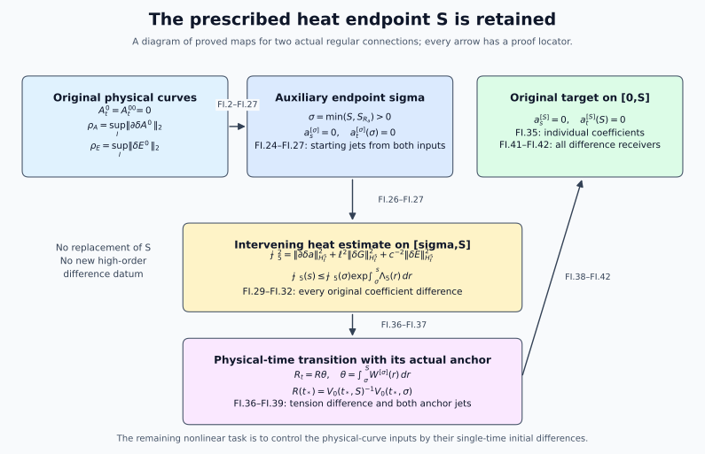

# Comparing heat extensions on the prescribed interval

This Unit 9 chapter estimates two regular heat extensions from their
actual physical-curve differences. It gives all weighted potential,
curvature and heat-curvature bounds used by the difference equations.
When an auxiliary short heat interval is needed, an explicit energy
estimate and an anchored gauge transformation return to the original
endpoint \(S\).

Prerequisites are [heat construction](../classical-heat-construction.html)
(HC), [potential estimates](../classical-potential-estimates.html) (HP),
[caloric gauges](../classical-caloric-gauge.html) (HG),
[dynamic heat flow](../classical-dynamic-heat.html) (HD),
[the complete curvature heat equation](../classical-curlfree-backward-heat.html#eq-CF-14) (CF),
[electric smoothing](../classical-electric-smoothing.html) (ES),
[electric differences](../classical-electric-difference.html) (ED),
and [spatial differences](../classical-spatial-difference.html) (LG).
The original \(H_\ell^q\) spaces are also used in
[regular restart](../classical-regular-restart.html) (RI).

Human-source context: Sung-Jin Oh,
[*Gauge choice for the Yang–Mills equations using the Yang–Mills heat flow
and local well-posedness in H1*, arXiv:1210.1558v2](https://arxiv.org/abs/1210.1558v2),
and [*Finite energy global well-posedness of the Yang–Mills equations on
R1+3: An approach using the Yang–Mills heat flow*, arXiv:1210.1557v2](https://arxiv.org/abs/1210.1557v2).
The exposition and complete calculations here are independently written.
The course provenance identifies the source editions and bounded comparison
reading. These lessons make no novelty claim.

## 1. Objects, norms, representatives and anchors

Work with the two actual regular physical temporal-gauge connections \(A^0,A^{0\prime}\) on the same compact physical interval \(I\), containing \(t_*\), and their existing dynamic caloric extensions on the original \(I\times[0,S]\). The spatial base is \(\mathbb R^3\), the gauge group is the original compact matrix group in its fixed unitary representation, the physical speed is the original \(c>0\), and

\[
A_t^0=A_t^{0\prime}=0,\qquad E_i^0=F_{ti}^0=\partial_tA_i^0,
\qquad \delta X=X-X'.                                           \tag{FI.1}
\]

Connections have the derivative-regular \(L^6_x\) representatives used in HC/HD, rather than arbitrary representatives modulo constants. All derivatives below are full ordered spatial tuples; all output and matrix labels are retained. Field norms use Hilbert–Schmidt norm. Undifferentiated gauge suprema use matrix operator norm. A unitary gauge has operator norm one, its difference has operator norm at most two, and derivatives of its inverse are the adjoints of its derivatives. We use \(|[X,Y]|\le2|X||Y|\), with the corresponding contracted full-tuple estimate. No dimension of the representation is inserted into these inequalities.

For local construction choose the reference radius and original heat endpoint as follows:

\[
\begin{gathered}
C_S=4/\sqrt3,\quad C_M=2\sqrt{(4\pi/3)^{-1/6}(4\pi)^{-1}(20\pi/3)^{5/6}},\\
D_2=18\sqrt3 C_MC_S,\quad D_3=12\sqrt3 C_S^3,\quad
S_R=\min\{(32D_2R)^{-4},(48D_3R^2)^{-2}\},\quad S\le S_R,\\
\max\{\|\partial A^0(t_*)\|_2,\|\partial A^{0\prime}(t_*)\|_2\}<R/4.
                                                               \tag{FI.2}
\end{gathered}
\]

The component \(I_R\) of the strict-radius set containing \(t_*\) is open **relative to \(I\)**. It need not be open in \(\mathbb R\) if it contains an endpoint of a closed \(I\). On a compact interval \(J\subset I_R\) containing \(t_*\), define

\[
\rho_A=\sup_J\|\partial\delta A^0\|_2,\quad
\rho_E=\sup_J\|\delta E^0\|_2,\quad
e=\max(\sup_J\|E^0\|_2,\sup_J\|E^{0\prime}\|_2),\quad
\tau=\sup_J|t-t_*|.                                             \tag{FI.3}
\]

The original conserved curvature bounds give \(e\le c\max(d,d')\). We never replace \(E\) by a differently scaled field. For an open physical interval the arguments hold on each compact \(J\); a uniform estimate up to an omitted endpoint requires the displayed individual quantities to remain bounded there.

Let \(B\) be the DeTurck spatial solution, \(b=\partial^jB_j\), and let \(V_0\) solve

\[
(V_0)_s=V_0b,\quad V_0(0)=I_N,\quad
V=V_0(S)^{-1}V_0(s),\quad V_s=Vb,\quad V(S)=I_N.                 \tag{FI.4}
\]

If \(C=V_0\cdot B\) is the dynamic caloric connection with the original physical datum, its HD time gauge \(W\) satisfies

\[
W_t=WC_t(S),\quad W(t_*)=V_0(t_*,S)^{-1},\quad
T=WV_0(S),\quad T_t=TB_t(S),\quad T(t_*)=I_N,\quad U=TV.
                                                               \tag{FI.5}
\]

Here and throughout \(Q\cdot B_\mu=QB_\mu Q^{-1}-(\partial_\mu Q)Q^{-1}\). Substitution of the time component of this action gives

\[
C_t(S)=V_0(S)B_t(S)V_0(S)^{-1}-(\partial_tV_0(S))V_0(S)^{-1};
\]

the last term cancels when differentiating \(WV_0(S)\). Also \(V(S)\) is the identity for every \(t\), so \(\partial_tV(S)=0\). Thus \(a=U\cdot B\) is exactly the prescribed caloric-temporal connection, with \(a_s=0,a_t(S)=0\), and not merely some gauge-equivalent connection. The primed construction has the identical two anchor locations.

## 2. Local DeTurck differences, with no higher difference datum

Write the original multilinear maps as

\[
\begin{aligned}
Q(X,Y)_i&=\sum_j\{2[X_j,\partial_jY_i]-[X_j,\partial_iY_j]\},\\
C_3(X,Y,Z)_i&=\sum_j[X_j,[Y_j,Z_i]],\qquad N(B)=Q(B,B)+C_3(B,B,B),\\
(\partial_s-\Delta)\delta B
 &=Q(\delta B,B)+Q(B',\delta B)
 +C_3(\delta B,B,B)+C_3(B',\delta B,B)+C_3(B',B',\delta B).
                                                               \tag{FI.6}
\end{aligned}
\]

This is a telescoping identity in the original noncommuting fields; expanding \(B=B'+\delta B\) recovers every quadratic and cubic difference term. For an ordered word \(I\), the derivative of a product is the sum over subsets of its positions, or ordered partitions for a triple. Grouping equal subset sizes gives binomial or multinomial coefficients without deleting any derivative word.

Let

\[
\mathsf T_m(X)=\sup_{0<s\le S}s^{m/2}\|\partial^{(m+1)}X(s)\|_2
 +\left(\int_0^S s^m\|\partial^{(m+2)}X(s)\|_2^2ds\right)^{1/2}.
                                                               \tag{FI.7}
\]

Put \(K=54(C_S^{3/2}+C_MC_S)\), \(J_0=36C_S^3\), and define

\[
\begin{aligned}
\gamma_0&=R,&\gamma_1&=4R+4(K^2+3J_0)\sqrt S R^3,\\
d_0&=\tfrac83\rho_A,&d_1&=\bigl(4+4K^2\sqrt S R^2
 +4KS^{1/4}\sqrt{R\gamma_1}+36J_0\sqrt S R^2\bigr)d_0.
                                                               \tag{FI.8}
\end{aligned}
\]

The initial contraction HC.29–HC.31 has Lipschitz factor at most \(1/4\): indeed \(2D_2S^{1/4}R\le1/16\) and \(3D_3\sqrt S R^2\le1/16\), and the heat solver contributes its stated factor two. The free datum gradient contributes at most twice its norm, giving \(d_0=8\rho_A/3\). The order-one weighted energy and its differentiated quadratic and cubic terms give precisely HG.19–HG.20, hence FI.8. In particular these are actual difference estimates, not an interpolation of individual estimates.

For completeness the all-order finite continuation of these arrays is the following. For \(m\ge2\) set

\[
\begin{aligned}
\mathcal Q_m(x,y)&=18\,3^{(m+1)/2}S^{1/4}
 \left[C_MC_S\sqrt{x_0x_1}\,y_{m-1}
  +C_S^{3/2}\sum_{h=1}^m\binom mh L_{mh}(x,y)\right],\\
L_{mh}(x,y)&=\begin{cases}
\sqrt{x_{h-1}x_h}\,y_{m-h},&h\le m-h+1,\\
\sqrt{y_{m-h}y_{m-h+1}}\,x_{h-1},&h>m-h+1,
\end{cases}\\
\mathcal C_m(x,y,z)&=12\,3^{(m+1)/2}C_S^3\sqrt S
\sum_{h+k+l=m}\frac{m!}{h!k!l!}\,P_{hkl}(x,y,z),\\
\gamma_m&=2\sqrt m\,\gamma_{m-1}
 +2\{\mathcal Q_m(\gamma,\gamma)+\mathcal C_m(\gamma,\gamma,\gamma)\},\\
d_m&=2\sqrt m\,d_{m-1}+2\{\mathcal Q_m(d,\gamma)+\mathcal Q_m(\gamma,d)
 +\mathcal C_m(d,\gamma,\gamma)+\mathcal C_m(\gamma,d,\gamma)
 +\mathcal C_m(\gamma,\gamma,d)\}.                             \tag{FI.9}
\end{aligned}
\]

To define \(P_{hkl}\), choose the first largest entry of \((h,k,l)\), decrease its index by one in its own array, and multiply the resulting three entries. All referenced indices are at most \(m-1\). In the quadratic term, the zero-derivative coefficient is in \(L^\infty\), using \(C_MC_S\sqrt{a_1a_2}\). For the other terms place the smaller derivative order in \(L^3\), using \(C_S^{1/2}\sqrt{a_ra_{r+1}}\), and the other in \(L^6\), using \(C_Sa_{r+1}\). The remaining heat factor is \(S^{1/4}\). In the cubic term use three \(L^6\) factors, and put the selected largest derivative in the heat \(L^2\) norm; the remaining factor is \(\sqrt S\). The displayed generous full-tuple coefficients are HP.5 and HP.9.

Pairing \(\partial^{(m)}\delta B\)'s equation with \(-s^m\Delta\partial^{(m)}\delta B\) gives exactly

\[
\begin{aligned}
\tfrac12s^m\|\partial^{(m+1)}\delta B(s)\|_2^2
 +\int_0^s r^m\|\partial^{(m+2)}\delta B\|_2^2dr
 &=\tfrac m2\int_0^s r^{m-1}\|\partial^{(m+1)}\delta B\|_2^2dr\\
 &\quad+\int_0^s r^m\langle\partial^{(m)}\delta N,
                          -\Delta\partial^{(m)}\delta B\rangle dr.
                                                               \tag{FI.10}
\end{aligned}
\]

For \(m\ge1\) its weighted initial term vanishes. Parseval uses the original measure \((2\pi)^{-3}d^3\xi\) and the full tuples. Young's inequality, followed separately by the endpoint supremum and integral, yields FI.9 and \(\mathsf T_m(B),\mathsf T_m(B')\le\gamma_m\), \(\mathsf T_m(\delta B)\le d_m\). Consequently

\[
v_j=C_MC_S\sqrt{\gamma_j\gamma_{j+1}},\quad
w_j=C_MC_S\sqrt{d_jd_{j+1}},\quad
\|\partial^{(j)}B\|_\infty,\|\partial^{(j)}B'\|_\infty
 \le v_js^{-j/2-1/4},\quad
\|\partial^{(j)}\delta B\|_\infty\le w_js^{-j/2-1/4}.
                                                               \tag{FI.11}
\]

Each \(d_j,w_j\) is degree one in \(\rho_A\).

## 3. The time-gauge coefficient is constructed, not supplied as a new datum

Here is the finite forced-heat operation used below. Suppose the already derived equation \(y_s=\Delta y+Ly+f\) has

\[
\begin{aligned}
\|\partial^{(k)}Ly\|_2\le{}&a\sum_{l=0}^k\binom kl v_l s^{-l/2-1/4}y_{k-l+1}
 +b\sum_{l=0}^k\binom kl v_{l+1}s^{-l/2-3/4}y_{k-l}\\
 &+d\sum_{h+j+n=k}\frac{k!}{h!j!n!}v_hv_js^{-(h+j)/2-1/2}y_n,\qquad
\|\partial^{(k)}f\|_2\le\sum_{\alpha<1}f_{k\alpha}s^{-k/2-\alpha},
                                                               \tag{FI.12}
\end{aligned}
\]

where the last sum is finite and all its exponents belong to \([0,1)\), and a proved bound is \(y_0\le M\). Define

\[
\begin{aligned}
v_l^*&=2^{l/2+1/4}v_l,& b_*&=av_0^*S^{1/4},\\
c_m&=aS^{1/4}\sum_{k=1}^m\sum_{l=1}^k\binom kl v_l^*
 +bS^{1/4}\sum_{k=0}^m\sum_{l=0}^k\binom kl v_{l+1}^*
 +d\sqrt S\sum_{k=0}^m\sum_{h+j+n=k}\frac{k!}{h!j!n!}v_h^*v_j^*,\\
D_m&=\sum_{k=0}^m\sum_\alpha2^{k/2+\alpha}f_{k\alpha}S^{1-\alpha},\\
\kappa&=2/\sqrt\pi,&K_*&=2(1+\kappa),&a_*&=2+\pi\kappa,&b^\#&=1+2\kappa,\\
N&=\max\{1,q,\lceil8a_*^2b_*^2\rceil,
                   \lceil2b^\#c_{\max(q-1,0)}\rceil\}.
                                                               \tag{FI.13}
\end{aligned}
\]

For \(q=0\), \(\mathscr S_0(a,b,d;M;f)=M\). For \(q\ge1\), set \(L_0=M\), \(k_n=\max(0,n-(N-q))\), and

\[
L_{n+1}=\begin{cases}
K_*L_n+(b^\#/N)D_0,&n<N-q,\\
\sqrt{2N}\{K_*L_n+(b^\#/N)D_{k_n}\},&n\ge N-q,
\end{cases}
\qquad \mathscr S_q=L_N.                                      \tag{FI.14}
\]

Then \(\|\partial^{(q)}y(s)\|_2\le\mathscr S_qs^{-q/2}\). To verify this operation fix the actual evaluation point \(s\) and divide \([s/2,s]\) into \(N\) equal pieces of length \(h=s/(2N)\). In each piece use the sum of the first \(m\) derivative norms weighted by powers of this fixed \(s\), together with the next derivative multiplied by the square root of elapsed heat time. The heat kernel has \(L^1\) gradient norm \(\kappa u^{-1/2}\). The four Duhamel integrals are bounded by \(2\sqrt h,h,\pi\sqrt h,2h\); the middle singular convolution is the beta integral \(\int_0^h(h-r)^{-1/2}r^{-1/2}dr=\pi\). The drift contribution is at most \(a_*b_*/\sqrt{2N}\le1/4\), and the lower-order contribution is at most \(b^\#c_m/(2N)\le1/4\). Absorbing their sum leaves FI.14. At a derivative-gain step the endpoint weight costs \(\sqrt{s/h}=\sqrt{2N}\); the first \(N-q\) steps propagate order zero and the last \(q\) gain one order each. No high derivative at zero heat time is used.

Differentiate the DeTurck spatial equation in physical time. With \(P=\partial_tB\),

\[
P_s-\Delta P=Q(P,B)+Q(B,P)+C_3(P,B,B)+C_3(B,P,B)+C_3(B,B,P),
\quad P(0)=E^0.                                               \tag{FI.15}
\]

Its FI.12 constants are \((a,b,d)=(6,6,12)\). Pairing with \(P\), the drift is bounded by \(6v_0s^{-1/4}\|P\|_2\|\partial P\|_2\). Young with half the dissipative term and the cubic term gives

\[
M_P=e\exp(24v_1S^{1/4}+60v_0^2\sqrt S),\quad
p_j=\mathscr S_j(6,6,12;M_P;0),\quad
\|\partial^{(j)}P\|_2,\|\partial^{(j)}P'\|_2\le p_js^{-j/2}.
                                                               \tag{FI.16}
\]

For \(\delta P\), keep this operator with coefficient \(B\). Its forcing has the two quadratic placements \(Q(P',\delta B)+Q(\delta B,P')\) and the six cubic placements obtained by changing one of the two coefficient slots in each of the three displayed cubics. Full-tuple bounds are

\[
\begin{aligned}
f^P_{k,3/4}&=6\sum_{l=0}^k\binom kl(w_lp_{k-l+1}+w_{l+1}p_{k-l}),\\
f^P_{k,1/2}&=12\sum_{h+j+n=k}\frac{k!}{h!j!n!}(w_hv_j+v_hw_j)p_n,\\
M_{\delta P}&=e^{24v_1S^{1/4}+60v_0^2\sqrt S}
 [\rho_E+4S^{1/4}f^P_{0,3/4}+2\sqrt S f^P_{0,1/2}],\quad
z_j=\mathscr S_j(6,6,12;M_{\delta P};f^P).
                                                               \tag{FI.17}
\end{aligned}
\]

Thus \(\|\partial^{(j)}\delta P\|_2\le z_js^{-j/2}\). The energy inequality for a forced equation is first applied to \((\|y\|_2^2+\varepsilon^2)^{1/2}\), then \(\varepsilon\downarrow0\); this justifies it at a zero norm as well.

The actual dynamic DeTurck time component satisfies the complete equation

\[
(\partial_s-\Delta)B_t
 =2\sum_j[B_j,\partial_jB_t]+\sum_j[B_j,[B_j,B_t]]
                  -\sum_j[B_j,P_j],\qquad B_t(0)=0.             \tag{FI.18}
\]

Indeed expand \(F_{st}=D^jF_{jt}\) with \(B_s=\partial^jB_j\), \(F_{jt}=\partial_jB_t-P_j+[B_j,B_t]\). The terms \(-\partial_t\partial^jB_j\) occur on both sides, as do \([\partial^jB_j,B_t]\); after cancellation the displayed two drift terms and all cubic terms remain. The homogeneous operator has \((a,b,d)=(4,0,4)\). Its energy exponential is \(e^{24v_0^2\sqrt S}\). Define

\[
\begin{aligned}
f^t_{k,1/4}&=2\sum_l\binom kl v_lp_{k-l},&
M_t&=e^{24v_0^2\sqrt S}\tfrac43S^{3/4}f^t_{0,1/4},&
u_j&=\mathscr S_j(4,0,4;M_t;f^t),\\
f^{\delta t}_{k,3/4}&=4\sum_l\binom kl w_lu_{k-l+1},\\
f^{\delta t}_{k,1/2}&=4\sum_{h+j+n=k}\frac{k!}{h!j!n!}(w_hv_j+v_hw_j)u_n,\\
f^{\delta t}_{k,1/4}&=2\sum_l\binom kl(w_lp_{k-l}+v_lz_{k-l}),\\
M_{\delta t}&=e^{24v_0^2\sqrt S}
 [4S^{1/4}f^{\delta t}_{0,3/4}+2\sqrt S f^{\delta t}_{0,1/2}
                     +\tfrac43S^{3/4}f^{\delta t}_{0,1/4}],\\
u_j^\delta&=\mathscr S_j(4,0,4;M_{\delta t};f^{\delta t}),\\
\beta_j&=C_MC_S\sqrt{u_{j+1}u_{j+2}}S^{-j/2-3/4},&
\delta\beta_j&=C_MC_S\sqrt{u_{j+1}^\delta u_{j+2}^\delta}S^{-j/2-3/4}.
                                                               \tag{FI.19}
\end{aligned}
\]

All sums have the indices specified in their upper row. The exact difference forcing for FI.18 is

\[
2[\delta B_j,\partial_jB_t']+[\delta B_j,[B_j,B_t']]+[B_j',[\delta B_j,B_t']]-[\delta B_j,P_j']-[B_j,\delta P_j].
\]

This verifies every term in FI.19, which bounds the full endpoint jets of \(B_t(S)\) and its difference. In particular no additional electric spatial derivative has been introduced at heat time zero.

## 4. The complete affine gauge terms and local bounds

Here are all the gauge constants needed to reconstruct the missing display. Put

\[
\begin{aligned}
b_j^*&=\sqrt3v_{j+1},& b_j^\delta&=\sqrt3w_{j+1},&
q_V&=\min(2,4S^{1/4}b_0^\delta),\\
H_k&=(k/2-1/4)^{-1},&
L_1&=4/\mathrm e,&L_k&=(k/2-1/2)^{-1}\ (k\ge2),\\
v_k^V&=H_kb_k^*+S^{1/4}L_k\sum_{h=1}^{k-1}\binom kh v_h^Vb_{k-h}^*,\\
w_k^V&=H_k(q_Vb_k^*+b_k^\delta)
 +S^{1/4}L_k\left[\sum_{h=1}^{k-1}\binom kh
       (w_h^Vb_{k-h}^*+v_h^Vb_{k-h}^\delta)+v_k^Vb_0^\delta\right],\\
t_1&=\tau\beta_1,&t_2&=\tau\beta_2+\tau^2\beta_1^2,&
d_T&=\min(2,\tau\delta\beta_0),\\
\delta t_1&=\tau(\delta\beta_1+d_T\beta_1+t_1\delta\beta_0),\\
\delta t_2&=\tau(\delta\beta_2+d_T\beta_2
          +2\delta t_1\beta_1+2t_1\delta\beta_1+t_2\delta\beta_0),\\
R_1&=S^{1/4}t_1+v_1^V,&R_2&=S^{3/4}t_2+2S^{1/2}t_1v_1^V+v_2^V,\\
D_1&=S^{1/4}(\delta t_1+t_1q_V)+d_Tv_1^V+w_1^V,\\
D_2&=S^{3/4}(\delta t_2+t_2q_V)
 +2S^{1/2}(\delta t_1v_1^V+t_1w_1^V)+d_Tv_2^V+w_2^V,\\
r_0&=1,&r_k&=S^{1/4}R_k\ (k=1,2),&
\epsilon_0&=\min(2,d_T+q_V),&\epsilon_k&=S^{1/4}D_k\ (k=1,2).
                                                               \tag{FI.20}
\end{aligned}
\]

The heat ODE is integrated backward from its common endpoint. Its top differentiated term is right multiplication by a skew-adjoint coefficient and is removed by the unitary propagator. The remaining terms give \(\|\partial^{(k)}V\|_\infty\le v_k^V s^{-k/2+1/4}\) and \(\|\partial^{(k)}\delta V\|_\infty\le w_k^V s^{-k/2+1/4}\). The first integral is bounded by \(H_ks^{-k/2+1/4}\). The product integral is bounded after weighting by \(S^{1/4}L_k\); for \(k=1\) this uses \(\sup_{0<x\le1}x^{1/4}\log(1/x)=4/\mathrm e\). This proves the recurrence for **every finite \(k\ge1\)**, not just the two orders needed locally. The same unitary argument in physical time proves the stated \(T\) bounds in both directions from \(t_*\); direct integration of \(t_1(t)\le|t-t_*|\beta_1\) gives the coefficient one on \(\tau^2\beta_1^2\). Product differentiation of \(U=TV\) gives \(R_k,D_k\), and hence \(s^{k/2}\|\partial^{(k)}U\|_\infty\le r_k\) and the corresponding \(\epsilon_k\) bound for its difference.

The exact affine connection difference is

\[
\delta a=U\delta B U^{-1}+\delta U B'U^{-1}+U'B'\delta U^{-1}
                  -(\partial\delta U)U^{-1}-(\partial U')\delta U^{-1}.
\]

Define the original receivers
\(\delta A_0=\sup s^{1/4}\|\delta a\|_\infty\),
\(\delta A_1=\sup s^{3/4}\|\partial\delta a\|_\infty\), with suprema over \(J\times(0,S]\). Their complete bounds are

\[
\begin{aligned}
C_0^\delta&=w_0+2\epsilon_0v_0,\\
C_1^\delta&=w_1+2r_1w_0+2\epsilon_0v_1
                       +2\epsilon_1v_0+2r_1\epsilon_0v_0,\\
\boxed{\delta A_0\le\mathcal B_0=C_0^\delta+D_1+R_1\epsilon_0},\\
\boxed{\delta A_1\le\mathcal B_1=C_1^\delta+D_2+R_2\epsilon_0
                                      +2S^{1/4}R_1D_1}.
                                                               \tag{FI.21}
\end{aligned}
\]

For the last line differentiate each of the two affine terms once. The two terms with one derivative on each gauge have weight \(s^{3/4}s^{-1/4}s^{-1/4}=s^{1/4}\), hence exactly the displayed \(2S^{1/4}R_1D_1\). Terms with two derivatives on one gauge give \(D_2+R_2\epsilon_0\). This also verifies that omitting the affine part would be a mathematical error.

Curvature transforms by conjugation. With the full nine-component \(F_{ij}\) tuple, set \(\delta C_F=\sup s^{3/4}\|\delta F\|_\infty\). Since

\[
\delta F^B_{ij}=\partial_i\delta B_j-\partial_j\delta B_i+[\delta B_i,B_j]+[B_i',\delta B_j],
\]

\[
\delta C_F\le\mathcal B_F
 =2w_1+4S^{1/4}v_0w_0+2\epsilon_0(2v_1+2S^{1/4}v_0^2).
                                                               \tag{FI.22}
\]

The independently valid potential-based bound is \(2\mathcal B_1+2S^{1/4}\mathcal B_0(A_0+A_0')\), with the individual original weighted potential constants. Its receiving locator is ED.4.

The DeTurck heat curvature is

\[
\begin{aligned}
G_i^B&=F_{si}^B=\Delta B_i-\partial_i\partial^jB_j+Q(B,B)_i
                      +[\partial^jB_j,B_i]+C_3(B,B,B)_i,\\
g_q&=\gamma_{q+1}+(6+2\sqrt3)S^{1/4}\sum_h\binom qh v_h\gamma_{q-h}
 +4C_S^3\sqrt S\sum_{h+j+n=q}\frac{q!}{h!j!n!}\gamma_h\gamma_j\gamma_n,\\
g_q^\delta&=d_{q+1}+(6+2\sqrt3)S^{1/4}
 \sum_h\binom qh(w_h\gamma_{q-h}+v_hd_{q-h})\\
&\quad+4C_S^3\sqrt S\sum_{h+j+n=q}\frac{q!}{h!j!n!}
 (d_h\gamma_j\gamma_n+\gamma_hd_j\gamma_n+\gamma_h\gamma_jd_n),\\
J_q^\delta&:=\sup_{J,\,0<s\le S}s^{(q+1)/2}\|\partial^{(q)}\delta G\|_2\\
&\le\sum_{h+j+n=q}\frac{q!}{h!j!n!}
       (r_hg_j^\delta r_n+\epsilon_hg_jr_n+r_hg_j\epsilon_n),
                         \qquad q=0,1,2.                       \tag{FI.23}
\end{aligned}
\]

The linear part has Fourier symbol \(-|\xi|^2(I-\xi\otimes\xi/|\xi|^2)\), whose operator norm is \(|\xi|^2\); it contributes \(\gamma_{q+1}\), not twice that quantity. The quadratic parts contribute \(6+2\sqrt3\), and the cubic term uses three \(L^6\) factors. This proves the first two estimates for all finite \(q\). The last line is the full three-placement derivative formula for \(G=UG^BU^{-1}\). At \(q=1\) it is

\[
g_1^\delta+2r_1g_0^\delta+2\epsilon_0g_1+2(\epsilon_1+r_1\epsilon_0)g_0;
\]

at \(q=2\) it is

\[
g_2^\delta+4r_1g_1^\delta+(2r_2+2r_1^2)g_0^\delta+2\epsilon_0g_2+4(\epsilon_1+r_1\epsilon_0)g_1+(2\epsilon_2+2r_2\epsilon_0+4r_1\epsilon_1)g_0.
\]

The LG receivers are therefore \(V_0^\delta\le C_S^{3/4}(J_0^\delta)^{1/4}(J_1^\delta)^{3/4}\) and \(V_1^\delta\le C_S^{3/4}(J_1^\delta)^{1/4}(J_2^\delta)^{3/4}\), retaining their original powers of \(s\). Finally \(E(0)=U(0)E^0U(0)^{-1}\) gives \(\sup_J\|\delta E(0)\|_2\le\rho_E+2\epsilon_0e\). This is the actual \(L^2_x\) datum receiver; it does not assert the separate ED fractional heat-datum \(L^4_{t,x}\) bound.

## 5. An auxiliary heat time without changing the prescribed endpoint

We now extend the local estimate to the entire prescribed heat interval. Keep the original \(I,[0,S]\), original reference-time construction and original target representative \(a^{[S]}\). Choose a finite auxiliary radius

\[
R_a>4\max\{\sup_I\|\partial A^0\|_2,\sup_I\|\partial A^{0\prime}\|_2\},
\qquad \sigma=\min(S,S_{R_a})>0.                                \tag{FI.24}
\]

This changes neither a coordinate nor the target \(S\). FI.2–FI.23 apply on all of \(I\) to a second caloric-temporal representative \(a^{[\sigma]}\), using \((R_a,\sigma)\) in their numerical recurrences and the original physical differences FI.3 with \(J=I\). If \(\sigma=S\), uniqueness of the heat and physical-time gauges identifies the result with the target and the proof is finished. Suppose \(\sigma<S\).

The existing dynamic caloric extension \(C\) on \([0,S]\) is retained. Solve \((W_\sigma)_t=W_\sigma C_t(\sigma)\), with \(W_\sigma(t_*)=V_0(t_*,\sigma)^{-1}\), and define \(a^{[\sigma]}=W_\sigma\cdot C\) on **all** of \([0,S]\). On \([0,\sigma]\) uniqueness identifies it with the local construction already estimated. This construction requires no DeTurck continuation beyond \(\sigma\). The connection remains in its \(L^6\) representative since \(a^{[\sigma]}(s)=a^{[\sigma]}(\sigma)+\int_\sigma^sG^{[\sigma]}(r)dr\) and positive-heat \(G\) has finite \(L^6\) norms. Both the equality and its primed version are equalities of these representatives.

We will supply every difference input at \(\sigma\) by the local recurrences. The following explicit finite rules make that assertion verifiable also at the higher finite orders used in the extension. In FI.19–FI.20 now use endpoint \(\sigma\). For all \(k\ge1\), bounds for the physical gauge \(T\) are

\[
\begin{aligned}
t_0&=1,&t_k&=\tau\beta_k+\tau\sum_{h=1}^{k-1}\binom kh t_h\beta_{k-h},\\
\delta t_0&=d_T,&\delta t_k&=\tau(d_T\beta_k+\delta\beta_k)
 +\tau\sum_{h=1}^{k-1}\binom kh(\delta t_h\beta_{k-h}+t_h\delta\beta_{k-h})
 +\tau t_k\delta\beta_0,\\
L_k&=\tau u_k\sigma^{-k/2}
 +\tau\sum_{h=1}^{k-1}\binom kh L_h\beta_{k-h},\\
L_k^\delta&=\tau(d_Tu_k+u_k^\delta)\sigma^{-k/2}
 +\tau\sum_{h=1}^{k-1}\binom kh(L_h^\delta\beta_{k-h}+L_h\delta\beta_{k-h})
 +\tau L_k\delta\beta_0.
                                                               \tag{FI.25}
\end{aligned}
\]

Here \(L_k,L_k^\delta\) bound \(\|\partial^{(k)}T\|_2,\|\partial^{(k)}\delta T\|_2\); they do not replace the unrelated heat-integration constant called \(L_k\) in FI.20. The scope of FI.25 distinguishes these symbols. For clarity they may be stored as `T_L2[k]` in a numerical evaluation. The estimates follow from the differentiated physical-time ODE and its unitary propagator, putting the \(h=0\) forcing in \(L^2\) and other coefficients in \(L^\infty\). Also \(\|T-I\|_2\le\tau u_0\), \(\|\delta T\|_2\le\tau u_0^\delta\). Positive derivative \(L^3\) norms are bounded by \(C_S^{1/2}\sqrt{L_kL_{k+1}}\), and their differences by the corresponding expression with \(L^\delta\). This proves all finite orders from the same two physical difference inputs. At orders one and two one can retain the sharper FI.20 values in place of these larger recurrences.

Here is an exact algorithm for the starting \(L^2\) jets, avoiding an unavailable \(L^2\) norm of the connection. At \(s=\sigma\), \(V(\sigma)=I\) with all spatial derivatives zero, so

\[
\begin{aligned}
a^{[\sigma]}(\sigma)&=TB(\sigma)T^{-1}-(\partial T)T^{-1},\\
G^{[\sigma]}(\sigma)&=TG^B(\sigma)T^{-1},\qquad
E^{[\sigma]}(\sigma)=TE^B(\sigma)T^{-1},\\
E_i^B&=P_i-\partial_iB_t-[B_i,B_t].                              \tag{FI.26}
\end{aligned}
\]

For a derivative of order \(r\ge1\) of the first conjugation, sum over all \((h,j,n)\) with \(h+j+n=r\), coefficient \(r!/(h!j!n!)\). If \(j\ge1\), use the bound \(\gamma_{j-1}\sigma^{-(j-1)/2}\) for the middle \(L^2\) factor, and \(t_h,t_n\) for its gauge factors. If \(j=0\), at least one of \(h,n\) is positive: choose the first positive one, put that gauge derivative in \(L^3\) using FI.25, put \(B\) in \(L^6\) with bound \(C_S\gamma_0\), and the other gauge factor in \(L^\infty\). For its difference use the three telescoping placements, replacing exactly one factor by its difference array; in particular the middle \(L^6\) difference bound is \(C_Sd_0\). For the affine term sum over \(h+n=r\), coefficient \(\binom rh\), put \(\partial^{(h+1)}T\) in \(L^2\) and \(\partial^{(n)}T^{-1}\) in \(L^\infty\); its difference has the two corresponding placements. Denote the resulting complete positive sums by \(A_r^\delta(\sigma)\).

For curvature conjugations every middle jet is already in \(L^2\). For \(G^B\) use \(g_j\sigma^{-(j+1)/2}\) and \(g_j^\delta\sigma^{-(j+1)/2}\). For \(E^B\) use

\[
\begin{aligned}
e_j^B&=p_j\sigma^{-j/2}+u_{j+1}\sigma^{-(j+1)/2}
 +2\sum_h\binom jh v_hu_{j-h}\sigma^{-j/2-1/4},\\
(e_j^B)^\delta&=z_j\sigma^{-j/2}+u_{j+1}^\delta\sigma^{-(j+1)/2}
 +2\sum_h\binom jh(w_hu_{j-h}+v_hu_{j-h}^\delta)\sigma^{-j/2-1/4}.
                                                               \tag{FI.27}
\end{aligned}
\]

The three-placement multinomial sum with outer factors \(t_h,t_n\) and their differences gives bounds \(Z_j^0,Y_j^0\) for the full \(\delta G(\sigma),\delta E(\sigma)\) jets. Thus FI.25–FI.27 are finite arithmetic instructions for every starting jet; they introduce no higher physical difference datum.

## 6. The intervening heat difference estimate

Fix the original length parameter \(\ell>0\) used in the physical Sobolev spaces. Write

\[
\|f\|_{H_\ell^q}^2
 =(2\pi)^{-3}\int_{\mathbb R^3}(1+\ell^2|\xi|^2)^q|\widehat f(\xi)|^2d^3\xi
 =\sum_{j=0}^q\binom qj\ell^{2j}\|\partial^{(j)}f\|_2^2,
\qquad b_\ell=(8\pi\ell^3)^{-1/2}.                            \tag{FI.28}
\]

The identity is for full ordered tuples, not an independently weighted multi-index norm. The bound \(\|f\|_\infty\le b_\ell\|f\|_{H_\ell^2}\) follows by Fourier Cauchy–Schwarz and the exact integral 

\[
(2\pi)^{-3}\int(1+\ell^2|\xi|^2)^{-2}d^3\xi=(8\pi\ell^3)^{-1}.
\]

In this section suppress only the endpoint superscript \([\sigma]\), not any field or contribution, and put \(\eta=\delta a\), \(Z=\delta G\), \(Y=\delta E\). Both original curvatures \(G_i=F_{si}\) and \(E_i=F_{ti}\) obey

\[
\begin{aligned}
(\partial_s-\Delta)X_i&=\mathcal L(a)X_i,\\
\mathcal L(a)X_i&=2[a_j,\partial_jX_i]+[\partial^ja_j,X_i]
                     +[a_j,[a_j,X_i]]+2[F_{ij},X_j],\\
\eta_s&=Z,\qquad
(\partial_s-\Delta)Z=\mathcal L(a)Z+\mathcal H(G'),\quad
(\partial_s-\Delta)Y=\mathcal L(a)Y+\mathcal H(E'),\\
\mathcal H(H)_i&=2[\eta_j,\partial_jH_i]+[\partial^j\eta_j,H_i]
 +[\eta_j,[a_j,H_i]]+[a_j',[\eta_j,H_i]]+2[\delta F_{ij},H_j],\\
\delta F_{ij}&=\partial_i\eta_j-\partial_j\eta_i+[\eta_i,a_j]+[a_i',\eta_j].
                                                               \tag{FI.29}
\end{aligned}
\]

These equations are obtained by expanding \(D^jD_j\) in the caloric gauge and taking the telescoping difference; CF.14 and ES.5 give the two identical original heat equations. Every quadratic-in-difference contribution is present inside the unprimed factors. In particular \(\eta_s=Z\), with no elliptic inversion of the connection difference.

We specify finite product constants rather than invoking an unspecified Sobolev product bound. Let \(a_j(f)=\|\partial^{(j)}f\|_\infty\), and let

\[
\begin{aligned}
K_q(f)&=\left[\sum_{j=0}^q\binom qj
 \left(\sum_{h=0}^j\binom jh
   \frac{\ell^h a_h(f)}{\sqrt{\binom q{j-h}}}\right)^2\right]^{1/2},\\
\lambda_h&=\ell^{-(h-1)}/\sqrt{\binom q{h-1}}\quad(1\le h\le q),\\
P_q(f)&=\left[\sum_{j=0}^q\binom qj\ell^{2j}
 \left(C_S\|\partial^{(j)}f\|_3+
       \sum_{h=1}^j\binom jh\lambda_h a_{j-h}(f)\right)^2\right]^{1/2},\\
M_q(a,H)&=\left[\sum_{j=0}^q\binom qj\ell^{2j}
 \left(\sum_{h+l+n=j}\frac{j!}{h!l!n!}\,m_{hln}(a,H)\right)^2\right]^{1/2},\\
m_{0ln}(a,H)&=C_Sa_l(a)\|\partial^{(n)}H\|_3,\qquad
m_{hln}(a,H)=\lambda_h a_l(a)a_n(H)\ (h\ge1).
                                                               \tag{FI.30}
\end{aligned}
\]

For \(D=\|\partial\eta\|_{H_\ell^q}\), Sobolev gives \(\|\eta\|_6\le C_SD\), and FI.28 gives \(\|\partial^{(h)}\eta\|_2\le\lambda_hD\). The ordered product rule and Hölder prove

\[
\|fX\|_{H_\ell^q},\|Xf\|_{H_\ell^q}\le K_q(f)\|X\|_{H_\ell^q},
\]

\(\|\eta f\|_{H_\ell^q},\|f\eta\|_{H_\ell^q}\le P_q(f)D\), and a bound \(M_q(a,H)D\) for every ordering of a triple containing one factor of each of \(\eta,a,H\). These bounds hold also for the corresponding contractions, by full-tuple Cauchy–Schwarz. Thus no \(L^2\) norm of \(\eta\) or \(a\) has been assumed.

Set

\[
\begin{aligned}
A_q&=4K_q(a),&
B_q&=2\sqrt3K_q(\partial a)+4K_q(a)^2+4K_q(F),\\
C_q(H)&=4P_q(\partial H)+(2\sqrt3+8)K_q(H)
                         +12\{M_q(a,H)+M_q(a',H)\},\\
\mathcal Y_q^2&=\|\partial\eta\|_{H_\ell^q}^2
                      +\ell^2\|Z\|_{H_\ell^q}^2+c^{-2}\|Y\|_{H_\ell^q}^2,\\
\overline C_q&=\sqrt{\ell^2 C_q(G')^2+c^{-2}C_q(E')^2},\qquad
\Lambda_q=\ell^{-2}+A_q^2+B_q+\tfrac12\overline C_q.
                                                               \tag{FI.31}
\end{aligned}
\]

These are coefficients of an auxiliary energy, with the original fields and original \(c\) unaltered. The first line bounds \(\mathcal L(a)X\) by \(A_q\|\partial X\|_{H_\ell^q}+B_q\|X\|_{H_\ell^q}\). In the second line the drift costs \(4P_q\), the divergence costs \(2\sqrt3K_q\), and the two curl terms inside \(2[\delta F,H]\) together cost \(8K_q\). For each of \(a,a'\), the nested coefficient term costs four and the curvature coefficient term costs eight. Their sum is twelve. This accounts for every term in FI.29.

Pair the two heat equations in \(H_\ell^q\) and differentiate the first term of \(\mathcal Y_q^2\) using \(\eta_s=Z\). The drift inequalities are
\(A_qxy\le y^2/4+A_q^2x^2\). The connection term is

\[
D\|\partial Z\|_{H_\ell^q}\le\ell^2\|\partial Z\|_{H_\ell^q}^2/4+\ell^{-2}D^2.
\]

The two forcing terms sum to at most

\[
\overline C_qD\sqrt{\ell^2\|Z\|_{H_\ell^q}^2+c^{-2}\|Y\|_{H_\ell^q}^2}\le\overline C_q\mathcal Y_q^2/2.
\]

Consequently the complete useful differential inequality and its integrated form are

\[
\begin{aligned}
\tfrac12\partial_s\mathcal Y_q^2
 +\tfrac12\ell^2\|\partial Z\|_{H_\ell^q}^2
 +\tfrac34c^{-2}\|\partial Y\|_{H_\ell^q}^2
 &\le\Lambda_q\mathcal Y_q^2,\\
\mathcal Y_q(t,s)&\le\mathcal Y_q(t,\sigma)
           \exp\left(\int_\sigma^s\Lambda_q(t,r)dr\right),\\
\mathcal Y_q(t,\sigma)&\le\left[\sum_{j=0}^q\binom qj\ell^{2j}
 \{(A_{j+1}^\delta(\sigma))^2+\ell^2(Z_j^0)^2+c^{-2}(Y_j^0)^2\}\right]^{1/2}.
                                                               \tag{FI.32}
\end{aligned}
\]

All terms in the last line have already been constructed in FI.25–FI.27. Positive heat time makes each individual coefficient in FI.31 finite on the compact domain. The exact transfer to the original representative, given next, shows that this assertion does not hide a new difference estimate.

## 7. Individual coefficient inputs are in the original representative

It is useful to compute FI.31's individual coefficients entirely from the already given target \(a^{[S]}\). The inverse transition \(Q\), mapping this target to \(a^{[\sigma]}\), satisfies

\[
Q_t=Qa_t^{[S]}(\sigma),\quad
Q(t_*)=V_0(t_*,\sigma)^{-1}V_0(t_*,S),\quad
a_t^{[S]}(\sigma)=-\int_\sigma^S W^{[S]}(r)dr,
\qquad W=F_{st}=-D^jE_j.                                     \tag{FI.33}
\]

At zero heat time the original vacuum Gauss constraint is \(D^jE_j^0=0\). Curvature transforms by conjugation, so \(W^{[S]}(0)=W^{[\sigma]}(0)=0\), and both difference boundary values are zero as well. The full time-potential identities remain \(a_t^{[S]}(s)=-\int_s^S W^{[S]}(r)dr\) and \(a_t^{[\sigma]}(s)=\int_\sigma^sW^{[\sigma]}(r)dr\), with their original oriented endpoints. In particular FI.33 is their value at \(s=\sigma\), not a new boundary prescription.
This is an individual construction only. Put \(b_j=\sup_I\int_\sigma^S\|\partial^{(j)}W^{[S]}(t,r)\|_\infty dr\), taking the maximum with its primed counterpart. At the reference physical time, the original construction on \([0,S]\) gives \(q_0^*=1\), \(q_k^*\le v_k^{V,\mathrm{ref}}\sigma^{-k/2+1/4}\) for the jets of \(Q(t_*)\): it is the inverse of the original backward heat gauge at \(\sigma\). Define recursively

\[
q_0=1,\qquad q_k=q_k^*+\tau b_k+
                    \tau\sum_{h=1}^{k-1}\binom kh q_hb_{k-h}.
                                                               \tag{FI.34}
\]

The unitary ODE proves these bounds on \(I\). For each original individual spatial jet \(A_j^S=\sup_{I,[\sigma,S]}\|\partial^{(j)}a^{[S]}\|_\infty\) and curvature jet \(X_{j,p}^S\), \(X\in\{E,G,F,W\},\ p=2,3,\infty\), the full gauge product gives the finite bounds

\[
\begin{aligned}
A_j^\sigma&\le\sum_{h+l+n=j}\frac{j!}{h!l!n!}q_hA_l^Sq_n
                 +\sum_{h+n=j}\binom jh q_{h+1}q_n,\\
X_{j,p}^\sigma&\le\sum_{h+l+n=j}\frac{j!}{h!l!n!}q_hX_{l,p}^Sq_n.
                                                               \tag{FI.35}
\end{aligned}
\]

The quantities on the right are actual individual positive-heat norms; they are finite for the regular solutions in question, and the accepted individual ordinary heat and wave bounds may be substituted whenever their corresponding data bounds are being used. Derivatives of \(W\) can equivalently be computed from \(-\partial^jE_j-[a^j,E_j]\), so only the original \(a,E\) jets are required. An explicit sufficient finite list for \(q=5\) is the target connection's \(L^\infty\) jets through eight and the target \(F,E,G\) jets through eight in \(L^2,L^3,L^\infty\). Indeed FI.31 needs the auxiliary connection through order six; its affine transformation needs \(Q\) through seven; FI.34 therefore needs \(W^{[S]}\) through seven, which follows from the original \(E\) through eight and connection through seven. No undifferentiated \(L^2\) norm of the connection is in this list. If the stated suprema are evaluated by Morrey–Sobolev from \(L^2\) jets, retain the further two derivatives appearing in that explicit inequality. No norm of any difference is used to define these coefficients, and no smallness of \(S-\sigma\) is required.

## 8. Tension difference and the nonidentity transition anchor

Take \(q=5\) in FI.32 and write \(\mathcal D(r)=\sup_I\mathcal Y_5(t,r)\) with its explicit majorant from that equation and FI.35. Since \(W=-D^jE_j\), the exact difference identity is

\[
\delta W=-\partial^jY_j-[\eta^j,E_j]-[a^{\prime j},Y_j].       \tag{FI.36}
\]

The spatial divergence has norm at most the full gradient norm in these \(L^2\) Fourier spaces. FI.30, \(\|\partial Y\|_{H_\ell^4}\le\ell^{-1}\|Y\|_{H_\ell^5}\), and FI.31 give

\[
\begin{aligned}
\|\delta W(t,r)\|_{H_\ell^4}
 &\le\{c(\ell^{-1}+2K_4(a'))+2P_4(E)\}\,\mathcal D(r),\\
\theta(t)&=a_t^{[\sigma]}(t,S)=\int_\sigma^S W^{[\sigma]}(t,r)dr,\\
\delta\vartheta_j&=b_\ell\ell^{-j}\int_\sigma^S
       \sup_I\{c(\ell^{-1}+2K_4(a'))+2P_4(E)\}\,\mathcal D(r)dr,
                                                        \quad j=0,1,2,\\
\vartheta_j&=b_\ell\ell^{-j}\int_\sigma^S
            \max(\sup_I\|W\|_{H_\ell^4},\sup_I\|W'\|_{H_\ell^4})dr.
                                                               \tag{FI.37}
\end{aligned}
\]

Thus \(\|\partial^{(j)}\delta\theta\|_\infty\le\delta\vartheta_j\) and the individual jets are bounded by \(\vartheta_j\). Here \(j+2\le4\), so the Fourier embedding is justified. The integral has precisely its original endpoints and positive sign because \(a_t^{[\sigma]}(\sigma)=0\).

The forward transition to the target is

\[
R=W_S W_\sigma^{-1},\quad R_t=R\theta,\quad
R(t_*)=V_0(t_*,S)^{-1}V_0(t_*,\sigma)=V^{[S]}(t_*,\sigma).
                                                               \tag{FI.38}
\]

In particular its anchor is generally **not** the identity. The reference-time FI.20 construction supplies
\(r_k^*\le v_k^{V,\mathrm{ref}}\sigma^{-k/2+1/4}\),
\(\delta r_k^*\le w_k^{V,\mathrm{ref}}\sigma^{-k/2+1/4}\) for \(k=1,2\), and
\(d_*\le\min(2,4(S^{1/4}-\sigma^{1/4})b_0^{\delta,\mathrm{ref}})\).
The last bound integrates the zero-order difference heat ODE only from \(\sigma\) to \(S\); it retains the sharper finite-endpoint factor. All reference arrays use the original reference radius and original \(S\), not \(R_a,\sigma\).

Define

\[
\begin{aligned}
d_R&=\min(2,d_*+\tau\delta\vartheta_0),\qquad
r_1=r_1^*+\tau\vartheta_1,\\
r_2&=r_2^*+2\tau r_1^*\vartheta_1+\tau\vartheta_2+\tau^2\vartheta_1^2,\\
\delta r_1&=\delta r_1^*+\tau(d_R\vartheta_1+r_1\delta\vartheta_0+\delta\vartheta_1),\\
\delta r_2&=\delta r_2^*+\tau(d_R\vartheta_2+2\delta r_1\vartheta_1
                      +r_2\delta\vartheta_0+2r_1\delta\vartheta_1+\delta\vartheta_2).
                                                               \tag{FI.39}
\end{aligned}
\]

Here \(r_k,\delta r_k\) denote the transition-gauge bounds, not FI.20's differently scoped weighted bounds. To prove them differentiate \(R_t=R\theta\). For example the first difference equation is

\[
(\partial\delta R)_t=(\partial\delta R)\theta+(\partial R')\delta\theta+\delta R\partial\theta+R'\partial\delta\theta.
\]

The second derivative has the six corresponding forcing terms, with the two mixed placements each carrying coefficient two. Unitarity handles the homogeneous right multiplication. Integrating the individual first-derivative estimate once more yields the coefficient one on \(\tau^2\vartheta_1^2\). Initial derivatives in FI.38 remain in every formula. This proves the transition difference without presupposing a nonlinear solution-difference estimate.

## 9. All original receivers on the full original interval

We finish by giving direct bounds with the original weights, so the construction is an actual receiving estimate. Let \(D_* =\sup_{\sigma\le r\le S}\mathcal D(r)\). The full-interval receivers in the auxiliary representative can be chosen as

\[
\begin{aligned}
\widehat A_0^\delta&=\max\{\mathcal B_0^{\mathrm{loc}},
                 S^{1/4}C_MC_S\ell^{-1/2}D_*\},\\
\widehat A_1^\delta&=\max\{\mathcal B_1^{\mathrm{loc}},
                 S^{3/4}C_MC_S\ell^{-3/2}D_*\},\\
\widehat C_F^\delta&=\max\{\mathcal B_F^{\mathrm{loc}},
 S^{3/4}[2C_MC_S\ell^{-3/2}
       +2C_MC_S\ell^{-1/2}(A_0^{\sigma,+}+A_0^{\sigma\prime,+})]D_*\},\\
\widehat J_q^\delta&=\max\{J_q^{\delta,\mathrm{loc}},
                  S^{(q+1)/2}\ell^{-q-1}D_*\},\qquad q=0,1,2.
                                                               \tag{FI.40}
\end{aligned}
\]

Here the local quantities use endpoint \(\sigma\), while \(A_0^{\sigma,+}\) and its primed version are the unweighted individual \(L^\infty\) bounds on \([\sigma,S]\) from FI.35. Indeed the homogeneous Morrey–Sobolev inequalities give

\[
\|\eta\|_\infty\le C_MC_S\sqrt{\|\partial\eta\|_2\|\partial^2\eta\|_2}\le C_MC_S\ell^{-1/2}\mathcal Y_5
\]

 and
\(\|\partial\eta\|_\infty\le C_MC_S\ell^{-3/2}\mathcal Y_5\).
The curvature identity in FI.29 gives the third row, and \(\ell\|Z\|_{H_\ell^5}\le\mathcal Y_5\) gives the fourth. At the shared endpoint both estimates hold; using their maximum bounds the union of the two original subintervals without changing any weight.

Let \(\widehat A_0,\widehat A_1,\widehat C_F,\widehat J_q\) be the maxima of the corresponding two individual full-interval bounds. They are computed by the same union rule: take the local individual FI.11/FI.20/FI.23 product bounds and the positive-heat jets FI.35 multiplied by \(S^{1/4},S^{3/4},S^{(q+1)/2}\), respectively. Then the target connection \(a^{[S]}=R\cdot a^{[\sigma]}\) satisfies the following complete estimates:

\[
\begin{aligned}
\delta A_0^{[S]}&\le\widehat A_0^\delta+2d_R\widehat A_0
                                  +S^{1/4}(\delta r_1+r_1d_R),\\
\delta A_1^{[S]}&\le\widehat A_1^\delta+2\sqrt S r_1\widehat A_0^\delta
 +2d_R\widehat A_1+2\sqrt S(\delta r_1+r_1d_R)\widehat A_0
 +S^{3/4}(\delta r_2+r_2d_R+2r_1\delta r_1),\\
\delta C_F^{[S]}&\le\widehat C_F^\delta+2d_R\widehat C_F,\\
J_q^{\delta,[S]}&\le\sum_{h+j+n=q}\frac{q!}{h!j!n!}
 (\widetilde r_h\widehat J_j^\delta\widetilde r_n
  +\widetilde\epsilon_h\widehat J_j\widetilde r_n
  +\widetilde r_h\widehat J_j\widetilde\epsilon_n),\quad q=0,1,2,\\
\widetilde r_0&=1,\quad\widetilde r_1=\sqrt S r_1,\quad\widetilde r_2=Sr_2,
 \quad\widetilde\epsilon_0=d_R,\quad
 \widetilde\epsilon_1=\sqrt S\delta r_1,\quad
 \widetilde\epsilon_2=S\delta r_2.                            \tag{FI.41}
\end{aligned}
\]

To verify the second row, differentiate the five-term affine difference used in FI.21 with \(U\) replaced by the heat-independent \(R\) and \(B\) by the auxiliary connection. Each derivative of a gauge in a conjugation contributes \(s^{1/2}\le\sqrt S\); each affine term contributes \(s^{3/4}\le S^{3/4}\). The two mixed affine terms give \(2r_1\delta r_1\). For the curvature rows every product is conjugation, so the three telescoping placements give exactly the displayed multinomial sum. This proves all six receiving norms on the original \(I\times(0,S]\).

For the physical electric datum at zero heat time, the total gauge is \(U^{[S]}=R U^{[\sigma]}\), whence

\[
\epsilon_0^{[S]}=\min(2,d_R+\epsilon_0^{\mathrm{loc}}),\qquad
\sup_I\|\delta E^{[S]}(0)\|_2\le\rho_E+2e\epsilon_0^{[S]}.
                                                               \tag{FI.42}
\]

Equations FI.23's interpolation formulas then give the original LG receivers from FI.41's \(J_q^{\delta,[S]}\). The \(L^4_{t,x}\) fractional electric heat-datum quantity remains the distinct receiving calculation in ED.15–ED.25b; an \(L^2\) spatial estimate cannot replace it.

Every difference coefficient above tends to zero with \((\rho_A,\rho_E)\) on a fixed bounded set of the stated individual inputs. In fact it admits a degree-one majorant in \(\rho_A+\rho_E\): the initial \(d_j,w_j\) are degree one, all later difference forcings are linear in earlier difference arrays, and the capped gauge differences are bounded by their uncapped linear expressions. Thus this is a proved finite Lipschitz map from the actual physical-curve difference norm to all six heat receivers. It is not a map from a single-time initial difference norm, because \(\rho_A,\rho_E\) are suprema over the actual physical interval. The remaining nonlinear calculation is to estimate these suprema by their original initial values through the coupled wave, temporal-boundary, potential and gauge difference system; neither FC nor the present fixed-time construction is used as a substitute for that calculation.

## 10. Worked example: equal original curves

Suppose the two physical temporal curves agree on \(I\).
Then \(\rho_A=\rho_E=0\). FI.8 gives \(d_0=d_1=0\),
and induction in FI.9 gives every \(d_m=0\). Therefore all
\(w_j\), difference forcings, \(z_j\), and \(u_j^\delta\)
vanish. FI.20 then gives zero for every gauge difference coefficient.
FI.21–FI.23 give zero for every local difference bound.

If \(\sigma<S\), the starting energy in FI.32 is zero, so its
explicit exponential bound makes \(\mathcal Y_q(s)=0\) throughout
\([\sigma,S]\). FI.37 gives \(\delta\vartheta_j=0\).
The two nonidentity transition anchors agree, so their difference
and all difference jets vanish. FI.39–FI.42 consequently give zero
for every original receiving difference. This verifies equality
through both heat intervals and both anchor conditions. It does not
require the individual connections or their transition gauges to vanish.

*Figure: FI.24–FI.42. Every arrow identifies a proved map. The
input differences are measured along the physical curves.*
[Reproducible figure source](../build/figures_f09_fixed_heat_comparison.py).

## 11. Exercises with full solutions

### Exercise 1. Telescope without commuting factors

Expand the cubic difference in FI.6 into its seven terms around \(B'\).

**Solution.** Substitute \(B=B'+\delta B\) in the trilinear map.
The difference retains precisely the seven nonempty slot choices:

\[
\begin{aligned}
&C_3(\delta B,B',B')+C_3(B',\delta B,B')+C_3(B',B',\delta B)\\
&+C_3(\delta B,\delta B,B')+C_3(\delta B,B',\delta B)
 +C_3(B',\delta B,\delta B)+C_3(\delta B,\delta B,\delta B).
\end{aligned}
\]

Expanding the three telescoping terms in FI.6 produces these same
seven terms with the same slot order and coefficient one. This
establishes the identity for the original nested brackets.

### Exercise 2. Recover the affine derivative contribution

Derive the last term \(2S^{1/4}R_1D_1\) in FI.21.

**Solution.** The affine difference is
\(-\partial\delta U\,U^{-1}-\partial U'\,\delta U^{-1}\).
Differentiating it once gives two terms with second derivatives and
two with one derivative on each gauge factor. In the latter pair,
the norms are each at most \(D_1R_1s^{-1/2}\).
The receiving weight is \(s^{3/4}\), so their sum is at most
\(2s^{1/4}R_1D_1\le2S^{1/4}R_1D_1\).
The second-derivative terms supply \(D_2+R_2\epsilon_0\).
These four terms are all the derivatives of the affine part.

### Exercise 3. Keep the logarithmic endpoint estimate

Prove the maximum used in FI.20.

**Solution.** Write \(x=e^{-u}\), where \(u\ge0\).
Then \(x^{1/4}\log(1/x)=u e^{-u/4}\), whose derivative is
\(e^{-u/4}(1-u/4)\). It increases until \(u=4\) and decreases
thereafter. The maximum is \(4/e\). Its endpoint values are
zero, including the limit as \(x\downarrow0\). This proves
the finite constant without discarding the logarithmic contribution.

### Exercise 4. Verify the original Sobolev weights

Expand the \(H_\ell^2\) norm and derive its \(L^\infty\) constant.

**Solution.** Expanding \((1+\ell^2|\xi|^2)^2\) and applying
Plancherel gives

\[
\|f\|_{H_\ell^2}^2=\|f\|_2^2+2\ell^2\|\partial f\|_2^2
                         +\ell^4\|\partial^{(2)}f\|_2^2.
\]

For the embedding, Fourier Cauchy–Schwarz gives the square of the
constant as
\((2\pi)^{-3}4\pi\ell^{-3}\int_0^\infty u^2(1+u^2)^{-2}du\).
Set \(u=\tan\theta\): the integral becomes
\(\int_0^{\pi/2}\sin^2\theta\,d\theta=\pi/4\).
The constant is therefore \((8\pi\ell^3)^{-1/2}\), exactly
\(b_\ell\) in FI.28. All mixed Hessian entries remain in the tuple.

### Exercise 5. Check the intervening dissipative estimate

Verify both Young inequalities and the remaining dissipation in FI.32.

**Solution.** The exact differences between the proposed right
and left sides are squares:

\[
 A_q^2x^2+y^2/4-A_qxy=(A_qx-y/2)^2,\qquad
 \ell^{-2}D^2+\ell^2y^2/4-Dy=(D/\ell-\ell y/2)^2.
\]

The \(Z\) heat equation initially contributes
\(\ell^2\|\partial Z\|^2\). Its drift consumes one quarter,
and the connection-energy derivative consumes one quarter, leaving
one half. The \(Y\) heat equation loses only the drift quarter,
leaving three quarters of \(c^{-2}\|\partial Y\|^2\).
The forcing pair is bounded by

\[
\overline C_qD(\ell^2\|Z\|^2+c^{-2}\|Y\|^2)^{1/2}
\le\overline C_q\mathcal Y_q^2/2.
\]

Adding the remaining energy coefficients gives the stated
\(\Lambda_q\), and integration gives FI.32.

### Exercise 6. Retain the nonidentity anchor

Derive the transition value at \(t_*\) and its finite heat factor.

**Solution.** By their definitions,
\(W_S(t_*)=V_0(t_*,S)^{-1}\) and
\(W_\sigma(t_*)=V_0(t_*,\sigma)^{-1}\). Hence

\[
R(t_*)=W_SW_\sigma^{-1}
=V_0(t_*,S)^{-1}V_0(t_*,\sigma).
\]

It equals the original backward heat gauge at \(\sigma\).
Integrating its zero-order difference equation over the retained
interval gives
\(\int_\sigma^S r^{-3/4}dr=4(S^{1/4}-\sigma^{1/4})\).
Multiplication by \(b_0^{\delta,\mathrm{ref}}\), together with
the unitary difference bound two, gives precisely FI.38's \(d_*\).

### Exercise 7. Expand the second curvature derivative

Compute the \(q=2\) sum in FI.23, taking \(r_0=1\).

**Solution.** The derivative triples are
\((2,0,0),(0,2,0),(0,0,2)\), each with coefficient one,
and \((1,1,0),(1,0,1),(0,1,1)\), each with coefficient two.
Put the difference successively in the middle, first and last factor.
Collecting all eighteen placements gives

\[
\begin{aligned}
&g_2^\delta+4r_1g_1^\delta+(2r_2+2r_1^2)g_0^\delta
 +2\epsilon_0g_2\\
&\quad+4(\epsilon_1+r_1\epsilon_0)g_1
 +(2\epsilon_2+2r_2\epsilon_0+4r_1\epsilon_1)g_0.
\end{aligned}
\]

These coefficients count every ordered derivative placement. The
same calculation with the tilded arrays proves the last row of FI.41.

### Exercise 8. Identify the exact input of the Lipschitz map

Explain why the estimates vanish linearly in the physical-curve
difference, and identify the further estimate needed for initial data.

**Solution.** In FI.8–FI.9 each \(d_j\) is proportional to
\(\rho_A\); the square roots \(\sqrt{d_jd_{j+1}}\) also have
degree one. Every subsequent difference forcing is a sum of a
difference array multiplied by individual arrays. Replacing each
capped gauge expression \(\min(2,L)\) by its proved linear
upper bound \(L\) preserves this property. The squared starting
energy consists of squares of such degree-one quantities, so its
square root is degree one; the exponential in FI.32 uses only
individual coefficients. This proves a finite Lipschitz bound in
\(\rho_A+\rho_E\) with the stated individual inputs fixed.
Those two inputs are suprema over \(I\), as defined in FI.3.
An estimate from their values at \(t_*\) requires the physical-time
difference equation. No algebraic substitution can change a supremum
over an interval into a value at one endpoint.
