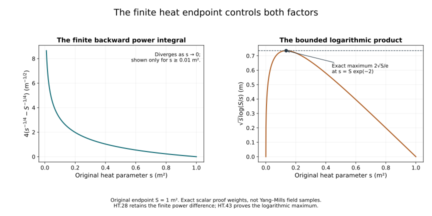

# Gauss law, heat curvature and fixed-time estimates

[Ordinary smoothing and physical-time bounds](../classical-potential-estimates.html)
gave explicit polynomials for the connection at a prescribed heat
endpoint. We now control the heat curvature between that endpoint
and the original physical slice. Gauss law supplies a zero initial
value that improves the temporal heat-curvature estimate from a
linear curvature bound to a quadratic one.

Keep the original physical coordinate t, speed c, spatial coordinates,
heat parameter s, endpoint S and trace pairing. Write a for the
caloric-temporal connection constructed in
[Global heat flow and the time component](../classical-dynamic-heat.html),
D for its covariant derivative, and F for its curvature. Thus
\(a_s=0\) and \(a_t(t,S)=0\). The physical equations hold at s=0.
All component sums, ordered derivative words, Fourier factors and
heat measures remain those of the earlier chapters.

The constants \(C_S,C_M,R_l,\varepsilon_*\) are the exact constants
proved in the [heat-analysis chapter](../classical-heat-analysis.html);
the physical endpoint polynomials \(P_k\) are those of HP.26.
Choose the same actual S satisfying \(S^{1/4}d\le\varepsilon_*\).
No connection component or coordinate is rescaled.

The human-source comparison is Sung-Jin Oh's
[*Finite energy global well-posedness of the Yang–Mills equations
on \(\mathbb R^{1+3}\)*, arXiv:1210.1557v2](https://arxiv.org/abs/1210.1557v2),
its fixed-time estimates and improved temporal heat-curvature
argument, together with the corresponding definitions in
[*Gauge choice for the Yang–Mills equations using the Yang–Mills
heat flow and local well-posedness in \(H^1\)*,
arXiv:1210.1558v2](https://arxiv.org/abs/1210.1558v2).
The complete derivations, constants, examples, exercises and figures
here are independently written.

## 1. Actual equation and its zero initial datum

Fix one physical time in the regular solution already constructed in
F09. Use its HD dynamic caloric-temporal representative. Put

\[
G_\mu=F_{s\mu}=\sum_jD_jF_{j\mu},\qquad
W=G_t,\qquad
\mathcal L=D_s-\sum_jD_jD_j .
\tag{HT.1}
\]

The original physical Gauss constraint gives
\(W(0)=\sum_jD_jF_{jt}(0)=0\), since \(F_{jt}=-F_{tj}\).
The full H9 identities are

\[
\mathcal LF_{\mu\nu}=-2\sum_k[F_{\mu k},F_{\nu k}],
\qquad [\mathcal L,D_j]X=2\sum_k[F_{jk},D_kX].
\tag{HT.2}
\]

Consequently direct differentiation of (HT.1) gives

\[
\begin{aligned}
\mathcal LG_\mu
={}&2\sum_{j,k}[F_{jk},D_kF_{j\mu}]
-2\sum_{j,k}[D_jF_{jk},F_{\mu k}]
-2\sum_{j,k}[F_{jk},D_jF_{\mu k}]\\
={}&2\sum_k[F_{\mu k},G_k].
\end{aligned}
\tag{HT.3}
\]

In the first and third sums, replace \(F_{\mu k}\) by
\(-F_{k\mu}\). Their sum contracts antisymmetric \(F_{jk}\)
against \(D_kF_{j\mu}+D_jF_{k\mu}\), so pairing (j,k) with
(k,j) cancels them exactly. The remaining sum uses
\(\sum_jD_jF_{jk}=G_k\) and antisymmetry of the bracket.
Thus the exact original equation is

\[
\mathcal LW=2\sum_k[F_{tk},G_k],\qquad W(0)=0.
\tag{HT.4}
\]

No temporal gauge at the initial heat boundary is needed for
this identity; the actual constraint and gauge covariance suffice.

## 2. Base weighted bound by a complete scalar kernel estimate

Retain \(d^2=c^{-2}\sum_i\|F_{ti}(0)\|_2^2+
\sum_{i<j}\|F_{ij}(0)\|_2^2\), and choose the actual S with
\(S^{1/4}d\le\varepsilon_*\). Let
\(f_m(s)=\|D^{(m)}F(s)\|_{2,c}\), the original positively
weighted full curvature norm. H9 gives

\[
\sup_s f_0(s)\le R_0d,\qquad
\left(\int_0^S f_1(s)^2\,ds\right)^{1/2}\le R_0d,
\qquad \|G_{\rm spatial}(s)\|_2\le\sqrt6 f_1(s).
\tag{HT.5}
\]

The actual forcing in (HT.4), denoted \(N_0\), obeys

\[
\|N_0(s)\|_1
\le4\|F_{t\cdot}(s)\|_2\|G_{\rm spatial}(s)\|_2
\le4c\sqrt6 R_0d\,f_1(s).
\tag{HT.6}
\]

The coefficient four keeps both the equation coefficient and
the bracket factor. The c converts the original electric norm.
The H9 covariant scalar comparison and Young inequality give

\[
\|W(s)\|_2\le
4c\sqrt6(8\pi)^{-3/4}R_0d
\int_0^s(s-r)^{-3/4}f_1(r)\,dr.
\tag{HT.7}
\]

Here the exact heat-kernel \(L^2\) norm is
\((8\pi(s-r))^{-3/4}\), in three original spatial coordinates.

For completeness set

\[
K(s,r)=s^{-1/4}(s-r)^{-3/4}\mathbf{1}_{0<r<s<S},
\quad q(r)=r^{-1/2},
\quad B_*^{\rm heat}=\int_0^1v^{-1/2}(1-v)^{-3/4}\,dv .
\tag{HT.8}
\]

The row and column integrals in the original ordinary measure are

\[
\begin{aligned}
\int_0^S K(s,r)q(r)\,dr
 &=q(s)B_*^{\rm heat},\\
\int_0^S K(s,r)q(s)\,ds
 &=q(r)\int_0^{1-r/S}v^{-3/4}(1-v)^{-1/2}\,dv\\
 &\le q(r)B_*^{\rm heat}.
\end{aligned}
\tag{HT.9}
\]

The first follows from r=sv, the second from v=1-r/s.
Weighted Cauchy–Schwarz gives

\[
\left|\int K(s,r)f(r)\,dr\right|^2
\le q(s)B_*^{\rm heat}\int K(s,r)|f(r)|^2/q(r)\,dr.
\tag{HT.10}
\]

Integrate in ds, use the column bound and Tonelli, and take
square roots. This proves the \(L^2(ds)\) operator bound
\(B_*^{\rm heat}\). Truncate away from the two singular
boundaries, apply the bound to differences, and pass to the
limit as in H9.21; thus the integral exists in the stated space.
Equations (HT.5)–(HT.9) prove the actual improved base bound

\[
Z_0:=\left(\int_0^S s^{-1/2}\|W(s)\|_2^2\,ds\right)^{1/2}
\le K_{\rm base}c d^2,\qquad
K_{\rm base}=4\sqrt6(8\pi)^{-3/4}(R_0)^2B_*^{\rm heat}.
\tag{HT.11}
\]

The finite endpoint remains in both the norm and the exact
column integral; replacing the latter by a larger positive
integral is solely the displayed inequality.

## 3. Every covariant derivative forcing

For an ordered spatial word I=(\(i_1\),...,\(i_m\)), the full
commutator identity is

\[
\begin{aligned}
\mathcal LD_IW
={}&D_I\left(2\sum_k[F_{tk},G_k]\right)\\
 &+2\sum_{r=1}^m
D_{i_1}\cdots D_{i_{r-1}}
 \sum_k[F_{i_rk},D_kD_{i_{r+1}}\cdots D_{i_m}W].
\end{aligned}
\tag{HT.12}
\]

Expand each preceding word by the complete covariant
Leibniz rule. In the first term the number of placements
with l derivatives on F is binomial(m,l). In the second
sum it is
\(\sum_{r=l+1}^m{r-1\choose l}={m\choose l+1}\).
Do not commute derivatives in either list. Their total
is \({m+1\choose l+1}\) for \(0\le l\le m\).
The contraction identity for G and W gives

\[
\|D^{(p)}G_{\rm spatial}\|_q\le\sqrt6\|D^{(p+1)}F\|_{q,c},
\qquad
\|D^{(p)}W\|_q\le c\sqrt6\|D^{(p+1)}F\|_{q,c}.
\tag{HT.13}
\]

They follow by Cauchy–Schwarz over the three contraction
indices and inclusion in the original weighted full tuple;
the factor sqrt(6) is the unchanged safe H9 constant.

For the complete output tuple of m derivative words, retain
the bound \(3^{m/2}\) from componentwise estimates. Each term
in (HT.12) has equation factor two, bracket factor two,
three k values and the contraction sqrt(6). Hölder and
covariant Sobolev therefore give for its full forcing \(N_m\)

\[
\|N_m(s)\|_2\le
12c\sqrt{6\,3^m}\,C_S^{3/2}
\sum_{l=0}^m{m+1\choose l+1}
 f_{l+1}(s)\bigl(f_{m-l+1}(s)f_{m-l+2}(s)\bigr)^{1/2}.
\tag{HT.14}
\]

All matrix factors and words are retained in (HT.12); the
only combination in (HT.14) counts their norm contributions.

Put \(J_m=\int_0^S s^{m/2+1/4}\|N_m(s)\|_2\,ds\).
The three exact extracted time powers are

\[
\frac l2+\frac{m-l}{4}+\frac{m-l+1}{4}
=\frac m2+\frac14.
\tag{HT.15}
\]

Hölder with exponents 2,4,4 and the H9 weighted integral
bounds hence give

\[
J_m\le c d^2\,\mathcal J_m,\qquad
\mathcal J_m=
12\sqrt{6\,3^m}C_S^{3/2}
\sum_{l=0}^m{m+1\choose l+1}
R_l\sqrt{R_{m-l}R_{m-l+1}}.
\tag{HT.16}
\]

This uses known curvature estimates at finite orders;
it assumes no improved estimate of W.

## 4. Weighted energy induction

Let \(h_m=\|D^{(m)}W\|_2\), and define

\[
U_m=\sup_{0<s\le S}s^{m/2+1/4}h_m(s),\qquad
V_m=\left(\int_0^S s^{m+1/2}h_{m+1}(s)^2\,ds\right)^{1/2}.
\tag{HT.17}
\]

Set \(\beta=m+1/2\). Pair the actual covariant equation
for D^m W with \(s^\beta D^mW\). The invariant trace
pairing and covariant integration by parts give exactly

\[
\tfrac12 s^\beta h_m(s)^2+
\int_0^s r^\beta h_{m+1}(r)^2\,dr
=\tfrac\beta2\int_0^s r^{\beta-1}h_m(r)^2\,dr
+\int_0^s r^\beta\langle D^{(m)}W,N_m\rangle\,dr.
\tag{HT.18}
\]

The initial weighted term is zero for the regular data;
spatial boundary terms vanish by the already proved Sobolev
cutoff argument. Put Z=\(Z_0\) for m=0, and Z=\(V_{m-1}\)
for \(m\ge1\). The last integral is at most \(U_m\) \(J_m\).
Taking the supremum first proves

\[
U_m^2\le\beta Z^2+2U_mJ_m,\qquad
U_m\le\sqrt\beta Z+2J_m.
\tag{HT.19}
\]

At the final endpoint, dropping only the nonnegative
boundary term in (HT.18) and using this \(U_m\) bound gives

\[
V_m^2\le\tfrac\beta2Z^2+(\sqrt\beta Z+2J_m)J_m
\le\beta Z^2+\tfrac52J_m^2.
\tag{HT.20}
\]

Consequently

\[
U_m+V_m\le2\sqrt{m+1/2}\,Z+4J_m.
\tag{HT.21}
\]

Define the explicit finite constants

\[
K_{-1}=K_{\rm base},\qquad
K_m=2\sqrt{m+1/2}\,K_{m-1}+4\mathcal J_m
\quad(m\ge0).
\tag{HT.22}
\]

Equations (HT.11), (HT.16) and (HT.21) prove by induction

\[
U_m+V_m\le K_m c d^2\qquad(m\ge0).
\tag{HT.23}
\]

This is the improved covariant temporal heat-curvature bound
with the original Gauss zero datum, all weights and complete
forcing terms. The case d=0 has W=0 by the already proved
curvature estimate and is included.

## 5. Recovering every ordinary potential derivative on (0,S]

Write \(G_i=F_{si}\). The original caloric equation gives exactly

\[
a_i(s)=a_i(S)-\int_s^S G_i(r)\,dr .
\tag{HT.24}
\]

The covariant H9.50 estimate, with its original component
contraction, implies for every \(l\ge0\)

\[
\|D^{(l)}G_{\rm spatial}(r)\|_\infty
\le\gamma_l r^{-l/2-5/4},\qquad
\gamma_l=\sqrt6 C_MC_S\sqrt{R_{l+2}R_{l+3}}\,d .
\tag{HT.25}
\]

Here the electric metric is not being applied to this spatial
subtuple; no factor c enters (HT.25).

Let \(q_k\)(s) be the maximum of the \(L^\infty\) norms of the
individual components of all ordinary k-derivatives of \(a_i\)(s).
The exact signed operation HP.22 applies to \(G_i\) as well as \(E_i\):
its derivation used only the unique final tensor leaf and
\(\partial_j=D_j-\operatorname{ad}(a_j)\).
Consequently the same complete polynomial \(b_k\) bounds each
ordinary k-derivative of \(G_i\) from the \(q_h\) and covariant norms.

Define \(a_k^{\rm wt}=k/2+1/4\) and the finite recursion

\[
\begin{aligned}
M_0&=S^{1/4}P_0(\theta)+4\gamma_0,\\
M_k&=S^{k/2+1/4}P_k(\theta)
+\frac{1}{k/2+1/4}
b_k(S^{1/4}M_0,\ldots,S^{1/4}M_{k-1};
                         \gamma_0,\ldots,\gamma_k)
\quad(k\ge1).
\end{aligned}
\tag{HT.26}
\]

This uses only previously defined \(M_h\); it is an actual finite
polynomial construction. We now prove

\[
q_k(s)\le M_k s^{-k/2-1/4}\qquad(0<s\le S).
\tag{HT.27}
\]

For k=0, (HT.24) and (HT.25) give the complete finite bound

\[
q_0(s)\le P_0(\theta)
+4\gamma_0(s^{-1/4}-S^{-1/4}),
\tag{HT.28}
\]

which implies (HT.27).

Suppose (HT.27) is established through k-1. In any exact
reverse-derivative term with j potential factors, their
orders \(h_1\),...,\(h_j\) and the covariant G order l satisfy
\(\sum(h_\nu+1)+l=k\). Thus its r power is exactly

\[
\sum_\nu(h_\nu/2+1/4)+l/2+5/4
=k/2+5/4-j/4.
\tag{HT.29}
\]

Retain every term, with the bracket multiplicities in \(b_k\).
Bound its remaining positive \(r^{j/4}\) by \(S^{j/4}\).
The full resulting estimate is

\[
\|\partial_I G_i(r)\|_\infty
\le r^{-k/2-5/4}
b_k(S^{1/4}M_0,\ldots,S^{1/4}M_{k-1};
                         \gamma_0,\ldots,\gamma_k).
\tag{HT.30}
\]

There is no order-k potential factor: every reverse term
contains a covariant G leaf and at most order k-1 on a.
Integrate the differentiated (HT.24) from the actual s to S.
Calling the \(b_k\) value \(B_k\) only within this line gives

\[
q_k(s)\le P_k(\theta)
+\frac{B_k}{k/2+1/4}
 (s^{-k/2-1/4}-S^{-k/2-1/4}).
\tag{HT.31}
\]

Both finite endpoints remain visible. Multiplying by
\(s^{k/2+1/4}\), bounding the first factor by its value at S
and the positive difference by one, proves precisely (HT.26)
and (HT.27). Induction proves every order for the original
connection, without a same-order Gronwall term.

The \(M_k\) all have units of inverse square root of length;
\(S^{1/4}M_k\) is dimensionless. This statement follows
from the original potential unit and the displayed weights,
not a change of physical coordinates. The full ordinary
derivative tuple is bounded by \(3^{(k+1)/2}q_k(s)\).
Each \(M_k\) is a polynomial in theta of degree at most k+1,
because the weighted order identity bounds the degree of
every product of preceding P or M factors.

## 6. Conversion of the actual temporal heat curvature

Take \(W=F_{st}\) from HT.1–HT.23 and keep its scalar
Lie-algebra output and every spatial derivative word.
The established covariant bounds imply

\[
\begin{aligned}
\sup_{0<s\le S}s^{l/2+1/4}\|D^{(l)}W(s)\|_2
 &\le K_l c d^2,\\
\left(\int_0^S s^{l-1/2}
             \|D^{(l)}W(s)\|_2^2\,ds\right)^{1/2}
 &\le K_{l-1}c d^2\qquad(l\ge0).
\end{aligned}
\tag{HT.32}
\]

For l=0 the second constant is the explicitly defined
\(K_{-1}\)=\(K_{\rm base}\), so this includes the base scalar-kernel
calculation rather than assuming a nonexistent lower
derivative. For \(l\ge1\) it is exactly the preceding (HT.17)
integral term \(V_{l-1}\).

For an ordinary word of length k, retain the full signed
reverse expansion. A term with j potential leaves and
covariant W order l contributes, after multiplication
by \(s^{k/2+1/4}\), the remaining power

\[
k/2+1/4-\sum_\nu(h_\nu/2+1/4)
 =l/2+1/4+j/4.
\tag{HT.33}
\]

Use (HT.27) on the potential leaves, retain the covariant
W factor, and bound \(s^{j/4}\le S^{j/4}\).
Taking the supremum uses the first line of (HT.32).
Taking the \(L^2(ds/s)\) norm uses its second line, since

\[
\int_0^S|s^{l/2+1/4}h_l(s)|^2\,\frac{ds}{s}
=\int_0^S s^{l-1/2}h_l(s)^2\,ds .
\tag{HT.34}
\]

There are \(3^k\) ordinary words and one output field W.
The componentwise triangle inequality, followed by this
full tuple conversion, proves the actual estimates

\[
\begin{aligned}
\sup_{0<s\le S}s^{k/2+1/4}\|\partial^{(k)}W(s)\|_2
&\le 3^{k/2}c d^2
b_k(S^{1/4}M_0,\ldots,S^{1/4}M_{k-1};
                              K_0,\ldots,K_k),\\
\left(\int_0^S s^{k-1/2}
              \|\partial^{(k)}W(s)\|_2^2\,ds\right)^{1/2}
&\le 3^{k/2}c d^2
b_k(S^{1/4}M_0,\ldots,S^{1/4}M_{k-1};
                              K_{-1},\ldots,K_{k-1}).
\end{aligned}
\tag{HT.35}
\]

The operation \(b_k\) is linear in its final-tensor variables,
which justifies taking c d^2 outside without removing any
coefficient or field contribution. At k=0 each formula
reduces to the corresponding estimate in (HT.32).

## 7. Exact physical derivative needed next

The Bianchi identity for (s,t,i), the caloric condition,
and the actual curvature heat equation HD.24 give

\[
\begin{aligned}
D_tG_i&=\partial_sF_{ti}+D_iW,\\
\partial_tG_i
&=\sum_jD_jD_jF_{ti}
+2\sum_j[F_{ij},F_{tj}]
+D_iW-[a_t,G_i].
\end{aligned}
\tag{HT.36}
\]

Indeed \(D_sF_{ti}+D_tF_{is}+D_iF_{st}=0\) and
\(F_{is}\)=-\(G_i\). Expanding \(D_tG_i\) retains the last bracket
with its negative sign. This is the exact map to the
physical derivative; no time term is dropped.

The original endpoint temporal gauge also gives

\[
a_t(s)=-\int_s^S W(r)\,dr .
\tag{HT.37}
\]

Covariant Morrey–Sobolev and (HT.23) give the useful actual bound

\[
\begin{aligned}
\|W(r)\|_\infty
 &\le C_MC_S\sqrt{K_1K_2}\,c d^2\,r^{-1},\\
\|a_t(s)\|_\infty
 &\le C_MC_S\sqrt{K_1K_2}\,c d^2\log(S/s).
\end{aligned}
\tag{HT.38}
\]

The powers follow from \(h_1\le K_1cd^2r^{-3/4}\) and
\(h_2\le K_2cd^2r^{-5/4}\). The logarithm is dimensionless;
the original time component keeps its inverse-time unit.
This estimate is for s>0 and makes no false finite bound
at s=0. The physical-boundary norms require the remaining
heat integration and wave estimates.

## 8. The finite polynomial operation with known potential coefficients

Put \(u_h=S^{1/4}M_h\), with \(M_h\) proved in HT.26, and abbreviate
the evaluation of the exact polynomial HP.24 by

\[
\mathcal B_m[v]
=b_m(u_0,\ldots,u_{m-1};v_0,\ldots,v_m).
\tag{HT.39}
\]

It is linear in the list v. This is evaluation of a finite
polynomial bound; the original fields and derivatives remain
those in the exact reverse expansion.

The H9 spatial heat-curvature bounds and that expansion give
the following bounds on every individual ordinary q-derivative
component of \(G_i\):

\[
\begin{aligned}
L_q^\infty&=\mathcal B_q[(\sqrt6 R_{l+1})_{l\ge0}],&
\sup_{0<s\le S}s^{(q+1)/2}\|\partial_I G_i(s)\|_2
 &\le dL_q^\infty,\\
L_q^2&=\mathcal B_q[(\sqrt6 R_l)_{l\ge0}],&
\left(\int_0^S s^q\|\partial_I G_i(s)\|_2^2\,ds\right)^{1/2}
 &\le dL_q^2 .
\end{aligned}
\tag{HT.40}
\]

Indeed a term with j potential leaves and final covariant order l
has residual heat power \(s^{j/4}\), exactly as HT.33. Bound it by
\(S^{j/4}\), use the two original H9.49 estimates, and retain every
coefficient in \(b_q\). The full tuple bounds are
\(3^{(q+1)/2}dL_q^\infty\) and \(3^{(q+1)/2}dL_q^2\).

## 9. All ordinary derivatives of the time component

Covariant Morrey–Sobolev and (HT.23) give

\[
\|D^{(l)}W(s)\|_\infty
\le c d^2 H_l\,s^{-l/2-1},\qquad
H_l=C_MC_S\sqrt{K_{l+1}K_{l+2}}.
\tag{HT.41}
\]

The exact two powers in the Morrey product are
l/2+3/4 and l/2+5/4. Apply the same reverse expansion
to W in \(L^\infty\), and then differentiate the actual
integral \(a_t(s)=-\int_s^S W(r)\,dr\).
For every ordinary word I of length h this proves

\[
\begin{aligned}
\|a_t(s)\|_\infty
 &\le c d^2 H_0\log(S/s),\\
\|\partial_Ia_t(s)\|_\infty
 &\le c d^2 A_h(s^{-h/2}-S^{-h/2})\quad(h\ge1),\\
A_h&=\frac2h\,\mathcal B_h[H].
\end{aligned}
\tag{HT.42}
\]

The spatial reverse expansion gives an integrand bounded by
\(c d^2\mathcal B_h[H]r^{-h/2-1}\). Its integral is the
displayed finite difference for \(h\ge1\) and the logarithm for
h=0. No heat-boundary value at zero is estimated by the
logarithm.

The elementary scalar maximum needed for the product term is

\[
\sup_{0<s\le S}\sqrt{s}\log(S/s)=\frac2e\sqrt S.
\tag{HT.43}
\]

Set s=S exp(-v), v>=0. The function is
sqrt(S) v exp(-v/2); its derivative vanishes at v=2,
is positive before and negative after. The endpoints
give zero. This proves both the constant and its attaining
point \(s=S e^{-2}\).

## 10. Each term of the original physical derivative equation

Retain the exact HT.36 identity, writing \(E_i\)=\(F_{ti}\):

\[
\partial_tG_i=Y_i+Z_i+J_i-[a_t,G_i],\qquad
Y_i=\sum_jD_jD_jE_i,\quad
Z_i=2\sum_j[F_{ij},E_j],\quad J_i=D_iW.
\tag{HT.44}
\]

Here \(J_i\) is a field and is unrelated to the scalar forcing
integral \(J_m\) in HT.16. The four terms will each be bounded
before they are added.

For the first field, contraction over j and the original
electric weight give

\[
\|D^{(l)}Y(s)\|_2\le\sqrt3 c f_{l+2}(s).
\tag{HT.45}
\]

Consequently its individual ordinary m-derivative components,
with weight \(s^{m/2+1}\), have supremum and \(L^2(ds/s)\) bounds

\[
\sqrt3 c d\,\mathcal B_m[(R_{l+2})_{l\ge0}],
\qquad
\sqrt3 c d\,\mathcal B_m[(R_{l+1})_{l\ge0}],
\tag{HT.46}
\]

respectively. For the integral norm, H9 gives precisely
\(\int_0^S s^{l+1}f_{l+2}^2ds\le R_{l+1}^2d^2\).
For both norms the reverse expansion keeps its additional
\(s^{j/4}\) factors and bounds them by \(S^{j/4}\).

For the second field, differentiate each original bracket by
the full covariant Leibniz rule. Put the spatial-curvature
factor in \(L^\infty\) and the electric factor in \(L^2\). Every
covariant derivative word of length l then satisfies the
safe full-tuple bound

\[
\begin{aligned}
\|D^{(l)}Z(s)\|_2
 &\le c d^2 C_l\,s^{-l/2-3/4},\\
C_l&=12\,3^{(l+1)/2}C_MC_S
\sum_{r=0}^l{l\choose r}
       \sqrt{R_{r+1}R_{r+2}}R_{l-r}.
\end{aligned}
\tag{HT.47}
\]

The coefficient twelve keeps the equation factor two,
bracket factor two and three contraction indices. The
remaining factor bounds the full output/word tuple.
The powers are r/2+3/4 from the first factor and
(l-r)/2 from the second.
Multiplication by \(s^{l/2+1}\) leaves \(s^{1/4}\).
Its supremum is \(S^{1/4}\), and its \(L^2(ds/s)\) norm is
\(\sqrt2S^{1/4}\), since the exact squared integral is
\(\int_0^S s^{1/2}ds/s=2\sqrt S\).
The ordinary reverse expansion therefore yields component
bounds

\[
c d^2 S^{1/4}\mathcal B_m[C],\qquad
\sqrt2 c d^2 S^{1/4}\mathcal B_m[C].
\tag{HT.48}
\]

For the third field, the covariant derivative tuple is a
subtuple of \(D^{(l+1)}W\). The two estimates in (HT.32) thus give

\[
\begin{aligned}
\sup_s s^{l/2+1}\|D^{(l)}J(s)\|_2
 &\le S^{1/4}K_{l+1}c d^2,\\
\left(\int_0^S s^{l+1}\|D^{(l)}J(s)\|_2^2ds\right)^{1/2}
 &\le S^{1/4}K_l c d^2 .
\end{aligned}
\tag{HT.49}
\]

The first has the leftover \(s^{1/4}\) in its supremum.
For the second, the \(V_l\) integral in (HT.17) has weight \(s^{l+1/2}\);
the remaining \(s^{1/2}\) is bounded by \(S^{1/2}\) before taking
the square root. Ordinary conversion gives component bounds

\[
c d^2 S^{1/4}\mathcal B_m[(K_{l+1})_{l\ge0}],
\qquad
c d^2 S^{1/4}\mathcal B_m[(K_l)_{l\ge0}].
\tag{HT.50}
\]

For the last field, use the ordinary Leibniz rule itself:
every subset of h out of m derivative positions differentiates
\(a_t\) and the other positions differentiate \(G_i\). The bracket
costs two. For \(h\ge1\), (HT.42) bounds
\(s^{h/2}\) times that \(a_t\) derivative by c d^2 \(A_h\).
The other factor is controlled by (HT.40) at q=m-h.
After multiplication by \(s^{m/2+1}\), the remaining factor is
\(\sqrt{s}\le\sqrt S\). For h=0 this remaining factor is
\(\sqrt{s}\log(S/s)\), whose exact supremum is (HT.43).
This works for both time norms, since the potential factors
are placed in the appropriate supremum and the G factor
keeps its original time norm. Hence the component bounds are

\[
2c d^3\sqrt S
\left\{\frac2e H_0L_m^p+
\sum_{h=1}^m{m\choose h}A_hL_{m-h}^p\right\},
\qquad p=\infty,2.
\tag{HT.51}
\]

The sum is empty at m=0. The \(h\ge1\) estimate retains the
stronger finite endpoint difference in (HT.42) before the
nonnegative upper bound used here.

## 11. Complete fixed-time physical derivative bounds

Let \(\|\cdot\|_{\mathcal T^\infty}\) mean the supremum over
(0,S], and let \(\|\cdot\|_{\mathcal T^2}\) mean \(L^2(ds/s)\)
over exactly that interval. The preceding computations prove
the following full-tuple estimates for every \(m\ge0\):

\[
\begin{aligned}
\|s^{m/2+1}\partial^{(m)}\partial_tG\|_{\mathcal T^\infty L^2_x}
\le 3^{(m+1)/2}\biggl\{&
\sqrt3 c d\,\mathcal B_m[(R_{l+2})]\\
&+c d^2 S^{1/4}
 \left(\mathcal B_m[C]+\mathcal B_m[(K_{l+1})]\right)\\
&+2c d^3\sqrt S\left(\frac2eH_0L_m^\infty
+\sum_{h=1}^m{m\choose h}A_hL_{m-h}^\infty\right)\biggr\},\\
\|s^{m/2+1}\partial^{(m)}\partial_tG\|_{\mathcal T^2 L^2_x}
\le 3^{(m+1)/2}\biggl\{&
\sqrt3 c d\,\mathcal B_m[(R_{l+1})]\\
&+c d^2 S^{1/4}
 \left(\sqrt2\mathcal B_m[C]+\mathcal B_m[(K_l)]\right)\\
&+2c d^3\sqrt S\left(\frac2eH_0L_m^2
+\sum_{h=1}^m{m\choose h}A_hL_{m-h}^2\right)\biggr\}.
\end{aligned}
\tag{HT.52}
\]

Every indexed list here runs from l=0 to m. The common
factor counts all \(3^{m+1}\) derivative/output components.
Each right-hand side is an explicit finite expression in
the original S, c, conserved curvature norm d, and the
endpoint polynomials already constructed from the initial
datum. No wave estimate has been used or assumed.

For k=m+1, the left weight \(s^{m/2+1}\) is exactly the
weight in the source's physical derivative of heat curvature:

\[
s^{5/4}s^{-3/4}s^{(k-1)/2}s^{1/2}
=s^{m/2+1}.
\tag{HT.53}
\]

Its squared \(L^2(ds/s)\) integral has original weight \(s^{m+1}ds\).
The spatial part at order k uses \(s^{(k+1)/2}\), as proved
in (HT.40). This proves the fixed-time heat-curvature
requirements through k=10 and beyond while retaining
the original physical coordinate and all heat factors.
Together with HP.28 and (HT.24)–(HT.35), it completes these fixed-time
steps on the existing physical interval. The physical
lifespan still requires the exact wave estimates.

## 12. What the zero Gauss datum contributes

The improved estimate uses the actual identity W(0)=0.
Its role can be tested without changing the original fields
of the dynamic Gaussian example HD.31–HD.34.
Keep \(L>0,\omega>0,\varepsilon>0\) and
\(T=\operatorname{diag}(i,-i)\), with \(\kappa_T=2\). At
physical time \(t=t_*\), those original fields give

\[
\begin{aligned}
g(x)&=\exp(-|x|^2/(2L^2)),\\
h_s(x)&=\left(\frac{L^2}{L^2+2s}\right)^{3/2}
             \exp(-|x|^2/(2(L^2+2s))),\\
F_{ti}(s)&=\varepsilon\omega\,\partial_i h_sT,\qquad
F_{ij}=0,\quad G_i=0,\quad
W(s)=-\varepsilon\omega\,\Delta h_sT .
\end{aligned}
\tag{HT.54}
\]

All brackets vanish and \(W(s)=e^{s\Delta}W(0)\).
Its actual initial Gauss expression is nonzero. This is
the regular dynamic heat connection already constructed in
HD, with its computed defect against the physical constraint.

The complete radial integrals, with scalar g and \(h_s\), are

\[
\|\nabla g\|_2^2=\frac{3\pi^{3/2}L}{2},\qquad
\|\Delta h_s\|_2^2=
\frac{15\pi^{3/2}L^6}{4(L^2+2s)^{7/2}}.
\tag{HT.55}
\]

These follow from HP.30, respectively j=0 and j=1 after
removing only its explicitly separated matrix and amplitude
factors; both scalar integrals remain displayed. The original
positive curvature norm and temporal norm consequently satisfy

\[
\begin{aligned}
d^2&=c^{-2}\varepsilon^2\omega^2\kappa_T\|\nabla g\|_2^2,\\
\frac{S^{1/4}\|W(S)\|_2}{c d^2}
&=\frac{cS^{1/4}\|\Delta h_S\|_2}
 {\varepsilon\omega\sqrt{\kappa_T}\|\nabla g\|_2^2}.
\end{aligned}
\tag{HT.56}
\]

At fixed L,S,c,omega the second quantity tends to infinity
as epsilon decreases to zero. The heat smallness threshold
continues to hold for all sufficiently small epsilon.
Thus the improved quadratic bound with the displayed
energy-independent constants cannot omit its Gauss datum.

There is an exact extension retaining that missing datum.
For any regular dynamic heat connection in the same class,
let V be the solution of
\(\mathcal LV=0,\ V(0)=W(0)\), with the already constructed
spatial coefficients. The linear contraction in HD.18–HD.21,
with zero forcing and those same coefficients, constructs V
on every finite heat interval; its covariant energy identity
proves uniqueness. Then Z=W-V satisfies
\(\mathcal LZ=N_0,\ Z(0)=0\), exactly.
Scalar comparison gives

\[
\|V(s)\|_2\le\|W(0)\|_2,\qquad
Z_0\le\sqrt2 S^{1/4}\|W(0)\|_2+K_{\rm base}c d^2.
\tag{HT.57}
\]

In this formula \(Z_0\) is the weighted norm of W defined in
(HT.11), while the field Z=W-V is a different, explicitly
defined object. The first term comes from the complete
integral \(\int_0^S s^{-1/2}ds=2\sqrt S\). The zero-data
part is the same scalar-kernel estimate already proved.
The exact decomposition W=V+Z identifies the contribution
of the original nonzero Gauss datum.

For completeness, every subsequent forcing bound (HT.14)
still holds, since W remains the actual contraction \(G_t\).
The weighted boundary term in (HT.18) vanishes for regular
data whether or not W(0) is zero. Define

\[
\Lambda_{-1}=\sqrt2 S^{1/4}\|W(0)\|_2,\qquad
\Lambda_m=2\sqrt{m+1/2}\,\Lambda_{m-1}\quad(m\ge0).
\tag{HT.58}
\]

The same proved energy induction now gives the full extension

\[
U_m+V_m\le\Lambda_m+K_m c d^2\qquad(m\ge0).
\tag{HT.59}
\]

It reduces to (HT.23) exactly when the actual Gauss datum
vanishes. This supplies the connecting solution and complete
corrected bound for the larger dynamic class.

**Figure HT.** Exact scalar factors on the original interval
\(0<s\le S=1\) square metre. The left panel shows
\(4(s^{-1/4}-S^{-1/4})\), the coefficient of \(\gamma_0\) in
(HT.28), in inverse square root of metres. The right shows
\(\sqrt{s}\log(S/s)\) in metres, with its proved maximum
\(2\sqrt S/e\) at \(s=S e^{-2}\), from (HT.43).
The left panel is sampled only for \(s\ge0.01\) square metre;
its divergence at zero is stated, not plotted as a finite value.
These are exact scalar weights in the proofs, not sampled
Yang–Mills solutions.

## 13. Exercises with complete solutions

### Exercise 1. The sign of the temporal forcing

Prove the cancellation in (HT.3) with every contracted index.

**Solution.** Its first and third sums combine to

\[
2\sum_{j,k}[F_{jk},D_kF_{j\mu}+D_jF_{k\mu}].
\tag{HT.60}
\]

For j=k, \(F_{jj}\)=0. For each j distinct from k, exchange
their two labels in the second occurrence. The inner
derivative sum is symmetric and \(F_{kj}\)=-\(F_{jk}\), so the pair
has sum zero. The remaining term is

\[
-2\sum_k[G_k,F_{\mu k}]
=2\sum_k[F_{\mu k},G_k].
\tag{HT.61}
\]

At mu=t this is exactly the positive forcing in (HT.4).
No physical time derivative was replaced by a spatial one.

### Exercise 2. Both sides of the kernel estimate

Derive the two finite row and column integrals (HT.9).

**Solution.** In the row integral put r=sv; its factors
are \(s^{-1/4}s^{-3/4}s^{-1/2}s=s^{-1/2}\).
The remaining integral is
\(\int_0^1(1-v)^{-3/4}v^{-1/2}dv\).
In the column put \(v=1-r/s\), so
\(s=r/(1-v)\), \(s-r=rv/(1-v)\) and
\(ds=r(1-v)^{-2}dv\). The resulting factors are

\[
r^{-1/2}v^{-3/4}(1-v)^{-1/2}\,dv,
\quad 0<v<1-r/S.
\tag{HT.62}
\]

This proves the exact finite column formula. Its positive
integrand permits the displayed upper bound by the integral
over (0,1), equal to the same constant by v->1-v.

### Exercise 3. All covariant forcing placements

Prove the multiplicity binomial(m+1,l+1) in (HT.14).

**Solution.** The m derivatives on the original forcing
choose l of their positions for F, giving binomial(m,l).
In commutator position r, its r-1 preceding derivatives
choose l positions for F. Sum this over r=l+1,...,m.
Count subsets of size l+1 of the first m positions by
their greatest element r; the preceding l positions
can be chosen in binomial(r-1,l) ways. Therefore that
sum is binomial(m,l+1). The two contributions add by
Pascal's identity to binomial(m+1,l+1), including l=m,
where the commutator contribution is zero. Every original
word keeps its order; this count does not commute derivatives.

### Exercise 4. The energy recursion coefficient

Derive (HT.21) from the full weighted energy identity.

**Solution.** Write beta=m+1/2, J=\(J_m\) and Z for its prior
weighted norm. Taking the supremum first gives
\(U^2\le\beta Z^2+2UJ\). Solving that quadratic with \(U\ge0\),

\[
U\le J+\sqrt{J^2+\beta Z^2}\le2J+\sqrt\beta Z.
\tag{HT.63}
\]

At the final endpoint, the nonnegative boundary term gives

\[
V^2\le\tfrac\beta2Z^2+UJ
\le\tfrac\beta2Z^2+2J^2+\sqrt\beta ZJ
\le\beta Z^2+\tfrac52J^2.
\tag{HT.64}
\]

The last step is the elementary inequality
\(2\sqrt\beta ZJ\le\beta Z^2+J^2\).
Taking square roots and adding yields
\(U+V\le2\sqrt\beta Z+(2+\sqrt{5/2})J
\le2\sqrt\beta Z+4J\).
This preserves both the supremum and final integral estimates.

### Exercise 5. The first backward derivative

Write the exact finite bound for \(q_1\)(s) using the previously
constructed \(M_0\) and \(\gamma_0\),\(\gamma_1\).

**Solution.** Since \(b_1(x;y)=y_1+2x_0y_0\),
the numerator in (HT.31) is
\(B_1=\gamma_1+2S^{1/4}M_0\gamma_0\).
The denominator k/2+1/4 at k=1 is 3/4. Hence

\[
q_1(s)\le P_1(\theta)+\frac43
(\gamma_1+2S^{1/4}M_0\gamma_0)
(s^{-3/4}-S^{-3/4}).
\tag{HT.65}
\]

Multiplication by \(s^{3/4}\) gives exactly the bound \(M_1\)
in (HT.26), including the original endpoint term.
The estimate uses \(M_0\), whose independent construction
was already completed; it assumes no bound on \(q_1\).

### Exercise 6. Recover the physical derivative equation

Derive all four terms in (HT.44) from Bianchi.

**Solution.** The original three-index identity is

\[
D_sF_{ti}+D_tF_{is}+D_iF_{st}=0.
\tag{HT.66}
\]

Use \(a_s\)=0, \(F_{is}\)=-\(G_i\) and \(F_{st}\)=W. This gives
\(D_tG_i=\partial_sF_{ti}+D_iW\).
HD.24 supplies
\(\partial_sF_{ti}=\sum_jD_jD_jF_{ti}
+2\sum_j[F_{ij},F_{tj}]\).
Finally \(D_tG_i=\partial_tG_i+[a_t,G_i]\).
Substituting these exact identities gives (HT.44), including
its negative temporal connection term.

### Exercise 7. The logarithmic term in both time norms

Prove the h=0 contribution in (HT.51), with its exact constant.

**Solution.** For each ordinary word of length m, use
\(\|a_t(s)\|_\infty\le c d^2 H_0\log(S/s)\) and the
bracket factor two. The weighted product is bounded by

\[
2c d^2 H_0\sqrt{s}\log(S/s)\,
\bigl(s^{(m+1)/2}\|\partial_I G_i(s)\|_2\bigr).
\tag{HT.67}
\]

The first scalar weight has supremum \(2\sqrt S/e\)
by (HT.43). Multiplication by a bounded scalar function
has that same operator bound on both \(L^\infty\) and
\(L^2(ds/s)\). Applying (HT.40) gives

\[
2c d^3\sqrt S\,\frac2e H_0L_m^p,\qquad p=\infty,2,
\tag{HT.68}
\]

the complete h=0 term in the claimed estimate.

### Exercise 8. Keep the original Gauss datum

Explain why (HT.59), with its nonzero initial term, applies
to the exact Gaussian example, while (HT.23) alone does not.

**Solution.** Here \(G_i\)=0 and all brackets vanish, so \(N_0\)=0
and W is exactly its homogeneous heat evolution. Its
initial datum is \(-\varepsilon\omega\Delta g\,T\), whose
\(L^2\) norm is nonzero and linear in epsilon. Thus the
decomposition above has V=W and Z=0. Its initial
contribution is exactly

\[
\Lambda_{-1}=\sqrt2 S^{1/4}\varepsilon\omega
              \sqrt{\kappa_T}\|\Delta g\|_2 .
\tag{HT.69}
\]

The higher \(\Lambda_m\) follow the displayed finite recursion
and remain linear in epsilon. This retains the term
needed by the original example. In contrast, c d squared
is quadratic in epsilon; the exact ratio (HT.56) proves
that it cannot bound this family alone. For the physical
solutions, Gauss law makes that same Lambda term zero,
recovering the improved estimate without altering the datum.

## 14. The remaining wave step

The chapter proves the fixed-time endpoint, spatial and
temporal heat-curvature controls used by the physical
continuation argument. The remaining step is a local
physical-time analysis with the precise wave norms,
including the boundary gauge terms and the wave forcing.
[Wave energy, dispersion and null forms](../classical-wave-estimates.html)
now proves the complete linear wave estimates, exact physical
coordinate maps and all required Fourier constants. The remaining
nonlinear Yang–Mills wave equations, boundary gauge bounds and
physical continuation are the next parts of the argument.
