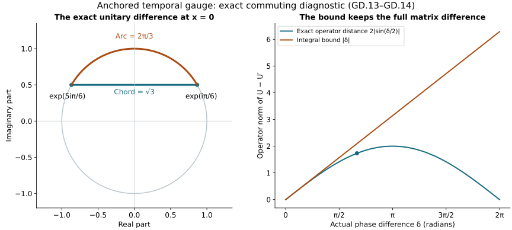

# Differences through the physical temporal gauge

This Unit 9 analytic chapter carries estimates for two connections
through their actual anchored gauge maps. It computes every first
and second spatial derivative, the inverse terms, and the receiving
physical connection and curvature differences. The resulting local
Lipschitz bounds preserve the original homogeneous representatives.

Read [the physical gauge construction](../classical-physical-gauge.html),
GO.1–GO.39, and [temporal-boundary differences](../classical-temporal-difference.html),
TD.1–TD.27. Section 5 gives an exact commuting connection example.
It illustrates the gauge map without claiming to solve the evolution equation.

Human-source context: Sung-Jin Oh,
[*Gauge choice for the Yang–Mills equations using the Yang–Mills heat flow
and local well-posedness in H1*, arXiv:1210.1558v2](https://arxiv.org/abs/1210.1558v2).
The proofs here use the complete linked course arguments and are
independent exposition. They make no novelty claim. Exact source
versions and bounded reading are retained in the course provenance.

## 1. Two original connections and their anchored maps

Let \(a\) and \(a'\) be two regular connections on the original
\(I\times\mathbb R^3\), at heat boundary \(s=0\). Set \(b=a_t\) and \(b'=a_t'\).
Take the same \(t_*\in I\) and the GO solutions

\[
\partial_t U=Ub,\qquad \partial_t U'=U'b',\qquad
U(t_*)=U'(t_*)=I_N,\qquad Z=U-U',\quad \delta b=b-b'.
\tag{GD.1}
\]

The original group is \(G\subset U(N)\). An undifferentiated matrix
gauge has operator norm one. Every differentiated matrix and every
Lie-algebra field has the Hilbert–Schmidt norm. Spatial tuples contain
every ordered index; no diagonal or off-diagonal Hessian entry is dropped.
All norms below are on the original \(\mathbb R^3\). For \(J_t\) the unoriented interval
between \(t_*\) and \(t\), retain GO's actual integrals

\[
\begin{aligned}
P&=\int_{J_t}\|\partial b(r)\|_3\,dr,&
Q&=\int_{J_t}\|\partial b(r)\|_6\,dr,&
H_b&=\int_{J_t}\|\partial^{(2)}b(r)\|_2\,dr,\\
P'&=\int_{J_t}\|\partial b'(r)\|_3\,dr,&
Q'&=\int_{J_t}\|\partial b'(r)\|_6\,dr,&
H_b'&=\int_{J_t}\|\partial^{(2)}b'(r)\|_2\,dr,\\
D_0&=\int_{J_t}\|\delta b(r)\|_{\infty;\mathrm{op}}\,dr,&
D_3&=\int_{J_t}\|\partial\delta b(r)\|_3\,dr,&
D_6&=\int_{J_t}\|\partial\delta b(r)\|_6\,dr,\\
D_2&=\int_{J_t}\|\partial^{(2)}\delta b(r)\|_2\,dr.
\end{aligned}\tag{GD.2}
\]

These are finite for each of the actual regular connections and also
for the boundary domains of GO.4. Indeed the difference norms are at
most the sums of the corresponding two individual norms. The exact
GO.6–GO.7 Sobolev proof, applied to the difference, gives
\(Q\le C_SH_b\), \(Q'\le C_SH_b'\), and \(D_6\le C_SD_2\), with \(C_S=4/\sqrt3\).
It is not necessary to replace the sharper actual integrals by these
upper bounds. The primed objects are a second connection, not derivatives.

## 2. Unitary variation, including the backward time direction

Matrix differentiation gives the exact identity

\[
\partial_t(U(U')^{-1})=U\delta b(U')^{-1},\qquad
U(U')^{-1}-I_N=\int_{t_*}^{t}U(r)\delta b(r)(U'(r))^{-1}\,dr.
\tag{GD.3}
\]

Both integrals are oriented. Unitary multiplication preserves the
operator norm, and \(Z=(U(U')^{-1}-I_N)U'\). Consequently
\(\sup_{r\in J_t}\|Z(r)\|_{\infty;\mathrm{op}}\le D_0\).
This estimate has no exponential in the individual sizes of \(b\) or \(b'\).

The equation for \(Z\) and its complete differentiated equations are

\[
\begin{aligned}
\partial_tZ&=Zb'+U\delta b,\\
\partial_t\partial_iZ&=(\partial_iZ)b'
 +Z\partial_i b'+(\partial_iU)\delta b+U\partial_i\delta b,\\
\partial_t\partial_j\partial_iZ&=(\partial_j\partial_iZ)b'
 +(\partial_iZ)\partial_jb'+(\partial_jZ)\partial_i b'
 +Z\partial_j\partial_i b'\\
&\quad +(\partial_j\partial_iU)\delta b
 +(\partial_iU)\partial_j\delta b
 +(\partial_jU)\partial_i\delta b
 +U\partial_j\partial_i\delta b .
\end{aligned}\tag{GD.4}
\]

No matrix factors commute in these identities. Every initial spatial
derivative of \(Z\) is zero. For any equation \(Y_t=Yb'+F\) with zero anchored
datum, differentiation of \(Y(U')^{-1}\) gives \(F(U')^{-1}\); hence
\(Y(t)=(\int_{t_*}^tF(r)(U'(r))^{-1}dr)U'(t)\).
This proves the norm bound by the unoriented integral of \(\|F\|\) for
both time directions and for every spatial tuple and indicated exponent.
It justifies each following use of variation of constants without a
Grönwall loss from the undifferentiated \(b'\) term.

Define the following explicit numerical quantities at the given \(t\):

\[
\begin{aligned}
z_3&=D_3+D_0(P+P'),\\
z_6&=D_6+D_0(Q+Q'),\\
z_2&=D_2+D_0(H_b'+H_b+PQ)+2z_3Q'+2PD_6.
\end{aligned}\tag{GD.5}
\]

GO.13 and GO.18–GO.22 give throughout \(J_t\)
\(\|\partial U\|_3\le P\), \(\|\partial U\|_6\le Q\), and
\(\|\partial^{(2)}U\|_2\le H_b+PQ\). The first derivative equation in GD.4
therefore gives \(z_3\) and \(z_6\), using spatial Hölder with \(\delta b\) in
operator \(L^\infty\). For the Hessian equation, its two terms with
\(\partial Z\) and \(\partial b'\) have full tuple norm at most
\(2\|\partial Z\|_3\|\partial b'\|_6\). This follows pointwise from
\(\sum_{i,j}|X_iY_j|^2\le |X|^2|Y|^2\) and the triangle inequality for
the two distinct placements. Its two terms with \(\partial U\) and
\(\partial\delta b\) have bound \(2P\|\partial\delta b\|_6\). The other three
forcing contributions are exactly \(D_2\), \(D_0H_b'\), and
\(D_0(H_b+PQ)\) after integration. Thus

\[
\begin{aligned}
\sup_{r\in J_t}\|Z(r)\|_{\infty;\mathrm{op}}&\le D_0,\\
\sup_{r\in J_t}\|\partial Z(r)\|_3&\le z_3,\qquad
\sup_{r\in J_t}\|\partial Z(r)\|_6\le z_6,\\
\sup_{r\in J_t}\|\partial^{(2)}Z(r)\|_2&\le z_2.
\end{aligned}\tag{GD.6}
\]

The same exact identities hold with the two connections exchanged. Every resulting bound therefore holds independently. Also unitarity and the triangle inequality give the upper bound two for the operator norm of their difference, so its upper bound can be reduced to the minimum of two and the integral bound. Section 8 derives the stronger linear dependence needed in the receiving physical map.

All coefficients on the right are evaluated on the larger \(J_t\), so
each also bounds the intermediate subinterval needed inside an integral.
This supplies the suprema used in the Hessian argument.

## 3. The logarithmic derivative and its full derivative

Set \(K_i=(\partial_iU)U^{-1}\), \(K_i'=(\partial_iU')(U')^{-1}\).
The exact inverse difference is \(U^{-1}-(U')^{-1}=-U^{-1}Z(U')^{-1}\).
In particular it has the same operator norm as \(Z\). The exact identities

\[
\begin{aligned}
K_i-K_i'&=(\partial_iZ)U^{-1}
 +(\partial_iU')(U^{-1}-(U')^{-1}),\\
\partial_jK_i&=(\partial_j\partial_iU)U^{-1}-K_iK_j,\\
\partial_j(K_i-K_i')&=(\partial_j\partial_iZ)U^{-1}
 +(\partial_j\partial_iU')(U^{-1}-(U')^{-1})
 -(K_i-K_i')K_j-K_i'(K_j-K_j')
\end{aligned}\tag{GD.7}
\]

retain the actual order \(K_iK_j\). Define

\[
k_3=z_3+D_0P',\qquad k_6=z_6+D_0Q',\qquad
k_2=z_2+D_0(H_b'+P'Q')+k_3Q+P'k_6.
\tag{GD.8}
\]

Section 8 derives a second route directly from the time derivative of
this same logarithmic derivative.

Unitary invariance, GD.6 and the full tuple product estimate just proved
give \(\sup\|K-K'\|_3\le k_3\), \(\sup\|K-K'\|_6\le k_6\), and
\(\sup\|\partial(K-K')\|_2\le k_2\) on \(J_t\). The last two products use \(L^3\) times
\(L^6\) in precisely their displayed order. No square of a derivative gauge
matrix has been discarded.

## 4. The receiving physical connection and curvature

Write \(\delta a=a-a'\) for the spatial connections at heat boundary.
At any \(r\) in \(J_t\), set \(B_i=Ua_iU^{-1}\), \(B_i'=U'a_i'(U')^{-1}\) and
\(A_i=B_i-K_i\), \(A_i'=B_i'-K_i'\). These are exactly GO.27's physical
temporal connections, so \(A_t=A_t'=0\). Their difference is

\[
\begin{aligned}
B_i-B_i'&=U\delta a_i U^{-1}
 +Za_i'U^{-1}+U'a_i'(U^{-1}-(U')^{-1}),\\
\partial_j(B_i-B_i')&=
 U\partial_j\delta a_iU^{-1}
 +Z\partial_ja_i'U^{-1}+U'\partial_ja_i'(U^{-1}-(U')^{-1})\\
&\quad+[K_j-K_j',B_i]+[K_j',B_i-B_i'].
\end{aligned}\tag{GD.9}
\]

For clarity the second identity is obtained by first differentiating
\(B_i\) to get \(U(\partial_j a_i)U^{-1}+[K_j,B_i]\), and then subtracting
the primed identity. It contains all derivatives of both inverse matrices.
The bracket bound is the original coefficient two in Hilbert–Schmidt norm.
Therefore, at every such \(r\),

\[
\begin{aligned}
\|A-A'\|_6
&\le\|\delta a\|_6+2D_0\|a'\|_6+k_6,\\
\|\partial(A-A')\|_2
&\le\|\partial\delta a\|_2+2D_0\|\partial a'\|_2
 +2k_3\|a\|_6
 +2P'(\|\delta a\|_6+2D_0\|a'\|_6)+k_2.
\end{aligned}\tag{GD.10}
\]

The full gradient and vector tuple norms use the same contraction proof
as GD.4, with no factor depending on the number of entries. All spatial
connection norms here are evaluated at \(r\); \(D_0\) and the numerical
coefficients are evaluated on \(J_t\). Taking their suprema preserves the
bound. The homogeneous Sobolev representatives are the actual \(L^6\)
representatives constructed in GO; adding an arbitrary spatial constant
is not part of this map.

Finally let \(E_i=F^a_{ti}(r,0)\) and \(E_i'=F^{a'}_{ti}(r,0)\), and retain
the three-entry magnetic tuple \(M=(F^a_{23},F^a_{31},F^a_{12})\), with \(M'\)
defined in the same order. GO.35 and covariance give

\[
\begin{aligned}
\partial_tA_i&=UE_iU^{-1},&
\partial_tA_i'&=U'E_i'(U')^{-1},\\
\|\partial_t(A-A')\|_2&\le\|E-E'\|_2+2D_0\|E'\|_2,\\
\|M^{\mathrm{phys}}-(M')^{\mathrm{phys}}\|_2
 &\le\|M-M'\|_2+2D_0\|M'\|_2.
\end{aligned}\tag{GD.11}
\]

Dividing only the displayed electric norm inequality by its original
physical speed \(c\) gives the corresponding \(c^{-1}\)-weighted energy
comparison. The electric field itself is unchanged. At the common anchor
all \(D\) quantities and \(K\) differences are zero and \(A-A'=a-a'\). If this
initial difference belongs to \(L^2\), integration of the exact first line
also gives

\[
\|(A-A')(t)\|_2\le\|\delta a(t_*)\|_2
 +\int_{J_t}\bigl(\|E(r)-E'(r)\|_2
              +2D_0\|E'(r)\|_2\bigr)\,dr.
\tag{GD.12}
\]

Here the fixed \(D_0\) for \(J_t\) bounds each intermediate subinterval. Thus
the inhomogeneous difference domain is preserved when it is present;
GD.10 itself requires no undifferentiated \(L^2\) connection.

## 5. An exact commuting example of the map and its difference

Fix an original spatial length \(\ell>0\) and put
\(f(x)=\exp(-|x|^2/\ell^2)\), \(T=\operatorname{diag}(i,-i)\). Let \(\lambda\) and \(\lambda'\)
be real integrable functions of the original physical time, with unit
inverse time. For the two connections set \(a_i=a_i'=0\),
\(b=\lambda fT\) and \(b'=\lambda'fT\). Write
\(L(t)=\int_{t_*}^t\lambda(r)dr\) and \(L'(t)\) for its primed counterpart.
No spatial or time coordinate has been changed. All matrices in either
time series commute in this example, and direct differentiation gives

\[
\begin{aligned}
U&=\operatorname{diag}(e^{ifL},e^{-ifL}),&
U'&=\operatorname{diag}(e^{ifL'},e^{-ifL'}),\\
K_i&=T(\partial_i f)L,&K_i'&=T(\partial_i f)L',\\
A_i&=-T(\partial_i f)L,&A_i'&=-T(\partial_i f)L',\\
E_i&=-T\lambda\partial_i f,&E_i'&=-T\lambda'\partial_i f.
\end{aligned}\tag{GD.13}
\]

In particular \(\partial_tA=E\), and all spatial curvatures vanish because
the mixed derivatives of \(f\) commute and the brackets of \(T\) with itself
are zero. These are connection examples for the proved gauge map;
they are not asserted to solve the Yang–Mills evolution equations.
For instance the Gauss expression contains \(-T\lambda\Delta f\),
which is not identically zero for nonzero \(\lambda\).

The full inverse and metric factors are explicit:

\[
\begin{aligned}
\|U(t,x)-U'(t,x)\|_{\mathrm{op}}
 &=2\left|\sin\left(\frac{f(x)(L-L')}{2}\right)\right|
 \le |f(x)(L-L')|\le D_0,\\
\|K-K'\|_p&=\sqrt2\,|L-L'|\,\|\partial f\|_p,\qquad p=3,6,\\
\|\partial(K-K')\|_2
 &=\sqrt2\,|L-L'|\,\|\partial^{(2)}f\|_2.
\end{aligned}\tag{GD.14}
\]

Here \(|T|_{\rm HS}=\sqrt2\), \(|T|_{\rm op}=1\), and the full tuple derivatives are
exactly those in GD.2. The first inequality follows also directly
from \(\sin u=\int_0^u\cos v\,dv\) and \(|\cos v|\le1\). Its comparison
with \(D_0\) uses \(\|f\|_\infty=1\) and the original oriented integrals.
The figure uses \(t_*=0\), \(t=1\,\mathrm s\), \(x=0\), constant
\(\lambda=(\pi/6)\,\mathrm s^{-1}\) and \(\lambda'=(5\pi/6)\,\mathrm s^{-1}\). Thus the two
first diagonal entries have phases \(\pi/6\) and \(5\pi/6\), their exact
operator distance is \(\sqrt3\), and \(D_0=2\pi/3\). The second diagonal
entries are their conjugates and give the same distance.

The circle is the first diagonal entry in GD.13 at \(x=0\), with its
complex-plane coordinates shown. The second panel varies the actual
phase difference \(\delta=f(x)(L-L')\); the curve is the exact operator
distance and the straight line is its integral upper bound. It does
not plot a Yang–Mills solution. Reproducible source: [figure builder](../build/figures_f09_gauge_difference.py).

## 6. What this calculation gives the next argument

Every right side is explicit in the two original boundary connections,
the electric and magnetic fields, and the actual difference of \(b\) and
its derivatives. On a family with bounded individual GO norms,
\(D_0,D_3,D_6,D_2\) tending to zero makes \(z_3,z_6,z_2\) and \(k_3,k_6,k_2\)
tend to zero. Equations GD.10–GD.12 then carry convergence of the
displayed caloric fields into convergence of the physical fields.
This is continuity of the proved gauge map, not yet convergence of
the nonlinear caloric solutions. The corresponding differences of
TB.1–TB.8 have now been proved in TD.1–TD.27 and are evaluated in
Section 7 below. The remaining nonlinear wave and initial-data
difference estimates must still be derived from the two original
evolution equations.

## 7. Evaluation with the complete temporal-boundary difference

[The temporal-boundary difference](../classical-temporal-difference.html), TD.1–TD.27, proves every
temporal input of GD.2 from the actual paired heat equations. Retain
its complete numbers \(D_\delta=\sqrt S\,B_V\) and
\(H_\delta=L_V+L_N^\delta\), with every original forcing term in TD.11
and TD.21, and define \(\phi=\sqrt{D_\delta H_\delta}\), \(l=|J_t|\). Introduce
only numerical coefficients

\[
\begin{aligned}
d_b&=C_MC_S\phi,\\
u_3&=C_S^{1/2}\phi+d_b(P+P'),\\
u_6&=C_SH_\delta+d_b(Q+Q'),\\
u_2&=H_\delta+d_b(H_b'+H_b+PQ)+2u_3Q'+2PC_SH_\delta,\\
v_3&=u_3+d_bP',\qquad v_6=u_6+d_bQ',\\
v_2&=u_2+d_b(H_b'+P'Q')+v_3Q+P'v_6.
\end{aligned}\tag{GD.15}
\]

TD.27 and GD.5 give \(z_3\le\sqrt l\,u_3\), \(z_6\le\sqrt l\,u_6\),
\(z_2\le\sqrt l\,u_2\). Substitution into GD.8 gives
\(k_3\le\sqrt l\,v_3\), \(k_6\le\sqrt l\,v_6\), \(k_2\le\sqrt l\,v_2\).
Each inequality follows by addition and multiplication of nonnegative
proved bounds. In particular the two distinct Hessian contributions
\(d_bH_b'\) in \(u_2\) and \(d_bH_b'\) in \(v_2\) are both retained: they come from
the differentiated ODE and the differentiated inverse, respectively.
The full evaluated receiving estimates are therefore

\[
\begin{aligned}
\|A-A'\|_6
&\le\|\delta a\|_6+\sqrt l\bigl(2d_b\|a'\|_6+v_6\bigr),\\
\|\partial(A-A')\|_2
&\le\|\partial\delta a\|_2+2\sqrt l\,d_b\|\partial a'\|_2
 +2\sqrt l\,v_3\|a\|_6\\
&\quad +2P'\bigl(\|\delta a\|_6+2\sqrt l\,d_b\|a'\|_6\bigr)
 +\sqrt l\,v_2,\\
c^{-1}\|\partial_t(A-A')\|_2
&\le c^{-1}\|E-E'\|_2+2c^{-1}\sqrt l\,d_b\|E'\|_2,\\
\|M^{\mathrm{phys}}-(M')^{\mathrm{phys}}\|_2
&\le\|M-M'\|_2+2\sqrt l\,d_b\|M'\|_2.
\end{aligned}\tag{GD.16}
\]

As in GD.10, the spatial field norms are at the original physical
time r in \(J_t\), while all numerical coefficients use its containing
segment. No rescaling of an electric field is performed by the
\(c^{-1}\)-weighted comparison. At l=0 the gauge terms vanish and the
original anchored differences remain. With the extra \(L^2\) initial
difference from GD.12, its fully evaluated bound is

\[
\|(A-A')(t)\|_2\le\|\delta a(t_*)\|_2
 +\int_{J_t}\|E(r)-E'(r)\|_2\,dr
 +2\sqrt l\,d_b\int_{J_t}\|E'(r)\|_2\,dr.
\tag{GD.17}
\]

Thus the temporal-boundary derivation is applied to the actual physical
receiving map. The remaining differences are exactly TD.2–TD.3's
\(\delta A_0,\delta A_1,\delta e,\delta g\), and the displayed spatial,
electric and magnetic differences. Bounding those by the original
initial-data difference is the next nonlinear calculation; no such
bound has been inserted into GD.15–GD.17.

## 8. The stronger linear dependence and its evaluated receiving bound

The same exact maps have a stronger linear bound. We derive it here
and then insert the complete temporal-boundary estimates. On the actual \(J_t\) define the finite individual maxima

\[
\begin{aligned}
P_*&=\max(P,P'),\quad Q_*=\max(Q,Q'),\quad
H_*=\max(H_b,H_b'),\\
V_*&=\sup_{r\in J_t}\max(\|a(r)\|_6,\|a'(r)\|_6),\\
R_*&=\sup_{r\in J_t}\max(\|\partial a(r)\|_2,\|\partial a'(r)\|_2).
\end{aligned}\tag{GD.18}
\]

These are norms of the original fields and coefficients, with their
different physical units retained. They are not a replacement field
or a single sum declared dimensionless. The key exact identities are
\(\partial_tK_i=U(\partial_i b)U^{-1}\) and its full spatial derivative.
For full explicitness write \(V=U^{-1}\), \(V'=(U')^{-1}\),
\(\delta V=V-V'\), \(b_i=\partial_i b\), \(b_{ji}=\partial_j\partial_i b\),
and \(C_i=Ub_iV\). Direct differentiation gives

\[
\begin{aligned}
 \partial_t\delta K_i
 &=U\delta b_iV+Zb_i'V+U'b_i'\delta V,\\
 \partial_j\partial_t\delta K_i
 &=U\delta b_{ji}V+Zb_{ji}'V+U'b_{ji}'\delta V\\
 &\quad+[\delta K_j,C_i]+[K_j',U\delta b_iV]
       +[K_j',Zb_i'V]+[K_j',U'b_i'\delta V].
\end{aligned}
\]

Indeed \(\partial_jC_i=Ub_{ji}V+[K_j,C_i]\), with both inverse
derivative contributions included in that commutator. Subtract its
primed version and expand \(C_i-C_i'\) in the same three terms as
the first line. Both anchored initial values are zero. Integration gives
\(\|\delta K\|_3\le D_3+2P_*D_0\) and
\(\|\delta K\|_6\le D_6+2Q_*D_0\). For its full spatial derivative,
the two differentiated-coefficient contributions give \(D_2+2H_*D_0\).
The commutator with \(\delta K\) gives at most
\(2Q_*(D_3+2P_*D_0)\), and the commutator with \(\partial\delta b\)
gives \(2P_*D_6\). The two remaining conjugation-difference commutators
have time integral at most \(2D_0P_*Q_*\). The coefficient two follows
from retaining both products and using

\[
2\min(P'(r)g'_6(r),Q'(r)g'_3(r))
\le P'(r)g'_6(r)+Q'(r)g'_3(r),
\]

whose integral is \(P'Q'\).
Here the instantaneous coefficients are

\[
 g'_p(r)=\|\partial b'(r)\|_p,\qquad
 P'(r)=\int_{J_r}g'_3(\rho)d\rho,\qquad
 Q'(r)=\int_{J_r}g'_6(\rho)d\rho .
\]

For either orientation put \(r=t_*+\sigma u\), where
\(\sigma=\operatorname{sign}(t-t_*)\) and \(0\le u\le|t-t_*|\).
The product rule for the absolutely continuous functions gives

\[
 \frac{d}{du}\{P'(t_*+\sigma u)Q'(t_*+\sigma u)\}
 =g'_3(t_*+\sigma u)Q'(t_*+\sigma u)
   +P'(t_*+\sigma u)g'_6(t_*+\sigma u).
\]

Both initial integrals are zero. Integrating this identity proves the
claimed product integral on the original segment. For \(t=t_*\) every
term vanishes. Each of the two remaining commutators has coefficient
\(2D_0\min(P'(r)g'_6(r),Q'(r)g'_3(r))\); together they have coefficient
four before the displayed minimum inequality is applied. Their integral
is therefore at most \(2D_0P'Q'\le2D_0P_*Q_*\).

Thus the complete derivative bound is

\[
D_2+2Q_*D_3+2P_*D_6+(2H_*+6P_*Q_*)D_0.
\]

This proves the full bound directly, with every matrix product accounted for.

Substituting these bounds into the exact GD.9 map proves

\[
\begin{aligned}
\|A-A'\|_6
&\le\|\delta a\|_6+D_6+(2V_*+2Q_*)D_0,\\
\|\partial(A-A')\|_2
&\le\|\partial\delta a\|_2+2P_*\|\delta a\|_6
 +D_2+2(V_*+Q_*)D_3+2P_*D_6\\
&\quad +(2R_*+8P_*V_*+2H_*+6P_*Q_*)D_0.
\end{aligned}\tag{GD.19}
\]

The two terms \(4P_*V_*D_0\) arise separately from the \(\delta K\)
commutator and the conjugation difference inside the other
commutator. Both remain in the displayed coefficient eight.
Equations GD.18–GD.19 prove local Lipschitz continuity in these
specific difference norms on bounded families of the individual
norms. They strengthen the earlier continuity statement without
assuming anything about nonlinear solution differences.

Apply TD.27 to every term, retaining \(d_b\) and \(\phi\) from GD.15.
The fully evaluated linear bounds are

\[
\begin{aligned}
\|A-A'\|_6
&\le\|\delta a\|_6+
 \sqrt l\bigl(C_SH_\delta+(2V_*+2Q_*)d_b\bigr),\\
\|\partial(A-A')\|_2
&\le\|\partial\delta a\|_2+2P_*\|\delta a\|_6\\
&\quad+\sqrt l\bigl\{H_\delta+2(V_*+Q_*)C_S^{1/2}\phi
 +2P_*C_SH_\delta
 +(2R_*+8P_*V_*+2H_*+6P_*Q_*)d_b\bigr\}.
\end{aligned}\tag{GD.20}
\]

The improved curvature bound also uses both original connections.
Let \(d_{\rm cap}=\min(2,\sqrt l\,d_b)\). Unitarity proves the first bound two;
TD.27 proves the second, so GD.11 and its exchanged expansion give

\[
\begin{aligned}
c^{-1}\|\partial_t(A-A')\|_2
&\le c^{-1}\|E-E'\|_2+
 2c^{-1}d_{\mathrm{cap}}\min(\|E\|_2,\|E'\|_2),\\
\|M^{\mathrm{phys}}-(M')^{\mathrm{phys}}\|_2
&\le\|M-M'\|_2+
 2d_{\mathrm{cap}}\min(\|M\|_2,\|M'\|_2).
\end{aligned}\tag{GD.21}
\]

The same exchanged curvature comparison can be integrated in GD.17.
Keeping each original intermediate segment gives the complete bound

\[
\begin{aligned}
 \|(A-A')(t)\|_2
 &\le\|\delta a(t_*)\|_2+
 \int_{J_t}\left(\|E(r)-E'(r)\|_2+
  2d_*(r)\min\{\|E(r)\|_2,\|E'(r)\|_2\}\right)dr,\\
 d_*(r)&=\min\left\{2,\int_{J_r}
                \|\delta b(\rho)\|_{\infty;\mathrm{op}}d\rho\right\}.
\end{aligned}
\]

This follows from the exact anchored time integral of the two electric
conjugates and Minkowski. Each conjugation estimate is applied on its
own segment \(J_r\), so no larger terminal coefficient replaces it.
For each receiving quantity the minimum of its earlier and later
complete upper bounds is valid. This propagates the stronger gauge
calculation to all physical connection and curvature receivers while
retaining the earlier full expansions and their proof provenance.

## 9. Exercises with full solutions

### Exercise 1. The difference of the two inverse matrices

Prove \(U^{-1}-(U')^{-1}=-U^{-1}Z(U')^{-1}\).

**Solution.** Substitute \(Z=U-U'\) on the right. The result is
\(-(U')^{-1}+U^{-1}\), in the displayed order.
Multiplication on either side by a unitary matrix preserves the operator
norm, so the inverse difference has exactly the same norm as \(Z\).
No commutation of the original matrices is used.

### Exercise 2. The backward time interval

Derive the variation-of-constants bound when \(t<t_*\).

**Solution.** Differentiating \(Y(U')^{-1}\) gives \(F(U')^{-1}\),
so the anchored solution is
\(Y(t)=(\int_{t_*}^tF(r)(U'(r))^{-1}dr)U'(t)\).
Reversing the integration limits changes the sign, while taking
the norm gives \(\|Y(t)\|\le\int_t^{t_*}\|F(r)\|dr\).
This is precisely the integral on \(J_t\). It leaves the original
ODE and the orientation of its exact solution unchanged.

### Exercise 3. Keep the logarithmic derivative order

Differentiate \(K_i=(\partial_iU)U^{-1}\) in \(x_j\).

**Solution.** The inverse derivative is
\(\partial_jU^{-1}=-U^{-1}(\partial_jU)U^{-1}\).
The product rule gives
\(\partial_jK_i=(\partial_j\partial_iU)U^{-1}-K_iK_j\).
The final product is \(K_iK_j\); exchanging it would generally
change a noncommuting matrix. Subtracting the primed identity
gives the last line of GD.7.

### Exercise 4. Why both Hessian placements contribute

Bound the two terms
\((\partial_iZ)\partial_jb'+(\partial_jZ)\partial_i b'\)
in the full \(L^2\) Hessian tuple.

**Solution.** For the first placement, the squared pointwise tuple
norm is at most \(\sum_{i,j}|\partial_iZ|^2|\partial_jb'|^2
=|\partial Z|^2|\partial b'|^2\). Hölder gives its
\(L^3_x\) times \(L^6_x\) bound. The other placement has the
same bound and remains a separate term. Their sum is at most
\(2\|\partial Z\|_3\|\partial b'\|_6\), the coefficient
used in GD.5.

### Exercise 5. The exact unitary chord

Evaluate the example at phases \(\pi/6\) and \(5\pi/6\).

**Solution.** Their first diagonal entries differ by \(\sqrt3\),
since both imaginary parts are \(1/2\), while the real parts
are \(\sqrt3/2\) and \(-\sqrt3/2\).
The second entries are conjugates and give the same modulus.
Hence the operator norm is \(\sqrt3\). The integral coefficient
bound is the original phase difference \(2\pi/3\).
The inequality also follows from \(2|\sin(\delta/2)|\le|\delta|\).

### Exercise 6. The upper bound two and the two reference fields

Derive the minimum in the curvature estimate GD.21.

**Solution.** Unitarity and the triangle inequality give
\(\|U-U'\|_{\rm op}\le2\); the temporal estimate gives
\(\|U-U'\|_{\rm op}\le\sqrt l\,d_b\).
For each original curvature tuple \(F,F'\), expanding the two
conjugates gives \(\|\delta F\|_2+2d_{\rm cap}\|F'\|_2\).
Exchanging the connections gives the same first term and
\(2d_{\rm cap}\|F\|_2\). Both bounds hold, so their minimum
is the complete expression in GD.21, with its original electric speed factor.

### Exercise 7. Recover the coefficient eight

Find both contributions to \(8P_*V_*D_0\) in GD.19.

**Solution.** In GD.9 the bracket with \(\delta K\) contributes
\(2V_*(D_3+2P_*D_0)\), including \(4P_*V_*D_0\).
The bracket with \(K'\) contributes
\(2P_*(\|\delta a\|_6+2D_0V_*)\), giving the other
\(4P_*V_*D_0\). The two bracket terms arise from distinct
derivatives in the exact connection map; their sum gives eight.

### Exercise 8. Preserve the original anchored difference

Evaluate the connection difference and every gauge-error coefficient
at \(t=t_*\).

**Solution.** Both matrices equal \(I_N\) at the common anchor,
and their spatial derivatives are zero there. Every integral over
\(J_{t_*}\) is zero. Hence \(Z=0\), \(\delta K=0\),
and \((A-A')(t_*)=a(t_*,0)-a'(t_*,0)\).
All displayed gauge-error terms vanish. The initial spatial
difference remains exactly the original one.
