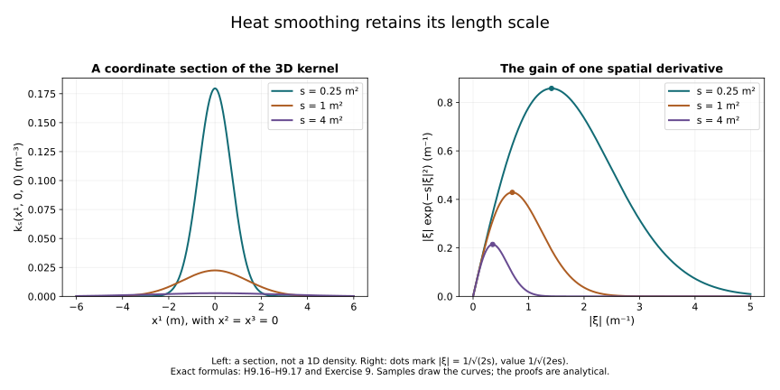

# Heat analysis for classical Yang–Mills evolution

This companion to [Lesson 9](../local-and-global-classical-evolution.html)
develops the heat estimates used in its classical existence theory.
The auxiliary parameter \(s\) measures length squared. It is distinct
from physical time \(t\). Smoothing in \(s\) is a device for studying
the same connection and curvature; it is not a replacement for their
physical evolution.

The proofs below are independent course exposition. Their principal
research source is Sung-Jin Oh's
[*Finite energy global well-posedness of the Yang–Mills equations on
\(\mathbb R^{1+3}\): An approach using the Yang–Mills heat flow*,
arXiv:1210.1557v2](https://arxiv.org/abs/1210.1557v2),
Sections 3–4, specifically the covariant heat estimates and curvature
smoothing argument. The companion
[*Gauge choice for the Yang–Mills equations using the Yang–Mills heat
flow and local well-posedness in \(H^1\)*,
arXiv:1210.1558v2](https://arxiv.org/abs/1210.1558v2)
supplies the original heat-weight conventions. The source comparison
at the end identifies the exact uses and corrections.

Prerequisites are Lesson 9, Sections 2–3 and 9: Lebesgue integration,
Fourier transformation, the matrix product bound, the scalar Sobolev
inequality, and its covariant version. Their complete arguments and
the selected measure components are available offline with this course.
We retain \(G\subset U(N)\), \(\mathfrak g\), the bracket
\([X,Y]=XY-YX\), and \(\kappa(X,Y)=-\operatorname{tr}(XY)\).
For a tuple, its pointwise norm is the square root of the sum of the
\(\kappa\)-squares of every displayed component. Spatial indices run
from 1 to 3. An ordered derivative word is not a symmetric derivative.

## 1. Heat weights and their exact comparison

For \(s>0\), a spatial tensor \(\sigma\), and an integer \(k\geq0\),
define

\[
 \begin{aligned}
 D_i\sigma&=\partial_i\sigma+[a_i,\sigma],&
 D_s\sigma&=\partial_s\sigma+[a_s,\sigma],\\
 \|\sigma\|_{\mathcal L_x^p(s)}
   &=s^{-3/(2p)}\|\sigma\|_{L_x^p},&
 \mathcal D_i&=s^{1/2}D_i,\\
 \|\mathcal D^{(k)}\sigma\|_{\mathcal L_x^p(s)}
   &=s^{k/2-3/(2p)}\|D^{(k)}\sigma\|_{L_x^p}.
 \end{aligned}
 \tag{H9.1}
\]

Here \(1/\infty=0\), and \(D^{(k)}\) is the tuple of all \(3^k\)
ordered words. The \(s\)-weights multiply the indicated norms and
operators. The original \(a_i,\sigma,x,s\) remain explicit.
The reference length \(\ell\) used in the inhomogeneous Sobolev norm
of Lesson 9 remains unchanged; a heat-weight exponent will be
called \(\alpha\), not \(\ell\).

For a scalar measurable function \(f\), an interval \(J\subset(0,\infty)\),
\(\alpha\in\mathbb R\), and \(1\leq p<\infty\), put

\[
 \|f\|_{\mathcal L_s^{\alpha,p}(J)}
   =\left(\int_J |s^\alpha f(s)|^p\,\frac{ds}{s}\right)^{1/p},
 \qquad
 \|f\|_{\mathcal L_s^{\alpha,\infty}(J)}
   =\operatorname*{ess\,sup}_{s\in J}s^\alpha|f(s)|.
 \tag{H9.2}
\]

For tensor fields the scalar \(f(s)\) is the specified spatial norm.
In particular

\[
 \begin{aligned}
 \|\sigma\|_{\mathcal L_s^{\alpha,\infty}\mathcal L_x^2}
   &=\sup_s s^{\alpha-3/4}\|\sigma(s)\|_2,\\
 \|\mathcal D\sigma\|_{\mathcal L_s^{\alpha,2}\mathcal L_x^2}^2
   &=\int_J s^{2\alpha-3/2}\|D\sigma(s)\|_2^2\,ds,\\
 \|\sigma\|_{\mathcal L_s^{\alpha,2}\mathcal L_x^2}^2
   &=\int_J s^{2\alpha-5/2}\|\sigma(s)\|_2^2\,ds .
 \end{aligned}
 \tag{H9.3}
\]

The first supremum is an essential supremum unless continuity is
specified. These three different powers must not be interchanged.

To check the spatial scaling, use \(y=x/\lambda\), with
\(\lambda>0\), in the original integral. For finite \(p\) this gives
\(\int|f(x/\lambda)|^p\,d^3x=\lambda^3\int|f(y)|^p\,d^3y\).
The chain rule gives one factor \(\lambda^{-1}\) for each ordinary
derivative. Thus

\[
 \|f(\cdot/\lambda)\|_p=\lambda^{3/p}\|f\|_p,\qquad
 \|\partial^{(k)}[f(\cdot/\lambda)]\|_p
   =\lambda^{3/p-k}\|\partial^{(k)}f\|_p .
 \tag{H9.4}
\]

The \(p=\infty\) assertion follows from preservation of null sets
under dilation. Formula (H9.4), rather than a verbal scaling convention,
fixes the direction of every comparison.

**Weighted Hölder inequality.** Let \(p,p_1,p_2\in[1,\infty]\), and
let the three weights be real. Set

\[
 \eta=\frac1p-\frac1{p_1}-\frac1{p_2}\geq0,\qquad
 \delta=\alpha-\alpha_1-\alpha_2,\qquad
 q=\begin{cases}1/\eta,&\eta>0,\\\infty,&\eta=0.\end{cases}
\]

On \(J=(s_1,s_2)\), \(0<s_1<s_2<\infty\),

\[
 \|fg\|_{\mathcal L_s^{\alpha,p}(J)}
 \leq W_{\delta,q}(s_1,s_2)
       \|f\|_{\mathcal L_s^{\alpha_1,p_1}(J)}
       \|g\|_{\mathcal L_s^{\alpha_2,p_2}(J)},
 \tag{H9.5}
\]

where the exact factor is

\[
 W_{\delta,q}(s_1,s_2)=
 \begin{cases}
 \left(\dfrac{s_2^{\delta q}-s_1^{\delta q}}{\delta q}\right)^{1/q},
       &q<\infty,\ \delta\ne0,\\
 \bigl(\log(s_2/s_1)\bigr)^{1/q},&q<\infty,\ \delta=0,\\
 \max(s_1^\delta,s_2^\delta),&q=\infty.
 \end{cases}
 \tag{H9.6}
\]

**Proof.** Write \(s^\alpha fg=s^\delta(s^{\alpha_1}f)
(s^{\alpha_2}g)\). Hölder for the measure \(ds/s\), with reciprocal
exponents adding to \(1/p\), proves (H9.5). Direct integration of
\(s^{\delta q-1}\) gives (H9.6); the zero exponent is the logarithmic
integral. At infinite exponents the assertion is the essential
supremum bound. This also proves all endpoint cases. \(\square\)

On \(J=(0,S)\), the factor is finite when \(\delta>0\), or when
\(\delta=\eta=0\). Its exact value in these cases is

\[
 W_{\delta,q}(0,S)=
 \begin{cases}
 S^\delta(\eta/\delta)^\eta,&\delta>0,\ \eta>0,\\
 S^\delta,&\delta>0,\ \eta=0,\\
 1,&\delta=\eta=0 .
 \end{cases}
 \tag{H9.7}
\]

These follow by taking the lower endpoint limit in (H9.6). If
\(\delta=0\) and \(\eta>0\), the constant diverges. This is a real
endpoint issue: the measure of \((0,S)\) under \(ds/s\) is infinite.

## 2. Covariant interpolation with constants

Write \(C_S=4/\sqrt3\), the constant proved in Lesson 9,
Section 9. For smooth \(\mathfrak g\)-valued tuples
\(\sigma\in L^2\), with the derivative norms on the right finite,
the following estimates hold:

\[
 \begin{aligned}
 \|\sigma\|_6&\leq C_S\|D\sigma\|_2,\\
 \|\sigma\|_3&\leq
       C_S^{1/2}\|\sigma\|_2^{1/2}\|D\sigma\|_2^{1/2},\\
 \|\sigma\|_\infty&\leq
       C_M C_S\|D\sigma\|_2^{1/2}\|D^{(2)}\sigma\|_2^{1/2},
 \end{aligned}
 \tag{H9.8}
\]

where

\[
 A_*=(4\pi/3)^{-1/6},\qquad
 B_*=(4\pi)^{-1}(20\pi/3)^{5/6},\qquad
 C_M=2\sqrt{A_*B_*}.
 \tag{H9.9}
\]

**Proof.** Invariance of \(\kappa\) gives
\(\partial_i|\sigma|^2=2\sum_a\kappa(\sigma_a,D_i\sigma_a)\).
For \(f_\varepsilon=(|\sigma|^2+\varepsilon^2)^{1/2}-\varepsilon\),
this proves \(|\nabla f_\varepsilon|\leq|D\sigma|\).
The cutoff and completion argument of Lesson 9, Section 9,
applies to the full tuple and proves the first estimate on letting
\(\varepsilon\downarrow0\). Hölder gives
\(\|\sigma\|_3\leq\|\sigma\|_2^{1/2}\|\sigma\|_6^{1/2}\),
proving the second.

For completeness the \(L^\infty\) step can be obtained by averaging
over a Euclidean ball, without a further embedding theorem.
If \(f\) is smooth, \(f,\nabla f\in L^6(\mathbb R^3)\), then
integration of
\(f(x+z)-f(x)=\int_0^1\nabla f(x+\theta z)\cdot z\,d\theta\)
over \(|z|<R\) gives

\[
 \begin{aligned}
 |f(x)|\leq&
 (4\pi R^3/3)^{-1/6}\|f\|_6\\
 &+\int_{|z|<R}
     \frac{R^3-|z|^3}{4\pi R^3|z|^2}|\nabla f(x+z)|\,d^3z\\
 \leq& A_*R^{-1/2}\|f\|_6+B_*R^{1/2}\|\nabla f\|_6 .
 \end{aligned}
 \tag{H9.10}
\]

Indeed, changing \(z\) to \(\theta z\) in the segment integral
produces
\(|z|(4\pi R^3/3)^{-1}\int_{|z|/R}^1\theta^{-4}\,d\theta\),
which is the displayed kernel. Its bound by \(1/(4\pi|z|^2)\)
and Hölder with exponent \(6/5\) use exactly
\(\int_{|z|<R}|z|^{-12/5}\,d^3z=(20\pi/3)R^{3/5}\).
Choose \(R=A_*\|f\|_6/(B_*\|\nabla f\|_6)\) when both norms
are positive. If either vanishes, take \(R\) to the appropriate
endpoint in (H9.10). Therefore
\(\|f\|_\infty\leq C_M\|f\|_6^{1/2}\|\nabla f\|_6^{1/2}\).
Apply this to \(f_\varepsilon\). The first bound in (H9.8)
applied to the tuple \(D\sigma\) gives
\(\|D\sigma\|_6\leq C_S\|D^{(2)}\sigma\|_2\).
Together with \(\|f_\varepsilon\|_6\leq C_S\|D\sigma\|_2\)
and \(\|\nabla f_\varepsilon\|_6\leq\|D\sigma\|_6\),
this proves the last estimate after passage to the limit. \(\square\)

For two single Lie algebra valued fields the matrix estimate
\(|[X,Y]|\leq2|X||Y|\) and (H9.8) give

\[
 \|[G_1,G_2]\|_2
 \leq2C_S^{3/2}
       \|G_1\|_2^{1/2}\|DG_1\|_2^{1/2}\|DG_2\|_2 .
 \tag{H9.11}
\]

The first factor uses \(L^3\), the second \(L^6\). Multiplying
by \(s^{-3/4}\) leaves exactly

\[
(s^{-3/4}\|G_1\|_2)^{1/2}
(s^{-1/4}\|DG_1\|_2)^{1/2}
(s^{-1/4}\|DG_2\|_2)
\]

on the right, with the same constant.
Their powers add to \(-3/4\). Mixed heat norms now follow directly
from (H9.5), including its endpoint factor.

## 3. A weighted energy identity with its boundary terms

On a compact interval \([s_1,s_2]\subset(0,\infty)\), consider

\[
 L\sigma=N,\qquad L=D_s-\sum_{i=1}^3D_iD_i.
 \tag{H9.12}
\]

For the proof take smooth coefficients and fields, with
\(\sigma\in C([s_1,s_2];L^2)\), \(D\sigma\in L^2(ds\,d^3x)\),
and \(N\in L^1([s_1,s_2];L^2)\). The equation is classical
locally in space. These conditions justify every spatial limit
below; the smooth \(H^\infty\) solutions used later satisfy them.
The identical argument works for a finite tuple by summing its
component inner products.

Choose a smooth cutoff \(\chi\) with \(0\leq\chi\leq1\),
\(\chi=1\) on the unit ball and \(\chi=0\) outside the ball of
radius 2. Put \(\chi_R(x)=\chi(x/R)\) and
\(M_\chi=\|\nabla\chi\|_\infty\). Invariance of the pairing gives

\[
 \begin{aligned}
 \frac12\frac d{ds}\int\chi_R^2|\sigma|^2\,d^3x
   +\int\chi_R^2|D\sigma|^2\,d^3x
   ={}&\int\chi_R^2\kappa(N,\sigma)\,d^3x\\
   &-2\sum_i\int\chi_R\partial_i\chi_R
                    \kappa(\sigma,D_i\sigma)\,d^3x .
 \end{aligned}
 \tag{H9.13}
\]

The spatial boundary contribution, integrated in \(s\), has
absolute value at most

\[
 \frac{2M_\chi}{R}
   \int_{s_1}^{s_2}\|\sigma(s)\|_2\|D\sigma(s)\|_2\,ds .
\]

It tends to zero by Cauchy–Schwarz in \(s\). Multiplication by
any smooth bounded heat weight on this compact interval preserves
that conclusion. Dominated convergence for the other terms proves
the following identity for every \(s\in[s_1,s_2]\):

\[
 \begin{aligned}
 \frac12s^{2\alpha-3/2}\|\sigma(s)\|_2^2
  +\int_{s_1}^{s}r^{2\alpha-3/2}\|D\sigma(r)\|_2^2\,dr
  ={}&\frac12s_1^{2\alpha-3/2}\|\sigma(s_1)\|_2^2\\
 &+(\alpha-3/4)\int_{s_1}^{s}
                 r^{2\alpha-5/2}\|\sigma(r)\|_2^2\,dr\\
 &+\int_{s_1}^{s}r^{2\alpha-3/2}
                   \langle N(r),\sigma(r)\rangle_{L^2}\,dr .
 \end{aligned}
 \tag{H9.14}
\]

The derivative of \(r^{2\alpha-3/2}/2\) is precisely
\((\alpha-3/4)r^{2\alpha-5/2}\). Its sign is part of the identity.

Here is an estimate valid for every real \(\alpha\). Define

\[
 \begin{aligned}
 X&=\sup_{s_1\leq s\leq s_2}s^{\alpha-3/4}\|\sigma(s)\|_2,&
 d&=s_1^{\alpha-3/4}\|\sigma(s_1)\|_2,\\
 Y^2&=\int_{s_1}^{s_2}s^{2\alpha-3/2}\|D\sigma(s)\|_2^2\,ds,&
 Z^2&=\int_{s_1}^{s_2}s^{2\alpha-5/2}\|\sigma(s)\|_2^2\,ds,\\
 F&=\int_{s_1}^{s_2}s^{\alpha-3/4}\|N(s)\|_2\,ds,&
 \beta_+&=\max(\alpha-3/4,0).
 \end{aligned}
\]

Then

\[
 X^2\leq2d^2+4\beta_+Z^2+4F^2,\qquad
 Y^2\leq d^2+2\beta_+Z^2+2F^2 .
 \tag{H9.15}
\]

**Proof.** Put \(A=d^2/2+\beta_+Z^2\). At every intermediate
endpoint, (H9.14) is bounded above by \(A+FX\). Dropping the
nonnegative gradient integral and taking the supremum gives
\(X^2/2\leq A+FX\). At the final endpoint, dropping the
nonnegative endpoint square instead gives \(Y^2\leq A+FX\).
Use \(FX\leq X^2/4+F^2\) in the first bound to obtain
\(X^2\leq4A+4F^2\); substitution in the second gives
\(Y^2\leq2A+2F^2\). These are (H9.15).
When \(\alpha<3/4\), (H9.14) also keeps
\((3/4-\alpha)Z^2\) on its dissipative side. \(\square\)

This proof takes the supremum and the final endpoint separately.
The supremum of a sum is not the sum of two independent suprema.
It also retains the covariant gradient \(D\sigma\), which cannot
be replaced by \(\partial\sigma\) without an additional estimate.

## 4. The scalar heat kernel and convolution bounds

Retain the Fourier conventions of Lesson 9:
\(\widehat f(\xi)=\int e^{-ix\cdot\xi}f(x)\,d^3x\), with
inverse factor \((2\pi)^{-3}\). The scalar Gaussian calculation
there gives

\[
 k_s(x)=(4\pi s)^{-3/2}\exp(-|x|^2/(4s)),\qquad
 H_sf=k_s*f,\qquad \widehat{H_sf}=e^{-s|\xi|^2}\widehat f .
 \tag{H9.16}
\]

The integral of \(k_s\) is 1. Its derivatives are
\(\partial_i k_s=-x_i k_s/(2s)\),
\(\partial_{ii}k_s=(x_i^2/(4s^2)-1/(2s))k_s\), and
\(\partial_s k_s=(|x|^2/(4s^2)-3/(2s))k_s=\Delta k_s\).
Gaussian convolution, or multiplication of these Fourier
transforms followed by the proved inversion formula, gives
\(H_sH_r=H_{s+r}\). It first holds for Schwartz functions;
density and the norm bounds below extend it to finite \(p\).
For bounded \(f\), Tonelli applied to the absolute value bounds
the double convolution by \(\|f\|_\infty\), since both kernels
have mass 1. Fubini and the Gaussian convolution identity then
prove the semigroup identity on \(L^\infty\) as well.

For \(1\leq p\leq r\leq\infty\), choose \(q\) by
\(1+1/r=1/p+1/q\). Direct integration and Young's inequality give

\[
 \begin{aligned}
 \|H_sf\|_r&\leq
 (4\pi s)^{-\frac32(1/p-1/r)}
 q^{-3/(2q)}\|f\|_p,\\
 \|k_s\|_q&=(4\pi s)^{-\frac32(1-1/q)}q^{-3/(2q)} .
 \end{aligned}
 \tag{H9.17}
\]

At \(q=\infty\) the last factor has value 1.
For finite \(q\), the Gaussian integral is
\((4\pi s)^{-3q/2}(4\pi s/q)^{3/2}\) before taking its
\(q\)-th root. This proves the second equality with all constants.

We give the Euclidean Young argument, corresponding to
Theorem 14.4 of the course on Haar measure, pinned edition.
The group here is exactly \((\mathbb R^3,+)\), its inversion is
\(y\mapsto-y\), and both translations and inversion preserve
\(d^3y\). Thus there is no modular factor.
For \(1<p,q<r<\infty\), split the absolute convolution integrand as

\[
 (|a(y)|^p|b(x-y)|^q)^{1/r}
 |a(y)|^{1-p/r}|b(x-y)|^{1-q/r}.
\]

Hölder with exponents \(r,\ p/(1-p/r),\ q/(1-q/r)\) yields

\[
 |a*b(x)|^r\leq
 \|a\|_p^{r-p}\|b\|_q^{r-q}
 \int |a(y)|^p|b(x-y)|^q\,d^3y .
\]

Tonelli and the substitution \(z=x-y\) make the integral over
\(x,y\) equal to \(\|a\|_p^p\|b\|_q^q\).
This proves the bound and almost-everywhere absolute convergence.
If \(p=1\) and \(q=r<\infty\), the integral triangle inequality
gives
\(\|a*b\|_q\leq\int|a(y)|\|b(\cdot-y)\|_q\,d^3y\).
The \(q=1\) case follows by \(y\mapsto x-y\). For \(r=\infty\)
use pointwise Hölder with conjugate input exponents, including
the \(1,\infty\) cases. For \(r=1\), both inputs have exponent 1
and Tonelli proves the result directly. Zero-norm inputs give
zero convolution classes by these same integrals. This covers
every allowed exponent and proves (H9.17).

For \(1\leq p<\infty\), translations are continuous in \(L^p\):
approximate by compact continuous functions using the measure
prerequisite, use their uniform continuity on a common compact
set, and use the translation isometry for the two approximation
errors. Consequently

\[
 \|H_sf-f\|_p\leq\int k_s(y)\|f(\cdot-y)-f\|_p\,d^3y
       \longrightarrow0\quad(s\downarrow0).
 \tag{H9.18}
\]

To verify the last limit, split at \(|y|=\rho\). On the inner
ball use translation continuity; outside use \(2\|f\|_p\) and
the Gaussian tail, which tends to zero after \(y=\sqrt s\,z\).
The same proof works in the supremum norm for bounded uniformly
continuous \(f\); it does not assert strong continuity on all of
\(L^\infty\).

**Figure H9.** The left panel shows \(k_s(x^1,0,0)\) in cubic
reciprocal metres for the three indicated physical heat lengths.
It is a coordinate section of (H9.16), not a one-dimensional
probability density. The right panel shows
\(|\xi|e^{-s|\xi|^2}\) in reciprocal metres. Differentiation in
\(|\xi|\) gives its maximum \(1/\sqrt{2es}\) at
\(|\xi|=1/\sqrt{2s}\). The source uses these exact functions;
the curves are numerical samples, while the bounds are proved
in Section 4 and Exercise 9.

## 5. Covariant comparison with the scalar heat equation

For a smooth solution of (H9.12), put
\(\rho_\varepsilon=(|\sigma|^2+\varepsilon^2)^{1/2}\).
Differentiation, using invariance of the tuple pairing, gives
the full Bochner identity

\[
 (\partial_s-\Delta)\rho_\varepsilon
 =\frac{\langle\sigma,N\rangle}{\rho_\varepsilon}
  -\frac{|D\sigma|^2}{\rho_\varepsilon}
  +\frac{\sum_i\langle\sigma,D_i\sigma\rangle^2}
         {\rho_\varepsilon^3}
 \leq |N|-\frac{\varepsilon^2|D\sigma|^2}
                         {\rho_\varepsilon^3}
 \leq |N|.
 \tag{H9.19}
\]

The brackets with \(a_s\) cancel in
\(\partial_s|\sigma|^2=2\langle\sigma,D_s\sigma\rangle\);
the spatial identity is
\(\Delta|\sigma|^2=2|D\sigma|^2+
2\langle\sigma,\sum_iD_iD_i\sigma\rangle\).
Cauchy–Schwarz bounds the numerator of the last term by
\(|\sigma|^2|D\sigma|^2\), proving the displayed defect term.
Taking the limit against a nonnegative compact smooth test,
and integrating the scalar derivatives by parts, also proves
\((\partial_s-\Delta)|\sigma|\leq|N|\) in distributions.

For the comparison used here, assume on \([s_1,s_2]\) that
the fields and the spatial derivatives needed in (H9.19) are
bounded, and that \(N\) is bounded in space and heat time.
Smooth fields continuous into every \(H^q\), with coefficients
of the same kind, satisfy this requirement by Lesson 9's embedding.
Then for \(s_1\leq s\leq s_2\),

\[
 |\sigma(s,x)|\leq
 H_{s-s_1}|\sigma(s_1)|(x)
       +\int_{s_1}^{s}H_{s-r}|N(r)|(x)\,dr .
 \tag{H9.20}
\]

**Proof.** Subtract the constant \(\varepsilon\) from
\(\rho_\varepsilon\) and call the resulting nonnegative function
\(u_\varepsilon\). Fix \(\eta>0\) and differentiate
\(H_{s-r+\eta}u_\varepsilon(r)(x)\) in \(r\).
Its derivative is
\(H_{s-r+\eta}(\partial_r-\Delta)u_\varepsilon(r)(x)\).
One can verify the integration by parts with a cutoff \(\chi_R\):
the additional terms contain \(\nabla\chi_R,\Delta\chi_R\)
times bounded \(u_\varepsilon,\nabla u_\varepsilon\) and a
Gaussian or its derivative. Their integrals tend to zero
as \(R\to\infty\), since every polynomial times that Gaussian
has an integrable tail, uniformly for \(s-r+\eta\in[\eta,s_2-s_1+\eta]\).
Equation (H9.19) bounds the derivative by
\(H_{s-r+\eta}|N(r)|(x)\).
Integrate from \(s_1\) to \(s\). Let \(\eta\downarrow0\),
using the approximate identity at the left endpoint of the
convolution and bounded convergence in the time integral.
For \(r<s\) the kernels converge; the point \(r=s\) has measure
zero and \(\|N(r)\|_\infty\) supplies domination.
Finally \(u_\varepsilon\to|\sigma|\), with difference at most
\(\varepsilon\), so the kernel mass 1 permits this limit as
well. This proves (H9.20). \(\square\)

In particular the source-free equation contracts the supremum
norm. This is a comparison of the gauge-invariant magnitude
with a scalar solution, derived from the original covariant
equation.

## 6. A weighted Duhamel estimate

The convolution from the forcing term has an integrable weighted
square bound that we will need near \(s=0\). For \(S>0\), put

\[
 h_*=(4\pi)^{-3/4}2^{-3/4},\qquad
 B_0^*=\int_0^1v^{-1/2}(1-v)^{-3/4}\,dv .
\]

The last integral is finite: split at \(1/2\), bound the factor
which has no singularity at the relevant endpoint, and integrate
the powers \(-1/2\) and \(-3/4\).
For \(N\) continuous in \(s>0\) with values in \(L^1_x\), and
with the right-hand norm below finite,

\[
 \left(\int_0^S
    s^{1/2}\left\|\int_0^sH_{s-r}N(r)\,dr\right\|_2^2
                                      \frac{ds}{s}\right)^{1/2}
 \leq h_*B_0^*
       \left(\int_0^S s\|N(s)\|_1^2\,\frac{ds}{s}\right)^{1/2}.
 \tag{H9.21}
\]

**Proof.** Equation (H9.17) gives
\(\|H_{s-r}N(r)\|_2\leq h_*(s-r)^{-3/4}\|N(r)\|_1\).
Let \(f(r)=r^{1/2}\|N(r)\|_1\). After multiplication by
\(s^{1/4}\), its time integral has kernel, relative to \(dr/r\),

\[
 K(s,r)=\mathbf1_{\{0<r<s<S\}}
             s^{1/4}(s-r)^{-3/4}r^{1/2}.
 \tag{H9.22}
\]

For fixed \(s\), substitution \(r=sv\) gives
\(\int_0^S K(s,r)\,dr/r=B_0^*\).
For fixed \(r\), substitution \(v=r/s\) gives

\[
 \int_0^S K(s,r)\,\frac{ds}{s}
    =\int_{r/S}^1 v^{-1/2}(1-v)^{-3/4}\,dv\leq B_0^* .
\]

Weighted Cauchy–Schwarz gives
\(|\int K(s,r)f(r)\,dr/r|^2
\leq B_0^*\int K(s,r)|f(r)|^2\,dr/r\).
Integrating in \(ds/s\) and using Tonelli and the column bound
proves the operator norm bound \(B_0^*\).

Initially take \(N\) supported away from \(s=0\), and truncate
the integral away from \(r=s\); every \(L^2\) integral then
exists by completeness. The same positive kernel estimate
shows that the integral of the \(L^2\) norms is finite for
almost every \(s\). Thus the truncated integrals are Cauchy
in \(L^2_x\) at those \(s\), and in the displayed weighted
space by the bound applied to their differences.
Approximation by heat-time cutoffs extends this construction
to every \(N\) in the stated class. Passing the bound to the
limit proves (H9.21). \(\square\)

## 7. Ordinary and covariant derivatives: every ordered term

The conversion between derivatives is an actual finite algebraic
map. We specify it without a schematic remainder. A word
\(I=(i_1,\ldots,i_k)\) means
\(D_I=D_{i_1}\cdots D_{i_k}\), acting on its argument from the
rightmost operator first. For the empty word \(D_\varnothing\)
is the identity. Products below are matrix products in their
displayed order.

To expand \(D_I\sigma\) into ordinary derivatives, start with the
one-term list \(\sigma\). Work from \(i_k\) to \(i_1\).
At a step with index \(i\), replace each term
\(bX_1\cdots X_r\), with its signed integer coefficient \(b\),
by the following list:

\[
 \begin{gathered}
 bX_1\cdots(\partial_iX_j)\cdots X_r
                 \quad(1\leq j\leq r),\\
 b\,a_iX_1\cdots X_r,\qquad
 -b\,X_1\cdots X_ra_i .
 \end{gathered}
 \tag{H9.23}
\]

Each factor is an ordinary derivative of a component \(a_j\),
or of \(\sigma\); there is exactly one factor of the latter type.
Keep repeated terms in the list, including their signs.
The ordinary product rule and \(D_i=\partial_i+[a_i,\cdot]\)
prove by induction that this list sums to exactly \(D_I\sigma\).
The sum of the number of \(a\)-factors and of all ordinary
derivative orders in a term equals \(k\).

There is also a complete reverse construction for
\(\partial_{i_1}\cdots\partial_{i_k}\sigma\).
Start with \(\sigma\), and at each index \(i\) differentiate
each ordinary derivative of an \(a\)-factor. At the unique
factor \(D_J\sigma\), use exactly

\[
 \partial_i(D_J\sigma)
   =D_iD_J\sigma-a_iD_J\sigma+(D_J\sigma)a_i .
 \tag{H9.24}
\]

This replaces that factor by the three displayed terms, within
the same left and right factors. Induction again proves the
whole expansion. In particular

\[
 \begin{aligned}
 D_iD_j\sigma={}&
 \partial_i\partial_j\sigma+[\partial_i a_j,\sigma]
 +[a_j,\partial_i\sigma]+[a_i,\partial_j\sigma]
 +[a_i,[a_j,\sigma]],\\
 \partial_i\partial_j\sigma={}&
 D_iD_j\sigma-[a_i,D_j\sigma]-[\partial_i a_j,\sigma]
 -[a_j,D_i\sigma]+[a_j,[a_i,\sigma]] .
 \end{aligned}
 \tag{H9.25}
\]

Each first-order commutator is its two signed matrix products;
each nested one is four signed products. Thus either line
contains exactly eleven matrix terms when expanded.
More generally let \(t_{k,r}\) count the terms containing \(r\)
\(a\)-factors in either algorithm, before combining repeated
terms. Differentiating one of its \(r+1\) factors keeps that
number; the two insertions increase it by one. Consequently

\[
 t_{0,0}=1,\qquad
 t_{k+1,r}=(r+1)t_{k,r}+2t_{k,r-1},
 \tag{H9.26}
\]

with entries outside \(0\leq r\leq k\) equal to zero. This is
also an explicit way to count every multiplicity at any chosen
order. No commutation of two covariant derivatives was used.

## 8. The heat connection, curvature and energy

Introduce connection components \(a_s,a_t,a_1,a_2,a_3\)
on a product of a physical time interval, \(\mathbb R^3\),
and a heat interval. They have units \(L^{-2},T^{-1},L^{-1}\)
respectively. Their curvature, for any of these indices, is

\[
 F_{\mu\nu}=\partial_\mu a_\nu-\partial_\nu a_\mu
                    +[a_\mu,a_\nu],\qquad
 F_{s\mu}=\partial_s a_\mu-D_\mu a_s .
 \tag{H9.27}
\]

The dynamic Yang–Mills heat equation is

\[
 F_{s\mu}=\sum_{j=1}^3D_jF_{j\mu},
       \qquad \mu=t,1,2,3.
 \tag{H9.28}
\]

The contraction is over spatial indices only, so it has no
hidden time metric coefficient. The spatial subsystem
\(\mu=1,2,3\) is the Yang–Mills heat equation for a spatial
connection.

For each \(i\), expansion of the spatial equation gives

\[
 \begin{aligned}
 \partial_s a_i={}&\Delta a_i-\partial_i\sum_j\partial_j a_j
 +\partial_i a_s+[a_i,a_s]\\
 &+\sum_j\bigl(
  [\partial_j a_j,a_i]+2[a_j,\partial_j a_i]
  -[a_j,\partial_i a_j]+[a_j,[a_j,a_i]]\bigr).
 \end{aligned}
 \tag{H9.29}
\]

To verify it, differentiate each of
\(F_{ji}=\partial_j a_i-\partial_i a_j+[a_j,a_i]\)
and then add \([a_j,F_{ji}]\). The two occurrences of
\([a_j,\partial_j a_i]\) account for its factor 2.
Taking \(a_s=\sum_j\partial_j a_j\) cancels the two displayed
second derivative terms and also
\(\sum_j[\partial_j a_j,a_i]+[a_i,a_s]\). The resulting
DeTurck equation is exactly

\[
 \partial_s a_i=\Delta a_i+
 \sum_j\bigl(2[a_j,\partial_j a_i]-[a_j,\partial_i a_j]
                          +[a_j,[a_j,a_i]]\bigr).
 \tag{H9.30}
\]

These cancellations remove no contribution from the original
equation; they follow from this specified gauge choice.
On a compact heat interval, the matrix ODE
\(\partial_sV=Va_s\), with \(V(S)=I\), constructs a gauge
whose heat component is
\(a'_s=Va_sV^{-1}-(\partial_sV)V^{-1}=0\).
The same Picard and inverse arguments as Lesson 9, Section 10,
apply with independent variable \(s\); its integral equation
is \(V(s)=I-\int_s^S V(r)a_s(r)\,dr\).
This statement on a compact interval does not assume uniform
derivative estimates as its lower endpoint tends to zero.

For smooth fields continuous into every \(H^q_x\), define the
magnetic energy without a physical prefactor by

\[
 M(s)=\frac12\sum_{i<j}\|F_{ij}(s)\|_2^2
     =\frac14\sum_{i,j=1}^3\|F_{ij}(s)\|_2^2.
 \tag{H9.31}
\]

It satisfies

\[
 M(s_2)+\int_{s_1}^{s_2}\sum_i\|F_{si}(s)\|_2^2\,ds
       =M(s_1).
 \tag{H9.32}
\]

**Proof.** Bianchi, already proved from the full curvature formula
in Lesson 5, gives
\(D_sF_{ij}=D_iF_{sj}-D_jF_{si}\).
Differentiating (H9.31), the antisymmetry in \(i,j\) makes
the two terms equal after relabelling. Thus
\(M'=\sum_{i,j}\langle F_{ij},D_iF_{sj}\rangle
=-\sum_j\langle\sum_iD_iF_{ij},F_{sj}\rangle\),
which is \(-\sum_j\|F_{sj}\|_2^2\) by (H9.28).
To justify the displayed integration by parts, insert
\(\chi_R^2\). Its extra term is bounded in heat-time integral
by \(2M_\chi R^{-1}\int\sum_{i,j}
\|F_{ij}\|_2\|F_{sj}\|_2\,ds\), which tends to zero.
All other terms converge by the stated regularity.
Integration in \(s\) proves (H9.32). \(\square\)

The physical magnetic energy from Lesson 8 is
\(2\hbar c M/g_{\mathrm{YM}}^2\); this factor remains present
when translating (H9.32) into physical units.

## 9. Exact curvature equations at every derivative order

First retain all physical curvature components, and define
their positive weighted norm by

\[
 |F|_c^2=\sum_{i=1}^3c^{-2}|F_{ti}|^2+
                           \sum_{1\leq i<j\leq3}|F_{ij}|^2 .
 \tag{H9.33}
\]

The weights make all six summands have units \(L^{-4}\).
This is a norm on the original curvature tuple. The fields
\(F_{ti}\) have not been replaced by rescaled fields.
For each derivative order the norm includes all ordered
spatial derivative words of that order.
At \(s=0\), comparison with Lesson 8 gives

\[
 \frac12\|F(0)\|_{2,c}^2
    =\frac{g_{\mathrm{YM}}^2}{2\hbar c}
                          \mathcal E_{\mathrm{YM}}(t).
 \tag{H9.34}
\]

On a solution of (H9.28), for \(\mu,\nu\in\{t,1,2,3\}\),

\[
 LF_{\mu\nu}=-2\sum_{l=1}^3[F_{\mu l},F_{\nu l}],
 \qquad
 [L,D_i]B=2\sum_{l=1}^3[F_{il},D_lB].
 \tag{H9.35}
\]

**Proof.** Bianchi gives
\(D_sF_{\mu\nu}=D_\mu F_{s\nu}-D_\nu F_{s\mu}\).
Substitute (H9.28), commute \(D_\mu,D_l\) and \(D_\nu,D_l\),
and use
\(D_\mu F_{l\nu}-D_\nu F_{l\mu}=D_lF_{\mu\nu}\).
The two remaining terms are
\([F_{\mu l},F_{l\nu}]-[F_{\nu l},F_{l\mu}]
=-2[F_{\mu l},F_{\nu l}]\).
This proves the first identity with its sign.
For the second, the complete commutator in the opposite order is

\[
 [D_i,L]B=
 [F_{is}-\sum_lD_lF_{il},B]
                       -2\sum_l[F_{il},D_lB].
\]

Equation (H9.28) and antisymmetry give
\(F_{is}=\sum_lD_lF_{il}\). Their zero-order difference is
exactly zero, leaving the claimed formula. \(\square\)

For a word \(I=(i_1,\ldots,i_k)\), and a subset of its position
set, \(I_S\) denotes the subword in increasing position order.
For example \(I_{\{1,3\}}=(i_1,i_3)\), even when the numerical
values of the indices are not increasing.
The full differentiated equation is

\[
 \begin{aligned}
 LD_IF_{\mu\nu}={}&
 -2\sum_{l=1}^3\sum_{S\subset\{1,\ldots,k\}}
     [D_{I_S}F_{\mu l},D_{I_{S^c}}F_{\nu l}]\\
 &+2\sum_{r=1}^k\sum_{l=1}^3
       \sum_{S\subset\{1,\ldots,r-1\}}
 [D_{I_S}F_{i_rl},
  D_{I_{\{1,\ldots,r-1\}\setminus S}}
     D_lD_{I_{\{r+1,\ldots,k\}}}F_{\mu\nu}].
 \end{aligned}
 \tag{H9.36}
\]

**Proof.** The operator identity
\([L,D_I]=\sum_{r=1}^k
D_{i_1}\cdots D_{i_{r-1}}[L,D_{i_r}]
D_{i_{r+1}}\cdots D_{i_k}\)
follows by telescoping the difference of the two products.
Use (H9.35) in each summand.
Since \(D_i[X,Y]=[D_iX,Y]+[X,D_iY]\), each preceding
derivative chooses one of the two factors. Its choices are
exactly the subsets of the preceding positions, with order
preserved. Applying the same product rule to
\(D_I(LF_{\mu\nu})\) gives the first line. This proves every
term of (H9.36), including repetitions and coefficients.
For \(k=0\) the second line is empty and the first is (H9.35).
\(\square\)

Let \(N_k\) be the entire right side of (H9.36), as a tuple.
The following explicit, deliberately non-optimal bound is
useful. For each \(j\) choose \(p_j,q_j\in[1,\infty]\) with
\(1/p_j+1/q_j=1/2\). Then

\[
 \|N_k\|_{2,c}\leq
 12\sqrt{6\,3^k}
 \sum_{j=0}^k {k+1\choose j+1}
       \|D^{(j)}F\|_{p_j,c}\|D^{(k-j)}F\|_{q_j,c}.
 \tag{H9.37}
\]

To prove it, fix one output word and one of its six independent
curvature pairs. In the first line of (H9.36), there are
\({k\choose j}\) subsets with \(j\) derivatives on the first
factor. In the second line their number is
\(\sum_{r=1}^k{r-1\choose j}={k\choose j+1}\);
the latter identity follows by grouping the \((j+1)\)-element
subsets of \(\{1,\ldots,k\}\) by their largest element.
Adding gives \({k+1\choose j+1}\).
Each bracket has coefficient of absolute value 2, the matrix
bound supplies another factor 2, and the \(l\)-sum has three
entries. This is the factor 12.
With \(d_t=c^{-1}\) and \(d_i=1\), the output weight is
\(d_\mu d_\nu\). A product in the first line has weights
\((d_\mu d_l)(d_\nu d_l)=d_\mu d_\nu\), since \(l\) is
spatial. The second line has the same output weight, since
its first factor has two spatial indices. Every input
component is therefore bounded by its full weighted tuple
norm without changing any factor of \(c\).
Apply Hölder to each product, and bound the Euclidean norm
of the \(6\,3^k\) outputs by their common bound times
\(\sqrt{6\,3^k}\). This proves (H9.37).

## 10. Curvature smoothing with an explicit smallness threshold

We now prove an estimate for an existing regular heat solution;
no small derivative norm is required at \(s=0\).
Take \(S>0\) and a smooth solution of (H9.28) on
\([0,S]\), at a fixed physical time \(t\).
Assume its coefficients and curvature are continuous into
every \(H^q_x\), so every preceding calculation is justified.
All estimates below depend on the initial curvature norm,
not on the initial higher derivative norms.
The spatial subsystem alone satisfies the same estimates
after deleting the temporal components; using six as the
output-count upper bound remains valid for its three pairs.

For \(m\geq0\), set

\[
 \begin{aligned}
 f_m(s)&=\|D^{(m)}F(s)\|_{2,c},&
 d&=f_0(0),\\
 A_m(S)&=\sup_{0<s\leq S}s^{m/2}f_m(s),&
 B_m(S)&=\left(\int_0^S s^m f_{m+1}(s)^2\,ds\right)^{1/2},\\
 T_m(S)&=A_m(S)+B_m(S),&
 I_m(S)&=\int_0^S s^{m/2}\|N_m(s)\|_{2,c}\,ds.
 \end{aligned}
 \tag{H9.38}
\]

The value at \(s=0\) of \(s^{m/2}f_m(s)\) is zero when
\(m\geq1\), by the assumed regularity. Define the following
numerical constants, retaining \(C_S\) from (H9.8):

\[
 \begin{aligned}
 e_*&=2+\sqrt2,&
 K_0&=12\sqrt6\,C_S^{3/2},&
 K_1&=36\sqrt{18}\,C_S^{3/2},\\
 a_*&=e_*(1+e_*),&
 b_*&=e_*\bigl((1+e_*)K_0+K_1\bigr),&
 \varepsilon_*&=(8a_*b_*)^{-1}.
 \end{aligned}
 \tag{H9.39}
\]

There are explicit constants \(R_m\), defined below solely
from \(m,C_S,C_M\), such that

\[
 S^{1/4}d\leq\varepsilon_*
       \quad\Longrightarrow\quad
 T_m(S)\leq R_m d\quad\hbox{for every integer }m\geq0 .
 \tag{H9.40}
\]

The statement is an a priori smoothing estimate on every
regular solution in its stated class. Existence of that class
is a separate construction; the estimate does not assume any
of the bounds it concludes.
The smallness quantity is dimensionless:
\(d\) has units \(L^{-1/2}\), whereas \(S^{1/4}\) has
units \(L^{1/2}\). In physical energy it is

\[
 S^{1/4}
 \left(\frac{g_{\mathrm{YM}}^2}{\hbar c}
                           \mathcal E_{\mathrm{YM}}(t)\right)^{1/2}.
 \tag{H9.41}
\]

**Energy step.** Apply (H9.15) to the tuple \(D^{(m)}F\),
with \(\alpha=3/4+m/2\), and let \(s_1\downarrow0\).
The weighted initial term vanishes for \(m\geq1\) and
equals \(d\) for \(m=0\). Monotone convergence of the
nonnegative integrals and continuity give

\[
 \begin{aligned}
 A_0^2&\leq2d^2+4I_0^2,&
 B_0^2&\leq d^2+2I_0^2,\\
 A_m^2&\leq2m B_{m-1}^2+4I_m^2,&
 B_m^2&\leq m B_{m-1}^2+2I_m^2\quad(m\geq1).
 \end{aligned}
 \tag{H9.42}
\]

All quantities here use the same endpoint \(S\).
The inequality \(\sqrt{x^2+y^2}\leq |x|+|y|\) gives

\[
 T_0\leq e_*(d+I_0),\qquad
 T_m\leq e_*(\sqrt m B_{m-1}+I_m)\quad(m\geq1).
 \tag{H9.43}
\]

**First two orders.** For \(N_0\), use \(p_0=3,q_0=6\)
in (H9.37) and (H9.8).
For \(N_1\), the terms with zero derivatives on one factor
use \(F\) in \(L^3\) and \(DF\) in \(L^6\);
their binomial coefficients add to 3. Hölder in the
ordinary measure \(ds\) gives

\[
 \begin{aligned}
 I_0&\leq K_0\int_0^S f_0^{1/2}f_1^{3/2}\,ds
       \leq K_0S^{1/4}A_0^{1/2}B_0^{3/2},\\
 I_1&\leq K_1\int_0^S s^{1/2}
                       f_0^{1/2}f_1^{1/2}f_2\,ds
       \leq K_1S^{1/4}A_0^{1/2}B_0^{1/2}B_1 .
 \end{aligned}
 \tag{H9.44}
\]

For the first integral the conjugate exponents are \(4/3,4\)
after taking out \(A_0^{1/2}\). For the second use exponents
\(4,2,4\) on \(f_1^{1/2},s^{1/2}f_2,1\).
Thus no unweighted \(f_2\) norm at zero is being assumed.

Let \(Z=T_0+T_1\). Each of the two products in (H9.44)
is at most \(Z^2\). In (H9.43) first bound
\(B_0\leq T_0\leq e_*d+e_*K_0S^{1/4}Z^2\).
Substitute this in the bound for \(T_1\), and add the bound
for \(T_0\). The result, on every smaller endpoint
\(0<\rho\leq S\), is

\[
 Z(\rho)\leq a_*d+b_*\rho^{1/4}Z(\rho)^2 .
 \tag{H9.45}
\]

Here \(Z(\rho)\) is continuous in \(\rho\), and tends to \(d\)
as \(\rho\downarrow0\). To justify continuity of the supremum
terms, the functions \(s^{m/2}f_m(s)\) extend continuously
to zero and are uniformly continuous on the compact interval;
their maxima over varying initial subintervals are therefore
continuous. The integral terms have the same property by
absolute continuity of their integrals.

If \(d>0\) and \(S^{1/4}d\leq\varepsilon_*\), a first point
where \(Z=2a_*d\) would satisfy, by (H9.45),

\[
 2a_*d\leq a_*d+
           4a_*^2b_*S^{1/4}d^2
       \leq \tfrac32a_*d,
\]

which is impossible. Since \(a_*>1\), the initial limit
is below \(2a_*d\), proving \(Z\leq2a_*d\).
If \(d=0\), continuity and (H9.45) show \(Z=0\):
a positive value would force
\(Z(\rho)\geq1/(b_*\rho^{1/4})\geq1/(b_*S^{1/4})\),
and the continuous function starting at zero cannot reach
that positive level without passing through a smaller
positive value, which is forbidden by the same inequality.
Set \(R_0=R_1=2a_*\).

**All higher orders.** Fix \(m\geq2\), assuming the result
through \(m-1\). The endpoint products in (H9.37) use
\(F\) in \(L^\infty\), and (H9.8) gives
\(\|F\|_{\infty,c}\leq C_M C_S f_1^{1/2}f_2^{1/2}\).
This follows by applying (H9.8) to the original tuple with
the fixed positive weights in its inner product.
For \(1\leq j\leq m-1\), use \(D^{(j)}F\) in \(L^3\)
and \(D^{(m-j)}F\) in \(L^6\). The resulting product is
bounded by
\(C_S^{3/2}f_j^{1/2}f_{j+1}^{1/2}f_{m-j+1}\).
The precise heat integrals satisfy

\[
 \begin{aligned}
 \int_0^S s^{m/2}f_1^{1/2}f_2^{1/2}f_m\,ds
       &\leq S^{1/4}A_1^{1/2}B_1^{1/2}B_{m-1},\\
 \int_0^S s^{m/2}f_j^{1/2}f_{j+1}^{1/2}f_{m-j+1}\,ds
       &\leq S^{1/4}A_j^{1/2}B_j^{1/2}B_{m-j}.
 \end{aligned}
 \tag{H9.46}
\]

For the first line write the integrand exactly as
\((s^{1/2}f_1)^{1/2}(s^{1/2}f_2)^{1/2}
(s^{(m-1)/2}f_m)\).
For the second write it as
\((s^{j/2}f_j)^{1/2}(s^{j/2}f_{j+1})^{1/2}
(s^{(m-j)/2}f_{m-j+1})\).
In both cases the powers add to \(m/2\).
Take the first factor in \(L^\infty(ds)\), the second
in \(L^4(ds)\), the third in \(L^2(ds)\), and the constant
1 in \(L^4(ds)\). This proves (H9.46).
Every \(A\) or \(B\) index on the right is at most \(m-1\);
no norm from the order being proved appears there.

Define recursively

\[
 \begin{aligned}
 Q_m={}&12\sqrt{6\,3^m}\left(
 (m+2)C_M C_S R_1R_{m-1}
 +C_S^{3/2}\sum_{j=1}^{m-1}{m+1\choose j+1}R_jR_{m-j}
                         \right),\\
 R_m={}&e_*\left(\sqrt m R_{m-1}+Q_m\varepsilon_*\right)
                      \quad(m\geq2).
 \end{aligned}
 \tag{H9.47}
\]

The endpoint binomial coefficients in (H9.37) add to
\((m+1)+1=m+2\). Equations (H9.37) and (H9.46)
therefore give \(I_m\leq Q_m S^{1/4}d^2\).
Equation (H9.43) and \(S^{1/4}d\leq\varepsilon_*\)
give \(T_m\leq R_m d\), completing the induction and the
proof of (H9.40). When \(d=0\), its first two orders
already give \(F=0\); every derivative then vanishes.
\(\square\)

This is the complete smoothing calculation at each order,
with a common threshold independent of that order. It retains
the heat endpoint \(S\); setting that endpoint to 1 would
hide the factor needed for arbitrary physical energy.

## 11. Estimates for the heat curvature components

For a heat solution as in Section 10, define the norm of
\(G_\mu=F_{s\mu}\) by
\(|G|_c^2=c^{-2}|F_{st}|^2+\sum_i|F_{si}|^2\), again on
the original components. Equation (H9.28) and Cauchy–Schwarz
in its three-term spatial sum give

\[
 \|D^{(k)}G\|_{p,c}\leq
          \sqrt6\,\|D^{(k+1)}F\|_{p,c},
                  \qquad 1\leq p\leq\infty .
 \tag{H9.48}
\]

For a pointwise proof, the squared sum over \(\mu,j\) of
\(D_ID_jF_{j\mu}\), with its weights, contains each spatial
curvature pair at most twice and each temporal pair at most
once; every derivative word is among the words in the full
right-hand tuple. The spatial Cauchy–Schwarz factor is 3.
Their product is at most 6. Integrating the pointwise
inequality gives (H9.48).
The smoothing estimate consequently implies

\[
 \begin{aligned}
 \sup_{0<s\leq S}s^{(k+1)/2}\|D^{(k)}G(s)\|_{2,c}
     &\leq\sqrt6\,R_{k+1}d,\\
 \left(\int_0^S s^k\|D^{(k)}G(s)\|_{2,c}^2\,ds\right)^{1/2}
     &\leq\sqrt6\,R_kd .
 \end{aligned}
 \tag{H9.49}
\]

The two lines use \(A_{k+1}\) and \(B_k\), respectively.
For supremum norms in space, (H9.8) on the full tuple
\(D^{(k)}G\), followed by (H9.48), gives

\[
 \|D^{(k)}G\|_{\infty,c}
    \leq\sqrt6\,C_M C_S f_{k+2}^{1/2}f_{k+3}^{1/2}.
\]

It follows that

\[
 \begin{aligned}
 \sup_{0<s\leq S}s^{k/2+5/4}\|D^{(k)}G(s)\|_{\infty,c}
    &\leq\sqrt6\,C_M C_S(R_{k+2}R_{k+3})^{1/2}d,\\
 \left(\int_0^S s^{k+5/2}
           \|D^{(k)}G(s)\|_{\infty,c}^2\,\frac{ds}{s}\right)^{1/2}
    &\leq\sqrt6\,C_M C_S(R_{k+1}R_{k+2})^{1/2}d .
 \end{aligned}
 \tag{H9.50}
\]

The first line multiplies the two pointwise weighted bounds
and takes their square root. For the second use Cauchy–Schwarz
in \(ds/s\) on
\((s^{(k+2)/2}f_{k+2})(s^{(k+3)/2}f_{k+3})\).
Their two \(L^2(ds/s)\) norms are exactly \(B_{k+1}\) and
\(B_{k+2}\). This proves both assertions and every heat power.

## 12. Worked exercises

These exercises belong to the heat-analysis component. They
do not replace the broader exercise set still being written
for the full classical-evolution lesson.

### Exercise 1. The missing endpoint factor

Fix \(S>0\). For \(n>0\) let
\(f_n=g_n=\mathbf1_{(S e^{-n},S)}\). Compute their unweighted
\(L^4(ds/s)\) norms and the \(L^1(ds/s)\) norm of their
product. Decide whether an endpoint-independent inequality
\(\|fg\|_{L^1(ds/s)}\leq C\|f\|_{L^4(ds/s)}\|g\|_{L^4(ds/s)}\)
can hold on \((0,S)\).

**Solution.** The interval has measure
\(\int_{S e^{-n}}^S ds/s=n\). Each \(L^4\) norm is \(n^{1/4}\);
the product has \(L^1\) norm \(n\). The proposed estimate
would require \(n\leq C n^{1/2}\) for all \(n\), which fails
as \(n\to\infty\). On the finite interval the exact factor
from (H9.6) is \(n^{1/2}\), so the actual estimate holds
with equality. Here \(\eta=1/2,\delta=0\).

### Exercise 2. Why integrability belongs to the Sobolev hypothesis

Let \(a_i=0\) and \(\sigma(x)=T\ne0\), a constant Lie algebra
element. Explain why it does not contradict (H9.8).

**Solution.** Every derivative \(D_i\sigma\) is zero, but
\(\|\sigma\|_2^2=\kappa(T,T)\int_{\mathbb R^3}1\,d^3x=\infty\).
It fails the explicitly stated \(L^2\) hypothesis. The
cutoff step in the Sobolev proof would otherwise leave a
non-vanishing constant at infinity. Thus the magnitude
bound and its derivative norm alone do not license applying
(H9.8) to arbitrary smooth functions.

### Exercise 3. A negative heat-weight coefficient

In (H9.14) put \(\alpha=0\) and \(N=0\). Display every term
on the dissipative side.

**Solution.** Since \(\alpha-3/4=-3/4\), the identity is

\[
 \begin{aligned}
 \frac12s^{-3/2}\|\sigma(s)\|_2^2
 +\int_{s_1}^{s}r^{-3/2}\|D\sigma(r)\|_2^2\,dr
 +\frac34\int_{s_1}^{s}r^{-5/2}\|\sigma(r)\|_2^2\,dr
 =\frac12s_1^{-3/2}\|\sigma(s_1)\|_2^2 .
 \end{aligned}
\]

All three terms on the left are nonnegative. The estimate
with \(\beta_+=0\) is valid, while retaining this additional
positive bulk integral yields more information. A negative
contribution to a sum of norms would not follow from taking
square roots of this identity.

### Exercise 4. A Duhamel integral which can be evaluated

Take scalar forcing \(N(r,x)=k_{r+\tau}(x)\), where \(\tau>0\)
has units of length squared. Compute the heat integral
and check (H9.21) directly.

**Solution.** The semigroup identity gives
\(H_{s-r}N(r)=k_{s+\tau}\). Hence the integral is
\(u(s,x)=s k_{s+\tau}(x)\). Differentiation gives
\((\partial_s-\Delta)u=k_{s+\tau}\) and \(u(0)=0\).
Since \(\|k_{s+\tau}\|_2=h_*(s+\tau)^{-3/4}\),
the square of the left side of (H9.21) is exactly

\[
 h_*^2\int_0^S s^{3/2}(s+\tau)^{-3/2}\,ds
       \leq h_*^2 S .
\]

The square of its right side is
\(h_*^2(B_0^*)^2 S\), since \(\|N(r)\|_1=1\).
Moreover \(B_0^*\geq\int_0^1v^{-1/2}\,dv=2\).
Thus the bound holds with the specified constant; the
exact integral retains the positive \(\tau\).

### Exercise 5. Eleven matrix terms

Expand \(D_iD_j\sigma\) without commutator notation and check
the first three rows of (H9.26).

**Solution.** The full expansion is

\[
 \begin{aligned}
 D_iD_j\sigma={}&\partial_i\partial_j\sigma
 +(\partial_i a_j)\sigma-\sigma(\partial_i a_j)\\
 &+a_j\partial_i\sigma-(\partial_i\sigma)a_j
 +a_i\partial_j\sigma-(\partial_j\sigma)a_i\\
 &+a_i a_j\sigma-a_i\sigma a_j
                  -a_j\sigma a_i+\sigma a_j a_i .
 \end{aligned}
\]

The rows indexed by \(k=0,1,2\), with \(r\) increasing from
zero, are \((1)\), \((1,2)\), and \((1,6,4)\).
They count respectively 1, 3 and 11 terms. The two middle
nested-commutator terms have different matrix order and both
negative signs.

### Exercise 6. The defect when the heat equation is absent

For an arbitrary smooth connection, compute \([D_i,L]\).
Identify the extra term compared with (H9.35).

**Solution.** First
\([D_i,D_s]B=[F_{is},B]\). For each \(l\),

\[
 [D_i,D_lD_l]B
 =[F_{il},D_lB]+D_l[F_{il},B]
 =[D_lF_{il},B]+2[F_{il},D_lB].
\]

Subtract the spatial sum. The exact defect is
\(Z_i=F_{is}-\sum_lD_lF_{il}\), and

\[
 [D_i,L]B=[Z_i,B]-2\sum_l[F_{il},D_lB].
\]

It vanishes in (H9.35) because (H9.28) proves \(Z_i=0\).
Without that equation the commutator with \(Z_i\) must remain.

### Exercise 7. The first curvature derivative

Write (H9.36) at \(k=1\), \(I=(i)\). Check its three
families of terms and the coefficients in (H9.37).

**Solution.** The two subsets of \(\{1\}\) give

\[
 \begin{aligned}
 LD_iF_{\mu\nu}={}&
 -2\sum_l[D_iF_{\mu l},F_{\nu l}]
 -2\sum_l[F_{\mu l},D_iF_{\nu l}]\\
 &+2\sum_l[F_{il},D_lF_{\mu\nu}].
 \end{aligned}
\]

The terms with zero derivatives on the first factor are the
second and third families, and those with one are the first.
This gives \({2\choose1}=2\) and \({2\choose2}=1\).
Each family has three spatial summands. The bound on its
18 output entries is

\[
 12\sqrt{18}\left(
 2\|F\|_{p,c}\|DF\|_{q,c}
       +\|DF\|_{\tilde p,c}\|F\|_{\tilde q,c}\right),
\]

with reciprocal exponent sums \(1/2\). This agrees with (H9.37).

### Exercise 8. The heat length at a given physical energy

For \(d>0\), solve the threshold in (H9.40) for \(S\).
Express it in \(\mathcal E_{\mathrm{YM}},\hbar,c,g_{\mathrm{YM}}\).
State exactly what the result guarantees.

**Solution.** The permitted interval lengths satisfy

\[
 0<S\leq\frac{\varepsilon_*^4}{d^4}
   =\varepsilon_*^4
       \left(\frac{\hbar c}
              {g_{\mathrm{YM}}^2\mathcal E_{\mathrm{YM}}(t)}
       \right)^2 .
\]

The units are \(L^2\). On every existing regular heat solution
on such an interval, (H9.40), (H9.49) and (H9.50) hold.
This estimate does not itself construct the solution or extend
physical time. Those require the local construction and
continuation arguments. If \(d=0\), the proof shows curvature
vanishes throughout every existing regular heat interval,
without a restriction on its length.

### Exercise 9. Exact smoothing in a commuting direction

Suppose the connection and curvature lie in one fixed commuting
Lie algebra direction, and \(F(s)=H_sF(0)\), with \(F(0)\)
in the weighted \(L^2\) space (H9.33). Compute \(A_m,B_m\)
from Fourier transformation, retaining the finite endpoint
term in \(B_m\).

**Solution.** Commutators vanish, so \(D_iF=\partial_iF\).
The sum of \(\xi_{i_1}^2\cdots\xi_{i_m}^2\) over every
word is \((\xi_1^2+\xi_2^2+\xi_3^2)^m\).
Parseval with its original factor gives

\[
 f_m(s)^2=(2\pi)^{-3}\int_{\mathbb R^3}
     |\xi|^{2m}e^{-2s|\xi|^2}
                     |\widehat F(0,\xi)|_c^2\,d^3\xi .
\]

For \(m\geq1\), the function \(u^{m/2}e^{-u}\) has its
maximum at \(u=m/2\), by differentiation and the endpoint
limits. Therefore

\[
 A_0(S)\leq d,\qquad
 A_m(S)\leq\left(\frac{m}{2e}\right)^{m/2}d\quad(m\geq1).
\]

For \(B_m\), Tonelli permits the heat integral first.
Integration by parts and induction on \(m\) give, for
\(r=|\xi|>0\),

\[
 \int_0^S s^m r^{2m+2}e^{-2sr^2}\,ds
 =\frac{m!}{2^{m+1}}
     \left(1-e^{-2Sr^2}\sum_{j=0}^m\frac{(2Sr^2)^j}{j!}\right).
\]

At \(r=0\) both sides are zero by continuity. Hence

\[
 \begin{aligned}
 B_m(S)^2={}&
 \frac{m!}{(2\pi)^3\,2^{m+1}}
 \int_{\mathbb R^3}
 \left(1-e^{-2S|\xi|^2}
              \sum_{j=0}^m\frac{(2S|\xi|^2)^j}{j!}\right)
              |\widehat F(0,\xi)|_c^2\,d^3\xi\\
 \leq{}&\frac{m!}{2^{m+1}}d^2.
 \end{aligned}
\]

The bracket lies in \([0,1]\), also proved by its nonnegative
integral representation. This retains the full finite-\(S\)
boundary term, the zero-frequency value and the Fourier
factor. No smallness condition is needed because every
nonlinear term is zero.

## 13. Source comparison and the next construction

The comparisons refer to the original author TeX of Oh's
version 2. They record specific statements used here, not
acceptance of the entire global-existence proof.

| Source locator in the global paper | Exact receiving calculation |
|---|---|
| Section 3, heat-weight definitions and lemma with source label lem:Holder4Ls | (H9.1)–(H9.7), the \(ds/s\) measure, real weights and exact interval factors |
| Corollary with source label cor:covSob | (H9.8)–(H9.11), full tuple proof and explicit constants |
| Lemma with source label lem:pEst4covHeat, author TeX lines 1175–1203 | (H9.13)–(H9.15), spatial boundary limit and signed coefficient |
| Bochner and heat comparison estimates in Section 3 | (H9.16)–(H9.22), regularization defect and both Schur integrals |
| Derivative substitution discussion in Section 3 | (H9.23)–(H9.26), complete finite ordered expansions |
| Proposition with source label prop:covParabolic | (H9.27)–(H9.37), every higher-derivative commutator term |
| Proposition prop:pEst4covF, Corollary cor:pEst4covFs, and spatial Proposition prop:pEst4covFij | (H9.38)–(H9.50), all-order induction, explicit threshold and arbitrary heat endpoint |

Two source details require corrections when using these arguments.
The homogeneity identity in the global paper's author TeX
near line 1066 is written in the reverse direction from the
change of variables and the actual norm definitions. Equation
(H9.4) proves the comparison; all subsequent heat powers follow
from it and (H9.1)–(H9.3).

The energy identity in the source retains the coefficient
\(\alpha-3/4\), but its displayed norm estimate and supremum
step do not correctly follow for arbitrary real \(\alpha\).
Equations (H9.14)–(H9.15) supply a valid bound: the positive
part enters its right side, the negative part can remain as
dissipation, and the gradient is covariant. The square-root
dependence and the separate supremum and endpoint estimates
are explicit. The smoothing argument here uses exactly
\(\alpha=3/4+m/2\) and is proved in (H9.42)–(H9.47).
These repairs concern those displayed steps; they do not
assert failure of the global-existence theorem.

The ordinary heat kernel is also treated in the independently
written course component
“Point sources and complex Gaussian kernels,” Theorem 4.1,
pinned edition.
Its \(n=3,A=I\) kernel is exactly (H9.16), with \(t\) there
corresponding to auxiliary \(s\) here. Its broader complex
matrix result is not needed or assumed in this component.
The Euclidean Young specialization in Section 4 supplies
its complete receiving proof and matches the linked
unimodular-group theorem.

The actual regular heat flow and caloric gauge, followed by
the DeTurck construction for one-derivative data, are proved in
[Constructing the Yang–Mills heat flow](../classical-heat-construction.html).
The further low-regularity gauge is constructed in
[Heat smoothing and the caloric gauge](../classical-caloric-gauge.html).
The physical-time estimates needed by the general global argument
remain subsequent parts of Lesson 9.

