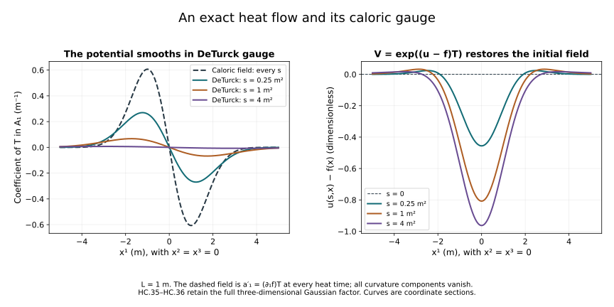

# Constructing the Yang–Mills heat flow

The [heat-analysis companion](../classical-heat-analysis.html)
proved curvature estimates on existing regular heat solutions.
Here we construct such solutions from their initial connection,
and then construct the DeTurck flow for data with one
square-integrable spatial derivative.

Keep the physical spatial coordinates, the reference length
\(\ell>0\), the original closed matrix group \(G\subset U(N)\)
and \(\kappa(X,Y)=-\operatorname{tr}(XY)\). The heat parameter
\(s\) has units of length squared. The spatial connection is
\(A=(A_1,A_2,A_3)\). Its curvature and its DeTurck equation
are the full formulas (H9.27)–(H9.30). This chapter uses
the Fourier and matrix-product proofs in
[Lesson 9, Sections 2–3](../local-and-global-classical-evolution.html).

The research comparison is Sung-Jin Oh's
[*Gauge choice for the Yang–Mills equations using the
Yang–Mills heat flow and local well-posedness in \(H^1\)*,
arXiv:1210.1558v2](https://arxiv.org/abs/1210.1558v2),
Section 5, and the heat-flow section of
[*Finite energy global well-posedness of the Yang–Mills
equations on \(\mathbb R^{1+3}\): An approach using the
Yang–Mills heat flow*, arXiv:1210.1557v2](https://arxiv.org/abs/1210.1557v2).
The arguments and constants here are independent course
exposition with complete receiving proofs.

The first four sections construct a regular DeTurck solution,
preserve all higher regularity on one common interval and
construct its actual caloric gauge. The following sections
give a DeTurck solution for arbitrary \(\dot H^1\) data,
with quantitative uniqueness and continuous dependence.
The heat estimates and gauge bounds transferring that last result
to the caloric solution map are proved in the
[following companion](../classical-caloric-gauge.html).

## 1. Spaces and the full multilinear equation

Retain the exact \(H^q_\ell\) norms from F09 and their tuple norm
\(M_q(A)=(\sum_{i=1}^3\|A_i\|_{H^q_\ell}^2)^{1/2}\).
Write \(k_{q,\ell}=2^{q-1}b_\ell\), with
\(b_\ell=\pi/((2\pi)^{3/2}\ell^{3/2})\), as in F09.
Its proved tame matrix product bound implies, for \(r\geq2\),

\[
 \|[X,Y]\|_{H^r_\ell}\leq
 2k_{r,\ell}\bigl(
   \|X\|_{H^r_\ell}\|Y\|_{H^2_\ell}
  +\|X\|_{H^2_\ell}\|Y\|_{H^r_\ell}\bigr).
 \tag{HC.1}
\]

Each ordinary derivative has operator bound
\(\|\partial_i f\|_{H^{r-1}_\ell}
\leq\ell^{-1}\|f\|_{H^r_\ell}\), since
\(\ell^2\xi_i^2\leq1+\ell^2|\xi|^2\).
Define the ordered multilinear maps

\[
 \begin{aligned}
 Q(A,B)_i&=\sum_{j=1}^3
       \bigl(2[A_j,\partial_jB_i]-[A_j,\partial_iB_j]\bigr),\\
 T(A,B,C)_i&=\sum_{j=1}^3[A_j,[B_j,C_i]],\\
 N(A)&=Q(A,A)+T(A,A,A).
 \end{aligned}
 \tag{HC.2}
\]

The equation is exactly \(\partial_s A=\Delta A+N(A)\);
its heat connection component is \(a_s=\sum_j\partial_j A_j\).
These maps preserve the specified matrix Lie algebra.
With

\[
 C_2=36\sqrt3\,k_{2,\ell}/\ell,\qquad
 C_3=48\sqrt3\,k_{2,\ell}^2,
 \tag{HC.3}
\]

we have

\[
 M_2(Q(A,B))\leq C_2M_3(A)M_3(B),\qquad
 M_2(T(A,B,C))\leq C_3M_3(A)M_3(B)M_3(C).
 \tag{HC.4}
\]

Indeed (HC.1) at \(r=2\) gives \(4k_{2,\ell}\)
times the two \(H^2_\ell\) norms. In each output component
of \(Q\) the absolute coefficients total \(3(2+1)=9\);
use the derivative bound and then the tuple factor \(\sqrt3\).
This gives \(9\cdot4\sqrt3\,k_{2,\ell}/\ell=C_2\).
Each of the three nested commutators in \(T\) has bound
\((4k_{2,\ell})^2\) times the three input norms; the same
tuple step gives \(3\cdot16\sqrt3\,k_{2,\ell}^2=C_3\).

Writing \(\delta=A-B\), exact multilinearity gives

\[
 N(A)-N(B)=Q(\delta,A)+Q(B,\delta)
  +T(\delta,A,A)+T(B,\delta,A)+T(B,B,\delta).
 \tag{HC.5}
\]

Therefore on a ball \(M_3(A),M_3(B)\leq R\), its Lipschitz
constant from \(H^3_\ell\) to \(H^2_\ell\) is at most
\(L_R=2C_2R+3C_3R^2\). No factor in the cubic difference
is replaced by a factor from the other solution.

## 2. The heat multiplier and a contraction time

From the exact Gaussian multiplier, for \(s>0\),

\[
 \|H_sf\|_{H^q_\ell}\leq
 h_\ell(s)\|f\|_{H^{q-1}_\ell},\qquad
 h_\ell(s)=1+\frac{\ell}{\sqrt{2es}}.
 \tag{HC.6}
\]

To prove this bound, the quotient of the Fourier weights is
\(\sqrt{1+\ell^2|\xi|^2}\). It is at most \(1+\ell|\xi|\).
The maximum of \(\rho e^{-s\rho^2}\) is \(1/\sqrt{2es}\).
Multiply the pointwise bound by the original Fourier integrand
and retain its factor \((2\pi)^{-3}\). The heat operator also
contracts each \(H^q_\ell\) norm. Its time integral is exactly

\[
 J_\ell(S)=\int_0^S h_\ell(r)\,dr
            =S+\ell\sqrt{2S/e}.
 \tag{HC.7}
\]

For data \(A_0\in(H^3_\ell)^3\), choose any \(m_*>0\) with
the same units as \(M_3(A_0)\), set

\[
 R=2\max(m_*,M_3(A_0)),\quad
 L=L_R,\quad
 S=\min\left(\frac1{8L},\frac{e}{128\ell^2L^2}\right)>0.
 \tag{HC.8}
\]

Both entries defining \(S\) have units \(L^2\), and
\(J_\ell(S)L\leq1/4\).
On the closed radius-\(R\) ball of
\(C([0,S];(H^3_\ell)^3)\), define

\[
 \Phi(A)(s)=H_sA_0+\int_0^sH_{s-r}N(A(r))\,dr .
 \tag{HC.9}
\]

The integral converges in \(H^3_\ell\) by (HC.6)–(HC.7),
since \(N(A)\) is continuous and bounded in \(H^2_\ell\).
It is continuous at zero by its bound
\(J_\ell(s)\sup M_2(N(A))\). At a positive time split off
an interval of length \(\varepsilon\) next to the upper
endpoint. The norm of that contribution is bounded by
\(J_\ell(2\varepsilon)\sup M_2(N(A))\); on the remaining
interval the heat parameter is bounded below and the
Fourier multiplier is strongly continuous from \(H^2_\ell\)
to \(H^3_\ell\), with a uniform bound. Dominated convergence,
then \(\varepsilon\downarrow0\), proves continuity.

The free term has norm at most \(R/2\), while (HC.4) gives

\[
 \sup_s M_3(\Phi(A)(s))
 \leq R/2+J_\ell(S)(C_2R^2+C_3R^3)
 \leq3R/4 .
 \tag{HC.10}
\]

Equation (HC.5) gives contraction factor at most \(1/4\).
Iterate \(A^{(n+1)}=\Phi(A^{(n)})\) from \(H_sA_0\).
The differences form a summable geometric series in the
complete continuous-function space. Their limit is a fixed
point, by the Lipschitz bound, and two fixed points have
distance at most one quarter of their distance, hence
coincide. This constructs an actual solution.
For two data within the common \(R/2\) ball, subtraction gives

\[
 \sup_s M_3(A(s)-B(s))
       \leq\frac43M_3(A_0-B_0).
 \tag{HC.11}
\]

Uniqueness among all continuous \(H^3_\ell\) solutions follows
by covering the compact interval with finitely many short
intervals on which the analogous Lipschitz factor is below
one, using their finite common supremum norm and the shifted
Duhamel equation.

The equation holds in \(C^1([0,S];H^1_\ell)\).
Indeed \(\Delta A\in C H^1_\ell\). For the differentiated
heat integral, the operator bound is

\[
 \|\Delta H_sf\|_{H^1_\ell}
 \leq\frac{1}{\ell\sqrt{2es}}\|f\|_{H^2_\ell},
 \tag{HC.12}
\]

since \(\rho^2/\sqrt{1+\ell^2\rho^2}\leq\rho/\ell\).
Its integrable singularity justifies differentiation of
the truncated Duhamel integral in \(H^1_\ell\), with the
upper-endpoint term \(N(A(s))\), then passage to the limit.
This gives \(\partial_sA=\Delta A+N(A)\), including the
right derivative at zero. The heat kernel is real, and
all nonlinear values are in the closed real matrix Lie
algebra, so the construction stays in the original space.

## 3. Every higher derivative on the same interval

For \(q\geq3\), use (HC.1) with \(r=q-1\). Directly as above,

\[
 M_{q-1}(N(A))
 \leq\bigl(U_qM_3(A)+V_qM_3(A)^2\bigr)M_q(A),
 \tag{HC.13}
\]

where

\[
 U_q=36\sqrt3\,k_{q-1,\ell}/\ell,\qquad
 V_q=24\sqrt3\,k_{q-1,\ell}
                      (k_{2,\ell}+k_{q-1,\ell}).
 \tag{HC.14}
\]

For the quadratic term each commutator has the sum of its
high-low and low-high norms, both bounded by
\(\ell^{-1}M_qM_3\), with coefficient \(2k_{q-1,\ell}\).
For the cubic term the inner bracket has \(H^2\) bound
\(4k_{2,\ell}M_3^2\) and \(H^{q-1}\) bound
\(4k_{q-1,\ell}M_3M_q\). Applying the outer bracket
bound and summing its three terms proves (HC.13)–(HC.14).

For data in \(H^q_\ell\), repeat the contraction first in
that space. One may use constants
\(36\sqrt3\,k_{q-1,\ell}/\ell\) and
\(48\sqrt3\,k_{q-1,\ell}^2\) with \(M_q\) on all inputs
to obtain a positive initial interval by the same argument.
Its solution agrees with the \(H^3_\ell\) solution.
Let \(K_q=U_qR+V_qR^2>0\). On its interval it obeys

\[
 M_q(A(s))\leq M_q(A_0)+
       K_q\int_0^s h_\ell(s-r)M_q(A(r))\,dr .
 \tag{HC.15}
\]

Choose

\[
 \delta_q=\min\left(\frac1{4K_q},
                         \frac{e}{32\ell^2K_q^2}\right),
 \qquad D_q=2+2K_qJ_\ell(S).
 \tag{HC.16}
\]

Then \(K_qJ_\ell(\delta_q)\leq1/2\).
Suppose the supremum through the preceding block is \(V\).
Split (HC.15) into the preceding times and the current
block of length at most \(\delta_q\). If \(W\) is the
supremum including that block, it is bounded by the larger
of \(V\) and
\(M_q(A_0)+K_qJ_\ell(S)V+W/2\).
Since \(V\geq M_q(A_0)\), this gives \(W\leq D_qV\).
Induction over the exact number \(\lceil S/\delta_q\rceil\)
of blocks gives the finite bound

\[
 \sup_{s\leq S}M_q(A(s))
       \leq D_q^{\lceil S/\delta_q\rceil}M_q(A_0)
 \tag{HC.17}
\]

on every existing higher-regularity subinterval.

This estimate also proves that such a subinterval cannot
end before \(S\). At a proposed endpoint \(S'<S\), the
nonlinearity is bounded in \(H^{q-1}_\ell\) by (HC.13).
The Duhamel integral over times within \(2\varepsilon\)
of \(S'\) has norm at most a constant times
\(J_\ell(2\varepsilon)\), tending to zero. The remaining
integral converges in \(H^q_\ell\) by strong continuity
of the heat multiplier away from zero and domination.
The free term converges there as well. This constructs
an \(H^q_\ell\) endpoint value. The local contraction
starting from that value extends the solution, with
uniqueness on the overlap, a contradiction. Thus (HC.17)
holds on the entire original interval.

For \(A_0\in H^\infty\), it follows that \(A\in C H^\infty\)
on one common interval (HC.8). The PDE gives
\(\partial_sA\in C H^\infty\): for any desired \(q\) use
the just-proved \(q+2\) bound and the polynomial product
formula. Differentiate that polynomial PDE repeatedly.
At each step the product rule yields finitely many
products of earlier heat derivatives and their spatial
derivatives, all continuous in every needed Sobolev norm.
Induction proves \(A\in C^\infty_sH^\infty_x\).

## 4. An actual caloric gauge

Set \(a_s=\sum_j\partial_jA_j\) and solve
\(V_s=Va_s,\ V(0)=I\). Write \(W=V-I\), so that
\(W_s=a_s+Wa_s,\ W(0)=0\). For \(q\geq2\) let
\(m_q=\sup_{[0,S]}\|a_s(s)\|_{H^q_\ell}\).
The multiplication bound gives
\(\|Wa_s\|_{H^q_\ell}\leq2k_{q,\ell}m_q\|W\|_{H^q_\ell}\).
Picard's iterated integrals are bounded by the exponential
series with ordered-simplex factors \(S^n/n!\), so they
construct a unique \(W\in C H^q_\ell\) and give

\[
 \|W(s)\|_{H^q_\ell}
       \leq s m_q\exp(2k_{q,\ell}m_qs).
 \tag{HC.18}
\]

The same construction at every \(q\), uniqueness, and the
ODE imply \(W\in C^\infty_sH^\infty_x\).
Pointwise, \((VV^*)_s=V(a_s+a_s^*)V^*=0\), hence
\(V^{-1}=V^*\). Membership in the specified closed subgroup
\(G\) follows from the product-of-exponentials approximation
for its Lie-algebra ODE already proved in F09 Section 10.
Its inverse satisfies \((V^{-1})_s=-a_sV^{-1}\).
Thus

\[
 a'_i=VA_iV^{-1}-(\partial_iV)V^{-1},\qquad a'_s=0
 \tag{HC.19}
\]

is a regular caloric-gauge heat solution with the same
initial spatial connection. Its regularity follows by
expanding \(V=I+W,\ V^{-1}=I+W^*\) in the displayed
products: each nonconstant factor is in every Sobolev
space. Gauge covariance, proved in F05, gives
\(F'_{si}=\sum_jD'_jF'_{ji}\).

This completes the regular local heat construction and its
actual caloric gauge. It does not yet prove the energy-only
heat lifespan or the low-regularity Lipschitz theorem; those
are the subsequent calculations, not additional hypotheses
of the solution just constructed.

## 5. The space with one initial spatial derivative

Recall the concrete \(\dot H^1(\mathbb R^3)\) space proved in
Lesson 9, Section 9: it is the completion of compact smooth
functions in the gradient \(L^2\) norm, represented uniquely
by functions in \(L^6\) with that weak gradient. Its Sobolev
bound is \(\|u\|_6\leq C_S\|\nabla u\|_2\),
where \(C_S=4/\sqrt3\).
For a connection tuple define

\[
 \begin{aligned}
 d_1(A)&=\left(\sum_{i,j=1}^3
                    \|\partial_j A_i\|_2^2\right)^{1/2},\\
 d_2(A)&=\left(\sum_{i,j,k=1}^3
                    \|\partial_j\partial_k A_i\|_2^2\right)^{1/2},\\
 \|A\|_{\mathfrak X_S}
  &=\sup_{0\leq s\leq S}d_1(A(s))
       +\left(\int_0^S d_2(A(s))^2\,ds\right)^{1/2}.
 \end{aligned}
 \tag{HC.20}
\]

The space \(\mathfrak X_S\) consists of
\(A\in C([0,S];(\dot H^1)^3)\) whose indicated second
weak derivatives belong to \(L^2((0,S)\times\mathbb R^3)\).
Every derivative component in (HC.20) is retained. In
particular the Hessian contains all ordered pairs \(j,k\).

This space is complete. To see this, a Cauchy sequence
converges in \(C\dot H^1\), by completeness of \(\dot H^1\),
and hence in \(C L^6\). Its Hessians converge in spacetime
\(L^2\). Testing against a compact smooth spacetime function
and integrating the distributional derivatives onto that
test identifies the latter limit with the Hessian of the
former. The first limit is continuous in \(\dot H^1\);
thus both parts of the norm converge in the stated space.

We also need the following ordinary-derivative consequence
of the ball-average proof (H9.10):

\[
 \|A\|_\infty\leq C_M C_S\,d_1(A)^{1/2}d_2(A)^{1/2},
 \qquad
 \|A\|_6\leq C_Sd_1(A),
 \tag{HC.21}
\]

whenever \(A\in(\dot H^1)^3\) and \(d_2(A)<\infty\).
Here \(C_M\) is exactly (H9.9).
For a complete extension from the smooth case, take
\(\chi_R A\) with the cutoff in (H9.13). The first derivative
has the additional term \((\partial_j\chi_R)A\), bounded
in \(L^2\) by
\(\|\partial_j\chi\|_3\|A\|_{L^6(\{|x|>R\})}\).
The full second derivative is

\[
 \partial_j\partial_k(\chi_R A)
 =\chi_R\partial_j\partial_k A
  +(\partial_j\chi_R)\partial_k A
  +(\partial_k\chi_R)\partial_j A
  +(\partial_j\partial_k\chi_R)A .
\]

The middle terms tend to zero in \(L^2\), each bounded
by \(M_\chi R^{-1}\|\nabla A\|_{L^2(\{|x|>R\})}\).
The last is at most
\(R^{-1}\|\partial_j\partial_k\chi\|_3
\|A\|_{L^6(\{|x|>R\})}\).
The remaining cutoff errors tend to zero by integrability.
Convolution with a smooth approximate identity now gives
compact smooth approximations in both derivative norms
and in \(L^6\). Apply the smooth ball-average inequality,
use \(\|\nabla A\|_6\leq C_Sd_2(A)\) on the full gradient
tuple, and pass to an almost-everywhere convergent subsequence
of the \(L^6\) approximations. This proves (HC.21).
The same approximation and Parseval show

\[
 \sum_i\|\Delta A_i\|_2^2=d_2(A)^2 .
 \tag{HC.22}
\]

For compact smooth fields this is the identity
\(\sum_{j,k}\xi_j^2\xi_k^2=|\xi|^4\) in the original
Fourier integral. The approximation just proved gives
the stated extension.

## 6. The forced heat equation in this space

Let \(A_0\in(\dot H^1)^3\) and
\(F\in L^2((0,S);(L^2)^3)\). Here the unindexed
\(F\) denotes linear forcing; curvature keeps its indexed
notation \(F_{ij}\). Then

\[
 u(s)=H_sA_0+\int_0^sH_{s-r}F(r)\,dr
 \tag{HC.23}
\]

defines an element of \(\mathfrak X_S\), and

\[
 \|u\|_{\mathfrak X_S}
       \leq2\bigl(d_1(A_0)+\|F\|_{L^2_sL^2_x}\bigr).
 \tag{HC.24}
\]

The initial term is first defined by convolution on \(L^6\),
where \(A_0\) has its unique representative.
Distributional differentiation commutes with the convolution,
so its gradient is \(H_s\nabla A_0\). The \(L^2\) heat
continuity gives \(C\dot H^1\) continuity through zero.
For smooth compact data and forcing, pair the equation
\(\partial_su-\Delta u=F\) with \(-\Delta u\). Spatial
integration by parts, with all tuple components summed,
gives

\[
 \frac12\frac d{ds}d_1(u)^2+d_2(u)^2
      =-\sum_i\langle F_i,\Delta u_i\rangle
      \leq\frac12\|F\|_2^2+\frac12d_2(u)^2 .
 \tag{HC.25}
\]

The solutions in this calculation are obtained from the
Gaussian formula and are spatially rapidly decreasing;
equivalently a cutoff gives a vanishing boundary term.
After integration,

\[
 d_1(u(s))^2+\int_0^s d_2(u(r))^2\,dr
       \leq d_1(A_0)^2+\int_0^s\|F(r)\|_2^2\,dr .
 \tag{HC.26}
\]

Taking the gradient supremum and the final integrated
bound separately proves (HC.24).
Approximate \(A_0\) by compact smooth functions in
\(\dot H^1\), and \(F\) by compact smooth spacetime
functions in \(L^2_sL^2_x\). Apply (HC.24) to their
differences. Completeness of \(\mathfrak X_S\) gives
the limit with the same bound.
The forcing integrals also converge in \(C_sL^2_x\),
since their difference is bounded by
\(\sqrt S\|F_n-F_m\|_{L^2_sL^2_x}\).
It follows that the limit is exactly (HC.23), with its
gradient interpreted in the proved sense.
Passing the distributional equation to the limit gives
\(\partial_su=\Delta u+F\in L^2_sL^2_x\).

There is no other distributional solution in
\(\mathfrak X_S\) with the same data and forcing.
Indeed, the gradient \(v=\nabla(u-\widetilde u)\) of their
difference is a \(C_sL^2_x\) solution of
\(\partial_sv=\Delta v\) with zero initial value.
Convolve only in space with a compact smooth mollifier
\(\rho_\varepsilon\). Its derivatives are integrable, so
\(v_\varepsilon\in C_sH^2_x\) and
\(\Delta v_\varepsilon\in C_sL^2_x\).
The distributional time equation then gives
\(v_\varepsilon(s)=\int_0^s\Delta v_\varepsilon(r)\,dr\)
in \(L^2\): test against a dense set of \(L^2\) vectors,
apply the scalar fundamental theorem for a continuous
distributional derivative, and use continuity to identify
the initial constant. Thus \(v_\varepsilon\) is \(C^1_sL^2_x\).
Its \(L^2\) energy identity gives

\[
 \frac d{ds}\|v_\varepsilon(s)\|_2^2
          =-2\|\nabla v_\varepsilon(s)\|_2^2\leq0 .
\]

It has zero initial norm, hence vanishes. Taking the
mollifier limit gives \(v=0\). A function in \(L^6\) with
zero distributional gradient is zero: its mollifications
are spatial constants in \(L^6(\mathbb R^3)\), hence zero,
and they converge in \(L^6\). This proves uniqueness and
also shows that every solution in the stated class has
the Duhamel representation (HC.23).

## 7. The nonlinear maps on the energy space

Keep exactly \(Q,T,N\) from (HC.2), with their displayed
matrix order. Define

\[
 D_2=18\sqrt3\,C_M C_S,\qquad
 D_3=12\sqrt3\,C_S^3 .
 \tag{HC.27}
\]

For \(A,B,C\in\mathfrak X_S\),

\[
 \begin{aligned}
 \|Q(A,B)\|_{L^2_sL^2_x}
       &\leq D_2 S^{1/4}\|A\|_{\mathfrak X_S}
                                  \|B\|_{\mathfrak X_S},\\
 \|T(A,B,C)\|_{L^2_sL^2_x}
       &\leq D_3 S^{1/2}\|A\|_{\mathfrak X_S}
                         \|B\|_{\mathfrak X_S}\|C\|_{\mathfrak X_S}.
 \end{aligned}
 \tag{HC.28}
\]

**Proof.** For each component of \(Q\), the absolute
coefficients of its brackets total 9. The pointwise
matrix bracket bound is \(2|X||Y|\). Taking the tuple
norm therefore gives

\[
 \|Q(A,B)(s)\|_2
    \leq18\sqrt3\,\|A(s)\|_\infty d_1(B(s))
    \leq D_2 d_1(A(s))^{1/2}d_2(A(s))^{1/2}d_1(B(s)).
\]

Square and integrate. Pull out the gradient suprema and
use
\(\int_0^S d_2(A)\,ds\leq
\sqrt S(\int_0^S d_2(A)^2\,ds)^{1/2}\).
Taking the square root proves the first line of (HC.28).
For \(T\), each nested bracket has pointwise factor 4,
there are three summands per component, and the tuple
factor is \(\sqrt3\). Hölder with three spatial \(L^6\)
factors gives

\[
 \|T(A,B,C)(s)\|_2
 \leq12\sqrt3\,\|A(s)\|_6\|B(s)\|_6\|C(s)\|_6
 \leq D_3d_1(A(s))d_1(B(s))d_1(C(s)).
\]

Its \(L^2_s\) norm supplies the factor \(S^{1/2}\),
proving the second line. All products are measurable:
use the \(L^6\) representatives and their weak derivative
representatives; the displayed bounds put the products
in the separable \(L^2\) space. \(\square\)

In particular \(N:\mathfrak X_S\to L^2_sL^2_x\) is a
continuous polynomial map. On a radius-\(R\) ball, (HC.5)
and (HC.28) give the exact useful Lipschitz bound

\[
 \|N(A)-N(B)\|_{L^2_sL^2_x}
 \leq\left(2D_2S^{1/4}R+3D_3S^{1/2}R^2\right)
                                      \|A-B\|_{\mathfrak X_S}.
 \tag{HC.29}
\]

The powers \(1/4\) and \(1/2\) arise from the actual heat
integrals, without a change of coordinates or fields.

## 8. A construction for arbitrary \(\dot H^1\) data

Let \(A_0\in(\dot H^1)^3\), valued in the specified
\(\mathfrak g\). Fix \(m_*>0\) with the same units as
\(d_1(A_0)\), and set

\[
 \begin{aligned}
 R&=4\max(m_*,d_1(A_0)),\\
 S&=\min\left((32D_2R)^{-4},(48D_3R^2)^{-2}\right).
 \end{aligned}
 \tag{HC.30}
\]

There is a unique solution \(A\in\mathfrak X_S\) of the
DeTurck equation \(\partial_sA=\Delta A+N(A)\), with these
initial data, and the constructed solution has
\(\|A\|_{\mathfrak X_S}\leq R\). The uniqueness is in the
whole class \(\mathfrak X_S\), not only in this ball.
For data \(A_0,B_0\) with a common bound \(d_1(A_0),d_1(B_0)
\leq R/4\), their constructed solutions satisfy

\[
 \|A-B\|_{\mathfrak X_S}\leq\frac83\,d_1(A_0-B_0).
 \tag{HC.31}
\]

**Proof.** On the closed radius-\(R\) ball of
\(\mathfrak X_S\), use the same formula (HC.9).
The linear estimate (HC.24) bounds its free part by
\(2d_1(A_0)\leq R/2\).
Its Lipschitz constant is at most

\[
 \theta=4D_2RS^{1/4}+6D_3R^2S^{1/2}\leq\frac14,
\]

because each summand is at most \(1/8\) by (HC.30).
Its nonlinear part is at most
\(2D_2S^{1/4}R^2+2D_3S^{1/2}R^3
\leq\theta R\leq R/4\).
It therefore maps the ball into itself and contracts it.
The geometric Picard convergence and uniqueness argument
from Section 2 applies in the complete space proved in
Section 5. It produces the solution with
\(\partial_sA=\Delta A+N(A)\in L^2_sL^2_x\), by Section 6.
All values remain in the original real matrix Lie algebra.
Subtracting two fixed-point equations gives
\(\|A-B\|_{\mathfrak X_S}
\leq2d_1(A_0-B_0)+\theta\|A-B\|_{\mathfrak X_S}\),
which proves (HC.31).

For any two solutions in \(\mathfrak X_S\), Section 6
gives their Duhamel representations. Choose a common
radius larger than both norms and choose a positive
interval length by (HC.30) for that radius. On its first
interval, subtraction with identical data makes the
difference zero by (HC.29) and (HC.24). Restart at the
right endpoint, using the \(C\dot H^1\) continuity.
The norm restricted to any such interval is bounded by
the same radius, so the argument repeats. The finite
number \(\lceil S/\delta\rceil\) of intervals of length
at most \(\delta\) covers all of \([0,S]\), proving
uniqueness in the whole class. \(\square\)

The time (HC.30) depends only on a bound for the one-derivative
initial norm. Since \(d_1(A_0)\) has units \(L^{-1/2}\),
both expressions for \(S\) have units \(L^2\). This construction
applies directly to the homogeneous space; it does not
obtain a rough solution by taking a limit of regular
lifespans that might tend to zero.

For compact smooth initial approximations \(A_0^{(n)}\to A_0\)
in \(\dot H^1\), choose the same radius \(R\) larger than
four times all their initial norms. Formula (HC.31) proves
convergence of their energy-space solutions in
\(\mathfrak X_S\) on the same interval. Whenever the regular
solutions of Sections 1–4 exist on a common subinterval,
they belong to \(\mathfrak X\) there and uniqueness identifies
them with these solutions. The two constructions are thus
related by an exact identity on their overlapping intervals.
Extending every high derivative through the full time
(HC.30), and controlling the low-regularity caloric gauge,
require the further smoothing and gauge estimates.

## 9. An extra derivative in two source displays

The global paper's author TeX line 1546 and its companion's
line 1756 both display a bound with
\(\|\partial_x(A-A')\|_{\dot H^1}\) on the left and only
\(\|\overline A-\overline A'\|_{\dot H^1}\) on the right,
uniformly through \(s=0\). This is a two-derivative norm
compared with one initial derivative. The following exact
caloric-gauge solutions show that this displayed bound
cannot hold with a uniform constant on a bounded initial
\(\dot H^1\) set.

Fix \(\ell>0\), a nonzero \(T\in\mathfrak g\), and a nonzero
real even function
\(\psi\in C_c^\infty(B_{1/4}(0))\) of a dimensionless
frequency variable. For integers \(n\geq1\), define the
real Schwartz function \(f_n\) by the original Fourier
transform and inverse of Lesson 9, with

\[
 \widehat f_n(\xi)=\frac{\ell^3}{n^2}
       \left(\psi(\ell\xi-ne_1)+\psi(\ell\xi+ne_1)\right),
 \qquad
 A_i^{(n)}(x,s)=\partial_i f_n(x)\,T,\quad a_s^{(n)}=0.
 \tag{HC.32}
\]

The support is the disjoint union of the two indicated
balls in frequency space. The Fourier transform is real
and even, hence its inverse is real. Compact smooth
Fourier support gives a Schwartz inverse by repeated
integration by parts, and so every initial derivative
norm is finite for each \(n\).
The curvature is exactly

\[
 F_{ij}^{(n)}
 =(\partial_i\partial_j f_n-\partial_j\partial_i f_n)T
                  +(\partial_i f_n)(\partial_j f_n)[T,T]=0.
\]

Thus \(A^{(n)}\) is stationary in caloric gauge and satisfies
\(F_{si}=\sum_jD_jF_{ji}=0\) for every \(s\geq0\).
Equivalently \(V_n=\exp(-f_nT)\) gives the exact pure-gauge
identity \(-(\partial_iV_n)V_n^{-1}=\partial_i f_nT\).

Let

\[
 C_\psi=\frac{2\kappa(T,T)}{(2\pi)^3}\|\psi\|_2^2>0 .
\]

Parseval, the full ordered derivative sums and the change
of variable \(\eta=\ell\xi\) give

\[
 \begin{aligned}
 d_1(A^{(n)})^2
 &=\frac{\kappa(T,T)}{(2\pi)^3\ell n^4}
   \int|\eta|^4
       |\psi(\eta-ne_1)+\psi(\eta+ne_1)|^2\,d^3\eta,\\
 d_2(A^{(n)})^2
 &=\frac{\kappa(T,T)}{(2\pi)^3\ell^3 n^4}
   \int|\eta|^6
       |\psi(\eta-ne_1)+\psi(\eta+ne_1)|^2\,d^3\eta .
 \end{aligned}
 \tag{HC.33}
\]

On either support component,
\(n-1/4\leq|\eta|\leq n+1/4\). Their disjointness removes
the cross term exactly and gives total squared mass
\(2\|\psi\|_2^2\). Consequently

\[
 \begin{aligned}
 d_1(A^{(n)})^2
       &\leq C_\psi\ell^{-1}(5/4)^4,\\
 \frac{d_2(A^{(n)})}{d_1(A^{(n)})}
       &\geq\ell^{-1}
             \frac{(n-1/4)^3}{(n+1/4)^2}
                \longrightarrow\infty .
 \end{aligned}
 \tag{HC.34}
\]

Take the second solution \(A'=0\). Both are regular
caloric-gauge solutions on every heat interval, and
their initial one-derivative norms are uniformly bounded.
Equation (HC.34) contradicts the extra-derivative display
at every heat time, not just at zero.
If the source uses the maximum of component norms, the
conclusion is the same: for a tuple of \(r\) entries its
maximum lies between its Euclidean norm divided by
\(\sqrt r\) and its Euclidean norm. The finite factors
\(\sqrt9\) and \(\sqrt{27}\) do not change divergence of
the ratio in (HC.34).

This is a counterexample to the displayed extra derivative.
The DeTurck estimate actually proved in (HC.31) compares
one derivative on both sides, together with an integrated
second derivative. It does not assert the yet-unproved
low-regularity caloric-gauge difference bound. Neither
the example nor this source-display correction contradicts
the general Yang–Mills global-existence theorem.

## 10. The exact gauge map in the commuting example

The preceding stationary example also has an explicit
DeTurck representative. For any real Schwartz \(f\) and
fixed \(T\in\mathfrak g\), let \(u(s)=H_sf\). Then

\[
 \begin{aligned}
 A_i(s)&=\partial_i u(s)\,T,&
 a_s(s)&=\Delta u(s)\,T,\\
 V(s)&=\exp\bigl((u(s)-f)T\bigr),&
 a'_i(s)&=\partial_i f\,T,\qquad a'_s=0.
 \end{aligned}
 \tag{HC.35}
\]

These are exact solutions and the actual gauge map between
them. Every commutator among their connection components
vanishes, and \(\partial_su=\Delta u\). Consequently
\(\partial_sA_i=\Delta A_i\), as required by (HC.2), and
\(a_s=\sum_j\partial_j A_j\).
All matrices in the exponent commute with its derivatives,
so \(\partial_sV=V(\partial_su)T=Va_s\) and \(V(0)=I\).
Likewise
\((\partial_iV)V^{-1}=(\partial_i u-\partial_i f)T\).
Substitution in the full gauge formula gives exactly
the last line of (HC.35).

The matrices \(V-I\) belong to every Sobolev space.
For the undifferentiated term use
\(e^{hT}-I=\int_0^h e^{rT}T\,dr\), so
\(|e^{hT}-I|\leq |h||T|\) by unitarity.
Every spatial derivative of \(e^{hT}\) is a finite sum
of products of derivatives of the Schwartz function
\(h=u-f\), constant powers of \(T\), and the bounded
unitary exponential. Each product is square-integrable
with all further derivatives. The same reasoning applies
to heat derivatives on a compact heat interval.

For a worked formula take
\(f(x)=\exp(-|x|^2/(2L^2))\), with \(L>0\) a length.
Completing the square in the convolution with (H9.16)
and using the three scalar Gaussian integrals gives

\[
 \begin{aligned}
 v(s)&=L^2+2s,\\
 u(s,x)&=\left(\frac{L^2}{v(s)}\right)^{3/2}
                   \exp\left(-\frac{|x|^2}{2v(s)}\right),\\
 A_i(s,x)&=-\frac{x_i}{v(s)}u(s,x)\,T,\\
 a_s(s,x)&=\left(\frac{|x|^2}{v(s)^2}
                            -\frac3{v(s)}\right)u(s,x)\,T,\\
 a'_i(s,x)&=-\frac{x_i}{L^2}
                      \exp\left(-\frac{|x|^2}{2L^2}\right)T .
 \end{aligned}
 \tag{HC.36}
\]

To track the Gaussian constants directly, the exponent in
the convolution integrand is

\[
 -\frac{|x-y|^2}{4s}-\frac{|y|^2}{2L^2}
 =-\frac{L^2+2s}{4sL^2}
       \left|y-\frac{L^2x}{L^2+2s}\right|^2
       -\frac{|x|^2}{2(L^2+2s)} .
\]

Its \(y\)-integral is
\((4\pi sL^2/(L^2+2s))^{3/2}\) times the last exponential.
Multiplication by the original kernel factor
\((4\pi s)^{-3/2}\) gives the prefactor in (HC.36).
Differentiating that formula gives both
\(\partial_su=(|x|^2/v^2-3/v)u\) and
\(\Delta u=(|x|^2/v^2-3/v)u\).
The value at \(s=0\) follows by continuity.
Thus all displayed coefficients, including the spatial
dimension factor 3 and the heat factor 2, are retained.

**Figure HC.** For \(L=1\) metre and \(x^2=x^3=0\),
the left panel plots the coefficient of \(T\) in \(A_1\)
from (HC.36), at the three labelled heat times.
The dashed curve is the caloric coefficient
\(-x^1\exp(-(x^1)^2/(2L^2))/L^2\), which is independent
of \(s\). The right panel plots the actual dimensionless
phase \(u-f\) in \(V=\exp((u-f)T)\). Its spatial derivative
is exactly the term subtracted by the gauge transformation.
The three-dimensional Gaussian prefactor is retained even
though the picture is a coordinate section. These are
numerical samples of the proved formulas (HC.35)–(HC.36).

## 11. Exercises with complete solutions

### Exercise 1. The multiplier maximum

Prove (HC.6) and compute the integral of its singular
term without suppressing \(\ell\).

**Solution.** With \(\rho=|\xi|\), the quotient of the
two Sobolev weights is \(\sqrt{1+\ell^2\rho^2}\).
It is at most \(1+\ell\rho\), because squaring that
nonnegative expression adds \(2\ell\rho\).
The derivative of \(\rho e^{-s\rho^2}\) is
\((1-2s\rho^2)e^{-s\rho^2}\); the function vanishes at
zero and tends to zero at infinity. Its sole interior
maximum is \(1/\sqrt{2es}\), attained at
\(\rho=1/\sqrt{2s}\). Squaring the multiplier bound and
integrating against the full Fourier norm proves (HC.6).
Finally
\(\int_0^S\ell(2er)^{-1/2}dr=\ell\sqrt{2S/e}\),
which gives exactly (HC.7).

### Exercise 2. The cubic difference without changing order

Write \(T(A,A,A)-T(B,B,B)\) using \(\delta=A-B\), and
expand its \(i\)-th component into nested commutators.

**Solution.** Add and subtract \(T(B,A,A)\) and
\(T(B,B,A)\). The result is

\[
 \sum_{j=1}^3\left(
 [\delta_j,[A_j,A_i]]
 +[B_j,[\delta_j,A_i]]
 +[B_j,[B_j,\delta_i]]\right).
\]

Multilinearity proves equality term by term.
Each summand contains exactly one difference and preserves
the original order. Bounding its three terms by (HC.4)
gives \(3C_3R^2M_3(\delta)\) on a common radius-\(R\)
ball. Bounding by (HC.28) instead gives
\(3D_3S^{1/2}R^2\|\delta\|_{\mathfrak X_S}\).

### Exercise 3. Why higher regularity uses one interval

Suppose the \(H^3_\ell\) construction has radius \(R\)
and endpoint \(S\). Derive a finite bound for \(M_q\)
on that same interval using (HC.15).

**Solution.** Choose \(\delta_q\) as in (HC.16).
The two terms in \(K_qJ_\ell(\delta_q)\) are each at
most \(1/4\), hence the sum is at most \(1/2\).
If the preceding supremum is \(V\), splitting the
integral in (HC.15) at the preceding endpoint bounds
the current supremum by
\(2M_q(A_0)+2K_qJ_\ell(S)V\), or by \(V\) if the
maximum was already attained earlier. Since
\(V\geq M_q(A_0)\), both are at most \(D_qV\).
After exactly \(\lceil S/\delta_q\rceil\) blocks,
this gives (HC.17). At a possible earlier endpoint,
the tail of the Duhamel integral is at most a fixed
constant times \(J_\ell(2\varepsilon)\), which tends
to zero; its earlier part has a strong \(H^q_\ell\)
limit. The resulting endpoint data restart the local
construction. This proves persistence on the original
interval, rather than choosing smaller lifespans for
larger \(q\).

### Exercise 4. A homogeneous function need not be square-integrable

Explain why the construction in Sections 5–8 does not
require \(A_0\in L^2\), and verify that its linear heat
solution is still defined.

**Solution.** The concrete \(\dot H^1\) representative
lies in \(L^6\) with gradient in \(L^2\); neither statement
requires \(L^2\) for the function itself. The Gaussian
has \(L^1\) norm 1, so Young gives \(H_sA_0\in L^6\).
Its distributional gradient is \(H_s\nabla A_0\in L^2\).
The latter converges to \(\nabla A_0\) in \(L^2\) as
\(s\downarrow0\), which is exactly \(\dot H^1\)
continuity. The Hessian heat integral is controlled
by (HC.26). The forced term is separately in \(C_sL^2\),
and its gradient and Hessian are controlled in the
same energy space. Thus every term in (HC.23) has its
specified meaning without an \(L^2\) initial potential.

### Exercise 5. The free heat energy at a finite endpoint

For \(u=H_sA_0\), prove the exact identity

\[
 \int_0^S d_2(u(s))^2\,ds
       =\frac12\bigl(d_1(A_0)^2-d_1(u(S))^2\bigr).
\]

Retain the finite-\(S\) Fourier factor.

**Solution.** Apply Fourier transformation to the
\(L^2\) tuple \(G_0=\nabla A_0\). The gradient of \(u\)
has transform \(e^{-s|\xi|^2}\widehat G_0\).
Tonelli gives

\[
 \int_0^S d_2(u(s))^2\,ds
 =\frac1{(2\pi)^3}\int_{\mathbb R^3}
     \frac{1-e^{-2S|\xi|^2}}2
                      |\widehat G_0(\xi)|^2\,d^3\xi .
\]

Indeed the inner integral is
\(\int_0^S|\xi|^2e^{-2s|\xi|^2}ds
=(1-e^{-2S|\xi|^2})/2\), including its zero value
at \(\xi=0\). Parseval identifies the two terms and
proves the identity. In particular the free heat
solution has \(\mathfrak X_S\) norm at most
\((1+1/\sqrt2)d_1(A_0)\), a sharper bound than the
factor 2 used in the contraction.

### Exercise 6. The energy-space contraction constants

Verify that the explicit time (HC.30) gives
\(\theta\leq1/4\), and derive the data-dependence factor.

**Solution.** The first entry in (HC.30) gives
\(S^{1/4}\leq(32D_2R)^{-1}\), so
\(4D_2RS^{1/4}\leq1/8\).
The second gives \(S^{1/2}\leq(48D_3R^2)^{-1}\), so
\(6D_3R^2S^{1/2}\leq1/8\).
Their sum is at most \(1/4\).
The free difference has norm at most twice the initial
gradient difference by (HC.24); subtracting the two
integral equations gives
\((1-\theta)\|A-B\|_{\mathfrak X_S}
\leq2d_1(A_0-B_0)\).
Since \(1-\theta\geq3/4\), the factor is \(8/3\).

### Exercise 7. Check the commuting gauge in every component

For (HC.35), verify the spatial, heat and curvature
components after the gauge transformation.

**Solution.** Since \(V\) is an exponential of a scalar
multiple of \(T\), it commutes with \(T\).
The spatial derivative satisfies
\((\partial_iV)V^{-1}=(\partial_i u-\partial_i f)T\).
Thus \(a'_i=\partial_i uT-(\partial_i u-\partial_i f)T
=\partial_i fT\).
Similarly \(V_sV^{-1}=\partial_suT=\Delta uT=a_s\),
so \(a'_s=0\).
The spatial curvature is zero because mixed derivatives
commute and \([T,T]=0\). The transformed heat curvature
is \(\partial_s a'_i=0\).
Before transformation it is also
\(\partial_s\partial_i uT-\partial_i\Delta uT=0\).
Thus every component agrees with
\(F'_{\mu\nu}=VF_{\mu\nu}V^{-1}\).

### Exercise 8. A finite choice that defeats the extra derivative

From (HC.34), give an explicit lower bound linear in \(n\).
For a proposed constant \(C>0\) in the extra-derivative
display, choose an integer which contradicts it.

**Solution.** For \(n\geq1\),
\(n-1/4\geq3n/4\) and \(n+1/4\leq5n/4\).
Consequently

\[
 \frac{d_2(A^{(n)})}{d_1(A^{(n)})}
 \geq\frac1\ell\,\frac{(3n/4)^3}{(5n/4)^2}
       =\frac{27n}{100\ell}.
\]

Take \(n=\lfloor100C\ell/27\rfloor+1\). Its ratio is
strictly larger than \(C\), while the same initial
one-derivative upper bound in (HC.34) remains in force.
The second solution is zero and both are stationary,
so the failure holds throughout every common heat
interval. This identifies the exact false display
without changing the source's underlying heat equation.

## 12. What has been constructed

Sections 1–4 provide actual regular DeTurck and caloric
solutions, on one interval retaining every higher derivative.
Sections 5–8 provide a unique DeTurck solution in
\(\mathfrak X_S\) for arbitrary \(\dot H^1\) initial data,
with explicit continuous dependence and a lifespan
controlled by its initial one-derivative norm. The
identity of the two DeTurck constructions on overlapping
intervals is proved by uniqueness, not inferred from
their similar formulas.

The weighted smoothing estimates and the low-regularity caloric
gauge are now proved in [Heat smoothing and the caloric gauge](../classical-caloric-gauge.html),
including the common lifespan of regular approximations and the
actual gauge limit. The physical-time estimates in the general
global-existence argument remain subsequent parts of Lesson 9.
The source reading behind this chapter covers the exact
DeTurck equation and local statements in Oh's companion
Section 5, including author TeX lines 1744–1936, and the
global paper's heat-flow discussion at lines 1503–1603.
The complete later global proof is not yet supplied by
this component.

