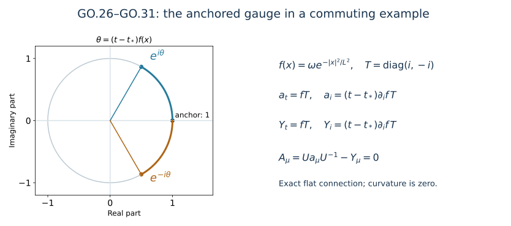

# Returning to physical temporal gauge

This analytic chapter belongs to Unit 9. The heat construction places
the temporal gauge condition at the upper heat endpoint. Physical
initial data live at heat time zero. We now construct the gauge that
sets the temporal connection component to zero at that physical
boundary, while retaining the chosen initial spatial representative.

Read [temporal boundary estimates](../classical-temporal-boundary.html),
TB.9–TB.11, and [caloric gauge](../classical-caloric-gauge.html),
HG.3 and HG.21–HG.36. These supply the five actual coefficient norms.
The construction is a matrix ODE; its spatial derivatives matter
because the connection transformation differentiates the gauge matrix.
Unitarity gives norm-preserving evolution, so the first and second
spatial derivative bounds can be proved without an exponential loss.

The proof covers existence, both time orientations, group membership,
all first and second spatial derivatives, the inverse transformation,
curvature, physical units, and a change of anchor. Its estimates act on
the existing regular solution and do not assert its continuation.
The worked example and eight solved exercises follow the proof.

Human-source comparison: Sung-Jin Oh,
[*Gauge choice for the Yang–Mills equations using the Yang–Mills heat flow
and local well-posedness in H1*, arXiv:1210.1558v2](https://arxiv.org/abs/1210.1558v2).
The receiving boundary and gauge proofs linked above state the exact
source comparisons; the calculations here are independent exposition.

## GO.1. Original objects, ordered norms, and the five inputs

Let \(I\) be the already given finite physical-time interval, and let
\(t_*\in I\) be the gauge anchor. Put

\[
b(t,x)=a_t(t,x,0),\qquad
\partial_tU(t,x)=U(t,x)b(t,x),\qquad U(t_*,x)=I_N.
\tag{GO.1}
\]

The Lie algebra is that of the original closed matrix group
\(G\subset U(N)\). On its anti-Hermitian matrices,
\(|X|^2=-\operatorname{tr}(X^2)=\operatorname{tr}(X^*X)\).
For arbitrary matrices and every differentiated gauge matrix use the
Hilbert–Schmidt norm. Use operator norm for an undifferentiated gauge
matrix in \(L^\infty\). All spatial tuples use their full Euclidean
tensor norm. In particular,

\[
\begin{aligned}
|\partial_xb|^2&=\sum_{i=1}^3|\partial_i b|_{\rm HS}^2,\\
|\partial_x^{(2)}b|^2&=\sum_{i,j=1}^3
                 |\partial_i\partial_jb|_{\rm HS}^2,\\
|\partial_xU|^2&=\sum_i|\partial_iU|_{\rm HS}^2,\qquad
|\partial_x^{(2)}U|^2=\sum_{i,j}|\partial_i\partial_jU|_{\rm HS}^2.
\end{aligned}
\tag{GO.2}
\]

Both orders of every mixed derivative are retained. Spatial norms are
on the original \(\mathbb R^3\); mixed norms keep time outside space.
Retain the constants

\[
C_S=\frac4{\sqrt3},\quad C_M=2\sqrt{A_*B_*},\quad
A_*=(4\pi/3)^{-1/6},\quad
B_*=(4\pi)^{-1}(20\pi/3)^{5/6}.
\tag{GO.3}
\]

TB.9–TB.10 prove the following actual bounds, with the original
\(D_B=\sqrt S B_W\), \(H_B=L_W+L_N\) and their complete definitions
retained in TB.2–TB.5:

\[
\begin{aligned}
\|b\|_{L^1_tL^\infty_x}
 &\le \mathsf B:=|I|^{1/2}C_MC_S\sqrt{D_BH_B},\\
\|\partial_xb\|_{L^1_tL^3_x}
 &\le \mathsf P:=|I|^{1/2}C_S^{1/2}\sqrt{D_BH_B},\\
\|\partial_x^{(2)}b\|_{L^1_tL^2_x}
 &\le \mathsf H:=|I|^{1/2}H_B,\\
\|\partial_xb\|_{L^\infty_tL^2_x}
 &\le \mathsf D:=4cd^2\mathscr J_1S^{1/4},\\
\|b\|_{L^\infty_tL^3_x}
 &\le \mathsf M:=2cd^2C_S^{1/2}
             \sqrt{\mathscr J_0\mathscr J_1}\sqrt S.
\end{aligned}
\tag{GO.4}
\]

These symbols denote numerical upper bounds. They do not replace or
rescale any field, coordinate, time interval, or physical constant.
The first bound also bounds \(L^1_tL^\infty_x\) in operator norm.

For every \(t\), let \(J_t\) be the closed interval with endpoints
\(t_*\) and \(t\), and define the following **unoriented** quantities:

\[
\begin{aligned}
B(t)&=\int_{J_t}\|b(r)\|_{L^\infty_x;\rm op}\,dr,\\
P(t)&=\int_{J_t}\|\partial_xb(r)\|_3\,dr,\\
H(t)&=\int_{J_t}\|\partial_x^{(2)}b(r)\|_2\,dr,\\
Q(t)&=\int_{J_t}\|\partial_xb(r)\|_6\,dr,\\
D(t)&=\int_{J_t}\|\partial_xb(r)\|_2\,dr,\qquad
M(t)=\int_{J_t}\|b(r)\|_3\,dr.
\end{aligned}
\tag{GO.5}
\]

All matrix identities below use oriented integrals from \(t_*\) to
\(t\). The quantities in GO.5 bound their norms on either side.

## GO.2. The needed L6 derivative bound is a proved consequence

For almost every original physical time, GO.4 gives
\(\partial_xb\in L^2_x\) and \(\partial_x^{(2)}b\in L^2_x\).
Apply the course's scalar Sobolev inequality to the length of the
full matrix-gradient tuple. Its weak gradient has length at most
\(|\partial_x^{(2)}b|\): for its real components \(v_A\),

\[
\sum_j\left|\partial_j\Big(\sum_A|v_A|^2\Big)^{1/2}\right|^2
\le\sum_{j,A}|\partial_jv_A|^2.
\tag{GO.6}
\]

At zeros use \((\sum_A|v_A|^2+\varepsilon^2)^{1/2}-\varepsilon\)
and pass to the limit. Approximation in \(H^1\) justifies applying
the scalar inequality; no additional factor depending on the number
of components occurs. Thus

\[
\|\partial_xb(t)\|_6
 \le C_S\|\partial_x^{(2)}b(t)\|_2,\qquad
Q(t)\le C_SH(t),\qquad
\|\partial_xb\|_{L^1_tL^6_x}\le C_S\mathsf H.
\tag{GO.7}
\]

This is the extra integrability needed in the second spatial gauge
derivative. It follows from the proved boundary norms, with the
complete Hessian and the unchanged constant \(4/\sqrt3\).

## GO.3. Both time orientations, existence, and the group

Fix \(x\) outside the null set where the time integral is undefined.
For \(t\ne t_*\), put \(\eta=\operatorname{sgn}(t-t_*)\),
\(T=|t-t_*|\). The exact ordered series is

\[
U(t,x)=I_N+\sum_{n=1}^{\infty}\eta^n
 \int_{0<\sigma_1<\cdots<\sigma_n<T}
 b(t_*+\eta\sigma_1,x)\cdots
 b(t_*+\eta\sigma_n,x)\,d\sigma_1\cdots d\sigma_n.
\tag{GO.8}
\]

When \(t<t_*\), the arguments of \(b\) decrease from left to
right and the factor is \((-1)^n\). No matrix factors have been
commuted. At \(t=t_*\), all positive-order terms are zero.
The operator norm of the \(n\)th term is bounded by
\(B(t)^n/n!\): the scalar product of norms is symmetric, so the
ordered simplex integral is \(1/n!\) of the full cube integral.
The series converges uniformly on the whole time interval, since
\(B(t)\le\mathsf B\), and satisfies

\[
U(t)=I_N+\int_{t_*}^{t}U(r)b(r)\,dr.
\tag{GO.9}
\]

Consequently it is absolutely continuous and satisfies GO.1 almost
everywhere. Iterating the integral equation for a difference of two
solutions bounds that difference by its bounded supremum times
\(\mathsf B^n/n!\); letting \(n\to\infty\) proves uniqueness.
The product rule for absolutely continuous matrices gives

\[
\partial_t(UU^*)=U(b+b^*)U^*=0,
\quad UU^*=I_N,\quad U^{-1}=U^*,\quad
\|U\|_{\rm op}=\|U^{-1}\|_{\rm op}=1.
\tag{GO.10}
\]

To retain the original subgroup \(G\), approximate \(b(\cdot,x)\)
in time in \(L^1\) by step functions valued in its finite-dimensional
Lie algebra. The step-function solutions are ordered products of
\(\exp(\delta t\,b_j)\), each in \(G\), with signed \(\delta t\).
For two anti-Hermitian coefficients \(b_1,b_2\), variation of
constants applied to
\((U_1-U_2)'=(U_1-U_2)b_1+U_2(b_1-b_2)\) gives the bound
\(\sup_{J_t}|U_1-U_2|_{\rm op}\le\int_{J_t}|b_1-b_2|_{\rm op}\).
Thus those products converge uniformly to \(U\); closedness of
\(G\) proves \(U(t,x)\in G\).

In particular, when \(b\in\mathfrak{su}(N)\), Jacobi's determinant
identity gives

\[
(\det U)'=\det U\,\operatorname{tr}(U^{-1}U')
 =\det U\,\operatorname{tr}b=0,\qquad \det U(t_*)=1.
\tag{GO.11}
\]

This proves the tracefree \(SU(N)\) assertion directly.
Integration of GO.9 and unitarity also prove

\[
\|U(t)-I_N\|_{L^\infty_x;\rm op}\le\min\{2,B(t)\},
\qquad \|U(t)-I_N\|_3\le M(t)\le|t-t_*|\mathsf M.
\tag{GO.12}
\]

The same two inequalities hold for \(U^{-1}-I_N\).

## GO.4. First spatial derivatives with no exponential loss

The actual coefficient is regular. On compact subsets of the
original time-space domain its parameter-dependent ODE may be
differentiated in \(x\): this follows by differentiating the
uniformly convergent integral series and its derivatives on each
compact subset. The regular coefficient and its first two spatial
derivatives have bounded time integrals there. An exhaustion gives
the derivative identities throughout the given interval.

For a matrix equation \(V'=Vb+f\), the right evolution and its
exact variation formula are

\[
R(r,t)=U(r)^{-1}U(t),\qquad
V(t)=V(t_*)U(t)+\int_{t_*}^{t}f(r)U(r)^{-1}U(t)\,dr.
\tag{GO.13}
\]

This is verified by differentiating the right-hand side; the
upper-endpoint term is \(f(t)\), and all remaining terms are
\(V(t)b(t)\). It holds with oriented endpoints when \(t<t_*\).
Every factor \(U(r)^{-1}U(t)\) is unitary.

Put \(U_i=\partial_iU\). Differentiation of GO.1 gives

\[
(U_i)_t=U_i b+U\partial_i b,\quad U_i(t_*)=0,
\qquad
Y_i:=U_iU^{-1}=\int_{t_*}^{t}U(r)\partial_i b(r)U(r)^{-1}\,dr.
\tag{GO.14}
\]

Taking the full tuple norm, using unitary invariance pointwise,
then Minkowski in space, proves the three distinct estimates

\[
\begin{aligned}
\|\partial_xU(t)\|_2=\|Y(t)\|_2
 &\le D(t)\le|t-t_*|\mathsf D,\\
\|\partial_xU(t)\|_3=\|Y(t)\|_3&\le P(t)\le\mathsf P,\\
\|\partial_xU(t)\|_6=\|Y(t)\|_6&\le Q(t)\le C_SH(t)\le C_S\mathsf H.
\end{aligned}
\tag{GO.15}
\]

The L6 estimate uses GO.7 inside the variation formula. It is
already available before estimating a second derivative of U.
There is consequently no circular Sobolev argument.

## GO.5. Full second derivatives, with every ordered term

For \(U_{ij}=\partial_i\partial_jU\), differentiation gives

\[
(U_{ij})_t=U_{ij}b
 +U_i\partial_jb+U_j\partial_i b+U\partial_i\partial_jb,
\qquad U_{ij}(t_*)=0.
\tag{GO.16}
\]

When \(i=j\), its two middle terms are both present. For all
ordered output indices \((i,j)\), the two middle tensors satisfy

\[
\left(\sum_{i,j}|U_i\partial_jb+U_j\partial_i b|_{\rm HS}^2\right)^{1/2}
 \le 2|\partial_xU|\,|\partial_xb|.
\tag{GO.17}
\]

Indeed each of the two tensors separately has norm at most the
product on the right without its factor two; apply the triangle
inequality. Matrix multiplication retains its order throughout.
Let \(g_3(r)=\|\partial_xb(r)\|_3\) and
\(g_6(r)=\|\partial_xb(r)\|_6\). Spatial Hölder in either order
and GO.15 give a bound for the L2 norm of the two middle terms by

\[
2\min\{P(r)g_6(r),\ Q(r)g_3(r)\}
 \le P(r)g_6(r)+Q(r)g_3(r).
\tag{GO.18}
\]

Along the path \(r=t_*+\eta\tau\), both \(P(r)\) and \(Q(r)\)
start from zero and have derivatives \(g_3(r)\), \(g_6(r)\)
with respect to \(\tau\). Hence their full product rule is

\[
\int_{J_t}\{P(r)g_6(r)+Q(r)g_3(r)\}\,dr=P(t)Q(t).
\tag{GO.19}
\]

GO.13 applied to the full tensor in GO.16 therefore proves

\[
\boxed{\quad
\|\partial_x^{(2)}U(t)\|_2
 \le H(t)+P(t)Q(t)
 \le H(t)+C_SP(t)H(t).
\quad}
\tag{GO.20}
\]

A direct one-sided use of Hölder would give the weaker valid
bound \(H(t)+2P(t)Q(t)\). GO.18–GO.19 prove the stronger bound
without deleting either ordered derivative placement. They are
the precise reason its coefficient is one rather than two.
No Hessian–Laplacian replacement, selected diagonal derivative,
or unproved absolute time integral is used.

For later use differentiate the exact right logarithmic derivative:

\[
\begin{aligned}
\partial_jY_i
 &=U_{ji}U^{-1}-Y_iY_j,\\
\partial_t(\partial_jY_i)
 &=U(\partial_j\partial_i b)U^{-1}
   +[Y_j,U(\partial_i b)U^{-1}],\qquad
\partial_jY_i(t_*)=0.
\end{aligned}
\tag{GO.21}
\]

For the second line differentiate
\(\partial_tY_i=U\partial_i bU^{-1}\), using
\(\partial_jU^{-1}=-U^{-1}(\partial_jU)U^{-1}\).
The full commutator tensor has length at most
\(2|Y||\partial_xb|\). Apply exactly GO.18–GO.19, with
\(\|Y\|_3\le P\) and \(\|Y\|_6\le Q\), to obtain the separate
useful estimate

\[
\boxed{\quad\|\partial_xY(t)\|_2\le H(t)+P(t)Q(t).\quad}
\tag{GO.22}
\]

This bound is stronger than estimating the first line of GO.21
by the triangle inequality after GO.20. That alternative would
add another product. The two displayed matrix identities in
GO.21 themselves are unchanged.

All the derivative norms of \(U^{-1}\) equal the corresponding
ones of \(U\): \(U^{-1}=U^*\), and differentiation commutes with
adjoint. This equality includes the full first and second
spatial tuples and the mixed derivative below.

## GO.6. Time derivatives, endpoint domains, and explicit constants

The ODE and its first spatial derivative give

\[
\begin{aligned}
\|\partial_tU\|_{L^1_tL^\infty_x;\rm op}&\le\mathsf B,\\
\|\partial_tU\|_{L^\infty_tL^3_x}&\le\mathsf M,\\
\|\partial_t\partial_xU(t)\|_2
 &\le\|\partial_xb(t)\|_2
       +Q(t)\|b(t)\|_3,\\
\|\partial_t\partial_xU\|_{L^\infty_tL^2_x}
 &\le\mathsf D+C_S\mathsf H\mathsf M.
\end{aligned}
\tag{GO.23}
\]

The last product is \((\partial_iU)b\) in precisely that order,
estimated in \(L^6_xL^3_x\to L^2_x\). The first term is
\(U\partial_i b\), whose Hilbert–Schmidt norm is unchanged.
There is no assertion of a second time derivative of U.

The estimates just proved imply

\[
\begin{aligned}
U-I_N&\in C(I;L^\infty_x;\rm op)\cap W^{1,\infty}(I;L^3_x),\\
\partial_xU&\in C(I;L^2_x\cap L^3_x\cap L^6_x)
                  \cap W^{1,\infty}(I;L^2_x),\\
\partial_x^{(2)}U&\in C(I;L^2_x),\qquad
Y\in C(I;L^2_x\cap L^3_x\cap L^6_x),\quad
\partial_xY\in C(I;L^2_x).
\end{aligned}
\tag{GO.24}
\]

Here continuity at a finite included endpoint means the continuous
extension supplied by the integral formulas. For the first line,
\(\|U(t)-U(r)\|_{L^\infty;\rm op}\le\int_{[r,t]}\|b\|_{L^\infty;\rm op}\)
and the L3 Bochner integral of \(Ub\) prove the assertions.
For first spatial derivatives, GO.14 is an indefinite Bochner
integral in each indicated space, multiplied on the right by a
matrix continuous in \(L^\infty\). For the Hessian, GO.16 and
GO.13 give the same argument with forcing in \(L^1_tL^2_x\),
as proved in GO.17–GO.19. GO.21 gives it directly for
\(\partial_xY\). GO.23 identifies the L2 time derivative and
proves its essential uniform bound. All spatial derivatives are
the derivatives of the original U, so their domains have been
identified rather than assigned independently.

For clarity, some complete substitutions into the receiving
bounds are

\[
\begin{aligned}
\sup_t\|\partial_xU(t)\|_3
 &\le |I|^{1/2}C_S^{1/2}\sqrt{D_BH_B},\\
\sup_t\|\partial_xU(t)\|_6
 &\le C_S|I|^{1/2}H_B,\\
\sup_t\|\partial_x^{(2)}U(t)\|_2,\quad
\sup_t\|\partial_xY(t)\|_2
 &\le |I|^{1/2}H_B
     +|I|C_S^{3/2}H_B\sqrt{D_BH_B},\\
\sup_t\|\partial_xU(t)\|_2
 &\le 4|I|cd^2\mathscr J_1S^{1/4},\\
\sup_t\|U(t)-I_N\|_3
 &\le2|I|cd^2C_S^{1/2}
       \sqrt{\mathscr J_0\mathscr J_1}\sqrt S,\\
\|\partial_t\partial_xU\|_{L^\infty_tL^2_x}
 &\le4cd^2\mathscr J_1S^{1/4}
  +2cd^2C_S^{3/2}|I|^{1/2}H_B
       \sqrt{\mathscr J_0\mathscr J_1}\sqrt S.
\end{aligned}
\tag{GO.25}
\]

All occurrences of \(c\), \(S\), \(|I|\), and the full original
boundary quantities remain visible.

## GO.7. Exact physical connection and curvature maps

In this section \(a_\mu(t,x)\) denotes the restriction
\(a_\mu(t,x,0)\), where \(\mu\in\{t,1,2,3\}\). Define

\[
Y_\mu=(\partial_\mu U)U^{-1},\qquad
A_\mu=Ua_\mu U^{-1}-Y_\mu.
\tag{GO.26}
\]

In particular \(Y_t=UbU^{-1}\) and

\[
A_t=0,\qquad A_i=Ua_iU^{-1}-Y_i,\qquad
A_i(t_*)=a_i(t_*).
\tag{GO.27}
\]

The last identity uses \(U(t_*,x)=I_N\) for every x, hence
\(\partial_iU(t_*,x)=0\). The original initial spatial
representative is preserved at the chosen physical-time anchor.

For a fundamental section f and an adjoint section X,

\[
\begin{aligned}
(\partial_\mu+A_\mu)(Uf)
 &=U(\partial_\mu+a_\mu)f,\\
D^A_\mu(UXU^{-1})&=U(D^a_\mu X)U^{-1},
\qquad D^a_\mu X=\partial_\mu X+[a_\mu,X].
\end{aligned}
\tag{GO.28}
\]

For the first line, expand its left side as
\((\partial_\mu U)f+U\partial_\mu f+Ua_\mu f-(\partial_\mu U)f\).
For the second, the derivative of the conjugate is
\(U\partial_\mu XU^{-1}+[Y_\mu,UXU^{-1}]\); the
\(-Y_\mu\) part of \(A_\mu\) cancels this bracket. These
calculations prove the precise maps and their signs.

Here is the complete curvature cancellation. Write
\(Q_\mu=Ua_\mu U^{-1}\). Differentiation gives

\[
\partial_\mu Q_\nu
 =U\partial_\mu a_\nu U^{-1}+[Y_\mu,Q_\nu],\qquad
\partial_\mu Y_\nu-\partial_\nu Y_\mu=[Y_\mu,Y_\nu].
\tag{GO.29}
\]

The second identity follows from
\(\partial_\mu Y_\nu=(\partial_\mu\partial_\nu U)U^{-1}-Y_\nu Y_\mu\).
Thus the right Maurer–Cartan sign is positive in GO.29.
Using the unchanged curvature convention
\(F^a_{\mu\nu}=\partial_\mu a_\nu-\partial_\nu a_\mu+[a_\mu,a_\nu]\),
one obtains

\[
\begin{aligned}
F^A_{\mu\nu}
={}&U(\partial_\mu a_\nu-\partial_\nu a_\mu)U^{-1}
 +[Y_\mu,Q_\nu]-[Y_\nu,Q_\mu]-[Y_\mu,Y_\nu]\\
 &+[Q_\mu,Q_\nu]-[Q_\mu,Y_\nu]
                 -[Y_\mu,Q_\nu]+[Y_\mu,Y_\nu]\\
={}&UF^a_{\mu\nu}U^{-1}.
\end{aligned}
\tag{GO.30}
\]

Both copies of the final gauge bracket and both derivative
cross brackets have been displayed before cancellation.
The formulas are pointwise for the actual regular solution
and are therefore distributional identities on the same domain.
Their inverse maps are

\[
a_\mu=U^{-1}A_\mu U+U^{-1}\partial_\mu U,
\qquad F^a_{\mu\nu}=U^{-1}F^A_{\mu\nu}U.
\tag{GO.31}
\]

The right logarithmic derivatives belong to the original Lie
algebra, since U takes values in G. In the \(SU(N)\) case,
\(Y_\mu^*=-Y_\mu\) follows by differentiating \(UU^*=I_N\), and
\(\operatorname{tr}Y_\mu=0\) follows by differentiating
\(\det U=1\). Consequently every transformed component remains
tracefree and anti-Hermitian.

Every full tensor norm of curvature is preserved under GO.30,
in each of its original Lp domains. Raising an index with the
original physical metric commutes with this conjugation, because
its scalar coefficients act on tensor indices, not matrix indices.
Together with GO.28 this proves the gauge transformation of
the original covariant field equations without changing c.

## GO.8. The receiving one-derivative connection bounds

At a physical time t let

\[
R(t)=\left(\sum_{i,j}\|\partial_j a_i(t,\cdot,0)\|_2^2\right)^{1/2}.
\tag{GO.32}
\]

This denotes the actual original connection's finite regular
norm. It is not an asserted bound from a future wave estimate.
Its concrete homogeneous representative satisfies
\(\|a_x(t,0)\|_6\le C_SR(t)\).
The complete derivative formulas are

\[
\begin{aligned}
\partial_jA_i
 &=U(\partial_j a_i)U^{-1}
   +[Y_j,Ua_iU^{-1}]-\partial_jY_i\\
 &=U(\partial_j a_i)U^{-1}
   +[Y_j,Ua_iU^{-1}]-U_{ji}U^{-1}+Y_iY_j.
\end{aligned}
\tag{GO.33}
\]

All four terms and the product order in its second line are
retained. Applying the separately proved GO.22 to its first
line gives

\[
\begin{aligned}
\|A_x(t)\|_6&\le C_SR(t)+Q(t),\\
\|\partial_x A_x(t)\|_2
 &\le R(t)+2P(t)C_SR(t)+H(t)+P(t)Q(t)\\
 &\le R(t)+2C_SP(t)R(t)+H(t)+C_SP(t)H(t).
\end{aligned}
\tag{GO.34}
\]

For the commutator tensor, its pointwise full ordered norm is
at most \(2|Y||a_x|\); use \(L^3_xL^6_x\to L^2_x\).
Thus \(A_x\) is the concrete \(L^6\) representative with full
gradient in \(L^2\), on the unchanged spatial domain.

Time differentiation has an exact cancellation that is also
worth retaining in its original components:

\[
\begin{aligned}
\partial_t A_i
 &=U\{\partial_ta_i+[b,a_i]-\partial_i b\}U^{-1}
   =UF^a_{ti}U^{-1},\\
\|\partial_tA_x(t)\|_2&=\|F^a_{tx}(t,0)\|_2,\\
\|\partial_tA_x(t)\|_2
 &\le\|\partial_ta_x(t,0)\|_2
    +2\|b(t)\|_3\|a_x(t,0)\|_6+\|\partial_xb(t)\|_2\\
 &\le\|\partial_ta_x(t,0)\|_2+2\mathsf M C_SR(t)+\mathsf D.
\end{aligned}
\tag{GO.35}
\]

The first line follows by differentiating GO.27 and using
\(\partial_tY_i=U\partial_i bU^{-1}\). It retains the original
\(F_{ti}\) orientation. At the anchor the conjugation is the
identity, so the initial electric curvature is preserved too.
No estimate for the first term in the final line is assumed here.

## GO.9. The heat cylinder and the physical time comparison

U was constructed from \(b=a_t(0)\). Extend it to the same heat
cylinder by making it independent of s. Since the original
caloric gauge has \(a_s=0\), the exact extension is

\[
\begin{aligned}
A_s(t,x,s)&=0,\\
A_i(t,x,s)&=Ua_i(t,x,s)U^{-1}-Y_i,\\
A_t(t,x,s)&=U\{a_t(t,x,s)-b(t,x)\}U^{-1},\\
A_t(t,x,0)&=0,\qquad
A_t(t,x,S)=-UbU^{-1}.
\end{aligned}
\tag{GO.36}
\]

The last equality uses the actual original endpoint condition
\(a_t(S)=0\). In particular the temporal gauge condition belongs
to the physical boundary s=0. GO.28–GO.31 hold for the extended
index set \(\{t,1,2,3,s\}\) as well, including every heat curvature.

For the source-coordinate comparison only, define
\(x^0=ct\), \(\widetilde b(x^0,x)=c^{-1}b(x^0/c,x)\), and
\(\widetilde U(x^0,x)=U(x^0/c,x)\). Then

\[
\partial_{x^0}\widetilde U=\widetilde U\widetilde b,
\quad\widetilde U(ct_*,x)=I_N,\quad
\widetilde A_0(x^0,x,0)=c^{-1}A_t(x^0/c,x,0)=0,\quad
\widetilde F_{0i}(x^0,x,s)=c^{-1}F_{ti}(x^0/c,x,s).
\tag{GO.37}
\]

The last curvature identity applies consistently before and
after the gauge action. It does not identify \(F_{ti}\) with
\(F_{0i}\). For finite \(1\le p<\infty\), any stated spatial
output norm X, and any derivative order present above,

\[
\begin{aligned}
\|\partial_x^{(k)}\widetilde b\|_{L^p(cI;X)}
 &=c^{1/p-1}\|\partial_x^{(k)}b\|_{L^p(I;X)},\\
\|\partial_x^{(k)}\widetilde U\|_{L^p(cI;X)}
 &=c^{1/p}\|\partial_x^{(k)}U\|_{L^p(I;X)},\\
\|\partial_x^{(k)}\partial_{x^0}\widetilde U\|_{L^p(cI;X)}
 &=c^{1/p-1}\|\partial_x^{(k)}\partial_tU\|_{L^p(I;X)}.
\end{aligned}
\tag{GO.38}
\]

For k=0 in the middle line, U may be replaced on both sides by
\(U-I_N\) to use its finite spatial Lp norms. At \(p=\infty\)
the factors are respectively \(c^{-1},1,c^{-1}\). The proof is
the direct substitution \(dx^0=c\,dt\), retaining the
\(c^{-1}\) component or derivative factor before taking the
p-th root. Thus the first three time-integrated b norms and
all uniform spatial gauge derivative estimates are invariant
under this comparison; the two pointwise-in-time b bounds
carry the original \(c^{-1}\) factor. The physical calculations
GO.1–GO.36 have all remained in t.

## GO.10. Change of anchor with noncommuting factors

For gauges \(U_\sigma,U_\tau\) solving the same original ODE
with anchors \(\sigma,\tau\), direct differentiation proves

\[
C_{\tau\sigma}(x):=U_\tau(t,x)U_\sigma(t,x)^{-1}
 =U_\tau(\sigma,x),\qquad
\partial_t C_{\tau\sigma}=0,\qquad
U_\tau=C_{\tau\sigma}U_\sigma.
\tag{GO.39}
\]

The derivative is
\(U_\tau bU_\sigma^{-1}-U_\tau bU_\sigma^{-1}=0\).
In general the factor is on the **left**. Commutation is not
available. Expanding the definition GO.26 verifies the
composition law \((a^U)^V=a^{VU}\), hence the two physical
temporal connections are related by the time-independent gauge
\(A^{(\tau)}=(A^{(\sigma)})^{C_{\tau\sigma}}\).
This gives the exact relation between anchors, including their
different initial spatial representatives.

## 11. Worked example: a complete flat connection

Let \(T=\operatorname{diag}(i,-i)\), fix a length \(L>0\), and
let \(f(x)=\omega\exp(-|x|^2/L^2)\), where \(\omega\) has units
of inverse time. Put \(\tau=t-t_*\) and define on physical space-time

\[
 a_t=fT,\qquad a_i=\tau(\partial_i f)T,
 \qquad U=\exp(\tau fT)=
 \operatorname{diag}(e^{i\tau f},e^{-i\tau f}).
\]

All these connection components commute. Direct differentiation gives
\(F_{ti}=(\partial_i f)T-(\partial_i f)T=0\) and
\(F_{ij}=\tau(\partial_i\partial_jf-\partial_j\partial_if)T=0\).
Thus this is an exact flat Yang–Mills connection. It illustrates the
physical gauge map; it is not being assigned the separate upper-heat
boundary condition of the main construction.

The ODE is \(\partial_tU=UfT\) with \(U(t_*)=I_2\).
Since \(Y_i=\tau(\partial_i f)T\), GO.26 gives \(A_i=0\) and
\(A_t=0\). At the anchor both spatial connections are zero, and
their curvature is unchanged. The length, frequency, and time factors
remain explicit. Every derivative of the Gaussian is a polynomial
times that Gaussian, so the coefficient and derivative norms required
above are finite on every finite physical-time interval.

*Figure: the exact gauge matrix in the worked example and the map
\(A_\mu=Ua_\mu U^{-1}-Y_\mu=0\). The sample point has
\((t-t_*)\omega=\pi/3\), \(x=0\). The circle is exact; it depicts
complex eigenvalues, not a spatial orbit. Reproducible source:*
[figure builder](../build/figures_f09_endpoint_gauge.py).

## 12. Exercises with full solutions

### Exercise 1. Verify the right evolution operator

Differentiate GO.13, including the upper-endpoint term, and verify
the initial value.

**Solution.** At \(t=t_*\), the integral is zero and
\(U(t_*)=I_N\), so the value is \(V(t_*)\). Its derivative is
\(V(t_*)U(t)b(t)+f(t)U(t)^{-1}U(t)\) plus
\(\int_{t_*}^t f(r)U(r)^{-1}U(t)b(t)dr\).
The first and third terms together are \(V(t)b(t)\); the second
is \(f(t)\). This proves the asserted equation, with the same
oriented integral when \(t<t_*\).

### Exercise 2. A noncommuting step coefficient

For \(t_*=0\), let \(b=B_1\) on \([0,h_1]\) and
\(b=B_2\) on \((h_1,h_1+h_2]\), where both matrices are
anti-Hermitian and \(h_1,h_2>0\). Find the endpoint gauge.

**Solution.** On the first interval \(U(t)=e^{tB_1}\).
On the second, the solution with that initial value is
\(U(t)=e^{h_1B_1}e^{(t-h_1)B_2}\), as direct differentiation
gives \(U'=UB_2\). Hence the endpoint is
\(e^{h_1B_1}e^{h_2B_2}\). Interchanging the factors changes its
quadratic mixed term from \(h_1h_2B_1B_2\) to
\(h_1h_2B_2B_1\); their difference is
\(h_1h_2[B_1,B_2]\). Commutation was not available.

### Exercise 3. The inverse gauge and its derivatives

Prove that \(\|\partial^{(k)}U^{-1}\|_p=
\|\partial^{(k)}U\|_p\) for every derivative order that exists
and every indicated Hilbert–Schmidt tuple norm.

**Solution.** Unitarity gives \(U^{-1}=U^*\). Every real-coordinate
derivative commutes with entrywise conjugation and transposition,
so \(\partial_IU^{-1}=(\partial_IU)^*\) for each ordered word.
The Hilbert–Schmidt identity \(|M^*|=|M|\) holds entry by entry
in the square sum. Summing over the same word labels gives pointwise
equality of tuple lengths. Integration, or essential supremum,
proves the stated equality without a dimension factor.

### Exercise 4. The product coefficient in the Hessian bound

Prove GO.19 from the definitions of \(P,Q\), on either side of
the anchor, and use it to account for both mixed Hessian terms.

**Solution.** Parameterize the path by \(r=t_*+\eta u\),
\(0\le u\le|t-t_*|\), with \(\eta=\operatorname{sgn}(t-t_*)\).
The two nonnegative accumulated integrals have derivatives
\(g_3(r)\) and \(g_6(r)\) with respect to \(u\), and start at zero.
Thus integrating the full product derivative gives
\(P(t)Q(t)=\int_{J_t}(g_3Q+Pg_6)dr\).
Each of the two Hessian terms has the two Hölder bounds
\(Pg_6\) and \(Qg_3\); together their bound is
\(2\min(Pg_6,Qg_3)\le Pg_6+Qg_3\).
The Hessian forcing contributes \(H(t)\). Variation of constants
therefore gives \(H(t)+P(t)Q(t)\), with neither term discarded.

### Exercise 5. The right Maurer–Cartan sign

Compute \(\partial_\mu Y_\nu-\partial_\nu Y_\mu\) directly
from \(Y_\nu=(\partial_\nu U)U^{-1}\).

**Solution.** Differentiating the inverse yields
\(\partial_\mu U^{-1}=-U^{-1}(\partial_\mu U)U^{-1}\).
Thus \(\partial_\mu Y_\nu=U_{\mu\nu}U^{-1}-Y_\nu Y_\mu\)
and \(\partial_\nu Y_\mu=U_{\nu\mu}U^{-1}-Y_\mu Y_\nu\).
The mixed second derivatives cancel and leave
\(Y_\mu Y_\nu-Y_\nu Y_\mu=[Y_\mu,Y_\nu]\).
This positive sign is the one used in the full cancellation GO.30.

### Exercise 6. Which heat boundary is temporal?

Use GO.36 to evaluate \(A_t\) at both ends of the heat interval.
State the exact condition for it to vanish at the upper endpoint too.

**Solution.** At \(s=0\), \(a_t=b\), so
\(A_t(0)=U(b-b)U^{-1}=0\). At \(s=S\), the original gauge gives
\(a_t(S)=0\), so \(A_t(S)=-UbU^{-1}\).
Since conjugation by \(U\) is invertible, this last matrix vanishes
exactly when \(b=0\) at that physical point. The transformation
does not impose temporal gauge at both heat endpoints in general.

### Exercise 7. The physical-time norm factor

For \(1\le p<\infty\), derive the first norm comparison in GO.38.

**Solution.** The original definition is
\(\widetilde b(x^0,x)=c^{-1}b(x^0/c,x)\). Spatial differentiation
does not change its factor. Hence its \(p\)-th power norm is

\[
 \int_{cI}\|c^{-1}\partial_x^{(k)}b(x^0/c)\|_X^pdx^0
 =c^{1-p}\int_I\|\partial_x^{(k)}b(t)\|_X^pdt.
\]

Taking the \(p\)-th root gives \(c^{1/p-1}\). For an essential
supremum there is no integration factor, and the multiplier is
\(c^{-1}\). In particular the \(p=1\) norm is unchanged.

### Exercise 8. Change the anchor in the flat example

For the worked example, compute \(U_\sigma,U_\tau\) with two
anchors \(\sigma,\tau\), and verify GO.39 and its connection map.

**Solution.** The coefficient is the same time-independent \(fT\),
so \(U_\sigma(t)=e^{(t-\sigma)fT}\) and
\(U_\tau(t)=e^{(t-\tau)fT}\). Therefore
\(C_{\tau\sigma}=e^{(\sigma-\tau)fT}\), independent of \(t\),
and \(U_\tau=C_{\tau\sigma}U_\sigma\).
For the original spatial field \((t-t_*)\partial_i fT\), the
two transformed fields are \((\sigma-t_*)\partial_i fT\) and
\((\tau-t_*)\partial_i fT\). Conjugation by \(C_{\tau\sigma}\)
leaves these commuting matrices fixed, while its logarithmic
derivative is \((\sigma-\tau)\partial_i fT\). Subtracting that
term from the first field gives the second, as required. This verifies
both the anchor relation and the spatial gauge correction.

## Further reading: evaluating the physical derivative input

[The finite wave argument](../classical-finite-wave-bound.html),
FC.19–FC.22, supplies the full physical input in GO.32 and evaluates
the receiving bounds of GO.33–GO.35. It preserves the same anchored
matrix, connection map, physical time and original spatial representative.

## Further reading: comparing two connections

[Physical gauge differences](../classical-gauge-difference.html),
GD.1–GD.21, computes both anchored matrices, every inverse and spatial derivative difference, and the resulting physical estimates.

## Further consequences

[Strong endpoints and restarting](../classical-regular-restart.html), RI.21–RI.25, proves the limiting gauge and the exact endpoint inverse. FC.25 gives the improved physical bounds used there.
