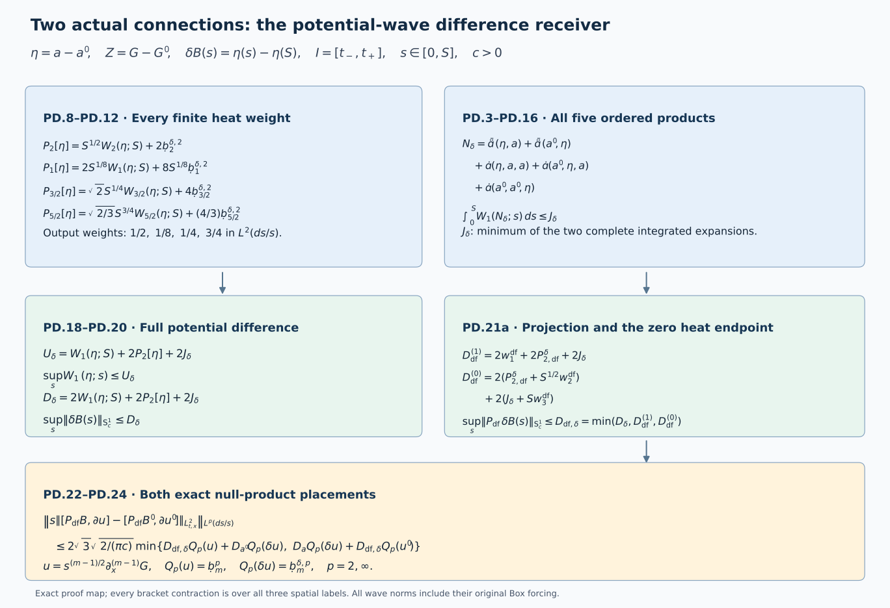

# Potential-wave differences and the full physical connection

This Unit 9 analytic chapter compares two actual connections, including
their potential, wave forcing, curvature and electric field. Exact
product expansions keep the order of every matrix factor. The backward
heat argument then bounds the potential difference and its
divergence-free increment.

Read [the potential-wave estimate](../classical-potential-wave.html),
[spatial differences](../classical-spatial-difference.html),
[temporal-boundary differences](../classical-temporal-difference.html)
and [physical gauge differences](../classical-gauge-difference.html).
Their equation prefixes are PW, LG, TD and GD. ED denotes
[electric differences](../classical-electric-difference.html);
HW denotes [the full wave estimates](../classical-wave-estimates.html).

Both regular caloric-temporal connections are defined on the same
original \(I=[t_-,t_+]\), \(\mathbb R^3\) and \([0,S]\), with
physical speed \(c>0\), common anchor \(t_*\), and metric
\(\operatorname{diag}(-c^2,1,1,1)\). All derivative tuples are
complete ordered tuples and all matrix norms are Hilbert–Schmidt.
The estimates retain the original measures \(dt\), \(dx\) and \(ds/s\).

Human-source context: Sung-Jin Oh,
[*Gauge choice for the Yang–Mills equations using the Yang–Mills heat flow
and local well-posedness in H1*, arXiv:1210.1558v2](https://arxiv.org/abs/1210.1558v2).
This is independent exposition of the classical evolution argument.
The full proofs below use the linked course providers. Exact source
versions and bounded reading are retained in the course provenance.
No novelty is claimed.

## 1. Exact fields, operators, and differences

Retain LG and TD's actual fields

\[
\eta=a_x-a_x',\quad Z=G-G',\quad G_i=F_{si},\quad
\vartheta=a_t-a_t',\quad \delta E_i=F_{ti}-F_{ti}',\quad
\delta F_{ij}=F_{ij}-F_{ij}'.
\tag{PD.1}
\]

The original connection derivatives are
\(D_jX=\partial_jX+[a_j,X]\) and
\(D_tX=\partial_tX+[a_t,X]\), with the same definitions for
the primed field. Both connections have \(a_s=0\) and \(a_t(S)=0\).
In the later temporal identities retain
\(W=F_{st}=\partial_sa_t\), \(W(0)=0\), and
\(a_t(s)=-\int_s^SW(r)dr\), with all primed identities as well.
The original spatial tension is
\(w_i=c^{-2}D_tE_i-G_i\); its temporal component is
\(w_t=-W=\sum_jD_jE_j\). These are the original caloric
identities, and their differences always mean differences of
these actual fields.

For clarity a prime labels the second solution; N below is the
operator called N' in PW, not a primed solution. Keep

\[
\begin{aligned}
L_0V_i&=\Delta V_i-\partial_i\sum_j\partial_jV_j,\\
\mathcal B(U,V)_i&=2\sum_j[U_j,\partial_jV_i]
 -\sum_j[U_j,\partial_iV_j]+\sum_j[\partial_jU_j,V_i],\\
\mathcal C(U,V,Z)_i&=\sum_j[U_j,[V_j,Z_i]],\qquad
N(a)=\mathcal B(a,a)+\mathcal C(a,a,a).
\end{aligned}\tag{PD.2}
\]

Subtracting the two original potential heat equations gives

\[
\begin{aligned}
\partial_s\eta&=Z=L_0\eta+N_\delta,\\
N_\delta&=\mathcal B(\eta,a)+\mathcal B(a',\eta)
 +\mathcal C(\eta,a,a)+\mathcal C(a',\eta,a)
 +\mathcal C(a',a',\eta).
\end{aligned}\tag{PD.3}
\]

This telescoping identity keeps factor order. Expanding \(a=a'+\eta\)
gives exactly three quadratic placements \(\mathcal B(\eta,a')\), \(\mathcal B(a',\eta)\),
\(\mathcal B(\eta,\eta)\), and all seven nonempty cubic placements of \(\eta\) into
\(\mathcal C(a'+\eta,a'+\eta,a'+\eta)\). In particular the double-difference
and triple-difference terms are retained. The exchanged complete
expansion is

\[
N_\delta=\mathcal B(\eta,a')+\mathcal B(a,\eta)
 +\mathcal C(\eta,a',a')+\mathcal C(a,\eta,a')
 +\mathcal C(a,a,\eta).
\tag{PD.4}
\]

Each expansion is an exact equation for the same actual difference;
later minima combine complete proved bounds without comparing them.

## 2. Full polarized physical wave product rules

Set \(\epsilon_t=-c^{-2}\) and \(\epsilon_j=1\). For arbitrary original fields
U,V,Z, every physical derivative and wave term is

\[
\begin{aligned}
\partial_\rho\mathcal B(U,V)
 &=\mathcal B(\partial_\rho U,V)+\mathcal B(U,\partial_\rho V),\\
\Box_c\mathcal B(U,V)
 &=\mathcal B(\Box_cU,V)+\mathcal B(U,\Box_cV)
       +2\sum_{\rho=t,1,2,3}\epsilon_\rho
                       \mathcal B(\partial_\rho U,\partial_\rho V),\\
\partial_\rho\mathcal C(U,V,Z)
 &=\mathcal C(\partial_\rho U,V,Z)+\mathcal C(U,\partial_\rho V,Z)
                                     +\mathcal C(U,V,\partial_\rho Z),\\
\Box_c\mathcal C(U,V,Z)
 &=\mathcal C(\Box_cU,V,Z)+\mathcal C(U,\Box_cV,Z)
                                      +\mathcal C(U,V,\Box_cZ)\\
 &\quad+2\sum_{\rho=t,1,2,3}\epsilon_\rho
 \{\mathcal C(\partial_\rho U,\partial_\rho V,Z)
  +\mathcal C(\partial_\rho U,V,\partial_\rho Z)
  +\mathcal C(U,\partial_\rho V,\partial_\rho Z)\}.
\end{aligned}\tag{PD.5}
\]

Ordinary spatial derivatives commute with \(\Box_c\). The Leibniz
rule proves every line term by term without commuting matrices.
Insert each of the five placements in PD.3 to obtain the full
equations for \(\partial_cN_\delta\) and \(\Box_cN_\delta\). Thus PD.3
and PD.5 enumerate every differentiated difference placement.

For any potential U use the derivative-regular full wave quantity
\(W_k(U;s)=\mathcal W_c^k(U(s))\) from PW. It includes the energy
supremum and \(c|I|^{1/2}\) times its actual differentiated Box forcing.
Explicitly, with the original spatial multiplier \(|D|^r\) having
Fourier symbol \(|\xi|^r\), it is

\[
W_k(U;s)=\sup_{t\in I}
 \left(c^{-2}\||D|^{k-1}\partial_tU(t,s)\|_2^2
              +\||D|^{k-1}\partial_xU(t,s)\|_2^2\right)^{1/2}
 +c|I|^{1/2}\||D|^{k-1}\Box_cU(s)\|_{L^2_{t,x}}.
\]

For an \(L^2\) field this is exactly its full \(\mathsf S_c^k\) norm. For the
actual \(L^6\) potentials with these \(L^2\) derivatives it is the
derivative-regular extension: constants are fixed by the \(L^6\)
representative. No \(L^2\) norm of an undifferentiated potential
has been silently added.
For U=\(\eta\) it is a norm of the actual difference field's derivatives,
not the difference of two numerical norms. Keep

\[
\partial_c=(c^{-1}\partial_t,\partial_1,\partial_2,\partial_3),\quad
d_c=\sqrt2(2\pi c)^{-1/4},\quad \lambda=c|I|^{1/2},\quad d_B=2\sqrt3.
\tag{PD.6}
\]

Write \(u_j(s)=\|\partial_x^{(j)}U(s)\|_{L^\infty_{t,x}}\), and use \(v_j,z_j\)
for the other fields, j=0,1. Full tuple Cauchy–Schwarz in PD.2
gives \(|\mathcal B(U,V)|\le6|U||\partial_xV|+d_B|\partial_xU||V|\) and
\(|\mathcal C(U,V,Z)|\le4|U||V||Z|\). In PD.5, the temporal contraction's
\(c^{-2}\) is exactly the square of the first physical tuple weight.
Using extended HW.33 on each derivative factor gives

\[
\begin{aligned}
\mathcal W_c^1(\mathcal B(U,V))\le{}&
6\{v_1W_1(U)+u_0W_2(V)\}
 +d_B\{v_0W_2(U)+u_1W_1(V)\}\\
&+\lambda d_c^2\{12W_{3/2}(U)W_{5/2}(V)
                    +2d_BW_{5/2}(U)W_{3/2}(V)\},\\
\mathcal W_c^1(\mathcal C(U,V,Z))\le{}&
4\{v_0z_0W_1(U)+u_0z_0W_1(V)+u_0v_0W_1(Z)\}\\
&+8\lambda d_c^2\{z_0W_{3/2}(U)W_{3/2}(V)
 +v_0W_{3/2}(U)W_{3/2}(Z)+u_0W_{3/2}(V)W_{3/2}(Z)\}.
\end{aligned}\tag{PD.7}
\]

Here all W values are at the same original s. For example
\(\mathcal B(\partial_cU,V)\) contributes 6v1 times the energy part of
W1(U), and \(\mathcal B(\Box_cU,V)\) contributes the same coefficient times
its forcing part. Adding them is \(6v_1W_1(U)\), with no extra factor
two. The other single-derivative/Box pairs work identically.
The cross term in B costs 2 times its two coefficients 6,\(d_B\),
and \(L^4\)–\(L^4\) Hölder gives the two fractional W products. In C,
each of the three derivative/Box pairs costs four, and each
of the three cross pairs costs eight. This proves PD.7 with
every physical derivative term retained.

At \(U=V=Z=a\), PD.7 proves the sharper coefficients now used in PW.6:
the two single-wave groups have coefficients \(b=6+2\sqrt3\) and 12.
The earlier edition
used the valid larger
2b and 24. Its quadratic wave products retain exactly their
original coefficients 2b and 24. This improvement follows from
the complete definition of W, not from deleting forcing terms.

## 3. Actual difference P bounds and finite heat endpoints

For \(U=a,a',\eta\) put respectively \(H_U=G,G',Z\). The original exact
identity is

\[
U(s)=U(S)-\int_s^S H_U(r)dr,\qquad
\mathcal F_k^p[H_U]=
 \|s^{(k+1)/2}\|H_U(s)\|_{\mathsf S_c^k(I)}\|_{L^p(ds/s)}.
\tag{PD.8}
\]

For \(\eta\) these are precisely LG.19's difference wave quantities.
No initial-data bound is inserted into them. For beta>0 the
finite backward kernel in LG.18 proves

\[
P_{k,\beta}[U]:=\|s^\beta W_k(U;s)\|_{L^2(ds/s)}
\le\frac{S^\beta}{\sqrt{2\beta}}W_k(U;S)
 +\frac1\beta\|r^{\beta+1}\|H_U(r)\|_{\mathsf S_c^k}\|_{L^2(dr/r)}.
\tag{PD.9}
\]

Physical derivatives, \(\Box_c\) and the heat integral commute on
each positive closed heat interval. Minkowski in the full wave
quantity reduces the estimate to the original scalar kernel.
Its \(L^2\) bound is exactly 1/beta, and its endpoint norm is the
displayed finite S power. Define, for each U separately,

\[
\begin{aligned}
P_2[U]&=S^{1/2}W_2(U;S)+2\mathcal F_2^2[H_U],\\
P_1[U]&=2S^{1/8}W_1(U;S)+8S^{1/8}\mathcal F_1^2[H_U],\\
P_{3/2}[U]&=\sqrt2S^{1/4}W_{3/2}(U;S)+4\mathcal F_{3/2}^2[H_U],\\
P_{5/2}[U]&=\sqrt{2/3}S^{3/4}W_{5/2}(U;S)
                                      +\frac43\mathcal F_{5/2}^2[H_U].
\end{aligned}\tag{PD.10}
\]

\(P_1\) has heat output weight 1/8, not zero. The other three output
weights are 1/2,1/4,3/4, respectively. Only \(P_1\) uses the bounded
extra factor \(r^{1/8}\le S^{1/8}\). Fractional values may further be
bounded by the full interpolation inequalities

\[
\begin{aligned}
W_{3/2}(\eta;S)&\le\sqrt{W_1(\eta;S)W_2(\eta;S)},&
W_{5/2}(\eta;S)&\le\sqrt{W_2(\eta;S)W_3(\eta;S)},\\
\mathcal F_{3/2}^{\delta,p}&\le
  \sqrt{\mathcal F_1^{\delta,p}\mathcal F_2^{\delta,p}},&
\mathcal F_{5/2}^{\delta,p}&\le
  \sqrt{\mathcal F_2^{\delta,p}\mathcal F_3^{\delta,p}},\quad p=2,\infty.
\end{aligned}\tag{PD.11}
\]

Each is interpolation of the actual difference field, including
its forcing, followed by the original heat Hölder inequality.

Thus \(\delta\overline P_k:=P_k[\eta]\) is a proved difference receiver.
It also bounds the numerical difference of PW.8's two original
Pbar values: reverse triangle in each endpoint wave norm and
each actual F norm, before taking their positive linear
combination, gives

\[
|P_k[a]-P_k[a']|\le P_k[\eta],\qquad k=1,2,3/2,5/2.
\tag{PD.12}
\]

This does not identify a norm of a difference with a difference
of norms. It proves the precise map between those two quantities.

## 4. Every finite integrated product and the complete forcing difference

For \(U=a,a',\eta\) define actual coefficient norms

\[
C_j[U]=\sup_{0<s\le S}s^{j/2+1/4}
                \|\partial_x^{(j)}U(s)\|_{L^\infty_{t,x}},\quad j=0,1.
\tag{PD.13}
\]

For a,a' these have the established individual HT bounds;
for \(\eta\) they are exactly LG.2/TD.2's \(\delta A_0,\delta A_1\).
They are constructed actual coefficient differences; they
are not differences of the individual upper polynomials.
Set

\[
\begin{aligned}
J_B(U,V)={}&
6\{2S^{1/8}C_1[V]P_1[U]+\sqrt2S^{1/4}C_0[U]P_2[V]\}\\
&+d_B\{\sqrt2S^{1/4}C_0[V]P_2[U]+2S^{1/8}C_1[U]P_1[V]\}\\
&+\lambda d_c^2\{12P_{3/2}[U]P_{5/2}[V]
                          +2d_BP_{5/2}[U]P_{3/2}[V]\},\\
J_C(U,V,Z)={}&\frac8{\sqrt3}S^{3/8}
 \{C_0[V]C_0[Z]P_1[U]+C_0[U]C_0[Z]P_1[V]
                              +C_0[U]C_0[V]P_1[Z]\}\\
&+8\lambda d_c^2S^{1/4}
 \{C_0[Z]P_{3/2}[U]P_{3/2}[V]
  +C_0[V]P_{3/2}[U]P_{3/2}[Z]
  +C_0[U]P_{3/2}[V]P_{3/2}[Z]\}.
\end{aligned}\tag{PD.14}
\]

These completely evaluate the heat integrals of PD.7. For the
four single-wave B terms the remaining scalar powers in dr/r
are respectively 1/8,1/4,1/4,1/8. Their \(L^2\) norms are
\(2S^{1/8}\) and \(\sqrt2S^{1/4}\). For each single-wave C term the
power is \(1-\tfrac14-\tfrac14-\tfrac18=\tfrac38\), with \(L^2\) norm
\(2S^{3/8}/\sqrt3\). Each B cross term has the exact weight
1/4+3/4=1. Each C cross term has residual power
\(1-\tfrac14-\tfrac14-\tfrac14=\tfrac14\), bounded by the original \(S^{1/4}\).
All terms therefore satisfy

\[
\int_0^S\mathcal W_c^1(\mathcal B(U,V)(s))ds\le J_B(U,V),\qquad
\int_0^S\mathcal W_c^1(\mathcal C(U,V,Z)(s))ds\le J_C(U,V,Z).
\tag{PD.15}
\]

For the two exact expansions define

\[
\begin{aligned}
J_\delta^{(1)}={}&J_B(\eta,a)+J_B(a',\eta)
 +J_C(\eta,a,a)+J_C(a',\eta,a)+J_C(a',a',\eta),\\
J_\delta^{(2)}={}&J_B(\eta,a')+J_B(a,\eta)
 +J_C(\eta,a',a')+J_C(a,\eta,a')+J_C(a,a,\eta),\\
J_\delta&=\min\{J_\delta^{(1)},J_\delta^{(2)}\},\qquad
\int_0^S\mathcal W_c^1(N_\delta(s))ds\le J_\delta.
\end{aligned}\tag{PD.16}
\]

Every summand contains at least one actual difference norm.
Its coefficients retain the mixed primed/unprimed products.
Since a contains \(\eta\), its quadratic and cubic difference
terms from PD.3 have not been removed by this estimate.

For comparison the improved individual expression is
\(J_a=J_B(a,a)+J_C(a,a,a)\). Its complete evaluation is

\[
\begin{aligned}
J_a={}&b\{\sqrt2C_0[a]S^{1/4}P_2[a]+2C_1[a]S^{1/8}P_1[a]\}
 +\frac{24}{\sqrt3}C_0[a]^2S^{3/8}P_1[a]\\
&+2b\lambda d_c^2P_{3/2}[a]P_{5/2}[a]
 +24\lambda d_c^2C_0[a]S^{1/4}P_{3/2}[a]^2,
\quad b=6+2\sqrt3.
\end{aligned}\tag{PD.17}
\]

PD.17 is the current PW.9 estimate. It is no larger than the
earlier edition's bound when the
same coefficient bounds and P values are used, because
precisely the single-wave groups have half their earlier
coefficients; all cross-wave groups are identical. No ordering
between the two difference orientations in PD.16 is asserted.

## 5. Paired backward energy and the uniform full wave difference

Apply \(\partial_c\) or \(\Box_c\) to PD.3. Since \(L_0\) is linear and
acts only on the spatial output, \(X=\partial_c\eta\) or \(X=\Box_c\eta\)
satisfies \(\partial_sX=L_0X+H\), with H the corresponding derivative
of \(N_\delta\). Spatial integration by parts proves the exact identity

\[
\frac12\|X(s)\|_2^2=\frac12\|X(S)\|_2^2
 +\int_s^S(\|\nabla X\|_2^2-\|\operatorname{div}X\|_2^2)dr
 -\int_s^S\operatorname{Re}\langle X,H\rangle dr.
\tag{PD.18}
\]

For the energy tuple apply this at every original physical time;
for the Box tuple integrate it in original dt. There is no
time integration by parts, so no physical endpoint term is lost.
The negative divergence contribution remains in the identity.
At positive heat cutoffs the scalar inequality is
\(Y^2\le a_0^2+2b_0^2+2Yh_0\), and hence

\[
Y\le h_0+\sqrt{h_0^2+a_0^2+2b_0^2}
     \le a_0+\sqrt2b_0+2h_0.
\tag{PD.19}
\]

Pass to zero using the finite PD.10 and PD.16 bounds. The sum
of the energy and weighted forcing gradient norms is at most
\(\sqrt2P_2[\eta]\), as follows by Cauchy–Schwarz on their two
nonnegative heat integrands, whose sum is \(W_2(\eta)\). Their
forcing integrals have sum at most \(J_\delta\). Therefore

\[
\begin{aligned}
U_\delta&:=W_1(\eta;S)+2P_2[\eta]+2J_\delta,\\
\sup_{0<s\le S}\mathcal W_c^1(\eta(s))&\le U_\delta,\\
B(s)&=a(s)-a(S),\quad B'(s)=a'(s)-a'(S),\quad
\delta B(s)=\eta(s)-\eta(S),\\
D_\delta&:=2W_1(\eta;S)+2P_2[\eta]+2J_\delta,\qquad
\sup_{0<s\le S}\|\delta B(s)\|_{\mathsf S_c^1}\le D_\delta.
\end{aligned}\tag{PD.20}
\]

This \(D_\delta\) is a potential-wave coefficient, not TD.25's
gradient coefficient with the same letter; the file prefix
PD identifies its meaning. One may retain the first positive
root in PD.19 separately on the energy and forcing factors
and take its minimum with PD.20. It is an additional complete
bound when those actual split norms are available. PD.20
already has no unknown unweighted wave supremum on its right.

The fields B,B',delta B are \(L^2\) at every positive heat time,
by their finite positive-heat integrals of G,G',Z. Thus the
full S norm, rather than only its derivative-regular extension,
applies to them. As the current fields are regular through s=0,
their actual boundary derivative limits inherit
\(\sup_t\|\partial_x\eta(t,0)\|_2\le U_\delta\) and
\(\sup_t\|\partial_t\eta(t,0)\|_2\le cU_\delta\).
For their actual \(L^6\) representatives Sobolev also gives
\(\sup_t\|\eta(t,0)\|_6\le C_SU_\delta\).
The time derivative here is \(\partial_t\eta\), not \(\delta E\).

## 6. The divergence-free difference and both null-product placements

Retain the original Fourier projection
\(P_{\rm df}=I-\nabla\Delta^{-1}\operatorname{div}\).
It is an \(L^2\) contraction, commutes with spatial and physical
derivatives and \(\Box_c\), and has the same full-tuple contraction
in the wave norm. Consequently

\[
\begin{aligned}
\delta\mathfrak B_{\rm df}
 &:=\sup_s\|P_{\rm df}\delta B(s)\|_{\mathsf S_c^1}\le D_\delta,\\
\mathfrak B_{\rm df}[a]&:=\sup_s\|P_{\rm df}B(s)\|_{\mathsf S_c^1},\\
|\mathfrak B_{\rm df}[a]-\mathfrak B_{\rm df}[a']|
 &\le\delta\mathfrak B_{\rm df}.
\end{aligned}
\tag{PD.21}
\]

The last inequality follows by the reverse triangle at each s
and then by the same inequality for suprema. It proves the
map from the actual coefficient difference to the numerical
difference of the two original coefficient norms.

There are two additional proved projected bounds. Write
\(w_k^{\rm df}=W_k(P_{\rm df}\eta;S)\), and retain the full
projected wave input
\(\mathcal F_{2,\rm df}^{\delta,2}
=\|s^{3/2}\|P_{\rm df}Z(s)\|_{\mathsf S_c^2}\|_{L^2(ds/s)}\).
The derivative-regular projected endpoint is defined by the
\(L^2\) Fourier projection of its derivatives and its unique \(L^6\)
representative. To construct it, approximate the actual \(\eta\)(S)
by compactly supported smooth fields in its gradient \(L^2\) norm.
For a spatial cutoff \(\chi_R\), its extra derivative is controlled
by \(\|\eta\|_{L^6(|x|>R)}\|\partial_x\chi_R\|_3\), which tends to zero;
the other cutoff error is the \(L^2\) gradient tail. Mollification
then supplies the stated approximation. Apply \(P_{\rm df}\) and an
annular Fourier cutoff to each approximation. Projection
contraction makes their gradients Cauchy in \(L^2\), and the proved
Sobolev inequality makes the fields Cauchy in \(L^6\). Their limits
give the required representative; uniqueness follows because
a distribution with zero gradient is a constant, and the only
constant in \(L^6\)(R3) is zero. The same Fourier contractions and
commutations apply to every physical derivative and Box term.
Thus no unproved \(L^6\) multiplier estimate is required. Put

\[
\begin{aligned}
P_{2,\rm df}^{\delta}&=S^{1/2}w_2^{\rm df}
                           +2\mathcal F_{2,\rm df}^{\delta,2},\\
D_{\rm df}^{(1)}&=2w_1^{\rm df}+2P_{2,\rm df}^{\delta}+2J_\delta,\\
D_{\rm df}^{(0)}&=2(P_{2,\rm df}^{\delta}+S^{1/2}w_2^{\rm df})
                              +2(J_\delta+Sw_3^{\rm df}),\\
D_{{\rm df},\delta}&=\min\{D_\delta,D_{\rm df}^{(1)},D_{\rm df}^{(0)}\},\\
\delta\mathfrak B_{\rm df}&\le D_{{\rm df},\delta}\le D_\delta.
\end{aligned}\tag{PD.21a}
\]

To prove the first alternative, project PD.3 before applying
PD.18–PD.20. The source is the actual \(P_{\rm df}\) \(N_\delta\), whose
integrated wave norm is at most \(J_\delta\); no nonlinear operator
is replaced by its value at \(P_{\rm df}\) \(\eta\). The original identity
\(L_0P_{\rm df}=\Delta P_{\rm df}\) and the \(L^2\) contractions prove every step.
The projected version of PD.9 gives exactly \(P_{2,\rm df}\) above.
In fact \(D_{\rm df}^{(1)}\le D_\delta\), since each endpoint and F projection
is contractive; retaining the minimum also allows every
subsequent smaller proved input.

For the second alternative set \(Y=P_{\rm df}\delta B\). It is zero at S
and satisfies the exact equation

\[
\partial_sY=\Delta Y+\Delta P_{\rm df}\eta(S)+P_{\rm df}N_\delta.
\]

Its weighted gradient input is at most
\(P_{2,\rm df}+\sqrt S\,w_2^{\rm df}\), by \(Y=P_{\rm df}\eta-P_{\rm df}\eta(S)\) and the
\(L^2\)(ds/s) norm of \(s^{1/2}\). Its integrated source wave norm is
at most \(J_\delta+Sw_3^{\rm df}\): the exact Fourier identity
\(W_1(\Delta U)=W_3(U)\) keeps all second spatial derivative words
and all Box terms. Apply PD.19 with zero heat endpoint to
the energy and Box tuples, and combine their gradients
exactly as in PD.20. This proves \(D_{\rm df}^{(0)}\). No order between
these two alternatives is asserted. Both vanish when their
actual endpoint, Z and \(N_\delta\) difference inputs vanish.

Let \(D_a\),\(D_a\)' be the individual versions of PD.20, or their
smaller proved bounds if available. For any actual paired
test fields u,u', let \(\delta u=u-u'\). Bilinearity gives exactly

\[
\begin{aligned}
&\sum_j[(P_{\rm df}B)_j,\partial_ju]
             -\sum_j[(P_{\rm df}B')_j,\partial_ju']\\
&\quad=\sum_j[(P_{\rm df}\delta B)_j,\partial_ju]
             +\sum_j[(P_{\rm df}B')_j,\partial_j\delta u]\\
&\quad=\sum_j[(P_{\rm df}B)_j,\partial_j\delta u]
             +\sum_j[(P_{\rm df}\delta B)_j,\partial_ju'].
\end{aligned}\tag{PD.22}
\]

The quadratic difference product is inside the first form's
\(u=u'+\delta u\), or equivalently inside the second form's B.
Apply the complete NX.31 null-form map to each placement,
then the original heat norm. With
\(Q_p(u)=\|s\|u(s)\|_{\mathsf S_c^1}\|_{L^p(ds/s)}\),

\[
\begin{aligned}
&\left\|s\left\|\sum_j[(P_{\rm df}B)_j,\partial_ju]
 -\sum_j[(P_{\rm df}B')_j,\partial_ju']\right\|_{L^2_{t,x}}
                                   \right\|_{L^p(ds/s)}\\
&\quad\le2\sqrt3\sqrt{\frac2{\pi c}}
 \min\{D_{{\rm df},\delta}Q_p(u)+D_a'Q_p(\delta u),
              D_aQ_p(\delta u)+D_{{\rm df},\delta}Q_p(u')\},\quad p=2,\infty.
\end{aligned}\tag{PD.23}
\]

For the actual full tuple
\(u=s^{(m-1)/2}\partial_x^{(m-1)}G\), \(m\ge1\), use the
corresponding primed field and delta u formed from Z. The
ordered Fourier identity HW.27 proves, with no additional
component factor,

\[
Q_p(u)=\mathcal F_m^p,
\quad Q_p(u')=(\mathcal F_m')^p,
\quad Q_p(\delta u)=\mathcal F_m^{\delta,p}.
\tag{PD.24}
\]

Indeed s times the unchanged tuple weight \(s^{(m-1)/2}\)
is \(s^{(m+1)/2}\), exactly the original wave weight. This
proves the full paired PW.14 at every finite m. If the
original wave equation carries an additional coefficient
two on this interaction, multiply the whole PD.23 bound
by two; it has not been absorbed into the displayed null
constant.

## 7. Actual endpoint and initial differences, with all electric products

Here every field is evaluated at the unchanged heat endpoint S.
Write 

\[
A=a(S),\quad A'=a'(S),\quad z=\eta(S),\quad v=E(S)=\partial_tA
\]

,

\[
v'=E'(S),\quad\delta v=\delta E(S),\quad\delta W=W(S)-W'(S),
\]

and
\(\delta w=w(S)-w'(S)\). Both temporal potentials are zero at S.
The paired EW.2 equations are exactly

\[
\begin{aligned}
D_z&=\operatorname{div}z,\qquad \partial_tz=\delta v,\\
\partial_tD_z&=-\sum_j\{[z_j,v_j]+[A_j',\delta v_j]\}-\delta W,\\
\Box_cz-\nabla D_z&=-N_\delta(S)-\delta w.
\end{aligned}\tag{PD.25}
\]

The mixed electric term includes \([z,\delta v]\) inside \(v=v'+\delta v\).
Its signs follow from \(w_t(S)=-W(S)\). The spatial tension sign
in the last line is negative, precisely as in EW.2.

The following fully explicit endpoint estimate avoids assuming
any endpoint difference wave bound. Retain the actual initial
norms \(z_q^\infty=\|\partial^{(q)}z(t_*)\|_\infty\),
\(z_q^2=\|\partial^{(q)}z(t_*)\|_2\) for \(q\ge1\),
\(z_0^6=\|z(t_*)\|_6\), and
\(d_q^0=\|\partial^{(q)}D_z(t_*)\|_2\).
For each original physical time r put
\(e_q^\delta(r)=\|\partial^{(q)}\delta E(r,S)\|_2\),
\(e_q^{\delta,\infty}(r)=\|\partial^{(q)}\delta E(r,S)\|_\infty\),
\(w_q^\delta(r)=\|\partial^{(q)}\delta w(r,S)\|_2\), and
\(v_q^\delta(r)=\|\partial^{(q)}\delta W(r,S)\|_2\).
These are actual finite differences. Let \(J_t\) be the unoriented
segment joining t* to t and define

\[
\begin{aligned}
U_q^\delta(t)&=z_q^\infty+\int_{J_t}e_q^{\delta,\infty}(r)dr,\\
A_q^\delta(t)&=z_q^2+\int_{J_t}e_q^\delta(r)dr\quad(q\ge1),\\
L_6^\delta(t)&=z_0^6+C_S\int_{J_t}e_1^\delta(r)dr.
\end{aligned}\tag{PD.26}
\]

The first line of PD.25 and the original fundamental theorem
prove that these bound the corresponding derivatives and \(L^6\)
norm of z(t). The individual endpoint profiles \(U_q\),\(A_q\),\(L^6\)
and their primed versions are exactly the already evaluated
EW.10–EW.12 polynomials, at |t-t*|. No undifferentiated
\(L^2\) potential difference is added as a hypothesis.

For an endpoint slot U in {z,A,A'}, denote these three profiles
by \(U_q\)(U), \(A_q\)(U), \(L^6\)(U). For \(q\ge0\) define the complete
spatial product bounds

\[
\begin{aligned}
B_q^S(U,V)&=\sum_{l=0}^q{q\choose l}
 \{6U_l(U)A_{q-l+1}(V)+2A_{l+1}(U)U_{q-l}(V)\},\\
C_0^S(U,V,Z)&=4L_6(U)L_6(V)L_6(Z),\\
C_q^S(U,V,Z)&=4\sum_{r+h+n=q}\frac{q!}{r!h!n!}
 A_{\rho_j}(U^{(j)})\prod_{i\ne j}U_{\rho_i}(U^{(i)})\quad(q\ge1),\\
&\hspace{8mm}\rho=(r,h,n),\quad (U^{(1)},U^{(2)},U^{(3)})=(U,V,Z),
\quad j=\min\{i:\rho_i>0\}.
\end{aligned}\tag{PD.27}
\]

All profiles in this display are evaluated at the same t.
For B the two transport contributions cost four plus two;
the divergence factor is placed in \(L^2\) and the exact integrated
divergence bound \(\|\partial_x^{(l)}\operatorname{div}U\|_2\le\|\partial_x^{(l+1)}U\|_2\)
costs one, giving its displayed coefficient two. This is
the EW.6–EW.7 improvement, with every divergence entry retained.
For C at q=0, the three original \(L^6\) factors give \(L^2\). For
q>0 the specified positive-order factor supplies \(L^2\) and
the other two supply \(L^\infty\). The multinomial counts
every labelled derivative placement and does not reorder
the product. Thus PD.27 bounds the original products in \(L^2\).

Let \(N_q^\delta(t)\) be the sum of PD.27 over all five placements
in PD.3 at S; alternatively use the minimum with the complete
exchanged sum from PD.4. Define

\[
\begin{aligned}
R_q^\delta(t)&=2\sum_{l=0}^q{q\choose l}
 \{U_l^\delta(t)\mathsf V_{q-l}(t)+U_l(A';t)e_{q-l}^\delta(t)\}
                                      +v_q^\delta(t),\\
L_q^\delta(t)&=d_q^0+\int_{J_t}R_q^\delta(r)dr,\\
H_{k-1}^\delta(t)&=L_k^\delta(t)+N_{k-1}^\delta(t)+w_{k-1}^\delta(t),\\
E_k^{\delta,0}&=\left((z_k^2)^2+c^{-2}e_{k-1}^\delta(t_*)^2\right)^{1/2}.
\end{aligned}\tag{PD.28}
\]

Here \(\mathsf V\) is the unprimed EW.10 electric endpoint profile.
The first line estimates all derivatives of the second line
of PD.25. Integrating gives \(L_q^\delta\) for the actual divergence;
the initial datum is its actual \(d_q^0\), not an individual
polynomial sum. The last line of PD.25 and PD.27 then give
\(\|\partial_x^{(k-1)}\Box_cz(t)\|_2\le H_{k-1}^\delta(t)\). HW.5 with
the physical initial time t* proves

\[
\begin{aligned}
W_k(\eta;S)&\le\Omega_k^\delta:=E_k^{\delta,0}
 +c\max\left\{\int_{t_-}^{t_*}H_{k-1}^\delta(r)dr,
                 \int_{t_*}^{t_+}H_{k-1}^\delta(r)dr\right\}\\
&\hspace{23mm}+c|I|^{1/2}
                      \left(\int_{t_-}^{t_+}H_{k-1}^\delta(r)^2dr\right)^{1/2}.
\end{aligned}\tag{PD.29}
\]

Both original physical endpoints remain. Every initial term,
the actual electric difference, temporal tension difference,
spatial tension difference, and their mixed products are
visible. For \(P_1,P_2,P_{3/2},P_{5/2}\) in PD.10 only k=1,2,3 and
the displayed half-order interpolations are needed. Replacing
their endpoint W values by PD.29 is therefore a completed
finite evaluation in these actual endpoint/initial inputs.
The endpoint electric and tension differences have not been
declared bounded by a physical initial-data distance.

## 8. Electric, curvature and temporal products retained away from S

The actual temporal derivative in PD.7 and PD.20 obeys

\[
\partial_t\eta_i=\delta E_i+\partial_i\vartheta
                         +[a_i,\vartheta]+[\eta_i,a_t'].
\tag{PD.30}
\]

This follows from \(E_i=\partial_ta_i-D_i a_t\), including its
original sign. At S it reduces to PD.25. At s=0 it must
not be replaced by \(\delta E\) alone. TD's exact identity
\(\vartheta(s)=-\int_s^S\delta W(r)dr\) controls its actual
boundary inputs, and GD supplies the gauge conversion.

For reference the full Box identity, including every mixed
electric term, follows from
\(D_tE_i=c^2(G_i+w_i)\):

\[
\begin{aligned}
\Box_ca_i={}&\partial_i\operatorname{div}a-N_i(a)-w_i
 +2c^{-2}[a_t,E_i]-c^{-2}D_i\partial_ta_t
                         -c^{-2}[D_i a_t,a_t],\\
\delta(D_i\partial_ta_t)
 & =\partial_i\partial_t\vartheta+[a_i,\partial_t\vartheta]
                                      +[\eta_i,\partial_ta_t'],\\
\delta D_i a_t&=\partial_i\vartheta+[a_i,\vartheta]+[\eta_i,a_t'],\\
\delta[a_t,E_i]&=[\vartheta,E_i]+[a_t',\delta E_i],\\
\delta[D_i a_t,a_t]&=[\delta D_i a_t,a_t]+[D_i'a_t',\vartheta].
\end{aligned}\tag{PD.31}
\]

To verify the first line, differentiate \(\partial_ta_i=E_i+D_i a_t\).
Use \(\partial_tE_i=c^2(G_i+w_i)-[a_t,E_i]\) and
\(\partial_tD_i a_t=D_i\partial_ta_t+[\partial_ta_i,a_t]\).
The second electric bracket \([E_i,a_t]\) gives another negative
\([a_t,E_i]\) in \(\partial_t^2a_i\). Multiplication by -\(c^{-2}\)
therefore yields the positive coefficient two in PD.31.
Finally \(\Delta a-G=\nabla\operatorname{div}a-N(a)\), proving the line.
Subtracting it and using the remaining lines gives the full
ordinary \(\Box_c\) \(\eta\) equation. The products quadratic in
differences are inside the actual unprimed factors as before.

Explicitly, with every temporal-potential product expanded,

\[
\begin{aligned}
\Box_c\eta_i={}&\partial_i\operatorname{div}\eta-N_{\delta,i}-\delta w_i
 +2c^{-2}\{[\vartheta,E_i]+[a_t',\delta E_i]\}\\
&-c^{-2}\{\partial_i\partial_t\vartheta
              +[a_i,\partial_t\vartheta]+[\eta_i,\partial_ta_t']\}\\
&-c^{-2}\{[\partial_i\vartheta,a_t]+[[a_i,\vartheta],a_t]
                +[[\eta_i,a_t'],a_t]\\
&\hspace{21mm}+[\partial_i a_t',\vartheta]+[[a_i',a_t'],\vartheta]\}.
\end{aligned}\tag{PD.31a}
\]

The full \(N_\delta\) is PD.3 with its defining operators PD.2;
no schematic remainder occurs in this identity.

Spatial curvature and its mixed electric product have exactly
the already verified LG/ED differences

\[
\begin{aligned}
\delta F_{ij}&=\partial_i\eta_j-\partial_j\eta_i
                         +[\eta_i,a_j]+[a_i',\eta_j],\\
\delta[F_{ij},E_j]&=[F_{ij},\delta E_j]+[\delta F_{ij},E_j']\\
&=[F_{ij}',\delta E_j]+[\delta F_{ij},E_j']
                                      +[\delta F_{ij},\delta E_j],\\
\delta[E_j,G_j]&=[\delta E_j,G_j]+[E_j',Z_j]\\
&=[\delta E_j,G_j']+[E_j',Z_j]+[\delta E_j,Z_j].
\end{aligned}\tag{PD.32}
\]

LG.8–LG.15 estimates every resulting G heat-forcing term;
ED.5–ED.6 and its following estimates treat the full electric
heat equation, with the actual zero-heat electric difference;
TD.7–TD.11 treats the last line's temporal forcing. PD.31
does not assert new uniform bounds for \(\partial_t\vartheta\)
or discard any of these terms from the definition of the
actual difference wave norms. PD.7–PD.16 already estimate
its required complete Box differences through those full
wave norms, so no unknown temporal product is silently omitted.

## 9. The physical receiver and the remaining nonlinear calculation

Insert PD.20's two spatial bounds into GD.19. With its actual
individual constants \(P_*,Q_*,H_*,V_*,R_*\) and actual temporal
differences \(D_0,D_3,D_6,D_2\), the receiving estimates become

\[
\begin{aligned}
\sup_t\|A^{\rm phys}-(A')^{\rm phys}\|_6
&\le C_SU_\delta+D_6+(2V_*+2Q_*)D_0,\\
\sup_t\|\partial_x(A^{\rm phys}-(A')^{\rm phys})\|_2
&\le(1+2C_SP_*)U_\delta+D_2+2(V_*+Q_*)D_3+2P_*D_6\\
&\quad +(2R_*+8P_*V_*+2H_*+6P_*Q_*)D_0.
\end{aligned}\tag{PD.33}
\]

For a fixed original segment \(J_t\) the GD constants give the
corresponding pointwise bound; use their containing-interval
suprema for the displayed global suprema. TD.27 and LG.31–LG.32
already evaluate the D inputs, with the actual delta e input
retained or the subsequent electric-difference bound inserted.
Thus PD.33 is an actual completed spatial receiving estimate.
The physical electric and magnetic differences retain GD.21's
original conjugation formulas; they are not identified with
\(\partial_t\eta\) before the temporal gauge correction.

The remaining quantities exposed by this calculation are the
actual fractional difference F norms, \(C_0[\eta],C_1[\eta]\), and
PD.26–PD.29's initial, electric and tension difference profiles.
All are explicitly named fields or finite expressions above.
Bounding their coupled evolution by initial-data differences
is the next nonlinear calculation. Neither FC's non-difference
closure nor the existence of the present two regular fields
has been substituted for that estimate.

## 10. Worked example: a commuting difference

Let \(T\) be a fixed anti-Hermitian matrix and let all components
of both potentials be scalar multiples of \(T\). Every bracket in
PD.2 vanishes since \([T,T]=0\). Therefore \(N(a)=N(a')=N_\delta=0\)
exactly, and the difference equation is
\(\partial_s\eta=L_0\eta\). For actual commuting Yang–Mills
connections the temporal identities also keep their displayed linear
terms; vanishing brackets do not remove either endpoint.

For an exact heat-mode calculation, take an integrable Fourier profile
\(\widehat\eta_0(\xi)\) with \(\xi\cdot\widehat\eta_0(\xi)=0\).
The divergence-free solution and its zero increment at the upper heat
endpoint are

\[
 \widehat\eta(s,\xi)=e^{-s|\xi|^2}\widehat\eta_0(\xi),\qquad
 \widehat{\delta B}(s,\xi)=
       (e^{-s|\xi|^2}-e^{-S|\xi|^2})\widehat\eta_0(\xi).
\]

Differentiating in \(s\) multiplies the first expression by
\(-|\xi|^2\), exactly the symbol of \(L_0\) on this subspace.
Substitution at \(S\) makes the second expression zero.
This heat calculation tests the retained boundary condition;
an arbitrary chosen profile alone is not asserted to satisfy the
physical Yang–Mills equation.

*Figure: PD.8–PD.24, an exact proof map. No field is sampled.*
[Reproducible figure source](../build/figures_f09_potential_difference.py).

## 11. Exercises with full solutions

### Exercise 1. Expand all cubic differences

Expand PD.3 around the primed field.

**Solution.** Bilinearity gives the three quadratic terms
\(\mathcal B(\eta,a')+\mathcal B(a',\eta)+\mathcal B(\eta,\eta)\).
Trilinearity gives, in unchanged factor order,

\[
\begin{aligned}
&\mathcal C(\eta,a',a')+\mathcal C(a',\eta,a')
 +\mathcal C(a',a',\eta)\\
&+\mathcal C(\eta,\eta,a')+\mathcal C(\eta,a',\eta)
 +\mathcal C(a',\eta,\eta)+\mathcal C(\eta,\eta,\eta).
\end{aligned}
\]

These are precisely the seven nonempty choices of slots occupied by
\(\eta\). The missing eighth choice is the subtracted primed cubic.

### Exercise 2. Pair energy and forcing

Why does a common coefficient \(K\) multiplying the energy and
forcing parts of one wave norm contribute \(K\mathcal W\)?

**Solution.** By definition \(\mathcal W=e+\lambda f\), with
\(e,f\ge0\) and \(\lambda=c|I|^{1/2}\).
The two estimated terms add to \(Ke+\lambda Kf=K(e+\lambda f)\).
No second copy of either term occurs. Applying this identity to each
single-wave placement in PD.7 gives \(b\) and \(12\) at equal
fields. The cross-wave terms arise from the separate second-derivative
product terms of PD.5 and retain \(2b\) and \(24\).

### Exercise 3. Recover the original heat powers

Calculate the three scalar integrals for the single-wave terms of PD.17.

**Solution.** In the measure \(ds/s\) they are

\[
\begin{aligned}
\|s^{1/4}\|_{L^2(ds/s)}^2&=\int_0^S s^{-1/2}ds=2S^{1/2},\\
\|s^{1/8}\|_{L^2(ds/s)}^2&=\int_0^S s^{-3/4}ds=4S^{1/4},\\
\|s^{3/8}\|_{L^2(ds/s)}^2&=\int_0^S s^{-1/4}ds=\tfrac43S^{3/4}.
\end{aligned}
\]

Their positive square roots are \(\sqrt2S^{1/4}\),
\(2S^{1/8}\) and \(2S^{3/8}/\sqrt3\).
Multiplication by the coefficients \(b,b,12\) gives exactly PD.17.

### Exercise 4. Solve the backward energy inequality

Derive PD.19 from \(Y^2\le a^2+2b^2+2hY\), for nonnegative inputs.

**Solution.** Completing the square yields
\((Y-h)^2\le h^2+a^2+2b^2\), hence
\(Y\le h+\sqrt{h^2+a^2+2b^2}\).
The triangle inequality in \(\mathbb R^3\) bounds the square root
by \(h+a+\sqrt2b\). Both statements remain valid when some or
all inputs are zero. Combining the two heat-gradient norms by
Cauchy–Schwarz gives the coefficient \(2P_2[\eta]\) in PD.20.

### Exercise 5. Keep both null-product placements

Subtract \([X,\partial u]\) and \([X',\partial u']\) exactly.

**Solution.** Add and subtract \([X',\partial u]\). The result is
\([X-X',\partial u]+[X',\partial(u-u')]\).
Adding and subtracting \([X,\partial u']\) instead gives
\([X,\partial(u-u')]+[X-X',\partial u']\).
Apply the same full null estimate to each term of each identity,
then take the minimum of the two complete upper bounds.
This proves the placement rule in PD.24 without exchanging matrices.

### Exercise 6. Verify the temporal sign

Derive the coefficient \(+2c^{-2}[a_t,E_i]\) in PD.31.

**Solution.** Differentiate \(\partial_ta_i=E_i+D_i a_t\):

\[
\partial_t^2a_i=c^2(G_i+w_i)-[a_t,E_i]
                 +D_i\partial_ta_t+[E_i+D_i a_t,a_t].
\]

The identity \([E_i,a_t]=-[a_t,E_i]\) combines the two electric
terms into \(-2[a_t,E_i]\). The temporal part of
\(\Box_c=-c^{-2}\partial_t^2+\Delta\) then gives the stated
positive coefficient. The remaining terms are exactly those in PD.31.

### Exercise 7. Recover the zero increment

Evaluate the worked Fourier expression for \(\delta B\) at both heat endpoints.

**Solution.** At \(s=S\) its two exponential factors agree, so it is
zero. At \(s=0\) it is
\((1-e^{-S|\xi|^2})\widehat\eta_0(\xi)\).
The upper endpoint term survives at every nonzero frequency where the
profile is nonzero. Replacing the increment by \(\eta(s)\) would
change the endpoint and the equation used in PD.21a.

### Exercise 8. Check the zero-difference case

Evaluate all comparison outputs when both connections agree.

**Solution.** Then \(\eta,Z,\vartheta,\delta E,\delta F\) and their
actual derivatives vanish. Every difference \(P_k\), every product
in \(J_\delta\), every endpoint difference and all three projected
bounds are zero. Both terms of each null-product estimate vanish.
The common gauge anchor and identical gauge ODE imply identical gauge
matrices by uniqueness. Thus PD.33 has zero output as well.
This check concerns actual equal fields; it does not replace the
remaining uniform initial-data estimate for unequal solutions.
