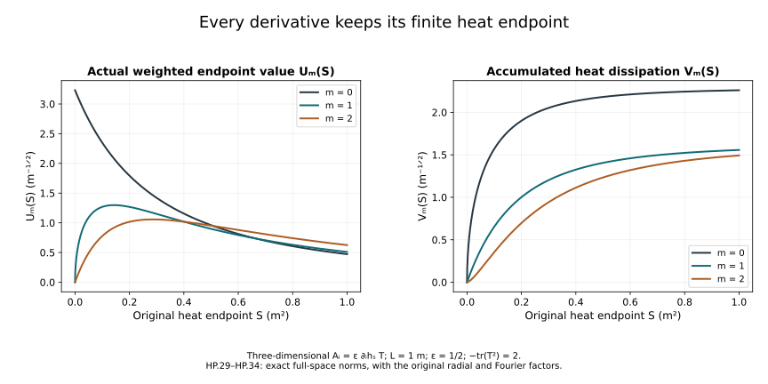

# Ordinary heat smoothing and physical-time bounds

The [heat-analysis chapter](../classical-heat-analysis.html)
controlled covariant curvature derivatives. The
[caloric-gauge chapter](../classical-caloric-gauge.html)
constructed the regular and rough spatial solution maps.
The [dynamic heat chapter](../classical-dynamic-heat.html)
then constructed the original time component and the gauge in
which it vanishes at a prescribed heat endpoint.

This chapter proves every ordinary smoothing order of the
DeTurck potential and uses the exact endpoint gauge to control
the spatial potential during physical evolution. Its main
calculations are an induction whose right side uses only
earlier derivative orders, and a finite polynomial operation
which retains every ordinary-to-covariant derivative placement.

Keep all original spatial coordinates, physical time t,
speed c, heat parameter s, reference length \(\ell\), trace
pairing and closed matrix group \(G\subset U(N)\).
Physical time and heat time retain their different units.
All derivative words are ordered; all component norms are
full tuple norms unless an intermediate component bound is
explicitly stated. The original Sobolev constants are

\[
C_S=\frac4{\sqrt3},\qquad C_M=2\sqrt{A_*B_*},\qquad
A_*=(4\pi/3)^{-1/6},\quad
B_*=(4\pi)^{-1}(20\pi/3)^{5/6}.
\tag{HP.1}
\]

The human-source comparison is Sung-Jin Oh's
[*Finite energy global well-posedness of the Yang–Mills equations
on \(\mathbb R^{1+3}\)*, arXiv:1210.1557v2](https://arxiv.org/abs/1210.1557v2),
especially its initial-data and fixed-time estimates, and
[*Gauge choice for the Yang–Mills equations using the Yang–Mills
heat flow and local well-posedness in \(H^1\)*,
arXiv:1210.1558v2](https://arxiv.org/abs/1210.1558v2).
The complete receiving derivations, polynomial coefficients,
examples, exercises and exposition here are independently written.

## 1. Full derivative tuples and the initial two orders

Use the actual solution of HC/HG, with the precise heat length \(S_R\)
from HG.5 and \(a_1(A_0)<R/4\) on
\(0<S\le S_R\). Retain the full ordinary derivative norms
\(a_j=\|\partial^{(j)}A\|_2\) and set

\[
\mathsf A_m=\sup_{0<s\le S}s^{m/2}a_{m+1}(s),\qquad
\mathsf B_m=\left(\int_0^S s^m a_{m+2}(s)^2ds\right)^{1/2},
\quad\mathsf T_m=\mathsf A_m+\mathsf B_m.
\tag{HP.2}
\]

HC/HG prove \(\mathsf T_0\le R\) and

\[
\mathsf T_1\le Y_R
=4R+4(K^2+3J)\sqrt S\,R^3,
\quad K=54(C_S^{3/2}+C_MC_S),\quad J=36C_S^3 .
\tag{HP.3}
\]

No \(L^2\) norm of the undifferentiated original potential enters these
bounds. All time powers and original constants are retained.

## 2. Every ordered derivative of Q and T

The maps are exactly those in HG.4: for each spatial component,
\(Q(A,B)_i=\sum_j\{2[A_j,\partial_jB_i]-[A_j,\partial_iB_j]\}\)
and \(T(A,B,C)_i=\sum_j[A_j,[B_j,C_i]]\), with
\(N(A)=Q(A,A)+T(A,A,A)\).

For a derivative word I of length m, differentiation of Q gives

\[
\partial_I Q(A,A)_i=
\sum_{j=1}^3\sum_{J\subseteq[m]}
\{2[\partial_{I_J}A_j,\partial_{I_{J^c}}\partial_jA_i]
-[\partial_{I_J}A_j,\partial_{I_{J^c}}\partial_iA_j]\}.
\tag{HP.4}
\]

Each subword preserves its original order. For a fixed subset
cardinality h there are exactly \({m\choose h}\) terms. The three
spatial j values, coefficient sum three, bracket factor two and
full \(3^{m+1}\) output tuple give the safe explicit constant

\[
C_Q(m)=18\,3^{(m+1)/2}.
\tag{HP.5}
\]

The \(h=0\) term uses the actual A in \(L^\infty\) and the full
\(a_{m+1}\) in \(L^2\). For \(h\ge1\) let

\[
r(h)=\min\{h,m-h+1\}.
\tag{HP.6}
\]

Put the factor of derivative order r in \(L^3\) and the other in \(L^6\).
The bracket norm permits this exchange without asserting equality
of the ordered brackets. The bound is

\[
C_S^{3/2}
(a_{r(h)}a_{r(h)+1})^{1/2}a_{m-r(h)+2}.
\tag{HP.7}
\]

For \(m\ge2\), \(r(h)\le m-1\).

For the trilinear term retain all ordered assignments of the
derivative positions to its three factors:

\[
\partial_I T(A,A,A)_i=
\sum_{j=1}^3\sum_{J_1\sqcup J_2\sqcup J_3=[m]}
[\partial_{I_{J_1}}A_j,
 [\partial_{I_{J_2}}A_j,\partial_{I_{J_3}}A_i]] .
\tag{HP.8}
\]

The multiplicity at cardinalities (h,k,l) is
\(m!/(h!k!l!)\). The nested bracket factor four, j-sum three
and full output tuple give

\[
C_T(m)=12\,3^{(m+1)/2}.
\tag{HP.9}
\]

Spatial Hölder with three \(L^6\) factors bounds a summand by
\(C_S^3 a_{h+1}a_{k+1}a_{l+1}\).

## 3. The precise weighted forcing bounds close below order m

Let
\(\mathsf F_m=\|s^{m/2}\partial^{(m)}N(A)\|_{L^2_sL^2_x}\).
For \(m\ge2\) the \(h=0\) quadratic contribution is at most

\[
C_MC_S S^{1/4}
(\mathsf A_0\mathsf A_1)^{1/2}\mathsf B_{m-1}.
\tag{HP.10}
\]

Indeed \(A_\infty\le C_MC_S(a_1a_2)^{1/2}\),
so after taking its first two weighted suprema the remaining
integral contains \(s^{m-1/2}a_{m+1}^2\).
It is bounded by \(S^{1/2}\mathsf B_{m-1}^2\).

For the \(h\ge1\) contribution the exact bound is

\[
\|s^{m/2}(a_ra_{r+1})^{1/2}a_{m-r+2}\|_{L^2_s}
\le S^{1/4}
(\mathsf A_{r-1}\mathsf A_r)^{1/2}\mathsf B_{m-r}.
\tag{HP.11}
\]

To check its powers, the extracted suprema contribute
\((r-1)/4+r/4\), and the B factor contributes
\((m-r)/2\). Their sum is \(m/2-1/4\); the remaining
\(s^{1/4}\) is bounded by \(S^{1/4}\). Each index \(r-1,r,m-r\)
is at most m-1.

For a cubic cardinality triple (h,k,l), choose one maximum
entry r, using the first in the original order to break ties;
call the other two entries u,v. Since \(m\ge2\), \(r\ge1\). Then

\[
\|s^{m/2}a_{r+1}a_{u+1}a_{v+1}\|_{L^2_s}
\le\sqrt S\,\mathsf B_{r-1}\mathsf A_u\mathsf A_v.
\tag{HP.12}
\]

The extracted powers are \((r-1)/2+u/2+v/2=(m-1)/2\);
the remaining \(\sqrt s\) gives \(\sqrt S\). Every index is
at most m-1. Thus the complete bound is

\[
\begin{split}
\mathsf F_m\le {}&
C_Q(m)S^{1/4}\left[
C_MC_S(\mathsf A_0\mathsf A_1)^{1/2}\mathsf B_{m-1}
+C_S^{3/2}\sum_{h=1}^m{m\choose h}
(\mathsf A_{r(h)-1}\mathsf A_{r(h)})^{1/2}
\mathsf B_{m-r(h)}\right]\\
&+C_T(m)C_S^3\sqrt S
\sum_{h+k+l=m}\frac{m!}{h!k!l!}
\mathsf B_{r-1}\mathsf A_u\mathsf A_v .
\end{split}
\tag{HP.13}
\]

This is an explicit expression involving only earlier orders.

## 4. Energy induction and an explicit recursive bound

For a regular solution pair the equation for \(\partial^{(m)}A\)
with \(-s^m\Delta\partial^{(m)}A\). Every ordered derivative
is retained, and Parseval identifies the full Laplacian
norm with \(a_{m+2}\). The complete identity is

\[
\tfrac12s^m a_{m+1}(s)^2+\int_0^s r^m a_{m+2}(r)^2dr
=\tfrac m2\int_0^s r^{m-1}a_{m+1}(r)^2dr
+\int_0^s r^m\langle\partial^{(m)}N,
-\Delta\partial^{(m)}A\rangle dr.
\tag{HP.14}
\]

The initial weighted term vanishes for \(m\ge1\). Young gives

\[
\mathsf A_m^2\le m\mathsf B_{m-1}^2+\mathsf F_m^2,\qquad
\mathsf B_m^2\le m\mathsf B_{m-1}^2+\mathsf F_m^2,
\tag{HP.15}
\]

by taking the endpoint supremum and the final integral separately.
Hence \(\mathsf T_m\le2\sqrt m\,\mathsf T_{m-1}+2\mathsf F_m\).

Define \(\Gamma_0=R,\Gamma_1=Y_R\). For each \(m\ge2\) let
\(\mathcal F_m(\Gamma_0,\ldots,\Gamma_{m-1})\) be exactly
the displayed forcing expression with every \(\mathsf A_j\) and \(\mathsf B_j\)
replaced in that bound by \(\Gamma_j\). Define

\[
\Gamma_m=2\sqrt m\,\Gamma_{m-1}
+2\mathcal F_m(\Gamma_0,\ldots,\Gamma_{m-1}).
\tag{HP.16}
\]

All coefficients are explicit positive finite numbers. The
preceding energy identity proves by induction
\(\mathsf T_m\le\Gamma_m\) for every m, on the same original
heat interval S and from the same original gradient radius R.
This is a bound on actual constructed regular solutions, not
an assumed smoothing estimate.

## 5. Passage to rough data at positive heat time

The regular approximations already constructed in HC/HG on the common
S have all these uniform bounds. On every \([\tau,S]\), \(\tau>0\),
their full \(a_j\) norms are uniformly bounded for every j.
Their \(a_1\) differences tend uniformly to zero by HC.31.
For \(j\ge2\), Fourier Hölder gives the exact interpolation

\[
a_j(A_n-A_k)\le
a_1(A_n-A_k)^{1/j}
a_{j+1}(A_n-A_k)^{(j-1)/j}.
\tag{HP.17}
\]

All three Fourier integrals use the original measure \((2\pi)^{-3}d^3\xi\);
the multiplier identity is
\(|\xi|^{2j}=(|\xi|^2)^{1/j}
\cdot(|\xi|^{2j+2})^{(j-1)/j}\).
The higher difference norm is bounded by the
sum of the two uniform bounds. Thus the approximations are
Cauchy in every derivative norm uniformly on \([\tau,S]\).
Their limits are the distributional derivatives of the
original rough solution. Sobolev and the PDE give spatial
and heat smoothness for positive heat time. Uniform weak
lower semicontinuity at each order retains the displayed
weighted bounds on the original interval.

## 6. The actual constructed fields and constants

Take the regular physical solution on its existing interval from
F09 and its HD dynamic heat extension. Apply the HD.27 endpoint
gauge at a fixed S, so \(a_t(t,S)=0\). All fields below are the actual
fields on that endpoint slice, not new arbitrary coefficient fields.
Write \(E_i=f_{ti}(t,S)\). The identity is exactly

\[
\partial_t a_i(t,S)=E_i(t,S).
\tag{HP.18}
\]

Let \(t_*\) be the fixed reference time, and retain its conserved
physical energy \(\mathcal E\). The original positive curvature
norm at the initial heat boundary satisfies

\[
d^2=c^{-2}\sum_i\|F_{ti}(t,0)\|_2^2
       +\sum_{i<j}\|F_{ij}(t,0)\|_2^2
     =\frac{g_{\rm YM}^2}{\hbar c}\mathcal E.
\tag{HP.19}
\]

This follows from the complete energy functional already proved
in F09. Choose the actual S positive with
\(S^{1/4}d\le\varepsilon_*\) and \(S\le S_R\) for the reference
datum. This chooses an interval; it rescales neither the datum
nor coordinates. If d=0 the threshold places no restriction on S.

H9.40 and H9.8, followed by gauge covariance, give for every
integer \(l\ge0\) the fixed constants

\[
e_l^{(2)}=c R_l d\,S^{-l/2},\qquad
e_l^{(\infty)}
=c C_M C_S\sqrt{R_{l+1}R_{l+2}}\,d\,S^{-l/2-3/4}.
\tag{HP.20}
\]

Every individual component of every ordered word \(D^{(l)}E_i\)
has respectively \(L^2\) and \(L^\infty\) norm at most these constants.
The factor c is required because H9 uses the positive electric
weight \(c^{-2}\). The original constants \(R_l\) and the finite S are
unchanged. These bounds hold throughout the existing physical
interval because d is conserved.

The exact reference gauge HD.29 identifies \(a_i\)(t_*,S) with the
DeTurck endpoint. The Gamma bounds proved above therefore give actual initial bounds

\[
C_k=C_M C_S\sqrt{\Gamma_k\Gamma_{k+1}}\,S^{-k/2-1/4}
 \quad(k\ge0),\qquad
D_k=\Gamma_{k-1}S^{-(k-1)/2}\quad(k\ge1).
\tag{HP.21}
\]

Here \(C_k\) bounds each k-fold ordinary derivative in \(L^\infty\),
and \(D_k\) bounds the full k-fold ordinary derivative tuple in \(L^2\).
The first inequality is the actual Morrey–Sobolev estimate
\(\|\partial^{(k)}a\|_\infty
\le C_MC_S(a_{k+1}a_{k+2})^{1/2}\).
No undifferentiated \(L^2\) norm of the potential enters (HP.21).

## 7. Exact expression before taking norms

Use an ordered word I of spatial indices and retain every index.
The leaves of an expression are ordinary derivatives
\(\partial_J a_j\) and covariant derivatives \(D_K E_i\).
Define an operation \(\mathfrak d_r\) on these actual expressions:

\[
\begin{aligned}
\mathfrak d_r(\partial_Ja_j)&=\partial_{(r,J)}a_j,\\
\mathfrak d_r(D_KE_i)&=D_{(r,K)}E_i-[a_r,D_KE_i],\\
\mathfrak d_r[X,Y]&=[\mathfrak d_rX,Y]+[X,\mathfrak d_rY].
\end{aligned}
\tag{HP.22}
\]

It is linear on signed sums. The second identity is precisely
\(\partial_r=D_r-\operatorname{ad}(a_r)\), acting on the original
covariant derivative field. It does not commute any covariant
derivatives. The other identities are the ordinary product rule.
Starting at \(E_i\), apply (HP.22) for each ordinary derivative in its
actual order. Induction proves that the resulting signed sum is
exactly \(\partial_I E_i\).

Every summand retains one covariant E leaf and some ordered
potential leaves inside nested brackets. If the potential leaf
orders are \(h_1\),...,\(h_j\) and the E leaf order is l, induction in
(HP.22) gives

\[
\sum_{\nu=1}^j(h_\nu+1)+l=|I|.
\tag{HP.23}
\]

The signs and matrix order in (HP.22) are part of the exact
expression; only the following norm bound takes their absolute
values. Every bracket then contributes the proved factor two.

## 8. An explicit finite polynomial records every norm contribution

Introduce nonnegative formal variables \(x_h\) and \(y_l\). Define

\[
b_0=y_0,\qquad
b_{k+1}=
\sum_{h=0}^{k-1}x_{h+1}\frac{\partial b_k}{\partial x_h}
+\sum_{l=0}^{k}(y_{l+1}+2x_0y_l)
                      \frac{\partial b_k}{\partial y_l}.
\tag{HP.24}
\]

An empty sum is zero. Every \(b_k\) is a finite polynomial with
nonnegative integer coefficients, linear in the y variables,
depending on \(x_0,\ldots,x_{k-1}\) and \(y_0,\ldots,y_k\).
For example

\[
b_1=y_1+2x_0y_0,\qquad
b_2=y_2+4x_0y_1+2x_1y_0+4x_0^2y_0.
\tag{HP.25}
\]

To prove the bound, assign \(x_h\) to an upper bound for each
ordinary h-derivative of a in \(L^\infty\). Assign \(y_l\) either
to the \(L^\infty\) or the \(L^2\) bound for each covariant l-derivative
of E. Each term has exactly one E leaf, so all other factors
can be put in \(L^\infty\) in either case. Differentiating a
potential leaf gives the first sum in (HP.24). Differentiating
the E leaf gives both terms in its second sum, the latter with
the bracket factor two. Repeated identical placements are counted
by the formal derivatives and their integer coefficients.
Induction from (HP.22) proves that \(b_k\) bounds the chosen norm of
each exact ordinary k-derivative of \(E_i\).

The full ordered spatial-output tuple has \(3^{k+1}\) components.
Thus its \(L^2\) norm is at most \(3^{(k+1)/2}b_k\). Component maxima
were used above only as intermediate bounds; the full tuple
and this conversion factor are retained in every conclusion.

## 9. Triangular physical-time polynomials

Put \(\theta=|t-t_*|\), in the original physical-time units.
Define polynomials with their dimensionful coefficients:

\[
P_0(\theta)=C_0+\theta e_0^{(\infty)},\qquad
P_k(\theta)=C_k+
\int_0^\theta b_k(P_0(u),...,P_{k-1}(u);
                  e_0^{(\infty)},...,e_k^{(\infty)})\,du.
\tag{HP.26}
\]

For \(k\ge1\) this uses only previously defined polynomials, so it
is an actual finite recursive construction. The coefficients
are nonnegative. The exact field identity \(\partial_ta_i=E_i\),
the fundamental theorem of calculus in either time direction,
and (HP.24) prove inductively that every ordinary k-derivative
of every \(a_i\) has \(L^\infty\) norm at most \(P_k(\theta)\). At each
step the potential factors in \(b_k\) have orders at most k-1,
whose bounds have already been proved.

Formula (HP.23) shows that a monomial's potential orders satisfy
\(\sum(h_\nu+1)\le k\). Since \(P_h\) has degree at most h+1,
induction shows that the integrand in (HP.26) has degree at most
k and \(P_k\) has degree at most k+1. This derives the growth
exponent while preserving all lower polynomial coefficients.
The time variable retains its original units in every polynomial term.

For every \(k\ge1\) define

\[
Q_k(\theta)=D_k+
\int_0^\theta b_k(P_0(u),...,P_{k-1}(u);
                         e_0^{(2)},...,e_k^{(2)})\,du.
\tag{HP.27}
\]

The fundamental theorem in \(L^2\) now proves

\[
\begin{aligned}
\|\partial^{(k)}a(t,S)\|_2
&\le 3^{(k+1)/2}Q_k(\theta),\\
\|\partial^{(k-1)}\partial_ta(t,S)\|_2
&\le 3^{k/2}
b_{k-1}(P_0(\theta),...,P_{k-2}(\theta);
                              e_0^{(2)},...,e_{k-1}^{(2)}).
\end{aligned}
\tag{HP.28}
\]

For \(k=1\) the last expression is \(3^{1/2}e_0^{(2)}\) and
contains no P variables. All estimates refer to the original
ordered tuples. \(Q_k\) has degree at most k+1, and the last
right-hand polynomial has degree at most k-1. In particular,
the complete endpoint derivative range through 31, including
the physical derivative of order 30, has now been calculated
for the already constructed regular interval.

## 10. A Gaussian with every derivative and endpoint retained

Let \(L>0\), let \(\varepsilon\) be dimensionless, and keep
\(T=\operatorname{diag}(i,-i)\), \(\kappa_T=-\operatorname{tr}(T^2)=2\).
The original spatial DeTurck connection is

\[
h_s(x)=\left(\frac{L^2}{L^2+2s}\right)^{3/2}
          \exp\!\left(-\frac{|x|^2}{2(L^2+2s)}\right),\qquad
A_i(s,x)=\varepsilon\,\partial_i h_s(x)T.
\tag{HP.29}
\]

Every bracket in N(A) vanishes, so this is exactly its Gaussian
heat solution. The spatial curvature vanishes; this example
measures the actual potential and its ordinary derivatives.
The earlier exact heat gauge identifies its stationary caloric
representative. Smoothness does not remove the need to keep
track of the chosen representative.

For each integer \(j\ge0\), Parseval and the full component sums give

\[
\begin{aligned}
a_j(A;s)^2
&=\frac{\kappa_T\varepsilon^2}{(2\pi)^3}
       \int_{\mathbb R^3}|\xi|^{2j+2}
                (2\pi)^3L^6e^{-(L^2+2s)|\xi|^2}\,d^3\xi\\
&=2\pi\kappa_T\varepsilon^2L^6
        \frac{\Gamma(j+5/2)}{(L^2+2s)^{j+5/2}}.
\end{aligned}
\tag{HP.30}
\]

The Fourier transform of the original \(h_0\) is
\((2\pi)^{3/2}L^3e^{-L^2|\xi|^2/2}\).
The ordered derivative and output sums multiply its squared
modulus by \((\sum_r\xi_r^2)^j\sum_i\xi_i^2\).
Radial integration is exactly

\[
4\pi\int_0^\infty
 \rho^{2j+4}e^{-(L^2+2s)\rho^2}\,d\rho
=2\pi\frac{\Gamma(j+5/2)}{(L^2+2s)^{j+5/2}}.
\tag{HP.31}
\]

Thus every Fourier factor, the three-dimensional measure,
matrix trace factor and original length remain in the calculation.

For a finite endpoint S define

\[
z_S=\frac{2S}{L^2+2S},\qquad
U_m(S)=S^{m/2}a_{m+1}(A;S),\qquad
V_m(S)^2=\int_0^S s^m a_{m+2}(A;s)^2\,ds.
\tag{HP.32}
\]

Here \(U_m\) is the value at that endpoint, not its supremum.
Direct substitution gives

\[
\begin{aligned}
U_m(S)^2
&=2\pi\kappa_T\varepsilon^2L^6
 \frac{\Gamma(m+7/2)S^m}{(L^2+2S)^{m+7/2}},\\
V_m(S)^2
&=2\pi\kappa_T\varepsilon^2L^6\Gamma(m+9/2)
 \int_0^S\frac{s^m}{(L^2+2s)^{m+9/2}}\,ds\\
&=\frac{2\pi\kappa_T\varepsilon^2\Gamma(m+9/2)}
             {2^{m+1}L}
 \int_0^{z_S}z^m(1-z)^{5/2}\,dz\\
&=\frac{2\pi\kappa_T\varepsilon^2\Gamma(m+9/2)}
             {2^{m+1}L}
 \sum_{p=0}^m(-1)^p{m\choose p}
       \frac{1-(1-z_S)^{p+7/2}}{p+7/2}.
\end{aligned}
\tag{HP.33}
\]

The substitution is \(z=2s/(L^2+2s)\), whose inverse and
Jacobian are \(s=L^2z/(2(1-z))\) and
\(ds=L^2\,dz/(2(1-z)^2)\). Expanding
\(z^m=(1-(1-z))^m\) and integrating each term proves the last
line, retaining its finite upper endpoint. \(U_m\) and \(V_m\) both
have units of inverse square root of length.

Differentiating the exact \(a_j\) formula shows
\(\partial_s a_{m+1}^2=-2a_{m+2}^2\), since
\(\Gamma(m+9/2)=(m+7/2)\Gamma(m+7/2)\).
Multiplication by \(s^m\) and integration by parts therefore gives

\[
\begin{aligned}
\tfrac12 U_m(S)^2+V_m(S)^2
 &=\tfrac m2 V_{m-1}(S)^2 &&(m\ge1),\\
\tfrac12 a_1(A;S)^2+V_0(S)^2
 &=\tfrac12 a_1(A;0)^2 .
\end{aligned}
\tag{HP.34}
\]

These are the exact weighted energy identities for this
connection. No nonlinear forcing or endpoint term has been
discarded.

**Figure HP.** The original Gaussian connection above, with
\(L=1\) metre, \(\varepsilon=1/2\) and \(\kappa_T=2\).
The left panel plots the actual weighted endpoint values \(U_m\)(S);
the right plots the full accumulated values \(V_m\)(S), for
\(m=0,1,2\) and \(0\le S\le1\) square metre. These are full-space
norms, not coordinate sections or upper-bound constants.
The formulas retain all three-dimensional radial factors.

## 11. Exercises with complete solutions

### Exercise 1. Every quadratic second derivative

Expand the two ordinary derivatives \(\partial_r\partial_q\)
of Q(A,A)_i without commuting or deleting derivative words.

**Solution.** The full ordered expansion is

\[
\begin{aligned}
\partial_r\partial_qQ(A,A)_i=\sum_j\bigl\{
2(&[\partial_r\partial_qA_j,\partial_jA_i]
+[\partial_qA_j,\partial_r\partial_jA_i]\\
 &+[\partial_rA_j,\partial_q\partial_jA_i]
+[A_j,\partial_r\partial_q\partial_jA_i])\\
-(&[\partial_r\partial_qA_j,\partial_iA_j]
+[\partial_qA_j,\partial_r\partial_iA_j]\\
 &+[\partial_rA_j,\partial_q\partial_iA_j]
+[A_j,\partial_r\partial_q\partial_iA_j])\bigr\}.
\end{aligned}
\tag{HP.35}
\]

These are precisely the four subsets of the two derivative
positions in each original bracket. Repeated indices remain
separate placements; for r=q their multiplicities are still
present. No matrix factor has been exchanged.

### Exercise 2. Why the all-order induction closes

For \(m\ge2\), prove that every A and B index in the weighted
forcing bound is strictly less than m.

**Solution.** In the quadratic \(h=0\) term the indices are
0,1,m-1. For \(h\ge1\), r=min(h,m-h+1) lies between 1 and
\(\lfloor(m+1)/2\rfloor\), which is at most m-1 when \(m\ge2\).
The other indices are r-1 and m-r, also between zero
and m-1. In a cubic triple h+k+l=m, a maximum r is
at least one. Its B index is \(r-1\le m-1\). Either remaining
entry is at most m-1, since an entry equal to m would
be the unique maximum with the other entries zero.
Thus no unknown order-m quantity occurs on the forcing
side. The initial two bounds start an actual induction.

### Exercise 3. The cubic heat weight

Derive the exact factor \(\sqrt S\) in the cubic forcing estimate.

**Solution.** For the ordered triple with chosen maximum r
and remaining entries u,v, write the integrand as

\[
s^{m/2}a_{r+1}a_{u+1}a_{v+1}
=s^{1/2}
 (s^{(r-1)/2}a_{r+1})
 (s^{u/2}a_{u+1})(s^{v/2}a_{v+1}).
\tag{HP.36}
\]

The equality follows from \(r+u+v=m\). Put the last two
factors in the already defined weighted supremum norms
and the first parenthesis in \(L^2(ds)\). The factor \(\sqrt s\)
is at most \(\sqrt S\). This gives exactly
\(\sqrt S\,\mathsf B_{r-1}\mathsf A_u\mathsf A_v\),
with no change of heat measure or endpoint.

### Exercise 4. Recovering the original rough derivatives

Prove the interpolation inequality used to pass to the
rough solution, retaining its Fourier measure.

**Solution.** For a difference u of two regular approximations,
Parseval gives

\[
a_j(u)^2=(2\pi)^{-3}
 \int|\xi|^{2j}|\widehat u(\xi)|^2\,d^3\xi .
\tag{HP.37}
\]

For \(j\ge2\), the integrand is the product of
\((|\xi|^2|\widehat u|^2)^{1/j}\) and
\((|\xi|^{2j+2}|\widehat u|^2)^{(j-1)/j}\).
Hölder with exponents j and j/(j-1), on the original
measure \((2\pi)^{-3}d^3\xi\), gives

\[
a_j(u)^2\le a_1(u)^{2/j}a_{j+1}(u)^{2(j-1)/j}.
\tag{HP.38}
\]

Taking square roots proves the stated formula. On every
positive closed heat interval, the higher difference is
bounded by the sum of its two uniform bounds and the
first derivative tends uniformly to zero. Thus the actual
sequence is Cauchy at order j. Integration against compactly
supported tests identifies its limit as the distributional
derivative of the original limit, rather than a new field.

### Exercise 5. Third ordinary derivative majorant

Compute \(b_3\) from the exact polynomial operation.

**Solution.** Applying the x derivative and y derivative
parts separately to \(b_2\) gives

\[
\begin{aligned}
\sum_hx_{h+1}\partial_{x_h}b_2
 &=4x_1y_1+(2x_2+8x_0x_1)y_0,\\
\sum_l(y_{l+1}+2x_0y_l)\partial_{y_l}b_2
 &=y_3+6x_0y_2+(2x_1+12x_0^2)y_1\\
 &\quad +(4x_0x_1+8x_0^3)y_0.
\end{aligned}
\tag{HP.39}
\]

Their sum is

\[
b_3=y_3+6x_0y_2+(6x_1+12x_0^2)y_1
 +(2x_2+12x_0x_1+8x_0^3)y_0.
\tag{HP.40}
\]

The preceding two lines identify every contribution to the
combined coefficients. They are norm multiplicities;
the signed noncommuting expression itself is still given
by the exact derivative operation, before norms are taken.

### Exercise 6. The first two time polynomials

Compute \(P_0\) and \(P_1\) completely, writing \(e_l=e_l^{(\infty)}\).

**Solution.** The first is \(P_0=C_0+\theta e_0\).
Since \(b_1=y_1+2x_0y_0\), direct integration gives

\[
P_1(\theta)=C_1+\theta(e_1+2C_0e_0)+\theta^2 e_0^2.
\tag{HP.41}
\]

The term \(\theta^2 e_0^2\) comes from integrating
\(2u e_0^2\) over the original time interval [0,theta].
\(C_1\) has units of inverse length squared; both other
summands have the same units. In particular theta is
not a dimensionless time variable.

### Exercise 7. The electric conversion factor

Derive the factor c in the covariant endpoint estimates
from the original physical energy.

**Solution.** The full original functional is

\[
\mathcal E=\frac{\hbar c}{g_{\rm YM}^2}
 \left(c^{-2}\sum_i\|F_{ti}(t,0)\|_2^2
       +\sum_{i<j}\|F_{ij}(t,0)\|_2^2\right).
\tag{HP.42}
\]

Thus its curvature norm is exactly
\(d=(g_{\rm YM}^2\mathcal E/(\hbar c))^{1/2}\).
The same positive tuple norm at derivative order l contains
the summand \(c^{-2}\|D^{(l)}F_{ti}\|_2^2\);
hence the electric subtuple is bounded by c times that norm.
H9 supplies its bound \(R_ldS^{-l/2}\), producing
\(e_l^{(2)}=cR_ldS^{-l/2}\).
Applying the proved covariant Morrey–Sobolev inequality
to the electric tuple gives

\[
\|D^{(l)}E\|_\infty
\le C_MC_S
 (cR_{l+1}dS^{-(l+1)/2})^{1/2}
 (cR_{l+2}dS^{-(l+2)/2})^{1/2}.
\tag{HP.43}
\]

This is precisely the stated \(e_l^{(\infty)}\),
including its c and S powers.

### Exercise 8. A finite Gaussian energy identity

Verify the weighted identity at m=1 without replacing S
by an infinite heat endpoint.

**Solution.** The exact derivative relation gives

\[
\frac d{ds}\left(\tfrac12s\,a_2(s)^2\right)
=\tfrac12a_2(s)^2-s\,a_3(s)^2.
\tag{HP.44}
\]

Integrate from zero to the original S. The lower endpoint
is zero because the Gaussian datum is regular. The result is

\[
\tfrac12S\,a_2(S)^2+\int_0^S s\,a_3(s)^2\,ds
=\tfrac12\int_0^S a_2(s)^2\,ds,
\tag{HP.45}
\]

namely \(\tfrac12U_1(S)^2+V_1(S)^2=\tfrac12V_0(S)^2\).
All quantities are the full norms of the original connection,
with the same L, epsilon and trace factor. This checks the
finite weighted identity itself, not only its asymptotic order.

## 12. From these bounds to the remaining evolution argument

The endpoint potential and its physical derivative now have
explicit bounds of every required order on the existing
physical interval. These bounds use the constructed heat flow,
the proved conserved physical energy and the exact gauge map.
The original reference connection and the finite heat endpoint
have remained fixed throughout.

The complete fixed-time heat-curvature estimates are now proved in
[Gauss law, heat curvature and fixed-time estimates](../classical-fixed-time-estimates.html).
The wave estimates that determine a uniform physical lifespan,
and the final physical continuation argument, are subsequent
parts of Lesson 9.
