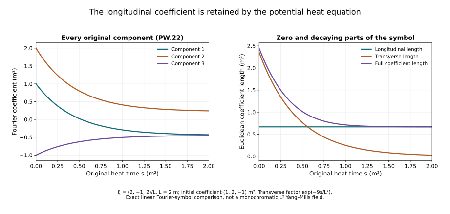

# Potential wave bounds from the complete heat equation

The divergence-free interaction in the [tension chapter](../classical-tension-null-structure.html)
contains the full wave norm of the difference \(B(s)=a(s)-a(S)\).
We now bound that coefficient uniformly down to heat time zero.
The proof keeps every quadratic and cubic term of the potential
equation. Positive heat weights and the exact energy identity
supply the bound, including its forcing contribution.

The prerequisites are the [wave estimates](../classical-wave-estimates.html)
and [curl-free and backward heat estimates](../classical-curlfree-backward-heat.html).
The field is the already constructed regular caloric-temporal
solution on the original physical interval \(I\), with speed \(c\)
and heat endpoint \(S\). The resulting expressions retain actual
wave norms; the final physical continuation bound is developed
after the remaining interactions.

The human-source comparison is Sung-Jin Oh,
[*Gauge choice for the Yang–Mills equations using the Yang–Mills heat
flow and local well-posedness in \(H^1\)*, arXiv:1210.1558v2](https://arxiv.org/abs/1210.1558v2),
the improved potential estimate. Its full original author source
was read in the bounded ranges recorded in the provenance.
The following proof is independently written, with every product
and original physical factor supplied. No novelty is claimed.

## 1. Every term of the original equation

Keep the actual caloric potential \(a\), endpoint \(a^S=a(S)\), physical
interval \(I\) and heat interval \((0,S]\). Direct expansion of \(\sum_jD_jF_{ji}\) gives

\[
\partial_sa_i=\Delta a_i-\partial_i\sum_j\partial_ja_j+N'_i(a),
\tag{PW.1}
\]

where the complete operators are

\[
\begin{aligned}
\mathcal B(U,V)_i
 &=2\sum_j[U_j,\partial_jV_i]-\sum_j[U_j,\partial_iV_j]
                       +\sum_j[\partial_jU_j,V_i],\\
\mathcal C(U,V,Z)_i&=\sum_j[U_j,[V_j,Z_i]],\\
N'(a)&=\mathcal B(a,a)+\mathcal C(a,a,a).
\end{aligned}\tag{PW.2}
\]

Expanding the derivative of \([a_j,a_i]\) gives one copy of
\([a_j,\partial_j a_i]\); the covariant connection term gives the
second copy. All other terms in \(\sum_jD_jF_{ji}\) occur once as displayed.

Define \(\mathcal W_c^k(a)\) by the full HW.26 formula using the
actual derivative tuple \(|D|^{k-1}\partial_ca\) and forcing
\(|D|^{k-1}\Box_ca\), even if \(a\) itself is not in \(L^2\). No definiteness
claim on this larger class is needed. For the regular L2
difference \(B(s)=a(s)-a^S\) it equals \(\mathsf S_c^k(B(s))\).

The interpolation and derivative L4 bounds extend to this
derivative-regular class by applying the same bounded annular
Fourier cutoff to a, its time derivative and its forcing.
The wave equation commutes with it. The cutoff potentials
are regular L2 fields, so HW.32–HW.33 apply. Their actual
derivative tuples and forcing converge in the stated weighted
L2 norms. The wave estimate makes the derivative outputs
Cauchy in L4, and distributional convergence identifies the
limit with the original derivatives. This supplies the same
constants without choosing a polynomial representative for a.

Let \(b=6+2\sqrt3\). Component Cauchy–Schwarz gives

\[
|\mathcal B(U,V)|\le6|U||\partial_xV|+
           2\sqrt3|\partial_xU||V|,\qquad
|\mathcal C(U,V,Z)|\le4|U||V||Z|.
\tag{PW.3}
\]

The first two B terms have coefficients four and two. The
divergence in its last term costs \(\sqrt3\), and the bracket
costs two. The two C brackets cost four. These are full
spatial/output tuple bounds.

## 2. Complete physical wave product rule

Set \(\epsilon_t=-c^{-2}\) and \(\epsilon_j=1\), with every sum below
over \(t,1,2,3\). Direct differentiation of the original factors gives

\[
\begin{aligned}
\partial_\rho N'={}&
\mathcal B(\partial_\rho a,a)+\mathcal B(a,\partial_\rho a)
+\mathcal C(\partial_\rho a,a,a)
+\mathcal C(a,\partial_\rho a,a)+\mathcal C(a,a,\partial_\rho a),\\
\Box_cN'={}&
\mathcal B(\Box_ca,a)+\mathcal B(a,\Box_ca)
 +2\sum_\rho\epsilon_\rho\mathcal B(\partial_\rho a,\partial_\rho a)\\
&+\mathcal C(\Box_ca,a,a)+\mathcal C(a,\Box_ca,a)+\mathcal C(a,a,\Box_ca)\\
&+2\sum_\rho\epsilon_\rho
 \bigl(\mathcal C(\partial_\rho a,\partial_\rho a,a)
       +\mathcal C(\partial_\rho a,a,\partial_\rho a)
       +\mathcal C(a,\partial_\rho a,\partial_\rho a)\bigr).
\end{aligned}\tag{PW.4}
\]

There are three single-Box placements and three unordered
cross pairs in C. The spatial derivatives commute with Box;
matrix factors never change order. Thus, with the original
tuple \(\partial_c=(c^{-1}\partial_t,\partial_1,\partial_2,\partial_3)\),

\[
\begin{aligned}
|\partial_cN'|&\le
 b(|a||\partial_x\partial_ca|+|\partial_xa||\partial_ca|)
 +12|a|^2|\partial_ca|,\\
|\Box_cN'|&\le
 b(|a||\partial_x\Box_ca|+|\partial_xa||\Box_ca|)
 +12|a|^2|\Box_ca|\\
&\quad+2b|\partial_ca||\partial_x\partial_ca|
 +24|a||\partial_ca|^2 .
\end{aligned}\tag{PW.5}
\]

The temporal contraction's \(c^{-2}\) is exactly retained by the
squared first tuple component. Put \(W_k(s)=\mathcal W_c^k(a(s))\),
\(d_c=\sqrt2(2\pi c)^{-1/4}\), and use CF.15's uniform \(U_0,U_1\).
Hölder, PW.5 and the extended HW.33 prove

\[
\begin{aligned}
\mathcal W_c^1(N'(s))\le{}&
2b(U_0s^{-1/4}W_2+U_1s^{-3/4}W_1)+24U_0^2s^{-1/2}W_1\\
&+2bc|I|^{1/2}d_c^2W_{3/2}W_{5/2}
 +24c|I|^{1/2}U_0d_c^2s^{-1/4}W_{3/2}^2 .
\end{aligned}\tag{PW.6}
\]

Its first line includes both the energy and forcing norms.
The last line retains all differentiated cross terms.
Every W on the right is evaluated at the same original s.

## 3. Evaluate every heat integral

The original backward identity and the full derivative/forcing
triangle inequality give \(W_k(s)\le W_k(S)+\int_s^S\|G(r)\|_{\mathsf S_c^k}dr\).
For \(\beta>0\), CF.19–CF.20 therefore give

\[
P_{k,\beta}:=\|s^\beta W_k(s)\|_{L^2(ds/s)}
\le\frac{S^\beta}{\sqrt{2\beta}}W_k(S)
+\frac1\beta\|r^{\beta+1}\mathsf S_c^k(G(r))\|_{L^2(dr/r)} .
\tag{PW.7}
\]

Physical derivatives and Box commute with the heat integral
on each positive closed interval. The actual F quantities
are those of CF.22, including their forcing terms. Define

\[
\begin{aligned}
\overline P_2&=S^{1/2}W_2(S)+2\mathcal F_2^2,\\
\overline P_{1,\delta}
 &=2S^{1/8}W_1(S)+8S^{1/8}\mathcal F_1^2,\qquad\delta=1/8,\\
\overline P_{3/2}
 &=\sqrt2 S^{1/4}W_{3/2}(S)+4\mathcal F_{3/2}^2,\\
\overline P_{5/2}
 &=\sqrt{2/3}S^{3/4}W_{5/2}(S)+\tfrac43\mathcal F_{5/2}^2 .
\end{aligned}\tag{PW.8}
\]

They bound \(P_{2,1/2},P_{1,1/8},P_{3/2,1/4}\) and \(P_{5/2,3/4}\).
Only the second line uses an extra input \(r^{1/8}\), bounded by
\(S^{1/8}\). The other lines use \(\beta=(k-1)/2\) exactly. Fractional
F and endpoint W retain the full HW.32 interpolation.

Integrate PW.6 in \(dr=r\,dr/r\). For its first term use
\(r^{-1/4}W_2dr=r^{1/4}(r^{1/2}W_2)dr/r\); the scalar L2
factor is \(\sqrt2 S^{1/4}\). For its second, the leftover
power after \(r^{1/8}W_1\) is \(r^{1/8}\), with L2 norm \(2S^{1/8}\).
For the third it is \(r^{3/8}\), with norm \(2S^{3/8}/\sqrt3\).
The quadratic wave term uses \(r^{1/4}r^{3/4}=r\).
The cubic wave term leaves \(r^{1/4}\le S^{1/4}\).
Cauchy–Schwarz on these exact factors proves

\[
\begin{aligned}
\int_0^S\mathcal W_c^1(N'(r))dr\le\mathcal J:={}&
2b(\sqrt2U_0S^{1/4}\overline P_2+
                   2U_1S^{1/8}\overline P_{1,\delta})\\
&+\frac{48}{\sqrt3}U_0^2S^{3/8}\overline P_{1,\delta}\\
&+2bc|I|^{1/2}d_c^2\overline P_{3/2}\overline P_{5/2}
 +24c|I|^{1/2}U_0d_c^2S^{1/4}\overline P_{3/2}^2 .
\end{aligned}\tag{PW.9}
\]

No unknown unweighted supremum \(W_1\) occurs on this right side.
It is a finite expression in the original endpoint norms,
physical parameters, fixed-time constants and actual F norms.

## 4. Exact energy identity and the uniform bound

Let \(L_0X=\Delta X-\nabla\operatorname{div}X\) act on the spatial output index.
Apply PW.1 to \(X=\partial_ca\), retaining its additional physical
derivative tuple, or to \(X=\Box_ca\). Its right-hand forcing H
is the corresponding derivative of N'. Spatial integration
by parts gives the exact identity

\[
\begin{aligned}
\tfrac12\|X(s)\|_2^2
={}&\tfrac12\|X(S)\|_2^2
+\int_s^S(\|\nabla X(r)\|_2^2-\|\operatorname{div}X(r)\|_2^2)dr\\
&-\int_s^S\operatorname{Re}\langle X(r),H(r)\rangle dr .
\end{aligned}\tag{PW.10}
\]

For the Box case integrate the whole identity in original \(dt\).
There is no time integration by parts and hence no lost
physical endpoint term. Spatial cutoffs justify the identity
using the stated regularity and L2 derivative bounds.

Write \(Y=\sup_s\|X(s)\|_2\), \(a_0=\|X(S)\|_2\),
\(b_0=(\int_0^S\|\nabla X(r)\|_2^2dr)^{1/2}\),
\(h_0=\int_0^S\|H(r)\|_2dr\). Retain the negative divergence
term in the identity, and drop it only for the upper bound.
Then \(Y^2\le a_0^2+2b_0^2+2Yh_0\), whose positive root yields

\[
Y\le a_0+\sqrt2\,b_0+2h_0 .
\tag{PW.11}
\]

One can first take \(s\ge\epsilon\) and then pass to zero using
the finite displayed bounds. For the energy tuple, take the
time supremum after this inequality, and bound its integrals
by the integrals of the actual time suprema. For the forcing
tuple multiply by \(c|I|^{1/2}\).

The two gradient terms have sum at most \(\sqrt2P_{2,1/2}\).
Indeed their nonnegative integrands \(A(r),B(r)\) satisfy
\(\|A\|_2+\|B\|_2\le\sqrt2\|(A^2+B^2)^{1/2}\|_2\)
\(\le\sqrt2\|A+B\|_2\), where \(A+B=W_2(r)\).
Combining both PW.11 bounds therefore proves

\[
\sup_{0<s\le S}W_1(s)\le W_1(S)+2\overline P_2+2\mathcal J .
\tag{PW.12}
\]

For the original regular L2 difference \(B(s)=a(s)-a^S\), the
full derivative/forcing triangle inequality gives

\[
\sup_{0<s\le S}\|B(s)\|_{\mathsf S_c^1}
\le2W_1(S)+2\overline P_2+2\mathcal J .
\tag{PW.13}
\]

This proves the missing uniform coefficient bound in NX.31–NX.32
from the actual degenerate heat equation, retaining every
quadratic, cubic and physical wave product term. No absolute
integral of an unweighted G wave norm is asserted finite.

For the actual u(s) of NX.32, substitute PW.13 into the proved
null-form estimate and take \(p=2,\infty\) in original \(ds/s\):

\[
\begin{aligned}
&\left\|s\left\|\sum_j[(P_{\rm df}B(s))_j,\partial_ju(s)]
                       \right\|_{L^2_{t,x}}\right\|_{L^p(ds/s)}\\
&\quad\le
2\sqrt3\sqrt{\frac2{\pi c}}\,
 (2W_1(S)+2\overline P_2+2\mathcal J)
 \left\|s\|u(s)\|_{\mathsf S_c^1}\right\|_{L^p(ds/s)} .
\end{aligned}\tag{PW.14}
\]

The physical c, finite heat endpoint and complete source weights
remain. Endpoint W and F retain their original forcing definitions.
[Space-time tension estimates](../classical-spacetime-tension.html)
and [temporal boundary estimates](../classical-temporal-boundary.html)
continue the argument. The remaining wave terms and finite
physical-time closure are still required; none is assumed here.

**Figure PW.** The unchanged symbol of \(\Delta-\nabla\operatorname{div}\)
acts at \(\xi=(2,-1,2)/L\), with \(L=2\) metres. The initial
coefficient is \((1,2,-1)\) square metres times a fixed matrix.
Both components of its exact evolution are shown for
\(0\le s\le2\) square metres. The longitudinal coefficient stays
constant and the transverse coefficient has factor
\(\exp(-9s/L^2)\). This is a Fourier coefficient of the linear
comparison operator, not an asserted monochromatic \(L^2\)
Yang–Mills field. Exercise 8 proves the full formula.

## 5. Exercises with complete solutions

### Exercise 1. Keep both copies of the transport term

Expand \(\sum_jD_jF_{ji}\) from the original curvature definition.

**Solution.** For each \(j\),
\(\partial_j[a_j,a_i]=[\partial_ja_j,a_i]+[a_j,\partial_ja_i]\).
The connection term \([a_j,F_{ji}]\) contributes a second
\([a_j,\partial_ja_i]\), the negative
\(-[a_j,\partial_i a_j]\), and the full double bracket. Thus

\[
\sum_jD_jF_{ji}
=\Delta a_i-\partial_i\sum_j\partial_ja_j
 +\sum_j\bigl(2[a_j,\partial_ja_i]-[a_j,\partial_ia_j]
       +[\partial_ja_j,a_i]+[a_j,[a_j,a_i]]\bigr).
\tag{PW.15}
\]

The two transport copies have different origins and the same sign.
No gauge condition on the spatial divergence has been imposed.

### Exercise 2. The ordered cubic wave rule

For smooth matrix fields \(U,V,Z\), expand \(\Box_c(UVZ)\)
without commuting any factors.

**Solution.** Apply the ordinary product rule twice for each
physical coordinate. With \(\epsilon_t=-c^{-2}\) and
\(\epsilon_j=1\), the complete result is

\[
\begin{aligned}
\Box_c(UVZ)={}&(\Box_cU)VZ+U(\Box_cV)Z+UV(\Box_cZ)\\
&+2\sum_\rho\epsilon_\rho\bigl(
 (\partial_\rho U)(\partial_\rho V)Z
 +(\partial_\rho U)V(\partial_\rho Z)
 +U(\partial_\rho V)(\partial_\rho Z)\bigr).
\end{aligned}\tag{PW.16}
\]

Each unordered pair of differentiated factors occurs twice.
The order \(U,V,Z\) is preserved in each summand. Expanding the
nested brackets in \(\mathcal C\), applying this identity to
each product, and recombining proves its three cross placements
in PW.4, including the temporal coefficient.

### Exercise 3. A finite backward integral with constant input

Let \(a_*,g_*\ge0\), \(\beta>0\), and
\(w(s)=a_*+(S-s)g_*\). Compute the exact squared norm of
\(s^\beta w(s)\) in \(L^2(ds/s)\).

**Solution.** Expand the full square and integrate each power:

\[
\begin{aligned}
\int_0^S s^{2\beta}w(s)^2\frac{ds}{s}
={}&\frac{(a_*+Sg_*)^2S^{2\beta}}{2\beta}
-\frac{2(a_*+Sg_*)g_*S^{2\beta+1}}{2\beta+1}
+\frac{g_*^2S^{2\beta+2}}{2\beta+2}.
\end{aligned}\tag{PW.17}
\]

All three terms are finite because \(\beta>0\). Their signs
come from the exact backward difference \(S-s\).
This is an exact scalar test of the weighted integration;
it does not identify \(w\) with a Yang–Mills solution norm.

### Exercise 4. Why the unweighted backward integral is insufficient

For \(0<s\le S\), take
\(g(s)=1/(s\log(eS/s))\). Compare
\(\|sg(s)\|_{L^2(ds/s)}\) with \(\int_0^S g(s)ds\).

**Solution.** The substitution \(u=\log(eS/s)\) gives

\[
\begin{aligned}
\int_\varepsilon^S[sg(s)]^2\frac{ds}{s}
 &=1-\frac1{\log(eS/\varepsilon)},\\
\int_\varepsilon^Sg(s)ds
 &=\log\log(eS/\varepsilon).
\end{aligned}\tag{PW.18}
\]

The first limit is one, while the second is infinite.
Thus the weighted squared input alone cannot justify the
unweighted absolute backward integral. The positive-weight
operator in PW.7 and the separate energy identity address
this precise defect. The example tests an integral implication,
not the existence of a field with this prescribed norm.

### Exercise 5. The exact longitudinal energy cancellation

Let \(\phi\) be a Schwartz scalar and \(X=\nabla\phi\).
Evaluate \((\Delta-\nabla\operatorname{div})X\) and compare
the two spatial energy terms in PW.10.

**Solution.** Commuting ordinary derivatives gives
\(\Delta\nabla\phi-\nabla\Delta\phi=0\).
Plancherel, with the original Fourier convention, gives

\[
\sum_{i,j}\|\partial_i\partial_j\phi\|_2^2
=\|\Delta\phi\|_2^2,\qquad
\|\nabla X\|_2^2-\|\operatorname{div}X\|_2^2=0.
\tag{PW.19}
\]

Indeed \(\sum_{i,j}\xi_i^2\xi_j^2=|\xi|^4\).
Both original energy terms are present; their exact difference
vanishes on this subspace. That is why the heat identity by
itself does not control a full gradient with a positive
coercivity constant on every vector field.

### Exercise 6. The forcing coefficient under the physical time map

Prove the coefficient \(c|I|^{1/2}\) in the full wave norm
by using \(x^0=ct\), with \(c>0\).

**Solution.** The original map is
\((\mathcal P_cN)(x^0,x)=N(x^0/c,x)\), on \(cI\).
Since \(dx^0=c\,dt\) and \(|cI|=c|I|\),

\[
\|\mathcal P_cN\|_{L^2(cI\times\mathbb R^3)}
 =\sqrt c\,\|N\|_{L^2(I\times\mathbb R^3)},\qquad
|cI|^{1/2}\|\mathcal P_cN\|_2
 =c|I|^{1/2}\|N\|_2 .
\tag{PW.20}
\]

The derivative map is
\(\partial_0\mathcal P_cu=c^{-1}\mathcal P_c\partial_tu\),
so the original energy tuple agrees as well. The inverse
map \(v(x^0,x)\mapsto v(ct,x)\) recovers the original field.

### Exercise 7. Retain the exact positive root

Starting from \(Y^2\le a_0^2+2b_0^2+2Yh_0\), with all four
quantities nonnegative, derive both the exact root bound
and the bound used in PW.11.

**Solution.** Completing the square gives
\((Y-h_0)^2\le h_0^2+a_0^2+2b_0^2\), hence

\[
Y\le h_0+\sqrt{h_0^2+a_0^2+2b_0^2}
 \le 2h_0+a_0+\sqrt2\,b_0 .
\tag{PW.21}
\]

For the second inequality, square the nonnegative expression
\(h_0+a_0+\sqrt2 b_0\); its three cross terms are nonnegative.
The first expression retains a sharper coefficient combination.
The second is the explicitly additive upper bound used earlier.
When \(a_0=b_0=0\), both give \(Y\le2h_0\).

### Exercise 8. Solve the exact linear potential heat symbol

At nonzero frequency \(\xi\), solve
\(\partial_s\widehat X=(-|\xi|^2I+\xi\xi^T)\widehat X\).
Evaluate it for the coefficient in Figure PW.

**Solution.** The exact projections from NX.22 satisfy
\(P_{\rm cf}=\xi\xi^T/|\xi|^2\), \(P_{\rm df}=I-P_{\rm cf}\),
\(P_{\rm cf}P_{\rm df}=0\), and their sum is \(I\).
The longitudinal equation has zero generator and the transverse
equation has generator \(-|\xi|^2\). Consequently

\[
\begin{aligned}
\widehat X(s)&=(P_{\rm cf}+e^{-s|\xi|^2}P_{\rm df})\widehat X(0),\\
P_{\rm cf}(1,2,-1)^T&=(-4,2,-4)^T/9,\\
P_{\rm df}(1,2,-1)^T&=(13,16,-5)^T/9,\qquad |\xi|^2=9/L^2 .
\end{aligned}\tag{PW.22}
\]

Their Euclidean lengths are \(2/3\) and \(5\sqrt2/3\).
Multiplying by the original coefficient unit and fixed matrix
retains both outputs. At \(\xi=0\), the generator itself is zero,
so the evolution is the identity. For \(L^2\) fields that single
frequency has measure zero; no polynomial field is inserted.
