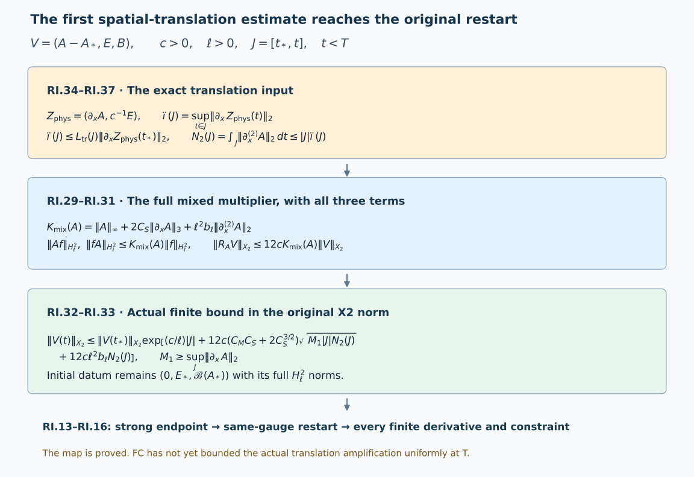

# Strong endpoints and restarting the classical evolution

This Unit 9 analytic chapter proves the local restart in the original
physical temporal gauge. It retains the affine potential space:
the potential need not be square integrable, while its increment is.
It derives the endpoint convergence supplied by the preceding wave
bounds and the exact additional derivative estimate that reaches the
strong restart.

Read [the local construction](../local-and-global-classical-evolution.html),
[the finite wave bound](../classical-finite-wave-bound.html),
[the physical gauge](../classical-physical-gauge.html)
and [the potential comparison](../classical-potential-difference.html).
Their prefixes are F9, FC, GO and PD. The chapter also uses
[the complete potential-wave proof](../classical-potential-wave.html),
[electric differences](../classical-electric-difference.html),
[spatial differences](../classical-spatial-difference.html),
[temporal differences](../classical-temporal-difference.html)
and [gauge differences](../classical-gauge-difference.html).

The metric, physical speed \(c>0\), spatial length \(\ell>0\),
heat endpoint \(S>0\), gauge anchor and original matrix bracket
are retained throughout. The strong restart is proved below.
The full uniform initial-data estimate needed to apply it at the
energy regularity is a subsequent part of Unit 9.

Human-source context: Sung-Jin Oh,
[*Gauge choice for the Yang–Mills equations using the Yang–Mills heat flow
and local well-posedness in H1*, arXiv:1210.1558v2](https://arxiv.org/abs/1210.1558v2).
This is independent exposition of the classical evolution argument.
The full proofs below use the linked course providers. Exact source
versions and bounded reading are retained in the course provenance.
No novelty is claimed.

## 1. Original data, spaces and affine fields

Keep the original physical interval, coordinates, metric
\(\operatorname{diag}(-c^2,1,1,1)\), c>0, reference length \(\ell\)>0, heat endpoint S>0,
closed matrix group G contained in U(N), and its anti-Hermitian Lie
algebra. Norms of matrix-valued tensors use Hilbert–Schmidt modulus
and the square sum over all ordered output and derivative labels.
In the actual physical temporal gauge retain

\[
\begin{aligned}
\partial_tA_i&=E_i,&
\partial_tE_i&=-c^2\sum_{j,k}\epsilon_{ijk}
                              (\partial_jB_k+[A_j,B_k]),\\
\partial_tB_i&=\sum_{j,k}\epsilon_{ijk}
                              (\partial_jE_k+[A_j,E_k]),&
\epsilon_{123}&=1,\\
\mathscr B(A)_i&=\sum_{j,k}\epsilon_{ijk}\partial_jA_k
                  +\frac12\sum_{j,k}\epsilon_{ijk}[A_j,A_k],\\
B&=\mathscr B(A),&
\mathscr G(A,E)&=\sum_i(\partial_iE_i+[A_i,E_i])=0.
\end{aligned}\tag{RI.1}
\]

There are six nonzero epsilon entries; diagonal zeros and both
orders of all derivatives are part of these actual tuples. Define

\[
\begin{aligned}
\|f\|_{H_\ell^q}^2
 &=\frac1{(2\pi)^3}\int_{\mathbb R^3}
                      (1+\ell^2|\xi|^2)^q|\widehat f(\xi)|^2d\xi\\
 &=\sum_{j=0}^q{q\choose j}\ell^{2j}\|\partial_x^{(j)}f\|_2^2,
                        \qquad q\in\mathbb Z_{\ge0},\\
\|(h,E,B)\|_{X_q}^2
 &=\ell^{-2}\|h\|_{H_\ell^q}^2
               +c^{-2}\|E\|_{H_\ell^q}^2+\|B\|_{H_\ell^q}^2.
\end{aligned}\tag{RI.2}
\]

The ordered sum identity
\(\sum_{i_1,\ldots,i_j}\xi_{i_1}^2\cdots\xi_{i_j}^2=|\xi|^{2j}\) proves the second
line with exactly the displayed binomial factors. These are the
spaces of F9.8–F9.9 and F9.15, not homogeneous substitutes.

Fix \(A_*\)=A(\(t_*\)) as its actual \(L^6\) representative and put h=A-\(A_*\).
For the existing regular solution, partial \(A_*\) belongs to every
finite \(H_\ell^q\). Its higher derivatives are bounded; for example
the proved homogeneous Morrey and Sobolev inequalities give

\[
\|A_*\|_\infty\le C_MC_S\|\partial_xA_*\|_2^{1/2}\|\partial_x^{(2)}A_*\|_2^{1/2}
\]

. Here retain

\[
C_S=\frac4{\sqrt3},\qquad
C_M=2\sqrt{(4\pi/3)^{-1/6}(4\pi)^{-1}(20\pi/3)^{5/6}},
\qquad b_\ell=\frac{\pi}{(2\pi)^{3/2}\ell^{3/2}}.
\tag{RI.3}
\]

The actual E_*,B_* are in every finite \(H_\ell^q\) and
\(B_*=\mathscr B(A_*)\). In particular their original finite curvature
norms are data; square integrability of \(A_*\) itself, or of the
separate quadratic curvature term, is not added. The chart is

\[
\iota_{A_*}:X_q\longrightarrow
 (A_*+H_\ell^q)\times H_\ell^q\times H_\ell^q,
\quad(h,E,B)\longmapsto(A_*+h,E,B),
\quad\iota_{A_*}^{-1}(A,E,B)=(A-A_*,E,B).
\tag{RI.4}
\]

These are mutually inverse maps of the actual fields on the stated
affine domain. Both the \(L^6\) representative and the original gauge
are fixed. The regular constrained datum maps to
\(V_*=(0,E_*,\mathscr B(A_*))\); conversely this affine datum recovers
the same constrained connection. This proves the relation to the
original local variables without assuming an \(L^2\) potential.

## 2. The complete local construction and its constants

Write \(\beta(A,f)_i=\sum_{j,k}\epsilon_{ijk}[A_j,f_k]\). With V=(h,E,B),
the exact operators are

\[
\begin{aligned}
LV&=(0,-c^2\operatorname{curl}B,\operatorname{curl}E),&
SV&=(E,0,0),\\
Q(V,W)&=(0,-c^2\beta(h_V,B_W),\beta(h_V,E_W)),\\
R_*V&=(0,-c^2\beta(A_*,B),\beta(A_*,E)),&
N_*(V)&=SV+Q(V,V)+R_*V.
\end{aligned}\tag{RI.5}
\]

Thus \(\partial_tV=LV+N_*(V)\), with all signs and both frozen
potential products retained. The Fourier matrix and its exact
weighted metric are

\[
M(\xi)=\begin{pmatrix}0&0&0\\0&0&-c^2C(\xi)\\0&C(\xi)&0\end{pmatrix},
\quad C(\xi)z=i\xi\times z,\quad
\mathsf W=\operatorname{diag}(\ell^{-2}I_3,c^{-2}I_3,I_3),
\quad M^*\mathsf W+\mathsf WM=0.
\tag{RI.6}
\]

Differentiating \((e^{tM})^*\mathsf W e^{tM}\) proves that it equals W.
Consequently T(t), defined by the multiplier \(e^{tM}\), is an
isometry on every \(X_q\) and satisfies \(T(t+r)=T(t)T(r)\).
Dominated convergence with the multiplier bound two proves strong
continuity. Since \(|\xi\times z|\le|\xi||z|\),
\(\|LV\|_{X_{q-1}}\le(c/\ell)\|V\|_{X_q}\). The original real Lie algebra
is preserved: in a real orthonormal Lie algebra basis,
\(M(-\xi)=\overline{M(\xi)}\) preserves the Fourier reality identity.

For \(a_l=\|\partial_x^{(l)}A_*\|_\infty\) define exactly

\[
K_q(A_*)=
\left[\sum_{j=0}^q{q\choose j}
 \left(\sum_{l=0}^j{j\choose l}
   \frac{\ell^l a_l}{\sqrt{{q\choose j-l}}}\right)^2\right]^{1/2}.
\tag{RI.7}
\]

For each ordered j-word, partition its positions between \(A_*\) and f.
Full tuple triangle and spatial Hölder give

\[
\|\partial_x^{(j)}(A_*f)\|_2\le\sum_{l=0}^j{j\choose l}a_l\|\partial_x^{(j-l)}f\|_2
\]

. The (j-l)-th term of RI.2 bounds the last
norm by \(\ell^{-(j-l)}{q\choose j-l}^{-1/2}\|f\|_{H_\ell^q}\).
Taking the finite weighted square sum proves Kq for either
ordered product. The six epsilon entries and two bracket products
give

\[
\|\beta(A_*,f)\|_{H_\ell^q}\le12K_q(A_*)\|f\|_{H_\ell^q},
\qquad \|R_*V\|_{X_q}\le12cK_q(A_*)\|V\|_{X_q}.
\tag{RI.8}
\]

For the second inequality the squared E,B contribution is
\((12K_q)^2(c^2\|B\|_{H_\ell^q}^2+\|E\|_{H_\ell^q}^2)\); this equals
\((12cK_q)^2(c^{-2}\|E\|_{H_\ell^q}^2+\|B\|_{H_\ell^q}^2)\).
Neither block nor its physical weight is suppressed.

F9.13–F9.21's proved convolution product bound has constants

\[
a=\frac c\ell,\quad L_q=24c\ell\,2^{q-1}b_\ell,
\quad C_2=2L_2=96c\ell b_\ell,\quad
a_q^*=a+12cK_q(A_*).
\tag{RI.9}
\]

Its exact application to RI.5 is

\[
\|N_*(V)\|_{X_q}\le(a_q^*+2L_q\|V\|_{X_2})\|V\|_{X_q}
\]

,
and

\[
\|N_*(V)-N_*(W)\|_{X_2}\le(a_2^*+C_2(\|V\|_{X_2}+\|W\|_{X_2}))\|V-W\|_{X_2}.
\]

The quadratic difference is \(Q(V-W,V)+Q(W,V-W)\), with factor
order preserved.

For actual V0 in \(X_2\), m_*>0 in the same units, set

\[
M_0=\max\{m_*,\|V_0\|_{X_2}\},\quad R=2M_0,\quad
\tau=[4(a_2^*+2C_2R)]^{-1},\quad
(\Phi V)(t)=T(t-t_0)V_0+
                   \int_{t_0}^tT(t-r)N_*(V(r))dr.
\tag{RI.10}
\]

The continuous path space is complete. Its closed radius R ball
maps into itself because
\(M_0+\tau(a_2^*R+C_2R^2)\le3R/4\). The difference bound is
\(\tau(a_2^*+2C_2R)=1/4\). Starting at \(T(t-t_0)V_0\), the successive
differences are bounded by a geometric series with ratio 1/4;
its limit is the solution of the mild equation. Differentiation
in \(X_1\) using the proved generator bound gives the differential
equation. For arbitrary two solutions on a common compact
interval, the same oriented mild identity and scalar integration
prove

\[
\|V(t)-W(t)\|_{X_2}\le\|V(t_0)-W(t_0)\|_{X_2}
\exp\!\int_{[t_0,t]}
 (a_2^*+C_2(\|V(r)\|_{X_2}+\|W(r)\|_{X_2}))\,|dr|.
\tag{RI.11}
\]

The scalar proof differentiates
\((d+\int b y)\exp(-\int b)\), using \(y\le d+\int by\).
For zero d, first use a positive number and let it decrease to
zero. Backward physical time is obtained by reversing the
integration parameter, not a sign in the original equation.
This completes the local construction in the original affine domain.

## 3. Strong endpoint, restart equality, all derivatives and constraints

For any compact segment where the regular \(X_q\) solution exists,
the same mild equation gives

\[
\|V(t)\|_{X_q}\le\|V(t_0)\|_{X_q}
 \exp\!\left(a_q^*|t-t_0|+
                  2L_q\int_{[t_0,t]}\|V(r)\|_{X_2}|dr|\right).
\tag{RI.12}
\]

There is no circular use of high regularity here. First run the
same contraction in \(X_q\) on a shorter interval, using
\(\|V\|_{X_2}\le\|V\|_{X_q}\) and the finite constants RI.7. Uniqueness RI.11
identifies it with the \(X_2\) solution. RI.12 bounds it on each
compact \(X_2\) interval. The following complete endpoint construction
then extends it across any apparent interior endpoint, proving
all finite-order persistence on the \(X_2\) interval.

Specifically, for an actual segment [t0,T) with finite bound
\(M_q=\sup_{t<T}\|V(t)\|_{X_q}\), the interaction variable
\(Z(t)=T(t_0-t)V(t)\) satisfies

\[
\begin{aligned}
Z(t)-Z(u)&=\int_u^tT(t_0-r)N_*(V(r))dr,\\
\|Z(t)-Z(u)\|_{X_q}&\le(a_q^*+2L_qM_q)M_q|t-u|,\\
Z_T&=\lim_{t\uparrow T}Z(t)\text{ in }X_q,
\qquad V_T=T(T-t_0)Z_T.
\end{aligned}\tag{RI.13}
\]

Completeness constructs \(Z_T\); strong continuity of T and its norm
one prove \(V(t)\to V_T\) in \(X_q\). The norm-integrable mild equation
passes to the original physical time T and gives

\[
V(t)=T(t-T)V_T+\int_T^tT(t-r)N_*(V(r))dr.
\tag{RI.14}
\]

Run RI.10 at T with datum \(V_T\) and the same \(A_*\). Its backward
branch satisfies RI.14 and shares \(V_T\). Applying RI.11 backward
from T makes their difference exactly zero. Additivity of the
oriented integral proves the equation on the joined interval.
Thus this is a constructed extension, in the same gauge and \(L^6\)
representative; a weaker limit has not been declared an \(X_2\) datum.

For the regular data, all high temporal derivatives follow from
the actual recursion, not a separate time assumption:

\[
P_0(V)=V,\qquad
P_{n+1}(V)=(L+S+R_*)P_n(V)
                  +\sum_{j=0}^n{n\choose j}Q(P_j(V),P_{n-j}(V)).
\tag{RI.15}
\]

Differentiating RI.5 n times proves \(\partial_t^{n+1}V=P_{n+1}\),
assuming the identities through n. The two ordered quadratic
factors give every binomial placement. L spends one spatial
order, whereas S,R_* and the products are bounded at each
remaining order at least two. Starting with sufficiently high
spatial order proves \(\partial_t^nV\) in C \(X_q\) for each finite n,q;
the Fourier embedding F9.12 then gives joint smoothness.

The constraints have the exact defect evolution

\[
K=B-\mathscr B(A),\qquad \partial_tK=0,
\qquad \partial_t\mathscr G(A,E)=c^2\sum_k[K_k,B_k].
\tag{RI.16}
\]

Indeed differentiating \(\mathscr B\) gives \(\operatorname{curl}E+\beta(A,E)\):
the two terms in its bracket derivative combine with their
original factor 1/2. In the Gauss derivative, \(\sum_i[E_i,E_i]=0\).
The remaining term is
\(-\frac{c^2}{2}\sum_{i,j,k}\epsilon_{ijk}[F_{ij}(A),B_k]\). Since
\(F_{ij}(A)=\sum_l\epsilon_{ijl}\mathscr B_l(A)\) and
\(\sum_{i,j}\epsilon_{ijk}\epsilon_{ijl}=2\delta_{kl}\), it equals
\(-c^2\sum_k[\mathscr B_k(A),B_k]=c^2\sum_k[K_k,B_k]\).
This proves the positive defect sign in RI.16. At affine \(X_2\)
regularity the derivative and product identities pass by smooth
approximation, using RI.8 and F9.13. At each \(X_q\) endpoint they
pass by strong convergence. Zero initial constraints remain zero,
so the extension is the original Yang–Mills connection.

## 4. The unconditional finite physical endpoint furnished by FC

Take the actual open segment [\(t_*\),T), with \(T-t_*\le\tau_1\) and the
same fixed horizon H and heat endpoint S as FC. Applying the
accepted estimates to all closed initial subsegments, with their
common constants, and taking their increasing union gives

\[
\begin{aligned}
M_6&=C_SR_a+Q_*,&
M_1&=R_a+2C_SP_*R_a+H_*+P_*Q_*,\\
\sup_{t<T}\|A(t)\|_6&\le M_6,&
\sup_{t<T}\|\partial_xA(t)\|_2&\le M_1,\\
\sup_{t<T}\|E(t)\|_2&\le cd,&
\sup_{t<T}\|B(t)\|_2&\le d,\\
c^{-2}\|E(t)\|_2^2+\|B(t)\|_2^2&\le d^2.
\end{aligned}\tag{RI.17}
\]

Here \(R_a=\Omega_1(H)+2\overline P_2[R;H]+2\mathcal J[R;H]\),
\(P_*=\sqrt H C_S^{1/2}\sqrt{D_BH_B}\),
\(H_*=\sqrt H H_B,\quad Q_*=C_SH_*\), exactly FC.19–FC.20.
The separate E,B bounds do not prove the last line by addition;
that line is the original conserved full curvature energy.
More precisely FC.1 fixes d, rather than merely an upper
majorant, by

\[
d^2=c^{-2}\sum_i\|E_i(t,0)\|_2^2+
\sum_{i<j}\|F_{ij}(t,0)\|_2^2
=(g_{\rm YM}^2/(\hbar c))\mathcal E_{\rm YM}
\]

.
Unitary gauge conjugation identifies this with the physical
E,B energy, preserving the original coupling and action units.

Since \(\partial_tA=E\), \(h(t)=A(t)-A_*\) is Lipschitz in \(L^2\) with
constant cd. Completeness gives \(h_T\) in \(L^2\) and \(A_T\)=\(A_*\)+\(h_T\),
with

\[
\begin{aligned}
\|A(t)-A_T\|_2&\le cd(T-t),\\
\|A(t)-A_T\|_p&\le[cd(T-t)]^{1-\theta_p}
                                  (2C_SM_1)^{\theta_p},
\quad\theta_p=3(1/2-1/p),\quad 2\le p<6,\\
\partial_xA(t)&\rightharpoonup\partial_xA_T\text{ in }L^2,
\qquad A(t)\rightharpoonup A_T\text{ in }L^6.
\end{aligned}\tag{RI.18}
\]

To prove the weak claims, boundedness gives weak subsequences;
testing against compact smooth functions and the \(L^2\) increment
limit identify their distributional limit uniquely. The \(L^6\)
limit is the same actual \(A_T\), since bounded \(L^6\) implies local \(L^2\)
bounds. Weak lower semicontinuity gives norms \(M_1\),\(M_6\). For two
interior times the derivative difference has norm at most 2M1;
Sobolev gives its \(L^6\) norm at most 2 \(C_S\) \(M_1\). Interpolation with
the \(L^2\) Lipschitz bound proves the second line, followed by the
endpoint limit. At p=2 the second factor has exponent zero.

The same estimates give stronger fractional convergence.
The actual \(h_T\) belongs to \(H_\ell^1\), with

\[
\|h_T\|_{H_\ell^1}^2\le(cd(T-t_*))^2+\ell^2(M_1+\|\partial_xA_*\|_2)^2
\]

. For \(0\le\sigma<1\) the precise
stronger convergence is

\[
\|A(t)-A_T\|_{H_\ell^\sigma}
 \le[cd(T-t)]^{1-\sigma}
       [(cd(T-t))^2+4\ell^2M_1^2]^{\sigma/2}
 \longrightarrow0.
\tag{RI.18a}
\]

The difference is an actual \(L^2\) field even when neither potential
is \(L^2\). Fourier Hölder applied to the unchanged weight
\((1+\ell^2|\xi|^2)^\sigma\) proves
\(\|f\|_{H_\ell^\sigma}\le\|f\|_2^{1-\sigma}\|f\|_{H_\ell^1}^\sigma\).
Its \(L^2\) and gradient inputs are the two bounds already proved
in RI.18, giving the displayed coefficient. This does not
reach the strong \(H^1\) endpoint.

Use the dual of \(H_\ell^1\). The Fourier curl inequality is
\(\|\operatorname{curl}\phi\|_2\le\ell^{-1}\|\phi\|_{H_\ell^1}\). Sobolev and interpolation give
\(\|\phi\|_3\le C_S^{1/2}\ell^{-1/2}\|\phi\|_{H_\ell^1}\). The six beta entries
and both bracket products therefore prove

\[
\begin{aligned}
K_{\rm end}&=\ell^{-1}+12M_6 C_S^{1/2}\ell^{-1/2},\\
\|E(t)-E(u)\|_{H_\ell^{-1}}&\le c^2dK_{\rm end}|t-u|,\\
\|B(t)-B(u)\|_{H_\ell^{-1}}&\le cdK_{\rm end}|t-u|.
\end{aligned}\tag{RI.19}
\]

Completeness produces strong \(H_\ell^{-1}\) endpoint limits \(E_T\),\(B_T\).
Their bounds on \(H^1\) tests extend by density to bounded \(L^2\)
functionals with norms cd,d; the Hilbert representation gives
actual \(L^2\) fields. The unique distributional limit identifies the
whole weak \(L^2\) limit. Lower semicontinuity of the joint energy
tuple gives
\(c^{-2}\|E_T\|_2^2+\|B_T\|_2^2\le d^2\).

For every \(0<\sigma\le1\) the corresponding stronger curvature
convergence, still short of \(L^2\), is

\[
\begin{aligned}
\|E(t)-E_T\|_{H_\ell^{-\sigma}}
 &\le[c^2dK_{\rm end}(T-t)]^\sigma(2cd)^{1-\sigma},\\
\|B(t)-B_T\|_{H_\ell^{-\sigma}}
 &\le[cdK_{\rm end}(T-t)]^\sigma(2d)^{1-\sigma}.
\end{aligned}\tag{RI.19a}
\]

Indeed Fourier Hölder gives
\(\|f\|_{H_\ell^{-\sigma}}\le\|f\|_{H_\ell^{-1}}^\sigma\|f\|_2^{1-\sigma}\)
with the same original \(\ell\) weight. RI.19 supplies the first
factor after passage to the endpoint, and the two uniform
curvature norms supply the second. If d=0 the curvature
fields vanish and both bounds are zero; endpoint exponents
are interpreted through the original norm inequality.

For the curvature constraint, local strong \(L^2\) convergence of A
makes both products \(A_jA_k\) converge in local \(L^1\); derivatives
converge distributionally. The weak B limit is consequently
\(\mathscr B(A_T)\). For Gauss, move each A factor onto the compact
test. The resulting \(L^2\) test converges strongly, while E converges
weakly. Hence

\[
B_T=\mathscr B(A_T),\qquad\mathscr G(A_T,E_T)=0
\quad\hbox{in distributions}.
\tag{RI.20}
\]

No argument here yields strong \(L^2\) curvature convergence. The
nonnegative original energy defect
\(d^2-c^{-2}\|E_T\|_2^2-\|B_T\|_2^2\) remains an explicitly defined
possible loss in this weak endpoint map. Energy conservation on
the open interval alone does not show its vanishing.

## 5. The limiting gauge and the strong positive-heat endpoints

Retain 

\[
b=a_t(t,0),\quad\partial_tU=Ub,\quad U(t_*)=I_N
\]

 from GO.1.
GO's evaluated coefficient inputs on the finite segment are
integrable: b in \(L^1_tL^\infty_x\), \(\partial_xb\) in \(L^1_tL^2_x\), \(L^3\),
\(L^6\), and \(\partial_x^{(2)}b\) in \(L^1_tL^2_x\). In particular the \(L^6\) integral
is at most \(C_S\) times the Hessian \(L^1_tL^2_x\) integral. The exact
unitary variation identities give

\[
\begin{aligned}
\|U(t)-U(u)\|_{\infty;\rm op}&\le\int_u^t\|b(r)\|_\infty dr,\\
Y_i&=(\partial_iU)U^{-1},\qquad
\partial_tY_i=U\partial_i bU^{-1},\\
\partial_t\partial_jY_i
 &=U\partial_j\partial_i bU^{-1}
                       +[Y_j,U\partial_i bU^{-1}],\\
(\partial_i\partial_jU)_t
 &=(\partial_i\partial_jU)b
       +(\partial_iU)\partial_jb+(\partial_jU)\partial_i b
       +U\partial_i\partial_jb.
\end{aligned}\tag{RI.21}
\]

For the third and fourth lines use the full products
\(L^3\) times \(L^6\) into \(L^2\). If \(P(t)=\int_{[t_*,t]}\|\partial_xb(r)\|_3|dr|\) and
\(Q(t)=\int_{[t_*,t]}\|\partial_xb(r)\|_6|dr|\), the two middle terms have
integrated bound P(t)Q(t), because
\(\int(PQ'+QP')=P(t)Q(t)\). All derivative forcings are
therefore \(L^1\) in their stated spaces. The integral tails are
Cauchy, and multiplication by U, whose limit is strong in
\(L^\infty\), preserves them. This proves exactly

\[
\begin{aligned}
U&\longrightarrow U_T\text{ in }L^\infty_{\rm op},&U_T^{-1}&=U_T^*,\\
\partial_xU, Y&\longrightarrow\partial_xU_T, Y_T
                                    \text{ in }L^2\cap L^3\cap L^6,\\
\partial_x^{(2)}U, \partial_xY
 &\longrightarrow\partial_x^{(2)}U_T, \partial_xY_T
                                    \text{ in }L^2.
\end{aligned}\tag{RI.22}
\]

The original closed group contains \(U_T\) almost everywhere by
uniform essential convergence and closedness. Distributional
testing identifies every displayed derivative. The endpoint
inverse map is exactly

\[
a_{x,T}(0)=U_T^{-1}A_TU_T+U_T^{-1}\partial_xU_T,
\quad E_T^a=U_T^{-1}E_TU_T,
\quad B_T^a=U_T^{-1}B_TU_T.
\tag{RI.23}
\]

The potential belongs to \(L^6\) with gradient in \(L^2\): its mixed
derivative products are \(L^3\) times \(L^6\) or \(L^\infty\) times \(L^2\).
The same strong gauge/weak field products pass the original
curvature and constraint identities from interior times to T.
This proves the exact connection between gauges, without a
pointwise time limit of b or a higher temporal derivative of U.

For each \(k\ge1\) put
\(M_k^G=2\mathsf I_k^\infty+4c\sqrt{\tau_1}\mathsf D_{k-1}^\infty[R;H]\), the unchanged FC.18 constant.
Its actual temporal energy component gives

\[
\begin{aligned}
\|G(t,s)-G(u,s)\|_{H_\ell^q}
&\le c|t-u|\left[\sum_{j=0}^q{q\choose j}\ell^{2j}
                     s^{-j-2}(M_{j+1}^G)^2\right]^{1/2},\\
G(t,s)&\longrightarrow G_T(s)\text{ in }H_\ell^q
                                 \quad(s>0,\ q<\infty).
\end{aligned}\tag{RI.24}
\]

Here \(\mathcal F_{j+1}\)'s original weight is \(s^{(j+2)/2}\), and its
temporal component is \(c^{-1}\|\partial_x^{(j)}\partial_tG\|_2\).
Integrating that actual derivative proves the first line;
completeness proves the second. This verifies the powers and
the physical speed in RI.24.

Use \(a(t,s)=a(t,S)-\int_s^SG(t,r)dr\) and EW.10's actual
endpoint electric bound \(\mathsf V_j(H)\). For
\(V_{q,\ell}^S=\left[\sum_{j=0}^q{q\choose j}\ell^{2j}\mathsf V_j(H)^2\right]^{1/2}\),
one obtains

\[
\begin{aligned}
\|a(t,s)-a(u,s)\|_{H_\ell^q}
&\le |t-u|\left[V_{q,\ell}^S+
 c\sum_{j=0}^q\sqrt{{q\choose j}}\ell^jM_{j+1}^G\kappa_j(s,S)\right],\\
\kappa_0(s,S)&=\log(S/s),\qquad
\kappa_j(s,S)=\frac2j(s^{-j/2}-S^{-j/2}),\quad j\ge1.
\end{aligned}\tag{RI.25}
\]

These are the exact integrals of \(r^{-1-j/2}\). All finite
positive-heat differences have strong \(H_\ell^q\) limits in the affine
domain with reference a(\(t_*\),s). The logarithm and negative
heat powers diverge at zero; a physical high-order endpoint
bound has not followed from RI.24–RI.25.

## 6. Exact audit of the commuting-solution comparison

For a nonzero original Lie algebra choose nonzero anti-Hermitian
\(T_0\) and retain its modulus |\(T_0\)|. Let f be real, even, smooth,
nonzero and supported in \(|\xi|<\rho\), and keep a nonzero amplitude
\(\kappa\) in its original units. For \(n>2\rho\) retain the actual
family:

\[
\begin{aligned}
p(\xi)&=e_2-\xi\xi_2/|\xi|^2,\\
\widehat A_0^{(n)}(\xi)&=\frac\kappa n
           (f(\xi-ne_1)+f(\xi+ne_1))p(\xi)T_0,\\
\widehat A^{(n)}(t,\xi)&=\cos(c(t-t_*)|\xi|)\widehat A_0^{(n)}(\xi),\\
\widehat E^{(n)}(t,\xi)&=-c|\xi|\sin(c(t-t_*)|\xi|)
                                             \widehat A_0^{(n)}(\xi),\\
B^{(n)}&=\operatorname{curl}A^{(n)},\qquad
a^{(n)}(t,s)=e^{s\Delta}A^{(n)}(t),\qquad
G^{(n)}=\Delta e^{s\Delta}A^{(n)}.
\end{aligned}\tag{RI.26}
\]

The two frequency supports avoid zero and are disjoint.
The data are even and real in their scalar coefficients, and
\(\xi\cdot p=0\). All matrices are multiples of \(T_0\), so every bracket
is exactly zero. Both temporal and heat components vanish,
and U=\(I_N\). These fields solve RI.1 and the original heat
extension for all physical times. If the original Lie algebra
is zero, all its connection fields vanish and continuation is
immediate; the nonzero example is then unnecessary.

With \(d_n^2=(2\pi)^{-3}\int_{\mathbb R^3}|\xi|^2|\widehat A_0^{(n)}(\xi)|^2d\xi\), the
unchanged support estimates for \(n\ge3\rho\) are

\[
\begin{aligned}
\frac{2\kappa^2|T_0|^2}{(2\pi)^3}
 \frac{(n-\rho)^2}{n^2}
 \left(1-\frac{\rho^2}{(n-\rho)^2}\right)\|f\|_2^2
&\le d_n^2\le
\frac{2\kappa^2|T_0|^2}{(2\pi)^3}
             \frac{(n+\rho)^2}{n^2}\|f\|_2^2,\\
\|\partial_x^{(2)}A_0^{(n)}\|_2&\ge(n-\rho)d_n.
\end{aligned}\tag{RI.27}
\]

Indeed \(|p|^2=1-\xi_2^2/|\xi|^2\), and \(n-\rho\le|\xi|\le n+\rho\)
on both supports. Every factor in these original estimates is
retained. All forcing terms \(\Box_c\) G vanish. The exact full
wave energy has integrand \(|\xi|^{2k+4}e^{-2s|\xi|^2}|\widehat A_0|^2\),
because the original \(c^{-2}\) temporal square and spatial square
sum the sine and cosine squares to one. Consequently

\[
\begin{aligned}
(\mathcal F_k^2)^2
 &=\frac1{(2\pi)^3\,2^{k+1}}
   \int |\xi|^2\gamma(k+1,2S|\xi|^2)|\widehat A_0^{(n)}|^2d\xi
 \le\frac{\Gamma(k+1)}{2^{k+1}}d_n^2,\\
\mathcal F_k^\infty
 &\le\left(\frac{k+1}{2e}\right)^{(k+1)/2}d_n,
\qquad\gamma(k+1,z)=\int_0^z v^ke^{-v}dv.
\end{aligned}\tag{RI.28}
\]

The first line is the integral of \(s^ke^{-2s|\xi|^2}\) on
the original [0,S]; its factor is \((2|\xi|^2)^{-(k+1)}\).
The second maximizes \((s|\xi|^2)^{k+1}e^{-2s|\xi|^2}\) at
(k+1)/2. All fixed positive-heat derivative multipliers have
finite uniform bounds. This proves the same bounded family
for each displayed weighted norm, while its physical Hessian
norm is unbounded. It disproves the proposed uniform norm
inference, not physical continuation or the use of higher
initial derivatives. Every example itself is global.

## 7. A stronger physical multiplier reaches the original \(X_2\) restart

This section proves an estimate using the physical Hessian integral. All inequalities first concern
the actual regular solution on an arbitrary compact segment.
For its actual potential at a fixed physical time write

\[
a_\infty=\|A\|_\infty,\qquad a_{1,3}=\|\partial_xA\|_3,
\qquad a_{2,2}=\|\partial_x^{(2)}A\|_2,
\qquad K_{\rm mix}(A)=a_\infty+2C_Sa_{1,3}
                                      +\ell^2b_\ell a_{2,2}.
\tag{RI.29}
\]

For any matrix-valued full tuple f in \(H_\ell^2\), the full ordered
Leibniz rules, Hölder and the proved Sobolev embeddings give

\[
\begin{aligned}
\|Af\|_2&\le a_\infty\|f\|_2,\\
\|\partial_x(Af)\|_2
 &\le a_\infty\|\partial_xf\|_2+a_{1,3}\|f\|_6
 \le(a_\infty+C_Sa_{1,3})\|\partial_xf\|_2,\\
\|\partial_x^{(2)}(Af)\|_2
 &\le a_\infty\|\partial_x^{(2)}f\|_2
            +2a_{1,3}\|\partial_xf\|_6+a_{2,2}\|f\|_\infty\\
 &\le(a_\infty+2C_Sa_{1,3})\|\partial_x^{(2)}f\|_2
                                      +b_\ell a_{2,2}\|f\|_{H_\ell^2}.
\end{aligned}\tag{RI.30}
\]

The two mixed derivative placements are separate tensors, each
bounded by the same full tuple product; this proves the factor
two without selecting derivative words. The vector Sobolev
inequality has the same \(C_S\) by applying the scalar bound to the
tuple modulus and its pointwise gradient inequality. Multiplying
the three lines by \(1,\sqrt2\ell,\ell^2\) and taking their Euclidean
sum, followed by triangle, proves

\[
\|Af\|_{H_\ell^2},\ \|fA\|_{H_\ell^2}
                   \le K_{\rm mix}(A)\|f\|_{H_\ell^2},\qquad
\|\beta(A,f)\|_{H_\ell^2}
                   \le12K_{\rm mix}(A)\|f\|_{H_\ell^2}.
\tag{RI.31}
\]

This bound uses the actual A without an \(L^2\) norm. It also uses
only the first gradient in \(L^3\) and the Hessian in \(L^2\), instead
of the bounded second derivative in the frozen coefficient
bound RI.7. There is no assertion that the two numerical
coefficient expressions are universally ordered.

At each physical time group the exact RI.5 equation as
\(\partial_tV=LV+SV+R_{A(t)}V\), where

\[
R_{A(t)}V=(0,-c^2\beta(A(t),B),\beta(A(t),E))
\]

.
It is still the original nonlinear solution: this grouping is
an identity and has not changed A into prescribed data in the
existence proof. Its two weighted blocks satisfy

\[
\|R_{A(t)}V\|_{X_2}\le12cK_{\rm mix}(A(t))\|V\|_{X_2}.
\]

The mild equation
and the proved scalar integral argument therefore give the
actual bound

\[
\|V(t)\|_{X_2}\le\|V(t_*)\|_{X_2}
 \exp\!\left(\frac c\ell|t-t_*|
              +12c\int_{[t_*,t]}K_{\rm mix}(A(r))|dr|\right).
\tag{RI.32}
\]

The initial norm is exactly
\((c^{-2}\|E_*\|_{H_\ell^2}^2+\|B_*\|_{H_\ell^2}^2)^{1/2}\), since h(\(t_*\))=0.
In particular no higher initial norm has disappeared.

Let \(g_1(t)=\|\partial_xA(t)\|_2\) and \(g_2(t)=\|\partial_x^{(2)}A(t)\|_2\).
The homogeneous estimates in RI.3 and \(L^2\)–\(L^6\) interpolation give
\(\|A\|_\infty\le C_MC_S\sqrt{g_1g_2}\) and
\(\|\partial_xA\|_3\le C_S^{1/2}\sqrt{g_1g_2}\). Consequently, on the
actual segment J=[\(t_*\),t], with \(g_1\le M_1\) from FC, put
\(N_2(J)=\int_Jg_2(r)dr\). Then

\[
\begin{aligned}
\int_JK_{\rm mix}(A(r))dr
 &\le (C_MC_S+2C_S^{3/2})\sqrt{M_1|J|N_2(J)}
                                      +\ell^2b_\ell N_2(J),\\
\|V(t)\|_{X_2}
 &\le\|V(t_*)\|_{X_2}\exp\!\left[
 \frac c\ell|J|+12c(C_MC_S+2C_S^{3/2})\sqrt{M_1|J|N_2(J)}
                              +12c\ell^2b_\ell N_2(J)\right].
\end{aligned}\tag{RI.33}
\]

Cauchy–Schwarz applied to \(\int\sqrt{g_2}\) proves the first
line; it remains valid when either \(M_1\) or \(N_2\) is zero. These are
proved inequalities for the actual path on every compact J.
They exhibit the exact enlarged restart domain: finite \(N_2\) on
the finite open segment gives a finite \(X_2\) bound by monotone
limits in RI.33, the strong endpoint RI.13, and the extension
RI.14. Higher initial regularity persists by RI.12–RI.15.
The resulting finite \(X_q\) endpoint limits are the same \(V_T\) under
every inclusion into \(X_2\), by uniqueness of the \(X_2\) limit. Thus
\(V_T\) has every required finite spatial order and the restart
constructed at T is regular through all original time orders.
In that domain strong \(X_2\) convergence also proves equality of
the endpoint energy with the interior energy, so the defect
described after RI.20 vanishes. This describes the proved map
on its domain; it does not assert that FC has made \(N_2\) finite.

Uniform g2 is more than sufficient: \(N_2(J)\le |J|\sup_Jg_2\).
Thus the first translation estimate needed in the original
human proof also reaches this course's stronger \(X_2\) local norm.
One need not first establish iterated nonlinear difference
estimates to reach the full magnetic derivative norm in RI.2.

## 8. The exact translation map and the still unproved estimate

For \(h\ne0\) and each original coordinate j, let
\(\tau_{h,j}f(x)=f(x+he_j)\) and
\(\delta_{h,j}f=(\tau_{h,j}f-f)/h\). With its original signed h,

\[
\delta_{h,j}f(x)=\int_0^1\partial_j f(x+\theta h e_j)d\theta,
\quad\|\delta_{h,j}f\|_2\le\|\partial_jf\|_2,
\quad\delta_{h,j}f\longrightarrow\partial_jf\text{ in }L^2.
\tag{RI.34}
\]

For smooth f the first line is the fundamental theorem along
the original segment. For a distribution with \(L^2\) derivative,
spatial mollification proves the same identity in distributions
and then in \(L^2\). Translation is strongly continuous on \(L^2\) by
density of compact smooth functions. Dominated integration in
theta proves the convergence and its bound. Conversely, uniformly
bounded \(L^2\) quotients give a weak derivative: transferring a
quotient to a compact test gives exactly
\(\int\delta_hf\,\phi=-\int f\,\delta_{-h}\phi\).
Take the limit on the test, and extend the resulting bounded
\(L^2\) functional by density. This retains the original derivative
and proves both directions of the receiving map.

For the actual original energy tuple
\(Z_{\rm phys}(t)=(\partial_xA(t),c^{-1}E(t))\), define

\[
\mathcal T(J)=\sup_{t\in J}\|\partial_xZ_{\rm phys}(t)\|_2,
\quad
\mathcal Q_h(J)=\sup_{t\in J}
 \left(\sum_{j=1}^3\|\delta_{h,j}Z_{\rm phys}(t)\|_2^2\right)^{1/2}.
\quad
\lim_{h\to0}\mathcal Q_h(J)=\mathcal T(J)
\text{ in }[0,\infty].
\tag{RI.35}
\]

The norm inequality in RI.34 gives \(\mathcal Q_h\le\mathcal T\). At every fixed
physical time convergence of the full finite tuple gives its
limiting norm; taking the supremum over those times yields
\(\mathcal T\le\liminf_{h\to0}\mathcal Q_h\). This proves the equality, including an infinite
value at an open endpoint. In particular \(g_2(t)\le\mathcal T(J)\).

The translated fields \(\tau_{h,j}A\), \(\tau_{h,j}E\) and \(\tau_{h,j}B\)
are actual solutions of RI.1: ordinary derivatives commute
with translations, and the bracket at \(x+he_j\) is precisely
the translated bracket. They retain c, \(\ell\), S, constraints,
physical endpoints and heat gauge. The anchored ODE also
commutes exactly: \(\tau_{h,j}U\) solves the ODE with translated
b and initial matrix \(I_N\), so uniqueness identifies the
translated gauge. No coordinate, solution, or unit is changed
in this comparison of the two fields.

For precision, the missing uniform quantity can be defined
without postulating a bound. For the actual solution on J,
let \(L_{\rm tr}(J)\) be the supremum, over j and \(0<|h|\le h_0\), of

\[
\frac{\displaystyle\sup_{t\in J}
       \|\tau_{h,j}Z_{\rm phys}(t)-Z_{\rm phys}(t)\|_2}
     {\displaystyle
       \|\tau_{h,j}Z_{\rm phys}(t_*)-Z_{\rm phys}(t_*)\|_2}.
\tag{RI.36}
\]

Here h0>0 is any fixed displacement in the original length
units. A zero denominator means the actual translated initial
gradient and E agree. Their potential difference has zero
gradient and belongs to \(L^6\), so it is zero. Local uniqueness,
continued over the common regular interval, makes the
numerator zero as well; use ratio zero in that case.
\(L_{\rm tr}(J)\) is an actual amplification quantity, possibly infinite,
not an assumed nonlinear theorem. RI.34–RI.36 prove

\[
\mathcal T(J)\le L_{\rm tr}(J)
 \|\partial_xZ_{\rm phys}(t_*)\|_2,
\qquad N_2(J)\le |J|\mathcal T(J).
\tag{RI.37}
\]

When the initial norm on the right is zero, its \(L^2\) components
are spatial constants and hence zero; \(A_*\) is also zero by its
\(L^6\) representative. Uniqueness gives the zero solution and
\(L_{\rm tr}=\mathcal T=N_2=0\), so no product of infinity with zero is used.

Indeed apply the defining ratio separately to each of the three
translated solutions, divide by |h|, square and sum, then bound
each initial quotient by its corresponding initial derivative.
The supremum of the joint time norm is no larger than the
square sum of the three separate suprema. Finally use RI.35.
This proof retains every spatial and physical tuple component
and the \(c^{-1}\) electric factor. It also shows exactly why one
first-difference estimate is enough, when coupled to RI.33.

The delivered FC formulas bound one solution at a time and
do not bound \(L_{\rm tr}(J)\). LG, TD, GD, ED and PD give completed
receivers from named actual coefficient, wave, endpoint and
electric differences. Their remaining actual inputs have not
been eliminated by initial-data differences uniformly as J
approaches the finite endpoint. In particular PD.25–PD.29
retains actual electric and tension difference profiles; PD.33
is a receiving map, not such an elimination. Thus no currently
accepted displayed estimate makes RI.36 uniformly bounded
at the open physical endpoint. The original author passage
explicitly uses the corresponding nonlinear solution-difference
estimate before concluding persistence.

The bounded comparison reading is Sung-Jin Oh,
arXiv:1210.1558v2, original author TeX lines 1422–1445 and
1679–1685. The first passage defines the derivative-regular
local space by \(\|\partial_xA\|_{H^1}+\|E\|_{H^1}\) and states its
continuation norm. The second invokes the difference estimate
for spatial translations, obtains \(\partial_x\partial_{(t,x)}A\)
in \(C_t\) \(L^2\), and then restarts. The present calculation retains
the original c and \(\ell\) and proves its exact map to the
different affine \(X_2\) construction actually delivered here.
No appeal to that source statement has replaced the missing
course nonlinear difference proof.

## 9. Worked example: endpoint convergence with a weaker norm

For the actual affine increment \(h=A-A_*\), RI.18 gives a strong
\(L^2\) endpoint and a bounded full first derivative. Take
\(\sigma=\tfrac12\) in RI.18a. For any two physical times,

\[
\|h(t)-h(u)\|_{H_\ell^{1/2}}
\le \|h(t)-h(u)\|_2^{1/2}
       \|h(t)-h(u)\|_{H_\ell^1}^{1/2}.
\]

To prove the formula, use RI.2's exact Fourier measure and write the
integrand as the product of the square roots of
\(|\widehat{h(t)-h(u)}|^2\) and
\((1+\ell^2|\xi|^2)|\widehat{h(t)-h(u)}|^2\).
Cauchy–Schwarz on that measure and then a square root give the displayed
bound, with every Fourier factor retained. Its right side tends to zero.
This proves the intermediate strong endpoint; it does not imply
convergence of the full first derivative.

*Figure: RI.29–RI.37. The translation amplification is an actual
quantity whose uniform bound remains to be proved.*
[Reproducible figure source](../build/figures_f09_regular_restart.py).

## 10. Exercises with full solutions

### Exercise 1. Expand the full second-order Sobolev norm

Write RI.2 for \(q=2\), retaining all ordered indices.

**Solution.** The binomial theorem gives
\((1+\ell^2|\xi|^2)^2=1+2\ell^2|\xi|^2+\ell^4|\xi|^4\).
Since \(\sum_{i,j}\xi_i^2\xi_j^2=|\xi|^4\), Plancherel with the
original \((2\pi)^{-3}\) factor gives

\[
\|f\|_{H_\ell^2}^2
=\|f\|_2^2+2\ell^2\sum_i\|\partial_i f\|_2^2
           +\ell^4\sum_{i,j}\|\partial_i\partial_jf\|_2^2.
\]

Both mixed orders \(i,j\) and \(j,i\) remain in the last sum.

### Exercise 2. Check the affine inverse

Verify both compositions in RI.4 without requiring \(A_*\in L^2\).

**Solution.** Starting with \((h,E,B)\in X_q\), applying the chart
and its inverse gives \(((A_*+h)-A_*,E,B)=(h,E,B)\).
Starting with \((A,E,B)\) in its displayed affine codomain gives
\((A_*+(A-A_*),E,B)=(A,E,B)\).
Only the difference \(A-A_*\) is required to belong to \(H_\ell^q\).
Neither composition adds a square-integrability assumption on \(A_*\).

### Exercise 3. Verify the contraction constants

Check the ball and contraction bounds for RI.10's choice of \(\tau\).

**Solution.** On the radius-\(R\) ball the nonlinear contribution is
bounded by \(\tau(a_{2,*}+C_2R)R\).
Since \(\tau(a_{2,*}+2C_2R)=1/4\), this contribution is at most
\(R/4\). The initial term is at most \(R/2\), hence the image norm
is at most \(3R/4\). Subtracting two quadratic terms introduces
both placements, so the Lipschitz factor is exactly bounded by
\(\tau(a_{2,*}+2C_2R)=1/4\).
The same contraction also applies to zero data because \(m_*>0\);
uniqueness identifies its solution with zero.

### Exercise 4. Retain both second-derivative products

Expand \(\partial_i\partial_j(Af)\) and identify the mixed coefficient.

**Solution.** The exact ordered expansion is

\[
\partial_i\partial_j(Af)
=(\partial_i\partial_jA)f+(\partial_jA)(\partial_i f)
 +(\partial_iA)(\partial_j f)+A\partial_i\partial_jf.
\]

Hölder gives each middle full tuple the upper bound
\(\|\partial_xA\|_3\|\partial_x f\|_6\).
Sobolev then gives
\(C_S\|\partial_xA\|_3\|\partial_x^{(2)} f\|_2\)
for each placement. Their sum has the coefficient \(2C_S\)
in \(K_{\rm mix}\). The first and last terms supply the
Hessian and undifferentiated contributions in RI.29–RI.31.

### Exercise 5. Integrate the mixed coefficient

Derive the first term in RI.33 from
\(g_1(t)\le M_1\) and \(N_2(J)=\int_Jg_2(t)dt\).

**Solution.** The established Morrey bound gives
\(\|A(t)\|_\infty\le C_MC_S\sqrt{g_1(t)g_2(t)}\).
Interpolation and Sobolev give
\(\|\partial_xA(t)\|_3\le C_S^{1/2}\sqrt{g_1(t)g_2(t)}\).
After multiplying the second bound by \(2C_S\), their sum is
at most \((C_MC_S+2C_S^{3/2})\sqrt{M_1g_2(t)}\).
Time Cauchy–Schwarz gives

\[
\int_J\sqrt{g_2(t)}dt
\le |J|^{1/2}\left(\int_Jg_2(t)dt\right)^{1/2}.
\]

The remaining Hessian term integrates exactly to
\(\ell^2b_\ell N_2(J)\). These are all three terms of RI.33.

### Exercise 6. Differentiate an actual translation

Prove the norm inequality of RI.34 for a negative as well as a positive displacement.

**Solution.** The fundamental theorem along the original segment gives
\(\delta_{h,j}f(x)=\int_0^1\partial_j f(x+\theta h e_j)d\theta\)
for every \(h\ne0\). This formula includes the sign of \(h\) through
the segment. Translation preserves the original Lebesgue measure.
Minkowski therefore gives

\[
\|\delta_{h,j}f\|_2\le\int_0^1\|\partial_jf\|_2d\theta
=\|\partial_jf\|_2
\]

.
Strong continuity of translations makes the integral converge in
\(L^2\) to \(\partial_j f\) as \(h\to0\) from either side.

### Exercise 7. Identify the zero denominator

Why is the ratio in RI.36 assigned zero when its denominator is zero?

**Solution.** Equality of the translated initial gradients means that
the potential difference has zero distributional gradient. It is a
constant matrix tuple on connected \(\mathbb R^3\). Both potentials
are in \(L^6\), so that constant is zero. The electric data also agree.
The local uniqueness proof identifies the two solutions near the
anchor, and overlapping local intervals identify them on their common
regular interval. The numerator is consequently zero as well.
This is an exact equality case, with no division by zero.

### Exercise 8. Preserve equality when restarting

Why does a strong endpoint give the same solution on the overlap?

**Solution.** RI.13 constructs the endpoint in the same affine \(X_2\)
space through the interaction variable. The local integral equation
with this endpoint has a solution on both sides of that time.
On a sufficiently short backward interval both this new solution
and the old solution satisfy the same integral equation and remain
in the uniqueness class. The integral difference estimate of RI.11
therefore makes their difference zero. Repeating over overlapping
intervals identifies the entire common part. The constraint equations
RI.16 and the temporal recursions RI.15 retain the same data and
derivatives. The joined solution is a restart of the actual field.
