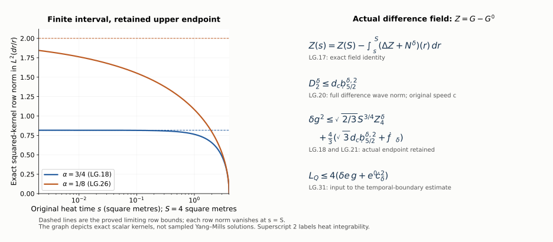

# Spatial heat-curvature differences and backward integration

This Unit 9 chapter compares the spatial heat-curvature fields of two
connections. Every product is subtracted before it is estimated.
The actual upper heat endpoint and the fractional wave norm of the
difference remain visible. The final formulas evaluate the corresponding
temporal-boundary input and the curl-free spatial coefficient.

Read [curl-free projection and backward heat integration](../classical-curlfree-backward-heat.html),
CF.1–CF.28, [the original wave norms](../classical-wave-estimates.html),
HW.26–HW.33, and [temporal differences](../classical-temporal-difference.html),
TD.1–TD.27. A prime denotes the second connection throughout.

Human-source context: Sung-Jin Oh,
[*Gauge choice for the Yang–Mills equations using the Yang–Mills heat flow
and local well-posedness in H1*, arXiv:1210.1558v2](https://arxiv.org/abs/1210.1558v2).
The proofs here use the complete linked course arguments and are
independent exposition. They make no novelty claim. Exact source
versions and bounded reading are retained in the course provenance.

## 1. Original fields, full tuples, and the actual difference inputs

Keep the notation of TD.1:
\(G_i=F_{si}^{a}\), \(G_i'=F_{si}^{a'}\),
\(F_{ij}=F_{ij}^{a}\), \(F_{ij}'=F_{ij}^{a'}\), and put

\[
Z_i=G_i-G_i',\qquad \eta_i=a_i-a_i',\qquad
\delta F_{ij}=F_{ij}-F_{ij}'.
\tag{LG.1}
\]

A prime labels the second connection. Every derivative tuple includes
all ordered spatial words and every spatial output component. Every
curvature tuple contains all nine ordered pairs, including its zero
diagonal. Matrix norms are Hilbert–Schmidt, and
\(|[X,Y]|\le2|X||Y|\). The physical variables and measures are
unchanged; the outer heat measure is \(ds/s\).

Use TD.2's actual finite coefficients \(A_0,A_1,A_0',A_1'\) and
\(\delta A_0,\delta A_1\). Thus, for \(r=0,1\),

\[
\begin{aligned}
\|\partial_x^{(r)}a_x(s)\|_{L^\infty_{t,x}}
 &\le A_rs^{-r/2-1/4},\\
\|\partial_x^{(r)}a_x'(s)\|_{L^\infty_{t,x}}
 &\le A_r's^{-r/2-1/4},\\
\|\partial_x^{(r)}\eta(s)\|_{L^\infty_{t,x}}
 &\le\delta A_rs^{-r/2-1/4}.
\end{aligned}\tag{LG.2}
\]

The individual A coefficients have their previously proved HT.26
bounds. The delta coefficients remain norms of the actual difference.
For the first connection keep the full curvature coefficient

\[
\|(F_{ij}(s))_{i,j}\|_{L^\infty_{t,x}}
 \le C_Fs^{-3/4},\qquad
C_F=\sqrt2H_Fd,\qquad
H_F=C_MC_S\sqrt{R_1R_2}.
\tag{LG.3}
\]

Here d is the first connection's conserved curvature norm. The second
connection has its own \(d'\); these energies need not agree. In
particular \(|d-d'|\) is not used as a substitute for a curvature
or heat-curvature difference norm.

For \(q=0,1,2\), define the actual full-tuple difference inputs

\[
J_q^\delta
 =\sup_{\substack{t\in I\\0<s\le S}}
          s^{(q+1)/2}\|\partial_x^{(q)}Z(t,s)\|_{L^2_x}.
\tag{LG.4}
\]

They are finite for the current regular fields. For the second
connection, HT.40 supplies the known upper coefficients

\[
J_q'=3^{(q+1)/2}d'\overline L_q^{\infty,'},\qquad
\|\partial_x^{(q)}G'(t,s)\|_{L^2_x}
 \le J_q's^{-(q+1)/2}.
\tag{LG.5}
\]

The nonnegative polynomial \(\overline L_q^{\infty,'}\) is
exactly the second connection's HT.39–HT.40 value. Thus \(J_q'\)
already includes \(d'\); no additional factor \(d'\) is to be
inserted in the next display.

## 2. The exact difference analogue of the fixed-time L4 bounds

For \(q=0,1\), put

\[
V_q^\delta=C_S^{3/4}(J_q^\delta)^{1/4}(J_{q+1}^\delta)^{3/4},
\qquad
V_q'=C_S^{3/4}(J_q')^{1/4}(J_{q+1}')^{3/4}.
\tag{LG.6}
\]

Spatial interpolation and the full-tuple Sobolev inequality give
\(\|u\|_4\le\|u\|_2^{1/4}(C_S\|\partial_xu\|_2)^{3/4}\).
Apply this to each complete ordered derivative tuple of Z or G'.
The next gradient tuple is exactly its set of all additional
ordered derivative indices. Therefore

\[
\begin{aligned}
\|\partial_x^{(q)}Z(t,s)\|_{L^4_x}
 &\le V_q^\delta s^{-q/2-7/8},\\
\|\partial_x^{(q)}G'(t,s)\|_{L^4_x}
 &\le V_q's^{-q/2-7/8},\qquad q=0,1.
\end{aligned}\tag{LG.7}
\]

The exact heat exponent is

\[
((q+1)/2)(1/4)+((q+2)/2)(3/4)=q/2+7/8.
\]

The second constant equals CF.15's \(d'\mathcal V_q'\), since
its two factors have powers adding to one. The first constant
uses actual difference tuples. Replacing it by a sum of individual
curvature bounds would lose the difference dependence, so no such
replacement is made.

## 3. Every operator and product difference in the heat equation

Subtract the two original CF.14 equations. Their entire ordinary
forcing difference is

\[
\begin{aligned}
N_i^\delta={}&2\sum_j[a_j,\partial_jZ_i]
 +2\sum_j[\eta_j,\partial_jG_i']\\
&+[\sum_j\partial_ja_j,Z_i]
 +[\sum_j\partial_j\eta_j,G_i']\\
&+\sum_j[a_j,[a_j,Z_i]]
 +\sum_j[\eta_j,[a_j,G_i']]
 +\sum_j[a_j',[\eta_j,G_i']]\\
&+2\sum_j[F_{ij},Z_j]
 +2\sum_j[\delta F_{ij},G_j'],\\
(\partial_s-\Delta)Z_i&=N_i^\delta.
\end{aligned}\tag{LG.8}
\]

For the first two lines use

\[
[a,X]-[a',X']=[a,X-X']+[a-a',X'].
\]

For the third line the exact nested identity is

\[
[a,[a,G]]-[a',[a',G']]
 =[a,[a,Z]]+[\eta,[a,G']]+[a',[\eta,G']].
\tag{LG.9}
\]

The indices in LG.8 retain the original contracted j and output i;
LG.9 states that identity at each corresponding placement. Expanding
\(a=a'+\eta\) in its right side produces all terms
\([a',[a',Z]]\), \([\eta,[a',Z]]\),
\([a',[\eta,Z]]\), \([\eta,[\eta,Z]]\),
\([\eta,[a',G']]\), \([a',[\eta,G']]\), and
\([\eta,[\eta,G']]\). Thus terms quadratic and cubic in
the difference fields are present in the exact formula, including
those retained inside a coefficient belonging to the first solution.

The complete curvature difference is

\[
\begin{aligned}
\delta F_{ij}
 & =\partial_i\eta_j-\partial_j\eta_i
       +[\eta_i,a_j]+[a_i',\eta_j]\\
 & =\partial_i\eta_j-\partial_j\eta_i
       +[\eta_i,a_j']+[a_i',\eta_j]+[\eta_i,\eta_j].
\end{aligned}\tag{LG.10}
\]

Both lines are equalities of the original matrix-valued tensors.
The zero diagonal follows from their bracket antisymmetry; the
full ordered tuple nevertheless retains those entries. In particular
the final term of LG.8 is exactly

\[
\begin{aligned}
2\sum_j[\delta F_{ij},G_j']={}&
 2\sum_j[\partial_i\eta_j,G_j']
 -2\sum_j[\partial_j\eta_i,G_j']\\
&+2\sum_j[[\eta_i,a_j],G_j']
 +2\sum_j[[a_i',\eta_j],G_j'].
\end{aligned}\tag{LG.11}
\]

The ordinary divergence term, both nested coefficient differences,
both signed curvature derivatives, and both curvature brackets all
remain in LG.8–LG.11. These equations can also be derived by the
noncommuting operator identity

\[
D_jD_j-D_j'D_j'=D_j(D_j-D_j')+(D_j-D_j')D_j',
\]

as proved in TD.14, together with
\([F,G]-[F',G']=[F,Z]+[\delta F,G']\).

## 4. A finite bound for every new ordinary heat-forcing term

Define nonnegative numerical coefficients

\[
\begin{aligned}
D_\delta^{F}={}&
 4A_0V_1^\delta+4\delta A_0V_1'
 +2\sqrt3 A_1V_0^\delta+2\sqrt3\delta A_1V_0'\\
&+4C_FV_0^\delta
 +4\delta A_1V_0'+4\delta A_1V_0',\\
E_\delta^{F}={}&
 4A_0A_0V_0^\delta
 +4\delta A_0A_0V_0'+4A_0'\delta A_0V_0'\\
&+8\delta A_0A_0V_0'+8A_0'\delta A_0V_0'.
\end{aligned}\tag{LG.12}
\]

Every summand is tied to an actual term in LG.8 or LG.11.
The first pair in D estimates the two first-order products;
the next pair estimates the two divergences. The curvature term
\(2[F_{ij},Z_j]\) uses LG.3 and costs four. The two separate
final D terms are the positive and negative derivative terms in
LG.11, each with norm coefficient four. The first three E
terms are the three nested products in LG.8, each costing four.
The last two E terms are the nested curvature differences in
LG.11, each costing eight. For the latter, for example,
\(|(\sum_j[[\eta_i,a_j],G_j'])_i|
\le4|\eta||a||G'|\), followed by its displayed coefficient two.
All contracted indices are treated by Cauchy–Schwarz in their
full tuples, so no extra component maximum is substituted.

In the D terms, the heat exponents are respectively
\(1/4+11/8\), \(3/4+7/8\), or the same latter sum for
curvature. They all equal \(13/8\). Every E term has power
\(1/4+1/4+7/8=11/8\). Hence, at each original physical time,

\[
\|N^\delta(t,s)\|_{L^4_x}
 \le D_\delta^F s^{-13/8}+E_\delta^F s^{-11/8}.
\tag{LG.13}
\]

There is a second valid bound which uses only potential coefficients
instead of the separate \(C_F\). Expand the remaining original
\(F_{ij}=\partial_i a_j-\partial_j a_i+[a_i,a_j]\) in
\(2[F_{ij},Z_j]\). In LG.12 replace the single term
\(4C_FV_0^\delta\) by the two D terms
\(4A_1V_0^\delta+4A_1V_0^\delta\), and add the E term
\(8A_0A_0V_0^\delta\). Call the resulting complete nonnegative
expressions \(D_\delta^a,E_\delta^a\). Equivalently, their
full formulas are

\[
\begin{aligned}
D_\delta^{a}={}&
 4A_0V_1^\delta+4\delta A_0V_1'
 +2\sqrt3 A_1V_0^\delta+2\sqrt3\delta A_1V_0'\\
&+4A_1V_0^\delta+4A_1V_0^\delta
 +4\delta A_1V_0'+4\delta A_1V_0',\\
E_\delta^{a}={}&
 4A_0A_0V_0^\delta+8A_0A_0V_0^\delta\\
&+4\delta A_0A_0V_0'+4A_0'\delta A_0V_0'
 +8\delta A_0A_0V_0'+8A_0'\delta A_0V_0'.
\end{aligned}\tag{LG.14}
\]

The added derivative and nested terms retain the entire unprimed
curvature. Formula LG.13 holds with this second pair as well.
No ordering between these two valid estimates is assumed.

After multiplication by \(s^{7/4}\), the residual powers are
\(s^{1/8}\) and \(s^{3/8}\). Their exact squared heat integrals
are \(4S^{1/4}\) and \((4/3)S^{3/4}\). Physical-time
integration contributes \(|I|^{1/4}\). Thus put

\[
\begin{aligned}
\mathcal N_\delta^F
 &=|I|^{1/4}\left(2D_\delta^F S^{1/8}
                      +\frac2{\sqrt3}E_\delta^F S^{3/8}\right),\\
\mathcal N_\delta^a
 &=|I|^{1/4}\left(2D_\delta^a S^{1/8}
                      +\frac2{\sqrt3}E_\delta^a S^{3/8}\right),\\
\mathcal N_\delta&=\min\{\mathcal N_\delta^F,\mathcal N_\delta^a\},\\
\|s^{7/4}\|N^\delta(s)\|_{L^4_{t,x}}\|_{L^2(ds/s)}
 &\le\mathcal N_\delta.
\end{aligned}\tag{LG.15}
\]

Minkowski first gives each complete expression separately; the
minimum then combines two proved bounds. Every term vanishes when
the actual difference inputs \(\delta A_0,\delta A_1,J_0^\delta,
J_1^\delta,J_2^\delta\) vanish. This property would be lost by
estimating the difference forcing solely by the sum of the two
individual forcing bounds.

## 5. The actual finite endpoint and the original backward operator

Keep the actual endpoint difference, and define the original
weighted norms

\[
\begin{aligned}
Z_4^\delta&=\|Z(S)\|_{L^4_{t,x}},\\
\delta g^p&=\|s^{3/4}\|Z(s)\|_{L^4_{t,x}}\|_{L^p(ds/s)},
                              &&p=2,\infty,\\
D_j^\delta&=\|s^{j/2+3/4}\|\partial_x^{(j)}Z(s)\|_{L^4_{t,x}}
                              \|_{L^2(ds/s)},&&j=1,2.
\end{aligned}\tag{LG.16}
\]

In particular \(\delta g^2\) is exactly TD.3's \(\delta g\).
The superscripts p label heat integrability exponents, rather than
powers of the number \(\delta g\). LG.7 gives the optional
actual-difference upper bound
\(Z_4^\delta\le|I|^{1/4}V_0^\delta S^{-7/8}\), but the
primary formula below retains the actual endpoint \(Z_4^\delta\).

The exact equation LG.8 gives

\[
Z(s)=Z(S)-\int_s^S(\Delta Z(r)+N^\delta(r))\,dr.
\tag{LG.17}
\]

For \(\alpha>0\) retain the original finite operator
\((T_\alpha f)(s)=\int_s^S(s/r)^\alpha f(r)dr/r\).
Its row integral is \((1-(s/S)^\alpha)/\alpha\), its full
column integral is \(1/\alpha\), and the integral of its
squared row is \((1-(s/S)^{2\alpha})/(2\alpha)\).
Cauchy–Schwarz with the nonnegative kernel followed by Tonelli
therefore gives its \(L^2\)-to-\(L^2\) bound \(1/\alpha\).
Cauchy–Schwarz with the squared kernel gives the
\(L^2\)-to-supremum bound \(1/\sqrt{2\alpha}\).
These proofs act on the physical norm after Minkowski; neither
physical-time nor heat supremum is moved through an integral.

For \(\alpha=3/4\), the weighted integrands in LG.17 are
\(r^{7/4}\|\Delta Z(r)\|_4\) and
\(r^{7/4}\|N^\delta(r)\|_4\). The full ordinary Laplacian
has norm at most \(\sqrt3\|\partial_x^{(2)}Z\|_4\), by
Cauchy–Schwarz over its three diagonal derivative entries.
The exact endpoint scalar norm is
\(\|s^{3/4}\|_{L^2(ds/s)}=\sqrt{2/3}S^{3/4}\).
Consequently

\[
\begin{aligned}
\delta g^2
 &\le\sqrt{2/3}S^{3/4}Z_4^\delta
           +\frac43(\sqrt3D_2^\delta+\mathcal N_\delta),\\
\delta g^\infty
 &\le S^{3/4}Z_4^\delta
           +\sqrt{2/3}(\sqrt3D_2^\delta+\mathcal N_\delta).
\end{aligned}\tag{LG.18}
\]

Both finite endpoints of LG.17 are retained. No inverse heat
propagator or bound on an unweighted zero-heat derivative is used.

## 6. The correct fractional wave norms are norms of the difference field

For every real \(k\ge1\), define

\[
\mathcal F_k^{\delta,p}
 =\|s^{(k+1)/2}\|Z(s)\|_{\mathsf S_c^k(I)}\|_{L^p(ds/s)},
 \qquad p=2,\infty.
\tag{LG.19}
\]

The norm is HW.26's full energy supremum plus its original
\(c|I|^{1/2}\||D|^{k-1}\Box_cZ\|_{L^2_{t,x}}\) term.
In particular \(\Box_cZ=\Box_cG-\Box_cG'\) is retained.
LG.19 is not the numerical difference of the two individual wave
norms. The original physical derivative in its energy is
\(c^{-1}\partial_tZ\); the spatial derivatives remain unaltered.

Apply HW.33 to Z with integer k equal to two and one, respectively.
Its full derivative tuple includes each required spatial tuple.
HW.32 interpolates the two adjacent full wave norms at each heat
time. Heat Hölder then gives

\[
\begin{aligned}
D_2^\delta&\le d_c\mathcal F_{5/2}^{\delta,2}
 \le d_c\sqrt{\mathcal F_2^{\delta,2}\mathcal F_3^{\delta,2}},\\
D_1^\delta&\le d_c\mathcal F_{3/2}^{\delta,2}
 \le d_c\sqrt{\mathcal F_1^{\delta,2}\mathcal F_2^{\delta,2}},\\
d_c&=\sqrt2(2\pi c)^{-1/4}.
\end{aligned}\tag{LG.20}
\]

The exact weights are \(s^{7/4}\) for the first line and
\(s^{5/4}\) for the second; they are the geometric means of
the adjacent complete wave weights. In particular the Hessian
in LG.17 requires order \(5/2\) of the difference wave norm.
There is no additional derivative on that receiver.

Define the finite expressions

\[
\begin{aligned}
\mathcal G_\delta^2
 &=\sqrt{2/3}S^{3/4}Z_4^\delta
     +\frac43\left(\sqrt3d_c\mathcal F_{5/2}^{\delta,2}
                                      +\mathcal N_\delta\right),\\
\mathcal G_\delta^\infty
 &=S^{3/4}Z_4^\delta
     +\sqrt{2/3}\left(\sqrt3d_c\mathcal F_{5/2}^{\delta,2}
                                      +\mathcal N_\delta\right),\\
\delta g^p&\le\mathcal G_\delta^p,\qquad p=2,\infty.
\end{aligned}\tag{LG.21}
\]

Their fractional input can equivalently be bounded by the last
quantity in LG.20. All actual endpoint and heat-forcing differences
remain. At every occurrence, \(\mathcal G_\delta^2\) denotes the
bound for heat exponent two, not its square.

Two of the fixed-time difference inputs can also be related to
the existing difference wave quantities without adding any higher
wave order. For \(q=1,2\), the spatial energy inclusion gives

\[
J_q^\delta\le\mathcal F_q^{\delta,\infty},\qquad
\begin{aligned}
V_0^\delta&\le C_S^{3/4}(J_0^\delta)^{1/4}
                        (\mathcal F_1^{\delta,\infty})^{3/4},\\
V_1^\delta&\le C_S^{3/4}(\mathcal F_1^{\delta,\infty})^{1/4}
                        (\mathcal F_2^{\delta,\infty})^{3/4}.
\end{aligned}\tag{LG.22}
\]

Both suprema here are ordinary joint suprema over t and s, so
their order can be exchanged without an integral inequality.
The zero-order weighted spatial L2 input \(J_0^\delta\) is
retained explicitly. No estimate of the undifferentiated spatial
L2 field by only its homogeneous gradient norm is asserted.

## 7. The corresponding potential difference in L4 time and supremum space

The two caloric equations \(\partial_sa_x=G\) and
\(\partial_sa_x'=G'\) give exactly

\[
\eta(s)=\eta(S)-\int_s^S Z(r)dr.
\tag{LG.23}
\]

Keep the actual endpoint quantity
\(Z_A^\delta=\|\eta(S)\|_{L^4_tL^\infty_x}\).
It is finite for the current fields and is bounded by
\(|I|^{1/4}\|\eta(S)\|_{L^\infty_{t,x}}\), if that actual
endpoint difference norm is more convenient. An individual
endpoint polynomial sum is not substituted for the difference.

The exact CF.25 Morrey inequality applied to the actual Z is

\[
\begin{aligned}
\|Z(s)\|_{L^4_tL^\infty_x}
 &\le C_4^{\rm Mor}\|Z(s)\|_{L^4_{t,x}}^{1/4}
                        \|\partial_xZ(s)\|_{L^4_{t,x}}^{3/4},\\
C_4^{\rm Mor}
 &=4\,3^{-3/4}\left(\frac3{4\pi}\right)^{1/16}
                 \left(\frac{(12\pi)^{3/4}}{4\pi}\right)^{3/4}.
\end{aligned}\tag{LG.24}
\]

For completeness, CF.24's full ball identity has kernel
\((4\pi)^{-1}(|z|^{-2}-|z|/R^3)z/|z|\), whose two terms
remain in the identity. Bounding its positive magnitude by
\((4\pi|z|^2)^{-1}\) and minimizing

\[
(3/(4\pi))^{1/4}R^{-3/4}\|Z\|_4
+((12\pi)^{3/4}/(4\pi))R^{1/4}\|\partial Z\|_4
\]

gives the displayed constant. The zero-norm cases give the
zero spatial L4 field. Apply that inequality at each physical
time and then Hölder in dt with exponents four and four-thirds;
this proves the first line of LG.24 on the full vector.

The exact weight identity
\((3/4)(1/4)+(5/4)(3/4)=9/8\), followed by the same
Hölder exponents in the squared heat norm, gives

\[
\|s^{9/8}\|Z(s)\|_{L^4_tL^\infty_x}\|_{L^2(ds/s)}
 \le C_4^{\rm Mor}(\delta g^2)^{1/4}(D_1^\delta)^{3/4}.
\tag{LG.25}
\]

The superscript 2 on \(\delta g^2\) again labels the heat norm.
Apply the finite backward operator to LG.23 with \(\alpha=1/8\).
Its exact \(L^2\)-to-supremum constant is
\((2\alpha)^{-1/2}=2\). Thus

\[
\begin{aligned}
\delta A_4&:=\sup_{0<s\le S}s^{1/8}
                       \|\eta(s)\|_{L^4_tL^\infty_x},\\
\delta A_4
 &\le S^{1/8}Z_A^\delta
       +2C_4^{\rm Mor}(\delta g^2)^{1/4}(D_1^\delta)^{3/4}\\
 &\le\mathcal A_\delta:=S^{1/8}Z_A^\delta
       +2C_4^{\rm Mor}(\mathcal G_\delta^2)^{1/4}
                    (d_c\mathcal F_{3/2}^{\delta,2})^{3/4}.
\end{aligned}\tag{LG.26}
\]

Both endpoints of the original potential difference remain in
LG.23. The norm \(\delta A_4\) is a weighted \(L^4_tL^\infty_x\)
quantity. It is distinct from TD.2's \(\delta A_0\), which
uses \(L^\infty_{t,x}\) and weight \(s^{1/4}\); LG.26 does
not identify them or substitute one for the other.

## 8. The complete curl-free coefficient difference

Let \(B(s)=a(s)-a(S)\), \(B'(s)=a'(s)-a'(S)\). Their
difference \(\delta B(s)=\eta(s)-\eta(S)\) is an actual
spatial L2 vector for every \(s>0\), by its finite positive-heat
integral of Z. The two original covariant divergence equations
give, with the signs from CF.5,

\[
\operatorname{div}\delta B(s)
 =\int_s^S\sum_j\bigl([\eta_j(r),G_j(r)]
                         +[a_j'(r),Z_j(r)]\bigr)dr.
\tag{LG.27}
\]

This is the exact bracket difference, including the product
\([\eta,Z]\) inside the first term. Define the actual norms

\[
\begin{aligned}
G_2&=\left(\int_0^S\|G(s)\|_{L^2_{t,x}}^2ds\right)^{1/2},\\
\delta G_2&=\left(\int_0^S\|Z(s)\|_{L^2_{t,x}}^2ds\right)^{1/2},\\
A_4'&=\sup_s s^{1/8}\|a'(s)\|_{L^4_tL^\infty_x}.
\end{aligned}\tag{LG.28}
\]

The individual \(G_2\) and \(A_4'\) have the existing CF.7
and CF.28 bounds. The actual \(\delta G_2\) is retained; it
is not inferred from \(J_0^\delta\), whose supremum alone
would leave the divergent heat integral \(\int_0^S ds/s\).

Minkowski, physical Hölder and heat Cauchy–Schwarz, in that order,
give the full two bounds

\[
\begin{aligned}
\sup_s\|\operatorname{div}\delta B(s)\|_{L^2_tL^2_x}
 &\le C_2^\delta:=2\sqrt2S^{1/4}
                    (\delta A_0G_2+A_0'\delta G_2),\\
\sup_s\|\operatorname{div}\delta B(s)\|_{L^2_tL^4_x}
 &\le C_4^\delta:=4S^{1/8}
                    (\mathcal A_\delta g+A_4'\mathcal G_\delta^2).
\end{aligned}\tag{LG.29}
\]

For the first line, after using \(r^{-1/4}\) from either
coefficient, the remaining scalar factor in \(dr/r\) is
\(r^{1/4}\), whose L2 norm is \(\sqrt2S^{1/4}\).
For the second, both factors have L4 in physical time and
the remaining heat power is \(r^{1-1/8-3/4}=r^{1/8}\),
whose L2 norm is \(2S^{1/8}\). Every bracket contributes two.
Use LG.21 and LG.26 only after these exact product estimates.

CF.1–CF.4 proves the actual inverse-Laplacian map on this
L2 difference vector, so also

\[
\sup_s\|P_{\rm cf}\delta B(s)\|_{L^2_tL^\infty_x}
 \le K_*(C_2^\delta)^{1/3}(C_4^\delta)^{2/3},\qquad
K_*=\frac{3\sqrt3}{2^{4/3}\pi^{1/3}}.
\tag{LG.30}
\]

The sign of the operator remains
\(P_{\rm cf}=\nabla\Delta^{-1}\operatorname{div}\). Its
Newton gradient kernel is \(x/(4\pi|x|^3)\). The original
L2 domain identifies the projected field and introduces no
constant or polynomial potential. Thus LG.27–LG.30 is an
actual difference extension of the final curl-free input in
CF.28, with its additional difference integral explicitly named.

## 9. Insert the proved lowest difference norm into TD

Keep all TD individual inputs and \(\delta e\) unchanged.
TD.9's only occurrence of the actual lowest difference g is
\(L_Q=4(\delta e\,g+e'\delta g)\), where its
\(\delta g\) equals LG.16's \(\delta g^2\). The result
LG.21 therefore proves the replacement

\[
\widetilde L_Q=4(\delta e\,g+e'\mathcal G_\delta^2),
\qquad L_Q\le\widetilde L_Q.
\tag{LG.31}
\]

For full explicitness, the resulting TD constants are

\[
\begin{aligned}
\widetilde L_H&=L_\eta+\widetilde L_Q,\\
\widetilde R_*&=2\sqrt2\delta A_0S^{1/4}B_D'+\widetilde L_Q,\\
\widetilde L_V&=\min\{\widetilde L_H,
             \widetilde R_*+\sqrt{\widetilde R_*^2+F_*^2}\},\\
\widetilde B_V&=(1+2\sqrt2 A_0S^{1/4})\widetilde L_V,\\
\widetilde L_N^\delta&=4\sqrt2 A_0S^{1/4}\widetilde B_V
 +(8\sqrt3 A_1S^{1/4}+8A_0^2\sqrt S)\widetilde L_V
 +\widetilde L_H,\\
\widetilde D_\delta&=\sqrt S\,\widetilde B_V,\qquad
\widetilde H_\delta=\widetilde L_V+\widetilde L_N^\delta.
\end{aligned}\tag{LG.32}
\]

Here \(L_\eta,F_*,B_D'\) are exactly TD.11, TD.16 and
TD.4. Every operation is nondecreasing in \(L_Q\), including
the minimum of its two increasing bounds. Consequently
TD.25–TD.27 remain proved with
\(D_\delta,H_\delta\) replaced by
\(\widetilde D_\delta,\widetilde H_\delta\). This is the
requested actual application to the temporal-boundary difference,
rather than a prospective substitution.

The quantities newly exposed on the right are the actual endpoint
\(Z_4^\delta\), the difference wave norm
\(\mathcal F_{5/2}^{\delta,2}\), the fixed-time difference
tuples in LG.4, and \(\delta A_0,\delta A_1\). Formula LG.22
can replace the positive-order fixed-time tuples by existing
difference wave supremum quantities. The remaining
\(J_0^\delta\), endpoint and spatial-coefficient differences,
and the electric difference input \(\delta e\), still need
their nonlinear initial-data estimates in the next calculation.
They have not been assumed bounded by an initial-data distance.

## 10. Worked example: the finite backward kernels

For the original heat endpoint \(S=4\,\mathrm m^2\), the two
operators used above have exponents \(\alpha=3/4\) and \(\alpha=1/8\).
Their squared-kernel row norms are exactly

\[
 \left(\int_s^S(s/r)^{2\alpha}\frac{dr}{r}\right)^{1/2}
 =\sqrt{\frac{1-(s/S)^{2\alpha}}{2\alpha}}.
\]

At the upper endpoint both are zero. Their limits as \(s\downarrow0\)
are \(\sqrt{2/3}\) and \(2\), respectively. The endpoint term
in LG.17 remains even though the integral vanishes at \(s=S\).

*Figure: LG.17–LG.21 and LG.26–LG.31. The original heat time is shown;
the lower plotting limit is a viewing choice. Every proof retains
\(0<s\le S\). The displayed superscript two labels heat integrability.
Reproducible source:* [figure builder](../build/figures_f09_spatial_difference.py).

## 11. Exercises with full solutions

### Exercise 1. The full interpolated heat exponent

Derive LG.7 from LG.4 and LG.6.

**Solution.** The spatial interpolation has powers \(1/4\) and \(3/4\)
on the undifferentiated and once-differentiated tuple. Their heat
exponents add to

\[
((q+1)/2)(1/4)+((q+2)/2)(3/4)=q/2+7/8.
\]

The remaining coefficient is
\(C_S^{3/4}(J_q^\delta)^{1/4}(J_{q+1}^\delta)^{3/4}\).
Every additional derivative is in the same full ordered tuple.

### Exercise 2. Count all nested difference products

Expand LG.9 completely around \(a'\) and \(G'\).

**Solution.** Substituting \(a=a'+\eta\) into its three terms gives
\([a',[a',Z]]\), \([\eta,[a',Z]]\), \([a',[\eta,Z]]\),
\([\eta,[\eta,Z]]\), \([\eta,[a',G']]\),
\([a',[\eta,G']]\), and \([\eta,[\eta,G']]\).
All seven terms retain their matrix order. The terms quadratic and
cubic in differences were already present before this expansion.

### Exercise 3. Recover the two forcing integrals

Compute the heat norms of \(s^{1/8}\) and \(s^{3/8}\).

**Solution.** The squared integrals are
\(\int_0^Ss^{1/4}ds/s=4S^{1/4}\) and
\(\int_0^Ss^{3/4}ds/s=(4/3)S^{3/4}\).
Taking their roots gives \(2S^{1/8}\) and
\(2S^{3/8}/\sqrt3\). Physical-time integration of a uniform
spatial bound adds \(|I|^{1/4}\), yielding both complete
terms of LG.15.

### Exercise 4. The original endpoint norm

Compute the contribution of \(Z(S)\) in LG.18 for both heat exponents.

**Solution.** Its coefficient is \(s^{3/4}Z_4^\delta\).
The squared heat integral of \(s^{3/4}\) is
\((2/3)S^{3/2}\), giving \(\sqrt{2/3}S^{3/4}Z_4^\delta\).
The supremum is \(S^{3/4}Z_4^\delta\).
Both coefficients come from the same actual endpoint field.

### Exercise 5. The Hessian's correct wave order

Why does LG.20 use \(\mathcal F_{5/2}^{\delta,2}\)?

**Solution.** HW.33 bounds the full second spatial derivative in
\(L^4_{t,x}\) by \(d_c\) times the order-\(5/2\) wave norm.
Its heat weight is \(s^{(5/2+1)/2}=s^{7/4}\), exactly
the Hessian weight in LG.17–LG.18.
The adjacent integer weights \(s^{3/2}\) and \(s^2\)
have that geometric mean. Their full wave interpolation and heat
Hölder give the final bound in LG.20, including the original forcing.

### Exercise 6. A supremum does not supply the borderline integral

For a fixed nonzero \(L^2_x\) tuple \(v\), test the scalar profiles
\(Z_\varepsilon(s)=(s+\varepsilon)^{-1/2}v\), \(\varepsilon>0\).

**Solution.** Their weighted supremum is at most \(\|v\|_2\),
because \(s/(s+\varepsilon)\le1\). Their unweighted squared heat
integral equals
\(\|v\|_2^2\log((S+\varepsilon)/\varepsilon)\), which tends
to infinity as \(\varepsilon\downarrow0\).
Every profile is regular at heat time zero. Thus the supremum alone
cannot bound that integral uniformly. This tests a norm implication,
not the Yang–Mills equations, and explains why LG.28 retains
\(\delta G_2\).

### Exercise 7. Derive the potential difference weight

Verify the exponents in LG.25–LG.26.

**Solution.** The Morrey product gives
\((3/4)(1/4)+(5/4)(3/4)=9/8\).
In \(\eta(s)=\eta(S)-\int_s^SZ(r)dr\), multiplication
by \(s^{1/8}\) therefore uses the backward kernel with
\(\alpha=1/8\) and its weighted input \(r^{9/8}Z(r)\).
The squared-kernel bound is \((2\alpha)^{-1/2}=2\).
Together with the original endpoint this is LG.26 exactly.

### Exercise 8. Insert the result without changing the norm

Derive LG.31 from TD.9.

**Solution.** TD.9 uses the actual
\(\delta g=\|s^{3/4}\|Z(s)\|_{L^4_{t,x}}\|_{L^2(ds/s)}\).
This is LG.16's \(\delta g^2\), where the superscript labels
the heat exponent. LG.21 bounds it by \(\mathcal G_\delta^2\).
The remaining factors in \(4(\delta e\,g+e'\delta g)\)
are nonnegative, so substitution gives LG.31. Every expression in
LG.32 then follows by the stated nondecreasing operations.
