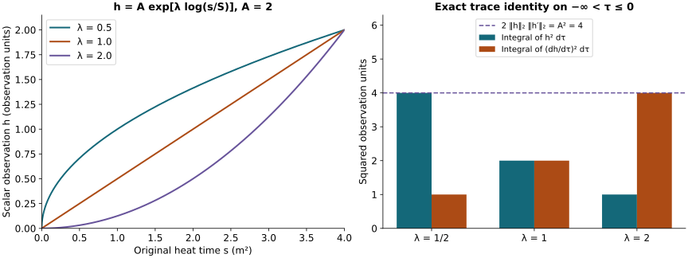

# Spatial smoothing and all differentiated coefficients

This analytic chapter belongs to Unit 9. Differentiating the wave
equation appears to demand successively higher wave norms. Positive
heat time provides a way to estimate those derivatives from the lowest
heat-curvature norm. This chapter proves every part of that reduction.

Read [electric smoothing](../classical-electric-smoothing.html),
ES.1–ES.29, [wave interactions](../classical-wave-interactions.html),
PI.1–PI.12, and [backward heat bounds](../classical-curlfree-backward-heat.html),
CF.14–CF.28. The fixed coefficients and actual endpoint polynomials
come from [fixed-time estimates](../classical-fixed-time-estimates.html),
HT.24–HT.40, and [potential estimates](../classical-potential-estimates.html),
HP.18–HP.28. Every construction below is finite for a specified
derivative order; no uniform bound as the order tends to infinity is asserted.

Human-source credit: Sung-Jin Oh,
[*Gauge choice for the Yang–Mills equations using the Yang–Mills heat flow
and local well-posedness in H1*, arXiv:1210.1558v2](https://arxiv.org/abs/1210.1558v2).
This is independent exposition of the complete receiving arguments. It
makes no novelty claim. Exact author-source and local-provider reading
coverage is retained in the course provenance.

The result is the all-order estimate HS.29 below. Every term with a
positive derivative on the potential is bounded from the single actual
quantity \(g=G_4^2\), the previously proved fixed-time coefficients, and
the actual heat-endpoint data. The undifferentiated principal interaction
keeps its full coefficient and its receiving wave norm. The heat
supremum \(G_4^\infty\) is also bounded by \(g\), with an explicit
coefficient in HS.15. No closed estimate for \(g\), or for the remaining
principal coefficient, is assumed.

## 1. Original objects, coefficient inputs, and all derivative words

Keep \(I=[t_-,t_+]\), \(t_*\in I\), \(S>0\), and the original speed
\(c>0\). The physical measures are \(dt\,d^3x\), and the outer heat
measure is \(ds/s\). Put \(G_i=F_{si}\), \(a_s=0\), and
\(D_j=\partial_j+[a_j,\cdot]\). All matrix norms are Hilbert–Schmidt,
with the proved bound \(|[X,Y]|\le2|X||Y|\). A derivative word
\(I_k=(i_1,\ldots,i_k)\) ranges over \(\{1,2,3\}^k\). Every tuple
\(\partial^{(k)}a\) or \(\partial^{(k)}G\) includes every ordered word
and every output component. The curvature tuple \((F_{ij})_{i,j}\)
contains all nine ordered pairs, including the zero diagonal.

Write \(P_k^{\rm pos}=\{1,\ldots,k\}\). For a subset of these
positions, its subword keeps the inherited order. Subsets of positions,
rather than sets of index values, implement the Leibniz rule even when
spatial indices coincide.

The existing HT.26–HT.27, HT.40, and ST.26 bounds give

\[
\begin{aligned}
A_l(s)&:=\|\partial^{(l)}a(s)\|_{L^\infty_{t,x}}
                  \le U_l s^{-l/2-1/4},\\
F_l(s)&:=\|\partial^{(l)}(F_{ij})(s)\|_{L^\infty_{t,x}}
                  \le C_l^F s^{-l/2-3/4},\\
U_l&=3^{(l+1)/2}\overline M_l,\\
C_l^F&=\sqrt2\,3^{l/2}d\,
 b_l\bigl((S^{1/4}\overline M_h)_{h<l};
                     (H_r^F)_{r\le l}\bigr),\\
H_r^F&=C_MC_S\sqrt{R_{r+1}R_{r+2}}.
\end{aligned}\tag{HS.1}
\]

Here \(\overline M_l\) is the supremum of the actual HT.26 polynomial
on \(I\). The complete reverse-expansion polynomial is

\[
b_0=y_0,\qquad
b_{k+1}=\sum_{h=0}^{k-1}x_{h+1}\frac{\partial b_k}{\partial x_h}
 +\sum_{r=0}^{k}(y_{r+1}+2x_0y_r)
                         \frac{\partial b_k}{\partial y_r}.
\tag{HS.2}
\]

It comes from the exact signed rules
\(\partial_jD_JT=D_jD_JT-[a_j,D_JT]\) and the ordinary derivative
rule at every potential leaf and bracket. No covariant derivatives
are commuted. Its nonnegative coefficients retain the absolute value
of every signed contribution. In particular
\(C_0^F=\sqrt2 C_MC_S\sqrt{R_1R_2}\,d\).

Define the actual heat norms

\[
\begin{aligned}
X_k(s)&=\|\partial^{(k)}G(s)\|_{L^4_{t,x}},\\
g^p&=\|s^{3/4}X_0(s)\|_{L^p(ds/s)},\qquad
g=g^2,\\
Y_k^p&=\|s^{k/2+3/4}X_k(s)\|_{L^p(ds/s)},
\qquad p=2,\infty.
\end{aligned}\tag{HS.3}
\]

Finiteness on every closed positive heat interval follows independently
of the estimates to be proved: HT.40 gives the full ordinary spatial
\(L^2\) derivatives, and Sobolev applied to the next derivative gives
the \(L^6\) bound. Thus
\(\|\partial^{(k)}G\|_4\le
\|\partial^{(k)}G\|_2^{1/4}
(C_S\|\partial^{(k+1)}G\|_2)^{3/4}\), as in CF.15.
The current regular solution through heat time zero also has finite
\(g\). This is finiteness for that solution, not a claimed bound by
energy alone. All subsequent constants are computed from the inputs
displayed here.

## 2. The entire heat equation and its finite smoothing proof

CF.14 is the exact equation

\[
\begin{aligned}
(\partial_s-\Delta)G_i={}&2\sum_j[a_j,\partial_jG_i]
 +\left[\sum_j\partial_ja_j,G_i\right]
 +\sum_j[a_j,[a_j,G_i]]+2\sum_j[F_{ij},G_j],\\
F_{ij}&=\partial_i a_j-\partial_j a_i+[a_i,a_j].
\end{aligned}\tag{HS.4}
\]

It follows from
\((D_s-\sum_jD_jD_j)F_{si}=-2\sum_j[F_{sj},F_{ij}]\)
and bracket antisymmetry. This is the identical linear system in its
displayed curvature variable as ES.5–ES.6, with the identical actual
coefficients \(a_j,F_{ij}\). The change of the final tensor from
\(F_{ti}\) to \(F_{si}\) adds no factor of \(c\). The original fields
themselves have not been identified.

For every ordered word, the complete differentiated forcing is

\[
\begin{aligned}
N_{I_k,i}={}&2\sum_j\sum_{J\subseteq P_k^{\rm pos}}
 [\partial_{I_J}a_j,\partial_{I_{J^c}}\partial_jG_i]\\
&+\sum_{J\subseteq P_k^{\rm pos}}
 [\sum_j\partial_{I_J}\partial_ja_j,\partial_{I_{J^c}}G_i]\\
&+\sum_j\sum_{J_1\sqcup J_2\sqcup J_3=P_k^{\rm pos}}
 [\partial_{I_{J_1}}a_j,
          [\partial_{I_{J_2}}a_j,\partial_{I_{J_3}}G_i]]\\
&+2\sum_j\sum_{J\subseteq P_k^{\rm pos}}
 [\partial_{I_J}F_{ij},\partial_{I_{J^c}}G_j].
\end{aligned}\tag{HS.5}
\]

The three slots of a partition are ordered. Let \(N_k\) be the full
tuple in HS.5. For each fixed subset the map from the original word
to its subwords is a bijection onto their Cartesian product. The
square-sum norm of a tensor product therefore factors exactly.
Cauchy–Schwarz in \(j\), the bracket bound, and Hölder give

\[
\begin{aligned}
\|N_k(s)\|_4\le{}&4A_0X_{k+1}
 +4\sum_{l=1}^k{k\choose l}A_lX_{k-l+1}\\
&+2\sqrt3\sum_{l=0}^k{k\choose l}A_{l+1}X_{k-l}\\
&+4\sum_{r+h+n=k}\frac{k!}{r!h!n!}A_rA_hX_n
 +4\sum_{l=0}^k{k\choose l}F_lX_{k-l}.
\end{aligned}\tag{HS.6}
\]

All factors in this display are evaluated at \(s\). The divergence
cost is exactly the bound
\(|\sum_j\partial_ja_j|\le\sqrt3|\partial a|\). Two nested
brackets cost four. The last contraction satisfies
\(|(\sum_j[F_{ij},G_j])_i|\le2|(F_{ij})_{i,j}||G|\),
with the additional coefficient two from HS.4. In particular the
\(l=1\) first-order coefficient terms act on order \(k\) of \(G\)
and have all \(k\) derivative placements.

For completeness, the constants from ES.19 and their finite
construction are reproduced. For fixed target \(s\), on \([s/2,s]\)
put

\[
a_l^*=2^{l/2+1/4}U_l,\qquad
f_l^*=2^{l/2+3/4}C_l^F,\qquad b=4a_0^*S^{1/4},
\tag{HS.7}
\]

and, for each integer \(m\ge0\), put

\[
\begin{aligned}
c_m={}&4S^{1/4}\sum_{k=1}^m\sum_{l=1}^k{k\choose l}a_l^*\\
&+2\sqrt3S^{1/4}\sum_{k=0}^m\sum_{l=0}^k{k\choose l}a_{l+1}^*\\
&+4\sqrt S\sum_{k=0}^m\sum_{r+h+n=k}
                      \frac{k!}{r!h!n!}a_r^*a_h^*\\
&+4S^{1/4}\sum_{k=0}^m\sum_{l=0}^k{k\choose l}f_l^*.
\end{aligned}\tag{HS.8}
\]

The empty sums vanish. Each added slice is nonnegative, so \(c_m\)
is nondecreasing. The weighted sums of the original norms
\(J_m(r)=\sum_{k=0}^m s^{k/2}X_k(r)\) and
\(L_m(r)=\sum_{k=0}^m s^{k/2}X_{k+1}(r)\) satisfy

\[
\sum_{k=0}^m s^{k/2}\|N_k(r)\|_4
 \le 4a_0^*s^{-1/4}L_m(r)+(c_m/s)J_m(r).
\tag{HS.9}
\]

Indeed the remaining heat exponents are \(-3/4\) for the
differentiated first-order, divergence, and curvature coefficients,
and \(-1/2\) for the double bracket. Their bounds are
\(s^{-3/4}\le S^{1/4}s^{-1}\) and
\(s^{-1/2}\le\sqrt S\,s^{-1}\). The order \(k-l+1\) is at most
\(m\) in every term with \(l\ge1\).

The original three-dimensional kernel
\(K_h(x)=(4\pi h)^{-3/2}\exp(-|x|^2/(4h))\) has mass one and
\(\|\nabla K_h\|_{L^1_x}=\kappa_1h^{-1/2}\),
\(\kappa_1=2/\sqrt\pi\). The latter follows by radial integration:

\[
(4\pi/(2h))(4\pi h)^{-3/2}
\int_0^\infty\rho^3e^{-\rho^2/(4h)}d\rho
=(4\pi/(2h))(4\pi h)^{-3/2}(8h^2).
\]

Minkowski in the original physical variables proves the corresponding
\(L^4_{t,x}\) convolution bounds, including all output components.

On any slab \([r_0,r_0+h]\subseteq[s/2,s]\), the exact Duhamel
identity follows by differentiating
\(K_{\tau-\rho}*_x\partial^{(k)}G(r_0+\rho)\) and integrating
in \(\rho\); truncate before \(\rho=\tau\) and pass by strong
continuity. Positive-heat regularity established above justifies
the limit and the gradient, whose kernel singularity is integrable.
For

\[
M=\sup_{0\le\tau\le h}J_m(r_0+\tau)
+\sup_{0<\tau\le h}\sqrt\tau L_m(r_0+\tau),
\]

 this gives

\[
M\le(1+\kappa_1)J_m(r_0)
 +\left((2+\pi\kappa_1)4a_0^*s^{-1/4}\sqrt h
              +(1+2\kappa_1)(c_m/s)h\right)M.
\tag{HS.10}
\]

The four exact integrals are
\(\int_0^\tau\rho^{-1/2}d\rho=2\sqrt\tau\),
\(\int_0^\tau d\rho=\tau\),
\(\sqrt\tau\int_0^\tau(\tau-\rho)^{-1/2}\rho^{-1/2}d\rho
=\pi\sqrt\tau\), and
\(\sqrt\tau\int_0^\tau(\tau-\rho)^{-1/2}d\rho=2\tau\).
The gradient contributes \(\kappa_1\) to the last two.

For desired order \(q\ge0\), keep exactly the ES constants

\[
\begin{aligned}
m_*&=\max(q-1,0),& K&=2(1+\kappa_1),\\
\alpha&=2+\pi\kappa_1,&\beta&=1+2\kappa_1,\\
N_q&=\max\{1,q,\lceil8\alpha^2b^2\rceil,
                         \lceil2\beta c_{m_*}\rceil\},\\
S_q&=K^{N_q}(2N_q)^{q/2}.
\end{aligned}\tag{HS.11}
\]

On the \(N_q\) slabs of length \(h=s/(2N_q)\), the coefficient
of \(M\) in HS.10 is at most
\(\alpha b/\sqrt{2N_q}+\beta c_{m_*}/(2N_q)\le1/4+1/4\).
Thus \(M\le KJ_m(r_0)\). On the first \(N_q-q\) slabs propagate
\(J_0\) with factor \(K\). On each remaining slab increase the
order from \(m\) to \(m+1\), using

\[
J_{m+1}(r_0+h)\le J_m(r_0+h)+\sqrt s L_m(r_0+h)
\le\sqrt{2N_q}M.
\]

 All incoming orders are at most \(m_*\).
Multiplication of the finite factors proves

\[
X_q(s)\le S_qs^{-q/2}X_0(s/2),\qquad
Y_q^p\le2^{3/4}S_qg^p\quad(p=2,\infty).
\tag{HS.12}
\]

For the second assertion multiply the first by \(s^{q/2+3/4}\)
and substitute \(r=s/2\) in the outer heat norm. Its interval is
exactly \((0,S/2]\); enlargement to \((0,S]\) gives the bound.
The factor is \(2^{3/4}\), which differs from the electric
\(2^{1/4}\) because the original heat-curvature weight differs.
For \(q=0\) retain the stronger identity \(Y_0^p=g^p\).
No contractivity of the system with curvature multiplication was
assumed. There is no division by a curvature norm or by \(d\).

## 3. The heat supremum also follows from the single input g

Define

\[
B_0=1,\qquad B_j=2^{3/4}S_j\quad(j\ge1).
\tag{HS.13}
\]

Thus \(Y_j^2\le B_jg\). Taking \(k=0\) in the full equation
and using HS.1 and HS.12 proves

\[
\begin{aligned}
\|s^{7/4}\|\partial_sG(s)\|_4\|_{L^2(ds/s)}&\le D_Gg,\\
D_G={}&\sqrt3B_2
 +4U_0S^{1/4}B_1
 +2\sqrt3U_1S^{1/4}
 +4U_0^2\sqrt S
 +4C_0^FS^{1/4}.
\end{aligned}\tag{HS.14}
\]

For the Laplacian use
\(|\sum_j\partial_j\partial_jG|\le\sqrt3|\partial^{(2)}G|\)
in the actual \(L^4\) norm. The four other terms are precisely
HS.4. The remaining heat powers after inserting their weighted
factors are respectively \(1/4,1/4,1/2,1/4\); their suprema on
the original interval are displayed in HS.14.

Here is a complete one-dimensional norm argument, without a new
field or a change to the physical or heat equations. Parameterize
the scalar observation by \(\tau=\log(s/S)\in(-\infty,0]\), and
put \(h(\tau)=s^{3/4}X_0(s)\). Its \(L^2(d\tau)\) norm equals
\(g\), since \(d\tau=ds/s\). The Banach norm derivative inequality
gives, almost everywhere,
\(|h'(\tau)|\le(3/4)h(\tau)+s^{7/4}\|\partial_sG(s)\|_4\).
It follows first on compact intervals by differentiating the actual
regular field; HS.14 then gives the global weak derivative bound
\(\|h'\|_2\le(3/4+D_G)g\). Consequently \(h\in H^1(-\infty,0]\).
There is a sequence \(\tau_n\to-\infty\) with
\(h(\tau_n)\to0\), since \(h\in L^2\). For any fixed \(\tau\),
the fundamental theorem for \(h^2\), followed by Cauchy–Schwarz,
gives
\(h(\tau)^2=\lim_n2\int_{\tau_n}^{\tau}hh'
\le2\|h\|_2\|h'\|_2\).
Thus

\[
\begin{aligned}
H_G&=\sqrt{2(3/4+D_G)},&g^\infty&\le H_Gg,\\
\Gamma_j^2&=B_jg,&\Gamma_j^\infty&=B_jH_Gg,\\
Y_j^p&\le\Gamma_j^p&& (j\ge0,\ p=2,\infty).
\end{aligned}\tag{HS.15}
\]

For \(j\ge1\), the last line uses HS.12 with \(p=\infty\)
and the just proved bound for \(g^\infty\). At \(j=0\), use
the first line directly. This order of argument is not circular:
HS.14 used only the already proved heat \(L^2\) smoothing.
The endpoint \(s=S\) is included by continuity. The limit used
at the other end concerns the weighted scalar norm and follows
from its integral; no trace of an unweighted derivative at zero
was assumed. If \(g=0\), continuity gives \(G=0\) for every
positive heat time and all the displayed bounds are still valid.

## 4. Every positive potential derivative, with its actual endpoint

Put \(A=a(S)\), \(\Theta=\max(t_+-t_*,t_*-t_-)\). For \(l\ge1\)
the endpoint polynomials HP.26–HP.28 give a numerical upper bound

\[
\begin{aligned}
Z_l&=|I|^{1/4}3^{(l+1)/2}\sqrt{P_l(\Theta)Q_l(\Theta)},\\
\|\partial^{(l)}A\|_{L^4_{t,x}}&\le Z_l.
\end{aligned}\tag{HS.16}
\]

To prove this use the full tuple bounds
\(\|\partial^{(l)}A(t)\|_\infty\le3^{(l+1)/2}P_l(\Theta)\)
and \(\|\partial^{(l)}A(t)\|_2\le3^{(l+1)/2}Q_l(\Theta)\).
The inequality \(\|v\|_4^4\le\|v\|_\infty^2\|v\|_2^2\),
integrated over the actual \(I\), gives HS.16. There is no
undifferentiated \(L^2\) assumption on \(A\).

For specificity these finite polynomials retain the formulas

\[
\begin{aligned}
P_0(\theta)&=C_0+\theta e_0^{(\infty)},\\
P_l(\theta)&=C_l+\int_0^\theta
 b_l((P_h(u))_{h<l};(e_r^{(\infty)})_{r\le l})\,du,\\
Q_l(\theta)&=D_l+\int_0^\theta
 b_l((P_h(u))_{h<l};(e_r^{(2)})_{r\le l})\,du,\\
C_l&=C_MC_S\sqrt{\Gamma_l^{\rm heat}\Gamma_{l+1}^{\rm heat}}
                         S^{-l/2-1/4},\\
D_l&=\Gamma_{l-1}^{\rm heat}S^{-(l-1)/2},\\
e_r^{(2)}&=cR_rdS^{-r/2},\\
e_r^{(\infty)}&=cC_MC_S\sqrt{R_{r+1}R_{r+2}}dS^{-r/2-3/4}.
\end{aligned}\tag{HS.17}
\]

In this display \(\Gamma_l^{\rm heat}\) denotes HP.21's already
proved \(\Gamma_l\), distinguished typographically from HS.15's
new \(\Gamma_j^p\) bound. No coefficient of HP.21 is changed.
The formulas for \(Q_l,D_l\) and the integral formula for \(P_l\)
in HS.17 apply to \(l\ge1\). Every power of the physical speed
stays inside these endpoint data.

Alternatively HW.33 and HW.32 give
\(\|\partial^{(l)}A\|_4\le
d_c\sqrt{W_l(S)W_{l+1}(S)}\),
\(d_c=\sqrt2(2\pi c)^{-1/4}\), where both endpoint wave quantities
have the explicit EW.17 bounds. Either proved endpoint bound can
be used, or their minimum. The calculation below uses HS.16, so
it adds no endpoint wave unknown.

Differentiate the exact backward identity, keeping its minus sign:

\[
\partial^{(l)}a(s)=\partial^{(l)}A-
                       \int_s^S\partial^{(l)}G(r)\,dr .
\tag{HS.18}
\]

Set \(\alpha_l=l/2-1/4>0\). The entire weighted integral is
\(s^{\alpha_l}\int_s^S X_l(r)dr
=T_{\alpha_l}(r^{l/2+3/4}X_l(r))(s)\), where the equality
uses \(\alpha_l+1=l/2+3/4\) and the exact CF.19 operator

\[
(T_\alpha f)(s)=\int_s^S(s/r)^\alpha f(r)\,\frac{dr}{r}.
\tag{HS.19}
\]

The squared row-kernel integral is exactly
\((1-(s/S)^{2\alpha})/(2\alpha)\); its non-squared row integral
is \((1-(s/S)^\alpha)/\alpha\), and its full column integral
is \(1/\alpha\). Cauchy–Schwarz with the squared kernel proves
the \(L^2\)-to-supremum bound \((2\alpha)^{-1/2}\).
Cauchy–Schwarz with the nonnegative kernel, then Tonelli with
its column integral, proves the \(L^2\)-to-\(L^2\) bound
\(1/\alpha\). These arguments act on the scalar norm after
Minkowski in the actual physical variables.

In particular the finite-endpoint pointwise bound is

\[
s^{\alpha_l}\|\partial^{(l)}a(s)\|_4
\le s^{\alpha_l}Z_l+
\sqrt{(1-(s/S)^{2\alpha_l})/(2\alpha_l)}\,B_lg.
\]

Taking its appropriate outer norms, or applying the just proved
operator norms directly, gives

\[
\begin{aligned}
\mathfrak A_l^2&=\frac{S^{\alpha_l}}{\sqrt{2\alpha_l}}Z_l
                         +\frac{B_l}{\alpha_l}g,\\
\mathfrak A_l^\infty&=S^{\alpha_l}Z_l
                         +\frac{B_l}{\sqrt{2\alpha_l}}g,\\
\|s^{l/2-1/4}\|\partial^{(l)}a(s)\|_4\|_{L^p(ds/s)}
 &\le\mathfrak A_l^p\qquad(l\ge1,\ p=2,\infty).
\end{aligned}\tag{HS.20}
\]

The endpoint term in the first line uses the exact integral
\(\int_0^S s^{2\alpha_l}ds/s=S^{2\alpha_l}/(2\alpha_l)\).
Both endpoints are retained in HS.18–HS.19. The \(l=0\) exponent
would be negative; no use of HS.20 at that excluded value occurs.

## 5. Heat Hölder with the full physical tuple already inside

For \(l\ge1\), \(j\ge0\), define

\[
\begin{aligned}
\Pi_{l,j}^2&=\min\{\mathfrak A_l^\infty\Gamma_j^2,
                         \mathfrak A_l^2\Gamma_j^\infty\},\\
\Pi_{l,j}^\infty&=\mathfrak A_l^\infty\Gamma_j^\infty.
\end{aligned}\tag{HS.21}
\]

At fixed heat time, physical Hölder gives the product of the
\(L^4_{t,x}\) norms. The exact sum of their heat exponents is
\((l/2-1/4)+(j/2+3/4)=(l+j)/2+1/2\).
Heat Hölder in each of its two allowed orders therefore proves

\[
\left\|s^{(l+j)/2+1/2}
 \|\partial^{(l)}a(s)\|_4\|\partial^{(j)}G(s)\|_4
                  \right\|_{L^p(ds/s)}\le\Pi_{l,j}^p.
\tag{HS.22}
\]

The minimum in HS.21 is justified because both bounds were
separately proved. No time supremum has been exchanged with a
heat integral. All the \(\Pi\) depend only on \(g\) and known
data; they are bounded by a sum of a constant times \(g\) and
a constant times \(g^2\), with constants explicitly displayed.

## 6. The entire differentiated principal spatial product

The original forcing has
\(-2\sum_j[a_j,\partial_jG_i]\). With
\(B=a-A\), keep the exact identity
\(a=A+P_{\rm cf}B+P_{\rm df}B\) and decompose only the empty
derivative subset, as in PI.2. For the nonempty subsets set

\[
\mathcal R^{\rm pr}_{I_q,i}
 =-2\sum_{\varnothing\ne J\subseteq P_q^{\rm pos}}\sum_j
 [\partial_{I_J}a_j,\partial_j\partial_{I_{J^c}}G_i].
\tag{HS.23}
\]

For a subset with \(|J|=l\), the two complete derivative orders
are \(l\) and \(q-l+1\). Cauchy–Schwarz in the contracted
\(j\), the matrix bracket bound, and the original coefficient
two give four. The exact exponent in HS.22 is now \(q/2+1\).
There are precisely \({q\choose l}\) such subsets. Hence

\[
\left\|s^{q/2+1}\|\mathcal R_q^{\rm pr}(s)\|_{L^2_{t,x}}
                         \right\|_{L^p(ds/s)}
 \le4\sum_{l=1}^q{q\choose l}\Pi_{l,q-l+1}^p.
\tag{HS.24}
\]

This holds for every \(q\ge0\) and \(p=2,\infty\), with the
empty sum zero. It replaces the differentiated-coefficient part
of PI.7. In particular the sums at \(q=1,2\) are
\(4\Pi_{1,1}^p\) and
\(4(2\Pi_{1,2}^p+\Pi_{2,1}^p)\). Neither contains any
\(\mathcal F_k^p\).

The unchanged undifferentiated estimate of PI.7 is

\[
\begin{aligned}
C_{\rm pr}&=4\left(|I|^{1/2}U_A+\mathsf B_{\rm cf}
                         +\sqrt3q_c\mathsf B_{\rm df}\right),\\
U_A&=\sqrt3P_0(\Theta),\qquad q_c=\sqrt{2/(\pi c)},\\
\mathsf B_{\rm df}&=2W_1(S)+2\overline P_2+2\mathcal J,\\
\left\|s^{q/2+1}\left\|\partial^{(q)}
      \left(-2\sum_j[a_j,\partial_jG]\right)\right\|_2
                           \right\|_{L^p(ds/s)}
&\le C_{\rm pr}\mathcal F_{q+1}^p
            +4\sum_{l=1}^q{q\choose l}\Pi_{l,q-l+1}^p.
\end{aligned}\tag{HS.25}
\]

Here \(\mathcal F_k^p\) is exactly CF.22 with both energy and
wave forcing, \(W_1(S)\) has EW.17's explicit bound, and
\(\overline P_2,\mathcal J\) retain the complete PW.8–PW.9
formulas. The three original empty-subset pieces use respectively
\(A\) in \(L^\infty_{t,x}\), \(P_{\rm cf}B\) in
\(L^2_tL^\infty_x\), and the proved NX.31 null-form estimate
on \(P_{\rm df}B\), giving exactly the three displayed
coefficients. Extra word/output labels are finite Hilbert
components throughout that proof; their full energy and forcing
are the order \(q+1\) quantity by HW.27.

The curl-free coefficient can itself be strengthened here without
an extra wave derivative. CF.26–CF.27 and HS.12 give

\[
\begin{aligned}
\mathfrak A_4^{\rm coeff}
 &=S^{1/8}|I|^{1/4}U_A+2C_4^{\rm Mor}B_1^{3/4}g,\\
C_2^{\rm coeff}
 &=2\sqrt2 S^{1/4}U_0|I|^{1/2}\sqrt{18}R_0d,\\
C_4^{\rm coeff}&=4S^{1/8}\mathfrak A_4^{\rm coeff}g,\\
\mathsf B_{\rm cf}
 &=K_*(C_2^{\rm coeff})^{1/3}(C_4^{\rm coeff})^{2/3},\\
K_*&=\frac{3\sqrt3}{2^{4/3}\pi^{1/3}},\\
C_4^{\rm Mor}
 &=4\,3^{-3/4}\left(\frac3{4\pi}\right)^{1/16}
                     \left(\frac{(12\pi)^{3/4}}{4\pi}\right)^{3/4}.
\end{aligned}\tag{HS.26}
\]

Indeed CF.26's input is exactly
\(g^{1/4}(Y_1^2)^{3/4}\le B_1^{3/4}g\); the superscript
on \(Y_1^2\) labels its heat integrability exponent.
The backward kernel at \(\alpha=1/8\) contributes exactly two.
CF.7 retains its two bracket factors and original interval powers;
CF.8 then gives the displayed \(\mathsf B_{\rm cf}\).
All constants in this replacement depend on \(g\) and the known
data only. The \(\mathsf B_{\rm df}\) coefficient still contains
the actual PW.8–PW.9 wave inputs. HS.25 does not declare them
bounded by fixed-time estimates, or treat its occurrence of
\(\mathcal F_{q+1}^p\) as a closed linear inequality.

## 7. Every term in minus the divergence and spatial curvature pair

Retain the original pair in the spatial wave equation,

\[
\begin{aligned}
\mathcal R_i
&=-[\sum_j\partial_ja_j,G_i]-2\sum_j[F_{ij},G_j]\\
&=-[\sum_j\partial_ja_j,G_i]
 -2\sum_j[\partial_i a_j,G_j]
 +2\sum_j[\partial_j a_i,G_j]
 -2\sum_j[[a_i,a_j],G_j].
\end{aligned}\tag{HS.27}
\]

The second line is an equality using every contribution to the
original \(F_{ij}\). In particular the two derivative terms and
the nested bracket retain their signs and matrix order.

After any ordered word \(I_q\), the complete differentiated
expression is

\[
\begin{aligned}
\partial_{I_q}\mathcal R_i={}&
-\sum_{J\subseteq P_q^{\rm pos}}
 [\sum_j\partial_j\partial_{I_J}a_j,\partial_{I_{J^c}}G_i]\\
&-2\sum_j\sum_{J\subseteq P_q^{\rm pos}}
 [\partial_i\partial_{I_J}a_j,\partial_{I_{J^c}}G_j]\\
&+2\sum_j\sum_{J\subseteq P_q^{\rm pos}}
 [\partial_j\partial_{I_J}a_i,\partial_{I_{J^c}}G_j]\\
&-2\sum_j\sum_{J_1\sqcup J_2\sqcup J_3=P_q^{\rm pos}}
 [[\partial_{I_{J_1}}a_i,\partial_{I_{J_2}}a_j],
                                      \partial_{I_{J_3}}G_j].
\end{aligned}\tag{HS.28}
\]

The first line costs \(2\sqrt3\), each of the next two costs
four, and the last costs eight. For example the last fixed
placement satisfies
\(|(\sum_j[[u_i,v_j],z_j])_i|\le4|u||v||z|\)
by Cauchy–Schwarz in \(j\) and then summation in \(i\).
The original coefficient two gives eight. The word-to-subword
bijection proves these same constants for the complete tuples.

For its three-factor term use the two potential factors in the
already proved \(L^\infty_{t,x}\) norms HS.1. The last factor has
the following fully known coefficients from HT.40:

\[
\begin{aligned}
\mathsf H_j^2&=|I|^{1/2}3^{(j+1)/2}d\,
 b_j((S^{1/4}\overline M_h)_{h<j};
                                (\sqrt6R_r)_{r\le j}),\\
\mathsf H_j^\infty&=|I|^{1/2}3^{(j+1)/2}d\,
 b_j((S^{1/4}\overline M_h)_{h<j};
                                (\sqrt6R_{r+1})_{r\le j}),\\
\|s^{(j+1)/2}\|\partial^{(j)}G(s)\|_{L^2_{t,x}}
                     \|_{L^p(ds/s)}&\le\mathsf H_j^p.
\end{aligned}\tag{HS.29a}
\]

For \(p=2\), square first and use Tonelli in \(dt\,ds/s\)
on HT.40's actual fixed-time heat integral, then sum every
word/output entry. This yields exactly \(|I|^{1/2}\) and
\(3^{(j+1)/2}\). For \(p=\infty\), use the fixed-time
pointwise bound and then integrate \(dt\). These arguments do
not exchange a time supremum with a heat integral.

In a three-slot partition of orders \(r,h,n\), the full heat
power is

\[
(r/2+1/4)+(h/2+1/4)+(n+1)/2=q/2+1.
\]

The first three lines of HS.28 have orders \(l+1,q-l\),
whose HS.22 exponent is also \(q/2+1\). Therefore, for every
integer \(q\ge0\) and \(p=2,\infty\),

\[
\begin{aligned}
&\left\|s^{q/2+1}\|\partial^{(q)}\mathcal R(s)\|_{L^2_{t,x}}
                                  \right\|_{L^p(ds/s)}
 \le\mathsf R_q^p,\\
\mathsf R_q^p={}&
 2\sqrt3\sum_{l=0}^q{q\choose l}\Pi_{l+1,q-l}^p
 +4\sum_{l=0}^q{q\choose l}\Pi_{l+1,q-l}^p\\
&+4\sum_{l=0}^q{q\choose l}\Pi_{l+1,q-l}^p
 +8\sum_{r+h+n=q}\frac{q!}{r!h!n!}U_rU_h\mathsf H_n^p.
\end{aligned}\tag{HS.29}
\]

The three sums in its second and third lines correspond, in
order, to the first three signed terms of HS.27. They are left
visible separately. The full nested-bracket contribution is
the last sum; no \(L^4\) estimate of an undifferentiated
potential was required. This point matters already at \(q=0\),
when its contribution is \(8U_0U_0\mathsf H_0^p\).

For a convenient explicit check of the first orders, define only
the scalar sum \(T_q^p=\sum_{l=0}^q{q\choose l}\Pi_{l+1,q-l}^p\).
Then
\(T_0^p=\Pi_{1,0}^p\),
\(T_1^p=\Pi_{1,1}^p+\Pi_{2,0}^p\), and
\(T_2^p=\Pi_{1,2}^p+2\Pi_{2,1}^p+\Pi_{3,0}^p\).
The cubic sum at orders zero, one and two, before multiplication
by eight, is respectively

\[
\begin{aligned}
&U_0U_0\mathsf H_0^p,\\
&U_1U_0\mathsf H_0^p+U_0U_1\mathsf H_0^p+U_0U_0\mathsf H_1^p,\\
&U_2U_0\mathsf H_0^p+U_0U_2\mathsf H_0^p+U_0U_0\mathsf H_2^p
 +2U_1U_1\mathsf H_0^p
 +2U_1U_0\mathsf H_1^p+2U_0U_1\mathsf H_1^p.
\end{aligned}\tag{HS.30}
\]

All derivatives, including the all-on-potential and all-on-\(G\)
placements, are included. Formula HS.29 uses \(g\) and known data
only. Its highest potential derivative is \(q+1\); HS.20
bounds that derivative from \(g\) and its actual endpoint.
There is no higher wave quantity in HS.29.

## 8. Consequences, exact limits of the result, and receiving work

Combining HS.25 and HS.29 bounds the complete displayed spatial
portion of the wave forcing by

\[
C_{\rm pr}\mathcal F_{q+1}^p
 +4\sum_{l=1}^q{q\choose l}\Pi_{l,q-l+1}^p
 +\mathsf R_q^p,
\qquad q\ge0,\quad p=2,\infty.
\tag{HS.31}
\]

This is an estimate on the current solution, with every input
defined and bounded as stated. Its only explicitly displayed
order-\(q+1\) wave norm is multiplied by the unchanged
undifferentiated principal coefficient. The latter still has
the low PW wave inputs specified after HS.25. At low orders
their interpolation can involve the same integer wave norm,
so HS.31 alone is not a linear closed system. No smallness of
\(C_{\rm pr}\), no energy-only bound for \(g\), and no
continuation conclusion has been inferred.

The [finite wave argument](../classical-finite-wave-bound.html) inserts HS.24
and HS.29 into the full differentiated wave forcing, retains the
temporal and tension contributions, and evaluates the remaining \(g\) and
\(\mathsf B_{\rm df}\) dependence together. HS.15 and HS.20
mean that increasing the number of spatial derivatives in
these coefficient terms adds no new wave input. The actual
endpoint \(Z_l\) can be chosen using HS.16 or EW.17; both have
already proved providers.

## 9. Worked example: the scalar heat-norm trace

HS.15 uses an inequality on a scalar observation of the actual field.
Its mechanism can be checked exactly with
\(h(\tau)=A e^{\lambda\tau}\), \(\tau\le0\), where
\(A>0\) and \(\lambda>0\). The original heat parameter is
\(s=Se^\tau\); thus the same observation is \(A(s/S)^\lambda\).
Direct integration gives

\[
 \int_{-\infty}^0h^2d\tau=\frac{A^2}{2\lambda},\qquad
 \int_{-\infty}^0(h')^2d\tau=\frac{\lambda A^2}{2},\qquad
 2\|h\|_2\|h'\|_2=A^2=h(0)^2.
\]

This is equality in the scalar trace inequality. It illustrates that
inequality only; it is not a claim that this scalar profile is the
norm of a Yang–Mills solution.

*Figure: HS.14–HS.15, with \(S=4\,\mathrm{m}^2\), \(A=2\)
in the observation's units and \(\lambda=1/2,1,2\). Reproducible source:*
[figure builder](../build/figures_f09_finite_argument.py).

## 10. Exercises with full solutions

### Exercise 1. The electric and heat-curvature systems

Compare HS.4 with ES.5–ES.6, preserving both original fields.

**Solution.** Both equations have coefficient operators
\(2[a_j,\partial_j(\cdot)]\), \([\partial_ja_j,\cdot]\),
\([a_j,[a_j,\cdot]]\), and \(2[F_{ij},(\cdot)_j]\), summed
over the same spatial labels. The receiving variables are respectively
\(G_i=F_{si}\) and \(E_i=F_{ti}\). This proves that the identical
linear heat estimate applies to both fields with the same coefficients.
It does not equate the two curvature components or change their heat weights.

### Exercise 2. Why the factor is now three quarters

Derive the factor in HS.12 from its earlier-slice estimate.

**Solution.** Multiply
\(X_q(s)\le S_qs^{-q/2}X_0(s/2)\) by \(s^{q/2+3/4}\).
The remaining factor is
\(s^{3/4}=2^{3/4}(s/2)^{3/4}\). Substitution \(r=s/2\)
preserves \(ds/s=dr/r\) and shortens the integral to \((0,S/2]\).
Taking either stated heat norm proves the coefficient \(2^{3/4}S_q\).
At order zero the identity \(Y_0^p=g^p\) remains the better input.

### Exercise 3. The heat supremum from an integral

Prove \(h(\tau)^2\le2\|h\|_2\|h'\|_2\) for the scalar
function used in HS.15.

**Solution.** Since \(h\in L^2(-\infty,0]\), choose
\(\tau_n\to-\infty\) with \(h(\tau_n)\to0\). Absolute
continuity on each compact interval gives
\(h(\tau)^2-h(\tau_n)^2=2\int_{\tau_n}^{\tau}hh'\).
Cauchy–Schwarz bounds the absolute integral by
\(2\|h\|_2\|h'\|_2\). Passing to the limit proves the inequality.
Using \(\|h\|_2=g\) and
\(\|h'\|_2\le(3/4+D_G)g\) gives HS.15 exactly.

### Exercise 4. The finite backward kernel

Evaluate its squared row integral, including the upper endpoint term.

**Solution.** For \(\alpha>0\),

\[
 \int_s^S(s/r)^{2\alpha}\frac{dr}{r}
 =s^{2\alpha}\left[\frac{r^{-2\alpha}}{-2\alpha}\right]_s^S
 =\frac{1-(s/S)^{2\alpha}}{2\alpha}.
\]

The endpoint contribution makes the integral zero at \(s=S\).
Cauchy–Schwarz therefore gives the pointwise coefficient in HS.20;
its supremum is \((2\alpha)^{-1/2}\).

### Exercise 5. The first potential derivative

Write both HS.20 constants explicitly when \(l=1\).

**Solution.** Here \(\alpha_1=1/4\). Thus
\(\mathfrak A_1^2=\sqrt2S^{1/4}Z_1+4B_1g\) and
\(\mathfrak A_1^\infty=S^{1/4}Z_1+\sqrt2B_1g\).
They bound the original quantity
\(s^{1/4}\|\partial a(s)\|_{L^4_{t,x}}\).
Its endpoint derivative \(Z_1\) remains in both bounds.

### Exercise 6. Two legitimate heat Hölder placements

Derive both terms in \(\Pi_{l,j}^2\).

**Solution.** Physical Hölder first multiplies the two \(L^4_{t,x}\)
norms. Their heat exponents add to \((l+j)/2+1/2\).
Put the weighted potential factor in heat \(L^\infty\) and the
weighted \(G\) factor in heat \(L^2\) to obtain
\(\mathfrak A_l^\infty\Gamma_j^2\). Reversing these two heat
placements gives \(\mathfrak A_l^2\Gamma_j^\infty\).
Both bound the same norm, so their minimum is valid. No physical-time
supremum is moved through either heat integral.

### Exercise 7. The zero-order curvature interaction

Expand HS.29 at \(q=0\), retaining the three derivative terms separately.

**Solution.** Every binary sum has one term and the only triple is
\((0,0,0)\). Therefore

\[
 \mathsf R_0^p=2\sqrt3\Pi_{1,0}^p+4\Pi_{1,0}^p+
               4\Pi_{1,0}^p+8U_0U_0\mathsf H_0^p.
\]

The first term is the divergence contraction; the next two are the
two curvature derivatives. The last comes from the original curvature
bracket. It uses two coefficient suprema and the actual heat \(L^2\)
tuple, so an undifferentiated \(L^4\) potential is not assumed.

### Exercise 8. The differentiated principal sum

Compute HS.24 for \(q=1\) and \(q=2\) and identify its remaining wave inputs.

**Solution.** The sums are \(4\Pi_{1,1}^p\) and
\(4(2\Pi_{1,2}^p+\Pi_{2,1}^p)\), respectively. HS.20–HS.22
express every \(\Pi\) using \(g\), fixed coefficients and the
actual endpoint derivatives. These sums therefore add no independent
higher wave norm. The undifferentiated part still has
\(C_{\rm pr}\mathcal F_{q+1}^p\), with its complete coefficient
as stated in HS.25; that part has not disappeared.

## Further consequences

The current PW.9 coefficient is used in HS.25. Its exact improvement and all dependent finite-wave bounds are proved in [FC.23–FC.25](../classical-finite-wave-bound.html#eq-FC-23).
