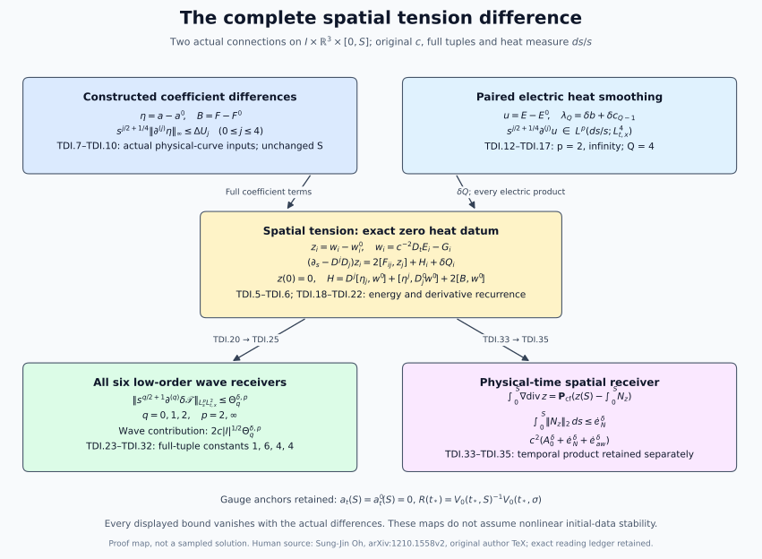

# Spatial tension differences and their wave estimates

This Unit 9 chapter derives the full spatial tension difference, including
the electric and temporal connection terms. A paired heat-smoothing
argument supplies its derivative coefficients. The resulting estimates
feed all six low-order wave bounds and an exact signed heat-boundary
operation used in physical-time reconstruction.

Use the [individual tension estimates](../classical-tension-forcing.html)
(TW), [electric smoothing](../classical-electric-smoothing.html) (ES),
[electric differences](../classical-electric-difference.html) (ED),
[fixed-interval heat comparison](../classical-fixed-heat-comparison.html)
(FI), [wave estimates](../classical-wave-estimates.html) (HW),
[finite wave bound](../classical-finite-wave-bound.html) (FC), and
[temporal difference receiver](../classical-uniform-difference.html) (UD).
The coefficients are for actual field differences; they retain the
original physical and heat domains and both gauge anchors.

Human-source context: Sung-Jin Oh,
[*Gauge choice for the Yang–Mills equations using the Yang–Mills heat flow
and local well-posedness in H1*, arXiv:1210.1558v2](https://arxiv.org/abs/1210.1558v2).
The exposition and full calculations here are independently written.
The course provenance records the exact author-source edition and bounded
reading. No novelty claim is made.

## 1. Original fields and every temporal identity

The physical domain is the original compact nondegenerate interval \(I=[t_-,t_+]\), with \(t_*\in I\), spatial base \(\mathbb R^3\), and heat interval \([0,S]\). Retain coordinates \((t,x^1,x^2,x^3,s)\), metric \(\operatorname{diag}(-c^2,1,1,1)\), original \(c>0\), and both derivative-regular \(L^6_x\) connection representatives. Set

\[
\begin{gathered}
D_\mu=\partial_\mu+[a_\mu,\cdot],\quad D'_\mu=\partial_\mu+[a'_\mu,\cdot],
\quad a_s=a_s'=0,\quad a_t(S)=a_t'(S)=0,\\
E_i=F_{ti},\quad G_i=F_{si},\quad W=F_{st},\quad
w_\nu=\sum_{\mu=t,1,2,3}\epsilon_\mu D_\mu F_{\nu\mu},
\quad\epsilon_t=-c^{-2},\quad\epsilon_j=1,\\
\eta_i=a_i-a_i',\quad\vartheta=a_t-a_t',\quad
u=E-E',\quad Z=G-G',\quad V=W-W',\quad B_{ij}=F_{ij}-F'_{ij},\quad z_i=w_i-w_i'.
                                                               \tag{TDI.1}
\end{gathered}
\]

The letter \(z\) denotes the spatial tension difference; it is not the temporal tension \(V\). Full ordered derivative, output and Hilbert–Schmidt matrix tuples are used throughout. The curvature tuple contains all nine ordered spatial pairs, including its three zero diagonal entries. The bracket bound is \(|[X,Y]|\le2|X||Y|\). The physical measure is \(dt\,d^3x\), and the outer heat measure is \(ds/s\) unless \(ds\) is displayed.

Subtract NX.1–NX.4 and the physical Bianchi identity without changing any index:

\[
\begin{aligned}
w_t&=-W,&w_i&=c^{-2}D_tE_i-G_i,&w_\nu(0)&=w_\nu'(0)=0,\\
z_i&=c^{-2}\{D_tu_i+[\vartheta,E_i']\}-Z_i,&z(0)&=0,&V(0)&=0,\\
D_tV+[\vartheta,W']&=-c^2\sum_j\{D_jz_j+[\eta_j,w_j']\},\\
\partial_tV&=-c^2\sum_j(\partial_jz_j+[a_j,z_j]+[\eta_j,w_j'])
                         -[a_t,V]-[\vartheta,W'],\\
D_tB_{ij}+[\vartheta,F'_{ij}]&=D_iu_j-D_ju_i+[\eta_i,E_j']-[\eta_j,E_i'],\\
a_t(s)&=-\int_s^SW(r)dr,&\vartheta(s)&=-\int_s^SV(r)dr.
                                                               \tag{TDI.2}
\end{aligned}
\]

The heat-boundary zero statements follow from the actual vacuum Yang–Mills and Gauss equations, not from a new boundary assumption. The temporal connection difference remains in the Bianchi and tension identities before the electric forcing is rewritten. In particular no higher physical-time derivative is introduced as an estimate input.

For any ordered covariant word \(J=(j_1,\ldots,j_m)\), the exact operator telescoping formula is

\[
D_Jw-D'_Jw'
=D_Jz+\sum_{r=1}^mD_{j_1}\cdots D_{j_{r-1}}
   [\eta_{j_r},D'_{j_{r+1}}\cdots D'_{j_m}w'].
\]

This also applies with temporal labels and \(\eta_t=\vartheta\). No covariant derivatives are commuted. For ordinary derivatives all words below are expanded by subsets of their positions, with the original relative order; products with three roles use ordered three-part partitions. This convention retains coincident coordinate indices and all empty subsets.

## 2. Subtract the complete original tension forcing

The two original spatial equations are

\[
\begin{aligned}
(\partial_s-D^jD_j)w_i&=2\sum_j[F_{ij},w_j]+Q_i,\qquad w_i(0)=0,\\
Q_i&=2\sum_{k,j}[F_{kj},D_kF_{ij}]
     +2\sum_{k,j}[F_{kj},D_jF_{ik}]
     -2c^{-2}\sum_j[E_j,D_tF_{ij}-D_jE_i].
                                                               \tag{TDI.3}
\end{aligned}
\]

The primed equation has every field and covariant derivative primed. Before cancellation, the difference of the first two sums is

\[
\begin{aligned}
2\sum_{k,j}\{[B_{kj},D_kF_{ij}]
 +[F'_{kj},D_kB_{ij}+[\eta_k,F'_{ij}]]\}\\
{}+2\sum_{k,j}\{[B_{kj},D_jF_{ik}]
 +[F'_{kj},D_jB_{ik}+[\eta_j,F'_{ik}]]\}.
\end{aligned}
\]

Exchanging \(k,j\) in the second line changes \(B_{kj},F'_{kj}\) to their negatives, and gives exactly the negative of the first line. This is a bijection of all nine pairs, with the zero diagonals retained. The cancellation also holds after every ordinary derivative because differentiation commutes with this finite index bijection.

The temporal part of the difference, before Bianchi, is

\[
-2c^{-2}\sum_j\{[u_j,D_tF_{ij}-D_jE_i]
 +[E_j',D_tB_{ij}+[\vartheta,F'_{ij}]-D_ju_i-[\eta_j,E_i']]\}.
\]

Use TDI.2 in this exact expression. Define the original covariant electric derivative difference \(K_{ij}=D_iE_j-D_i'E_j'\). Then

\[
\begin{aligned}
K_{ij}&=D_iu_j+[\eta_i,E_j']
       =\partial_iu_j+[a_i,u_j]+[\eta_i,E_j'],\\
Q_i&=-2c^{-2}\sum_j[E_j,D_iE_j-2D_jE_i],\\
\delta Q_i&=-2c^{-2}\sum_j
 \{[u_j,D_iE_j-2D_jE_i]+[E_j',K_{ij}-2K_{ji}]\}.
                                                               \tag{TDI.4}
\end{aligned}
\]

Thus the coefficient \([\vartheta,F'_{ij}]\) has been accounted for by the exact difference Bianchi identity; it was not omitted. Expanding the last line leaves the two derivative products
\([u_j,\partial_iE_j-2\partial_jE_i]\) and
\([E_j',\partial_iu_j-2\partial_ju_i]\), and the three nested groups
\([u_j,[a_i,E_j]-2[a_j,E_i]]\),
\([E_j',[a_i,u_j]-2[a_j,u_i]]\), and
\([E_j',[\eta_i,E_j']-2[\eta_j,E_i']]\), all multiplied by \(-2c^{-2}\). Expansion of \(a=a'+\eta\), \(E=E'+u\) exhibits every quadratic and cubic difference term, including \([u,[\eta,u]]\).

The complete spatial tension difference equation is

\[
\begin{aligned}
(\partial_s-D^jD_j)z_i&=2\sum_j[F_{ij},z_j]+H_i+\delta Q_i,\\
H_i&=2\sum_j[\eta_j,\partial_jw_i']+[\partial^j\eta_j,w_i']
 +\sum_j[\eta_j,[a_j,w_i']]+\sum_j[a_j',[\eta_j,w_i']]
 +2\sum_j[B_{ij},w_j'],\\
H_i&=\sum_jD_j\mathcal Z_{ji}+\mathcal R_i,\qquad
\mathcal Z_{ji}=[\eta_j,w_i'],\quad
\mathcal R_i=\sum_j[\eta_j,D_j'w_i']+2\sum_j[B_{ij},w_j'].
                                                               \tag{TDI.5}
\end{aligned}
\]

Indeed, for each \(j\), 

\[
D_j^2-D_j'^2=D_j(D_j-D_j')+(D_j-D_j')D_j'
\]

. Expanding proves both expressions and all their nested terms. In particular the quadratic term \([\eta_j,[\eta_j,w_i']]\) remains within the displayed unprimed coefficient. The covariant energy identity, before inequalities, is

\[
\begin{aligned}
\tfrac12\partial_s\|z\|_{L^2_{t,x}}^2+\|D_xz\|_{L^2_{t,x}}^2
 &=\operatorname{Re}\langle z,2[F,z]+\delta Q+\mathcal R\rangle_{t,x}
     -\operatorname{Re}\sum_{j,i}\langle D_jz_i,\mathcal Z_{ji}\rangle_{t,x}.
                                                               \tag{TDI.6}
\end{aligned}
\]

Anti-Hermitian coefficients and the real Hilbert–Schmidt inner product give the negative sign in the last term. Spatial cutoffs tend to the identity using the regular positive-heat norms; the zero heat endpoint is obtained after the integrable estimates below. No physical-time boundary term is produced because no integration by parts in physical time is used.

## 3. Explicit coefficient differences at every order needed here

Use the original individual bounds from FC/HT,

\[
\begin{aligned}
\|\partial^{(l)}a\|_{L^\infty_{t,x}}&\le U_ls^{-l/2-1/4},&
\|\partial^{(l)}F\|_{L^\infty_{t,x}}&\le C_l^Fs^{-l/2-3/4},\\
\|\partial^{(l)}\eta\|_{L^\infty_{t,x}}&\le\Delta U_ls^{-l/2-1/4},&
\|\partial^{(l)}B\|_{L^\infty_{t,x}}&\le\Delta C_ls^{-l/2-3/4},\\
\Delta C_l&=2\Delta U_{l+1}
 +2S^{1/4}\sum_{h=0}^l\binom lh
       (\Delta U_hU_{l-h}+U_h'\Delta U_{l-h}).
                                                               \tag{TDI.7}
\end{aligned}
\]

Primes on individual coefficients denote the second connection's bounds. The last line follows by differentiating the exact original curvature difference
\(B_{ij}=\partial_i\eta_j-\partial_j\eta_i+[\eta_i,a_j]+[a_i',\eta_j]\), with both spatial derivatives and both bracket tensors retained. It is an explicit provider, not the difference of two upper bounds. We need \(\Delta U_0,\ldots,\Delta U_4\) and \(\Delta C_0,\ldots,\Delta C_3\).

Here are complete finite instructions for these higher coefficient differences on the original interval. They extend the all-order estimates already proved in FI, while leaving that source unchanged. On the auxiliary construction interval \([0,\sigma]\) of FI.24 use FI.8–FI.19's actual arrays \(v_j,w_j\), FI.20's all-order backward heat-gauge arrays \(v_j^V,w_j^V\), and FI.25's physical-gauge arrays \(t_j,\delta t_j\), with \(t_0=1,\delta t_0=d_T\). For \(k=1,\ldots,5\), put

\[
\begin{aligned}
R_k^U&=\sigma^{k/2-1/4}t_k
   +\sum_{h=0}^{k-1}\binom kh\sigma^{h/2}t_hv_{k-h}^V,\\
D_k^U&=\sigma^{k/2-1/4}(\delta t_k+t_kq_V)
   +\sum_{h=0}^{k-1}\binom kh\sigma^{h/2}
                  (\delta t_hv_{k-h}^V+t_hw_{k-h}^V),\\
r_0^U&=1,\quad \varepsilon_0^U=\min(2,d_T+q_V),\quad
r_k^U=\sigma^{1/4}R_k^U,\quad\varepsilon_k^U=\sigma^{1/4}D_k^U,\\
\mathcal U_j^\delta&=
 \sum_{h+l+n=j}\frac{j!}{h!l!n!}
 (r_h^Uw_lr_n^U+\varepsilon_h^Uv_lr_n^U+r_h^Uv_l\varepsilon_n^U)
 +D_{j+1}^U+R_{j+1}^U\varepsilon_0^U\\
 &\quad+\sigma^{1/4}\sum_{h=0}^{j-1}\binom jh
       (D_{h+1}^UR_{j-h}^U+R_{h+1}^UD_{j-h}^U),\qquad 0\le j\le4.
                                                               \tag{TDI.8}
\end{aligned}
\]

Empty sums are zero. The first two lines are the full derivative product of \(U=TV\) with weights \(s^{k/2-1/4}\). The conjugation in \(a=UBU^{-1}-(\partial U)U^{-1}\) gives the triple sum. In the affine part, a zero derivative on \(U^{-1}\) gives \(D_{j+1}^U+R_{j+1}^U\varepsilon_0^U\); otherwise both gauge derivatives have positive orders, leaving exactly \(s^{1/4}\le\sigma^{1/4}\). This proves the final line. At \(j=2\) its affine part is explicitly
\(D_3^U+R_3^U\varepsilon_0^U+3\sigma^{1/4}(R_1^UD_2^U+R_2^UD_1^U)\).
These coefficients use FI's original two physical difference inputs and no higher derivative of a difference datum.

For \([\sigma,S]\), evaluate FI.28–FI.32 at **\(q=8\)**. Write \(\mathcal D_8(r)=\sup_I\mathcal Y_8(t,r)\), bounded by the explicit starting jets FI.25–FI.27 and the exponential of FI.31. Every coefficient is evaluated by FI.33–FI.35 in the original target representative; an adequate finite list is the target connection's \(L^\infty\) jets through eleven and the target curvature \(F,E,G\) jets through eleven in \(L^2,L^3,L^\infty\), together with the reference-time backward gauge jets through ten. These are individual FC/HT inputs. No undifferentiated connection \(L^2\) norm and no additional difference input is required. The index count is exact: FI.31 at order eight uses \(\partial a\) through eight, its gauge transform uses a gauge through ten, and \(W=-\operatorname{div}E-[a,E]\) then uses the target electric field through eleven.

The full temporal difference identity needed only for this gauge conversion is
\(\delta W=-\operatorname{div}u-[\eta,E]-[a',u]\). Hence

\[
\begin{aligned}
\|\delta W(t,r)\|_{H_\ell^7}
 &\le\{c(\ell^{-1}+2K_7(a'))+2P_7(E)\}\,\mathcal D_8(r),\\
\delta b_j&=b_\ell\ell^{-j}\int_\sigma^S
    \sup_I\{c(\ell^{-1}+2K_7(a'))+2P_7(E)\}\mathcal D_8(r)dr,\\
b_j&=b_\ell\ell^{-j}\int_\sigma^S
       \max(\sup_I\|W^{[\sigma]}\|_{H_\ell^7},
            \sup_I\|W^{[\sigma]\prime}\|_{H_\ell^7})dr,
                    \qquad 0\le j\le5,\\
R_t&=R\theta,\quad\theta=\int_\sigma^SW^{[\sigma]}(r)dr,\quad
R(t_*)=V_0(t_*,S)^{-1}V_0(t_*,\sigma),\\
r_j^*&=v_j^{V,\mathrm{ref}}\sigma^{-j/2+1/4},\quad
\delta r_j^*=w_j^{V,\mathrm{ref}}\sigma^{-j/2+1/4}\quad(j\ge1),\\
d_*&=\min\{2,4(S^{1/4}-\sigma^{1/4})b_0^{\delta,\mathrm{ref}}\},
\quad d_R=\min(2,d_*+\tau\delta b_0),\quad r_0=1,\quad\delta r_0=d_R,\\
r_k&=r_k^*+\tau b_k+\tau\sum_{h=1}^{k-1}\binom kh r_hb_{k-h},\\
\delta r_k&=\delta r_k^*+\tau(d_Rb_k+\delta b_k)
 +\tau\sum_{h=1}^{k-1}\binom kh(\delta r_hb_{k-h}+r_h\delta b_{k-h})
 +\tau r_k\delta b_0.                                        \tag{TDI.9}
\end{aligned}
\]

Here \(\tau=\sup_I|t-t_*|\), \(K_j,P_j,H_\ell^j,b_\ell=(8\pi\ell^3)^{-1/2}\) are exactly FI.28–FI.31, and all reference arrays use the original reference radius and original \(S\). The spatial embedding is valid because \(j+2\le7\). The differentiated ODE has a right skew-adjoint homogeneous coefficient, so its propagator is unitary; integrating the remaining full Leibniz terms proves the last two lines in increasing order. This derives all five gauge jets, with the actual nonidentity anchor.

Set \(D_* =\sup_{\sigma\le r\le S}\mathcal D_8(r)\) and

\[
\widehat U_j^\delta=\max\{\mathcal U_j^\delta,S^{j/2+1/4}C_MC_S\ell^{-j-1/2}D_*\}
\]

, \(0\le j\le4\). Homogeneous Morrey–Sobolev applied to \(\partial^{(j)}\eta\) proves the second entry, since the gradient and next gradient norms are at most \(\ell^{-j}\mathcal Y_8\) and \(\ell^{-j-1}\mathcal Y_8\). Let \(\widehat U_j\) be the maximum of the two individual auxiliary-representative bounds obtained from the identical local product and FI.35. Put \(\widetilde r_j=S^{j/2}r_j\), \(\widetilde\varepsilon_j=S^{j/2}\delta r_j\). Then a full provider for TDI.7 is

\[
\begin{aligned}
\Delta U_j={}&\sum_{h+l+n=j}\frac{j!}{h!l!n!}
 (\widetilde r_h\widehat U_l^\delta\widetilde r_n
  +\widetilde\varepsilon_h\widehat U_l\widetilde r_n
  +\widetilde r_h\widehat U_l\widetilde\varepsilon_n)\\
&+S^{j/2+1/4}\sum_{h+n=j}\binom jh
      (\delta r_{h+1}r_n+r_{h+1}\delta r_n),\qquad0\le j\le4.
                                                               \tag{TDI.10}
\end{aligned}
\]

This is the exact full derivative bound for \(a^{[S]}=R\cdot a^{[\sigma]}\). The original \(S\) is unchanged. If \(\sigma=S\), the transition is the identity and TDI.8 already supplies the answer.

For the separately requested second spatial coefficient, order six in FI.32 suffices: replace \(8,7,5\) in TDI.9 by \(6,5,3\). Retaining the sharper integrations of the lower ODE jets gives

\[
\begin{aligned}
r_1&=r_1^*+\tau b_1,\quad
r_2=r_2^*+\tau(b_2+2r_1^*b_1)+\tau^2b_1^2,\\
r_3&=r_3^*+\tau(b_3+3r_1^*b_2+3r_2^*b_1)
                  +3\tau^2(b_1b_2+r_1^*b_1^2)+\tau^3b_1^3,\\
\delta r_3&=\delta r_3^*+\tau(d_Rb_3+3\delta r_1b_2+3\delta r_2b_1
                 +\delta b_3+3r_1\delta b_2+3r_2\delta b_1+r_3\delta b_0),\\
\sup_{0<s\le S}s^{5/4}\|\partial^{(2)}\eta(s)\|_{L^\infty_{t,x}}\le{}&\widehat U_2^\delta+4\sqrt S r_1\widehat U_1^\delta
 +(2Sr_2+2Sr_1^2)\widehat U_0^\delta+2d_R\widehat U_2\\
&+4\sqrt S(\delta r_1+r_1d_R)\widehat U_1
 +S(2\delta r_2+2r_2d_R+4r_1\delta r_1)\widehat U_0\\
&+S^{5/4}(\delta r_3+r_3d_R+3r_1\delta r_2+3r_2\delta r_1).
\end{aligned}
\]

The right side in this last display is an alternative choice of the upper provider \(\Delta U_2\). The coefficient three in each mixed affine term comes from the two placements in \(\partial^2R\,\partial R^{-1}\) and the one placement in \(\partial R\,\partial^2R^{-1}\). This proves the required third-gauge receiver directly from the displayed transition equation.

## 4. Paired electric smoothing with constants that vanish with the differences

Evaluate the individual ES/TW arrays on the two accepted FC bounds, retaining

\[
\begin{aligned}
e_0^p&=cd_c\overline P_{3/2}^p
 +|I|^{1/4}cd^2\mathscr R_1\mathfrak H_1^p(1/4)
 +2\mathcal A cd^2\mathscr R_0\mathfrak H_0^p(1/8),\quad
d_c=\sqrt2(2\pi c)^{-1/4},\\
\alpha_0&=1,\quad\alpha_j=2^{1/4}S_j\ (j\ge1),\qquad
e_j^p=\alpha_je_0^p,\\
k_j^p&=e_{j+1}^p+2S^{1/4}\sum_{l=0}^j\binom jl U_le_{j-l}^p,
\qquad p=2,\infty.                                           \tag{TDI.11}
\end{aligned}
\]

The corresponding primed arrays use the second connection's complete constants. These bound \(s^{j/2+1/4}\partial^{(j)}E\) and \(s^{j/2+3/4}\partial^{(j)}D_xE\) in \(L^p(ds/s;L^4_{t,x})\). The original endpoint wave data, full potential-wave forcing, physical-time measure and every \(c\) remain inside \(e_0^p\). Let \(\mathfrak e_p\) be any proved upper bound for the actual lowest electric difference \(\|s^{1/4}u\|_{L^p(ds/s;L^4_{t,x})}\). A concrete current choice is ED.26 evaluated with FI's coefficients, its actual datum \(f=u(0)\), and ED.16's datum norm. ED.21 is a finite alternative in \(\|f\|_{L^4_{t,x}}\); ED.25b keeps the linear heat datum and displays all its coefficients. The proved bound [UD.21](../classical-uniform-difference.html#eq-UD-21) is another complete choice. This retains the actual heat datum, rather than claiming a single-physical-time stability estimate.

Fix a target derivative order \(Q\ge1\), and set \(m_*=Q-1\). We will use \(Q=4\) for spatial tension and \(Q=2\) for the additional fixed-time receiver. On the original interval \([s/2,s]\), define

\[
\begin{aligned}
a_l^*&=2^{l/2+1/4}\max(U_l,U_l'),& f_l^*&=2^{l/2+3/4}\max(C_l^F,C_l^{F\prime}),\\
d_l^*&=2^{l/2+1/4}\Delta U_l,&h_l^*&=2^{l/2+3/4}\Delta C_l,\qquad
b=4S^{1/4}a_0^*,\quad\delta b=4S^{1/4}d_0^*,\\
c_m&=4S^{1/4}\sum_{k=1}^m\sum_{l=1}^k\binom kl a_l^*
 +2\sqrt3S^{1/4}\sum_{k=0}^m\sum_{l=0}^k\binom kl a_{l+1}^*\\
&\quad+4\sqrt S\sum_{k=0}^m\sum_{r+h+n=k}\frac{k!}{r!h!n!}a_r^*a_h^*
 +4S^{1/4}\sum_{k=0}^m\sum_{l=0}^k\binom kl f_l^*.
                                                               \tag{TDI.12}
\end{aligned}
\]

Define \(\delta c_m\) by the entire displayed formula for \(c_m\), replacing \(a_l^*\) in the first two sums by \(d_l^*\), \(f_l^*\) by \(h_l^*\), and each \(a_r^*a_h^*\) by \(d_r^*a_h^*+a_r^*d_h^*\). Put

\[
\lambda_Q=\delta b+\delta c_{m_*}\ge0.                         \tag{TDI.13}
\]

This is a finite linear expression in the coefficient differences. Every coefficient depends only on the individual fields and \(S\). The shared maxima in TDI.12 bound both operators. For example,

\[
\delta c_1=4S^{1/4}d_1^*+2\sqrt3S^{1/4}(2d_1^*+d_2^*)
 +4\sqrt S(4a_0^*d_0^*+2a_0^*d_1^*+2a_1^*d_0^*)
 +4S^{1/4}(2h_0^*+h_1^*).
\]

Here is a proof of the paired estimate, including the degenerate case \(\lambda_Q=0\). Work either in \(\mathbb B=L^4_{t,x}\), or at each fixed physical time in \(\mathbb B=L^2_x\). Let \(X_j^\delta(r)=\|\partial^{(j)}u(r)\|_{\mathbb B}\), \(X_j'(r)=\|\partial^{(j)}E'(r)\|_{\mathbb B}\), and form only sums of norms
\(J_m^\delta=\sum_{k\le m}s^{k/2}X_k^\delta\),
\(G_m^\delta=\sum_{k\le m}s^{k/2}X_{k+1}^\delta\), with primed versions. No electric field or metric is changed. Expanding ED.6 and differentiating every factor gives its self-operator ES.7, and the five coefficient-difference groups
\(2[\eta,\partial E']\), \([\operatorname{div}\eta,E']\),
\([\eta,[a,E']]\), \([a',[\eta,E']]\), \(2[B,E']\).
Consequently the weighted forcing sum is at most

\[
\frac b{\sqrt s}G_m^\delta+\frac{c_m}sJ_m^\delta
 +\frac{\delta b}{\sqrt s}G_m'+\frac{\delta c_m}sJ_m'.
\]

The primed equation has bound \(bG_m'/\sqrt s+c_mJ_m'/s\). Multiply only that scalar inequality by \(\lambda_Q\) and add. Since \(\delta b,\delta c_m\le\lambda_Q\) for \(m\le m_*\), the sums
\(\mathcal J_m=J_m^\delta+\lambda_QJ_m'\),
\(\mathcal G_m=G_m^\delta+\lambda_QG_m'\) have total forcing at most
\((b+1)\mathcal G_m/\sqrt s+(c_m+1)\mathcal J_m/s\).
No division by \(\lambda_Q\) occurs. The original scalar heat kernel has mass one and full gradient \(L^1\) norm \(\kappa h^{-1/2}\), \(\kappa=2/\sqrt\pi\), in either space \(\mathbb B\). On a slab of length \(h=s/(2N)\), the two Duhamel equations, triangle and the four exact integrals \(2\sqrt h,h,\pi\sqrt h,2h\) therefore give the ES.17 absorption with coefficients \(b+1,c_m+1\). Set

\[
\begin{aligned}
K&=2(1+\kappa),\quad a_*=2+\pi\kappa,\quad b_*=1+2\kappa,\\
N_j&=\max\{1,j,\lceil8a_*^2(b+1)^2\rceil,
                         \lceil2b_*(c_{m_*}+1)\rceil\},\quad
\mathcal S_j=K^{N_j}(2N_j)^{j/2},\qquad1\le j\le Q,\\
\|\partial^{(j)}u(s)\|_{\mathbb B}
 &\le\mathcal S_js^{-j/2}
      \{\|u(s/2)\|_{\mathbb B}+\lambda_Q\|E'(s/2)\|_{\mathbb B}\}.
                                                               \tag{TDI.14}
\end{aligned}
\]

Each of the two absorbed contributions is at most \(1/4\). Propagate order zero on the first \(N_j-j\) slabs and gain one derivative on the last \(j\); each gain costs exactly the upper factor \(\sqrt{2N_j}\). This proves TDI.14. Regularity makes all intermediate slab norms finite, and Duhamel is justified on positive closed heat intervals by the original heat-kernel strong continuity. A zero \(\lambda_Q\) simply removes every primed norm from the scalar sums.

For \(Q=4\), define

\[
\begin{aligned}
e_0^{\delta,p}&=\mathfrak e_p,\qquad
e_j^{\delta,p}=2^{1/4}\mathcal S_j
                    (\mathfrak e_p+\lambda_4e_0^{\prime,p}),\quad1\le j\le4,\\
\|s^{j/2+1/4}\partial^{(j)}u\|_{L^p(ds/s;L^4_{t,x})}
 &\le e_j^{\delta,p},\qquad p=2,\infty.                       \tag{TDI.15}
\end{aligned}
\]

Indeed the substitution \(r=s/2\) is only a scalar integration substitution; it changes the upper limit to \(S/2\), whose norm is bounded by the original \((0,S]\) norm, and gives precisely \(2^{1/4}\). The physical norm is taken first throughout.

The requested fixed-time version, with \(Q=2\), is

\[
\sup_{t,s}s^{j/2}\|\partial^{(j)}u(t,s)\|_2\le\mathcal S_j(M_*+\lambda_2m_0')
\]

, \(j=1,2\), with \(M_*\) from ED.11 and \(m_0'=cR_0d'\). Its entirely linear upper input is

\[
M_*\le e^{16C_0^FS^{1/4}}
 \{M_f+(2\sqrt2m_0'+4\sqrt2b_0')S^{1/4}\Delta U_0
                      +32m_0'S^{1/4}\Delta C_0\},\qquad b_0'=cR_0d'.
\]

This is ED.25b's proved energy bound, with the actual \(M_f=\sup_I\|u(t,0)\|_2\) supplied by FI.42 when desired. Thus each fixed-time derivative slope is explicit in the original two coefficient differences and the actual electric heat datum; it is not inferred by subtracting two individual estimates.

The covariant derivative difference in TDI.4 satisfies, for \(0\le j\le3\),

\[
\begin{aligned}
k_j^{\delta,p}&=e_{j+1}^{\delta,p}
 +2S^{1/4}\sum_{l=0}^j\binom jl
          (U_le_{j-l}^{\delta,p}+\Delta U_le_{j-l}^{\prime,p}),\\
\|s^{j/2+3/4}\partial^{(j)}K\|_{L^p(ds/s;L^4_{t,x})}
 &\le k_j^{\delta,p}.                                         \tag{TDI.16}
\end{aligned}
\]

This follows by differentiating all three terms of \(K=\partial u+[a,u]+[\eta,E']\). The product weights leave \(s^{1/4}\), bounded by \(S^{1/4}\), without changing any field.

For two pairs of nonnegative heat-norm bounds \(x=(x^2,x^\infty)\), \(y=(y^2,y^\infty)\), define
\(\mathcal P_1(x,y)=x^2y^2\),
\(\mathcal P_2(x,y)=\min(x^2y^\infty,x^\infty y^2)\),
\(\mathcal P_\infty(x,y)=x^\infty y^\infty\). Superscripts here label heat exponents. The full electric forcing difference has the bounds

\[
\begin{aligned}
Q_q^{\delta,p}&=12c^{-2}\sum_{l=0}^q\binom ql
 \{\mathcal P_p(e_l^\delta,k_{q-l})+
                         \mathcal P_p(e_l',k_{q-l}^\delta)\},\\
\|s^{q/2+1}\partial^{(q)}\delta Q\|_{L^p(ds/s;L^2_{t,x})}
 &\le Q_q^{\delta,p},\qquad0\le q\le3,\quad p=1,2,\infty.
                                                               \tag{TDI.17}
\end{aligned}
\]

For each subset, physical Hölder pairs \(L^4_{t,x}\) with \(L^4_{t,x}\). The original two contractions cost \(2c^{-2}(2+4)=12c^{-2}\). Their two heat weights total 

\[
l/2+1/4+(q-l)/2+3/4=q/2+1
\]

. Heat Hölder proves each entry of \(\mathcal P_p\), so every minimum is a minimum of two proved bounds for the same product. This supplies all differentiated electric forcing from the lowest actual electric difference and the constructed coefficients.

## 5. Zero-data spatial tension energy and every finite derivative

Let \(A_n,B_n,A_D\) and \(A_n',B_n',A_D'\) be precisely the individual hatted TW.8–TW.13 coefficients, now with the hats suppressed only in their names. Thus \(\sup_s s^{n/2}\|\partial^{(n)}w\|_2\le A_n\),
\(\int_0^S s^{n-1}\|\partial^{(n)}w\|_2^2ds\le B_n^2\) for \(n\ge1\), and \(\|D_xw\|_{L^2(ds;L^2_{t,x})}\le A_D\). Their finite evaluation uses the original individual \(e_0^2,e_0^\infty\), TW.3, TW.8, and TW.11; all are already supplied by the individual FC/HT estimates. Put \(\Phi(s)=16C_0^Fs^{1/4}\).

The covariant divergence form in TDI.5 gives the explicit input bounds

\[
\begin{aligned}
Z_*&=2\sqrt2S^{1/4}\Delta U_0A_0',\\
R_*&=2\sqrt2S^{1/4}\Delta U_0A_D'
                +16S^{1/4}\Delta C_0A_0'+Q_0^{\delta,1},\\
L_*&=4\sqrt2S^{1/4}\Delta U_0B_1'
       +8\sqrt3S^{1/4}\Delta U_1A_0'
       +8\sqrt S\Delta U_0(U_0+U_0')A_0'\\
&\quad+16S^{1/4}\Delta C_0A_0'+Q_0^{\delta,1},\\
\|\mathcal Z\|_{L^2(ds;L^2_{t,x})}&\le Z_*,\quad
\|\mathcal R+\delta Q\|_{L^1(ds;L^2_{t,x})}\le R_*,\quad
\|H+\delta Q\|_{L^1(ds;L^2_{t,x})}\le L_*.
                                                               \tag{TDI.18}
\end{aligned}
\]

For the flux and gradient remainder use \(\int_0^Ss^{-1/2}ds=2\sqrt S\) and heat Cauchy–Schwarz. The curvature remainder integrates \(s^{-3/4}\) to \(4S^{1/4}\). In the ordinary alternative, the drift pairs with \(B_1'\), the divergence costs \(2\sqrt3\), and the two nested coefficients integrate \(s^{-1/2}\) to \(2\sqrt S\). The electric term uses exactly \(ds=s\,ds/s\). This proves every line.

Multiplying TDI.6 by \(e^{-2\Phi}\), keeping the derivative of that factor, and using Young only on the flux gives

\[
\partial_s(e^{-2\Phi}\|z\|_2^2)+e^{-2\Phi}\|Dz\|_2^2
 \le e^{-2\Phi}\|\mathcal Z\|_2^2
      +2(e^{-\Phi}\|z\|_2)e^{-\Phi}\|\mathcal R+\delta Q\|_2.
\]

The initial term is zero. For \(Y_s=\sup_{r\le s}e^{-\Phi(r)}\|z(r)\|_2\), integration gives \(Y_s^2\le Z_*^2+2R_*Y_s\), hence \(Y_s\le R_*+\sqrt{R_*^2+Z_*^2}\). The same inequality controls the full weighted gradient integral by the square of this root. Applying instead the original forcing form and the regularized norm gives \(\sup e^{-\Phi}\|z\|_2\le L_*\), and its energy integral gives the corresponding gradient bound \(L_*\). Therefore define

\[
\begin{aligned}
A_0^\delta=A_D^\delta
 &=e^{\Phi(S)}\min\{L_*,R_*+\sqrt{R_*^2+Z_*^2}\},\\
B_1^\delta&=A_D^\delta+2\sqrt2U_0S^{1/4}A_0^\delta,\\
\sup_s\|z(s)\|_2&\le A_0^\delta,\quad
\|Dz\|_{L^2(ds;L^2_{t,x})}\le A_D^\delta,\quad
\|\partial z\|_{L^2(ds;L^2_{t,x})}\le B_1^\delta.
                                                               \tag{TDI.19}
\end{aligned}
\]

Both alternatives are independently proved; no numerical ordering between them is asserted. The flux alternative avoids \(\Delta U_1\) at the energy start. Norm division is justified using \((\|z\|_2^2+\varepsilon^2)^{1/2}\) and then \(\varepsilon\downarrow0\). All zero cases are included.

Let \(N_z=(\partial_s-\Delta)z\). Expand TDI.5 completely. Its terms are the four ordinary self-operator groups from TW.9 on \(z\), the five original groups in \(H\), and \(\delta Q\). The full ordered product rule proves

\[
\begin{aligned}
N_q^{\delta,2}={}&4S^{1/4}\sum_{l=0}^q\binom ql
          (U_lB_{q-l+1}^\delta+\Delta U_lB_{q-l+1}')\\
&+2\sqrt6S^{1/4}\sum_{l=0}^q\binom ql
          (U_{l+1}A_{q-l}^\delta+\Delta U_{l+1}A_{q-l}')\\
&+4\sqrt S\sum_{r+h+n=q}\frac{q!}{r!h!n!}
 (U_rU_hA_n^\delta+\Delta U_rU_hA_n'+U_r'\Delta U_hA_n')\\
&+4\sqrt2S^{1/4}\sum_{l=0}^q\binom ql
          (C_l^FA_{q-l}^\delta+\Delta C_lA_{q-l}')+Q_q^{\delta,2},\\
A_{q+1}^\delta=B_{q+2}^\delta
 &=\sqrt{(q+1)(B_{q+1}^\delta)^2+(N_q^{\delta,2})^2},\qquad q=0,1,2,3.
                                                               \tag{TDI.20}
\end{aligned}
\]

The first-order products use the known \(B_{q-l+1}\) and \(\sup s^{1/4}=S^{1/4}\). The divergence and curvature products use \(A_{q-l}\) and \(\|s^{1/4}\|_{L^2(ds/s)}=\sqrt2S^{1/4}\). The nested products use \(\|s^{1/2}\|_{L^2(ds/s)}=\sqrt S\). All terms have exactly the original forcing weight \(s^{q/2+1}\). This proves \(\|s^{q/2+1}\partial^{(q)}N_z\|_{L^2(ds/s;L^2_{t,x})}\le N_q^{\delta,2}\).

The original differentiated ordinary energy calculation is

\[
\begin{aligned}
s^{q+1}\|\partial^{(q+1)}z(s)\|_2^2
 +\int_0^sr^{q+1}\|\partial^{(q+2)}z(r)\|_2^2dr
\le(q+1)\int_0^sr^q\|\partial^{(q+1)}z(r)\|_2^2dr
 +\int_0^sr^{q+1}\|\partial^{(q)}N_z(r)\|_2^2dr.
                                                               \tag{TDI.21}
\end{aligned}
\]

Pair the equation with \(-s^{q+1}\Delta\partial^{(q)}z\), integrate over the original physical variables, and use Young with coefficients \(1/2\). Parseval for the full tuples gives \(\|\Delta\partial^{(q)}z\|_2=\|\partial^{(q+2)}z\|_2\). The lower weighted endpoint vanishes by regularity and \(z(0)=0\). Taking separately the endpoint supremum and final integral proves TDI.20. Every coefficient on its right has already been obtained at the preceding order. After that step,

\[
\begin{aligned}
N_q^{\delta,\infty}={}&4S^{1/4}\sum_l\binom ql
        (U_lA_{q-l+1}^\delta+\Delta U_lA_{q-l+1}')\\
&+2\sqrt3S^{1/4}\sum_l\binom ql
        (U_{l+1}A_{q-l}^\delta+\Delta U_{l+1}A_{q-l}')\\
&+4\sqrt S\sum_{r+h+n=q}\frac{q!}{r!h!n!}
 (U_rU_hA_n^\delta+\Delta U_rU_hA_n'+U_r'\Delta U_hA_n')\\
&+4S^{1/4}\sum_l\binom ql
        (C_l^FA_{q-l}^\delta+\Delta C_lA_{q-l}')+Q_q^{\delta,\infty},\\
\sup_{0<s\le S}s^{q/2+1}\|\partial^{(q)}N_z(s)\|_2
 &\le N_q^{\delta,\infty}.                                    \tag{TDI.22}
\end{aligned}
\]

The same proof gives all finite orders if the finite arrays are extended; the stated orders use at most \(\Delta U_4,\Delta C_3\) and fourth electric smoothing. The actual upper endpoint \(S\) is included in every supremum.

## 6. Subtract the full receiving operator before estimating it

Retain TW.1's complete spatial contribution

\[
\mathscr T_i=-D^jD_jw_i+D_iD^jw_j-2[F_{ij},w_j]-Q_i
\]

.
Let \(\mathcal L_0=-\Delta+\nabla\operatorname{div}\), and retain the exact maps

\[
\begin{aligned}
\mathfrak B(a,V)_i&=\sum_j[a_j,-2V_{ji}+V_{ij}+\delta_{ji}\operatorname{tr}_xV],\\
\mathfrak C(A,w)_i&=\sum_j[A_{ij}-\delta_{ij}\operatorname{tr}_xA,w_j],\\
(\mathfrak J(a,b)v)_i&=-\sum_j[a_j,[b_j,v_i]]+\sum_j[a_i,[b_j,v_j]],\quad
\mathfrak J_s(a,b)=\tfrac12(\mathfrak J(a,b)+\mathfrak J(b,a)),\\
\delta\mathscr T={}&\mathcal L_0z+\mathfrak B(a,\partial z)+\mathfrak B(\eta,\partial w')
 +\mathfrak C(\partial a,z)+\mathfrak C(\partial\eta,w')\\
&+\mathfrak J(a,a)z+\{\mathfrak J_s(\eta,a)+\mathfrak J_s(a',\eta)\}w'
 -2[F,z]-2[B,w']-\delta Q.                                    \tag{TDI.23}
\end{aligned}
\]

The three terms in \(\mathfrak B\) are respectively \(-2[a_j,\partial_jw_i]\), \([a_j,\partial_iw_j]\), \([a_i,\partial_jw_j]\). The two terms in \(\mathfrak C\) are \(-[\partial^ja_j,w_i]\) and \([\partial_i a_j,w_j]\). Thus all terms of the original covariant operator remain. The identity for the nested difference follows by polarization of the quadratic operator \(\mathfrak J(a,a)\), and is exact even though \(\mathfrak J(a,b)\) need not be symmetric.

We reprove the useful constants to fix their applicability to differences. The Fourier symbol of \(\mathcal L_0\) is \(|\xi|^2I-\xi\xi^{\mathsf T}\), so the complementary orthogonal projection identity gives

\[
\|\partial^{(q)}\mathcal L_0z\|_2^2+\|\partial^{(q)}\nabla\operatorname{div}z\|_2^2=\|\partial^{(q+2)}z\|_2^2
\]

.
For a spatial matrix \(V\), the map \(-2V+V^{\mathsf T}+I\operatorname{tr}_xV\) has eigenvalues \(2,-1,-3\) on its trace, symmetric trace-zero and antisymmetric parts. These parts are orthogonal even with matrix-valued entries. The bracket contraction therefore costs \(2\cdot3=6\). The map \(A\mapsto A-I\operatorname{tr}_xA\) has squared norm \(|A|^2+|\operatorname{tr}_xA|^2\le4|A|^2\), so its bracket costs four.

Finally write \(A_j=\operatorname{ad}(a_j)\), \(B_av=\sum_jA_jv_j\), and \(R_a=\sum_jA_j^*A_j\). Anti-Hermitian coefficients give \(A_j^*=-A_j\) and
\(\mathfrak J(a,a)=\operatorname{diag}(R_a,R_a,R_a)-B_a^*B_a\).
Both positive operators lie below \(4|a|^2I\), so their difference has operator norm at most \(4|a|^2\). For fixed \(v\), its quadratic form is a real quadratic form in \(a\) bounded in absolute value by \(4|a|^2|v|^2\); diagonalizing its representing real symmetric matrix bounds the polarized form by \(4|a||b||v|^2\). The polarized operator is self-adjoint, hence

\[
\|\mathcal L_0\partial^{(q)}z\|_2\le\|\partial^{(q+2)}z\|_2,
\quad |\mathfrak B(a,V)|\le6|a||V|,\quad
|\mathfrak C(A,v)|\le4|A||v|,\quad
\|\mathfrak J_s(a,b)\|_{\mathrm{op}}\le4|a||b|.
                                                               \tag{TDI.24}
\]

These proofs apply to every ordinary derivative of \(a,a',\eta\), which remains anti-Hermitian. In the full derivative sum for \(\mathfrak J(a,a)z\), exchange its first two ordered subsets and average; the same sum then uses \(\mathfrak J_s\) with identical multiplicities. For the other two nested groups in TDI.23 the polarization has already been performed pointwise. Thus no coefficient eight is needed for these paired nested groups, and none of their original terms is dropped.

For \(p=2,\infty\) let \(R_n^{\delta,2}=B_n^\delta\), \(R_n^{\delta,\infty}=A_n^\delta\), with primed counterparts, and let \(\kappa_2=\sqrt2,\kappa_\infty=1\). The complete difference bound is

\[
\begin{aligned}
\Theta_q^{\delta,p}={}&R_{q+2}^{\delta,p}
 +6S^{1/4}\sum_{l=0}^q\binom ql
                  (U_lR_{q-l+1}^{\delta,p}+\Delta U_lR_{q-l+1}^{\prime,p})\\
&+4\kappa_pS^{1/4}\sum_{l=0}^q\binom ql
                  (U_{l+1}A_{q-l}^\delta+\Delta U_{l+1}A_{q-l}')\\
&+4\sqrt S\sum_{r+h+n=q}\frac{q!}{r!h!n!}
 (U_rU_hA_n^\delta+\Delta U_rU_hA_n'+U_r'\Delta U_hA_n')\\
&+4\kappa_pS^{1/4}\sum_{l=0}^q\binom ql
                  (C_l^FA_{q-l}^\delta+\Delta C_lA_{q-l}')+Q_q^{\delta,p},\\
\|s^{q/2+1}\partial^{(q)}\delta\mathscr T\|_{L^p(ds/s;L^2_{t,x})}
 &\le\Theta_q^{\delta,p},\qquad q=0,1,2.                     \tag{TDI.25}
\end{aligned}
\]

Every derivative placement in TDI.23 is retained by the displayed binomial and multinomial sums. The weight calculations are exactly those in TDI.20, and the linear term is the full second-derivative tuple with coefficient one. For the heat-square case its norm is \(B_{q+2}^\delta\); for the heat supremum it is \(A_{q+2}^\delta\). This proves both heat exponents without interchanging the physical and heat norms.

## 7. Fully evaluated orders zero, one and two

To display all cubic derivative coefficients explicitly define

\[
\begin{aligned}
P_0&=U_0^2,&P_1&=2U_0U_1,&P_2&=2U_0U_2+2U_1^2,&P_3&=2U_0U_3+6U_1U_2,\\
H_0&=\Delta U_0(U_0+U_0'),\\
H_1&=\Delta U_1(U_0+U_0')+\Delta U_0(U_1+U_1'),\\
H_2&=\Delta U_2(U_0+U_0')+2\Delta U_1(U_1+U_1')+\Delta U_0(U_2+U_2'),\\
H_3&=\Delta U_3(U_0+U_0')+3\Delta U_2(U_1+U_1')
       +3\Delta U_1(U_2+U_2')+\Delta U_0(U_3+U_3').             \tag{TDI.26}
\end{aligned}
\]

They evaluate the complete two coefficient roles, including both orders of distinct derivative placements. Thus for each \(p\in\{2,\infty\}\), with the explicit choices of \(R,\kappa_p\) above,

\[
\begin{aligned}
\Theta_0^{\delta,p}={}&R_2^{\delta,p}
 +6S^{1/4}(U_0R_1^{\delta,p}+\Delta U_0R_1^{\prime,p})\\
&+4\kappa_pS^{1/4}(U_1A_0^\delta+\Delta U_1A_0')
 +4\sqrt S(P_0A_0^\delta+H_0A_0')\\
&+4\kappa_pS^{1/4}(C_0^FA_0^\delta+\Delta C_0A_0')+Q_0^{\delta,p}.
                                                               \tag{TDI.27}
\end{aligned}
\]

At order one,

\[
\begin{aligned}
\Theta_1^{\delta,p}={}&R_3^{\delta,p}
 +6S^{1/4}(U_0R_2^{\delta,p}+U_1R_1^{\delta,p}
                          +\Delta U_0R_2^{\prime,p}+\Delta U_1R_1^{\prime,p})\\
&+4\kappa_pS^{1/4}(U_1A_1^\delta+U_2A_0^\delta
                          +\Delta U_1A_1'+\Delta U_2A_0')\\
&+4\sqrt S(P_0A_1^\delta+P_1A_0^\delta+H_0A_1'+H_1A_0')\\
&+4\kappa_pS^{1/4}(C_0^FA_1^\delta+C_1^FA_0^\delta
                          +\Delta C_0A_1'+\Delta C_1A_0')+Q_1^{\delta,p}.
                                                               \tag{TDI.28}
\end{aligned}
\]

At order two,

\[
\begin{aligned}
\Theta_2^{\delta,p}={}&R_4^{\delta,p}
 +6S^{1/4}(U_0R_3^{\delta,p}+2U_1R_2^{\delta,p}+U_2R_1^{\delta,p}
            +\Delta U_0R_3^{\prime,p}+2\Delta U_1R_2^{\prime,p}+\Delta U_2R_1^{\prime,p})\\
&+4\kappa_pS^{1/4}(U_1A_2^\delta+2U_2A_1^\delta+U_3A_0^\delta
            +\Delta U_1A_2'+2\Delta U_2A_1'+\Delta U_3A_0')\\
&+4\sqrt S(P_0A_2^\delta+2P_1A_1^\delta+P_2A_0^\delta
                              +H_0A_2'+2H_1A_1'+H_2A_0')\\
&+4\kappa_pS^{1/4}(C_0^FA_2^\delta+2C_1^FA_1^\delta+C_2^FA_0^\delta
            +\Delta C_0A_2'+2\Delta C_1A_1'+\Delta C_2A_0')+Q_2^{\delta,p}.
                                                               \tag{TDI.29}
\end{aligned}
\]

All required tension constants are evaluated, in this order, by

\[
\begin{aligned}
A_1^\delta=B_2^\delta&=\sqrt{(B_1^\delta)^2+(N_0^{\delta,2})^2},\\
A_2^\delta=B_3^\delta&=\sqrt{2(B_2^\delta)^2+(N_1^{\delta,2})^2},\\
A_3^\delta=B_4^\delta&=\sqrt{3(B_3^\delta)^2+(N_2^{\delta,2})^2},\\
A_4^\delta=B_5^\delta&=\sqrt{4(B_4^\delta)^2+(N_3^{\delta,2})^2}.
                                                               \tag{TDI.30}
\end{aligned}
\]

For an entirely arithmetic evaluation of TDI.20 at \(q=0,1,2,3\), every bilinear sum is respectively
\(x_0y_0\), \(x_0y_1+x_1y_0\),
\(x_0y_2+2x_1y_1+x_2y_0\),
\(x_0y_3+3x_1y_2+3x_2y_1+x_3y_0\).
Its cubic sum is this same bilinear polynomial applied to \((P,A^\delta)\) plus that applied to \((H,A')\), with the fully expanded arrays TDI.26. The electric sum TDI.17 at these orders has the same coefficients \((1)\), \((1,1)\), \((1,2,1)\), \((1,3,3,1)\) applied to its displayed two products. Thus TDI.11–TDI.20 and TDI.26–TDI.30 form a finite calculation with no future derivative input or unexpanded combinatorial rule at the required orders.

## 8. Exact insertion into the paired FC equations

Subtracting the two full FC.6 equations, with the above original variables, gives

\[
\begin{aligned}
\Box_cZ_i={}&-2[a_j,\partial_jZ_i]-2[\eta_j,\partial_jG_i']
 -[\partial^ja_j,Z_i]-[\partial^j\eta_j,G_i']\\
&-[a_j,[a_j,Z_i]]-[\eta_j,[a_j,G_i']]-[a_j',[\eta_j,G_i']]
 -2[F_{ij},Z_j]-2[B_{ij},G_j']\\
&-2c^{-2}\{[u_i,W]+[E_i',V]\}
 +2c^{-2}\{[a_t,\partial_tZ_i]+[\vartheta,\partial_tG_i']\}\\
&+c^{-2}\{[\partial_ta_t,Z_i]+[\partial_t\vartheta,G_i']\}\\
&+c^{-2}\{[a_t,[a_t,Z_i]]+[\vartheta,[a_t,G_i']]
                                     +[a_t',[\vartheta,G_i']]\}
 +\delta\mathscr T_i .                                       \tag{TDI.31}
\end{aligned}
\]

Every repeated spatial label here is summed over \(1,2,3\). This display retains all spatial, temporal, electric and nested gauge terms, and puts \(-\delta Q\) only inside \(\delta\mathscr T\), where it belongs. TDI.23 is the exact subtraction of its complete covariant tension part. The other terms are the separate paired FC receiving calculations; this note neither removes them nor claims their total closure.

Define \(\mathcal R_i^\delta=\Box_cZ_i-\delta\mathscr T_i\): it is the sum of every spatial, electric, temporal and nested term on the right of TDI.31 except its final \(\delta\mathscr T_i\). Define its actual regular forcing norm
\(\mathcal R_q^{\delta,p}=\|s^{q/2+1}\partial^{(q)}\mathcal R^\delta\|_{L^p(ds/s;L^2_{t,x})}\).
The original full-tuple wave inequality HW.31 yields the concrete insertion

\[
\begin{aligned}
\mathcal F_{q+1}^{\delta,p}(I)
&\le\mathsf I_{q+1}^{\delta,p}
       +2c|I|^{1/2}\{\mathcal R_q^{\delta,p}+\Theta_q^{\delta,p}\},
                               \quad q=0,1,2,\quad p=2,\infty,\\
\mathsf I_{q+1}^{\delta,p}
&=\left\|s^{q/2+1}
 \left(\|\partial^{(q+1)}Z(t_*,s)\|_2^2
       +c^{-2}\|\partial^{(q)}\partial_tZ(t_*,s)\|_2^2\right)^{1/2}
                                    \right\|_{L^p(ds/s)}.
                                                               \tag{TDI.32}
\end{aligned}
\]

Here \(\mathcal F^{\delta,p}\) is the actual wave norm of \(G-G'\), not the difference of two wave-norm values. Parseval identifies the integer Fourier derivative with the full ordered spatial tuple. The factor two retains the wave-energy forcing contribution and the forcing already present in the original \(\mathsf S_c^{q+1}\) norm. The initial energy is the actual paired initial energy and remains explicit. No estimate for it by a different topology is asserted. Equation TDI.32 states precisely the contribution established here: \(2c|I|^{1/2}\Theta_q^{\delta,p}\) to each of the six equations, or \(2c|I|^{1/2}\sum_{q=0}^2(\Theta_q^{\delta,2}+\Theta_q^{\delta,\infty})\) to their sum. It does not insert an extra factor six into a common principal coefficient.

## 9. The integrated heat receiver for physical-time reconstruction

The zero-order ordinary tension equation also has an integrable forcing, with the original measure \(ds\). Every term in its complete expansion gives

\[
\begin{aligned}
\mathcal L_N^\delta={}&4\sqrt2S^{1/4}(U_0B_1^\delta+\Delta U_0B_1')
 +8\sqrt3S^{1/4}(U_1A_0^\delta+\Delta U_1A_0')\\
&+8\sqrt S\{U_0^2A_0^\delta+\Delta U_0(U_0+U_0')A_0'\}
 +16S^{1/4}(C_0^FA_0^\delta+\Delta C_0A_0')+Q_0^{\delta,1},\\
\int_0^S\|N_z(s)\|_{L^2_{t,x}}ds&\le\mathcal L_N^\delta.       \tag{TDI.33}
\end{aligned}
\]

For the gradient term use \(4\int_0^Ss^{-1/4}\|\partial z\|_2ds\le4\sqrt2S^{1/4}B_1^\delta\); for the divergence, nested and curvature terms use respectively the exact integrals \(4S^{1/4},2\sqrt S,4S^{1/4}\). The corresponding primed terms give the other displayed summands. Thus no absolute integral of \(\partial^{(2)}z\) has been invoked.

Define the orthogonal Fourier projection \(\mathbf P_{\mathrm{cf}}=\nabla\Delta^{-1}\operatorname{div}\) on full spatial vectors. Integration of \((\partial_s-\Delta)z=N_z\), with its actual zero lower heat value, gives the exact distributional identity

\[
\int_0^S\nabla\operatorname{div}z(s)ds
 =\mathbf P_{\mathrm{cf}}\left(z(S)-\int_0^SN_z(s)ds\right).    \tag{TDI.34}
\]

For precision, first integrate over \([\varepsilon,S]\). Apply the bounded projection to \(z(S)-z(\varepsilon)-\int_\varepsilon^SN_z\), and let \(\varepsilon\downarrow0\). The right side converges strongly in \(L^2_{t,x}\) by TDI.19, TDI.33 and \(z(0)=0\); this proves the strong improper integral on the left, even if its absolute norm integral is not supplied by the weighted second-derivative estimate.

The other spatial product has the complete bound

\[
\begin{aligned}
\mathcal L_{aw}^\delta={}&8S^{1/4}(U_1A_0^\delta+\Delta U_1A_0')
 +2\sqrt2S^{1/4}(U_0B_1^\delta+\Delta U_0B_1'),\\
\left\|\int_0^S\nabla\sum_j([a_j,z_j]+[\eta_j,w_j'])ds\right\|_{L^2_{t,x}}
 &\le\mathcal L_{aw}^\delta.                                 \tag{TDI.35}
\end{aligned}
\]

Indeed the derivative hitting a connection contributes bracket constant two and integral \(4S^{1/4}\); the derivative hitting a tension contributes bracket constant two and heat Cauchy–Schwarz factor \(\sqrt2S^{1/4}\). The complete tensor contractions are bounded by their full tuples. From TDI.2 and \(\vartheta(0)=-\int_0^SV\), the spatial part of \(\nabla\partial_t\vartheta(0)\) is therefore

\[
c^2\mathbf P_{\mathrm{cf}}(z(S)-\int_0^SN_z)+c^2\int_0^S\nabla([a,z]+[\eta,w'])
\]

,
with norm at most \(c^2(A_0^\delta+\mathcal L_N^\delta+\mathcal L_{aw}^\delta)\). Its remaining exact temporal term is \(\int_0^S\nabla([a_t,V]+[\vartheta,W'])ds\). This identifies the precise receiver for the separate temporal-tension calculation, retaining its sign and original endpoints. It does not replace that term by an unproved bound.

## 10. Zero cases, quantitative dependence and source use

All numerical operations above are finite on the prescribed original regular interval. No step divides by a curvature size, an electric norm, a coefficient difference or \(\lambda_Q\). When all actual differences vanish, \(\Delta U,\Delta C,\mathfrak e_p,M_f\) vanish; TDI.13–TDI.17 then gives all electric difference coefficients zero, TDI.18–TDI.20 gives all spatial-tension difference coefficients zero, and TDI.25 gives \(\Theta_q^{\delta,p}=0\). More quantitatively, on each bounded set of the explicitly listed individual inputs, all these quantities have a degree-one majorant in the tuple \((\mathfrak e_2,\mathfrak e_\infty,\rho_A,\rho_E)\), with the displayed coefficients retaining every factor of \(c\) and their physical units. The paired smoothing constants depend only on individual coefficients; its \(\lambda_Q\) is linear in the difference coefficients. The energy root is bounded by \(2R_*+Z_*\), and each later square root by the sum of its two nonnegative entries. Induction proves the stated degree-one majorant. This is a proved consequence of the full nonlinear difference equations, including their quadratic difference terms, which remain inside the actual bounded unprimed coefficients.

The input \(\rho_A,\rho_E\) is FI.3's difference of the **actual physical curves over \(I\)**; \(\mathfrak e_p\) is evaluated from an actual ED datum or the complete UD.21 bound. The full nonlinear initial-data estimate also requires the remaining paired wave terms and physical gauge reconstruction. This proof supplies its complete spatial-tension operator and forcing, without using that estimate as a premise.

## 11. Worked example: commuting fields and a zero tension difference

Let both connections take values in the same fixed one-dimensional
abelian matrix algebra. Every bracket in TDI.3–TDI.6 vanishes.
The actual lower heat datum remains \(z(0)=0\). Consequently

\[
 (\partial_s-\Delta)z=0,\qquad z(0)=0.
\]

At each physical time, pairing with \(z\) on a positive heat interval
and passing to zero gives
\(\|z(s)\|_2^2+2\int_0^s\|\partial z(r)\|_2^2dr=0\).
Thus \(z=0\). The electric expression \(\delta Q\) also vanishes
because all its brackets vanish. TDI.23 gives
\(\delta\mathscr T=0\), and TDI.34 gives zero for the projected
heat integral. Two distinct electromagnetic waves can therefore have
zero tension difference: the tension measures a field-equation defect,
and is not the potential or electric field itself. The other terms and
initial data in the full wave equation remain part of its comparison.

*Figure: TDI.1–TDI.35, with all derivative tuples and the original
gauge anchors. It depicts proved operations, not sampled solutions.*
[Reproducible figure source](../build/figures_f09_spatial_tension_difference.py).

## 12. Exercises with full solutions

### Exercise 1. Keep the time-connection difference in Bianchi

Derive TDI.2's Bianchi difference directly from the two connections.

**Solution.** The original identity is
\(D_tF_{ij}=D_iE_j-D_jE_i\). Since
\(D_t-D_t'=[\vartheta,\cdot]\) and
\(D_i-D_i'=[\eta_i,\cdot]\), exact subtraction gives

\[
D_tB_{ij}+[\vartheta,F'_{ij}]
=D_iu_j-D_ju_i+[\eta_i,E_j']-[\eta_j,E_i'].
\]

The term \([\vartheta,F'_{ij}]\) is required even when the
electric difference is zero. Substituting this entire expression
into the temporal part of the tension forcing produces
\(K_{ij}-2K_{ji}\), with
\(K_{ij}=D_iu_j+[\eta_i,E_j']\), as in TDI.3.

### Exercise 2. Verify the covariant flux decomposition

Expand \(D_j[\eta_j,w_i']+[\eta_j,D_j'w_i']\) and show that it
contains all four connection-difference terms in \(H_i\).

**Solution.** The product rule gives

\[
\begin{aligned}
D_j[\eta_j,w_i']+[\eta_j,D_j'w_i']
={}&[\partial_j\eta_j,w_i']+2[\eta_j,\partial_jw_i']\\
 &+[a_j,[\eta_j,w_i']]+[\eta_j,[a_j',w_i']].
\end{aligned}
\]

The last two brackets equal
\([\eta_j,[a_j,w_i']]+[a_j',[\eta_j,w_i']]\).
Indeed their difference is
\([[a_j-a_j',\eta_j],w_i']\) by Jacobi, and this is
\([[\eta_j,\eta_j],w_i']=0\) for each \(j\).
Summing over all three \(j\) and adding \(2[B_{ij},w_j']\)
gives exactly TDI.5–TDI.6. No derivative of the coefficient is
dropped; it is part of the displayed divergence.

### Exercise 3. Derive the tensor constant six

Prove the bound for \(\mathcal B(a,V)\) in TDI.24 using its
full spatial matrix, including the trace.

**Solution.** Decompose a real or complex \(3\)-by-\(3\) spatial
matrix orthogonally into its scalar, symmetric trace-free and
antisymmetric parts. The map
\(L(V)=-2V+V^{\mathsf T}+I\operatorname{tr}V\)
acts on these three spaces by \(2,-1,-3\), respectively.
Thus \(\|L(V)\|\le3\|V\|\) in the full Frobenius tuple.
For each output \(i\), the bracket estimate and Cauchy–Schwarz give

\[
\left|\sum_j[a_j,L(V)_{ji}]\right|
\le2\left(\sum_j|a_j|^2\right)^{1/2}
       \left(\sum_j|L(V)_{ji}|^2\right)^{1/2}.
\]

Squaring and summing over \(i\) proves
\(\|\mathcal B(a,V)\|\le6|a|\,|V|\).
The factor six is the bracket factor two times the full tensor
operator norm three; it is not a count of selected components.

### Exercise 4. Recover the electric coefficient and its heat power

Derive the coefficient \(12c^{-2}\) in TDI.17 and its forcing
weight at derivative order \(q\).

**Solution.** In one product of
\(-2c^{-2}[u_j,D_iE_j-2D_jE_i]\), the two contractions have
bracket costs two and four. Their sum, multiplied by \(2c^{-2}\),
is \(12c^{-2}\). The primed electric factor with \(K\) has
the same cost. Assign \(l\) of the \(q\) ordered derivatives
to the first factor. There are \(\binom ql\) placements, and
the full heat powers satisfy

\[
\left(\frac l2+\frac14\right)
+\left(\frac{q-l}{2}+\frac34\right)=\frac q2+1.
\]

Physical Hölder uses \(L^4\cdot L^4\to L^2\). Outer heat
Hölder uses \(2,2\to1\), either \(2,\infty\to2\) ordering,
and \(\infty,\infty\to\infty\). These give precisely the
three product maps in TDI.16 and all summands in TDI.17.

### Exercise 5. Solve the energy inequality without dividing by a norm

For \(R,Z,Y\ge0\), solve \(Y^2\le Z^2+2RY\) and prove a
degree-one upper majorant of the solution.

**Solution.** Completing the square gives
\((Y-R)^2\le R^2+Z^2\). Hence
\(Y\le R+\sqrt{R^2+Z^2}\). Conversely this nonnegative root
satisfies \(Y^2-2RY=Z^2\), so it is the exact upper endpoint.
Since \(R^2+Z^2\le(R+Z)^2\), it is at most \(2R+Z\).
All steps remain valid at \(R=0\), \(Z=0\), and at their
common zero. With \(R=R_*\), \(Z=Z_*\), multiplication by
the individual factor \(e^{\Phi(S)}\) gives TDI.19's energy
bound and its degree-one majorant.

### Exercise 6. Expand the second-order nested coefficients

Compute \(P_2\) and \(H_2\) from the full ordered product rule.

**Solution.** Two derivatives split between two factors in the
three ways \((0,2),(1,1),(2,0)\), with multiplicities \(1,2,1\).
Therefore

\[
\begin{aligned}
P_2&=2U_0U_2+2U_1^2,\\
H_2&=\Delta U_0(U_2+U_2')
  +2\Delta U_1(U_1+U_1')+\Delta U_2(U_0+U_0').
\end{aligned}
\]

For the third factor carrying the tension, the complete order-two
coefficient is

\[
P_0A_2^\delta+2P_1A_1^\delta+P_2A_0^\delta
+H_0A_2'+2H_1A_1'+H_2A_0'.
\]

Expanding each \(P,H\) recovers all ordered triple placements
in TDI.20. Symmetric polarization changes neither these multiplicities
nor the mixed primed and unprimed coefficients.

### Exercise 7. Explain the factor two in the wave receiver

Recover the prefactor in TDI.32 from the definition of the full wave norm.

**Solution.** For \(\Box_cZ=F\), the energy estimate gives

\[
\sup_t\left(\|\partial^{(q+1)}Z(t)\|_2^2
 +c^{-2}\|\partial^{(q)}\partial_tZ(t)\|_2^2\right)^{1/2}
\le E_q(t_*)+c\sqrt{|I|}\|\partial^{(q)}F\|_{L^2_{t,x}}.
\]

The full \(\mathsf S_c^{q+1}\) norm adds another
\(c\sqrt{|I|}\|\partial^{(q)}F\|_{L^2_{t,x}}\).
Its sum therefore has the coefficient \(2c\sqrt{|I|}\).
Insert \(F=\mathcal R^\delta+\delta\mathscr T\), multiply
by the original weight \(s^{q/2+1}\), and take either outer
heat norm. Triangle gives TDI.32. Summing six such estimates
sums their six forcing bounds; it does not multiply each original
operator coefficient by an additional six.

### Exercise 8. Prove the weighted derivative recurrence

Derive TDI.21 from the ordinary heat equation and explain its
zero lower endpoint.

**Solution.** Apply the complete ordered \(q\)-derivative tuple
to \(\partial_sz-\Delta z=N_z\), pair with
\(-s^{q+1}\Delta\partial^{(q)}z\), and integrate spatially and
over the unchanged physical interval. Product differentiation gives

\[
\begin{aligned}
\frac{d}{ds}\left(s^{q+1}\|\partial^{(q+1)}z\|_2^2\right)
 +2s^{q+1}\|\partial^{(q+2)}z\|_2^2
={}&(q+1)s^q\|\partial^{(q+1)}z\|_2^2\\
 &-2s^{q+1}\langle\partial^{(q)}N_z,
                                      \Delta\partial^{(q)}z\rangle.
\end{aligned}
\]

Parseval gives the exact full-tuple Hessian norm on the left.
The last pairing is at most

\[
s^{q+1}\|\partial^{(q)}N_z\|_2^2
+s^{q+1}\|\partial^{(q+2)}z\|_2^2.
\]

Move the latter term to the left and integrate from zero to \(s\).
For the regular pair, \(z(0)=0\) and the weighted lower energy
vanishes. This gives TDI.21 with every term retained. Its first
integral is bounded by \((q+1)(B_{q+1}^\delta)^2\); the forcing
integral by \((N_q^{\delta,2})^2\). Taking the two output bounds
separately gives exactly the square root in TDI.20, whose inputs
were obtained at earlier derivative orders.
