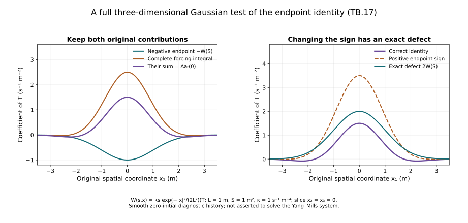

# Temporal boundary estimates and the endpoint identity

The gauge transformation at the physical heat boundary needs
time-integrated bounds on \(a_t(0)\) and its spatial derivatives.
The direct absolute integral of its second derivative is too
weak at the critical heat weight. We instead integrate the
complete heat equation first and prove the resulting endpoint
identity, including its sign and domain.

Use the actual regular caloric-temporal solution and the original
physical coordinate \(t\), speed \(c\), interval \(I\) and heat
interval \([0,S]\). The prerequisites are the [backward heat bounds](../classical-curlfree-backward-heat.html)
and [space-time tension estimates](../classical-spacetime-tension.html).
The temporal curvature is \(W=F_{st}\), with its actual Gauss
datum \(W(0)=0\).

The human-source comparison is Sung-Jin Oh,
[*Gauge choice for the Yang–Mills equations using the Yang–Mills heat
flow and local well-posedness in \(H^1\)*, arXiv:1210.1558v2](https://arxiv.org/abs/1210.1558v2),
the temporal connection estimate. The original author TeX,
especially lines 3981–4017, was read directly. The receiving
argument below retains all five boundary norms and visibly
corrects a local endpoint sign in the source display.
No novelty or completed physical continuation is claimed.

## 1. The original temporal heat forcing is integrable

The already proved equation HT.3 and actual Gauss datum give

\[
(\partial_s-\sum_jD_jD_j)W
 =Q_W:=2\sum_j[E_j,G_j],\qquad W(0)=0.
\tag{TB.1}
\]

The full contraction and bracket bound retain coefficient four.
Space-time Hölder, the exact factor \(s=s^{1/4}s^{3/4}\),
and heat Cauchy–Schwarz imply

\[
\int_0^S\|Q_W(s)\|_{L^2_{t,x}}ds
 \le L_W:=4e_0^2\mathcal G.
\tag{TB.2}
\]

Here \(e_0^2\) is ST.11's upper bound for the actual electric
heat-exponent-two norm, and \(\mathcal G\) is CF.28's upper bound
for the actual \(G_4^2\) norm. Their original forcing, physical
and endpoint dependencies remain in their full definitions.

Covariant spatial integration by parts, in the original
space-time measure, gives

\[
\tfrac12(\|W\|_2^2)'+\|D_xW\|_2^2
 =\operatorname{Re}\langle W,Q_W\rangle.
\]

The regularized norm argument in ST.15 with \(\Phi=0\), followed
by integration of this identity, proves

\[
\begin{aligned}
\sup_s\|W(s)\|_{L^2_{t,x}}&\le L_W,\\
\left(\int_0^S\|D_xW(s)\|_{L^2_{t,x}}^2ds\right)^{1/2}&\le L_W,\\
\left(\int_0^S\|\partial_xW(s)\|_{L^2_{t,x}}^2ds\right)^{1/2}
 &\le B_W:=(1+2\sqrt2 U_0S^{1/4})L_W.
\end{aligned}\tag{TB.3}
\]

The last line retains
\(\partial_jW=D_jW-[a_j,W]\) and uses
\(\int_0^S s^{-1/2}ds=2\sqrt S\).
No curvature multiplication operator appears in TB.1.

Expand all ordinary terms:

\[
N_W:=(\partial_s-\Delta)W
 =2\sum_j[a_j,\partial_jW]
   +[\sum_j\partial_ja_j,W]
   +\sum_j[a_j,[a_j,W]]+Q_W.
\tag{TB.4}
\]

Minkowski, TB.3 and the exact scalar integrals prove

\[
\begin{aligned}
\int_0^S\|N_W(s)\|_{L^2_{t,x}}ds
 \le L_N:={}&4\sqrt2 U_0S^{1/4}B_W\\
 &+(8\sqrt3 U_1S^{1/4}+8U_0^2\sqrt S)L_W+L_W .
\end{aligned}\tag{TB.5}
\]

For the first term the original coefficient is four; apply
Cauchy–Schwarz to \(s^{-1/4}\|\partial W\|_2\) in \(ds\).
Its scalar squared integral is \(2\sqrt S\).
For the second, divergence costs \(\sqrt3\), the bracket costs
two, and \(\int_0^S s^{-3/4}ds=4S^{1/4}\).
The double bracket costs four and
\(\int_0^S s^{-1/2}ds=2\sqrt S\).
The last term is exactly TB.2. Every original term is retained.

## 2. Integrate the heat equation before estimating the Laplacian

The endpoint gauge gives the actual identity
\(a_t(s)=-\int_s^S W(r)dr\). Therefore

\[
\|a_t(0)\|_{L^2_{t,x}}\le S L_W,\qquad
\|\partial_xa_t(0)\|_{L^2_{t,x}}\le\sqrt S B_W.
\tag{TB.6}
\]

The first integral is absolutely convergent in \(L^2_{t,x}\).
The derivative integral converges by Cauchy–Schwarz and TB.3,
and agrees with its distributional derivative.

For every positive \(\epsilon\), the full heat equation gives

\[
\begin{aligned}
\Delta a_t(\epsilon)
 &=-\int_\epsilon^S\Delta W(r)dr\\
 &=-W(S)+W(\epsilon)+\int_\epsilon^S N_W(r)dr .
\end{aligned}\tag{TB.7}
\]

Regularity through zero and the actual datum \(W(0)=0\) give
\(W(\epsilon)\to0\) in \(L^2_{t,x}\).
The last integral converges by TB.5. Together with the
\(L^2\) convergence of \(a_t(\epsilon)\), this proves the exact
boundary identity in distributions and in its resulting \(L^2\)
Laplacian domain:

\[
\Delta a_t(0)=-W(S)+\int_0^S N_W(r)dr,\qquad
\|\partial_x^{(2)}a_t(0)\|_{L^2_{t,x}}
 =\|\Delta a_t(0)\|_{L^2_{t,x}}\le L_W+L_N .
\tag{TB.8}
\]

The equality of full Hessian and Laplacian norms follows by
Plancherel exactly as in ST.20. Since \(a_t(0)\) and its Laplacian
are in \(L^2\), this also proves the required second-derivative
domain. It avoids an unjustified absolute integral of
\(\|\Delta W(r)\|_2\).

**Visible source correction.** Author line 4005 writes a positive
endpoint heat curvature after the preceding line's negative
integral of its heat derivative. For the original endpoint
convention the sign is negative, as TB.7 proves. The remaining
integrals at the heat boundary have lower endpoint zero.
The norm estimate in author line 4009 remains valid with the
correct sign and endpoint. This is a local identity correction;
no failure of the source theorem follows.

## 3. The required physical-time boundary norms

Put \(D_B=\sqrt S B_W\), \(H_B=L_W+L_N\).
At each original physical time, the previously proved
Morrey–Sobolev estimate gives

\[
\|a_t(0)\|_\infty
 \le C_MC_S\|\partial a_t(0)\|_2^{1/2}
                  \|\partial^{(2)}a_t(0)\|_2^{1/2}.
\]

Spatial L2/L6 interpolation gives the corresponding L3 bound
on its first derivative. Time Hölder and then the original
\(L^2_t\) to \(L^1_t\) inclusion therefore yield

\[
\begin{aligned}
\|a_t(0)\|_{L^1_tL^\infty_x}
 &\le |I|^{1/2}C_MC_S\sqrt{D_BH_B},\\
\|\partial_xa_t(0)\|_{L^1_tL^3_x}
 &\le |I|^{1/2}C_S^{1/2}\sqrt{D_BH_B},\\
\|\partial_x^{(2)}a_t(0)\|_{L^1_tL^2_x}
 &\le |I|^{1/2}H_B.
\end{aligned}\tag{TB.9}
\]

The time norm order is unchanged. For example, squaring the
pointwise Morrey inequality and applying time Cauchy–Schwarz
gives its \(L^2_tL^\infty_x\) bound before the factor
\(|I|^{1/2}\) is applied.

The remaining fixed-time boundary quantities follow directly
from ST.4's full ordinary coefficients. They are

\[
\begin{aligned}
\|\partial_xa_t(0)\|_{L^\infty_tL^2_x}
 &\le4cd^2\mathscr J_1S^{1/4},\\
\|a_t(0)\|_{L^\infty_tL^3_x}
 &\le2cd^2C_S^{1/2}\sqrt{\mathscr J_0\mathscr J_1}\sqrt S .
\end{aligned}\tag{TB.10}
\]

For the first line integrate the original
\(cd^2\mathscr J_1s^{-3/4}\).
For the second, spatial interpolation gives

\[
\|W(t,s)\|_3
 \le\|W(t,s)\|_2^{1/2}
          (C_S\|\partial_xW(t,s)\|_2)^{1/2}
 \le cd^2C_S^{1/2}\sqrt{\mathscr J_0\mathscr J_1}s^{-1/2},
\]

whose integral is \(2\sqrt S\).
These are uniform pointwise bounds integrated in heat, so no
interchange of a heat integral with a time supremum is assumed.

Thus all five temporal boundary norms in the source comparison
are controlled with exact receiving expressions. The formula
keeps every physical factor and finite endpoint, and the
Laplacian identity keeps its corrected sign. The physical gauge
ODE and final nonlinear wave closure are next receiving uses.

For the precise source-coordinate comparison, its temporal
connection is \(\widetilde a_0(x^0,x)=c^{-1}a_t(x^0/c,x)\).
Hence the two \(L^\infty_{x^0}\) boundary norms are \(c^{-1}\)
times the corresponding physical norms in TB.10. For each
spatial output norm \(X=L^\infty_x,L^3_x,L^2_x\) and its stated
derivative order, the \(L^1\) time comparison is exactly

\[
\int_{cI}\|\partial_x^{(j)}\widetilde a_0(x^0)\|_X\,dx^0
 =\int_I\|\partial_x^{(j)}a_t(t)\|_X\,dt .
\tag{TB.11}
\]

The factor \(c\) in the physical measure and \(c^{-1}\) in the
connection component have both been retained and multiplied.
This proves the receiving map for the source's five norms.

**Figure TB.** For the diagnostic history
\(W(s,x)=\kappa s e^{-|x|^2/(2L^2)}T\), with
\(L=1\) metre, \(S=1\) square metre,
\(\kappa=1\) per second per fourth power of metres and
\(T=\operatorname{diag}(i,-i)\), the plotted coefficients retain
the complete three-dimensional Laplacian.
The correct two-term identity equals \(\Delta a_t(0)\).
Changing only the endpoint sign adds \(2W(S)\).
This smooth zero-initial history tests the integration identity;
it is not asserted to solve the Yang–Mills system.
Exercise 6 proves every plotted expression.

## 4. Exercises with complete solutions

### Exercise 1. Expand the full ordinary temporal forcing

Starting from TB.1, expand \(\sum_jD_jD_jW\).

**Solution.** Apply
\(D_j=\partial_j+[a_j,\,\cdot\,]\) twice, differentiating
the coefficient in the first bracket. The result is

\[
\sum_jD_jD_jW
=\Delta W+2\sum_j[a_j,\partial_jW]
 +[\sum_j\partial_ja_j,W]
 +\sum_j[a_j,[a_j,W]].
\tag{TB.12}
\]

Subtract the unchanged Laplacian and add \(Q_W\) from
TB.1 to obtain TB.4. Both first-derivative copies remain;
there is no assumption that \(\operatorname{div}a=0\).

### Exercise 2. Evaluate the finite scalar heat integrals

Compute the integrals producing the linear coefficients in
TB.5, including a positive lower endpoint \(\varepsilon\).

**Solution.** The exact integrals are

\[
\int_\varepsilon^S s^{-1/2}ds
 =2(\sqrt S-\sqrt\varepsilon),\qquad
\int_\varepsilon^S s^{-3/4}ds
 =4(S^{1/4}-\varepsilon^{1/4}).
\tag{TB.13}
\]

For the transport term, the square root of the first integral
is used in Cauchy–Schwarz and then multiplied by \(4U_0\).
At zero this gives \(4\sqrt2 U_0S^{1/4}\).
The divergence term has original coefficient \(2\sqrt3 U_1\)
and uses the second integral, giving \(8\sqrt3 U_1S^{1/4}\).
The double bracket has coefficient \(4U_0^2\) and uses the
first integral directly, giving \(8U_0^2\sqrt S\).

### Exercise 3. Keep a general initial heat value

For a regular history with possibly nonzero \(W(0)\), derive
the boundary identity corresponding to TB.8.

**Solution.** The identity \(\Delta W=\partial_sW-N_W\)
and \(a_t(0)=-\int_0^S W(r)dr\) give

\[
\Delta a_t(0)=-W(S)+W(0)+\int_0^S N_W(r)dr .
\tag{TB.14}
\]

This follows first on \([\varepsilon,S]\), then by the
stated regularity at zero and integrability of the forcing.
The original Yang–Mills Gauss datum sets \(W(0)=0\);
it does not change the sign at \(S\).

### Exercise 4. Keep all mixed Hessian derivatives

Prove the exact Hessian/Laplacian norm equality for a matrix
field \(u\) in their L2 domains.

**Solution.** Apply Plancherel to every matrix entry. The
unchanged squared symbols satisfy

\[
\sum_{i,j}\xi_i^2\xi_j^2
=\sum_i\xi_i^4+2\sum_{i<j}\xi_i^2\xi_j^2
=(\xi_1^2+\xi_2^2+\xi_3^2)^2 .
\tag{TB.15}
\]

Thus the two off-diagonal occurrences for each unordered
pair are both retained. Multiplication by the same Fourier
density and integration proves
\(\|\partial_x^{(2)}u\|_2=\|\Delta u\|_2\), with the original
Fourier factors identical on both sides.

### Exercise 5. All physical time exponents

For \(\widetilde a_0(x^0,x)=c^{-1}a_t(x^0/c,x)\), prove
the time-norm comparison for \(1\le p\le\infty\).

**Solution.** For finite \(p\), change variables \(x^0=ct\)
in the full norm integral. This retains the component factor
\(c^{-p}\) and the measure factor \(c\), hence

\[
\|\partial_x^{(j)}\widetilde a_0\|_{L^p(cI;X)}
 =c^{1/p-1}\|\partial_x^{(j)}a_t\|_{L^p(I;X)} .
\tag{TB.16}
\]

For \(p=\infty\), composition preserves the essential
supremum and the factor is \(c^{-1}\).
In particular the factors at \(p=1,2,\infty\) are
\(1,c^{-1/2},c^{-1}\), respectively.

### Exercise 6. The Gaussian endpoint diagnostic

Retain \(L,S,\kappa>0\) and
\(\phi(x)=e^{-|x|^2/(2L^2)}\).
For \(W(s,x)=\kappa s\phi(x)T\), compute the complete
ordinary forcing and the two sides of the endpoint identity.

**Solution.** The full three-dimensional Laplacian is
\(\Delta\phi=(|x|^2/L^4-3/L^2)\phi\). Direct calculation gives

\[
\begin{aligned}
N_W&=\kappa\phi T-\kappa s\Delta\phi T,\qquad
a_t(0)=-\tfrac12\kappa S^2\phi T,\\
-W(S)+\int_0^S N_W(r)dr
 &=-\tfrac12\kappa S^2\Delta\phi T=\Delta a_t(0),\\
+W(S)+\int_0^S N_W(r)dr-\Delta a_t(0)
 &=2\kappa S\phi T.
\end{aligned}\tag{TB.17}
\]

All spatial, heat and amplitude factors remain.
The example is a regular diagnostic history for the identity;
no nonlinear field equation beyond its defined ordinary
forcing is being asserted.

### Exercise 7. Prove the limiting Hessian domain

Suppose \(u_\varepsilon\to u\) and
\(\Delta u_\varepsilon\to v\) in L2 as in TB.7–TB.8.
Prove that \(u\) has the asserted full L2 Hessian.

**Solution.** Testing against a compactly supported smooth
function and passing to the two L2 limits gives
\(\Delta u=v\) distributionally.
Fourier transformation gives
\(-|\xi|^2\widehat u=\widehat v\), so the integral of
\(|\xi|^4|\widehat u|^2\) is finite.
TB.15 identifies every mixed derivative and their full norm.
For completeness, at any original comparison length \(\ell>0\),

\[
|\xi|^2\le\tfrac12(\ell^{-2}+\ell^2|\xi|^4),\qquad
\|\partial_xu\|_2^2
 \le\tfrac12(\ell^{-2}\|u\|_2^2+\ell^2\|\Delta u\|_2^2).
\tag{TB.18}
\]

The first inequality is the nonnegativity of
\((\ell|\xi|^2-\ell^{-1})^2\).
It proves the first-derivative domain while retaining units.
No unproved interchange of an absolute Laplacian integral
with a limiting heat endpoint was used.

### Exercise 8. The time ODE made possible by the boundary bound

At a fixed spatial point let \(b(t)\) be an integrable
anti-Hermitian matrix on \(I\). Construct and prove uniqueness
of \(U'=Ub,\ U(t_*)=I\), and prove its norm bound.

**Solution.** For \(t\ge t_*\), the full ordered series is

\[
U(t)=I+\sum_{n=1}^{\infty}
 \int_{t_*<t_1<\cdots<t_n<t}
        b(t_1)\cdots b(t_n)\,dt_1\cdots dt_n .
\tag{TB.19}
\]

If \(B=\int_I\|b(t)\|_{\rm op}dt\), the \(n\)th term has
norm at most \(B^n/n!\). Thus the series converges uniformly
and absolutely and satisfies the integral equation
\(U(t)=I+\int_{t_*}^tU(r)b(r)dr\).
It is absolutely continuous and differentiates almost
everywhere to the stated ODE. On the other side of \(t_*\),
the same iterated Volterra integrals retain their oriented
endpoints; their absolute values have the same factorial bound.

For two bounded solutions, iteration of their difference
integral equation bounds that difference by its uniform norm
times \(B^n/n!\). Letting \(n\) increase proves uniqueness.
Since \(b^*=-b\), the absolutely continuous product satisfies
\((UU^*)'=U(b+b^*)U^*=0\); hence \(U\) is unitary.
The integral equation then gives
\(\|U(t)-I\|_{\rm op}\le\int_{t_*}^t\|b(r)\|_{\rm op}dr\)
for \(t\ge t_*\), with the corresponding unoriented interval
on the other side. Taking \(b=a_t(0)\), TB.9 supplies the
uniform time-integrability needed for this pointwise step.
Spatial derivative estimates for the gauge are a subsequent
calculation; they have not been inferred from this ODE alone.

## Further reading: spatial derivatives of the physical gauge

[Returning to physical temporal gauge](../classical-physical-gauge.html)
uses the five boundary norms proved here. GO.1–GO.39 constructs the
actual anchored matrix, proves its full spatial gradient and Hessian
bounds, and computes the exact connection and curvature maps. It
extends the pointwise ODE argument above to the spatial norms required
by the physical evolution.

## Further reading: comparing two connections

[Temporal-boundary differences](../classical-temporal-difference.html),
TD.1–TD.27, proves the full two-connection energy, forcing and physical-boundary estimates.
