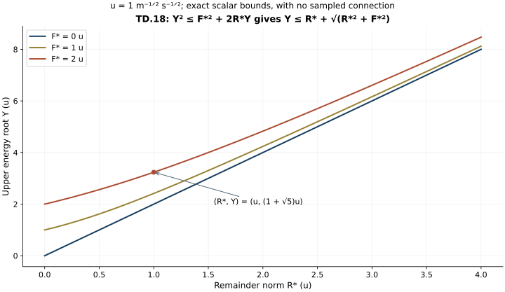

# Differences at the temporal heat boundary

This Unit 9 analytic chapter compares the temporal components of two
actual connections. It subtracts the full covariant equations, proves
two energy estimates, and integrates the original heat equation to the
physical boundary. The resulting four norms are exactly those needed
to compare the physical temporal gauges.

Read [the one-connection boundary proof](../classical-temporal-boundary.html),
TB.1–TB.11, and [the physical gauge construction](../classical-physical-gauge.html),
GO.1–GO.39. The order of the physical and heat norms matters throughout.
A difference of fields is used inside every norm.

Human-source context: Sung-Jin Oh,
[*Gauge choice for the Yang–Mills equations using the Yang–Mills heat flow
and local well-posedness in H1*, arXiv:1210.1558v2](https://arxiv.org/abs/1210.1558v2).
The proofs here use the complete linked course arguments and are
independent exposition. They make no novelty claim. Exact source
versions and bounded reading are retained in the course provenance.

## 1. Both original connections and every difference input

Write the two connections as \(a\) and \(a'\); a prime labels the
second connection and never a derivative. Their original speed is
the same \(c>0\), and both have \(a_s=a_s'=0\) and
\(a_t(S)=a_t'(S)=0\). Define

\[
\begin{aligned}
D_jX&=\partial_jX+[a_j,X],&
D_j'X&=\partial_jX+[a_j',X],\\
E_j&=F_{tj}^{a},&E_j'&=F_{tj}^{a'},\\
G_j&=F_{sj}^{a},&G_j'&=F_{sj}^{a'},\\
W&=F_{st}^{a},&W'&=F_{st}^{a'},\\
\eta_j&=a_j-a_j',&V&=W-W',\\
\delta E&=E-E',&\delta G&=G-G',\\
\vartheta(s)&=a_t(s)-a_t'(s).
\end{aligned}\tag{TD.1}
\]

All these fields remain in the original matrix representation.
Every derivative tuple contains all ordered spatial indices and
every output component. The matrix norm is Hilbert–Schmidt, with
\(|[X,Y]|\le2|X||Y|\). Both spatial connections are anti-Hermitian,
so \(D_j\) and \(D_j'\) satisfy covariant integration by parts
in the real Hilbert–Schmidt pairing. The physical measure is
\(dt\,d^3x\); the heat measure is \(ds/s\) only where stated.

For \(r=0,1\), retain the actual weighted spatial coefficient
norms

\[
\begin{aligned}
A_r&=\sup_{0<s\le S}s^{r/2+1/4}
                  \|\partial_x^{(r)}a_x(s)\|_{L^\infty_{t,x}},\\
A_r'&=\sup_{0<s\le S}s^{r/2+1/4}
                  \|\partial_x^{(r)}a_x'(s)\|_{L^\infty_{t,x}},\\
\delta A_r&=\sup_{0<s\le S}s^{r/2+1/4}
                  \|\partial_x^{(r)}\eta(s)\|_{L^\infty_{t,x}}.
\end{aligned}\tag{TD.2}
\]

The already proved \(U_r\) for each individual connection bound
its \(A_r\). The difference norms in TD.2 are actual norms of
the difference; they are not declared small or bounded by an
initial-data distance.

The four individual and two difference heat-space-time inputs are

\[
\begin{aligned}
e&=\|s^{1/4}\|E(s)\|_{L^4_{t,x}}\|_{L^2(ds/s)},&
e'&=\|s^{1/4}\|E'(s)\|_{L^4_{t,x}}\|_{L^2(ds/s)},\\
g&=\|s^{3/4}\|G(s)\|_{L^4_{t,x}}\|_{L^2(ds/s)},&
g'&=\|s^{3/4}\|G'(s)\|_{L^4_{t,x}}\|_{L^2(ds/s)},\\
\delta e&=\|s^{1/4}\|\delta E(s)\|_{L^4_{t,x}}\|_{L^2(ds/s)},&
\delta g&=\|s^{3/4}\|\delta G(s)\|_{L^4_{t,x}}\|_{L^2(ds/s)}.
\end{aligned}\tag{TD.3}
\]

They are finite for the current two regular connections; individual
upper bounds were already proved in ST, CF, HS and FC. The two
difference norms are also finite by their triangle inequalities.
Finiteness is not being substituted for a quantitative difference
estimate from the original data.

TB.1–TB.3 for the second connection gives the explicit numbers

\[
\begin{aligned}
L'&=4e'g',&B_D'&=L',&
B'&=(1+2\sqrt2 A_0'S^{1/4})L',\\
\sup_s\|W'(s)\|_{L^2_{t,x}}&\le L',\\
\left(\int_0^S\|D_x'W'(s)\|_{L^2_{t,x}}^2ds\right)^{1/2}
 &\le B_D',\\
\left(\int_0^S\|\partial_xW'(s)\|_{L^2_{t,x}}^2ds\right)^{1/2}
 &\le B'.
\end{aligned}\tag{TD.4}
\]

Every unweighted heat-gradient integral in TD.4 uses \(ds\),
exactly as in TB.3. The analogous first-connection constants may
also be retained, but the following proof uses a fixed unprimed
covariant operator and the displayed primed reference field.

## 2. The exact two-connection equation

The two original equations and their actual Gauss data are

\[
\begin{aligned}
(\partial_s-\sum_jD_jD_j)W&=2\sum_j[E_j,G_j],&W(0)&=0,\\
(\partial_s-\sum_jD_j'D_j')W'&=2\sum_j[E_j',G_j'],&W'(0)&=0.
\end{aligned}\tag{TD.5}
\]

In particular \(V(0)=0\), regardless of whether the original
spatial and electric data of the two connections agree. This is
the common zero Gauss heat datum, not an assumed equality of the
two solutions.

For any matrix field X the exact operator difference is

\[
\begin{aligned}
\sum_j(D_jD_j-D_j'D_j')X
={}&2\sum_j[\eta_j,\partial_jX]
 +[\sum_j\partial_j\eta_j,X]\\
&+\sum_j[\eta_j,[a_j,X]]
 +\sum_j[a_j',[\eta_j,X]].
\end{aligned}\tag{TD.6}
\]

To verify this, expand each \(D_jD_jX\) as

\[
\partial_j^2X+2[a_j,\partial_jX]
+[\partial_ja_j,X]+[a_j,[a_j,X]],
\]

then subtract the
primed expansion. The nested difference is exactly

\[
[a_j,[a_j,X]]-[a_j',[a_j',X]]
=[\eta_j,[a_j,X]]+[a_j',[\eta_j,X]].
\]

Expanding \(a_j=a_j'+\eta_j\) also displays its three terms

\[
[\eta_j,[a_j',X]]+[a_j',[\eta_j,X]]
+[\eta_j,[\eta_j,X]];
\]

the quadratic difference term has
not been removed by using the actual first connection in TD.6.

Set

\[
\begin{aligned}
Q_\delta&=2\sum_j([\delta E_j,G_j]+[E_j',\delta G_j]),\\
H_\eta&=2\sum_j[\eta_j,\partial_jW']
 +[\sum_j\partial_j\eta_j,W']\\
&\quad+\sum_j[\eta_j,[a_j,W']]
 +\sum_j[a_j',[\eta_j,W']],\\
H&=H_\eta+Q_\delta.
\end{aligned}\tag{TD.7}
\]

The electric difference is exact because

\[
[E_j,G_j]-[E_j',G_j']=[\delta E_j,G_j]+[E_j',\delta G_j].
\]

It equivalently has all three terms
\([\delta E_j,G_j']+[E_j',\delta G_j]+[\delta E_j,\delta G_j]\).
No difference-product term or contracted index is absent. Subtraction
of TD.5 now proves the full equation

\[
(\partial_s-\sum_jD_jD_j)V=H,\qquad V(0)=0.
\tag{TD.8}
\]

The original \(c\) does not occur explicitly in TD.5–TD.8, just
as in TB.1. The electric field remains \(F_{tj}\), rather than
\(c^{-1}F_{tj}\); all its original speed dependence remains in
the actual e inputs and their proved providers. No physical
coordinate or field has been rescaled.

## 3. Every new forcing term is integrable with its original weight

Physical Hölder, full-index Cauchy–Schwarz, and the exact weight
\(s=s^{1/4}s^{3/4}\) give

\[
\int_0^S\|Q_\delta(s)\|_{L^2_{t,x}}ds
 \le L_Q:=4(\delta e\,g+e'\delta g).
\tag{TD.9}
\]

Each original coefficient two is multiplied by the bracket factor
two, while Cauchy–Schwarz over all three spatial components costs
no further factor. Heat Cauchy–Schwarz applies to the two factors
in \(ds/s\), after the original \(ds\) integral is written with
its factor s.

At each heat time the four coefficient-difference contributions obey

\[
\begin{aligned}
\|H_\eta(s)\|_{L^2_{t,x}}\le{}&
4\delta A_0s^{-1/4}\|\partial_xW'(s)\|_{L^2_{t,x}}\\
&+2\sqrt3\delta A_1s^{-3/4}\|W'(s)\|_{L^2_{t,x}}\\
&+4\delta A_0A_0s^{-1/2}\|W'(s)\|_{L^2_{t,x}}\\
&+4A_0'\delta A_0s^{-1/2}\|W'(s)\|_{L^2_{t,x}}.
\end{aligned}\tag{TD.10}
\]

The divergence keeps all three diagonal terms and uses
\(|\sum_j\partial_j\eta_j|\le\sqrt3|\partial_x\eta|\).
For example

\[
|\sum_j[\eta_j,[a_j,W']]|\le
4(\sum_j|\eta_j|^2)^{1/2}(\sum_j|a_j|^2)^{1/2}|W'|.
\]

The last line has the same bound with its original bracket order.

The exact scalar heat integrals are
\(\int_0^S s^{-1/2}ds=2\sqrt S\) and
\(\int_0^S s^{-3/4}ds=4S^{1/4}\).
Cauchy–Schwarz in \(ds\) treats the first line of TD.10,
using the square root \(\sqrt2S^{1/4}\) of the first integral.
Consequently define the finite numbers

\[
\begin{aligned}
L_\eta={}&4\sqrt2\delta A_0S^{1/4}B'
 +8\sqrt3\delta A_1S^{1/4}L'\\
&+8\delta A_0A_0\sqrt S\,L'
 +8A_0'\delta A_0\sqrt S\,L',\\
L_H&=L_\eta+L_Q,\\
\int_0^S\|H_\eta(s)\|_{L^2_{t,x}}ds&\le L_\eta,
\qquad
\int_0^S\|H(s)\|_{L^2_{t,x}}ds\le L_H.
\end{aligned}\tag{TD.11}
\]

All four coefficient terms of TD.7 remain separately visible in
\(L_\eta\). In particular the weights on \(\delta A_0\) and
\(\delta A_1\) are the original \(s^{1/4}\) and \(s^{3/4}\);
no stronger zero-heat supremum of a coefficient is assumed.

## 4. Exact covariant energy and two complete estimates

Use the real Hilbert–Schmidt pairing, summed over every matrix
entry and integrated over \(I\times\mathbb R^3\). Spatial
covariant integration by parts in TD.8 gives the exact identity

\[
\frac12\frac{d}{ds}\|V(s)\|_{L^2_{t,x}}^2
 +\|D_xV(s)\|_{L^2_{t,x}}^2
 =\operatorname{Re}\langle V(s),H(s)\rangle_{L^2_{t,x}}.
\tag{TD.12}
\]

There is no physical-time integration by parts and no missing
physical endpoint term. The common \(s=0\) energy datum is zero.
Regularizing \(\|V\|_2\) by \((\|V\|_2^2+\epsilon^2)^{1/2}\),
dropping its nonnegative spatial energy term, and integrating proves
\(\|V(s)\|_2\le\int_0^s\|H(r)\|_2dr\) as
\(\epsilon\downarrow0\). Integrating TD.12 then gives

\[
\sup_s\|V(s)\|_2\le L_H,\qquad
\left(\int_0^S\|D_xV(s)\|_2^2ds\right)^{1/2}\le L_H.
\tag{TD.13}
\]

The following further estimate shows that the energy itself can
be bounded without \(\delta A_1\). Retain the exact operator
factorization, in its actual noncommuting order,

\[
D_jD_j-D_j'D_j'
 =D_j(D_j-D_j')+(D_j-D_j')D_j'.
\tag{TD.14}
\]

Since \((D_j-D_j')X=[\eta_j,X]\), define

\[
\begin{aligned}
F_j&=[\eta_j,W'],\\
R&=\sum_j[\eta_j,D_j'W']+Q_\delta,\\
H&=\sum_jD_jF_j+R.
\end{aligned}\tag{TD.15}
\]

This is the same H as TD.7, by the exact factorization TD.14;
no coefficient term is discarded. Its two useful norms are

\[
\begin{aligned}
F_*&=2\sqrt2\delta A_0S^{1/4}L',\\
R_*&=2\sqrt2\delta A_0S^{1/4}B_D'+L_Q,\\
\left(\int_0^S\|F(s)\|_{L^2_{t,x}}^2ds\right)^{1/2}
 &\le F_*,\qquad
\int_0^S\|R(s)\|_{L^2_{t,x}}ds\le R_*.
\end{aligned}\tag{TD.16}
\]

The first uses the full vector bound \(|F|\le2|\eta||W'|\)
and \(\int s^{-1/2}ds=2\sqrt S\). For R the single bracket
has coefficient two; Cauchy–Schwarz pairs
\(s^{-1/4}\) with \(\|D'W'\|_2\) in \(ds\). This proves
the factor \(2\sqrt2\), including the original covariant
gradient of the primed field.

The complete energy identity TD.12 is therefore also

\[
\frac12(\|V\|_2^2)'+\|D_xV\|_2^2
 =-\operatorname{Re}\langle D_xV,F\rangle
   +\operatorname{Re}\langle V,R\rangle.
\tag{TD.17}
\]

For \(Y_s=\sup_{0\le r\le s}\|V(r)\|_2\), Young's inequality
with coefficients \(1/2,1/2\), integrated from zero to any
\(\sigma\le s\), gives

\[
\|V(\sigma)\|_2^2+\int_0^\sigma\|D_xV(r)\|_2^2dr
 \le F_*^2+2Y_sR_*.
\tag{TD.18}
\]

Taking the supremum of the first term gives
\(Y_s^2\le F_*^2+2Y_sR_*\), whose nonnegative root is
\(Y_s\le R_*+\sqrt{R_*^2+F_*^2}\). At \(s=S\), the
same inequality for the gradient, together with

\[
(R_*+\sqrt{R_*^2+F_*^2})^2
=F_*^2+2R_*(R_*+\sqrt{R_*^2+F_*^2}),
\]

proves the same
upper bound for its heat \(L^2\) norm.

Both estimates are valid, so put

\[
\begin{aligned}
L_V&=\min\{L_H,\ R_*+\sqrt{R_*^2+F_*^2}\},\\
B_V&=(1+2\sqrt2 A_0S^{1/4})L_V,\\
\sup_s\|V(s)\|_{L^2_{t,x}}&\le L_V,\\
\left(\int_0^S\|D_xV(s)\|_{L^2_{t,x}}^2ds\right)^{1/2}
 &\le L_V,\\
\left(\int_0^S\|\partial_xV(s)\|_{L^2_{t,x}}^2ds\right)^{1/2}
 &\le B_V.
\end{aligned}\tag{TD.19}
\]

For the last line use the full identity
\(\partial_jV=D_jV-[a_j,V]\), whose bracket contributes
\(2A_0s^{-1/4}L_V\), and integrate its square with the same
\(2\sqrt S\) scalar integral. The minimum in TD.19 is taken
between two proved bounds. No ordering between them is assumed.
The second energy bound uses only \(\delta A_0,\delta e,\delta g\)
and the individual reference inputs. The later ordinary Laplacian
estimate still retains \(\delta A_1\) through \(L_H\).

## 5. The entire ordinary heat forcing of V

Expand the unprimed covariant operator in TD.8, preserving H:

\[
N_V:=(\partial_s-\Delta)V
 =2\sum_j[a_j,\partial_jV]
 +[\sum_j\partial_ja_j,V]
 +\sum_j[a_j,[a_j,V]]+H.
\tag{TD.20}
\]

The first three groups are the original ordinary coefficient
terms acting on the actual difference field. H is exactly the
four coefficient-difference terms and both electric-difference
terms in TD.7. The estimates in TD.19 and the original scalar
heat integrals now prove

\[
\begin{aligned}
L_N^\delta={}&4\sqrt2 A_0S^{1/4}B_V
 +8\sqrt3 A_1S^{1/4}L_V
 +8A_0^2\sqrt S\,L_V+L_H,\\
\int_0^S\|N_V(s)\|_{L^2_{t,x}}ds&\le L_N^\delta.
\end{aligned}\tag{TD.21}
\]

The coefficient four in the first line of TD.20 comes from its
two and the bracket's two; Cauchy–Schwarz with the ordinary
gradient gives \(4\sqrt2 A_0S^{1/4}B_V\). The divergence
coefficient is \(2\sqrt3\), multiplied by \(4S^{1/4}\).
The double bracket has coefficient four, multiplied by
\(2\sqrt S\). The last term is \(L_H\), rather than \(L_V\):
the improved covariant energy bound does not replace the
separately proved absolute integral of the full difference forcing.
This distinction retains the new differentiated-coefficient term.

## 6. The exact finite-endpoint identity and its zero-heat limit

The two endpoint temporal gauge conditions give the full difference
identity

\[
\vartheta(s)=-\int_s^S V(r)dr.
\tag{TD.22}
\]

Thus, without changing either endpoint,

\[
\begin{aligned}
\|\vartheta(s)\|_{L^2_{t,x}}&\le(S-s)L_V,\\
\|\partial_x\vartheta(s)\|_{L^2_{t,x}}
 &\le\sqrt{S-s}\,B_V.
\end{aligned}\tag{TD.23}
\]

The first heat integral is absolutely convergent in \(L^2_{t,x}\).
The derivative integral converges there by Cauchy–Schwarz in
\(dr\); distributional differentiation identifies it with the
gradient of the original \(\vartheta\). Both therefore have
their actual limits as \(s\downarrow0\).

For every positive \(s\), integrate
\(\Delta V=\partial_sV-N_V\) before estimating it. This gives
the exact signed identity

\[
\begin{aligned}
\Delta\vartheta(s)
 &=-\int_s^S\Delta V(r)dr\\
 &=-V(S)+V(s)+\int_s^S N_V(r)dr.
\end{aligned}\tag{TD.24}
\]

The first endpoint is negative, the lower endpoint is positive,
and the ordinary forcing integral is positive. At \(s=S\),
all three terms cancel to zero, as required by \(\vartheta(S)=0\).
Through the actual regular zero-heat boundary, \(V(s)\to V(0)=0\)
in \(L^2_{t,x}\), and TD.21 gives convergence of the final integral.
Together with the TD.23 limit, this proves in distributions and
in its resulting \(L^2\) Laplacian domain

\[
\begin{aligned}
\Delta\vartheta(0)&=-V(S)+\int_0^S N_V(r)dr,\\
\|\vartheta(0)\|_{L^2_{t,x}}&\le SL_V,\\
\|\partial_x\vartheta(0)\|_{L^2_{t,x}}
 &\le D_\delta:=\sqrt S\,B_V,\\
\|\partial_x^{(2)}\vartheta(0)\|_{L^2_{t,x}}
 &=\|\Delta\vartheta(0)\|_{L^2_{t,x}}
 \le H_\delta:=L_V+L_N^\delta.
\end{aligned}\tag{TD.25}
\]

For the full Hessian equality, spatial Fourier transformation
and the original Plancherel measure give
\(\sum_{i,j}|\xi_i\xi_j|^2=(\sum_i\xi_i^2)^2\).
The identity includes every mixed and diagonal entry. Since
\(\vartheta(0)\) and its distributional Laplacian are in
\(L^2_{t,x}\), this proves its \(L^2_tH^2_x\) domain and
the equality of the displayed two norms. No absolute integral
of \(\|\Delta V(r)\|_2\) was asserted finite.

For completeness, at any positive heat slice TD.24 gives the
uniform bound \(\|\partial_x^{(2)}\vartheta(s)\|_{L^2_{t,x}}
\le2L_V+L_N^\delta\). The improved coefficient in TD.25
uses the actual zero Gauss difference datum; dropping that
datum would retain an extra \(V(0)\) in the endpoint identity.

## 7. All temporal-boundary inputs required by the gauge difference

Put \(\delta b=\vartheta(0)=a_t(0)-a_t'(0)\), exactly the
difference used in GD.1. Its \(L^2_tH^2_x\) domain just proved
permits the original Morrey–Sobolev and Sobolev inequalities at
almost every physical time. Squaring the first and using
time Cauchy–Schwarz gives

\[
\begin{aligned}
\|\delta b\|_{L^2_tL^\infty_x}
 &\le C_MC_S\sqrt{D_\delta H_\delta},\\
\|\partial_x\delta b\|_{L^2_tL^3_x}
 &\le C_S^{1/2}\sqrt{D_\delta H_\delta},\\
\|\partial_x\delta b\|_{L^2_tL^6_x}
 &\le C_SH_\delta,\\
\|\partial_x^{(2)}\delta b\|_{L^2_{t,x}}
 &\le H_\delta.
\end{aligned}\tag{TD.26}
\]

For the second line, the pointwise spatial inequality is

\[
\|\partial\delta b\|_3
\le\|\partial\delta b\|_2^{1/2}
(C_S\|\partial^{(2)}\delta b\|_2)^{1/2},
\]

on the
full derivative tuple. Squaring and applying time
Cauchy–Schwarz proves it. The third line is the full-tuple
Sobolev inequality itself, followed by the actual time integral.
For the first line use precisely

\[
\|u\|_\infty\le C_MC_S
\|\partial u\|_2^{1/2}\|\partial^{(2)}u\|_2^{1/2}.
\]

For each \(t\in I\), let \(J_t\) be the unoriented segment
between the common anchor \(t_*\) and t. The four actual GD.2
integrals therefore satisfy

\[
\begin{aligned}
D_0(t)&:=\int_{J_t}\|\delta b(r)\|_{\infty;\mathrm{op}}dr
 \le |J_t|^{1/2}C_MC_S\sqrt{D_\delta H_\delta},\\
D_3(t)&:=\int_{J_t}\|\partial_x\delta b(r)\|_3dr
 \le |J_t|^{1/2}C_S^{1/2}\sqrt{D_\delta H_\delta},\\
D_6(t)&:=\int_{J_t}\|\partial_x\delta b(r)\|_6dr
 \le |J_t|^{1/2}C_SH_\delta,\\
D_2(t)&:=\int_{J_t}\|\partial_x^{(2)}\delta b(r)\|_2dr
 \le |J_t|^{1/2}H_\delta.
\end{aligned}\tag{TD.27}
\]

The operator matrix norm in \(D_0\) is at most its
Hilbert–Schmidt norm; no factor depending on matrix size is
needed. Each time inclusion is Cauchy–Schwarz on the actual
\(J_t\). The global \(I\)-constants in TD.25 bound the
restricted norms on every such segment. Alternatively, every
preceding step may be run directly on \(J_t\), since the heat
equation has no physical-time differentiation; that yields
the same formulas with the corresponding restricted inputs.
At the anchor, \(|J_t|=0\) and all four GD integrals vanish.

Equations TD.25–TD.27 are thus explicit estimates for every
temporal difference input in GD.5–GD.11. Substituting their
right sides into those nonnegative expressions gives complete
finite estimates for the corresponding gauge derivatives.
The spatial-connection, electric, and magnetic differences
that separately occur in GD.10–GD.12 remain their actual
displayed norms; this calculation has not replaced them by
an unproved initial-data distance.

## 8. Exact consequences, checks, and the next receiving calculation

Each displayed bound vanishes when
\(\delta A_0=\delta A_1=\delta e=\delta g=0\).
Indeed TD.9–TD.11 then give \(L_H=0\), and TD.19–TD.27
give \(V=0\), \(\vartheta=0\), and zero gauge-boundary
difference inputs. More generally the bounds prove continuity
of this temporal-boundary map in exactly these difference
norms on sets with bounded individual inputs. They retain
their original units and require no sum of differently
dimensioned quantities to define a distance.

The covariant energy strengthening TD.14–TD.19 proves a
further precise fact: \(\delta A_1\) is unnecessary for
\(\sup_s\|V\|_2\) and its covariant heat-gradient norm.
The full ordinary endpoint forcing TD.21 still includes
\(\delta A_1\) in \(L_H\). Thus the stronger energy estimate
has been propagated where proved, without silently deleting
the differentiated coefficient from the Laplacian estimate.

The [electric difference](../classical-electric-difference.html), ED.27–ED.28,
and [spatial heat-curvature difference](../classical-spatial-difference.html),
LG.31–LG.32, evaluate the corresponding inputs above. The
[physical gauge difference](../classical-gauge-difference.html), GD.15–GD.21,
uses all four temporal bounds. The complete physical initial-data
stability theorem remains the next argument; none is assumed here.

## 9. Worked example: retain both heat endpoints

Let \(F(x)=\exp(-|x|^2/\ell^2)T\), where \(\ell>0\) is an
original spatial length and \(T\) is a fixed anti-Hermitian matrix.
For this exact heat-history diagnostic choose \(V(s)=s^2F\).
Then \(N_V(s)=2sF-s^2\Delta F\) and

\[
 \vartheta(s)=-\frac{S^3-s^3}{3}F,\qquad
 -V(S)+V(s)+\int_s^SN_V(r)dr
 =-\frac{S^3-s^3}{3}\Delta F=\Delta\vartheta(s).
\]

The two terms proportional to \(F\) cancel exactly. The term involving
the actual upper heat endpoint remains in the Laplacian. This is a
diagnostic for TD.24, not a Yang–Mills solution.

The energy root in TD.18 has an equally direct scalar interpretation.
If \(F_*=2u\) and \(R_*=u\), where
\(u=1\,\mathrm m^{-1/2}\mathrm s^{-1/2}\) has the units of the
physical \(L^2_{t,x}\) norm of \(V\), the nonnegative root is
\((1+\sqrt5)u\). Its square equals \(F_*^2+2R_*(1+\sqrt5)u\).

*Figure: the scalar inequality in TD.18, with \(F_*=0,u,2u\).
The horizontal coordinate is the original remainder norm \(R_*\).
No connection is sampled. Reproducible source:*
[figure builder](../build/figures_f09_differences.py).

## 10. Exercises with full solutions

### Exercise 1. Subtract noncommuting squares

Prove TD.14 without commuting either operator.

**Solution.** Expand
\(D_j(D_j-D'_j)+(D_j-D'_j)D'_j\).
Its four products are \(D_jD_j-D_jD'_j+D_jD'_j-D'_jD'_j\).
The middle two cancel in their unchanged order. This is precisely
\(D_jD_j-D'_jD'_j\), and applying \(D_j-D'_j=[\eta_j,\cdot]\)
gives the exact divergence and remainder in TD.15.

### Exercise 2. Keep the quadratic difference

Expand the two nested terms of TD.6 using \(a_j=a'_j+\eta_j\).

**Solution.** They become

\[
[\eta_j,[a'_j,X]]+[\eta_j,[\eta_j,X]]+[a'_j,[\eta_j,X]].
\]

The middle term is quadratic in the connection difference. It remains
inside the original term \([\eta_j,[a_j,X]]\) before expansion.
Thus choosing an unprimed coefficient never deletes this contribution.

### Exercise 3. Solve the exact energy inequality

Solve \(Y^2\le F_*^2+2R_*Y\) for \(Y\ge0\).

**Solution.** Completing the square gives
\((Y-R_*)^2\le R_*^2+F_*^2\). Its upper root is
\(R_*+\sqrt{R_*^2+F_*^2}\); the lower root is nonpositive.
Substitution of the upper root into \(F_*^2+2R_*Y\) gives its
square. The same integrated inequality therefore bounds both the
supremum and the covariant heat-gradient norm, as used in TD.19.

### Exercise 4. Recover the ordinary gradient

Derive the extra factor in \(B_V\).

**Solution.** The exact identity is
\(\partial_jV=D_jV-[a_j,V]\). The full bracket tuple has norm
at most \(2A_0s^{-1/4}L_V\). Its heat \(L^2(ds)\) norm is
\(2A_0L_V(2\sqrt S)^{1/2}=2\sqrt2A_0S^{1/4}L_V\).
Minkowski adds this to the covariant gradient bound \(L_V\).
This gives \(B_V=(1+2\sqrt2A_0S^{1/4})L_V\).

### Exercise 5. Check the lower boundary in the worked history

Evaluate TD.24 for \(V(s)=s^2F\) at \(s=0\).

**Solution.** The right side is
\(-S^2F+\int_0^S(2rF-r^2\Delta F)dr\).
The first integral is \(S^2F\), so both copies cancel. The remaining
term is \(-S^3\Delta F/3\), exactly the Laplacian of
\(\vartheta(0)=-S^3F/3\). At \(s=S\), every difference and
integral is zero. Both original endpoints satisfy the identity.

### Exercise 6. Why the whole Hessian has the same norm

Prove the Hessian equality in TD.25.

**Solution.** In spatial Fourier variables, the squared full Hessian
multiplier is \(\sum_{i,j}\xi_i^2\xi_j^2=(\sum_i\xi_i^2)^2\).
This is the squared Laplacian multiplier. Integrating with the same
Plancherel measure, then with the unchanged physical time measure,
gives equality. Since the field and its distributional Laplacian
are in \(L^2_{t,x}\), these Fourier multipliers also establish
the stated \(L^2_tH^2_x\) domain.

### Exercise 7. Restrict to an anchored time segment

Derive \(D_0(t)\) from the first bound in TD.26.

**Solution.** The matrix operator norm is at most its Hilbert–Schmidt
norm. Cauchy–Schwarz on \(J_t\) gives
\(D_0(t)\le |J_t|^{1/2}\|\delta b\|_{L^2(J_t;L^\infty_x)}\).
Restriction decreases that norm, so TD.26 gives the first line of
TD.27. This is an integral on the original segment; it does not
assert a pointwise-in-time bound from a time integral.

### Exercise 8. Where the derivative difference is still needed

Does the second energy estimate remove \(\delta A_1\) from TD.25?

**Solution.** It removes \(\delta A_1\) from the second candidate
energy bound in TD.19. The ordinary forcing norm in TD.21 still
contains \(L_H=L_\eta+L_Q\), and TD.11 includes
\(8\sqrt3\delta A_1S^{1/4}L'\) in \(L_\eta\).
Hence the complete Hessian bound \(L_V+L_N^\delta\) retains
that contribution. Its energy part and ordinary forcing part
have different proved dependencies.
