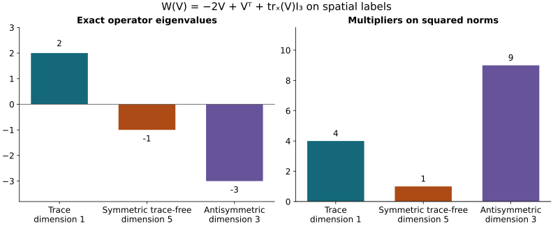

# The complete tension forcing

This analytic chapter belongs to Unit 9. The tension equation measures
the remaining discrepancy in the covariant wave equation. Its forcing
must be estimated with the other terms before a wave bound can close.
We first evaluate every tension coefficient using the lowest electric
input, then expand and bound the entire receiving operator.

Read [space-time tension](../classical-spacetime-tension.html),
ST.12–ST.32, [electric smoothing](../classical-electric-smoothing.html),
ES.19 and ES.25–ES.29, and the original equation in
[tension and null structure](../classical-tension-null-structure.html),
NX.19–NX.22. The estimates below retain each ordered derivative and
both original second-derivative terms. Several useful smaller constants
follow by computing their full operators together.

Human-source credit: Sung-Jin Oh,
[*Gauge choice for the Yang–Mills equations using the Yang–Mills heat flow
and local well-posedness in H1*, arXiv:1210.1558v2](https://arxiv.org/abs/1210.1558v2).
This is independent exposition of the complete receiving arguments. It
makes no novelty claim. Exact author-source and local-provider reading
coverage is retained in the course provenance.

**Result.** Every tension constant in ST.12, ST.16, ST.18, ST.21,
and ST.28–ST.32 has an explicit replacement depending on the electric
input only through \(e_0^2,e_0^\infty\). The entire spatial tension
contribution to NX.20,

\[
 \mathscr T_i=-\sum_jD_jD_jw_i+D_i\sum_jD_jw_j
              -2\sum_j[F_{ij},w_j]-Q_i,
 \tag{TW.1}
\]

then satisfies the all-order estimates TW.25 below with the original
weight \(s^{q/2+1}\), in both \(L^2(ds/s;L^2_{t,x})\) and
\(L^\infty(ds/s;L^2_{t,x})\). TW.26–TW.28 expand orders zero, one,
and two completely. The combined ordinary second derivative has
exact operator norm one relative to the full second derivative
tuple. Three further algebraic combinations give lower-order
constants \(6,4,4\), with every original term retained and the
combination proved in TW.17–TW.22.

## 1. Inputs and source use

The fields, physical interval \(I\), heat interval \([0,S]\), original
speed \(c>0\), spatial coordinates, and full ordered word/output
Hilbert–Schmidt tuple norms are exactly those in ST and ES. In
particular \(w_i(0)=0\), \(a_s=0\), \(E_i=F_{ti}\), and
\(D_j=\partial_j+[a_j,\cdot]\). The matrix connection is
anti-Hermitian, with the real Hilbert–Schmidt inner product and
\(|[a,v]|\le2|a||v|\). The heat extension is the current regular
solution, so every positive-slice manipulation below is legitimate
and the weighted zero-endpoint terms used by ST vanish.

The existing coefficient bounds are retained in full:

\[
 \|\partial_x^{(l)}a(s)\|_{L^\infty_{t,x}}
       \le U_l s^{-l/2-1/4},\qquad
 \|(\partial_x^{(l)}F_{ij}(s))_{i,j}\|_{L^\infty_{t,x}}
       \le C_l^F s^{-l/2-3/4},\qquad
 C_0^F=\sqrt2H_Fd.
 \tag{TW.2}
\]

Their complete formulas are ST Section 7, ST.26, and ES Section 1.
The base electric input is the unchanged ST.11 quantity

\[
\begin{split}
 e_0^p={}&cd_c\overline P_{3/2}^p
  +|I|^{1/4}cd^2\mathscr R_1\mathfrak H_1^p(1/4)\\
 &+2\mathcal A\,cd^2\mathscr R_0\mathfrak H_0^p(1/8),
 \qquad d_c=\sqrt2(2\pi c)^{-1/4},\qquad p=2,\infty.
\end{split}
\]

All its endpoint wave data, wave forcing, speed factors, and physical
time measure remain. The superscripts on \(e_0^p\) label the outer
heat exponent. Thus \((e_0^2)^2\) below means the square of the
heat-exponent-two constant.

## 2. Every electric forcing constant from the same lowest input

Use the finite \(S_q\) actually proved in ES.19, and set numerical
coefficients

\[
\begin{aligned}
 \alpha_0&=1,& \alpha_q&=2^{1/4}S_q\quad(q\ge1),\\
 \beta_q&=\alpha_{q+1}+2S^{1/4}\sum_{l=0}^q{q\choose l}U_l\alpha_{q-l},\\
 \chi_q&=12c^{-2}\sum_{l=0}^q{q\choose l}\alpha_l \beta_{q-l}.
\end{aligned}
 \tag{TW.3}
\]

ES.25 and ES.27 say exactly that
\(\widehat\eta_q^p=\alpha_qe_0^p\) and
\(\widehat\delta_q^p=\beta_qe_0^p\).
In both alternatives of the minimum in ES.29, the electric factors
are now the same scalar product. Therefore

\[
\begin{aligned}
 \widehat Q_q^1&=\chi_q(e_0^2)^2,\qquad
 \widehat Q_q^2=\chi_qe_0^2e_0^\infty,\qquad
 \widehat Q_q^\infty=\chi_q(e_0^\infty)^2,\\
 \left\|s^{q/2+1}
   \|\partial_x^{(q)}Q(s)\|_{L^2_{t,x}}\right\|_{L^p(ds/s)}
 &\le\widehat Q_q^p,\qquad p=1,2,\infty.
\end{aligned}
 \tag{TW.4}
\]

This is an algebraic evaluation of the proved ES.29 constants.
No electric field or heat norm has been changed. In particular

\[
\begin{aligned}
 \beta_0&=\alpha_1+2S^{1/4}U_0,\\
 \beta_1&=\alpha_2+2S^{1/4}(U_0\alpha_1+U_1),\\
 \beta_2&=\alpha_3+2S^{1/4}(U_0\alpha_2+2U_1\alpha_1+U_2),\\
 \beta_3&=\alpha_4+2S^{1/4}(U_0\alpha_3+3U_1\alpha_2+3U_2\alpha_1+U_3),\\
 \chi_0&=12c^{-2}\beta_0,\\
 \chi_1&=12c^{-2}(\beta_1+\alpha_1\beta_0),\\
 \chi_2&=12c^{-2}(\beta_2+2\alpha_1\beta_1+\alpha_2\beta_0),\\
 \chi_3&=12c^{-2}(\beta_3+3\alpha_1\beta_2+3\alpha_2\beta_1+\alpha_3\beta_0).
\end{aligned}
 \tag{TW.5}
\]

The replacements for all three ST.12 constants are
\(\widehat q_1=\widehat Q_0^1\),
\(\widehat q_2=\widehat Q_0^2\), and
\(\widehat q_\infty=\widehat Q_0^\infty\).
For the first, its original unweighted measure is retained:
\(\int_0^S\|Q(s)\|_2ds=\int_0^S s\|Q(s)\|_2ds/s\).

## 3. The original zero-order tension energy and the full recurrence

NX.7 and ST.2 give the actual equation

\[
 \partial_sw_i=\sum_jD_jD_jw_i+2\sum_j[F_{ij},w_j]+Q_i,
 \qquad w_i(0)=0.
 \tag{TW.6}
\]

The curvature multiplication operator has norm at most
\(4C_0^Fs^{-3/4}\). Keep the original accumulated coefficient

\[
 \Phi(s)=16C_0^Fs^{1/4}=16\sqrt2H_Fd\,s^{1/4}.
\]

Spatial covariant integration by parts in the full physical
\(L^2_{t,x}\) inner product gives exactly
\(\frac12(\|w\|_2^2)'+\|D_xw\|_2^2
=\operatorname{Re}\langle w,2[F,w]+Q\rangle\).
Multiplying this identity by \(e^{-2\Phi(s)}\), with the derivative
of that scalar multiplier retained, yields

\[
 \frac12\frac d{ds}(e^{-2\Phi}\|w\|_2^2)
       +e^{-2\Phi}\|D_xw\|_2^2
 \le e^{-2\Phi}\|w\|_2\|Q\|_2.
 \tag{TW.7}
\]

Regularize the norm before dividing, integrate, and decrease the
regularization to zero. Since \(w(0)=0\), this gives
\(e^{-\Phi(s)}\|w(s)\|_2
\le\int_0^s e^{-\Phi(r)}\|Q(r)\|_2dr\le\widehat q_1\).
Integration of TW.7, keeping its nonnegative final norm term,
then gives \(\int_0^S e^{-2\Phi}\|D_xw\|_2^2ds
\le\widehat q_1^2\). Thus the complete ST.16 replacements are

\[
\begin{aligned}
 \widehat A_0&=\widehat A_D=e^{\Phi(S)}\chi_0(e_0^2)^2,\\
 \widehat B_1&=\widehat A_\partial
        =\widehat A_D+2\sqrt2U_0S^{1/4}\widehat A_0,\\
 \sup_s\|w(s)\|_{L^2_{t,x}}&\le\widehat A_0,\\
 \left(\int_0^S\|D_xw(s)\|_{L^2_{t,x}}^2ds\right)^{1/2}
   &\le\widehat A_D,\\
 \left(\int_0^S\|\partial_xw(s)\|_{L^2_{t,x}}^2ds\right)^{1/2}
   &\le\widehat B_1.
\end{aligned}
 \tag{TW.8}
\]

The last bound uses the exact identity
\(\partial_jw=D_jw-[a_j,w]\), bracket constant two, TW.2,
and \(\int_0^S s^{-1/2}ds=2\sqrt S\).
No physical-time supremum was substituted for the physical-time
integral in this calculation.

Keep the entire ordinary forcing of the tension heat equation:

\[
 N_w=(\partial_s-\Delta)w
   =2\sum_j[a_j,\partial_jw]+[\sum_j\partial_ja_j,w]
        +\sum_j[a_j,[a_j,w]]+2[F,w]+Q.
 \tag{TW.9}
\]

We now construct, in finite order,

\[
 \sup_s s^{n/2}\|\partial_x^{(n)}w(s)\|_{L^2_{t,x}}
       \le\widehat A_n,\qquad
 \left(\int_0^S s^{n-1}
           \|\partial_x^{(n)}w(s)\|_{L^2_{t,x}}^2ds\right)^{1/2}
       \le\widehat B_n\quad(n\ge1).
 \tag{TW.10}
\]

When \(\widehat A_0,\ldots,\widehat A_q\) and
\(\widehat B_1,\ldots,\widehat B_{q+1}\) are available, define

\[
\begin{split}
 \widehat N_q^2={}&4S^{1/4}\sum_{l=0}^q{q\choose l}
                         U_l\widehat B_{q-l+1}\\
 &+2\sqrt6S^{1/4}\sum_{l=0}^q{q\choose l}
                         U_{l+1}\widehat A_{q-l}\\
 &+4\sqrt S\sum_{r+h+n=q}\frac{q!}{r!h!n!}
                         U_rU_h\widehat A_n\\
 &+4\sqrt2S^{1/4}\sum_{l=0}^q{q\choose l}
                         C_l^F\widehat A_{q-l}
 +\chi_qe_0^2e_0^\infty,\\
 \widehat A_{q+1}&=\widehat B_{q+2}
 =\sqrt{(q+1)\widehat B_{q+1}^{\,2}+(\widehat N_q^2)^2}.
\end{split}
 \tag{TW.11}
\]

There are no future constants on the right of the first four
lines. To prove the forcing estimate in this recurrence, distribute
the ordered derivative positions in TW.9 among its factors. The
first, second, and fourth products give exactly \({q\choose l}\)
subsets; the nested bracket gives exactly \(q!/(r!h!n!)\) ordered
three-part assignments. The full tuple constants are respectively
\(4,2\sqrt3,4,4\), as in ST.28. After extracting the indicated
derivative weights, the residual heat factors are \(s^{1/4}\),
\(s^{1/4}\), \(s^{1/2}\), and \(s^{1/4}\). The first term uses
\(\sup s^{1/4}=S^{1/4}\) and \(\widehat B_{q-l+1}\); the next
and fourth use
\(\|s^{1/4}\|_{L^2(ds/s)}=\sqrt2S^{1/4}\) and the indicated
\(\widehat A\); the third uses
\(\|s^{1/2}\|_{L^2(ds/s)}=\sqrt S\). TW.4 treats the last term.
Consequently
\(\|s^{q/2+1}\|\partial^{(q)}N_w(s)\|_2\|_{L^2(ds/s)}
\le\widehat N_q^2\).

The exact differentiated heat-energy calculation, summed over all
ordered words and outputs, is

\[
\begin{split}
 &s^{q+1}\|\partial_x^{(q+1)}w(s)\|_2^2
   +\int_0^s r^{q+1}\|\partial_x^{(q+2)}w(r)\|_2^2dr\\
 &\qquad\le(q+1)\int_0^s r^q
                 \|\partial_x^{(q+1)}w(r)\|_2^2dr
      +\int_0^s r^{q+1}\|\partial_x^{(q)}N_w(r)\|_2^2dr.
\end{split}
 \tag{TW.12}
\]

It follows by pairing \(\partial^{(q)}w\)'s equation with
\(-s^{q+1}\Delta\partial^{(q)}w\), integrating in the actual
physical variables, and using Young's inequality with both
coefficients \(1/2\). The full spatial Fourier identity
\(\|\Delta\partial^{(q)}w\|_2
=\|\partial^{(q+2)}w\|_2\) retains all mixed derivatives.
The lower heat boundary term vanishes by current regularity and
\(w(0)=0\). TW.12 proves the last line of TW.11 and hence TW.10
at every finite order.

After this step, the complete ST.32 replacement is

\[
\begin{split}
 \widehat N_q^\infty={}&4S^{1/4}\sum_{l=0}^q{q\choose l}
                         U_l\widehat A_{q-l+1}\\
 &+2\sqrt3S^{1/4}\sum_{l=0}^q{q\choose l}
                         U_{l+1}\widehat A_{q-l}\\
 &+4\sqrt S\sum_{r+h+n=q}\frac{q!}{r!h!n!}
                         U_rU_h\widehat A_n\\
 &+4S^{1/4}\sum_{l=0}^q{q\choose l}
                         C_l^F\widehat A_{q-l}
 +\chi_q(e_0^\infty)^2,\\
 \sup_s s^{q/2+1}\|\partial_x^{(q)}N_w(s)\|_{L^2_{t,x}}
 &\le\widehat N_q^\infty.
\end{split}
 \tag{TW.13}
\]

This uses the exact scalar suprema \(S^{1/4}\) and \(\sqrt S\)
instead of their heat-exponent-two norms. In particular the
explicit ST.18 and ST.21 replacements are

\[
\begin{aligned}
 \widehat N_0^2={}&4U_0S^{1/4}\widehat B_1
 +(2\sqrt6U_1S^{1/4}+4U_0^2\sqrt S
                  +8H_FdS^{1/4})\widehat A_0
 +\chi_0e_0^2e_0^\infty,\\
 \widehat N_0^\infty={}&4U_0S^{1/4}\widehat A_1
 +(2\sqrt3U_1S^{1/4}+4U_0^2\sqrt S
                  +4\sqrt2H_FdS^{1/4})\widehat A_0
 +\chi_0(e_0^\infty)^2.
\end{aligned}
 \tag{TW.14}
\]

These are exactly the old formulas with the proved new electric
inputs and the corresponding hatted tension constants.

## 4. Expand the entire receiving operator before estimating it

For the spatial output \(\nu=i\), the last term of NX.20 is
\(-Q_i\) by NX.6–NX.7 and ST.2. Expanding TW.1 gives

\[
\begin{split}
 \mathscr T_i={}&-\Delta w_i+\partial_i\sum_j\partial_jw_j\\
 &-2\sum_j[a_j,\partial_jw_i]
      +\sum_j[a_j,\partial_iw_j]
      +\sum_j[a_i,\partial_jw_j]\\
 &-[\sum_j\partial_ja_j,w_i]
      +\sum_j[\partial_i a_j,w_j]\\
 &-\sum_j[a_j,[a_j,w_i]]
      +\sum_j[a_i,[a_j,w_j]]\\
 &-2\sum_j[F_{ij},w_j]-Q_i.
\end{split}
 \tag{TW.15}
\]

All three first-order products, both differentiated-potential
products, both nested products, the original ordered curvature
contraction, and the original signed forcing remain. No covariant
derivative was exchanged to obtain TW.15.

### The ordinary second derivative: exact Fourier identity

Let \(\mathcal L_0w=-\Delta w+\nabla\operatorname{div}w\).
With the original spatial Fourier conventions,
\(\widehat{\mathcal L_0w}(\xi)
=(|\xi|^2I-\xi\xi^{\mathsf T})\widehat w(\xi)\).
For \(\xi\ne0\), this is
\(|\xi|^2P_{\mathrm{df}}(\xi)\widehat w\), where
\(P_{\mathrm{df}}=I-\xi\xi^{\mathsf T}/|\xi|^2\).
The complementary projection is
\(P_{\mathrm{cf}}=\xi\xi^{\mathsf T}/|\xi|^2\).
Multiplication proves \(P^2=P=P^*\), complementary sum \(I\),
and zero product. At \(\xi=0\), the original symbol is zero;
no \(L^2\) contribution can be supported at this single point.
Plancherel and \(\sum_{|I|=q}\xi_I^2=|\xi|^{2q}\) give the full
identity in the unchanged physical measure:

\[
\begin{split}
 \|\partial_x^{(q)}\mathcal L_0w\|_{L^2_{t,x}}^2
 &=\int_I\int_{\mathbb R^3}|\xi|^{2q+4}
        |P_{\mathrm{df}}\widehat w(t,\xi)|^2
                      \frac{d^3\xi}{(2\pi)^3}\,dt,\\
 \|\partial_x^{(q)}\mathcal L_0w\|_2^2
 +\|\partial_x^{(q)}\nabla\operatorname{div}w\|_2^2
 &=\|\partial_x^{(q+2)}w\|_2^2,\\
 \|\partial_x^{(q)}\mathcal L_0w\|_2
 &\le\|\partial_x^{(q+2)}w\|_2.
\end{split}
 \tag{TW.16}
\]

The constant one is optimal: take a nonzero smooth compactly
supported scalar \(\varphi(x)\), with one of its first two
derivatives nonzero, a nonzero fixed Lie-algebra matrix \(T\), and
a nonzero smooth compactly supported function of physical time.
Multiply that time function by
\((\partial_2\varphi,-\partial_1\varphi,0)T\).
Its divergence is exactly zero, and TW.16 is equality for every
finite \(q\). The original two second-derivative terms have thus
been compared exactly, with the complementary contribution
retained in the identity, rather than discarded as a separate term.
This proves optimality of the linear operator bound; that test tuple
is not asserted to be a Yang–Mills tension solution.

### Three first-order products together

For a Lie-algebra-valued spatial matrix \(V_{ji}\), define
\(\operatorname{tr}_xV=\sum_jV_{jj}\), the trace over spatial
labels only, and

\[
 W(V)=-2V+V^{\mathsf T}+(\operatorname{tr}_xV)I_3,
 \qquad
 \mathfrak B(a,V)_i=\sum_j[a_j,W(V)_{ji}].
 \tag{TW.17}
\]

For \(V_{ji}=\partial_jw_i\), this is precisely the entire second
line of TW.15, with all its signs and coefficients.
Retain the exact orthogonal spatial decomposition
\(V=V_{\mathrm{tr}}+V_{\mathrm{sym},0}+V_{\mathrm{alt}}\), where
\(V_{\mathrm{tr}}=I_3\operatorname{tr}_xV/3\),
\(V_{\mathrm{sym},0}=(V+V^{\mathsf T})/2-V_{\mathrm{tr}}\), and
\(V_{\mathrm{alt}}=(V-V^{\mathsf T})/2\).
Spatial transposition does not transpose the matrix entries.
Their inner products vanish by symmetry, antisymmetry, and the
zero spatial trace. Thus
\(W(V)=2V_{\mathrm{tr}}-V_{\mathrm{sym},0}-3V_{\mathrm{alt}}\) and

\[
 |W(V)|^2=4|V_{\mathrm{tr}}|^2+|V_{\mathrm{sym},0}|^2
                       +9|V_{\mathrm{alt}}|^2
       \le9|V|^2,
 \qquad |\mathfrak B(a,V)|\le6|a||V|.
 \tag{TW.18}
\]

The last inequality is the bracket bound followed by
Cauchy–Schwarz in \(j\) and then the full output sum in \(i\).
It improves the valid separate-term coefficient
\(4+2+2\sqrt3\). The decomposition proves an identity involving
every part of the original derivative matrix; it does not replace
the original field or its derivative norm.

### Both differentiated-potential products together

For \(A_{ij}=\partial_i a_j\), define

\[
 H(A)=A-(\operatorname{tr}_xA)I_3,\qquad
 \mathfrak C(A,w)_i=\sum_j[H(A)_{ij},w_j].
 \tag{TW.19}
\]

This is exactly the third line of TW.15. Expansion of its full
square gives
\(|H(A)|^2=|A|^2+|\operatorname{tr}_xA|^2\le4|A|^2\),
where the last bound is Cauchy–Schwarz over the three diagonal
entries. Consequently
\(|\mathfrak C(A,w)|\le2|H(A)||w|\le4|A||w|\).
The valid separate-term coefficient would be \(2\sqrt3+2\).
Both original terms are included in this stronger bound.

### Both nested products together, at every derivative order

Define the bilinear coefficient operator, retaining the bracket order,

\[
 (\mathfrak J(a,b)v)_i
    =-\sum_j[a_j,[b_j,v_i]]+\sum_j[a_i,[b_j,v_j]],\qquad
 \mathfrak J_{\mathrm s}(a,b)
       =\tfrac12(\mathfrak J(a,b)+\mathfrak J(b,a)).
 \tag{TW.20}
\]

The fourth line of TW.15 is exactly \(\mathfrak J(a,a)w\).
For anti-Hermitian \(a_j\), cyclicity of the matrix trace proves
\(\langle u,[a_j,v]\rangle=-\langle[a_j,u],v\rangle\).
Write \(A_j=\operatorname{ad}(a_j)\), define
\(B_av=\sum_jA_jv_j\), and
\(R_a=\sum_jA_j^*A_j\). Then
\(B_a^*z=(-A_iz)_i\), so exactly

\[
 \mathfrak J(a,a)=\operatorname{diag}(R_a,R_a,R_a)-B_a^*B_a.
 \tag{TW.21}
\]

Both terms are positive semidefinite self-adjoint operators,
each bounded above by \(4|a|^2I\): for the first use
\(\sum_{i,j}|[a_j,v_i]|^2\le4|a|^2|v|^2\); for the second use
\(|\sum_j[a_j,v_j]|^2\le4|a|^2|v|^2\).
Their difference therefore lies between
\(-4|a|^2I\) and \(4|a|^2I\), proving
\(\|\mathfrak J(a,a)\|_{\mathrm{op}}\le4|a|^2\).

Here is the needed bilinear bound, including its proof. For a fixed
output tuple \(v\), the real function
\(f_v(a)=\langle v,\mathfrak J(a,a)v\rangle\) is a quadratic
form on the finite-dimensional real Hilbert space of spatial
connection tuples. Its representing self-adjoint matrix has all
eigenvalues in \([-4|v|^2,4|v|^2]\), by the preceding diagonal
bound. Its polarized bilinear form is exactly
\(\langle v,\mathfrak J_{\mathrm s}(a,b)v\rangle\).
Cauchy–Schwarz in an orthonormal eigenbasis therefore gives
\(\left|\langle v,\mathfrak J_{\mathrm s}(a,b)v\rangle\right|
\le4|a||b||v|^2\).
The operator \(\mathfrak J_{\mathrm s}(a,b)\) is self-adjoint:
this follows either by polarization of TW.21 or by expanding the
two adjoints in TW.20. Its operator norm is its supremum absolute
quadratic form over unit \(v\). We have proved

\[
 \|\mathfrak J_{\mathrm s}(a,b)\|_{\mathrm{op}}
      \le4|a||b|.
 \tag{TW.22}
\]

Every ordinary derivative of the original anti-Hermitian connection
remains anti-Hermitian, so this bound applies to each coefficient
tuple used next.

For an ordered derivative word, the full Leibniz sum for
\(\mathfrak J(a,a)w\) ranges over every ordered partition
\(J_1\sqcup J_2\sqcup J_3\). Exchanging \(J_1\) and \(J_2\)
is a bijection of this same sum. Its average with that identical
sum is therefore exactly the sum with
\(\mathfrak J_{\mathrm s}(\partial_{J_1}a,\partial_{J_2}a)\)
in each summand. This identity retains every original term and
multiplicity, including empty and equal-sized subsets. TW.22
then gives coefficient four at every derivative order. Estimating
the two original nested terms independently would give eight.

## 5. Every ordinary derivative of the complete contribution

For a word \(I\) of length \(q\), let its subsets denote positions,
each with the original relative order. TW.15 has the exact derivative
expansion

\[
\begin{split}
 \partial_I\mathscr T={}&\mathcal L_0\partial_Iw
  +\sum_{J\subseteq I}
       \mathfrak B(\partial_Ja,\partial_{I\setminus J}\partial_xw)\\
 &+\sum_{J\subseteq I}
       \mathfrak C(\partial_J\partial_xa,\partial_{I\setminus J}w)\\
 &+\sum_{J_1\sqcup J_2\sqcup J_3=I}
       \mathfrak J(\partial_{J_1}a,\partial_{J_2}a)
                        \partial_{J_3}w\\
 &-2\left(\sum_j\sum_{J\subseteq I}
       [\partial_JF_{ij},\partial_{I\setminus J}w_j]\right)_i
   -\partial_IQ.
\end{split}
 \tag{TW.23}
\]

The third line may equivalently use \(\mathfrak J_{\mathrm s}\)
by the proved partition bijection. For any fixed subset assignment,
the map from a full word to its subwords is a bijection onto the
Cartesian product of word sets. The full squared tuple norm of a
tensor product is the product of the full squared tuple norms.
Together with TW.16, TW.18, TW.19, TW.22, the bracket constant two,
and physical Hölder, this proves

\[
\begin{split}
 \|\partial_x^{(q)}\mathscr T(s)\|_2\le{}&
       \|\partial_x^{(q+2)}w(s)\|_2\\
 &+6\sum_{l=0}^q{q\choose l}
       \|\partial^{(l)}a(s)\|_\infty
       \|\partial^{(q-l+1)}w(s)\|_2\\
 &+4\sum_{l=0}^q{q\choose l}
       \|\partial^{(l+1)}a(s)\|_\infty
       \|\partial^{(q-l)}w(s)\|_2\\
 &+4\sum_{r+h+n=q}\frac{q!}{r!h!n!}
       \|\partial^{(r)}a(s)\|_\infty
       \|\partial^{(h)}a(s)\|_\infty
       \|\partial^{(n)}w(s)\|_2\\
 &+4\sum_{l=0}^q{q\choose l}
       \|\partial^{(l)}F(s)\|_\infty
       \|\partial^{(q-l)}w(s)\|_2
       +\|\partial^{(q)}Q(s)\|_2.
\end{split}
 \tag{TW.24}
\]

Every norm here is in the original physical variables with the
full stated tuple. In particular the final curvature coefficient
four is the original coefficient two times the bracket constant
two, with all nine ordered spatial curvature pairs retained.

Define the explicit constants

\[
\begin{split}
 \Theta_q^2={}&\widehat B_{q+2}
  +6S^{1/4}\sum_{l=0}^q{q\choose l}U_l\widehat B_{q-l+1}\\
 &+4\sqrt2S^{1/4}\sum_{l=0}^q{q\choose l}U_{l+1}\widehat A_{q-l}
  +4\sqrt S\sum_{r+h+n=q}\frac{q!}{r!h!n!}U_rU_h\widehat A_n\\
 &+4\sqrt2S^{1/4}\sum_{l=0}^q{q\choose l}C_l^F\widehat A_{q-l}
  +\chi_qe_0^2e_0^\infty,\\[2mm]
 \Theta_q^\infty={}&\widehat A_{q+2}
  +6S^{1/4}\sum_{l=0}^q{q\choose l}U_l\widehat A_{q-l+1}\\
 &+4S^{1/4}\sum_{l=0}^q{q\choose l}U_{l+1}\widehat A_{q-l}
  +4\sqrt S\sum_{r+h+n=q}\frac{q!}{r!h!n!}U_rU_h\widehat A_n\\
 &+4S^{1/4}\sum_{l=0}^q{q\choose l}C_l^F\widehat A_{q-l}
  +\chi_q(e_0^\infty)^2,\\
 \left\|s^{q/2+1}
       \|\partial_x^{(q)}\mathscr T(s)\|_{L^2_{t,x}}\right\|_{L^p(ds/s)}
 &\le\Theta_q^p,\qquad q\ge0,\quad p=2,\infty.
\end{split}
 \tag{TW.25}
\]

For the first term, the squared heat integral is exactly
\(\int_0^S s^{q+1}\|\partial^{(q+2)}w(s)\|_2^2ds\), which is
bounded by \(\widehat B_{q+2}^{\,2}\); its supremum is bounded
by \(\widehat A_{q+2}\). In the first-order products the residual
factor after extracting \(\widehat B_{q-l+1}\), or
\(\widehat A_{q-l+1}\), is exactly \(s^{1/4}\).
The differentiated-potential and curvature terms also leave
\(s^{1/4}\), now using \(\widehat A_{q-l}\) and its exact
heat-exponent-two norm \(\sqrt2S^{1/4}\). The nested terms leave
\(s^{1/2}\), whose heat-exponent-two norm and supremum are both
\(\sqrt S\). These facts and TW.4 prove every line of TW.25.
The physical norm is taken before the heat norm throughout.

## 6. Orders zero, one, and two, without unevaluated combinatorial sums

At order zero, TW.25 is

\[
\begin{aligned}
 \Theta_0^2={}&\widehat B_2+6S^{1/4}U_0\widehat B_1
 +(4\sqrt2S^{1/4}U_1+4\sqrt S U_0^2
                       +4\sqrt2S^{1/4}C_0^F)\widehat A_0
 +\chi_0e_0^2e_0^\infty,\\
 \Theta_0^\infty={}&\widehat A_2+6S^{1/4}U_0\widehat A_1
 +(4S^{1/4}U_1+4\sqrt S U_0^2
                       +4S^{1/4}C_0^F)\widehat A_0
 +\chi_0(e_0^\infty)^2.
\end{aligned}
 \tag{TW.26}
\]

At order one, every differentiated placement is

\[
\begin{split}
 \Theta_1^2={}&\widehat B_3
  +6S^{1/4}(U_0\widehat B_2+U_1\widehat B_1)
  +4\sqrt2S^{1/4}(U_1\widehat A_1+U_2\widehat A_0)\\
 &+4\sqrt S(U_0^2\widehat A_1+2U_0U_1\widehat A_0)
  +4\sqrt2S^{1/4}(C_0^F\widehat A_1+C_1^F\widehat A_0)
  +\chi_1e_0^2e_0^\infty,\\
 \Theta_1^\infty={}&\widehat A_3
  +6S^{1/4}(U_0\widehat A_2+U_1\widehat A_1)
  +4S^{1/4}(U_1\widehat A_1+U_2\widehat A_0)\\
 &+4\sqrt S(U_0^2\widehat A_1+2U_0U_1\widehat A_0)
  +4S^{1/4}(C_0^F\widehat A_1+C_1^F\widehat A_0)
  +\chi_1(e_0^\infty)^2.
\end{split}
 \tag{TW.27}
\]

At order two the complete expansion is

\[
\begin{split}
 \Theta_2^2={}&\widehat B_4
  +6S^{1/4}(U_0\widehat B_3+2U_1\widehat B_2+U_2\widehat B_1)\\
 &+4\sqrt2S^{1/4}(U_1\widehat A_2+2U_2\widehat A_1+U_3\widehat A_0)\\
 &+4\sqrt S(U_0^2\widehat A_2+4U_0U_1\widehat A_1
                +2U_0U_2\widehat A_0+2U_1^2\widehat A_0)\\
 &+4\sqrt2S^{1/4}(C_0^F\widehat A_2+2C_1^F\widehat A_1
                                      +C_2^F\widehat A_0)
  +\chi_2e_0^2e_0^\infty,\\[2mm]
 \Theta_2^\infty={}&\widehat A_4
  +6S^{1/4}(U_0\widehat A_3+2U_1\widehat A_2+U_2\widehat A_1)\\
 &+4S^{1/4}(U_1\widehat A_2+2U_2\widehat A_1+U_3\widehat A_0)\\
 &+4\sqrt S(U_0^2\widehat A_2+4U_0U_1\widehat A_1
                +2U_0U_2\widehat A_0+2U_1^2\widehat A_0)\\
 &+4S^{1/4}(C_0^F\widehat A_2+2C_1^F\widehat A_1
                                      +C_2^F\widehat A_0)
  +\chi_2(e_0^\infty)^2.
\end{split}
 \tag{TW.28}
\]

For the quadratic derivative distributions in TW.28, the
coefficient four of \(U_0U_1\widehat A_1\) is \(2+2\) from the
two ordered potential roles. The coefficient two of
\(U_0U_2\widehat A_0\) is \(1+1\) from those roles, whereas the
coefficient two of \(U_1^2\widehat A_0\) is the two assignments
of the two distinct derivative positions. Thus coincident spatial
index values do not remove any term.

All constants in these three orders are a finite explicit
calculation. In particular the needed final derivative constants
are obtained in this order:

\[
\begin{aligned}
 \widehat A_1=\widehat B_2
   &=\sqrt{\widehat B_1^{\,2}+(\widehat N_0^2)^2},\\
 \widehat A_2=\widehat B_3
   &=\sqrt{2\widehat B_2^{\,2}+(\widehat N_1^2)^2},\\
 \widehat A_3=\widehat B_4
   &=\sqrt{3\widehat B_3^{\,2}+(\widehat N_2^2)^2},\\
 \widehat A_4=\widehat B_5
   &=\sqrt{4\widehat B_4^{\,2}+(\widehat N_3^2)^2}.
\end{aligned}
 \tag{TW.29}
\]

TW.14 supplies \(\widehat N_0^2\). For full explicitness the
other three required ordinary heat-forcing constants are

\[
\begin{split}
 \widehat N_1^2={}&4S^{1/4}(U_0\widehat B_2+U_1\widehat B_1)
 +2\sqrt6S^{1/4}(U_1\widehat A_1+U_2\widehat A_0)\\
 &+4\sqrt S(U_0^2\widehat A_1+2U_0U_1\widehat A_0)
 +4\sqrt2S^{1/4}(C_0^F\widehat A_1+C_1^F\widehat A_0)
 +\chi_1e_0^2e_0^\infty,\\
 \widehat N_2^2={}&4S^{1/4}(U_0\widehat B_3+2U_1\widehat B_2+U_2\widehat B_1)\\
 &+2\sqrt6S^{1/4}(U_1\widehat A_2+2U_2\widehat A_1+U_3\widehat A_0)\\
 &+4\sqrt S(U_0^2\widehat A_2+4U_0U_1\widehat A_1
               +2U_0U_2\widehat A_0+2U_1^2\widehat A_0)\\
 &+4\sqrt2S^{1/4}(C_0^F\widehat A_2+2C_1^F\widehat A_1+C_2^F\widehat A_0)
 +\chi_2e_0^2e_0^\infty,\\
 \widehat N_3^2={}&4S^{1/4}(U_0\widehat B_4+3U_1\widehat B_3
                           +3U_2\widehat B_2+U_3\widehat B_1)\\
 &+2\sqrt6S^{1/4}(U_1\widehat A_3+3U_2\widehat A_2
                           +3U_3\widehat A_1+U_4\widehat A_0)\\
 &+4\sqrt S(U_0^2\widehat A_3+6U_0U_1\widehat A_2
         +6U_0U_2\widehat A_1+6U_1^2\widehat A_1
         +2U_0U_3\widehat A_0+6U_1U_2\widehat A_0)\\
 &+4\sqrt2S^{1/4}(C_0^F\widehat A_3+3C_1^F\widehat A_2
                           +3C_2^F\widehat A_1+C_3^F\widehat A_0)
 +\chi_3e_0^2e_0^\infty.
\end{split}
 \tag{TW.30}
\]

Equations TW.3–TW.5, TW.8, TW.14, and TW.29–TW.30 evaluate
every scalar appearing in TW.26–TW.28 without a higher wave
input or an unconstructed future derivative constant.
In particular \(\Theta_2^\infty\) needs at most the electric
smoothing coefficient \(S_4\), potential coefficients through
\(U_4\), and spatial-curvature coefficients through \(C_3^F\).
All these are fixed-time coefficient constructions already proved.

## 7. Zero cases, endpoints, findings, and the next receiver

When \(d=0\), the original positive energy norm and H9.40 imply
\(E=F=0\). The actual electric and tension equations with their
zero data give \(Q=w=0\). The upper constants above remain finite
and valid even if a retained potential representative is nonzero.
No construction divides by \(d\), \(e_0^2\), or
\(e_0^\infty\). If both electric input constants are zero,
TW.4, TW.8, and TW.11 give every hatted tension constant zero.
All displayed inequalities include the actual endpoint \(S\).
Their heat-exponent-two integrals are on \((0,S]\), with no
unweighted derivative integrability at zero assumed.

The [finite wave argument](../classical-finite-wave-bound.html) uses TW.25
with the complete other spatial and temporal contributions. The tension
bound proved here is one input to that full argument.

## 8. Worked example: the full spatial matrix operator

TW.17 acts on the spatial labels of a matrix-valued tensor. Its three
orthogonal parts have multipliers \(2,-1,-3\): trace, symmetric
trace-free, and antisymmetric, respectively. For a fixed nonzero
Lie-algebra matrix \(T\), exact examples of these parts are

\[
 V_{\rm tr}=\operatorname{diag}(T,T,T),\quad
 V_{{\rm sym},0}=\operatorname{diag}(T,-T,0),\quad
 V_{\rm alt}=\begin{pmatrix}0&T&0\\-T&0&0\\0&0&0\end{pmatrix}.
\]

Direct substitution into \(-2V+V^{\mathsf T}+\operatorname{tr}_x(V)I_3\)
gives \(2V_{\rm tr},-V_{{\rm sym},0},-3V_{\rm alt}\).
All entries of the original tensor are retained. Its squared norm
contributions are therefore multiplied by \(4,1,9\).

*Figure: TW.17–TW.18. These are the spectrum and real dimensions of
the spatial-label operator, per matrix coordinate. The matrix entries
themselves are not transposed. Reproducible source:*
[figure builder](../build/figures_f09_finite_argument.py).

## 9. Exercises with full solutions

### Exercise 1. Preserve the zero-order electric coefficient

Evaluate \(\beta_0,\chi_0\) from TW.3.

**Solution.** Since \(\alpha_0=1\), the only summand gives
\(\beta_0=\alpha_1+2S^{1/4}U_0\). The second single-term sum
gives \(\chi_0=12c^{-2}\beta_0\). Thus its two contributions are
\(12c^{-2}\alpha_1\) and \(24c^{-2}S^{1/4}U_0\), retaining
the original potential term and physical speed.

### Exercise 2. The weighted energy multiplier

Differentiate \(e^{-2\Phi}\|w\|_2^2/2\) and recover TW.7.

**Solution.** Its derivative is
\(e^{-2\Phi}(\tfrac12(\|w\|_2^2)'-\Phi'\|w\|_2^2)\).
The curvature term in the original energy identity is bounded by
\(4C_0^Fs^{-3/4}\|w\|_2^2\), and
\(\Phi'=4C_0^Fs^{-3/4}\). These cancel in the upper bound.
The covariant derivative energy remains nonnegative, and the forcing
is bounded by \(e^{-2\Phi}\|w\|_2\|Q\|_2\), exactly as in TW.7.

### Exercise 3. The first recurrence step

Which already known constants suffice to obtain \(\widehat A_1\)
and \(\widehat B_2\)?

**Solution.** TW.8 gives \(\widehat A_0,\widehat B_1\).
TW.14 then evaluates \(\widehat N_0^2\) from these, the original
coefficient bounds and \(e_0^2e_0^\infty\). TW.11 at \(q=0\)
therefore gives
\(\widehat A_1=\widehat B_2=
\sqrt{\widehat B_1^{\,2}+(\widehat N_0^2)^2}\).
No \(\widehat A_1\) appears in that forcing input, so the step is not circular.

### Exercise 4. The complementary Fourier energy

For a real nonzero frequency \(\xi\), verify TW.16 for an arbitrary
complex amplitude \(v\).

**Solution.** Write \(v=P_{\rm df}v+P_{\rm cf}v\), whose parts
are orthogonal. The two symbols are \(|\xi|^2P_{\rm df}v\)
and \(-|\xi|^2P_{\rm cf}v\). Their squared norms add to
\(|\xi|^4|v|^2\). Multiplication by \(|\xi|^{2q}\), integration
with the original Plancherel measure and then physical time gives
the full identity TW.16. The minus sign in the longitudinal symbol
does not affect its square but remains part of the operator.

### Exercise 5. The trace contribution

For \(H(A)=A-(\operatorname{tr}_xA)I_3\), calculate its full squared norm.

**Solution.** Expanding all three diagonal squares gives
\(|A|^2-2|\operatorname{tr}_xA|^2+3|\operatorname{tr}_xA|^2
=|A|^2+|\operatorname{tr}_xA|^2\).
Cauchy–Schwarz gives \(|\operatorname{tr}_xA|^2\le3|A|^2\),
so \(|H(A)|\le2|A|\). The matrix bracket adds its factor two,
giving the complete coefficient four in TW.19.

### Exercise 6. Why averaging preserves all nested terms

Explain why every differentiated nested contribution may use
\(\mathfrak J_{\rm s}\) in TW.23.

**Solution.** The sum runs over every ordered partition
\((J_1,J_2,J_3)\) of derivative positions. Swapping its first two
parts is a bijection of the same index set, including empty parts.
The sum therefore equals its version with the two coefficient slots
interchanged. Averaging those two equal sums gives exactly
\(\mathfrak J_{\rm s}\) term by term. No coefficient or derivative
placement is removed. TW.22 then supplies its factor four.

### Exercise 7. The cubic coefficient four at order two

Account for the coefficient of \(U_0U_1\widehat A_1\) in the cubic
part of TW.28 before its outer factor \(4\sqrt S\).

**Solution.** The orders \((r,h,n)=(0,1,1)\) and \((1,0,1)\)
each have multinomial multiplicity \(2!/(0!1!1!)=2\).
They correspond to the two labelled potential slots. Their scalar
norm products agree, so the total coefficient is \(2+2=4\).
The equality of scalar products does not exchange the original matrix brackets.

### Exercise 8. Zero electric input

Prove that both zero electric inputs force every hatted tension
coefficient to vanish in the displayed recurrence.

**Solution.** If \(e_0^2=e_0^\infty=0\), TW.4 gives every
\(\widehat Q_q^p=0\), and TW.8 gives
\(\widehat A_0=\widehat B_1=0\). If all constants up to the
current recurrence step vanish, each product in TW.11 has a zero
tension factor and its final electric product is zero. Thus
\(\widehat N_q^2=0\) and
\(\widehat A_{q+1}=\widehat B_{q+2}=0\). Induction proves the
claim for every finite order, without division by a zero input.
