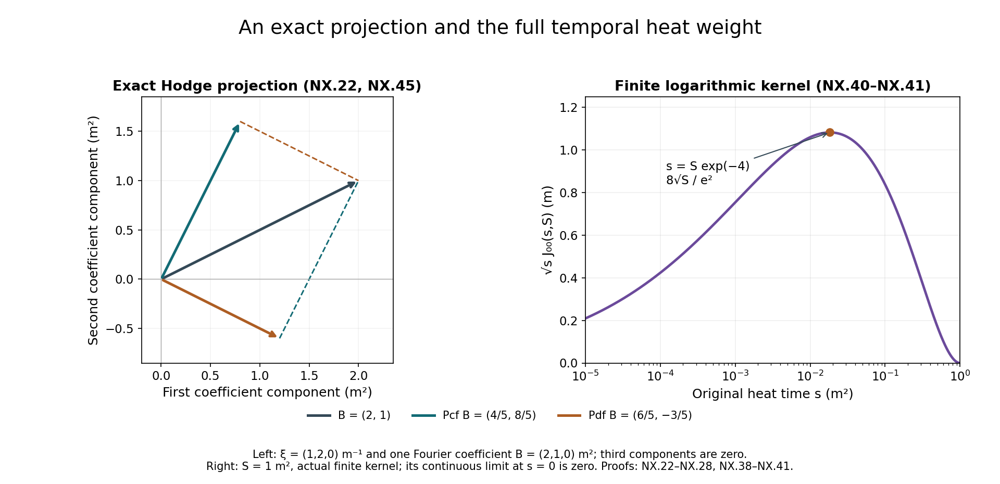

# Tension, spatial decomposition and the nonlinear wave equation

[Wave energy, dispersion and null forms](../classical-wave-estimates.html)
proved the estimates for a prescribed forcing. We now derive the actual
forcing supplied by the heat-extended Yang–Mills connection. The
tension field measures the failure of the physical Yang–Mills equation
away from its original heat boundary. Its equation has zero initial
datum and quadratic curvature forcing. This yields better heat weights
than the generic curvature estimate.

The second part constructs the spatial projections and an antisymmetric
potential. It proves the exact map from the divergence-free interaction
to the null forms already estimated. The third part controls the physical
time derivative of the temporal connection, retaining both finite heat
endpoints and the logarithmic contribution.

We use the regular caloric-temporal solution already constructed in
[the dynamic heat chapter](../classical-dynamic-heat.html), on its original
physical interval and original heat interval \(0\le s\le S\). All tensor
norms, covariant Sobolev constants and curvature constants are those proved
in [curvature heat analysis](../classical-heat-analysis.html).
The exact reverse-derivative polynomial is proved in
[potential estimates](../classical-potential-estimates.html), HP.22–HP.24.
The weighted energy calculation and the constants \(K_m,M_m\) are proved in
[fixed-time estimates](../classical-fixed-time-estimates.html), HT.18–HT.27.
These are explicit preceding proofs, not assumed estimates.

The human-source comparison is Sung-Jin Oh,
[*Gauge choice for the Yang–Mills equations using the Yang–Mills heat flow
and local well-posedness in \(H^1\)*, arXiv:1210.1558v2](https://arxiv.org/abs/1210.1558v2),
the nonlinear wave estimates and the appendix deriving the covariant
equations. The receiving proofs below are independently written and
retain the original physical metric and every coefficient. Source
reading is bounded to the ranges recorded in the provenance; no
whole-paper acceptance or novelty claim is made.

## 1. The original physical tensor and exact equations

Keep coordinates \((t,x^1,x^2,x^3,s)\), metric
\(\operatorname{diag}(-c^2,1,1,1)\), the caloric-temporal connection
\(a\), and its actual curvature. Let
\(\epsilon_t=-c^{-2}\), \(\epsilon_i=1\), so \(D^\mu=\epsilon_\mu D_\mu\)
with each contracted index explicitly summed below. Define

\[
G_\mu=F_{s\mu}=\sum_jD_jF_{j\mu},\quad
E_i=F_{ti},\quad W=G_t,\quad
w_\nu=\sum_\mu\epsilon_\mu D_\mu F_{\nu\mu}.
\tag{NX.1}
\]

This is the source's tension convention. In original physical
components it gives exactly

\[
w_t=-W,\qquad w_i=c^{-2}D_tE_i-G_i,\qquad w_\nu(0)=0.
\tag{NX.2}
\]

The last statement uses the actual physical Yang–Mills equation
at the original heat boundary; it is not imposed on arbitrary
dynamic heat connections.

Antisymmetry and the covariant commutator prove

\[
\sum_iD_iG_i
 =\tfrac12\sum_{i,j}[D_i,D_j]F_{ji}
 =\tfrac12\sum_{i,j}[F_{ij},F_{ji}]=0.
\tag{NX.3}
\]

Likewise
\(\sum_\mu\epsilon_\mu D_\mu w_\mu
=\tfrac12\sum_{\mu,\nu}\epsilon_\mu\epsilon_\nu
[F_{\mu\nu},F_{\mu\nu}]=0\).
Using NX.2 gives the complete temporal identity

\[
D_tW=-c^2\sum_jD_jw_j,\qquad
\partial_tW=-c^2\sum_j(\partial_jw_j+[a_j,w_j])-[a_t,W].
\tag{NX.4}
\]

All signs follow from the actual definition. In particular, the
spatial divergence in this formula has a negative sign.

Put \(\mathcal L=D_s-\sum_jD_jD_j\).
Start with the already proved curvature heat equation and commute
\(D_s\) through the definition of \(w\):

\[
\begin{aligned}
D_sw_\nu={}&\sum_\mu\epsilon_\mu
D_\mu\left(\sum_jD_jD_jF_{\nu\mu}
                    -2\sum_j[F_{\nu j},F_{\mu j}]\right)
+\sum_\mu[G^\mu,F_{\nu\mu}]\\
={}&\sum_jD_jD_jw_\nu
+2\sum_{\mu,j}[F^{\mu j},D_jF_{\nu\mu}]
-2\sum_{\mu,j}[D^\mu F_{\nu j},F_{\mu j}]\\
&-2\sum_{\mu,j}[F_{\nu j},D^\mu F_{\mu j}].
\end{aligned}\tag{NX.5}
\]

To check every canceled term, commuting \(D^\mu\) through \(D_jD_j\)
produces
\([F^{\mu j},D_jF_{\nu\mu}]+D_j[F^{\mu j},F_{\nu\mu}]\).
Expanding the latter gives a second copy of its derivative term,
plus \([D_jF^{\mu j},F_{\nu\mu}]\).
The sum \(D_jF^{\mu j}=-G^\mu\) cancels the last bracket in the
first line. No derivative order is exchanged elsewhere.

Since \(\sum_\mu D^\mu F_{\mu j}=-w_j\), bracket antisymmetry in
the remaining differentiated factor gives

\[
\mathcal Lw_\nu
=2\sum_j[F_{\nu j},w_j]
+2\sum_{\mu,j}[F^{\mu j},D_\mu F_{\nu j}+D_jF_{\nu\mu}].
\tag{NX.6}
\]

For \(\nu=i\), the full Bianchi identity gives
\(D_tF_{ij}=D_iE_j-D_jE_i\). Thus no physical time derivative
is left in the forcing:

\[
\begin{aligned}
\mathcal Lw_i&=2\sum_j[F_{ij},w_j]+Q_i,\\
Q_i&=2\sum_{k,j}[F_{kj},D_kF_{ij}+D_jF_{ik}]\\
&\quad-2c^{-2}\sum_j[E_j,D_iE_j-2D_jE_i].
\end{aligned}\tag{NX.7}
\]

This exact expression retains all nine spatial pairs, all three
electric pairs, each sign and the original electric metric factor.

There is a further exact cancellation within the two spatial sums.
Exchanging the two dummy labels in the second gives
\(\sum_{k,j}[F_{jk},D_kF_{ij}]
=-\sum_{k,j}[F_{kj},D_kF_{ij}]\).
This is a bijection of all nine ordered pairs; diagonal terms
vanish by \(F_{kk}=0\). Thus their full sum is zero, while
neither individual sum is presumed zero. The termwise bound
below remains valid. [Space-time tension estimates](../classical-spacetime-tension.html),
ST.1–ST.2, uses the stronger electric-only expression with
its original factor \(c^{-2}\), and proves all ensuing
space-time bounds through every ordinary derivative order.

## 2. Base bound with the actual curvature coefficients

Use the earlier H9 curvature norm \(f_m=\|D^{(m)}F\|_{2,c}\),
original \(d\), and actual \(S\) with \(S^{1/4}d\le\varepsilon_*\).
The covariant Morrey bound already proved there is

\[
\|F(s)\|_{\infty,c}
\le H_Fd\,s^{-3/4},\qquad
H_F=C_MC_S\sqrt{R_1R_2}.
\tag{NX.8}
\]

For the vector \(w=(w_1,w_2,w_3)\), the operator
\(v\mapsto (2\sum_j[F_{ij},v_j])_i\) has pointwise norm at most
\(4\sqrt2\,|F|_c\): the bracket bound is two and
\(\sum_{i,j}|F_{ij}|^2=2\sum_{i<j}|F_{ij}|^2\).
Define the actual nonnegative integrable coefficient

\[
a_0(s)=4\sqrt2\|F(s)\|_{\infty,c},\qquad
\Phi_0(s)=\int_0^s a_0(r)\,dr
\le16\sqrt2 H_Fd\,s^{1/4}.
\tag{NX.9}
\]

The complete forcing in NX.7 satisfies
\(\|Q(s)\|_1\le108\sqrt3\,f_0(s)f_1(s)\).
Indeed each spatial pair has two terms with equation/bracket
coefficient four, totaling \(9\cdot8=72\). The electric terms
have coefficients four and eight for each of three indices,
totaling 36. The two electric norms supply \(c^2\), canceled
only by the displayed \(c^{-2}\). Each output component has
this bound, and the full three-vector costs \(\sqrt3\).

The covariant scalar comparison applied to
\(e^{-\Phi_0(s)}w(s)\) gives

\[
\|w(s)\|_2\le108\sqrt3(8\pi)^{-3/4}R_0d\,
 e^{\Phi_0(S)}
 \int_0^s(s-r)^{-3/4}f_1(r)\,dr .
\tag{NX.10}
\]

For precision, the transformed equation contains the zeroth-order
operator \(\mathcal A_0-a_0(s)\mathrm{Id}\), whose quadratic form
is nonpositive by its operator bound. The scalar comparison proof
therefore applies with forcing \(e^{-\Phi_0}Q\); reversing the
invertible scalar multiplication gives NX.10. The original field
and the entire integral \(\Phi_0\) are retained.

Apply the exact scalar kernel estimate HT.8–HT.11 in ordinary
\(ds,dr\) measure. With its unchanged beta integral \(B_*^{\rm heat}\),

\[
\begin{aligned}
Z_w&=\left(\int_0^S s^{-1/2}\|w(s)\|_2^2ds\right)^{1/2}
       \le K^w_{-1}d^2,\\
K^w_{-1}
 &=108\sqrt3(8\pi)^{-3/4}R_0^2B_*^{\rm heat}e^{A_0},\\
A_m&=16\sqrt2(m+1)H_F\varepsilon_* .
\end{aligned}\tag{NX.11}
\]

The finite heat interval and zero initial tension are unchanged.
The exponential accounts for the actual curvature coefficient;
no additional smallness assumption has been inserted.

## 3. Full differentiated equation and triangular constants

For an ordered word \(I=(i_1,\ldots,i_m)\), keep every placement:

\[
\begin{aligned}
\mathcal LD_Iw_i={}&2D_I\sum_j[F_{ij},w_j]+D_IQ_i\\
&+2\sum_{r=1}^m D_{i_1}\cdots D_{i_{r-1}}
       \sum_k[F_{i_rk},D_kD_{i_{r+1}}\cdots D_{i_m}w_i].
\end{aligned}\tag{NX.12}
\]

This follows by successively commuting \(\mathcal L\) with each
derivative using HT.2. Do not commute spatial derivatives.

Terms in which no derivative falls on the displayed curvature
form an operator \(\mathcal A_m\) on the full output/word tuple.
The original output-index operator has norm at most
\(4\sqrt2\|F\|_{\infty,c}\). For each of the \(m\) commutator
positions, the corresponding operator replaces just the index
\(i_r\) by \(k\); its norm on that tensor index is bounded by the
same quantity. Therefore

\[
\|\mathcal A_m(s)\|_{\rm op}
\le a_m(s):=4\sqrt2(m+1)\|F(s)\|_{\infty,c},\qquad
\Phi_m(s)=\int_0^sa_m(r)dr\le A_m.
\tag{NX.13}
\]

For terms with \(l\ge1\) derivatives on curvature the number
of placements is
\({m\choose l}+\sum_{r=l+1}^m{r-1\choose l}
 ={m+1\choose l+1}\), exactly as HT.12–HT.14.
Let \(h_m=\|D^{(m)}w\|_2\). Their full-tuple remainder
\(\mathcal R_m\) obeys

\[
\|\mathcal R_m(s)\|_2
\le12\,3^{(m+1)/2}
 \sum_{l=1}^m{m+1\choose l+1}
 \|D^{(l)}F(s)\|_{\infty,c}\,h_{m-l}(s).
\tag{NX.14}
\]

The coefficient keeps equation factor two, bracket factor two,
three contraction indices and all \(3^{m+1}\) word/output
components. The sum is empty at \(m=0\).

For the completely differentiated \(Q\), the same 108 coefficients
as in the base estimate, Hölder \(L^6L^3\), and covariant Sobolev give

\[
\begin{aligned}
\|D^{(m)}Q(s)\|_2\le{}&
108\,3^{(m+1)/2} C_S^{3/2}
 \sum_{l=0}^m{m\choose l}
 f_{l+1}(s)\sqrt{f_{m-l+1}(s)f_{m-l+2}(s)},\\
\int_0^Ss^{m/2+1/4}\|D^{(m)}Q(s)\|_2ds
\le{}&d^2\,Q_m^*,\\
Q_m^*={}&108\,3^{(m+1)/2} C_S^{3/2}
 \sum_{l=0}^m{m\choose l}R_l\sqrt{R_{m-l}R_{m-l+1}} .
\end{aligned}\tag{NX.15}
\]

Every subset retains its ordered derivative on the two original
factors. The time exponents are exactly
\(l/2+(m-l)/4+(m-l+1)/4=m/2+1/4\);
Hölder \(2,4,4\) uses the three original H9 integral bounds.

Define the actual two weighted quantities

\[
U_m^w=\sup_{0<s\le S}s^{m/2+1/4}h_m(s),\qquad
V_m^w=\left(\int_0^Ss^{m+1/2}h_{m+1}(s)^2ds\right)^{1/2}.
\tag{NX.16}
\]

If lower orders have been established, covariant Morrey gives
\(\|D^{(l)}F(s)\|_{\infty,c}
 \le C_MC_S\sqrt{R_{l+1}R_{l+2}}d\,s^{-l/2-3/4}\).
Multiplying NX.14 by \(s^{m/2+1/4}\) leaves exactly \(s^{-3/4}\).
Its complete integral is \(4S^{1/4}\). Hence

\[
\begin{aligned}
\int_0^Ss^{m/2+1/4}\|\mathcal R_m(s)\|_2ds
&\le d^2 B_m^*,\\
B_m^*&=48\,3^{(m+1)/2}C_MC_S\varepsilon_*
 \sum_{l=1}^m{m+1\choose l+1}
       \sqrt{R_{l+1}R_{l+2}}K^w_{m-l}.
\end{aligned}\tag{NX.17}
\]

This is a genuine induction: every \(m-l\) is smaller than \(m\).

Here is the energy step, including its original field map.
The tuple \(e^{-\Phi_m(s)}D^{(m)}w\) has a nonpositive
zeroth-order quadratic form by NX.13, and its spatial derivative
tuple is \(e^{-\Phi_m(s)}D^{(m+1)}w\), since \(\Phi_m\) depends
only on \(s\) at this fixed physical time. Apply the full weighted
energy calculation HT.18–HT.21 to this tuple. Its prior weighted
norm is bounded by \(Z_w\) for \(m=0\), and by \(V^w_{m-1}\)
for \(m\ge1\), because \(e^{-\Phi_m}\le1\).
Its forcing integral is bounded by \(d^2(Q_m^*+B_m^*)\).
Multiplying back by at most \(e^{A_m}\) proves

\[
\begin{aligned}
K_m^w&=e^{A_m}
 \left(2\sqrt{m+1/2}\,K^w_{m-1}+4(Q_m^*+B_m^*)\right),\\
U_m^w+V_m^w&\le K_m^w d^2,\qquad m\ge0.
\end{aligned}\tag{NX.18}
\]

The initial weighted term is zero for the regular original data,
and all spatial boundary terms use the earlier covariant cutoff
argument. The formula defines each constant from lower orders
and the already proved curvature constants. It proves every
covariant spatial order of the actual tension field, on the same
original interval. At \(d=0\), curvature vanishes and the actual
zero-data equation gives \(w=0\), so this case is included.

## 4. Exact wave equation receiving the tension bound

Apply \(D^\mu\) to
\(D_\mu G_\nu+D_sF_{\nu\mu}-D_\nu G_\mu=0\).
Commuting the two derivatives in each of the latter terms gives

\[
D^\mu D_\mu G_\nu
=-D_sw_\nu+D_\nu\sum_jD_jw_j
                    +2\sum_\mu[G^\mu,F_{\nu\mu}].
\tag{NX.19}
\]

The divergence identity used here is
\(D^\mu G_\mu=\sum_jD_jw_j\), obtained by commuting \(D^\mu\)
through \(D_jF_{j\mu}\); its remaining curvature self-bracket
vanishes. Substitution of NX.6 yields the complete equation

\[
\begin{aligned}
D^\mu D_\mu G_\nu={}&2\sum_\mu[G^\mu,F_{\nu\mu}]
-\sum_jD_jD_jw_\nu+D_\nu\sum_jD_jw_j\\
&-2\sum_j[F_{\nu j},w_j]
-2\sum_{\mu,j}[F^{\mu j},D_\mu F_{\nu j}+D_jF_{\nu\mu}].
\end{aligned}\tag{NX.20}
\]

For any original tensor component \(X\), the exact conversion to
the operator of the wave chapter is

\[
\begin{aligned}
\Box_cX={}&D^\mu D_\mu X
+2c^{-2}[a_t,\partial_tX]
+c^{-2}[\partial_ta_t,X]+c^{-2}[a_t,[a_t,X]]\\
&-2\sum_j[a_j,\partial_jX]
-\sum_j[\partial_ja_j,X]-\sum_j[a_j,[a_j,X]] .
\end{aligned}\tag{NX.21}
\]

This follows by expanding each \(D_\mu D_\mu\); it retains every
original time and spatial term. It supplies the exact receiving
equation, but does not by itself estimate all of its space-time
forcing terms. The spatial null-form interaction and temporal connection are treated below; the full nonlinear closure remains subsequent work.

## 5. Original fields and the two Fourier projections

Let \(B=(B_1,B_2,B_3)\) be a regular spatial vector of matrices
on a compact physical interval \(I\), and let \(u\) be a regular
matrix field. The wave norms are those of HW.26, with original
\(\Box_c\) and Euclidean full output tuples.

For \(\xi\ne0\), define

\[
\widehat{(P_{\rm cf}B)}_i(\xi)
=\frac{\xi_i\sum_j\xi_j\widehat B_j(\xi)}{|\xi|^2},
\qquad
P_{\rm df}B=B-P_{\rm cf}B.
\tag{NX.22}
\]

At the single point zero any value of the multiplier gives the
same \(L^2\) field; no component of an \(L^2\) Fourier transform
can be supported at that point. The matrices
\(P_{\rm cf}(\xi)=\xi\xi^{\mathsf T}/|\xi|^2\) and
\(P_{\rm df}(\xi)=I-P_{\rm cf}(\xi)\) satisfy
\(P^2=P=P^*\), their product is zero, and their sum is \(I\).
Indeed multiplication of \(\xi\xi^{\mathsf T}\) by itself gives
\(|\xi|^2\xi\xi^{\mathsf T}\). Thus Plancherel proves both
orthogonal projections and their exact decomposition on the
original \(L^2\) vector field. They commute with every spatial
derivative, \(\partial_t\), \(\Box_c\), and the Fourier weights
in HW.26; their norms on these full tuples are at most one.

For an original caloric connection, set
\(B(s)=a(s)-a(S)=-\int_s^SG(r)\,dr\), at fixed \(s>0\).
NX.3 gives
\(\sum_j\partial_jG_j=-\sum_j[a_j,G_j]\), so exactly

\[
\begin{aligned}
\sum_i\partial_iB_i(s)
 &=\int_s^S\sum_j[a_j(r),G_j(r)]\,dr,\\
(P_{\rm cf}B)_i(s)
 &=\partial_i\Delta^{-1}
       \int_s^S\sum_j[a_j(r),G_j(r)]\,dr .
\end{aligned}\tag{NX.23}
\]

Here \(\Delta^{-1}\) has the actual symbol \(-|\xi|^{-2}\);
the composite \(\partial_i\Delta^{-1}\operatorname{div}\)
has exactly the multiplier in NX.22. The second line is
interpreted by this verified composite, so its low-frequency
meaning is the original \(L^2\) field. Its positive sign is
the consequence of the original negative backward heat integral.

## 6. Antisymmetric potential and exact null identity

Define an antisymmetric matrix array by

\[
C_{ki}=\partial_k\Delta^{-1}B_i-\partial_i\Delta^{-1}B_k,
\qquad C_{ik}=-C_{ki},\quad C_{ii}=0.
\tag{NX.24}
\]

Its Fourier multiplier is
\(-i(\xi_k\widehat B_i-\xi_i\widehat B_k)/|\xi|^2\).
This defines a tempered distribution: near zero,
Cauchy–Schwarz with \(\int_{|\xi|<1}|\xi|^{-2}d\xi=4\pi\)
makes the product locally integrable; at high frequency
regularity suffices. Its first derivatives are bounded
multipliers of the original \(B\), and hence are regular.
The exact divergence is

\[
\sum_k\partial_kC_{ki}
 =B_i-\partial_i\Delta^{-1}\sum_k\partial_kB_k
 =(P_{\rm df}B)_i.
\tag{NX.25}
\]

This identity is an equality of the original Fourier
distributions and of their regular differentiated fields.

For matrices retain the ordered commutator null form

\[
Q^{[\,]}_{ki}(C,u)
=[\partial_kC,\partial_iu]-[\partial_iC,\partial_ku]
=Q_{ki}(C,u)+Q_{ki}(u,C).
\tag{NX.26}
\]

Expand the two products on the right to verify every matrix
order. Antisymmetry in \(k,i\) gives the actual interaction

\[
\sum_i[(P_{\rm df}B)_i,\partial_iu]
 =\frac12\sum_{k,i}Q^{[\,]}_{ki}(C_{ki},u)
 =\sum_{k<i}Q^{[\,]}_{ki}(C_{ki},u).
\tag{NX.27}
\]

Indeed in the second term of the full ordered sum, exchange
\(k,i\) and use \(C_{ik}=-C_{ki}\); it becomes minus the
first term, so the difference is twice that term.
Both members of each unordered pair then agree. This proves
the exact map to the null forms rather than identifying the
two expressions by an analogy.

## 7. Norm of the complete antisymmetric map

At every nonzero spatial frequency,

\[
\sum_{k<i}|\xi_k\widehat B_i-\xi_i\widehat B_k|^2
 =|\xi|^2\sum_i|\widehat B_i|^2
          -\left|\sum_i\xi_i\widehat B_i\right|^2
 =|\xi|^2|\widehat{P_{\rm df}B}|^2.
\tag{NX.28}
\]

This follows by expanding all three squares and their cross
terms, entry by entry for Hilbert–Schmidt matrices. Thus
\(|D|C\), with the three unordered output pairs, has the same
\(L^2\) norm as \(P_{\rm df}B\). The full six ordered pairs
would instead have twice the squared norm; none are discarded.

Because the map commutes with time, space and wave operators,
NX.28 gives, at any original time \(t_0\),

\[
\begin{aligned}
\left(\sum_{k<i}E_1(C_{ki};t_0)^2\right)^{1/2}
 &=E_0(P_{\rm df}B;t_0),\\
\left(\sum_{k<i}
       \||D|\Box_cC_{ki}(r)\|_2^2\right)^{1/2}
 &=\|\Box_cP_{\rm df}B(r)\|_2 .
\end{aligned}\tag{NX.29}
\]

No supremum has been interchanged with a sum in this identity.

Let \(q_c=\sqrt{2/(\pi c)}\), the proved constant HW.25.
For adjoints,
\(Q_{ki}(u,C)=-Q_{ki}(C^*,u^*)^*\), as follows by reversing
the two matrix products. All norms and original wave
energies are preserved by adjoints. Therefore HW.25 gives

\[
\|Q^{[\,]}_{ki}(C_{ki},u)\|_{L^2_{t,x}}
\le2q_c
 \left(E_1(C_{ki};t_0)
       +c\|\Box_cC_{ki}\|_{L^1_t\dot H^1_x}\right)
 \left(E_0(u;t_0)
       +c\|\Box_cu\|_{L^1_tL^2_x}\right).
\tag{NX.30}
\]

Initially apply this with bounded annular cutoffs to \(B\)
so that each \(C\) is itself regular. Sum over the three
unordered pairs, apply Cauchy–Schwarz on that finite sum,
and use NX.29. For the forcing, perform this same finite
Cauchy–Schwarz at each \(r\) before integrating. This yields

\[
\begin{aligned}
\left\|\sum_i[(P_{\rm df}B)_i,\partial_iu]\right\|_{L^2_{t,x}(I)}
\le{}&2\sqrt3\,q_c\,
 \left(E_0(P_{\rm df}B;t_0)
       +c\|\Box_cP_{\rm df}B\|_{L^1_tL^2_x}\right)\\
&\qquad{}\cdot
 \left(E_0(u;t_0)
       +c\|\Box_cu\|_{L^1_tL^2_x}\right)\\
\le{}&2\sqrt3\,q_c\,\|B\|_{\mathsf S_c^1(I)}
                         \|u\|_{\mathsf S_c^1(I)}.
\end{aligned}\tag{NX.31}
\]

The last line uses the projection contraction and
Cauchy–Schwarz in the original \(dt\) measure.

For removal of the annular cutoff, its first derivatives of
\(C\) converge in every required \(H^m\), since their
multipliers on \(B\) are bounded. Consequently all products
in NX.27 converge locally as distributions. NX.30–NX.31 applied
to differences make the interactions Cauchy in \(L^2\);
their limit is the actual left side of NX.31. This supplies
the estimate on the original regular \(B,u\), even when the
undifferentiated potential \(C\) is not in \(L^2\).

## 8. The untouched heat weights

At each actual \(s>0\), NX.31 applies to \(B(s)\) and
\(u(s)=s^{(m-1)/2}\partial_x^{(m-1)}G_i(s)\).
Its spatial derivative is exactly
\(s^{-1/2}\nabla_j u\), with \(\nabla_j=\sqrt s\,\partial_j\).
For the source's mixed forcing norm, the original multiplier
is
\(s^2\,s^{-1/4-3/4}=s\) on \(L^2_{t,x}\).
Hence the actual estimate is

\[
\begin{aligned}
\bigl\|s\sum_j[(P_{\rm df}B(s))_j,\partial_ju(s)]\bigr\|_{L^2_{t,x}}
\le2\sqrt3\,q_c\,
 \|B(s)\|_{\mathsf S_c^1}\,
 s\|u(s)\|_{\mathsf S_c^1}.
\end{aligned}\tag{NX.32}
\]

In the precise weights of HW.35,
\(s^{1/4}\|B\|_{\mathfrak S_c^1}=\|B\|_{\mathsf S_c^1}\) and
\(s^{5/4}\|u\|_{\mathfrak S_c^1}=s\|u\|_{\mathsf S_c^1}\).
Taking the supremum of the first factor and the original
\(L^p(ds/s)\) norm, \(p=2\) or \(\infty\), of the second proves
the corresponding complete mixed estimate. The finite
interval remains \((0,S]\). No endpoint has been replaced
by one and no derivative or heat factor is removed.

## 9. The physical derivative of the temporal connection

The bounds in this section hold at each original physical time.
For estimates on a compact time interval take the supremum of the
explicit already constructed endpoint-dependent constants. The original
regular solution makes these finite; the remaining global continuation
argument must control their dependence. No new physical solution is
obtained by this operation.

Write \(H_l=C_MC_S\sqrt{K_{l+1}K_{l+2}}\), from HT.41, and define

\[
Z_l=C_MC_S\sqrt{K^w_{l+1}K^w_{l+2}},\qquad
\mathcal B_m[v]=b_m(S^{1/4}M_0,\ldots,S^{1/4}M_{m-1};
                       v_0,\ldots,v_m).
\tag{NX.33}
\]

The same covariant Morrey–Sobolev proof applied to NX.18 gives

\[
\|D^{(l)}w(s)\|_\infty\le d^2 Z_l s^{-l/2-1}.
\tag{NX.34}
\]

Indeed the two adjacent weighted \(L^2\) bounds have exponents
\((l+1)/2+1/4\) and \((l+2)/2+1/4\); half their sum is \(l/2+1\).
The \(w\) norm is the full spatial output tuple. In particular,
contracting one derivative gives
\(\|D^{(l)}\sum_jD_jw_j\|_\infty
\le\sqrt3\,d^2Z_{l+1}s^{-l/2-3/2}\).

Set \(\Lambda_m=\mathcal B_m[H]\) and
\(X_m=\mathcal B_m[(Z_{l+1})_{l\ge0}]\).
For every individual ordered spatial word \(I\) of length \(m\),
the exact reverse expansion HP.22 gives

\[
\begin{aligned}
\|\partial_IW(s)\|_\infty
 &\le c d^2\Lambda_m s^{-m/2-1},\\
\|\partial_I D_tW(s)\|_\infty
 &\le \sqrt3\,c^2d^2X_m s^{-m/2-3/2}.
\end{aligned}\tag{NX.35}
\]

Here the second line uses the exact identity NX.4. To check the
weights before taking a bound, a reverse-expansion term with \(r\)
potential leaves of orders \(h_1,\ldots,h_r\) and a final covariant
leaf of order \(l\) satisfies
\(\sum_\nu(h_\nu+1)+l=m\). Its exponent is therefore
\(m/2+1-r/4\) in the first line, and \(m/2+3/2-r/4\)
in the second. The positive factor \(s^{r/4}\) is bounded by
\(S^{r/4}\), separately in every term; this produces precisely
the displayed \(\mathcal B_m\). All coefficients and signed
terms remain in the original HP.22 expansion.

Keep the finite endpoint by defining scalar kernels

\[
B_0(s,S)=\log(S/s),\qquad
B_j(s,S)=\frac{s^{-j/2}-S^{-j/2}}{j/2}\quad(j\ge1).
\tag{NX.36}
\]

These are the exact integrals
\(\int_s^S r^{-j/2-1}dr\).
Since \(a_t(S)=0\), the original caloric identity and NX.35 imply
\(\|\partial_Ia_t(s)\|_\infty\le c d^2\Lambda_m B_m(s,S)\).
The physical derivative identity is

\[
\partial_t a_t(s)
 =c^2\int_s^S\sum_jD_jw_j(r)\,dr
   +\int_s^S[a_t(r),W(r)]\,dr .
\tag{NX.37}
\]

This follows by differentiating
\(a_t(s)=-\int_s^S W(r)dr\) in the unchanged physical time, then
inserting NX.4. The boundary value \(a_t(S)=0\) holds at every
physical time, so its time derivative is zero. Smoothness on
each positive closed heat interval justifies differentiation.

Define all the remaining finite scalar integrals by

\[
\begin{aligned}
D_m(s,S)&=\frac{s^{-(m+1)/2}-S^{-(m+1)/2}}{(m+1)/2},\\
J_{ml}(s,S)&=\int_s^S B_l(r,S)\,r^{-(m-l)/2-1}\,dr,
                   &&0\le l\le m .
\end{aligned}\tag{NX.38}
\]

The full ordinary Leibniz rule and the bracket bound two yield

\[
\begin{aligned}
\|\partial_I\partial_ta_t(s)\|_\infty
\le{}&\sqrt3\,c^2d^2X_m D_m(s,S)\\
&+2c^2d^4\sum_{l=0}^m{m\choose l}
                    \Lambda_l\Lambda_{m-l}J_{ml}(s,S).
\end{aligned}\tag{NX.39}
\]

Each binomial coefficient counts the actual ordered subsets of the
word; no spatial derivatives are commuted. Both original terms of
NX.37 are present. The full tuple of the \(3^m\) ordinary derivative
words is bounded by \(3^{m/2}\) times this individual-word bound.

All scalar integrals can be evaluated without an unspecified constant:

\[
\begin{aligned}
J_{00}(s,S)&=\tfrac12\log^2(S/s),\\
J_{m0}(s,S)
 &=s^{-m/2}\left(\frac{\log(S/s)}{m/2}
                       -\frac1{(m/2)^2}\right)
                       +\frac{S^{-m/2}}{(m/2)^2}, &&m\ge1,\\
J_{ml}(s,S)
 &=\frac{B_m(s,S)-S^{-l/2}B_{m-l}(s,S)}{l/2},
                                      &&1\le l\le m .
\end{aligned}\tag{NX.40}
\]

For the first line substitute \(v=\log(S/r)\).
For the second, an antiderivative of
\(\log(S/r)r^{-\alpha-1}\) is
\(-r^{-\alpha}\log(S/r)/\alpha+r^{-\alpha}/\alpha^2\),
where \(\alpha=m/2>0\); evaluation at both endpoints gives
the formula. For the third, insert the complete difference defining
\(B_l\), and integrate its two terms. This includes \(l=m\),
where the second term uses \(B_0\). The integral definition proves
nonnegativity despite the subtractions in these exact expressions.

For the actual heat weight let \(\beta=(m+1)/2\). We obtain

\[
\begin{aligned}
\sup_{0<s\le S}s^\beta D_m(s,S)&=\frac2{m+1},\\
\sup_{0<s\le S}s^{1/2}J_{00}(s,S)&=\frac8{e^2}\sqrt S,\\
\sup_{0<s\le S}s^\beta J_{m0}(s,S)
 &\le\frac4{em}\sqrt S, &&m\ge1,\\
\sup_{0<s\le S}s^\beta J_{ml}(s,S)
 &\le\frac4{lm}\sqrt S, &&1\le l\le m .
\end{aligned}\tag{NX.41}
\]

The first equality follows from
\(s^\beta D_m=(1-(s/S)^\beta)/\beta\), whose supremum is
approached at zero. The second is attained at \(s=S e^{-4}\):
\(\tfrac12\sqrt S\,v^2e^{-v/2}\) has derivative
\(\tfrac12\sqrt S\,e^{-v/2}(2v-v^2/2)\).
For the third, the last two terms of the second line of NX.40
have nonpositive sum after multiplication by \(s^\beta\).
Thus the expression is at most
\((2/m)\sqrt s\log(S/s)\); use HT.43.
For the last line the integral bounds
\(B_l(r,S)\le(2/l)r^{-l/2}\) and
\(B_m(s,S)\le(2/m)s^{-m/2}\) give the stated coefficient.
These are bounds on the complete kernels; the exact finite
differences remain in NX.38–NX.40.

In particular the two original contributions for \(m=0\) satisfy

\[
\sup_{0<s\le S}s^{1/2}\|\partial_ta_t(s)\|_\infty
\le 2\sqrt3\,c^2d^2X_0
       +\frac{16}{e^2}\sqrt S\,c^2d^4\Lambda_0^2 .
\tag{NX.42}
\]

For any \(m\), substituting all four bounds of NX.41 into NX.39
is a finite explicit bound at that order. A norm in
\(L^2_tL^\infty_x(I)\) is at most \(|I|^{1/2}\) times the
supremum-in-time bound with those actual constants. The source
coordinate time derivative is \(c^{-1}\partial_t\), by HW.28;
apply that displayed factor when comparing its norm.

**Visible source sign correction.** The companion author TeX
line 4461 writes positive signs in the ordinary expansion of
\(\partial_0F_{s0}\). Its own appendix line 4644 gives
\(D_0F_{s0}=-D^jw_j\), consistent with NX.4 after the exact
physical coordinate map. Expanding \(D_0\) puts a negative
sign on both the spatial covariant divergence and the temporal
connection bracket. NX.4 and NX.37 retain those signs.
This local correction does not alter estimates which take the
absolute norm of each summand. The source remains identifiable
and unchanged; no conclusion about failure of its main theorem
follows from this display error.

**Figure NX.** The left panel shows the actual orthogonal
decomposition of a real scalar Fourier coefficient
\(B=(2,1,0)\) square metres at \(\xi=(1,2,0)\) inverse metres:
its curl-free part, in the same coefficient units, is
\((4/5,8/5,0)\), and its divergence-free part is
\((6/5,-3/5,0)\). The arrows all start at zero; the dashed
segments show their vector sum. The third coordinate is zero
in this example. This is a finite-dimensional illustration
of the exact multiplier NX.22; it is not a monochromatic
\(L^2(\mathbb R^3)\) field. The right panel plots the actual
scalar \(\sqrt s\,J_{00}(s,S)\) for \(S=1\) square metre,
in its original units, and marks its maximum from NX.41.
The full interval is \(0<s\le S\); the continuous limit is
zero at the unplotted endpoint \(s=0\).

## 10. Exercises with complete solutions

### Exercise 1. The physical temporal sign

Derive the first equation of NX.4 directly from the full
covariant divergence of the tension.

**Solution.** Antisymmetry pairs the \((\mu,\nu)\) and
\((\nu,\mu)\) terms. Their commutator is a bracket of a
curvature component with itself, hence zero. Since \(w_t=-W\),

\[
0=-c^{-2}D_tw_t+\sum_jD_jw_j
 =c^{-2}D_tW+\sum_jD_jw_j .
\tag{NX.43}
\]

Multiplication by \(c^2\) gives the sign in NX.4. Expanding
\(D_tW=\partial_tW+[a_t,W]\) supplies its second equation.
All metric factors and both connection terms remain.

### Exercise 2. Count the differentiated curvature terms

For \(m=3,l=1\), count every placement contributing to NX.14.

**Solution.** The differentiated output coupling has
\({3\choose1}=3\) placements. The commutators at positions
\(r=2,3\) have respectively \({1\choose1}=1\) and
\({2\choose1}=2\) placements; \(r=1\) has no preceding
derivative that can land on its curvature. The sum is
\(3+1+2=6={4\choose2}\). In general the binomial recurrence
telescopes to

\[
\sum_{r=l+1}^m{r-1\choose l}={m\choose l+1},
\qquad {m\choose l}+{m\choose l+1}={m+1\choose l+1}.
\tag{NX.44}
\]

The order within each chosen subset is inherited from the
original word. No commutation is part of this count.

### Exercise 3. Both spatial projections

Evaluate NX.22 on \(B=(2,1,0)\) at \(\xi=(1,2,0)\), and verify
the metric identity NX.28.

**Solution.** Here \(|\xi|^2=5\) and \(\xi\cdot B=4\). Thus

\[
P_{\rm cf}B=(4/5,8/5,0),\quad
P_{\rm df}B=(6/5,-3/5,0),\quad
|P_{\rm cf}B|^2+|P_{\rm df}B|^2=16/5+9/5=5.
\tag{NX.45}
\]

Their dot product is zero and their sum is \(B\).
The only nonzero antisymmetric numerator is
\(\xi_1B_2-\xi_2B_1=-3\), so its squared norm is \(9\).
This equals \(5|P_{\rm df}B|^2=9\), as NX.28 requires.

### Exercise 4. Preserve the matrix order

Prove NX.26 and the adjoint identity used for NX.30.

**Solution.** Expanding gives
\(Q_{ki}(C,u)=C_k u_i-C_i u_k\) and
\(Q_{ki}(u,C)=u_k C_i-u_i C_k\), where subscripts denote
the specified derivatives. Their sum is
\([C_k,u_i]-[C_i,u_k]\). Moreover,

\[
-Q_{ki}(C^*,u^*)^*
=-(u_iC_k-u_kC_i)=Q_{ki}(u,C).
\tag{NX.46}
\]

Adjoints preserve the Hilbert–Schmidt norm and commute with
these real-coefficient derivatives. Thus applying HW.25
to \((C^*,u^*)\) keeps the higher derivative on the potential
and yields the second of the two equal norm bounds.

### Exercise 5. The zero-frequency domain

Why does the potential NX.24 define an actual distribution even
when it does not belong to \(L^2\), and why can its derivatives
be used in NX.27?

**Solution.** Its multiplier on \(B\) is bounded by
\(2|\xi|^{-1}\). On the unit ball Cauchy–Schwarz gives

\[
\int_{|\xi|<1}|\xi|^{-1}|\widehat B(\xi)|\,d\xi
\le (4\pi)^{1/2}\|\widehat B\|_{L^2(|\xi|<1)} .
\tag{NX.47}
\]

At high frequency each required weighted integral is finite
by the regularity of \(B\), so the expression is tempered.
One spatial derivative removes the inverse-frequency
singularity and gives a bounded multiplier. Annular cutoffs
therefore converge in every required derivative \(H^m\) norm.
Their products converge locally as distributions; NX.30–NX.31
make the same products Cauchy in \(L^2_{t,x}\). The two limits
are identical. No choice of a polynomial representative is needed.

### Exercise 6. Both finite heat endpoints

Evaluate \(J_{11}\) and check its defining derivative and endpoint.

**Solution.** Taking \(m=l=1\) in NX.40 gives

\[
J_{11}(s,S)=4(s^{-1/2}-S^{-1/2})
                 -2S^{-1/2}\log(S/s).
\tag{NX.48}
\]

Its derivative with respect to \(s\) is
\(-2s^{-3/2}+2S^{-1/2}s^{-1}
=-B_1(s,S)s^{-1}\), the lower-limit derivative in NX.38.
At \(s=S\) it is zero. These two facts determine the original
finite integral uniquely; its nonnegativity follows from
its nonnegative integrand.

### Exercise 7. The logarithmic maximum

Find the point and value of the maximum in the second line of NX.41.

**Solution.** Put \(v=\log(S/s)\); this is a bijection
\((0,S]\to[0,\infty)\). The function is
\(\tfrac12\sqrt S\,v^2e^{-v/2}\).
Its derivative has the sign of \(v(2-v/2)\). It increases
up to \(v=4\), decreases thereafter, and tends to zero at
both endpoints. Hence

\[
s=S e^{-4},\qquad
\max\sqrt s\,J_{00}(s,S)=8\sqrt S\,e^{-2}.
\tag{NX.49}
\]

This is an attained maximum inside the original heat interval.

### Exercise 8. Recover the original physical derivative

State the explicit zero-order bound in source time \(x^0=ct\),
and recover the original bound without altering the field.

**Solution.** The exact map HW.28 gives
\(\partial_0\mathcal P_ca_t=c^{-1}\mathcal P_c\partial_ta_t\).
The time supremum is preserved by the bijection of intervals.
Dividing NX.42 by \(c>0\) gives

\[
\sup_s\sqrt s\,\|\partial_0\mathcal P_ca_t(s)\|_\infty
\le 2\sqrt3\,c d^2X_0
        +16e^{-2}\sqrt S\,c d^4\Lambda_0^2 .
\tag{NX.50}
\]

Multiplication by \(c\) and the inverse map
\(\mathcal P_c^{-1}v(t,x)=v(ct,x)\) recovers NX.42 for the
original temporal connection. The two maps retain the field,
its physical coordinate and the original speed.

## 11. What the nonlinear argument still needs

The tension heat estimate, exact divergence-free interaction
and temporal connection derivative are now available with
their complete constants and heat weights. [Curl-free interaction and backward heat bounds](../classical-curlfree-backward-heat.html)
now proves the full curl-free interaction and its low-order
backward heat inputs. The [potential wave chapter](../classical-potential-wave.html)
now bounds the divergence-free coefficient, and the
[temporal boundary chapter](../classical-temporal-boundary.html)
supplies all five boundary norms. The remaining interactions,
finite wave closure, spatial gauge estimates and main unit
exercises remain required for Lesson 9.
