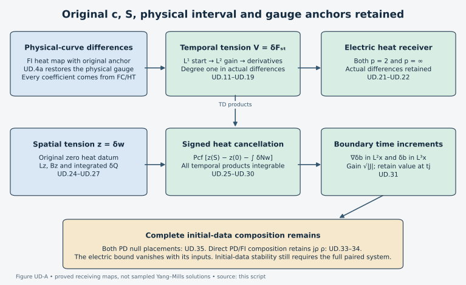

# Temporal differences, electric data and boundary increments

This Unit 9 chapter follows an actual difference through temporal heat
smoothing, the electric field identity and physical-time reconstruction.
Every estimate vanishes with its difference inputs. The final section
calculates the remaining potential-wave coefficients and identifies the
additional step required for a bound from the initial data alone.

Read the [prescribed-interval heat comparison](../classical-fixed-heat-comparison.html)
(FI), [electric difference estimates](../classical-electric-difference.html)
(ED), [temporal difference estimates](../classical-temporal-difference.html)
(TD), [potential differences](../classical-potential-difference.html) (PD),
[wave estimates](../classical-wave-estimates.html) (HW), and
[spatial tension differences](../classical-spatial-tension-difference.html)
(TDI). The individual coefficients come from the
[finite wave bound](../classical-finite-wave-bound.html) (FC) and its
linked heat estimates. The full physical and heat measures, speed,
endpoint and gauge anchors are specified below.

Human-source context: Sung-Jin Oh,
[*Gauge choice for the Yang–Mills equations using the Yang–Mills heat flow
and local well-posedness in H1*, arXiv:1210.1558v2](https://arxiv.org/abs/1210.1558v2).
The exposition and full calculations here are independently written.
The course provenance records the exact author-source edition and bounded
reading. No novelty claim is made.

## 1. Original objects, domains and coefficient inputs

The connections \(a,a'\) are the two actual regular caloric-temporal
connections on \(I\times\mathbb R^3\times[0,S]\), with the original
\(c>0,S>0\), \(a_s=a_s'=0\), and \(a_t(S)=a_t'(S)=0\). A compact
physical subinterval \(J\subset I\) containing \(t_*\) will be used
to evaluate the anchored coefficient maps; no heat endpoint or gauge
anchor is changed. Put \(T=|J|\). The physical norms may subsequently
be restricted to a slab not containing \(t_*\), but its coefficient
inputs must still include the original gauge history from \(t_*\).
A local slab norm alone is not substituted for that history.
Every spatial derivative is the full ordered tuple. Matrix and output
labels use Hilbert–Schmidt norm; gauge suprema use operator norm.

\[
\begin{gathered}
E_i=F_{ti},\quad G_i=F_{si},\quad W=F_{st}=-D^jE_j,\quad
w_i=c^{-2}D_tE_i-G_i,\\
\eta=a-a',\quad u=E-E',\quad Z=G-G',\quad
V=W-W',\quad z=w-w',\quad\theta=a_t-a_t',\\
D_j=\partial_j+[a_j,\cdot],\quad
\Box_c=-c^{-2}\partial_t^2+\Delta,\quad
C_S=4/\sqrt3,\quad
C_M=2\sqrt{(4\pi/3)^{-1/6}(4\pi)^{-1}(20\pi/3)^{5/6}},\quad
\kappa=2/\sqrt\pi,\quad
k_s(x)=(4\pi s)^{-3/2}e^{-|x|^2/(4s)}.
\tag{UD.1}
\end{gathered}
\]

In particular \(V(0)=z(0)=0\) by the actual Gauss and Yang–Mills
equations. The exact physical-curve input is

\[
\rho=\sup_J\|\partial(A^0-A^{0\prime})\|_2+
c^{-1}\sup_J\|E^0-E^{0\prime}\|_2
\]

. It is not an initial-data
distance. The following symbols denote bounds of actual fields:

\[
\begin{aligned}
\|\partial^{(j)}a(s)\|_\infty&\le A_js^{-j/2-1/4},&
\|\partial^{(j)}\eta(s)\|_\infty&\le a_j^\delta s^{-j/2-1/4},\\
\|\partial^{(j)}F(s)\|_\infty&\le C_js^{-j/2-3/4},&
\|\partial^{(j)}\delta F(s)\|_\infty&\le C_j^\delta s^{-j/2-3/4},\\
\|\partial^{(j)}G(s)\|_2&\le J_js^{-(j+1)/2},&
\|\partial^{(j)}Z(s)\|_2&\le J_j^\delta s^{-(j+1)/2},\\
\|E(s)\|_2&\le m_0,&\|u(s)\|_2&\le M.
\tag{UD.2}
\end{aligned}
\]

Each row has its primed counterpart. These suprema are over the
actual \(J\) and \(0<s\le S\). The names \(a_j^\delta\) are numerical
coefficients, not new connections. The quantities \(A_j,C_j,J_j,m_0\)
are provided by HT/ES/FC. FI.21–FI.42 and its exact differentiated
gauge product provide \(a_j^\delta,J_j^\delta\); in particular

\[
\begin{aligned}
C_0^\delta&\le2a_1^\delta+
2S^{1/4}a_0^\delta(A_0+A_0'),\\
C_1^\delta&\le2a_2^\delta+
2S^{1/4}\{a_1^\delta(A_0+A_0')
                    +a_0^\delta(A_1+A_1')\},\\
M&\le e^{\Phi(S)}
\{M_f+(2\sqrt2m_0'+4\sqrt2b_0')S^{1/4}a_0^\delta
                       +32m_0'S^{1/4}C_0^\delta\}.
\tag{UD.3}
\end{aligned}
\]

The last line is ED.11/ED.25b; \(\Phi(S)=16C_0S^{1/4}\),
\(m_0'=b_0'=cR_0d'\) in ED's heat-energy choice, and
\(M_f\le\rho_E+2e\epsilon_0^{[S]}\) is FI.42 with both gauge
placements. Thus these coefficients have degree-one majorants in
\(\rho\); no estimate of \(\rho\) has yet been used.

Here is how to evaluate the individual inputs uniformly, rather than
leave them as unspecified regular-solution norms. On the original
FC interval use precisely FC.18

\[
\mathcal F_k^p\le 2\mathsf I_k^p+
4c|I|^{1/2}\mathsf D_{k-1}^p[R;H],
\qquad k\ge1,\quad p=2,\infty,
\tag{UD.4}
\]

and FC.19–FC.22. These give the numerical \(R_a,P_*,H_*,Q_*\) and

\[
R_{\rm phys}=R_a+2C_SP_*R_a+H_*+P_*Q_*,
\qquad \sup_I\|\partial A^{\rm phys}\|_2\le R_{\rm phys}.
\]

This FC representative has identity temporal-gauge anchor and
\(A^{\rm phys}(t_*)=a(t_*,0)\); it is not identified with
the original pre-caloric \(A^0\). Their exact transition is the
time-independent \(Q_0=V_0(t_*,S)\):
\(A^0=Q_0\cdot A^{\rm phys}\). Both solve the same temporal-gauge
ODE back from their respective anchors, which proves this equality.
At the reference time, FI.8–FI.9 give the original DeTurck
coefficients \(\gamma_1,\gamma_2\). The heat-gauge equation
\((V_0)_s=V_0\operatorname{div}B\), \(V_0(0)=I_N\), yields

\[
\begin{aligned}
P_0&=4\sqrt3 C_S^{1/2}\sqrt{\gamma_1\gamma_2}S^{1/4},
&\|\partial Q_0\|_3&\le P_0,\\
H_0&=(R_a+R_{\rm init})(1+C_SP_0),
&\|\partial^{(2)}Q_0\|_2&\le H_0,\qquad
\|\partial Q_0\|_6\le C_SH_0,\\
R_{\rm orig}&=R_{\rm phys}
+2P_0(C_SR_a+Q_*)+H_0+C_SP_0H_0,
&\sup_I\|\partial A^0\|_2&\le R_{\rm orig}.
\tag{UD.4a}
\end{aligned}
\]

Here \(R_{\rm init}=\|\partial A^0(t_*)\|_2\), bounded by
the stated original data radius. For the first row integrate
\(\|\partial\operatorname{div}B(s)\|_3
\le\sqrt3 C_S^{1/2}\sqrt{\gamma_1\gamma_2}s^{-3/4}\);
unitarity removes the undifferentiated heat-gauge coefficient.
For the second row differentiate the exact anchor equation
\(\partial_iQ_0=Q_0a_i(t_*,0)-A_i^0(t_*)Q_0\).
Its two derivative terms cost \(R_a+R_{\rm init}\), and its
two products cost \(P_0 C_S(R_a+R_{\rm init})\).
Sobolev gives the displayed \(L^6\) bound. The full affine
gauge product at later times gives the last row, including
the product \(C_SP_0H_0\). This restores the original anchor
before using the original-curve input to FI.

Take the maximum with the primed value. In FI's auxiliary
construction use \(R_{\rm aux}=R_{\rm ref}+8R_{\rm orig}>0\) and
\(\sigma=\min(S,S_{R_{\rm aux}})\). This is an evaluation device;
FI.38 returns to the prescribed endpoint \(S\), with its generally
nonidentity anchor. It is not a replacement of the original heat
interval. On \([\sigma,S]\), insert \(A_j\sigma^{-j/2-1/4}\) and the
HT/ES \(L^2\) jets into FI.35. For every curvature jet \(X_j\),
the required additional norms are evaluated by

\[
\|\partial^{(j)}X\|_3\le
C_S^{1/2}\sqrt{\|\partial^{(j)}X\|_2
                       \|\partial^{(j+1)}X\|_2},\qquad
\|\partial^{(j)}X\|_\infty\le
C_MC_S\sqrt{\|\partial^{(j+1)}X\|_2
                       \|\partial^{(j+2)}X\|_2}.
\tag{UD.5}
\]

Here \(C_M\) is the original Morrey constant used in FI.2 and HT.
All powers of \(\sigma,S,c,H\) remain. Apply the same formulas to
the individual \(W\) jets constructed below when FI.34 needs them.
The FI.32 exponential is an integral over \([\sigma,S]\) of these
finite numerical majorants. Thus its coefficient is controlled by
the stated data radius and original \(c,S,H\), not by an unbounded
physical Hessian. FI's finite sums and exponentials may be large;
their finiteness does not establish an absorption inequality.

For clarity, the one extra FI receiver needed here is \(a_2^\delta\).
FI.32 with \(q=6\), followed by FI.36, gives

\[
\|\delta W\|_{H_\ell^5}\le
[c(\ell^{-1}+2K_5(a'))+2P_5(E)]\mathcal D_6
\]

.
For \(j=0,1,2,3\), multiply its heat integral by
\(b_\ell\ell^{-j}\) to obtain the transition coefficient
\(\delta\beta_j\); retain the analogous individual \(\beta_j\).
The original length \(\ell>0\) is not altered. With FI.38's original
anchor values, the third gauge derivative is bounded by

\[
\begin{aligned}
r_3={}&r_3^*+\tau(\beta_3+3r_1^*\beta_2+3r_2^*\beta_1)
 +3\tau^2(\beta_1\beta_2+r_1^*\beta_1^2)+\tau^3\beta_1^3,\\
\delta r_3={}&\delta r_3^*+\tau\{d_R\beta_3+
3\delta r_1\beta_2+3\delta r_2\beta_1+\delta\beta_3+
3r_1\delta\beta_2+3r_2\delta\beta_1+r_3\delta\beta_0\},\\
a_2^\delta\le{}&
\widehat A_2^\delta+4\sqrt S r_1\widehat A_1^\delta
+(2Sr_2+2Sr_1^2)\widehat A_0^\delta+2d_R\widehat A_2\\
&+4\sqrt S(\delta r_1+r_1d_R)\widehat A_1
 +S(2\delta r_2+2r_2d_R+4r_1\delta r_1)\widehat A_0\\
&+S^{5/4}(\delta r_3+r_3d_R+3r_1\delta r_2+3r_2\delta r_1).
\tag{UD.6}
\end{aligned}
\]

Here \(r_3^*=v_3^{V,\rm ref}\sigma^{-5/4}\) and
\(\delta r_3^*=w_3^{V,\rm ref}\sigma^{-5/4}\).
The auxiliary positive-heat part of \(\widehat A_2^\delta\) is
\(S^{5/4}C_MC_S\ell^{-5/2}\sup\mathcal D_6\), and the local part
is FI.20's all-order product sum; take their maximum. Differentiating
\(R_t=R\theta_{\rm transition}\) three times gives coefficients
\(1,3,3,1\), and integration of the already explicit lower jets
gives the first two lines. Differentiating the three conjugation
difference terms and two affine difference terms twice gives the
last three lines. This proves the displayed extension without
changing either anchor. The full local product expansion is also proved in [TDI.8–TDI.10](../classical-spatial-tension-difference.html#eq-TDI-8).

## 2. A finite smoothing operation with the original heat weights

The following operation evaluates the derivative constants used below.
For a field \(y\), suppose its already derived ordinary heat equation
has coefficient operator

\[
\begin{aligned}
\|\partial^{(k)}Ly\|_2\le{}&
4\sum_{l=0}^k {k\choose l}A_l s^{-l/2-1/4}y_{k-l+1}
+2\sqrt3\sum_{l=0}^k {k\choose l}A_{l+1}s^{-l/2-3/4}y_{k-l}\\
&+4\sum_{h+j+n=k}{k!\over h!j!n!}
A_hA_js^{-(h+j)/2-1/2}y_n
+4\sum_{l=0}^k{k\choose l}C_ls^{-l/2-3/4}y_{k-l},
\end{aligned}
\tag{UD.7}
\]

where \(y_j=\|\partial^{(j)}y\|_2\).
For \(W\) set every \(C_l=0\). For \(E\) they are precisely its
spatial-curvature coefficients. Let
\(\|y(s)\|_2\le M_y s^{-\alpha}\), \(\alpha\ge0\), and
\(\|\partial^{(k)}f(s)\|_2\le
\sum_\beta f_{k\beta}s^{-k/2-\beta}\), with
\(\beta\le1+\alpha\). All sums below are finite.

\[
\begin{aligned}
A_l^*&=2^{l/2+1/4}A_l,&C_l^*&=2^{l/2+3/4}C_l,&
b&=4S^{1/4}A_0^*,\\
c_m={}&4S^{1/4}\sum_{k=1}^m\sum_{l=1}^k{k\choose l}A_l^*
+2\sqrt3S^{1/4}\sum_{k=0}^m\sum_{l=0}^k{k\choose l}A_{l+1}^*\\
&+4\sqrt S\sum_{k=0}^m\sum_{h+j+n=k}{k!\over h!j!n!}A_h^*A_j^*
+4S^{1/4}\sum_{k=0}^m\sum_{l=0}^k{k\choose l}C_l^*,\\
D_m&=\sum_{k=0}^m\sum_\beta
 2^{k/2+\beta}f_{k\beta}S^{1+\alpha-\beta},\\
K&=2(1+\kappa),\quad a_*=2+\pi\kappa,\quad b_*=1+2\kappa,\\
N&=\max\{1,q,\lceil8a_*^2b^2\rceil,
                 \lceil2b_*c_{\max(q-1,0)}\rceil\},\quad L_0=2^\alpha M_y,\\
k_n&=\max(0,n-(N-q)),\\
L_{n+1}&=
\begin{cases}
KL_n+(b_*/N)D_0,&n<N-q,\\
\sqrt{2N}\{KL_n+(b_*/N)D_{k_n}\},&n\ge N-q .
\end{cases}
\tag{UD.8}
\end{aligned}
\]

For \(q=0\) define \(\mathscr S_{0,\alpha}=M_y\); for \(q\ge1\)
define \(\mathscr S_{q,\alpha}=L_N\). Then

\[
\|\partial^{(q)}y(s)\|_2
\le\mathscr S_{q,\alpha}s^{-q/2-\alpha}.
\tag{UD.9}
\]

This is a proved heat operation, not a stability hypothesis.
To verify it fix the actual evaluation time \(s\), divide
\([s/2,s]\) into \(N\) intervals of length \(s/(2N)\), and multiply
the equation and every norm by the fixed number \(s^\alpha\).
The initial norm is at most \(2^\alpha M_y\). On these intervals
the forcing in derivative order \(k\), after multiplication by
\(s^{k/2+\alpha+1}\), is bounded by the corresponding term of
\(D_m\). The nonnegative exponent \(1+\alpha-\beta\) justifies
its displayed \(S\) power. For each interval use the sum of the
already available derivative norms and the next derivative
multiplied by the square root of elapsed heat time. The heat
gradient kernel has \(L^1\) norm \(\kappa r^{-1/2}\).
The four scalar integrals are \(2\sqrt h,h,\pi\sqrt h,2h\).
The drift contribution is at most \(a_*b/\sqrt{2N}\le1/4\),
and the other coefficients at most \(b_*c_m/(2N)\le1/4\).
Absorb their sum. The resulting estimate is exactly UD.8.
The last \(q\) intervals each gain one derivative, at cost
\(\sqrt{s/h}=\sqrt{2N}\). This proves UD.9 at every \(s>0\);
it requires no higher derivative at zero heat time.

In particular set \(\alpha=0,f=0,M_y=m_0\) in UD.8 for the
individual electric jets \(e_j\), so
\(\|\partial^{(j)}E(s)\|_2\le e_js^{-j/2}\). For the electric
difference use \(M_y=M\) and, directly from FI.29,

\[
\begin{aligned}
f^u_{k,3/4}&=4\sum_l{k\choose l}a_l^\delta e'_{k-l+1}
+2\sqrt3\sum_l{k\choose l}a_{l+1}^\delta e'_{k-l}
+4\sum_l{k\choose l}C_l^\delta e'_{k-l},\\
f^u_{k,1/2}&=4\sum_{h+j+n=k}{k!\over h!j!n!}
(a_h^\delta A_j+A_h'a_j^\delta)e'_n,\qquad
u_j=\mathscr S_{j,0}(A,C;M;f^u).
\tag{UD.10}
\end{aligned}
\]

The exact source is

\[
2[\eta,\partial E']+[\operatorname{div}\eta,E']
+[\eta,[a,E']]+[a',[\eta,E']]+2[\delta F,E']
\]

.
Thus all noncommuting orders in UD.10 are fixed by that identity.
Only \(u_0=M,u_1\) are needed for the new \(V\) estimate below.
Define
\(\Gamma_j=C_MC_S\sqrt{J_{j+1}J_{j+2}}\) and
\(\varepsilon_j=C_MC_S\sqrt{e_{j+1}e_{j+2}}\).
UD.5 gives the individual \(G\) and \(E\) suprema with powers
\(s^{-j/2-5/4}\) and \(s^{-j/2-3/4}\), respectively.

## 3. A spatial L1 start for the temporal tension difference

The original covariant equation is

\[
(\partial_s-D^jD_j)W=2[E_j,G_j],\qquad W(0)=0.
\tag{UD.11}
\]

The scalar Kato inequality, obtained by pairing this equation with
\(W/(|W|^2+\epsilon^2)^{1/2}\), yields
\((\partial_s-\Delta)|W|\le4|E||G|\) as \(\epsilon\downarrow0\).
The covariant coefficient drops out by anti-Hermitian pairing;
the positive quadratic derivative contribution has the required
sign. Scalar heat comparison and \(L^2\)-\(L^2\) multiplication
therefore prove

\[
\|W(s)\|_1\le \ell_W\sqrt s,\quad
\ell_W=8m_0J_0,\qquad
\|W(s)\|_2\le w_0s^{-1/4},\quad
w_0=4(8\pi)^{-3/4}m_0J_0\,{\rm B}(1/2,1/4).
\tag{UD.12}
\]

Indeed the two exact integrals are
\(\int_0^s r^{-1/2}dr=2\sqrt s\) and

\[
\int_0^s(s-r)^{-3/4}r^{-1/2}dr
=s^{-1/4}{\rm B}(1/2,1/4)
\]

.
Here \(\|k_r\|_2=(8\pi r)^{-3/4}\); there is no temporal
regularity assumption in this argument.

The complete paired ordinary divergence equation is

\[
\begin{aligned}
(\partial_s-\Delta)V={}&
2\partial_j[a_j,V]-[\partial^ja_j,V]+[a_j,[a_j,V]]\\
&+2\partial_j[\eta_j,W']-[\partial^j\eta_j,W']
 +[\eta_j,[a_j,W']]+[a_j',[\eta_j,W']]\\
&+2[u_j,G_j]+2[E_j',Z_j],\qquad V(0)=0.
\tag{UD.13}
\end{aligned}
\]

In particular the divergence coefficient has a minus sign. Expanding
the two displayed divergences recovers TD.6–TD.7 exactly.
Let

\[
\begin{aligned}
d_0&=8(MJ_0+m_0'J_0^\delta),\\
d_1&=4\kappa a_0^\delta\ell_W'{\rm B}(5/4,1/2)
                         +{8\sqrt3\over3}a_1^\delta\ell_W',\\
d_2&=4a_0^\delta(A_0+A_0')\ell_W',\\
P_n&=4\kappa A_0{\rm B}(5/4+n/4,1/2)
                              +{2\sqrt3A_1\over3/4+n/4},\\
Q_n&={4A_0^2\over1+n/4},\\
v_0&=d_0,\quad v_1=d_1+P_0v_0,\quad
v_n=d_n+P_{n-1}v_{n-1}+Q_{n-2}v_{n-2}\quad(n\ge2),
\end{aligned}
\tag{UD.14}
\]

where \(d_n=0\) for \(n>2\). Duhamel, the \(L^1\) heat-gradient
norm and UD.12 give
\(\|V(s)\|_1\le\sqrt s\sum_{n\ge0}v_ns^{n/4}\).
For example the flux involving \(\eta W'\) contributes
\(4\kappa a_0^\delta\ell_W'{\rm B}(5/4,1/2)s^{3/4}\);
its differentiated-coefficient term contributes
\((8\sqrt3/3)a_1^\delta\ell_W's^{3/4}\).
These are precisely the two summands of \(d_1\).

The series converges on the complete original interval. Here is a
finite evaluated bound, including arbitrarily large coefficients:

\[
\begin{aligned}
C_a&=8\kappa\sqrt\pi A_0+8\sqrt3A_1,\quad C_b=16A_0^2,\quad
D=\max(2C_a,\sqrt{2C_b}),\\
L_1^\delta&=\sqrt2 e^{D^2\sqrt S}
(d_0+d_1S^{1/4}+d_2\sqrt S),\\
\|V(s)\|_1&\le L_1^\delta\sqrt s.
\tag{UD.15}
\end{aligned}
\]

In the second line the exponential multiplies the entire
parenthesized expression. To prove this, use
\({\rm B}(5/4+n/4,1/2)\le2\sqrt\pi/\sqrt{n+1}\),
which follows from \(\log t\le-(1-t)\).
Then \(P_n\le C_a/\sqrt{n+1}\) and
\(Q_n=C_b/(n+4)\).
The coefficient \(D^n/\sqrt{n!}\) majorizes each homogeneous
recurrence: the one-step ratio is at most \(C_a/D\), and
the two-step ratio is
\((C_b/D^2)\sqrt{n(n-1)}/(n+2)\le C_b/D^2\).
Their sum is at most one; the case \(D=0\)
has no homogeneous terms. Apply this separately to the three
source monomials. Finally
\(\sum x^n/\sqrt{n!}\le\sqrt2 e^{x^2}\), by Cauchy–Schwarz
with weights \(2^{-n}\). The remainder in Duhamel iteration
tends to zero by the same bound, using
\(\|V\|_1\le(\ell_W+\ell_W')\sqrt s\) from UD.12.
This justifies the series for the actual difference, not only
for a separately constructed scalar solution.

## 4. Gain L2, then two derivatives, without changing S

Set \(K_{12}=(8\pi)^{-3/4}\), and define

\[
\begin{aligned}
A&=4\kappa\,2^{1/4}A_0{\rm B}(1/4,1/2)S^{1/4},\\
B&=2\sqrt3\,2^{3/4}A_1S^{1/4}
                            +4\sqrt2 A_0^2\sqrt S,\qquad
N_0=\max(1,\lceil8A^2\rceil,\lceil8B\rceil),\\
f&=4a_0^\delta w_0',\quad
h_1=2\sqrt3a_1^\delta w_0',\quad
h_{3/4}=4a_0^\delta(A_0+A_0')w_0',\\
q_{5/4}&=4(M\Gamma_0+\varepsilon_0'J_0^\delta),\\
v^{(2)}_0=2\bigg[&
K_{12}(2N_0)^{3/4}L_1^\delta
+{2\kappa\sqrt2 f S^{1/4}\over\sqrt{2N_0}}\\
&+{2h_1S^{1/4}+2^{3/4}h_{3/4}\sqrt S+
                       2^{5/4}q_{5/4}\over2N_0}\bigg].
\tag{UD.16}
\end{aligned}
\]

Then \(\|V(s)\|_2\le v^{(2)}_0s^{-1/4}\).
For its proof apply UD.13 on \([s-h,s]\), where \(h=s/(2N_0)\).
The initial \(L^1\) norm is at most \(L_1^\delta\sqrt s\).
In the norm
\(\sup_{0<r\le h}r^{3/4}\|V(s-h+r)\|_2\), the homogeneous
drift costs at most \(A/\sqrt{2N_0}\le1/4\); its other terms
cost at most \(2B/N_0\le1/4\). The beta integral for the
drift is exactly \({\rm B}(1/4,1/2)\).
On this interval the inhomogeneous flux is bounded by
\(\sqrt2 f s^{-1/2}\), and the three other sources by

\[
2h_1s^{-1}+2^{3/4}h_{3/4}s^{-3/4}
+2^{5/4}q_{5/4}s^{-5/4}
\]

.
Their integrals are \(2\kappa\sqrt h\) and \(h\), respectively.
Absorb one half and evaluate at \(h\); multiplying by \(s^{1/4}\)
gives exactly UD.16. This changes neither endpoint nor field.

Use UD.8 with \(\alpha=1/4,C_l=0,M_y=w_0\) and

\[
f^W_{k,5/4}=4\sum_{l=0}^k{k\choose l}e_l\Gamma_{k-l}
\tag{UD.17}
\]

to construct every individual \(w_j\) with
\(\|\partial^{(j)}W\|_2\le w_js^{-j/2-1/4}\).
For \(V\), use \(M_y=v_0^{(2)}\) and the exact sources

\[
\begin{aligned}
f^V_{k,1}&=4\sum_l{k\choose l}a_l^\delta w'_{k-l+1}
                   +2\sqrt3\sum_l{k\choose l}a_{l+1}^\delta w'_{k-l},\\
f^V_{k,3/4}&=4\sum_{h+j+n=k}{k!\over h!j!n!}
                  (a_h^\delta A_j+A_h'a_j^\delta)w_n',\\
f^V_{k,5/4}&=4\sum_l{k\choose l}
                 (u_l\Gamma_{k-l}+\varepsilon_l'J_{k-l}^\delta),\\
v_j^{(2)}&=\mathscr S_{j,1/4}(A,0;v_0^{(2)};f^V),
\qquad j=1,2 .
\tag{UD.18}
\end{aligned}
\]

The source exponents \(1,3/4,5/4\) are all at most \(1+1/4\).
For \(j=2\), only source orders \(k=0,1\) occur. Thus UD.6
provides exactly the highest difference coefficient needed.
Spatial Sobolev now proves the desired genuine difference bound

\[
\|\partial^{(j)}V(t,s)\|_4\le
t_j^\delta s^{-j/2-5/8},\qquad
t_j^\delta=C_S^{3/4}(v_j^{(2)})^{1/4}
                             (v_{j+1}^{(2)})^{3/4},\quad j=0,1 .
\tag{UD.19}
\]

Every expression on the right is degree one in the difference
providers. UD.15's exponential and UD.8's integers depend only on
individual coefficients. At zero difference all of UD.10 and
UD.14–UD.19 vanish. This is precisely the property lost by the
an upper bound obtained from individual temporal envelopes alone.

## 5. The residual-free electric receiver and its signed datum

The exact identity remains

\[
u_i=\partial_t\eta_i-\partial_i\theta+
[\theta,a_i]+[a_t',\eta_i],\qquad
\theta(s)=-\int_s^S V(r)\,dr .
\tag{UD.20}
\]

### The complete finite backward-wave input

At each unchanged heat time define the actual wave functional

\[
\begin{aligned}
W_k^\delta(s)={}&
\sup_{t\in I}\left(
 \||D|^{k-1}c^{-1}\partial_t\eta(t,s)\|_2^2+
 \sum_j\||D|^{k-1}\partial_j\eta(t,s)\|_2^2\right)^{1/2}\\
&+c|I|^{1/2}\||D|^{k-1}\Box_c\eta(s)\|_{L^2_{t,x}},\\
\Box_c&=-c^{-2}\partial_t^2+\Delta_x,\qquad
P_{3/2}^{\delta,p}
 =\|s^{1/4}W_{3/2}^\delta(s)\|_{L^p(ds/s)},\quad p=2,\infty .
\end{aligned}
\]

Here \(|D|\) is the original spatial Fourier multiplier \(|\xi|\),
not a covariant derivative. The forcing is exactly
\(\Box_c\eta=\Box_ca_x-\Box_ca_x'\). This is the full HW.26 and PW
functional of the difference field, not the difference of two
numerical norms. For derivative-regular potentials the annular
approximation in [PW Section 1](../classical-potential-wave.html) applies to \(\eta\): use the same
annular cutoff on the field, its derivatives and its forcing; the
wave equation commutes with it; HW.33 makes the derivative outputs
Cauchy in \(L^4\); distributional convergence identifies the limit
with the original derivatives. No undifferentiated \(L^2\) hypothesis
on the potential difference is added.

The original caloric identities give, at both finite endpoints,

\[
\eta(s)=\eta(S)-\int_s^S Z(r)\,dr,\qquad
W_k^\delta(s)\le W_k^\delta(S)
                    +\int_s^S\|Z(r)\|_{\mathsf S_c^k}\,dr .

\]

The second inequality uses the full derivative/forcing triangle
inequality. Physical derivatives and \(\Box_c\) commute with the
integral on positive closed heat intervals. Retain LG.19's actual

\[
\mathcal F_k^{\delta,2}
=\|s^{(k+1)/2}\|Z(s)\|_{\mathsf S_c^k}\|_{L^2(ds/s)}
\]

.
The finite backward operator then proves

\[
\begin{aligned}
P_{3/2}^{\delta,2}
 &\le\Pi_2:=\sqrt2 S^{1/4}W_{3/2}^\delta(S)
                                  +4\mathcal F_{3/2}^{\delta,2},\\
P_{3/2}^{\delta,\infty}
 &\le\Pi_\infty:=S^{1/4}W_{3/2}^\delta(S)
                                  +\sqrt2\mathcal F_{3/2}^{\delta,2},\\
W_{3/2}^\delta(S)&\le\sqrt{W_1^\delta(S)W_2^\delta(S)},\qquad
\mathcal F_{3/2}^{\delta,2}
 \le\sqrt{\mathcal F_1^{\delta,2}\mathcal F_2^{\delta,2}},\\
\|s^{1/4}\|\partial_t\eta(s)\|_{L^4_{t,x}}\|_{L^p(ds/s)}
 &\le cd_cP_{3/2}^{\delta,p}\le cd_c\Pi_p,\qquad
d_c=\sqrt2(2\pi c)^{-1/4}.
\end{aligned}
\]

Indeed the kernel relative to \(dr/r\) is
\(\mathbf1_{s<r<S}(s/r)^{1/4}\). Its row and column integrals are
at most 4, giving the \(L^2\) bound 4 by weighted Cauchy–Schwarz
and Tonelli. Its squared row integral is at most 2, giving the
\(L^2\)-to-supremum bound \(\sqrt2\). The endpoint square norm
is \(\sqrt2S^{1/4}\). HW.32 followed by heat Hölder gives the
two interpolation bounds with their original adjacent weights.
HW.33 controls the full tuple \(\partial_c\eta\); its temporal
component is \(c^{-1}\partial_t\eta\). The original temporal
derivative therefore contributes the factor \(c\) in the displayed bound.

### Insert the temporal difference

UD.19 gives, at every original physical time,
\(\|\partial^{(j)}\theta(s)\|_4\le t_j^\delta h_j(s)\), where
\(h_0=(8/3)(S^{3/8}-s^{3/8})\) and
\(h_1=8(s^{-1/8}-S^{-1/8})\). Retain the finite backward-wave bound above for the actual
\(\Pi_p\), with the unchanged endpoint \(W_{3/2}^\delta(S)\),
and LG.26's actual \(\mathcal A_\delta\). Put

\[
\begin{array}{c|cc}
 &p=2&p=\infty\\ \hline
H_{1,p}=\|s^{1/4}h_1\|_{L^p(ds/s)}
 &8\sqrt{2/3}S^{1/8}&2S^{1/8}\\
H_{0,p}=\|s^{1/8}h_0\|_{L^p(ds/s)}
 &8S^{1/2}/\sqrt5&2^{1/3}S^{1/2}
\end{array}
\]

\[
\boxed{\quad
\delta e_p\le cd_c\Pi_p+
T^{1/4}t_1^\delta H_{1,p}
+2\mathcal A\,t_0^\delta H_{0,p}
+2\mathcal A_\delta\,t_0'H_{0,p},\qquad
d_c=\sqrt2(2\pi c)^{-1/4}.
\quad}
\tag{UD.21}
\]

Here \(t_0'=C_S^{3/4}(w_0')^{1/4}(w_1')^{3/4}\).
For the third term use the individual
\(\|a(s)\|_{L^4_tL^\infty_x}\le\mathcal A s^{-1/8}\)
and the new \(L^\infty_tL^4_x\) estimate for \(\theta\).
For the last term use the primed temporal bound and the actual
potential difference \(\mathcal A_\delta\). Thus the original
noncommuting product orders are unchanged. Heat norms are taken
after the physical \(L^4_{t,x}\) norm in every term.
For example the first scalar square is
\(64S^{1/4}(4-16/3+2)=128S^{1/4}/3\);
the other values follow by integrating their full squares or
maximizing the scalar polynomials. No lower endpoint term is lost.

The exchanged ordering gives a second entire bound; take the minimum
of the two complete expressions. ED.22 also gives the exact signed
datum comparison

\[
\mathcal D_p(f)\le\delta e_p+T_pM+J_pa_0^\delta+K_pC_0^\delta ,
\qquad f=u(0),
\tag{UD.22}
\]

by moving its two Duhamel integrals to the other side and retaining
ED.25a's constants. Combining UD.21 and UD.22 evaluates the
signed datum with no WS.13 physical coefficient \(K\), no
\(\|E^0\|_3\), and no \(\|\partial A^0\|_3\). ED.25b then
remains a valid alternative upper bound. There is no electric
fixed-point term in UD.21: the coefficient inputs were obtained
from the actual physical-curve norm, not from \(\delta e_p\).
This removes the residual; it does not yet bound the physical
curve by its initial value.

## 6. The next boundary operation: evaluate before taking norms

One might attempt to integrate
\(\|\partial^{(2)}z(s)\|_2\) down to zero. Its available fixed-time
power \(s^{-5/4}\) is not integrable. The original equations give
a stronger signed operation. Indeed

\[
D^jG_j=D^jD^kF_{kj}=0,\qquad
D_tW=-D^jD_tE_j-\sum_j[E_j,E_j]
                     =-c^2D^jw_j.
\tag{UD.23}
\]

To verify the first identity interchange the two summed labels and
use \(F_{jk}=-F_{kj}\); the commutator of derivatives leaves
\(\frac12\sum_{j,k}[F_{jk},F_{kj}]=0\).
The second uses the original equation
\(D_tE=c^2(G+w)\). Every contracted self-bracket is zero
individually, and no speed factor is suppressed.

Write \(N_w=(\partial_s-\Delta)w\). Its complete formula is

\[
N_{w,i}=2[a_j,\partial_jw_i]+[\partial^ja_j,w_i]
+[a_j,[a_j,w_i]]+2[F_{ij},w_j]+Q_i,\quad
Q_i=-2c^{-2}[E_j,D_iE_j-2D_jE_i].
\tag{UD.24}
\]

Let \(P_{\rm cf}=\nabla\Delta^{-1}\operatorname{div}\), the
orthogonal \(L^2\) projection with symbol
\(\xi\otimes\xi/|\xi|^2\). Integrate UD.23 using the actual
\(a_t(S)=0\) and \(w(0)=0\). For the paired boundary coefficient
\(b^\delta=\theta(0)\), the full identities are

\[
\begin{aligned}
\partial_tb^\delta={}&
c^2\int_0^S\{\operatorname{div}z+
                         [\eta^j,w_j]+[a^{\prime j},z_j]\}\,ds\\
&+\int_0^S\{[\theta,W]+[a_t',V]\}\,ds,\\
\nabla\partial_tb^\delta={}&
c^2P_{\rm cf}\left\{z(S)-z(0)-\int_0^S\delta N_w\,ds\right\}\\
&+c^2\int_0^S\nabla\{[\eta^j,w_j]+[a^{\prime j},z_j]\}\,ds\\
&+\int_0^S\nabla\{[\theta,W]+[a_t',V]\}\,ds .
\tag{UD.25}
\end{aligned}
\]

The projection identity used here is
\(\nabla\operatorname{div}z=P_{\rm cf}\Delta z\), with a
positive sign, and
\(\int_0^S\Delta z=z(S)-z(0)-\int_0^S\delta N_w\).
It is an exact equality on positive intervals before passage
to zero. The following estimates justify that passage.

Use the actual spatial-tension difference norms and source

\[
L_z=\sup_s\|z(s)\|_{L^2_{t,x}},\quad
B_z=\left(\int_0^S\|\partial z(s)\|_{L^2_{t,x}}^2ds\right)^{1/2},
\quad Q_z=\int_0^S\|\delta Q(s)\|_{L^2_{t,x}}ds,
\tag{UD.26}
\]

and \(L_w,B_w,L_w',B_w'\) for their individual versions.
They are the original TW/paired-tension norms; they are not
postulated initial-data estimates. Telescoping UD.24 with unprimed
operator acting on \(z\) gives the fully evaluated receiving bound

\[
\begin{aligned}
N_z={}&4\sqrt2 S^{1/4}(A_0B_z+a_0^\delta B_w')
+8\sqrt3 S^{1/4}(A_1L_z+a_1^\delta L_w')\\
&+8\sqrt S\{A_0^2L_z+
                    a_0^\delta(A_0+A_0')L_w'\}\\
&+16S^{1/4}(C_0L_z+C_0^\delta L_w')+Q_z,\\
\int_0^S\|\delta N_w\|_{L^2_{t,x}}ds&\le N_z,\\
J_{aw,0}&={8\over3}S^{3/4}
                       (a_0^\delta L_w+A_0'L_z),\\
J_{aw,1}&=2\sqrt2 S^{1/4}
                       (a_0^\delta B_w+A_0'B_z)
                       +8S^{1/4}(a_1^\delta L_w+A_1'L_z).
\tag{UD.27}
\end{aligned}
\]

The last two lines bound the two commutator integrals in UD.25
before and after one spatial derivative. The unprimed \(w\)
there is intentional: UD.25 uses \([\eta,w]+[a',z]\).
In \(N_z\) the reference field is \(w'\), because the
homogeneous operator was taken with \(a,F\).
The scalar integrals are
\(\int s^{-1/4}ds=4S^{3/4}/3\),
\(\int s^{-3/4}ds=4S^{1/4}\),
\(\int s^{-1/2}ds=2\sqrt S\), and their indicated square roots.
Thus no integral of a second derivative remains.

For the temporal products retain TD's already proved \(L_V,B_V\)
and \(H_+=2L_V+L_N^\delta\). They imply

\[
\|\theta(s)\|_{L^2_tL^\infty_x}
\le C_MC_S(S-s)^{1/4}\sqrt{B_VH_+},\qquad
\|\nabla\theta(s)\|_{L^2_tL^6_x}\le C_SH_+ .
\tag{UD.28}
\]

The first follows from the full spatial Morrey–Sobolev inequality
and Cauchy–Schwarz in physical time, with TD's actual norm order.
For the primed individual temporal field define
\(T_0'=C_MC_S\sqrt{w_1'w_2'}\) and
\(T_1'=C_MC_S\sqrt{w_2'w_3'}\). Then
\(\|a_t'(s)\|_\infty\le T_0'\log(S/s)\) and
\(\|\nabla a_t'(s)\|_\infty
\le2T_1'(s^{-1/2}-S^{-1/2})\).
The complete integral bounds are

\[
\begin{aligned}
J_{tW,0}={}&
2C_MC_Sw_0 S\,{\rm B}(3/4,5/4)\sqrt{B_VH_+}
+2T_0'S L_V,\\
J_{tW,1}={}&
4C_S^{3/2}\sqrt{w_0w_1}\sqrt S\,H_+
+2C_MC_Sw_1\sqrt S\,{\rm B}(1/4,5/4)\sqrt{B_VH_+}\\
&+4T_1'\sqrt S\,L_V+2T_0'\sqrt{2S}\,B_V .
\tag{UD.29}
\end{aligned}
\]

These estimate respectively
\(\int\|[\theta,W]+[a_t',V]\|_{L^2_{t,x}}ds\) and its full
spatial gradient. In the first differentiated term use
\(\nabla\theta\in L^2_tL^6_x\) and
\(\|W\|_{L^\infty_tL^3_x}\le
C_S^{1/2}\sqrt{w_0w_1}s^{-1/2}\).
In the next use \(\theta\in L^2_tL^\infty_x\) and
\(\|\nabla W\|_{L^\infty_tL^2_x}\le w_1s^{-3/4}\).
The last two use the displayed primed temporal suprema with
\(V\) and \(\nabla V\), respectively. The logarithmic integrals
are \(\int_0^S\log(S/s)ds=S\) and
\(\int_0^S\log^2(S/s)ds=2S\).
All four differentiated placements are retained.

Consequently define the evaluated coefficients

\[
K_0^\delta=c^2(\sqrt S B_z+J_{aw,0})+J_{tW,0},\qquad
K_1^\delta=c^2(L_z+N_z+J_{aw,1})+J_{tW,1}.
\tag{UD.30}
\]

Then

\[
\begin{gathered}
\|\partial_tb^\delta\|_{L^2_{t,x}}\le K_0^\delta,\qquad
\|\nabla\partial_tb^\delta\|_{L^2_{t,x}}\le K_1^\delta,\\
\sup_{t\in J}\|\nabla b^\delta(t)-\nabla b^\delta(t_j)\|_2
\le\sqrt T K_1^\delta,\\
\sup_{t\in J}\|b^\delta(t)-b^\delta(t_j)\|_3
\le \sqrt T C_S^{1/2}\sqrt{K_0^\delta K_1^\delta},
\qquad t_j\in J .
\tag{UD.31}
\end{gathered}
\]

For the last estimate interpolate the \(L^2\) time increment and
its Sobolev \(L^6\) bound. These are actual estimates on the
original heat boundary. Absolute convergence in UD.27–UD.29,
the actual \(z(0)=0\), and distributional differentiation identify
their zero-heat limits. The fundamental theorem in physical time
then proves the increments, first for the current regular pair
and also in the resulting Bochner Sobolev class. The endpoint
value \(b^\delta(t_j)\) is retained. It is not set to zero.

Thus the previously divergent Hessian operation has been performed
and estimated. When the paired spatial-tension bounds are inserted,
every term in UD.30 is degree one in the receiving difference
norms. The square roots in UD.29 and UD.31 preserve that degree.
There is no individual physical Hessian in any coefficient.

## 7. Evaluate the remaining potential and null-product placements

This section records the coupled receiving algebra to prevent
misidentifying UD.21 or UD.31 as the entire stability theorem.
Let

\[
R_\delta=\sum_{k=1}^3(\ell^{k-1}W_k^\delta(S)+
\mathcal F_k^{\delta,2}+\mathcal F_k^{\delta,\infty})
\]

,
where \(\ell>0\) is the original reference length from FI.
Every original norm and its full forcing part is retained. The factors
\(\ell^{k-1}\) give the endpoint entries the same physical units as
the heat entries. In particular
\(W_k^\delta(S)\le\ell^{1-k}R_\delta\), while each original
\(\mathcal F_k^{\delta,p}\le R_\delta\). Interpolation and PD.10 give

\[
P_1[\eta]\le p_1R_\delta,\quad
P_2[\eta]\le p_2R_\delta,\quad
P_{3/2}[\eta]\le p_{3/2}R_\delta,\quad
P_{5/2}[\eta]\le p_{5/2}R_\delta,
\tag{UD.32}
\]

where
\(p_1=10S^{1/8}\), \(p_2=\sqrt S/\ell+2\),
\(p_{3/2}=\sqrt2S^{1/4}/\sqrt\ell+4\), and
\(p_{5/2}=\sqrt{2/3}S^{3/4}/\ell^{3/2}+4/3\).
These are upper bounds; no original \(P\) is redefined.
For example, the endpoint interpolation bounds are
\(W_{3/2}^\delta(S)\le\ell^{-1/2}R_\delta\) and
\(W_{5/2}^\delta(S)\le\ell^{-3/2}R_\delta\), whereas their
heat-norm interpolations are at most \(R_\delta\). Substituting
these four inequalities in PD.10 proves all displayed coefficients.
The original length has not been set to one or absorbed into a field.
Let \(a_j^\delta\le L_j\rho\) be the explicit FI/UD.2 coefficients,
and abbreviate \(P_k=P_k[a]\), \(P_k'=P_k[a']\),
\(d_B=2\sqrt3\), \(\lambda=c\sqrt T\).
The first complete PD.16 ordering gives
\(\mathcal J_\delta\le j_RR_\delta+j_\rho\rho\), where

\[
\begin{aligned}
j_R^{(2)}={}&12S^{1/8}A_1p_1+d_B\sqrt2S^{1/4}A_0p_2
+6\sqrt2S^{1/4}A_0'p_2+2d_BS^{1/8}A_1'p_1\\
&+\lambda d_c^2\{
12p_{3/2}P_{5/2}+2d_Bp_{5/2}P_{3/2}
+12P_{3/2}'p_{5/2}+2d_BP_{5/2}'p_{3/2}\},\\
j_\rho^{(2)}={}&6\sqrt2S^{1/4}L_0P_2+
2d_BS^{1/8}L_1P_1+12S^{1/8}L_1P_1'
+d_B\sqrt2S^{1/4}L_0P_2',\\
j_R^{(3)}={}&{8\over\sqrt3}S^{3/8}p_1
(A_0^2+A_0'A_0+(A_0')^2)\\
&+8\lambda d_c^2S^{1/4}p_{3/2}
(2A_0P_{3/2}+A_0P_{3/2}'+A_0'P_{3/2}+2A_0'P_{3/2}'),\\
j_\rho^{(3)}={}&{8\over\sqrt3}S^{3/8}L_0
(2A_0P_1+A_0P_1'+A_0'P_1+2A_0'P_1')\\
&+8\lambda d_c^2S^{1/4}L_0
(P_{3/2}^2+P_{3/2}'P_{3/2}+(P_{3/2}')^2),\\
j_R&=j_R^{(2)}+j_R^{(3)},\qquad
j_\rho=j_\rho^{(2)}+j_\rho^{(3)}.
\tag{UD.33}
\end{aligned}
\]

All superscript-two terms are the two PD bilinear placements;
all superscript-three terms are the three cubic placements.
The second complete ordering is obtained by exchanging the two
connections and retaining \(-\eta\); its norms have the same
difference majorants. Take the minimum of the two entire linear
expressions, not the separate minima of their coefficients.

PD.20 therefore gives, for the first ordering,

\[
\mathcal U_\delta\le
(1+2p_2+2j_R)R_\delta+2j_\rho\rho .
\tag{UD.34}
\]

The \(j_\rho\) terms without \(\lambda\) persist as \(T\downarrow0\).
For example
\(6\sqrt2S^{1/4}L_0P_2\) remains. Hence simply composing PD.20
with the fixed-time heat map is not a physical-time contraction
proved by a factor \(\sqrt T\).

Both original null placements remain available. With exactly
\(C_{\rm null}=2\sqrt3\sqrt{2/(\pi c)}\), PD.23–PD.24 give

\[
\min\!\left\{
C_{\rm null}(D_{\rm df}^\delta\mathcal F_m^p+
                       D_{a'}\mathcal F_m^{\delta,p}),\
C_{\rm null}(D_a\mathcal F_m^{\delta,p}+
                       D_{\rm df}^\delta\mathcal F_m^{\prime,p})
\right\}.
\tag{UD.35}
\]

An original equation coefficient two multiplies this entire
minimum by two. Here
\(D_{\rm df}^\delta\) is PD.21a's minimum of its three complete
projected bounds, not merely a numerical difference of individual
norms. Inserting UD.33 in each of those bounds evaluates it in
\(R_\delta,\rho\), including the projected endpoints
\(w_1^{\rm df},w_2^{\rm df},w_3^{\rm df}\).
The individual \(\mathcal F_m^p,D_a,D_{a'}\) are evaluated by
FC.18 and FC's endpoint bounds. Thus the null terms have the
correct degree one. Taking only one placement is unnecessary,
and replacing \(D_{\rm df}^\delta\) by \(D_a+D_{a'}\) would
destroy its zero-difference property.

For comparison WS.38's exact linear feedback is
\(x\le A_*+4g\Lambda x\). It has no residual in \(A_*\), but
its particular physical coefficient \(C_{\rm phys}\) contains
the uncontrolled \(\|\partial A^0\|_3,\|E^0\|_3\) discussed
in WS.39. UD.21 supplies a different electric receiver with
uniformly evaluated heat coefficients and no such self-feedback.
It does not turn WS.38's coefficient into a uniform number by
renaming it. Likewise FC.17's
\(2c\sqrt{|I|}\mathsf C[R;H]\le1/2\) controls the indicated
individual wave principal term; it says nothing by itself about
\(j_\rho\) in UD.33 or a complete paired matrix.

The strongest completed new statements here are UD.19, UD.21–UD.22,
and UD.25–UD.31. A complete initial-data or translation estimate
still requires applying the full paired wave forcing estimate,
the potential receiver with its initial-time calibration, and the
gauge ODE with its retained anchor on the original \(I\).
The explicitly evaluated direct composition UD.34 does not
establish that final estimate: it contains a time-independent
multiple of \(\rho\), and \(\rho\) is precisely the quantity to
be bounded. No inequality in this note assumes that coefficient
is less than one.

The separate spatial-tension derivation now supplies the actual
inputs in UD.26: TDI.18–TDI.20 gives \(L_z,B_z\) and TDI.17
gives \(Q_z\). TDI.33–TDI.35 independently confirms the
spatial part of UD.25–UD.27 in the other complete product
ordering. Its temporal remainder is
\([\!a_t,V]+[\theta,W']\); exchange the primed and unprimed
roles in UD.28–UD.29 to estimate it. Thus both complete
orderings of the boundary receiver are available, and their
minimum may be used. Inserting UD.21 into these actual
TDI providers makes UD.30 an evaluated function of
\(R_\delta,\rho\) and the retained endpoint terms. No new
spatial-tension estimate is assumed in this composition.

The next calculation was not left as an unnamed requirement:
UD.23–UD.31 prove the missing temporal boundary increment
operation, with the \(\sqrt T\) factor and every endpoint.
It feeds an initial-time calibrated reconstruction, since
\(b^\delta(t)=b^\delta(t_j)+
\int_{t_j}^t\partial_tb^\delta\,dt\).
The spatial potential and full paired wave reconstruction are
additional operations. A complete stability estimate requires their
proved composition with the initial data and the original gauge anchors.
In particular no conclusion about uniform translation continuity
is asserted before that remaining composition is actually proved.

## 8. Worked example: the commuting sector

Let all connection and curvature components of both solutions take values
in the one-dimensional space generated by a fixed anti-Hermitian matrix
\(T_0\). Then every bracket of two such components is zero. In this
sector the Gauss equation gives \(\operatorname{div}E(0)=0\).
The electric heat equation is \(\partial_sE=\Delta E\), so
\(\operatorname{div}E(s)=e^{s\Delta}\operatorname{div}E(0)=0\).
Consequently \(W=-\operatorname{div}E=0\) at every heat time;
the terminal condition \(a_t(S)=0\) gives \(a_t(s)=0\).
The same argument applies to the primed connection. Thus
\(V=\theta=b^\delta=0\), and the exact identity UD.20 reduces to
\(u=\partial_t\eta\). The displayed finite backward-wave proof gives

\[
 \delta e_p\le c d_c\Pi_p,\qquad p=2,\infty.
\]

There is still an electric field and a wave equation. Only the brackets
and the derived temporal tensions vanish in this particular sector.
The original speed \(c\), endpoint \(S\) and physical interval remain.
This example checks why UD.21 contains the wave term separately from
its three temporal terms.

*Figure: the proved maps UD.4a–UD.35. The bottom box records the
remaining initial-data composition. This is a diagram of estimates.*
[Reproducible figure source](../build/figures_f09_uniform_difference.py).

## 9. Exercises with full solutions

### Exercise 1. Recover every electric difference term

Subtract the two electric curvature formulas and exhibit the quadratic
difference bracket explicitly.

**Solution.** Write \(a_i=a_i'+\eta_i\) and
\(a_t=a_t'+\theta\). Bilinearity, with no exchange of matrix order, gives

\[
\begin{aligned}
[a_t,a_i]-[a_t',a_i']
 &=[\theta,a_i']+[a_t',\eta_i]+[\theta,\eta_i]\\
 &=[\theta,a_i]+[a_t',\eta_i].
\end{aligned}
\]

The derivative terms subtract to
\(\partial_t\eta_i-\partial_i\theta\). These four terms prove
UD.20. Using \(a_i\) in the first bracket retains the quadratic
term \([\theta,\eta_i]\); it has not been omitted.

### Exercise 2. Prove the two backward-kernel bounds

For \(0<s,r<S\), let
\(K(s,r)=\mathbf1_{s<r}(s/r)^{1/4}\), with both measures \(ds/s\)
and \(dr/r\). Prove its bounds from \(L^2\) to \(L^2\) and to
\(L^\infty\), including the finite endpoint term.

**Solution.** Direct integration gives

\[
\begin{aligned}
 \int_s^S K(s,r)\frac{dr}{r}&=4(1-(s/S)^{1/4})\le4,\\
 \int_0^r K(s,r)\frac{ds}{s}&=4,\\
 \int_s^S K(s,r)^2\frac{dr}{r}&=2(1-(s/S)^{1/2})\le2.
\end{aligned}
\]

For \(Tf(s)=\int K(s,r)f(r)dr/r\), weighted Cauchy–Schwarz
and then Tonelli give

\[
\|Tf\|_2^2\le4\int\!\int K(s,r)|f(r)|^2dr/r\,ds/s
\le16\|f\|_2^2
\]

. The third identity gives
\(\|Tf\|_\infty\le\sqrt2\|f\|_2\).
The endpoint function is \(s^{1/4}W_{3/2}^\delta(S)\);
its square integral is \(2\sqrt S\,W_{3/2}^\delta(S)^2\)
and its supremum is \(S^{1/4}W_{3/2}^\delta(S)\).
These four constants give exactly \(\Pi_2,\Pi_\infty\).

### Exercise 3. Expand the first Volterra coefficients

Use UD.14 to compute \(v_2,v_3\) with every source contribution.

**Solution.** Substituting \(v_0=d_0\) and
\(v_1=d_1+P_0d_0\) into the recurrence yields

\[
\begin{aligned}
v_2&=d_2+P_1d_1+(P_1P_0+Q_0)d_0,\\
v_3&=P_2d_2+(P_2P_1+Q_1)d_1
 +(P_2P_1P_0+P_2Q_0+Q_1P_0)d_0.
\end{aligned}
\]

Here \(d_3=0\), but its absence removes none of the propagated
\(d_0,d_1,d_2\) terms. Since \(P_n,Q_n\) depend only on the
individual coefficients, both expressions have degree one in the
source tuple. UD.15 proves convergence of the entire recurrence,
so this finite expansion is not used as a truncation of the solution.

### Exercise 4. Calculate all four temporal scalar constants

Derive the two rows of the table preceding UD.21.

**Solution.** Set \(x=(s/S)^{1/8}\) for the scalar integrals only.
Then \(ds/s=8dx/x\) and

\[
s^{1/4}h_1(s)=8S^{1/8}(x-x^2),\qquad
s^{1/8}h_0(s)=\frac83S^{1/2}(x-x^4).
\]

Their squared norms are respectively

\[
\begin{aligned}
512S^{1/4}\int_0^1x(1-x)^2dx
 &=\frac{128}{3}S^{1/4},\\
\frac{512}{9}S\int_0^1x(1-x^3)^2dx
 &=\frac{64}{5}S.
\end{aligned}
\]

The first polynomial has maximum \(1/4\) at \(x=1/2\).
The derivative of the second is \(1-4x^3\), so its maximum
occurs at \(x=4^{-1/3}\), with value \(3\,4^{-4/3}\).
Multiplication by the prefactors gives the suprema
\(2S^{1/8}\) and \(2^{1/3}S^{1/2}\). Taking square roots of
the two integrals gives the other two table entries. The original
fields, coordinates and integration endpoints have not changed.

### Exercise 5. Keep the lower heat endpoint in the projection identity

Derive the signed operation with a general lower heat value before
using \(z(0)=0\).

**Solution.** Integrate \(\partial_sz-\Delta z=N_z\) over
\([\varepsilon,S]\). The Fourier multiplier of
\(\mathbf P_{\mathrm{cf}}\) is
\(\xi\xi^{\mathsf T}/|\xi|^2\) away from \(\xi=0\), with any
fixed zero value at that measure-zero point. Hence
\(\mathbf P_{\mathrm{cf}}\Delta=\nabla\operatorname{div}\), and

\[
\int_\varepsilon^S\nabla\operatorname{div}z\,ds
=\mathbf P_{\mathrm{cf}}
 \left(z(S)-z(\varepsilon)-\int_\varepsilon^S N_z\,ds\right).
\]

The projection has \(L^2\) operator norm one. The strong lower
limit of \(z\) and the integrability of \(N_z\) therefore give
the strong improper limit with \(-z(0)\) retained. For the actual
Yang–Mills tension difference, both solutions have zero tension at
heat time zero, so \(z(0)=0\). This is the specific reason that
term vanishes. Absolute integrability of its Hessian is unnecessary.

### Exercise 6. Prove the boundary L3 increment

Deduce UD.31's final bound from its two derivative estimates.

**Solution.** Put \(h=b^\delta(t)-b^\delta(t_j)\).
The Bochner fundamental theorem and Cauchy–Schwarz on the segment
between \(t_j\) and \(t\), whose length is at most \(T\), give
\(\|h\|_2\le\sqrt T K_0^\delta\) and
\(\|\nabla h\|_2\le\sqrt T K_1^\delta\).
Spatial Sobolev gives \(\|h\|_6\le C_S\sqrt T K_1^\delta\).
Hölder, with \(1/3=(1/2)/2+(1/2)/6\), then gives

\[
\|h\|_3\le\|h\|_2^{1/2}\|h\|_6^{1/2}
\le\sqrt T C_S^{1/2}\sqrt{K_0^\delta K_1^\delta}.
\]

The proof estimates the increment. The actual value
\(b^\delta(t_j)\) stays present in the reconstruction.

### Exercise 7. Why must a minimum retain its complete ordering?

Show why \(\min(aR+b\rho,cR+d\rho)\) cannot in general be
replaced by \(\min(a,c)R+\min(b,d)\rho\) as an upper bound.

**Solution.** Take \(a=d=1\), \(b=c=100\), and
\(R=\rho=1\). Both complete expressions equal \(101\), so their
minimum is \(101\). The coefficientwise expression is \(2\).
A quantity known only to be at most \(101\) need not be at most
\(2\); for instance it could equal \(101\). Each full expression
comes from one exact product ordering. UD.33–UD.35 therefore takes
the minimum only after all terms of that ordering have been summed.

### Exercise 8. Determine what vanishes with the difference

Prove the degree-one dependence of UD.19 and UD.30–UD.31, and
identify why this alone does not prove initial-data stability.

**Solution.** Hold every individual coefficient fixed and multiply
all input differences by \(r\ge0\). The Volterra sources and their
series scale by \(r\). The finite-slab recurrence is linear in
these sources and its starting bound; its absorption constants are
individual. Thus each \(v_j^{(2)}\) scales by \(r\), and

\[
(rv_j^{(2)})^{1/4}(rv_{j+1}^{(2)})^{3/4}
=r(v_j^{(2)})^{1/4}(v_{j+1}^{(2)})^{3/4}.
\]

In UD.29, both \(B_V\) and \(H_+\) scale by \(r\), so their
geometric mean does too. Every other summand of UD.27–UD.30 is
an individual coefficient times one difference bound. The final
geometric mean in UD.31 also scales by \(r\).
These are degree-one majorants and vanish at zero. Their inputs
still include \(\rho\), a supremum over the actual physical interval.
UD.34 explicitly retains \(2j_\rho\rho\). A bound by the initial
distance needs the full physical-time reconstruction; homogeneity
alone supplies no bound on this coefficient and no such conclusion.
