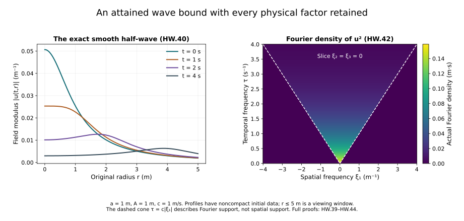

# Wave energy, dispersion and null forms

[Gauss law, heat curvature and fixed-time estimates](../classical-fixed-time-estimates.html)
controls the heat extension at each physical time. The physical
evolution also needs estimates over a time interval. This chapter
proves the three wave estimates that enter that next step.

Energy controls the derivative field at every time. The fourth-power
estimate integrates in both space and time and records how a wave
spreads. A null form is a particular difference of derivative
products: its Fourier symbol vanishes for parallel spatial
frequencies. We calculate how that cancellation controls the product
for both equal and opposite wave-frequency signs.

The physical coordinate \(t\), speed \(c>0\), every Fourier factor,
the original fields and finite heat endpoint stay explicit. The
exact comparison to a length-valued time coordinate is proved in
Section 4 and retained as a source comparison.

The human-source comparison is Sung-Jin Oh,
[*Gauge choice for the Yang–Mills equations using the Yang–Mills
heat flow and local well-posedness in \(H^1\)*,
arXiv:1210.1558v2](https://arxiv.org/abs/1210.1558v2),
Section 3.2 and the concrete wave-weight definitions in Section 3.3.
Oh attributes the null-form estimate to Sergiu Klainerman and
Matei Machedon, “Space-time estimates for null forms and the local
existence theorem,” *Communications on Pure and Applied Mathematics*
46 (1993), 1221–1268. The complete proofs below are independently
written Fourier calculations. Section 5 visibly corrects the
displayed forcing derivative in the source.

## 1. Fourier convention, domains and energy

Let \(c>0\), \(t_0\in I=[t_-,t_+]\), and
\(\Box_c=-c^{-2}\partial_t^2+\Delta_x\) on
\(\mathbb R_t\times\mathbb R_x^3\).
Initially take smooth rapidly decreasing spatial data, and smooth forcing
with compact time support. The spatial Fourier transform and its inverse
are

\[
\widehat f(\xi)=\int_{\mathbb R^3}e^{-ix\cdot\xi}f(x)\,dx,\qquad
f(x)=(2\pi)^{-3}\int_{\mathbb R^3}e^{ix\cdot\xi}\widehat f(\xi)\,d\xi.
\tag{HW.1}
\]

The space-time inverse has factor \((2\pi)^{-4}\). For the homogeneous
Sobolev seminorm used below,

\[
\|f\|_{\dot H^q}^2=(2\pi)^{-3}
 \int_{\mathbb R^3}|\xi|^{2q}|\widehat f(\xi)|^2\,d\xi.
\tag{HW.2}
\]

We use this formula on the actual regular fields and their Fourier
multipliers. Regular spatial data in this chapter belong to every
inhomogeneous Sobolev space; all stated time derivatives are continuous
in those spaces on the compact physical-time interval. This specifies
the field itself, not an equivalence class modulo polynomials.

For \(\Box_cu=N\), define the derivative tuple and energy

\[
\partial_cu=(c^{-1}\partial_tu,\partial_1u,\partial_2u,\partial_3u),
\quad
E_q(u;t)^2=(2\pi)^{-3}\int |\xi|^{2q}
 \bigl(c^{-2}|\widehat{\partial_tu}|^2+|\xi|^2|\widehat u|^2\bigr)d\xi.
\tag{HW.3}
\]

The map from the original derivative tuple is the diagonal component
map \(\operatorname{diag}(c^{-1},1,1,1)\); its inverse is
\(\operatorname{diag}(c,1,1,1)\). The physical coordinate \(t\), speed
\(c\), and original derivatives are retained. In particular a bound on
the first component gives a bound on \(\partial_tu\) after multiplication
by \(c\).

Since \(u_{tt}-c^2\Delta u=-c^2N\), Fourier differentiation and integration
give exactly

\[
\frac{d}{dt}E_q(u;t)^2
 =-2\operatorname{Re}\langle |D|^qu_t,|D|^qN\rangle .
\tag{HW.4}
\]

Cauchy–Schwarz, followed by integration with
\((E_q^2+\varepsilon^2)^{1/2}\) and \(\varepsilon\downarrow0\), proves

\[
 E_q(u;t)\le E_q(u;t_0)
   +c\int_{\min(t,t_0)}^{\max(t,t_0)}\|N(r)\|_{\dot H^q}\,dr .
\tag{HW.5}
\]

The exact Duhamel formula is

\[
\begin{aligned}
u(t)={}&\cos(c|D|(t-t_0))\phi
 +\frac{\sin(c|D|(t-t_0))}{c|D|}\psi\\
&-c\int_{t_0}^{t}\frac{\sin(c|D|(t-r))}{|D|}N(r)\,dr .
\end{aligned}\tag{HW.6}
\]

The zero-frequency value of the data multiplier is \(t-t_0\);
the forcing multiplier has its corresponding continuous value.
There is no deleted zero mode.

## 2. The cone calculation for the fourth-power estimate

For a scalar complex half-wave write

\[
u_\sigma(t,x)=(2\pi)^{-3}\int
 e^{ix\cdot\xi+i\sigma ct|\xi|}f(\xi)\,d\xi,\quad \sigma\in\{+1,-1\}.
\tag{HW.7}
\]

Time translation changes only a modulus-one factor in \(f\). Start with
smooth \(f\) supported in a bounded annulus. For the plus sign, the
space-time Fourier transform of \(u_+^2\) is

\[
(2\pi)^{-2}\int f(\eta)f(\xi-\eta)
 \delta(\tau-c(|\eta|+|\xi-\eta|))\,d\eta .
\tag{HW.8}
\]

Here the Dirac distribution is defined by
\(\int\delta(\tau-b)\chi(\tau)\,d\tau=\chi(b)\).
To verify the coefficient, multiply the two inverse spatial Fourier
integrals and transform in all four variables. The spatial integral
gives \((2\pi)^3\delta(\xi-\eta-\zeta)\); the time integral gives
\(2\pi\delta(\tau-c(r+v))\). Their product with \((2\pi)^{-6}\)
is \((2\pi)^{-2}\). These identities hold against smooth compactly
supported test functions by Fourier inversion; the initial bounded
frequency supports justify the other integrations.

Put \(r=|\eta|\), \(v=|\xi-\eta|\), \(R=|\xi|\), and \(\lambda=\tau/c\).
When \(R>0\), let \(\varphi\) be the azimuthal angle about the
\(\xi\)-axis. Since \(v^2=R^2+r^2-2Rr\cos\theta\),
\(|d(\cos\theta)|=v\,dv/(Rr)\). The full polar measure is

\[
d\eta=\frac{rv}{R}\,dr\,dv\,d\varphi,\quad 0\le\varphi<2\pi,
\qquad |r-v|\le R\le r+v.
\tag{HW.9}
\]

For radial functions of \(r,v\), integrating the azimuth gives the
factor \(2\pi\). This applies to the kernel below; the Fourier data
need not be radial. For \(\tau>cR\), the constraint \(r+v=\lambda\) leaves
\((\lambda-R)/2\le r\le(\lambda+R)/2\), an interval of length \(R\).
Consequently

\[
\int \frac{\delta(\tau-c(r+v))}{rv}\,d\eta=\frac{2\pi}{c}.
\tag{HW.10}
\]

It is zero outside the forward cone. At \(R=0\) the same value follows
from \(4\pi\int_0^\infty\delta(\tau-2cr)\,dr\). For fixed \(\xi\ne0\), the full variables \((r,v,\varphi)\) convert
the time-frequency pushforward into an ordinary density: substitute
\(v=\tau/c-r\), with Jacobian \(1/c\). Polar axes and the boundary
of the triangle region have zero measure before this linear change.
They therefore produce no additional singular measure. The set
\(\xi=0\) has zero outer spatial-frequency measure. This justifies
the density formula before applying Plancherel.

Cauchy–Schwarz on the delta measure, with weight \(1/(rv)\), and
space-time Plancherel now give

\[
\begin{aligned}
\|u_+\|_{L^4_{t,x}}^4
&\le(2\pi)^{-8}\frac{2\pi}{c}
 \left(\int |\eta||f(\eta)|^2\,d\eta\right)^2\\
&=\frac1{2\pi c}\|u_+(0)\|_{\dot H^{1/2}}^4 .
\end{aligned}\tag{HW.11}
\]

The minus sign follows by time reflection, without changing \(c\).
For actual data in every inhomogeneous Sobolev space, bounded annular
Fourier cutoffs converge in both \(L^2\) and \(\dot H^{1/2}\).
The estimate makes the waves Cauchy in \(L^4\), while unitarity gives
convergence locally in time in \(L^2_x\). The two limits agree as
distributions, proving (HW.11) for the original datum.

For the homogeneous solution with data \((\phi,\psi)\), set

\[
f_\pm=\tfrac12\widehat\phi
 \ \pm\frac{\widehat\psi}{2ic|\xi|}.
\tag{HW.12}
\]

The signs give \(ic|\xi|(f_+-f_-)=\widehat\psi\).
For each half-wave, summing the squared \(\dot H^{1/2}\) norms of
the four components of \(\partial_cu_\pm\) gives
\(2\|u_\pm(t_0)\|_{\dot H^{3/2}}^2\). Minkowski applied to the sum of
component squares, followed by the triangle inequality for the two
half-waves and the parallelogram identity, proves

\[
\|\partial_cu\|_{L^4_{t,x}(\mathbb R^{1+3})}
\le\sqrt2(2\pi c)^{-1/4}
\left(\|\phi\|_{\dot H^{3/2}}^2
       +c^{-2}\|\psi\|_{\dot H^{1/2}}^2\right)^{1/2}.
\tag{HW.13}
\]

Finite-dimensional vector or matrix components obey the same tuple
bound with their Euclidean or Hilbert–Schmidt norms.

For regular full-wave data, a half-wave can contain
\(|\xi|^{-1}\widehat\psi\) at low frequency. This defines a tempered
distribution: near zero Cauchy–Schwarz uses
\(\int_{|\xi|<1}|\xi|^{-2}d\xi=4\pi\), while at large frequency
the original regular data provide all required weighted bounds.
Its derivative tuple has \(L^2\) data, since each spatial multiplier
on \(\widehat\psi\) is \(\xi_i/|\xi|\), bounded in absolute value by
one. Annular approximation proves (HW.13) for the actual full
wave. The original zero-frequency cancellation stays in (HW.6).

For the inhomogeneous solution on \(I\), differentiate HW.6 before
introducing the time restriction. The time derivative has no endpoint
term because \(\sin(0)=0\). At each forcing time \(r\), the resulting
term is the derivative tuple of a free wave with initial velocity
\(-c^2N(r)\), restricted to times between \(r\) and the appropriate
endpoint of \(I\). Its data energy in HW.13 is
\(c\|N(r)\|_{\dot H^{1/2}}\). Minkowski therefore proves

\[
\|\partial_cu\|_{L^4_{t,x}(I\times\mathbb R^3)}
\le\sqrt2(2\pi c)^{-1/4}
\left[
\left(\|\phi\|_{\dot H^{3/2}}^2
+c^{-2}\|\psi\|_{\dot H^{1/2}}^2\right)^{1/2}
+c\|N\|_{L^1_t\dot H^{1/2}_x(I)}
\right].
\tag{HW.14}
\]

For \(r<t_0\) the orientation of the integral in HW.6 reverses its
sign; the same norm bound holds. Integrating both time portions uses
each \(r\in I\) once.

## 3. The spatial null-form calculation

Keep the original spatial derivatives and their order:

\[
Q_{ij}(u,v)=\partial_i u\,\partial_j v-\partial_j u\,\partial_i v .
\tag{HW.15}
\]

For matrix-valued fields these are ordered matrix products. Let the
two inputs have signs \(\sigma,\rho\) in HW.7 and Fourier data \(f,g\).
With \(\zeta=\xi-\eta\), the symbol is
\(-m_{ij}\), where \(m_{ij}=\eta_i\zeta_j-\eta_j\zeta_i\).
The Fourier transform has factor \((2\pi)^{-2}\) and delta constraint
\(\tau=c(\sigma r+\rho v)\).

The Cauchy–Schwarz kernel needed for the squared bound is

\[
J_{\sigma\rho}(\tau,\xi)
=\int\frac{|m_{ij}|^2}{r^4v^2}
 \delta(\tau-c(\sigma r+\rho v))\,d\eta .
\tag{HW.16}
\]

We prove \(J_{\sigma\rho}\le8\pi/c\). First,
\(|m_{ij}|^2\le|\eta\times\zeta|^2\). Time reflection permits
\(\sigma=+1\). Equation HW.9 retains the azimuthal variable; after bounding the
component square by the radial cross-product square, its integral
supplies the full factor \(2\pi\).

For equal signs let
\(a=(\lambda-R)/2\), \(b=(\lambda+R)/2\).
On the support \(0\le a\le b\), \(R=b-a\),
\(r\in[a,b]\), \(v=a+b-r\), and the exact area identity is

\[
|\eta\times\zeta|^2=4ab(r-a)(b-r),\qquad
(r-a)(b-r)=rv-ab.
\tag{HW.17}
\]

For \(a>0\), \(R>0\), it follows that

\[
J_{++}\le\frac{8\pi ab}{cR}\int_a^b
 \frac{(r-a)(b-r)}{r^3v}\,dr
\le\frac{8\pi ab}{cR}\int_a^b r^{-2}\,dr
=\frac{8\pi}{c}.
\tag{HW.18}
\]

Use the almost-everywhere density at exceptional boundary parameters.
The boundary of the \((r,v)\) region has zero measure before the
linear change from \(v\) to \(\tau\), so it adds no singular measure.
For \(R=0\), the null symbol is exactly zero.

For opposite signs, \(-R<\lambda<R\), put

\[
a=(R+\lambda)/2,\quad b=(R-\lambda)/2,\quad
r=x+a,\quad v=x+b,\quad x\ge0.
\tag{HW.19}
\]

Now \(R=a+b\), and exactly

\[
|\eta\times\zeta|^2=4abx(x+R),\qquad
x(x+R)=(x+a)(x+b)-ab.
\tag{HW.20}
\]

Therefore

\[
J_{+-}\le\frac{8\pi ab}{cR}\int_0^\infty
 \frac{x(x+R)}{(x+a)^3(x+b)}\,dx
\le\frac{8\pi ab}{cR}\int_0^\infty(x+a)^{-2}\,dx
=\frac{8\pi b}{cR}\le\frac{8\pi}{c}.
\tag{HW.21}
\]

There is no support outside \(|\tau|\le cR\). Boundaries are treated
as in the equal-sign case. Thus all four sign choices have the stated
uniform bound, with the high derivative always on the first factor.

Space-time Plancherel, Cauchy–Schwarz with HW.16, Tonelli and the change
of variables \((\eta,\xi-\eta)\) give

\[
\begin{aligned}
\|Q_{ij}(u_\sigma,v_\rho)\|_{L^2_{t,x}}^2
&\le(2\pi)^{-8}\frac{8\pi}{c}
 \left(\int|\eta|^4|f(\eta)|^2\,d\eta\right)
 \left(\int|\zeta|^2|g(\zeta)|^2\,d\zeta\right)\\
&=\frac2{\pi c}
 \|u_\sigma(t_0)\|_{\dot H^2}^2
 \|v_\rho(t_0)\|_{\dot H^1}^2 .
\end{aligned}\tag{HW.22}
\]

For Hilbert–Schmidt matrices use
\(\|AB\|_{\rm HS}\le\|A\|_{\rm HS}\|B\|_{\rm HS}\) inside the same
integral; no product order is exchanged.

For full homogeneous waves the parallelogram identity in HW.12 yields

\[
\sum_{\sigma=\pm}\|u_\sigma(t_0)\|_{\dot H^2}
\le\bigl(\|\phi_u\|_{\dot H^2}^2
       +c^{-2}\|\psi_u\|_{\dot H^1}^2\bigr)^{1/2},
\tag{HW.23}
\]

and the corresponding low-order bound for \(v\).
Summing the four sign combinations proves

\[
\|Q_{ij}(u,v)\|_{L^2_{t,x}}
\le\sqrt{\frac2{\pi c}}\,E_1(u;t_0)E_0(v;t_0).
\tag{HW.24}
\]

For the full ordered spatial pair tuple there are six nonzero pairs,
so \(\sqrt6\) times the right side is a valid bound for its Euclidean
tuple norm.

For \(\Box_cu=N\), \(\Box_cv=M\) on \(I\), expand both actual Duhamel
formulas. Each forcing term is a free wave with initial velocity
\(-c^2N(r)\) or \(-c^2M(r)\). Its respective energy is
\(c\|N(r)\|_{\dot H^1}\) or \(c\|M(r)\|_2\).
Since \(Q_{ij}\) differentiates only in space, the time restrictions
factor through the product without derivative terms. Bilinear
Minkowski applied to the homogeneous term, the two single integrals,
and the double integral proves

\[
\begin{aligned}
\|Q_{ij}(u,v)\|_{L^2_{t,x}(I\times\mathbb R^3)}
\le\sqrt{\frac2{\pi c}}\,
 &\bigl(E_1(u;t_0)+c\|N\|_{L^1_t\dot H^1_x(I)}\bigr)\\
{}\cdot&
 \bigl(E_0(v;t_0)+c\|M\|_{L^1_tL^2_x(I)}\bigr).
\end{aligned}\tag{HW.25}
\]

One can first use smooth bounded annular data and forcing, then pass
to the limit with HW.22–HW.25. In the regular \(H^\infty\) class needed
here, spatial products converge locally as distributions and identify
the bounded \(L^2\) limit with the original null form. Approximation
does not remove any frequency from the final field.

## 4. Exact receiving wave norms

For \(k\ge1\), retain the complete original derivative tuple and put

\[
\begin{aligned}
\|u\|_{\mathsf S_c^k(I)}
&=\sup_{t\in I}E_{k-1}(u;t)
  +c|I|^{1/2}\||D|^{k-1}\Box_cu\|_{L^2_{t,x}(I\times\mathbb R^3)}.
\end{aligned}\tag{HW.26}
\]

This is a norm on the stated regular class. Homogeneity and the
triangle inequality follow from the underlying norms. If it is zero,
then at each time its spatial Fourier contribution gives
\(|\xi|^k\widehat u(t,\xi)=0\) almost everywhere. Since
\(u(t)\in L^2_x\), its transform vanishes almost everywhere,
including the fact that the single zero-frequency point has no
\(L^2\) mass. Hence the original field is zero.

For integer \(k\), this is exactly the Euclidean full tuple of all
ordered \(k-1\) spatial derivatives in each term: the identity

\[
\sum_{i_1,\ldots,i_m=1}^3
 |\xi_{i_1}\cdots\xi_{i_m}|^2
 =(\xi_1^2+\xi_2^2+\xi_3^2)^m
\tag{HW.27}
\]

and Plancherel prove it, with no omitted derivative word.
At noninteger orders HW.2 specifies the multiplier.

The source uses a time coordinate of length dimension with speed one.
The exact comparison map, retained alongside the original physical
field, is

\[
(\mathcal P_cu)(x^0,x)=u(x^0/c,x),\quad
J=\{ct:t\in I\},\quad
\mathcal P_c^{-1}v(t,x)=v(ct,x).
\tag{HW.28}
\]

The chain rule gives
\(\partial_0\mathcal P_cu=c^{-1}\mathcal P_c\partial_tu\),
\(\partial_i\mathcal P_cu=\mathcal P_c\partial_iu\), and
\((-\partial_0^2+\Delta)\mathcal P_cu=\mathcal P_c\Box_cu\).
Moreover \(dx^0=c\,dt\), \(|J|=c|I|\), and therefore

\[
\begin{aligned}
\|\partial_{0,x}\mathcal P_cu\|_{L^\infty_{x^0}L^2_x(J)}
 &=\sup_{t\in I}E_0(u;t),\\
|J|^{1/2}\|\mathcal P_c\Box_cu\|_{L^2_{x^0,x}(J)}
 &=c|I|^{1/2}\|\Box_cu\|_{L^2_{t,x}(I)}.
\end{aligned}\tag{HW.29}
\]

Thus HW.26 is exactly the pullback of the source's displayed
\(\dot S^k\) formula when full derivative tuples have Euclidean norms.
The course calculations still concern the original \(u(t,x)\); both
directions of the comparison and every measure factor have been
proved. For the source's explicitly stated maximum over output
indices, apply this identity to each output component and take that
same maximum. If a full output tuple is desired as well, the identity
map between the two finite arrays has the proved bounds

\[
\max_{1\le a\le n}\|z_a\|_X
\le\|(\,z_a\,)_{a=1}^n\|_{X(\ell^2)}
\le\sqrt n\,\max_{1\le a\le n}\|z_a\|_X
\tag{HW.30}
\]

for the \(L^2\), \(L^\infty L^2\) and \(L^4\) norms used here.
The first inequality is pointwise inclusion; the second follows by
Minkowski on the squares and the finite sum. For the sum of the two
terms in HW.26, distinguish the maximum of that sum from the sum of
two maxima. If their individual component values are \(A_a,B_a\),
then the full tuple norm is bounded above by
\((\sum A_a^2)^{1/2}+(\sum B_a^2)^{1/2}\).
Its square is at most
\(2\sum(A_a^2+B_a^2)\le2\sum(A_a+B_a)^2\).
Consequently the exact identity map on output components has
comparison constants \(1\) and \(\sqrt{2n}\) between the maximum
of the component \(\mathsf S_c^k\) norms and the full tuple
\(\mathsf S_c^k\) norm. No interchange of a maximum and a sum
is asserted.

Apply HW.5 at \(q=k-1\), and Cauchy–Schwarz in the original \(dt\)
measure. Adding the actual forcing term of HW.26 proves

\[
\|u\|_{\mathsf S_c^k(I)}
\le E_{k-1}(u;t_0)
 +2c|I|^{1/2}\||D|^{k-1}\Box_cu\|_{L^2_{t,x}(I)}.
\tag{HW.31}
\]

No estimate of a high-order wave norm by an undifferentiated forcing
has been used.

Hölder in the Fourier integral, on the disjoint union of its four
derivative components, gives
\(E_{q+\theta}\le E_q^{1-\theta}E_{q+1}^{\theta}\).
The same calculation for the forcing \(L^2\) integral gives the
interpolation of its two orders. Supremum in time preserves the
first inequality. Finally the two-term Hölder inequality
\(a^{1-\theta}b^\theta+d^{1-\theta}e^\theta
\le(a+d)^{1-\theta}(b+e)^\theta\) proves

\[
\|u\|_{\mathsf S_c^{k+\theta}(I)}
\le\|u\|_{\mathsf S_c^k(I)}^{1-\theta}
     \|u\|_{\mathsf S_c^{k+1}(I)}^\theta,\qquad 0<\theta<1.
\tag{HW.32}
\]

This keeps both forcing and energy contributions.

Apply HW.14 to the full tuple of all ordered \(k-1\) spatial
derivatives, using HW.27, and use Cauchy–Schwarz in time. Equation
HW.26 includes both the resulting initial energy and the forcing
term. Hence

\[
\|\partial_x^{(k-1)}\partial_cu\|_{L^4_{t,x}(I)}
\le\sqrt2(2\pi c)^{-1/4}
 \|u\|_{\mathsf S_c^{k+1/2}(I)} .
\tag{HW.33}
\]

The same substitution into HW.25 gives

\[
\|Q_{ij}(u,v)\|_{L^2_{t,x}(I)}
\le\sqrt{\frac2{\pi c}}\,
 \|u\|_{\mathsf S_c^2(I)}\|v\|_{\mathsf S_c^1(I)}.
\tag{HW.34}
\]

The energy part of HW.26 itself bounds every original spatial
component; multiplication by \(c\) recovers the original time
derivative component.

At an unchanged positive heat time \(s\), use the source's concrete
displayed wave weight, with its entire factor retained:

\[
\|u(s)\|_{\mathfrak S_c^k(I;s)}
=s^{(k-1)/2-1/4}\|u(s)\|_{\mathsf S_c^k(I)}.
\tag{HW.35}
\]

For an original heat interval \((0,S]\) the complete mixed norm is,
for finite \(p\),

\[
\left(\int_0^S
 \left[s^\ell s^{(k-1)/2-1/4}
             \|u(s)\|_{\mathsf S_c^k(I)}\right]^p
 \frac{ds}{s}\right)^{1/p},
\tag{HW.36}
\]

and is the supremum of the bracketed expression when \(p=\infty\).
Both expressions are invertible scalar multiplications at each
\(s>0\), not replacements of the field by a rescaled solution.
For \(\ell=5/4\), the combined coefficient is
\(s^{(k+1)/2}\). Thus the energy contribution of HW.36 at a fixed
physical time is precisely the spatial weight already proved in
HT.40 and the temporal weight in HT.52 with \(m=k-1\), after the
explicit temporal factor \(c^{-1}\) in HW.3. The forcing contribution
is still
\(c|I|^{1/2}s^{(k+1)/2}
\|\partial_x^{(k-1)}\Box_cu(s)\|_{L^2_{t,x}}\).
It remains to estimate that actual Yang–Mills forcing; it has not
been replaced by a fixed-time bound.

## 5. A source display that requires its derivative

The original [companion author source, arXiv:1210.1558v2](https://arxiv.org/src/1210.1558v2),
line 928, in the proposition titled “Energy estimate” in its wave
preliminaries, displays a bound
for \(\dot S^k\), all integer \(k\ge1\), whose forcing term is
\(T^{1/2}\|\Box\psi\|_{L^2}\). Its own preceding definition requires
\(k-1\) spatial derivatives on that forcing. The display is false
for \(k>1\) if read literally with a universal field-independent
constant. This is a bounded correction to the displayed estimate;
it is not a claim that the paper's main theorem fails.

Here is an exact counterexample to the omitted-derivative display.
Work first in the source's original \(c=1\) coordinates, with
\(I=(-T,T)\), \(T>0\). Choose a real nonzero
\(\chi\in C_c^\infty((T/4,T/2))\), and a nonzero Schwartz function
\(f\) with \(\widehat f\in C_c^\infty(B(0,1))\).
For \(R>2\), set

\[
\psi_R(t,x)=\chi(t)e^{iRx^1}f(x),\qquad N_R=\Box\psi_R .
\tag{HW.37}
\]

The initial data at zero vanish. Every spatial Fourier frequency
of \(N_R\) has \(|\xi|\ge R-1\). Also \(N_R\ne0\): otherwise each
Fourier mode of the homogeneous wave equation with zero initial
data vanishes by its explicitly solved scalar ODE, contradicting
\(\chi f\ne0\). Therefore the definition of \(\dot S^k\) and
Plancherel imply

\[
\|\psi_R\|_{\dot S^k(I)}
\ge(2T)^{1/2}(R-1)^{k-1}\|N_R\|_{L^2_{t,x}}.
\tag{HW.38}
\]

The displayed source right side with its zero initial data would be
\(CT^{1/2}\|N_R\|_2\). Dividing by this nonzero forcing norm forces
\(\sqrt2(R-1)^{k-1}\le C\), impossible as \(R\to\infty\) for
\(k>1\). A real scalar example is obtained by adding the complex conjugate of
the modulated field. Its two disjoint Fourier packets lie near
\(Re_1\) and \(-Re_1\), and both have \(|\xi_1|\ge R-1\).
If derivative tuples use a maximum, the single component
\(\partial_1^{k-1}\) gives the same lower bound. Thus the example
does not depend on choosing a Euclidean derivative tuple.
For Lie-algebra-valued fields multiply that real example by any
fixed nonzero Lie-algebra matrix; the same estimates and support
property hold. Thus complexification is not essential.

The exact correction, including the physical coordinate map, is
HW.31. On \(I=(-T,T)\) its forcing coefficient is
\(2c\sqrt{2T}\) and its forcing norm has \(|D|^{k-1}\) present.
The constant is explicit; no missing estimate is assumed.
Every later use of (HW.31) retains this spatial derivative. For \(k=1\), the omitted derivative has order zero and the
source display is compatible with the proved estimate.

## 6. An exact smooth wave attaining the fourth-power constant

Choose a length \(a>0\), a real amplitude \(A\ne0\), and the same
physical speed \(c>0\). Take the Fourier datum and its inverse

\[
f_a(\xi)=\frac{A e^{-a|\xi|}}{|\xi|},\qquad
h_a(x)=\frac{A}{2\pi^2(a^2+|x|^2)} .
\tag{HW.39}
\]

The singular value at the single point zero does not affect any
integral. The datum is locally integrable and belongs to
\(L^2((1+|\xi|^2)^m\,d\xi)\) for every nonnegative integer \(m\):
its radial \(L^2\) integrand is bounded near zero and decays
exponentially at infinity. Thus \(h_a\) belongs to every
inhomogeneous Sobolev space.

Let \(r=|x|\) and \(z=a-ict\). Spherical angular integration in
the original three-dimensional Fourier inverse gives

\[
\begin{aligned}
u_a(t,r)
 &=\frac{A}{2\pi^2r}\int_0^\infty e^{-z\rho}\sin(r\rho)\,d\rho\\
 &=\frac{A}{2\pi^2(z^2+r^2)},\\
|u_a(t,r)|
 &=\frac{|A|}{2\pi^2\sqrt{(a^2-c^2t^2+r^2)^2+4a^2c^2t^2}} .
\end{aligned}\tag{HW.40}
\]

To evaluate the integral, subtract
\(\int_0^\infty e^{-(z+ir)\rho}d\rho=(z+ir)^{-1}\) from its
counterpart with \(-ir\), then divide by \(2i\).
Both integrals converge since \(\operatorname{Re}z=a>0\).
Their difference is \(r/(z^2+r^2)\).
At \(r=0\), the continuous value is \(A/(2\pi^2z^2)\).
The denominator cannot vanish for real \(t,r\): its imaginary
part forces \(t=0\), where its real part is \(a^2+r^2>0\).
Fourier differentiation, justified by the exponential tail,
proves smoothness and \(\Box_cu_a=0\). This is an actual
free wave with noncompact initial data.

The initial norm is exactly

\[
\|h_a\|_{\dot H^{1/2}}^2
 =\frac{4\pi A^2}{(2\pi)^3}
       \int_0^\infty \rho e^{-2a\rho}\,d\rho
 =\frac{A^2}{8\pi^2a^2}.
\tag{HW.41}
\]

On the constraint \(r+v=\tau/c\), the product of Fourier data
is \(A^2e^{-a\tau/c}/(rv)\). The Cauchy–Schwarz step in (HW.11)
is therefore an equality. The full cone calculation gives

\[
\widehat{u_a^2}(\tau,\xi)
 =\frac{A^2}{2\pi c}e^{-a\tau/c}
       \mathbf1_{\{\tau>c|\xi|\}} .
\tag{HW.42}
\]

This is an almost-everywhere density with no additional boundary
measure, by Section 2. Frequency truncations converge by (HW.11);
the explicit integrals also converge absolutely in their stated
spaces.

Integrate over the complete spatial-frequency ball of radius
\(\tau/c\), whose volume is \(4\pi(\tau/c)^3/3\). Plancherel yields

\[
\begin{aligned}
\|u_a\|_{L^4_{t,x}}^4
 &=(2\pi)^{-4}\frac{A^4}{4\pi^2c^2}
 \int_0^\infty e^{-2a\tau/c}\frac{4\pi\tau^3}{3c^3}\,d\tau\\
 &=\frac{A^4}{128\pi^5ca^4}
 =\frac1{2\pi c}\|h_a\|_{\dot H^{1/2}}^4 .
\end{aligned}\tag{HW.43}
\]

Here \(\int_0^\infty \tau^3e^{-b\tau}d\tau=6b^{-4}\):
integrate by parts three times, then use
\(\int_0^\infty e^{-b\tau}d\tau=b^{-1}\), \(b>0\).
Every boundary term vanishes by its positive power at zero
or exponential decay at infinity. Since \(A\ne0\),

\[
\frac{\|u_a\|_{L^4_{t,x}}}{\|h_a\|_{\dot H^{1/2}}}
 =(2\pi c)^{-1/4}.
\tag{HW.44}
\]

A smaller universal half-wave coefficient would fail on this
field. This proves sharpness for (HW.11); no optimality is
asserted for the other constants in this chapter.

**Figure HW.** The left panel samples (HW.40) at \(a=1\) metre,
\(A=1\) metre and \(c=1\) metre per second, for the listed original
times. The field has unit inverse metre. Its initial datum is
noncompact; the radial plotting interval is a viewing window.
The right panel is the slice \(\xi_2=\xi_3=0\) of (HW.42),
with spatial frequency in inverse metres and temporal frequency
in inverse seconds. Its boundary is \(\tau=c|\xi_1|\), a Fourier
support statement, not a compact spatial support claim. Colour
shows the actual Fourier density in metre-seconds.
The proof retains the full three-dimensional integrals.

## 7. Exercises with complete solutions

### Exercise 1. Fourier factors and the zero mode

Derive the coefficient in (HW.8) and the zero-frequency value
of the forcing multiplier in (HW.6).

**Solution.** The two spatial inverse factors, spatial transform
and temporal transform contribute, respectively,

\[
(2\pi)^{-3}(2\pi)^{-3}(2\pi)^3(2\pi)=(2\pi)^{-2}.
\tag{HW.45}
\]

The spatial delta removes \(\zeta\) with unit Jacobian.
The remaining temporal delta is exactly that of (HW.8).
The forcing multiplier is
\(-c\sin(c|\xi|(t-r))/|\xi|\). Since \(\sin y/y\to1\),
its value at zero is \(-c^2(t-r)\). This is precisely the
zero-frequency solution kernel of \(u_{tt}=-c^2N\), with zero
initial displacement and velocity. No zero mode is lost.

### Exercise 2. Keep the azimuthal variable

Derive (HW.10) without assuming radial Fourier data.

**Solution.** Align the polar axis with \(\xi\ne0\).
Differentiating \(v^2=R^2+r^2-2Rr\cos\theta\) gives
\(|d(\cos\theta)|=v\,dv/(Rr)\), hence the full measure
\((rv/R)dr\,dv\,d\varphi\). The kernel \(1/(rv)\), not the
data, is radial in these variables. Its angular and delta
integrations give

\[
\frac1R\int_0^{2\pi}d\varphi
 \int_{(\lambda-R)/2}^{(\lambda+R)/2}\frac{dr}{c}
 =\frac{2\pi}{c},\qquad \lambda=\tau/c>R .
\tag{HW.46}
\]

The other Cauchy–Schwarz integral still contains the original
nonradial Fourier data and all their variables. Thus the proof
does not restrict the input fields to radial ones.

### Exercise 3. Opposite-sign cancellation

Prove (HW.20) and the bound (HW.21).

**Solution.** The exact triangle factorization is

\[
\begin{aligned}
|\eta\times\zeta|^2
 &=r^2v^2-\tfrac14(R^2-r^2-v^2)^2\\
 &=\tfrac14((r+v)^2-R^2)(R^2-(r-v)^2)
 =4abx(x+a+b),
\end{aligned}\tag{HW.47}
\]

where \(r=x+a,v=x+b,R=a+b\). Indeed the last two factors are
\(4x(x+a+b)\) and \(4ab\).
Also

\[
x(x+a+b)=(x+a)(x+b)-ab\le(x+a)(x+b).
\]

The remaining integral is at most
\(\int_0^\infty(x+a)^{-2}dx=a^{-1}\), by its antiderivative
\(-(x+a)^{-1}\). Multiplication by \(8\pi ab/(cR)\) gives
\(8\pi b/(cR)\le8\pi/c\), since \(b<R=a+b\).
The boundary parameters are covered by the almost-everywhere
density proved in Section 3; no singular measure is added.

### Exercise 4. The exact physical time derivative

Find \(\partial_tu_a\) and verify its initial value from the
original Fourier datum.

**Solution.** With \(z=a-ict\), the chain rule gives

\[
\partial_tu_a(t,r)=\frac{iAc\,z}{\pi^2(z^2+r^2)^2},
\qquad
\partial_tu_a(0,r)=\frac{iAca}{\pi^2(a^2+r^2)^2}.
\tag{HW.48}
\]

The initial velocity transform is \(ic|\xi|f_a=icA e^{-a|\xi|}\).
Differentiating the exact inverse pair in (HW.39) with respect
to the original length gives

\[
-\partial_af_a(\xi)=A e^{-a|\xi|},\qquad
-\partial_ah_a(x)=\frac{Aa}{\pi^2(a^2+|x|^2)^2}.
\tag{HW.49}
\]

Multiplication by \(ic\) gives the displayed initial velocity.
Exponential majorants justify differentiation under the Fourier
integral. The factor \(c\) and original time coordinate remain.

### Exercise 5. The attained fourth-power constant

Evaluate both sides of (HW.43) from their complete integrals.

**Solution.** The spatial radial coefficient is
\(4\pi/(2\pi)^3=1/(2\pi^2)\), and
\(\int_0^\infty\rho e^{-2a\rho}d\rho=(2a)^{-2}\).
Hence \(\|h_a\|_{\dot H^{1/2}}^2=A^2/(8\pi^2a^2)\).
In space-time retain every factor:

\[
(2\pi)^{-4}\frac{A^4}{4\pi^2c^2}
 \frac{4\pi}{3c^3}\frac{6c^4}{(2a)^4}
 =\frac{A^4}{128\pi^5ca^4}.
\tag{HW.50}
\]

The square of the initial norm, multiplied by \(1/(2\pi c)\),
has exactly this value. It is positive. Taking fourth roots
proves (HW.44), and excludes any smaller universal coefficient.

### Exercise 6. The time coordinate and both measure factors

Prove (HW.29) and find the fourth-power norm factor under
\(\mathcal P_c\).

**Solution.** At \(x^0=ct\), the derivative components are
\((c^{-1}u_t,\partial_1u,\partial_2u,\partial_3u)\).
The bijection between \(I\) and \(J\) preserves their supremum
in time, giving the first line of (HW.29). For the forcing,

\[
|J|^{1/2}=(c|I|)^{1/2},\qquad
\|\mathcal P_cN\|_{L^2(J\times\mathbb R^3)}
 =c^{1/2}\|N\|_{L^2(I\times\mathbb R^3)}.
\tag{HW.51}
\]

Their product is \(c|I|^{1/2}\|N\|_2\). Direct integration gives

\[
\|\mathcal P_cu\|_{L^4(J\times\mathbb R^3)}^4
 =c\|u\|_{L^4(I\times\mathbb R^3)}^4 .
\tag{HW.52}
\]

Thus the norm factor is \(c^{1/4}\), accounting for the
original-coordinate coefficient \(c^{-1/4}\). Equation (HW.51)
accounts for both factors in the actual forcing norm.

### Exercise 7. The forcing derivatives are necessary

Give a real example proving the failure of the omitted-derivative
estimate for every integer \(k>1\).

**Solution.** Choose nonzero \(f\) with smooth Fourier transform
supported in \(B(0,1)\), and put
\(g_R=e^{iRx^1}f+e^{-iRx^1}\overline f\), \(R>2\).
The terms are conjugate, so \(g_R\) is real; their disjoint
Fourier supports show \(g_R\ne0\). Set \(\psi_R=\chi g_R\)
with \(\chi\) from Section 5. Both initial data vanish.
The forcing \(N_R=\Box\psi_R\) has the same two Fourier
supports and is nonzero by the homogeneous zero-data ODE
argument. On both supports \(|\xi_1|\ge R-1\), hence

\[
\|\partial_1^{k-1}N_R\|_{L^2_{t,x}}
 \ge(R-1)^{k-1}\|N_R\|_{L^2_{t,x}}>0 .
\tag{HW.53}
\]

The original derivative tuple contains this component, whether
measured by a maximum or a Euclidean norm. The omitted-derivative
claim would therefore imply \(\sqrt2(R-1)^{k-1}\le C\).
For \(k>1\) this fails as \(R\to\infty\).
Multiplication by a fixed nonzero Lie-algebra matrix gives the
same counterexample in real Lie-algebra-valued fields; its
positive trace norm appears on both sides.

### Exercise 8. The complete heat-weighted forcing

For \(\ell=5/4\) in (HW.36), retain both wave-norm contributions
and relate the temporal part to (HT.52).

**Solution.** With \(m=k-1\), the exact scalar product is

\[
s^{5/4}s^{(k-1)/2-1/4}=s^{(k+1)/2}=s^{m/2+1}.
\tag{HW.54}
\]

The energy tuple therefore contains
\(s^{m/2+1}c^{-1}\partial_x^{(m)}\partial_tu\) and
\(s^{m/2+1}\partial_x^{(m)}\nabla_xu\), in their original
Euclidean \(L^2_x\) norm. For \(u=G_i\), the temporal term is
\(c^{-1}\) times the corresponding norm of (HT.52), while the
spatial term is case \(q=k\) of (HT.40). The separate forcing is

\[
c|I|^{1/2}s^{(k+1)/2}
 \|\partial_x^{(k-1)}\Box_cu(s)\|_{L^2_{t,x}(I\times\mathbb R^3)} .
\tag{HW.55}
\]

For finite \(p\), raise the sum of the two wave-norm contributions
to the \(p\)-th power and integrate in the original \(ds/s\)
measure. For \(p=\infty\), take its supremum over \(0<s\le S\).
The actual forcing remains in either case; a fixed-time bound
alone does not estimate it.

## 8. The next physical step

We have proved the wave energy, fourth-power and spatial
null-form estimates, their exact original-coordinate maps, and
the heat-weighted forms used by the continuation argument.
[Tension, spatial decomposition and the nonlinear wave equation](../classical-tension-null-structure.html)
now derives the actual tension equation and its all-order heat
bounds, the exact Hodge/null interaction, and the physical
time derivative of the temporal connection. The remaining
nonlinear interactions, boundary gauge estimates and global
physical continuation remain part of Lesson 9.
