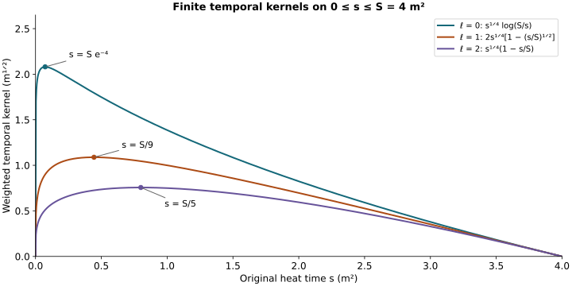

# Spatial and temporal wave interactions

This analytic chapter belongs to Unit 9. A covariant wave equation has
ordinary wave forcing as soon as its connection terms are expanded.
We estimate the principal spatial interaction and every temporal
connection term, retaining the actual matrix order and physical speed.

Read [spatial decomposition and null forms](../classical-tension-null-structure.html),
NX.22–NX.32, [backward heat bounds](../classical-curlfree-backward-heat.html),
CF.7–CF.8 and CF.20–CF.23, [potential wave bounds](../classical-potential-wave.html),
PW.7–PW.14, and [endpoint wave bounds](../classical-endpoint-wave.html),
EW.8–EW.17. The temporal part uses
[boundary estimates](../classical-temporal-boundary.html), TB.1–TB.11.

The main distinction is between an undifferentiated coefficient and a
positive derivative of that coefficient. Only the undifferentiated
spatial coefficient needs its endpoint, curl-free and divergence-free
decomposition. Every other derivative placement remains a complete
product of the original fields. Sections 1–3 give the spatial and
electric pair estimates; Sections 4–5 give the temporal terms.

Keep the physical interval \(I=[t_-,t_+]\), anchor \(t_*\in I\),
heat interval \([0,S]\) and speed \(c>0\). Full ordered spatial
tuples and Hilbert–Schmidt matrix norms are used throughout. The
outer heat measure is \(ds/s\).

Human-source credit: Sung-Jin Oh,
[*Gauge choice for the Yang–Mills equations using the Yang–Mills heat flow
and local well-posedness in H1*, arXiv:1210.1558v2](https://arxiv.org/abs/1210.1558v2).
This is independent exposition of the complete receiving arguments. It
makes no novelty claim. Exact author-source and local-provider reading
coverage is retained in the course provenance.

## 1. The exact differentiated spatial interaction

Write \(A=a(S)\) and \(B(s)=a(s)-A\). The actual vector \(B(s)\) belongs to \(L^2\) for every \(s>0\),
so both orthogonal projections NX.22 apply to \(B\) without a zero-frequency
choice of potential. The original potential is recovered exactly by

\[
a(s)=A+P_{\rm cf}B(s)+P_{\rm df}B(s).
\tag{PI.1}
\]

For a word \(I_q\) with position set \(P_q=\{1,\ldots,q\}\), the complete Leibniz rule is

\[
\begin{aligned}
-2\partial_{I_q}\sum_j[a_j,\partial_jG_i]
={}&-2\sum_j[A_j,\partial_j\partial_{I_q}G_i]
-2\sum_j[(P_{\rm cf}B)_j,\partial_j\partial_{I_q}G_i]\\
&-2\sum_j[(P_{\rm df}B)_j,\partial_j\partial_{I_q}G_i]\\
&-2\sum_{\varnothing\ne J\subseteq P_q}\sum_j
 [\partial_{I_J}a_j,\partial_j\partial_{I_{J^c}}G_i].
\end{aligned}\tag{PI.2}
\]

Only the empty derivative subset has been decomposed. All nonempty subsets
retain the full \(a\), including its endpoint component. Consequently there is
no need to assume an \(L^4\) bound for a projected derivative. Equation PI.2
is valid also at \(q=0\), when its final sum is empty. Every matrix factor
stays in its original position.

Let the actual \(\mathcal F_k^p\) be CF.22, with \(p=2,\infty\), and define numerical bounds

\[
\begin{aligned}
U_A&=\sqrt3 P_0(\Theta),\qquad
\Theta=\max(t_+-t_*,t_*-t_-),\\
\mathsf B_{\rm df}&=2W_1(S)+2\overline P_2+2\mathcal J,\\
\mathsf B_{\rm cf}&=K_*\overline C_2^{1/3}\overline C_4^{2/3},\\
\overline C_2&=2\sqrt2 S^{1/4}U_0|I|^{1/2}\sqrt{18}R_0d,\\
\overline C_4&=4S^{1/8}\mathcal A\mathcal G,\qquad
K_*={3\sqrt3\over2^{4/3}\pi^{1/3}},\quad
q_c=\sqrt{2/(\pi c)},\quad d_c=\sqrt2(2\pi c)^{-1/4}.
\end{aligned}\tag{PI.3}
\]

\(P_0\) is HP.26's endpoint polynomial; \(U_0\) is CF.15's heat-weighted coefficient.
They have distinct meanings and units. The unchanged complete formulas
for \(\overline P_2\) and J are PW.8–PW.9. The unchanged complete formulas
for \(\mathcal A\) and \(\mathcal G\) are CF.28. Thus PI.3 contains no unspecified
norm. \(W_k(S)\) will be replaced by the proved finite EW.17 bound when
constructing the final numerical majorant. The preceding estimates give

\[
\|A\|_{L^\infty_{t,x}}\le U_A,\quad
\sup_s\|B(s)\|_{\mathsf S_c^1}\le\mathsf B_{\rm df},\quad
\sup_s\|P_{\rm cf}B(s)\|_{L^2_tL^\infty_x}
\le\mathsf B_{\rm cf}.
\tag{PI.4}
\]

For \(k>1\), \(\beta_k=(k-1)/2\), keep both exact backward bounds

\[
\overline P_k^2={S^{\beta_k}\over\sqrt{2\beta_k}}W_k(S)
              +{1\over\beta_k}\mathcal F_k^2,\qquad
\overline P_k^\infty=S^{\beta_k}W_k(S)
              +{1\over\sqrt{2\beta_k}}\mathcal F_k^2.
\tag{PI.5}
\]

In particular these bound the indicated weighted full potential wave
quantities, not merely their energies. PW.8's \(\overline P_2\) equals this
\(\overline P_2^2\).

## 2. Estimate each term, without exchanging the mixed norms

For the first term of PI.2, the commutator bound and contraction in j
give \(4|A||\partial^{(q+1)}G|\). Put \(A\) in \(L^\infty_{t,x}\).
The physical time inclusion has norm \(|I|^{1/2}\), and the spatial energy
in \(\mathsf S_c^{q+1}\) includes the complete order-\(q+1\) derivative tuple. Its heat weight
is exactly \(s^{q/2+1}\). Thus its contribution is
\(4|I|^{1/2}U_A\mathcal F_{q+1}^p\).

For the second term use PI.4 in \(L^2_tL^\infty_x\) and the other
factor in \(L^\infty_tL^2_x\). The contribution is
\(4\mathsf B_{\rm cf}\mathcal F_{q+1}^p\). For the third term use NX.31 on
\(u=\partial^{(q)}G\), followed by PW.13. The contribution is
\(4\sqrt3q_c\mathsf B_{\rm df}\mathcal F_{q+1}^p\).

Here NX.31 applies to the whole derivative/output tuple. To check this
without moving a supremum across a sum, apply the bilinear HW.25 proof
to u with its finite Hilbert output space: matrix multiplication is
componentwise, its pointwise operator bound is still the Hilbert–Schmidt
product bound, and every Cauchy–Schwarz in that proof uses the combined
output square sum. The antisymmetric C tensor has its original three
unordered spatial pairs. Cauchy–Schwarz on those three pairs still costs
\(\sqrt3\), and NX.29 is unchanged. The resulting energy and forcing are
those of the full u tuple. HW.27 identifies these exactly with order
\(q+1\) on \(G\). No separate time suprema of the individual words are added.

For a nonempty subset of size \(l\), both differentiated factors have at
least one spatial derivative. HW.33 and space-time Hölder give

\[
\begin{aligned}
\|\partial_x^{(l)}a(s)\|_{L^4_{t,x}}&\le d_c W_{l+1/2}(s),\\
\|\partial_x^{(q-l+1)}G(s)\|_{L^4_{t,x}}
 &\le d_c\|G(s)\|_{\mathsf S_c^{q-l+3/2}},\\
\left({l+1/2-1\over2}\right)
 +\left({q-l+3/2+1\over2}\right)&={q\over2}+1.
\end{aligned}\tag{PI.6}
\]

For a fixed subset, reindexing the full derivative word by its two
subwords is a bijection. The contracted j index obeys Cauchy–Schwarz.
There are exactly \({q\choose l}\) subsets, also when two spatial index
values agree. Put the first weighted factor in the heat supremum
PI.5, the second in its original \(L^p(ds/s)\) norm. Minkowski then proves
the complete bound

\[
\begin{aligned}
&\left\|s^{q/2+1}\left\|\partial_x^{(q)}
 \left(-2\sum_j[a_j,\partial_jG]\right)
                         \right\|_{L^2_{t,x}}\right\|_{L^p(ds/s)}
 \le \mathsf P_q^p,\\
\mathsf P_q^p={}&
4\left(|I|^{1/2}U_A+\mathsf B_{\rm cf}
               +\sqrt3q_c\mathsf B_{\rm df}\right)\mathcal F_{q+1}^p
 +4d_c^2\sum_{l=1}^q{q\choose l}
                 \overline P_{l+1/2}^\infty
                              \mathcal F_{q-l+3/2}^p .
\end{aligned}\tag{PI.7}
\]

This proves the general finite-order inequality. At the orders needed
for the first closed system, put
\(C_{\rm pr}=4(|I|^{1/2}U_A+\mathsf B_{\rm cf}+\sqrt3q_c\mathsf B_{\rm df})\). Then explicitly

\[
\begin{aligned}
\mathsf P_0^p&=C_{\rm pr}\mathcal F_1^p,\\
\mathsf P_1^p&=C_{\rm pr}\mathcal F_2^p
 +4d_c^2\overline P_{3/2}^\infty\mathcal F_{3/2}^p,\\
\mathsf P_2^p&=C_{\rm pr}\mathcal F_3^p
 +4d_c^2\left(2\overline P_{3/2}^\infty\mathcal F_{5/2}^p
              +\overline P_{5/2}^\infty\mathcal F_{3/2}^p\right).
\end{aligned}\tag{PI.8}
\]

The two half orders are bounded by
\(\mathcal F_{3/2}^p\le\sqrt{\mathcal F_1^p\mathcal F_2^p}\) and
\(\mathcal F_{5/2}^p\le\sqrt{\mathcal F_2^p\mathcal F_3^p}\). HW.32 proves the inequality
at each heat time; the weights are their geometric means. Hölder in
\(ds/s\) proves it for \(p=2\), and the supremum inequality proves \(p=\infty\).
The same interpolation bounds the half-order endpoint W values by the
adjacent integer endpoint bounds. Thus only orders one, two and three
occur, with all their original forcing contributions retained.

## 3. The electric–temporal curvature pair

In NX.20, \(F_{it}=-E_i\) and \(G^t=-c^{-2}W\), so
\(2[G^t,F_{it}]=2c^{-2}[W,E_i]=-2c^{-2}[E_i,W]\). This proves its sign
and physical coefficient before estimating it.

Let \(u_h=S^{1/4}\overline M_h\) be the same coefficient list as HT.39.
Using HP.24's full polynomial \(b_l\), define

\[
\begin{aligned}
H_r^F&=C_MC_S\sqrt{R_{r+1}R_{r+2}},\\
\mathsf E_l^\infty
 &=3^{(l+1)/2}cd\,b_l((u_h)_{h<l};(H_r^F)_{r\le l}),\\
\mathsf W_j^2
 &=|I|^{1/2}3^{j/2}cd^2\,
            b_j((u_h)_{h<j};(K_{r-1})_{0\le r\le j}),\\
\mathsf W_j^\infty
 &=|I|^{1/2}3^{j/2}cd^2\,
            b_j((u_h)_{h<j};(K_r)_{0\le r\le j}).
\end{aligned}\tag{PI.9}
\]

The \(K_{-1}\) term is exactly HT.32's proved base integral constant.
The first bound is deliberately the full word/output estimate obtained
from the individual components; it introduces no identification of
electric and magnetic coordinates. The original curvature metric puts
\(c^{-1}E\) into the positive full curvature tuple. Covariant Morrey–Sobolev
therefore bounds each covariant electric leaf by
\(cdH_r^Fs^{-r/2-3/4}\). HP.24 converts every original ordinary
derivative. Each potential leaf leaves an extra factor \(s^{1/4}\),
bounded by \(S^{1/4}\); the \(3^{l+1}\) derivative/output entries give the
displayed square-root factor. The consequence is

\[
\begin{aligned}
\sup_s s^{l/2+3/4}\|\partial_x^{(l)}E(s)\|_{L^\infty_{t,x}}
 &\le\mathsf E_l^\infty,\\
\left\|s^{j/2+1/4}\|\partial_x^{(j)}W(s)\|_{L^2_{t,x}}
                           \right\|_{L^p(ds/s)}
 &\le\mathsf W_j^p .
\end{aligned}\tag{PI.10}
\]

For \(p=2\), the second bound follows by squaring and using Tonelli on
HT.35's actual fixed-time heat integral. For \(p=\infty\) first use
HT.35 at each heat time and then integrate dt. Both produce the
original \(|I|^{1/2}\). Neither argument moves a time supremum through
a heat integral.

The Leibniz rule now proves

\[
\begin{aligned}
&\left\|s^{q/2+1}\left\|\partial_x^{(q)}
                  (-2c^{-2}[E,W])\right\|_{L^2_{t,x}}
                                          \right\|_{L^p(ds/s)}
 \le\mathsf Z_q^p,\\
\mathsf Z_q^p&=4c^{-2}\sum_{l=0}^q{q\choose l}
                          \mathsf E_l^\infty\mathsf W_{q-l}^p .
\end{aligned}\tag{PI.11}
\]

The heat powers add exactly as
\(l/2+3/4+(q-l)/2+1/4=q/2+1\). The factor four retains the
equation's two and the bracket's two, as well as \(c^{-2}\). For \(q=0,1,2\)
the complete expressions are

\[
\begin{aligned}
\mathsf Z_0^p&=4c^{-2}\mathsf E_0^\infty\mathsf W_0^p,\\
\mathsf Z_1^p&=4c^{-2}(\mathsf E_0^\infty\mathsf W_1^p
                       +\mathsf E_1^\infty\mathsf W_0^p),\\
\mathsf Z_2^p&=4c^{-2}(\mathsf E_0^\infty\mathsf W_2^p
                   +2\mathsf E_1^\infty\mathsf W_1^p
                       +\mathsf E_2^\infty\mathsf W_0^p).
\end{aligned}\tag{PI.12}
\]

All inputs in PI.11 are fixed-time heat coefficients already computed
from the original data and endpoint polynomials. This interaction
adds no unknown wave derivative at any order.

## 4. The temporal coefficient on the entire heat interval

Keep the original \(I,c,S,a_t,W=F_{st}\), all Hilbert–Schmidt and full
ordered spatial tensor norms, and the unchanged \(L_W,B_W,L_N\) of TB.
The preceding complete arguments prove

\[
\sup_{0\le r\le S}\|W(r)\|_{L^2_{t,x}}\le L_W,\quad
\left(\int_0^S\|\partial_xW(r)\|_{L^2_{t,x}}^2dr\right)^{1/2}\le B_W,\quad
\int_0^S\|N_W(r)\|_{L^2_{t,x}}dr\le L_N ,
\tag{UA.1}
\]

where \(N_W=(\partial_s-\Delta)W\) retains all four original terms
listed in TB.4. Those constants are proved expressions in the earlier
electric/heat inputs; they are not new hypotheses.

For every \(0<s<S\), caloric-temporal gauge and integration of the
actual ordinary heat equation give

\[
\begin{aligned}
a_t(s)&=-\int_s^S W(r)dr,\\
\Delta a_t(s)&=-W(S)+W(s)+\int_s^S N_W(r)dr,\\
\|a_t(s)\|_{L^2_{t,x}}&\le(S-s)L_W,\\
\|\partial_xa_t(s)\|_{L^2_{t,x}}&\le\sqrt{S-s}\,B_W,\\
\|\partial_x^{(2)}a_t(s)\|_{L^2_{t,x}}
 &=\|\Delta a_t(s)\|_{L^2_{t,x}}\le2L_W+L_N .
\end{aligned}\tag{UA.2}
\]

The first identity has its original negative sign. The second follows
by writing \(\Delta W=\partial_sW-N_W\) before integrating.
The gradient bound is Cauchy–Schwarz in ordinary \(dr\), followed by
UA.1. The full Hessian equality is Plancherel, retaining every mixed
entry: \(\sum_{i,j}\xi_i^2\xi_j^2=|\xi|^4\).
The actual \(L^2\) field and its \(L^2\) distributional Laplacian identify that
domain, as in TB.7–TB.8. The regular limit \(s\downarrow0\) has
\(W(0)=0\), so its sharper bound is \(L_W+L_N\).
At \(s=S\), \(a_t(S)=0\). Thus UA.2 and the following uniform bound
include both heat endpoints.

At each original physical time apply the proved Morrey–Sobolev
inequality to \(a_t(t,\cdot,s)\), square, and apply Cauchy–Schwarz
in \(dt\). This gives

\[
\begin{aligned}
\|a_t(s)\|_{L^2_tL^\infty_x}
 &\le C_MC_S
 \|\partial_xa_t(s)\|_{L^2_{t,x}}^{1/2}
 \|\partial_x^{(2)}a_t(s)\|_{L^2_{t,x}}^{1/2}\\
 &\le C_MC_S(S-s)^{1/4}\sqrt{B_W(2L_W+L_N)},\\
\sup_{0\le s\le S}\|a_t(s)\|_{L^2_tL^\infty_x}
 &\le\mathsf B_{\rm temp}:=
 C_MC_S S^{1/4}\sqrt{B_W(2L_W+L_N)} .
\end{aligned}\tag{UA.3}
\]

The output norm has \(L^2_t\), not \(L^1_t\); no factor \(|I|^{1/2}\)
has been inserted in this coefficient. This order is what the
physical wave interaction needs. Both endpoint curvatures are
retained in UA.2 before their upper bound is taken.

For \(l\ge1\), retain the exact finite kernel
\(B_l(s,S)=(s^{-l/2}-S^{-l/2})/(l/2)\) from NX.36.
Let \(\overline\Lambda_l\) be the time supremum of the already
proved polynomial
\(\Lambda_l=b_l((S^{1/4}M_h)_{h<l};(H_j)_{j\le l})\)
from NX.33–NX.35. Equivalently substitute the already constructed
nonnegative upper coefficients \(\overline M_h\) before evaluating.
Both choices are finite by HP, and the latter is an explicit
upper bound on the former. Then the full derivative tuple satisfies

\[
\begin{aligned}
\|\partial_x^{(l)}a_t(s)\|_{L^\infty_{t,x}}
 &\le 3^{l/2}cd^2\overline\Lambda_l B_l(s,S),\\
s^{l/2}\|\partial_x^{(l)}a_t(s)\|_{L^\infty_{t,x}}
 &\le \mathsf B_l\bigl(1-(s/S)^{l/2}\bigr)
 \le\mathsf B_l,\qquad
\mathsf B_l=\frac{2\,3^{l/2}cd^2\overline\Lambda_l}{l}.
\end{aligned}\tag{UA.4}
\]

This is precisely the integral of the complete \(l\)-derivative
of \(W\); its factor \(3^{l/2}\) converts all \(3^l\) words.
The logarithmic \(l=0\) formula is not used as a bounded supremum.
Its actual receiving bound is UA.3, whose proof uses the full
heat equation.

Now let \(q\ge0\), \(p=2\) or \(p=\infty\), and use the actual
full-vector quantities \(\mathcal F_k^p\) from CF.22.
The ordinary Leibniz rule yields every ordered subset in
\(\partial_x^{(q)}[a_t,\partial_tG]\).
The subset with no derivative on \(a_t\) uses UA.3 in
\(L^2_tL^\infty_x\), and the other factor in
\(L^\infty_tL^2_x\). The subsets with \(l\ge1\) use UA.4
and the same energy norm, with the exact time inclusion
\(L^\infty_t\to L^2_t\). Since the physical energy contains
\(c^{-1}\partial_tG\), the resulting estimate is

\[
\begin{aligned}
&\left\|s^{q/2+1}
 \left\|\partial_x^{(q)}
        \bigl(2c^{-2}[a_t,\partial_tG]\bigr)
             \right\|_{L^2_{t,x}}\right\|_{L^p(ds/s)}\\
&\quad\le
4c^{-1}\mathsf B_{\rm temp}\,\mathcal F_{q+1}^p
 +4c^{-1}|I|^{1/2}
   \sum_{l=1}^q {q\choose l}\mathsf B_l
                              \mathcal F_{q-l+1}^p .
\end{aligned}\tag{UA.5}
\]

An empty sum is zero. The four is the product of the equation's
two and the bracket's two; the remaining \(c^{-1}\) is
\(c^{-2}\) times the actual \(c\) from the temporal energy.
For each nonempty subset the powers satisfy the exact identity

\[
q/2+1=l/2+(q-l+2)/2 .
\tag{UA.6}
\]

Reordering the derivative tuple into the chosen subset and its
complement is a bijection of the ordered positions, not a
commutation of matrix factors. Hölder on the full tensors
therefore gives the displayed binomial multiplicity without
discarding an output index. All integrals use the original
\(dt\) and \(ds/s\) measures.

## 5. The other two temporal-connection terms

We now bound the remaining temporal terms in NX.21:
\(c^{-2}[\partial_ta_t,G]\) and \(c^{-2}[a_t,[a_t,G]]\).
Their estimates need the heat-integrated space-time norm of G,
with no time supremum moved through a heat integral.
Let \(\overline L_j^p\) be HT.39–HT.40's exact polynomial
evaluated at the upper coefficients
\((S^{1/4}\overline M_h)_{h<j}\), and its original final
list \((\sqrt6 R_l)\) for \(p=2\) or
\((\sqrt6 R_{l+1})\) for \(p=\infty\).
Define

\[
\begin{aligned}
\mathscr G_j^p&=
 |I|^{1/2}3^{(j+1)/2}d\,\overline L_j^p,\\
\left\|s^{(j+1)/2}
       \|\partial_x^{(j)}G(s)\|_{L^2_{t,x}}\right\|_{L^p(ds/s)}
 &\le\mathscr G_j^p,\qquad p=2,\infty .
\end{aligned}\tag{UA.7}
\]

For \(p=2\), square the original mixed norm and apply Tonelli:
it is the integral over \(t\in I\) of the exact HT.40 squared
heat integral. At each t that integral is bounded by
\(3^{j+1}d^2(\overline L_j^2)^2\). Integrating the unchanged
dt gives UA.7. For \(p=\infty\), use the pointwise-in-heat
HT.40 bound before integrating dt. Both arguments retain the
full \(3^{j+1}\) word/output tuples. No
\(L^2_sL^\infty_t\) estimate is asserted.

Retain the complete kernels \(B_l,D_l,J_{lh}\) from
NX.36–NX.40. Write \(\overline X_l,\overline\Lambda_l\) for
their previously constructed coefficient bounds. The original
time derivative identity is
\(\partial_ta_t=c^2\int_s^S D_jw_j\,dr+
\int_s^S[a_t,W]\,dr\), with both terms. Define

\[
\begin{aligned}
\mathsf J_{00}&=\frac8{e^2}\sqrt S,\\
\mathsf J_{l0}&=\frac4{el}\sqrt S &&(l\ge1),\\
\mathsf J_{lh}&=\frac4{hl}\sqrt S &&(l\ge1,\ 1\le h\le l),\\
\mathsf D_l&=
3^{l/2}\left[
 \frac{2\sqrt3\,c^2d^2\overline X_l}{l+1}
 +2c^2d^4\sum_{h=0}^l{l\choose h}
      \overline\Lambda_h\overline\Lambda_{l-h}\mathsf J_{lh}
 \right],\\
\sup_{0<s\le S}s^{(l+1)/2}
 \|\partial_x^{(l)}\partial_ta_t(s)\|_{L^\infty_{t,x}}
 &\le\mathsf D_l .
\end{aligned}\tag{UA.8}
\]

This is precisely NX.39–NX.41, with its full ordinary tuple
factor. The underlying integrals remain

\[
D_l(s,S)=
\frac{s^{-(l+1)/2}-S^{-(l+1)/2}}{(l+1)/2},\qquad
J_{lh}(s,S)=\int_s^S B_h(r,S)r^{-(l-h)/2-1}\,dr .
\]

For the zero index, \(J_{00}=\frac12\log^2(S/s)\).
The table \(\mathsf J\) bounds these full finite expressions,
as proved in NX; no endpoint term is removed from the identity.

The complete Leibniz rule, coefficient UA.8 and norm UA.7 give

\[
\begin{aligned}
&\left\|s^{q/2+1}
 \left\|\partial_x^{(q)}
       \bigl(c^{-2}[\partial_ta_t,G]\bigr)
                   \right\|_{L^2_{t,x}}\right\|_{L^p(ds/s)}
 \le 2c^{-2}\sum_{l=0}^q{q\choose l}
                   \mathsf D_l\mathscr G_{q-l}^p .
\end{aligned}\tag{UA.9}
\]

The exact weight sum is
\((l+1)/2+(q-l+1)/2=q/2+1\).
The coefficient is the original \(c^{-2}\) times the
bracket factor two. Every temporal curvature and tension
contribution in \(\mathsf D_l\) remains.

For the double temporal bracket we use a positive quarter
heat weight on each temporal coefficient. Define

\[
\begin{aligned}
\mathsf K_0&=\frac4e S^{1/4},\\
\mathsf K_l&=
\frac{S^{1/4}}{l/2+1/4}
 \left(\frac1{2l+1}\right)^{1/(2l)}
                                         &&(l\ge1),\\
\mathsf C_l^t&=3^{l/2}cd^2\overline\Lambda_l\mathsf K_l,\\
\sup_{0<s\le S}s^{l/2+1/4}
 \|\partial_x^{(l)}a_t(s)\|_{L^\infty_{t,x}}
 &\le\mathsf C_l^t .
\end{aligned}\tag{UA.10}
\]

For \(l=0\), differentiate
\(s^{1/4}\log(S/s)\); its maximum occurs at \(s=Se^{-4}\)
and equals \(\mathsf K_0\).
For \(l\ge1\), let \(\gamma=l/2\) and retain the full
weighted kernel

\[
s^{\gamma+1/4}B_l(s,S)
 =\frac{s^{1/4}}{\gamma}\bigl(1-(s/S)^\gamma\bigr).
\]

Its derivative vanishes at
\(s=S(1/(2l+1))^{2/l}\), is positive before and negative
after that point, and its value there is exactly
\(\mathsf K_l\). Both endpoint limits are zero.
Thus UA.10 uses attained maxima of the original finite
kernels. It does not use a divergent logarithmic supremum.

Distribute each ordered derivative among the three original
factors in \([a_t,[a_t,G]]\), preserving their order.
Two brackets give the factor four. The result is

\[
\begin{aligned}
&\left\|s^{q/2+1}
 \left\|\partial_x^{(q)}
       \bigl(c^{-2}[a_t,[a_t,G]]\bigr)
                   \right\|_{L^2_{t,x}}\right\|_{L^p(ds/s)}\\
&\quad\le 4c^{-2}
 \sum_{\substack{r,h,n\ge0\\r+h+n=q}}
       \frac{q!}{r!h!n!}\mathsf C_r^t\mathsf C_h^t
                                      \mathscr G_n^p .
\end{aligned}\tag{UA.11}
\]

The heat weights add exactly as

\[
(r/2+1/4)+(h/2+1/4)+(n+1)/2=q/2+1.
\]

This proves the estimate at every finite q using the
complete actual heat norms, including \(q=0\).

UA.5, UA.9 and UA.11 now estimate all three original
temporal-connection terms of NX.21. For \(0\le q\le2\),
their only wave inputs are
\(\mathcal F_1^p,\mathcal F_2^p,\mathcal F_3^p\), together with
the earlier explicit TB/NX coefficients. They create no higher
wave derivative. The remaining spatial coefficients and tension terms are estimated in
the next two chapters. The [finite wave argument](../classical-finite-wave-bound.html)
then combines every contribution.

## 6. Worked example: the actual finite temporal kernels

Take the original endpoint \(S=4\,\mathrm{m}^2\). For the three
derivative orders \(l=0,1,2\), UA.10 uses

\[
 s^{1/4}\log(S/s),\qquad
 2s^{1/4}(1-(s/S)^{1/2}),\qquad
 s^{1/4}(1-s/S).
\]

Their maximizing heat times are respectively \(Se^{-4}\),
\(S/9\), and \(S/5\). They all have finite maxima and vanish
at both ends as limits. The kernel \(\log(S/s)\) itself remains
unbounded at zero; the quarter heat weight is part of the proved bound.

*Figure: UA.10 with the stated physical heat endpoint. These are exact
scalar kernels, not sampled connection fields. Reproducible source:*
[figure builder](../build/figures_f09_finite_argument.py).

## 7. Exercises with full solutions

### Exercise 1. Keep the endpoint term

Differentiate the identity \(a=A+P_{\rm cf}B+P_{\rm df}B\) inside
\(-2[a_j,\partial_jG_i]\) once, decomposing only its undifferentiated coefficient.

**Solution.** The three undifferentiated products are
\(-2[A_j,\partial_j\partial_kG_i]\),
\(-2[(P_{\rm cf}B)_j,\partial_j\partial_kG_i]\), and
\(-2[(P_{\rm df}B)_j,\partial_j\partial_kG_i]\).
The remaining product is \(-2[\partial_ka_j,\partial_jG_i]\).
Sum all four over \(j\). The last term contains the derivative of
the full original \(a\), including its endpoint contribution.

### Exercise 2. The two derivative placements at order two

Evaluate the nonempty-subset part of PI.7 for \(q=2\).

**Solution.** There are two subsets of size one and one subset of
size two. Their complete bound is
\(4d_c^2(2\overline P_{3/2}^{\infty}\mathcal F_{5/2}^p+
\overline P_{5/2}^{\infty}\mathcal F_{3/2}^p)\).
When the two spatial index values agree, the two positions still
give two Leibniz terms. This is exactly the second term in PI.8.

### Exercise 3. Interpolate the outer heat norm

Prove the bound for \(\mathcal F_{3/2}^2\) from the adjacent
integer orders used after PI.8.

**Solution.** At fixed heat time the proved wave interpolation
gives \(F_{3/2}(s)\le\sqrt{F_1(s)F_2(s)}\). Its weight is
\(s^{5/4}=\sqrt{s^1s^{3/2}}\). Square the weighted inequality,
integrate in \(ds/s\), and apply Cauchy–Schwarz to the product
of the two weighted integer norms. Taking a square root gives
\(\mathcal F_{3/2}^2\le
\sqrt{\mathcal F_1^2\mathcal F_2^2}\). The superscripts label
the outer heat exponent; every wave forcing contribution remains inside.

### Exercise 4. Recover the temporal curvature sign

Starting from \(2[G^t,F_{it}]\), derive the electric pair in PI.11.

**Solution.** The original metric gives \(G^t=-c^{-2}W\), while
curvature antisymmetry gives \(F_{it}=-E_i\). The two minus signs
first yield \(2c^{-2}[W,E_i]\). Antisymmetry of the bracket then
gives \(-2c^{-2}[E_i,W]\). Its norm coefficient is four times
\(c^{-2}\), after the bracket bound two, as in PI.11.

### Exercise 5. Integrate before estimating the Laplacian

Derive the second identity of UA.2 from the original heat equation.

**Solution.** Since \(a_t(s)=-\int_s^SW(r)dr\) and
\(\Delta W=\partial_rW-N_W\),

\[
 \Delta a_t(s)=-\int_s^S\partial_rW(r)dr+
                  \int_s^SN_W(r)dr
 =-W(S)+W(s)+\int_s^SN_W(r)dr.
\]

Both endpoint terms have been retained. At zero the constraint supplies
\(W(0)=0\); at \(S\) the two copies cancel. This also accounts for
the sharper zero-boundary estimate and the zero upper endpoint.

### Exercise 6. The logarithmic maximum

Find the maximum of \(s^{1/4}\log(S/s)\), for \(0<s\le S\).

**Solution.** Its derivative is
\(s^{-3/4}(\tfrac14\log(S/s)-1)\), which changes from positive
to negative at \(s=Se^{-4}\). Its limits at both endpoints are
zero, and its value there is \(4S^{1/4}/e\). Thus the maximum is
the stated \(\mathsf K_0\), without suppressing the original \(S\).

### Exercise 7. The positive-order maximum

Verify the maximizing heat time for the \(l=2\) kernel in the example.

**Solution.** Its derivative is
\(s^{-3/4}(\tfrac14-\tfrac54s/S)\), so it vanishes only at
\(s=S/5\) and changes from positive to negative. The value is
\((4/5)(S/5)^{1/4}\). UA.10 at \(l=2\) gives exactly
\(S^{1/4}(5/4)^{-1}(1/5)^{1/4}\), the same original expression.

### Exercise 8. Count the speed and time factors

Explain the coefficient \(4c^{-1}\mathsf B_{\rm temp}\) in
the empty-subset term of UA.5.

**Solution.** The equation contributes \(2c^{-2}\), and the matrix
bracket contributes two. The original wave energy controls
\(c^{-1}\partial_tG\), so estimating \(\partial_tG\) contributes
\(c\). Their product is \(4c^{-1}\). The coefficient is already
in \(L^2_tL^\infty_x\), paired with \(L^\infty_tL^2_x\) for
the derivative. Hence no additional \(|I|^{1/2}\) is introduced.

## Further consequences

The divergence-free coefficient in PI.7 uses the current PW.9. [FC.23–FC.25](../classical-finite-wave-bound.html#eq-FC-23) proves the exact propagated improvement.
