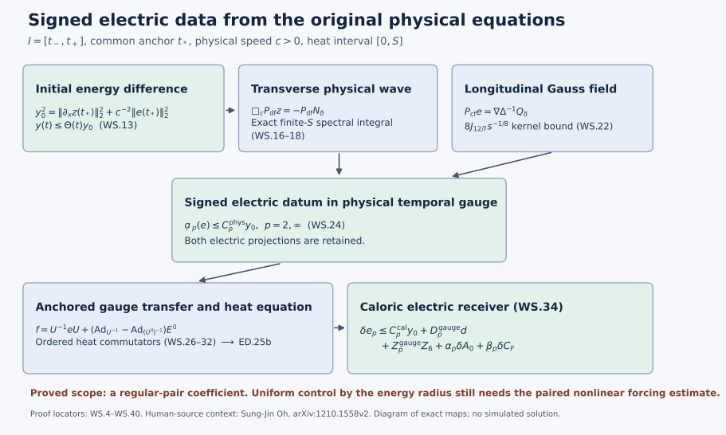

# Regular-solution stability and signed electric data

This Unit 9 chapter follows a difference from its original physical
initial data through the wave equation, Gauss constraint, heat kernel,
and anchored gauge transformation. The regular-pair stability constant
is explicit. Its individual regularity inputs remain visible throughout.

Use [full wave estimates](../classical-wave-estimates.html) (HW),
[potential-wave differences](../classical-potential-difference.html) (PD),
[electric differences](../classical-electric-difference.html) (ED),
[temporal differences](../classical-temporal-difference.html) (TD),
and [physical gauge differences](../classical-gauge-difference.html) (GD).
The fixed-time input map is proved in
[the heat comparison](../classical-fixed-heat-comparison.html) (FI).

The original physical interval is \(I=[t_-,t_+]\), with common
anchor \(t_*\in I\), speed \(c>0\), spatial domain \(\mathbb R^3\),
and heat interval \([0,S]\), where \(S>0\). The metric is
\(\operatorname{diag}(-c^2,1,1,1)\). The measures are \(dt\,d^3x\)
and \(ds/s\). Every derivative tuple and Hilbert–Schmidt matrix
component is retained.

Human-source context: Sung-Jin Oh,
[*Gauge choice for the Yang–Mills equations using the Yang–Mills heat flow
and local well-posedness in H1*, arXiv:1210.1558v2](https://arxiv.org/abs/1210.1558v2),
and [*Finite energy global well-posedness of the Yang–Mills equations on
R1+3: An approach using the Yang–Mills heat flow*, arXiv:1210.1557v2](https://arxiv.org/abs/1210.1557v2).
The exposition and complete calculations here are independently written.
The course provenance identifies the source editions and bounded comparison
reading. These lessons make no novelty claim.

## 1. Exact relation to the original connections and their anchors

Let \(a,a'\) be ED.1 and TD.1's actual caloric-temporal connections.
They obey \(a_s=a_s'=0\), \(a_t(S)=a_t'(S)=0\), and
\(W(0)=W'(0)=0\). At heat time zero put \(b=a_t(0)\), \(b'=a_t'(0)\)
and use exactly GD.1's anchored gauges

\[
 U_t=Ub,\quad U_t'=U'b',\qquad U(t_*)=U'(t_*)=I_N.
\tag{WS.1}
\]

Their physical temporal representatives and electric fields are

\[
\begin{aligned}
 A_i&=Ua_i(0)U^{-1}-(\partial_iU)U^{-1},&
 E_i&=UF_{ti}^{a}(0)U^{-1},\\
 A_i'&=U'a_i'(0)(U')^{-1}-(\partial_iU')(U')^{-1},&
 E_i'&=U'F_{ti}^{a'}(0)(U')^{-1},\\
 z_i&=A_i-A_i',& e_i&=E_i-E_i',& D_z&=\sum_i\partial_i z_i.
\end{aligned}\tag{WS.2}
\]

Symbols \(A,E\) in WS.2–WS.24 refer to these physical fields; the
electric heat fields in ED are explicitly written \(F_{ti}^{a}(s)\)
where both occur. Gauge covariance and WS.1 give \(A_t=A_t'=0\).
Since the anchored matrices are the constant identity in space,
\(\partial_iU(t_*)=\partial_iU'(t_*)=0\), and hence

\[
 z(t_*)=a_x(t_*,0)-a_x'(t_*,0),\qquad
 e(t_*)=F_{tx}^{a}(t_*,0)-F_{tx}^{a'}(t_*,0).
\tag{WS.3}
\]

These are the exact initial data for the estimate below. A comparison
with pre-caloric input data must use the actual fixed-time gauge map;
WS.3 does not identify two differently anchored initial gauges. The exact fixed-time comparison is proved in [FI.1–FI.42](../classical-fixed-heat-comparison.html).

The temporal-gauge Yang–Mills equations on the heat boundary give

\[
\begin{aligned}
 \partial_tA_i&=E_i,&
 \partial_tE_i&=c^2\sum_j(\partial_jF_{ji}+[A_j,F_{ji}]),\\
 F_{ji}&=\partial_jA_i-\partial_iA_j+[A_j,A_i],&
 \sum_j\partial_jE_j&=-\sum_j[A_j,E_j].
\end{aligned}\tag{WS.4}
\]

The primed equations are identical with primes. The last equation is
the zero Gauss datum \(W(0)=0\), after gauge transformation; it is
essential. There is no spatial tension at \(s=0\), since the actual
heat-boundary fields solve the physical Yang–Mills equation.

Retain the original operators of PD.2, with all product orders:

\[
\begin{aligned}
 \mathcal B(X,Y)_i
 &=2\sum_j[X_j,\partial_jY_i]-\sum_j[X_j,\partial_iY_j]
                                      +[\sum_j\partial_jX_j,Y_i],\\
 \mathcal C(X,Y,Z)_i&=\sum_j[X_j,[Y_j,Z_i]],\\
 N(A)&=\mathcal B(A,A)+\mathcal C(A,A,A),\\
 N_\delta&=\mathcal B(z,A)+\mathcal B(A',z)
       +\mathcal C(z,A,A)+\mathcal C(A',z,A)+\mathcal C(A',A',z).
\end{aligned}\tag{WS.5}
\]

Expanding the original \(\sum_jD_jF_{ji}\) proves
\(\Delta A-\nabla\operatorname{div}A+N(A)\): its quadratic terms
are precisely \(2[A_j,\partial_jA_i]\),
\(-[A_j,\partial_iA_j]\), and \([\partial_jA_j,A_i]\), and its
cubic term is \([A_j,[A_j,A_i]]\). Telescoping each ordered slot
proves \(N(A)-N(A')=N_\delta\). Expanding \(A=A'+z\) in WS.5
retains all three nonempty quadratic placements and all seven
nonempty cubic placements. No difference product has been dropped.
The exact difference equations are therefore

\[
\begin{aligned}
 z_t&=e,\\
 e_t&=c^2(\Delta z-\nabla D_z+N_\delta),\\
 \partial_tD_z=\operatorname{div}e
 &=-\sum_j([z_j,E_j]+[A_j',e_j])\ =:\ Q_\delta,\\
 \Box_cz&=\nabla D_z-N_\delta,
 \qquad\Box_c=-c^{-2}\partial_t^2+\Delta.
\end{aligned}\tag{WS.6}
\]

The exchanged Gauss expansion is
\(Q_\delta=-\sum_j([z_j,E_j']+[A_j,e_j])\). Both preserve the
quadratic difference term in the actual unprimed factor.

## 2. A complete energy estimate with no extra difference derivative

Write \(C_S=4/\sqrt3\), as in the receiving course Sobolev estimate.
For the actual regular fields set, at each original time \(t\),

\[
\begin{aligned}
 K_1(t)={}&6C_S\|\partial_xA\|_3+2\|A\|_\infty
       +6\|A'\|_\infty+2C_S\|\operatorname{div}A'\|_3\\
 &+4C_S\{\|A\|_6^2+\|A'\|_6\|A\|_6+\|A'\|_6^2\},\\
 K_2(t)={}&K_1(t)\text{ with }A,A'\text{ interchanged},\qquad
 K(t)=\min\{K_1(t),K_2(t)\},\\
 X(t)&=\|\partial_xz(t)\|_2,\qquad
 y(t)=\bigl(X(t)^2+c^{-2}\|e(t)\|_2^2\bigr)^{1/2}.
\end{aligned}\tag{WS.7}
\]

Every norm of (A) is the full spatial potential tuple; derivatives
include every ordered index. All \(K_j\) are finite and locally
integrable for the current regular pair. They can grow with individual
higher regularity, which will matter in Section 8.

The complete forcing estimate is

\[
 \|N_\delta(t)\|_2\le K(t)X(t).
\tag{WS.8}
\]

Here are its five individual proofs. The bracket inequality
\(|[X,Y]|\le2|X||Y|\), Cauchy–Schwarz in each contracted spatial
label, and Hölder give

\[
\begin{aligned}
 \|\mathcal B(z,A)\|_2
 &\le6\|z\|_6\|\partial_xA\|_3
                         +2\|\operatorname{div}z\|_2\|A\|_\infty,\\
 \|\mathcal B(A',z)\|_2
 &\le6\|A'\|_\infty X+2\|\operatorname{div}A'\|_3\|z\|_6,\\
 \|\mathcal C(z,A,A)\|_2&\le4\|z\|_6\|A\|_6^2,\\
 \|\mathcal C(A',z,A)\|_2&\le4\|A'\|_6\|z\|_6\|A\|_6,\\
 \|\mathcal C(A',A',z)\|_2&\le4\|A'\|_6^2\|z\|_6.
\end{aligned}\tag{WS.9}
\]

For instance the first transport coefficient is four and the second
is two, giving six without an output-count factor. The divergence
term is the actual divergence, and its exact Fourier inequality is
\(\|\operatorname{div}z\|_2\le\|\partial_xz\|_2\). Sobolev on the
full tuple gives \(\|z\|_6\le C_SX\). Substitution proves the
\(K_1\) estimate; rederive the complete telescoping expansion with
the opposite reference field to obtain \(K_2\). This proves the
minimum in WS.8 without selecting different product orders within
one unproved expansion.

The energy calculation uses all terms of WS.6:

\[
\begin{aligned}
 \frac12\partial_t y^2
 &=\langle\partial_xz,\partial_xe\rangle
       +\langle e,\Delta z-\nabla D_z+N_\delta\rangle\\
 &=\langle D_z,\operatorname{div}e\rangle+\langle e,N_\delta\rangle\\
 &=-\left\langle D_z,\sum_j([z_j,E_j]+[A_j',e_j])\right\rangle
                                                    +\langle e,N_\delta\rangle.
\end{aligned}\tag{WS.10}
\]

Thus the apparent extra derivative from \(\nabla D_z\) has been
removed by the exact Gauss equation, not by deleting that term.
Spatial integration by parts is justified first by cutoffs and then
by regularity and the displayed integrable products. No
undifferentiated \(L^2_x\) norm of \(z\) is needed.

Set

\[
\begin{aligned}
 a_1&=2C_S\|E\|_3,& b_1&=c(2\|A'\|_\infty+K),\\
 a_2&=2C_S\|E'\|_3,& b_2&=c(2\|A\|_\infty+K),\\
 q_j&=\frac{a_j+\sqrt{a_j^2+b_j^2}}2,&q&=\min\{q_1,q_2\},\\
 J_t&=[\min(t,t_*),\max(t,t_*)],&
 \Theta(t)&=\exp\left(\int_{J_t}q(r)\,dr\right),\quad
 \Theta_*:=\sup_{t\in I}\Theta(t).
\end{aligned}\tag{WS.11}
\]

WS.10 and WS.8 imply

\[
 \left|\frac12\partial_ty^2\right|
 \le a_1X^2+b_1X(c^{-1}\|e\|_2)\le q_1y^2.
\tag{WS.12}
\]

The final coefficient is the larger eigenvalue of
\(\bigl(\begin{smallmatrix}a_1&b_1/2\\b_1/2&0\end{smallmatrix}\bigr)\);
its characteristic polynomial is \(\lambda^2-a_1\lambda-b_1^2/4\).
The exchanged Gauss identity gives \(q_2\), hence \(q\). Applying
this inequality to \((y^2+\varepsilon^2)^{1/2}\) and integrating
in either orientation from \(t_*\), then sending
\(\varepsilon\downarrow0\), proves

\[
 \boxed{\quad y(t)\le\Theta(t)y(t_*),\qquad
 \|z(t)\|_6\le C_S\Theta(t)y(t_*),\qquad
 \|e(t)\|_2\le c\Theta(t)y(t_*).\quad}
\tag{WS.13}
\]

This is a completed initial-energy difference estimate on the entire
unchanged physical interval for the current regular pair. In
particular zero anchored data force \(z=e=0\). It is a Lipschitz
estimate on sets on which the individual coefficients in WS.11 are
uniformly integrable. It is not yet a uniform estimate on the full
energy ball of Oh's \(H^1\times L^2\) theorem.

## 3. The exact half-derivative heat integral for a physical wave

Let \(H_s=e^{s\Delta_x}\) be the original scalar heat operator, with
\(k_s(x)=(4\pi s)^{-3/2}e^{-|x|^2/(4s)}\), acting on every matrix
component. Put

\[
 h_c=(2\pi c)^{-1/4},\qquad
 \kappa_2=(\pi/2)^{1/4},\qquad \kappa_\infty=(4e)^{-1/4}.
\tag{WS.14}
\]

In \(\kappa_\infty\), \(e\) denotes the exponential constant only;
the field \(e_i\) remains WS.2's electric difference.

For any finite tuple \(g\in L^2_x\), define the exact finite-\(S\)
spectral quantity

\[
 \mathcal H_{p,S}(g)=
 \left\|s^{1/4}\bigl\||D|^{1/2}H_sg\bigr\|_2
                    \right\|_{L^p((0,S],ds/s)},\qquad p=2,\infty.
\tag{WS.15}
\]

Using the original Fourier and Plancherel convention gives

\[
\begin{aligned}
 \mathcal H_{2,S}(g)^2
 &=(2\pi)^{-3}\int_{\mathbb R^3}
       m_{2,S}(|\xi|)^2|\widehat g(\xi)|^2\,d\xi,\\
 m_{2,S}(\lambda)^2
 &=\lambda\int_0^Ss^{-1/2}e^{-2s\lambda^2}\,ds
   =\sqrt{\pi/2}\,\operatorname{erf}(\sqrt{2S}\lambda),\\
 \mathcal H_{2,S}(g)&\le\kappa_2\|g\|_2,\qquad
 \mathcal H_{\infty,S}(g)\le\kappa_\infty\|g\|_2.
\end{aligned}\tag{WS.16}
\]

The second line is zero at \(\lambda=0\) by its continuous limit.
Tonelli justifies the nonnegative heat–frequency exchange. For the
last supremum use
\(s^{1/4}\lambda^{1/2}e^{-s\lambda^2}\le(4e)^{-1/4}\), whose
maximum occurs at \(s\lambda^2=1/4\). The original finite endpoint
has been retained in \(m_{2,S}\); the universal bound uses
\(\operatorname{erf}\le1\), without replacing the interval by a
new heat coordinate.

For a derivative-regular wave (v) on \(I\), write
\(\phi=v(t_*)\), \(\psi=\partial_tv(t_*)\), \(N=\Box_cv\).
The half-wave proof HW.7–HW.14 also gives the sharper temporal
component estimate

\[
 \|\partial_tv\|_{L^4_{t,x}(I)}
 \le ch_c\left[
   \bigl(\||D|^{3/2}\phi\|_2^2+c^{-2}\||D|^{1/2}\psi\|_2^2\bigr)^{1/2}
       +c\int_I\||D|^{1/2}N(r)\|_2\,dr\right].
\tag{WS.17}
\]

To check the coefficient, the free half-wave amplitudes are
\(f_\pm=\widehat\phi/2\pm\widehat\psi/(2ic|\xi|)\).
Their temporal derivative amplitudes are
\(\pm ic|\xi|f_\pm\). HW.11 gives the constant \(h_c\) for
each amplitude; triangle inequality followed by Cauchy–Schwarz and
the parallelogram identity gives exactly the square root in WS.17.
The factor \(\sqrt2\) for the *full* temporal-and-spatial derivative
tuple in HW.13 is unnecessary for its temporal subtuple. Matrix
and output tuples follow by Minkowski on the sum of squared component
norms. Duhamel's contribution has free initial velocity \(-c^2N(r)\);
this gives the additional factor \(c\) inside the bracket. Restricting
each such wave to \(r\le t\le t_+\) or \(t_-\le t\le r\)
does not increase its \(L^4\) norm. Both original endpoints occur,
and each \(r\in I\) is integrated once.

Apply WS.17 to \(H_sv\) and take the outer heat norm *after* its
physical \(L^4\) norm. Minkowski in the heat space, not a reversed
mixed-norm inclusion, proves

\[
\begin{aligned}
 \mathcal D_p(\partial_tv)
 &\le ch_c\left[
    \mathcal H_{p,S}\bigl((|D|\phi,c^{-1}\psi)\bigr)
                   +c\int_I\mathcal H_{p,S}(N(r))\,dr\right]\\
 &\le ch_c\kappa_p\left[
    \bigl(\||D|\phi\|_2^2+c^{-2}\|\psi\|_2^2\bigr)^{1/2}
                              +c\int_I\|N(r)\|_2\,dr\right].
\end{aligned}\tag{WS.18}
\]

Here \(\mathcal D_p\) is ED.16's **signed** heat datum norm; the
original vector remains inside \(H_s\). In the first line the pair
is an enlarged Hilbert tuple, so its heat norm keeps both initial
terms jointly. The norm \(\||D|\phi\|_2\) equals the full ordered
first-gradient norm. Initial potentials need only their \(L^6\)
representative and these derivatives. Annular approximation, applied
to the field, its derivatives and its forcing with the same cutoff,
proves WS.18: the right side controls Cauchy differences; local
distributional convergence identifies the derivatives. No
undifferentiated \(L^2\) datum has been inserted.

## 4. The Gauss term supplies the missing longitudinal electric part

Keep the original spatial Fourier projections

\[
 P_{\rm cf}=\nabla\Delta^{-1}\operatorname{div},\qquad
 P_{\rm df}=1-P_{\rm cf},\qquad
 \widehat{P_{\rm cf}}(\xi)=\xi\xi^{\mathsf T}/|\xi|^2
 \quad(\xi\ne0).
\tag{WS.19}
\]

The value at the single zero frequency is immaterial for their
\(L^2\) action; no spatial constant is removed from an original
field. They are orthogonal on the original full spatial tuple,
commute with \(H_s,\Box_c,\partial_t\), and contract its \(L^2\)
norm. WS.6 gives exactly

\[
 \partial_tP_{\rm df}z=P_{\rm df}e,\qquad
 \Box_cP_{\rm df}z=-P_{\rm df}N_\delta,\qquad
 P_{\rm cf}e=\nabla\Delta^{-1}Q_\delta.
\tag{WS.20}
\]

The longitudinal part has not been discarded. Its following
heat-kernel estimate keeps its full noncommuting Gauss product.

For \(r>0\) and \(1<q<\infty\), direct radial integration gives

\[
 \|\nabla k_r\|_q=J_qr^{-2+3/(2q)},\qquad
 J_q=\tfrac12(4\pi)^{-3/2}
 \left[2\pi(4/q)^{(q+3)/2}\Gamma((q+3)/2)\right]^{1/q}.
\tag{WS.21}
\]

Indeed \(\nabla k_r(x)=-xk_r(x)/(2r)\); integrating its \(q\)-th
power in spherical coordinates gives this formula. With
\(q=12/7\), Young's relation is \(1+1/4=2/3+7/12\).
The Fourier identity for \(\Delta^{-1}\) and an absolutely
convergent \(L^4_x\) integral then prove

\[
\begin{aligned}
 H_sP_{\rm cf}e&=-\int_s^\infty\nabla H_rQ_\delta\,dr,\\
 \|H_sP_{\rm cf}e(t)\|_4
 &\le8J_{12/7}s^{-1/8}\|Q_\delta(t)\|_{3/2}.
\end{aligned}\tag{WS.22}
\]

In fact \(\int_s^\infty r^{-9/8}dr=8s^{-1/8}\). This auxiliary
integral represents the inverse spatial Laplacian; it does not
extend the Yang–Mills heat interval beyond \(S\). Equality follows
as a tempered distribution from its multiplier
\(-i\xi |\xi|^{-2}e^{-s|\xi|^2}\); \(e\in L^2\) fixes the
projection uniquely. Hölder in WS.6 gives, in its two full orders,

\[
\begin{aligned}
 \|Q_\delta(t)\|_{3/2}&\le2B(t)y(t),\\
 B(t)&=\min\{C_S\|E(t)\|_2+c\|A'(t)\|_6,
                   C_S\|E'(t)\|_2+c\|A(t)\|_6\}.
\end{aligned}\tag{WS.23}
\]

The factors are \(z\in L^6\) with \(E\in L^2\), and \(A'\in
L^6\) with \(e\in L^2\); their spatial output exponent is exactly
(3/2). Thus this part costs no individual derivative above energy.

Combining WS.18–WS.23 with WS.8 and WS.13 proves the complete bound

\[
\boxed{\begin{aligned}
 \mathcal D_p(e)&\le C_p^{\rm phys}\,y(t_*),\qquad p=2,\infty,\\
 C_p^{\rm phys}
 &=ch_c\kappa_p\left[1+c\int_I K(r)\Theta(r)\,dr\right]
          +16J_{12/7}\,\omega_p(1/8)\|B\Theta\|_{L^4_t(I)},\\
 \omega_2(\gamma)&=S^\gamma/\sqrt{2\gamma},\qquad
 \omega_\infty(\gamma)=S^\gamma\quad(\gamma>0).
\end{aligned}}\tag{WS.24}
\]

The first contribution is the actual transverse wave; the second
is the actual longitudinal electric field. Each has been proved.
The first line of WS.18 gives a smaller finite-\(S\) alternative
whenever the actual spectral data are retained. Formula WS.24 is
fully evaluated in individual regular providers and initial
differences. It contains no electric difference norm on its right.
For the primed field alone one can apply exactly WS.7–WS.24 to the
pair ((A',0)), obtaining a number \(C_p'\) and

\[
y_0'=(\|\partial_xA'(t_*)\|_2^2+c^{-2}\|E'(t_*)\|_2^2)^{1/2}
\]

with \(\mathcal D_p(E')\le C_p'y_0'\). This is an evaluated
individual provider for Section 6, not an assumed signed datum.

## 5. A finite heat commutator for the exact anchored gauges

This section proves the map from WS.24 to ED's caloric electric
datum. It does not repeat the FH fixed-time gauge construction.
For an operator-valued function (M(x)), write

\[
[M]_{1/2}=\sup_{x\ne y}\|M(x)-M(y)\|_{\rm op}/|x-y|^{1/2}.
\]

Put

\[
 L_{1/2}=\||x|^{1/2}k_1(x)\|_{4/3}
 =(4\pi)^{-3/2}
      [2\pi\,3^{11/6}\Gamma(11/6)]^{3/4}.
\tag{WS.25}
\]

The exact commutator identity and Young's inequality are

\[
\begin{aligned}
 H_s(MX)(x)-M(x)H_sX(x)
 &=\int k_s(x-y)(M(y)-M(x))X(y)\,dy,\\
 \|H_s(MX)-MH_sX\|_4
 &\le L_{1/2}s^{-1/8}[M]_{1/2}\|X\|_2.
\end{aligned}\tag{WS.26}
\]

The kernel power is \(s^{1/4}s^{-3/8}=s^{-1/8}\), and its exact
constant follows by the same radial integration as WS.21. The
identity preserves all multiplication orders.

For completeness the needed Morrey coefficient can be taken to be

\[
 C_H=\frac{27}{4}\sqrt{\frac32}\,
                      \frac{(20\pi/3)^{5/6}}{4\pi},\qquad
 [V]_{1/2}\le C_H\|\partial_xV\|_6.
\tag{WS.27}
\]

Here is a direct proof, valid for full matrix tuples. For a ball
(B(x,R)), radial integration of the fundamental theorem of calculus
on segments from (x) gives

\[
 |V(x)-V_{B(x,R)}|
 \le\frac1{4\pi}\int_{B(x,R)}|x-z|^{-2}|\partial V(z)|\,dz
 \le\frac{(20\pi/3)^{5/6}}{4\pi}R^{1/2}\|\partial V\|_6.
\]

The first kernel bounds the exact kernel
\((R^3-|x-z|^3)/(3|B(x,R)||x-z|^2)\). For two points at distance
\(d>0\), average both differences over the common ball of radius
\(d\) centred at their midpoint. That ball is contained in each
point-centred ball of radius (3d/2); its volume ratio is (27/8).
The preceding calculation, with this ratio and radius for each
of the two point differences, gives precisely WS.27. The segment
integral proves the estimate first for smooth fields, and local
Sobolev approximation gives its continuous representative. Constants
in \(V\) cause no change; no \(L^6\) norm of \(U\) itself is required.

Use the following actual GD gauge quantities, with supremum over \(I\):

\[
\begin{aligned}
 d&=\sup_t\|U(t)-U'(t)\|_{\infty;\rm op},&
 Z_6&=\sup_t\|\partial_x(U-U')(t)\|_6,\\
 Q_U&=\sup_t\|\partial_xU(t)\|_6,&
 Q_U'&=\sup_t\|\partial_xU'(t)\|_6,\\
 M_E'&=\sup_t\|E'(t)\|_2,&
 y_0&=y(t_*).
\end{aligned}\tag{WS.28}
\]

Unitary matrices act isometrically on Hilbert–Schmidt tuples.
Define \(M(X)=U^{-1}XU\), \(M'(X)=(U')^{-1}XU'\), and \(Z=U-U'\)
in this section only. The exact expansion

\[
 (M-M')(X)=U^*XZ+Z^*XU'
\tag{WS.29}
\]

uses \(U^{-1}=U^*\), and gives

\[
\begin{aligned}
 \|M\|_{\rm op}&=1,& \|M-M'\|_{\rm op}&\le2d,\\
 [M]_{1/2}&\le2C_HQ_U,&
 [M-M']_{1/2}&\le C_H\{2Z_6+d(Q_U+Q_U')\}.
\end{aligned}\tag{WS.30}
\]

For the final bound subtract WS.29 at two spatial points. Its four
increments have sizes \([U]_{1/2}d\), \([Z]_{1/2}\),
\([Z]_{1/2}\), and \(d[U']_{1/2}\), respectively. This proves
the coefficient without commuting any factors.

ED.1's actual caloric heat-boundary datum is exactly

\[
 f=F_{tx}^{a}(0)-F_{tx}^{a'}(0)=M(e)+(M-M')(E').
\tag{WS.31}
\]

Apply WS.26 separately to its two terms, then the physical \(L^4\)
norm and finally the heat norm. Equations WS.13, WS.24 and WS.30
prove

\[
\begin{aligned}
 \mathcal D_p(f)\le{}&C_p^{\rm phys}y_0+2dC_p'y_0'\\
 &+L_{1/2}\omega_p(1/8)|I|^{1/4}C_H
       \{2Q_Uc\Theta_*y_0+[2Z_6+d(Q_U+Q_U')]M_E'\},\\
 M_f:=\sup_t\|f(t)\|_2&\le c\Theta_*y_0+2dM_E'.
\end{aligned}\tag{WS.32}
\]

The heat commutator is essential: the signed heat datum is not
gauge invariant. The estimate keeps the actual anchor through
\(d,Z_6\); these vanish for identical anchored gauges.

## 6. Insert the complete datum estimate in ED.25b

Retain **exactly** ED.25a's \(T_p,J_p,K_p\), ED.3's
\(m_0'=b_0'=cR_0d'\), ED.2's \(\Phi(S)=16C_FS^{1/4}\), and
ED.1–ED.2's actual caloric spatial coefficient differences
\(\delta A_0,\delta C_F\). These names have their ED meaning,
and are not the physical \(A,A'\) in WS.2. Define

\[
\begin{aligned}
 \alpha_p&=J_p+T_pe^{\Phi(S)}
                      (2\sqrt2m_0'+4\sqrt2b_0')S^{1/4},\\
 \beta_p&=K_p+32T_pe^{\Phi(S)}m_0'S^{1/4},\\
 L_p&=L_{1/2}\omega_p(1/8)|I|^{1/4}C_H,\\
 C_p^{\rm cal}&=C_p^{\rm phys}+2L_pQ_Uc\Theta_*
                                      +T_pe^{\Phi(S)}c\Theta_*,\\
 D_p^{\rm gauge}&=2C_p'y_0'+L_p(Q_U+Q_U')M_E'
                                           +2T_pe^{\Phi(S)}M_E',\\
 Z_p^{\rm gauge}&=2L_pM_E'.
\end{aligned}\tag{WS.33}
\]

Substitution, with no absorption, gives the fully evaluated receiver

\[
\boxed{\quad
 \delta e_p\le C_p^{\rm cal}y_0+D_p^{\rm gauge}d
        +Z_p^{\rm gauge}Z_6+\alpha_p\delta A_0+\beta_p\delta C_F,
 \qquad p=2,\infty .\quad}
\tag{WS.34}
\]

Here 

\[
\delta e_p=\|s^{1/4}\|F_{tx}^{a}(s)-F_{tx}^{a'}(s)
\|_{L^4_{t,x}}\|_{L^p(ds/s)},
\]

exactly the receiving norm in ED.20.
ED.22–ED.25b retain the original divergence flux, every remainder,
and both heat endpoints. Those terms have not been replaced by a
wave ansatz; WS.32 has supplied only their actual datum inputs.
The scalar constants in ED.25a are

\[
\begin{aligned}
 T_p={}&|I|^{1/4}\bigl[
  \{4J_{24}A_0B_3+K_{24}B_1(2\sqrt3A_1+4C_F)\}\omega_p(1/8)
                   +4K_{24}B_2A_0^2\omega_p(3/8)\bigr],\\
 J_p={}&|I|^{1/4}\bigl[
 (2J_{24}B_3m_0'+2K_{24}\sqrt{B_4}b_0')\omega_p(1/8)
                +4K_{24}B_2A_0m_0'\omega_p(3/8)\bigr],\\
 K_p={}&4|I|^{1/4}K_{24}B_1m_0'\omega_p(1/8),\\
 K_{24}&=(4\pi)^{-3/8}(4/3)^{-9/8},\qquad J_{24}=J_{4/3},\\
 B_1&=\mathrm B(1/4,5/8),\quad B_2=\mathrm B(1/2,5/8),\quad
 B_3=\mathrm B(3/4,1/8),\quad B_4=\mathrm B(1/2,1/4).
\end{aligned}\tag{WS.35}
\]

Thus every coefficient of every difference in WS.34 is specified.
Swapping both full connections gives a second complete estimate;
its minimum with WS.34 and ED.26 is valid. Equation WS.34
has no positive value forced by zero displayed differences. This
gives a vanishing bound at zero displayed differences, while retaining the actual
gauge and heat-coefficient comparison tasks.

## 7. What TD actually does to the new feedback

It is possible to calculate the feedback exactly, rather than
declaring \(d,Z_6\) independent of the electric difference.
Let \(x=\delta e_2\). Evaluate the complete TD.9–TD.21 coefficients as follows:

\[
\begin{aligned}
 L'&=4e'g',\quad B'=(1+2\sqrt2A_0'S^{1/4})L',\\
 L_\eta&=4\sqrt2\delta A_0S^{1/4}B'
       +8\sqrt3\delta A_1S^{1/4}L'
       +8\delta A_0(A_0+A_0')\sqrt S L',\\
 k&=1+2\sqrt2A_0S^{1/4},\\
 n&=4\sqrt2A_0S^{1/4}k+8\sqrt3A_1S^{1/4}+8A_0^2\sqrt S,\\
 Y&=L_\eta+4e'\delta g+4gx.
\end{aligned}\tag{WS.36}
\]

TD.9–TD.27 prove
\(D_\delta\le\sqrt S kY\), \(H_\delta\le(n+2)Y\).
Their zero-Gauss endpoint, rather than the larger positive-heat
Hessian coefficient, is used here. Let \(Q,Q'\) be the containing-
interval suprema of GD.2's individual integrals
\(\int_{J_t}\|\partial_xb\|_6dt\), and its primed version.
GD.5–GD.6 and TD.27 then prove

\[
\begin{aligned}
 d&\le r_0Y,&
 r_0&=|I|^{1/2}C_MC_SS^{1/4}\sqrt{k(n+2)},\\
 Z_6&\le r_6Y,&
 r_6&=|I|^{1/2}C_S(n+2)+r_0(Q+Q').
\end{aligned}\tag{WS.37}
\]

Every power of \(Y\) is one. The two square-root factors in TD's
Morrey product are both proportional to the same \(Y\), which is
why the gauge contribution is linear in this same quantity.
For \(p=2\), WS.34 becomes exactly the proved scalar inequality

\[
\begin{aligned}
 x&\le A_*+\theta_*x,\\
 \Lambda_*&=D_2^{\rm gauge}r_0+Z_2^{\rm gauge}r_6,\qquad
 \theta_*=4g\Lambda_*,\\
 A_*&=C_2^{\rm cal}y_0+\alpha_2\delta A_0+\beta_2\delta C_F
                              +\Lambda_*(L_\eta+4e'\delta g).
\end{aligned}\tag{WS.38}
\]

WS.38 retains a linear feedback coefficient and an
inhomogeneous term that is zero at zero differences. It does not
prove \(x=0\) when \(\theta_*\ge1\): in that case, even \(A_*=0\)
allows every \(x\ge0\). No smallness of \(\theta_*\) is postulated
here, and no finite residual is relabelled stability. The complete
physical result WS.13 was proved directly from the original
equations and does not use this feedback or any smallness condition.

## 8. Exact strength, remaining coefficient issue, and the attempted next step

The established result is WS.13 plus WS.24 and WS.34. The physical
norm in WS.13 is precisely the first spatial derivative of the
potential and the original \(c^{-1}\)-weighted electric field;
there is no additional difference regularity. Its coefficient,
however, contains the individual quantities

\[
\|A\|_\infty,\|A'\|_\infty,\|\partial_xA\|_3,
\|\partial_xA'\|_3,\|E\|_3,\|E'\|_3.
\]

The actual attempted original-equation estimate of the forcing is
the complete calculation WS.9. The exact additional control needed
by this route for a coefficient depending only on an energy radius
is uniform control of the time integrals in WS.7 and WS.11, or a
stronger estimate for the full \(N_\delta\) and Gauss pairing in
WS.10 that uses their physical evolution and cancellation. These
quantities have not been inserted as assumed consequences of energy.

The inability to replace those individual norms by instantaneous
energy bounds is a concrete operator fact. For a nonzero smooth
compactly supported Lie-algebra-valued tuple \(A_\lambda(x)
=\lambda^{1/2}A(\lambda x)\), direct integration gives

\[
 \|\partial_xA_\lambda\|_2=\|\partial_xA\|_2,\quad
 \|A_\lambda\|_6=\|A\|_6,\quad
 \|A_\lambda\|_\infty=\lambda^{1/2}\|A\|_\infty,\quad
 \|\partial_xA_\lambda\|_3=\lambda^{1/2}\|\partial_xA\|_3.
\tag{WS.39}
\]

Similarly an electric test \(E_\lambda=\lambda^{3/2}E(\lambda x)\)
has fixed \(L^2\) norm and \(L^3\) norm growing as \(\lambda^{1/2}\).
These are tests of the proposed spatial embeddings, not replacements
for the actual solutions or counterexamples to Yang–Mills stability.
They show exactly why the pointwise Hölder estimates WS.9 and
WS.12 cannot by themselves give an energy-radius constant.

The obstruction defines a precise class on which a uniform estimate
*has* now been proved. For an original physical temporal solution set

\[
\begin{aligned}
 r_A(t)&=2C_S\|E(t)\|_3+4c\|A(t)\|_\infty
       +\tfrac c2(6+2\sqrt3)C_S\|\partial_xA(t)\|_3
       +3cC_S\|A(t)\|_6^2,\\
 \mathcal R_{I,R}&=\{(A,E)\text{ actual regular temporal Yang–Mills
 solutions on }I:\ \int_I r_A(t)dt\le R\}.
\end{aligned}\tag{WS.40}
\]

All summands of \(r_A\) have the original units of inverse physical
time. The map taking an element of this class to its anchored data
is injective by WS.13. On its actual image its inverse, measured by
the energy difference in WS.7, is Lipschitz with constant
\(e^{R+R'}\) for two members of \(\mathcal R_{I,R}\) and
\(\mathcal R_{I,R'}\). To prove the coefficient, first use
\(\|\operatorname{div}A\|_3\le\sqrt3\|\partial_xA\|_3\) and

\[
\|A\|_6\|A'\|_6\le(\|A\|_6^2+\|A'\|_6^2)/2
\]

 in WS.7.
They bound \(K\) by the sum of

\[
6\|A\|_\infty+(6+2\sqrt3)C_S\|\partial_xA\|_3
+6C_S\|A\|_6^2
\]

 and its primed counterpart. Next
\(q_1\le a_1+b_1/2\), from
\(\sqrt{a_1^2+b_1^2}\le a_1+b_1\). Substitution gives
\(q\le r_A+r_{A'}\). Integrating on each actual \(J_t\subset I\)
proves the stated constant and the exact map. WS.39 concerns failure
of an instantaneous energy-only embedding; it does not assert that
the physical evolution cannot bound this class norm.

The next calculation prompted by this finding was carried out in
Sections 3–4: use the exact transverse physical wave and the Gauss
longitudinal kernel before taking the heat-square norm. It proves
WS.24 at the original energy difference level, with no quarter-power
loss and with an energy-level longitudinal coefficient (B(t)).
Thus the remaining loss is located in the actual transverse nonlinear
forcing and its Gauss energy pairing, rather than in an arbitrary
heat-datum embedding. A continuation toward the uniform energy-class
estimate must apply the paired null and heat-wave calculations to
that exact forcing, with the complete caloric gauge map; it must not
reuse the unpaired finite closure as a difference estimate.

The related fixed-time gauge providers \(d,Z_6,\delta A_0,
\delta C_F\) in WS.34 remain exactly defined actual differences.
This note supplies their receiving map and records WS.38's full
feedback. Their conversion to the pre-caloric original input data
belongs to the existing FH audit and subsequent integration. No
claim of completing that separate calculation is made here.

## 9. Worked example: the commuting physical wave

Let all components of \(A,A',E,E'\) be multiples of a fixed
anti-Hermitian matrix \(T\). All brackets vanish because
\([T,T]=0\). The exact equations WS.4 give

\[
 z_t=e,\qquad e_t=c^2(\Delta z-\nabla\operatorname{div}z),
 \qquad\operatorname{div}e=0.
\]

Consequently \(\operatorname{div}z\) is constant in physical time.
The derivative of the full difference energy in WS.10 is zero:
both its divergence pairing and its nonlinear forcing pairing vanish.
Thus \(y(t)=y_0\) for every time in the original interval.
The divergence-free potential evolves by the free wave and its
longitudinal part stays equal to its initial value. Its electric field
is entirely divergence-free. Applying WS.18 to this free wave gives
\(\mathcal D_p(e)\le c h_c\kappa_p y_0\).
This is a specialization of the original equations; no rescaling of
the electric field or removal of a potential component has occurred.

*Figure: the proved maps WS.4–WS.40, with the individual regularity
scope stated explicitly. This diagram does not sample a solution.*
[Reproducible figure source](../build/figures_f09_wave_stability.py).

## 10. Exercises with full solutions

### Exercise 1. Keep the Gauss contribution

Derive the difference-energy identity directly from WS.6.

**Solution.** With the real Hilbert–Schmidt pairing and
\(y^2=\|\partial z\|_2^2+c^{-2}\|e\|_2^2\), differentiate:

\[
\begin{aligned}
\tfrac12\partial_t y^2
 &=\langle\partial z,\partial e\rangle
   +\langle e,\Delta z-\nabla\operatorname{div}z+N_\delta\rangle\\
 &=\langle\operatorname{div}z,\operatorname{div}e\rangle
   +\langle e,N_\delta\rangle.
\end{aligned}
\]

Integration by parts cancels the two Laplacian terms. The exact
subtracted constraint supplies
\(\operatorname{div}e=-\sum_j([z_j,E_j]+[A_j',e_j])\).
It replaces a derivative of \(e\) by the displayed products and
retains the longitudinal energy. Spatial cutoff followed by convergence
in the regular norms justifies the integration over \(\mathbb R^3\).

### Exercise 2. Evaluate the two-variable energy coefficient

Find the smallest coefficient \(q\) for
\(aX^2+bXV\le q(X^2+V^2)\), when \(a,b\ge0\).

**Solution.** The symmetric matrix is
\(\left(\begin{smallmatrix}a&b/2\\b/2&0\end{smallmatrix}\right)\).
Its characteristic polynomial is \(\lambda^2-a\lambda-b^2/4\).
The larger root is \(q=(a+\sqrt{a^2+b^2})/2\).
An orthogonal eigenbasis bounds the quadratic form by this root
times the Euclidean squared norm. When \(b>0\), a largest
eigenvector has nonnegative entries, so restricting to \(X,V\ge0\)
does not improve the bound. If \(b=0\), equality holds at \(V=0\);
if both coefficients are zero, every pair is an equality case.

### Exercise 3. Evaluate the finite heat endpoint

Compute the squared multiplier in WS.16, including \(\lambda=0\).

**Solution.** For \(\lambda>0\), put
\(u=\sqrt{2s}\lambda\), so \(ds= u\lambda^{-2}du\).
Then

\[
\lambda\int_0^S s^{-1/2}e^{-2s\lambda^2}ds
 =\sqrt2\int_0^{\sqrt{2S}\lambda}e^{-u^2}du
 =\sqrt{\pi/2}\operatorname{erf}(\sqrt{2S}\lambda).
\]

The value at zero is zero by the original integral and by continuity
of the right side. Since the error function is at most one, the
operator norm is at most \((\pi/2)^{1/4}\). The finite upper endpoint
remains in the exact multiplier even when that uniform bound is used.

### Exercise 4. Recover the longitudinal heat power

Evaluate the scalar integral in WS.22 and its weighted \(p=2\) norm.

**Solution.** Direct integration gives
\(\int_s^\infty r^{-9/8}dr=8s^{-1/8}\).
Multiplying by the original \(s^{1/4}\) gives \(8s^{1/8}\).
The squared heat norm is
\(64\int_0^S s^{-3/4}ds=256S^{1/4}\), so the norm is
\(16S^{1/8}\). For \(p=\infty\) it is \(8S^{1/8}\).
The infinite integral represents the inverse spatial Laplacian;
the Yang–Mills heat evolution still ends at \(S\).

### Exercise 5. Preserve the ordered gauge difference

With \(Z=U-U'\), verify WS.29 for an arbitrary matrix \(X\).

**Solution.** Since inverse and adjoint agree for each unitary gauge,

\[
 U^*XZ+Z^*XU'
 =U^*X(U-U')+(U^*-(U')^*)XU'
 =U^*XU-(U')^*XU'.
\]

The middle products cancel in their displayed order. No matrix
commutation was used. On differentiating a spatial increment there
are two placements in each product, producing all four terms in WS.30.

### Exercise 6. Understand the feedback without assuming smallness

For \(x,A,\theta\ge0\), determine what follows from
\(x\le A+\theta x\).

**Solution.** If \(\theta<1\), subtraction and division by
the positive number \(1-\theta\) give \(x\le A/(1-\theta)\).
If \(\theta=1\), the inequality reduces to \(0\le A\).
If \(\theta>1\), its rearrangement is
\((1-\theta)x\le A\), valid for every nonnegative \(x\).
Thus the last two cases give no finite upper bound. This exact
scalar conclusion is why WS.38 is not itself a proof of uniform
initial-data stability. WS.13 has its separate direct proof.

### Exercise 7. Check every scaling exponent

For the test fields of WS.39, compute the stated spatial norms.

**Solution.** Under \(x\mapsto\lambda x\), the volume measure
is multiplied by \(\lambda^{-3}\). Thus
\(\|\lambda^a f(\lambda x)\|_p=\lambda^{a-3/p}\|f\|_p\),
and each derivative adds one power. With \(a=1/2\), the exponents
for \(\|\partial A_\lambda\|_2,\|A_\lambda\|_6\) are zero;
those for \(\|A_\lambda\|_\infty,\|\partial A_\lambda\|_3\)
are \(1/2\). With electric exponent \(a=3/2\), the \(L^2\)
exponent is zero and the \(L^3\) exponent is \(1/2\).
This computes spatial norm relations only; the test family has not
been asserted to solve the physical equations.

### Exercise 8. Derive the exact class estimate

Use WS.40 to bound the data map between solutions in
\(\mathcal R_{I,R}\) and \(\mathcal R_{I,R'}\).

**Solution.** The proved pointwise coefficient comparison gives
\(q(t)\le r_A(t)+r_{A'}(t)\). Therefore, on every unoriented
segment \(J_t\subset I\),
\(\int_{J_t}q\le\int_I r_A+\int_I r_{A'}\le R+R'\).
Substitute this into WS.13 to obtain
\(\sup_I y(t)\le e^{R+R'}y_0\).
At zero datum difference the right side is zero, so the original
regular fields agree in both displayed norms. The \(L^6\)
representative and Sobolev inequality also force their potential
difference to vanish, excluding an arbitrary spatial constant.
