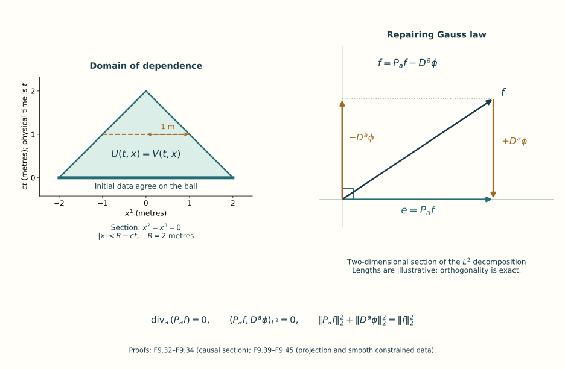

# Local and global classical evolution

*Partial authoring edition. Sections 1–11 supply the local construction,
constraint-preserving approximation, gauge estimates and a complete
commuting global example. The linked heat-analysis companion supplies
complete curvature-smoothing proofs and nine solved exercises.
The general finite-energy global argument and the main exercise set
are still being written. This unit is not complete.*

[Lesson 8](../constraints-initial-data-energy.html) identified the data
that obey Gauss law and proved the energy balance of an existing smooth
solution. We now construct solutions from data. The first construction
works with sufficiently many square-integrable derivatives. Reaching
the energy regularity of the general global theorem requires further
estimates, which we develop after the local construction.

## 1. Equations and the meaning of well-posedness

Retain the physical time \(t\), the speed \(c>0\), the trace pairing
\(\kappa(X,Y)=-\operatorname{tr}(XY)\), and a closed matrix Lie
group \(G\subset U(N)\) with Lie algebra \(\mathfrak g\).
The spacetime metric is \(\operatorname{diag}(-c^2,1,1,1)\).
All fields in the construction take values in the given
\(\mathfrak g\), without changing its bracket or inner product.
In temporal gauge \(\Gamma_t=0\), put

\[
 \begin{aligned}
 A_i&=\Gamma_i,\qquad E_i=F_{ti},\qquad
 B_1=F_{23},\ B_2=F_{31},\ B_3=F_{12},\\
 (\operatorname{curl}_A X)_i
   &=\sum_{j,k=1}^3\epsilon_{ijk}
                   \bigl(\partial_jX_k+[A_j,X_k]\bigr).
 \end{aligned}
 \tag{F9.1}
\]

The first-order evolution system is

\[
 \partial_t A=E,\qquad
 \partial_t E=-c^2\operatorname{curl}_A B,\qquad
 \partial_t B=\operatorname{curl}_A E.
 \tag{F9.2}
\]

For example, the \(i\)-th spatial equation of Lesson 8 contains
\(c^2\sum_j\mathcal D_jF_{ji}
=-c^2\sum_{j,k}\epsilon_{ijk}\mathcal D_jB_k\).
This gives the negative sign in the second equation. Bianchi gives
the positive sign in the third.

At first \(A,E,B\) are independent variables. The constraint data for
the pure gauge theory satisfy

\[
 \begin{aligned}
 B_i(0)&=\sum_{j,k}\epsilon_{ijk}\partial_jA_k(0)
             +\frac12\sum_{j,k}\epsilon_{ijk}[A_j(0),A_k(0)],\\
 \sum_i\bigl(\partial_iE_i(0)+[A_i(0),E_i(0)]\bigr)&=0.
 \end{aligned}
 \tag{F9.3}
\]

After constructing the independent system we will prove that these
relations persist. They will then identify the constructed variables
with the connection and its actual curvature.

An initial-value problem is **locally well-posed in a specified norm**
when data in its stated space give a solution for a positive time,
the solution is unique in the stated class, and it depends continuously
on the data in that norm on a common sufficiently short time interval.
These are three separate assertions. A **continuation criterion**
identifies a quantity whose boundedness permits extension past an
endpoint. A **global solution** exists for every real time.
Global existence does not follow merely from the word “energy”:
one must prove that the conserved energy controls the quantities
needed by the continuation argument, in a suitable gauge.

## 2. Square-integrable functions and Fourier transformation

The integrals in this lesson use Euclidean Lebesgue measure.
A measurable function belongs to \(L^p\), \(1\le p<\infty\), when
\(\|f\|_p=(\int|f|^p)^{1/p}<\infty\); functions that agree outside
a set of measure zero represent the same element. The \(L^\infty\)
norm is the least bound valid outside a set of measure zero.
For a matrix use the Frobenius modulus
\(|X|_{\mathrm F}=(\operatorname{tr}(X^\dagger X))^{1/2}\).
On \(\mathfrak g\), its square is exactly \(\kappa(X,X)\).
For a tuple, sum the squared component moduli before taking a square
root. These conventions fix all the finite-dimensional norms used below.

The complete measure construction, integration convergence rules,
Hölder inequality, completeness of \(L^p\), and the Euclidean product
integral are supplied by the existing
[analysis prerequisite component, measure and Euclidean-product sections](../analysis-measure-prerequisites.html#measure-foundations).
Its definitions are exactly the ones in the preceding paragraph.
The receiving use here is the same Euclidean measure, applied to
each real and imaginary matrix entry and then summed over finitely
many entries. No spectral-measure result from that component is
required for this use. The selected proof sections and their scalar
power prerequisite are included in this course's offline download,
with their exact original-edition links and CC0 authorship.

We recall the essential completeness argument because it will also
explain our later construction of solutions. From an \(L^2\)-Cauchy
sequence choose a subsequence \(f_{n_j}\) such that
\(\|f_{n_{j+1}}-f_{n_j}\|_2\le2^{-j}\).
The partial sums of
\(v=\sum_j|f_{n_{j+1}}-f_{n_j}|\) have \(L^2\) norms at most
\(\sum_j2^{-j}\), by the triangle inequality. Monotone convergence
of their squares gives \(v\in L^2\). Thus the subsequence converges
pointwise outside a null set to a finite function \(f\), and

\[
 \|f-f_{n_j}\|_2\le\sum_{k\ge j}2^{-k}.
 \tag{F9.4}
\]

The original Cauchy property now implies convergence of the whole
sequence. This proves \(L^2\) completeness; applying the same argument
to finitely many entries proves completeness for the matrix and tuple
spaces.

A **Schwartz function** is a smooth function \(f:\mathbb R^3\to\mathbb C\)
for which \(x^\alpha\partial^\beta f\) is bounded for every pair of
multi-indices \(\alpha,\beta\). A multi-index is a triple of
nonnegative integers; \(|\alpha|=\alpha_1+\alpha_2+\alpha_3\),
\(\alpha!=\alpha_1!\alpha_2!\alpha_3!\),
\(x^\alpha=\prod_i(x^i)^{\alpha_i}\), and
\(\partial^\alpha=\partial_1^{\alpha_1}
\partial_2^{\alpha_2}\partial_3^{\alpha_3}\).
Such functions and all their derivatives decrease fast enough for
every polynomially weighted absolute integral below to converge.
Indeed, on the annulus \(2^j\le|x|<2^{j+1}\), a bound by
\((1+|x|)^{-M}\), \(M>3\), has integral at most a fixed multiple of
\(2^{j(3-M)}\); the resulting geometric series converges.

Use the original forward transform and its full inverse factor:

\[
 \widehat f(\xi)=\int_{\mathbb R^3}e^{-ix\cdot\xi}f(x)\,d^3x,
 \qquad
 f(x)=\frac1{(2\pi)^3}\int_{\mathbb R^3}
                                  e^{ix\cdot\xi}\widehat f(\xi)\,d^3\xi.
 \tag{F9.5}
\]

Here \(\xi\) is spatial frequency. If \(x\) has length units,
\(\xi\) has reciprocal-length units. The transform has the units
of \(f\) times length cubed.

We prove the inverse formula. Integration by parts, with a smooth
cutoff tending to 1, and differentiation under an absolutely dominated
integral give
\(\widehat{\partial_j f}=i\xi_j\widehat f\) and
\(\partial_{\xi_j}\widehat f=-i\widehat{x^j f}\).
The cutoff derivatives tend to zero because of the preceding integrable
decay bound. Iterating these two identities shows that \(\widehat f\)
is Schwartz: every polynomial times a frequency derivative is the
transform of a finite sum of polynomially weighted derivatives of \(f\),
whose \(L^1\) norms bound its absolute value.

The Gaussian integral is \(\int_{\mathbb R}e^{-u^2}\,du=\sqrt\pi\).
One proof squares the positive integral, uses the polar-coordinate
Jacobian \(r\), and evaluates
\(2\pi\int_0^\infty re^{-r^2}\,dr=\pi\).
The coordinate integration formula is the one proved in Lesson 7.
Its bounded continuous Riemann integral agrees with the
Lebesgue integral here: both lie between the same upper
and lower box sums, whose difference tends to zero by
uniform continuity; box boundaries are null.
Apply that formula first on compact subrectangles of
\((r,\theta)\in(0,\infty)\times(0,2\pi)\) under
\((r,\theta)\mapsto(r\cos\theta,r\sin\theta)\).
The map is injective there, with determinant \(r>0\).
Increasing these rectangles covers the plane except for
a ray and the origin, which have measure zero.
Monotone convergence therefore proves the polar integral
used above, including its improper endpoints.
Differentiation and integration by parts in
\(I_\varepsilon(z)=\int e^{-\varepsilon\xi^2+iz\xi}\,d\xi\)
give \(I_\varepsilon'=-zI_\varepsilon/(2\varepsilon)\) and
\(I_\varepsilon(0)=\sqrt{\pi/\varepsilon}\).
Multiplying by \(e^{z^2/(4\varepsilon)}\) solves that equation.
Taking three coordinate products proves

\[
 \frac1{(2\pi)^3}\int_{\mathbb R^3}
          e^{-\varepsilon|\xi|^2+iz\cdot\xi}\,d^3\xi
  =k_\varepsilon(z),\qquad
 k_\varepsilon(z)=\frac{e^{-|z|^2/(4\varepsilon)}}{(4\pi\varepsilon)^{3/2}},
 \qquad \int k_\varepsilon=1.
 \tag{F9.6}
\]

The absolute product-integral theorem now gives

\[
 \frac1{(2\pi)^3}\int e^{ix\cdot\xi}
                 e^{-\varepsilon|\xi|^2}\widehat f(\xi)\,d^3\xi
       =\int k_\varepsilon(y)f(x-y)\,d^3y.
\]

The right side tends to \(f(x)\): on \(|y|<\delta\) its difference
from \(f(x)\) is bounded by the modulus of continuity of \(f\);
on the complement it is bounded by
\(2\|f\|_\infty\int_{|y|\ge\delta}k_\varepsilon(y)\,dy\),
which tends to zero after the substitution \(y=2\sqrt\varepsilon z\).
Let \(\varepsilon\) tend to zero, then \(\delta\) to zero.
On the left dominated convergence applies since \(\widehat f\in L^1\).
This proves the inverse formula in (F9.5). The inverse in the other
order follows by reflection: if \(R f(x)=f(-x)\), then
\(R\widehat f=\widehat{Rf}\), and the inverse operator is
\((2\pi)^{-3}R\widehat{\phantom f}\). Hence a left inverse is also
a right inverse by these commuting identities.

Substitute the inverse transform of a Schwartz function \(g\) into
\(\int f\overline g\), and use absolute Fubini. The result is

\[
 \int_{\mathbb R^3} f(x)\overline{g(x)}\,d^3x
       =\frac1{(2\pi)^3}\int_{\mathbb R^3}
                    \widehat f(\xi)\overline{\widehat g(\xi)}\,d^3\xi,
 \qquad
 \|\widehat f\|_2=(2\pi)^{3/2}\|f\|_2.
 \tag{F9.7}
\]

To extend the transform to all \(L^2\), approximate by Schwartz
functions. Here is why that class is dense. Truncation of magnitude
and support, followed by finite-valued approximation, gives simple
functions supported on sets of finite measure. The rectangle construction
in the cited measure component approximates each such set in measure
by finite unions of bounded boxes. Divide those unions into finitely
many boxes with disjoint interiors. Their boundary faces have measure
zero. Products of the smooth cutoffs constructed in Lesson 6 approximate
each box's indicator between 0 and 1, with transitions confined to
shrinking strips around its faces. Dominated convergence gives \(L^2\)
convergence. These approximants are smooth and compactly supported,
hence Schwartz.
Equation (F9.7) makes their transforms Cauchy, and completeness gives
a limit independent of the approximating sequence. The inverse has
the same extension, using reflection and its displayed factor.
The two compositions are the identity first on the dense Schwartz
class and then by continuity on \(L^2\). Thus the extended transform
is onto, with exactly the norm factor in (F9.7).

## 3. Sobolev norms that retain the reference length

Fix a reference length \(\ell>0\). This length specifies an auxiliary
norm and is never substituted for the physical coordinate \(x\).
For real \(q\ge0\) define

\[
 w_{q,\ell}(\xi)=(1+\ell^2|\xi|^2)^{q/2},\qquad
 \|f\|_{H^q_\ell}^2
     =\frac1{(2\pi)^3}\int_{\mathbb R^3}
                  (1+\ell^2|\xi|^2)^q|\widehat f(\xi)|^2\,d^3\xi.
 \tag{F9.8}
\]

The space \(H^q_\ell\) consists of the \(L^2\) functions with finite
displayed quantity. It is complete: a Cauchy sequence of
\(w_{q,\ell}\widehat f\) converges in \(L^2\); multiplication by
\(w_{q,\ell}^{-1}\), bounded by 1, gives the transform of an \(L^2\)
limit by (F9.7), and the weighted convergence is precisely convergence
in (F9.8). Schwartz functions are dense: truncate the weighted transform
in frequency, approximate the truncated function by smooth functions
supported in a slightly larger bounded set, and multiply by
\(w_{q,\ell}^{-1}\). The weight and its reciprocal are smooth there.
Their inverse transforms are Schwartz by the transform identities.
This proves density in the stated norm, not only in unweighted \(L^2\).

For integer \(q\ge0\), retain the entire multinomial expansion:

\[
 \|f\|_{H^q_\ell}^2
   =\sum_{|\alpha|\le q}
       \frac{q!}{(q-|\alpha|)!\,\alpha!}\,
                       \ell^{2|\alpha|}\|\partial^\alpha f\|_2^2.
 \tag{F9.9}
\]

For Schwartz \(f\), expand
\((1+\ell^2\xi_1^2+\ell^2\xi_2^2+\ell^2\xi_3^2)^q\)
and use (F9.7) on each derivative. For a general \(H^q_\ell\) function
use the Schwartz approximation just proved. Its derivatives converge
in \(L^2\) for every \(|\alpha|\le q\). Integration by parts against
a smooth compactly supported test identifies those limits as its
**weak derivatives**: \(\partial_j f=v\) means
\(\int f\,\partial_j\phi=-\int v\,\phi\) for every such test.
Passing the finite sum to the limit proves (F9.9) in this class.
In the opposite direction, weak derivatives in \(L^2\) have transforms
\((i\xi)^\alpha\widehat f\). To verify this identity without assuming
pointwise differentiability, test the integration-by-parts identity
against Fourier transforms of Schwartz tests. A compact cutoff tends
to 1 in every Schwartz seminorm, so these tests are allowed by
continuity. The same finite multinomial expansion then proves
\(f\in H^q_\ell\) and (F9.9).

Here are the distribution conventions used in that test argument.
Give Schwartz space the seminorms
\(\sup_x|x^\alpha\partial^\beta\psi(x)|\).
A tempered distribution is a linear functional continuous for
these seminorms; its pairing is bilinear, without complex
conjugation. The integration and differentiation bounds used
to prove (F9.5) show that Fourier transformation is continuous
on Schwartz space. For a distribution \(u\), define
\(\widehat u(\psi)=u(\widehat\psi)\).
For an integrable function this agrees with its original
forward transform by absolute Fubini; for \(L^2\) functions
it agrees with the extension in (F9.7) by Schwartz density
and Cauchy–Schwarz. The inverse on distributions is still
the reflection and transform with factor \((2\pi)^{-3}\).
An \(L^p\) function, \(1\le p\le\infty\), defines a tempered
distribution because Hölder bounds its pairing by a
Schwartz seminorm times the finite integral of a sufficiently
large negative power of \(1+|x|\).
Weak differentiation gives

\[
 \widehat{\partial_j u}(\psi)
 =-u(\partial_j\widehat\psi)
 =i\,u(\widehat{\xi_j\psi})
 =(i\xi_j\widehat u)(\psi).
\]

Here \(\partial_j\widehat\psi=-i\widehat{\xi_j\psi}\)
is differentiation of the original forward kernel.
Schwartz cutoffs tend to the uncut test in every seminorm,
so the weak identity first defined with compact tests
extends to these tests. This proves the derivative
multiplier, its domain, and the inverse map used above.
The same convention is used in the original
analysis provider, Fourier duality section.
Its notation \(D_j=-i\partial_j\) is unrelated to
the gauge derivative \(D_i^a\) used later in this lesson.

We need a pointwise bound and a product bound. In three dimensions
the spherical map is
\((r,\theta,\varphi)\mapsto
(r\sin\theta\cos\varphi,r\sin\theta\sin\varphi,r\cos\theta)\)
on \(r>0\), \(0<\theta<\pi\), \(0<\varphi<2\pi\).
Expanding the determinant of its three derivative columns
gives \(r^2\sin\theta\). Compact exhaustion as in Section 2,
with the excluded axis and angular-cut half-plane of measure
zero, proves the integration formula on \(\mathbb R^3\).
The angular integrals are
\(\int_0^\pi\sin\theta\,d\theta=2\) and
\(\int_0^{2\pi}d\varphi=2\pi\).
Thus the weight integral at \(q=2\) is

\[
 \int_{\mathbb R^3}(1+\ell^2|\xi|^2)^{-2}\,d^3\xi
     =4\pi\ell^{-3}\int_0^\infty\frac{r^2}{(1+r^2)^2}\,dr
     =\pi^2\ell^{-3}.
 \tag{F9.10}
\]

For the last equality put \(r=\tan\theta\); the remaining integral
is \(\int_0^{\pi/2}\sin^2\theta\,d\theta=\pi/4\).
Cauchy–Schwarz and the inverse formula therefore give, for \(q\ge2\),

\[
 \|\widehat f\|_1
       \le\pi\ell^{-3/2}(2\pi)^{3/2}\|f\|_{H^2_\ell},\qquad
 \|f\|_\infty\le b_\ell\|f\|_{H^2_\ell},\qquad
 b_\ell=\frac{\pi}{(2\pi)^{3/2}\ell^{3/2}}.
 \tag{F9.11}
\]

The pointwise representative is continuous: in the inverse integral,
the difference of two phases tends to zero and is bounded by 2,
so dominated convergence applies to \(|\widehat f|\).
For higher derivatives the same argument works whenever
\(q>|\alpha|+3/2\). Its exact constant is

\[
 \|\partial^\alpha f\|_\infty
 \le\frac1{(2\pi)^{3/2}}
       \left(\int_{\mathbb R^3}
           \frac{|\xi^\alpha|^2}{(1+\ell^2|\xi|^2)^q}\,d^3\xi\right)^{1/2}
                                 \|f\|_{H^q_\ell}.
 \tag{F9.12}
\]

The integral is finite at zero and at infinity under the stated
strict inequality; the annulus estimate proves the latter.
We retain that integral rather than erase its dependence on the
multi-index or on \(\ell\).

For integer \(q\ge2\), the product estimate needed below is

\[
 \|fg\|_{H^q_\ell}
 \le k_{q,\ell}
       \bigl(\|f\|_{H^q_\ell}\|g\|_{H^2_\ell}
                    +\|f\|_{H^2_\ell}\|g\|_{H^q_\ell}\bigr),
 \qquad k_{q,\ell}=2^{q-1}b_\ell.
 \tag{F9.13}
\]

First prove the convolution inequality
\(\|a*b\|_2\le\|a\|_1\|b\|_2\).
For each \(x\), Cauchy–Schwarz with measure \(|a(y)|dy\) gives

\[
 \left|\int a(y)b(x-y)\,dy\right|^2
       \le\|a\|_1\int|a(y)|\,|b(x-y)|^2\,dy.
\]

Integrate and use the nonnegative product theorem and translation
invariance of Lebesgue measure. Taking a square root proves the
claim; the zero-norm case is immediate.
For Schwartz functions,
\(\widehat{fg}=(2\pi)^{-3}(\widehat f*\widehat g)\), by (F9.5)
and absolute Fubini. The triangle inequality in \(\mathbb R^4\)
and the scalar convexity inequality give

\[
 w_{q,\ell}(\eta+\zeta)
       \le2^{q-1}\bigl(w_{q,\ell}(\eta)+w_{q,\ell}(\zeta)\bigr).
\]

For the first step use
\((1,\ell(\eta+\zeta))=(1,\ell\eta)+(0,\ell\zeta)\),
then \(|\ell\zeta|\le|(1,\ell\zeta)|\).
For the second step \((a+b)^q\le2^{q-1}(a^q+b^q)\) follows
from convexity of \(r\mapsto r^q\) at the midpoint.
Apply the convolution inequality to each of the two terms, and
then (F9.11). The factors are
\((2\pi)^{-3/2}(2\pi)^{-3}(2\pi)^{3/2}(2\pi)^{3/2}
=(2\pi)^{-3/2}\), leaving exactly \(k_{q,\ell}\).
Approximation in \(H^q_\ell\) extends the estimate: the products
are Cauchy in that norm, and (F9.11) identifies their uniform
limit with the actual product \(fg\).

Every statement in this section holds for finitely many matrix entries.
In particular \(|XY|_{\mathrm F}\le|X|_{\mathrm F}|Y|_{\mathrm F}\):
apply scalar Cauchy–Schwarz to each entry
\((XY)_{ij}=\sum_kX_{ik}Y_{kj}\), then sum over \(i,j\).
Applying the convolution proof with Frobenius moduli therefore gives
(F9.13) for matrix multiplication with the same constant, and

\[
 \|[X,Y]\|_{H^q_\ell}
 \le2k_{q,\ell}
       \bigl(\|X\|_{H^q_\ell}\|Y\|_{H^2_\ell}
                    +\|X\|_{H^2_\ell}\|Y\|_{H^q_\ell}\bigr).
 \tag{F9.14}
\]

Both ordered products \(XY\) and \(YX\) are retained in this estimate.
The inequality bounds their difference; it does not replace the
Lie bracket by scalar multiplication.

## 4. The linear evolution and its exact norm

The three fields have different physical units:
\(A\) has units of reciprocal length, \(E\) of reciprocal length
and reciprocal time, and \(B\) of reciprocal length squared.
We therefore give \(U=(A,E,B)\) the auxiliary norm

\[
 \|U\|_{X_q}^{\,2}
   =\ell^{-2}\|A\|_{H^q_\ell}^{\,2}
          +c^{-2}\|E\|_{H^q_\ell}^{\,2}
          +\|B\|_{H^q_\ell}^{\,2},\qquad q\ge0.
 \tag{F9.15}
\]

Each summand in its pointwise squared integrand has units of
reciprocal length to the fourth power. After spatial integration,
\(\|U\|_{X_q}\) has units of reciprocal square root of length.
All three original fields remain in (F9.2); the weights in (F9.15)
do not change a coordinate or a field. The space \(X_q\) is the
product of the three corresponding Sobolev spaces of
\(\mathfrak g^3\)-valued fields. Section 3 proves its completeness.

Separate the differential, linear algebraic, and quadratic terms:

\[
 \begin{aligned}
 LU&=(0,-c^2\operatorname{curl}B,\operatorname{curl}E),\\
 SU&=(E,0,0),\\
 Q(U,V)&=(0,-c^2\beta(A_U,B_V),\beta(A_U,E_V)),\\
 \beta(A,X)_i&=\sum_{j,k=1}^3\epsilon_{ijk}[A_j,X_k],
 \qquad N(U)=SU+Q(U,U).
 \end{aligned}
 \tag{F9.16}
\]

Thus (F9.2) is \(\partial_tU=LU+N(U)\). The map \(Q\)
is bilinear and need not be symmetric. Its two arguments have
the distinct roles displayed in (F9.16).

For a frequency \(\xi\in\mathbb R^3\), let
\(C(\xi)z=i\,\xi\times z\). The real matrix \(z\mapsto\xi\times z\)
is skew-symmetric, so \(C(\xi)^\dagger=C(\xi)\).
On the spatial indices, the Fourier multiplier of \(L\) and
the matrix of the weighted inner product are

\[
 M(\xi)=
 \begin{pmatrix}
 0&0&0\\0&0&-c^2C(\xi)\\0&C(\xi)&0
 \end{pmatrix},\qquad
 W=\operatorname{diag}(\ell^{-2}I_3,c^{-2}I_3,I_3),
 \qquad M(\xi)^\dagger W+WM(\xi)=0.
 \tag{F9.17}
\]

For matrix-valued fields these matrices act on spatial indices
and leave matrix entries alone. Multiplying the three block
matrices verifies the last identity: its \(E,B\) blocks are
\(-C(\xi)\) and \(C(\xi)\), whose adjoints cancel.

The matrix exponential is the convergent series
\(\exp(tM)=\sum_{n\ge0}t^nM^n/n!\). Absolute convergence of the
matrix-norm series permits termwise differentiation and multiplication;
these prove
\(\exp((t+s)M)=\exp(tM)\exp(sM)\) and
\(\partial_t\exp(tM)=M\exp(tM)\).
By differentiating \(\exp(tM)^\dagger W\exp(tM)\), (F9.17) gives
the identity \(W\) for every real \(t\). Define

\[
 \widehat{T(t)U}(\xi)=e^{tM(\xi)}\widehat U(\xi).
 \quad\text{Then}\quad
 \|T(t)U\|_{X_q}=\|U\|_{X_q},\qquad
 T(t+s)=T(t)T(s).
 \tag{F9.18}
\]

These are exact isometries in the weighted norm. The conjugation
identity \(M(-\xi)=\overline{M(\xi)}\) shows that real
\(\mathfrak g\)-coordinates remain real under inverse Fourier
transformation. Equivalently choose a real orthonormal basis
of \(\mathfrak g\) for \(\kappa\) and apply the scalar transform
to its coefficients. Thus \(T(t)\) acts on the stated Lie algebra,
not on an enlarged class of unrelated complex matrices.

At each frequency the exponential is continuous in \(t\);
its difference from the identity has weighted norm at most 2.
Dominated convergence in (F9.15) proves
\(\|T(t)U-U\|_{X_q}\to0\).
Also \(|C(\xi)z|\le|\xi|\,|z|\), because the cross product
annihilates the component parallel to \(\xi\) and has length
\(|\xi|\) times the perpendicular component. It follows that

\[
 \|LU\|_{X_{q-1}}\le\frac c\ell\|U\|_{X_q},
 \qquad q\ge1.
 \tag{F9.19}
\]

Indeed, the two nonzero blocks of \(LU\) have squared weighted
sum at most
\(c^2|\xi|^2(c^{-2}|\widehat E|^2+|\widehat B|^2)\);
use \(\ell^2|\xi|^2(1+\ell^2|\xi|^2)^{q-1}
\le(1+\ell^2|\xi|^2)^q\).
The same bound dominates the difference quotient of \(T(t)U\)
in \(X_{q-1}\), by writing the quotient as the integral of
\(M e^{rM}\) over the intervening time interval.
Consequently \(T(t)U\) is continuously differentiable in
\(X_{q-1}\), with derivative \(LT(t)U\).

The nonlinear estimates also retain their coefficients. There
are exactly six nonzero ordered triples \((i,j,k)\) in
\(\epsilon_{ijk}\). The triangle inequality for the tuple norm,
followed by (F9.14), gives

\[
 \|\beta(A,X)\|_{H^q_\ell}
 \le12k_{q,\ell}
   \bigl(\|A\|_{H^q_\ell}\|X\|_{H^2_\ell}
                  +\|A\|_{H^2_\ell}\|X\|_{H^q_\ell}\bigr),
 \quad q\in\mathbb Z,\ q\ge2.
 \tag{F9.20}
\]

Here each individual component norm is bounded by its full
tuple norm; the factor 12 is the six ordered spatial terms
times the two ordered matrix products. It is an upper bound,
not a claim that the six terms are independent or equal.
In (F9.15), \(\|A\|_{H^q_\ell}\le\ell\|U\|_{X_q}\),
\(\|E\|_{H^q_\ell}\le c\|U\|_{X_q}\), and
\(\|B\|_{H^q_\ell}\le\|U\|_{X_q}\). Applying these to both
nonzero blocks of \(Q\) yields

\[
 \begin{aligned}
 \|SU\|_{X_q}&\le a\|U\|_{X_q},\qquad a=\frac c\ell,\\
 \|Q(U,V)\|_{X_q}
   &\le L_q\bigl(\|U\|_{X_q}\|V\|_{X_2}
                        +\|U\|_{X_2}\|V\|_{X_q}\bigr),\\
 L_q&=24c\ell k_{q,\ell},\qquad
 C_2=2L_2=96c\ell b_\ell .
 \end{aligned}
 \tag{F9.21}
\]

In particular

\[
 \begin{aligned}
 \|N(U)\|_{X_2}&\le a\|U\|_{X_2}+C_2\|U\|_{X_2}^{\,2},\\
 \|N(U)-N(V)\|_{X_2}
   &\le\bigl(a+C_2(\|U\|_{X_2}+\|V\|_{X_2})\bigr)
                                      \|U-V\|_{X_2}.
 \end{aligned}
 \tag{F9.22}
\]

For the second identity before estimating, use
\(Q(U,U)-Q(V,V)=Q(U-V,U)+Q(V,U-V)\).
The constants \(a\) and \(C_2\|U\|_{X_2}\) both have units
of reciprocal time. The estimate therefore respects the
physical dimensions of (F9.2).

## 5. Constructing the local solution

**Local evolution theorem.** For every \(U_0\in X_2\), the
independent system (F9.2) has a unique solution

\[
 U\in C([-\tau,\tau];X_2)\cap C^1([-\tau,\tau];X_1),
 \qquad U(0)=U_0 ,
\]

with a positive \(\tau\) given below. The equation holds in
\(X_1\). The solution depends continuously on \(U_0\) in
the \(C X_2\) norm on common short intervals. If
\(U_0\in X_q\) for an integer \(q\ge2\), this same solution
belongs to \(C X_q\cap C^1X_{q-1}\). If \(U_0\) belongs
to all these spaces, the solution is smooth in space and time.

To prove this, we first describe the integral used in the
construction. A continuous function \(f:[a,b]\to X_q\) is
uniformly continuous: otherwise two sequences of times with
distance tending to zero would, by compactness and continuity,
contradict a fixed positive lower bound for their image
distance. Its tagged Riemann sums are therefore Cauchy as the
mesh tends to zero. Completeness of \(X_q\) supplies their limit,
denoted \(\int_a^b f(s)\,ds\). The triangle inequality passes
to the limit and gives
\(\|\int_a^b f(s)\,ds\|_{X_q}\le\int_a^b\|f(s)\|_{X_q}\,ds\).
Additivity follows by subdividing partitions. The average
over \([t,t+h]\) tends to \(f(t)\) by uniform continuity,
which proves the fundamental theorem of calculus for this
integral. Reverse the sign when reversing its endpoints.

Choose any number \(m_*>0\) with the units of \(\|U_0\|_{X_2}\);
it is an auxiliary radius and does not alter the data. Put

\[
 M_0=\max(m_*,\|U_0\|_{X_2}),\qquad R=2M_0,\qquad
 \tau=\frac1{4(a+2C_2R)}.
 \tag{F9.23}
\]

The path space \(C([-\tau,\tau];X_2)\), with its supremum
norm, is complete. Indeed a uniformly Cauchy sequence has
a pointwise limit by completeness of \(X_2\), converges
uniformly to that limit, and the limit is continuous by the
triangle inequality. Its closed ball of radius \(R\) is complete.
On this ball define

\[
 (\Phi U)(t)=T(t)U_0+
             \int_0^t T(t-s)N(U(s))\,ds.
 \tag{F9.24}
\]

The integrand is continuous. One way to see continuity of
the resulting path is to write it as
\(T(t)\int_0^t T(-s)N(U(s))\,ds\);
strong continuity of \(T\), its norm 1, and the integral
estimate prove the assertion.
Equations (F9.18) and (F9.22) imply

\[
 \begin{aligned}
 \|\Phi U\|_{C X_2}
  &\le M_0+\tau(aR+C_2R^2)\le\frac{3R}{4},\\
 \|\Phi U-\Phi V\|_{C X_2}
  &\le\tau(a+2C_2R)\|U-V\|_{C X_2}
      =\frac14\|U-V\|_{C X_2}.
 \end{aligned}
 \tag{F9.25}
\]

Start with \(U^{(0)}(t)=T(t)U_0\) and iterate
\(U^{(n+1)}=\Phi U^{(n)}\).
Every iterate stays in the ball. By induction,
\(\|U^{(n+1)}-U^{(n)}\|_{C X_2}
\le4^{-n}\|U^{(1)}-U^{(0)}\|_{C X_2}\).
Summing this geometric bound proves that the iterates
converge in the complete path space to a path \(U\).
The Lipschitz estimate in (F9.25) passes the limit through
\(\Phi\), so \(U=\Phi U\). Two fixed points in the ball
have distance at most a quarter of that distance and are
therefore equal.

The integral formula is also the differential equation.
Apply the preceding integral construction and (F9.19) in
\(X_1\) to differentiate
\(T(t)[U_0+\int_0^tT(-s)N(U(s))\,ds]\).
The result is \(LU+N(U)\), continuously in \(X_1\).
Conversely, for any \(C X_2\cap C^1X_1\) solution,
differentiate \(T(-t)U(t)\) in \(X_1\). Its derivative is
\(T(-t)N(U(t))\); integration gives (F9.24).
Both sides belong to \(X_2\), whose inclusion into \(X_1\)
is injective by their \(L^2\) definitions, so this is also
an identity in \(X_2\).

Uniqueness is not restricted to the chosen ball.
For solutions \(U,V\) on a compact common interval, their
continuous \(X_2\) norms are bounded. From (F9.24),
for \(t\ge0\),

\[
 \|U(t)-V(t)\|_{X_2}
 \le\|U_0-V_0\|_{X_2}
       \exp\!\left(\int_0^t
       \bigl(a+C_2(\|U(s)\|_{X_2}+\|V(s)\|_{X_2})\bigr)\,ds\right).
 \tag{F9.26}
\]

Here is the scalar integral argument used in this estimate.
If \(y(t)\le d+\int_0^t b(s)y(s)\,ds\), with \(b,y\)
nonnegative and continuous and \(d>0\), set
\(z(t)=d+\int_0^t b(s)y(s)\,ds\).
Then \(z'\le bz\); differentiating
\(z(t)e^{-\int_0^t b}\) shows that it is nonincreasing.
Hence \(y(t)\le d e^{\int_0^t b}\).
For \(d=0\) first use \(d=\varepsilon>0\), then let
\(\varepsilon\) tend to zero. This proves (F9.26).
Reversing the time parameter proves the same estimate
with the integral over the intervening negative-time
interval. Identical data therefore give identical solutions.
Data in a bounded \(X_2\) ball have the common time (F9.23);
(F9.25) bounds their solutions on that interval, and
(F9.26) proves continuous dependence there.

The construction also explains the meaning of an approximation
by smooth solutions. Choose Schwartz, \(\mathfrak g\)-valued
data \(U_{0,n}\to U_0\) in \(X_2\), component by component.
Their norms have a common bound, so the same construction
gives solutions on a common interval, and (F9.26) gives
convergence in \(C X_2\). The equation and (F9.19), (F9.22)
also give convergence of their time derivatives in \(C X_1\).
Higher regularity, proved next, makes every approximating
solution smooth. These approximations concern the independent
system; they are not asserted to satisfy Gauss law individually.

## 6. Higher derivatives and continuation

For \(q\ge2\), use the same construction in \(X_q\).
Its algebra estimate follows from (F9.21) and
\(\|U\|_{X_2}\le\|U\|_{X_q}\).
It initially gives a possibly shorter interval.
Uniqueness in \(X_2\) identifies this higher-regularity solution
with the one already constructed. Crucially, the sharper
estimate in (F9.21) gives, while it exists and \(t\ge0\),

\[
 \|U(t)\|_{X_q}
 \le \|U_0\|_{X_q}
       \exp\!\left(a t+2L_q\int_0^t\|U(s)\|_{X_2}\,ds\right).
 \tag{F9.27}
\]

This follows from (F9.24) and the scalar integral argument
just proved, because
\(\|N(U)\|_{X_q}\le(a+2L_q\|U\|_{X_2})\|U\|_{X_q}\).
The negative-time estimate again uses the positive integral
over the reversed interval.

For completeness, a bounded norm really does give an endpoint
at which one can restart. Suppose a solution in \(X_q\) exists
for \(0\le t<T_*<\infty\) and
\(\sup_{t<T_*}\|U(t)\|_{X_q}<\infty\).
Write \(Z(t)=T(-t)U(t)\).
Its integral formula and the bound for \(N\) show
\(\|Z(t)-Z(s)\|_{X_q}\le K|t-s|\) for a finite constant \(K\)
depending on the bound, \(a,L_q\).
Consequently \(Z(t)\) is Cauchy at \(T_*\) and has a limit
in \(X_q\). Strong continuity of \(T(t)\) gives a limit
\(U_*=T(T_*)Z(T_*)\) for \(U(t)\).
Apply the local construction to \(U_*\) with time origin
\(T_*\). Its solution extends the original one by uniqueness;
the integral formula verifies that the joined path solves
the equation through the joining time.

Now take a compact interval inside the maximal \(X_2\)
existence interval. Its \(X_2\) norm has a finite bound.
If the \(X_q\) solution stopped inside this interval,
(F9.27) would bound its \(X_q\) norm at its endpoint,
and the preceding restart argument would extend it.
This contradiction proves persistence of every integer
\(q\ge2\) throughout the \(X_2\) existence interval.
Equation (F9.19) then supplies \(C^1X_{q-1}\) regularity.

If the initial data belong to every \(X_q\), (F9.12)
gives every continuous spatial derivative of the solution
and uniform convergence of those derivatives on compact
time intervals. Repeatedly differentiate
\(\partial_tU=LU+SU+Q(U,U)\).
At each step one spatial derivative is spent by \(L\);
the two product terms are controlled by (F9.21) at a
sufficiently large integer \(q\). An induction on the number
of time derivatives therefore puts each mixed derivative
in a continuous Sobolev space of arbitrarily high remaining
order. Applying (F9.12) proves joint smoothness in \((t,x)\).

The maximal forward \(X_2\) existence time thus satisfies
the following alternative:

\[
 T_*=\infty
 \quad\text{or}\quad
 \limsup_{t\uparrow T_*}\|U(t)\|_{X_2}=\infty.
 \tag{F9.28}
\]

There is a slightly stronger integral statement.
The \(q=2\) bound can be written with coefficient
\(a+C_2\|U\|_{X_2}\), since \(2L_2=C_2\).
If \(T_*<\infty\) and
\(\int_0^{T_*}\|U(s)\|_{X_2}\,ds<\infty\),
(F9.27) at \(q=2\) gives a uniform endpoint bound.
Restarting contradicts maximality. Hence at any finite
maximal endpoint that integral must also diverge.
The corresponding statements hold at the backward endpoint.

## 7. Recovering curvature and propagating Gauss law

We now impose the initial constraints (F9.3).
For a spatial connection \(A\) define its actual magnetic curvature

\[
 \mathscr B_i(A)=\sum_{j,k}\epsilon_{ijk}\partial_j A_k
                  +\frac12\sum_{j,k}\epsilon_{ijk}[A_j,A_k].
 \tag{F9.29}
\]

For a smooth independent solution of (F9.2), differentiate
this formula and use \(A_t=E\).
The derivative of the commutator term is

\[
 \frac12\sum_{j,k}\epsilon_{ijk}
       \bigl([E_j,A_k]+[A_j,E_k]\bigr)
       =\sum_{j,k}\epsilon_{ijk}[A_j,E_k].
\]

To verify the equality, interchange \(j,k\) in the first
sum, use \(\epsilon_{ikj}=-\epsilon_{ijk}\), and then
\([E_k,A_j]=-[A_j,E_k]\).
It follows that \(\partial_t\mathscr B(A)=\operatorname{curl}_A E\).
The third equation of (F9.2) therefore proves the exact defect identity

\[
 B(t)-\mathscr B(A(t))=B(0)-\mathscr B(A(0)).
 \tag{F9.30}
\]

The defect is a fixed spatial field. In particular zero defect
remains zero. This is the map from the independent system
to the curvature system, including the case of a nonzero defect.

Put \(D_iX=\partial_iX+[A_i,X]\) and \(G=\sum_iD_iE_i\).
For smooth fields,

\[
 \begin{aligned}
 \partial_tG
  &=\sum_i D_i(\partial_tE_i)+\sum_i[E_i,E_i]\\
  &=-c^2\sum_{i,j,k}\epsilon_{ijk}D_iD_jB_k\\
  &=-\frac{c^2}{2}\sum_{i,j,k}\epsilon_{ijk}[F_{ij}(A),B_k].
 \end{aligned}
\]

The first commutator sum vanishes term by term.
Antisymmetry in \(i,j\) gives the factor \(1/2\);
the identity \([D_i,D_j]X=[F_{ij}(A),X]\)
is the curvature calculation of Lesson 5.
Since \(F_{ij}(A)=\sum_l\epsilon_{ijl}\mathscr B_l(A)\),
and \(\sum_{i,j}\epsilon_{ijk}\epsilon_{ijl}=2\delta_{kl}\),
we obtain, including a possible curvature defect \(K=B-\mathscr B(A)\),

\[
 \partial_tG
    =-c^2\sum_k[\mathscr B_k(A),B_k]
    =c^2\sum_k[K_k,B_k].
 \tag{F9.31}
\]

Thus zero curvature defect implies \(\partial_tG=0\).
If the initial Gauss constraint also vanishes, it vanishes
at every later and earlier time of existence.

These identities remain valid at the asserted \(X_2\) regularity;
they do not depend on an unproved classical chain rule there.
Use the smooth independent solutions constructed from
Schwartz approximations in Section 5.
On a common short interval they converge in \(C X_2\).
Equations (F9.13) and (F9.19) show
\(\mathscr B(A_n)\to\mathscr B(A)\) and
\(G_n\to G\) in \(C H^1_\ell\).
Thus (F9.30) passes to the limit in \(H^1_\ell\).
For (F9.31), its curvature is continuous in \(L^2\),
whereas \(B_n\to B\) in \(C L^\infty\) by (F9.11).
The matrix inequality
\(\|[F,B]\|_2\le2\|F\|_2\|B\|_\infty\)
shows convergence of the right side in \(C L^2\).
Integrating (F9.31) in time and passing to the limit proves
it for the limiting fields as an \(L^2\) identity.
Repeat this argument from any time in the existence interval,
using the already proved local uniqueness, to cover every
compact subinterval. No constraint-preserving approximation
was assumed in this argument.

Consequently admissible initial data \(A(0),E(0)\), for which
\(U_0=(A(0),E(0),\mathscr B(A(0)))\in X_2\) and
\(\sum_iD_iE_i(0)=0\), produce a solution of the actual
pure Yang–Mills equations. The temporal curvature is
\(F_{ti}=\partial_tA_i=E_i\); (F9.30) gives the spatial
curvature; (F9.31) gives the remaining time component of
the field equation. Uniqueness holds in the same temporal
gauge with the same connection data. The residual
time-independent gauge maps and their action were proved
in Lesson 8.

## 8. Finite propagation and the energy that is conserved

The Fourier construction is global in space, but its solutions
propagate disturbances at speed at most \(c\).
We prove this for all three fields, including the connection.
Let \(U,V\) be two smooth solutions in the same temporal
gauge, and write \(\delta A=A_U-A_V\), and likewise for
\(\delta E,\delta B\). Define

\[
 \begin{aligned}
 \varepsilon_\delta
   &=\frac12\left(\ell^{-2}|\delta A|^2
                     +c^{-2}|\delta E|^2+|\delta B|^2\right),\\
 (\mathcal J_\delta)_i
   &=-\sum_{j,k}\epsilon_{ijk}\kappa(\delta E_j,\delta B_k),\\
 |U|_W^2&=\ell^{-2}|A_U|^2+c^{-2}|E_U|^2+|B_U|^2.
 \end{aligned}
 \tag{F9.32}
\]

For the differential terms of the equation,
the product rule gives

\[
 -\sum_i\kappa(\delta E_i,(\operatorname{curl}\delta B)_i)
 +\sum_i\kappa(\delta B_i,(\operatorname{curl}\delta E)_i)
       =-\sum_i\partial_i(\mathcal J_\delta)_i .
\]

This follows by expanding both curls, then interchanging
the two outer indices in the second derivative term.
For a unit vector \(n\),

\[
 |\mathcal J_\delta\cdot n|
 \le|\delta E|\,|\delta B|
 \le\frac c2(c^{-2}|\delta E|^2+|\delta B|^2)
 \le c\varepsilon_\delta .
\]

The first inequality is Cauchy–Schwarz for the matrix entries
and the spatial cross product; the second is
\((c^{-1}|\delta E|-|\delta B|)^2\ge0\).

The pointwise version of the six-term bracket estimate is
\(|\beta(A,X)|\le12|A|\,|X|\).
Thus

\[
 |Q(U,V)|_W\le24c\ell|U|_W|V|_W,\qquad
 |SU|_W\le a|U|_W.
\]

Using the same bilinear difference identity as in (F9.22)
in the remaining terms of the energy derivative gives

\[
 \partial_t\varepsilon_\delta+
                 \operatorname{div}\mathcal J_\delta
 \le2\left(a+24c\ell(|U|_W+|V|_W)\right)\varepsilon_\delta .
 \tag{F9.33}
\]

On a compact time interval the coefficient has a finite
uniform bound \(2K\), because (F9.11) bounds each field's
supremum by its continuous \(X_2\) norm. Integrate (F9.33)
over the ball with centre \(x_0\) and radius \(R-c(t-t_0)\).
The moving-boundary integration formula of Lesson 8 yields

\[
 \frac{d}{dt}\int_{|x-x_0|<R-c(t-t_0)}\varepsilon_\delta\,dx
 \le 2K\int_{|x-x_0|<R-c(t-t_0)}\varepsilon_\delta\,dx
       -\int_{\partial B}
               (\mathcal J_\delta\cdot n+c\varepsilon_\delta)\,dS .
\]

The last integrand is nonnegative by (F9.32).
If the two data agree on the initial ball, its energy
integral is zero. The scalar integral argument following
(F9.26) forces it to remain zero while the radius is positive.
Continuity of the fields then gives equality at every point
of that smaller ball.

For \(X_2\) solutions, approximate each by smooth independent
solutions as in Section 5. The \(C X_2\) convergence gives
uniform bounds for the coefficient and convergence of the
initial and later energy integrals on each ball, since it
also gives \(C L^2\) convergence. The integrated inequality
therefore passes to the limit. It has a zero initial integral
whenever the original two data agree on the ball, even
though the approximating data need not agree exactly there.
This proves the same domain-of-dependence assertion.
To cover a longer compact interval, its two continuous
\(X_2\) norms have a common bound, so (F9.23) supplies
a common positive local time \(\tau_0\) at every point
of that interval. Partition \([t_0,t_1]\) into
\(\max(1,\lceil(t_1-t_0)/\tau_0\rceil)\) equal pieces
and apply the just-proved assertion successively to
the shrinking balls. Their final radius is exactly
\(R-c(t_1-t_0)\), provided it is positive.
Reversing time gives the backward assertion.

In particular, if \(U_0\) vanishes outside a compact set
\(K_0\), compare with the zero solution.
For a point with \(\operatorname{dist}(x,K_0)>c|t|\),
choose a radius strictly between these two numbers and
apply the shrinking-ball argument centred at that point.
It follows that

\[
 \operatorname{supp}U(t)
    \subset\{x:\operatorname{dist}(x,K_0)\le c|t|\}.
 \tag{F9.34}
\]

This assertion includes the potential \(A\) in the chosen
temporal gauge and is stronger than a statement about
curvature support alone. A spatial gauge change can add
a pure-gauge potential outside this set; the theorem fixes
the gauge and the initial connection when making the comparison.

For constrained solutions the physical pure Yang–Mills energy
from Lesson 8 is

\[
 \begin{aligned}
 \mathcal E_{\mathrm{YM}}(t)
   &=\frac{\hbar}{g_{\mathrm{YM}}^2}
       \int_{\mathbb R^3}
           \left(c^{-1}\sum_i\kappa(E_i,E_i)
                      +c\sum_i\kappa(B_i,B_i)\right)\,d^3x,\\
 \mathcal S_i
   &=-\frac{2\hbar c}{g_{\mathrm{YM}}^2}
          \sum_{j,k}\epsilon_{ijk}\kappa(E_j,B_k),\\
 \partial_t e_{\mathrm{YM}}+\operatorname{div}\mathcal S&=0,
 \qquad |\mathcal S\cdot n|\le c e_{\mathrm{YM}}.
 \end{aligned}
 \tag{F9.35}
\]

These formulas retain the coupling, the trace pairing,
the time metric, and the factor \(\hbar\) in the original
action convention. Their proof in Lesson 8 applies to
the constructed smooth solutions. It also extends to
the \(X_2\) solutions by the preceding approximation:
the local energy and flux converge in \(C L^1\) by
Cauchy–Schwarz, and the distributional balance passes
to the limit. In this step the approximations may be
independent-system solutions, since the energy cancellation
uses only (F9.2) and invariance of \(\kappa\).
Explicitly the commutator contribution is

\[
-\sum_{i,j,k}\epsilon_{ijk}\kappa(E_i,[A_j,B_k])
+\sum_{i,j,k}\epsilon_{ijk}\kappa(B_i,[A_j,E_k])=0.
\]

Interchange \(i,k\) in the second sum and use
\(\kappa(B_k,[A_j,E_i])=-\kappa(E_i,[A_j,B_k])\).

On a compact time interval the continuous \(L^2\) field
norms bound the time integral of the total energy.
The spatial-cutoff limit proved in Lesson 8 therefore
gives
\(\mathcal E_{\mathrm{YM}}(t)=\mathcal E_{\mathrm{YM}}(0)\)
throughout the existence interval. Compact support is
not necessary for this conclusion.

There remains a real analytical issue before this becomes
a general global-existence proof. The continuation norm
\(X_2\) contains derivatives and the potential \(A\);
the conserved quantity (F9.35) contains \(E,B\) in \(L^2\).
Here is an exact example of the gauge dependence in that issue.
Take \(T\in\mathfrak g\setminus\{0\}\), a nonconstant real
smooth compactly supported dimensionless function \(f(x)\),
and a dimensionless number \(n>0\). Set

\[
 u_n(x)=\exp(nf(x)T),\qquad
 A_i^{(n)}=-n(\partial_i f)T,\qquad E^{(n)}=B^{(n)}=0.
 \tag{F9.36}
\]

All brackets between these \(A_i^{(n)}\) vanish; equality
of mixed derivatives gives \(F_{ij}(A^{(n)})=0\).
These are stationary constrained solutions of (F9.2)
with physical energy zero, while
\(\|(A^{(n)},0,0)\|_{X_2}
=n\ell^{-1}|T|_{\mathrm F}\|df\|_{H^2_\ell}\)
tends to infinity. The connecting gauge map is explicit:
\(-du_n\,u_n^{-1}=A^{(n)}\), and the gauge \(u_n^{-1}\)
returns \(A^{(n)}\) to zero. Thus the example exhibits
large potentials in a single gauge orbit and identifies
the exact map removing them. A global proof must use
estimates with appropriate gauge control as well as energy.

**Figure 9.** The left panel is the section \(x^2=x^3=0\) of the
three-dimensional domain-of-dependence argument, with \(R=2\) metres
and vertical display coordinate \(ct\); the physical time remains
\(t\). The region records equality of two solutions whose data agree
on the initial ball, by (F9.32)–(F9.34).
The right panel depicts the two-dimensional Hilbert-space section
spanned by the orthogonal terms in (F9.40)–(F9.41); drawn lengths
are illustrative. The exact projection and correction, including
the sign of \(D^a\phi\), are proved in Section 9.
Reproducible source: [figure builder](../build/figures_f09.py).

## 9. From energy data to smooth constrained data

The local construction used square-integrable derivatives
of the fields. To approach the general energy theory we
need a different initial-data norm and an approximation
that preserves Gauss law. This section proves that
approximation, including the elliptic equation that
corrects the electric field.

### A homogeneous Sobolev estimate with its constant

For a compactly supported smooth function \(v\) on
\(\mathbb R^3\), the fundamental theorem of calculus on
each coordinate line gives

\[
 |v(x_1,x_2,x_3)|\le
 f_1(x_2,x_3):=\int_{\mathbb R}|\partial_1v(s,x_2,x_3)|\,ds,
\]

and the two corresponding bounds by \(f_2(x_1,x_3)\)
and \(f_3(x_1,x_2)\). Consequently
\(|v|^{3/2}\le(f_1f_2f_3)^{1/2}\).
Integrate first in \(x_1\) and use Cauchy–Schwarz:

\[
 \int_{\mathbb R}(f_2(x_1,x_3)f_3(x_1,x_2))^{1/2}\,dx_1
 \le g_2(x_3)^{1/2}g_3(x_2)^{1/2},
\]

where \(g_2(x_3)=\int f_2(x_1,x_3)\,dx_1\) and
\(g_3(x_2)=\int f_3(x_1,x_2)\,dx_1\).
A second Cauchy–Schwarz inequality on \((x_2,x_3)\) gives

\[
 \int |v|^{3/2}
 \le\left(\int f_1\right)^{1/2}
          \left(\int g_2\int g_3\right)^{1/2}
 =\prod_{i=1}^3\|\partial_i v\|_1^{1/2}.
\]

All integrals here are nonnegative, so the product theorem
applies even before their finiteness is established.
Taking the power \(2/3\), using the arithmetic-geometric
mean inequality, and then pointwise Cauchy–Schwarz proves

\[
 \|v\|_{3/2}
 \le\prod_{i=1}^3\|\partial_i v\|_1^{1/3}
 \le\frac13\sum_i\|\partial_i v\|_1
 \le\frac1{\sqrt3}\int|\nabla v|.
\]

Apply this to \(v=|f|^4\), where \(f\) is any smooth
compactly supported real vector, including the real
coordinates of a \(\mathfrak g\)-valued field.
The function \(|f|^4\) is smooth even at \(f=0\), and
\(|\nabla |f|^4|\le4|f|^3|\nabla f|\).
Hölder gives
\(\|f\|_6^4\le(4/\sqrt3)\|f\|_6^3\|\nabla f\|_2\).
The zero case is immediate; otherwise division proves

\[
 \|f\|_6\le C_{\mathrm S}\|\nabla f\|_2,\qquad
 C_{\mathrm S}=\frac4{\sqrt3}.
 \tag{F9.37}
\]

We use this explicit constant, without claiming that it
is the smallest possible one.
Define \(\dot H^1\) to be the completion of smooth
compactly supported fields in the norm \(\|\nabla f\|_2\).
Equation (F9.37) puts each Cauchy sequence into \(L^6\)
with a unique limit; integration by parts against compact
tests identifies the limiting gradient as that limit's
weak gradient. Two sequences with the same gradient
limit have the same \(L^6\) limit by (F9.37).
This realizes \(\dot H^1\) as a space of actual \(L^6\)
functions, with the complete inner product
\(\int\sum_i\kappa(\partial_i f,\partial_i h)\).
No additive constant is silently identified with a function
in \(L^6(\mathbb R^3)\).

Conversely an \(L^6\) function with weak gradient in \(L^2\)
belongs to this completion. To prove it, fix a smooth
cutoff \(\chi\), equal to 1 on the unit ball and zero
outside the ball of radius 2, with
\(0\le\chi\le1\) and \(M_\chi=\|\nabla\chi\|_\infty<\infty\).
The preceding lessons construct such cutoffs.
Put \(\chi_R(x)=\chi(x/R)\). The gradient error is the
sum of \((1-\chi_R)\nabla f\) and \(-(\nabla\chi_R)f\).
The first tends to zero in \(L^2\). For the second,
Hölder and the enclosing ball give the explicit bound

\[
 \|(\nabla\chi_R)f\|_2
 \le M_\chi\left(\frac{32\pi}{3}\right)^{1/3}
                    \|f\|_{L^6(\{R\le|x|\le2R\})}\longrightarrow0 .
\]

The factor \(R^{-1}\) from the derivative cancels the
factor \(R\) from the volume to the power \(1/3\);
neither factor was absent.
The \(L^6\) cutoff error also tends to zero.
For fixed \(R\), convolve \(\chi_R f\) with

\[
 \rho_\varepsilon(x)=\varepsilon^{-3}\rho(x/\varepsilon),\qquad
 \rho(x)=Z^{-1}
 \begin{cases}
 e^{-1/(1-|x|^2)},&|x|<1,\\0,&|x|\ge1,
 \end{cases}
 \qquad
 Z=\int_{|x|<1}e^{-1/(1-|x|^2)}\,d^3x .
\]

The cutoff construction proves smoothness at the boundary.
Here \(0<Z<\infty\) and \(\int\rho_\varepsilon=1\).
Translations are continuous in every \(L^p\), \(p<\infty\):
first verify it for smooth compactly supported functions
by uniform continuity on a containing compact set, then
use their density and translation invariance of the norm.
The convolution average and this continuity show that
mollification converges both in \(L^6\) and in the \(L^2\)
gradient norm. Weak differentiation commutes with the
convolution, by testing and Fubini. The approximants are
smooth and compactly supported, as required.
The same cutoff and mollification argument works
simultaneously in \(L^3\) when the original function
also belongs to \(L^3\).

### The covariant gradient has a complete range

Let \(a=(a_i)_{i=1}^3\) be a \(\mathfrak g\)-valued
\(L^3\) connection and set \(D_i^a\phi=\partial_i\phi+[a_i,\phi]\).
For compactly supported smooth \(\phi\), invariance of
\(\kappa\) gives
\(\kappa(\phi,[a_i,\phi])=0\).
For \(\delta>0\), the smooth compactly supported scalar
\(r_\delta=(|\phi|^2+\delta^2)^{1/2}-\delta\) therefore satisfies

\[
 \partial_i r_\delta
   =\frac{\kappa(\phi,D_i^a\phi)}
                  {( |\phi|^2+\delta^2)^{1/2}},
 \qquad |\nabla r_\delta|\le|D^a\phi|.
\]

Apply (F9.37) to \(r_\delta\), then let \(\delta\downarrow0\).
Monotone convergence of its sixth power proves
\(\|\phi\|_6\le C_{\mathrm S}\|D^a\phi\|_2\).
Using also the pointwise bound
\(|[a,\phi]|\le2|a|\,|\phi|\), we obtain

\[
 \begin{aligned}
 \|\phi\|_6&\le C_{\mathrm S}\|D^a\phi\|_2,\\
 K_a^{-1}\|\nabla\phi\|_2
       &\le\|D^a\phi\|_2\le K_a\|\nabla\phi\|_2,\qquad
 K_a=1+2C_{\mathrm S}\|a\|_3 .
 \end{aligned}
 \tag{F9.38}
\]

For the upper bound first use (F9.37).
For the lower bound write
\(\nabla\phi=D^a\phi-[a,\phi]\) and use the covariant
inequality just proved. Approximation in \(\dot H^1\)
extends all three bounds: the \(L^6\) convergence and
\(a\in L^3\) make the bracket converge in \(L^2\).
Thus \(D^a:\dot H^1\to L^2(\mathbb R^3;\mathfrak g^3)\)
is a bounded injective map with closed range.
Indeed a Cauchy sequence in its range has, by the lower
bound, a Cauchy sequence of preimages in the complete
space \(\dot H^1\). Its limit maps to the prescribed
range limit. No smallness condition on \(\|a\|_3\) was used.

Let \(\dot H^{-1}\) denote the continuous real dual
of \(\dot H^1\), with
\(\|r\|_{\dot H^{-1}}=\sup_{\|\nabla\psi\|_2\le1}|r(\psi)|\).
For each \(r\) in this dual there is a unique
\(\phi\in\dot H^1\) satisfying

\[
 \int_{\mathbb R^3}\sum_i
       \kappa(D_i^a\phi,D_i^a\psi)\,dx=r(\psi)
       \quad\text{for every }\psi\in\dot H^1,\qquad
 \|D^a\phi\|_2\le K_a\|r\|_{\dot H^{-1}} .
 \tag{F9.39}
\]

Here is a proof of existence rather than an assumption
that the covariant Laplacian is invertible.
Give \(\dot H^1\) the inner product
\(b_a(\phi,\psi)=\int\kappa(D^a\phi,D^a\psi)\).
It is positive definite and complete by (F9.38).
The functional \(r\) is continuous for this norm.
If \(r=0\), take \(\phi=0\).
Otherwise the affine set \(L=\{\psi:r(\psi)=1\}\) is
nonempty and closed, and its norm infimum \(d\) is positive
by continuity of \(r\).
Choose \(\psi_n\in L\) with \(\|\psi_n\|_{b_a}\to d\).
Since \((\psi_n+\psi_m)/2\in L\), the parallelogram identity gives

\[
 \|\psi_n-\psi_m\|_{b_a}^2
 \le2\|\psi_n\|_{b_a}^2+2\|\psi_m\|_{b_a}^2-4d^2\longrightarrow0 .
\]

The limit \(\psi_*\in L\) has norm \(d\).
For \(h\in\ker r\), minimality of \(\psi_*\) applied
to \(\psi_*+s h\), for all real \(s\), implies
\(b_a(\psi_*,h)=0\), by expanding the quadratic polynomial
in \(s\). Every \(\psi\) decomposes as
\(r(\psi)\psi_*+h\) with \(h\in\ker r\).
Therefore \(\phi=\psi_*/d^2\) satisfies (F9.39).
The difference of two solutions has zero squared norm
by testing against itself, proving uniqueness.
Finally test against \(\phi\) and use (F9.38):
\(\|D^a\phi\|_2^2=r(\phi)
\le\|r\|_{\dot H^{-1}}K_a\|D^a\phi\|_2\).
Division in the nonzero case proves the displayed bound.

For \(f\in L^2(\mathbb R^3;\mathfrak g^3)\), define its
covariant divergence by

\[
 (\operatorname{div}_a f)(\psi)
       =-\int\sum_i\kappa(f_i,D_i^a\psi).
\]

It belongs to \(\dot H^{-1}\) by (F9.38).
Use (F9.39) with \(r=\operatorname{div}_a f\) and set

\[
 P_a f=f+D^a\phi,\qquad
 \sum_iD_i^aD_i^a\phi=-\operatorname{div}_a f,\qquad
 \operatorname{div}_a(P_a f)=0 .
 \tag{F9.40}
\]

The equation has the stated minus sign: weakly the
left side of its middle identity pairs with \(\psi\)
as \(-b_a(\phi,\psi)\).
For every \(\psi\in\dot H^1\),
\(\int\kappa(P_a f,D^a\psi)=0\).
Thus \(P_a f\) is orthogonal to the closed range of \(D^a\),
whereas \(f-P_a f=-D^a\phi\) belongs to that range.
This identifies \(P_a\) exactly as the orthogonal
projection onto the covariantly divergence-free fields:
linearity follows from uniqueness in (F9.39);
applying it to an already divergence-free field gives
that field; the orthogonal decomposition gives

\[
 \|P_a f\|_2^2+\|D^a\phi\|_2^2=\|f\|_2^2,\qquad
 \|P_a f-f\|_2\le K_a\|\operatorname{div}_a f\|_{\dot H^{-1}}.
 \tag{F9.41}
\]

This projection is the mechanism that repairs an
approximate Gauss constraint.

### Regularity of the correction

We next prove that smooth compactly supported \(a,f\)
give \(D^a\phi\in H^q_\ell\) for every integer \(q\).
Expanding every covariant derivative in (F9.40) gives

\[
 \Delta\phi
 =-\sum_i\partial_i f_i-\sum_i[a_i,f_i]
       -\sum_i[\partial_i a_i,\phi]
       -2\sum_i[a_i,\partial_i\phi]
       -\sum_i[a_i,[a_i,\phi]]
 =:h.
 \tag{F9.42}
\]

Initially \(h\in L^2\) and has compact support:
\(\nabla\phi\in L^2\), \(\phi\in L^6\) belongs to
\(L^2\) on every bounded set by Hölder, and all the
displayed coefficients and their derivatives are
bounded and compactly supported. The other two terms
containing \(f\) are smooth and compactly supported.

If \(\nabla\phi\in L^2\) and \(\Delta\phi=h\in L^2\),
then every second derivative of \(\phi\) belongs to
\(L^2\). To see this without assuming \(\phi\in L^2\),
take \(v_j=\partial_j\phi\in L^2\).
Its distributional equation is
\(\Delta v_j=\partial_j h\).
Fourier transformation gives, away from \(\xi=0\),
\(-|\xi|^2\widehat v_j=i\xi_j\widehat h\), and hence

\[
 \widehat{\partial_k\partial_j\phi}(\xi)
       =\frac{\xi_k\xi_j}{|\xi|^2}\widehat h(\xi)
       \quad(\xi\ne0),\qquad
 \sum_{j,k}\|\partial_k\partial_j\phi\|_2^2=\|h\|_2^2.
 \tag{F9.43}
\]

The multiplier at \(\xi=0\) may be assigned the value
zero, since that single point has measure zero.
For rigor, \(\xi_k\widehat v_j\) is locally \(L^2\);
away from zero the equation identifies it with the
displayed globally \(L^2\) multiplier, and equality
almost everywhere follows because the exceptional set
is a singleton. Thus no distribution supported at
zero is being suppressed: the transform of \(v_j\)
was already an \(L^2\) function.
Finally
\(\sum_{j,k}\xi_j^2\xi_k^2/|\xi|^4=1\) for
\(\xi\ne0\), and the full factor \((2\pi)^{-3}\)
in Parseval proves the norm identity.

More generally, if \(h\in H^q_\ell\), multiply
these same Fourier identities by \((i\xi)^\alpha\)
for \(|\alpha|\le q\). Formula (F9.9) then controls
the corresponding derivatives of the Hessian.
Beginning with \(\nabla\phi\in L^2\), (F9.42) and
(F9.43) therefore improve the regularity one step at
a time. Explicitly, if \(\nabla\phi\in H^q_\ell\),
the finite Leibniz formula
\(\partial^\alpha(a_i\partial_i\phi)
=\sum_{\beta\le\alpha}{\alpha\choose\beta}
(\partial^\beta a_i)(\partial^{\alpha-\beta}\partial_i\phi)\)
and the corresponding formulas for the two bracket
terms show \(h\in H^q_\ell\).
For the terms with an undifferentiated \(\phi\), its
local \(L^2\) property handles the zeroth derivative;
all positive derivatives are already controlled.
All coefficient supports remain in a fixed compact set.
Equation (F9.43) gives \(\nabla\phi\in H^{q+1}_\ell\).
Induction proves this for every \(q\).
The same Leibniz formula gives
\([a,\phi]\in H^q_\ell\), so
\(D^a\phi=\nabla\phi+[a,\phi]\in H^q_\ell\).
Multiplying \(\phi\) by a compact cutoff and using
(F9.12) at each order proves local smoothness.
Consequently \(P_a f\) is smooth and belongs to every
\(H^q_\ell\); compact support of the correction was
neither needed nor asserted.

### Approximating admissible finite-energy data

Let

\[
 a\in\dot H^1\cap L^3,\qquad e\in L^2,\qquad
 \operatorname{div}_a e=0
\]

in the distributional sense just defined.
Choose smooth compactly supported \(a_n,f_n\) with
\(a_n\to a\) in \(\dot H^1\cap L^3\) and
\(f_n\to e\) in \(L^2\), using the cutoff and
mollification construction above and \(L^2\) density.
The divergence residual \(r_n=\operatorname{div}_{a_n}f_n\)
satisfies

\[
 \begin{aligned}
 \|r_n\|_{\dot H^{-1}}
 \le{}&\|f_n-e\|_2\\
 &+2C_{\mathrm S}
    \left(\|a_n-a\|_3\|f_n\|_2
                        +\|a\|_3\|f_n-e\|_2\right)
 \longrightarrow0 .
 \end{aligned}
 \tag{F9.44}
\]

Indeed subtract \(\operatorname{div}_a e=0\).
The derivative term pairs with a test as
\(-\int\kappa(f_n-e,\nabla\psi)\).
The other terms are
\(\sum_i[a_{n,i}-a_i,f_{n,i}]\) and
\(\sum_i[a_i,f_{n,i}-e_i]\).
Their pairings are bounded by the factor 2 from the
matrix bracket, Hölder with exponents \(3,2,6\),
and (F9.37). This proves each term in (F9.44).

Set \(e_n=P_{a_n}f_n\). Equations (F9.40)–(F9.42) prove
the exact constraint and smoothness. Since
\(\|a_n\|_3\) is bounded, (F9.41) and (F9.44) yield

\[
 \operatorname{div}_{a_n}e_n=0,\qquad
 a_n\longrightarrow a\text{ in }\dot H^1\cap L^3,\qquad
 e_n\longrightarrow e\text{ in }L^2,\qquad
 a_n\in C_c^\infty,\quad e_n\in\bigcap_{q\ge0}H^q_\ell .
 \tag{F9.45}
\]

The curvature also converges in \(L^2\).
Interpolation by Hölder gives
\(\|a\|_4\le\|a\|_3^{1/2}\|a\|_6^{1/2}\);
indeed \(\int|a|^4\le
(\int|a|^3)^{2/3}(\int|a|^6)^{1/3}\).
Apply this also to \(a_n-a\), and use (F9.37).
The full curvature formula (F9.29) then gives

\[
 \|\mathscr B(a_n)-\mathscr B(a)\|_2
 \le\sqrt2\,\|\nabla(a_n-a)\|_2
       +6\|a_n-a\|_4(\|a_n\|_4+\|a\|_4)\longrightarrow0 .
\]

The first constant follows by expanding each of the
three curl differences and using
\(|X-Y|^2\le2|X|^2+2|Y|^2\).
The second follows from the six-term estimate applied
to the two bilinear differences in
\(\frac12\beta(a_n,a_n)-\frac12\beta(a,a)\).
Thus (F9.35) gives convergence of the actual physical
energies as well as the data.

This construction is the finite-energy approximation
used in Sung-Jin Oh's
[local well-posedness paper, Lemma 4.5, arXiv:1210.1558v2](https://arxiv.org/abs/1210.1558v2);
that paper credits Klainerman and Machedon's
approximation argument. The proof here includes
existence of the covariant elliptic correction,
its full regularity argument, and the orthogonal
projection map (F9.40). These additions spell out
the analysis needed at this point in the course.
They do not by themselves prove that the resulting
smooth solutions have a common lifespan at energy regularity.

## 10. Quantitative control of a temporal gauge

Lesson 8 constructed a temporal gauge by an ordinary
matrix differential equation. To use that construction
in an energy estimate we must control its spatial
derivatives, and prove what its action does to the
connection norm.

Write \(a_t(t,x)\in\mathfrak g\) for the time component
of a connection before imposing temporal gauge.
Let \(V_0:\mathbb R^3\to G\) be smooth and consider

\[
 \partial_t V=V a_t,\qquad V(0)=V_0,\qquad
 W=V^{-1},\qquad \partial_t W=-a_t W .
 \tag{F9.46}
\]

First take regular coefficients on a compact time interval:
each time derivative of \(a_t\) is continuous in every
\(H^q_\ell\), and \(V_0-I\) belongs to every \(H^q_\ell\).
The ordered-integral construction in Lesson 6 and the
closed-subgroup argument in Lesson 8 prove existence,
uniqueness, smoothness, and \(V(t,x)\in G\).
The regularity statements also follow directly in the
spaces used here. Put \(H=V-I\); its equation is
\(H_t=a_t+H a_t\). For each integer \(q\ge2\),
(F9.13) bounds the linear multiplication operator
\(H\mapsto H a_t\) on \(H^q_\ell\) by
\(2k_{q,\ell}\|a_t\|_{H^q_\ell}\).
Successive time-integral substitution has its \(n\)-th
operator term bounded by the \(n\)-th power of the
integral of this bound, divided by \(n!\).
This follows by integrating the symmetric product over
the \(n!\) ordered pieces of the time cube; their
boundaries have measure zero. The resulting convergent
series proves the integral equation in \(H^q_\ell\)
for the entire compact interval. It agrees with the
pointwise solution by uniqueness. Repeated differentiation
and (F9.13) prove the asserted regularity at every order.
Finally \(W=V^\dagger\), so \(W-I=(V-I)^\dagger\)
has exactly the same derivative norms.

We now obtain estimates using only a few norms.
All spatial tuples below use the Frobenius and
Euclidean sum conventions of Section 2. For \(t\ge0\)
put

\[
 \begin{aligned}
 p_0&=\|\nabla V_0\|_3,\qquad h_0=\|\nabla^2V_0\|_2,\\
 J_1(t)&=\int_0^t\|\nabla a_t(s)\|_3\,ds,\qquad
 J_2(t)=\int_0^t\|\nabla^2a_t(s)\|_2\,ds,\\
 H_V(t)&=(h_0+J_2(t))e^{2C_{\mathrm S}J_1(t)}.
 \end{aligned}
\]

Then

\[
 \begin{aligned}
 |V(t,x)|_{\mathrm{op}}&=1,\qquad |V(t,x)|_{\mathrm F}=\sqrt N,\\
 \|\nabla V(t)\|_3&\le p_0+J_1(t),\\
 \|\nabla^2 V(t)\|_2&\le H_V(t),\\
 \|\partial_t V(t)\|_3&=\|a_t(t)\|_3,\\
 \|\nabla\partial_t V(t)\|_2
    &\le C_{\mathrm S}H_V(t)\|a_t(t)\|_3
                                  +\|\nabla a_t(t)\|_2 .
 \end{aligned}
 \tag{F9.47}
\]

The first line is unitarity, including both distinct
matrix-norm conventions. Differentiating (F9.46) gives

\[
 \begin{aligned}
 (\partial_iV)_t
   &=(\partial_iV)a_t+V\partial_i a_t,\\
 (\partial_j\partial_iV)_t
   &=(\partial_j\partial_iV)a_t
       +(\partial_iV)\partial_j a_t
       +(\partial_jV)\partial_i a_t
       +V\partial_j\partial_i a_t .
 \end{aligned}
\]

The homogeneous equation \(Y_t=Y a_t\) preserves
Frobenius length: differentiating
\(\operatorname{tr}(Y^\dagger Y)\), the terms cancel
because \(a_t^\dagger=-a_t\).
Its propagator therefore has norm 1.
Variation of constants for the first line and the
integral triangle inequality give the bound for
\(\|\nabla V(t)\|_3\).
For the second line the two middle tensors have combined
pointwise modulus at most \(2|\nabla V|\,|\nabla a_t|\).
Hölder and (F9.37), applied to \(\nabla V\), give

\[
 \|\nabla^2V(t)\|_2
 \le h_0+J_2(t)
       +2C_{\mathrm S}\int_0^t
          \|\nabla a_t(s)\|_3\|\nabla^2V(s)\|_2\,ds .
\]

The scalar integral proof after (F9.26), on each
interval \([0,t]\) with constant inhomogeneous bound
\(h_0+J_2(t)\), proves the third line of (F9.47).
The last two lines follow from
\(\partial_tV=V a_t\) and
\(\nabla\partial_tV=(\nabla V)a_t+V\nabla a_t\),
using unitary multiplication, Hölder, and (F9.37).
Every estimate is unchanged for \(W=V^\dagger\),
because taking adjoints commutes with the derivatives
and preserves all the displayed norms.
On negative time intervals reverse the integration
orientation and use positive integrals of the norms.

The homogeneous Sobolev use here does not impose an
unstated \(L^2\) hypothesis in the lower-regularity
interpretation of these estimates. If a smooth function
\(z\) satisfies \(z\in L^3\) and \(\nabla z\in L^2\),
then its cutoff gradient error obeys

\[
 \|(\nabla\chi_R)z\|_2
 \le M_\chi\left(\frac{32\pi}{3}\right)^{1/6}
               R^{-1/2}\|z\|_{L^3(\{R\le|x|\le2R\})}\longrightarrow0 .
\]

The other gradient error tends to zero by the \(L^2\)
tail. Thus the cutoffs are Cauchy in \(\dot H^1\);
their \(L^6\) limit agrees locally with \(z\).
Equation (F9.37) therefore holds for this \(z\).
Apply it to \(z=\nabla V\) when
\(\nabla V\in L^3\) and \(\nabla^2V\in L^2\).
For the regular solutions above those properties have
already been proved, so the estimate is not circular.

### The full five-term source quantity and its coordinate map

Oh's energy theory uses a time coordinate \(y^0\) with
metric coefficient \(-1\). Under the exact map
\(y^0=ct\), retain
\(A^{\mathrm{Oh}}_0(y^0,x)=c^{-1}a_t(y^0/c,x)\).
For an interval \(I\) of physical time let \(cI\)
denote its image. The source's complete quantity is

\[
 \begin{aligned}
 \mathcal A^{\mathrm{Oh}}_0(cI)
  ={}&\|A^{\mathrm{Oh}}_0\|_{L^\infty_{y^0}L^3_x(cI)}
       +\|\partial_x A^{\mathrm{Oh}}_0\|_{L^\infty_{y^0}L^2_x(cI)}\\
    &+\|A^{\mathrm{Oh}}_0\|_{L^1_{y^0}L^\infty_x(cI)}
       +\|\partial_x A^{\mathrm{Oh}}_0\|_{L^1_{y^0}L^3_x(cI)}
       +\|\partial_x^{(2)}A^{\mathrm{Oh}}_0\|_{L^1_{y^0}L^2_x(cI)}\\
  ={}&c^{-1}\|a_t\|_{L^\infty_tL^3_x(I)}
       +c^{-1}\|\partial_xa_t\|_{L^\infty_tL^2_x(I)}
       +\|a_t\|_{L^1_tL^\infty_x(I)}\\
    &+\|\partial_xa_t\|_{L^1_tL^3_x(I)}
       +\|\partial_x^{(2)}a_t\|_{L^1_tL^2_x(I)} .
 \end{aligned}
 \tag{F9.48}
\]

For this equality use the source's component convention
on both sides: each derivative norm is the maximum
of the norms of its ordered spatial derivative components.
This includes all nine ordered second derivatives.
The equality is change of variable \(dy^0=c\,dt\):
an \(L^\infty\) time norm retains the factor \(c^{-1}\)
in the field; an \(L^1\) time norm gains a factor \(c\)
from its measure that cancels it. No spatial coordinate
or curvature component is changed.
This auxiliary sum is the source's mathematical control
quantity in its stated coordinate units; it is not a
physical energy or a dimensionless observable.

Here is the precise comparison to the tuple norms in
(F9.47). For \(r\) components \(f_\alpha\) and \(p\ge2\),

\[
 \max_\alpha\|f_\alpha\|_{L^p_x}
 \le\left\|\left(\sum_\alpha|f_\alpha|^2\right)^{1/2}\right\|_{L^p_x}
 \le\left(\sum_\alpha\|f_\alpha\|_{L^p_x}^2\right)^{1/2}
 \le\sqrt r\,\max_\alpha\|f_\alpha\|_{L^p_x}.
\]

The middle inequality is the triangle inequality in
\(L^{p/2}\), followed by a square root; the \(p=\infty\)
case follows pointwise. Taking \(L^\infty\) in time
retains the bound \(\sqrt r\).
For \(L^1\) in time, with the maximum outside the
mixed norm as in the source, the valid bound is

\[
 \max_\alpha\|f_\alpha\|_{L^1_tL^p_x}
 \le\||f|_{\ell^2}\|_{L^1_tL^p_x}
 \le\sum_\alpha\|f_\alpha\|_{L^1_tL^p_x}
 \le r\max_\alpha\|f_\alpha\|_{L^1_tL^p_x}.
\]

The middle step uses the pointwise sum bound and the
integral triangle inequality. Thus the five source
terms control the corresponding tuple terms with
factors \(1,\sqrt3,1,3,9\), in their displayed order.
The reverse bounds have factor 1.
This comparison keeps the distinct spatial and
time-integration operations.

In (F9.47), the fourth and fifth terms of (F9.48)
control \(J_1,J_2\); the first and second control
the time and mixed derivatives.
The third is finite for the regular construction and
enters the coefficient-comparison estimate below.
For a single unitary solution it produces no norm
growth, because multiplication by its propagator is
an exact isometry. This is the reason the single-solution
bounds can be sharper than a general-matrix Grönwall bound.

### Differences, including the inverse direction

Let \(\widetilde V_t=\widetilde V\,\widetilde a_t\),
\(\widetilde W=\widetilde V^{-1}\), and use
\(\delta V=V-\widetilde V\),
\(\delta a_t=a_t-\widetilde a_t\).
Subtracting the two original equations, without
commuting matrix products, gives

\[
 \begin{aligned}
 (\delta V)_t&=(\delta V)a_t+\widetilde V\,\delta a_t,\\
 (\delta W)_t&=-a_t\delta W-\delta a_t\,\widetilde W .
 \end{aligned}
 \tag{F9.49}
\]

The tildes in these forcing terms matter.
For example expanding the first right side cancels
\(-\widetilde V a_t+\widetilde V a_t\) and leaves
\(V a_t-\widetilde V\widetilde a_t\).
Replacing \(\widetilde V\) by \(V\) in only that
forcing term would add the erroneous product
\((\delta V)(\delta a_t)\).
The inverse identity follows either by the same
subtraction or by differentiating \(W=V^{-1}\).
Since \(G\subset U(N)\), also
\(\delta W=(\delta V)^\dagger\).

Here are full quantitative difference bounds for
regular pairs. Write

\[
 D(t)=\|\delta V_0\|_\infty+
                    \int_0^t\|\delta a_t(s)\|_\infty\,ds
\]

with the Frobenius \(L^\infty\) norm, and let
\(H_{\widetilde V}\) be (F9.47) for the second solution.
Unitary variation of constants in (F9.49) gives
\(\|\delta V(t)\|_\infty\le D(t)\).
Differentiating once gives the bound

\[
 \begin{aligned}
 \|\nabla\delta V(t)\|_3
 \le{}&\|\nabla\delta V_0\|_3\\
 &+\int_0^t
   \left(D(s)\|\nabla a_t(s)\|_3
        +\|\nabla\widetilde V(s)\|_3\|\delta a_t(s)\|_\infty
        +\|\nabla\delta a_t(s)\|_3\right)\,ds .
 \end{aligned}
 \tag{F9.50}
\]

For the Hessian define

\[
 \begin{aligned}
 R(t)={}&\|\nabla^2\delta V_0\|_2\\
 &+\int_0^t\bigl(
    D(s)\|\nabla^2a_t(s)\|_2
    +H_{\widetilde V}(s)\|\delta a_t(s)\|_\infty
    +2C_{\mathrm S}H_{\widetilde V}(s)
                            \|\nabla\delta a_t(s)\|_3
    +\|\nabla^2\delta a_t(s)\|_2\bigr)\,ds .
 \end{aligned}
\]

Then

\[
 \|\nabla^2\delta V(t)\|_2
       \le R(t)e^{2C_{\mathrm S}J_1(t)} .
 \tag{F9.51}
\]

To verify this last estimate, differentiate (F9.49)
twice. In addition to the homogeneous term
\((\nabla^2\delta V)a_t\), the terms are
\((\nabla\delta V)(\nabla a_t)\) in both ordered
derivative positions, \((\delta V)\nabla^2a_t\),
\((\nabla^2\widetilde V)\delta a_t\),
\((\nabla\widetilde V)(\nabla\delta a_t)\) in both
positions, and \(\widetilde V\nabla^2\delta a_t\).
The two terms involving \(\nabla\delta V\) are bounded
in \(L^2\) by
\(2C_{\mathrm S}\|\nabla a_t\|_3\|\nabla^2\delta V\|_2\).
The other terms are exactly the four terms in the
integral defining \(R\), by Hölder and (F9.47).
The scalar integral argument proves (F9.51).
The time derivatives also retain all their terms:

\[
 \begin{aligned}
 \|(\delta V)_t\|_3
   &\le D\|a_t\|_3+\|\delta a_t\|_3,\\
 \|\nabla(\delta V)_t\|_2
   &\le C_{\mathrm S}\|\nabla^2\delta V\|_2\|a_t\|_3
       +D\|\nabla a_t\|_2
       +C_{\mathrm S}H_{\widetilde V}\|\delta a_t\|_3
       +\|\nabla\delta a_t\|_2 .
 \end{aligned}
\]

Taking adjoints gives every inverse difference bound
with the same constants. In particular convergence
of the five coefficient norms in (F9.48), with bounded
individual norms and convergent displayed initial
gauge norms, gives convergence of the gauge and all
the derivatives just estimated.

### What this gauge does to the energy-data norm

Let \(a_i\in\dot H^1\cap L^3\) be the spatial components
of the original connection at a fixed time, and let
\(e_i=F_{ti}\in L^2\). Under the temporal-gauge map \(V\),
define \(Y_i=(\partial_iV)V^{-1}\). The full formulas are

\[
 \begin{aligned}
 a'_i&=V a_iV^{-1}-Y_i,\qquad a'_t=0,\qquad
 e'_i=V e_iV^{-1},\\
 \partial_j a'_i
   &=V(\partial_j a_i)V^{-1}
       +[Y_j,V a_iV^{-1}]
       -(\partial_j\partial_iV)V^{-1}
       +Y_iY_j .
 \end{aligned}
 \tag{F9.52}
\]

To derive the second line, use
\(\partial_jV^{-1}=-V^{-1}(\partial_jV)V^{-1}\)
in both differentiated terms of the first.
The curvature transformation is the exact identity
proved in Lesson 5. At each time put
\(p=\|\nabla V\|_3\), \(h=\|\nabla^2V\|_2\),
and \(d=\|\nabla a\|_2\). Hölder, the two-factor
bracket estimate, and (F9.37) then give

\[
 \begin{aligned}
 \|a'\|_3&\le\|a\|_3+p,\\
 \|\nabla a'\|_2&\le(1+2C_{\mathrm S}p)d
                                      +(1+C_{\mathrm S}p)h,\\
 \|e'\|_2&=\|e\|_2 .
 \end{aligned}
 \tag{F9.53}
\]

For the last product in (F9.52), retain its order
\(Y_iY_j\) and bound its tuple \(L^2\) norm by
\(\|\nabla V\|_3\|\nabla V\|_6\le C_{\mathrm S}p h\).
The other product term has bound
\(2p\|a\|_6\le2C_{\mathrm S}p d\).
This proves every contribution in (F9.53).
The \(L^3\) and gradient bounds, together with the
cutoff argument above, identify \(a'\) as an element
of \(\dot H^1\cap L^3\).
Thus (F9.52) is the exact map between the two
energy-data presentations, with explicit norm control.

The derivative estimates in this section correspond
to Oh's
[local paper, Lemma 4.6 and Appendix B](https://arxiv.org/abs/1210.1558v2),
and the five-term quantity is also displayed in the
[global paper, Section 3.1](https://arxiv.org/abs/1210.1557v2).
Two notation corrections are needed when using the
original versions. In the local paper's Appendix B,
the displayed difference equations omit the second
solution's mark in their forcing factors; (F9.49)
gives the exact subtraction.
In the global paper's final gauge-transfer paragraph,
its transformation
\(A=\mathsf V A^{\mathrm{temp}}\mathsf V^{-1}
-(d\mathsf V)\mathsf V^{-1}\)
and \(A^{\mathrm{temp}}_0=0\) imply
\(\partial_{y^0}\mathsf V=-A_0\mathsf V\).
It is the inverse \(\mathsf W=\mathsf V^{-1}\) that
satisfies \(\partial_{y^0}\mathsf W=\mathsf W A_0\).
Applying (F9.46)–(F9.53) to this inverse supplies the
required return to temporal gauge. The corrected
ordered maps retain the valid gauge-transfer estimate.

## 11. A complete global example: fields in one commuting direction

The linear evolution is visible in an exact family.
Fix \(T\in\mathfrak g\), and require every component
of \(A,E,B\) to be a real scalar multiple of this same
matrix. All commutators then vanish because \([T,T]=0\).
This is an invariant subspace of the full equations;
the solution constructed below is therefore also a
solution of the nonabelian theory with such initial data.

For \(\xi\ne0\), put \(r=|\xi|\), \(\omega=cr\), and define
the spatial projections

\[
 P_\parallel z=\frac{\xi(\xi\cdot z)}{r^2},\qquad
 P_\perp z=z-P_\parallel z.
\]

The complex bilinear dot with the real vector \(\xi\)
is the Fourier divergence operation. These are
orthogonal projections also for the Hermitian spatial
inner product, since their matrices are real symmetric.
The cross-product identity gives
\(C(\xi)^2=r^2P_\perp\) and \(C P_\parallel=0\).
For independent abelian data the exact solution is

\[
 \begin{aligned}
 \widehat E(t,\xi)
   &=P_\parallel\widehat E_0
       +\cos(\omega t)P_\perp\widehat E_0
       -\frac{c\sin(\omega t)}r\,C\widehat B_0,\\
 \widehat B(t,\xi)
   &=P_\parallel\widehat B_0
       +\cos(\omega t)P_\perp\widehat B_0
       +\frac{\sin(\omega t)}{cr}\,C\widehat E_0,\\
 \widehat A(t,\xi)
   &=\widehat A_0+tP_\parallel\widehat E_0
       +\frac{\sin(\omega t)}{cr}P_\perp\widehat E_0
       -\frac{1-\cos(\omega t)}{r^2}\,C\widehat B_0 .
 \end{aligned}
 \tag{F9.54}
\]

Differentiate each line. The identity \(C^2=r^2P_\perp\)
makes the first two derivatives exactly \(-c^2C\widehat B\)
and \(C\widehat E\), and the third derivative is
\(\widehat E\). At \(t=0\) the three lines give the
specified data. These checks prove (F9.54) directly,
including its coefficients and signs.

At \(\xi=0\) the equation instead reads
\(\widehat E(t,0)=\widehat E_0(0)\),
\(\widehat B(t,0)=\widehat B_0(0)\),
\(\widehat A(t,0)=\widehat A_0(0)+t\widehat E_0(0)\).
For \(L^2\) transforms a value at that singleton is
immaterial, but the equation specifies it whenever
the transform is continuous. The coefficients for
nonzero \(\xi\) have the correct limits in combination:
\(\cos(crt)-1=O(r^2)\),
\(\sin(crt)/(cr)-t=O(r^2)\), and
\((1-\cos(crt))C/r^2=O(r)\).
The estimates follow from the absolutely convergent
trigonometric series, with \(t,c\) fixed.
Thus the projection matrices do not introduce a
missing zero-frequency solution.

The first two lines preserve
\(c^{-2}|\widehat E|^2+|\widehat B|^2\), as can
also be verified from (F9.17).
The third is \(\widehat A_0+\int_0^t\widehat E(s)\,ds\).
Consequently inverse Fourier transformation gives,
for every finite \(t\) and every integer \(q\ge2\),

\[
 \begin{aligned}
 c^{-2}\|E(t)\|_{H^q_\ell}^2+\|B(t)\|_{H^q_\ell}^2
   &=c^{-2}\|E_0\|_{H^q_\ell}^2+\|B_0\|_{H^q_\ell}^2,\\
 \|A(t)\|_{H^q_\ell}
   &\le\|A_0\|_{H^q_\ell}
       +c|t|\left(c^{-2}\|E_0\|_{H^q_\ell}^2
                              +\|B_0\|_{H^q_\ell}^2\right)^{1/2}.
 \end{aligned}
 \tag{F9.55}
\]

The inverse transform retains the factor \((2\pi)^{-3}\)
from (F9.5). These bounds, and dominated convergence
in the weighted Fourier integrals, prove a global
\(C X_q\cap C^1X_{q-1}\) solution. Uniqueness in
Section 5 identifies it with the local construction.
The initial conditions
\(i\xi\cdot\widehat E_0=0\) and
\(\widehat B_0=C\widehat A_0\) are exactly the
abelian Gauss and curvature constraints.
Substitution in (F9.54) shows that they persist;
this is also the commuting case of (F9.30)–(F9.31).

For a concrete compact-data family take any real
\(f\in C_c^\infty(\mathbb R^3)\), with units of
reciprocal length and a dimensionless matrix \(T\), and

\[
 A_0=(0,fT,0),\qquad E_0=(0,0,0),\qquad
 B_0=(-\partial_3 f\,T,0,\partial_1 f\,T).
 \tag{F9.56}
\]

The third field is the full curl of the first,
and Gauss law holds. Its energy is

\[
 \mathcal E_{\mathrm{YM}}
   =\frac{\hbar c}{g_{\mathrm{YM}}^2}\kappa(T,T)
       \int_{\mathbb R^3}
                 \left((\partial_3f)^2+(\partial_1f)^2\right)\,d^3x .
\]

There is no omitted \(\partial_2f\) contribution to
this curvature: that derivative is along the same
potential component and cancels in the antisymmetric
curvature. The complete solution is (F9.54) with
the displayed data, and (F9.34) proves its finite
propagation from their compact support.
This gives a global finite-energy example for arbitrary
amplitude in a commuting direction. The general
noncommuting finite-energy global theorem requires
the further analysis still being written for this unit.

## 12. Heat analysis for the global construction

The next analytical component is
[Heat analysis for classical Yang–Mills evolution](../classical-heat-analysis.html).
It starts from the same physical connection and curvature and
introduces a separate heat parameter \(s\), with units of length
squared. Its thirteen sections supply exact weighted norm maps,
covariant interpolation, the signed energy identity with spatial
boundary limits, scalar heat comparison, the weighted Duhamel
estimate and full ordered commutator formulas.

The companion proves all-order curvature smoothing in
(H9.38)–(H9.47) and the heat-curvature estimates
(H9.48)–(H9.50), for an existing regular heat solution,
using a common explicit threshold \(S^{1/4}\|F(0)\|_{2,c}\).
Its nine worked exercises include an exact commuting heat
solution with the full finite-endpoint Fourier integral.
These are the estimates needed by the construction, rather
than an assumption that the physical global solution exists.

The remaining steps are the heat-flow existence construction,
its gauge estimates, and the low-regularity physical evolution
and global continuation argument. They are still being written.
