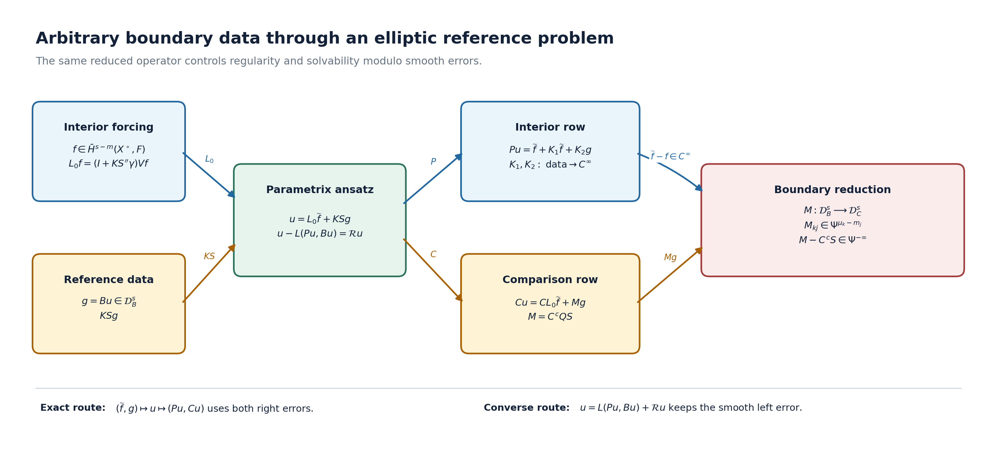

# Reducing arbitrary boundary data to a boundary system

An elliptic interior equation may be paired with boundary measurements that are not elliptic. A reference elliptic boundary problem still gives a precise reduction: the unknown reference data satisfy a pseudodifferential system on the boundary, and regularity or solvability modulo smooth errors for the full problem is equivalent to the corresponding property of that boundary system.

This lesson proves the reduction without assuming that the comparison measurements form an elliptic problem. The reference orders \(m_j\) and comparison orders \(\mu_k\) remain separate, the full Cauchy trace keeps all \(m\) components, and every smoothing term in the two-sided parametrix is retained. Exact equations are distinguished from equations modulo smooth sections.

Start with a measurement that misses a direction. On a cylinder whose
cross-section is a two-dimensional torus, prescribe the values on both
ends as the reference boundary condition. Instead measure only the
derivative in the first torus coordinate. A harmonic mode depending on
the second coordinate can have nonzero boundary values and zero
measurement. The full compact-cylinder calculation below proves exactly
what this loses: higher regularity, smooth-error solvability and closed
range. The general reduction then identifies the boundary operator that
controls these questions for an arbitrary elliptic reference problem.

The progression is: compute the model; retain the full reference inverse
and its errors; derive the comparison system; prove both equivalences;
then locate the exact connections to the wider boundary calculus and
cotangent-space symbol class. The original general statements and their
proofs keep their full order lists and hypotheses.

The named prerequisites are [Solving an elliptic system from compatible boundary measurements](general-boundary-fredholm.md), [Fredholm boundary problems with first-order Calderón defects](generalized-collar-fredholm.md), [Cauchy data from jumps and residues](calderon-cauchy-data.md), and [The calculus of pseudodifferential operators on a manifold](geometric-microlocal-calculus.md). We use \(D=-i\partial\) and restriction Sobolev spaces on a compact smooth manifold with boundary.

## A compact cylinder with a missing measurement direction

Take the original coordinates and densities

\[
 X=\mathbb T^2_y\times[0,1]_t,\qquad
 y_1,y_2\in\mathbb R/(2\pi\mathbb Z),\qquad d y_1\,d y_2\,dt,
 \qquad P=D_t^2+D_{y_1}^2+D_{y_2}^2,
 \qquad D=-i\partial.
 \tag{CM1}
\]

Both bundles are the trivial complex line. Use the full value trace
\(Bu=(u|_{t=0},u|_{t=1})\) as the reference datum, and the comparison
\(Cu=(D_{y_1}u|_{t=0},D_{y_1}u|_{t=1})\). Thus the reference orders are
\(m_0=m_1=0\), the comparison orders are \(\mu_0=\mu_1=1\), and
the interior order is \(m=2\). The two inward normal coordinates are
\(t\) at the lower end and \(1-t\) at the upper end.

For each end \(b=0,1\), keep the Fourier convention

\[
 g_b(y)=\sum_{n\in\mathbb Z^2}g_{b,n}e^{i n\cdot y},\qquad
 g_{b,n}=(2\pi)^{-2}\int_{\mathbb T^2}g_b(y)e^{-i n\cdot y}\,dy,
 \qquad
 \|g_b\|_{H^r(\mathbb T^2)}^2
       =(2\pi)^2\sum_n\langle n\rangle^{2r}|g_{b,n}|^2.
 \tag{CM2}
\]

**Periodic Fourier and trace foundations.** The Euclidean transform in
[Fourier transforms, finite spectra and convex separation](prerequisite-bridges.md)
does not by itself establish the periodic series being used here. We supply
that step with the original torus density. Direct integration gives
\[
 \int_{\mathbb T^2}e^{i(n-k)\cdot y}\,dy=(2\pi)^2\delta_{nk}.
 \tag{CF1}
\]
For \(-\pi\leq z\leq\pi\), set
\[
 F_N(z)=\frac1{N+1}\left|\sum_{k=0}^Ne^{ikz}\right|^2
       =\sum_{|k|\leq N}\left(1-\frac{|k|}{N+1}\right)e^{ikz},
 \qquad k_N(z_1,z_2)=(2\pi)^{-2}F_N(z_1)F_N(z_2).
 \tag{CF2}
\]
This is nonnegative and has integral one. On \(\delta\leq|z|\leq\pi\),
the geometric sum gives
\(F_N(z)\leq((N+1)\sin^2(\delta/2))^{-1}\).
Translations are continuous in periodic \(L^2\): for rectangle indicators
the symmetric-difference area tends to zero, then finite rectangle step
functions and their \(L^2\) density prove the statement for every input.
The original measure and step-function density are proved in
[Banach estimates, quotient spaces and compact parameter arguments](banach-foundation-bridges.md).
Translation preserves the full torus integral. Cauchy--Schwarz against
the probability density \(k_N\) now gives
\[
 \|k_N*g-g\|_2^2
 \leq\int_{\mathbb T^2}k_N(z)\|g(\,\cdot-z)-g\|_2^2\,dz
 \leq\varepsilon^2+
       \frac{8\|g\|_2^2}{(N+1)\sin^2(\delta/2)}
 \tag{CF3}
\]
once translations with both \(|z_j|<\delta\) have difference norm at
most \(\varepsilon\). The last constant retains the two coordinate
tails and the bound \(4\|g\|_2^2\) on each translated difference.
Thus finite trigonometric polynomials are dense. Orthogonality (CF1)
then proves Parseval with factor \((2\pi)^2\), and rectangular Fourier
partial sums converge in \(L^2\). For every real \(r\), define the torus
Sobolev norm by (CM2); weighted finite sums are dense in its completion.

Here is its exact connection to the coordinate Sobolev spaces. A smooth
cutoff \(\chi\) supported in one lifted torus chart satisfies
\(\widehat{\chi g}(\eta)=\sum_n g_n\widehat\chi(\eta-n)\).
The weight inequality is
\(\langle\eta\rangle^r\langle n\rangle^{-r}
 \leq2^{|r|/2}\langle\eta-n\rangle^{|r|}\).
Put \(a_\chi(v)=2^{|r|/2}\langle v\rangle^{|r|}|\widehat\chi(v)|\),
\(A_\chi=\sup_\eta\sum_n a_\chi(\eta-n)\) and
\(B_\chi=\int_{\mathbb R^2}a_\chi(v)\,dv\).
Both are finite by the Schwartz estimates: subdivide the integral
into unit squares, and bound the lattice tails by a convergent power
sum. Cauchy--Schwarz first against each kernel row, then summing or
integrating the columns, gives
\[
 \|\chi g\|_{H^r(\mathbb R^2)}^2
       \leq(2\pi)^{-4}A_\chi B_\chi\|g\|_{H^r(\mathbb T^2)}^2.
 \tag{CF4}
\]
For the converse choose a finite chart partition \(\sum_{j=1}^J\chi_j=1\),
and a compact smooth \(\sigma_j\) equal to one on the support of each
lifted \(u_j=\chi_jg\). Its Fourier values satisfy
\[
 \begin{aligned}
 \widehat u_j(n)&=(2\pi)^{-2}
       \int\widehat\sigma_j(n-\eta)\widehat u_j(\eta)\,d\eta,\\
 g_n&=(2\pi)^{-2}\sum_j\widehat u_j(n),\\
 \|g\|_{H^r(\mathbb T^2)}^2
 &\leq J(2\pi)^{-4}\sum_j A_{\sigma_j}B_{\sigma_j}
                            \|u_j\|_{H^r(\mathbb R^2)}^2.
 \end{aligned}
 \tag{CF5}
\]
The same row/column estimate proves the last inequality, retaining both
convolution and coefficient factors. These identities first hold for
smooth inputs and extend by completion; compactly supported distributions
also satisfy the convolution identity. They prove the asserted Sobolev
identification, including negative \(r\).

For the cylinder take the restriction of the product space on
\(\mathbb T^2\times\mathbb R\), with its full norm
\[
 \|U\|_{H^s}^2=(2\pi)^2(2\pi)^{-1}
  \sum_n\int_{\mathbb R}(1+|n|^2+\tau^2)^s
                   |\widehat U_n(\tau)|^2\,d\tau,
 \qquad \widehat U_n(\tau)=\int U_n(t)e^{-it\tau}\,dt.
 \tag{CF6}
\]
The preceding chart argument applies with the same weight inequality
uniformly in \(\tau\), so this is the coordinate Sobolev space too.
For \(s>j+1/2\), the \(j\)-th normal trace at \(b=0,1\) is
\((2\pi)^{-1}\int e^{ib\tau}(\epsilon_b\tau)^j
\widehat U_n(\tau)\,d\tau\), where \(\epsilon_0=1\) and
\(\epsilon_1=-1\). Cauchy--Schwarz and
\(\tau=\langle n\rangle v\) prove
\[
 \|\gamma_j^{(b)}U\|_{H^{s-j-1/2}(\mathbb T^2)}^2
 \leq\frac{J_{s,j}}{2\pi}\|U\|_{H^s}^2,\qquad
 J_{s,j}=\int_{\mathbb R}v^{2j}(1+v^2)^{-s}\,dv<\infty.
 \tag{CF7}
\]
For each coefficient the integral is continuous in \(b\), with the
same integrable majorant. An extension vanishing inside the cylinder
therefore has zero inward traces. Taking the infimum over extensions
proves (CF7) for the restriction space. At integer order two the
product Fourier norm is exactly the sum of the squared zeroth
derivative norm, twice every first derivative norm, every pure second
derivative norm and twice every mixed second derivative norm.
The bounded original reflection extension proved in
[Mixed symbols on every real two-parameter Sobolev scale](mixed-sobolev-mapping.md)
acts only in \(t\), so applies coefficientwise here with all these
weights. Equivalently, its order-two endpoint formula is
\(3u(-t)-2u(-2t)\) at the lower end and
\(3u(2-t)-2u(3-2t)\) at the upper end, with its retained smooth
cutoff. Values and first derivatives match because \(3-2=1\)
and \(-3+4=1\); the full derivative and cutoff estimates of that
extension therefore control the restriction \(H^2\) norm by the
ten derivative norms used below. This completes the periodic
foundations of the model.

Put \(a=|n|\). The homogeneous solution with both prescribed values is

\[
 \begin{aligned}
 (K_0g)_n(t)
 &=\frac{\sinh(a(1-t))}{\sinh a}g_{0,n}
       +\frac{\sinh(at)}{\sinh a}g_{1,n},&&a>0,\\
 (K_0g)_0(t)&=(1-t)g_{0,0}+t g_{1,0}.&&
 \end{aligned}
 \tag{CM3}
\]

Direct differentiation gives \(-v_n''+a^2v_n=0\) and the exact two
endpoint values. The zero mode is retained separately. The full inward
first-normal-derivative vector, for \(a>0\), is

\[
 \begin{pmatrix}D_t(K_0g)_n(0)\\D_{1-t}(K_0g)_n(1)\end{pmatrix}
 =i a\begin{pmatrix}\coth a&-\operatorname{csch}a\\
                 -\operatorname{csch}a&\coth a\end{pmatrix}
                  \binom{g_{0,n}}{g_{1,n}},
 \qquad D_{1-t}=+i\partial_t.
 \tag{CM4}
\]

For \(a=0\) the same two derivatives are
\((i(g_{0,0}-g_{1,0}),i(g_{1,0}-g_{0,0}))\). These formulas retain the
normal signs, the off-diagonal interaction and the constant mode.

Here is a direct completed-space justification. Every nonzero integer
frequency \(n\in\mathbb Z^2\) in (CM3) has \(a=|n|\geq1\). Write

\[
 p_a(t)=\frac{e^{-at}-e^{-a(2-t)}}{1-e^{-2a}},\qquad
 p_a^{(j)}(t)=
 \frac{(-a)^j e^{-at}-a^j e^{-a(2-t)}}{1-e^{-2a}},\quad j=0,1,2.
 \tag{CM5}
\]

The denominator and reflected exponential are both kept. The inequality
\(|v-w|^2\leq2|v|^2+2|w|^2\) and direct integration give

\[
 \begin{aligned}
 \int_0^1|p_a^{(j)}|^2dt
 &\leq\frac{2a^{2j}}{(1-e^{-2a})^2}
       \left(\frac{1-e^{-2a}}{2a}
                     +\frac{e^{-2a}-e^{-4a}}{2a}\right)\\
 &=a^{2j-1}\frac{1+e^{-2a}}{1-e^{-2a}}
       \leq (\coth1)a^{2j-1}.
 \end{aligned}
 \tag{CM6}
\]

There are exactly ten derivatives \(\partial_y^\alpha\partial_t^j\)
with \(|\alpha|+j\leq2\). For each nonzero mode their squared bound
has power at most \(a^3\). For the zero mode, \(1-t\) and \(t\)
each have the sum of squared zeroth, first and second derivative norms
\(1/3+1+0=4/3\). Apply the same two-term inequality to the two end
contributions and use the full torus Plancherel factor. Then

\[
 \sum_{|\alpha|+j\leq2}
      \|\partial_y^\alpha\partial_t^jK_0g\|_{L^2(X)}^2
 \leq20(\coth1)(2\pi)^2\sum_n\langle n\rangle^3
                          (|g_{0,n}|^2+|g_{1,n}|^2).
 \tag{CM7}
\]

Consequently Fourier partial sums converge in \(H^2(X)\) for every
\(g\in H^{3/2}(\mathbb T^2)\oplus H^{3/2}(\mathbb T^2)\). Continuity
of the value and normal trace maps in (CF7) passes (CM3)--(CM4)
to their proper Sobolev spaces. Also \(PK_0g=0\), since \(P:H^2\to L^2\)
is continuous. A homogeneous \(H^2\) solution with zero value traces is
zero: its Fourier coefficients satisfy the same one-dimensional
equation, and integration by parts yields
\(\int_0^1(|v_n'|^2+a^2|v_n|^2)dt=0\). At \(a=0\) the resulting
constant must also have zero endpoint values. This proves uniqueness.

The forcing lift has an equally explicit full kernel. If
\(t_< =\min(t,r)\) and \(t_>=\max(t,r)\), put

\[
 \begin{aligned}
 G_a(t,r)&=\frac{\sinh(a t_<)\sinh(a(1-t_>))}{a\sinh a},&&a>0,\\
 G_0(t,r)&=t_<(1-t_>),\\
 (V_0f)_n(t)&=\int_0^1G_{|n|}(t,r)f_n(r)\,dr.
 \end{aligned}
 \tag{CM8}
\]

At \(t=r\), the jump of \(\partial_tG_a\) is minus one: the numerator
of that jump is
\(-\sinh(ar)\cosh(a(1-r))-\cosh(ar)\sinh(a(1-r))=-\sinh a\).
The zero-mode jump is also minus one. Thus
\((-\partial_t^2+a^2)G_a=\delta_r\), with both Dirichlet values zero.
For \(a\geq1\), the energy identity and Cauchy--Schwarz give

\[
 \|v_n\|_2\leq a^{-2}\|f_n\|_2,\qquad
 \|v_n'\|_2\leq a^{-1}\|f_n\|_2,\qquad
 \|v_n''\|_2\leq2\|f_n\|_2.
 \tag{CM9}
\]

For example the first bound follows from
\(a^2\|v_n\|_2^2\leq |(f_n,v_n)|\); inserting it into
\(\|v_n'\|_2^2+a^2\|v_n\|_2^2=(f_n,v_n)\) proves the second.
The equation \(v_n''=a^2v_n-f_n\) proves the third. For the zero mode,
\(\int G_0(t,r)dr=t(1-t)/2\leq1/8\) and the analogous bound in the
other variable give the kernel operator norm at most \(1/8\) by
Cauchy--Schwarz with the nonnegative kernel. The energy identity then
gives \(\|v_0'\|_2\leq\|f_0\|_2/\sqrt8\), and
\(v_0''=-f_0\). Each of the ten derivatives used in (CM7) has norm
at most \(2\|f_n\|_2\) in a nonzero mode; the three nonvanishing
zero-mode derivatives obey the stated smaller bounds. Hence

\[
 \sum_{|\alpha|+j\leq2}
       \|\partial_y^\alpha\partial_t^j V_0f\|_2^2
          \leq40(2\pi)^2\sum_n\|f_n\|_{L^2(0,1)}^2
          =40\|f\|_{L^2(X)}^2.
 \tag{CM10}
\]

Smooth Fourier truncation and density pass the kernel equation and
zero traces to all \(L^2\) inputs. Thus
\(u=V_0f+K_0g\) is the exact reference inverse at \(H^2\), with no
remainder for this chosen inverse. The general reference parametrix
below keeps its actual smoothing errors.

Since \(C\) differentiates only the value traces, this exact reference
inverse has reduced boundary operator

\[
 M_0g=(D_{y_1}g_0,D_{y_1}g_1),\qquad
 (M_0g)_{b,n}=n_1g_{b,n}.
 \tag{CM11}
\]

For one end and any real \(r\), its map is
\(D_{y_1}:H^r\to H^{r-1}\). Its exact range and closure are

\[
 \begin{aligned}
 \operatorname{ran}D_{y_1}
 &=\left\{h\in H^{r-1}:h_{(0,n_2)}=0\ \text{for all }n_2,
     \ \sum_{n_1\ne0}\langle n\rangle^{2r}
                         |h_n/n_1|^2<\infty\right\},\\
 \overline{\operatorname{ran}D_{y_1}}
 &=\{h\in H^{r-1}:h_{(0,n_2)}=0\ \text{for all }n_2\}.
 \end{aligned}
 \tag{CM12}
\]

Necessity follows by taking Fourier coefficients. For sufficiency set
\(g_n=h_n/n_1\) when \(n_1\ne0\), and zero otherwise. The displayed
sum puts \(g\) in \(H^r\) and gives the required image. For the closure,
each coefficient is a continuous functional on \(H^{r-1}\), whereas
finite Fourier sums with \(n_1\ne0\) belong to the range and are dense
in the displayed subspace. The kernel contains every mode with
\(n_1=0\), and the target modulo the closure contains every such
mode as an independent class.

The range is not closed. Indeed the vectors

\[
 v_N(y)=\frac{e^{i(y_1+Ny_2)}}{2\pi\langle(1,N)\rangle^r},\qquad
 \|v_N\|_{H^r}=1,\qquad
 \|D_{y_1}v_N\|_{H^{r-1}}=\langle(1,N)\rangle^{-1}\longrightarrow0
 \tag{CM13}
\]

lie in the orthogonal complement of the kernel. A closed range would
make the restriction from that complement a bounded bijection onto
the range. The Banach inverse theorem, proved in [Banach estimates,
quotient spaces and compact parameter arguments](banach-foundation-bridges.md), would bound these unit
vectors by a fixed multiple of their image norms, contradicting
(CM13). The same conclusions hold for the two-end direct sum.
They also apply to the full comparison problem at its base spaces:
\(A_B:H^2(X)\to L^2(X)\oplus(H^{3/2}\oplus H^{3/2})\) is a bounded
isomorphism with the actual inverse constructed in (CM3)--(CM10).
Its zero-Dirichlet forcing lift has zero comparison traces, so
\[
 A_C A_B^{-1}(f,g)
       =A_C(V_0f+K_0g)=(f,M_0g).
 \tag{CM15}
\]
Thus the kernel of the full map is isomorphic to \(\ker M_0\), and
its target modulo the closure of its range is isomorphic to the
corresponding boundary quotient in (CM12). Its range is not closed,
because the product range \(L^2(X)\oplus\operatorname{ran}M_0\) is
not closed. This gives the exact interior/boundary relation, rather
than drawing an inference from the boundary symbol alone.

This also gives actual failures of the two general properties. For
\(2<s_0\leq s_1\), take

\[
 g_0(y)=\sum_{N\geq1}N^{-s_0}e^{iNy_2},\qquad g_1=0.
 \tag{CM14}
\]

The squared \(H^{3/2}\) sum converges because its large-\(N\) power
is \(3-2s_0<-1\). The \(H^{s_0-1/2}\) sum diverges with power
minus one. Equation (CM7) gives \(u=K_0g\in H^2\), with \(Pu=0\)
and \(Cu=0\). If \(u\) belonged to \(H^{s_0}\), the value trace
theorem would put \(g_0\) in the space just shown impossible. Thus
\(\mathrm{Reg}_X(s_0,s_1)\) fails, as does its boundary counterpart.
At \(s_0=2\) the regularity assertion is its base hypothesis.

For any \(s_1\geq2\), choose the comparison datum
\(h_0(y)=\sum_{N\geq1}N^{-s_1}e^{iNy_2}\), \(h_1=0\), and \(f=0\).
Its squared target sum in \(H^{s_1-3/2}\) has power minus three,
so it is admissible. Its coefficients do not decrease faster than
every power, so it is not smooth. Every \(M_0g\) is zero in these
frequencies. Therefore \(M_0g-h\) cannot be smooth, for any boundary
distribution \(g\). Nor can \(Cu-h\) be smooth for an interior
solution: the same Fourier coefficients of each \(D_{y_1}\) trace
are zero. Smooth-error solvability fails for the exact comparison
problem. These are consequences of the retained measurement and
its precise missing frequencies, not a change of interior ellipticity.

## 1. The reference problem and the comparison measurements

Let \(X\) be a compact smooth manifold with boundary \(Y\). Let \(E,F\to X\) be complex bundles of the same finite rank, and let

\[
 P:C^\infty(X,E)\longrightarrow C^\infty(X,F)
 \tag{BDR1}
\]

be an elliptic differential operator of order \(m\geq1\). Choose an elliptic reference boundary system \(\mathbf B=(B_1,\ldots,B_J)\). Its rows have transversal order below \(m\) and total orders \(m_j\):

\[
 B_j u=\sum_{r=0}^{m-1}\mathcal B_{jr}\gamma_r u,
 \qquad \gamma_r u=(D_t^ru)|_Y,
 \qquad \operatorname{ord}\mathcal B_{jr}\leq m_j-r.
 \tag{BDR2}
\]

The complementing condition is assumed for \((P,\mathbf B)\). The integers \(m_j\) need not be below \(m\).

Now choose comparison rows \(\mathbf C=(C_1,\ldots,C_K)\), with targets \(H_k\to Y\), transversal order below \(m\), and total orders \(\mu_k\):

\[
 C_k u=\sum_{r=0}^{m-1}\mathcal C_{kr}\gamma_r u
       =C_k^c\gamma u,
 \qquad
 \operatorname{ord}\mathcal C_{kr}\leq\mu_k-r,
 \qquad
 \gamma u=(\gamma_0u,\ldots,\gamma_{m-1}u).
 \tag{BDR3}
\]

No complementing condition is imposed on \((P,\mathbf C)\). The problem under study is

\[
 Pu=f,\qquad C_ku=h_k\quad(1\leq k\leq K),
 \tag{BDR4}
\]

and the auxiliary reference datum will be \(g_j=B_ju\).

For every real \(s\), put

\[
 \begin{aligned}
 \mathcal C^s
   &=\bigoplus_{r=0}^{m-1}H^{s-r-1/2}(Y,E|_Y),\\
 \mathcal D_B^s
   &=\bigoplus_{j=1}^{J}H^{s-m_j-1/2}(Y,G_j),\\
 \mathcal D_C^s
   &=\bigoplus_{k=1}^{K}H^{s-\mu_k-1/2}(Y,H_k).
 \end{aligned}
 \tag{BDR5}
\]

Thus \(\mathcal B=(\mathcal B_{jr})\) and \(C^c=(\mathcal C_{kr})\) have the bounded mappings

\[
 \mathcal B:\mathcal C^s\longrightarrow\mathcal D_B^s,
 \qquad
 C^c:\mathcal C^s\longrightarrow\mathcal D_C^s.
 \tag{BDR6}
\]

These formulas make the two order lists visible. They also cover negative target exponents and arbitrarily large total orders.

## 2. The complete reference parametrix

**Editorial correction of the extension used here.** Section 4 of [Cauchy data from jumps and residues](calderon-cauchy-data.md) extends the original operator \(P\) elliptically to an open neighborhood \(\widehat X\) of \(X\). Use that extension and a proper transmission parametrix \(T\), on a relatively compact working neighborhood, with

\[
 TP=I+R_E,\qquad PT=I+R_F,
 \qquad R_E,R_F\in\Psi^{-\infty}.
 \tag{BDR7}
\]

Let \(e^+\) be zero extension and \(r^+\) interior restriction. If
\(P=\sum_{a=0}^mP_aD_t^a\) in the collar, define

\[
 \begin{aligned}
 P^cU
 &=\frac1i\sum_{a=1}^mP_a
       \sum_{r=0}^{a-1}U_{a-1-r}\otimes D_t^r\delta_0,\\
 V&=r^+Te^+,
 \qquad K=r^+TP^c.
 \end{aligned}
 \tag{BDR8}
\]

The Calderón operator \(Q\) is fixed by the exact trace identity

\[
 \gamma K=Q,\qquad
 Q_{r\ell}\in\Psi_{\mathrm{cl}}^{r-\ell},\qquad
 Q^2-Q\in\Psi^{-\infty}.
 \tag{BDR9}
\]

The complementing condition for \(\mathbf B\) gives matrices \(S\) and \(S''\) with

\[
 \mathcal BS\equiv I,\qquad QS\equiv S,\qquad
 S\mathcal B+S''\equiv I,\qquad S''Q\equiv0,
 \tag{BDR10}
\]

where \(\equiv\) means equality modulo a matrix with smooth kernel, and

\[
 S_{rj}\in\Psi_{\mathrm{cl}}^{r-m_j},\qquad
 S''_{r\ell}\in\Psi_{\mathrm{cl}}^{r-\ell}.
 \tag{BDR11}
\]

Set

\[
 L_0=(I+KS''\gamma)V,\qquad
 L(f,g)=L_0f+KSg.
 \tag{BDR12}
\]

At every \(s\geq m\), the mapping statements are

\[
 \begin{aligned}
 V&:\bar H^{s-m}(X^\circ,F)\longrightarrow\bar H^s(X^\circ,E),\\
 S&:\mathcal D_B^s\longrightarrow\mathcal C^s,\\
 K&:\mathcal C^s\longrightarrow\bar H^s(X^\circ,E),\\
 L&:\bar H^{s-m}(X^\circ,F)\oplus\mathcal D_B^s
       \longrightarrow\bar H^s(X^\circ,E).
 \end{aligned}
 \tag{BDR13}
\]

Nothing in (BDR13) evaluates an arbitrary distribution at the boundary: \(\gamma\) occurs only after \(V\), which has already gained \(m\) derivatives.

For \(u\in\bar H^m(X^\circ,E)\), the complete left identity is

\[
 u=L_0Pu+KSBu+\mathcal Ru,
 \qquad
 \mathcal R:\bar H^m(X^\circ,E)\longrightarrow C^\infty(X,E).
 \tag{BDR14}
\]

One exact formula retaining the source of this remainder is

\[
 \mathcal R
 =K\bigl(\mathcal R_Y\gamma-S''\gamma R_E^+\bigr)-R_E^+,
 \qquad
 \mathcal R_Y=I-S\mathcal B-S''(I-Q),
 \qquad R_E^+=r^+R_Ee^+.
 \tag{BDR15}
\]

**Editorial correction of the smoothing argument.** The individual summands \(I\), \(S\mathcal B\) and \(S''(I-Q)\) need not be smoothing. The exact regrouping is
\[
 \mathcal R_Y=(I-S\mathcal B-S'')+S''Q.
 \tag{BDR15a}
\]
Both the parenthesized error \(I-S\mathcal B-S''\) and the product \(S''Q\) have smooth kernels by (BDR10), so their sum \(\mathcal R_Y\) has a smooth kernel. Meanwhile \(R_E^+\) maps interior \(L^2\) inputs continuously to sections smooth up to the boundary. For \(u\in\bar H^m\), the trace \(\gamma u\) has the stated boundary Sobolev orders, so \(\mathcal R_Y\gamma u\) is smooth; \(S''\gamma R_E^+u\) is also smooth. The all-order Poisson estimate for \(K\), followed by Sobolev embedding at every high order, proves the mapping of \(\mathcal R\) in (BDR14), retaining both terms inside \(K\) and the final \(-R_E^+\). No elliptic extension of the original \(P\) to a closed double is required in this proof.

The interior row of the right identity is

\[
 PL(f,g)=f+K_1f+K_2g,
 \tag{BDR16}
\]

where, with \(H=r^+R_FP^c\),

\[
 K_1=R_F^++HS''\gamma V,\qquad
 K_2=HS,\qquad R_F^+=r^+R_Fe^+.
 \tag{BDR17}
\]

Both \(K_1\) and \(K_2\) map their indicated Sobolev inputs continuously into smooth interior sections. In particular, \(K_2\) has a kernel smooth in its boundary input and interior output variables.

The reference boundary row is also retained:

\[
 BL(f,g)=g+K_3f+K_4g,
 \tag{BDR18}
\]

where \(K_3:L^2(X,F)\to C^\infty(Y,\bigoplus_jG_j)\) is continuous and \(K_4\) has a smooth kernel on \(Y\times Y\).

## 3. The boundary pseudodifferential system

Define the reduced comparison operator

\[
 M=C^cQS:\mathcal D_B^s\longrightarrow\mathcal D_C^s.
 \tag{BDR19}
\]

Its \((k,j)\) entry has order \(\mu_k-m_j\). Indeed every summand has the unreduced order

\[
 \operatorname{ord}\bigl(\mathcal C_{kr}Q_{r\ell}S_{\ell j}\bigr)
 \leq(\mu_k-r)+(r-\ell)+(\ell-m_j)
 =\mu_k-m_j.
 \tag{BDR20}
\]

This calculation keeps all three factors and does not identify \(m_j\) with \(\mu_k\).

Let \(u\in\bar H^m\), put \(f=Pu\), \(g=Bu\), and \(h=Cu\). Apply \(C\) to (BDR14). Since \(C=C^c\gamma\) and \(\gamma K=Q\), one obtains the exact identity

\[
 C^cQSg
 =h-CL_0f-C\mathcal Ru.
 \tag{BDR21}
\]

In the original factors this reads

\[
 C_k^cQSg
 =h_k-C_k(I+KS''\gamma)Vf-C_k\mathcal Ru,
 \qquad V=r^+Te^+,\quad K=r^+TP^c.
 \tag{BDR22}
\]

The last term is smooth on \(Y\). If \(f\in\bar H^{s-m}\), then (BDR13) gives

\[
 CL_0f\in\mathcal D_C^s.
 \tag{BDR23}
\]

The second identity in (BDR10) gives a smoothing matrix \(R_S=QS-S\). Composition with the finite-order row \(C^c\) remains smoothing, so

\[
 M-C^cS=C^c(QS-S)=C^cR_S\in\Psi^{-\infty}.
 \tag{BDR24}
\]

Thus \(C^cS\) may replace \(M\) in a statement made modulo smooth sections. It may not replace \(M\) in an exact equation without also retaining the smoothing correction.

## 4. The coupled ansatz and its exact scope

For \(s\geq m\), take \(\widetilde f\in\bar H^{s-m}(X^\circ,F)\), \(g\in\mathcal D_B^s\), and set

\[
 u=L(\widetilde f,g)
   =(I+KS''\gamma)V\widetilde f+KSg.
 \tag{BDR25}
\]

Equations (BDR16) and (BDR19) give, without suppressing either right error,

\[
 \begin{aligned}
 Pu&=\widetilde f+K_1\widetilde f+K_2g,\\
 Cu&=CL_0\widetilde f+Mg.
 \end{aligned}
 \tag{BDR26}
\]

Consequently this particular ansatz solves (BDR4) exactly if and only if its parameters solve the coupled system

\[
 \boxed{
 \begin{aligned}
 \widetilde f+K_1\widetilde f+K_2g&=f,\\
 Mg&=h-CL_0\widetilde f.
 \end{aligned}}
 \tag{BDR27}
\]

The first equation implies

\[
 \widetilde f-f=-K_1\widetilde f-K_2g\in C^\infty(X,F).
 \tag{BDR28}
\]

The transmission mapping of \(V\), followed by (BDR12), sends a smooth forcing term to a section smooth up to \(Y\). Hence

\[
 CL_0\widetilde f-CL_0f=CL_0(\widetilde f-f)\in C^\infty(Y,\textstyle\bigoplus_kH_k).
 \tag{BDR29}
\]

This is the precise reason that \(f\) may replace \(\widetilde f\) on the boundary right side modulo smooth terms.

The ansatz does not claim that every exact solution lies in the exact range of \(L\). What is true for every solution is the complete modulo-smooth representation

\[
 u-L(Pu,Bu)=\mathcal Ru\in C^\infty(X,E).
 \tag{BDR30}
\]

Therefore (BDR27) is an exact characterization of solutions produced by the ansatz, while (BDR30) says that the ansatz captures every solution modulo a smooth section. Possible finite-dimensional obstructions in the first equation have not been erased.

### The full reference and comparison block

The source's block notation has a concrete connection to the present
maps. Retain the original spaces
\(\mathcal U^s=\bar H^s(X^\circ,E)\),
\(\mathcal F^s=\bar H^{s-m}(X^\circ,F)\), and both graded boundary
spaces from (BDR5). Write

\[
 A_B=\binom P B:\mathcal U^s\longrightarrow
             \mathcal F^s\oplus\mathcal D_B^s,
 \qquad
 A_C=\binom P C:\mathcal U^s\longrightarrow
             \mathcal F^s\oplus\mathcal D_C^s,
 \qquad
 L_B=\begin{pmatrix}L_0&KS\end{pmatrix}.
 \tag{BCM1}
\]

All three maps are bounded when \(s\geq m\), by (BDR6), (BDR13)
and the strict normal trace thresholds. Equations (BDR14), (BDR16)
and (BDR18) give the complete products

\[
 \begin{aligned}
 L_BA_B&=I-\mathcal R,\\
 A_BL_B&=\begin{pmatrix}I+K_1&K_2\\K_3&I+K_4\end{pmatrix},\\
 A_CL_B&=\begin{pmatrix}I+K_1&K_2\\CL_0&M\end{pmatrix},
       \qquad M=C^cQS.
 \end{aligned}
 \tag{BCM2}
\]

Each entry has its displayed domain and target; in particular the
boundary-input column is retained. Applying the last matrix to
\((\widetilde f,g)\) is exactly (BDR27). Applying
\(L_BA_B=I-\mathcal R\) to an arbitrary \(u\) is exactly (BDR30).
This proves their connection before taking any quotient by smooth
sections. In that quotient the first two products are inverse maps,
and the comparison problem becomes the triangular map with rows
\((I,0)\) and \((CL_0,M)\); the exact products remain (BCM2).

[Melo, Schick and Schrohe, Introduction, equation (1)](https://arxiv.org/abs/math/0403059v3)
provide the typed interior/boundary block used for this comparison.
Our equation column has zero boundary input bundle; its reference
inverse has the actual Poisson column \(KS\). Their composition rule
is stated for a single order and class. Here the original lists
\(m_j\) and \(\mu_k\) remain separate, and (BDR20) proves the exact
order of every entry of \(M\). No order-changing substitution or
proof of the entire boundary algebra is inferred from (BCM2).

## 5. Equivalence of regularity gains

Fix real exponents

\[
 m\leq s_0\leq s_1.
 \tag{BDR31}
\]

Consider the following two assertions.

**Interior assertion \(\mathrm{Reg}_X(s_0,s_1)\).** Every \(u\in\bar H^m(X^\circ,E)\) satisfying

\[
 Pu\in\bar H^{s_1-m}(X^\circ,F),
 \qquad Cu\in\mathcal D_C^{s_1}
 \tag{BDR32}
\]

belongs to \(\bar H^{s_0}(X^\circ,E)\).

**Boundary assertion \(\mathrm{Reg}_Y(s_0,s_1)\).** Every \(g\in\mathcal D_B^m\) satisfying

\[
 Mg=C^cQSg\in\mathcal D_C^{s_1}
 \tag{BDR33}
\]

belongs to \(\mathcal D_B^{s_0}\).

**Regularity reduction theorem.** The two assertions are equivalent.

Assume first \(\mathrm{Reg}_X(s_0,s_1)\), and take \(g\) as in (BDR33). Put

\[
 u=KSg.
 \tag{BDR34}
\]

The mappings in (BDR13) put \(u\) in \(\bar H^m\). Equations (BDR16) and (BDR18), with \(f=0\), give

\[
 Pu=K_2g\in C^\infty(X,F),\qquad
 Cu=Mg\in\mathcal D_C^{s_1},\qquad
 Bu=g+K_4g.
 \tag{BDR35}
\]

The interior assertion yields \(u\in\bar H^{s_0}\). Therefore \(Bu\in\mathcal D_B^{s_0}\); because \(K_4g\) is smooth, the last identity in (BDR35) proves

\[
 g=Bu-K_4g\in\mathcal D_B^{s_0}.
 \tag{BDR36}
\]

This proves \(\mathrm{Reg}_Y(s_0,s_1)\).

Conversely assume \(\mathrm{Reg}_Y(s_0,s_1)\), and take \(u\) as in (BDR32). Set \(f=Pu\), \(h=Cu\), and \(g=Bu\). The trace theorem at the base exponent gives \(g\in\mathcal D_B^m\). Equations (BDR21) and (BDR23) imply

\[
 Mg=h-CL_0f-C\mathcal Ru\in\mathcal D_C^{s_1}.
 \tag{BDR37}
\]

The boundary assertion gives \(g\in\mathcal D_B^{s_0}\). Since \(s_1\geq s_0\), also \(f\in\bar H^{s_0-m}\). Applying (BDR13) to the exact left identity (BDR14) yields

\[
 u=L(f,g)+\mathcal Ru\in\bar H^{s_0}(X^\circ,E).
 \tag{BDR38}
\]

This proves the converse and the theorem. The final bundle in (BDR38) is \(E\), the bundle of the unknown; \(F\) is the target of \(Pu\).

## 6. Equivalence of solvability modulo smooth errors

Under (BDR31), consider two more assertions.

**Interior assertion \(\mathrm{Sol}_X(s_0,s_1)\).** For every

\[
 f\in\bar H^{s_1-m}(X^\circ,F),\qquad
 h\in\mathcal D_C^{s_1},
 \tag{BDR39}
\]

there is \(u\in\bar H^{s_0}(X^\circ,E)\) such that

\[
 Pu-f\in C^\infty(X,F),\qquad
 Cu-h\in C^\infty(Y,\textstyle\bigoplus_kH_k).
 \tag{BDR40}
\]

**Boundary assertion \(\mathrm{Sol}_Y(s_0,s_1)\).** For every \(h\in\mathcal D_C^{s_1}\), there is \(g\in\mathcal D_B^{s_0}\) such that

\[
 Mg-h\in C^\infty(Y,\textstyle\bigoplus_kH_k).
 \tag{BDR41}
\]

**Smooth-error solvability theorem.** The two assertions are equivalent.

Assume \(\mathrm{Sol}_Y(s_0,s_1)\). Given \((f,h)\) as in (BDR39), form the interior lift

\[
 u_f=L_0f=(I+KS''\gamma)Vf\in\bar H^{s_1}(X^\circ,E),
 \qquad h'=h-Cu_f\in\mathcal D_C^{s_1}.
 \tag{BDR42}
\]

Choose \(g\in\mathcal D_B^{s_0}\) with \(Mg-h'\) smooth, and set

\[
 u=u_f+KSg.
 \tag{BDR43}
\]

Since \(s_1\geq s_0\), both terms lie in \(\bar H^{s_0}\). The two rows of (BDR26) give

\[
 Pu-f=K_1f+K_2g\in C^\infty(X,F),\qquad
 Cu-h=Mg-h'\in C^\infty(Y,\textstyle\bigoplus_kH_k).
 \tag{BDR44}
\]

Thus \(\mathrm{Sol}_X(s_0,s_1)\) holds.

Conversely assume \(\mathrm{Sol}_X(s_0,s_1)\), and fix \(h\in\mathcal D_C^{s_1}\). Apply it with \(f=0\). There is \(u\in\bar H^{s_0}\) such that \(Pu\) and \(Cu-h\) are smooth. Put

\[
 g=Bu\in\mathcal D_B^{s_0}.
 \tag{BDR45}
\]

The exact reduction identity (BDR21) now gives

\[
 Mg-h=(Cu-h)-CL_0(Pu)-C\mathcal Ru
 \in C^\infty(Y,\textstyle\bigoplus_kH_k).
 \tag{BDR46}
\]

Indeed \(Pu\) is smooth, so the all-order mapping of \(L_0\) makes \(CL_0(Pu)\) smooth; the last term is smooth by (BDR14). This proves \(\mathrm{Sol}_Y(s_0,s_1)\).

The theorem asserts solvability modulo smooth errors. It does not assert exact surjectivity, a finite-dimensional cokernel, or a closed range for \((P,\mathbf C)\). Any such conclusion needs an additional theorem connecting smooth-error solvability with the topology of the relevant range.

## 7. Endpoints, order checks, and a nonelliptic model

At \(s_0=m\), the claimed gain in both regularity assertions is exactly their base assumption. At \(s_1=s_0\), every occurrence of a Sobolev embedding in the proof becomes the identity map. No strict inequality between the two exponents was used.

For a boundary row of total order \(\mu_k\), the trace estimate is

\[
 \|C_ku\|_{H^{s-\mu_k-1/2}}
 \leq C\sum_{r=0}^{m-1}
       \|\gamma_ru\|_{H^{s-r-1/2}},
 \qquad s\geq m.
 \tag{BDR47}
\]

This remains valid when \(\mu_k\geq m\), because the target exponent is allowed to be negative. The same observation applies independently to every \(m_j\).

A frozen scalar model shows why no ellipticity of \(\mathbf C\) should be inserted. Let \(m=2\), let the tangential covariable be \(\eta=(\eta_1,\eta_2)\), and take

\[
 p(\eta,D_t)=D_t^2+|\eta|^2,\qquad
 B=\gamma_0,\qquad C=D_{y_1}\gamma_0.
 \tag{BDR48}
\]

For \(\eta\ne0\), the decaying normal solution with Dirichlet datum \(g\) is \(e^{-|\eta|t}g\). Hence the principal reduced boundary operator is

\[
 \sigma(M)(\eta)g=\eta_1g.
 \tag{BDR49}
\]

It vanishes at every nonzero covector with \(\eta_1=0\). The reduction theorem still applies: it identifies regularity and smooth-error solvability of the full comparison problem with those of this nonelliptic tangential operator. It does not manufacture the missing transverse control.

The upper route in the figure is the exact ansatz (BDR25)–(BDR27). The lower route is the left identity (BDR14), which supplies the converse statements modulo its displayed smooth remainder. The two routes meet at the same reduced boundary operator \(M\).

## 8. Exercises with complete solutions

**Exercise 1.** Verify the order of the \((k,j)\) entry of \(C^cS\).

**Solution.** The \(r\)-th summand has order

\[
 \operatorname{ord}(\mathcal C_{kr}S_{rj})
 \leq(\mu_k-r)+(r-m_j)=\mu_k-m_j.
 \tag{BDR50}
\]

It therefore maps \(H^{s-m_j-1/2}\) to \(H^{s-\mu_k-1/2}\), exactly as required.

**Exercise 2.** Derive (BDR21) without replacing \(QS\) by \(S\).

**Solution.** Apply \(C=C^c\gamma\) to (BDR14). The boundary correction contributes

\[
 C(KSg)=C^c\gamma KSg=C^cQSg=Mg.
 \tag{BDR51}
\]

Moving the other two terms to the right gives (BDR21). No quotient-algebra equality was used.

**Exercise 3.** In the proof that \(\mathrm{Reg}_X\) implies \(\mathrm{Reg}_Y\), explain why \(Bu-g\) is smooth for \(u=KSg\).

**Solution.** Put \(f=0\) in the exact right boundary identity (BDR18):

\[
 BKSg-g=K_4g\in C^\infty(Y,\textstyle\bigoplus_jG_j).
 \tag{BDR52}
\]

This uses the retained boundary error, rather than treating \(BS\equiv I\) as equality.

**Exercise 4.** Prove the sufficiency direction of the smooth-error theorem using the unshifted forcing \(f\).

**Solution.** Define \(u_f=L_0f\), shift the desired boundary datum to \(h'=h-Cu_f\), choose \(g\) by \(\mathrm{Sol}_Y\), and set \(u=u_f+KSg\). Then

\[
 (Pu-f,Cu-h)=(K_1f+K_2g,\,Mg-h'),
 \tag{BDR53}
\]

whose first component is smooth by (BDR17) and whose second is smooth by the choice of \(g\).

**Exercise 5.** Explain the failure of ellipticity in (BDR49) without claiming failure at every covector.

**Solution.** At a covector with \(\eta_1\ne0\), multiplication by \(\eta_1\) is invertible. At a nonzero covector \((0,\eta_2)\), it is zero. Thus

\[
 \sigma(M)(0,\eta_2)=0\quad(\eta_2\ne0),
 \tag{BDR54}
\]

which is enough to disprove ellipticity while retaining the exact directions where the symbol is invertible.

## 9. Reading notes and scope

The operators \(T,P^c,V,K,Q,S,S''\), the full left identity, both rows of the right identity, and their Sobolev mappings are proved in [Solving an elliptic system from compatible boundary measurements](general-boundary-fredholm.md). The first-order-defect variant and its lower-order error estimates are proved in [Fredholm boundary problems with first-order Calderón defects](generalized-collar-fredholm.md). This lesson uses the ordinary smoothing reference construction because the present conclusions are explicitly modulo smooth sections.

Two local solvability notions for a properly supported scalar pseudodifferential operator require care. Local solvability at a compact set permits forcing from a finite-codimensional subspace of \(C^\infty\). Microlocal solvability over the full cosphere above that set asks for a distributional solution modulo a smooth error for every forcing in one finite Sobolev class. The proof here does not use an equivalence between these two notions. The finite codimension belongs to the smooth forcing space; it does not say that a fixed Sobolev realization of \((P,\mathbf C)\) has closed range or finite-dimensional cokernel. Applying the later theorem to this coupled boundary system would require an additional system realization and the corresponding range estimates.

The exact topological carrier supplied by the current course is the doubled symbol \(\widehat p\). On the closed double it determines
\[
 [\pi^*\widehat E,\pi^*\widehat F,
   \widehat p|_{S^*\widehat X}]
 \in K^0(B^*\widehat X,S^*\widehat X)
 \cong K_c^0(T^*\widehat X),
\]
while [Doubling a boundary problem and computing its index](split-doubling-boundary-index.md) proves \(\operatorname{ind}(P,B)=\operatorname{sind}(\widehat p)\). Identifying this analytic index with a characteristic-class topological formula requires the complete later index-formula calculation; that formula is not used in this lesson.

### The exact cotangent-space class

We specify the group and prove the correspondence in the displayed
symbol class above. This concerns the already constructed closed
double, not an ellipticity claim for the comparison rows \(C\).
Let \(Z=\widehat X\) and use the same chosen cotangent norm to form
the closed unit disk bundle \(B^*Z\) and its sphere bundle \(S^*Z\).
The relative symbol presentation of \(K^0(B^*Z,S^*Z)\) uses triples
\((V,W,a)\), where \(V,W\) are smooth complex bundles over the disk and
\(a:V|_{S^*Z}\to W|_{S^*Z}\) is an isomorphism. Impose the following
relations on the free abelian group of such triples: bundle
isomorphism, direct-sum addition, continuous homotopy of the boundary
isomorphism, and zero for a boundary isomorphism that extends over
the whole disk. This states the relative group being used, including
its neutral objects.

The compact-support symbol presentation of \(K_c^0(T^*Z)\) uses
smooth complex bundle pairs over \(T^*Z\) with an isomorphism outside a compact set,
with the same four relations. Homotopies are required to be
invertible outside one common compact set for the whole parameter
interval. Enlarging the exceptional compact set leaves the same
class. We construct inverse maps between these presentations.

First, every smooth bundle on either disk or cotangent bundle is
isomorphic to the pullback of its zero-section restriction. Choose a
connection by a locally finite bundle-chart partition, and transport along
\(t\mapsto (y,t\xi)\), \(0\leq t\leq1\). In a bundle frame the
transport equation is

\[
 \frac{dU(t;y,\xi)}{dt}
    =-\sum_a\xi_a A_a(y,t\xi)U(t;y,\xi),\qquad U(0;y,\xi)=I.
 \tag{KC1}
\]

Use the matrix-entry integral and parameter differentiation proved in
[Polynomial and contour interfaces for stable boundary models](stable-prerequisite-bridges.md).
The required ordered solution is constructed here. On each compact parameter chart with coefficient
norm at most \(M\), the \(j\)-th ordered integral has norm at most
\(M^j/j!\). Differentiating any fixed finite number of parameters
gives a polynomial in \(j\) times the same factorial majorant, with
the appropriate bounds for the coefficient derivatives. These series
converge uniformly on that compact chart. Substitution in the integral
equation proves (KC1); the fundamental theorem gives its derivative.
The inverse series solves \(W'=W\sum_a\xi_a A_a(y,t\xi)\),
\(W(0)=I\), so direct differentiation gives \(WU=I\).
For uniqueness, the difference of two solutions has zero initial value.
Iterating its integral equation bounds its norm by its maximum norm
times \(M^j/j!\) for every \(j\), which tends to zero. Thus it vanishes.
Uniqueness of this linear equation makes the local
transport maps agree under the original transition matrices.
Thus (KC1) gives a smooth global bundle isomorphism. No trivialization
of the bundle over \(Z\) is assumed. All bundles and transports may
be handled simultaneously over a compact homotopy parameter.

Use these isomorphisms to express both bundles in a triple as
\(\pi^*V_0,\pi^*W_0\). A relative boundary map \(a(y,\omega)\)
defines the compact-support triple by the exact exterior map

\[
 a_{\mathrm{ext}}(y,\xi)=a(y,\xi/|\xi|),\qquad |\xi|\geq1,
 \quad
 F[\pi^*V_0,\pi^*W_0,a]
       =[\pi^*V_0,\pi^*W_0,a_{\mathrm{ext}}].
 \tag{KC2}
\]

Conversely, an exterior symbol \(b(y,\xi)\) is invertible for
\(|\xi|\geq R\) for some \(R>0\), since \(Z\) is compact. Set

\[
 G[\pi^*V_0,\pi^*W_0,b]
       =[\pi^*V_0,\pi^*W_0,b_R],\qquad
 b_R(y,\omega)=b(y,R\omega),\quad |\omega|=1.
 \tag{KC3}
\]

The same rule applies to continuous boundary symbols. Different
admissible radii give the path
\(b(y,((1-t)R_0+tR_1)\omega)\); all its matrices remain invertible.
For different choices of the radial transport, use the family of
connections \((1-t)\nabla_0+t\nabla_1\) and (KC1). It gives a
continuous family of bundle isomorphisms intertwining the original
boundary maps, so it leaves the defined classes unchanged.

Both rules preserve isomorphisms and direct sums. They preserve
homotopies by compactness of the parameter and a common radius.
They preserve the neutral relation as well: an isomorphism extending
over the disk extends to the whole cotangent bundle by keeping its
boundary value constant along every exterior ray; its values agree
at the seam \(|\xi|=1\). In the other direction, a globally defined
isomorphism restricts under \(\xi=R\eta\), \(|\eta|\leq1\), to an
isomorphism over the disk. Hence \(F\) and \(G\) are well-defined
group homomorphisms.

For a relative triple, \(GF\) is its original boundary map, choosing
any \(R\geq1\) in (KC3). For a compact-support triple, keep its full
exterior map and use the homotopy

\[
 b_t(y,\xi)=b\left(y,
           \left(1-t+t\frac R{|\xi|}\right)\xi\right),
 \qquad |\xi|\geq R,\quad 0\leq t\leq1.
 \tag{KC4}
\]

Its radial argument is \((1-t)|\xi|+tR\geq R\), so no exceptional
point is crossed. It starts at the original \(b\) and ends at the
radially constant map obtained from \(FG\), on the same exterior
region. Enlarging the compact set permits exactly this comparison.
Therefore both composites are the identity, proving

\[
 F:K^0(B^*Z,S^*Z)\xrightarrow{\ \simeq\ }K_c^0(T^*Z),
 \qquad G=F^{-1}.
 \tag{KC5}
\]

Apply this to \(V_0=\widehat E\), \(W_0=\widehat F\) and
\(a=\widehat p|_{S^*Z}\). The original degree-one homogeneity is
retained: \(\widehat p(y,\xi)=|\xi|\widehat p(y,\xi/|\xi|)\).
Its exact exterior comparison with (KC2) is the invertible path

\[
 \left((1-t)|\xi|+t\right)\widehat p(y,\xi/|\xi|),
             \qquad |\xi|\geq1,\quad0\leq t\leq1.
 \tag{KC6}
\]

Thus the displayed relative triple above corresponds to the
compact-support class of the full original symbol. This is a proved
map between the two presentations, not a working replacement of
the symbol or of its analytic operator. The analytic equality with
the boundary index is the separate complete DI22--DI42 proof in
[Doubling a boundary problem and computing its index](split-doubling-boundary-index.md).
No characteristic-class index formula is asserted by (KC5).

The larger Boutet de Monvel calculus uses the block
\[
 \begin{pmatrix}P_++G&K\\T&S\end{pmatrix},
\]
where \(G\) is singular Green, \(K\) is potential or Poisson, \(T\) is trace, and \(S\) is a boundary pseudodifferential operator. [Melo, Schick and Schrohe's original-author source](https://arxiv.org/abs/math/0403059) records this block, its order/class composition rule, and its two principal symbols. The column used in this course is the exact special case with zero boundary input bundle, \(G=K=S=0\), and retained rows \((P_+,T)\). The full singular Green, potential, adjoint, composition and closure theory remains an external enlargement.

The further-study note about the \(\bar\partial\)-Neumann problem states a further-study topic, without a theorem or endpoint to import. The present reduction can expose a tangential comparison system; it does not supply the subelliptic estimates or complex geometric hypotheses needed to solve that system. The mathematical question is the exact estimate for the resulting boundary system under its own complex geometric hypotheses.

The compact-cylinder calculation, full block products and radial bundle maps above are independent teaching derivations. The freely accessible comparison is Melo, Schick and Schrohe, *A K-Theoretic Proof of Boutet de Monvel's Index Theorem for Boundary Value Problems*, arXiv:math/0403059v3, Introduction, equation (1), with its transmission condition and separate order/class convention. The complete current course proofs establish the reference parametrix used here. [Bandara, Goffeng and Saratchandran, *Realisations of elliptic operators on compact manifolds with boundary*](https://arxiv.org/abs/2104.01919v2), §3.1, gives a modern Calderón comparison at arbitrary differential order; its maximal graph trace space is a further construction, not an identification with the value-trace spaces in this lesson. No external source expression is imported.

Written and dedicated to the public domain by Codex under CC0 1.0.
