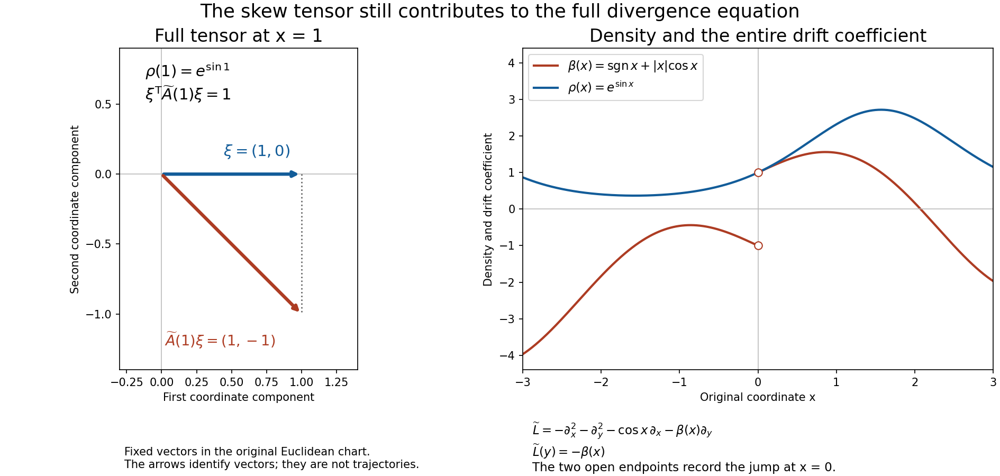

# From local energy to global divergence equations

A divergence equation can be meaningful before its solution has even one square-integrable derivative. Its positive energy then supplies that derivative, and local elliptic regularity supplies the next one. Global existence has a different difficulty: data may grow arbitrarily towards infinity or the boundary of an open set. We solve that difficulty by assigning a sufficiently large weight to the adjoint residual, with controlled changes on each previously treated compact region.

The argument permits complex coefficients and uses only local Lipschitz bounds. On a manifold it requires a density to specify divergence. We make that convention explicit and separate the existence theorem on noncompact components from the exact obstruction on compact components. No boundary condition or global integrability of the solution is imposed.

## 1. The equation and the tools used below

Let \(X\) be a Hausdorff, second-countable \(C^2\) manifold without boundary of dimension \(n\geq1\). An arbitrary open subset of \(\mathbb R^n\) is included. Fix a positive \(C^1\) density \(d\mu\) and a complex symmetric contravariant tensor \(A\), with locally Lipschitz coordinate entries. Symmetric means transpose-symmetric, \(a^{jk}=a^{kj}\), and does not mean Hermitian. We require

\[
 \operatorname{Re}\sum_{j,k}a^{jk}(x)\xi_k\xi_j>0
 \quad(0\ne\xi\in\mathbb R^n).                                  \tag{D1}
\]

Continuity and compactness make the lower bound uniform on each compact coordinate neighborhood. Since the real and imaginary parts of \(A\) are real symmetric matrices, (D1) also gives

\[
 \operatorname{Re}\sum_{j,k}a^{jk}z_k\overline{z_j}
       \geq \lambda\sum_j|z_j|^2\quad(z\in\mathbb C^n)            \tag{D2}
\]

on that neighborhood. Indeed the imaginary symmetric part contributes a purely imaginary number, and the real part acts separately on the real and imaginary parts of \(z\).

In a chart write \(d\mu=\rho(x)\,dx\). Our operator and its Hilbert adjoint on compactly supported tests are

\[
 \begin{split}
 Lu&=-\rho^{-1}\partial_j(\rho a^{jk}\partial_k u),\\
 L^*v&=-\rho^{-1}\partial_j(\rho\overline{a^{jk}}\partial_k v).
 \end{split}                                                     \tag{D3}
\]

Repeated indices in this lesson are summed from \(1\) to \(n\). The pairing \((u,v)_\mu=\int u\overline v\,d\mu\) is linear in its first entry. For Euclidean Lebesgue density, (D3) is \(D_j(a^{jk}D_k u)\), with \(D_j=-i\partial_j\), as in *Local inverses and distance-weighted elliptic estimates*.

For \(u\in L^2_{\mathrm{loc}}\), the equation \(Lu=f\) means

\[
                  (u,L^*\phi)_\mu=(f,\phi)_\mu
                    \quad(\phi\in C_c^2(X)).                     \tag{D4}
\]

This pairing is defined: \(L^*\phi\) is a bounded, compactly supported measurable function. In each chart (D4) agrees with distributional differentiation. More explicitly, for a Lipschitz multiplier \(b\), define

\[
                  b\partial_k u=\partial_k(bu)- (\partial_k b)u.
                                                                    \tag{D5}
\]

The right side belongs locally to \(H^{-1}\). Multiplication by \(\rho^{-1}\) and changes of charts in (D3) can be interpreted through (D4); no product of an arbitrary second-order distribution by a merely \(C^1\) function is being postulated. The equivalent chart equation is
\(-\partial_j(\rho a^{jk}\partial_k u)=\rho f\).

There is no need to choose an unmentioned smooth structure. Compactly supported \(C^2\) tests suffice for an operator of order two acting on \(L^2_{\mathrm{loc}}\). In a coordinate chart, approximation in \(H^2\) shows that an equation against smooth tests also holds against these \(C^2\) tests. Finite partitions of unity make the equivalence global. The coordinate changes are \(C^2\); their first derivatives and inverse first derivatives are bounded on compact subcharts, and their second derivatives are bounded there. The ordinary chain rule, first on smooth functions and then by Sobolev approximation, therefore preserves local \(H^1\) and \(H^2\). The transformation of \(A\) uses first derivatives of the coordinate map, so its new entries remain locally Lipschitz. The density has the usual absolute-Jacobian transformation. These facts make (D3) and (D4) intrinsic, including on a nonorientable manifold.

The following dependencies specify the base of the proofs.

* **Weak Lipschitz products.** Section 7 of [Local inverses and distance-weighted elliptic estimates](local-elliptic-coefficients.md) gives the weak Lipschitz product (D5) and the Friedrichs commutator bound, including convergence, on \(L^2\).
* **Weak elliptic regularity.** Section 8 of [Local inverses and distance-weighted elliptic estimates](local-elliptic-coefficients.md) proves that for a second-order elliptic principal operator with locally Lipschitz complex coefficients, \(u\in H^1_{\mathrm{loc}}\) and \(P_2u\in L^2_{\mathrm{loc}}\) imply \(u\in H^2_{\mathrm{loc}}\), with the local estimates proved there. Its quantitative estimate comes from Section 6 of [Local inverses and distance-weighted elliptic estimates](local-elliptic-coefficients.md).
* **Support continuation.** Sections 7–8 of [Curved weights and the directions in which support can end](support-continuation.md) prove continuation from a nonempty open subset of a connected domain for an \(H^1_{\mathrm{loc}}\) solution satisfying \(|P_2u|\leq C(|u|+|Du|)\), when every normal is admissible. Positive real part gives this admissibility also in dimension two: the path \(\operatorname{Re}p+it\operatorname{Im}p\), \(0\leq t\leq1\), remains elliptic and preserves the number of roots in each half-plane. No reality assumption at a point is needed in this positive-real-part case.
* **Sobolev and compactness facts.** The local \(L^2\) and weak-derivative calculus, smooth approximation in integer Sobolev spaces, boundedness of convolution on \(H^{-1}(\mathbb R^n)\), weak subsequential compactness of bounded Hilbert-space sequences, and compactness of bounded \(H^1\) sequences in \(L^2\), or bounded \(H^2\) sequences in \(H^1\), when their supports lie in one fixed compact interior region. The compactness statements transfer through a finite collection of charts. A weakly differentiable function with zero gradient on a connected open set is almost everywhere constant.
* **Manifold geometry.** Locally finite \(C^2\) partitions of unity and compactly supported \(C^2\) cutoffs on second-countable \(C^2\) manifolds; a positive \(C^1\) density and a \(C^1\) auxiliary Riemannian metric exist. Only their local coordinate bounds are used. A manifold is locally path connected and locally compact; its connected components are open, and each connected component is path connected. The compact-hull construction needed below is proved in this lesson.
* **Hilbert-space tools.** The complex Hahn–Banach theorem for a bounded linear functional on any linear subspace of a normed space, and the Riesz representation theorem for bounded linear functionals on a Hilbert space. The extension in the global proof is generally from an infinite-dimensional subspace; a finite-dimensional extension contract would not suffice. We also use completeness, the Cauchy–Schwarz inequality and the convergent geometric series for an operator of norm less than one.

The Hilbert-space tools have complete proofs in this course. Section 5 of [Banach estimates, quotient spaces and compact parameter arguments](banach-foundation-bridges.md) proves norm-preserving complex Hahn–Banach extension from any linear subspace, including one that is neither closed nor finite dimensional. Section 2.3 of [Spectral measures with the original operator domain retained](lower-bounded-spectral-calculus.md) proves Hilbert representation with the linear-first convention; Section 6.5 proves the operator geometric series and both inverse products. These proofs supply exactly the functional extension, represented vector and inverse used below.

The argument uses these stated entry results and the named prior lessons. No global solvability theorem is assumed.

## 2. Energy recovers the first derivative

**Local gain.** If \(u\in L^2_{\mathrm{loc}}(X)\) and \(Lu\in H^{-1}_{\mathrm{loc}}(X)\), then \(u\in H^1_{\mathrm{loc}}(X)\).

We first work in a Euclidean chart and multiply the equation by \(\rho\). Set \(b^{jk}=\rho a^{jk}\) and \(Q=-\partial_j(b^{jk}\partial_k)\). The entries of \(b\) are Lipschitz and their real part is uniformly positive on any fixed compact subchart. A \(C^1\) multiplier acts boundedly on local \(H^{-1}\): by duality its action is the product on \(H^1\), where the first-order product rule gives the bound. Thus \(Qu\in H^{-1}_{\mathrm{loc}}\).

Choose a smooth cutoff \(\chi\) supported in the chart. Distributional product rules, using (D5), give

\[
 Q(\chi u)=\chi Qu
 -\partial_j\bigl(b^{jk}(\partial_k\chi)u\bigr)
 -(\partial_j\chi)b^{jk}\partial_k u.                           \tag{D6}
\]

All terms on the right belong to \(H^{-1}\) after zero extension. For the last term put \(c^k=(\partial_j\chi)b^{jk}\) and write
\(c^k\partial_k u=\partial_k(c^ku)-(\partial_kc^k)u\). Both \(c^ku\) and \((\partial_kc^k)u\) are \(L^2\) with fixed compact support. The same observation justifies the product rule itself by local smooth approximation of \(u\) in \(L^2\).

It therefore suffices to treat \(v\in L^2(\mathbb R^n)\) supported in a compact set \(K_0\) inside the chart, with \(Qv\in H^{-1}(\mathbb R^n)\). Extend the coefficients by a cutoff on a slightly larger chart; they become globally Lipschitz and agree with the original positive matrix on a fixed compact neighborhood \(K\) of \(K_0\). Positivity of the extension outside \(K\) is irrelevant.

Let \(J_\epsilon v=v*\eta_\epsilon\), where \(\eta\in C_c^\infty\) has integral one. For small \(\epsilon\), \(v_\epsilon=J_\epsilon v\) is smooth with support in \(K\). Define the vector commutators

\[
 r_{\epsilon,j}=b^{jk}\partial_kv_\epsilon
                  -J_\epsilon(b^{jk}\partial_kv).
 \qquad
 \sup_{0<\epsilon<\epsilon_0}\|r_\epsilon\|_2\leq C\|v\|_2.     \tag{D7}
\]

The bound is exactly Section 7 of [Local inverses and distance-weighted elliptic estimates](local-elliptic-coefficients.md), applied to each entry and derivative; replacing \(D_k\) by \(\partial_k\) only multiplies by a scalar of modulus one. Hence

\[
 Qv_\epsilon=J_\epsilon(Qv)-\partial_jr_{\epsilon,j},
 \qquad
 \|Qv_\epsilon\|_{H^{-1}}
       \leq C\bigl(\|Qv\|_{H^{-1}}+\|v\|_2\bigr).               \tag{D8}
\]

In particular no derivative of a Lipschitz coefficient of order two has appeared. Choose a fixed box containing \(K\). The elementary compact-support Poincaré estimate
\(\|w\|_2\leq C_K\|\nabla w\|_2\) follows by integrating \(w\) along lines parallel to one coordinate axis from a face of that box, where its zero extension vanishes, and applying Cauchy–Schwarz. Integration by parts and (D2) now give

\[
 \begin{split}
 \|v_\epsilon\|_{H^1}^2
 &\leq C\|\nabla v_\epsilon\|_2^2
 \leq C\operatorname{Re}(Qv_\epsilon,v_\epsilon)_{dx}\\
 &\leq C\|Qv_\epsilon\|_{H^{-1}}\|v_\epsilon\|_{H^1}.
 \end{split}                                                     \tag{D9}
\]

If the last \(H^1\) norm is zero there is nothing to divide by; otherwise cancellation gives a uniform \(H^1\) bound. A sequence \(\epsilon\downarrow0\) has a weak \(H^1\) limit. Its strong \(L^2\) limit is \(v\), so uniqueness of distributional limits identifies the weak limit with \(v\). This proves \(v\in H^1\), and (D6) proves the local assertion. The argument also yields, for nested compact subcharts,

\[
 \|u\|_{H^1(K_0)}\leq C\bigl(\|Lu\|_{H^{-1}(V)}
                                      +\|u\|_{L^2(V)}\bigr),    \tag{D10}
\]

where \(K_0\Subset V\) and the local negative norm is taken after a fixed cutoff equal to one near \(K_0\). A finite chart cover supplies the same statement on \(X\). \(\square\)

## 3. The second derivative and the local estimate

**Regularity theorem.** Under (D1)–(D3), if \(u,f\in L^2_{\mathrm{loc}}(X)\) satisfy (D4), then \(u\in H^2_{\mathrm{loc}}(X)\).

By Section 2, \(u\in H^1_{\mathrm{loc}}\). In a chart the weak product rule gives

\[
 -a^{jk}\partial_j\partial_k u
   =f+\bigl(\partial_j a^{jk}
                 +a^{jk}\partial_j\log\rho\bigr)\partial_k u.   \tag{D11}
\]

The parenthesized coefficients are locally bounded. Its right side is now \(L^2_{\mathrm{loc}}\), and the left side is the weak nondivergence principal operator of Section 8 of [Local inverses and distance-weighted elliptic estimates](local-elliptic-coefficients.md), with \(m=p=2\). The real part of its principal symbol is positive in the sense (D1), so it is elliptic. That result gives \(H^2_{\mathrm{loc}}\), with no differentiability of the first-order coefficients beyond boundedness. Its quantitative local estimate yields

\[
 \|u\|_{H^2(K)}\leq C_{K,V}
       \bigl(\|Lu\|_{L^2(V)}+\|u\|_{H^1(V)}\bigr),
                         \qquad K\Subset V\Subset X,             \tag{D12}
\]

using finitely many nested coordinate neighborhoods when necessary. Here and below Sobolev norms on relatively compact regions may be defined using any fixed finite chart partition; the choices give equivalent norms. Applied after (D10) on a slightly larger region, (D12) also gives the familiar interior estimate with \(\|u\|_{L^2}\) on that larger region. The proof has established finiteness of \(H^1\) before using (D11), and finiteness of \(H^2\) before applying any estimate to its highest derivatives. \(\square\)

There is a useful support-preserving approximation consequence. If \(u\in H^2_{\mathrm{loc}}(X)\) has compact support \(K\) inside an open set \(V\), then there are \(u_\nu\in C_c^2(V)\), supported in one fixed compact subset of \(V\), with

\[
 u_\nu\longrightarrow u\text{ in }H^2,
 \qquad Lu_\nu\longrightarrow Lu\text{ in }L^2.                  \tag{D13}
\]

To construct them, choose a finite \(C^2\) partition near \(K\), subordinate to coordinate charts compactly contained in \(V\). Each partitioned function has compact support in its chart. Convolve its zero extension there and take the sum after returning to \(X\). The margin between the supports and chart boundaries keeps all approximants in \(V\). Chartwise mollification converges in \(H^2\), and multiplication by a \(C^2\) cutoff is bounded on \(H^2\). Finally (D3) expanded as in (D11) defines a bounded map from \(H^2\) to \(L^2\) on that fixed compact region. This proves the second convergence. The same statement holds with \(L^*\).

## 4. Fixed-support coercivity and continuation

For the next three sections assume that **every connected component of \(X\) is noncompact**. No uniform ellipticity constant on all of \(X\) is required.

For a fixed compact \(K\subset X\), choose a relatively compact neighborhood \(V\) of \(K\). Every \(v\in H^1(X)\) supported in \(K\) satisfies

\[
                  \|v\|_{H^1}\leq C_K\|dv\|_{L^2}.               \tag{D14}
\]

Here \(|dv|\) is measured by an auxiliary \(C^1\) metric and the norm can be computed within \(V\). For a proof, failure would give supported \(v_\nu\) with \(\|v_\nu\|_2=1\) and \(\|dv_\nu\|_2\to0\). This sequence is bounded in \(H^1\). Compactness on a finite chart cover gives a strongly \(L^2\) convergent subsequence with limit \(v\), of norm one, supported in \(K\), and with weak gradient zero. On every connected component it is constant. A component has points outside \(K\), since it is noncompact; near such a point the supported function is zero. Thus every constant is zero, a contradiction. A compact set meets only finitely many components because those components form an open cover of it. This also justifies the finite chart argument if \(X\) is disconnected.

The energy identity extends by \(H^1\) approximation from tests to supported \(H^1\) functions:

\[
 \operatorname{Re}(L^*v,v)_\mu
       =\operatorname{Re}\int\overline{a^{jk}}\partial_kv
                          \overline{\partial_jv}\,d\mu
       \geq c_K\|dv\|_2^2.                                     \tag{D15}
\]

When the first entry is in \(H^{-1}\), the pairing in (D15) denotes its dual action. Combining (D14) and (D15), and defining the negative norm by duality with \(H_0^1(V)\), gives

\[
 \|v\|_{H^1}\leq C_K\|L^*v\|_{H^{-1}(V)}
                   \leq C_K'\|L^*v\|_2.                        \tag{D16}
\]

The last inequality is used only when \(L^*v\in L^2\). For compactly supported \(C^2\) tests, (D12) and (D16) imply

\[
                   \|v\|_{H^2}\leq C_K''\|L^*v\|_2,
                         \qquad\operatorname{supp}v\subset K.   \tag{D17}
\]

The constants depend on a compact neighborhood of \(K\), its coefficient bounds, and the fixed norm conventions. Formula (D17) is precisely the compactness bound needed in the global construction.

The second ingredient is **support propagation**. If \(w\in H^1_{\mathrm{loc}}(U)\), \(U\subset X\) is connected and open, and \(L^*w=0\), then vanishing on a nonempty open subset of \(U\) implies \(w=0\) throughout \(U\). Indeed (D11), conjugating the principal coefficients, gives
\(|P_2w|\leq C|Dw|\) on every compact subchart. Its principal form has positive real part. Section 8 of [Curved weights and the directions in which support can end](support-continuation.md) verifies every normal using the positive-real-part path, and Section 7 of [Curved weights and the directions in which support can end](support-continuation.md) gives continuation. These are local statements, so coordinate neighborhoods propagate the conclusion along any path in \(U\). This checks the complex coefficients and the density term in the exact use of unique continuation.

## 5. Filling the bounded complementary components

For a compact set \(K\subset X\), define its filled hull by adjoining every connected component of \(X\setminus K\) whose closure in \(X\) is compact:

\[
 \mathcal H(K)=K\ \cup\!
    \bigcup_{\substack{C\text{ component of }X\setminus K\\
                              \overline C\text{ compact}}} C.    \tag{D18}
\]

We retain the assumption that \(X\) has no compact connected components. Then \(\mathcal H(K)\) is compact, and \(X\setminus\mathcal H(K)\) has no relatively compact connected component. We prove compactness rather than impose it as a further geometric condition.

Choose a relatively compact open neighborhood \(U\) of \(K\), with \(K\subset U\). Such a neighborhood is a finite union of precompact chart neighborhoods. Its boundary is compact and disjoint from \(K\). Cover \(\partial U\) by finitely many connected open neighborhoods \(W_1,\ldots,W_r\) disjoint from \(K\). Each \(W_i\) lies in one component of \(X\setminus K\), so at most \(r\) components of that complement meet \(\partial U\).

If a component \(C\) is relatively compact, the ambient connected component \(Y\) of \(X\) containing it must meet \(K\). Otherwise \(C=Y\), contradicting the noncompactness of \(Y\). If also \(C\not\subset U\), choose \(x\in C\setminus U\) and join \(x\) to a point of \(K\cap Y\) by a path in \(Y\). Up to its first meeting with \(K\), the path remains in \(C\). It must cross \(\partial U\) before meeting \(K\), since \(K\subset U\). Thus \(C\) is among the finitely many components just found. Consequently every component added in (D18) is contained either in \(U\) or in one of finitely many relatively compact components. Their closures together with \(\overline U\) form a compact set containing \(\mathcal H(K)\).

The hull is closed: its complement is the union of the other components of \(X\setminus K\), each open by local connectedness. Therefore the hull is compact. Those remaining components are exactly the components of its complement and none is relatively compact, by their selection. Notice that \(K\) need not have a smooth boundary, finitely many boundary components, or even nonempty interior.

We obtain a sequence of compact sets

\[
 K_j\subset\operatorname{int}K_{j+1},\qquad
 X=\bigcup_{j\geq1}K_j,\qquad
 X\setminus K_j\text{ has no relatively compact component}.    \tag{D19}
\]

Indeed choose a countable cover by precompact coordinate neighborhoods. Given \(K_j\), enclose it and the closures of the first \(j+1\) members of the cover in a precompact open set \(U_{j+1}\), and set \(K_{j+1}=\mathcal H(\overline U_{j+1})\). Start in the same way with the first neighborhood. The hull contains \(\overline U_{j+1}\), so \(K_j\) lies in its interior. The countable cover proves exhaustion. This construction uses no regular-value theorem and preserves the \(C^2\) setting. \(\square\)

## 6. Extending an adjoint weight without disturbing the interior

Fix \(f\in L^2_{\mathrm{loc}}(X)\) and an exhaustion (D19). Write \(\mathcal T(K)\) for the \(C_c^2(X)\) functions supported in \(K\). Suppose \(j\geq3\) and a continuous positive function \(M\) on \(X\) satisfies

\[
                    |(f,\phi)_\mu|\leq\|ML^*\phi\|_2
                          \quad(\phi\in\mathcal T(K_j)).         \tag{D20}
\]

For every \(\epsilon>0\) there is a continuous positive \(\widetilde M\) such that

\[
 \begin{gathered}
 \widetilde M\geq(1+\epsilon)M\text{ on }X,
 \qquad \widetilde M=(1+\epsilon)M\text{ on }K_{j-2},\\
 |(f,\phi)_\mu|\leq\|\widetilde M L^*\phi\|_2
                          \quad(\phi\in\mathcal T(K_{j+1})).
 \end{gathered}                                                   \tag{D21}
\]

**Proof.** Choose \(\chi\in C^2(X)\), \(0\leq\chi\leq1\), equal to zero on a neighborhood of \(K_{j-2}\) and equal to one outside \(\operatorname{int}K_{j-1}\). Set

\[
                      M_N=(1+\epsilon)M+N\chi,\qquad N\geq1.    \tag{D22}
\]

If no \(M_N\) satisfies the last line of (D21), choose a violating \(\phi_N\in\mathcal T(K_{j+1})\). Its pairing with \(f\) is nonzero; multiply it by the reciprocal of the conjugate of that pairing to arrange

\[
 (f,\phi_N)_\mu=1,\qquad \|M_NL^*\phi_N\|_2<1.                 \tag{D23}
\]

The positive minimum of \(M\) on \(K_{j+1}\) gives a uniform bound for \(\|L^*\phi_N\|_2\). Formula (D17) then bounds \(\phi_N\) in \(H^2\), all with support in that same compact set. Pass to a subsequence weakly convergent in \(H^2\) and strongly in \(H^1\), with limit \(\Phi\). The limit has support in \(K_{j+1}\), and \((f,\Phi)_\mu=1\), since \(f\) is square integrable there. The bounded coefficient formula for \(L^*:H^2\to L^2\) on a compact neighborhood gives weak \(L^2\) convergence of \(L^*\phi_N\) to \(L^*\Phi\). Since \(M\) is bounded on that neighborhood, weak lower semicontinuity gives

\[
                     \|(1+\epsilon)ML^*\Phi\|_2\leq1.          \tag{D24}
\]

On \(X\setminus K_{j-1}\), (D22) and (D23) give

\[
           \|L^*\phi_N\|_{L^2(X\setminus K_{j-1})}\leq N^{-1}.
                                                                    \tag{D25}
\]

Thus \(L^*\Phi=0\) on \(X\setminus K_{j-1}\). Every component \(C\) of this open set is not relatively compact. It cannot be contained in the compact set \(K_{j+1}\); hence \(C\setminus K_{j+1}\) is a nonempty open set. There \(\Phi=0\). Continuation from Section 4 gives \(\Phi=0\) throughout \(C\). This establishes

\[
                         \operatorname{supp}\Phi\subset K_{j-1}.
                                                                    \tag{D26}
\]

One must use continuation from an open zero set at this point: \(\Phi|_C\) need not have compact support relative to \(C\), since its support may approach \(\partial C\).

Since \(K_{j-1}\subset\operatorname{int}K_j\), approximation (D13) gives \(\psi_\nu\in\mathcal T(K_j)\) converging to \(\Phi\) in \(H^2\). It also gives \(ML^*\psi_\nu\to ML^*\Phi\) in \(L^2\), because \(M\) is bounded on the fixed approximation support. Passing to the limit in (D20) yields

\[
                 1=|(f,\Phi)_\mu|\leq\|ML^*\Phi\|_2
                                      \leq(1+\epsilon)^{-1},    \tag{D27}
\]

which is impossible. At least one \(M_N\) therefore works; take it as \(\widetilde M\). \(\square\)

The argument explains the two inner compact sets in (D21). The weight remains controlled on \(K_{j-2}\); the limiting adjoint solution is supported in \(K_{j-1}\); the extra margin to \(K_j\) permits approximation in the previously proved estimate.

**The weight step when compact components are present.** The implication (D20)–(D21) holds on any manifold satisfying (D1)–(D3) with an exhaustion (D19), even if compact connected components are present. A filled exhaustion does not itself exclude them. Each compact connected component \(Y\) must lie entirely in \(K_1\): otherwise a component of \(Y\setminus K_1\) would be a relatively compact component of \(X\setminus K_1\), contradicting (D19). There are finitely many such \(Y\), because they all meet the compact set \(K_1\) and the components of \(X\) are open. Their indicator functions \(1_Y\) belong to \(C_c^2(X)\). Testing (D20) with \(1_Y\) shows that \(\int_Y f\,d\mu=0\).

For any test \(\phi\), replace it by

\[
 \Pi\phi=\phi-\sum_{Y\text{ compact component}}
       \left(\frac{1}{\mu(Y)}\int_Y\phi\,d\mu\right)1_Y.
\]

For every \(r\geq1\), this operation preserves \(\mathcal T(K_r)\), the residual \(L^*\phi\), and the pairing \((f,\phi)_\mu\). Its image has mean zero on each compact component. The proof of (D14) applies to supported functions in this image: a limit with zero gradient is constant on each component, vanishes on each noncompact component by its support, and vanishes on each compact component by its mean. Therefore (D16)–(D17) hold for these projected functions. In the contradiction argument, project each violating test before imposing (D23). The projection leaves both quantities in (D23) unchanged, and its mean-zero conditions pass to the weak limit. The remaining steps (D24)–(D27) are unchanged; in particular, (D19) supplies the same nonempty open zero set on every complementary component. This proves the weight extension in its full filled-exhaustion setting. It does not construct an initial estimate for data of nonzero mean on a compact component.

## 7. Global existence on noncompact components

**Solvability theorem.** Assume (D1)–(D3) and that every connected component of \(X\) is noncompact. For every \(f\in L^2_{\mathrm{loc}}(X)\) there exist a continuous function \(M>0\), a function \(g\in L^2(X,d\mu)\) with \(\|g\|_2\leq1\), and \(u=Mg\in H^2_{\mathrm{loc}}(X)\) satisfying \(Lu=f\).

**Construction of the weight.** By Cauchy–Schwarz and (D16),

\[
 |(f,\phi)_\mu|\leq\|f\|_{L^2(K_3)}\|\phi\|_2
                  \leq C_3\|f\|_{L^2(K_3)}\|L^*\phi\|_2
                    \quad(\phi\in\mathcal T(K_3)).               \tag{D28}
\]

Thus a positive constant function \(M_3\) larger than the last coefficient establishes (D20) for \(j=3\). Choose positive numbers \(\epsilon_j\), \(j\geq3\), with \(\sum_j\epsilon_j<\infty\), for example \(\epsilon_j=2^{-j}\). Inductively use Section 6 to obtain \(M_{j+1}\) from \(M_j\). Put

\[
 P_3=1,\qquad P_j=\prod_{k=3}^{j-1}(1+\epsilon_k),
 \qquad N_j=P_j^{-1}M_j.                                        \tag{D29}
\]

The positive numbers \(P_j\) increase to a finite \(P\): use
\(\log(1+t)\leq t\) for \(t\geq0\). Moreover \(N_{j+1}\geq N_j\) everywhere and \(N_{j+1}=N_j\) on \(K_{j-2}\). On any fixed compact neighborhood this sequence is therefore eventually stationary. Its limit \(N\) is continuous and positive, since locally it is exactly one of the continuous positive functions \(N_j\). Set \(M=PN\). Equivalently, \(M_j\to M\) locally uniformly: after stationarity, only the scalar \(P_j\) is changing. In particular \(M\geq M_j\), and every compactly supported test belongs to \(\mathcal T(K_j)\) for some \(j\). We have proved

\[
                  |(f,\phi)_\mu|\leq\|ML^*\phi\|_2
                                   \quad(\phi\in C_c^2(X)).    \tag{D30}
\]

**Dual construction of the solution.** Let \(E\) be the linear subspace of \(L^2(X,d\mu)\) consisting of the vectors \(ML^*\phi\), \(\phi\in C_c^2(X)\). Define a complex linear functional on it by

\[
                  F(ML^*\phi)=(\phi,f)_\mu.                    \tag{D31}
\]

If two tests give the same vector in \(E\), their difference has zero right side in (D30), so (D31) is well-defined. Also \(|F(h)|\leq\|h\|_2\). Hahn–Banach extends \(F\) to \(L^2\) with norm at most one. Riesz representation gives \(g\in L^2\), \(\|g\|_2\leq1\), such that \(F(h)=(h,g)_\mu\). Conjugating (D31) now gives the correct pairing order:

\[
          (f,\phi)_\mu=(g,ML^*\phi)_\mu=(Mg,L^*\phi)_\mu.       \tag{D32}
\]

Since \(M\) is locally bounded, \(u=Mg\) belongs to \(L^2_{\mathrm{loc}}\); (D32) is its equation (D4). Section 3 supplies \(u\in H^2_{\mathrm{loc}}\). The earlier sentence that differentiation of \(M\) was not justified was too weak: the actual recursion gives a twice continuously differentiable weight, as the separately identified strengthening in Section14 proves. Regularity comes from the equation, even though the weight itself was only continuous. \(\square\)

The theorem gives existence for each datum. It does not assert uniqueness, a globally bounded inverse on unweighted \(L^2\), a solution satisfying prescribed boundary values, or a datum-independent choice of \(M\). These distinctions matter when this theorem is used as a local ingredient in a boundary or Fredholm problem.

## 8. The exact compact-component obstruction

The local regularity theorem applies on compact manifolds too. The unrestricted global existence assertion does not: on a compact connected component \(Y\), the test \(\phi=1\) has compact support in \(X\) and \(L^*1=0\). Thus a necessary condition is

\[
                              \int_Y f\,d\mu=0.                 \tag{D33}
\]

For the pure divergence operator (D3) this is also sufficient. We include the proof to identify the entire obstruction rather than merely give a counterexample.

Let \(H\) be the closed subspace of \(H^1(Y)\) with mean zero. On \(H\) the gradient norm is equivalent to the full \(H^1\) norm. Indeed failure of Poincaré would give a normalized sequence converging strongly in \(L^2\) to a constant of mean zero, exactly as in the proof of (D14), a contradiction. Define

\[
                  B(v,w)=\int_Y a^{jk}\partial_kv
                                      \overline{\partial_jw}\,d\mu.
                                                                    \tag{D34}
\]

Its boundedness follows from the bounded coefficients on \(Y\). Its real part satisfies \(\operatorname{Re}B(v,v)\geq c\|v\|_H^2\) for some \(c>0\). Fix any Hilbert norm on \(H\) equivalent to \(H^1\), with pairing linear first. Riesz representation in the second entry supplies a bounded operator \(T:H\to H\) with \((Tv,w)_H=B(v,w)\). Let \(\|T\|\leq C\), where \(C\geq c\). For \(t=c/C^2\),

\[
 \|(I-tT)v\|_H^2
 \leq(1-2tc+t^2C^2)\|v\|_H^2
 =(1-c^2/C^2)\|v\|_H^2.                                       \tag{D35}
\]

Thus \(I-tT\) has norm less than one (possibly zero), and the geometric series gives an inverse for \(T\). The bounded conjugate-linear functional \(w\mapsto(f,w)_\mu\) on \(H\) is represented by a vector \(z\in H\). Solve \(Tv=z\); then \(B(v,w)=(f,w)_\mu\) for every \(w\in H\). Any \(H^1\) test differs from an element of \(H\) by a constant. Both sides vanish on constants, the right side by (D33). Hence \(Lv=f\) on \(Y\), and Section 3 gives \(v\in H^2(Y)\).

If \(Lw=0\) on \(Y\), local regularity and compactness give \(w\in H^2(Y)\) whenever \(w\in L^2(Y)\). Its energy is zero, so (D2) implies \(dw=0\); it is constant. The same proof applies to \(L^*\). Consequently the adjoint obstruction is exactly the constants on each compact connected component, and the normalized solution there is unique.

We have proved the following complete form for a possibly disconnected manifold:

\[
 \begin{split}
 &\exists u\in H^2_{\mathrm{loc}}(X):Lu=f\\
 &\hspace{1em}\Longleftrightarrow\quad
 \int_Y f\,d\mu=0\text{ for every compact connected component }Y.
 \end{split}                                                     \tag{D36}
\]

For sufficiency solve separately on compact components by (D34)–(D35), and on noncompact components by Section 7. There are at most countably many components by second countability. Every compact subset meets only finitely many of them, so their componentwise solutions assemble to an \(H^2_{\mathrm{loc}}\) function. Necessity was (D33).

For Euclidean open sets no component is compact, so (D36) gives arbitrary-data solvability without an additional condition. For the manifold formulation, the noncompact-component convention or the obstruction in (D36) must be stated. An unqualified assertion of arbitrary-data solvability on every boundaryless manifold would be false, even for the Laplacian. This is a mathematical qualification of that formulation, independent of any unstated convention in a reference.

## 9. Worked models

**Example 1: a complex Lipschitz coefficient and rapidly growing data.** On \(\mathbb R\), take

\[
 a(x)=2+|x|+ix,\qquad \rho(x)=e^{\sin x},\qquad
 f(x)=e^{x^2}(1+i\sin x).                                       \tag{D37}
\]

The real part of \(a\) is at least two, but \(a\) is not differentiable at zero. Define

\[
 F(x)=\int_0^x\rho(s)f(s)\,ds,\qquad
 u(x)=-\int_0^x\frac{F(t)}{\rho(t)a(t)}\,dt.                     \tag{D38}
\]

These integrals are finite on every compact interval. Since \(F\) is continuously differentiable and \(1/(\rho a)\) is locally Lipschitz, \(u'=-F/(\rho a)\) is locally Lipschitz and \(u\in H^2_{\mathrm{loc}}\). Its flux is \(\rho a u'=-F\), so differentiating once gives \(-\rho^{-1}(\rho a u')'=f\), including across zero. No pointwise value of \(a'(0)\) is required. Arbitrary constants may be added both to \(F\) and to \(u\), producing the two local homogeneous degrees of freedom. The theorem accommodates the growth of \(f\) because it asks for local, rather than global, square integrability.

**Example 2: bounded in coordinates need not mean relatively compact.** Let \(X=\mathbb R^2\setminus\{0\}\) and \(K=\{x:1\leq|x|\leq2\}\). Its inner complementary component \(0<|x|<1\) is bounded in \(\mathbb R^2\) but is not relatively compact in \(X\): a sequence tending to the missing origin has no convergent subsequence in \(X\). The outer complementary component is also not relatively compact. Thus \(\mathcal H(K)=K\) in this manifold. The distinction explains why the support argument is expressed intrinsically, with compact closure in \(X\), rather than by a Euclidean size test. For any later compact \(K'\subset X\), the inner component has points outside \(K'\), as the continuation step requires.

**Example 3: mixed compact and noncompact components.** Let \(X=\mathbb R^2\sqcup\mathbb T^2\), use the standard densities, and choose \(A=(1+i)I\) on both components; both torus coordinates have period \(2\pi\). Give the plane the datum \(f_1(x)=1\), and the torus the datum \(f_2(\theta)=\cos\theta_1\). A solution is

\[
 u_1(x)=-\frac{x_1^2}{2(1+i)},\qquad
 u_2(\theta)=\frac{\cos\theta_1}{1+i}.                            \tag{D39}
\]

Each is locally \(H^2\); direct differentiation verifies the equation. Replacing \(f_2\) by \(1+\cos\theta_1\) makes its integral nonzero and destroys solvability on that component, while the plane equation remains solvable. A compact-component obstruction is a condition on that component's datum, not on the behavior at infinity of other components.

## 10. Problems and full solutions

**Problem 1.** On the line let \(a(x)=2+|x|\) and \(u(x)=|x|\). Compute \(-\partial_x(a\partial_xu)\) as a distribution. Verify that its local regularity is compatible with Section 2 but does not trigger Section 3.

**Solution.** Almost everywhere \(u'=\operatorname{sgn}x\), and
\(au'=2\operatorname{sgn}x+x\). Since the distributional derivative of \(\operatorname{sgn}x\) is \(2\delta_0\),

\[
                       -\partial_x(au')=-4\delta_0-1.           \tag{D40}
\]

The Dirac mass belongs to \(H^{-1}_{\mathrm{loc}}(\mathbb R)\). For instance, for a smooth compactly supported \(\psi\), integrate \((|\psi|^2)'\) from an endpoint beyond its support to zero; this gives \(|\psi(0)|^2\leq2\|\psi\|_2\|\psi'\|_2\leq\|\psi\|_{H^1}^2\). Evaluation therefore extends continuously to \(H^1\). Thus (D40) has the negative regularity needed for the first gain. In fact \(|x|\in H^1_{\mathrm{loc}}\). But \(u''=2\delta_0\) is not represented by an \(L^2\) function, so \(u\notin H^2_{\mathrm{loc}}\) near zero. The datum in (D40) is likewise not \(L^2_{\mathrm{loc}}\). The two stages of the theorem have different data assumptions, and this example distinguishes them.

**Problem 2.** Start with \(L=-\partial_x^2\), Lebesgue density, and the coordinate change \(y=F(x)=x+x^3\). Determine the transformed density and tensor coefficient and check the first-order term of the transformed operator.

**Solution.** Write \(x=G(y)=F^{-1}(y)\). Since \(F'=1+3x^2>0\), this is a global smooth coordinate change. The density and coefficient are

\[
 \rho_y(y)=\frac1{F'(G(y))},\qquad
 a_y(y)=F'(G(y))^2.                                             \tag{D41}
\]

Thus \(\rho_y a_y=F'\), with the right side evaluated at \(G(y)\). The divergence formula gives

\[
 -\rho_y^{-1}\partial_y(\rho_y a_y\partial_y)
           =-F'^2\partial_y^2-F''\partial_y.                    \tag{D42}
\]

Here \(\partial_y F'(G(y))=F''/F'\). The same result follows from \(\partial_x=F'\partial_y\), applied twice. If the density were omitted and one wrote \(-\partial_y(a_y\partial_y)\), the first-order coefficient would instead be \(-2F''\), giving a different operator. This is why a divergence formula with coordinate-dependent coefficients needs its density convention.

**Problem 3.** For a fixed real \(\kappa\), consider on \(\mathbb R^2\) the form \(q(\xi)=(1+i\kappa)\xi_1^2+(2-i\kappa)\xi_2^2\). Check the normal-root condition for \(N=e_2\), then explain why it holds for every real normal without choosing roots continuously over all normals.

**Solution.** For \(\xi=e_1\) the line polynomial is \((1+i\kappa)+(2-i\kappa)z^2\). Its two roots are opposite, nonzero numbers. Neither is real, since a real \(z\) would give real part \(1+2z^2>0\). Hence one lies in each half-plane and the roots are distinct. For arbitrary independent real \(\xi,N\), use
\(q_t=\operatorname{Re}q+it\operatorname{Im}q\), \(0\leq t\leq1\). The leading coefficient \(q_t(N)\) is nonzero and the line polynomial has no real root throughout the path. At \(t=0\) its real coefficients yield a nonreal conjugate pair. Continuity of the unordered pair of roots preserves the number in each half-plane, so the same is true at \(t=1\). When \(\xi\) is parallel to \(N\), the root corresponds to the zero argument and is excluded from the normal criterion. The path argument is pointwise in the chosen pair and requires no global root labeling.

**Problem 4.** Determine solvability of \(-u''=1\) on \(\mathbb R\) if the desired solution is (a) locally \(H^2\), (b) globally \(L^2\). Compare with the same equation on the circle. Explain what the global theorem actually supplies.

**Solution.** Integrating distributionally twice gives every solution on the line as
\(u(x)=-x^2/2+cx+d\), where \(c,d\in\mathbb C\). These functions are smooth and therefore locally \(H^2\). None is globally \(L^2\): its quadratic leading coefficient cannot be canceled by the affine part, so for sufficiently large \(|x|\), \(|u(x)|\geq |x|^2/4\). On the circle, integration against the constant test gives \(0=\int1\), an impossibility. Thus arbitrary-data local-Sobolev existence on a noncompact component gives neither unweighted global integrability nor arbitrary-data existence on a compact component. In the weighted representation \(u=Mg\), one may have \(g\in L^2\) precisely because the allowed \(M\) grows; boundedness of \(M\) was never asserted.

**Problem 5.** In the weight construction, replace \(\epsilon_j=2^{-j}\) by \(\epsilon_j=1/j\), \(j\geq3\). Show why the argument no longer produces a finite continuous weight on the previously treated interior. Does this refute the solvability theorem?

**Solution.** On \(K_1\) every step \(j\geq3\) satisfies the exact equality \(M_{j+1}=(1+1/j)M_j\), since \(K_1\subset K_{j-2}\). Hence there

\[
              M_j=M_3\prod_{k=3}^{j-1}\frac{k+1}{k}
                               =\frac j3M_3.                   \tag{D43}
\]

The initial weight is strictly positive, so this tends to infinity at every point of \(K_1\). Normalized weights still stabilize there, but the compensating scalar product does not have a finite limit. The argument therefore needs a bounded product of interior enlargement factors, supplied by summability of the positive \(\epsilon_j\). This failure concerns that choice of iterative construction. Choosing the summable sequence used in Section 7 proves the theorem and avoids the divergence.

**Problem 6.** Explain concretely why one cannot replace the filled exhaustion by an arbitrary compact exhaustion in the continuation step. Use the Laplacian on \(\mathbb R^2\) and a compact annulus.

**Solution.** Take \(K=\{1\leq|x|\leq2\}\) and a smooth radial function \(\Phi\) equal to one on \(|x|\leq1\) and zero on \(|x|\geq2\), with its transition strictly between these radii. Then \(\operatorname{supp}(-\Delta\Phi)\subset K\). Thus \(-\Delta\Phi=0\) on \(X\setminus K\), and \(\Phi\) has compact support. But \(\Phi\) is nonzero on the bounded complementary component \(|x|<1\). Continuation does not force zero there, because there is no nonempty open zero set within that connected component. The support conclusion \(\operatorname{supp}\Phi\subset K\) would be false. Filling the inner disk replaces \(K\) by \(\{|x|\leq2\}\), for which the support conclusion is correct. The failure occurs in the support inference, not in local regularity or the energy estimate.

## 11. The manifold geometry used by the equation

We prove all the geometry used in Section 1 on its original Hausdorff, second-countable \(C^2\) manifold without boundary and of dimension \(n\geq1\); the notation below retains those original objects. If \(X\) is empty, the empty partition has sum one at every point vacuously, the unique empty metric and density have all the stated positivity and regularity properties, every compact subset is empty and has zero cutoff, and there are no components. All the assertions therefore hold in that case. For the remaining construction assume \(X\) is nonempty. The proof uses the original coordinate compactness and finite scalar calculus; it does not select a smoother atlas.

### 11.1. Countable compact exhaustion from the original charts

Every point has a coordinate neighborhood and a smaller coordinate ball whose closed ball is contained in the coordinate image. Its inverse image is compact, since the inverse chart is continuous and the closed Euclidean ball is compact. It is closed in \(X\), since \(X\) is Hausdorff. Its interior is an open neighborhood of the point. This proves local compactness and gives an open cover by relatively compact coordinate balls.

Here is the countable-subcover argument used in the construction. Fix the given countable topological base. For each base member contained in some member of the cover, choose one such cover member. This gives at most countably many chosen members. Any point of the covered space belongs to a base neighborhood contained in a cover member, so belongs to one of the chosen members. The chosen family covers \(X\). This argument applies to every open cover, with no countability assumption on that cover.

Write the resulting relatively compact coordinate balls as \(V_1,V_2,\ldots\), allowing a finite list when it is finite. Put \(K_0=K_{-1}=\varnothing\). Choose \(K_1=\overline V_1\). Given compact \(K_j\), cover it by finitely many relatively compact coordinate balls and take the union of their compact closures together with the compact closures of the first \(j+1\) members of the original cover. Call this finite union \(K_{j+1}\). It is compact; the open balls covering \(K_j\) show \(K_j\subset\operatorname{int}K_{j+1}\). Including the first \(j+1\) original balls makes the interiors exhaust \(X\). In a finite cover, include every available member once the index exceeds its length; the same construction works, and may become constant at \(X\) if \(X\) is compact. Thus
\[
 K_j\subset\operatorname{int}K_{j+1},\qquad
 X=\bigcup_{j\geq1}\operatorname{int}K_j .
                                                               \tag{MG1}
\]
There is no connectedness requirement. Each compact subset of \(X\) lies in the interior of some \(K_N\), by a finite subcover of these increasing interiors.

Define the original compact shells and their open neighborhoods by
\[
 A_j=K_j\setminus\operatorname{int}K_{j-1},\qquad
 W_j=\operatorname{int}K_{j+1}\setminus K_{j-2}.
                                                               \tag{MG2}
\]
The shell is compact, and \(A_j\subset W_j\): it lies in \(\operatorname{int}K_{j+1}\), while \(K_{j-2}\subset\operatorname{int}K_{j-1}\) makes it disjoint from \(K_{j-2}\). Every point lies in some shell, by choosing the first index for which it belongs to \(K_j\).

### 11.2. Compactly supported \(C^2\) partition subordinate to any open cover

Let \(\mathcal O\) be the original open cover. For every point of \(A_j\), choose a coordinate ball with closed outer ball inside \(W_j\), inside one assigned member \(O\in\mathcal O\), and inside its original chart. Choose concentric coordinate balls of radii \(r,2r,3r\), with the closed radius-\(3r\) ball inside this open intersection. The radius-\(r\) balls cover \(A_j\); compactness selects finitely many, indexed by \(r'\in\{1,\ldots,N_j\}\). Denote the smaller balls by \(V_{j,r'}\) and the radius-\(3r\) balls by \(U_{j,r'}\). The chosen finite families together cover \(X\), and
\(\overline U_{j,r'}\subset W_j\cap O_{j,r'}\).
Empty shells need no balls.

This family is locally finite. If \(x\in\operatorname{int}K_N\), that same open set is a neighborhood meeting none of the \(U_{j,r'}\) with \(j\geq N+2\), because their \(W_j\)'s exclude \(K_{j-2}\supset K_N\). Only finitely many shells remain, and each has finitely many balls. This proves local finiteness on the original space, rather than assuming a paracompactness theorem.

To construct the needed coordinate functions, put
\[
 \theta(t)=
 \begin{cases}e^{-1/t},&t>0,\\0,&t\leq0,\end{cases}
 \qquad
 s(t)=\frac{\theta(t)}{\theta(t)+\theta(1-t)} .
                                                               \tag{MG3}
\]
For \(t>0\), each derivative of \(\theta\) is a finite polynomial in \(1/t\) times \(e^{-1/t}\), by induction using the product and chain rules. Every such expression tends to zero as \(t\downarrow0\): for each positive integer \(k\), the exponential series gives \(e^u\geq u^k/k!\), and choosing \(k\) larger than the polynomial degree proves the limit. Thus extension by zero makes \(\theta\) smooth with all derivatives zero at zero. The denominator in (MG3) is positive for every real \(t\); \(s\) is smooth, equals zero for \(t\leq0\), equals one for \(t\geq1\), and lies between zero and one.

In the original chart of a selected ball with center \(a\) and small radius \(r\), define
\[
 \beta_{j,r'}(x)
   =s\!\left(\frac{(2r)^2-|x-a|^2}{(2r)^2-r^2}\right).
                                                               \tag{MG4}
\]
It equals one on the closed radius-\(r\) ball, and is zero outside the radius-\(2r\) ball. Its support is compact inside \(U_{j,r'}\). Composing with the \(C^2\) chart and extending by zero gives a \(C^2\) function on \(X\): the support has an open neighborhood inside the chart, and the function is identically zero near every point outside that compact support. This retains the manifold's \(C^2\) structure and introduces no unmentioned smoother atlas.

Let \(I\) denote these countably many indices and put
\[
 S(x)=\sum_{i\in I}\beta_i(x),\qquad
 \phi_i(x)=\frac{\beta_i(x)}{S(x)},\qquad
 \sum_{i\in I}\phi_i(x)=1 .
                                                               \tag{MG5}
\]
Each sum is a finite sum on a neighborhood of each point by local finiteness. The inner balls cover \(X\), so \(S(x)\geq1\). The quotient is therefore \(C^2\). The \(\phi_i\)'s are nonnegative, their compact supports stay in the original assigned cover members, and their family is locally finite. Their exact derivatives in any original chart are
\[
 \begin{split}
 \partial_a\phi_i
 &=\frac{\partial_a\beta_i}{S}
       -\frac{\beta_i\partial_aS}{S^2},\\
 \partial_a\partial_b\phi_i
 &=\frac{\partial_a\partial_b\beta_i}{S}
 -\frac{(\partial_a\beta_i)(\partial_bS)
        +(\partial_b\beta_i)(\partial_aS)
        +\beta_i\partial_a\partial_bS}{S^2}
 +\frac{2\beta_i(\partial_aS)(\partial_bS)}{S^3}.
 \end{split}                                                   \tag{MG6}
\]
All sums and all denominator factors remain present. On a compact subchart only finitely many supports meet the compact set, so every derivative through order two has a finite supremum there. This proves precisely the subordinate locally finite \(C^2\) partition asserted by the original contract.

### 11.3. The original compact cutoff and positive local-radius minorant

If a compact \(K\subset X\) lies in an open \(O\), apply the partition construction to the cover \(\{O,X\setminus K\}\). A locally finite family meets a compact set in only finitely many members: cover the compact set by finitely many neighborhoods each meeting finitely many supports. Take the finite collection \(J\) of supports assigned to \(O\) that meet \(K\), and define \(\chi=\sum_{i\in J}\phi_i\). Then \(0\leq\chi\leq1\), \(\chi\in C_c^2(O)\), and its support is contained in the finite union of the selected original compact supports.

In fact \(\chi=1\) on a neighborhood of \(K\), not just on \(K\). Every unselected support is disjoint from \(K\): a support assigned to \(X\setminus K\) is contained there, and every other support disjoint from \(K\) was not selected. A locally finite union of closed sets is closed, because near each point that union is a finite closed union. The union of the unselected supports is therefore closed and misses \(K\). Its open complement is a neighborhood of \(K\); there every unselected \(\phi_i\) vanishes, so (MG5) gives \(\chi=1\). If \(K=\varnothing\), use \(\chi=0\). This proves every required compact cutoff.

There is also a useful proved consequence for the local radii used in the continuation and kernel constructions. Let \(R:X\to(0,\infty)\) have a positive lower bound on some neighborhood of every point, as does a positive lower-semicontinuous function. Choose such neighborhoods \(O_i\), with constants \(a_i>0\) for which \(R(x)\geq a_i\) on \(O_i\), and take the proved subordinate partition, assigning each support its original \(a_i\). Then
\[
 r(x)=\sum_i\phi_i(x)\frac{a_i}{2},\qquad
 0<r(x)\leq\frac{R(x)}2<R(x).
                                                               \tag{MG7}
\]
The sum is locally finite and \(C^2\), and at least one positive summand occurs at every point. Each term active at \(x\) has \(a_i\leq R(x)\), and summing with (MG5) proves the upper bound. No positive global lower bound or compactness of \(X\) is assumed.

### 11.4. Positive metric and the exact density transition

Take a locally finite partition as above subordinate to the original coordinate neighborhoods. In each such neighborhood with coordinates \(x_i^1,\ldots,x_i^n\), retain the coordinate metric
\(g_i=\sum_{a=1}^n dx_i^a\otimes dx_i^a\).
Its coefficients in another \(C^2\) chart \(y\) are \(C^1\), since
\[
 (g_i)_{ab}(y)
   =\sum_{c=1}^n
        \frac{\partial x_i^c}{\partial y^a}
        \frac{\partial x_i^c}{\partial y^b}.
\]
The chart derivative is invertible: the chain rule for the original chart and its \(C^2\) inverse gives both inverse matrix products. Hence \(g_i(v,v)=\sum_c|dx_i^c(v)|^2>0\) for every nonzero real tangent vector \(v\) in that neighborhood.

Extend each \(\phi_i g_i\) by zero and define \(g=\sum_i\phi_i g_i\). The compact support inside its chart makes each extension \(C^1\); local finiteness makes the sum \(C^1\). At a point and a nonzero tangent vector, some \(\phi_i\) is positive and its \(g_i(v,v)\) is positive, while all other terms are nonnegative. Thus \(g\) is a positive \(C^1\) Riemannian metric on the original manifold. It need not coincide with any metric already chosen in the divergence equation.

Write its matrix in coordinates \(x\) as \(G_x\), and keep the full density
\[
 d\mu_g=\sqrt{\det G_x(x)}\,|dx^1\cdots dx^n|.
                                                               \tag{MG8}
\]
The determinant is a finite polynomial in the matrix entries. It is positive for a positive real symmetric matrix: the real spectral theorem gives positive eigenvalues whose product is the determinant. The ordinary scalar square root is \(C^1\) on the positive axis, so the coefficient in (MG8) is positive and \(C^1\).

On an overlapping original chart \(y=\kappa(x)\), put \(J=Dx/Dy\). The tensor chain rule gives \(G_y=J^TG_xJ\), including both matrix factors in their displayed order. Taking determinants yields
\[
 \det G_y=(\det J)^2\det G_x,\qquad
 \sqrt{\det G_y}
   =|\det J|\sqrt{\det G_x}.
                                                               \tag{MG9}
\]
This is exactly the density transition factor. It patches the coefficients in (MG8) to a density, including orientation-reversing changes of coordinates and nonorientable manifolds. No sign of a determinant is chosen or discarded.

Every compact subchart has positive finite lower and upper bounds for this density coefficient, and finite bounds for its first derivatives. For the metric, the continuous function \(g_x(v,v)\) on the compact subchart times the original Euclidean unit sphere has a positive minimum and a finite maximum; its coefficient first derivatives also have finite suprema. These are precisely the local bounds used by the divergence chapter. The constructed density proves existence; the original separately fixed positive density \(\rho(x)\,dx\) in (D3) is retained, and is not silently replaced by \(\mu_g\). The same compactness argument gives local bounds for that original positive \(C^1\) coefficient.

### 11.5. Components and exact receiving scope

Coordinate balls are path connected: the inverse chart applied to the straight segment in the original ball gives a path between its points. They form a neighborhood base. Thus \(X\) is locally path connected. Local compactness was proved in Section 11.1.

A path component \(P\) is open: any point in it has a path-connected coordinate ball, and concatenation of its path with paths in that ball places the whole ball in \(P\). The other path components are open for the same reason. A path is connected, because any separation of its image pulls back to a separation of the interval; the interval's connectedness follows from completeness and the intermediate-value theorem. Consequently a path component is connected: it is the union of the connected images of paths through its fixed point, and a union of connected sets sharing that point cannot be separated.

The connected component through a point contains its path component. If it contained a second path component, its intersection with the first and with the union of the others would be a separation into two nonempty relatively open sets. This is impossible. Thus each connected component equals a path component, is open, and is path connected, exactly as the original contract states.

These proofs supply the geometry entry needed for the finite chart arguments in (D4)–(D10), the compact cutoff in the energy proof, the local metric and density bounds, the connected component alternatives and the exhaustion/partition steps in the global divergence construction. Section 12 separately proves nonlinear substitution for the completed coordinate measure and the exact weak Sobolev chain maps under the original \(C^2\) coordinates, together with their receiving density and adjoint formulas. The original contract's statement and the original \(\rho\), \(A\), operator signs and Hilbert pairing are unchanged.

For a \(C^r\) manifold, integer \(r\geq2\), this same proof gives \(C^r\) partitions, compact cutoffs and local-radius minorants, and a positive \(C^{r-1}\) metric and density. Every transition calculation uses exactly one derivative of the original \(C^r\) chart; every other step preserves its \(C^r\) regularity. For a smooth atlas this same construction is smooth at every order; local finiteness makes every derivative a finite sum.

## 12. The exact coordinate maps in the weak equation

The geometry in Section 11 supplies the original charts and cutoffs. This section supplies the analytic maps asserted in Section 1. Throughout, \(n\geq1\), \(F:U\to V\) is a \(C^2\) diffeomorphism between the original open subsets of \(\mathbb R^n\), \(G=F^{-1}\), and
\[
 P_{ai}(x)=\partial_{x_i}F^a(x),\qquad
 Q_{ia}(y)=\partial_{y_a}G^i(y),\qquad
 J_F(x)=|\det P(x)|,\quad J_G(y)=|\det Q(y)|.
                                                               \tag{CX1}
\]
The chain rule for the two actual inverse maps proves both matrix products and the full determinant identities:
\[
 \sum_aQ_{ia}(F(x))P_{aj}(x)=\delta_{ij},\quad
 \sum_iP_{ai}(G(y))Q_{ib}(y)=\delta_{ab},\quad
 J_G(F(x))J_F(x)=1,\quad J_F(G(y))J_G(y)=1.                       \tag{CX2}
\]
No orientation is chosen. Empty chart domains give empty maps and zero integrals; below the domains are nonempty.

### 12.1. Substitution for the completed original coordinate measures

The completed-measure substitution theorem also has a full proof for C¹ diffeomorphisms in [Singularities along a submanifold, Section 16.9](conormal-transmission.md#AN03-CN-COMPLEX-009). The argument below is an alternative proof using contraction on each original cell. The C² coordinate assumption enters the later second weak derivatives; the measure argument uses only C¹ regularity of both inverse maps. Its identity then enters the weak derivative, density, tensor and weak equation calculations in Sections 12.2–12.4.

We first prove the measure identity, rather than assume nonlinear substitution in a Sobolev approximation argument. An invertible real matrix \(T\) acts on the original completed coordinate measure by
\[
             \lambda_n(TE)=|\det T|\lambda_n(E).                 \tag{CX3}
\]
Here is a proof retaining the actual matrix factor. For a coordinate shear \(x_i\mapsto x_i+c x_j\), with \(i\ne j\), fix the other \(n-1\) coordinates. Every one-dimensional section is translated, so its length is unchanged. Integration of these sections, first for nonnegative Borel indicators, proves preservation of measure. A coordinate permutation preserves iterated product measure; reflection preserves length; multiplication of one coordinate by a nonzero scalar \(c\) multiplies length by \(|c|\). One-dimensional length has these properties directly from the original interval lengths and their completed-measure uniqueness. Gaussian elimination expresses every actual invertible \(T\) as a finite ordered product of these invertible elementary matrices: at column \(j\), choose a nonzero pivot in the remaining rows (failure would make the remaining columns linearly dependent), exchange its row with row \(j\), divide that row by the nonzero pivot, and subtract its multiples from every other row. After \(n\) steps the actual product \(E_N\cdots E_1T\) is \(I\). Thus \(T=E_1^{-1}\cdots E_N^{-1}\), in that order. Applying the preceding section calculations successively multiplies measure by \(\prod_{r=1}^N|\det E_r^{-1}|=|\det T|\). Every elementary factor and the determinant of the original \(T\) are present in this comparison.

A map with Lipschitz constant \(L\) in the coordinate maximum norm sends null sets to null sets on any cube on which that bound holds. Indeed a cube of side \(s\) maps into a cube of side \(Ls\), by centering at its center and bounding every image coordinate by \(Ls/2\). A null subset has cube covers with total original volume as small as desired; the image outer measure is at most \(L^n\) times that total. Cubes in these covers can be taken within a slightly larger fixed cube contained in the domain: intersect with the interior region and subdivide into sufficiently small dyadic cubes before taking the cover. Thus the bound applies to every covering cube. A \(C^1\) map is Lipschitz on a closed cube compactly inside its domain, by integrating its derivative on the segments of that cube and using the maximum row-sum matrix norm. Such cube interiors have a countable subcover of the domain. This proves local null-set transport for \(F\), and for \(G\), including both directions. In particular the images of all coordinate cube faces have measure zero.

Fix a closed cube \(C\Subset U\), and subdivide it into congruent small cubes \(C_k\), of side \(s\) and centers \(a_k\). Their images meet only along images of faces, since \(F\) is injective. Put \(T_k=DF(a_k)\). The inverse matrices \(T_k^{-1}\) have a uniform finite maximum row-sum bound: the cofactor formula has a nonvanishing determinant on the compact cube. Uniform continuity of \(DF\) gives numbers \(\epsilon_s\to0\), such that on each cell
\[
 \left\|T_k^{-1}\bigl(DF(x)-T_k\bigr)\right\|_\infty
 \leq\epsilon_s .
\]
In the following calculation retain \(F\) and \(T_k\) explicitly. Define the exact error
\[
 h_k(x)=T_k^{-1}\bigl(F(x)-F(a_k)\bigr)-(x-a_k).
\]
Then \(h_k(a_k)=0\), its Lipschitz constant on \(C_k\) is at most \(\epsilon_s\), and \(|h_k(x)|_\infty\leq\epsilon_s s/2\). Hence
\[
 F(C_k)\subset
 F(a_k)+T_k[-(1+\epsilon_s)s/2,(1+\epsilon_s)s/2]^n .
\]
For the reverse inclusion suppose \(\epsilon_s<1\), and fix
\(|z|_\infty\leq(1-\epsilon_s)s/2\). The map \(x\mapsto a_k+z-h_k(x)\) sends the closed original cell to itself and contracts distances by \(\epsilon_s\). Starting at any point, its consecutive differences are bounded by a geometric sequence. Completeness of the closed cube gives a limit; continuity gives a fixed point, and the contraction estimate makes it unique. At that point \(F(x)=F(a_k)+T_kz\). Thus
\[
 \begin{split}
 &F(a_k)+T_k[-(1-\epsilon_s)s/2,(1-\epsilon_s)s/2]^n
       \subset F(C_k),\\
 &|\det T_k|(1-\epsilon_s)^n s^n
       \leq\lambda_n(F(C_k))
       \leq|\det T_k|(1+\epsilon_s)^n s^n .
 \end{split}                                                   \tag{CX4}
\]
These inequalities use (CX3) with the entire original derivative matrix. Summing over the cells is valid because their boundary images are null. The continuous function \(J_F\) has Riemann sums \(\sum_k|\det T_k|s^n\) tending to its integral on \(C\): upper and lower step sums differ by at most its uniform oscillation times \(\lambda_n(C)\). Both factors \((1-\epsilon_s)^n\) and \((1+\epsilon_s)^n\) tend to one. Therefore
\[
              \lambda_n(F(C))=\int_C J_F(x)\,dx.               \tag{CX5}
\]

For completeness this cube calculation determines the full Borel measure. Define \(\nu(E)=\lambda_n(F(E))\) on Borel subsets of \(U\), and \(\sigma(E)=\int_E J_F\,dx\). The homeomorphism makes images Borel, and injectivity makes \(\nu\) countably additive. Both measures are finite on compactly contained cubes and give zero measure to all dyadic faces. Every open subset \(O\) of \(U\) is covered, off the countable union of those faces, by disjoint interiors of dyadic cubes with closure in \(O\). To see this without a maximal cube at infinity, take integer levels \(r=0,1,\ldots\). At level \(r\), choose all cells whose closure lies in \(O\) and whose interior has not already been selected at a preceding level. Dyadic nesting makes their interiors disjoint. Every point off the faces eventually lies in such a cell, because its distance from the complement is positive in some small neighborhood. Equation (CX5) and countable additivity show \(\nu(O)=\sigma(O)\).

Equality on open sets implies equality on Borel sets here as follows. Both measures are regular on a relatively compact open \(W\Subset U\). For \(\nu\), transport compact inner approximation and open outer approximation for the original coordinate measure through the homeomorphism \(F:W\to F(W)\). The image \(F(W)\) is bounded after replacing \(W\) by a relatively compact cube interior, so these approximations concern finite measure. For \(\sigma\), \(J_F\) is bounded above on the closure of that cube: the error of a coordinate-measure open or compact approximation is bounded by that supremum times the original measure error. Restricting to a cube interior gives regularity there for both measures. For a Borel subset \(E\) of that interior, the outer approximating relative open sets have equal measures for \(\nu\) and \(\sigma\); taking their infima gives equality on \(E\). Cover \(U\) by countably many relatively compact cube interiors, disjointizing that cover by removing the preceding members. The resulting Borel pieces remain subsets of individual interiors, so countable additivity gives equality for all Borel \(E\subset U\).

The previously proved null-set transport extends this equality to the completed coordinate measures: a completed-measurable set is a Borel set modified within a Borel null set, and its image has the corresponding Borel image and null modification. The inverse map gives the converse. Approximating nonnegative measurable functions by simple functions, and then using monotone convergence, proves the exact original substitution law
\[
 \int_V H(y)\,dy=\int_U H(F(x))J_F(x)\,dx                       \tag{CX6}
\]
for every nonnegative measurable \(H\), allowing \(+\infty\). Applying it to \(|H|\) gives equivalence of absolute integrability; the real and imaginary positive/negative parts then prove (CX6) for complex integrable \(H\). The analogous identity for \(G\) retains \(J_G\). Null sets in either chart are null in the other, so all compositions below are well-defined on actual almost-everywhere equivalence classes.

### 12.2. The full first and second weak derivative maps

Let \(u\in H^2_{\mathrm{loc}}(V)\), with the original complex-valued weak derivatives, and \(v=u\circ F\). For classical \(C^2\) functions the ordinary chain rule gives every term in
\[
 \begin{split}
 \partial_{x_i}v
  &=\sum_a P_{ai}(\partial_{y_a}u)\circ F,\\
 \partial_{x_i}\partial_{x_j}v
  &=\sum_{a,b}P_{ai}P_{bj}(\partial_{y_a}\partial_{y_b}u)\circ F
      +\sum_a(\partial_{x_i}P_{aj})(\partial_{y_a}u)\circ F .
 \end{split}                                                   \tag{CX7}
\]
The second sum is essential on the original \(C^2\) charts. With the original \(D_i=-i\partial_i\) the exact version is
\[
 \begin{split}
 D_i^xv&=\sum_aP_{ai}(D_a^yu)\circ F,\\
 D_i^xD_j^xv
 &=\sum_{a,b}P_{ai}P_{bj}(D_a^yD_b^yu)\circ F
       -i\sum_a(\partial_{x_i}P_{aj})(D_a^yu)\circ F .
 \end{split}                                                   \tag{CX8}
\]
No second derivative of \(u\), mixed term, or factor \(-i\) is suppressed.

Here are complete local bounds, including the original array multiplicities. For \(U_0\Subset U\), put \(V_0=F(U_0)\), \(m_F=\inf_{\overline U_0}J_F>0\), and
\[
 \begin{split}
 C_i&=\sum_a\sup_{\overline U_0}|P_{ai}|,\\
 C_{ij}&=\sum_{a,b}\sup_{\overline U_0}|P_{ai}P_{bj}|
                 +\sum_a\sup_{\overline U_0}|\partial_{x_i}P_{aj}|.
 \end{split}
\]
Use the full original integer norm
\(\|u\|_{H^k(V_0)}^2=\sum_{|\alpha|\leq k}\|D_y^\alpha u\|_{L^2(V_0)}^2\), \(k=0,1,2\).
Substitution with \(G\) gives
\(\|w\circ F\|_{L^2(U_0)}\leq m_F^{-1/2}\|w\|_{L^2(V_0)}\).
Apply this inequality to every summand in (CX8), and use that each original component norm is at most the full original array norm. Summing the squares over \(i\) and over \(i\leq j\), which includes each multiindex of order two exactly once, proves
\[
 \begin{split}
 \|u\circ F\|_{H^1(U_0)}
 &\leq m_F^{-1/2}\left(1+\sum_i C_i^2\right)^{1/2}
                   \|u\|_{H^1(V_0)},\\
 \|u\circ F\|_{H^2(U_0)}
 &\leq m_F^{-1/2}
       \left(1+\sum_i C_i^2+\sum_{i\leq j}C_{ij}^2\right)^{1/2}
                   \|u\|_{H^2(V_0)}.                           
 \end{split} \tag{CX9}
\]
Within each \(C_{ij}\), the entire ordered sum over \(a,b\) remains present, including both occurrences of a mixed derivative when its two indices differ. The norm on the left retains the original unordered multiindex count. These are bounds, not a replacement of either array.

To prove the weak assertion, choose a coordinate cutoff \(\eta\in C_c^\infty(V)\) equal to one on a neighborhood of \(\overline V_0\). The elementary Euclidean cutoff follows from the flat scalar function in (MG3), or from a finite sum of coordinate ball cutoffs. The full product rule is
\[
 D^\alpha(\eta u)=
   \sum_{\beta\leq\alpha}
       \binom{\alpha}{\beta}(D^\beta\eta)D^{\alpha-\beta}u,
       \qquad |\alpha|\leq2 .
\]
It holds weakly by the proved integration/product rules of Section 15 in [Banach estimates, quotient spaces and compact parameter arguments](banach-foundation-bridges.md). The zero extension of \(\eta u\) belongs to \(H^2(\mathbb R^n)\): it vanishes on an open neighborhood of the chart boundary, so integration against a global test introduces no boundary term. Original mollifiers give \(u_\epsilon=(\eta u)*\eta_\epsilon\to\eta u\) in the full \(H^2(\mathbb R^n)\) norm, by that lesson's support-preserving derivative and translation estimates. Each \(u_\epsilon\) is smooth; its pullback is \(C^2\). Apply (CX9) to the differences on \(U_0\). These pullbacks and both displayed derivative arrays converge in \(L^2(U_0)\). Integration by parts against any smooth compactly supported test passes to the limit, proving (CX7)--(CX8) for \(u\). The same proof with only first derivatives gives the \(H^1\) assertion; order zero is exactly (CX6). The inverse map \(G\) has the identical proof with \(P,J_F\) replaced by the actual \(Q,J_G\). Both compositions are the identity on the actual local equivalence classes, by (CX2) and null-set transport. Thus the original \(H^1_{\mathrm{loc}}\) and \(H^2_{\mathrm{loc}}\) chart spaces and their supports agree through the exact maps.

There is an exact negative-order map as well. For a local scalar distribution \(R_x\in H^{-1}_{\mathrm{loc}}(U)\), define its scalar coordinate representative by
\[
       \langle R_y,\psi\rangle
       =\langle R_x,J_F(\psi\circ F)\rangle,\qquad
                         \psi\in C_c^\infty(V).                 \tag{CX10}
\]
The right-hand test is compactly supported \(C^1\), and is admissible through the \(H^1\) extension of \(R_x\). Multiplication by any \(C^1\) coefficient \(b\) on the compact support is bounded on \(H^1\): the full rule
\(D_i(bw)=bD_iw-i(\partial_i b)w\) gives the bound with squared coefficient
\[
 \|b\|_\infty^2+
      \sum_i\bigl(\|b\|_\infty+\|\partial_i b\|_\infty\bigr)^2 .
\]
Together with (CX9) for \(H^1\), this bounds (CX10) on each compact subchart and proves \(R_y\in H^{-1}_{\mathrm{loc}}(V)\). The test map has compact support and is the \(H^1\) limit of smooth compact tests by the same cutoff and mollifier construction; hence it lies in the actual \(H_0^1\) test domain. For an \(L^2_{\mathrm{loc}}\) representative \(R_x=f_x\), (CX6) shows that \(R_y=f_x\circ G\), with precisely the factor \(J_F\) in its action. Applying the inverse test map introduces \(J_G\circ F\) and \(J_F\); their full product in (CX2) is one, so the two distribution maps are inverses. A density-valued distribution instead transforms by \(\langle F_*R,\psi\rangle=\langle R,\psi\circ F\rangle\); this second map also is bounded on \(H^{-1}_{\mathrm{loc}}\), but has a different test formula. The scalar and density-valued maps have both been constructed rather than identified by dropping a determinant.

### 12.3. The original density and contravariant tensor in the equation

Keep the density and coefficients fixed in (D1)--(D3), rather than substitute the auxiliary metric density. Their exact coordinate transforms are
\[
 \begin{split}
 \rho_y(y)&=\rho_x(G(y))J_G(y),\\
 a_y^{ab}(y)
  &=\sum_{i,j}P_{ai}(G(y))a_x^{ij}(G(y))P_{bj}(G(y)).
 \end{split}                                                   \tag{CX11}
\]
The first is positive \(C^1\), because \(G\) is \(C^2\), the original \(\rho_x\) is positive \(C^1\), and its nonzero determinant has locally constant sign. Each tensor entry is locally Lipschitz: \(G\) and \(P\circ G\) are \(C^1\) and have bounded derivatives on compact subcharts, and the original entries are locally Lipschitz. To check this directly, subtract a product at two points as
\[
 \begin{split}
 p(y)a(y)q(y)-p(z)a(z)q(z)
  &=[p(y)-p(z)]a(y)q(y)\\
  &\quad+p(z)[a(y)-a(z)]q(y)
             +p(z)a(z)[q(y)-q(z)] .
 \end{split}
\]
Every summand has one Lipschitz difference and two bounded factors. Sum this identity over the original \(i,j\) entries in (CX11); it retains every factor and proves the assertion.

The original transpose symmetry is preserved by the ordered product \(P A_xP^T\). For a real nonzero covector \(\zeta\) in the \(y\) chart, the real vector \(P^T\zeta\) is nonzero by (CX2), and
\[
 \operatorname{Re}\sum_{a,b}a_y^{ab}\zeta_b\zeta_a
 =\operatorname{Re}\sum_{i,j}
        a_x^{ij}\left(\sum_bP_{bj}\zeta_b\right)
                   \left(\sum_aP_{ai}\zeta_a\right)>0 .          \tag{CX12}
\]
On compact subcharts the minimum of \(|P^T\zeta|^2\) on the original unit sphere is positive. Thus an original local lower bound \(\lambda_x\) transfers to \(\lambda_x\) times that actual minimum. The density factor is still separate.

For \(w,\phi\in C_c^2(V)\), write \(w_x=w\circ F\), \(\phi_x=\phi\circ F\). The scalar substitution law, full chain rule and (CX11) give the entire energy equality
\[
 \begin{split}
 \int_U\sum_{i,j}a_x^{ij}\partial_{x_j}w_x
                         \overline{\partial_{x_i}\phi_x}\rho_x\,dx
 &=\int_U\sum_{i,j,a,b}
    a_x^{ij}P_{bj}P_{ai}
       (\partial_{y_b}w)\circ F
       \overline{(\partial_{y_a}\phi)\circ F}\rho_x\,dx\\
 &=\int_V\sum_{a,b}a_y^{ab}\partial_{y_b}w
                         \overline{\partial_{y_a}\phi}\rho_y\,dy .
 \end{split}                                                   \tag{CX13}
\]
In the last step the factors \(\rho_x\circ G\) and \(J_G\) form the original transformed density exactly. Neither a tensor derivative term nor a density factor was discarded.

Integration by parts in the original charts, which is valid for locally Lipschitz coefficients and compactly supported \(C^2\) tests by the proved weak product rule, identifies the left side of (CX13) with \((w_x,L_x^*\phi_x)_{\mu_x}\), and the right side with \((w,L_y^*\phi)_{\mu_y}\). After substitution this proves
\[
                 L_x^*(\phi\circ F)=(L_y^*\phi)\circ F
                     \quad\hbox{almost everywhere}.             \tag{CX14}
\]
Indeed both sides are bounded and compactly supported on the relevant subcharts; testing their difference against all \(w_x\in C_c^2(U)\) forces that difference to vanish. Such tests include every smooth compactly supported coordinate test; the positive density may be divided out using its local lower bound and the \(L^2\) density of those tests. Every \(C_c^2(U)\) is \(w\circ F\) for \(w=w_x\circ G\in C_c^2(V)\), so no test class was omitted.

For an arbitrary original \(u_x,f_x\in L^2_{\mathrm{loc}}(U)\), put \(u_y=u_x\circ G\), \(f_y=f_x\circ G\). Equations (CX6) and (CX14) give the exact receiving identity
\[
 (u_y,L_y^*\phi)_{\mu_y}
  =(u_x,L_x^*(\phi\circ F))_{\mu_x}
  =(f_x,\phi\circ F)_{\mu_x}
  =(f_y,\phi)_{\mu_y}.                                          \tag{CX15}
\]
Thus the original weak equation (D4) holds in one chart precisely when it holds in the other. This proves the original intrinsic operator and its actual \(L^2\) test domain without multiplying an arbitrary second-order distribution by a \(C^1\) function. For \(u\in H^1_{\mathrm{loc}}\), the same equality follows from (CX13) by the proved approximation and energy bounds; the scalar negative-order map is exactly (CX10). Orientation-reversing charts retain the absolute determinants throughout.

### 12.4. Gluing the actual measures, supports and finite chart norms

The positive \(C^1\) density now defines a completed measure on the original \(C^2\) manifold. Choose the locally finite coordinate partition \(\phi_i\) proved in Section 11. In chart \(x_i\) with coefficient \(\rho_i\), set for a Borel \(E\subset X\)
\[
 \mu(E)=\sum_i\int_{x_i(E\cap U_i)}
       \phi_i(x_i^{-1}(z))\rho_i(z)\,dz .                        \tag{CX16}
\]
Each summand is a Borel measure, and nonnegative countable sums preserve countable additivity. In any one chart, apply (CX6) and (CX11) to the intersections with \(U_i\). Each summand becomes the integral there of \(\phi_i\rho\), with its full absolute determinant. Summing and using the locally finite identity \(\sum_i\phi_i=1\) proves that (CX16) is exactly \(\rho\,dx\) on that chart. This also proves independence of the chosen partition. Its completion agrees with the local completed coordinate measures: on relatively compact subcharts \(\rho\) has positive lower and finite upper bounds, so its null sets are exactly the original coordinate null sets. The proved bidirectional chart null transport patches this assertion over the countable cover. Each compact set has finite measure, because it meets only finitely many partition supports and each corresponding coordinate integral has bounded coefficient and compact support. The separately chosen original density has been used everywhere.

A compactly supported \(H^2\) function may now be partitioned in its actual charts. For each \(C^2\) partition function the full weak product formula, for every \(|\alpha|\leq2\), is
\[
 D^\alpha(\phi_i u)=
   \sum_{\beta\leq\alpha}\binom{\alpha}{\beta}
                   (D^\beta\phi_i)D^{\alpha-\beta}u.             \tag{CX17}
\]
It follows by the first-order product rule and its repeated application; for \(\alpha=e_a+e_b\) this retains both first-derivative products, with coefficient two when \(a=b\). All derivatives of \(\phi_i\) through order two are bounded on the fixed compact support. The squared original multiindex norm is bounded by the sum over \(|\alpha|\leq2\) of the squared constants
\(\sum_{\beta\leq\alpha}\binom{\alpha}{\beta}\|D^\beta\phi_i\|_\infty\),
times the full original \(H^2\) norm. Zero extension within each compactly supported chart introduces no boundary term. Mollification of those extensions gives smooth coordinate approximants; composing with the actual \(C^2\) inverse charts and summing the finitely many pieces gives \(C_c^2(X)\) approximants in the full chart \(H^2\) norm. The supports stay in the chosen compact neighborhood because each original cutoff support has a positive margin to its chart boundary. The order-one version gives the corresponding \(H^1\) approximation.

For two fixed finite chart partitions near a compact set, apply (CX17) to their products on overlaps and (CX9) to each actual transition. If \(b_{ji}\) is the product of these displayed finite product and transition bounds for overlap \((j,i)\), and \(r_i\) is the \(H^2\) norm of original piece \(i\), the new piece \(j\) has norm at most \(\sum_i b_{ji}r_i\). Cauchy--Schwarz and summing over \(j\) give the full comparison
\[
       \sum_j\left(\sum_i b_{ji}r_i\right)^2
          \leq\left(\sum_{j,i}b_{ji}^2\right)\sum_i r_i^2.        \tag{CX18}
\]
Reverse the two partitions and use the actual inverse transitions to obtain the opposite bound. This proves equivalence of the finite chart norms used in (D10)--(D17), retaining every overlap, derivative and determinant constant rather than replacing the original norm. It also proves the stated support-preserving \(H^2\) part of (D13).

Finally on its fixed compact support the original formula for \(L\) expands to
\[
 Lu=-\sum_{j,k}a^{jk}\partial_j\partial_k u
       -\sum_{j,k}\bigl(\partial_j a^{jk}
                  +a^{jk}\rho^{-1}\partial_j\rho\bigr)\partial_k u .
                                                               \tag{CX19}
\]
Every coefficient on the right is locally bounded. The triangle inequality bounds its \(L^2\) norm by
\[
 \sum_{j,k}\|a^{jk}\|_\infty\|\partial_j\partial_k u\|_2
 +\sum_{j,k}
   \bigl(\|\partial_j a^{jk}\|_\infty
       +\|a^{jk}\|_\infty\|\rho^{-1}\partial_j\rho\|_\infty\bigr)
          \|\partial_k u\|_2 .
\]
Thus the constructed full \(H^2\) approximation implies convergence of \(Lu_\nu\) to \(Lu\) in \(L^2\), with all original density derivatives and both signs present. Conjugating the actual \(a^{jk}\) gives the same conclusion for \(L^*\). This supplies the exact coordinate and approximation maps used in (D4), (D10)--(D13) and the weighted adjoint argument. Section 13 gives separate complete proofs of the Euclidean compactness and zero-gradient assertions and proves their actual finite-chart transfer.

## 13. The full Sobolev and compactness proofs used by the equation

We prove every Sobolev and compactness fact stated in Section 1, keeping the original complex functions, Hilbert product, differential operators, kernel scales, supports, coordinate maps and chosen density. No positivity or reality is imposed on the mass-one smoothing kernel.

The complete entry bases are Section 15 of [Banach estimates, quotient spaces and compact parameter arguments](banach-foundation-bridges.md), Section 2.3 of [Spectral measures with the original operator domain retained](lower-bounded-spectral-calculus.md), Sections 13.7--13.10 of [Detecting regularity without choosing coordinates](geometric-microlocal-calculus.md), and Sections 11--12 of this lesson. They provide the actual completed measures, integration, norm completeness, derivative approximation, Hilbert representation, distribution convolution and original coordinate formulas used below.

### 13.1. A weak subsequence in the original Hilbert space

Let \(H\) be any complex Hilbert space, with \((u,v)\) linear in \(u\), and let the original sequence satisfy \(\|u_j\|\leq M<\infty\). No separability of \(H\) is required. If every \(u_j\) is zero, the assertion holds with the original sequence and limit zero.

Construct orthogonal nonzero residuals without changing their lengths. At stage \(k\), choose the smallest index \(m_k\) whose vector is not in the span of the preceding residuals, and set
\[
 r_k=u_{m_k}
       -\sum_{\ell<k}\frac{(u_{m_k},r_\ell)}{\|r_\ell\|^2}r_\ell .
                                                               \tag{HS1}
\]
Before the first stage that span is \(\{0\}\). If no such index remains, stop; then every original vector belongs to the finite span constructed. Otherwise the \(m_k\)'s strictly increase, and every \(u_j\) belongs to some finite span: after \(m_k\geq j\), every earlier index has either been selected or has an exactly zero residual. For every \(v\in H\), orthogonality gives the full residual identity
\[
 \left\|v-\sum_{k\leq N}
                \frac{(v,r_k)}{\|r_k\|^2}r_k\right\|^2
       +\sum_{k\leq N}\frac{|(v,r_k)|^2}{\|r_k\|^2}
       =\|v\|^2 .                                               \tag{HS2}
\]
Indeed expansion of the square cancels both cross pairings with each selected residual, while pairings between different residuals are zero. Thus the scalar series is bounded and the vector series is Cauchy by the same identity applied to its finite tails. Write its limit as \(P v\). For each residual, \((v-Pv,r_k)=0\), hence \(v-Pv\) is orthogonal to every original \(u_j\).

For each \(k\), \((u_j,r_k)\) lies in the closed complex disk of radius \(M\|r_k\|\). It has a convergent subsequence: repeatedly divide a containing closed square into four closed squares and retain one containing infinitely many values; choose increasing indices in those nested squares. Their diameters tend to zero, so real completeness supplies a single limit, also in the disk. Apply this construction successively to the countably many residuals. Choosing the \(\ell\)-th index from the \(\ell\)-th nested subsequence, larger than its predecessor, gives one subsequence \(u_{j_\ell}\) for which
\[
 (u_{j_\ell},r_k)\longrightarrow c_k\quad\hbox{for every }k,
 \qquad
 \sum_{k\leq N}\frac{|c_k|^2}{\|r_k\|^2}\leq M^2.                \tag{HS3}
\]
The inequality is the limit of the finite inequality (HS2) for the original vectors. Completeness therefore defines
\[
 z=\sum_k\frac{c_k}{\|r_k\|^2}r_k,\qquad
 \|z\|^2=\sum_k\frac{|c_k|^2}{\|r_k\|^2}\leq M^2.                \tag{HS4}
\]
Finite stopping uses the corresponding finite sum. For an arbitrary original \(v\in H\), its orthogonal residual contributes zero to its pairings with both \(u_{j_\ell}\) and \(z\). The finite part of \(Pv\) converges by (HS3); Cauchy--Schwarz bounds the rest by
\[
 \left|\left(u_{j_\ell}-z,\,
          \sum_{k>N}\frac{(v,r_k)}{\|r_k\|^2}r_k\right)\right|
 \leq 2M
       \left(\sum_{k>N}\frac{|(v,r_k)|^2}{\|r_k\|^2}\right)^{1/2}
       \longrightarrow0.                                     \tag{HS5}
\]
Taking \(N\) large and then \(\ell\) large proves \((u_{j_\ell},v)\to(z,v)\) for every \(v\). Hilbert representation identifies these pairings with all continuous linear functionals. This is a weakly convergent subsequence in the actual ambient Hilbert space. Every zero residual, length and original vector was accounted for. \(\square\)

### 13.2. The original negative Sobolev dual and convolution

Use
\[
 (h,\phi)_{H^1}=(h,\phi)_{L^2}
                   +\sum_{i=1}^n(D_i h,D_i\phi)_{L^2},\qquad
 \|h\|_{H^1}^2=\|h\|_2^2+\sum_i\|D_i h\|_2^2.                 \tag{HS6}
\]
Completeness and density are LP16--LP19. The anti-dual convention compatible with the energy equation is a continuous conjugate-linear action \(R[\phi]\) on \(H^1\), with norm
\(\|R\|_{H^{-1}}=\sup_{\|\phi\|_{H^1}\leq1}|R[\phi]|\).
Its linear distribution pairing is exactly
\(\langle R,\psi\rangle=R[\overline\psi]\).
For an \(L^2\) function the action is \(\int R\overline\phi\).
Apply the proved Hilbert representation to the linear functional
\(\phi\mapsto\overline{R[\phi]}\). There is a unique \(h\in H^1\) with
\[
 R[\phi]=(h,\phi)_{H^1},\qquad
 \|h\|_{H^1}=\|R\|_{H^{-1}},\qquad
 R=h+\sum_iD_i(D_i h)
       =h-\sum_i\partial_i^2h\quad\hbox{distributionally}.       \tag{HS7}
\]
To verify the sign, linear distribution differentiation gives
\(\langle D_i f,\psi\rangle=-\langle f,D_i\psi\rangle
=i\int f\partial_i\psi\).
With \(\psi=\overline\phi\) this is \((f,D_i\phi)\). Applying it to \(f=D_i h\) gives precisely the \(i\)-th positive summand in (HS6). Thus no derivative or conjugation convention has changed.

For arbitrary \(f_0,\ldots,f_n\in L^2\), the distribution \(f_0+\sum_iD_i f_i\) extends to this anti-dual, and finite Cauchy--Schwarz gives
\[
 \left\|f_0+\sum_iD_i f_i\right\|_{H^{-1}}
       \leq\left(\|f_0\|_2^2+\sum_i\|f_i\|_2^2\right)^{1/2}.     \tag{HS8}
\]
For (HS7) the right side is exactly \(\|h\|_{H^1}\). This proves a representation, rather than assuming an \(L^p\) dual theorem.

Let \(J_\epsilon f=\eta_\epsilon*f\), with the actual compact smooth, possibly complex kernel. Its \(L^2\) adjoint has the complete kernel
\[
 \eta_\epsilon^*(x)=\overline{\eta_\epsilon(-x)},\qquad
 (J_\epsilon^*\phi)(y)
       =\int\overline{\eta_\epsilon(t)}\,\phi(y+t)\,dt .          \tag{HS9}
\]
Absolute Fubini proves the adjoint identity first on compact tests; Young and density extend it to \(L^2\). Each \(D_i\) commutes with convolution by LP19. Young on every original component in (HS6) consequently gives
\[
 \|J_\epsilon^*\phi\|_{H^1}
       \leq\|\eta\|_1\|\phi\|_{H^1},\qquad
 (J_\epsilon R)[\phi]=R[J_\epsilon^*\phi],\qquad
 \|J_\epsilon R\|_{H^{-1}}\leq\|\eta\|_1\|R\|_{H^{-1}}.          \tag{HS10}
\]
Changing variables \(t=\epsilon s\) retains the factor \(\epsilon^{-n}\epsilon^n\), giving \(\|\eta_\epsilon\|_1=\|\eta\|_1\), not an assumed value one. In the linear-test convention the test operator is
\(\psi\mapsto\int\eta_\epsilon(t)\psi(\,\cdot+t)\,dt\).
Indeed its complex conjugate is (HS9) applied to \(\overline\psi\). This also identifies the construction with the compact-factor distribution convolution GC1--GC24.

Using the exact representation (HS7), derivative commutation and (HS8) prove
\[
 \begin{split}
 J_\epsilon R-R
  &=(J_\epsilon h-h)
           +\sum_iD_i(J_\epsilon D_i h-D_i h),\\
 \|J_\epsilon R-R\|_{H^{-1}}
  &\leq\left(\|J_\epsilon h-h\|_2^2
              +\sum_i\|J_\epsilon D_i h-D_i h\|_2^2\right)^{1/2}
       \longrightarrow0.                                    
 \end{split} \tag{HS11}
\]
The last limit is LP14 for all \(n+1\) original \(L^2\) components. The sole mass assumption is \(\int\eta=1\).

The smooth output has the exact point formula
\(J_\epsilon R(x)=R[\overline{\eta_\epsilon(x-\cdot)}]\).
Translation and differentiation of this compact test are continuous in \(H^1\), by its complete derivative array and dominated convergence. The dual bound therefore permits every \(x\)-derivative. For every ordinary multiindex \(\alpha\),
\[
 |\partial_x^\alpha J_\epsilon R(x)|
 \leq\|R\|_{H^{-1}}
 \left(\epsilon^{-n-2|\alpha|}\|\partial^\alpha\eta\|_2^2
       +\sum_i\epsilon^{-n-2|\alpha|-2}
                     \|D_i\partial^\alpha\eta\|_2^2\right)^{1/2}.
                                                               \tag{HS12}
\]
No derivative scale was omitted. Its support is contained in
\(\operatorname{supp}R+\epsilon\operatorname{supp}\eta\):
a compact test supported outside this closed sum has its transformed test supported away from \(\operatorname{supp}R\), by (HS9) and its exact sign. Hence the distribution pairing there is zero. The sum is closed because the second set is compact: any convergent sequence of sums has a subsequence with convergent kernel components, leaving a limit in the closed first set. \(\square\)

### 13.3. Compactness for the fixed original interior support

Let \(\Omega\subset\mathbb R^n\) be open, \(K\Subset\Omega\) compact, and let the original \(u_j\in H^1(\Omega)\) have distributional support in \(K\) and \(\|u_j\|_{H^1(\Omega)}\leq M\). If \(K\) is empty, all vectors are zero. A cutoff equal to one near \(K\) shows their zero extensions belong to \(H^1(\mathbb R^n)\) with exactly the same function and derivative norms: LP18 and its zero-extension test proof show that the cutoff derivative terms are supported away from the original function, hence zero. Distribution derivatives also vanish off \(K\). Thus no boundary assumption on \(\Omega\) was introduced.

For a smooth compact function the segment integral, scalar Cauchy--Schwarz, integration and translation give
\[
 \|\tau_h u-u\|_2
       \leq |h|\left(\sum_i\|\partial_i u\|_2^2\right)^{1/2}
       =|h|\left(\sum_i\|D_i u\|_2^2\right)^{1/2}.              \tag{HS13}
\]
Here \(\tau_h u(x)=u(x-h)\); differentiating the segment \(x-th\) contributes the original minus sign, whose modulus is used only in the inequality. Specifically its squared integral is at most
\(|h|^2\int_0^1|\nabla u(x-th)|^2dt\).
LP19 approximates every \(H^1\) input in the original full norm, and translations preserve each \(L^2\) norm, so (HS13) passes to every input.

Put \(m_1(\eta)=\int|t|\,|\eta(t)|dt\). Minkowski, the exact mass one and (HS13) give
\[
 \|J_\epsilon u-u\|_2
   \leq\epsilon m_1(\eta)
               \left(\sum_i\|D_i u\|_2^2\right)^{1/2}
   \leq\epsilon m_1(\eta)M .                                  \tag{HS14}
\]
This is uniform in the original sequence, with the actual first moment.

For fixed \(\epsilon>0\), Cauchy--Schwarz in the convolution integral gives
\[
 \|J_\epsilon u\|_\infty
       \leq\epsilon^{-n/2}\|\eta\|_2M=:B_\epsilon,\qquad
 \|\nabla J_\epsilon u\|_\infty
       \leq\epsilon^{-n/2-1}
             \left(\sum_i\|\partial_i\eta\|_2^2\right)^{1/2}M
       =:L_\epsilon .                                        \tag{HS15}
\]
The output support is in \(K+\epsilon\operatorname{supp}\eta\). Choose one bounded coordinate box \(Q=\prod_i[a_i,b_i]\), with positive side lengths, containing these supports for \(0<\epsilon\leq\epsilon_0\) in its interior. Its full volume is \(|Q|=\prod_i(b_i-a_i)\).

There are finite \(L^2\) nets for the outputs at fixed \(\epsilon\). Subdivide each original side into \(N_i\) equal intervals of length \(h_i=(b_i-a_i)/N_i\leq h\). On each resulting cell choose its center. Quantize the real and imaginary parts of the output value there to multiples of \(\delta>0\), using the finite range
\(\{-\lceil B_\epsilon/\delta\rceil\delta,\ldots,
\lceil B_\epsilon/\delta\rceil\delta\}\).
Nearest choices have complex error at most \(\sqrt2\delta\). The finite family of all cellwise constant functions using these choices, zero outside \(Q\), has error
\[
 \|J_\epsilon u-v_{\epsilon,h,\delta}\|_2
 \leq |Q|^{1/2}
        \left(L_\epsilon\Big(\sum_i h_i^2\Big)^{1/2}
                           +\sqrt2\delta\right)
 \leq |Q|^{1/2}(L_\epsilon\sqrt n\,h+\sqrt2\delta).             \tag{HS16}
\]
Cell faces are null by LM1--LM6. All cell volumes and both real components are included.

For any \(r>0\), choose \(\epsilon\) with the first bound (HS14) less than \(r/2\), then \(h,\delta\) with (HS16) less than \(r/2\). This is a finite radius-\(r\) net for the original sequence in \(L^2\). Repeated finite covers at radii \(2^{-k}\), retaining an infinite subset inside one ball at each step and choosing increasing original indices, give a Cauchy subsequence: any two sufficiently late terms have distance at most \(2^{1-k}\). LP10 supplies its \(L^2\) limit. That limit is zero outside \(K\), since the \(L^2\) norm there is bounded by its distance from each original term. The proof establishes the fixed-support compact inclusion into \(L^2\) without a boundary regularity or equicontinuity theorem being imported. If a limit in \(H^1\) is needed, (HS1)--(HS5) give a further weak \(H^1\) subsequence; its \(L^2\) pairings identify it with this same strong limit. \(\square\)

### 13.4. Every integer Euclidean order and its full multiplicities

The original order-two consequence can be proved component by component. For \(u_j\in H^2\) with the same compact support, each \(D_i u_j\) is a bounded \(H^1\) sequence. The exact ordered array satisfies
\[
 \sum_i\|D_i u_j\|_{H^1}^2
   =\sum_i\|D_i u_j\|_2^2
      +\sum_i\|D_i^2u_j\|_2^2
      +2\sum_{i<k}\|D_iD_k u_j\|_2^2
   \leq2\|u_j\|_{H^2}^2 .                                    \tag{HS17}
\]
The factor two records both ordered mixed-derivative occurrences; the original \(H^2\) norm keeps each multiindex once. Apply the preceding compactness proof to \(u_j\) and all \(n\) first derivatives, selecting finitely many nested subsequences. Their \(L^2\) limits \(u,g_1,\ldots,g_n\) satisfy \(D_i u=g_i\) by LP16 with its exact sign. Thus the original subsequence converges strongly in the full \(H^1\) norm. A weak \(H^2\) subsequence, if required, identifies the same limit by (HS1)--(HS5).

More generally, for each fixed integer \(m\geq1\) and fixed interior support, bounded subsets of the original \(H^m\) are relatively compact in the original \(H^{m-1}\). Here is the complete array count:
\[
 \begin{split}
 \sum_{|\alpha|\leq m-1}\|D^\alpha u\|_{H^1}^2
 &=\sum_{|\beta|\leq m-1}\|D^\beta u\|_2^2
   +\sum_{1\leq|\beta|\leq m}
       k(\beta)\|D^\beta u\|_2^2,\\
 k(\beta)&=\#\{i:\beta_i>0\}\leq\min(n,|\beta|),\\
 \sum_{|\alpha|\leq m-1}\|D^\alpha u\|_{H^1}^2
 &\leq(1+\min(n,m))\|u\|_{H^m}^2 .                            
 \end{split} \tag{HS18}
\]
Indeed each ordered pair \((\alpha,i)\) yields \(\beta=\alpha+e_i\), with exactly one such pair for every positive coordinate of \(\beta\). The first sum supplies its separate order-\((m-1)\) components, including \(\beta=0\); the second retains all multiplicities. There are exactly \(\binom{n+m-1}{m-1}\) original \(\alpha\)'s. Apply Section 13.3 to each, select this finite number of subsequences, and use LP16 to identify every limit with \(D^\alpha u\). Their finite squared sum is strong \(H^{m-1}\) convergence. This is a proved Euclidean strengthening; the original \(C^2\) manifold supports only the order-one and order-two coordinate transfers established in CX7--CX9, and is not asserted to support arbitrary higher orders. \(\square\)

### 13.5. The actual finite chart transfer

Keep the original \(X,d\mu=\rho_i\,dx_i\), compact \(K\subset X\), and a finite \(C^2\) partition \(\phi_1,\ldots,\phi_N\) equal in sum to one near \(K\), each supported in a compact subchart. MG1--MG9 construct these cutoffs; CX17 gives every product term. The chart expressions
\((\phi_i u_j)\circ x_i^{-1}\), extended by zero, have one fixed compact support in their original chart and a bounded \(H^r\) norm for \(r=1\) or \(2\). Apply the proved Euclidean inclusion to each of these \(N\) original pieces and retain finitely many nested subsequences.

For \(r=1\), the resulting coordinate pieces converge in \(L^2(dx_i)\). Original density coefficients have finite upper bounds \(C_{\rho,i}\) on these supports, and for any difference \(w\) of two original terms,
\[
 \|w\|_{L^2(d\mu)}^2
   =\left\|\sum_i\phi_i w\right\|_{L^2(d\mu)}^2
   \leq N\sum_i C_{\rho,i}
               \|(\phi_i w)\circ x_i^{-1}\|_{L^2(dx_i)}^2 .
                                                               \tag{HS19}
\]
The original \(\rho_i\)'s remain present. This gives a global \(L^2(d\mu)\) Cauchy subsequence. Measure completeness is LP10 on the actual completed measure CX16. For \(r=2\), the coordinate pieces converge in their full \(H^1\) norms. In every other fixed finite chart partition, CX17 and the order-one actual transition CX8 bound each piece by the sum of its overlaps, with the actual product and Jacobian constants \(b_{ji}\). The entire estimate is
\[
 \sum_j\left(\sum_i b_{ji}
       \|(\phi_i w)\circ x_i^{-1}\|_{H^1}\right)^2
 \leq \left(\sum_{j,i}b_{ji}^2\right)
         \sum_i\|(\phi_i w)\circ x_i^{-1}\|_{H^1}^2 .             \tag{HS20}
\]
It is precisely the order-one instance of CX18, rather than an identification of different arrays. The coordinate limits agree on overlaps: their zeroth-order limits are restrictions of the global \(L^2\) limit from (HS19), and their weak derivatives are those of that same function by LP16 and CX8. They therefore define a supported \(H^1\) limit, with strong convergence in every displayed finite chart norm. The reverse transition proves equivalence for the original selected norm as well. Thus both original compactness statements transfer to the actual \(C^2\) manifold with its chosen density. \(\square\)

### 13.6. Zero weak gradient at its full function scope

Let \(\Omega\subset\mathbb R^n\) be a connected nonempty open set and \(u\in L^1_{\mathrm{loc}}(\Omega)\) have all distributional first derivatives zero. This includes every weakly differentiable function used in the lesson.

Choose any ball \(B(x,2r)\Subset\Omega\), and a compact smooth \(\chi\) equal to one near \(\overline{B(x,3r/2)}\). Put \(v=\chi u\), extended by zero. Its distribution derivative is
\(\partial_i v=(\partial_i\chi)u+\chi\partial_i u=(\partial_i\chi)u\).
For \(\epsilon\max_{t\in\operatorname{supp}\eta}|t|<r/2\), convolution at any point of \(B(x,r)\) encounters only the region where \(\chi=1\). Thus every derivative of \(J_\epsilon v\) there is zero. Its smooth segment formula on this convex ball makes \(J_\epsilon v=c_\epsilon\) there.

LP14 at \(p=1\) proves \(J_\epsilon v\to u\) in \(L^1(B(x,r))\). Its constants are Cauchy, because
\[
 |B(x,r)|\,|c_\epsilon-c_{\epsilon'}|
       =\|c_\epsilon-c_{\epsilon'}\|_{L^1(B(x,r))}
       \leq\|J_\epsilon v-u\|_1+
                         \|J_{\epsilon'}v-u\|_1 .              \tag{HS21}
\]
The original ball measure is finite and positive: it is contained in one bounded coordinate box and contains another box with positive full product. Hence \(c_\epsilon\to c\) and \(u=c\) almost everywhere on that ball.

Cover \(\Omega\) by a countable collection of such smaller balls; rational centers and radii give this collection with doubled closures contained in \(\Omega\). If two of the balls intersect, their intersection is nonempty and open, contains a box of positive measure, and is subject to both almost-everywhere constant statements. Their constants agree. Declare two balls related if they can be joined by a finite chain of intersections. The union of each class is open; unions of distinct classes are disjoint. More than one class would disconnect \(\Omega\), so there is one class and one constant. Countability permits taking the union of all local exceptional null sets without losing the global almost-everywhere assertion. On an empty domain the unique empty equivalence class is already constant; on a disconnected domain the proof applies separately to its open components, which are countable.

On the original manifold, \(du=0\) means zero weak coordinate gradient. The preceding coordinate conclusion first shows that each such function is locally constant, hence belongs to local \(H^1\). Formula (CX8) and invertibility of its actual first derivative matrices then preserve the zero-gradient assertion through the original coordinate changes. Positive local density bounds give precisely the same null sets as coordinate measure. A countable chart-ball cover and the same intersection argument show that \(u\) is constant almost everywhere on each connected component of \(X\); Section 11.5 proves the component topology required; MG8 supplies the exact coordinate density formula. This covers the original \(H^1_{\mathrm{loc}}\) use in (D14) at the stronger \(L^1_{\mathrm{loc}}\) function scope. \(\square\)

### 13.7. The elementary energy receiver and exact completion scope

The compact-support estimate used in (D9) also has a direct exact coefficient. Choose the original coordinate box \(Q=\prod_i(a_i,b_i)\) containing the compact support in its interior, and write \(\ell_1=b_1-a_1\). For a smooth supported \(w\),
\[
 w(x_1,x')=\int_{a_1}^{x_1}\partial_1w(t,x')\,dt,\qquad
 |w(x_1,x')|^2\leq(x_1-a_1)
                   \int_{a_1}^{b_1}|\partial_1 w(t,x')|^2dt .
\]
Integration over the original box, with all other coordinates unchanged, gives
\[
 \|w\|_2^2\leq\frac{\ell_1^2}{2}\|\partial_1w\|_2^2,\qquad
 \|w\|_{H^1}^2
     \leq\left(1+\frac{\ell_1^2}{2}\right)
                                  \sum_i\|D_iw\|_2^2 .         \tag{HS22}
\]
The support-preserving approximation LP19 extends this to every original supported \(H^1\) function. For the original \(Q=-\partial_j(b^{jk}\partial_k)\), with (D2) lower bound \(\lambda>0\) on that support neighborhood, integration by parts with the full complex matrix gives
\[
 \|w\|_{H^1}^2
 \leq \frac{1+\ell_1^2/2}{\lambda}
                  \operatorname{Re}(Qw,w)
 \leq \frac{1+\ell_1^2/2}{\lambda}
                    \|Qw\|_{H^{-1}}\|w\|_{H^1}.               \tag{HS23}
\]
The zero norm case requires no division; otherwise this proves the precise bound in (D9). HS10 supplies the actual convolution estimate for (D8); HS1--HS5 supply the weak \(H^1\) subsequence in (D9); HS19--HS21 supply finite-chart compactness and the constant-gradient step in (D14) and (D17). Each receiving map acts on the original objects, supports, density and operators.

Together with LP1--LP19 and CX1--CX19, HS1--HS23 give every assertion in the original DEP-DVS-SOBOLEV entry. The whole Sobolev and compactness entry in Section 1 is therefore proved, with the stated full derivative arrays and original support and density conventions. Other named entry results retain their own separate proofs and hypotheses.

## 14. Visible corrections and the full accretive extension

The original symmetric operator and its proofs above remain identifiable. The following editorial supplement proves its exact nonsymmetric extension under a complex energy hypothesis, strengthens the regularity of the constructed weight, and compares the original-author regularity source without silently rewriting it.

### 1. The nonsymmetric tensor, its coordinate map and its actual adjoint

Keep the lesson's Hausdorff, second-countable, boundaryless \(C^2\) manifold \(X\), of dimension \(n\geq1\), and its positive \(C^1\) density \(d\mu=\rho\,dx\). Let \(\widetilde A=(\widetilde a^{jk})\) be a contravariant tensor with complex locally Lipschitz entries. Impose no transpose or Hermitian symmetry. The required hypothesis, on each compact coordinate neighborhood \(K\), is
\[
 \begin{gathered}
 \operatorname{Re}\sum_{j,k=1}^n\widetilde a^{jk}(x)z_k\overline{z_j} \geq\lambda_K\sum_{j=1}^n|z_j|^2, \quad x\in K,\quad z\in\mathbb C^n,\quad\lambda_K>0.
 \end{gathered}\tag{DA1}
\]
This is an assumption about all complex covectors. The original real-covector condition alone does not imply it without the original symmetry. For example, the complex matrix with diagonal entries one and off-diagonal entries \(2i,-2i\) has real quadratic form \(\xi_1^2+\xi_2^2\), whereas at \(z=(1,i)\) its sesquilinear quadratic form equals \(-2\). Thus that weaker hypothesis cannot be imported into this extension.

Define both full operators by
\[
 \begin{gathered}
 \widetilde L u=-\rho^{-1}\sum_{j,k}\partial_j(\rho\widetilde a^{jk}\partial_k u),\\
  \widetilde L^*v=-\rho^{-1}\sum_{j,k}\partial_j(\rho\overline{\widetilde a^{kj}}\partial_k v).
 \end{gathered}\tag{DA2}
\]
For compactly supported \(C^2\) functions, integration by parts gives
\[
 (\widetilde L u,v)_\mu
 =\int\sum_{j,k}\widetilde a^{jk}\partial_k u\,\overline{\partial_j v}\,\rho\,dx
 =(u,\widetilde L^*v)_\mu.\tag{DA3}
\]
Indeed, conjugating the coefficient inside the second pairing and then interchanging its two indices gives exactly the middle integral. This proves the transpose in DA2. If \(q_{\widetilde A}(z)=\sum_{j,k}\widetilde a^{jk}z_k\overline{z_j}\), the same interchange proves
\[
 \begin{gathered}
 q_{\widetilde A^*}(z)=\overline{q_{\widetilde A}(z)},\\
 \widetilde a^{*,jk}=\overline{\widetilde a^{kj}},
 \qquad\operatorname{Re}q_{\widetilde A^*}(z)\geq\lambda_K|z|^2.
 \end{gathered}\tag{DA4}
\]

For a change of real coordinates \(y=\Phi(x)\), put \(P_{rj}=\partial_j\Phi_r\) and \(J=|\det D\Phi|\). The exact maps are
\[
 \begin{gathered}
 \widetilde A_y=P\widetilde A_xP^{\mathsf T},\\
 \rho_y=\rho_x/J,\\
 d_xu=P^{\mathsf T}d_yu,\\
 (\widetilde A_y)^*=P\widetilde A_x^*P^{\mathsf T}.
 \end{gathered}\tag{DA5}
\]
The last equality uses that \(P\) is real and reverses the order under adjunction before transposing back. The energy integral in DA3 is unchanged: substituting DA5 gives the same two ordered derivatives and coefficient, and \(\rho_y\,dy=\rho_x\,dx\). On a compact subchart the least singular value of \(P^{\mathsf T}\) is positive, so DA1 transfers with lower bound \(\lambda_K\inf_K\sigma_{\min}(P)^2\). The entries remain locally Lipschitz because \(P\) is \(C^1\) with bounded first derivatives on compact subcharts; the transformed density is \(C^1\). Sections 11–13 of the lesson prove the weak coordinate and Sobolev transfers used here, including the absolute Jacobian on a nonorientable manifold. Thus DA2 is intrinsic. For \(u\in L^2_{\mathrm{loc}}\), its equation is precisely \((u,\widetilde L^*\phi)_\mu=(f,\phi)_\mu\) for \(\phi\in C_c^2(X)\); no product of a general second-order distribution by a \(C^1\) multiplier is introduced.

### 2. Finite regularity and support continuation for the full tensor

Set \(\widetilde b^{jk}=\rho\widetilde a^{jk}\) and \(\widetilde Q=\rho\widetilde L=-\sum_{j,k}\partial_j(\widetilde b^{jk}\partial_k)\). These coefficients are locally Lipschitz. Their complex energy lower bound is \(\inf_K\rho\,\lambda_K\). The weak product is still \(b\partial_k u=\partial_k(bu)-(\partial_kb)u\). For a smooth compact cutoff \(\chi\), its exact consequence is
\[
 \widetilde Q(\chi u)=\chi\widetilde Q u
 -\sum_{j,k}\partial_j(\widetilde b^{jk}(\partial_k\chi)u)
 -\sum_{j,k}(\partial_j\chi)\widetilde b^{jk}\partial_k u.\tag{DA6}
\]
Each term belongs to \(H^{-1}\) when \(u\in L^2\) locally and \(\widetilde Q u\in H^{-1}\) locally: for the last one apply the weak product again with \(c^k=\sum_j(\partial_j\chi)\widetilde b^{jk}\). A \(C^1\) factor such as \(\rho\) acts boundedly on \(H^{-1}\) by the dual \(H^1\) product rule. Every coefficient and cutoff derivative in DA6 is retained, with its original ordered indices.

For \(v=\chi u\), zero extend and cut off the coefficients beyond a larger compact subchart. Let \(J_\varepsilon\) be convolution with a compactly supported smooth approximate identity of integral one. The entrywise commutator proved in Local inverses and distance-weighted elliptic estimates, L37–L39, gives
\[
 \begin{gathered}
 r_{\varepsilon,j}=\sum_k\{\widetilde b^{jk}\partial_k J_\varepsilon v
                    -J_\varepsilon(\widetilde b^{jk}\partial_kv)\},\\
 \|r_\varepsilon\|_2\leq C\|v\|_2,\\
 \widetilde QJ_\varepsilon v=J_\varepsilon\widetilde Qv-\sum_j\partial_jr_{\varepsilon,j}.
 \end{gathered}\tag{DA7}
\]
The commutator concerns one entry at a time and requires no symmetry. The smooth function \(v_\varepsilon=J_\varepsilon v\) has support in one fixed compact set on which DA1 holds. Compact-support Poincare, integration by parts and DA1 give the finite-norm estimate
\[
 \|v_\varepsilon\|_{H^1}^2
 \leq C\operatorname{Re}(\widetilde Qv_\varepsilon,v_\varepsilon)_{dx}
 \leq C\{\|\widetilde Qv\|_{H^{-1}}+\|v\|_2\}\|v_\varepsilon\|_{H^1}.
 \tag{DA8}
\]
Every norm on the smooth left side is finite. If its last factor is zero there is no division; otherwise cancellation gives a uniform bound. A weak \(H^1\) subsequential limit is the strong \(L^2\) limit \(v\). This proves the first gain and the local D10 estimate with the full nonsymmetric operator.

For \(\widetilde L u=f\in L^2_{\mathrm{loc}}\), the first gain gives \(u\in H^1_{\mathrm{loc}}\). The exact next equation is
\[
 -\sum_{j,k}\widetilde a^{jk}\partial_j\partial_k u
 =f+\sum_{j,k}\{\partial_j\widetilde a^{jk}
                +\widetilde a^{jk}\partial_j\log\rho\}\partial_k u.
 \tag{DA9}
\]
The right side is \(L^2_{\mathrm{loc}}\). The scalar principal symbol is \(p_x(\xi)=\sum_{j,k}\widetilde a^{jk}(x)\xi_j\xi_k\), whose real part is at least \(\lambda_K|\xi|^2\) for real \(\xi\). The weak elliptic proof L40–L43 therefore applies, with order two and exponent two. That proof applies its finite smooth estimate to differences of mollified functions. The commutator converges in \(L^2\); their highest derivatives are Cauchy on an inner region; their distributional limit is the original derivative. It proves \(H^2_{\mathrm{loc}}\), and then its estimate D12, without assuming finiteness of the unknown second derivatives. DA4 proves the same assertions for the actual adjoint in DA2. Compact-support \(H^2\) approximation and convergence of both full operators in \(L^2\) follow from the bounded coefficients in DA9, exactly as in D13.

If \(\widetilde L^*w=0\), DA9 for its actual adjoint makes its principal operator an \(L^2\) function bounded by a compact-dependent constant times \(|dw|\). The principal form has positive real part. The path \(\operatorname{Re}p_x+is\operatorname{Im}p_x\), \(0\leq s\leq1\), has no nonzero real zero. For any two real independent covectors \(\xi,N\), the two line roots start in opposite open half-planes, cannot cross the real axis, and depend continuously as an unordered pair. Hence they stay separated, including in dimension two. A collinear pair produces only the excluded zero covector; dimension one has no independent pair. The full support proof S39–S52 in Curved weights and the directions in which support can end therefore gives continuation from a nonempty open zero set along the connected domain. No symmetry of the coefficient matrix or deletion of its lower-order terms has entered this verification.

### 3. Global solvability and the full compact-component obstruction

Under DA1–DA2, for every \(f\in L^2_{\mathrm{loc}}(X)\),
\[
 \exists u\in H^2_{\mathrm{loc}}(X):\widetilde Lu=f
 \quad\Longleftrightarrow\quad
 \int_Y f\,d\mu=0\ \text{for every compact connected component }Y.
 \tag{DA10}
\]
Here is the proof with the exact receiving hypotheses. On a manifold with only noncompact components, D14 is geometric and unchanged. DA4 and DA3 give \(\operatorname{Re}(\widetilde L^*v,v)_\mu\geq c_K\|dv\|_2^2\) for supported \(H^1\) functions. It follows by duality that \(\|v\|_{H^1}\leq C_K\|\widetilde L^*v\|_2\). The finite local second-derivative estimate just proved gives \(\|v\|_{H^2}\leq C_K'\|\widetilde L^*v\|_2\) for supported tests. The filled compact exhaustion D18–D19 is geometric and uses no coefficient.

Use the weight step D20–D27 with \(\widetilde L^*\). Its contradiction sequence has pairing one and weighted residual less than one; the supported coercivity just proved bounds it in \(H^2\). On that fixed support, DA9 defines a bounded map \(\widetilde L^*:H^2\to L^2\), so the weak residual limit and its weighted lower semicontinuity are valid. The added cutoff equals one outside the preceding inner compact set. Consequently the limit solves the adjoint equation on every complementary component and is zero on that component's nonempty open part beyond the fixed support. The continuation proved in Section 2 forces zero on the entire component. Compact-support approximation then allows the preceding weight inequality on the limit, giving the same contradiction \(1\leq(1+\varepsilon)^{-1}<1\). These are all the operator-dependent steps of the weight extension, now verified for the actual nonsymmetric adjoint.

Start with the constant \(M_3\) from the supported coercivity estimate and carry out the full D28–D30 recursion. Hahn–Banach and linear-first Riesz representation give \(g\in L^2(X,d\mu)\), \(\|g\|_2\leq1\), and
\[
 (f,\phi)_\mu=(g,M\widetilde L^*\phi)_\mu
             =(Mg,\widetilde L^*\phi)_\mu,
 \qquad \phi\in C_c^2(X).\tag{DA11}
\]
The locally bounded positive weight makes \(u=Mg\) locally \(L^2\), and Section 2 gives its \(H^2_{\mathrm{loc}}\) regularity. This proves arbitrary-data existence on all noncompact components.

On a compact connected component, \(\widetilde L^*1=0\) makes the mean condition necessary. For sufficiency take the mean-zero Hilbert subspace of \(H^1(Y)\) and the full form
\[
 \widetilde B(v,w)=\int_Y\sum_{j,k}\widetilde a^{jk}\partial_kv\,
                                     \overline{\partial_jw}\,d\mu.
 \tag{DA12}
\]
Its boundedness and DA1 give a representing operator \(T\) with \(\|T\|\leq C\) and \(\operatorname{Re}(Tv,v)\geq c\|v\|^2\), \(C\geq c>0\). For \(t=c/C^2\), expansion gives \(\|(I-tT)v\|^2\leq(1-c^2/C^2)\|v\|^2\). The full operator geometric series in D35 gives both inverse products. The represented mean-zero datum is therefore attained; constants contribute zero to both sides, so this is the equation against all tests. Section 2 gives \(H^2(Y)\). An \(L^2\) solution of either homogeneous operator is \(H^2\); its energy and DA1 or DA4 force zero gradient, so it is constant. Thus no further adjoint obstruction occurs. Second countability gives countably many open components, and a compact set meets finitely many. The componentwise solutions assemble with local \(H^2\) regularity and prove DA10 in its full disconnected form.

### 4. The constructed weight is twice continuously differentiable

In the noncompact-component construction, the original weight can be chosen in \(C^2(X)\). This strengthens the original assertion of continuity; it does not replace the source operator or require a smoother atlas. Start with its constant \(M_3>0\). The actual recursion D22 is
\[
 \begin{gathered}
 M_{j+1}=(1+\varepsilon_j)M_j+N_j^{\mathrm{add}}\chi_j,\\
 \chi_j\in C^2(X),\quad\chi_j=0\text{ near }K_{j-2},
 \quad N_j^{\mathrm{add}}\geq1.
 \end{gathered}\tag{DA13}
\]
Use the same \(\varepsilon_j>0\) with finite sum and retain every selected scalar \(N_j^{\mathrm{add}}\). Induction makes every \(M_j\) a positive \(C^2\) function. With the original scalar products \(P_j\) of D29, write \(W_j=P_j^{-1}M_j\). Then \(W_{j+1}=W_j\) on \(K_{j-2}\), and \(P_j\uparrow P<\infty\). Given \(x\in X\), choose \(r\) with \(x\in\operatorname{int}K_r\). For every \(j\geq r+2\), the last equality holds on the same open neighborhood \(\operatorname{int}K_r\). Hence the limit \(W\) there equals one fixed \(C^2\) function \(W_{r+2}\), with equality of all derivatives through order two. Therefore \(M=PW\) is positive and \(C^2\). This is local equality, not an inference from uniform convergence of values to convergence of derivatives. It proves the strengthening for the original symmetric operator as well as for DA2.

The represented vector \(g=u/M\) consequently belongs to \(H^2_{\mathrm{loc}}\cap L^2(X,d\mu)\). On a compact chart, \(M^{-1}\) is \(C^2\) with bounded derivatives and positive lower denominator. The complete product derivatives are
\[
 \begin{split}
 \partial_jg&=M^{-1}\partial_ju-M^{-2}(\partial_jM)u,\\
 \partial_j\partial_kg
 &=M^{-1}\partial_j\partial_ku
   -M^{-2}\{(\partial_jM)\partial_ku+(\partial_kM)\partial_ju
                         +(\partial_j\partial_kM)u\}
   +2M^{-3}(\partial_jM)(\partial_kM)u.
 \end{split}\tag{DA14}
\]
Approximation in \(H^2\) justifies these weak formulas, and every displayed term is locally \(L^2\). The full conjugated equation is
\[
 \begin{split}
 \widetilde L(Mg)
 &=M\widetilde Lg
   -\sum_{j,k}\widetilde a^{jk}
       \{(\partial_jM)\partial_kg+(\partial_kM)\partial_jg\}
   +(\widetilde LM)g,\\
 \widetilde LM
 &=-\rho^{-1}\sum_{j,k}
   \{\rho\widetilde a^{jk}\partial_j\partial_kM
             +\partial_j(\rho\widetilde a^{jk})\partial_kM\}.
 \end{split}\tag{DA15}
\]
To verify it, insert \(\partial_k(Mg)=M\partial_kg+g\partial_kM\) into the original flux, and apply the first-order product rule to each of the two terms before multiplying by \(-\rho^{-1}\). DA15 retains both ordered cross terms and the entire density derivative. For the original transpose-symmetric tensor their sum equals \(-2\sum_{j,k}a^{jk}(\partial_jM)\partial_kg\), by an explicit index interchange; that reduction is not imposed on the nonsymmetric tensor. Neither \(g\in H^2(X)\), bounded derivatives of \(M\) on all of \(X\), nor a datum-independent weight is asserted.

### 5. A full nonsymmetric example retaining the density drift

On \(X=\mathbb R^2\), with coordinates \((x,y)\), take
\[
 \rho(x,y)=e^{\sin x},\qquad h(x)=|x|,\qquad
 \widetilde A(x,y)=\begin{pmatrix}1&h(x)\\-h(x)&1\end{pmatrix}.
 \tag{DA16}
\]
For every complex \(z\), the cross term \(h(z_2\overline z_1-z_1\overline z_2)\) is purely imaginary. Thus the real energy is exactly \(|z_1|^2+|z_2|^2\), even though the tensor is nonsymmetric for \(x\ne0\). Expand the two original fluxes separately. The mixed second derivatives cancel, since \(h\) is independent of \(y\), while \(\rho'/\rho=\cos x\) and \(h'=\operatorname{sgn}x\) almost everywhere. The resulting full operators are
\[
 \begin{split}
 \widetilde L&=-\partial_x^2-\partial_y^2-\cos x\,\partial_x
                  -(\operatorname{sgn}x+|x|\cos x)\partial_y,\\
 \widetilde L^*&=-\partial_x^2-\partial_y^2-\cos x\,\partial_x
                  +(\operatorname{sgn}x+|x|\cos x)\partial_y,\\
 \widetilde L(y)&=-\operatorname{sgn}x-|x|\cos x.
 \end{split}\tag{DA17}
\]
The first weak derivative of \(|x|\) is the locally bounded sign function. No second derivative of that coefficient occurs, so no delta contribution is hidden at \(x=0\). The value assigned to the sign function at zero is irrelevant to these almost-everywhere and distributional equations. This exact solution is \(H^2_{\mathrm{loc}}\) for the locally bounded datum in DA17. The skew coefficient has zero scalar quadratic contribution on real covectors, but it produces the displayed first-order drift. Keeping only that scalar principal quadratic form would lose part of the original equation.

The fixed vectors on the left use the exact original tensor at the indicated coordinate. The curves on the right show the original density and the entire drift in DA16–DA17. The sign function has two open one-sided endpoints at zero; its chosen point value does not affect the weak equation. This is a coordinate diagram, not a trajectory or a physical model.

### 6. A bounded comparison with the original-author regularity source

The source here is Sergey E. Mikhailov's original arXiv:0906.3875v3 archive, revised November 21, 2012, and its Part II file `Mik-JCE6-HeC4input.tex`. The archive contains the updated author sources of two published articles. The whole Part II prefix through line729, including the complete proof of its theorem labeled `RegTh` at lines464–725, was read for this comparison. The later Part II body and the main Part I body are not claimed as read. The exact freely accessible author version is [arXiv:0906.3875v3](https://arxiv.org/abs/0906.3875v3).

**The exact receiving operator and coefficient classes.** The source's equation `2.1-H`, lines242–247, is \(-\sum_{i,j}\partial_i(a_{ij}\partial_j u)+\sum_jb_j\partial_ju+cu=f\). Use it here with the full operator \(\widetilde Q=\rho\widetilde L\), coefficient \(a_{ij}=\rho\widetilde a^{ij}\), lower coefficients \(b_j=c=0\), and right side \(\rho f\). This is equality of the original equations, not replacement of the density-bearing operator. Its scalar Petrovsky ellipticity follows from \(\operatorname{Re}\sum_{i,j}\rho\widetilde a^{ij}\xi_i\xi_j\geq\rho\lambda_K|\xi|^2\). The source's actual adjoint coefficient \(\overline{a_{ji}}^{\mathsf T}\), lines253–256, agrees with DA2 after multiplication by \(\rho\).

In definition `DC^sigma`, lines261–266, the full coefficient conditions are
\[
 \begin{gathered}
 a\in\overline C_+^{|\sigma|},\\
 b\in\overline C_+^{\max(0,|\sigma-1/2|-1/2)},\\
 c\in\overline C_+^{\max(0,|\sigma|-1)}.
 \end{gathered}\tag{DA18}
\]
At an integer exponent the source uses the corresponding bounded derivative class; at a noninteger exponent its plus class takes the union of strictly higher exponents. Its theorem `RegTh` uses the intersection of coefficient classes at \(\sigma=s_1-1\) and \(\sigma=s_2+1\) for the direct equation. For \((s_1,s_2)=(0,-1)\) these are \(\mathcal C_+^{-1}\cap\mathcal C_+^0\); for \((0,0)\) they are \(\mathcal C_+^{-1}\cap\mathcal C_+^1\). In both cases the leading coefficient need only satisfy the exponent-one bounded weak-derivative requirement, and \(\rho\widetilde a^{ij}\) does so locally. All first-order and zeroth-order conditions are satisfied by their exact zero values. Multiplication by \(\rho\) is bounded on the relevant local \(H^{-1}\) and \(L^2\) spaces. The two source conclusions are therefore precisely the \(L^2\)-to-\(H^1\) and \(L^2\)-to-\(H^2\) receiving assertions. This check does not apply an exponent-one condition to the expanded density drift in DA9, which can be only continuous or bounded; using the unexpanded full flux is essential.

**Visible Fourier pairing erratum.** The source fixes the transform with phase \(-2\pi i x\cdot\theta\), with inverse phase \(+2\pi i x\cdot\theta\), at lines151–152. Its scalar bilinear pairing at line140 uses an inverse transform in its first factor. The vector display at line156 instead integrates two forward transforms at the same frequency. With the stated bilinear pairing its correction is
\[
 \int_{\mathbb R^n}u(x)^{\mathsf T}v(x)\,dx
 =\int_{\mathbb R^n}\widehat u_{\mathrm{src}}(-\theta)^{\mathsf T}
                          \widehat v_{\mathrm{src}}(\theta)\,d\theta,
 \quad
 \widehat u_{\mathrm{src}}(\theta)=\int e^{-2\pi i x\cdot\theta}u(x)\,dx.
 \tag{DA19}
\]
For Schwartz functions insert the full inverse formula for the second factor into the left side. Absolute Fubini is justified by \(\|u\|_{L^1}\|\widehat v_{\mathrm{src}}\|_{L^1}<\infty\); the first integral is exactly the forward transform of \(u\) at \(-\theta\). For dual Bessel Sobolev classes, weighted Cauchy–Schwarz bounds the right side by their two norms, because \(|-\theta|=|\theta|\). Schwartz density then extends the identity. Thus the frequency reversal is required; it is not a convention-dependent extra power of \(2\pi\).

For an explicit counterexample take dimension and vector rank one and \(u=v=e^{-\pi(x-a)^2}\), with real \(a\ne0\). Its transform is \(e^{-2\pi ia\theta}e^{-\pi\theta^2}\). To verify the Gaussian factor directly, the integral of \(e^{-\pi x^2}\) equals one by squaring and polar integration; differentiation of its transform and integration by parts give \(F'=-2\pi\theta F\), \(F(0)=1\). Translation then gives the displayed phase. Hence
\[
 \begin{gathered}
 \int u(x)v(x)\,dx=2^{-1/2},\\
 \int\widehat u_{\mathrm{src}}(\theta)\widehat v_{\mathrm{src}}(\theta)\,d\theta
       =2^{-1/2}e^{-2\pi a^2}.
 \end{gathered}\tag{DA20}
\]
The second identity follows by scaling the same Gaussian transform and evaluating it at frequency \(2a\). These values differ. The archived author source remains unchanged; DA19 is a separately identified conceptual erratum.

The course uses the original transform phase \(-ix\cdot\xi\) and inverse multiplier \((2\pi)^{-n}\). Its exact comparison with the source convention is
\[
 \begin{gathered}
 \widehat u_{\mathrm{src}}(\theta)=\widehat u_{\mathrm{course}}(2\pi\theta),
 \quad \xi=2\pi\theta,\quad d\xi=(2\pi)^n d\theta,\\
  \|u\|_{H^1,\mathrm{src}}^2=\int(1+|\theta|^2)|\widehat u_{\mathrm{src}}(\theta)|^2d\theta,\\
  \|u\|_{H^1,\mathrm{course}}^2=\int(1+4\pi^2|\theta|^2)|\widehat u_{\mathrm{src}}(\theta)|^2d\theta.
 \end{gathered}\tag{DA21}
\]
The latter is the full weak-derivative norm \(\|u\|_2^2+\sum_j\|\partial_ju\|_2^2\). Consequently \(\|u\|_{H^1,\mathrm{src}}\leq\|u\|_{H^1,\mathrm{course}}\leq2\pi\|u\|_{H^1,\mathrm{src}}\); taking dual unit balls gives \(\|f\|_{H^{-1},\mathrm{course}}\leq\|f\|_{H^{-1},\mathrm{src}}\leq2\pi\|f\|_{H^{-1},\mathrm{course}}\). The source inner product is linear in its second entry, while the course pairing is linear in its first: their value for the same two arguments is related by complex conjugation. Both conventions and every original transform factor have now been compared explicitly.

**The finite-norm justification in the source proof.** In step(i) of `RegTh`, lines591–619, the displayed estimate contains the desired \(H^{s_2+2}\) norm of a cutoff of the original unknown. The argument makes its coefficient positive and concludes that the norm is finite. The displayed calculation does not first supply a regularization or an inverse argument proving that this highest norm is finite, so absorption of that quantity alone leaves a proof gap at that step. This identifies a missing justification in the read proof, not a counterexample to its theorem or a claim to have audited all its more general systems and Holder cases. For the scalar Lipschitz receiving case actually used here, DA6–DA8 prove the first gain using finite smooth norms and a weak limit; DA9 and the complete L40–L43 proof establish the second gain using smooth differences and Cauchy highest derivatives. These supply the missing finite-norm justification in this course's exact scope. No broader source theorem is being silently substituted for the local proof.

## References

The local commutator and elliptic estimates used here are proved in [Local inverses and distance-weighted elliptic estimates](local-elliptic-coefficients.md); the continuation input is in [Curved weights and the directions in which support can end](support-continuation.md). The compact-component qualification above is part of the statement that should be retained whenever the manifold clause is used.

For a direct regularity comparison, [Mikhailov, “Solution regularity and co-normal derivatives for elliptic systems with non-smooth coefficients on Lipschitz domains” (2013)](https://bura.brunel.ac.uk/handle/2438/7239), Theorem 4.3 of the author postprint, treats a broader system setting and Sobolev indices. Its statement includes the scalar endpoints relevant here. [Hunter's *Notes on Partial Differential Equations*, revision 18 June 2014](https://www.math.ucdavis.edu/~hunter/pdes/pde_notes.pdf), Theorem 4.27, gives a detailed difference-quotient route for real \(C^1\) coefficients and an initially \(H^1\) weak solution. Those initial conditions differ from our first regularity step.

[Malgrange, “Existence et approximation des solutions des équations aux dérivées partielles et des équations de convolution” (1956)](https://aif.centre-mersenne.org/item/AIF_1956__6__271_0/), Chapter III, relates adjoint continuation, compact hulls and global solvability on a smooth noncompact manifold. Its hull lemma and Theorem III.5 are useful comparisons for the global mechanism. The present argument supplies its own compact-hull construction and weighted estimate in the stated \(C^2\)/Lipschitz setting. 

### Further questions

Three research routes follow from the distinctions established here. First, prescribe a growth class for the data and seek a weight with a quantitative growth bound; the arbitrary locally finite construction does not supply one. Second, add lower-order terms and determine the full adjoint kernel on compact components; constants need no longer describe it. Third, compare interior surjectivity with a chosen boundary condition, where traces and complementing conditions introduce additional constraints. Each question needs its own hypotheses and proof.
