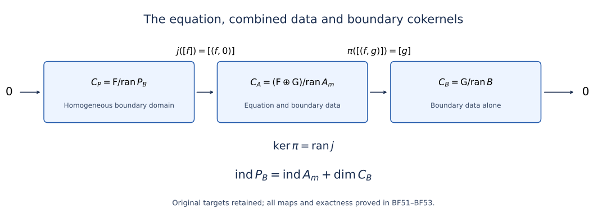

# Solving an elliptic system from compatible boundary measurements

An elliptic equation leaves a finite-dimensional family of decaying normal modes at each nonzero boundary frequency. Boundary measurements must distinguish exactly that family. We first solve the resulting projected operator problem, then prove the estimates that turn its algebraic inverse into an inverse on Sobolev spaces. The last step identifies every finite-dimensional obstruction as a smooth density-valued section, including at the boundary.

The interior operator acts between arbitrary complex bundles of equal finite rank. Its order is any positive integer, and the total orders of the boundary measurements may exceed it. Neither self-adjointness, positivity, scalar coefficients, nor a Dirichlet boundary condition is assumed. All assertions use restriction Sobolev spaces on a compact smooth manifold with boundary. The boundary realization below is taken at \(s\geq m\); a separate potential estimate will hold at every real \(s\).

## 1. The spaces, their weights, and the exact interfaces

Let \(X\) be a compact smooth manifold with boundary \(Y\), and let \(E,F\) be smooth complex bundles of common finite rank. Choose a collar \((y,t)\), with \(t\geq0\) pointing into \(X\), and identify its bundles with pullbacks. Write \(D=-i\partial\). An elliptic differential operator \(P:E\to F\) of order \(m\geq1\) has, in the collar, the form
\[
 P=\sum_{a=0}^m P_a(y,t,D_y)D_t^a,\qquad
 \operatorname{ord}P_a\leq m-a,\qquad P_m\text{ invertible}.
 \tag{BF1}
\]
Boundary operators of transversal order below \(m\) have the form
\[
 B_j u=\sum_{k=0}^{m-1}\mathcal B_{jk}\gamma_k u,
 \quad\gamma_k u=(D_t^ku)|_{t=0},\quad
 \operatorname{ord}\mathcal B_{jk}\leq m_j-k.
 \tag{BF2}
\]
Here \(G_j\) is the target bundle, and zero entries are allowed. Initially the \(\mathcal B_{jk}\) are differential operators. Every proof also permits classical tangential pseudodifferential entries of the displayed degrees. In that extension the \(m_j\) may be real. The interior operator remains differential. We do not infer the whole boundary calculus for arbitrary pseudodifferential interior operators from this extension.

Put \(\mathcal E=E|_Y^{\oplus m}\), \(\mathcal G=\bigoplus_jG_j\), and
\[
 \mathcal C^s=\bigoplus_{k=0}^{m-1}H^{s-k-1/2}(Y,E),\quad
 \mathcal D^s=\bigoplus_jH^{s-m_j-1/2}(Y,G_j),\quad
 \mathcal Y^s=\bar H^{s-m}(X^\circ,F)\oplus\mathcal D^s.
 \tag{BF3}
\]
The bar denotes the restrictions of whole-manifold Sobolev distributions, with quotient norm; it does not impose zero boundary jets. Our realization is
\(A_s:\bar H^s(X^\circ,E)\to\mathcal Y^s\),
\(A_su=(Pu,Bu)\), for \(s\geq m\). The trace theorem gives \(\gamma:\bar H^s\to\mathcal C^s\), since \(s>m-1+1/2\). Applying each tangential entry in (BF2) then proves continuity of \(A_s\), including negative boundary target orders when an \(m_j\) is large.

The proof uses the restriction and extension Sobolev scale, Fourier inversion, the trace theorem at \(s>k+1/2\), smooth multiplication, partitions of unity, compact Sobolev inclusions and interpolation of restriction spaces. The [Euclidean symbol calculus](euclidean-symbol-calculus.md) and [coordinate-free microlocal calculus](geometric-microlocal-calculus.md) supply asymptotic summation, composition, formal transpose, Sobolev mapping and interior elliptic regularity. [Singularities along a submanifold and smooth boundary passage](conormal-transmission.md), Sections 10–13, supplies ordinary transmission and the layer traces. [Cauchy data from jumps and residues](calderon-cauchy-data.md), Sections 6–12, supplies the jump, projection and smoothing interfaces displayed below. We use Hilbert completeness, Cauchy–Schwarz, bounded adjoints and orthogonal projections; the required functional representation is proved in Section 2. Fredholm stability, Sections 3 and 5, supplies norm stability, compact perturbations and the two-parametrix criterion. Each earlier result is used with its stated hypotheses.

Here is the Calderón interface with signs fixed. Extend \(P\) elliptically across \(Y\), and take a proper classical transmission parametrix \(T\) with
\(TP=I+R_E\), \(PT=I+R_F\), where both remainders have smooth kernels. Define zero extension \(e^+\), interior restriction \(r^+\), and
\[
 V=r^+Te^+,\qquad K=r^+TP^c,\qquad
 P^cU=\frac1i\sum_{a=1}^m P_a\sum_{r=0}^{a-1}
             U_{a-1-r}\otimes D_t^r\delta_0.
 \tag{BF4}
\]
For smooth inputs, the interface asserts
\[
 u+R_E^+u=VPu+K\gamma u,\quad
 \gamma K=Q,\quad Q_{kl}\in\Psi^{k-l}_{\rm cl},\quad
 Q^2-Q\in\Psi^{-\infty},\qquad R_E^+=r^+R_Ee^+.
 \tag{BF5}
\]
Moreover \(Q\gamma V:L^2(X,F)\to C^\infty(Y,\mathcal E)\) is continuous. Notice which projection occurs here. The complementary projection applied to \(\gamma V\) need not be smoothing. The principal weighted symbol \(q\) projects onto all Cauchy jets of decaying solutions of the frozen normal equation; its complementary space consists of the opposite normal modes. Smoothness and multiplicities of those spaces are the matrix spectral assertions in Sections 1–4 of [Stable modes and the algebra of boundary data](stable-boundary-models.md), without an eigenbasis assumption.

The original principal projection has the exact antipodal correspondence proved in [Cauchy data from jumps and residues, Section9](calderon-cauchy-data.md#AN03-CCD-009). Write \(N=\operatorname{rank}E=\operatorname{rank}F\). In \(\dim X\geq3\), its rank is necessarily \(mN/2\), and the complementing bijection therefore forces \(\operatorname{rank}\mathcal G=\sum_j\operatorname{rank}G_j=mN/2\). This conclusion also applies to the real-order tangential boundary extension here because the interior principal polynomial remains differential and homogeneous. Equal target rank alone does not prove complementing; the explicit three-dimensional scalar example in that proof has equal rank and a zero measurement at a nonzero covector. In dimension two a fixed differential target can be complementing on both rays only if their complementary stable ranks agree, while interior ellipticity alone need not give that agreement. No such tangential assertion is imposed on dimension one.

All smoothing statements on a compact boundary mean a smooth kernel. When one input is an interior \(L^2\) function we specify that domain separately; a continuous map from \(L^2\) into \(C^\infty\) is not being declared a smooth-kernel operator on arbitrary interior distributions.

## 2. Constructing order reductions without an index assumption

Let \(H\) be a smooth Hermitian bundle on a closed compact manifold. For each real \(a\) there is an invertible classical operator
\[
 J_H^a:H^r(Y,H)\longrightarrow H^{r-a}(Y,H)
 \quad\text{for every real }r,
 \tag{BF6}
\]
with positive scalar principal symbol \(|\eta|^a I_H\). Its inverse is classical of order \(-a\). We need actual inverses so that changing weights adds no undisclosed Fredholm index.

### 2.1. The earlier construction and its exact defect

**Editorial correction.** The following earlier construction is retained for comparison. Its claimed classical membership and classical inverse fail at a positive noninteger order. The full norm and mapping estimates do not remove that degree-zero defect. The corrected construction in Section2.2 proves (BF6) at every original real exponent.

> For \(a=2b>0\), choose an elliptic operator \(C\) of order \(b\) with principal symbol \(|\eta|^b I_H\). This is obtained by patching that symbol and quantizing. The operator \(D=I+C^*C\) has order \(2b\), is formally self-adjoint and has the required positive principal symbol. The elliptic parametrix gives
> \(\|u\|_{H^b}\leq C_1(\|Cu\|_{L^2}+\|u\|_{L^2})\): apply a parametrix of \(C\), and bound its smoothing remainder from \(L^2\) to \(H^b\). Thus the quadratic form
> \(\|u\|_{L^2}^2+\|Cu\|_{L^2}^2\) defines an equivalent Hilbert norm on \(H^b\). The Hilbert representation theorem applied to that inner product solves \(Du=f\) uniquely for \(f\in H^{-b}\). For \(r\geq b\) and \(f\in H^{r-2b}\), elliptic regularity upgrades the same solution to \(H^r\), and the parametrix estimate proves boundedness there. For \(r<b\), transpose the bounded inverse at exponent \(2b-r>b\); self-adjointness yields a bounded inverse from \(H^{r-2b}\) to \(H^r\), with both inverse identities extending from smooth sections by density. Uniqueness follows from the form identity after elliptic regularity, including for distributional nullvectors. A two-sided parametrix \(D_0\) satisfies \(D^{-1}-D_0=-D^{-1}(DD_0-I)\); this remainder has a smooth kernel because elliptic regularity applies also to the transposed expression. Hence \(D^{-1}\in\Psi^{-2b}_{\rm cl}\). Set \(J_H^a=D\). For \(a<0\), invert the construction for \(-a\); set \(J_H^0=I\). No group law between separately chosen \(J_H^a\)'s is needed.

Here is the functional representation used in the form step. For a nonzero bounded functional \(f\) on a Hilbert space, its kernel is closed. Choose \(z\) outside that kernel and subtract its orthogonal projection onto the kernel, obtaining \(z_0\ne0\) orthogonal to it. For every \(u\), the vector \(u-f(u)z_0/f(z_0)\) lies in the kernel. Pairing it with \(z_0\) expresses \(f(u)\) as a fixed inner product with \(u\), with the conjugations determined by the chosen convention. The zero functional is represented by zero. This proves the needed representation from the Hilbert facts stated in Section 1. Apply it to the equivalent form inner product on \(H^b\); it is complete because its norm is equivalent to the Sobolev norm. This is not an invocation of a boundary solvability theorem.

### 2.2. The corrected operator, its inverse, and every original contribution

Keep the original closed compact smooth manifold \(Y\), Hermitian bundle \(H\), density, cotangent norm, every real exponent and step-one classical expansion. The receiving calculus, elliptic regularity, compact Sobolev inclusion and Hilbert representation are the existing in-course providers. The original \(D=I+C^*C\) is retained for comparison. The corrected operator is separately named \(D_K\).

#### 1. The obstruction for every noninteger positive order

Let \(a>0\) be noninteger, let \(q=\lfloor a\rfloor\), and suppose \(Y\) has positive dimension and \(H\) has nonzero rank on the component under consideration. For \(P\in\Psi^a_{\mathrm{cl}}(Y;H)\), its local symbol has the step-one expansion \(p\sim\sum_{j\geq0}p_{a-j}\), with original homogeneous coefficients. The first \(q+1\) coefficients of any putative classical expansion of \(I+P\) must be these same coefficients: successively divide their difference by each positive degree \(|\eta|^{a-j}\) and take the ray limit. The identity has strictly smaller degree than each of them. Uniqueness of homogeneous coefficients therefore gives
\[
 \sigma(I+P)-\sum_{j=0}^{q}p_{a-j}
 =I_H+r,\qquad r\in S^{a-q-1},\qquad a-q-1<0.
 \tag{OR1}
\]
On each fixed nonzero ray \(r(y,t\eta)\to0\), whereas the left side tends to \(I_H\ne0\). It cannot belong to \(S^{a-q-1}\), as a classical order-\(a\) remainder would. Thus the obstruction applies to every such noninteger \(a\), not only one example. It is the additional degree-zero identity coefficient, lying outside \(\{a-j:j\in\mathbb N_0\}\). The original full symbol still belongs to the ordinary order-\(a\) symbol class; all its terms remain. For positive integer \(a\), degree zero is already in that list and the identity can be added to that exact coefficient. No alteration of the homogeneous step is used.

For the explicit circle example, use \(Y=\mathbb R/(2\pi\mathbb Z)\), density \(dx\), scalar bundle and basis \(e_k(x)=(2\pi)^{-1/2}e^{ikx}\). The self-adjoint elliptic multiplier
\[
 Ce_k=(1+k^2)^{1/8}e_k,\qquad b=\tfrac14,
 \qquad De_k=[1+(1+k^2)^{1/4}]e_k,
 \quad a=2b=\tfrac12
 \tag{OR2}
\]
retains the full original \(1+k^2\). Its classical status follows directly from the finite Taylor formula for \((1+z)^{1/8}\): for each positive integer \(L\), its coefficients are \(\binom{1/8}{l}\), \(0\leq l<L\), and its integral remainder is
\[
 \frac{z^L}{(L-1)!}\int_0^1(1-t)^{L-1}
 \left[\prod_{h=0}^{L-1}(\tfrac18-h)\right]
 (1+tz)^{1/8-L}\,dt .
 \tag{OR3}
\]
Put \(z=\xi^{-2}\) and multiply by \(|\xi|^{1/4}\) on both frequency rays. Every odd step-one homogeneous coefficient is zero; every even coefficient and all derivatives of the integral remainder are retained. The smooth full symbol at small frequency is \((1+\xi^2)^{1/8}\). The forced leading symbol of \(D\) is \(|\xi|^{1/2}\), but
\[
 1+(1+\xi^2)^{1/4}-|\xi|^{1/2}\longrightarrow1.
 \tag{OR4}
\]
Taylor's formula at zero gives \((1+z)^{1/4}-1=O(z)\), so the extra difference without the identity is \(O(|\xi|^{-3/2})\); it cannot cancel the one. The classical first remainder would have order \(-1/2\). This contradiction holds also on the integer frequency sequence defining the circle multiplier.

The inverse has the same exact defect. With \(t=|\xi|\) and \(d(\xi)=1+(1+\xi^2)^{1/4}\),
\[
 d(\xi)^{-1}-t^{-1/2}
 =\frac{t^{1/2}-d(\xi)}{t^{1/2}d(\xi)},
 \qquad t[d(\xi)^{-1}-t^{-1/2}]\longrightarrow-1.
 \tag{OR5}
\]
An order-\(-1/2\) classical inverse would have first remainder of order \(-3/2\), which after multiplication by \(t\) would tend to zero. Thus the inverse isomorphism does not establish the asserted classical inverse.

#### 2. The exact finite-rank correction

For the original \(a=2b>0\), keep the chosen classical elliptic \(C\in\Psi^b_{\mathrm{cl}}(Y;H)\) with principal symbol \(|\eta|^b I_H\). Its original parametrix gives, for a fixed finite \(C_1\),
\[
 \|u\|_{H^b}\leq C_1(\|Cu\|_{L^2}+\|u\|_{L^2}),
 \qquad u\in H^b(Y,H).
 \tag{OR6}
\]
Let \(K=\ker(C:H^b\to L^2)\). It is closed. A distributional kernel section is smooth: if \(SC=I+R_C\) with smooth-kernel remainder, then \(u=-R_Cu\) whenever \(Cu=0\). The \(H^b\) unit ball of \(K\) is compact. Indeed compact \(H^b\hookrightarrow L^2\), valid because \(b>0\), gives an \(L^2\)-convergent subsequence; (OR6) applied to its differences upgrades it to an \(H^b\)-Cauchy subsequence in the closed space \(K\).

For completeness this implies finite dimension. If a normed space were infinite dimensional, start with any finite-dimensional subspace \(M\), which is closed. Choose \(x\notin M\), write \(\delta=\inf_{w\in M}\|x-w\|>0\), and choose \(w\in M\) with \(\|x-w\|<2\delta\). The unit vector \((x-w)/\|x-w\|\) has distance greater than \(1/2\) from \(M\). Repeating with the span of the previously chosen vectors gives a sequence in the unit ball separated by more than \(1/2\), contradicting compactness. This proves the needed finite-dimensional claim without an index assumption on \(C\).

Choose an \(L^2\)-orthonormal smooth basis \(e_1,\ldots,e_d\) of \(K\), using the fixed original metric and density. Write \((u,v)_{L^2}\) linear in \(u\). The exact projection is
\[
 \Pi_Ku=\sum_{j=1}^d(u,e_j)_{L^2}e_j,
 \qquad \Pi_K^*=\Pi_K,\quad\Pi_K^2=\Pi_K,
 \qquad D_K=C^*C+\Pi_K.
 \tag{OR7}
\]
The empty sum is zero when \(d=0\). Its full kernel is \(\sum_je_j(y)\otimes e_j(y')^*\), integrated against the original density in \(y'\); it is smooth. Each coefficient is distributional pairing with a fixed smooth section, so \(\Pi_K\) is bounded between every pair of Sobolev spaces. In particular it is a smoothing operator, not a discarded degree-zero identity. Thus \(D_K\in\Psi^{2b}_{\mathrm{cl}}\), with principal symbol \(|\eta|^{2b}I_H\).

On \(H^b\) define
\[
 q_K(u,v)=(Cu,Cv)_{L^2}+(\Pi_Ku,\Pi_Kv)_{L^2},
 \quad q_K(u,u)=\|Cu\|_{L^2}^2+\|\Pi_Ku\|_{L^2}^2.
 \tag{OR8}
\]
The upper bound is \(q_K(u,u)\leq(\|C\|_{H^b\to L^2}^2+\|\Pi_K\|_{H^b\to L^2}^2)\|u\|_{H^b}^2\). There is also \(\gamma>0\) such that \(q_K(u,u)\geq\gamma\|u\|_{H^b}^2\). Otherwise, for each positive integer \(n\), choose a nonzero vector with form-to-norm-squared ratio less than \(1/n\), and divide it by its exact \(H^b\) norm to obtain \(u_n\) of norm one. Then \(Cu_n\to0\) and \(\Pi_Ku_n\to0\) in \(L^2\). Compact inclusion gives an \(L^2\)-Cauchy subsequence. Equation (OR6) applied to differences makes it Cauchy in \(H^b\), with limit \(u\) of norm one. Continuity gives \(Cu=0\) and \(\Pi_Ku=0\). But \(u\in K\) entails \(\Pi_Ku=u\), a contradiction. If the section space is zero, any positive \(\gamma\) gives the vacuous estimate. Every norm and both original maps are retained in this argument.

#### 3. The exact inverses on every Sobolev space

Formal self-adjointness and projection idempotence give \(\langle D_Ku,v\rangle=q_K(u,v)\), first on smooth sections and then on \(H^b\) by density. The pairing is linear in its distribution and conjugate linear in the test section. For \(f\in H^{-b}\), the functional \(v\mapsto\langle f,v\rangle\) is bounded in the complete equivalent form norm. The Hilbert representation proved in Section2 of the lesson therefore gives unique \(u\in H^b\) satisfying this identity for all \(v\in H^b\). Its exact estimate is
\[
 \gamma\|u\|_{H^b}^2\leq q_K(u,u)
 =\langle f,u\rangle\leq\|f\|_{H^{-b}}\|u\|_{H^b},
 \qquad \|u\|_{H^b}\leq\gamma^{-1}\|f\|_{H^{-b}}.
 \tag{OR9}
\]
For complex pairings the middle scalar is real nonnegative by the form identity; its absolute value supplies the displayed inequality. These are actual distributional solutions, and testing all smooth sections gives \(D_Ku=f\).

For \(r\geq b\), \(f\in H^{r-2b}\) also belongs to \(H^{-b}\). Elliptic regularity and the parametrix imply \(u\in H^r\) and a bounded inverse there. More explicitly \(S_KD_K=I+R_K\) gives \(u=S_Kf-R_Ku\); the mapping estimates yield
\[
 \|u\|_{H^r}\leq\|S_K\|_{H^{r-2b}\to H^r}\|f\|_{H^{r-2b}}
 +\|R_K\|_{H^b\to H^r}\gamma^{-1}
 \|\iota\|_{H^{r-2b}\to H^{-b}}\|f\|_{H^{r-2b}}.
 \tag{OR10}
\]
No smoothing contribution or embedding norm is removed.

For \(r<b\), set \(p=2b-r>b\). The adjoint of the already established inverse \(T_p:H^{p-2b}\to H^p\) acts from \(H^{-p}\) to \(H^{2b-p}\), which are exactly \(H^{r-2b}\) and \(H^r\). Formal self-adjointness of \(D_K\) transposes both inverse identities. They extend from smooth sections by their density and the bounded Sobolev maps. A distributional nullvector of \(D_K\) is smooth by its parametrix and is zero by (OR8); hence all these inverses agree on their common domains. Denote the resulting compatible inverse by \(T=D_K^{-1}\).

Let \(D_0\in\Psi^{-2b}_{\mathrm{cl}}\) be a classical parametrix and retain its whole right error \(R= D_KD_0-I\). Then
\[
 T-D_0=-TR.
 \tag{OR11}
\]
This is smoothing, with an explicit kernel argument. In a finite collection of bundle charts let \(R(\cdot,y')\) be its smooth output-variable kernel. For every input derivative \(\beta\) and every real \(N\),
\[
 \|\partial_{y'}^\beta T R(\cdot,y')\|_{H^N}
 \leq\|T\|_{H^{N-2b}\to H^N}
 \|\partial_{y'}^\beta R(\cdot,y')\|_{H^{N-2b}}.
 \tag{OR12}
\]
The right side is continuous and locally uniformly bounded in \(y'\). Difference quotients pass through the bounded map \(T\), so these are its actual derivatives. Taking \(N\) above every requested output derivative order plus \(\dim Y/2\) and using Sobolev embedding proves all jointly continuous mixed kernel derivatives. All chart and density factors remain those of the original smooth kernel. Thus \(T\in\Psi^{-2b}_{\mathrm{cl}}\). Set \(J_H^a=D_K\) for \(a>0\), \(J_H^a=(J_H^{-a})^{-1}\) using a separately constructed positive-order operator for \(a<0\), and \(J_H^0=I\). These give precisely (BF6), with its full original spaces and principal symbols, without an index assumption or a group law.

If \(Y\) is zero dimensional, compactness makes it a finite set and all bundle-section spaces finite dimensional. Take the actual identity for each \(J_H^a\). All kernels are smooth and all operators belong to every smoothing/classical order; the nonzero-covector symbol condition has empty domain. The empty manifold and zero bundle also have their unique invertible zero-space identity maps.

#### 4. Comparison with the original operator and all receiving maps

The original and corrected operators have the exact relation
\[
 D-D_K=I-\Pi_K,
 \qquad \big[\|Cu\|_{L^2}^2+\|u\|_{L^2}^2\big]-q_K(u,u)
 =\|(I-\Pi_K)u\|_{L^2}^2.
 \tag{OR13}
\]
The last identity uses the original orthogonal decomposition, including the kernel component. On \(K\) both operators equal the identity. The corrected form remains coercive on the entire original space, including \(K^\perp\), by (OR6)--(OR9). In the explicit circle example \(K=0\), so \(D_K=C^*C\) has full multiplier \((1+k^2)^{1/4}\), and its actual inverse has multiplier \((1+k^2)^{-1/4}\); both retain every endpoint factor and belong to the required classical classes. This proves the mathematical bridge to the prior construction while repairing its precise degree-zero defect.

For the original operator matrix entry orders \(b_i-a_j\), retain the actual diagonal maps \(D_a=\operatorname{diag}(J^{a_j})\), \(D_b=\operatorname{diag}(J^{b_i})\). The corrected \(J\)'s prove each map \(H^r\to H^{r-a_j}\) and \(H^r\to H^{r-b_i}\). Therefore \(D_b^{-1}MD_a\) is classical of order zero, and restoring variables recovers every original entry order. For the boundary system, retain \(a_k=k\), \(b_j=m_j\), \(r=s-1/2\) and both conjugations in (BF11). The corrected operators preserve the scalar positive principal-symbol isomorphisms and all smoothing ideals. Thus the order-minus-one errors, projected series and (BF12)--(BF13) use the exact step-one calculus at every real \(m_j\). The separate realization restriction \(s\geq m\), all layer Fourier factors and every density-valued obstruction are unchanged. This establishes the receiving proof, rather than inferring it from a nonclassical isomorphism.

The general noninteger obstruction (OR1), the explicit symbol and inverse tests (OR2)--(OR5), and the full repaired operator (OR6)--(OR13) concern this course's local construction. This calculation does not attribute the faulty construction to another author.

#### 5. Every derivative of the full frequency remainder

Write the integral factor after \(z^L\) in (OR3) as \(H_L(z)\), with \(L\geq1\). Its \(p\)-th derivative on \([0,1]\) is obtained by multiplying the integrand by \(t^p\prod_{h=0}^{p-1}(1/8-L-h)\) and replacing the exponent by \(1/8-L-p\); these derivatives are bounded because \(1+tz\geq1\). After substituting \(z=\xi^{-2}\), the full differentiated frequency remainder is
\[
 \partial_\xi^j\big[|\xi|^{1/4}\xi^{-2L}H_L(\xi^{-2})\big]
 =\sum_{h=0}^j\binom jh\partial_\xi^h(|\xi|^{1/4}\xi^{-2L})
 \sum_{\pi\in\mathcal P_{j-h}}H_L^{(|\pi|)}(\xi^{-2})
 \prod_{B\in\pi}(-1)^{|B|}(|B|+1)!\xi^{-|B|-2}.
 \tag{OR3a}
\]
Here \(\mathcal P_l\) consists of all set partitions of \(\{1,\ldots,l\}\); its empty partition at \(l=0\) gives \(H_L\). This formula follows by the full product rule and the repeated chain rule: a new derivative either creates a singleton block or joins exactly one existing block, which generates every partition once. The exact derivative \(\partial_\xi^l\xi^{-2}=(-1)^l(l+1)!\xi^{-l-2}\) supplies every factor. On each frequency ray the first factor is the falling product \(\prod_{v=0}^{h-1}(1/4-2L-v)\), times \(\operatorname{sgn}(\xi)^h|\xi|^{1/4-2L-h}\). A partition contributes \(|\xi|^{-(j-h)-2|\pi|}\). Thus each term is bounded by its complete finite coefficient times \(|\xi|^{1/4-2L-j}\) for \(|\xi|\geq1\). This proves every symbol derivative bound while retaining every zero coefficient and ray sign.

#### 6. The full original inverse and its exact comparison

The original form remains coercive, with the explicit bound
\[
 \|Cu\|_{L^2}^2+\|u\|_{L^2}^2
 \geq(2C_1^2)^{-1}\|u\|_{H^b}^2.
 \tag{OR14}
\]
It follows by squaring (OR6) and using \((x+y)^2\leq2(x^2+y^2)\). Hilbert representation gives the original inverse \(T_D:H^{-b}\to H^b\). Its every-real-order extension can be proved without assigning false classical membership to \(D\). A parametrix \(S_A\) of the retained classical elliptic \(A=C^*C\), with \(S_AA=I+R_A\), gives the full identity \(u=S_Af-S_Au-R_Au\) when \(Du=f\). If \(u\in H^s\), \(r\geq s\) and \(f\in H^{r-2b}\), it upgrades \(u\) to \(H^{\min(r,s+2b)}\). Starting with \(s=b\) reaches every prescribed \(r\geq b\) in finitely many steps since \(2b>0\). Each step retains the bounded maps \(S_A:H^{r-2b}\to H^r\), \(S_A:H^s\to H^{s+2b}\), \(R_A:H^s\to H^r\) and their embedding norms; their finite composition yields a bounded inverse at that level. Transposing at \(2b-r\) gives the smaller exponents as in Section3. A distributional nullvector belongs to some Sobolev space on compact \(Y\). The same parametrix bootstrap, with \(f=0\), successively raises its exponent by \(2b\), makes it smooth, and the positive original form then forces it to vanish. Thus the inverses are compatible.

Both actual inverses satisfy the exact comparison on every distributional Sobolev domain:
\[
 T_D-T=-T_D(I-\Pi_K)T: H^{r-2b}\longrightarrow H^{r+2b},\qquad r\in\mathbb R. \tag{OR15} \] Indeed applying \(D\) gives \(- (D-D_K)T\); apply its compatible inverse. The middle map acts on \(H^r\), and \(T_D\) at exponent \(r+2b\) maps \(H^r\) into \(H^{r+2b}\), proving the whole stated gain. No identity term or projection component has been suppressed. On \(K\) both inverses are the identity; the difference is zero there. The exact relation also retains the original nonkernel contribution and agrees with the full circle multipliers in (OR2)--(OR5).

### 2.3. Restoring every original entry degree

More generally suppose an operator matrix \(M=(M_{ij})\) has entry orders \(b_i-a_j\), so its domain factors have exponents \(r-a_j\) and targets have exponents \(r-b_i\). Put
\[
 D_a=\operatorname{diag}(J^{a_j}),\qquad
 D_b=\operatorname{diag}(J^{b_i}).
 \quad\widehat M=D_b^{-1}MD_a\in\Psi^0_{\rm cl}.
 \tag{BF7}
\]
Each diagonal map identifies the equal-exponent space \(\bigoplus H^r\) with the weighted one. Restoring the original variables recovers each entry order individually. In particular weighted smoothing means every entry is smoothing and is preserved by these conjugations.

## 3. One-sided inversion on a projected bundle

Let \(Q\in\Psi^0_{\rm cl}(Y;H,H)\) satisfy \(Q^2-Q\in\Psi^{-\infty}\), and let \(B\in\Psi^\mu_{\rm cl}(Y;H,G)\), with real \(\mu\). Write \(q,b\) for their principal symbols. The image of \(q\) is a smooth bundle on \(T^*Y\setminus0\): the rank of a smooth idempotent is locally constant, and a nonzero minor supplies local frames. This bundle need not be the pullback of a bundle on \(Y\).

If \(b:qH\to G\) is onto at every nonzero covector, there exists \(S\in\Psi^{-\mu}_{\rm cl}(Y;G,H)\) such that
\[
 BS\equiv I_G,\qquad QS\equiv S.
 \tag{BF8}
\]
Throughout this item \(\equiv\) denotes equality modulo smoothing. To prove it, first reduce \(\mu\) to zero using (BF6). The symbol \(c=bq:H\to G\) is onto. Give both bundles metrics. Then \(cc^*\) is positive definite and
\(t_0=c^*(cc^*)^{-1}\) is a smooth homogeneous right inverse. Quantize it to \(T_0\); the error \(I-BQT_0\) has order \(-1\). Asymptotically summing
\(T_0\sum_{l\geq0}(I-BQT_0)^l\) gives \(T_1\) with \(BQT_1\equiv I\), since after \(N\) terms the error is the \(N\)-th power of an order \(-1\) operator. The complete calculus makes the final error smoothing. Set \(S=QT_1\). Then
\(BS\equiv I\) and \(QS-S=(Q^2-Q)T_1\) is smoothing. Restoring weights gives order \(-\mu\).

If instead \(b:qH\to G\) is one-to-one, there are \(S'\in\Psi^{-\mu}_{\rm cl}(Y;G,H)\) and \(S''\in\Psi^0_{\rm cl}(Y;H,H)\) with
\[
 S'B+S''\equiv I_H,\qquad S''Q\equiv0.
 \tag{BF9}
\]
After the same order reduction, consider the column \(C=(B,I-Q)^t\). If \((I-q)v=0\) and \(bv=0\), then \(v\in qH\) and injectivity gives \(v=0\). Thus its symbol \(c\) is injective; \((c^*c)^{-1}c^*\) is a smooth left inverse. Quantization and the left version of the preceding asymptotic series give a row \((T',T'')\) with
\(T'B+T''(I-Q)\equiv I\). Set \(S'=T'\), \(S''=T''(I-Q)\). Multiplying by \(Q\) gives the second identity because \((I-Q)Q\) is smoothing. This proves both statements for arbitrary ranks. Neither assertion alone promises a two-sided inverse for the original boundary realization.

## 4. Uniqueness and restoration of every entry degree

When \(b:qH\to G\) is bijective, choose the operators from both parts of Section 3. In the quotient algebra,
\[
 S'=S'BS=(S'B+S'')S=S,
 \tag{BF10}
\]
where the added term vanishes because \(QS=S\) and \(S''Q=0\). Thus the same \(S\) works in both identities. Comparing any other permitted right inverse with this fixed left pair proves its uniqueness; comparing a new left pair with the fixed right inverse proves uniqueness of \(S'\), and then \(S''=I-SB\) is unique. This uniqueness is modulo smoothing, not equality of particular quantizations, and it fails in general if only one of the two symbol conditions holds.

Apply this to (BF2) and (BF5). The source weights are \(a_k=k\), the target weights are \(b_j=m_j\), and the common exponent is \(r=s-1/2\). The conjugated operators are
\[
 \widehat Q=D_a^{-1}QD_a,\qquad
 \widehat{\mathcal B}=D_b^{-1}\mathcal B D_a.
 \tag{BF11}
\]
They have order zero. The complementing condition is precisely that the latter principal symbol maps \(\operatorname{ran}\widehat q\) bijectively onto the whole target fiber. Indeed the original weighted trace vector is the full Cauchy vector of the decaying normal solution, and \(\mathcal B\) performs exactly the boundary measurements. The scalar positive order reductions are fiberwise isomorphisms at every nonzero covector.

Let \(\widehat S,\widehat S''\) be the inverses just constructed, and undo (BF11). Then
\[
 S_{kj}\in\Psi^{k-m_j}_{\rm cl}(Y;G_j,E),\qquad
 S''_{kl}\in\Psi^{k-l}_{\rm cl}(Y;E,E),
 \tag{BF12}
\]
with
\[
 \mathcal BS\equiv I,\quad QS\equiv S,\quad
 S\mathcal B+S''\equiv I,\quad S''Q\equiv0.
 \tag{BF13}
\]
Consequently \(S:\mathcal D^s\to\mathcal C^s\) and \(S'':\mathcal C^s\to\mathcal C^s\) are continuous for every real \(s\). For example the \((k,j)\) entry raises \(s-m_j-1/2\) to \(s-k-1/2\), since its order is \(k-m_j\). This arithmetic is valid even when \(m_j\geq m\), and does not replace the separate restriction \(s\geq m\) needed for the realization.

## 5. A quantitative one-sided layer estimate

This item proves the analytic point needed even when a transmission operator is not an elliptic inverse. Let \(T\) be a proper classical operator of integer order \(-m\), \(m\geq1\), having ordinary transmission across \(t=0\), including every base and frequency jet. If \(0\leq j<m\), define
\(K_jv=r^+T(v\otimes D_t^j\delta_0)\). Then, locally with fixed compact supports and globally after patching,
\[
 \|K_jv\|_{\bar H^s(X^\circ)}
 \leq C_s\|v\|_{H^{s+j+1/2-m}(Y)}
 \qquad(s\in\mathbb R).
 \tag{BF14}
\]
The same estimate holds for bundle matrices. A smooth off-diagonal kernel contributes a smoothing operator and will be retained as such throughout the proof.

We give the parameter estimate underlying (BF14). In a left-symbol chart let \(a(y,t,\eta,\tau)\) be the symbol of \(T\), let \(\lambda=\langle\eta\rangle\), and set
\[
 k_j(y,t,\eta)=(2\pi)^{-1}\int e^{it\tau}
                  a(y,t,\eta,\tau)\tau^j\,d\tau,\quad t>0.
 \tag{BF15}
\]
This is an oscillatory integral. It is not interpreted as an absolutely convergent integral after arbitrary differentiation. For all nonnegative integers \(A,N\) and multi-indices \(\alpha,\beta\), its one-sided extension satisfies
\[
 \big|t^N\partial_t^A\partial_\eta^\alpha\partial_y^\beta
                      k_j(y,t,\eta)\big|
 \leq C\lambda^{j+1-m+A-N-|\alpha|}
 \quad(t\geq0).
 \tag{BF16}
\]
Equivalently its normal profile, after dividing by \(\lambda^{j+1-m}\) and setting \(z=\lambda t\), is bounded in every Schwartz seminorm on the closed half-line, with the usual loss \(\lambda^{-|\alpha|}\) for tangential frequency derivatives. Constants involve only finitely many classical symbol and transmission seminorms for each displayed estimate.

Here are details of the normal-frequency argument. First freeze all normal base derivatives at zero. Write \(d=j-m\), so initially \(d\leq-1\), and rescale \(\tau=\lambda\sigma\). On \(|\sigma|\leq2\), differentiated symbols have the bounds of a compactly supported smooth function, times \(\lambda^d\). On the two tails, Taylor expansion of each homogeneous component about the two normal rays gives integer powers of \(\sigma\). Transmission makes their coefficients the same Laurent coefficients on the positive and negative real tails. More precisely, for any chosen number of tangential derivatives and any integer \(L\), subtracting sufficiently many homogeneous components and sufficiently many normal-ray Taylor terms leaves a remainder bounded with those derivatives by
\(C\lambda^d\langle\sigma\rangle^{-L}\). If a tangential derivative is taken, include its extra factor \(\lambda^{-1}\). This assertion follows directly from Taylor's integral remainder on the compact normal-direction charts and the classical symbol remainder; choosing both truncation lengths larger than \(L+|d|\) supplies the bound.

For any finite set of these Laurent coefficients, there is a rational function having exactly those coefficients: use the polynomial part and a finite linear combination of \((\sigma-i)^{-h}\), \(h\geq1\). Expanding \((\sigma-i)^{-h}\) at infinity gives a triangular system with leading term \(\sigma^{-h}\); solve it successively to the chosen order. Its inverse Fourier transform is a sum of derivatives of \(\delta_0\) and, on \(z>0\), exponential polynomials \(c_hz^{h-1}e^{-z}\). Every such polynomial is smooth and rapidly decreasing on the closed positive half-line. The delta derivatives disappear after restriction to \(z>0\); they are not incorrectly assigned point values at zero. The remainder can be made to have as many integrable weighted derivatives as desired, so its inverse Fourier transform and the desired \(z\)-derivatives and weights are bounded. The same subtraction applied after multiplying by powers of \(\sigma\) justifies every normal derivative. This proves the frozen version of (BF16), including its limits at zero, by ordinary absolutely convergent integrals after subtraction. It is the quantitative use of all the transmission jets, not merely of the leading parity.

For the actual symbol expand in the normal base variable to length \(L\):

\[a(y,t,\eta,\tau)=\sum_{l<L}t^l\partial_t^la(y,0,\eta,\tau)/l!+t^La_L(y,t,\eta,\tau)\]

Each frozen term has the estimate just proved. The remainder has the original symbol order, locally uniformly in \(t\). To bound its inverse integral on \(0<z=\lambda t\leq1\), divide the \(\sigma\)-axis into dyadic annuli. An annulus of radius \(R\) contributes at most \(C R^{d+A+1}\) before integration by parts, and after \(M\) integrations contributes at most this bound times \((zR)^{-M}\). Splitting the sum at \(R=z^{-1}\) gives \(Cz^{-K}\), for an integer \(K\) determined by the order and the requested derivatives. A logarithmic borderline sum is bounded by increasing \(K\) by one. This exponent does not depend on \(L\). Choose \(L>K\), also allowing for the finitely many derivatives that hit \(t^L\). Its factor \(t^L=\lambda^{-L}z^L\) then removes the singularity. For \(z\geq1\), integrate more often in \(\sigma\); this gives any prescribed inverse power of \(z\), and absorbs the polynomial \(z^L\). Derivatives of the remainder in \(t,y,\eta\) obey the same symbol bounds. Thus all finite sets of estimates (BF16) follow by choosing \(L\) sufficiently large. This also proves smoothness up to zero without assuming that the symbol at a positive normal base point itself has matching normal-ray tails.

We next turn this profile estimate into (BF14). Extend a smooth half-line profile to the full line with bounded norms through any prescribed finite order. One explicit finite-order construction on the negative side is
\(h_-(z)=\chi(z)\sum_{l=1}^{N+1}c_l h(-lz)\), where the Vandermonde equations
\(\sum_lc_l(-l)^a=1\), \(0\leq a\leq N\), match the first \(N\) derivatives at zero. Away from zero use a cutoff and the already rapidly decreasing profile. The resulting extension is bounded in the finitely many weighted Sobolev norms in question; taking \(N\) larger than their orders suffices. Apply this after normal rescaling, rather than using a fixed-scale extension on each frequency. It preserves the estimates in (BF16).

For completeness, the tangential operator bound needed here follows from the ordinary Fourier-kernel proof also for these normal profiles as a Hilbert-valued symbol. Localize to input tangential frequencies \(|\eta|\asymp2^l\) and output frequencies \(|\theta|\asymp2^h\). Fourier transformation in \(y\) of the compactly supported symbol, with \(M\) integrations by parts, gives the factor \(\langle\theta-\eta\rangle^{-M}\). For \(|h-l|\leq2\), change normal variable to \(z=2^lt\). The \(L^2_t\) factor is \(2^{-l/2}\); each normal or tangential derivative costs at most \(2^l\) by (BF16). Schur's kernel bound and Plancherel therefore give, for any integer \(N\geq0\),
\[
 \|\Delta_h\widetilde K_j\Delta_l v\|_{H^N(\mathbb R^n)}
 \leq C_N 2^{l(N+j+1/2-m)}\|\Delta_l v\|_{L^2},
 \quad |h-l|\leq2.
 \tag{BF17}
\]
Here \(\widetilde K_j\) is the chosen extension of the potential, and the low-frequency blocks use \(2^l\geq1\). The estimate for a real nonnegative \(s\leq N\) follows by weighted Fourier interpolation between the \(N\) and zero estimates. For negative \(s\), in a fixed output tangential annulus one has
\((1+|\theta|^2+\tau^2)^{s/2}\leq C2^{hs}\), so the zero estimate gives the same exponent. When \(|h-l|>2\), the factor from the \(y\)-integrations is bounded by any prescribed power of \(2^{-\max(h,l)}\), after compensating the finite frequency volumes. The profile estimates remain valid after those derivatives. Thus the corresponding bound has an extra summable factor \(2^{-M|h-l|}\), with \(M\) arbitrarily large and with any fixed Sobolev powers absorbed by increasing \(M\).

The dyadic characterization of Fourier Sobolev norms and the elementary convolution inequality for the summable sequence \(2^{-M|h-l|}\) now sum (BF17). This gives a whole-space extension with norm at most the right side of (BF14), hence also the restriction norm. Density extends the map to every indicated boundary Sobolev space. Local trivializations and a finite partition of unity prove the bundle and compact-manifold versions. This completes the all-real estimate, including the negative exponents; interpolation from nonnegative integers alone would not have done so.

## 6. Interior forcing through a general transmission operator

For the same general transmission \(T\) of order \(-m\),
\[
 \|r^+Te^+f\|_{\bar H^{m+r}(X^\circ)}
 \leq C_r\|f\|_{\bar H^r(X^\circ)}\qquad(r\geq0).
 \tag{BF18}
\]
We prove this without claiming that \(e^+:\bar H^r\to H^r\) is bounded for all \(r\). At \(r=0\), zero extension is an \(L^2\) isometry, and whole-space pseudodifferential continuity proves (BF18).

Induct on the nonnegative integer \(r\), simultaneously for all symbols \(T\) with a bound controlled by finitely many seminorms. A tangential derivative commutes with \(e^+\). For a normal derivative, distributional differentiation gives
\[
 D_t(r^+Te^+f)=r^+Te^+D_tf+r^+[D_t,T]e^+f
                  +i^{-1}r^+T((\gamma_0 f)\otimes\delta_0).
 \tag{BF19}
\]
First prove this for smooth \(f\), by differentiating its zero extension, and then use density. The commutator has order \(-m\) and ordinary transmission, because its symbol is a normal base derivative of that of \(T\). The induction estimate at \(r-1\) bounds the first term in \(H^{m+r-1}\); the second is bounded there from \(f\in H^{r-1}\). The trace theorem gives \(\gamma_0f\in H^{r-1/2}(Y)\), and (BF14) with \(j=0\), \(s=m+r-1\), bounds the last term in the same space. Tangential differentiation has the first two terms only. Since the integer Sobolev norm of order \(m+r\) is controlled by the order-zero norm and these first-derivative norms of order \(m+r-1\), the induction closes. Cutoff commutators are handled by the same symbol estimates; smooth off-diagonal kernels are harmless. All constants use finitely many seminorms, so the simultaneous induction is valid.

Interpolation of the restriction Sobolev scale between consecutive integers gives (BF18) for every real \(r\geq0\). In particular the endpoint \(r=0\) is included. This proof, together with Section 5, proves the two transmission estimates for arbitrary proper classical transmission operators of integer order \(-m\). The operator need not satisfy \(PT=I+R_F\). Its use in an actual boundary inverse will require that additional identity.

## 7. The boundary source and its anisotropic norm

For the specific \(P^c\) in (BF4), normal coefficients must act on the delta derivatives before they are evaluated. The identity
\(fD_t^r\delta=\sum_{j=0}^r\binom rj(-1)^{r-j}(D_t^{r-j}f)(0)D_t^j\delta\), obtained by testing against a smooth function and applying Leibniz's rule, gives the exact grouping
\[
\begin{split}
 P^cU&=\sum_{j=0}^{m-1}v_j\otimes D_t^j\delta_0,\\
 v_j&=i^{-1}\sum_{\substack{l\geq0\\j+l+1\leq a\leq m}}
 \binom{a-1-l}{j}(-1)^{a-1-l-j}
 (D_t^{a-1-l-j}P_a)(y,0,D_y)U_l.
\end{split}
 \tag{BF20}
\]
When the coefficients are independent of the normal variable, only \(a=j+l+1\) remains, giving \(v_j=i^{-1}\sum_{l+j<m}P_{j+l+1}U_l\). For variable coefficients the additional normal derivatives in (BF20) are retained. This is precisely the same distributional source as (BF4), with no coefficient jet removed.

Each contribution from \(U_l\) to the coefficient of \(D_t^j\delta\) has tangential order at most \(m-j-l-1\). Hence
\(\|v_j\|_{H^{s-m+j+1/2}}\leq C\sum_l\|U_l\|_{H^{s-l-1/2}}\).
Using (BF14) in each term gives the full Poisson estimate
\[
 \|KU\|_{\bar H^s(X^\circ)}
 \leq C_s\sum_{l=0}^{m-1}\|U_l\|_{H^{s-l-1/2}(Y)},
 \qquad s\in\mathbb R.
 \tag{BF21}
\]
This is also valid for a general transmission \(T\) in place of the parametrix in (BF4), with the same differential boundary source.

We verify separately the anisotropic estimate that exposes the half-order and the restriction \(j<m\). In a chart of dimension \(n=\dim X\), define
\[
 \|w\|_{a,b}^2=(2\pi)^{-n}\int
 (1+|\eta|^2+\tau^2)^a(1+|\eta|^2)^b
                    |\widehat w(\eta,\tau)|^2\,d\eta\,d\tau.
 \tag{BF22}
\]
For a boundary layer, \(\widehat{v\otimes D_t^j\delta}=\widehat v(\eta)\tau^j\). Substitution \(\tau=\langle\eta\rangle\sigma\) gives exactly
\[
 \int_{\mathbb R}\tau^{2j}(1+|\eta|^2+\tau^2)^{-m}d\tau
 =c_{jm}\langle\eta\rangle^{2j-2m+1},\quad
 c_{jm}=\int_{\mathbb R}\sigma^{2j}(1+\sigma^2)^{-m}d\sigma<\infty.
 \tag{BF23}
\]
At infinity the exponent is \(2j-2m\leq-2\), and at zero it is nonnegative. Thus
**Editorial restoration of the Fourier factors.** Comparing the \(n\)-dimensional measure in (BF22) with the \((n-1)\)-dimensional boundary Sobolev measure gives the exact identity
\[
 \|v\otimes D_t^j\delta\|_{-m,s}^2
 =\frac{c_{jm}}{2\pi}\|v\|_{H^{s+j-m+1/2}}^2,
 \qquad c'_{jm}=\left(\frac{c_{jm}}{2\pi}\right)^{1/2}.
 \tag{BF23a}
\]
This also holds in dimension one, using measure one on \(\mathbb R^0\). The integral \(c_{jm}\) remains exactly the one in (BF23).
If \(k\) is an integer with \(k\geq\max(s,0)\), then
\[
 \|w\|_{s-m-k,k}\leq\|w\|_{-m,s},
 \tag{BF24}
\]
because \((1+|\eta|^2+\tau^2)^{s-k}\leq\langle\eta\rangle^{2(s-k)}\). Commuting each of the finitely many tangential derivatives of order at most \(k\) through a proper \(T\in\Psi^{-m}\), and using whole-space Sobolev continuity on each resulting commutator, proves
\(T:H^{a-m,k}\to H^{a,k}\). The integer \(k\geq0\) norm is equivalent to the sum of the \(H^a\) norms of those derivatives, as is immediate from its Fourier weight. Therefore
\[
 \|KU\|_{\bar H^{s-k,k}}\leq C_s
                 \sum_l\|U_l\|_{H^{s-l-1/2}}.
 \tag{BF25}
\]
This derivation holds at negative as well as positive \(s\). For a parametrix, \(PKU=r^+R_FP^cU\) is smooth, and elliptic normal recovery gives another route from (BF25) to (BF21). Our proof of (BF21) already supplied that recovery through the transmission profiles, so it does not use an unproved normal-regularity assertion as an extra assumption.

## 8. An explicit inverse and its left error

Assume now the complementing condition, so that (BF13) holds, and use the actual elliptic parametrix \(T\) in (BF4). Define
\[
 L(f,g)=(I+KS''\gamma)Vf+KSg.
 \tag{BF26}
\]
This formula produces an interior section. Each occurrence of a trace is after applying \(V\), so the expression is meaningful at the lowest permitted forcing regularity \(f\in L^2\).

Set
\(R=I-S\mathcal B-S''(I-Q)\); it is a smoothing matrix by (BF13). For a smooth \(u\), write \(U=\gamma u\), \(f=Pu\), \(g=Bu=\mathcal BU\). Taking traces in (BF5) yields
\((I-Q)U=\gamma Vf-\gamma R_E^+u\). Substitution into the definition of \(R\) gives the exact identity
\[
 U=Sg+S''\gamma Vf-S''\gamma R_E^+u+RU.
 \tag{BF27}
\]
Use (BF5) once more to obtain
\[
 u=L(Pu,Bu)+\mathcal R u,
 \quad
 \mathcal R=K(R\gamma-S''\gamma R_E^+)-R_E^+.
 \tag{BF28}
\]
The map \(\mathcal R:\bar H^m(X^\circ,E)\to C^\infty(X,E)\) is continuous. Indeed \(\gamma\) maps that space into the finite sum of boundary Sobolev spaces in (BF3); \(R\) makes the result smooth. The map \(R_E^+\) takes interior \(L^2\) continuously into smooth sections on a neighborhood of \(X\). Applying \(S''\) preserves smoothness of its trace, and \(K\) maps smooth boundary sections continuously into \(C^\infty(X)\) by (BF21) at all high orders and Sobolev embedding. These observations prove every term of the assertion, including its actual input domain. In particular the \(u\)-dependent smoothing term in (BF27) is accounted for; it has not been dropped in constructing \(L\).

## 9. Both rows of the right error

Let \(R_F^+=r^+R_Fe^+\) and \(H=r^+R_FP^c\). From \(PT=I+R_F\) and restriction away from the delta support,
\(PV=I+R_F^+\) and \(PK=H\). Therefore
\[
 PL(f,g)=f+K_1f+K_2g,
 \quad K_1=R_F^++HS''\gamma V,\quad K_2=HS.
 \tag{BF29}
\]
Here \(K_1:L^2(X,F)\to C^\infty(X,F)\) continuously, and \(K_2:\mathcal D'(Y,\mathcal G)\to C^\infty(X,F)\) continuously. The latter has a kernel smooth in the boundary input and the interior output up to the boundary: differentiating the smooth kernel of \(R_F\), restricting its second variable to \(Y\), and transposing the boundary operator \(S\) in that variable preserves smoothness. This direct kernel observation also checks continuity in the strong distribution topology, rather than only at one fixed Sobolev order.

Taking the trace of (BF26) gives
\(BL(f,g)=\mathcal B(I+QS'')\gamma Vf+\mathcal BQSg\).
The quotient algebra (BF13) yields
\[
 \mathcal B(I+QS'')
 \equiv\mathcal B+\mathcal BQ-\mathcal BQS\mathcal B
 \equiv\mathcal BQ.
 \tag{BF30}
\]
The second step uses both \(QS\equiv S\) and \(\mathcal BS\equiv I\), with their specified domains. Define the actual operators
\[
 F_0=\mathcal B(I+QS'')-\mathcal BQ,\quad
 K_3=(\mathcal BQ+F_0)\gamma V,\quad
 K_4=\mathcal BQS-I.
 \tag{BF31}
\]
Both \(F_0\) and \(K_4\) are smoothing matrices. The Calderón interface makes \(Q\gamma V\) continuous from \(L^2\) to \(C^\infty\); the other term \(F_0\gamma V\) has that property by the trace bound following (BF18). Thus
\[
 BL(f,g)=g+K_3f+K_4g,
 \quad K_3:L^2(X,F)\to C^\infty(Y,\mathcal G),
 \tag{BF32}
\]
continuously, and \(K_4\) has a smooth kernel on \(Y\times Y\). Equations (BF29) and (BF32) specify the entire right error; neither row is inferred merely from the left error.

## 10. The Fredholm realization and regularity of solutions

For every real \(s\geq m\), (BF18) gives \(V:\bar H^{s-m}\to\bar H^s\), hence \(\gamma V:\bar H^{s-m}\to\mathcal C^s\). Equations (BF12) and (BF21) show that the two remaining terms in (BF26) have the same mapping property. Therefore
\[
 L:\mathcal Y^s\longrightarrow\bar H^s(X^\circ,E)
 \quad\text{is bounded for every }s\geq m.
 \tag{BF33}
\]
The identities (BF28), (BF29) and (BF32), first proved on smooth sections, extend by density to these spaces. Their errors are compact at this fixed level: each maps bounded sets into a higher Sobolev space on a compact manifold, and the inclusion back to the target level is compact. Section 5 of Finite defects under perturbation now proves
\[
 A_s:\bar H^s(X^\circ,E)\longrightarrow\mathcal Y^s
 \text{ is Fredholm},\qquad s\geq m.
 \tag{BF34}
\]
The result includes closed range, finite-dimensional kernel and finite-dimensional cokernel. An approximate inverse is not being confused with exact solvability of arbitrary data.

There is also a regularity statement with the same exact spaces. If \(u\in\bar H^m\), \(Pu\in\bar H^{s-m}\) and \(Bu\in\mathcal D^s\) for some \(s\geq m\), then (BF28) and (BF33) give \(u\in\bar H^s\). In particular a nullvector is smooth up to \(Y\), because the right side of (BF28) is \(\mathcal R u\). Thus the kernel is the same finite-dimensional smooth space at every permitted exponent. Nothing here replaces a trace theorem by evaluating an arbitrary distribution at the boundary.

## 11. Why Fredholmness forces the full symbol condition

Conversely, start with a smooth differential operator of order \(m\) between equal-rank bundles and boundary operators (BF2), without assuming interior ellipticity or the complementing condition. Fredholmness of \(A_s\) at one \(s\geq m\) forces both interior ellipticity and the bijectivity of the boundary symbol on the decaying normal space. The argument also distinguishes the two separate failures of the boundary condition.

We recall the elementary high-frequency symbol test with its normalization. In a coordinate ball of dimension \(d\), fix \(\xi_0\ne0\), a fiber vector \(v\), and \(\chi\in C_c^\infty\) with \(L^2\) norm one. The functions
\(w_\lambda(x)=\lambda^{d/4}e^{i\lambda\xi_0\cdot x}\chi(\lambda^{1/2}(x-x_0))v\)
are bounded in \(L^2\), converge weakly to zero, and for an order-zero classical operator \(C\),
\[
 \|Cw_\lambda-\lambda^{d/4}e^{i\lambda\xi_0\cdot x}
       \chi(\lambda^{1/2}(x-x_0))c_0(x_0,\xi_0)v\|_{L^2}
 \longrightarrow0.
 \tag{BF35}
\]
To verify the estimate, write the Fourier transform as a packet centered at \(\lambda\xi_0\) of width \(\lambda^{1/2}\). In the region of that width, Taylor's formula in \(x\) and direction \(\xi/|\xi|\) makes the leading-symbol error \(O(\lambda^{-1/2})\), and the lower symbol has size \(O(\lambda^{-1})\). Outside a fixed enlarging multiple of the packet width, the Fourier transform of \(\chi\) decays faster than any power. Splitting into those two regions and using the finite-seminorm \(L^2\) bound proves (BF35). Applying the identical argument to the adjoint gives its dual version. Smooth bundle frames and cutoffs change none of these limits.

A Fredholm operator has a bounded inverse modulo finite-rank operators by Section 5 of Finite defects under perturbation. Thus it cannot take a weakly null sequence of unit norm to zero in norm: a finite-rank remainder tends to zero in norm on such a sequence. If \(p(x_0,\xi_0)\) has a nullvector at an interior point, normalize the above packet in \(H^s\) by a factor asymptotic to \(\lambda^{-s}\). Differentiating the differential operator gives \(\|Pu_\lambda\|_{H^{s-m}}\to0\), while all boundary traces vanish. This contradicts the preceding Fredholm fact. Since the interior bundles have equal rank, injectivity of the square symbol is equivalent to invertibility. The same test proves the symbol bound at a boundary point: first choose interior points approaching that point, where the smallest singular value approaches zero, then choose the frequency and the support of the packet inside that point's coordinate ball so that all frozen-symbol errors and all compact remainders tend to zero. A diagonal sequence supplies the contradiction. Consequently \(P\) is elliptic up to the boundary, so the Calderón construction and the estimates already proved apply even before any assumption on \(B\).

To test boundary injectivity, use the order reductions of (BF11), which turn \(\mathcal C^s\) and \(\mathcal D^s\) into equal-exponent spaces; follow them by invertible reductions to \(L^2\). These further reductions have scalar principal symbols and leave the principal projection and measurement symbols unchanged up to conjugacy. Call the resulting order-zero operators \(Q_0,B_0\). If \(0\ne v\in\operatorname{ran}q_0(y_0,\eta_0)\) and \(b_0v=0\), choose normalized boundary packets \(w_\lambda\) with that vector and undo the reductions to obtain \(U_\lambda\) bounded and weakly null in \(\mathcal C^s\). Formula (BF35) gives
\(\|QU_\lambda-U_\lambda\|_{\mathcal C^s}\to0\) and
\(\|\mathcal BQU_\lambda\|_{\mathcal D^s}\to0\).
Set \(u_\lambda=KU_\lambda\). By (BF21) it is bounded and weakly null in \(\bar H^s\), and its norm is bounded away from zero since \(\gamma u_\lambda=QU_\lambda\) and the trace map is bounded. Moreover \(Pu_\lambda=r^+R_FP^cU_\lambda\to0\) in \(\bar H^{s-m}\), since this map is smoothing and therefore compact on the fixed input Sobolev spaces. The boundary output is \(\mathcal BQU_\lambda\to0\). After normalizing the input norms, this contradicts Fredholmness.

Finally suppose the restricted symbol is not onto. Choose a nonzero dual target vector \(h_0\) annihilating \(b_0\operatorname{ran}q_0\). The dual packet construction gives target vectors \(g_\lambda\in\mathcal D^s\) and dual vectors \(h_\lambda\in(\mathcal D^s)'\), both bounded and weakly null, with
\[
 \langle g_\lambda,h_\lambda\rangle=1,
 \qquad\|(\mathcal BQ)'h_\lambda\|_{(\mathcal C^s)'}\to0.
 \tag{BF36}
\]
For example choose the same scalar packet for both after the \(L^2\) reduction and dual unit fiber vectors with pairing one. The last limit is (BF35) for the transposed order-zero symbol. Let \(Z\) be a bounded generalized inverse of the Fredholm realization and put \(u_\lambda=Z(0,g_\lambda)\). Then \(u_\lambda\) is bounded and weakly null in \(\bar H^s\), and the finite-rank error gives
\(Pu_\lambda\to0\), \(Bu_\lambda-g_\lambda\to0\) in the respective target norms. The trace of (BF5) implies
\((I-Q)\gamma u_\lambda=\gamma VPu_\lambda-\gamma R_E^+u_\lambda\to0\)
in \(\mathcal C^s\): the first term tends to zero by (BF18), the second by compactness of the smoothing map. Hence
\(g_\lambda-\mathcal BQ\gamma u_\lambda\to0\). Pairing with \(h_\lambda\) contradicts (BF36), since the bounded Cauchy vectors paired with \((\mathcal BQ)'h_\lambda\) give a limit zero. This proves surjectivity separately, without a boundary-rank assumption that would make it automatic. Together the two tests prove necessity of the full complementing condition.

When \(Y\) is zero-dimensional, its cotangent bundle has no nonzero vectors, so the boundary symbol tests are vacuous. Boundary spaces are finite-dimensional, and the one-dimensional interior elliptic ODE has finite-dimensional Cauchy data and closed-range estimates. The same parametrix proof applies with all boundary matrices smoothing. No nonexistent tangential high-frequency sequence is used in that case.

## 12. Recovering smooth interior dual sections at the boundary

Fix a smooth positive density only to identify local distribution coordinates. Intrinsically the continuous bilinear dual of an \(F\)-section is an \(F^*\otimes\Omega_X\)-valued distribution, where \(\Omega_X\) is the density bundle. We write \(P^\dagger\) for the formal transpose defined by
\(\langle Pu,v\rangle=\langle u,P^\dagger v\rangle\) for compactly supported interior test sections. For the bilinear convention \(D_t^\dagger=-D_t\). Using Hermitian anti-duals instead gives the equivalent usual Hilbert adjoint formulation; none of the solvability conditions depend on that choice.

At level \(s=m\), a continuous relation on the range has the form
\[
 \langle Pu,v\rangle+\sum_j\langle B_ju,h_j\rangle=0
 \quad(u\in C^\infty(X,E)),
 \quad v\in L^2(X,F^*\otimes\Omega_X),\quad
 h_j\in H^{m_j+1/2-m}(Y,G_j^*\otimes\Omega_Y).
 \tag{BF37}
\]
All these sections are smooth up to the relevant boundary. We give the complete proof of the interior assertion, which does not follow from interior elliptic regularity alone.

First insert \(u=L(0,g)=KSg\), with arbitrary smooth \(g\). Equations (BF29) and (BF32) imply
\[
 \sum_j\langle g_j,h_j\rangle
 =-\langle K_2g,v\rangle-\langle K_4g,h\rangle.
 \tag{BF38}
\]
The kernels of \(K_2\) and \(K_4\) are smooth in their boundary input variables. Differentiation in those variables may be moved onto the kernel, and the fixed distributions \(v,h\) applied in the other variables; the resulting derivatives are continuous of every order. Thus their transposes applied to \(v,h\) are smooth boundary sections. Formula (BF38) proves \(h\in C^\infty(Y,\mathcal G^*\otimes\Omega_Y)\).

Tests supported away from \(Y\) now give \(P^\dagger v=0\) in \(X^\circ\), hence \(v\) is smooth in that open set. To reach the boundary, use (BF37) as an identity on the doubled collar:
\[
 P^\dagger e^+v=J_h,
 \qquad
 J_h=-\sum_{k=0}^{m-1}(-1)^k
       \left(\sum_j\mathcal B_{jk}^\dagger h_j\right)
                   \otimes D_t^k\delta_0.
 \tag{BF39}
\]
The sign \((-1)^k\) is the transpose of the trace \(\gamma_k\). The tangential formal transposes act on density-valued duals, and therefore include the derivative of any local density or frame coefficient. The coefficients of \(J_h\) are smooth, including when the \(\mathcal B_{jk}\) are pseudodifferential. There are no delta derivatives of order \(m\) or higher because the transversal order was reduced below \(m\).

Write \(P^\dagger=\sum_{a=0}^mQ_a(y,t,D_y)D_t^a\), after moving normal derivatives to the right. The normal leading coefficient is \(Q_m=(-1)^mP_m^t\), with the appropriate dual bundle identifications, and is invertible. For a smooth section \(w\) on the exterior side \(t\leq0\), direct distributional differentiation gives
\[
 P^\dagger e^-w=e^-P^\dagger w
 -i^{-1}\sum_{a=1}^m Q_a\sum_{r=0}^{a-1}
                    (\gamma_{a-1-r}w)\otimes D_t^r\delta_0.
 \tag{BF40}
\]
Multiplication of the coefficients after the delta derivatives is exactly as in (BF20). In the coefficient of \(D_t^{m-1-l}\delta_0\), the not-yet-chosen jet \(\gamma_lw\) occurs as \(-i^{-1}Q_m(y,0)\gamma_lw\); every other term depends only on the jets already chosen at smaller \(l\). Start with the coefficient of \(D_t^{m-1}\delta\) and proceed downwards. Invertibility of \(Q_m\) therefore prescribes unique smooth jets \(\gamma_0w,\ldots,\gamma_{m-1}w\) so that the boundary part of (BF40) is \(-J_h\). This triangular computation supplies the generalized Cauchy data of \(v\) without presupposing their classical existence.

Choose the remaining exterior jets recursively so that \(P^\dagger w\) has every normal jet zero at \(Y\). At step \(r\geq0\), the equation \(\gamma_r(P^\dagger w)=0\) contains \(Q_m\gamma_{r+m}w\) with invertible coefficient and only previously specified jets otherwise. Thus it has a unique smooth solution for that next jet. These jet fields are consistent in overlapping charts because the equations and the initially determined boundary distribution are intrinsic; equivalently perform the recursion using a fixed collar connection on the dual bundle.

We spell out their smooth realization. Convert the prescribed \(D_t\)-jets to ordinary derivative jets \(a_k(y)\). With a cutoff \(\chi\) equal to one near zero, form on the negative side
\[
 w(y,t)=\sum_{k=0}^\infty\chi(t/\epsilon_k)\frac{t^k}{k!}a_k(y).
 \tag{BF41}
\]
Choose \(\epsilon_k\downarrow0\) so fast that the \(k\)-th term has all \(C^r\) seminorms on the compact boundary bounded by \(2^{-k}\) for \(r\leq k/2\), away from its prescribed order-\(k\) jet. This is possible because each derivative of order \(r<k\) leaves a positive power of \(\epsilon_k\). For each fixed \(r\), only finitely many earlier terms are excluded, so the tail and its derivatives through order \(r\) converge uniformly. At zero the \(k\)-th term has precisely its order-\(k\) jet, since its cutoff is constant there. The sum is smooth and has every assigned jet. A fixed exterior cutoff makes it supported in the collar without changing those jets. This is the needed Borel construction with its convergence argument.

The distribution \(W=e^+v+e^-w\) is locally \(L^2\) across the boundary. By (BF39)–(BF40),
\(P^\dagger W=e^-P^\dagger w\) near \(Y\). The latter is smooth across \(t=0\) because all jets of \(P^\dagger w\) vanish there. Elliptic interior regularity on the doubled collar implies that \(W\) is smooth near \(Y\). Its restriction to \(t\geq0\) is \(v\), which proves the asserted smoothness up to the boundary. This proof keeps both the boundary distribution and the exterior extension terms; setting \(v=0\) outside without matching its jets would not yield a smooth forcing term.

## 13. All solvability obstructions and the stable index

Let \(Z\) be the space of smooth pairs \((v,h)\) satisfying (BF37). Fredholmness at \(s=m\) says the continuous annihilator of its range is finite-dimensional, and Section 12 identifies it exactly with this \(Z\). Consequently, for every \(s\geq m\),
\[
\begin{split}
 \operatorname{ran}A_s
 =\{(f,g)\in\mathcal Y^s:
 \langle f,v\rangle+\sum_j\langle g_j,h_j\rangle=0
 \text{ for every }(v,h)\in Z\}.
\end{split}
 \tag{BF42}
\]
To prove the equality at higher \(s\), necessity follows by continuity from smooth sections. Conversely \(\mathcal Y^s\subset\mathcal Y^m\). Data in the displayed annihilator have a solution \(u\in\bar H^m\) by the closed-range alternative at level \(m\); Section 10 upgrades that solution to \(\bar H^s\). The smooth functionals remain linearly independent on \(\mathcal Y^s\), since smooth data belong to every \(\mathcal Y^s\) and are dense in \(\mathcal Y^m\). Thus both the kernel and the cokernel dimensions are independent of \(s\), and
\[
 \operatorname{ind}A_s=\dim\ker A_m-\dim Z
 \quad(s\geq m).
 \tag{BF43}
\]
This includes every interior and boundary obstruction; the absence of a nonzero homogeneous solution does not by itself remove \(Z\).

Changing terms of order below \(m\) in \(P\), or below \(m_j\) in each total-order boundary operator, gives a compact change in \(A_s\). The interior change maps \(H^s\) to \(H^{s-m+1}\). A boundary entry of degree at most \(m_j-1-k\), composed with \(\gamma_k\), maps into \(H^{s-m_j+1/2}\), one full order above its target. Compact inclusion on \(X\) or \(Y\) proves the assertion. The same reasoning uses any strictly positive order gap in a classical real-order tangential extension. Section 5 of Finite defects under perturbation shows that the index is unchanged by all these lower-order terms.

Finally fix \(s\). In finitely many coordinate and bundle charts, a differential coefficient change in a sufficiently high \(C^N\) norm gives a small operator norm from \(H^s\) to \(H^{s-m}\); the multiplication estimate followed by the finite differential operators proves this. Boundary changes are controlled by the same multiplication estimate and trace theorem. For tangential pseudodifferential boundary entries, finitely many symbol seminorms replace the coefficient norms. Thus the map from coefficients to \(A_s\) is continuous in these explicit topologies. The norm stability theorem Section 3 of Finite defects under perturbation gives an open neighborhood of the given elliptic problem on which the Fredholm index is constant. Uniform invertibility of the principal interior symbol and of the restricted boundary symbol on the compact cosphere bundle also shows directly that sufficiently small principal-coefficient changes remain elliptic; no global labeling of normal roots is needed. Index independence of \(s\) then identifies this integer at every permitted level.

## 13.1. The closed operator and the three cokernels {#AN03-BF-CLOSED-001}

For a prescribed boundary value, (BF42) tests an interior datum and a boundary datum together. If the boundary value is zero, the same differential expression instead defines a densely defined closed operator on interior \(L^2\). Its cokernel and index need not equal those of the combined data operator. We construct the connecting maps and retain the entire boundary contribution.

Use the original bundles, density, collar, differential expression and boundary rows. At the original level \(s=m\), set
\[
 \mathsf H=\bar H^m(X^\circ,E),\quad
 \mathsf F=L^2(X,F),\quad \mathsf G=\mathcal D^m,
 \quad N_B=\{u\in\mathsf H:Bu=0\}.
 \tag{BF46}
\]
The subspace \(N_B\) is closed in \(\mathsf H\), because \(B:\mathsf H\to\mathsf G\) is bounded. Define \(P_Bu=Pu\), with domain \(N_B\), as an operator from \(L^2(X,E)\) to \(\mathsf F\). Its domain contains every smooth section compactly supported in the interior: every trace in (BF2) of such a section is zero. These sections are dense in \(L^2(X,E)\). One may verify density by discarding successively smaller boundary collars, whose integrals tend to zero, and then smoothing in finitely many interior charts. Thus \(P_B\) is densely defined with exactly the domain stated here.

**The graph norm retains the full Sobolev norm.** For every \(\epsilon>0\), the compact operator \(\mathcal R:\mathsf H\to\mathsf H\) in (BF28) satisfies, with some finite \(C_\epsilon\),
\[
 \|\mathcal R u\|_{\mathsf H}
 \leq\epsilon\|u\|_{\mathsf H}
       +C_\epsilon\|u\|_{L^2(X,E)}.
 \tag{BF47}
\]
Here compactness follows from its bounded map into \(\bar H^{m+1}\) and compact Sobolev inclusion. To prove (BF47), suppose a fixed positive \(\epsilon\) admits no such constant. For each positive integer \(n\), choose a nonzero vector violating the proposed inequality with \(C_\epsilon=n\), and divide by its \(\mathsf H\) norm. The resulting \(u_n\) satisfy \(\|u_n\|_{\mathsf H}=1\), \(\|\mathcal R u_n\|_{\mathsf H}>\epsilon\), and \(\|u_n\|_{L^2}<\|\mathcal R\|/n\).

A bounded sequence in this separable Hilbert space has a weakly convergent subsequence. For completeness, expand in a countable orthonormal basis, successively extract convergent scalar coordinates, and take the diagonal subsequence. The finite sums of the squared limiting coordinates are bounded by one, so the coordinates define a Hilbert vector. Approximation by finite sums then proves weak convergence against every vector. The continuous injection into \(L^2\) shows that its weak limit must be zero, because the \(L^2\) norms here tend to zero. Compactness of \(\mathcal R\) now gives norm convergence of its images to zero along that subsequence: every norm-convergent image subsequence has weak limit zero, and compactness excludes a subsequence remaining a fixed distance from zero. This contradicts the lower bound \(\epsilon\), proving (BF47).

Let \(C_L\) be a bound for \(f\mapsto L(f,0):\mathsf F\to\mathsf H\), and use (BF47) with \(\epsilon=1/2\). For \(u\in N_B\), the exact identity (BF28) gives
\[
 \|u\|_{\mathsf H}
 \leq 2C_L\|Pu\|_{\mathsf F}
       +2C_{1/2}\|u\|_{L^2(X,E)}.
 \tag{BF48}
\]
No kernel is discarded in this estimate. Write \(C_e\) for the norm of \(\mathsf H\hookrightarrow L^2(X,E)\) and \(C_P\) for the norm of \(P:\mathsf H\to\mathsf F\). With
\(\|u\|_{\mathrm{gr}}=(\|u\|_{L^2}^2+\|Pu\|_{\mathsf F}^2)^{1/2}\), Cauchy–Schwarz gives both full comparisons
\[
 \|u\|_{\mathsf H}
 \leq2(C_L^2+C_{1/2}^2)^{1/2}\|u\|_{\mathrm{gr}},
 \qquad
 \|u\|_{\mathrm{gr}}
 \leq(C_e^2+C_P^2)^{1/2}\|u\|_{\mathsf H}.
 \tag{BF49}
\]
If \(u_n\in N_B\), \(u_n\to u\) in \(L^2\), and \(Pu_n\to f\) in \(\mathsf F\), (BF48) on differences makes \(u_n\) Cauchy in \(\mathsf H\). Its limit belongs to the closed subspace \(N_B\), agrees with \(u\) under the injection into \(L^2\), and has image \(f\) under the bounded map \(P\). This proves that \(P_B\) is closed. The identity on its domain is a bounded isomorphism between \(N_B\) with its \(\mathsf H\) norm and \(\operatorname{dom}P_B\) with its graph norm. Since \(m\geq1\), compact Sobolev inclusion also makes the graph-domain injection into \(L^2\) compact.

**The boundary range and every quotient.** Equation (BF32) for \(f=0\) gives the actual bounded right approximate inverse
\[
 BK S=I_{\mathsf G}+K_4:\mathsf G\longrightarrow\mathsf G,
 \qquad KS:\mathsf G\longrightarrow\mathsf H.
 \tag{BF50}
\]
The compact operator \(K_4\) makes \(I+K_4\) Fredholm by Section 5 of Finite defects under perturbation. Its closed finite-codimensional range is contained in \(\operatorname{ran}B\). Any linear subspace containing that range is closed: it is the inverse image of a subspace of the finite-dimensional quotient by \(\operatorname{ran}(I+K_4)\). The same observation proves finite codimension of \(\operatorname{ran}B\). It does not prove that \(B\) is onto.

Define the three quotients
\(C_P=\mathsf F/\operatorname{ran}P_B\),
\(C_A=(\mathsf F\oplus\mathsf G)/\operatorname{ran}A_m\), and
\(C_B=\mathsf G/\operatorname{ran}B\). Then the actual maps are
\[
 0\longrightarrow C_P\xrightarrow{\ j\ }C_A
 \xrightarrow{\ \pi\ }C_B\longrightarrow0,
 \qquad j([f])=[(f,0)],\quad \pi([(f,g)])=[g].
 \tag{BF51}
\]
The first map is well-defined because adding \(P_Bu\) with \(u\in N_B\) adds \(A_mu=(Pu,0)\). It is injective: if \((f,0)=A_mu\), then \(Bu=0\) and \(f=P_Bu\). The second map is well-defined because adding \(A_mu\) changes \(g\) by \(Bu\); it is onto by choosing \((0,g)\). If \([g]=0\) in \(C_B\), choose \(u\in\mathsf H\) with \(Bu=g\). Subtracting \(A_mu\) gives \([(f,g)]=[(f-Pu,0)]\), which belongs to the image of \(j\). Conversely every image of \(j\) has zero image under \(\pi\). This proves exactness with all original targets.

The range of \(P_B\) is closed, since it is the inverse image of the closed range of \(A_m\) under the continuous map \(f\mapsto(f,0)\). Its cokernel is finite-dimensional by the injection \(j\) into the finite-dimensional \(C_A\). Its kernel equals \(\ker A_m\), which is finite-dimensional and smooth by Section 10. Thus \(P_B\), considered as a bounded operator from its graph domain, is Fredholm. Exactness and equality of kernels yield
\[
 \operatorname{ind}P_B
 =\operatorname{ind}A_m+\dim C_B.
 \tag{BF52}
\]
The boundary codimension has a plus sign. The two indices agree exactly when \(B:\mathsf H\to\mathsf G\) is onto. No boundary equation or exceptional finite-dimensional direction was removed to obtain this conclusion.

**The dual maps and smooth obstructions.** Let \(Z\) retain its meaning from Section 13. Let \(Z_P\) be the continuous annihilator of \(\operatorname{ran}P_B\) in the density-valued dual of \(\mathsf F\), and \(Z_B\) the continuous annihilator of \(\operatorname{ran}B\) in the density-valued dual of \(\mathsf G\). The dual connecting maps form
\[
 0\longrightarrow Z_B\longrightarrow Z
 \longrightarrow Z_P\longrightarrow0,
 \qquad h\longmapsto(0,h),\quad (v,h)\longmapsto v.
 \tag{BF53}
\]
The first map is injective and well-defined because \(h\) annihilates every \(Bu\). For the second, inserting \(u\in N_B\) into (BF37) shows that \(v\) annihilates \(P_Bu\). Its kernel is precisely the pairs \((0,h)\) with \(h\in Z_B\). To prove surjectivity, identify \(v\in Z_P\) with a functional on the finite-dimensional \(C_P\), transfer it through the injection \(j\), and extend it to \(C_A\) by extending a basis of \(j(C_P)\). This extension is continuous on the finite-dimensional quotient and hence on \(\mathsf F\oplus\mathsf G\). It is represented by a pair \((\widetilde v,h)\) annihilating \(\operatorname{ran}A_m\), with \(\widetilde v=v\) by restriction to \((f,0)\). Section 12 makes both members of every such pair smooth. It therefore also proves that all elements of \(Z_P\) and \(Z_B\) are smooth density-valued sections, with the original boundary degrees in (BF37). A representative \(h\) for a given \(v\) is unique only modulo \(Z_B\).

The full homogeneous solvability condition is consequently
\[
 \operatorname{ran}P_B
 =\{f\in\mathsf F:\langle f,v\rangle=0
                 \text{ for every }v\in Z_P\}.
 \tag{BF54}
\]
This follows either from (BF42) with \(g=0\) and surjectivity in (BF53), or directly by the closed-range annihilator argument. The conclusion includes boundary-induced restrictions on the allowable interior data; smoothness in the open interior alone would not have proved it. If \(Y\) is zero-dimensional, the boundary spaces are finite-dimensional and the same maps and estimates apply. If \(Y\) is empty, \(\mathsf G=0\) and \(C_B=0\), and the displayed sequences reduce to the identity between the two remaining cokernels.

**An endpoint example in which the indices differ.** Keep the compact interval \(X=[0,1]\), scalar bundles, density \(dt\), and \(Pu=-u''\) of order two. On the two-point boundary, take
\[
 Bu=(u(0)-u(1),\ u(0)-u(1)),\qquad
 \mathsf H=H^2([0,1]),\quad\mathsf F=L^2([0,1]),
 \quad\mathsf G=\mathbb C^2.
 \tag{BF55}
\]
This is a boundary measurement of transversal order zero: its matrix on \(\gamma_0u=(u(0),u(1))\) has rows \((1,-1)\) and \((1,-1)\), and its entries on \(\gamma_1u\) are zero. Operators on the finite boundary have smooth kernels; this matrix is therefore permitted by the tangential pseudodifferential extension in (BF2). The differential interior principal symbol is \(\xi^2\), and the boundary cosphere is empty. The dimension-one case established in Section 11 applies.

For every \(f\in L^2([0,1])\) and \(d\in\mathbb C\), every solution of \(Pu=f\), \(Bu=(d,d)\) is
\[
 u(t)=c+\left[\int_0^1(1-r)f(r)\,dr-d\right]t
              -\int_0^t(t-r)f(r)\,dr,
 \qquad c\in\mathbb C.
 \tag{BF56}
\]
The integral and its first derivative are absolutely continuous, its second weak derivative is \(f\), and Cauchy–Schwarz bounds all displayed integrals; thus \(u\in H^2\). Differentiating proves \(-u''=f\), and substituting the two endpoints proves \(u(0)-u(1)=d\). Conversely the difference of two solutions with the same data is affine, and equality of its two endpoint values makes its slope zero. These observations prove the displayed complete solution family.

Consequently \(\operatorname{ran}B=\{(d,d):d\in\mathbb C\}\), \(\operatorname{ran}A_2=\mathsf F\oplus\operatorname{ran}B\), and both kernels are the one-dimensional constant functions. For the homogeneous operator choose \(d=0\) in (BF56), which proves \(\operatorname{ran}P_B=\mathsf F\). Thus \(\dim C_B=\dim C_A=1\), \(C_P=0\), \(\operatorname{ind}A_2=0\), and \(\operatorname{ind}P_B=1\), exactly as (BF52) requires. The sole combined-data dual obstruction is \((v,h)=(0,(1,-1))\) up to scalar multiplication; its interior member vanishes. Both boundary coordinates remain throughout the calculation.

The freely accessible treatment by Lashi Bandara, Magnus Goffeng and Hemanth Saratchandran, [*Realisations of elliptic operators on compact manifolds with boundary*, arXiv:2104.01919v2](https://arxiv.org/abs/2104.01919v2), Section 2.2, describes closed realizations through the maximal graph domain and generalized traces, and defines semi-regularity by containment of the operator domain in the order-\(m\) Sobolev space. Here the domain \(N_B\), its graph norm, both cokernel sequences and every connecting map are constructed directly from the completed combined-data proof. Identifying this domain with a kernel of generalized traces on the entire maximal domain requires the further trace extension and kernel statements used in that source; those statements are separate from the domain and maps proved here.

## 14. Four calculations that expose the distinct conditions

**A measurement can mix both normal halves.** Take the scalar frozen equation \((D_t^2+a^2)v=0\), \(a>0\), on \(t\geq0\). Its decaying solution is \(ce^{-at}\), with Cauchy vector \((c,ia c)\); the growing solution has vector \((c,-ia c)\). The projection onto the first along the second is
\[
 q=\frac12\begin{pmatrix}1&(ia)^{-1}\\ia&1\end{pmatrix}.
 \tag{BF44}
\]
For the measurement \(b(u_0,u_1)=u_1+\alpha a u_0\), the restriction to the decaying space is multiplication by \(a(i+\alpha)\). It is bijective exactly when \(\alpha\ne-i\), even though \(b\) acts on both normal halves. For that parameter the inverse into the decaying space is
\(sg=(g/[a(i+\alpha)],ig/(i+\alpha))\). Direct multiplication gives \(bs=1\), \(qs=s\), and \(s''=I-sb\) satisfies \(s''q=0\). At \(\alpha=-i\), an entire decaying mode is invisible. Complex coefficients cause no change in the test.

**Extra target equations produce an independent obstruction.** For two decaying scalar amplitudes \((c_1,c_2)\), take boundary measurements \((c_1,c_2,c_1-c_2)\). The restricted symbol is injective but maps \(\mathbb C^2\) into a two-dimensional subspace of \(\mathbb C^3\). The dual vector \((-1,1,1)\) annihilates its image. At each high tangential frequency it gives an incompatible target direction, exactly the situation detected by (BF36). A left symbol inverse cannot justify finite codimension of the boundary realization.

**High total boundary order changes the space, not the trace count.** For an order-four system, let two boundary rows have total orders \(m_1=1\) and \(m_2=5\). Both still use only \(\gamma_0,\ldots,\gamma_3\), with entries of degree \(m_j-k\). At \(s=4\) the target exponents are \(5/2\) and \(-3/2\). The inverse entries in the second column have degrees \(-5,-4,-3,-2\), so data of order \(-3/2\) are sent respectively to Cauchy exponents \(7/2,5/2,3/2,1/2\). Every exponent agrees with (BF3). Imposing \(m_j<m\) would unnecessarily exclude this allowed system.

**Uniqueness and solvability have separate finite defects.** On the interval \([0,1]\), consider \(Pu=-u''\) and the two endpoint derivative measurements \(g_0=u'(0)\), \(g_1=u'(1)\). Integration gives the necessary relation
\(\int_0^1 f(t)dt+g_1-g_0=0\). Conversely, given that relation, define
\(u(t)=c+g_0t-\int_0^t(t-r)f(r)dr\). It satisfies the equation and both measurements, and all solutions differ by the constant \(c\). The kernel and the obstruction space both have dimension one, so the index is zero at every \(s\geq2\). The smooth obstruction is the density pair \((dt,-1,1)\), displaying the interior and boundary parts together.

## 15. Six problems with complete solutions

**1. Correct a normal coefficient before grouping a layer.** Let \(P=a(t)D_t^2+b(t)D_t+c(t)\), with scalar smooth coefficients and \(a(0)\ne0\). Compute \(P^c(U_0,U_1)\) as \(v_0\delta+v_1D_t\delta\), retaining every coefficient derivative.

**Solution.** The ungrouped identity is
\(P^cU=i^{-1}[a(t)(U_1\delta+U_0D_t\delta)+b(t)U_0\delta]\).
Since \(aD_t\delta=a(0)D_t\delta-(D_ta)(0)\delta\),
\[
 v_1=i^{-1}a(0)U_0,\qquad
 v_0=i^{-1}\big[a(0)U_1+(b(0)-(D_ta)(0))U_0\big].
 \tag{BF45}
\]
The coefficient \(c\) produces no jump because multiplication alone commutes with zero extension. Omitting \(D_ta\) would change the distributional equation whenever the normal leading coefficient varies.

**2. Compute the endpoint integral and identify the first excluded layer.** Evaluate \(c_{1,2}\) in (BF23), and decide whether the same integral is finite for \(j=2,m=2\).

**Solution.** With \(\sigma=\tan\theta\),
\(\sigma^2(1+\sigma^2)^{-2}d\sigma=\sin^2\theta\,d\theta\), so its integral from \(-\pi/2\) to \(\pi/2\) is \(\pi/2\). Hence the normal Fourier integral for \(m=2,j=1\) is \((\pi/2)\langle\eta\rangle^{-1}\). For \(j=2,m=2\), the integrand tends to one at infinity and is not integrable. This failure concerns the preliminary whole-space \(H^{-m}\) layer bound; it does not license declaring every higher layer undefined. Such layers require their own order bookkeeping and transmission analysis, outside the range used by \(P^c\).

**3. Find the freedom in a merely surjective projected inverse.** Let \(q=\operatorname{diag}(1,1,0)\) on \(\mathbb C^3\) and \(b(x_1,x_2,x_3)=x_1\). Find all vectors \(s:\mathbb C\to\mathbb C^3\) with \(bs=1\), \(qs=s\). Explain why the uniqueness argument (BF10) cannot apply.

**Solution.** The first equation fixes the first component to one and the second sets the third to zero. Thus \(s(z)=(z,cz,0)\), with arbitrary \(c\in\mathbb C\). On \(\operatorname{ran}q\), the measurement has kernel spanned by \((0,1,0)\). If a pair \(s',s''\) in (BF9) existed, applying \(s'b+s''=I\) to that vector would give zero on the left, because \(s''q=0\), and a nonzero vector on the right. The missing injectivity is exactly what prevents uniqueness.

**4. Derive the boundary row identity without assuming \(BQ=B\).** In the quotient algebra assume \(BS=1\), \(QS=S\), \(SB+S''=1\), \(S''Q=0\). Prove \(B(1+QS'')=BQ\). Is \(BQ=B\) needed?

**Solution.** Replace \(S''\) by \(1-SB\):
\(B(1+QS'')=B+BQ-BQSB\).
Now \(BQSB=BSB=B\), using \(QS=S\) and then \(BS=1\). The result is \(BQ\). There is no need for \(BQ=B\), and that equality can fail: in the first worked calculation the boundary measurement generally has a nonzero value on the growing normal mode. Only its restriction to the decaying space governs complementing ellipticity.

**5. Show why a smooth obstruction is the same at two Sobolev levels.** Suppose \(s_2>s_1\geq m\), the range at \(s_1\) is the annihilator of a finite-dimensional smooth space \(Z\), and (BF28)–(BF33) hold. Prove that the cokernel dimension at \(s_2\) is also \(\dim Z\).

**Solution.** A datum at level \(s_2\) annihilating \(Z\) belongs to the range at level \(s_1\), so it equals \(A_{s_1}u\) with \(u\in H^{s_1}\subset H^m\). The left parametrix identity writes \(u=L(f,g)+\mathcal R u\), and both terms lie in \(H^{s_2}\). Thus this datum belongs to the range at \(s_2\). The reverse inclusion is the defining relation of \(Z\). Its independent linear functionals stay independent on the higher space because they are already independent on smooth data, which are contained in it. Therefore that annihilator has codimension \(\dim Z\), proving the claim without identifying Hilbert adjoints at two different Sobolev exponents.

**6. Test a perturbation at its correct order.** For an elliptic order-three system, a boundary row has total order four and contains \(C(y,D_y)\gamma_2u\) with \(C\in\Psi^2\). Replace \(C\) by \(C+R\), where \(R\in\Psi^{2-\epsilon}\), \(\epsilon>0\). Show that this change preserves the index. Then explain what is needed if instead \(R\in\Psi^2\).

**Solution.** At level \(s\geq3\), the trace \(\gamma_2u\) belongs to \(H^{s-5/2}\). The new term belongs to \(H^{s-9/2+\epsilon}\), while the declared row target is \(H^{s-9/2}\). Compact inclusion on the closed boundary makes the perturbation compact, so the index is unchanged by Section 5 of Finite defects under perturbation. If \(R\) has the full order two, no positive compactness gain follows. A sufficiently small finite collection of its order-two symbol seminorms makes the realization norm-small, so local Fredholm stability still preserves the index. A large change of principal boundary symbol can destroy the restricted symbol's injectivity or surjectivity and has no such guarantee.

## 16. Further questions and references

The full proofs above start with the original projected boundary algebra, construct both error rows, and identify smooth dual obstructions by matching every exterior jet. Bandara, Goffeng and Saratchandran, [*Realisations of elliptic operators on compact manifolds with boundary*, arXiv:2104.01919v2](https://arxiv.org/abs/2104.01919v2), Section 2.2, provide the freely accessible closed-realization comparison used in Section 13.1. The original operator, all total boundary orders, both remainder rows and every earlier estimate remain in the receiving proof.

For comparison, Gerd Grubb's author-hosted [chapter on boundary operators](https://web.math.ku.dk/~grubb/dist10n.pdf) develops transmission symbols, Poisson operators and mapping estimates. The [following chapter on boundary problems](https://web.math.ku.dk/~grubb/dist11n.pdf) develops parametrices and regularity for systems in that calculus.

Three directions emerge from the proofs. First, the decaying-mode bundle over the boundary cosphere need not descend to a bundle over the boundary. Determining when local boundary measurements exist is a topological problem beyond the assertion that a given measurement is complementing. Second, replacing the interior differential operator by a general transmission operator introduces boundary symbols on function spaces, with Poisson and singular Green terms; proving the two estimates here does not construct that entire calculus. Third, rough coefficients or nonsmooth boundaries require replacing the classical symbol expansion, smooth collar jets and compact smooth remainders used in this proof. Each direction needs additional theorems. These are further mathematical questions beyond the hypotheses proved here.
