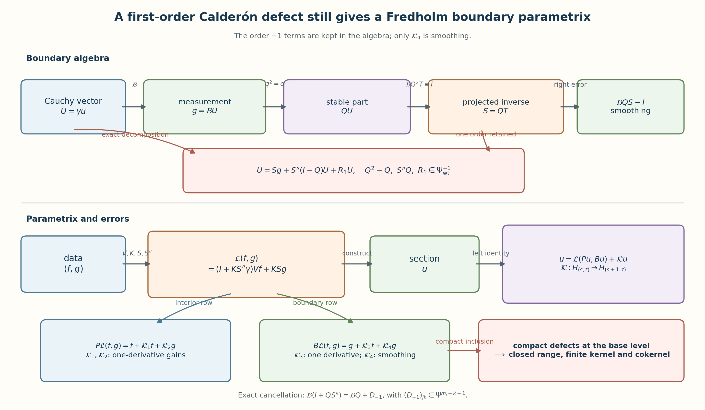
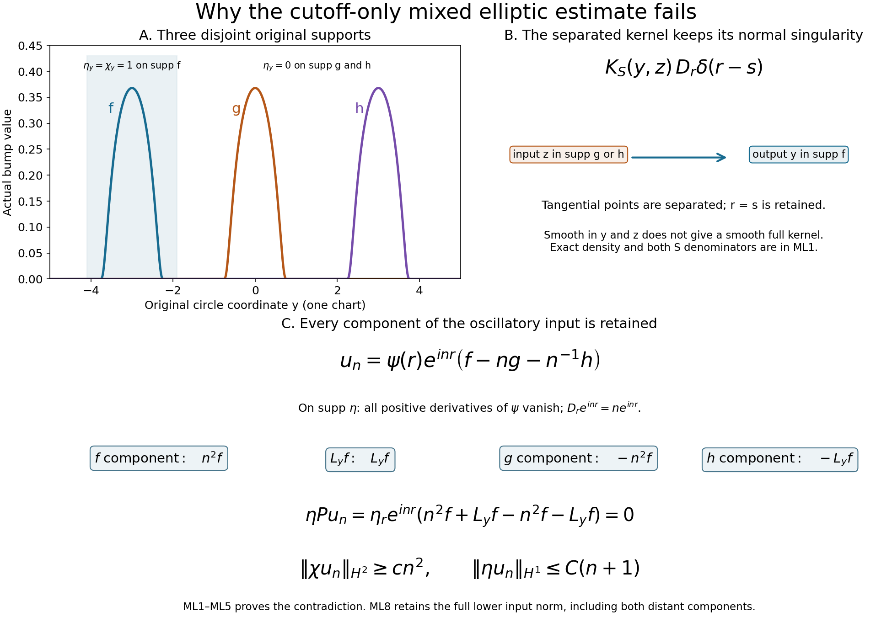

# Fredholm boundary problems with first-order Calderón defects

A boundary parametrix can be Fredholm even when its Calderón matrix is only a projection to leading order. The point is to keep the first lower-order defect in every formula. That defect gains one derivative, compact Sobolev inclusion handles it at the base level, and a separate cancellation makes the boundary right error smoothing.

This lesson builds the full argument. It starts with the original two measurement scales, proves extension regularity, derives both ordered Green errors, constructs the projected boundary inverse, checks all five anisotropic error maps, and proves regularity for solutions and dual obstructions. The final result is a Fredholm realization whose index is independent of Sobolev level and lower-order terms.

Named prerequisites are [Inverting mixed symbols without changing their scales](mixed-symbol-inversion.md), [Composing symbols with two independent orders](mixed-symbol-composition.md), [Sobolev mapping with normal and tangential weights](mixed-sobolev-mapping.md), [Finite inverse expansions for normal polynomials](polynomial-inverse-expansion.md), [Cauchy data from jumps and residues](calderon-cauchy-data.md), [Solving an elliptic system from compatible boundary measurements](general-boundary-fredholm.md), and Finite defects under perturbation. We use each result only with its stated hypotheses.

## 1. The operator, the two weights, and the boundary spaces

Let \(X\) be a compact smooth manifold with boundary \(Y\), and fix an inward collar coordinate \(t\geq0\). Let \(E\to X\) and \(F\to X\) have the same finite rank. Near \(Y\), the generalized interior operator has the ordered normal form

\[
 P^b=\sum_{a=0}^{m}P_a(y,t,D_y)D_t^a,
 \qquad \operatorname{ord}_{D_y}P_a\leq m-a,
 \qquad P_m(y,t):E_{(y,t)}\longrightarrow F_{(y,t)}
 \text{ invertible}.
 \tag{GF1}
\]

The tangential entries are classical pseudodifferential operators. The interior term \(P^i\) is supported away from the collar, and \(P=P^b+P^i\) has an elliptic extension to a boundaryless neighborhood \(\widehat X\). In a collar chart its complete left symbol \(p(x,\eta,\zeta)\) and inverse symbol \(\tau(x,\eta,\zeta)\) use the numerical symbol weights

\[
 R=1+|(\eta,\zeta)|,
 \qquad T=1+|\eta|,
 \qquad
 \|\partial_x^\beta\partial_\eta^\alpha\partial_\zeta^r a\|
 \leq C_{\beta\alpha r}R^{u-r}T^{v-|\alpha|}
 \tag{GF2}
\]

for \(a\in S^{u,v}\). The Sobolev norms retain the distinct quadratic weights

\[
 Q=(1+|\eta|^2+\zeta^2)^{1/2},
 \qquad h=(1+|\eta|^2)^{1/2},
 \qquad
 \|u\|_{(s,t)}^2=(2\pi)^{-n}\int Q^{2s}h^{2t}|\widehat u|^2.
 \tag{GF3}
\]

The complete constructions in Sections 14--18 and the full-extension correction in Section 23 give proper global operators \(\Tau=\operatorname{Op}(\tau)\), \(R_E\), and \(R_F\), with matrix multiplication in the displayed order, such that

\[
 \Tau P=I+R_E,
 \qquad P\Tau=I+R_F,
 \qquad r_E,r_F\in S^{-1,0}.
 \tag{GF4}
\]

Section 20 proves the stronger finite decompositions MH1--MH19 and their one-sided estimates, including boundary-supported inputs. For the first inverse, take N=1 in the actual finite construction:

\[
 \begin{aligned}
 r^+\Tau e^+&:\bar H_{(s,t)}\longrightarrow\bar H_{(s+m,t)},\\
 r^+R_Ee^+,\ r^+R_Fe^+&:\bar H_{(s,t)}\longrightarrow\bar H_{(s+1,t)}
 \qquad(s\geq0),
 \end{aligned}
 \tag{GF5}
\]

and, whenever \(w\in H_{(-m,r)}(\widehat X)\) is supported on \(Y\),

\[
 \begin{aligned}
 r^+\Tau w&\in\bar H_{(\nu,r-\nu)},\\
 r^+R_Ew,\ r^+R_Fw&\in\bar H_{(\nu+1-m,r-\nu)}
 \end{aligned}
 \qquad(\nu\in\mathbb R).
 \tag{GF6}
\]

All constants in (GF5)--(GF6) are finite combinations of the source \(R,T\) seminorms; the spaces themselves are the \(Q,h\) spaces (GF3).

Write \(\gamma_k u=(D_t^ku)|_Y\), \(0\leq k<m\), and \(\gamma u=(\gamma_0u,\ldots,\gamma_{m-1}u)\). For real \(r\), set

\[
 \mathcal C^r=\bigoplus_{k=0}^{m-1}H^{r-k-1/2}(Y,E),
 \qquad
 \mathcal D^r=\bigoplus_{j=1}^{J}H^{r-m_j-1/2}(Y,G_j).
 \tag{GF7}
\]

Let \(B_j=\sum_{k<m}B_{jk}\gamma_k\), where \(B_{jk}\in\Psi^{m_j-k}(Y;E,G_j)\), and write \(\mathcal B=(B_{jk})\). The complementing condition says that the principal boundary matrix \(b\) is a fiberwise bijection from the stable Cauchy bundle onto \(\bigoplus_jG_j\).

## 2. Elliptic regularity on the extension

Let \(u\in H^{s+m-1}_{\mathrm{comp}}(\widehat X,E)\) and \(Pu\in H^s_{\mathrm{comp}}(\widehat X,F)\). Choose chart cutoffs \(\chi\prec\eta\), so \(\eta=1\) on a neighborhood of \(\operatorname{supp}\chi\). With \([P,\eta]=P\eta-\eta P\), (GF4) gives on that chart

\[
 \chi u
 =\chi\Tau(\eta Pu)+\chi\Tau([P,\eta]u)
   -\chi R_E(\eta u)+G_\chi u.
 \tag{GF8}
\]

Here \(G_\chi=0\): apply the exact first identity of (GF4) to \(\eta u\) and then multiply by \(\chi\). Section 23 proves that tangentially separated mixed kernels can remain singular in the normal coordinate; their contribution stays in the full commutator. The commutator has generalized order \(m-1\): each normal commutator lowers the normal differential degree once, and each tangential commutator lowers the tangential pseudodifferential order once. U030 and (GF5) therefore give

\[
 \|\chi u\|_{H^{s+m}}
 \leq C_{\chi,\eta,K}
 \bigl(\|\eta Pu\|_{H^s}+\|u\|_{H^{s+m-1}}\bigr).
 \tag{GF9}
\]

The lower norm in (GF9) retains the entire input, including distant tangential components. The exact counterexample ML1--ML5 in Section 23 disproves the stronger estimate with only \(\eta u\) in that norm. In the overlap, invert the complete symbol of \(P^b+P^i\); ellipticity of \(P\) alone does not prove ellipticity of \(P^i\) there. Use ordinary interior charts only where the collar summand vanishes. ML6--ML8 gives both ordered full-extension errors. A finite partition of unity over a fixed compact \(K\supset\operatorname{supp}u\) proves

\[
 u\in H^{s+m}_{\mathrm{comp}}(\widehat X),
 \qquad
 \|u\|_{H^{s+m}}
 \leq C_K\bigl(\|Pu\|_{H^s}+\|u\|_{H^{s+m-1}}\bigr).
 \tag{GF10}
\]

This proves extension regularity in the generalized class. Repeating (GF10) raises any distributional solution with smooth right side through all real Sobolev orders, one full derivative at a time.

## 3. The boundary source and two exact Green identities

For a Cauchy vector \(U=(U_0,\ldots,U_{m-1})\), define the exact boundary distribution

\[
 \mathcal JU=\frac1i\sum_{a=1}^{m}P_a(y,t,D_y)
       \sum_{r=0}^{a-1}U_{a-1-r}\otimes D_t^r\delta_0.
 \tag{GF11}
\]

The coefficient \(P_a(y,t,D_y)\) acts after the delta derivative. Expanding that multiplication gives every normal derivative of \(P_a\) as in U025 (BF20); none is removed. For smooth \(u\), distributional differentiation of its zero extension gives

\[
 P(e^+u)=e^+(Pu)+\mathcal J\gamma u.
 \tag{GF12}
\]

Define

\[
 \begin{gathered}
 V=r^+\Tau e^+,
 \qquad K=r^+\Tau\mathcal J,
 \qquad Q=\gamma K,\\
 E=r^+R_Ee^+,
 \qquad F=r^+R_Fe^+,
 \qquad H=r^+R_F\mathcal J.
 \end{gathered}
 \tag{GF13}
\]

Apply \(r^+\Tau\) to (GF12), then use the first identity in (GF4). Apply \(P\) to the two terms in (GF13), then use the second identity in (GF4) and the fact that \(r^+\mathcal JU=0\). This proves the exact identities

\[
 u+Eu=V(Pu)+K\gamma u,
 \qquad
 PV=I+F,
 \qquad
 PK=H.
 \tag{GF14}
\]

The boundary source estimate is obtained without deleting any delta coefficient. If \(U_k\in H^{r-k-1/2}(Y)\), the coefficient of \(D_t^j\delta_0\) in (GF11) lies in \(H^{r-m+j+1/2}\). The full jet representation and cross-term Gram norm MH14--MH17 in Section 20 gives

\[
 \|\mathcal JU\|_{(-m,r)}
 \leq C_r\sum_{k=0}^{m-1}\|U_k\|_{H^{r-k-1/2}}.
 \tag{GF15}
\]

Combining (GF6) and (GF15) controls \(K\), \(E K\), \(V H\), and all later boundary-source terms for arbitrary real output split.

## 4. The generalized Calderón matrix

Write the full homogeneous principal polynomial, without identifying it with its leading normal coefficient, as

\[
 \mathfrak p(y,\eta,\zeta)
 =\sum_{a=0}^{m}p_{a,m-a}(y,\eta)\zeta^a.
 \tag{GF16a}
\]

Sections 21 and 24 prove that the entries of \(Q\) satisfy \(Q_{kl}\in\Psi^{k-l}(Y;E,E)\), including the full source and every output derivative. PC1--PC7 compares the actual inverse with the entire homogeneous polynomial, retaining the lower-order difference. Its weighted principal symbol is

\[
 q_{kl}(y,\eta)=\frac1{2\pi i}\int_{\Gamma_+}
 \sum_{j=0}^{m-1-l}\zeta^{k+j}
 \mathfrak p(y,\eta,\zeta)^{-1}
 p_{j+l+1,m-j-l-1}(y,\eta)\,d\zeta.
 \tag{GF16}
\]

The inverse stands on the left of the coefficient. The jump argument CD23--CD26 applies to this full matrix polynomial and proves that \(q^2=q\), with range equal to the Cauchy data of the inward-decaying frozen solutions. Consequently

\[
 Q^2-Q\in\Psi^{-1}_{\mathrm{wt}}(Y;E^{\oplus m},E^{\oplus m}),
 \tag{GF17}
\]

where weighted order \(-1\) means that the \((k,l)\) entry lies in \(\Psi^{k-l-1}\). No smoothing conclusion follows from the leading-symbol identity.

There is also an exact operator formula for this defect. Put \(u=KU\) in the first identity of (GF14). Since \(PKU=HU\), take Cauchy traces and obtain

\[
 Q^2-Q=\gamma E K-\gamma V H.
 \tag{GF18}
\]

Every term on the right gains one weighted derivative by (GF5), (GF6), and (GF15). This verifies the order in (GF17) from the actual ordered errors.

Put \(u=Vf\) in the same identity. Since \(PVf=f+Ff\), cancellation of \(Vf\) gives

\[
 Q\gamma Vf=\gamma E Vf-\gamma V Ff.
 \tag{GF19}
\]

Thus, for \(s\geq0\),

\[
 Q\gamma V:\bar H_{(s,t)}(X)\longrightarrow
 \bigoplus_{k=0}^{m-1}H^{s+t+m-k+1/2}(Y,E).
 \tag{GF20}
\]

The extra derivative in (GF20) comes from both ordered errors in (GF19); it is not obtained by tracing \(Vf\) alone.

## 5. Boundary inversion while the defect remains visible

Conjugate the Cauchy and target components by the invertible scalar order reductions of U025 (BF6)--(BF7). After this conjugation, \(Q\) and \(\mathcal B\) have order zero and the complementing condition says

\[
 b:q(E^{\oplus m})\longrightarrow\bigoplus_jG_j
 \quad\text{is an isomorphism for every }(y,\eta)\ne0.
 \tag{GF21}
\]

Because \(BQ^2\) has principal symbol \(bq\), the standard symbol recursion produces \(T\) such that

\[
 \mathcal BQ^2T-I\in\Psi^{-\infty}.
 \tag{GF22}
\]

Set \(S=QT\). Then

\[
 \mathcal BQS-I\in\Psi^{-\infty},
 \qquad
 QS-S=(Q^2-Q)T\in\Psi^{-1}_{\mathrm{wt}}.
 \tag{GF23}
\]

The column \(C=(\mathcal B,I-Q)^t\) has injective principal symbol: if \((I-q)v=0\) and \(bv=0\), then \(v\in\operatorname{ran}q\) and (GF21) forces \(v=0\). A full left symbol recursion gives a row \((T',T'')\) satisfying

\[
 T'\mathcal B+T''(I-Q)-I\in\Psi^{-\infty}.
 \tag{GF24}
\]

Define \(S''=T''(I-Q)\). The principal symbols of \(T'\) and \(S\) agree: for \(g=bqv\), (GF24) gives \(\sigma(T')g=qv\), while (GF22) gives \(\sigma(S)g=qv\). Hence \(T'-S\) is one weighted order lower. It follows that

\[
 \begin{aligned}
 R_0&=I-S\mathcal B-S''\in\Psi^{-1}_{\mathrm{wt}},\\
 S''Q&=T''(I-Q)Q\in\Psi^{-1}_{\mathrm{wt}},\\
 R_1&=R_0+S''Q\in\Psi^{-1}_{\mathrm{wt}}.
 \end{aligned}
 \tag{GF25}
\]

Undoing the order reductions preserves every entry degree:

\[
 S_{kj}\in\Psi^{k-m_j},
 \qquad
 S''_{kl}\in\Psi^{k-l},
 \qquad
 (R_i)_{kl}\in\Psi^{k-l-1}.
 \tag{GF26}
\]

For \(U=\gamma u\) and \(g=\mathcal BU\), (GF25) is the exact decomposition

\[
 U=Sg+S''(I-Q)U+R_1U.
 \tag{GF27}
\]

Taking the trace of the first identity in (GF14) gives \((I-Q)U=\gamma V(Pu)-\gamma Eu\). The order-minus-one terms in (GF25)--(GF27) have been retained; none has been renamed as smoothing.

## 6. The generalized local parametrix and all five errors

Define

\[
 \mathscr L(f,g)=(I+KS''\gamma)Vf+KSg.
 \tag{GF28}
\]

Substitute (GF27) and \((I-Q)U=\gamma Vf-\gamma Eu\) into (GF14). The exact left identity is

\[
 u=\mathscr L(Pu,Bu)+\mathscr Ku,
 \qquad
 \mathscr K=-E-KS''\gamma E+KR_1\gamma.
 \tag{GF29}
\]

Using \(PV=I+F\) and \(PK=H\) gives the interior row of the right identity:

\[
 P\mathscr L(f,g)=f+\mathscr K_1f+\mathscr K_2g,
 \qquad
 \mathscr K_1=F+HS''\gamma V,
 \qquad
 \mathscr K_2=HS.
 \tag{GF30}
\]

The boundary row is

\[
 B\mathscr L(f,g)=g+\mathscr K_3f+\mathscr K_4g,
 \tag{GF31}
\]

where

\[
 \mathscr K_3=\mathcal B(I+QS'')\gamma V,
 \qquad
 \mathscr K_4=\mathcal BQS-I\in\Psi^{-\infty}.
 \tag{GF32}
\]

The one-derivative gain in \(\mathscr K_3\) is an exact cancellation. Since \(S''=I-S\mathcal B-R_0\),

\[
 \begin{aligned}
 \mathcal B(I+QS'')
 &=\mathcal B+\mathcal BQ-\mathcal BQS\mathcal B-\mathcal BQR_0\\
 &=\mathcal BQ+D_{-1},
 \qquad
 D_{-1}=-\mathscr K_4\mathcal B-\mathcal BQR_0.
 \end{aligned}
 \tag{GF33}
\]

The \((j,k)\) entry of \(D_{-1}\) has order at most \(m_j-k-1\). Therefore (GF19) controls the \(\mathcal BQ\gamma V\) term and the order drop controls \(D_{-1}\gamma V\).

We now verify every required parametrix-error mapping. The trace of \(Vf\in\bar H_{(s+m,t)}\) has \(k\)-th component in \(H^{s+t+m-k-1/2}\). Equations (GF20) and (GF33) therefore give

\[
 \mathscr K_3:\bar H_{(s,t)}\longrightarrow
 \bigoplus_jH^{s+t+m-m_j+1/2}(Y,G_j)
 \qquad(s\geq0).
 \tag{GF34}
\]

For \(g_j\in H^{t+m-m_j-1/2}\), (GF26) gives
\((Sg)_k\in H^{t+m-k-1/2}\). Hence (GF15) puts \(\mathcal JSg\) in \(H_{(-m,t+m)}\). Use (GF6) for \(R_F\) with \(\nu=s+m\) to obtain

\[
 \mathscr K_2:
 \bigoplus_jH^{t+m-m_j-1/2}(Y,G_j)
 \longrightarrow\bar H_{(s+1,t-s)}(X,F)
 \qquad(s,t\in\mathbb R).
 \tag{GF35}
\]

For \(u\in\bar H_{(s,t)}\), \(s\geq m\), the first term of (GF29) belongs to \(\bar H_{(s+1,t)}\) by (GF5). Both \(S''\gamma Eu\) and \(R_1\gamma u\) have \(k\)-th component in \(H^{s+t-k+1/2}\); (GF15) and (GF6), with \(\nu=s+1\), put their images under \(K\) in the same interior space. Thus

\[
 \mathscr K:\bar H_{(s,t)}\longrightarrow\bar H_{(s+1,t)}
 \qquad(s\geq m).
 \tag{GF36}
\]

The identical calculation with \(F\) and \(HS''\gamma V\) gives

\[
 \mathscr K_1:\bar H_{(s,t)}\longrightarrow\bar H_{(s+1,t)}
 \qquad(s\geq0).
 \tag{GF37}
\]

Finally, (GF23) gives

\[
 \mathscr K_4:\mathcal D'(Y,\mathcal G)\longrightarrow C^\infty(Y,\mathcal G).
 \tag{GF38}
\]

Equations (GF34)--(GF38) prove all five requested estimates, including the absence of \(s\) from the input exponent in (GF35).

## 7. One derivative at a time for solutions

Let \(u\in\bar H^m\) have bounded collar support, let \(Pu\in\bar H^{s-m}\), and let \(B_ju\in H^{s-m_j-1/2}\), where \(s\geq m\). Suppose first that \(u\in\bar H^r\) for some \(m\leq r<s\), and put

\[
 r_+=\min(s,r+1).
 \tag{GF39}
\]

Choose \(\chi\prec\eta\) in the collar and apply (GF29) to \(\eta u\). The interior commutator \([P,\eta]u\) has order \(m-1\), so it lies in \(H^{r-m+1}\subset H^{r_+-m}\). For the boundary rows, write \(\eta_a=(D_t^a\eta)|_Y\), so \(\eta_0=\eta|_Y\), and let \(M_{\eta_a}\) denote multiplication by \(\eta_a\). The full normal Leibniz formula is

\[
 \begin{aligned}
 \gamma_k(\eta u)
 &=\sum_{a=0}^k\binom ka M_{\eta_a}\gamma_{k-a}u,\\
 B_j(\eta u)-M_{\eta_0}B_ju
 &=\sum_{k=0}^{m-1}[B_{jk},M_{\eta_0}]\gamma_ku\\
 &\quad+\sum_{k=0}^{m-1}\sum_{a=1}^k
     \binom ka B_{jk}M_{\eta_a}\gamma_{k-a}u.
 \end{aligned}
 \tag{GF40}
\]

The first line follows by induction from the product rule for \(D_t\); applying each \(B_{jk}\) and subtracting \(M_{\eta_0}\sum_kB_{jk}\gamma_ku\) gives the remaining lines in the displayed order. The first sum has coefficient order at most \(m_j-k-1\). In the second sum put \(l=k-a\). Its coefficient has order at most \(m_j-k=m_j-l-a\leq m_j-l-1\), with every binomial factor and cutoff derivative retained. Thus each coefficient acting on \(\gamma_lu\in H^{r-l-1/2}\) has output in \(H^{r-m_j+1/2}\subset H^{r_+-m_j-1/2}\). The normal-cutoff terms need not vanish; they satisfy precisely the same weighted order bound. Tangentially separated terms retain their normal-diagonal kernels and the actual lower mixed orders of Sections 14, 18 and 20. The input at this step is known globally in the lower Sobolev space, so the full commutator estimates apply. The data term \(\mathscr L(P(\eta u),B(\eta u))\) therefore lies in \(\bar H^{r_+}\), while (GF36) puts \(\mathscr K(\eta u)\) in \(\bar H^{r+1}\subset\bar H^{r_+}\). Hence \(\chi u\in\bar H^{r_+}\).

Starting with \(r_0=m\), define \(r_{a+1}=\min(s,r_a+1)\). After \(\lceil s-m\rceil\) steps, \(r_a=s\). If \(s-m\) is not an integer, the final step has size strictly below one and all inclusions in (GF40) remain valid. A finite collar partition and ordinary interior regularity prove

\[
 u\in\bar H^s(X,E).
 \tag{GF41}
\]

This proves the solution bootstrap with the fractional final step and all cutoff commutators included.

## 8. The dual one-step bootstrap

Assume the following relation on the whole compact manifold and its boundary:

\[
 \langle Pu,v\rangle_X+\sum_j\langle B_ju,h_j\rangle_Y=0
 \quad\text{for every compactly supported smooth }u,
 \tag{GF42}
\]

with

\[
 v\in\bar H_{(0,t)}(X,F^*\otimes\Omega_X),
 \qquad
 h_j\in H^{t+m_j+1/2-m}(Y,G_j^*\otimes\Omega_Y).
 \tag{GF43}
\]

Insert \(u=\mathscr L(0,g)\) in (GF42) and use (GF30)--(GF32). For smooth global boundary data \(g\),

\[
 h=-\mathscr K_2'v-\mathscr K_4'h.
 \tag{GF44}
\]

In (GF35), choose its two free parameters to be \(s=-1\) and \(t=-t_{\!0}-1\), where \(t_{\!0}\) denotes the exponent in (GF43). Then

\[
 \mathscr K_2:
 \bigoplus_jH^{-t_{\!0}+m-m_j-3/2}
 \longrightarrow\bar H_{(0,-t_{\!0})}.
 \tag{GF45}
\]

Transposition of (GF45), together with the smoothing term in (GF44), proves

\[
 h_j\in H^{t_{\!0}+1+m_j+1/2-m}.
 \tag{GF46}
\]

Next insert \(u=\mathscr L(f,0)\). Then

\[
 v=-\mathscr K_1'v-\mathscr K_3'h.
 \tag{GF47}
\]

The pointwise inequality \(h/Q\leq1\) gives the continuous embedding
\(H_{(0,t_{\!0})}\hookrightarrow H_{(-1,t_{\!0}+1)}\). With \(s=0\), \(t=-t_{\!0}-1\), (GF37) transposes to

\[
 \mathscr K_1':\dot H_{(-1,t_{\!0}+1)}(\overline X)\longrightarrow \dot H_{(0,t_{\!0}+1)}(\overline X).
 \tag{GF48}
\]

For the same parameters, (GF34) has boundary output exponent
\(-t_{\!0}+m-m_j-1/2\); its dual is exactly the exponent of \(h_j\) in (GF43). Therefore

\[
 \mathscr K_3':
 \bigoplus_jH^{t_{\!0}+m_j+1/2-m}
 \longrightarrow \dot H_{(0,t_{\!0}+1)}(\overline X).
 \tag{GF49}
\]

Equations (GF47)--(GF49) prove

\[
 v\in\bar H_{(0,t+1)},
 \qquad
 h_j\in H^{t+1+m_j+1/2-m}.
 \tag{GF50}
\]

The dual of a restriction space is the supported Sobolev space with negated exponents. Since the normal order of \(v\) is zero, its zero extension is bounded into \(H_{(0,t_{\!0})}\) and has support in \(\overline X\). PC8 proves its embedding into \(\dot H_{(-1,t_{\!0}+1)}(\overline X)\). Thus (GF48)--(GF49) act on that supported zero extension and their output is restricted back to \(X\). Section 24 proves every pairing, density and extension-independence step in PC8--PC9. The global relation authorizes both parametrix columns; no arbitrary isolated-patch smoothing claim is used.

Iterating (GF50) makes every \(h_j\) smooth and gives unlimited tangential regularity to \(v\). After finitely many steps the second mixed exponent is nonnegative, so \(v\in L^2\). Tests away from \(Y\) show \(P^\dagger v=0\) in the interior. The boundary relation can be written

\[
 P^\dagger e^+v
 =-\sum_{k=0}^{m-1}(-1)^k
   \left(\sum_jB_{jk}^\dagger h_j\right)\otimes D_t^k\delta_0.
 \tag{GF51}
\]

Move the normal derivatives of \(P^\dagger\) to the right. Its leading normal coefficient is the invertible map \((-1)^mP_m^t\). Exactly as in BF40, comparison from \(D_t^{m-1}\delta_0\) downward uniquely determines smooth exterior jets \(\gamma_0w,\ldots,\gamma_{m-1}w\) that cancel (GF51). Recursively impose \(\gamma_r(P^\dagger w)=0\) for every \(r\geq0\); at each stage the new jet has coefficient \((-1)^mP_m^t\), while the tangential pseudodifferential coefficients act on already known smooth fields and therefore preserve smoothness. The convergent Borel construction BF41 realizes these jets on the exterior collar. Then

\[
 W=e^+v+e^-w,
 \qquad P^\dagger W\in C^\infty
 \tag{GF52}
\]

near \(Y\). The full transpose is elliptic and has the same mixed kernel estimates. Applying the corrected full-operator (GF10) repeatedly to \(P^\dagger\) proves \(W\), and hence \(v\), smooth up to the boundary.

## 9. Closed range and the finite defect spaces

At the base level put

\[
 \mathcal Y^m=\bar H^0(X,F)\oplus
 \bigoplus_jH^{m-m_j-1/2}(Y,G_j),
 \qquad
 A_m u=(Pu,Bu).
 \tag{GF53}
\]

Equations (GF28)--(GF29) give bounded \(\mathscr L:\mathcal Y^m\to\bar H^m\) and

\[
 I=\mathscr L A_m+\mathscr K,
 \qquad
 \mathscr K:\bar H^m\longrightarrow\bar H^{m+1}.
 \tag{GF54}
\]

The inclusion \(\bar H^{m+1}\hookrightarrow\bar H^m\) is compact. If the unit ball of \(\ker A_m\) were not compact, choose a sequence in it with no convergent subsequence. Formula (GF54) makes that sequence equal to its \(\mathscr K\)-image, which does have a convergent subsequence. Hence \(\ker A_m\) is finite-dimensional.

Let \(u_n\perp\ker A_m\) and suppose \(A_mu_n\) is Cauchy. The sequence \(u_n\) is bounded. Otherwise, after passing to a subsequence with \(\|u_n\|\to\infty\), set \(w_n=u_n/\|u_n\|\). Then \(A_mw_n\to0\), while compactness gives a convergent subsequence of \(\mathscr Kw_n\). Equation (GF54) makes \(w_n\) converge to a unit vector \(w\in\ker A_m\), contradicting \(w_n\perp\ker A_m\). From boundedness, compactness of \(\mathscr K\), convergence of \(\mathscr LA_mu_n\), and (GF54), a subsequence of \(u_n\) converges strongly. Applying the same argument to differences shows the whole sequence is Cauchy. Thus \(\operatorname{ran}A_m\) is closed.

For the cokernel use the full right identity (GF30)--(GF32) on the base data space:

\[
 A_m\mathscr L=I+\mathscr R,\qquad
 \mathscr R=
 \begin{pmatrix}
 \mathscr K_1&\mathscr K_2\\
 \mathscr K_3&\mathscr K_4
 \end{pmatrix}:\mathcal Y^m\longrightarrow\mathcal Y^m.
 \tag{GF54R}
\]

Every block is compact in this specific space. With \(\mathcal D^m\) as in (GF7), (GF34), (GF35), and (GF37) at \(s=t=0\), and (GF38), give the factorizations

\[
 \begin{aligned}
 \mathscr K_1&:\bar H^0(X,F)\longrightarrow
       \bar H^1(X,F)\hookrightarrow\bar H^0(X,F),\\
 \mathscr K_2&:\mathcal D^m\longrightarrow
       \bar H^1(X,F)\hookrightarrow\bar H^0(X,F),\\
 \mathscr K_3&:\bar H^0(X,F)\longrightarrow
       \mathcal D^{m+1}\hookrightarrow\mathcal D^m,\\
 \mathscr K_4&:\mathcal D^m\longrightarrow
       \mathcal D^{m+1}\hookrightarrow\mathcal D^m.
 \end{aligned}
 \tag{GF54M}
\]

The first arrows are bounded. The second arrows are compact Sobolev inclusions on the compact \(X\) or \(Y\), with a finite sum over the boundary bundles. The inclusion \(\bar H^1(X,F)\hookrightarrow\bar H^0(X,F)\) gains a full derivative, including the normal direction. Tangential gain alone would not justify this step. Write the matrix as the sum of its four blocks composed with the bounded coordinate projections and injections of \(\mathcal Y^m\). Composition with bounded maps and finite addition preserve compactness, so \(\mathscr R\) is compact.

We also need compactness of its transpose on the continuous dual, with the original pairings and densities. Here is a proof. For any \(\varepsilon>0\), take a finite \(\varepsilon\)-net \(y_1,\ldots,y_N\) for the image of the unit ball under \(\mathscr R\). Let \(\Pi_\varepsilon\) be the orthogonal projection in the Hilbert space \(\mathcal Y^m\) onto their span. The distance-minimizing property of orthogonal projection gives
\(\|\mathscr R-\Pi_\varepsilon\mathscr R\|\leq\varepsilon\).
The transpose of \(\Pi_\varepsilon\mathscr R\) has finite rank, and
\(\|T'\|=\|T\|\) for a bounded map \(T\): the inequality in one direction follows from the dual norm, and the reverse follows by taking a unit functional attaining the norm of each nonzero vector \(Tx\) in a Hilbert space. Hence \(\mathscr R'\) is an operator-norm limit of finite-rank maps. Such a limit is compact, because the image of the unit ball has, for every positive radius, a finite net obtained from a sufficiently close finite-rank map; its closure is complete and totally bounded, therefore compact.

Let

\[
 Z=\{z\in(\mathcal Y^m)':\langle A_mu,z\rangle=0
           \text{ for every }u\in\bar H^m(X,E)\}.
 \tag{GF54Z}
\]

This is a closed linear subspace of the dual. Its elements are the pairs \((v,h)\) in (GF42) at \(t=0\), with
\[
 v\in\bar H^0(X,F^*\otimes\Omega_X),\qquad
 h_j\in H^{-m+m_j+1/2}(Y,G_j^*\otimes\Omega_Y).
\]
Transposing (GF54R), with no reversal of the block composition omitted, gives

\[
 \mathscr L'A_m'=I+\mathscr R',\qquad
 z=-\mathscr R'z\quad(z\in Z).
 \tag{GF54D}
\]

The closed unit ball of \(Z\) is contained in the compact closure of the image of the dual unit ball under \(-\mathscr R'\), and it is closed there. It is therefore compact. The fixed-point lemma proved in Exercise 5 now makes \(Z\) finite-dimensional. Section 8 separately proves its elements smooth; the tangential bootstrap in that section is used for regularity, not compact inclusion. Since the range is closed, the quotient \(\mathcal Y^m/\operatorname{ran}A_m\) is a Hilbert space isomorphic to its orthogonal complement. Continuous functionals vanishing on the range identify its dual with \(Z\), so its dimension equals \(\dim Z\). Consequently \(A_m\) is Fredholm.

## 10. Every Sobolev level and the index

For \(s\geq m\), define

\[
 \mathcal Y^s=\bar H^{s-m}(X,F)\oplus
 \bigoplus_jH^{s-m_j-1/2}(Y,G_j),
 \qquad
 A_s:\bar H^s(X,E)\longrightarrow\mathcal Y^s.
 \tag{GF55}
\]

Let \(Z\) be the finite-dimensional smooth annihilator found at level \(m\). Necessity in

\[
 \operatorname{ran}A_s
 =\left\{(f,g)\in\mathcal Y^s:
   \langle f,v\rangle+\sum_j\langle g_j,h_j\rangle=0
   \text{ for every }(v,h)\in Z\right\}
 \tag{GF56}
\]

follows by density. Conversely, data in the right side belong to \(\mathcal Y^m\), so base-level closed range gives \(u\in\bar H^m\) with \(A_mu=(f,g)\). The solution bootstrap (GF41) gives \(u\in\bar H^s\), proving sufficiency. A nullvector has zero smooth data, so the same bootstrap makes it smooth. Hence the kernel and annihilator are the same spaces at every \(s\geq m\), and

\[
 \operatorname{ind}A_s=\dim\ker A_m-\dim Z
 \qquad(s\geq m).
 \tag{GF57}
\]

Changing \(P\) by generalized order at most \(m-1\), or changing the \((j,k)\) boundary entry by order at most \(m_j-k-1\), maps into a Sobolev space one order above the target. Compact Sobolev inclusion makes the resulting change of \(A_s\) compact, so (GF57) is unchanged. A sufficiently small change of the finite coefficient and symbol seminorms gives a small operator-norm change \(\bar H^s\to\mathcal Y^s\). Fredholm operators form an open set and their index is locally constant. Uniform invertibility of the interior principal symbol and of (GF21) on the compact cosphere bundle also persists under such a change. This proves the generalized Fredholm and index-stability theorem.

## 11. A scalar check that detects the retained defect

Take \(m=1\), one boundary component, and suppose the stable symbol is the scalar \(q=1\), while the constructed Calderón operator is

\[
 Q=I+A_{-1},
 \qquad A_{-1}\in\Psi^{-1}(Y),
 \qquad A_{-1}\notin\Psi^{-\infty}(Y).
 \tag{GF58}
\]

Then

\[
 Q^2-Q=A_{-1}+A_{-1}^2\in\Psi^{-1},
 \tag{GF59}
\]

and the leading order-minus-one symbol is that of \(A_{-1}\). With \(B=I\), choose a two-sided parametrix \(T\) of \(Q^2\) and set \(S=QT\). Then \(BQS-I=Q^2T-I\) is smoothing, while

\[
 QS-S=(Q^2-Q)T
 \tag{GF60}
\]

generally remains order \(-1\). This model checks the distinction used in (GF23)--(GF25): the boundary right error can be smoothing even though the Calderón and range defects are only one order lower.

## 12. Exercises with complete solutions

### Exercise 1. Recover every entry order after the order reduction

Assume the source Cauchy component \(k\) has weight \(k\), the target component \(j\) has weight \(m_j\), and the conjugated inverse has order zero. Prove that the original entries of \(S\), \(S''\), and \(R_1\) have the orders asserted in (GF26).

**Solution.** The source reduction \(D_a\) has diagonal entry of order \(k\), and the target reduction \(D_b\) has diagonal entry of order \(m_j\). Undoing \(\widehat S=D_a^{-1}SD_b\) gives \(S=D_a\widehat S D_b^{-1}\), so

\[
 \operatorname{ord}S_{kj}=k-m_j.
 \tag{GF61}
\]

For an endomorphism of the Cauchy vector, both reductions use the source weights, giving \(\operatorname{ord}S''_{kl}=k-l\). A weighted order-minus-one endomorphism loses one further order, so \(\operatorname{ord}(R_1)_{kl}=k-l-1\). These are exactly the degrees in (GF26); no common scalar order replaces the component degrees.

### Exercise 2. Derive the cancellation in the boundary right error

Starting only from \(R_0=I-S\mathcal B-S''\) and \(\mathscr K_4=\mathcal BQS-I\), derive (GF33).

**Solution.** The first identity gives \(S''=I-S\mathcal B-R_0\). Substitute it without commuting any matrix factors:

\[
 \begin{aligned}
 \mathcal B(I+QS'')
 &=\mathcal B+\mathcal BQ-\mathcal BQS\mathcal B-\mathcal BQR_0\\
 &=\mathcal BQ-\mathscr K_4\mathcal B-\mathcal BQR_0.
 \end{aligned}
 \tag{GF62}
\]

The first correction is smoothing. The second contains \(R_0\), whose \((k,l)\) entry has order \(k-l-1\). Thus the entire correction to \(\mathcal BQ\) has entry order at most \(m_j-k-1\), which is the derivative gain used in (GF34).

### Exercise 3. Check the two free exponents in \(\mathscr K_2\)

Let \(g_j\in H^{t+m-m_j-1/2}\). Use only (GF15), (GF6), and the orders of \(S\) to prove (GF35).

**Solution.** Formula (GF61) gives
\((Sg)_k\in H^{t+m-k-1/2}\). Hence (GF15) gives
\(\mathcal JSg\in H_{(-m,t+m)}\). The \(R_F\) line of (GF6) sends a boundary-supported input in \(H_{(-m,r)}\) to
\(H_{(\nu+1-m,r-\nu)}\). Set

\[
 r=t+m,
 \qquad \nu=s+m.
 \tag{GF63}
\]

The output is \(H_{(s+1,t-s)}\), for arbitrary real \(s,t\). The input exponent contains no \(s\), exactly as (GF35) states.

### Exercise 4. Verify the dual gain for the boundary obstruction

In (GF35), put \(s=-1\) and replace its second parameter by \(-t-1\). Compute the transposed map and show that it raises the exponent of \(h_j\) by one.

**Solution.** With those parameters, (GF35) becomes

\[
 \mathscr K_2:
 \bigoplus_jH^{-t+m-m_j-3/2}
 \longrightarrow H_{(0,-t)}.
 \tag{GF64}
\]

Sobolev duality reverses both exponents. Therefore
\(\mathscr K_2'\) maps \(H_{(0,t)}\) into
\(\bigoplus_jH^{t+1+m_j+1/2-m}\). Formula (GF44), together with the smoothing transpose \(\mathscr K_4'\), proves the asserted one-step gain for \(h\).

### Exercise 5. Prove the compact fixed-point lemma used twice above

Let \(X\) be a Banach space, \(C:X\to X\) compact, and \(M\subset X\) a linear subspace such that \(x=Cx\) for every \(x\in M\). Prove that \(M\) is finite-dimensional.

**Solution.** Keep the given subspace \(M\), and introduce the entire fixed space \(F=\ker(I-C)\). It is a closed linear subspace of the Banach space \(X\), and \(M\subset F\). If \(x_n\in F\) tends to \(x\) in \(X\), continuity gives \(x=Cx\), which proves \(x\in F\); it does not by itself prove membership in the original arbitrary \(M\).

Let \(B_F=\{x\in F:\|x\|\leq1\}\). For every \(x\in B_F\), \(x=Cx\), so \(B_F\) is contained in \(C(B_X)\). It is closed in \(X\) and thus closed in the compact closure of \(C(B_X)\). Therefore \(B_F\) is compact.

For completeness, an infinite-dimensional normed space has a sequence of unit vectors whose pairwise distances exceed \(1/2\). To construct the next vector, let \(L\) be the span of the finitely many previous ones. This finite-dimensional subspace is closed and is proper. Choose \(y\notin L\), put \(d=\operatorname{dist}(y,L)>0\), and choose \(l\in L\) with \(\|y-l\|<2d\). Then \(x=(y-l)/\|y-l\|\) has norm one and distance \(d/\|y-l\|>1/2\) from \(L\). Induction gives the asserted sequence, which cannot have a Cauchy subsequence. Applying this to \(F\) would contradict compactness of \(B_F\). Hence \(F\) is finite-dimensional, and its subspace \(M\) satisfies

\[
 \dim M<\infty.
 \tag{GF65}
\]

Apply this once to \(M=\ker A_m\) through (GF54), and once to the range annihilator through the compact transpose identity (GF54D).

## 13. Reading notes and references

The mixed symbol and Sobolev estimates used here are proved in the four named prerequisite lessons at the start. The residue projection and its stable Cauchy range come from [Cauchy data from jumps and residues](calderon-cauchy-data.md), while the order reductions, boundary source, exterior-jet construction, and functional-analytic index argument extend the corresponding differential proofs in [Solving an elliptic system from compatible boundary measurements](general-boundary-fredholm.md).

A related primary source with author-submitted TeX is Gerd Grubb, “Fractional Laplacians on domains, a development of Hörmander's theory of μ-transmission pseudodifferential operators,” arXiv:1310.0951v5. The present lesson gives its own proofs of (GF1)--(GF65) and does not use either reference as a replacement for a displayed argument.

The remaining sections provide the complete collar, normal expansion, half-space, source, trace and freezing proofs used above. Section 23 records the exact correction of the stronger local estimate; Section 24 supplies the full principal-symbol comparison and the globally scoped dual relation.

## 14. Patching the original collar operator with both error bundles {#boundary-foundation-14}

### The unchanged collar object and its two weights

Let \(X\) be compact with smooth boundary \(Y\), and fix one collar \(c:Y\times[0,\epsilon)\to X\) with inward coordinate \(r\geq0\). Fix the source and target bundles \(E,F\), their collar identifications with the pullbacks of \(E_Y,F_Y\), and Hermitian norms. Write \(D_r=-i\partial_r\). The operator in the collar is
\[
 P^b=\sum_{j=0}^{m}A_j(r)D_r^j:E_Y\longrightarrow F_Y,
 \qquad A_j(r)\in\Psi_{\mathrm{phg}}^{m-j}(Y;E_Y,F_Y),
 \qquad A_m(r)=M(r),
 \tag{GI1}
\]
where \(m\geq1\), \(M(r)\) is a bundle map, the families are smooth in \(r\in(-1,1)\), and they vanish for \(r>2/3\) in this original collar presentation. The interior term \(P^i\in\Psi_{\mathrm{phg}}^m(X^\circ;E,F)\) has kernel supported in \((X\setminus X_{1/2})^2\). Thus \(P=P^b+P^i\) equals \(P^b\) when either operator variable is in a sufficiently narrow collar. The interior term and the extension of (GI1) away from that narrow collar are retained as parts of the original object; the construction below only uses the region where (GI1) actually represents \(P\).

The original boundary operators are also retained:
\[
 B_j u=\sum_{k=0}^{m-1}B_{jk}\gamma_k u,
 \quad \gamma_k u=(D_r^ku)|_{r=0},
 \quad B_{jk}\in\Psi_{\mathrm{phg}}^{m_j-k}(Y;E_Y,G_j).
 \tag{GI1a}
\]
Their transverse degree is below \(m\), while the total order \(m_j\) is unrestricted. They play no role in inverting \(P_c\) on the full cylinder, but their exact transformation and trace targets are recorded in GI-007; a boundary condition is never inferred from the interior inverse alone.

In every chart of \(Y\), put \(x=(y,r)\), \(\xi=(\eta,\kappa)\), and
\[
 R(\eta,\kappa)=1+|(\eta,\kappa)|,\qquad
 T(\eta)=1+|\eta|.
 \tag{GI2}
\]
The local mixed class \(S^{a,b}\) has all seminorms
\[
 \sup_{x,\eta,\kappa}
 \frac{\|\partial_x^\beta\partial_\eta^\gamma\partial_\kappa^\ell a(x,\eta,\kappa)\|}
 {R^{a-\ell}T^{b-|\gamma|}}<\infty.
 \tag{GI3}
\]
The total-frequency order and tangential order are different. The Sobolev Hilbert norm instead has the smooth quadratic multipliers
\[
 \|u\|_{H_{(s,t)}}^2=(2\pi)^{-\dim X}\int
 (1+|\xi|^2)^s(1+|\eta|^2)^t\|\widehat u(\xi)\|^2\,d\xi.
 \tag{GI4}
\]
The mixed inverse and mixed Sobolev prerequisite lessons prove the exact identity of the vectors and equivalent seminorms/norms obtained from (GI2) and the corresponding square-root quadratic weights. The factors in (GI2) and (GI4) are never identified numerically.

For the gluing argument let \(\mathscr M^a\) denote the proper fixed-collar operators defined exactly in GI-003a below: they have local symbols \(S^{a,0}\) in common tangential charts and retain tangentially separated normal kernels of order \(a\). Let \(\mathscr E^a\subset\mathscr M^a\) denote the enhanced operators whose local symbols satisfy
\[
 \partial_{\xi_k}a\in S^{a-1,0}\quad(1\leq k\leq\dim X).
 \tag{GI5}
\]
The enhanced class also has tangentially separated normal kernels one total order lower, as GI-003a proves. This is an added verified property of the actual polynomial and its inverse, not an inference from \(S^{a,0}\) membership. We use \(\mathscr M^{a,b}\) when the second order must be stated. Local operators are compared only after compact cutoff localization. A smooth kernel of compact support is in every \(\mathscr M^{a,b}\), but a tangentially smoothing operator followed by \(D_r^j\) need not have a smooth full kernel.

Shrink to a closed interval \(I=[-\delta,\delta]\subset(-1,1)\) so that the extension of (GI1) remains elliptic and \(M(y,r):E_y\to F_y\) is invertible on \(Y\times I\). This is possible: the real normal covector \((\eta,\kappa)=(0,1)\) makes the homogeneous polynomial equal to \(M(y,0)\), so ellipticity gives its inverse at \(r=0\); continuity and compactness give a uniform interval. Let \(h:\mathbb R\to I^\circ\) be smooth, equal to \(r\) for \(|r|\leq\delta_0<\delta\), constant for \(|r|\geq2\delta_0\), with bounded derivatives and image in a smaller closed interval inside \(I\). Such a map is obtained by integrating a smooth compactly supported nonnegative derivative of total mass less than \(2\delta\), then choosing its central portion to have derivative one. Set
\[
 P_c=\sum_{j=0}^{m}A_j(h(r))D_r^j
 :C_c^\infty(Y\times\mathbb R,E_Y)\longrightarrow
 C_c^\infty(Y\times\mathbb R,F_Y).
 \tag{GI6}
\]
Each coefficient is the original family evaluated at the displayed normal value; no matrix is commuted through a tangential operator. Equation (GI6) agrees exactly with \(P\) on the smaller collar where \(h(r)=r\geq0\), since \(P^i\) has no kernel meeting that collar. Its \(r\)-derivatives are uniformly bounded because \(h\) has bounded derivatives and its image is compact in \(I\). Its principal symbol is the original homogeneous polynomial at \((y,h(r),\eta,\kappa)\); compactness of \(Y\times h(\mathbb R)\times\{|\xi|=1\}\) gives a uniform smallest singular value \(c_*>0\). This is an elliptic extension on the product cylinder, not a claim that \(P\) extends elliptically across an entire topological double.

### Local Euclidean extensions and the raw inverse condition

Take a finite tangential atlas and subordinate compact chart cores covering \(Y\). Choose nested compact supports in each chart: the eventual partition support lies inside a region where the eventual auxiliary cutoff equals one, and the auxiliary cutoff support lies inside a region where the coefficient extension below is the identity. Choose a further tangential cutoff \(\psi_i\), equal to one near all those supports and the eventual image of the extension map. In the chosen chart and bundle frames, let \(p_j(y,r,\eta)\) be the **exact left symbol** of \(\psi_i A_j(h(r))\psi_i\): Fourier transform its compact tangential distribution kernel in the input-output coordinate difference. The local tangential pseudodifferential construction [Geometric symbol and kernel calculus](geometric-microlocal-calculus.md) gives every classical symbol estimate and all \(r\)-parameter derivatives, including its compact smooth-kernel contribution. For \(j=m\), this exact symbol is \(\psi_i(y)^2M(y,h(r))\), equal to \(M\) wherever \(\psi_i=1\). On those supports the local polynomial is
\[
 p(y,r,\eta,\kappa)=\sum_{j=0}^{m}p_j(y,r,\eta)\kappa^j,
 \quad p_j\in S^{m-j}_{\rm tan},\quad p_m=M(y,h(r)).
 \tag{GI7}
\]
The coordinate proof CPA-001 and CPA-005 gives \(p\in S^{m,0}\) and \(\partial_{\xi_k}p\in S^{m-1,0}\), with every coefficient, derivative, and matrix order retained. At a fixed compact chart core, choose a slightly larger coordinate ball on which the coefficient symbols and the uniform elliptic bound hold and \(\psi_i=1\). A smooth map \(\varkappa:\mathbb R^{\dim Y}\to\) that ball can be chosen to equal the identity near the core and throughout the auxiliary-cutoff support, have bounded derivatives of every order, and equal a fixed point of the ball outside a larger ball: use \(\varkappa(y)=y_0+\zeta(y)(y-y_0)\) with the support ball convex and small enough. Put
\[
 p^{\rm ext}(y,r,\eta,\kappa)
 =\sum_{j=0}^{m}p_j(\varkappa(y),r,\eta)\kappa^j.
 \tag{GI8}
\]
The image of \(\varkappa\) is compact in the original chart. The chain rule therefore supplies all global base seminorms of (GI3), including mixed derivatives of \(h\) and \(\varkappa\), and retains (GI5). This extension agrees with the actual symbol throughout the later auxiliary-cutoff support. It never interpolates two elliptic polynomials by an unverified convex path.

For clarity, the uniform inverse estimate remains in its original raw form. Write \(H\) for the homogeneous principal polynomial of (GI8), including the continuous zero values of tangential homogeneous terms of positive degree. On the compact image just described, for real \(|\omega|=1\),
\[
 \|H(x,\omega)v\|\geq c_i\|v\|,
 \qquad \|p^{\rm ext}(x,\xi)-H(x,\xi)\|
 \leq C_i R^{m-1}.
 \tag{GI9}
\]
The second bound follows coefficient by coefficient from the full classical tangential expansions; it is the estimate GI9 proves coefficient by coefficient, with the original positive degrees and all lower terms. Set
\[
 r_i=\max\{1,2^mC_i/c_i\},\qquad B_i=2/c_i.
 \tag{GI10}
\]
For \(s=|\xi|\geq r_i\), \(R/s\leq2\) and the matrix geometric series applied in its given order give
\[
 s^m\|(p^{\rm ext})^{-1}\|\leq B_i.
 \tag{GI11}
\]
Only then does \(\|(p^{\rm ext})^{-1}\|\leq2^mB_iR^{-m}\) follow. The literal \(|\xi|^m\) in (GI11) is the hypothesis used by the mixed inverse prerequisite. The same proof works for \(\dim Y=0\), with \(T=1\) and no tangential homogeneous terms.

Choose a frequency cutoff \(\theta_i=1-\chi_i\), where \(\chi_i=1\) on \(|\xi|\leq r_i\) and has compact support. Define
\[
 \tau_i=\theta_i(p^{\rm ext})^{-1}:F_i\to E_i,
 \qquad T_i=\operatorname{Op}(\tau_i).
 \tag{GI12}
\]
The mixed inverse theorem prove \(\tau_i\in S^{-m,0}\) and every \(\partial_{\xi_k}\tau_i\in S^{-m-1,0}\). The exact mixed composition theorem prove, in the exact two matrix orders,
\[
 T_iP_i=I_{E_i}+R_{E,i},\qquad
 P_iT_i=I_{F_i}+R_{F,i},\qquad
 R_{E,i},R_{F,i}\in\mathscr M^{-1},
 \tag{GI13}
\]
where \(P_i=\operatorname{Op}(p^{\rm ext})\). Their symbols are the two different ordered composition remainders of MC19--MC20: the first has \(\partial_\xi\tau_i\) on the left of \(D_xp_i\), and the second has \(\partial_\xi p_i\) on the left of \(D_x\tau_i\). These identities hold on Schwartz functions and tempered distributions; the mixed Sobolev mapping theorem gives \(T_i:H_{(s,t)}(F_i)\to H_{(s+m,t)}(E_i)\) and both errors \(H_{(s,t)}\to H_{(s+1,t)}\) for all real \(s,t\). A cutoff in the normal kernel variable, equal to one when \(|r-r'|\) is small, makes \(T_i\) proper in \(r\). Its omitted kernel is smooth: on \(|r-r'|\geq\varepsilon\), integration by parts \(N\) times in \(\kappa\) uses \(\partial_\kappa^N\tau_i\in S^{-m-N,0}\); choosing \(N\) above every requested frequency and kernel derivative gives absolute convergence. Thus this properness change does not alter any order or formula modulo a smooth proper kernel.

### Which overlap maps preserve the mixed orders

Two charts chosen from the *same fixed collar* have the form
\[
 (y,r)\longmapsto(v,s)=(\phi(y,r),r),\qquad
 DF=\begin{pmatrix}A&b\\0&1\end{pmatrix},
 \quad A=D_y\phi\text{ invertible},\quad b=\partial_r\phi.
 \tag{GI14}
\]
The charts need not keep \(y\) constant along each normal line. A covector in the new chart pulls back by the exact matrix
\[
 (\eta_{\rm old},\kappa_{\rm old})
 =(A^T\eta_{\rm new},\,b^T\eta_{\rm new}+\kappa_{\rm new}).
 \tag{GI15}
\]
On each compact overlap there are constants \(0<c<C<\infty\) with
\[
 cR_{\rm new}\leq R_{\rm old}\leq CR_{\rm new},\qquad
 cT_{\rm new}\leq T_{\rm old}\leq CT_{\rm new}.
 \tag{GI16}
\]
The second comparison follows from \(A^{-1}\) being bounded; the first follows from the block matrix and its inverse. Thus no tangential frequency can be produced from a purely normal covector. Base derivatives of (GI15) insert factors of \(\eta_{\rm new}\). In a chain-rule term, each such factor paired with a tangential frequency derivative is bounded by \(T\cdot T^{-1}\), and each paired with a normal derivative by \(R\cdot R^{-1}\). The inverse linear map has the same triangular form. This proves that pointwise cotangent transport preserves every \(S^{a,b}\) seminorm. In the enhanced class (GI5), a *free* first frequency derivative retains the additional \(R^{-1}\): it is a bounded linear combination of the original enhanced derivatives; the preceding paired factors consume only the derivatives created by base differentiation. Bundle transition maps act by left and right multiplication, with no change to these weights.

Here is the operator form, including the lower-order defect. Let \(U^E_{ij}\) and \(U^F_{ij}\) be the actual chart/frame transfers on source and target sections, including the coordinate pullback; they are separately defined maps, so they are not silently identified. For a compactly localized operator \(A_j=\operatorname{Op}(a_j):E_j\to F_j\) with \(a_j\in S^{q,0}\), its transported operator \(U^F_{ij}A_j(U^E_{ij})^{-1}\) has a full symbol \(a_i\in S^{q,0}\). If \(a_j\in\mathscr E^q\), then
\[
 a_i(v,\zeta)=G_F(v)a_j(x,DF_x^T\zeta)G_E(v)^{-1}
                      +d_{ij}(v,\zeta),
 \qquad d_{ij}\in S^{q-1,0},\quad x=F^{-1}(v).
 \tag{GI17}
\]
Here \(G_E,G_F\) are the separate pointwise frame matrices used by the actual section transfers. The determinant from changing the kernel's input density cancels the frequency Jacobian on the diagonal: if
\(F(x)-F(z)=L(x,z)(x-z)\), then the transformed amplitude contains
\( |\det L(x,z)|/|\det DF_z|\), whose value at \(z=x\) is exactly one. Formula (GI17) is therefore an operator statement, not a guessed fiber transformation.

For completeness, the order proof can be done with the full transformed kernel. Restrict first to a small coordinate product where \(L\) and \(L^{-1}\) have bounded derivatives. Since \(F\) preserves the \(r\) coordinate, \(L\) is block upper triangular with lower row (\(0,1\)), so the two comparisons (GI16) hold for \(L^T\zeta\) uniformly on this product. The transformed amplitude is the symbol evaluated at \(L^T\zeta\), times the displayed determinant ratio, the input/output frame matrices, and compact base cutoffs. Repeated base derivatives preserve \(S^{q,0}\) by the paired-factor calculation above. An arbitrary first frequency derivative has the usual mixed bound, proving transport of \(S^{q,0}\). If (GI5) holds, that derivative has the enhanced \(S^{q-1,0}\) bound. Write the amplitude as its diagonal value plus
\(\sum_k(w_k-v_k)\int_0^1\partial_{w_k}c(v,v+\lambda(w-v),\zeta)d\lambda\).
Since \((w_k-v_k)e^{i(v-w)\zeta}=i\partial_{\zeta_k}e^{i(v-w)\zeta}\), integration by parts moves one free frequency derivative onto each integral coefficient. The result is an amplitude in \(S^{q-1,0}\), including its base derivatives: a base derivative of \(L^T\zeta\) produces a paired \(\eta\partial_\eta\) or \(\eta\partial_\kappa\), and the free derivative still has the enhanced gain. Reduction of a compactly supported amplitude of order \(S^{q-1,0}\) to its left symbol stays in that class. Indeed, in its oscillatory formula the exact weight ratios satisfy
\[
 \frac{R(\xi+\theta)^{q-1-\ell}T(\xi'+\theta')^{-|\gamma|}}
      {R(\xi)^{q-1-\ell}T(\xi')^{-|\gamma|}}
 \leq (1+|\theta|)^{|q-1-\ell|+|\gamma|};
 \tag{GI18}
\]
this follows twice from \(1+|u+v|\leq(1+|u|)(1+|v|)\), also with \(u,v\) exchanged. Repeated integration by parts in the compact base difference and its dual makes the polynomial on the right integrable with every requested derivative. This is the same finite-seminorm oscillatory argument used in the mixed composition theorem; it requires no reduction of the actual full formula. Finally, pieces whose old tangential supports are separated are one order lower, because \(\alpha\operatorname{Op}(a)(1-\beta)=\alpha[\operatorname{Op}(a),1-\beta]\) when \(\beta=1\) near \(\operatorname{supp}\alpha\), and the mixed composition theorem with (GI5) puts the commutator in \(S^{q-1,0}\). They need not be fully smoothing. These observations prove (GI17) with all local cutoffs restored.

The restriction to a fixed collar is mathematically real. Take \(Y\subset\mathbb R\), \(m=2\), and the elliptic local polynomial
\[
 p(\eta,\kappa)=\kappa^2+\eta^2+e^{-\eta^2}\kappa.
 \tag{GI19}
\]
Its first two terms give the positive homogeneous principal symbol. The last term is a tangentially smoothing coefficient of \(D_r\), allowed by (GI1); direct differentiation shows \(p\in S^{2,0}\) and every first frequency derivative lies in \(S^{1,0}\). Now choose a legitimate but *different* collar coordinate \(s=a(y)r\), \(v=y\), with \(a>0\) and \(a'(y_0)\ne0\). At a fixed \(r_0>0\), the cotangent relation is
\(\eta_{\rm old}=\eta_{\rm new}+r_0a'(y_0)\kappa_{\rm new}\),
\(\kappa_{\rm old}=a(y_0)\kappa_{\rm new}\).
Along \(\eta_{\rm new}=-r_0a'(y_0)\kappa_{\rm new}\) and \(|\kappa_{\rm new}|\to\infty\), the second tangential derivative of the pointwise cotangent pullback of the smoothing term is
\(-2a(y_0)\kappa_{\rm new}\).
Its required \(S^{2,0}\) denominator is \(R_{\rm new}^2T_{\rm new}^{-2}\asymp1\). This calculation identifies the frequency mixing; the exact operator proof below establishes failure of the mixed class without assuming a leading-symbol formula under this excluded coordinate change. The counterexample neither changes the chosen collar nor obstructs the maps (GI14).

There is also a proof using the exact kernel, which avoids any reliance on a transformed asymptotic formula outside the class where (GI17) applies. The last term of (GI19) has a tangential heat kernel \(k(y-z)\), nonzero for some \(y\ne z\), times \(D_r\delta(r-r')\). Its transport has a singularity on
\(s/a(v)=s'/a(w)\). Choose \(v\ne w\) near \(y_0\) with \(a(v)\ne a(w)\) and \(k(v-w)\ne0\), and take a nonzero common old normal value \(r_0\). Then \(s=a(v)r_0\ne a(w)r_0=s'\). Every symbol in \(S^{2,0}\) has a smooth kernel near points with \(s\ne s'\): arbitrarily many integrations by parts in the normal frequency use the factors \(R^{2-N}\), which are integrable after \(N\) exceeds the dimension and the requested number of derivatives. The differential part of (GI19) has kernel on the full diagonal and cannot remove this singularity. Hence the transformed operator itself is outside the fixed-collar class.

### Tangentially separated kernels and the global product class

For any real \(a\), define a normal residual kernel of order \(a\), on a compact pair of tangential chart pieces, by the oscillatory expression
\[
 K(y,r;z,s)=(2\pi)^{-1}\operatorname{Os}\int
 e^{i(r-s)\kappa}k(y,z,r,s,\kappa)\,d\kappa,
 \quad
 \|\partial_{y,z,r,s}^{\beta}\partial_\kappa^\ell k\|
 \leq C_{\beta\ell}(1+|\kappa|)^{a-\ell}.
 \tag{GI19a}
\]
The amplitude is smooth in both independent tangential variables, including between different tangential charts, and carries the actual \(F\boxtimes E^*\otimes\Omega_{\rm input}\) kernel factors. Denote this class by \(\mathcal N^a\). For the cylinder operators constructed below, the displayed constants are uniform in all \(r,s\) on the proper normal support \(|r-s|\leq L\); on the original finite collar, compact-local constants suffice. A change (GI14) acts on \(y,z\) by the smooth diffeomorphisms \(\phi_r,\phi_s\) and leaves the phase (r-s) intact, so the estimates and density factors in (GI19a) are preserved on compact normal strips. The actual cylinder atlas uses the \(r\)-independent pullback charts, making the bounds uniform on its entire normal line. Normal amplitude reduction proves that replacing \(k(y,z,r,s,\kappa)\) by a left normal symbol does not change the class. If \(r\ne s\), arbitrarily many normal integrations by parts make this kernel smooth; if only \(y\ne z\), it may stay singular, as (GI19) shows.

One precise local characterization is useful. With compact cutoffs in \(y,z,r,s\), a kernel has the form (GI19a) if and only if its left symbol belongs to \(S^{a,b}\) for **every** real \(b\). For the forward direction, Fourier transform the smooth tangential kernel in (y-z); integrating by parts in \(z\) arbitrarily often gives \(T^{-L}(1+|\kappa|)^{a-\ell}\), with any \(L\). The exact inequalities
\[
 1+|\kappa|\leq R\leq(1+|\kappa|)T
 \tag{GI19b}
\]
transfer this to \(R^{a-\ell}T^{b-|\gamma|}\) for every prescribed \(b,\gamma,\ell\), choosing \(L\) after those indices. For the reverse direction, partially invert the tangential Fourier transform; each desired \(y,z\) derivative inserts a finite power of \(\eta\), and choosing \(b\) sufficiently negative makes that power and the required normal-frequency derivative integrable. Equation (GI19b) then bounds the result by \((1+|\kappa|)^{a-\ell}\). Normal amplitude reduction handles separate \(r,s\) dependence. These two calculations retain every differentiated seminorm.

If a compactly localized left symbol \(a\in S^{q,0}\) is cut to \(y\ne z\), integrate its tangential Fourier kernel by parts \(L\) times with
\(e^{i(y-z)\eta}=((y-z)\cdot\partial_\eta)/(i|y-z|^2)e^{i(y-z)\eta}\).
The differentiated amplitude is \(R^{q-\ell}T^{-L}\), so the resulting kernel is in \(\mathcal N^q\) by (GI19b). If \(a\in\mathscr E^q\), take the first tangential derivative using its strengthened \(S^{q-1,0}\) estimate, then take (L-1) further tangential derivatives. The result is \(\mathcal N^{q-1}\). Derivatives of the separation denominator cost finite extra tangential powers and are absorbed by choosing \(L\) larger. This proves the exact off-diagonal order claimed in GI-003; it does not turn the piece into a smooth full kernel.

We can now finish the definition used throughout. An operator belongs to \(\mathscr M^q\) when each compact localization with both tangential variables in one chart has a left symbol \(S^{q,0}\), and its tangentially separated kernel is locally \(\mathcal N^q\). It belongs to \(\mathscr E^q\) when the local symbols have (GI5) and the separated kernel is \(\mathcal N^{q-1}\). The preceding calculations and GI-003 prove independence of the product chart and frame. They also give the inclusions
\(\mathscr M^{q-1}\subset\mathscr E^q\subset\mathscr M^q\).

The two composition facts used later follow with no loss of a separated normal term:
\[
 \mathscr M^a\mathscr M^b\subset\mathscr M^{a+b},
 \qquad
 \mathscr M^a\mathcal N^b,\ \mathcal N^b\mathscr M^a
 \subset\mathcal N^{a+b},
 \tag{GI19c}
\]
for proper operators. In a common tangential chart the first assertion is the mixed composition theorem. For a separated factor, its symbol has every second order (b'), by the characterization above; compose it by the mixed composition theorem with the regular \(S^{a,0}\) symbol to obtain every \(S^{a+b,b'}\), then return by the same characterization to \(\mathcal N^{a+b}\). A finite partition in the intermediate tangential variable reduces the remaining configurations to these two cases: if external tangential points are separated, at least one factor is separated after sufficiently small intermediate pieces. Proper support confines the intermediate variables to a compact set, so only finitely many pieces occur on each localization. This proves (GI19c) on actual kernels, including their input densities.

For a scalar cutoff \(f\), the local commutator calculation in (GI25) shows \([A,f]\in\mathscr M^{q-1}\) when \(A\in\mathscr E^q\). Away from the tangential diagonal, its kernel is multiplied by (f\(z,s\)-f\(y,r\)) and still has normal residual order (q-1). Thus this commutator statement is valid globally. The actual \(P_c\) is in \(\mathscr E^m\): its top normal coefficient is a bundle-map multiplication kernel on the tangential diagonal, and the off-diagonal kernels of its lower coefficients have normal degree at most (m-1). Each \(T_i\) is in \(\mathscr E^{-m}\) after localization, by its enhanced derivative bounds and the separated-kernel calculation. These facts justify every global class membership and composition in GI-004–GI-006.

### The exact overlap inverse and bundle maps

In a common chart, write \(p_i:E_i\to F_i\) for the local symbol of \(P_c\). Transport the symbol from chart \(j\) with the actual two bundle transfers as in (GI17), and write it \(\widetilde p_j\). The operator \(P_c\) is the same on the overlap, so (GI17), the local full-symbol uniqueness argument, and the fact that its top normal coefficient is a bundle map give
\[
 p_i-\widetilde p_j\in S^{m-1,0}(E_i,F_i).
 \tag{GI20}
\]
Tangential smoothing coefficient errors multiplying \(D_r^j\) have \(j\leq m-1\), hence also lie in this class; one must not call them fully smoothing. By (GI15)–(GI16), the raw bound (GI11) transports with a finite factor from the covector comparison and the norms of \(G_E,G_F\). Choose a common exterior frequency region where both actual matrices are invertible. The pointwise inverse identity, with its indispensable matrix order, is
\[
 p_i^{-1}-\widetilde p_j^{-1}
 =p_i^{-1}(\widetilde p_j-p_i)\widetilde p_j^{-1}
 \in S^{-m-1,0}(F_i,E_i).
 \tag{GI21}
\]
The first factor is \(F_i\to E_i\), the middle factor \(E_i\to F_i\), and the last factor \(F_i\to E_i\), read right to left. Both exterior inverses are \(S^{-m,0}\) by the mixed inverse theorem. Their frequency cutoffs may be enlarged to a common one; the difference between two permissible cutoffs has compact frequency support and belongs to every \(S^{a,b}\). Equation (GI17) for the enhanced τ symbols then proves that the *operators* transported between charts satisfy
\[
 T_i-U^E_{ij}T_j(U^F_{ij})^{-1}
 \in\mathscr M^{-m-1}
 \tag{GI22}
\]
after compact overlap localization. This is the precise overlap map; it does not identify \(E\) with \(F\) outside the collar. The two ordered errors themselves transport only as members of \(\mathscr M^{-1}\), which is exactly the order required in the patching calculation.

There is a second proof of the order in (GI22) that exposes the relation between the two error sides. In any one chart where two properly localized approximate inverses \(S,T:F\to E\) obey
\(SP=I_E+L_E\) and \(PT=I_F+R_F\), associativity gives the exact identity
\[
 S-T=L_ET-SR_F.
 \tag{GI23}
\]
Its two products have the indicated order \(S^{-1,0}\circ S^{-m,0}=S^{-m-1,0}\). The order of the factors and the (E/F) subscripts are forced by their domains and codomains. Formula (GI21) proves the corresponding pointwise statement, while (GI23) proves uniqueness of a two-sided operator inverse modulo one lower total order. The word “unique” here refers to this quotient, not to a canonical lower-order full symbol.

### A global cylinder inverse with both ordered errors

Choose a finite real square partition on \(Y\): \(\vartheta_i\in C_c^\infty(U_i)\), \(\sum_i\vartheta_i^2=1\). It is obtained from a nonnegative finite partition \(\lambda_i\) by dividing \(\lambda_i\) by \((\sum_j\lambda_j^2)^{1/2}\), so the identity is exact at every \(y\). Take \(\rho_i\in C_c^\infty(U_i)\) equal to one near \(\operatorname{supp}\vartheta_i\). All these scalar functions act independently of \(r\). Use the actual source/target bundle transfers to place \(T_i\) between \(F_Y\) and \(E_Y\), and define the finite, normally proper operator
\[
 Q=\sum_i\vartheta_i T_i\vartheta_i:
 \mathcal D'(Y\times\mathbb R,F_Y)
 \longrightarrow\mathcal D'(Y\times\mathbb R,E_Y).
 \tag{GI24}
\]
In each overlap, (GI17) and (GI22) show \(Q\in\mathscr M^{-m}\). Every member is properly supported in the \(r\) direction, and \(Y\) is compact, so the displayed distributional action and all compositions are defined. Its coordinate symbols retain \(R=1+|(\eta,\kappa)|\) and \(T=1+|\eta|\).

We now prove the two global errors without discarding any cutoff term. the mixed composition theorem and (GI5) give the exact commutator orders
\[
 [T_i,f]\in\mathscr M^{-m-1},\qquad
 [P_c,f]\in\mathscr M^{m-1}
 \quad\text{for every smooth scalar }f(y,r)
 \text{ with bounded derivatives on the localization}.
 \tag{GI25}
\]
Indeed left multiplication by \(f\) has symbol \(fa\), whereas right multiplication has symbol \(C_1(a,f)\); their difference is \(\sum_k\int_0^1C_t(\partial_{\xi_k}a,D_{x_k}f)dt\). This argument keeps the factor order. The local model and the true \(P_c\) agree **exactly** when both are cut to the specified chart supports, because \(p_j\) was the exact left symbol of \(\psi_iA_j\psi_i\), \(\psi_i=1\) on those supports, and \(\varkappa\) is the identity on the output support. Hence the compactly localized differences
\[
 \Delta_i^L=\vartheta_iP_c\rho_i-\vartheta_iP_i\rho_i,
 \qquad
 \Delta_i^R=\rho_iP_c\vartheta_i-\rho_iP_i\vartheta_i
 \tag{GI26}
\]
are in fact zero. In particular they belong to \(\mathscr M^{m-1}\), the class used in (GI27)–(GI28). Each expression is understood after the chart/frame transfer, so the two summands have exactly the same source and target. No claim is made that the global operators \(P_c,P_i\) coincide away from these localizations.

For the left product, \(\vartheta_i(1-\rho_i)=0\) yields the exact decomposition
\[
\begin{aligned}
 \vartheta_iT_i\vartheta_iP_c
 &=\vartheta_iT_i\vartheta_iP_i\rho_i
   +\vartheta_iT_i\Delta_i^L
   +\vartheta_iT_i[\vartheta_i,P_c](1-\rho_i)\\
 &=\vartheta_i^2T_iP_i\rho_i
   +\vartheta_i[T_i,\vartheta_i]P_i\rho_i
   +\vartheta_iT_i\Delta_i^L
   +\vartheta_iT_i[\vartheta_i,P_c](1-\rho_i)\\
 &=\vartheta_i^2
   +\vartheta_i^2R_{E,i}\rho_i
   +\vartheta_i[T_i,\vartheta_i]P_i\rho_i
   +\vartheta_iT_i\Delta_i^L
   +\vartheta_iT_i[\vartheta_i,P_c](1-\rho_i).
\end{aligned}
 \tag{GI27}
\]
The first line uses \(\vartheta_iP_c(1-\rho_i)=[\vartheta_i,P_c](1-\rho_i)\), the second uses \(T_i\vartheta_i=\vartheta_iT_i+[T_i,\vartheta_i]\), and the third uses the *left* local error in (GI13). By (GI25)–(GI26) every term after \(\vartheta_i^2\) has total order at most \(-1\) and second order zero: respectively \(-1\), \((-m-1)+m=-1\), \(-m+(m-1)=-1\), and \(-m+(m-1)=-1\). Their source and target are \(E_Y\to E_Y\).

For the right product, \((1-\rho_i)\vartheta_i=0\) yields a different exact decomposition:
\[
\begin{aligned}
 P_c\vartheta_iT_i\vartheta_i
 &=\rho_iP_i\vartheta_iT_i\vartheta_i
   +\Delta_i^R T_i\vartheta_i
   +(1-\rho_i)[P_c,\vartheta_i]T_i\vartheta_i\\
 &=\vartheta_iP_iT_i\vartheta_i
   +\rho_i[P_i,\vartheta_i]T_i\vartheta_i
   +\Delta_i^RT_i\vartheta_i
   +(1-\rho_i)[P_c,\vartheta_i]T_i\vartheta_i\\
 &=\vartheta_i^2+\vartheta_iR_{F,i}\vartheta_i
   +\rho_i[P_i,\vartheta_i]T_i\vartheta_i
   +\Delta_i^RT_i\vartheta_i
   +(1-\rho_i)[P_c,\vartheta_i]T_i\vartheta_i.
\end{aligned}
 \tag{GI28}
\]
Here the first line uses \((1-\rho_i)P_c\vartheta_i=(1-\rho_i)[P_c,\vartheta_i]\), the second uses \(P_i\vartheta_i=\vartheta_iP_i+[P_i,\vartheta_i]\), and the third uses the *right* local error in (GI13). The four nonidentity terms again have total order \(-1\), with target and source \(F_Y\to F_Y\). Summing (GI27)–(GI28) and using \(\sum_i\vartheta_i^2=1\) gives the global two-sided identities
\[
 QP_c=I_{E_Y}+\mathcal R_E,\qquad
 P_cQ=I_{F_Y}+\mathcal R_F,
 \qquad \mathcal R_E\in\mathscr M^{-1}(E_Y),\quad
 \mathcal R_F\in\mathscr M^{-1}(F_Y).
 \tag{GI29}
\]
These are actual operator identities on compactly supported smooth sections and on distributions for which the proper compositions are defined. They do not replace the two remainders by one symbol or identify their bundles.

### Every finite remainder order and partition independence

The mixed composition theorem gives
\(\mathscr M^{a}\mathscr M^{b}\subset\mathscr M^{a+b}\) for properly supported product-cylinder operators, in the stated factor order. In particular, all powers \(\mathcal R_F^k\) have order (-k). Define for every integer \(N\geq1\)
\[
 Q_N=Q\sum_{k=0}^{N-1}(-\mathcal R_F)^k:F_Y\to E_Y.
 \tag{GI30}
\]
Each term is an actual composition of proper operators, and \(Q_N\in\mathscr M^{-m}\). Associativity of (GI29) gives the exact intertwining relation
\[
 \mathcal R_FP_c=P_c\mathcal R_E.
 \tag{GI31}
\]
No factor has been commuted in (GI31): both sides equal \(P_cQP_c-P_c\). By induction \(\mathcal R_F^kP_c=P_c\mathcal R_E^k\). Multiplying the finite geometric polynomial, first on the left and then on the right, yields the two *distinct* exact errors
\[
 \begin{aligned}
 P_cQ_N&=I_{F_Y}-(-\mathcal R_F)^N,\\
 Q_NP_c&=I_{E_Y}-(-\mathcal R_E)^N,
 \end{aligned}
 \qquad
 (-\mathcal R_F)^N\in\mathscr M^{-N}(F_Y),\quad
 (-\mathcal R_E)^N\in\mathscr M^{-N}(E_Y).
 \tag{GI32}
\]
For \(N=1\), this is (GI29). For \(N=2\), the errors are \(-\mathcal R_F^2\) and \(-\mathcal R_E^2\); the signs in (GI32) retain the finite geometric-series identity exactly. The construction proves arbitrary prescribed finite gain in the total frequency weight while the second weight remains \(T^0\). It does not silently exchange \(R^{-N}\) for \(T^{-N}\).

Take a different finite product-collar atlas, local symbol extensions, frequency cutoffs, properness cutoffs, or square partition, and run the same construction to get \(\widetilde Q_N\). Its source and target are the same actual \(F_Y,E_Y\). The following equality has no missing correction:
\[
 Q_N-\widetilde Q_N
 =(Q_NP_c-I_E)\widetilde Q_N
  -Q_N(P_c\widetilde Q_N-I_F).
 \tag{GI33}
\]
It follows directly by expanding both products and cancelling \(Q_NP_c\widetilde Q_N\). Equations (GI32) and mixed composition place *both* terms in \(\mathscr M^{-m-N}(F_Y,E_Y)\). In particular,
\[
 Q-\widetilde Q\in\mathscr M^{-m-1},
 \qquad Q_N-\widetilde Q_N\in\mathscr M^{-m-N}.
 \tag{GI34}
\]
Thus the inverse class of \(Q\) modulo order (-m-1), and the class of \(Q_N\) modulo order (-m-N), do not depend on the patching choices. The *operators* and their lower-order symbols can depend on those choices; (GI34) is the exact proved independence statement. Equation (GI22) proves the corresponding local overlap map, while (GI33) proves the global one with the full bundles and matrix orders visible.

The same identity exposes a further consequence: if \(S:F_Y\to E_Y\) is any proper mixed operator of order \(-m\) with both errors of order \(-N\) for the same \(P_c\), then \(S-Q_N\in\mathscr M^{-m-N}\). This does not require \(S\) to have been assembled from the same local symbols. It is a uniqueness theorem in the exact filtered quotient, proved by (GI33) with \(S\) in place of \(\widetilde Q_N\).

### Sobolev meaning and the exact boundary limit

The local quadratic norm (GI4) is compatible with the fixed-collar chart maps (GI14). To verify this for every real \(s,t\), first transport the scalar Fourier multiplier
\(\Lambda_{s,t}=\operatorname{Op}((1+|\xi|^2)^{s/2}(1+|\eta|^2)^{t/2})\).
The generic \(S^{s,t}\) part of the amplitude argument in GI-003 gives a transported symbol in \(S^{s,t}\), with all local seminorms finite. The chart pullback itself is bounded on \(L^2\) by the exact change-of-variables formula and the positive upper and lower Jacobian bounds on compact overlap supports. Therefore
\[
 \|Uu\|_{H_{(s,t)},\mathrm{new}}
 =\|\Lambda_{s,t}^{\mathrm{new}}Uu\|_{L^2}
 \leq C\|U^{-1}\Lambda_{s,t}^{\mathrm{new}}Uu\|_{L^2}
 \leq C'\|u\|_{H_{(s,t)},\mathrm{old}},
 \tag{GI35}
\]
where the last step is the mixed Sobolev mapping theorem applied to the transported \(S^{s,t}\) symbol. Applying the same argument to the inverse chart map gives the reverse estimate. Bundle frames are smooth bounded matrix multipliers on these compact supports and obey the same statement. A finite chart partition therefore defines \(H_{(s,t)}(Y\times\mathbb R,E_Y)\) and \(H_{(s,t)}(Y\times\mathbb R,F_Y)\) up to equivalent norms, without changing the numerical factors (GI2) or (GI4).

the mixed Sobolev mapping theorem then applies chart by chart to (GI24), (GI29), and (GI32). For every \(s,t\in\mathbb R\), their maps include
\[
 \begin{aligned}
 P_c&:H_{(s+m,t)}(E_Y)\to H_{(s,t)}(F_Y),\\
 Q_N&:H_{(s,t)}(F_Y)\to H_{(s+m,t)}(E_Y),\\
 \mathcal R_E^N&:H_{(s,t)}(E_Y)\to H_{(s+N,t)}(E_Y),\\
 \mathcal R_F^N&:H_{(s,t)}(F_Y)\to H_{(s+N,t)}(F_Y).
 \end{aligned}
 \tag{GI36}
\]
Every equality (GI32) holds on the common Sobolev domain by density of compactly supported smooth sections and continuity; the fixed bundle frames and finite partition give finite sums of the local seminorm bounds. The smoothing *amount* is in the total Sobolev exponent \(s\), not an unproved gain of \(t\).

For completeness, (GI1a) survives these overlap maps with all \(m_j\). In the preferred frames pulled back from \(Y\) and transitions independent of \(r\), each \(B_{jk}\) is transported by the actual source and target matrices at \(r=0\), and \(D_r\) is unchanged. If the tangential chart map depends on \(r\), then \(D_r\) becomes \(D_r+\sum_l b_lD_{v_l}\) before any \(r\)-dependent frame factors are differentiated. Expanding its \(k\)-th power by induction, without commuting \(b_l\) through a derivative, gives a finite sum \(C_{k\ell}(v,r,D_v)D_r^\ell\) with tangential differential order at most \(k-\ell\). Composing with \(B_{jk}\) gives tangential order at most \((m_j-k)+(k-\ell)=m_j-\ell\). Base derivatives of transition matrices add order zero. Thus the transformed \(B_j\) still has transverse degree \(<m\), target \(G_j\), and the same total order \(m_j\), including cases \(m_j>m\). In one chart its exact polynomial symbol obeys
\[
 b_j(y,\eta,\kappa)=\sum_{k<m}b_{jk}(y,\eta)\kappa^k,
 \qquad b_j\in S^{m-1,m_j-m+1};
 \tag{GI36a}
\]
indeed every differentiated summand is bounded by
\(C T^{m_j-k-|\gamma|}|\kappa|^{k-\ell}\), and
\(T^{m-1-k}|\kappa|^{k-\ell}\leq R^{m-1-\ell}\).
This does not assert \(b_j\in S^{m_j,0}\) when its actual orders do not imply it.

For the ordinary restriction Sobolev space \(\overline H^s(X^\circ,E)\), the normal trace estimate can be checked directly. For a Schwartz extension to a full product chart, Cauchy–Schwarz in \(\kappa\) gives
\[
 \left|\int\kappa^k\widehat u(\eta,\kappa)d\kappa\right|^2
 \leq c_{s,k}(1+|\eta|^2)^{k+1/2-s}
 \int(1+|\eta|^2+\kappa^2)^s|\widehat u(\eta,\kappa)|^2d\kappa,
 \quad
 c_{s,k}=\int_{\mathbb R}\frac{z^{2k}}{(1+z^2)^s}dz.
 \tag{GI36b}
\]
The integral is finite exactly when \(s>k+1/2\). Multiply by the quadratic tangential factor \((1+|\eta|^2)^{s-k-1/2}\), integrate in \(\eta\), and retain the Fourier normalization to obtain the continuous trace \(\gamma_k:\overline H^s\to H^{s-k-1/2}(Y,E_Y)\). If two extensions agree for \(r>0\), their difference vanishes there; the same Fourier argument with \(e^{ir\kappa}\) shows continuity of the trace in \(r\) and hence that its value at \(r=0\) is zero. Taking the infimum over extensions proves independence. Ordinary tangential pseudodifferential mapping of \(B_{jk}\) then gives the exact boundary target
\[
 B_j:\overline H^s(X^\circ,E)\longrightarrow
 H^{s-m_j-1/2}(Y,G_j),\qquad s>m-\tfrac12.
 \tag{GI36c}
\]
The inequality \(s>m-1/2\) ensures every \(k<m\) has a trace. Nothing here assigns ordinary boundary traces to all distributions or at the excluded endpoints.

The original boundary problem lives on \(X\) with \(r\geq0\). Restricting \(Q_N\) to that half of the cylinder does **not** make (GI32) a two-sided boundary parametrix. If \(u^0\) is the zero extension of a section on \(r\geq0\), term-by-term normal differentiation of (GI1) gives the same explicit distributional identity as (GF12), with the tangential coefficients acting on the boundary distributions:
\[
 P(u^0)=(Pu)^0+P^c\gamma u,
 \quad
 P^cU=i^{-1}\sum_{j=0}^{m-1}A_{j+1}
                    \sum_{k=0}^{j}U_{j-k}\otimes D_r^k\delta_{r=0}.
 \tag{GI37}
\]
The sign \(i^{-1}\), every \(A_{j+1}\), the inner sum, and the inward \(D_r=-i\partial_r\) convention matter. Applying \(Q_N\) to (GI37) adds the trace-dependent potential \(Q_NP^c\gamma u\); it cannot be called an error of order \(-N\) without the boundary trace calculus and a complementing boundary operator. This precise map from full-cylinder gluing to the half-space problem is why (GI32) alone establishes neither Fredholmness nor the boundary index. The next calculation is to combine the actual \(Q_NP^c\) layer map with the stable-space projection and verify its boundary symbol and every Sobolev trace target; merely citing the interior gluing formula would leave the boundary contribution uncomputed.

The frozen high-frequency version of that next calculation can already be completed exactly. Fix a chart point \(y\), a tangential frequency \(\eta\) with \(|\eta|\geq r_i\), and the **full** polynomial from (GI7), with every lower tangential coefficient retained:
\[
 p_{y,\eta}(z)=\sum_{j=0}^{m}p_j(y,0,\eta)z^j:E_y\to F_y,\qquad
 N_{y,\eta,U}(z)=
 \sum_{j=0}^{m-1}p_{j+1}(y,0,\eta)
       \sum_{k=0}^{j}U_{j-k}z^k\in F_y,\quad U\in E_y^m.
 \tag{GI37a}
\]
The raw inverse estimate (GI11) applies on the entire real \(z\)-axis because \(|(\eta,z)|\geq|\eta|\geq r_i\). Thus \(p_{y,\eta}^{-1}N_{y,\eta,U}\) is a smooth rational \(E_y\)-valued multiplier on that axis and is \(O(|z|^{-1})\) at infinity, since the leading coefficient \(M\) is invertible and the numerator has degree at most \(m-1\). Define a tempered full-line distribution by
\[
 v_U=\mathcal F_z^{-1}\!\left[i^{-1}p_{y,\eta}(z)^{-1}
                         N_{y,\eta,U}(z)\right].
 \tag{GI37b}
\]
The factor \(i^{-1}\) is the actual one in (GI37). Multiplication by \(p_{y,\eta}(z)\) gives exactly \(p_{y,\eta}(D_r)v_U=P^c_{y,\eta}U\), the frozen \(F_y\)-valued sum of delta derivatives. For \(r>0\), close the inverse Fourier contour in the upper half-plane. The large semicircle vanishes by the \(O(|z|^{-1})\) bound and \(e^{-r\operatorname{Im}z}\); no root lies on the real axis. The factor \(i\) from the contour cancels the displayed \(i^{-1}\), giving the exact formula
\[
 L_{y,\eta}U(r)=v_U(r)
 =\sum_{\substack{z_0:\det p_{y,\eta}(z_0)=0\\
                  \operatorname{Im}z_0>0}}
    \operatorname*{Res}_{z=z_0}
      \left[e^{irz}p_{y,\eta}(z)^{-1}N_{y,\eta,U}(z)\right],
 \qquad r>0.
 \tag{GI37c}
\]
The sum includes algebraic multiplicity through the residue at each pole; a pole of order \(h\) contributes a polynomial in \(r\) of degree at most \(h-1\) times \(e^{irz_0}\). It therefore extends smoothly to \(r=0\), decays as \(r\to+\infty\), and solves the **full frozen** homogeneous equation \(p_{y,\eta}(D_r)L_{y,\eta}U=0\) for \(r>0\). No completed or rescaled polynomial replaced (GI37a).

Let \(\mathcal V^+_{y,\eta}\) be the finite-dimensional space of solutions of this full frozen equation that are finite sums of its exponentially decaying generalized modes, and let \(\Gamma w=(w,D_rw,\ldots,D_r^{m-1}w)|_{r=0}\). To identify this space without an unproved spectral shortcut, set \(W=(w,D_rw,\ldots,D_r^{m-1}w)\). The equation is \(D_rW=\mathcal C_{y,\eta}W\), where the first \(m-1\) block rows of \(\mathcal C_{y,\eta}\) have \(I_E\) on the superdiagonal and zero elsewhere, and its last block row is
\[
 (-M^{-1}p_0,\,-M^{-1}p_1,\,\ldots,\,-M^{-1}p_{m-1}).
 \tag{GI37e}
\]
Here every \(p_j=p_j(y,0,\eta):E_y\to F_y\) retains its matrix order. The solution is \(W(r)=e^{ir\mathcal C_{y,\eta}}W(0)\). An eigenvector with eigenvalue \(z\) has blocks \(v,zv,\ldots,z^{m-1}v\), and its last-row equation is exactly \(p_{y,\eta}(z)v=0\); the generalized eigenspaces have the corresponding Jordan polynomial factors. Thus their modes decay exactly when \(\operatorname{Im}z>0\). This also proves uniqueness for every prescribed initial jet: if \(\Gamma w=0\), then \(W(0)=0\), so \(W=0\). If \(w\in\mathcal V^+_{y,\eta}\), its zero extension \(w^0\) is tempered and (GI37) gives \(p_{y,\eta}(D_r)w^0=P^c_{y,\eta}\Gamma w\). Multiplication by the smooth real-axis inverse of \(p_{y,\eta}\) is a two-sided automorphism of tempered distributions at this fixed \((y,\eta)\), so (GI37b) gives \(w^0=v_{\Gamma w}\). Restricting to \(r>0\) proves \(L_{y,\eta}\Gamma w=w\). Consequently the exact map
\[
 E_y^m\xrightarrow{\ L_{y,\eta}\ }\mathcal V^+_{y,\eta}
 \xrightarrow{\ \Gamma\ }E_y^m,\qquad
 C_{y,\eta}:=\Gamma L_{y,\eta},\qquad
 C_{y,\eta}^2=C_{y,\eta},\qquad
 \operatorname{ran}C_{y,\eta}=\Gamma\mathcal V^+_{y,\eta}.
 \tag{GI37d}
\]
This is an actual frozen projection with its source, target, and receiving map proved. Local contours enclosing all upper-half-plane poles show it depends smoothly on \((y,\eta)\) wherever the raw real-axis inverse condition holds: the poles cannot cross the real axis there, and differentiating the resolvent along a fixed nearby contour needs no eigenvalue labels. The full variable-coefficient map \(\Gamma Q_NP^c\), its exact mixed symbol estimates, and its comparison with the complementing boundary measurement remain unproved here; (GI37a)–(GI37d) supply their exact frozen input rather than assuming that missing map.

There is also no claim here of a single operator with a smooth error kernel. Equations (GI30)–(GI32) produce a concrete operator for each prescribed finite \(N\). Constructing a globally supported asymptotic sum requires handling mixed-class kernels that can remain singular on \(r=r'\) even at separated tangential points; a diagonal-only ordinary pseudodifferential summation does not establish it. The finite estimates above are the precise proved result.

### Exact localization on the unchanged manifold

Attach only \(Y\times(-\delta,0)\) to \(X\) using the supplied collar; call the resulting open extension \(\widehat X\). Extend \(E,F\) by the already fixed pullbacks. Use the given families \(A_j(r)\) for negative \(r\), and extend \(P^i\) by zero across the seam, which is possible because both of its kernel variables stay outside \(X_{1/2}\). This defines an operator \(\widehat P\) that equals the original \(P\) on \(X^\circ\), with no change to its original coefficients. The gluing is smooth in the overlap because all bundle transition functions are those already fixed on \(Y\) and all \(A_j\) were given on (\(-1,1\)). The extension is elliptic on a small negative collar by (GI9); no elliptic filling of another copy of \(X\) is asserted.

Choose \(\zeta\in C_c^\infty((-\delta_0,\delta_0))\), equal to one near \(r=0\), and define \(T_{\zeta,N}=\zeta Q_N\zeta\), extending its compact normal kernel by zero to \(\widehat X\times\widehat X\). For this actual cutoff, \(P^i\zeta=\zeta P^i=0\), and tangential coefficients commute with \(\zeta(r)\). The full commutator is therefore exactly
\[
 [\widehat P,\zeta]
 =\sum_{j=0}^{m}\sum_{\ell=0}^{j-1}
 \binom j\ell A_j(r)(D_r^{j-\ell}\zeta)D_r^\ell
 \in\mathscr M^{m-1},
 \qquad [\zeta,\widehat P]=-[\widehat P,\zeta].
 \tag{GI38}
\]
There is no derivative of \(A_j\) in this expression: each coefficient stands on the left of \(D_r^j\). For a differentiated term, \(j-\ell\geq1\) and the exact bound
\(T^{m-j}|\kappa|^{\ell-a_n}\leq R^{m-1-a_n}\) follows from \(m-j+\ell\leq m-1\). Thus the asserted mixed order includes all frequency derivatives and the tangentially separated normal kernel order. In particular no higher normal derivative of the cutoff has been suppressed.

Using the factor order in (GI32), direct multiplication gives the two identities on \(\widehat X\):
\[
 \begin{aligned}
 T_{\zeta,N}\widehat P
 &=\zeta^2I_E-\zeta(-\mathcal R_E)^N\zeta
   +\zeta Q_N[\zeta,\widehat P],\\
 \widehat P T_{\zeta,N}
 &=\zeta^2I_F-\zeta(-\mathcal R_F)^N\zeta
   +[\widehat P,\zeta]Q_N\zeta.
 \end{aligned}
 \tag{GI39}
\]
The two cutoff-commutator terms have mixed order \(-1\), since \(-m+(m-1)=-1\); the finite Neumann errors have order \(-N\). Hence (GI39) gives a global collar-supported operator with two full-extension errors of order \(-1\) around the multiplier \(\zeta^2\). Let \(\chi\in C_c^\infty((-\delta_0,\delta_0))\) have support in the region where \(\zeta=1\). Because the commutator in (GI38) is supported where a positive derivative of \(\zeta\) is nonzero, \([\zeta,\widehat P]\chi=0\) and \(\chi[\widehat P,\zeta]=0\) exactly. Therefore the *two-sided localized* identities have the stronger order
\[
 \chi(T_{\zeta,N}\widehat P-I_E)\chi\in\mathscr M^{-N},
 \qquad
 \chi(\widehat P T_{\zeta,N}-I_F)\chi\in\mathscr M^{-N}.
 \tag{GI40}
\]
The first and second errors still act on different bundles. This local order improvement follows from the actual support relation; it is not a global claim that the cutoff commutator gained \(N\) orders. For \(N=1\), (GI39) specializes to the usual collar inverse with both order-\(-1\) errors. The distributional identities are valid on compactly supported smooth sections and their properly supported distribution extensions. Passing to zero extensions from \(X\) adds the explicit boundary potential (GI37).

## 15. Every ordered normal coefficient and both inverse recursions {#boundary-foundation-15}

### Ordered formal multiplication

Let \(Y\) be the compact boundary in GI1, and let \(I\) be its elliptic normal interval. For smooth \(r\)-families of tangential operators between the indicated bundles, define
\[
 \delta A=D_r A=-i\partial_r A.
 \tag{NL1}
\]
For composable \(A,B\), differentiating their actual tangential operator product on an \(r\)-independent test section gives \(\delta(AB)=(\delta A)B+A(\delta B)\). Introduce a formal normal-frequency symbol \(\kappa\). It commutes with tangential differentiation at fixed r, while its product with an r-dependent operator coefficient obeys the ordered relation
\[
 \kappa A=A\kappa+\delta A
 \tag{NL2}
\]
for an \(r\)-dependent coefficient. Coefficients remain on the left. In the completion by descending integer powers of \(\kappa\), the exact product is
\[
 (A\kappa^p)\star(B\kappa^q)
 =\sum_{\ell\geq0}\binom p\ell A(\delta^\ell B)
                         \kappa^{p+q-\ell},
 \qquad
 \binom p\ell=\frac{p(p-1)\cdots(p-\ell+1)}{\ell!}.
 \tag{NL3}
\]
For \(p\geq0\) the sum stops at \(\ell=p\). For negative \(p\), each fixed output power receives only finitely many terms. In particular,
\[
 \kappa^{-1}\star B
 =\sum_{\ell\geq0}(-1)^\ell(\delta^\ell B)\kappa^{-1-\ell}.
 \tag{NL4}
\]
Multiplying (NL4) by \(\kappa\) on the left and using (NL2) cancels adjacent derivative terms and leaves \(B\). Associativity can be checked at every power, including negative ones. For three composable monomials \(A\kappa^p,B\kappa^q,C\kappa^s\), the coefficient with \(u\) derivatives on \(B\) and \(n-u\) on \(C\) in the left-associated product is
\(\binom pu\binom{p+q-u}{n-u}A(\delta^uB)(\delta^{n-u}C)\).
In the right-associated product, apply the ordinary Leibniz rule to \(\delta^a(B\delta^{n-a}C)\). Its coefficient of the same ordered operator product is
\[
 \sum_{a=u}^{n}\binom pa\binom q{n-a}\binom au
 =\binom pu\sum_{b=0}^{n-u}\binom{p-u}b\binom q{n-u-b}
 =\binom pu\binom{p+q-u}{n-u}.
 \tag{NL4a}
\]
The first equality uses \(\binom pa\binom au=\binom pu\binom{p-u}{a-u}\), with \(b=a-u\). The second is Vandermonde's identity for arbitrary integer upper indices, proved by comparing coefficients in \((1+x)^{p-u}(1+x)^q=(1+x)^{p+q-u}\) as formal power series. Every sum at fixed \(n\) is finite. Thus the products agree at every coefficient. This also proves associativity in the descending-power completion. Its identity arrows are \(I_E\) and \(I_F\); the source and target bundles are never identified.

### Right and left coefficient recursions

Use the original collar polynomial on \(I\):
\[
 P(r,\kappa)=\sum_{j=0}^{m}A_j(r)\kappa^j:
 E_Y\longrightarrow F_Y,\qquad
 A_j(r)\in\Psi_{\mathrm{phg}}^{m-j},\quad A_m(r)=M(r).
 \tag{NL5}
\]
The bundle map \(M:E_Y\to F_Y\) is invertible by the real normal-covector ellipticity argument in GI1. Seek
\[
 C^R=\sum_{n\geq0}C_n^R(r)\kappa^{-m-n}:F_Y\longrightarrow E_Y.
 \tag{NL6}
\]
At power \(\kappa^0\) in \(P\star C^R\), only \(MC_0^R\) occurs, so \(C_0^R=M^{-1}\). For \(n\geq1\), set \(h=n-m+j-\ell\). The pair \((j,\ell)=(m,0)\) gives \(MC_n^R\), while every other allowed term has \(0\leq h<n\). Therefore \(P\star C^R=I_F\) determines the *complete ordered recursion*
\[
 C_n^R=-M^{-1}
  \sum_{\substack{0\leq j\leq m,\ 0\leq\ell\leq j\\
                  h=n-m+j-\ell\geq0\\(j,\ell)\ne(m,0)}}
       \binom j\ell A_j\,\delta^\ell C_h^R .
 \tag{NL7}
\]
Each \(A_j\delta^\ell C_h^R\) maps \(F_Y\to F_Y\), followed by \(M^{-1}:F_Y\to E_Y\). Induction proves \(C_n^R\in\Psi_{\mathrm{phg}}^n(Y;F_Y,E_Y)\): a \(j,\ell,h\) summand has tangential order at most \((m-j)+h=n-\ell\leq n\), and normal differentiation does not change tangential order. This retains all tangential smoothing contributions.

For \(C^L\star P=I_E\), differentiating \(\kappa^{-m-h}\) in (NL3) gives the generalized binomial coefficient. With the same \(h=n-m+j-\ell\), the left recursion is
\[
 C_0^L=M^{-1},\qquad
 C_n^L=-
 \left(
  \sum_{\substack{0\leq j\leq m,\ \ell\geq0\\
                  h=n-m+j-\ell\geq0\\(j,\ell)\ne(m,0)}}
      \binom{-m-h}{\ell}C_h^L\,\delta^\ell A_j
 \right)M^{-1}.
 \tag{NL8}
\]
The condition on \(h\) bounds \(\ell\), so each sum is finite. Its terms have tangential order at most \(n-\ell\), and the leading term solved for is \(C_n^L M\). The two recursions cancel every nonconstant coefficient of their respective products. Associativity proves equality without commuting any factors:
\[
 C^L=C^L\star(P\star C^R)
     =(C^L\star P)\star C^R=C^R.
 \tag{NL9}
\]
Write \(C_n\) for their common coefficients. The first correction is
\[
 C_0=M^{-1},\qquad
 C_1=-M^{-1}A_{m-1}M^{-1}-m\,\delta(M^{-1})
     =-M^{-1}A_{m-1}M^{-1}
       +mM^{-1}(\delta M)M^{-1}.
 \tag{NL10}
\]
The equality follows by applying \(\delta\) to \(MM^{-1}=I_F\). Both original normal derivative and matrix multiplication order remain visible.

### The finite correction and both errors

Start with the leading symbol and define errors on their own bundles:
\[
 Q_0=M^{-1}\kappa^{-m}:F_Y\to E_Y,\qquad
 R_F=P\star Q_0-I_F,\qquad R_E=Q_0\star P-I_E .
 \tag{NL11}
\]
Both errors have normal degree at most \(-1\), and their coefficients need not agree. Associativity gives \(R_E\star Q_0=Q_0\star R_F\). For each integer \(N\geq1\), form the two equal, differently ordered finite expressions
\[
 Q_N^{\mathrm{for}}
 =Q_0\star\sum_{j=0}^{N-1}(-R_F)^{\star j}
 =\sum_{j=0}^{N-1}(-R_E)^{\star j}\star Q_0.
 \tag{NL12}
\]
Exact finite geometric multiplication gives both distinct sides:
\[
 P\star Q_N^{\mathrm{for}}=I_F-(-R_F)^{\star N},
 \qquad
 Q_N^{\mathrm{for}}\star P=I_E-(-R_E)^{\star N}.
 \tag{NL13}
\]
The errors have normal degree at most \(-N\). The coefficient of \(\kappa^0\) in \(P\star Q_N^{\mathrm{for}}\) is \(I_F\), while the coefficients of \(\kappa^{-n}\) vanish for \(1\leq n<N\). Solving these latter equations inductively is exactly (NL7), so the coefficients of \(\kappa^{-m},\ldots,\kappa^{-m-N+1}\) in \(Q_N^{\mathrm{for}}\) are \(C_0,\ldots,C_{N-1}\). Equation (NL8) gives the same answer from the other error side. The coefficientwise limit of the finite corrections is the unique formal inverse, since multiplying by \(R_F\) or \(R_E\) lowers normal degree by at least one.

For an example with a complete tangential operator F of order at most one, the exact \(r\)-independent test, take \(m=2\), \(A_2=M(y)\), \(A_1=F\), and \(A_0=H=D_y^2+1\). Every \(\delta A_j\) vanishes. Then
\[
 C_0=M^{-1},\quad
 C_1=-M^{-1}FM^{-1},\quad
 C_2=M^{-1}FM^{-1}FM^{-1}-M^{-1}HM^{-1}.
 \tag{NL14}
\]
This gives one explicit further coefficient of the complete recursion. \(F\) is the complete tangential operator just specified, not its value at tangential frequency zero.

## 16. The actual inverse on both real normal tails {#boundary-foundation-16}

### The exact local inverse on both real normal tails

Fix one of the finite product charts of GI7–GI12 and its actual extended polynomial
\[
 p_i^{\mathrm{ext}}(y,r,\eta,\kappa)
 =\sum_{j=0}^{m}p_{ij}(y,r,\eta)\kappa^j:E_i\longrightarrow F_i,
 \qquad p_{im}=M_i(y,r):E_i\longrightarrow F_i .
 \tag{AL1}
\]
Here \(p_{ij}\in S_{\mathrm{tan}}^{m-j}\) with all \(y,r\) derivatives uniformly bounded by their stated tangential seminorms, and \(M_i^{-1}:F_i\to E_i\) is uniformly bounded with every base derivative. The actual local inverse is \(\tau_i=\theta_i(p_i^{\mathrm{ext}})^{-1}\) on its exterior real-frequency region. Retain the original mixed weights \(R=1+|(\eta,\kappa)|\), \(T=1+|\eta|\) of (GI2).

Put \(B_{i\ell}=M_i^{-1}p_{i,m-\ell}:E_i\to E_i\) for \(1\leq\ell\leq m\). Choose one \(C_i\geq\max(1,r_i)\), also beyond the outer support radius of the frequency cutoff \(\chi_i=1-\theta_i\), large enough that
\[
 \sum_{\ell=1}^m
 \left(\sup_{y,r,\eta}T(\eta)^{-\ell}\|B_{i\ell}(y,r,\eta)\|\right)C_i^{-\ell}
 \leq\tfrac12 .
 \tag{AL2}
\]
The suprema are finite by GI7–GI8. On either real cone \(|\kappa|\geq C_iT\), the frequency cutoff is one and the exact factorization, in its matrix order, is
\[
 p_i^{\mathrm{ext}}
 =M_i\kappa^m(I_{E_i}+Z_i),\qquad
 Z_i=\sum_{\ell=1}^m B_{i\ell}\kappa^{-\ell},\qquad
 \tau_i=(I_{E_i}+Z_i)^{-1}M_i^{-1}\kappa^{-m}.
 \tag{AL3}
\]
In particular \(\|Z_i\|\leq1/2\) and the inverse in (AL3) is the convergent matrix geometric inverse. This assertion is about the actual original \(M_i\), not a monic replacement for \(p_i^{\mathrm{ext}}\).

Define \(U_{i0}=I_{E_i}\) and, for \(n\geq1\), define the finite ordered coefficient
\[
 U_{in}=-\sum_{\ell=1}^{\min(m,n)}B_{i\ell}U_{i,n-\ell},
 \qquad c_{in}=U_{in}M_i^{-1}:F_i\to E_i .
 \tag{AL4}
\]
No \(B_{i\ell}\) is commuted with another. Induction in (AL4) shows \(U_{in}\in S_{\mathrm{tan}}^n(E_i,E_i)\) and \(c_{in}\in S_{\mathrm{tan}}^n(F_i,E_i)\); every base or \(\eta\) derivative satisfies the corresponding complete tangential-symbol estimate. These are the coefficients of the *pointwise matrix inverse* \(\tau_i\). Operator compositions introduced by patching will be kept as complete tangential compositions; (AL4) is not identified with the final formal inverse coefficients (NL7).

For every integer \(L\geq1\), every base multiindex \(\beta\), tangential frequency multiindex \(\alpha\), and normal frequency derivative \(v\geq0\), the same \(c_{in}\) work on both \(\kappa>0\) and \(\kappa<0\), and
\[
 \left\|\partial_{y,r}^{\beta}\partial_\eta^\alpha
 \partial_\kappa^v
 \left(\tau_i-\sum_{n=0}^{L-1}c_{in}\kappa^{-m-n}\right)\right\|
 \leq C_{i,L,\alpha,\beta,v}
 |\kappa|^{-m-L-v}T^{L-|\alpha|}
 \quad (|\kappa|\geq C_iT).
 \tag{AL5}
\]
Here a negative power of \(T\) has its literal meaning; it is not dropped when \(|\alpha|>L\).

To prove (AL5), the differentiated summand in \(Z_i\) obeys
\[
 \|\partial_{y,r}^{\beta}\partial_\eta^\alpha
 \partial_\kappa^v(B_{i\ell}\kappa^{-\ell})\|
 \leq C_{\alpha\beta v\ell}T^{\ell-|\alpha|}
 |\kappa|^{-\ell-v}.
 \tag{AL6}
\]
This uses the exact derivative of the signed integer power \(\kappa^{-\ell}\), so the estimate is valid on both tails. Differentiating \((I+Z_i)^{-1}(I+Z_i)=I\) and solving for each highest derivative proves inductively that derivatives of the inverse are bounded by \(C T^{-|\alpha|}|\kappa|^{-v}\) on this cone. Indeed every nonzero differentiated \(Z_i\) term has the bound (AL6), its undifferentiated factor has norm at most \(1/2\), and all lower inverse derivatives have already been bounded.

Use the exact finite geometric identity
\[
 (I+Z_i)^{-1}
 =\sum_{q=0}^{L-1}(-Z_i)^q
   +(-Z_i)^L(I+Z_i)^{-1}.
 \tag{AL7}
\]
Regroup the finite polynomial by its integer power of \(\kappa^{-1}\). Its terms of exponent \(n<L\) are exactly \(U_{in}\), by multiplication of (AL3) and the unique recurrence (AL4). Every remaining finite term has total exponent \(n\geq L\). Its differentiated bound is \(C|\kappa|^{-n-v}T^{n-|\alpha|}\), at most \(C C_i^{-(n-L)}|\kappa|^{-L-v}T^{L-|\alpha|}\) because \(T/|\kappa|\leq C_i^{-1}\). The final term of (AL7) has at least \(L\) factors of \(Z_i\); Leibniz's rule, (AL6), and the differentiated inverse bound give the same estimate. Multiplication by \(M_i^{-1}\kappa^{-m}\), with every derivative retained, proves (AL5). No positivity of \(\kappa\), commutativity, or fixed tangential frequency is used.

### The tangentially separated normal kernel of a local inverse

Let \(d=\dim Y\), and take compact tangential cutoffs \(\alpha(y),\beta(z)\) in a common chart with \(\operatorname{dist}(\operatorname{supp}\alpha,\operatorname{supp}\beta)=\varepsilon>0\). If \(\chi(r-s)\) is the normal properness cutoff of GI12, the tangentially separated part of its actual kernel has normal Fourier amplitude
\[
 k_i(y,z,r,s,\kappa)
 =\chi(r-s)\alpha(y)\beta(z)(2\pi)^{-d}
 \operatorname{Os}\!\int_{\mathbb R^d}
 e^{i(y-z)\cdot\eta}\tau_i(y,r,\eta,\kappa)\,d\eta .
 \tag{AL8}
\]
All bundle-frame and input-density factors are the actual ones in GI19a; they are smooth on the compact chart pair and are included in the derivative bounds below. For \(n\geq0\), let \(k_{in}\) be the same partial inverse Fourier transform with \(c_{in}\) in place of \(\tau_i\). Then \(k_{in}\) is smooth in both independent tangential variables and in \(r,s\) on compact proper normal strips. For every \(L,v\geq0\) and every combined \(y,z,r,s\) derivative \(\gamma\),
\[
 \left|\partial_{y,z,r,s}^{\gamma}\partial_\kappa^v
 \left(k_i-\sum_{n=0}^{L-1}k_{in}\kappa^{-m-n}\right)\right|
 \leq C_{\gamma Lv}|\kappa|^{-m-L-v}
 \qquad(|\kappa|\geq C'_{i}),
 \tag{AL9}
\]
with the same coefficient kernels on the positive and negative tails. The assertion holds for \(L\geq1\); the \(L=0\) bound follows from GI19a.

Here is the full split giving (AL9). Choose a smooth function of \((1+|\eta|^2)/\kappa^2\) that is one when \(T\leq\epsilon_0|\kappa|\), zero when \(T\geq2\epsilon_0|\kappa|\), and whose support lies within the cone of (AL5). Such \(\epsilon_0>0\) exists after decreasing it in terms of \(C_i\); using a smooth quadratic argument avoids a nonsmooth cutoff at \(\eta=0\). On its support, insert (AL5). A \(y\) or \(z\) derivative of (AL8) inserts at most a finite power \(T^D\) and differentiates smooth cutoffs. Since \(|y-z|\geq\varepsilon\), integrate by parts \(N\) times in \(\eta\) using \((i|y-z|^2)^{-1}(y-z)\cdot\partial_\eta\) on the exponential. Choose \(N>L+D+d\). The absolute remainder integral is bounded by
\[
 C|\kappa|^{-m-L-v}
 \int_{\mathbb R^d}T^{L+D-N}\,d\eta
 \leq C'|\kappa|^{-m-L-v}.
 \tag{AL10}
\]
A derivative of the smooth cutoff costs \(|\kappa|^{-1}\) on its transition region \(T\asymp|\kappa|\), which has the same bound as one \(T^{-1}\); a \(\kappa\) derivative costs \(|\kappa|^{-1}\). Thus (AL10) includes all requested derivatives.

On the complementary region \(T\geq\epsilon_0|\kappa|\), use the *original* mixed bounds of GI3 for \(\tau_i\):
\(\partial_\eta^N\partial_\kappa^v\tau_i=O(R^{-m-v}T^{-N})\). Since \(R\geq T\) and \(m+v>0\), after the same \(D\) tangential derivative cost the integrated bound is \(C|\kappa|^{d-m-v-N+D}\). Choose \(N\geq d+L+D\). For each subtracted coefficient, \(\partial_\eta^Nc_{in}=O(T^{n-N})\), and its high-region integral after multiplication by \(\kappa^{-m-n-v}\) is \(C|\kappa|^{-m-v+d-N+D}\), with the identical choice of \(N\). Derivatives of the splitting cutoff satisfy the same bounds on its transition region. These calculations show that replacing the truncated coefficient integrals by their full off-diagonal oscillatory integrals costs \(O(|\kappa|^{-m-L-v})\). They also prove smoothness of every \(k_{in}\), by choosing \(N>n+D+d\). This is (AL9), including arbitrary tangential and normal-base derivatives. The argument does not call a tangentially separated kernel a smooth *full* kernel: its remaining inverse normal Fourier transform may be singular at \(r=s\).

### The actual finite patched first inverse

Use exactly the real square partition and bundle transfers of GI24:
\[
 Q=\sum_i\vartheta_iT_i\vartheta_i:F_Y\longrightarrow E_Y,
 \qquad \sum_i\vartheta_i^2=1 .
 \tag{AL11}
\]
Each \(\vartheta_i\) is independent of \(r\). In the preferred pullback atlas of the fixed collar, put
\[
 \mathcal Q_n(r)
 =\sum_i\vartheta_i\,\operatorname{Op}_y(c_{in}(r))\,\vartheta_i
 :F_Y\longrightarrow E_Y,
 \tag{AL12}
\]
where both frame transfers and the *complete* right tangential composition with \(\vartheta_i\) are part of this definition. Thus \(\mathcal Q_n(r)\in\Psi_{\mathrm{tan}}^n(F_Y,E_Y)\); replacing \(\operatorname{Op}_y(c_{in})\vartheta_i\) by pointwise multiplication of its symbol and \(\vartheta_i\) would generally be false.

The actual \(Q\) has, on every compact preferred product localization, a common two-tail expansion with coefficients \(\mathcal Q_n\): its left full symbol satisfies (AL5) with \(c_{in}\) replaced by the complete left symbols of \(\mathcal Q_n\), and its tangentially separated normal amplitude satisfies (AL9) with the complete kernels of \(\mathcal Q_n\). To verify the right-cutoff step in the diagonal estimate, use its exact tangential composition integral. Split the tangential frequency shift \(\zeta\) into \(|\zeta|\leq\epsilon_1|\kappa|\) and its complement, choosing \(\epsilon_1\) so the first part stays inside the cone of (AL5). On the first part, the exact inequalities \(T(\eta+\zeta)\leq T(\eta)(1+|\zeta|)\) and \(T(\eta)\leq T(\eta+\zeta)(1+|\zeta|)\) transfer the \(T^{L-|\alpha|}\) factor; the Fourier transform of the smooth compact cutoff has every polynomial moment, so the defining oscillatory integral preserves the differentiated (AL5) estimate. On the complementary shift, integrate by parts in the tangential base difference arbitrarily many times. Its cutoff Fourier transform then beats every polynomial growth of the original GI3 symbol, yielding \(O(|\kappa|^{-N})\) for any chosen \(N\), including all derivatives. Left multiplication by \(\vartheta_i\) is direct. The same exact kernel multiplication by \(\vartheta_i(y)\vartheta_i(z)\) preserves (AL9). A normally proper cutoff changes the compactly localized full kernel only away from \(r=s\), where GI12 proves smoothness; the left normal symbol of that compact smooth difference decays faster than every power of \(|\kappa|\) after integrations by parts in \(r-s\). The preferred chart/frame changes depend on \(y\), not on \(r\), so their exact kernel transports do not mix the two normal tails. Finite summation proves the assertion for the actual \(Q\), not an invented infinite formal patch.

At leading normal order, each local \(c_{i0}=M_i^{-1}\) is a bundle-map multiplication symbol. The partition identity therefore gives the exact global coefficient
\[
 \mathcal Q_0=\sum_i\vartheta_iM^{-1}\vartheta_i
 =M^{-1}:F_Y\longrightarrow E_Y.
 \tag{AL13}
\]
There is no scalarization or change of density in (AL13).

### The first finite correction and both original error sides

The two actual errors remain
\[
 \mathcal R_F=P_cQ-I_F:F_Y\to F_Y,\qquad
 \mathcal R_E=QP_c-I_E:E_Y\to E_Y,
 \qquad Q_2=Q-Q\mathcal R_F .
 \tag{AL14}
\]
The full leading normal coefficients can now be calculated, rather than inferred from total mixed order. Write \(\delta=-i\partial_r\) and retain complete tangential operator products. The exact normal Leibniz rule for the differential \(P_c=\sum_{j=0}^mA_j(r)D_r^j\), applied to (AL12)–(AL13), gives
\[
 \begin{aligned}
 \mathcal R_F&=\kappa^{-1}\mathsf F_1+
       O_{\mathrm{two\ tails}}(\kappa^{-2}T^2),&
 \mathsf F_1&=M\mathcal Q_1+mM\,\delta(M^{-1})
                       +A_{m-1}M^{-1},\\
 \mathcal R_E&=\kappa^{-1}\mathsf E_1+
       O_{\mathrm{two\ tails}}(\kappa^{-2}T^2),&
 \mathsf E_1&=\mathcal Q_1M-mM^{-1}\delta M
                       +M^{-1}A_{m-1}.
 \end{aligned}
 \tag{AL15}
\]
Here \(O_{\mathrm{two\ tails}}(\kappa^{d-L}T^L)\) means exactly the differentiated cone estimate of (AL5) at the displayed order and the corresponding separated-kernel estimate of (AL9); it does not mean an operator norm with the tangential factor suppressed. For \(\mathcal R_E\), the term \(-mM^{-1}\delta M\) comes from \(\kappa^{-m}\star M\kappa^m\); its sign is fixed by \(\binom{-m}{1}=-m\). For \(\mathcal R_F\), the term \(mM\delta(M^{-1})\) comes from \(M\kappa^m\star M^{-1}\kappa^{-m}\). Differentiating \(MM^{-1}=I_F\) gives \(\mathsf F_1M=M\mathsf E_1\), in agreement with the exact intertwining (GI31).

For clarity, the first-coefficient product rule used in (AL15) and below follows from the actual normally proper kernel composition. Partial Fourier transformation in \(r-s\) gives the oscillatory integral
\[
 (A\circ B)(r,\kappa)
 =(2\pi)^{-1}\operatorname{Os}\!\int
  e^{-it\lambda}A(r,\kappa+\lambda)B(r+t,\kappa)\,dt\,d\lambda,
 \tag{AL16}
\]
with *exact tangential operator multiplication*. The \(\lambda\)-region \(|\lambda|\leq\epsilon|\kappa|\) stays in the high-normal cone after the same tangential shift split as in AL3. Taylor's formula in \(\lambda\) and \(t\), followed by the oscillatory moment identity, gives the leading product \(A_0(r)B_0(r)\); every nonconstant term contains one \(\partial_\kappa A\) and one \(\delta B\) and is one normal power lower. The integral remainder is bounded by the differentiated estimates (AL5): integrate by parts enough times in \(t,\lambda\), using the compact normal properness support, and the tangential Peetre inequalities used in AL3. On \(|\lambda|>\epsilon|\kappa|\), repeat those integrations by parts arbitrarily many times; the smooth normal-base amplitudes make this contribution \(O(|\kappa|^{-N})\) for every prescribed \(N\). The corresponding tangentially separated kernels obey the same estimate by AL2 and the exact off-diagonal composition argument GI19c. This proves the leading coefficient rule at the one order used here without claiming the all-orders product theorem.

Consequently the first coefficient of \(Q\mathcal R_F\) is the complete tangential product \(M^{-1}\mathsf F_1\). Subtracting it from \(\mathcal Q_1\) cancels every partition-dependent \(\mathcal Q_1\) term:
\[
 Q_2=M^{-1}\kappa^{-m}
 +\left[-M^{-1}A_{m-1}M^{-1}
          -m\,\delta(M^{-1})\right]\kappa^{-m-1}
 +O_{\mathrm{two\ tails}}(\kappa^{-m-2}T^2).
 \tag{AL17}
\]
The displayed coefficient is exactly the full ordered \(C_1\) of (NL10), including the variable-normal derivative and every tangential operator factor. The equivalent left construction \(Q-\mathcal R_EQ\) has the same coefficient because \(\mathcal R_EQ=Q\mathcal R_F\) exactly. At this first correction, both actual error sides remain the distinct identities of GI32:
\[
 P_cQ_2=I_F-\mathcal R_F^2,\qquad
 Q_2P_c=I_E-\mathcal R_E^2 .
 \tag{AL18}
\]
No equality of \(\mathcal R_F\) and \(\mathcal R_E\) is asserted.

## 17. The full paired normal class and its finite products {#boundary-foundation-17}

### A paired real-normal class with its original weights {#paired-normal-definition}

Work in the preferred \(r\)-independent pullback charts of the fixed collar. Let \(a\in\mathbb Z\). A normally proper operator \(A\) belongs to \(\mathcal L^a(F_Y,E_Y)\) when it belongs to the actual global mixed class \(\mathscr M^a\) of GI19a–GI19c and has these two additional properties, with all source/target bundles and input densities retained.

On every compact localization in a common tangential chart, its exact left symbol \(\mathfrak a(y,r,\eta,\kappa)\) has one sequence of *complete tangential-operator* coefficients \(A_n(r)\in\Psi_{\rm tan}^n(F_Y,E_Y)\). If \(a_n(y,r,\eta)\) is their complete left symbol, then, on \(|\kappa|\geq C T(\eta)\), for every \(L\geq1\), every base derivative \(\beta\), tangential frequency derivative \(\alpha\), and normal frequency derivative \(v\),
\[
 \left\|\partial_{y,r}^{\beta}\partial_\eta^\alpha\partial_\kappa^v
 \left(\mathfrak a-\sum_{n=0}^{L-1}a_n\kappa^{a-n}\right)\right\|
 \leq C_{L\alpha\beta v}|\kappa|^{a-L-v}T^{L-|\alpha|}.
 \tag{AC1}
\]
The coefficients and constants may be transported between preferred charts by the actual \(r\)-independent bundle maps. In the other preferred chart, the coefficient is the exact conjugated *tangential operator*, not a guessed pointwise symbol. The same sequence is used for positive and negative \(\kappa\).

For disjoint compact tangential output/input cutoffs, the normal amplitude of the actual kernel has an expansion by the off-diagonal smooth kernels of these same \(A_n\), after the actual normal properness cutoff, and
\[
 \left|\partial_{y,z,r,s}^{\gamma}\partial_\kappa^v
 \left(k_A-\sum_{n=0}^{L-1}k_{A,n}\kappa^{a-n}\right)\right|
 \leq C_{\gamma Lv}|\kappa|^{a-L-v}
 \tag{AC2}
\]
on every compact proper normal strip. Here the amplitude is reduced to the left normal symbol near \(r=s\); a normally proper cutoff is inserted after that reduction and equals one there. Changing this cutoff changes the localized kernel by a compact smooth full kernel, hence changes its normal amplitude by a rapidly decreasing function of \(|\kappa|\). The coefficient kernels are the actual off-diagonal kernels of \(A_n(r)\), multiplied by that cutoff and by the input density and local frame factors; those factors are differentiated in \(\gamma\). Equations (AC1)–(AC2) are required at *every* length, not only for the leading principal symbol. A compact smooth full kernel belongs to every \(\mathcal L^a\) with every coefficient zero.

The obvious filtration is exact: \(\mathcal L^{a-1}\subset\mathcal L^a\). To see the coefficient assertion, insert a zero leading coefficient and shift \(A_n\) to index \(n+1\). Its tangential order \(n\) is at most \(n+1\); the remainder inequality follows from \(T\geq1\), and the separated-kernel inequality follows from the corresponding one-power shift. This inclusion does not identify the two different orders \(R\) and \(T\).

### Exact composition and its full coefficient formula

For composable \(A\in\mathcal L^a(F,E)\) and \(B\in\mathcal L^b(G,F)\), their actual proper composition belongs to \(\mathcal L^{a+b}(G,E)\). Its coefficient at index \(n\) is the finite, ordered tangential operator
\[
 (A\circ B)_n
 =\sum_{\substack{p,q,\ell\geq0\\p+q+\ell=n}}
  \binom{a-p}{\ell}\,
  A_p(r)\,\delta^\ell B_q(r),
 \qquad\delta=-i\partial_r .
 \tag{AC3}
\]
The product \(A_p\delta^\ell B_q\) is the complete tangential operator composition, including every tangential smoothing term. Its order is at most \(p+q\leq n\). Equation (AC3) is NL3 with its coefficients realized as actual operators; it does not commute any of the displayed factors.

Here is a proof of both remainder assertions. Tangentially, the exact left-symbol product of the two parameter families is the oscillatory integral used in MC2–MC20. For a compact localization, split its tangential frequency shift \(\zeta\) at \(|\zeta|=\varepsilon|\kappa|\). In the smaller region, choose the output cone constant large enough that both shifted and unshifted frequencies lie in the cones of (AC1). Insert both length-\(L\) expansions. Every term with \(p+q\geq L\) is bounded by
\[
 C|\kappa|^{a+b-L-v}T^{L-|\alpha|}
 \tag{AC4}
\]
after any requested derivatives: use \(T(\eta+\zeta)\leq T(\eta)(1+|\zeta|)\), its reverse inequality, and \(T/|\kappa|\leq C^{-1}\) to absorb the excess \(p+q-L\). The exact tangential composition of a term with \(p+q<L\) is \(A_pB_q\), with no truncation of its tangential symbol. A remainder factor satisfies (AC4) by (AC1) and the finite-seminorm oscillatory estimate (MC6) applied to the shifted orders; the polynomial moment of the compact base cutoff absorbs the Peetre factor. In the larger shift region, integrate by parts \(N\) times in the compact tangential base difference. Each differentiation falls on a smooth compact cutoff or a symbol with the GI3 bounds, while the transformed cutoff is \(O((1+|\zeta|)^{-N})\). For any prescribed decay exponent \(M\), take \(N\) beyond the GI3 polynomial growth order, the tangential dimension, every requested derivative order, and \(M\). The resulting integral is \(O(|\kappa|^{-M})\). This establishes tangential composition of the complete coefficients and the differentiated cone remainder.

For the normal variable, the exact normally proper composition is the operator-valued oscillatory integral (AL16):
\[
 (A\circ B)(r,\kappa)=(2\pi)^{-1}\operatorname{Os}
 \int e^{-it\lambda}A(r,\kappa+\lambda)\,B(r+t,\kappa)\,dt\,d\lambda .
 \tag{AC5}
\]
The product inside is the *exact* tangential composition just controlled. The normal support in \(t\) is compact after localization. Split at \(|\lambda|=\varepsilon|\kappa|\), decreasing \(\varepsilon\) so the small region stays in the high-normal cones. On the small region, Taylor-expand \(A(r,\kappa+\lambda)\) in \(\lambda\) to the finite order needed for the requested length \(L\). The identity \(\lambda^\ell e^{-it\lambda}=i^\ell\partial_t^\ell e^{-it\lambda}\), followed by integration by parts in \(t\), gives the full moment, after restoring the complementary frequency region by NC5 in Section 18, \(\partial_\kappa^\ell A\,\delta^\ell B/\ell!\) at \(t=0\). Since \(\partial_\kappa^\ell(a_p\kappa^{a-p})/\ell!=\binom{a-p}{\ell}a_p\kappa^{a-p-\ell}\), the coefficient at total index \(n=p+q+\ell\) is exactly (AC3).

For the integral Taylor remainder of length \(L\), integrate its factor \(\lambda^L\) by parts \(L\) times in \(t\). The resulting \(\partial_\kappa^L A(r,\kappa+\theta\lambda)\,\delta^L B(r+t,\kappa)\) has the bound (AC4), with arbitrary requested additional derivatives, because \(\partial_\kappa^L\) contributes \(|\kappa|^{-L}\) and each normal base derivative preserves the tangential order. Apply the finite-seminorm oscillatory bound of MC6 in the remaining compact \(t,\lambda\) variables, with \(N>2L+|\alpha|+|\beta|+v+|a|+|b|+3\) integrations by parts to make its absolute majorant integrable. Derivatives of the small-region cutoff lie where \(|\lambda|\asymp|\kappa|\) and have an extra \(|\kappa|^{-1}\) for each normal-frequency derivative. On \(|\lambda|\geq\varepsilon|\kappa|\), integrate by parts \(N\) times in \(t\); the \(N\)-th \(t\) derivative of the compactly supported \(B\) amplitude obeys the same GI3 polynomial bounds, while \(|\lambda|^{-N}\) makes the \(\lambda\)-integral \(O(|\kappa|^{-M})\) for any prescribed \(M\) after increasing \(N\). This includes the region where \(\kappa+\lambda\) crosses zero, so no false high-normal expansion is used there. The normal properness cutoffs equal one when each normal input-output difference is near zero. Their omitted pieces have compact smooth full kernels there: if an intermediate normal point is away from the output and the final input tends to the output, both proper factors are away from their own normal diagonals. Repeated normal-frequency integration by parts makes those pieces rapidly decreasing in the output normal symbol. Thus the coefficients calculated at \(t=0\) are the actual coefficients modulo a rapid normal remainder. These estimates prove (AC1) for the product at every length and preserve its common coefficients on both signs of \(\kappa\).

For (AC2), fix disjoint external tangential cutoffs and partition the compact intermediate tangential variable into finitely many sufficiently small supports. For each intermediate piece, either the first factor is tangentially separated from the output or the second is separated from the input. In the first case the kernel of \(A\) is smooth in both tangential variables and has (AC2); its partial tangential Fourier transform has *every* negative \(T\)-order after integration by parts in its smooth input variable, exactly as in the forward implication GI19b. Compose it with the complete symbol of \(B\). Its high tangential-frequency part is \(O(|\kappa|^{-M})\) for any \(M\): choose the negative \(T\)-order beyond \(M+d\) and use \(T\gtrsim|\kappa|\) there. Its low part obeys (AC4) and the normal calculation (AC5), with each external tangential derivative absorbed by choosing the smoothing order further below \(-d\). The other case reverses \(A,B\) and uses the same estimates. The coefficient kernel obtained by the finite intermediate integral is exactly the off-diagonal kernel of (AC3), including the input density. The normal remainder is \(O(|\kappa|^{a+b-L-v})\) with all external derivatives. This proves (AC2) and actual closure under proper composition, rather than merely diagonal symbol closure.

### Differential factors, local errors, and the two global errors

The original cylinder polynomial \(P_c=\sum_{j=0}^mA_j(r)D_r^j:E_Y\to F_Y\) belongs to \(\mathcal L^m\). Its coefficient at index \(n\leq m\) is exactly \(A_{m-n}(r)\in\Psi_{\rm tan}^n\), and all later coefficients vanish. These statements are identities, so both (AC1) and the off-diagonal normal polynomial in (AC2) have zero remainder after length \(m+1\). The original top coefficient \(A_m=M\) is a bundle-map multiplication operator; it is not replaced by \(I\). The actual local \(T_i\) and patched \(Q\) belong to \(\mathcal L^{-m}\) by AL1–AL13. Their leading coefficients are \(M_i^{-1}\) and \(M^{-1}\), respectively.

One more exact gain is needed before reindexing an error from degree zero to degree \(-1\). For a local \(p_i\) or \(\tau_i\), the leading coefficient \(M_i\) or \(M_i^{-1}\) is independent of \(\eta\). Consequently \(\partial_\kappa p_i\in\mathcal L^{m-1}\), \(\partial_\eta p_i\in\mathcal L^{m-1}\), \(\partial_\kappa\tau_i\in\mathcal L^{-m-1}\), and \(\partial_\eta\tau_i\in\mathcal L^{-m-1}\), with each tangential derivative interpreted componentwise. For \(\partial_\kappa\), this follows directly by differentiating (AC1) and (AC2), lowering every normal power by one. For \(\partial_\eta\), the index-zero term vanishes; a term at old index \(n\geq1\) has tangential order at most \(n-1\) after differentiation and is the new index \(n-1\). The differentiated remainder has the required new bound because its \(T\)-power falls by one. On a separated kernel, \(\partial_\eta\) corresponds to multiplication by the exact tangential difference, and the vanishing leading multiplication kernel produces the same shift. These facts also apply to \(P_c\) and \(Q\), since their leading coefficients are \(M,M^{-1}\).

In a local chart the pointwise matrix product \(p_i\tau_i=\theta_i I_F\), and \(\theta_i-I_F\) has compact support in the *full* frequency variables. Its quantization has a smooth full kernel and lies in every \(\mathcal L^a\). The exact left-symbol composition remainder \(P_iT_i-\operatorname{Op}(p_i\tau_i)\) is the frequency-derivative/position-derivative integral of MC19–MC20. At least one frequency derivative falls on \(p_i\); the preceding gain places that derivative in \(\mathcal L^{m-1}\), while the differentiated \(\tau_i\) stays in \(\mathcal L^{-m}\). For clarity about that parameter step, MC21 replaces the second base argument in (AC5) by \(r+t u\), and the tangential base argument by the same scaled shift, for \(0\leq t\leq1\). The two frequency-shift splits above remain valid uniformly in \(t\): derivatives of \(B(r+t u)\) acquire factors \(t^j\leq1\), and neither cone condition nor any integrable majorant changes. The normal moment at order \(\ell\) is \(t^\ell\binom{a-p}{\ell}A_p\delta^\ell B_q\), with the tangential factors combined by the exact parameter product of MC21. The low-frequency remainder, high-shift integration-by-parts estimate, and separated-kernel intermediate partition are uniform in \(t\). Consequently \(C_t(\partial_\xi p_i,D_x\tau_i)\in\mathcal L^{-1}\) with uniform seminorms; the coefficientwise integral in MC20 belongs to the same class. This proves the stated membership for the exact local error. The opposite composition has its first derivative on \(\tau_i\) and also lies in \(\mathcal L^{-1}\). Thus the actual local \(R_{F,i},R_{E,i}\) of GI13 belong to \(\mathcal L^{-1}\), with two separately ordered coefficient sequences. This argument is stronger than merely observing that the degree-zero leading coefficient cancels: it proves the one tangential-order improvement at *every* normal coefficient.

For each scalar tangential cutoff \(\vartheta_i,\rho_i\) of GI24, independent of \(r\), the same exact composition remainder gives
\[
 [P_c,\vartheta_i]\in\mathcal L^{m-1},\qquad
 [T_i,\vartheta_i]\in\mathcal L^{-m-1}.
 \tag{AC6}
\]
The zeroth coefficient commutes with a scalar cutoff in both cases. Every remaining term has a tangential frequency derivative, so its normal index and tangential order are exactly those just checked. The cutoffs themselves belong to \(\mathcal L^0\).

Now use the actual global decompositions, not a fictitious single error. In GI27 the nonidentity terms are the left local \(R_{E,i}\), \([T_i,\vartheta_i]P_i\), \(T_i\Delta_i^L\), and \(T_i[P_c,\vartheta_i]\) with their displayed cutoffs and factor order. In GI28 they are the right local \(R_{F,i}\), \([P_i,\vartheta_i]T_i\), \(\Delta_i^RT_i\), and \([P_c,\vartheta_i]T_i\). GI26 proves \(\Delta_i^L=\Delta_i^R=0\) after the actual localization. AC2 and (AC6) put every remaining term in \(\mathcal L^{-1}\). Finite summation proves
\[
 \mathcal R_E\in\mathcal L^{-1}(E_Y,E_Y),\qquad
 \mathcal R_F\in\mathcal L^{-1}(F_Y,F_Y).
 \tag{AC7}
\]
The source/target types and two error sequences remain different. At first order their coefficients are exactly \(\mathsf E_1,\mathsf F_1\) of (AL15), both of tangential order zero, as the derivative-gain proof also shows.

### Every actual finite correction, with no infinite patch

For each positive integer \(N\), retain the literal finite operator of GI30:
\[
 Q_N=Q\sum_{j=0}^{N-1}(-\mathcal R_F)^j .
 \tag{AC8}
\]
The proved composition closure, (AC7), and the filtration in AC1 give \(Q_N\in\mathcal L^{-m}\), \(\mathcal R_F^N\in\mathcal L^{-N}\) and \(\mathcal R_E^N\in\mathcal L^{-N}\). In particular *every actual finite product* \(Q\mathcal R_F^j\) has the common all-length real-normal expansion (AC1) and the tangentially separated normal expansion (AC2), with complete tangential coefficients. No product is replaced by a finite tangential Taylor term. At every coefficient (AC3) is the exact ordered recursion, so the first \(N\) inverse coefficients of \(Q_N\) are \(C_0,\ldots,C_{N-1}\) of (NL7)–(NL10). One can verify this directly by expanding both exact GI32 identities in \(\mathcal L\): their errors begin at normal degree \(-N\), so the coefficients of \(\kappa^0,\kappa^{-1},\ldots,\kappa^{-N+1}\) vanish in the two differences \(P_cQ_N-I_F\) and \(Q_NP_c-I_E\). In the products \(P_cQ_N\) and \(Q_NP_c\) themselves, the constant coefficients remain exactly \(I_F\) and \(I_E\), respectively, and only the coefficients of \(\kappa^{-n}\) for \(1\le n<N\) vanish. Invertibility of the original \(M\) solves the leading equations \(MC_0=I_F\) and \(C_0M=I_E\), and then makes the remaining ordered coefficient solution unique.

The exact identities themselves remain the two distinct GI32 sides:
\[
 P_cQ_N=I_F-(-\mathcal R_F)^N,\qquad
 Q_NP_c=I_E-(-\mathcal R_E)^N .
 \tag{AC9}
\]
Equations (AC1)–(AC9) establish the analytic common-tail and tangentially separated kernel closure that was missing in NK5 for the *actual finite patched operators*. They do not, by themselves, evaluate the one-sided normal Fourier limit of \(Q_NP^c\), prove its weighted remainder at every original \(m_j\), or compare the differential interior freezing \(T\) with \(T_0\). Those are separate calculations: the full original source SR12a must be inserted into the now-proved expansion, its polynomial normal pieces must be treated as boundary-supported distributions rather than assigned point values, and both AC9 error sides must remain present.

The separate boundary calculation has now been carried out in [AT1–AT15](#boundary-foundation-21). It uses, rather than silently includes within AC1–AC9, the full source SR12a and the upper normal integral T16. The separate comparison is proved in Section 22.

## 18. Exact composition moments and differentiated remainders {#boundary-foundation-18}

### 1. The exact tangential product, with no tangential truncation

Let \(A\in\mathcal L^a(F,E)\) and \(B\in\mathcal L^b(G,F)\), for integers \(a,b\), in the original preferred product charts. Keep
\(R=1+|(\eta,\kappa)|\), \(T=1+|\eta|\), and \(\delta=-i\partial_r\).
The complete normal coefficients are \(A_p(r)\in\Psi^p(F,E)\) and \(B_q(r)\in\Psi^q(G,F)\), including their smoothing terms. Localized exact tangential composition is
\[
 (f\#_{\rm tan}g)(y,\eta)
 =(2\pi)^{-d}\operatorname{Os}\iint
 e^{-iw\cdot\zeta}f(y,\eta+\zeta)g(y+w,\eta)\,dw\,d\zeta.
 \tag{NC1}
\]
The factors have their displayed source-to-target order. Actual compact kernel localizations permit a compact cutoff in \(w\) equal to one on all relevant intermediate supports. Pieces outside a common tangential chart are retained in the separated-kernel calculation in Section 3.

Here is an explicit integrable majorant behind the parameter estimate. Apply \((1-\Delta_w)^J\) to the compact \(g\) amplitude. Every derivative is a base derivative and hence preserves its tangential order; Fourier transformation in \(w\) gives
\((1+|\zeta|^2)^{-J}\) times finitely many original base seminorms. For any real exponent \(c\), the exact Peetre comparisons give
\[
 T(\eta+\zeta)^c/T(\eta)^c\leq(1+|\zeta|)^{|c|},
 \qquad
 R(\eta+\zeta,\kappa)^c/R(\eta,\kappa)^c
     \leq(1+|\zeta|)^{|c|}.
 \tag{NC2}
\]
They follow from the triangle inequality in both directions. Allocate all requested derivatives between the two factors. The remaining power of \(1+|\zeta|\) is a fixed finite number \(K\), determined by those orders and derivatives. Choose \(2J>K+d\); the product of that power and \((1+|\zeta|^2)^{-J}\) is integrable. This proves the differentiated parameter bound with finite original seminorms. It retains negative as well as positive tangential exponents.

For the high-normal expansion, split \(\zeta\) smoothly at \(|\zeta|=\varepsilon|\kappa|\), on a cone \(|\kappa|\geq C'T\). Choose \(C'\) larger than both input cone constants and choose \(\varepsilon\) small enough that \(T(\eta+\zeta)\leq T(\eta)+|\zeta|\) puts the shifted factor inside its own cone. In the smaller shift region insert both length-\(L\) expansions. Their complete coefficient product is precisely \(A_pB_q\), by (NC1). A term with \(p+q\geq L\) has bound
\(|\kappa|^{a+b-p-q-v}T^{p+q-|\alpha|}\), which is at most a fixed multiple of \(|\kappa|^{a+b-L-v}T^{L-|\alpha|}\), since \(T/|\kappa|\leq1/C'\). An original remainder factor has the latter bound by the same finite-seminorm estimate (NC2). No finite tangential Taylor expansion substitutes for (NC1).

In the larger shift region, the same Fourier decay in \(w\) yields, after Peetre comparison, a majorant
\(C|\kappa|^D T^{-|\alpha|}(1+|\zeta|)^{K-2J}\).
For \(|\zeta|\geq\varepsilon|\kappa|\), its integral is at most
\(C|\kappa|^{D+K-2J+d}T^{-|\alpha|}\). Increase \(J\) after the prescribed decay exponent and all derivatives. This makes the integral arbitrarily rapid in \(|\kappa|\). The same estimate applies to the removed parts of each complete coefficient product; restoring them gives the full \(A_pB_q\). Derivatives of the smooth shift cutoff have support where \(|\zeta|\asymp|\kappa|\) and supply additional inverse powers of \(|\kappa|\). These estimates prove the entire tangential coefficient product and remainder at every length on both signed tails.

### 2. Exact normal moments and a uniform absolute remainder

After the complete tangential product, normal composition has the exact form
\[
 (A\circ B)(r,\kappa)
 =(2\pi)^{-1}\operatorname{Os}\iint
 e^{-it\omega}A(r,\kappa+\omega)B(r+t,\kappa)\,dt\,d\omega.
 \tag{NC3}
\]
All products inside this expression are the complete tangential operator products just proved. The original proper normal kernel confines relevant intermediate normal values to a compact interval. Insert a smooth \(t\)-cutoff equal to one on that interval and near zero; it is exact on the actual kernel, and all its derivatives at zero vanish. Input densities and frame factors remain in the localized amplitude.

Choose a smooth normal shift cutoff supported on \(|\omega|\leq\varepsilon|\kappa|\) and equal to one on a smaller such region. Its complementary region has an explicit arbitrarily rapid bound. Repeated integration by parts in \(t\), using \((1-\partial_t^2)^J\), gives \((1+\omega^2)^{-J}\). The derivatives of \(B(r+t,\kappa)\) preserve its orders. Peetre comparison for the shifted \(A\), and the finite tangential bound of Section 1, give a majorant
\(C|\kappa|^D T^{-|\alpha|}(1+|\omega|)^{K-2J}\).
Integrating over \(|\omega|\geq\varepsilon|\kappa|\) gives at most
\(C|\kappa|^{D+K-2J+1}T^{-|\alpha|}\). Arbitrary requested decay follows by increasing \(J\). This explicitly includes \(\kappa+\omega=0\); no high-normal expansion is used at that point.

On the smaller shift region use the exact finite Taylor formula
\[
 \begin{split}
 A(r,\kappa+\omega)
 &=\sum_{\ell=0}^{L-1}\frac{\omega^\ell}{\ell!}
       \partial_\kappa^\ell A(r,\kappa)\\
 &\quad+\frac{\omega^L}{(L-1)!}
       \int_0^1(1-\theta)^{L-1}
              \partial_\kappa^L A(r,\kappa+\theta\omega)\,d\theta.
 \end{split}
 \tag{NC4}
\]
The signed frequency stays in the same cone after decreasing \(\varepsilon\) and increasing its constant. The moment identity, with its original phase, is
\[
 \omega^\ell e^{-it\omega}=i^\ell\partial_t^\ell e^{-it\omega},
 \qquad
 (2\pi)^{-1}\operatorname{Os}\iint
 e^{-it\omega}\omega^\ell B(r+t,\kappa)\,dt\,d\omega
   =\delta^\ell B(r,\kappa).
 \tag{NC5}
\]
Indeed Fourier inversion gives \(\delta_0(t)\); integration by parts supplies \((-i)^\ell\partial_t^\ell\), precisely \(\delta^\ell\). Restore the full moment from the low-shift cutoff by adding its complementary piece. That piece has the arbitrarily rapid estimate already proved, now also absorbing the finite polynomial \(\omega^\ell\). Thus the cutoff moment is the displayed exact moment plus a rapid remainder, rather than an unjustified literal delta identity for a truncated integral.

For the integral remainder in (NC4), integrate \(\omega^L\) by parts \(L\) times in \(t\). The new amplitude is the complete product
\(\partial_\kappa^L A(r,\kappa+\theta\omega)\delta^L B(r+t,\kappa)\), with the derivatives of the compact \(t\)-cutoff retained. On this region \(R(\eta,\kappa+\theta\omega)\asymp|\kappa|\); after every requested derivative the finite tangential estimate gives
\(C|\kappa|^{a+b-L-v}T^{-|\alpha|}\), uniformly in \(t,\theta,\omega\). Apply \((1-\partial_t^2)^J\) once more with \(2J>1\), increasing it to absorb any additional fixed polynomial factors. The resulting absolute majorant is this bound times an integrable power of \(1+\omega^2\). It is uniform in \(\theta\), whose integral has its full factor \((1-\theta)^{L-1}/(L-1)!\). This gives the stronger remainder bound
\(C|\kappa|^{a+b-L-v}T^{-|\alpha|}\), and hence the required bound with \(T^{L-|\alpha|}\). Every cutoff derivative either preserves this estimate or is in the previously rapid large-shift region.

Insert the common-tail expansions into each restored moment. Since
\[
 \frac1{\ell!}\partial_\kappa^\ell\kappa^{a-p}
     =\binom{a-p}{\ell}\kappa^{a-p-\ell},
 \qquad
 (A\circ B)_n
     =\sum_{p+q+\ell=n}
        \binom{a-p}{\ell}A_p\delta^\ell B_q,
 \tag{NC6}
\]
the coefficient formula is exactly AC3 and NL3. Each sum at a fixed \(n\) is finite, even for negative \(a-p\), and each complete tangential product has order at most \(p+q\leq n\). Terms of larger index and the differentiated original remainders have the cone estimate just proved. Ordinary mixed composition gives the global low-frequency class \(S^{a+b,0}\). Therefore every required diagonal-symbol assertion of \(\mathcal L^{a+b}\) holds.

### 3. Both separated-kernel configurations and the literal finite inverse

For disjoint external tangential supports, cover the compact intermediate tangential set by finitely many small pieces. On each piece either the first kernel is separated from the output or the second is separated from the input. A separated coefficient kernel is smooth in both tangential variables; partial tangential Fourier transformation and arbitrary integration by parts give every negative \(T\)-order. The AC2 remainder at length \(L\) has the same property, with original normal power \(|\kappa|^{a-L-v}\) or \(|\kappa|^{b-L-v}\).

In the smaller tangential frequency region \(T\leq C|\kappa|\), choose the negative tangential order below minus the tangential dimension, the polynomial growth orders of the other factor, and all requested external derivative costs. The tangential integral is then absolutely convergent with the normal remainder \(|\kappa|^{a+b-L-v}\). On \(T\geq C|\kappa|\), choose the negative order further below any prescribed decay exponent; integrating its tail makes the contribution arbitrarily rapid in \(|\kappa|\). Apply the exact normal calculation (NC3)–(NC6) to these amplitudes. It gives the same normal remainder and the off-diagonal kernel of the complete coefficient in (NC6).

This argument works in either factor order: when the first factor is separated, transform its smooth input variable; when the second is separated, transform its smooth output variable and retain the transposed pairing in its original order. No factor is commuted. Finite intermediate integration and the original input density give the actual composed kernel. Thus
\[
 A\circ B\in\mathcal L^{a+b},
 \qquad
 \left|\partial_{y,z,r,s}^\gamma\partial_\kappa^v
 \left(k_{A\circ B}-\sum_{n<L}k_{(A\circ B)_n}\kappa^{a+b-n}\right)\right|
 \leq C_{\gamma Lv}|\kappa|^{a+b-L-v}.
 \tag{NC7}
\]
These are complete kernel statements on the proper normal strip. Away from the normal diagonal repeated normal frequency integration makes all omitted properness pieces smooth in all variables; on the normal diagonal the separated singularities and their coefficients remain present.

For the actual polynomial, its leading coefficient is the original bundle map \(M\), and the actual inverse seed has leading coefficient \(M^{-1}\). Differentiating their expansions in a tangential frequency kills the leading multiplication symbol. The old index \(n\geq1\) has tangential order reduced from \(n\) to \(n-1\), allowing reindexing into one lower normal class. A normal frequency derivative reduces every normal power by one. The original enhanced GI5 bounds give the same improvement globally, not only on the exterior cone. In the exact local composition remainder MC20 at least one such free frequency derivative is present. The scaled base shifts have factors between zero and one; the preceding compact Fourier majorants are uniform in that scale, so the remainder belongs to \(\mathcal L^{-1}\) at every coefficient. Scalar tangential cutoff commutators have that same free derivative; their original GI27–GI28 decompositions, including every cutoff and both bundle types, yield
\[
 \mathcal R_E\in\mathcal L^{-1}(E_Y,E_Y),
 \qquad \mathcal R_F\in\mathcal L^{-1}(F_Y,F_Y),
 \qquad Q_N=Q\sum_{j=0}^{N-1}(-\mathcal R_F)^j\in\mathcal L^{-m}.
 \tag{NC8}
\]
Every summand is an actual proper composition. The induction based on (NC7) gives both powers in \(\mathcal L^{-N}\); the original ordered intertwining relation and finite geometric identity give
\[
 P_cQ_N=I_{F_Y}-(-\mathcal R_F)^N,
 \qquad Q_NP_c=I_{E_Y}-(-\mathcal R_E)^N.
 \tag{NC9}
\]
The first \(N\) complete normal inverse coefficients follow uniquely from the original invertible \(M\) and the right and left NL recursions. The coefficients of the two differences after subtracting their respective identities vanish through normal degree \(-N+1\); the constant coefficients of the products themselves are the actual \(I_F,I_E\). Applying MH3–MH19 to (NC8)–(NC9) gives the all-order volume, supported-source and measured finite-error bounds. Neither error is silently turned into a smooth full kernel.

The [reproducible figure source](../figures/normal_composition_actual_166.py) retains the prior formal figure separately. The present diagram uses actual operator composition throughout; it does not equate the patched seed with its leading normal coefficient.

This reconstruction makes the cutoff moment restoration and the integrable differentiated normal remainder explicit. It proves the complete composition prerequisite of the half-space maps, rather than requiring an unproved finite rational surrogate. The supported-source and one-sided boundary calculations are proved in Sections 19--22.

## 19. The full normal-jet source and both resolvent errors {#boundary-foundation-19}

### The original left-ordered operator and its boundary source

Use the inward normal coordinate \(r\geq0\), the convention
\(D_r=-i\partial_r\), and actual bundles \(E\to Y\), \(F\to Y\).
For a normal degree \(m\geq1\), let
\[
P=\sum_{\ell=0}^{m}A_\ell(r,y,D_y)D_r^\ell:
 C_c^\infty(Y\times\mathbb R,E)\longrightarrow
 C^\infty(Y\times\mathbb R,F).
\tag{SR1}
\]
The order displayed in (SR1) matters: \(D_r^\ell\) acts before the
coefficient family \(A_\ell\). Each \(A_\ell(r)\) is a smooth family of
tangential operators \(E_Y\to F_Y\); no coefficient is moved across a
normal derivative. For a smooth positive-side section \(u\), write
\(u^0=1_{r>0}u\) and \(U_j=(D_r^j u)|_{r=0}\), \(0\leq j<m\).
Repeated differentiation of \(1_{r>0}\) gives, with every term,
\[
D_r^\ell u^0=(D_r^\ell u)^0+
 i^{-1}\sum_{k=0}^{\ell-1}
 U_{\ell-1-k}\otimes D_r^k\delta_0,\qquad \ell\geq1.
\tag{SR2}
\]
The factor \(i^{-1}=-i\) follows already at \(\ell=1\):
\(D_r(1_{r>0}u)=(D_ru)^0-iU_0\delta_0\). Induction applies
\(D_r\) once more to the interior and each delta term, retaining
their order. The term \(\ell=0\) has no boundary source.
Multiplication by the original \(A_\ell(r)\) after (SR2) proves
\[
P(u^0)=(Pu)^0+C_PU,\qquad
C_PU=i^{-1}\sum_{\ell=1}^{m}
 A_\ell(r)\sum_{k=0}^{\ell-1}
 U_{\ell-1-k}\otimes D_r^k\delta_0.
\tag{SR3}
\]
This is GI37 with \(j=\ell-1\). The \(A_\ell(r)\) in (SR3)
acts on the supported distribution. Replacing it immediately by
\(A_\ell(0)\) would discard terms whenever \(k\geq1\).

Define the *full-polynomial coefficient freeze*, without refactoring,
\[
P_0=\sum_{\ell=0}^{m}A_\ell(0,y,D_y)D_r^\ell:E\to F,
\qquad
C_0U=i^{-1}\sum_{\ell=1}^{m}
 A_\ell(0)\sum_{k=0}^{\ell-1}
 U_{\ell-1-k}\otimes D_r^k\delta_0.
\tag{SR4}
\]
The boundary values in \(P_0\) are the original ones. The map
\(C_0\) is the source used in the frozen polynomial residue
calculation; it need not equal \(C_P\).

### The exact supported defect and its kernel

For a smooth family \(A(r):E_Y\to F_Y\), testing against a compactly
supported smooth dual section and applying the Leibniz formula gives
\[
A(r)\bigl(U\otimes D_r^k\delta_0\bigr)
=\sum_{q=0}^{k}\binom{k}{q}i^q
  \bigl((\partial_r^qA)(0)U\bigr)\otimes
  D_r^{k-q}\delta_0.
\tag{SR5}
\]
To verify the phase directly, \(D_r^k\delta_0=(-i)^k\delta_0^{(k)}\).
The ordinary distribution product is
\[
A(r)\bigl(U\otimes\delta_0^{(k)}\bigr)
=\sum_{q=0}^k(-1)^q\binom{k}{q}
 \bigl((\partial_r^qA)(0)U\bigr)\otimes\delta_0^{(k-q)}.
\]
Changing back to \(D_r^{k-q}\delta_0\) multiplies the \(q\)-th
coefficient by
\((-i)^k(-1)^q/(-i)^{k-q}=i^q\).
No tangential map is commuted with \(U\) or another operator.

Subtracting the \(q=0\) term of (SR5) gives the exact source defect
\[
\boxed{\displaystyle
\Delta^c U:=(C_P-C_0)U
=i^{-1}\sum_{\ell=1}^{m}
 \sum_{k=0}^{\ell-1}\sum_{q=1}^{k}
 \binom{k}{q}i^q
 \bigl((\partial_r^qA_\ell)(0)U_{\ell-1-k}\bigr)
 \otimes D_r^{k-q}\delta_0.}
\tag{SR6}
\]
All terms are supported at \(r=0\) and map the original \(E\)-jet
into \(F\)-valued boundary distributions. The largest remaining
normal delta derivative has exponent \(m-2\), one below the largest
exponent \(m-1\) in (SR3). This follows exactly from \(q\geq1\)
and \(k\leq m-1\); it is not a claim of a full mixed Sobolev estimate.

The defect determines a concrete space of boundary jets,
\[
\mathcal K(P,P_0):=\{U\in\bigoplus_{j=0}^{m-1}C^\infty(Y,E_Y):
                 \Delta^cU=0\}.
\tag{SR7}
\]
The map in (SR6) gives the exact sequence
\[
0\longrightarrow\mathcal K(P,P_0)
\longrightarrow\bigoplus_{j=0}^{m-1}C^\infty(Y,E_Y)
\xrightarrow{\ \Delta^c\ }\operatorname{im}\Delta^c
\longrightarrow0.
\tag{SR8}
\]
Exactness is immediate from the actual kernel and image of the
specified distributional map. It says precisely which original
jets permit replacement of the source by its coefficient freeze;
outside \(\mathcal K(P,P_0)\), that replacement changes the layer.

For \(m=2\), retaining both normal coefficients and their bundle maps,
\[
\begin{aligned}
C_PU&=i^{-1}\bigl[
 A_1(r)U_0\delta_0+
 A_2(r)(U_1\delta_0+U_0D_r\delta_0)\bigr],\\
\Delta^cU&=(\partial_rA_2)(0)U_0\,\delta_0,\qquad
\mathcal K(P,P_0)=\{(U_0,U_1):
                   (\partial_rA_2)(0)U_0=0\}.
\end{aligned}
\tag{SR9}
\]
The sign is checked by \(rD_r\delta_0=i\delta_0\):
\(i^{-1}\cdot i\,(\partial_rA_2)(0)U_0\delta_0
=(\partial_rA_2)(0)U_0\delta_0\).
For \(m=3\), collecting the coefficients of the independent
\(\delta_0\) and \(D_r\delta_0\) distributions gives
\[
\boxed{\displaystyle
\begin{aligned}
\Delta^cU={}&
2(\partial_rA_3)(0)U_0\otimes D_r\delta_0\\
&+\bigl[
(\partial_rA_2)(0)U_0+
(\partial_rA_3)(0)U_1+
i(\partial_r^2A_3)(0)U_0
\bigr]\otimes\delta_0.
\end{aligned}}
\tag{SR10}
\]
Thus its kernel has the two exact equations obtained by setting
the displayed \(D_r\delta_0\) and \(\delta_0\) coefficients to zero.
The \(U_2\) jet does not enter this defect, but remains in the
original source (SR3).

An explicit nonconstant \(m=2\) test uses
\[
A_2(r)=1+\tfrac14\tanh r,\quad A_1(r)=0,\quad
A_0(r)=1+D_y^2,\quad P=A_2(r)D_r^2+A_0(r).
\tag{SR11}
\]
Here \(3/4<A_2(r)<5/4\), \(A_2(0)=1\), and
\((\partial_rA_2)(0)=1/4\). For the actual jet
\(U_0=1,U_1=0\), (SR9) gives
\[
C_PU-C_0U=\tfrac14\delta_0\ne0.
\tag{SR12}
\]
No inverse or boundary realization is needed to establish this
distributional counterexample; (SR2)–(SR5) prove it directly.

### The full jet matrix and its source spaces

The defect has a more exact description than the assertion that its
highest delta derivative is one order lower. Group (SR6) by the
output distribution \(D_r^b\delta_0\) and the independent input jet
\(U_a\). With \(k=b+q\) and
\(\ell=a+b+q+1\), the exact ranges give
\[
\boxed{\displaystyle
\Delta^cU
=\sum_{b=0}^{m-2}\sum_{a=0}^{m-2-b}
  \mathfrak F_{b,a}U_a\otimes D_r^b\delta_0,\qquad
\mathfrak F_{b,a}
=i^{-1}\sum_{q=1}^{m-1-b-a}
 \binom{b+q}{q}i^q
 (\partial_r^q A_{a+b+q+1})(0).}
\tag{SR12a}
\]
For \(m=1\) both sums are empty and \(\Delta^c=0\).
Every term in (SR12a) comes from exactly one term of (SR6);
the change of indices is reversible. Thus (SR12a) preserves the
entire original source (SR3), including its normal-derivative
contributions, while exposing the complete triangular matrix of
the freezing defect.

The kernel in (SR7) is therefore the concrete space
\[
\mathcal K(P,P_0)=
\left\{U:\ \sum_{a=0}^{m-2-b}\mathfrak F_{b,a}U_a=0
 \text{ for every }0\leq b\leq m-2\right\}.
\tag{SR12b}
\]
Freezing preserves the source for *every* smooth boundary jet tuple
if and only if each \(\mathfrak F_{b,a}=0\) as a tangential operator.
For necessity, choose any smooth tuple \(U\) using
\(u(r,y)=\psi(r)\sum_{a=0}^{m-1}(ir)^aU_a(y)/a!\), with
\(\psi=1\) near \(r=0\); then \(D_r^a u|_{0+}=U_a\).
Prescribe one jet at a time and test against independent normal
delta derivatives. Sufficiency follows directly from (SR12a).
Individual coefficient derivatives need not vanish: for \(m=3\),
let \(A_3(r)=2+r^2\) and \(A_2(r)=-2ir\) in a collar, with
\(A_1,A_0\) arbitrary. In (SR10),
\(A_3'(0)=0\), \(A_2'(0)=-2i\), and
\(iA_3''(0)=2i\), so \(\Delta^cU=0\) for every \(U\),
although both displayed coefficients vary with \(r\).

The source also has an exact mixed Sobolev domain in a flat product
chart \(Y=\mathbb R^{n-1}\) with fixed bundle trivializations.
Assume for every real \(\sigma\) and every derivative used in
(SR3)–(SR6) that
\((\partial_r^qA_\ell)(0):H^\sigma(Y;E)
\to H^{\sigma-(m-\ell)}(Y;F)\) is bounded.
Tangential differential operators with bounded coefficient
derivatives, or properly supported tangential symbols with the
corresponding bounds, meet this hypothesis. Set
\(\mathcal U_T=\bigoplus_{a=0}^{m-1}
H^{T-a-1/2}(Y;E)\), \(T\in\mathbb R\).
Use the original mixed norm
\[
\|w\|_{(s,t)}^2=(2\pi)^{-n}
\int_{\mathbb R^{n-1}}\int_{\mathbb R}
(1+|\eta|^2+\zeta^2)^s(1+|\eta|^2)^t
|\widehat w(\eta,\zeta)|^2\,d\zeta\,d\eta.
\tag{SR12c}
\]
For \(0\leq b<m\), direct normal-frequency integration, with no
change of the original tangential weight, gives
\[
\|v\otimes D_r^b\delta_0\|_{(-m,T)}^2
=\frac{B(b+\tfrac12,m-b-\tfrac12)}{2\pi}
\|v\|_{H^{T-m+b+1/2}(Y)}^2.
\tag{SR12d}
\]
Indeed, writing \(h=(1+|\eta|^2)^{1/2}\), the normal integral is
\(\int_{\mathbb R}\zeta^{2b}(h^2+\zeta^2)^{-m}\,d\zeta
=h^{2b+1-2m}B(b+\tfrac12,m-b-\tfrac12)\).
It is finite since \(b\leq m-1\). In the term of (SR6) indexed
by \((\ell,k,q)\), set \(a=\ell-1-k\), \(b=k-q\).
Its coefficient belongs to
\[
H^{T-a-1/2-(m-\ell)}
=H^{T-m+b+q+1/2}(Y;F).
\tag{SR12e}
\]
The \(q=0\) terms therefore have the regularity needed by (SR12d).
Every defect term has \(q\geq1\), so it has at least one further
tangential order. The finite sum and (SR12d) prove the actual
bounded maps
\[
C_P:\mathcal U_T\longrightarrow H_{(-m,T)}(Y\times\mathbb R;F),
\qquad
\Delta^c:\mathcal U_T\longrightarrow
H_{(-m,T+1)}(Y\times\mathbb R;F).
\tag{SR12f}
\]
The latter gain is a statement about the supported source, not
yet about \(Q C_P\) or its boundary trace.

For jets supplied by a positive-side section, the exact flat
Fourier trace estimate gives, when \(s>a+1/2\),
\[
\|\gamma_a u\|_{H^{s+t-a-1/2}(Y)}
\leq
\left[\frac{B(a+\tfrac12,s-a-\tfrac12)}{2\pi}\right]^{1/2}
\|u\|_{(s,t);+}.
\tag{SR12g}
\]
For a whole-space extension this follows by Fourier inversion at
\(r=0\), Cauchy–Schwarz in \(\zeta\), and
\(\int_{\mathbb R}\zeta^{2a}(h^2+\zeta^2)^{-s}\,d\zeta
=h^{2a+1-2s}B(a+\tfrac12,s-a-\tfrac12)\).
The one-sided value is independent of the extension because the
difference of two extensions vanishes for \(r>0\) and has a
continuous \(a\)-th trace at this exponent. Taking the infimum
over extensions proves (SR12g) for the restriction norm.
Consequently (SR12f) applies to all jets of
\(u\in H_{(s,t)}(\mathbb R_+^n;E)\) if \(s>m-1/2\), with
\(T=s+t\). No trace below this threshold follows from this proof.
On a compact boundary, the mapping statement follows chart by
chart with equivalent norms; the beta constants in (SR12d) and
(SR12g) belong to the stated flat norm.

### Exact parametrix morphism with both error sides

The source defect also enters the operator comparison. Keep actual
bundle domains: \(P,P_0:E\to F\), \(Q,Q_0:F\to E\). On a common
test/distribution domain where the properly supported products act,
write their *distinct* approximate identities as
\[
Q_0P_0=I_E+R_{E,0},\qquad
PQ=I_F+R_F.
\tag{SR13}
\]
Expanding the ordered product
\(Q_0(P_0-P)Q\), without commuting factors, proves
\[
\boxed{\displaystyle
Q-Q_0=Q_0(P_0-P)Q-R_{E,0}Q+Q_0R_F.}
\tag{SR14}
\]
Indeed its first two factors give
\((I_E+R_{E,0})Q\), and its second pair gives
\(Q_0(I_F+R_F)\); solving the resulting exact equality yields
(SR14). The remainders act on different bundles and are not
identified.

Set \(L=QC_P\), \(L_0=Q_0C_0\), as actual maps from the original
boundary jets to \(E\)-valued distributions. Adding and subtracting
\(Q_0C_P\), then inserting (SR14), gives the exact layer morphism
\[
\boxed{\displaystyle
L-L_0
=Q_0(P_0-P)L-R_{E,0}L+Q_0R_FC_P+Q_0\Delta^c.}
\tag{SR15}
\]
The final term is the source change (SR6). It survives even if the
interior inverses were exact. No boundary trace is applied to
(SR15) until the relevant trace mapping is proved; this avoids
turning a distributional identity into an unsupported Calderón
estimate. In the explicit cylinder below all kernels and traces
exist, so the trace of (SR15) can be calculated.

This boundary-supported change differs from applying \(P_0\) to
the original zero extension while retaining the original interior
equation. The exact latter identity is
\[
P_0(u^0)-(Pu)^0
=C_0U+1_{r>0}\sum_{\ell=0}^{m}
 \bigl(A_\ell(0)-A_\ell(r)\bigr)D_r^\ell u.
\tag{SR15a}
\]
It follows by adding and subtracting \((P_0u)^0\). Its second
summand is an interior defect; it cannot be counted as part of the
supported map \(\Delta^c\).

## 20. Half-space mapping and the entire supported-source norm {#boundary-foundation-20}

### 1. The original class and the maps to be proved

In a preferred product chart with tangential dimension \(d\), retain
\[
 R(\eta,\kappa)=1+|(\eta,\kappa)|,
 \qquad T(\eta)=1+|\eta|,
 \qquad \lambda(\eta)=(1+|\eta|^2)^{1/2},
 \qquad Q(\eta,\kappa)=(1+|\eta|^2+\kappa^2)^{1/2}.
 \tag{MH1}
\]
Here \(R,T\) are the original symbol weights and \(Q,\lambda\) are the original quadratic Sobolev weights. In particular \(Q^2=\lambda^2+\kappa^2\), \(Q\geq\lambda\), \(\lambda\leq T\leq\sqrt2\lambda\), and \(Q\leq R\leq\sqrt2Q\). These inequalities prove comparison; none is a numerical identification of the weights.

Let \(A:F_Y\to E_Y\) belong to the actual normally proper class \(\mathcal L^a\), for an integer \(a\). Its exact localized left symbol \(h(y,r,\eta,\kappa)\) has the GI3 estimates with orders \((a,0)\). Its complete tangential coefficients \(H_n(r)\in\Psi^n(F_Y,E_Y)\), with exact left symbols \(h_n\), satisfy, on both real tails \(|\kappa|\geq CT\),
\[
 \left\|\partial_{y,r}^{\beta}\partial_\eta^{\alpha}
 \partial_\kappa^v
 \left(h-\sum_{n=0}^{L-1}h_n\kappa^{a-n}\right)\right\|
 \leq C_{L\alpha\beta v}|\kappa|^{a-L-v}T^{L-|\alpha|}.
 \tag{MH2}
\]
Its tangentially separated normal amplitudes have the AC2 estimates with the off-diagonal kernels of the same complete \(H_n\). Every assertion below is on a compact collar localization, with the exact input density and separate source and target frame factors. A finite chart partition gives the global maps on the unchanged compact boundary.

The first asserted map, for every real \(t\) and \(s\geq0\), is
\[
 r^+Ae^+:
 \overline H_{(s,t)}(Y\times\mathbb R_+,F_Y)
 \longrightarrow
 \overline H_{(s-a,t)}(Y\times\mathbb R_+,E_Y).
 \tag{MH3}
\]
The zero extension here is defined as a distribution using the embedding into \(L^2\) in the normal variable with tangential Sobolev values proved below. It is not claimed to preserve positive full normal Sobolev order.

The second assertion, for an integer \(m\geq1\), every real \(\tau\), and every real \(\nu\), is
\[
 \left.
 r^+A\right|_{\{w\in H_{(-m,\tau)}:\operatorname{supp}w\subset Y\}}
 : w\longmapsto r^+Aw
 \in\overline H_{(\nu,\tau-m-a-\nu)}.
 \tag{MH4}
\]
The source in this formula is an actual boundary-supported distribution. This is an all-order special-layer result and does not give ordinary traces of arbitrary volume distributions.

### 2. An exact upper analytic subtraction with complete tangential coefficients

For an integer \(L\geq1\), define complete tangential operators successively by
\[
 \begin{split}
 U_0(r)&=H_0(r),\\
 U_n(r)&=H_n(r)-
  \sum_{j=0}^{n-1}\binom{a-j}{n-j}
      U_j(r)(i\Lambda)^{n-j},\qquad 1\leq n<L,
 \end{split}
 \qquad \Lambda=\lambda(D_y).
 \tag{MH5}
\]
All factors in this sum have their displayed order. On a local Euclidean extension, \(\Lambda\) is the scalar tangential Fourier multiplier with symbol \(\lambda(\eta)\). It acts to the right of \(U_j\). Thus the exact left symbol of \(U_j(i\Lambda)^{n-j}\) is the pointwise expression \(u_j(y,r,\eta)(i\lambda(\eta))^{n-j}\): the right multiplier has no base-variable dependence, so the exact composition integral, rather than a truncated tangential expansion, gives that equality. In particular \(U_n\in\Psi^n\), with every parameter derivative. These are complete operators, including their tangential smoothing terms.

Use the actual finite upper analytic model
\[
 V_L=
 \sum_{j=0}^{L-1}U_j(r)(D_r+i\Lambda)^{a-j},
 \qquad
 v_L(y,r,\eta,\kappa)=
 \sum_{j=0}^{L-1}u_j(y,r,\eta)(\kappa+i\lambda(\eta))^{a-j}.
 \tag{MH6}
\]
Every integer power is taken in its literal scalar Fourier multiplier sense. For a nonnegative exponent it is a polynomial; for a negative exponent its only normal pole is \(-i\lambda\), in the lower half-plane. The model is holomorphic in the upper normal half-plane and uses every coefficient needed for length \(L\).

The binomial expansion of each summand on \(|\kappa|\geq C'T\), with \(C'\geq2\), is
\[
 (\kappa+i\lambda)^{a-j}
 =\sum_{\ell=0}^{L-j-1}
   \binom{a-j}{\ell}(i\lambda)^\ell\kappa^{a-j-\ell}
   +r_{j,L}.
 \tag{MH7}
\]
For a negative exponent this is a finite Taylor formula for \((1+z)^{a-j}\) on \(|z|\leq1/2\), with its integral remainder. For a nonnegative exponent it is the corresponding finite polynomial, retaining any remaining polynomial terms. The differentiated remainder in both cases is bounded by \(C|\kappa|^{a-L-v}T^{L-j-|\alpha|}\) before multiplication by \(u_j\); product differentiation gives the same final bound with \(T^{L-|\alpha|}\). Derivatives of \(\lambda\) have order \(1-|\alpha|\), obtained by differentiating \(\lambda^2=1+|\eta|^2\) and induction. Normal derivatives contribute the displayed \(|\kappa|^{-v}\). The finite bounds are uniform for either sign of \(\kappa\).

At the coefficient of \(\kappa^{a-n}\), (MH7) gives
\(u_n+\sum_{j<n}\binom{a-j}{n-j}u_j(i\lambda)^{n-j}=h_n\), exactly (MH5). Therefore the same original coefficients, with every factor, are matched on both tails. Set \(G_L=A-V_L\). Its full localized symbol satisfies
\[
 \|\partial_{y,r}^{\beta}\partial_\eta^\alpha
          \partial_\kappa^v g_L\|
 \leq C_{L\alpha\beta v}
       R^{a-L-v}T^{L-|\alpha|},
 \qquad g_L\in S^{a-L,L}.
 \tag{MH8}
\]
On the exterior cone this follows from (MH2), (MH7), and \(R\asymp|\kappa|\). On the remaining region \(|\kappa|\leq C'T\), the exact comparison \(T\leq R\leq(1+C')T\) bounds both the original symbol and each model term by \(CT^{a-v-|\alpha|}\). Since \(R/T\) stays between those fixed positive constants, this is precisely the bound on the right of (MH8), for positive or negative exponents. This proves the global estimate and all its derivatives without differentiating \(R\) or \(T\).

Each model term also lies in \(S^{a,0}\). Its direct differentiated bound is \(CR^{a-j-v}T^{j-|\alpha|}\); the inequality \(T\leq R\) gives the asserted order. The original \(A\) and both parts of its exact decomposition therefore act by the mixed mapping theorem at their stated orders.

Tangential proper support does not remove any coefficient. First localize the original operator as \(\chi A\psi\), with compact input cutoff \(\psi\). Choose a further compact input cutoff \(\psi'\), equal to one on a neighborhood of its input support. Then \((\chi A\psi)\psi'=\chi A\psi\) exactly, and every complete coefficient obeys \(H_n\psi'=H_n\). Construct the Euclidean model just described for that localized symbol and replace it by \(V_L\psi'\). The exact difference is \((A-V_L)\psi'\). The mixed composition theorem preserves its order \((a-L,L)\), while the complete normal coefficient at index \(n\) is \(H_n\psi'=H_n\). Right composition with \(\psi'\) also preserves the normal support relation. This proves compact tangential support and exact coefficient retention together; it does not treat a tangential cutoff error as a smooth full kernel.

To retain proper support, multiply the model kernel by the actual compact normal-difference cutoff, equal to one near zero, and retain the resulting change in \(G_L\). This does not change (MH8). Here is the full kernel check. If \(h\geq1\) and \(\theta=r-s\), inverse Fourier transformation gives
\[
 {\mathcal F}^{-1}_\kappa
       [(\kappa+i\lambda)^{-h}](\theta)
 =\frac{(-i)^h}{(h-1)!}
        1_{\theta<0}(-\theta)^{h-1}e^{\lambda\theta}.
 \tag{MH9}
\]
The formula follows from the clockwise lower contour for \(\theta<0\), including the factor \(-i\) multiplying the residue and every factor \((i\theta)^{h-1}\); for \(\theta>0\) the upper contour encloses no pole. It also holds as a tempered distribution by exponential damping, or by applying \(D_\theta+i\lambda\) successively starting with \(h=1\). For a nonnegative integer \(q\), the exact inverse is
\[
 {\mathcal F}^{-1}_\kappa[(\kappa+i\lambda)^q]
 =\sum_{v=0}^q\binom qv(i\lambda)^{q-v}D_\theta^v\delta_0.
 \tag{MH10}
\]
Thus every model kernel has normal support \(r-s\leq0\). Away from \(r=s\), (MH9) and all its derivatives have arbitrary tangential frequency decay because \(e^{\lambda\theta}\leq e^{-\varepsilon\lambda}\). Every polynomial tangential factor and every requested derivative is absorbed by this exponential. After the compact localizations, the properness change is a smooth full kernel; it has every mixed order and is retained in \(G_L\). The polynomial kernels in (MH10) are supported on the normal diagonal and undergo no change.

For separated tangential chart pieces, use the exact smooth coefficient kernels in AC2. Apply the same triangular recursion with the fixed scalar pole \(-i\), and powers \((\kappa+i)^{a-j}\). All coefficient kernels and all tangential derivatives remain smooth. Matching gives a remainder normal amplitude of order \(a-L\); its partial tangential Fourier transform has every negative tangential order by integration by parts in the smooth input variable. In particular it obeys (MH8). Its model still has normal support \(r-s\leq0\). A normal properness change is a smooth full kernel, since the tangential coefficient is already smooth. Finite summation of these exact local and separated constructions gives a global decomposition
\[
 A=V_L+G_L,
 \qquad V_L\in\mathscr M^a,
 \qquad G_L\in\mathscr M^{a-L,L},
 \qquad \operatorname{supp}K_{V_L}\subset\{r\leq s\}.
 \tag{MH11}
\]
The finite partition and source/target transfers are independent of the normal coordinate and preserve this support relation. No full-kernel or density term is omitted. This is a finite subtraction for each requested estimate, not an infinite patch or a rational replacement for the original operator.

### 3. The truncated volume map at every original nonnegative normal order

For a full extension \(u\), its original quadratic norm gives, for \(s\geq0\),
\[
 \|u\|_{(0,s+t)}^2
 =(2\pi)^{-(d+1)}\int
       \lambda^{2(s+t)}|\widehat u|^2
 \leq(2\pi)^{-(d+1)}\int
       Q^{2s}\lambda^{2t}|\widehat u|^2
 =\|u\|_{(s,t)}^2.
 \tag{MH12}
\]
Taking the infimum over full extensions gives the same restriction-space embedding. By normal Plancherel, \(H_{(0,s+t)}\) is exactly the space with norm
\((2\pi)^{-d}\int_{\mathbb R}\int_{\mathbb R^d}\lambda^{2(s+t)}|\widehat u_y(\eta,r)|^2d\eta\,dr\).
Zero extension in \(r\) is an isometry from its positive restriction space. Consequently the \(e^+u\) in (MH3) belongs to \(H_{(0,s+t)}\), with the bound (MH12), even when it fails to belong to \(H_{(s,t)}\).

The normal support relation in (MH11) proves that, at a positive output normal value, \(V_L\) only uses input normal values at least as large as that output. If two full extensions agree on \(r>0\), their difference has support in \(r\leq0\); the support of its image under \(V_L\) is again in \(r\leq0\). Hence \(r^+V_Le^+u\) is the restriction of \(V_L\) applied to any full \(H_{(s,t)}\) extension. The mixed order \((a,0)\) mapping theorem therefore bounds it in \(\overline H_{(s-a,t)}\) by the infimum extension norm of \(u\).

Choose an integer \(L\geq\max(1,s)\). The order \((a-L,L)\) mapping theorem and (MH12) put \(G_Le^+u\) in \(H_{(L-a,s+t-L)}\). Its norm controls the desired one, since
\[
 Q^{s-a}\lambda^t
 \leq Q^{L-a}\lambda^{s+t-L}
 \quad\text{when }L\geq s,
 \qquad
 \frac{Q^{L-a}\lambda^{s+t-L}}{Q^{s-a}\lambda^t}
   =(Q/\lambda)^{L-s}\geq1.
 \tag{MH13}
\]
Restriction and addition in the exact identity (MH11) now prove (MH3). The proof covers the endpoint \(s=0\), any real tangential exponent, negative output normal orders, and all positive \(s\), without invoking an invalid positive-order zero-extension bound.

### 4. Boundary-supported distributions and the whole original jet Gram matrix

On a compact tangential localization, a distribution supported at \(r=0\) has a finite normal-jet representation. To prove this, let its distributional order be at most \(B\) on the compact set. A test function whose first \(B+1\) normal jets vanish is \(O(r^{B+1})\), with the corresponding differentiated estimates. Multiply it by a cutoff \(\chi(r/\varepsilon)\) equal to one near the support. Every derivative of total order at most \(B\) of that product is \(O(\varepsilon)\), also after tangential differentiation. The distributional bound makes its pairing tend to zero. The support condition makes the pairing equal to the original one, so it is zero. Subtracting a finite Taylor polynomial times a cutoff therefore expresses the distribution by its first \(B+1\) test jets. Changing from ordinary delta derivatives to \(D_r^b\delta_0=(-i)^b\delta_0^{(b)}\) gives unique tangential coefficient distributions.

If \(w\in H_{(-m,\tau)}\), its representation has the precise form
\[
 w=\sum_{b=0}^{m-1}f_b\otimes D_r^b\delta_0,
 \qquad f_b\in H^{\tau-m+b+1/2}(Y,F_Y).
 \tag{MH14}
\]
Here is both the necessity of the range and the exact norm calculation. The Fourier transform is \(\sum_b\kappa^b\widehat f_b(\eta)\). Because the full weighted transform of \(w\) is an actual locally square integrable function, each coefficient is an actual locally square integrable function too: integrate that function against finitely many compactly supported \(\kappa\)-test functions with an invertible polynomial moment matrix. Such test functions can be chosen using a positive compact cutoff times the monomials; their Gram matrix is positive definite because a nonzero polynomial cannot vanish on an interval. Normal Fubini then identifies the polynomial for almost every \(\eta\). A nonzero polynomial of degree \(b\geq m\) has infinite squared norm against \((\lambda^2+\kappa^2)^{-m}d\kappa\). Its top coefficient must therefore vanish almost everywhere; descending induction removes all indices at least \(m\).

For the surviving full polynomial, put
\[
 G^{(m)}_{bc}=\int_{\mathbb R}z^{b+c}(1+z^2)^{-m}dz,
 \quad0\leq b,c<m,
 \qquad v_b(\eta)=\lambda(\eta)^b\widehat f_b(\eta).
 \tag{MH15}
\]
Every integral is absolutely finite, including \(b=c=m-1\); its integrand then decays as \(|z|^{-2}\). Odd entries vanish by reflection. The whole matrix is Hermitian positive definite, since its quadratic form is the squared integral of the full polynomial. The minimum and maximum on the original finite-coordinate unit sphere are finite positive numbers \(\gamma_-\), \(\gamma_+\), by the proved finite compactness and extrema theorem. No cross term in this matrix is discarded. The exact substitution \(\kappa=\lambda z\), keeping all Fourier constants, gives
\[
 \begin{split}
 \|w\|_{(-m,\tau)}^2
 &=(2\pi)^{-(d+1)}\int_{\mathbb R^d}
       \lambda^{2\tau-2m+1}v(\eta)^*G^{(m)}v(\eta)\,d\eta,\\
 \frac{\gamma_-}{2\pi}\sum_{b=0}^{m-1}
       \|f_b\|_{H^{\tau-m+b+1/2}}^2
 &\leq\|w\|_{(-m,\tau)}^2
 \leq\frac{\gamma_+}{2\pi}\sum_{b=0}^{m-1}
       \|f_b\|_{H^{\tau-m+b+1/2}}^2.
 \end{split}
 \tag{MH16}
\]
This proves both directions in (MH14). Compact coordinate changes preserve the norms with their actual finite constants; the normal coordinate and pullback bundle frames are unchanged. If the input density is represented by a nonconstant smooth normal factor, multiplying the supported distribution by that factor uses the full SR5 Leibniz formula, retains every lower delta coefficient, and gives the same finite triangular norm comparison. A finite partition then proves the global representation and its bound.

For one coefficient \(f_b\), the operator \(A D_r^b\) has exact left symbol \(h\kappa^b\), belongs to \(\mathcal L^{a+b}\), and retains the same complete tangential coefficient sequence with the shifted normal powers. Apply (MH5)–(MH11) to this actual operator. Its upper model applied to \(f_b\delta_0\) has support in \(r\leq0\), so its positive restriction is zero. Thus its positive layer equals the positive restriction of its remainder of mixed order \((a+b-L,L)\).

Put \(t_* =\tau-m-a-\nu\) and choose an integer \(L\geq1\) with \(\nu+a+b-L<-1/2\). The original delta integral gives, for \(\rho< -1/2\),
\[
 \begin{split}
 \|f\delta_0\|_{(\rho,\sigma)}^2
 &=\frac{c_\rho}{2\pi}
          \|f\|_{H^{\rho+\sigma+1/2}}^2,
 \qquad c_\rho=\int_{\mathbb R}(1+z^2)^\rho dz,\\
 \rho&=\nu+a+b-L,
 \qquad\sigma=t_*+L,
 \qquad\rho+\sigma+1/2=\tau-m+b+1/2.
 \end{split}
 \tag{MH17}
\]
The mixed mapping theorem for the remainder therefore yields
\(r^+A(f_bD_r^b\delta_0)\in\overline H_{(\nu,t_*)}\), with the norm controlled by the exact coefficient norm in (MH16). There are exactly \(m\) coefficients. Finite addition proves (MH4) for every real \(\nu\); \(L\) is chosen for that requested output norm, so no fixed finite subtraction is incorrectly asked to prove every norm at once.

### 5. Both finite inverse error sides and every source derivative

Keep the original operator \(P_c=\sum_{j=0}^mA_j(r)D_r^j:E_Y\to F_Y\), the literal finite \(Q_N\) of GI30, and its two distinct errors. AC1–AC9 place \(Q_N\) in \(\mathcal L^{-m}\) and the separate powers in \(\mathcal L^{-N}\). Applying (MH3)–(MH4) gives
\[
 \begin{aligned}
 r^+Q_Ne^+&:\overline H_{(s,t)}(F_Y)
                  \to\overline H_{(s+m,t)}(E_Y),\qquad s\geq0,\\
 r^+(-\mathcal R_E)^Ne^+&:\overline H_{(s,t)}(E_Y)
                  \to\overline H_{(s+N,t)}(E_Y),\qquad s\geq0,\\
 r^+(-\mathcal R_F)^Ne^+&:\overline H_{(s,t)}(F_Y)
                  \to\overline H_{(s+N,t)}(F_Y),\qquad s\geq0,\\
 w\in H_{(-m,\tau)},\ \operatorname{supp}w\subset Y
 &\Longrightarrow r^+Q_Nw\in\overline H_{(\nu,\tau-\nu)}(E_Y),\\
 w\in H_{(-m,\tau)},\ \operatorname{supp}w\subset Y
 &\Longrightarrow r^+(-\mathcal R_E)^Nw,
                    \ r^+(-\mathcal R_F)^Nw
                  \in\overline H_{(\nu+N-m,\tau-\nu)},
                  \qquad\nu\in\mathbb R.
 \end{aligned}
 \tag{MH18}
\]
Each error acts on its own original bundle; the fourth row requires an \(F_Y\)-valued source, while the last row uses the corresponding \(E_Y\)- or \(F_Y\)-valued source separately. For \(N=1\), these are exactly the needed GF5–GF6 estimates. For larger \(N\), the extra gain is \(N\), with no smooth-kernel assertion for a finite error.

The full original source is the finite sum
\[
 C_PU=\sum_{a=0}^{m-1}\sum_{b=0}^{m-a-1}
       \sum_{q=0}^{m-a-b-1}
 i^{q-1}\binom{b+q}{q}
  (\partial_r^q A_{a+b+q+1})(0)U_a\otimes D_r^b\delta_0.
 \tag{MH19}
\]
The exact tangential order of its \((a,b,q)\) coefficient is at most \(m-a-b-q-1\). If \(U_a\in H^{\sigma-a-1/2}\), this coefficient belongs to \(H^{\sigma+b+q-m+1/2}\). Formula (MH16) therefore places the \(q\)-th source part in \(H_{(-m,\sigma+q)}\); the complete sum belongs to \(H_{(-m,\sigma)}\). Every normal derivative and binomial factor in (MH19) is retained. For \(q\geq1\), (MH18) gives a separate gain of \(q\) in the total boundary regularity split.

In particular the same full source, fed into either literal finite error-layer product \((-\mathcal R_E)^NQ_N\) or \(Q_N(-\mathcal R_F)^N\), has class \(\mathcal L^{-m-N}\). Its \(q\)-part lies in \(\overline H_{(\nu,\sigma+q+N-\nu)}\) for every real \(\nu\). Taking any fixed jet \(k\) by choosing \(\nu>k+1/2\) gives the tangential target \(H^{\sigma+q+N-k-1/2}\). Composing with each original row \(B_{jk}\in\Psi^{m_j-k}\) gives \(H^{\sigma+q+N-m_j-1/2}\). Thus every original \(m_j\) and every actual ordered finite error term has its full weighted remainder bound. The two GI32 identities, their signs, bundles and factor orders remain unchanged.

### 6. A complete finite jet example retaining its cross terms

For \(m=3\), the full Gram matrix in (MH15) is
\[
 G^{(3)}=\frac\pi8
  \begin{pmatrix}3&0&1\\0&1&0\\1&0&3\end{pmatrix},
 \qquad \gamma_-=\frac\pi8,
 \qquad \gamma_+=\frac\pi2.
 \tag{MH20}
\]
To calculate every entry, put \(z=\tan\theta\) in its original integral, with \(-\pi/2<\theta<\pi/2\). The three even moments are the integrals of \(\cos^4\theta\), \(\sin^2\theta\cos^2\theta\), and \(\sin^4\theta\); expanding their double-angle identities and integrating the cosine terms gives \(3\pi/8,\pi/8,3\pi/8\), respectively. Reflection makes the odd entries zero. The three eigenvalues of the displayed full matrix are \(\pi/8,\pi/4,\pi/2\): the middle coordinate and the two vectors in the original first/third-coordinate plane give them directly. Thus the \(f_0\) and \(f_2\) source terms have a nonzero cross term. Estimating each delta term separately suffices for an upper bound, but cannot replace this exact source norm or its two-sided comparison.

The reproducible [figure source](../figures/mixed_halfspace_mapping_166.py), vector render and exact sample data accompany this note. The figure shows a model used for subtraction, not the poles of the original inverse.

The bounded original-author TeX comparison is Grubb, arXiv:1310.0951v5, `myAIM.tex` lines 402–420 and 548–586, equations (1.3) and (1.9)–(1.11). For an integer exponent \(z\), the exact factor relation is \((\kappa+i\lambda)^z=i^z(\lambda-i\kappa)^z\). Thus this model has the opposite support direction from the author's plus factor; (MH9) proves its support and every phase directly. The author's alternative homogeneous bracket, complex noninteger powers and general Lp claims are not substituted for the original quadratic Hilbert weights or imported into this proof. The original archive is retained, and the complete reading and use record distinguishes this limited comparison from a whole-paper reading or a novelty claim.

This reconstruction supplies the half-space mapping step from the complete common-tail class to the existing boundary Fredholm argument.

## 21. All one-sided traces and original boundary orders {#boundary-foundation-21}

### A normal integral lemma with both original frequency weights

Let \(d,e\) be integers and let \(h(y,r,\eta,\kappa)\) be a localized matrix symbol. Retain \(R=1+|(\eta,\kappa)|\) and \(T=1+|\eta|\). Suppose all differentiated low-frequency bounds have the exact form
\[
 \|\partial_{y,r}^{\beta}\partial_\eta^\alpha\partial_\kappa^v h\|
 \leq C_{\alpha\beta v}R^{d-v}T^{e-|\alpha|},
 \tag{AT1}
\]
and, on \(|\kappa|\geq CT\), the *same* coefficients \(h_n(y,r,\eta)\in S_{\mathrm{tan}}^{e+n}\) work on the two real tails:
\[
 \left\|\partial_{y,r}^{\beta}\partial_\eta^\alpha\partial_\kappa^v
 \left(h-\sum_{n=0}^{L-1}h_n\kappa^{d-n}\right)\right\|
 \leq C_{L\alpha\beta v}|\kappa|^{d-L-v}T^{e+L-|\alpha|}
 \quad(L\geq1).
 \tag{AT2}
\]
The matrix source and target are arbitrary fixed finite-rank bundles; no factors in later products are commuted. For each fixed \((y,r,\eta)\), take \(L\geq\max(1,d+2)\) and form the actual upper-exterior holomorphic Laurent polynomial
\[
 H_L(y,r,\eta,\zeta)=\sum_{n=0}^{L-1}h_n(y,r,\eta)\zeta^{d-n}.
 \tag{AT3}
\]
Because \(d-L\leq-2\), (AT2) says \(h-H_L=O(|\kappa|^{-2})\) on *both* real tails. Thus the analytic subtraction \(\mathcal I_+(h)\) of (T16) is defined, independently of \(L\) and of the admissible arc radius. Put
\[
 \operatorname{tr}_+h(y,\eta)
   =(2\pi)^{-1}\mathcal I_+\bigl(h(y,0,\eta,\cdot)\bigr).
 \tag{AT4}
\]
Then \(\operatorname{tr}_+h\in S_{\mathrm{tan}}^{d+e+1}\), with every differentiated estimate
\[
 \|\partial_y^\beta\partial_\eta^\alpha\operatorname{tr}_+h\|
 \leq C_{\alpha\beta}T^{d+e+1-|\alpha|}.
 \tag{AT5}
\]

Here is the exact scale calculation. For the estimate at a chosen \(\eta\), use the arc radius \(A=CT(\eta)\), increasing \(C\) to the cone constant in (AT2). The inner real integral has length \(2A\), and \(R\asymp T\) there, so (AT1) bounds its differentiated integrand by \(CT^{d+e-|\alpha|}\); its integral is \(O(T^{d+e+1-|\alpha|})\). The tail remainder has bound
\[
 T^{e+L-|\alpha|}\int_A^\infty u^{d-L}\,du
 =\frac{C^{d-L+1}}{L-d-1}T^{d+e+1-|\alpha|}.
 \tag{AT6}
\]
Each arc term has the bound \(T^{e+n-|\alpha|}A^{d-n+1}=O(T^{d+e+1-|\alpha|})\), including negative powers and the endpoint \(d-n=-1\). To justify the displayed \(\eta\) derivatives without differentiating the nonsmooth function \(T(\eta)\) at zero, hold an admissible arc radius fixed in a small \(\eta\)-neighborhood, use the uniform differentiated tail estimates in (T16), differentiate under the finite integrals, and only then choose \(A=CT(\eta)\) to estimate the derivative at the observation point. Independence of radius proves this is the derivative of one and the same symbol. This proves (AT5), with the original \(R,T\) retained throughout.

For \(r>0\), \((2\pi)^{-1}\mathcal I_+(e^{ir\cdot}h(y,r,\eta,\cdot))\) equals the actual oscillatory inverse normal Fourier integral by the damping and integration-by-parts argument in (T16). The factor \(e^{ir\zeta}\) is bounded and holomorphic in the upper half-plane for \(r\geq0\). Both (AT1)–(AT2) and their \(r\)-derivatives are uniform on a compact collar strip. The parameter continuity part of (T16), applied to the integrable tail and the finite interval and arc, therefore gives its \(r\downarrow0\) limit (AT4). It also applies after any finite output normal derivative: differentiate the actual integrand first, retain every \(\kappa\) term, enlarge \(L\) so its new tail remainder is integrable, and repeat (AT6). Hence the inverse normal integral has all finite one-sided \(r\)-derivatives for smooth tangential inputs. The polynomial nonnegative powers of \(\kappa\) in (AT3) have inverse Fourier transforms supported at \(r=0\); they are treated by \(\mathcal I_+\), never assigned a point value there. The \(\kappa^{-1}\) term is also retained: its upper-arc contribution can be nonzero, as \(\mathcal I_+(\kappa/(\kappa^2+1))=i\pi\) verifies.

### Tangential operator composition with the exact source coefficient

Let \(Q_N\) be the literal finite operator (GI30), whose local left symbol \(q_N\) satisfies AC1 with \(a=-m\). Let \(F:Y,E_Y\to F_Y\) be a smooth family of properly supported *tangential* pseudodifferential operators of order \(f\), independent of the input normal variable, with its actual input density. In a common tangential chart, the operator \(Q_N\circ F\) has the exact tangential left product \(q_N\#_{\mathrm{tan}} f_F\). It satisfies (AT1) with \(d=-m,e=f\) and (AT2) with coefficients \(C_n(r)F\in\Psi_{\mathrm{tan}}^{n+f}\), where \(C_n\) is the complete tangential coefficient of \(Q_N\). This statement includes the full composition of \(C_n\) with \(F\), not merely their pointwise symbol product.

To verify it, apply the exact tangential oscillatory integral of MC21 to each complete coefficient. On a shift smaller than \(\varepsilon|\kappa|\), both frequency arguments remain in the high-normal cone after increasing the cone constant; the remainder factor has \(|\kappa|^{-m-L-v}T^{f+L-|\alpha|}\), and Peetre's two inequalities transfer the shifted \(T\) powers. Every polynomial shift moment is integrable after the compact base cutoff is Fourier transformed. On the complementary shift, integrate by parts in the compact tangential base difference more times than the dimension, desired decay exponent, growth orders and requested derivatives; the resulting term is \(O(|\kappa|^{-M})\) for arbitrary prescribed \(M\). The same MC6 estimate without the cone split gives the low mixed bound \(R^{-m-v}T^{f-|\alpha|}\). Off the tangential diagonal, use the finite intermediate partition of GI19c and the separated coefficients (AC2). A separated factor has arbitrary negative tangential order at each fixed normal \(\kappa\); the high tangential-frequency part is rapid in \(|\kappa|\), and the low part has exactly the preceding coefficient/remainder bounds. The resulting off-diagonal normal amplitudes are smooth in both independent tangential variables with the same all-length powers, including the input density. These calculations also apply when \(F\) is a sum of the original coefficient derivatives \((\partial_r^qA_j)(0)\).

A compact smooth full-kernel term is kept in the exact localized \(q_N\). If a different normal cutoff represents it separately, it contributes a smooth tangential kernel to every layer trace and obeys all the estimates above; it is not discarded from an equality. Preferred chart and bundle transfers are \(r\)-independent, and their exact kernel transport preserves the normal powers. A finite partition therefore gives the asserted global tangential operator and off-diagonal kernel.

### The whole original source, including every coefficient derivative

For \(0\leq a<m\), \(0\leq b\leq m-a-1\), and \(0\leq q\leq m-a-b-1\), define the actual tangential operator
\[
 F_{ba}^{(q)}
 =i^{q-1}\binom{b+q}{q}
   (\partial_r^q A_{a+b+q+1})(0):E_Y\longrightarrow F_Y,
 \qquad
 \operatorname{ord}F_{ba}^{(q)}\leq m-a-b-q-1 .
 \tag{AT7}
\]
The \(q=0\) term is \(i^{-1}A_{a+b+1}(0)\), with no omitted derivative. The distribution identity (SR3) and its reversible reindexing (SR12a) give the exact full source
\[
 C_PU=\sum_{a=0}^{m-1}\sum_{b=0}^{m-a-1}
       \sum_{q=0}^{m-a-b-1}
 F_{ba}^{(q)}U_a\otimes D_r^b\delta_0 .
 \tag{AT8}
\]
The \(q\geq1\) part is precisely \(\Delta^cU=C_PU-C_0U\); no source term is replaced by the freeze in (AT8).

For a fixed term of (AT8), take the actual \(Q_N\) kernel, apply the input distribution \(D_r^b\delta_0\), and differentiate its positive-side output \(k\) times. The sign from transposing \(D_r^b\) cancels the sign of \(D_s^b e^{-is\kappa}\), leaving \(\kappa^b\). In an exact localized left-symbol representation (with the compact smooth-kernel contribution retained), the full output Leibniz rule gives the following formula. Consequently the local left symbol of its one-sided trace is
\[
 G^{(N,q)}_{kba}(y,\eta)
 =\frac1{2\pi}\sum_{v=0}^{k}\binom{k}{v}
   \mathcal I_+\!\left(
     \left.\kappa^{b+v}D_r^{k-v}
       \bigl(q_N(r,\kappa)\#_{\mathrm{tan}}F_{ba}^{(q)}\bigr)
     \right|_{r=0}
   \right)(y,\eta).
 \tag{AT9}
\]
Here \(\mathcal I_+\) acts in \(\kappa\), and the order of \(q_N\) and \(F_{ba}^{(q)}\) is literal. If an off-diagonal chart pair is represented by a two-normal-variable amplitude, transposing \(D_s^b\) differentiates that amplitude too; the AC2 estimates include all \(s\)-derivatives, and the AT1 argument gives a smooth tangential kernel for those terms. In a left-normal reduction near \(r=s=0\), those amplitude-derivative terms combine with the reduction into (AT9). Thus (AT9) is an exact local symbol formula, while the corresponding different-chart pieces are retained as smooth tangential kernels.

Apply AT1–AT2 with \(d=b+v-m\) and \(e=m-a-b-q-1\). Each summand in (AT9) belongs to
\[
 S_{\mathrm{tan}}^{\,v-a-q},\qquad
 G^{(N,q)}_{kba}\in\Psi_{\mathrm{tan}}^{\,k-a-q},
 \tag{AT10}
\]
where the latter uses \(v\leq k\) and the separated-kernel calculation for globalization. This includes every original \(m_j\), because no bound on \(m_j\) has entered. The finite source ranges in (AT7) retain all \(a,b,q\), all binomial factors, and every original normal coefficient derivative.

### Exact Cauchy and measured maps at the original boundary orders

For each \(N\geq1\), define the *actual finite-layer* Cauchy matrix on smooth \(U=(U_0,\ldots,U_{m-1})\) by
\[
 (\mathsf C_N)_{ka}
   =\sum_{b=0}^{m-a-1}\sum_{q=0}^{m-a-b-1}
          G^{(N,q)}_{kba},
 \qquad 0\leq k,a<m .
 \tag{AT11}
\]
AT1 proves that this is the one-sided trace \(\gamma_k r^+Q_NC_P\), not a coefficientwise formal proxy. Its \(q=0\) part is the source-frozen matrix \(\mathsf C_N^{\rm src}\) for the *same* \(Q_N\), while
\[
 (\mathsf C_N-\mathsf C_N^{\rm src})_{ka}
 =\sum_{b=0}^{m-a-2}\sum_{q=1}^{m-a-b-1}G^{(N,q)}_{kba}
 \in\Psi_{\mathrm{tan}}^{k-a-1}.
 \tag{AT12}
\]
An empty sum is zero, in particular for \(m=1\). The exact source correction, including any nonzero cancellation among its \(q\) terms, is the displayed matrix; the one-order gain is an upper order bound, not a claim that each entry is nonzero.

Keep the original \(B_j=\sum_{k=0}^{m-1}B_{jk}\gamma_k\), with \(B_{jk}\in\Psi_{\mathrm{tan}}^{m_j-k}(E_Y,G_j)\) and unrestricted integer \(m_j\). The actual measured finite layer is
\[
 \mathsf M_{N,j}=B_jr^+Q_NC_P
       =\sum_{k=0}^{m-1}B_{jk}(\mathsf C_N)_k ,
 \qquad
 (\mathsf M_{N,j}-\mathsf M_{N,j}^{\rm src})_a
       =\sum_{k=0}^{m-1}B_{jk}
         (\mathsf C_N-\mathsf C_N^{\rm src})_{ka}
       \in\Psi_{\mathrm{tan}}^{m_j-a-1}.
 \tag{AT13}
\]
The factor \(B_{jk}\) stays to the left, and every individual \(q\)-term has the sharper order \(m_j-a-q\). With the original spaces
\(\mathcal C^s=\bigoplus_{a=0}^{m-1}H^{s-a-1/2}(Y,E_Y)\) and
\(\mathcal D^s=\bigoplus_j H^{s-m_j-1/2}(Y,G_j)\),
the tangential pseudodifferential mapping theorem gives for every real \(s\)
\[
 \mathsf C_N:\mathcal C^s\to\mathcal C^s,\qquad
 \mathsf M_N:\mathcal C^s\to\mathcal D^s,\qquad
 \mathsf M_N-\mathsf M_N^{\rm src}:\mathcal C^s\to\mathcal D^{s+1}.
 \tag{AT14}
\]
These are maps of boundary data defined by the finite layer and extended from smooth input by continuity. They do not claim that every arbitrary \(\bar H^s\) volume distribution has an ordinary \(k\)-th trace below its usual threshold.

The two interior identities remain, in their original bundles and factor order,
\[
 P_cQ_N=I_{F_Y}-(-\mathcal R_F)^N,\qquad
 Q_NP_c=I_{E_Y}-(-\mathcal R_E)^N,
 \qquad
 \mathcal R_F^N\in\mathcal L^{-N}(F_Y),\
 \mathcal R_E^N\in\mathcal L^{-N}(E_Y).
 \tag{AT15}
\]
They are not a single error, and (AT11)–(AT14) do not assert that \(\mathsf C_N\) is an idempotent or a complementing boundary condition. The separate differential interior-freezing comparison \(T\) versus \(T_0\) is now proved in [IF1–IF14 and IF12a](#boundary-foundation-22); [IF15–IF21](#boundary-foundation-22) separately treats the matched finite mixed layers. Both comparisons are proved in Section 22. The actual finite products in (AC9) retain their constant coefficients \(I_F,I_E\); the zero coefficients through normal degree \(-N+1\) belong to the two differences after subtracting those respective identities.

## 22. Keeping source freezing and interior freezing separate {#boundary-foundation-22}

### Two different freezes and their exact source

Assume \(P\) is a smooth elliptic *differential* operator of positive integer order \(m\) on the chosen collar, with matrix principal symbol invertible at every nonzero real covector. Let
\[
 P_0=\sum_{\ell=0}^m A_\ell(0,y,D_y)D_r^\ell,\qquad
 P_0-P=\sum_{\ell=0}^m\bigl(A_\ell(0,y,D_y)-A_\ell(r,y,D_y)\bigr)D_r^\ell .
 \tag{IF1}
\]
The second equality is the full original coefficient difference. It is zero at \(r=0\) as a coefficient family; it is not the zero operator on a layer supported throughout \(r>0\).

Let \(T:F\to E\) and \(T_0:F\to E\) be properly supported classical parametrices on a common elliptic extension, with their two distinct error pairs
\[
 TP=I_E+R_E,\quad PT=I_F+R_F,\qquad
 T_0P_0=I_E+R_{E,0},\quad P_0T_0=I_F+R_{F,0},
 \tag{IF2}
\]
where each displayed \(R\) has a smooth full kernel on the compact working set. The smooth-error condition is the actual differential construction proved in the named Cauchy-data prerequisite; no finite mixed \(Q_N\) is substituted into (IF2).

Write \(C_P\) for the full source (AT8), and \(C_0\) for its exact \(q=0\) part. The independent coefficient-derivative source is
\[
 \Delta^c=C_P-C_0
 =\sum_{a=0}^{m-1}\sum_{b=0}^{m-a-2}
   \sum_{q=1}^{m-a-b-1}F_{ba}^{(q)}U_a\otimes D_r^b\delta_0,
 \qquad
 F_{ba}^{(q)}=i^{q-1}\binom{b+q}{q}
     (\partial_r^qA_{a+b+q+1})(0).
 \tag{IF3}
\]
The range is empty when \(m=1\). Equations (IF1) and (IF3) are different maps: \(P_0-P\) changes the interior differential expression, while \(\Delta^c\) changes the boundary-supported source.

### The original matrix principal inverse at the boundary

Fix a preferred collar chart, a common left quantization and the actual input density. Let \(p_m(y,r,\eta,\kappa):E_y\to F_y\) be the full homogeneous principal symbol of the original \(P\), with every tangential and normal coefficient retained. The frozen principal symbol obeys the exact equality \(p_{0,m}(y,\eta,\kappa)=p_m(y,0,\eta,\kappa)\). Ellipticity gives the ordered matrix inverse. Therefore the complete left symbols \(t,t_0\) of the two parametrices have, on the same chart and at \(r=0\),
\[
 \begin{aligned}
 t(y,0,\eta,\kappa)
   &=p_m(y,0,\eta,\kappa)^{-1}+t_{\leq-m-1}(y,\eta,\kappa),\\
 t_0(y,0,\eta,\kappa)
   &=p_m(y,0,\eta,\kappa)^{-1}+t_{0,\leq-m-1}(y,\eta,\kappa),\\
 t(y,0,\eta,\kappa)-t_0(y,0,\eta,\kappa)
   &\in S_{\mathrm{cl}}^{-m-1},\qquad
 D_r^u(t-t_0)|_{r=0}\in S_{\mathrm{cl}}^{-m}\quad(u\geq1).
 \end{aligned}
 \tag{IF4}
\]
The first two equalities follow by taking the degree-zero coefficient of the two *ordered* operator products in (IF2): \(p_m t_{-m}=I_F\) and \(t_{-m}p_m=I_E\), so \(t_{-m}=p_m^{-1}\); the same calculation holds for \(P_0\). Classical symbol remainders then give the third line, and normal differentiation preserves symbol order, giving the last. Low-frequency cutoffs and compact smooth kernels belong to every lower class and are retained in the exact local symbols. Off the full diagonal, classical parametrices have smooth kernels; all their tangentially separated layer-trace pieces are smooth as well.

For completeness, the required one-sided normal integral does not rest on an arbitrary mixed-symbol trace theorem. The symbol of a differential operator is polynomial in the *original* \(\kappa\), with top coefficient \(M=A_m\) invertible; the formal ordered inverse recursion gives one common integer Laurent sequence on positive and negative normal tails. In the exterior cone \(|\kappa|\geq CT\), the matrix factorization and differentiated finite geometric identity of AL1–AL7 give the corresponding real-tail remainders for its first local inverse. Each subsequent classical composition correction uses the exact normal product formula (AC3), so it retains the same common-tail property at every chosen finite length; classical smoothing completions have zero tail coefficients. This proves the AT1 hypotheses for \(t,t_0\), their output-normal derivatives and the differences in (IF4), with the standard classical total-frequency bounds supplying (AT1). Equivalently, the ordinary differential transmission criterion and its all-layer result are proved in T16–T24. Thus the analytic subtraction below is the value of the actual positive-side layer, including polynomial boundary-supported pieces and its \(\kappa^{-1}\) arc term.

### Complete traces without restricting the original boundary order

Do not impose \(k<m\). For any output derivative \(k\geq0\), input jet \(0\leq a<m\), and source indices in (AT7), the exact local symbol of the variable layer trace is
\[
 G^{T,q}_{kba}
 =\frac1{2\pi}\sum_{v=0}^k\binom{k}{v}
   \mathcal I_+\left[
     \left.\kappa^{b+v}D_r^{k-v}
       \bigl(t(r,\kappa)\#_{\rm tan}F_{ba}^{(q)}\bigr)
     \right|_{r=0}\right].
 \tag{IF5}
\]
Its operator factors remain in the displayed order. The frozen layer \(T_0C_0\) has the same formula with \(t_0\) and only \(q=0\). Since \(\operatorname{ord}F_{ba}^{(q)}\leq m-a-b-q-1\), AT1 gives
\[
 G^{T,q}_{kba}\in\Psi_{\rm tan}^{k-a-q}.
 \tag{IF6}
\]
This is a statement about the specially constructed layer, not ordinary traces of arbitrary low-regularity volume elements. For smooth boundary input, all one-sided output derivatives exist by AT1; the pseudodifferential operators in (IF5) then extend to every real Sobolev index.

The *interior-freezing* part uses the same source \(C_0\) on both sides. Its exact \(k,a,b\) left symbol is obtained by replacing \(t\) in (IF5) by \(t-t_0\) and setting \(q=0\):
\[
 G^{\mathrm{int}}_{kba}
 =\frac1{2\pi}\sum_{v=0}^k\binom{k}{v}
   \mathcal I_+\left[
     \left.\kappa^{b+v}D_r^{k-v}
       \bigl((t-t_0)(r,\kappa)\#_{\rm tan}F_{ba}^{(0)}\bigr)
     \right|_{r=0}\right].
 \tag{IF7}
\]
For \(v=k\), no output derivative hits \(t-t_0\); the third line of (IF4) gives total normal order \(-m-1\), so AT1 gives tangential order
\((b+k-m-1)+(m-a-b-1)+1=k-a-1\).
For \(v<k\), the last line of (IF4) gives order \(-m\), and AT1 gives
\((b+v-m)+(m-a-b-1)+1=v-a\leq k-a-1\).
The same estimates hold after every tangential derivative and for the smooth different-chart kernels. Hence
\[
 G^{\mathrm{int}}_{kba}\in\Psi_{\rm tan}^{k-a-1},
 \qquad
 \gamma_k r^+(TC_0-T_0C_0)_a
    =\sum_{b=0}^{m-a-1}G^{\mathrm{int}}_{kba}
    \in\Psi_{\rm tan}^{k-a-1}.
 \tag{IF8}
\]
The equality is exact for the two parametrices in (IF2), including their smooth full-kernel terms. It does not identify the source change with the interior change.

The source-only part \(T\Delta^c\) has \(q\geq1\), so (IF6) yields the separate bound \(k-a-q\leq k-a-1\). Combining the two exact maps gives
\[
 \gamma_k r^+(TC_P-T_0C_0)_a
 =\gamma_k r^+T\Delta^c_a
  +\gamma_k r^+(T-T_0)C_{0,a}
 \in\Psi_{\rm tan}^{k-a-1}.
 \tag{IF9}
\]

Let each *original* boundary differential measurement be written without division as
\[
 B_j u=\sum_{k=0}^{K_j}B_{jk}\gamma_k u,\qquad
 \operatorname{ord}B_{jk}\leq m_j-k,\qquad K_j\leq m_j,
 \tag{IF10}
\]
where \(K_j\) may be at least \(m\). This retains every high normal row that normal polynomial division can also divide by \(P\). The direct special-layer trace (IF5) allows its actual \(k\), even if ordinary volume trace theory would exclude it at a low Sobolev index. With the original source/target bundles and matrix factor order, each summand in
\[
 (B_jr^+TC_P-B_jr^+T_0C_0)_a
 =\sum_{k=0}^{K_j}B_{jk}\,
       \gamma_k r^+(TC_P-T_0C_0)_a
 \in\Psi_{\rm tan}^{m_j-a-1}
 \tag{IF11}
\]
has the displayed order because \((m_j-k)+(k-a-1)=m_j-a-1\). Thus the full measured difference, including both source and interior freezing, is bounded
\[
 \mathcal C^s=\bigoplus_{a=0}^{m-1}H^{s-a-1/2}(Y,E_Y)
 \longrightarrow
 \mathcal D^{s+1}=\bigoplus_jH^{s+1-m_j-1/2}(Y,G_j)
 \quad\text{for every real }s.
 \tag{IF12}
\]
The \(q\)-th source term alone has the sharper order \(m_j-a-q\). The two full measurements have the same weighted principal boundary symbol, while their complete lower-order difference is the full resolvent expression below; the interior-freezing terms are retained even when \(\Delta^c=0\).

The direct high-\(k\) formula (IF11) also retains the exact remainder seen if an original high-normal row is divided as \(B_j=B'_j+C_jP\). Applied to the source-only part, the original identity \(PT=I_F+R_F\) gives
\[
 B_jr^+T\Delta^c
 =B'_jr^+T\Delta^c+C_jr^+R_F\Delta^c .
 \tag{IF12a}
\]
The \(I_F\Delta^c\) term vanishes only after restriction to \(r>0\); it is not zero as a distribution on the closed collar. The plus sign and the smooth \(C_jR_F\Delta^c\) contribution follow from the displayed ordered calculation. Thus avoiding the division in the order proof does not remove its actual correction.

### Every term of the original ordered resolvent comparison

The exact resolvent identity, obtained by expanding the two products in (IF2), is retained in full:
\[
 r^+TC_P-r^+T_0C_0
 =r^+\!\left[
    T_0(P_0-P)TC_P
    -R_{E,0}TC_P
    +T_0R_FC_P
    +T_0\Delta^c\right].
 \tag{IF13}
\]
The factor \(P_0-P\) is exactly the unsuppressed sum (IF1), not just its first normal Taylor derivative. The operator \(R_{E,0}\) has a smooth full kernel, so \(R_{E,0}TC_P\) has a smooth output kernel in the boundary input. The same is true of \(T_0R_FC_P\): \(R_F\) first maps every normal delta derivative and tangential source operator through its smooth full kernel, and the properly supported \(T_0\) maps that smooth compact family to a smooth family. Every \(B_j\) keeps these two contributions tangentially smoothing. The fourth term \(T_0\Delta^c\) has the \(m_j-a-q\), \(q\geq1\), estimates from (IF5)–(IF6), including high normal \(K_j\).

Equations (IF9)–(IF12) give the same one-order measured gain for the *whole left side* of (IF13). Subtract the three individually controlled terms in the exact distributional identity. This proves the remaining interior term itself has, after each original measurement, order at most \(m_j-a-1\):
\[
 B_jr^+T_0(P_0-P)TC_P:
 H^{s-a-1/2}(Y,E_Y)
 \longrightarrow H^{s+1-m_j-1/2}(Y,G_j)
 \quad\text{for every real }s .
 \tag{IF14}
\]
The proof is indirect but exact: it neither treats \(P_0-P\) as zero because its coefficients vanish at the boundary, nor replaces its action on the full interior layer by a boundary delta. The two smoothing-error terms are retained in (IF13) even when a particular chosen parametrix makes one vanish.

### Matched finite freezing in the original mixed collar class

The same one-order result holds for the *literal finite* inverse in the broader original GI1–GI6 fixed-collar class, without assuming that its tangential coefficients are differential. This is a separate theorem from the smooth-error differential statement IF1–IF14. Freeze the unchanged mixed polynomial at the actual boundary:
\[
 P_{c,0}=\sum_{\ell=0}^m A_\ell(0)D_r^\ell:E_Y\to F_Y .
 \tag{IF15}
\]
Its full original tangential operators and invertible \(M(0)\) remain. Since \(P_c\) is elliptic at \(r=0\), the same real-covector lower bound makes \(P_{c,0}\) elliptic on the product cylinder. Build \(Q_N\) for \(P_c\) and \(\widetilde Q_N\) for \(P_{c,0}\) by GI7–GI32 with the *same* tangential atlas, original bundle frames, local extension maps, sufficiently large common frequency cutoffs, normal properness cutoff and real square partition. All these choices exist for the two finite constructions because the raw ellipticity constants can be bounded together.

For every local chart, the two exact local polynomial symbols at output \(r=0\) agree coefficient by coefficient. Therefore their pointwise cutoff inverses, their output-left kernels after the identical normal properness cutoff, and their square-partition sums agree in the entire input variable:
\[
 Q(y,0;z,s)=\widetilde Q(y,0;z,s)
 \quad\text{as distributions in }(z,s).
 \tag{IF16}
\]
The equality includes the input density and all exact tangential cutoff compositions; it does not assert equality of either full operator away from the boundary.

AC7–AC8 prove
\[
 Q_N-Q\in\mathcal L^{-m-1}(F_Y,E_Y),\qquad
 \widetilde Q_N-\widetilde Q\in\mathcal L^{-m-1}(F_Y,E_Y).
 \tag{IF17}
\]
Thus the output row of \(Q_N-\widetilde Q_N\) at \(r=0\) has the paired order \(-m-1\), by (IF16), while a positive output-normal derivative has the paired order \(-m\) from the two individual \(\mathcal L^{-m}\) bounds. Apply the one-sided lemma AT1 and the full source AT7–AT9. The \(v=k\) term in the output Leibniz sum gains one order from the first statement, and every \(v<k\) term gains one because \(v\leq k-1\). The separate source difference has \(q\geq1\). Therefore for every \(0\leq k<m\) and \(0\leq a<m\),
\[
 \gamma_k r^+(Q_NC_P-\widetilde Q_NC_0)_a
 \in\Psi_{\rm tan}^{k-a-1},\qquad
 \bigl(B_jr^+(Q_NC_P-\widetilde Q_NC_0)\bigr)_a
 \in\Psi_{\rm tan}^{m_j-a-1}.
 \tag{IF18}
\]
The second conclusion uses the *original* GI1a rows, with unrestricted \(m_j\), and gives \(\mathcal C^s\to\mathcal D^{s+1}\) for every real \(s\). This is a finite matched-parametrix comparison, not an assertion that arbitrary distinct patch choices give the same exact row; their lower-order differences must be retained by their own comparison formula.

The exact finite resolvent comparison preserves the two error bundles. Define
\[
 \mathcal E_{0,N}:=\widetilde Q_NP_{c,0}-I_E
       =-(-\widetilde{\mathcal R}_E)^N,\qquad
 \mathcal F_N:=P_cQ_N-I_F=-(-\mathcal R_F)^N .
 \tag{IF19}
\]
Associativity and the two GI32 identities, with no factor commuted, give on the common supported-data domain
\[
 \begin{split}
 r^+Q_NC_P-r^+\widetilde Q_NC_0
 =r^+\!\bigl[
   \widetilde Q_N(P_{c,0}-P_c)Q_NC_P
   -\mathcal E_{0,N}Q_NC_P
   +\widetilde Q_N\mathcal F_NC_P
   +\widetilde Q_N\Delta^c\bigr].
 \end{split}
 \tag{IF20}
\]
Here \(P_{c,0}-P_c=\sum_\ell(A_\ell(0)-A_\ell(h(r)))D_r^\ell\) on the full cylinder, retaining the exact original \(h\) of GI6; near the actual positive collar \(h(r)=r\), so it is precisely the unchanged coefficient difference (IF1). The first error in (IF20) acts on \(E_Y\), the second on \(F_Y\); they have not been merged.

By AC2 and AC7, each of \(\mathcal E_{0,N}Q_N\) and \(\widetilde Q_N\mathcal F_N\) belongs to \(\mathcal L^{-m-N}\). Applying AT1–AT3 to every original source index \(a,b,q\) gives one-sided Cauchy order \(k-a-q-N\) and measured order \(m_j-a-q-N\) for both error terms. The last term of (IF20) has \(q\geq1\), so AT10–AT14 give its separate one-order gain. The left side has the gain (IF18). Subtracting these three controlled terms in the *exact* identity (IF20) proves the interior factor itself:
\[
 B_jr^+\widetilde Q_N(P_{c,0}-P_c)Q_NC_P:
 \mathcal C^s\longrightarrow\mathcal D^{s+1}
 \quad\text{for every real }s,\ N\geq1 .
 \tag{IF21}
\]
This does not call finite-order errors smooth: their displayed \(-N\) orders are the actual ones. It proves the separate mixed finite interior-freezing map at every original measurement order, retaining the source change, both GI32 sides, all \(A_\ell\), and all proper patch factors.

The smooth-error differential comparison IF1–IF14 and the finite mixed comparison IF15–IF21 are distinct receiving statements. Neither makes the resulting Cauchy operator idempotent, imposes a complementing condition, or establishes Fredholmness for an arbitrary boundary row. Sections 1--10 supply the separate complementing condition and Fredholm argument.

![Figure IF-F2. The matched actual finite mixed patches agree as output row kernels at the boundary (IF16); every finite correction begins one paired normal order lower (IF17). The full source and original boundary rows then give (IF18). The exact four-term resolvent comparison (IF20) retains the frozen \(E\)-error and variable \(F\)-error as separate order-\(-N\) operators, yielding the interior term (IF21). Reproducible source: figures/mixed_finite_interior_freezing.py; the PNG was visually inspected. Proof locators IF15–IF21, AC1–AC9 and AT1–AT15.](../figures/mixed_finite_interior_freezing.png)

## 23. The exact nonlocal correction of the elliptic estimate {#boundary-foundation-23}

### 1. An elliptic operator with an exact separated normal kernel

Take the circle \(Y=\mathbb R/(12\mathbb Z)\) with its fixed density \(dy\), and a coordinate chart containing three disjoint compact intervals. Choose real nonzero smooth functions \(f,g,h\) supported in the three intervals, respectively. The global periodic differential operator is \(L_y=D_y^2+1\). Define the actual rank-two smoothing operator
\[
 Sv=f\,\frac{\int\overline g\,v\,dy}{\int|g|^2dy}
       +(L_yf)\,\frac{\int\overline h\,v\,dy}{\int|h|^2dy}.
 \tag{ML1}
\]
Every denominator is positive, and the two integrals and their densities remain in this formula. Disjoint support gives \(Sg=f\), \(Sh=L_yf\), and \(Sf=0\). Its complete smooth kernel is the sum of the two indicated output/input tensor products. Retain
\[
 P=D_r^2+L_y+SD_r,
 \qquad D_r=-i\partial_r,
 \qquad A_2=1,\quad A_1=S,\quad A_0=L_y.
 \tag{ML2}
\]
The homogeneous principal polynomial is exactly \(\kappa^2+\eta^2\), so it is invertible at every nonzero real covector, with unchanged top coefficient \(1\). The smoothing tangential coefficient of \(D_r\) has one lower total order and is allowed in the original mixed class. Its full kernel is \(K_S(y,z)D_r\delta(r-s)\). It is nonzero at separated tangential points and singular where \(r=s\). Thus it is not a smooth full kernel. This proves the precise failure of the smoothing claim, without inferring anything from a failed pointwise symbol transformation.

For the original compact-collar presentation one may multiply every displayed coefficient by the stipulated normal cutoff, chosen identically one throughout the working strip, and keep the original interior term outside that strip. The construction and every identity below occur inside the unchanged strip. The resulting product-cylinder extension there is still exactly (ML2); no coefficient is divided out or replaced.

### 2. A full counterexample to the cutoff-only GF9 estimate

Choose a tangential cutoff \(\eta_y\) equal to one near the support of \(f\), and zero near the supports of \(g,h\). Choose \(\chi_y\) with support inside the region where \(\eta_y=1\), still equal to one on the support of \(f\). Choose compact normal cutoffs \(\chi_r\prec\eta_r\), with \(\chi_r\ne0\), and a further \(\psi\) identically one on a neighborhood of the support of \(\eta_r\). All normal supports lie in the working strip. Write \(\chi=\chi_y\chi_r\), \(\eta=\eta_y\eta_r\), and for every integer \(n\geq1\) take the exact compact section
\[
 u_n(y,r)=\psi(r)e^{inr}
       \bigl(f(y)-n g(y)-n^{-1}h(y)\bigr).
 \tag{ML3}
\]
On the support of \(\eta\), every positive normal derivative of \(\psi\) vanishes. There \(D_r e^{inr}=n e^{inr}\); the differential outputs of \(g,h\) vanish in the tangential output region, while (ML1) gives the two smoothing outputs. Consequently
\[
 \eta Pu_n=\eta_r e^{inr}
       \bigl(n^2f+L_yf-n^2Sg-Sh\bigr)=0,
 \qquad
 \eta u_n=\eta_r e^{inr}f,
 \qquad
 \chi u_n=\chi_r e^{inr}f.
 \tag{ML4}
\]
Every term, including the \(n^{-1}\) source component and the \(SD_r\) factor, is needed for this exact cancellation.

The original quadratic Fourier norm gives \(\|\eta u_n\|_{H^1}\leq C(n+1)\). Indeed its squared norm is the sum of the original \(L^2\) norm and the squared norms of its first coordinate derivatives, with the original Fourier constants. It also gives \(\|v\|_{H^2}\geq\|D_r^2v\|_2\), because \((1+|\xi|^2)^2\) contains the full nonnegative \(\kappa^4\) term. Retain the exact derivative identity \(D_r^2(\chi_r e^{inr}f)=e^{inr}f(n^2\chi_r+2nD_r\chi_r+D_r^2\chi_r)\). The triangle inequality yields
\[
 \begin{split}
 \|\chi u_n\|_{H^2}
 &\geq n^2\|f\chi_r\|_2
        -2n\|fD_r\chi_r\|_2
        -\|fD_r^2\chi_r\|_2,\\
 \|\chi u_n\|_{H^2}&\geq c n^2
       \quad\text{for all sufficiently large }n,\qquad c>0.
 \end{split}
 \tag{ML5}
\]
Local coordinate and global norms have fixed equivalence constants on the chosen compact supports. GF9 at \(s=0,m=2\) would bound the second line by a fixed constant times \(\|\eta Pu_n\|_2+\|\eta u_n\|_{H^1}\), at most a constant times \(n+1\). This contradicts (ML5). The operator is elliptic; the failure comes from the omitted far tangential input, not a missing ellipticity hypothesis.

### 3. The full-operator localization and the corrected estimate

Keep the entire given elliptic extension \(\widehat P=P^b+P^i\). In a product collar chart its exact symbol is the sum of the two actual complete symbols, not the symbol of \(P^i\) alone. Both its full symbol and each first frequency derivative have the original mixed bounds of orders \((m,0)\) and \((m-1,0)\). For the polynomial summand this is GI7; for the ordinary interior summand it follows from its usual \(R^{m-|\alpha|}\) derivative bounds and \(T\leq R\). The full elliptic principal map on each compact chart support has a positive smallest singular value. Its complete symbol differs from that full principal map by \(O(R^{m-1})\). Thus the same raw matrix inverse argument GI9–GI11, applied to this actual sum, supplies the high-frequency inverse used by MSI. All sums, lower terms and matrix factors remain.

Choose the product atlas wherever the original collar summand can be nonzero. Choose ordinary interior charts only after that summand vanishes. On overlaps inside the product region, GI14–GI19c preserves the mixed class. In the remaining overlaps the operator is ordinary and the existing coordinate calculus applies. Compact coefficient extensions and frequency cutoffs therefore give actual local inverse operators with both order-one-lower errors. A finite real square partition, the exact complete-symbol localizations, and the separate left and right GI27–GI28 decompositions give an actual proper \(\Tau:F\to E\) and
\[
 \Tau\widehat P=I_E+R_E,
 \qquad\widehat P\Tau=I_F+R_F,
 \qquad R_E,R_F\text{ have total order at most }-1.
 \tag{ML6}
\]
The local symbols, separated normal kernels, cutoff commutators and both bundle error types are retained. The local commutator gain follows from the free enhanced first frequency derivative. The separated pieces have the corresponding lower normal residual order and need not be fully smoothing. The mixed mapping theorem on a finite chart partition nevertheless gives the actual full Sobolev gain of one. Near the boundary, the interior summand vanishes and these local inverse and error pieces have the complete common-tail properties NC1–NC9; pieces separated in the normal variable are smooth there by repeated normal frequency integration. Thus MH3–MH19 gives the corresponding half-space and source bounds without changing the original operator.

For the original cutoffs \(\chi\prec\eta\), apply the first exact identity in (ML6) to \(\eta u\) and use the complete commutator. There is no missing kernel contribution:
\[
 \chi u=\chi\Tau(\eta\widehat Pu)
          +\chi\Tau([\widehat P,\eta]u)
          -\chi R_E(\eta u),
 \qquad [\widehat P,\eta]=\widehat P\eta-\eta\widehat P.
 \tag{ML7}
\]
If the unchanged GF8 display retains an extra \(G_\chi u\), comparison with (ML7) proves \(G_\chi=0\) for these exact global identities. If a different implementation introduces separately localized remainder terms, they must first be written and estimated at their actual mixed orders; tangential separation alone never proves full smoothing.

The commutator acts on the whole original \(u\). It has total order \(m-1\), so the mixed mapping theorem, finite cutoff seminorms and (ML6) prove the corrected estimate
\[
 \|\chi u\|_{H^{s+m}}
 \leq C_{\chi,\eta,K}
       \bigl(\|\eta\widehat Pu\|_{H^s}
                    +\|u\|_{H^{s+m-1}}\bigr),
 \qquad\operatorname{supp}u\subset K.
 \tag{ML8}
\]
The second norm keeps the far tangential input in (ML3). Every displayed operator is bounded between these exact spaces: the three orders are \(-m\), \(-m+(m-1)=-1\), and \(-1\), in their original factor orders. A finite cover of the compact support gives the valid global GF10 bound with the full \(\|\widehat Pu\|_{H^s}\) and \(\|u\|_{H^{s+m-1}}\). Where the collar summand remains present, it uses the full symbol of \(P^b+P^i\); it is not an ellipticity claim about \(P^i\) alone.

The solution bootstrap with global data can use the exact global GF29 identity directly, or (ML8) with the known full lower Sobolev norm at each step. A tangentially separated term is retained at its actual normal order. For the global range annihilator in GF54Z, the dual identity holds on the entire compact boundary; transpose the global parametrix and use MH3–MH19 rather than asserting that all tangentially separated terms are smooth in the normal coordinate. Ordinary interior regularity is used only where the complete operator is ordinary. A separately asserted result for arbitrary isolated tangential patches needs its exact outside-input term and is not inferred from the global annihilator proof.

This correction does not cancel the global Fredholm argument: its required full-operator regularity estimate is (ML8) and the finite-cover consequence just proved. It corrects the false stronger cutoff-only claim and the discarded mixed kernel contribution. The corrected full-input estimate is GF9, and Section 24 proves its globally scoped dual receiving argument.

## 24. The actual Cauchy principal symbol and global dual spaces {#boundary-foundation-24}

### 1. Comparing the actual inverse with the full principal polynomial {#pc-inverse-comparison}

In a compact preferred tangential chart let \(p_j(r,y,\eta)\) be the exact left symbol of \(A_j(r)\), and let \(p_{j,m-j}\) be its homogeneous term of degree \(m-j\). Put
\[
 p=\sum_{j=0}^m p_j\kappa^j,
 \qquad \mathfrak p=\sum_{j=0}^m p_{j,m-j}\kappa^j,
 \qquad p_m=p_{m,0}=M.
 \tag{PC1}
\]
The term \(M\) is not removed. Choose a smooth tangential frequency cutoff \(\rho\), zero for \(|\eta|\leq1\), one for \(|\eta|\geq2\). The smooth global comparison polynomial is
\[
 p^{\mathrm{hom}}=M\kappa^m+
       \sum_{j=0}^{m-1}\rho(\eta)p_{j,m-j}(r,y,\eta)\kappa^j,
 \qquad
 d=p-p^{\mathrm{hom}}
       =\sum_{j=0}^{m-1}(p_j-\rho p_{j,m-j})\kappa^j.
 \tag{PC2}
\]
Every coefficient in \(d\) has tangential order at most \(m-j-1\). Indeed the original classical remainder has that order for large \(|\eta|\), and the retained complementary cutoff term is smooth and compact in \(\eta\). Thus \(d\) has the paired normal order \(m-1\): its leading normal coefficient is \(p_{m-1}-\rho p_{m-1,1}\), of tangential order zero, and its coefficient at power \(\kappa^{m-1-n}\) has tangential order at most \(n\). Its finite polynomial remainder is zero after all its coefficients are included. Low-region estimates follow term by term from \(T\leq R\); high-region estimates keep the factors \(T^n\kappa^{m-1-n}\). The same statements hold for every differentiated coefficient and separated kernel. This is membership in the actual class of AC1, not a comparison of formal powers alone.

The elliptic polynomial \(\mathfrak p\) has a positive smallest singular value on the compact real cosphere. The full \(p\) and the comparison \(p^{\mathrm{hom}}\) differ from it by bounded \(O(R^{m-1})\) terms: in the cutoff region the terms missing from \(p^{\mathrm{hom}}\) have \(j\leq m-1\). GI9--GI11 therefore gives actual pointwise matrix inverses outside a fixed compact frequency set. Retain a cutoff \(\theta\) equal to one outside a larger such set. In that region the exact matrix identity is
\[
 p^{-1}-(p^{\mathrm{hom}})^{-1}
       =p^{-1}(p^{\mathrm{hom}}-p)(p^{\mathrm{hom}})^{-1}.
 \tag{PC3}
\]
Both inverse factors have paired normal order \(-m\), with leading coefficient \(M^{-1}\), by AL1--AL10 applied to their full polynomials. The middle factor has order \(m-1\) by (PC2), so the difference has paired order \(-m-1\). For pointwise products this follows directly by multiplying the finite two-tail expansions and estimating all remainder products with their original \(T/|\kappa|\) powers. For complete operator products the same statement is NC1--NC7. Differentiating (PC3) retains the two differentiated inverse factors and the middle derivative in their displayed positions. The complementary full frequency cutoff contributes a retained smooth kernel. Consequently the local raw inverses differ by an actual paired operator of order \(-m-1\).

The complete patched inverse has the same leading normal coefficient \(M^{-1}\). The square partition in GI22--GI24 sums its leading local coefficients to \(M^{-1}\sum_i\vartheta_i^2=M^{-1}\). Every overlap and commutator defect is one lower paired order by GI17--GI28 and NC8. Every finite correction after its first raw inverse contains at least one of the errors of order \(-1\); its paired order is at most \(-m-1\), by NC9. Thus comparison with the patched homogeneous raw inverse \(Q^{\mathrm{hom}}\), with the same chart cutoffs, gives
\[
 Q_N-Q^{\mathrm{hom}}\in\mathcal L^{-m-1}
 \quad(N\geq1).
 \tag{PC4}
\]
Here \(Q_N\) and \(Q^{\mathrm{hom}}\) are actual operators with every proper cutoff and separated kernel retained. Neither is equated to its leading monomial. Normal proper-cutoff changes have smooth kernels by GI13. Tangentially separated changes need not be smooth in the normal coordinate, but satisfy the paired estimates and have smooth tangential traces by AT1--AT10.

### 2. The exact top trace term and its residue projection {#pc-cauchy-residue}

Keep the full source coefficients and every output derivative in AT7--AT9. In the \((k,a)\) entry, a source derivative \(q\geq1\) has order at most \(k-a-q\leq k-a-1\). A term with \(v<k\) in the output Leibniz sum has order at most \(v-a\leq k-a-1\). Substituting the actual difference (PC4) into a \(q=0\) source term lowers its paired normal order by one, so AT1--AT6 again puts its trace in order at most \(k-a-1\). Substituting \(p_{a+b+1}-\rho p_{a+b+1,m-a-b-1}\) lowers the tangential source order by one and has the same trace bound. Every one of these differences is retained as part of the exact trace operator; none is silently assigned value zero.

There is one further complete tangential composition term to check. For the homogeneous inverse, the free derivative \(\partial_{\eta_\ell}(p^{\mathrm{hom}})^{-1}\) has paired order \(-m-1\). To see its high-normal coefficients, its coefficient of \(\kappa^{-m}\) is \(\partial_{\eta_\ell}M^{-1}=0\); the next coefficient has tangential order zero, and the coefficient at \(\kappa^{-m-1-n}\) has tangential order at most \(n\). The differentiated two-tail bounds of AL7 give precisely the corresponding all-length remainder. The low bounds follow from the inverse derivative identity with the enhanced derivative of \(p^{\mathrm{hom}}\), as in GI12. Taylor expansion to length one in the exact tangential product NC1 therefore proves
\[
 (p^{\mathrm{hom}})^{-1}\#_{\mathrm{tan}} f
              -(p^{\mathrm{hom}})^{-1}f
 \text{ has paired orders }(-m-1,\operatorname{ord}f).
 \tag{PC5}
\]
The remainder includes its full integral Taylor coefficient, not only the first derivative at zero. NC2's compact-base Fourier estimate controls it with every differentiated seminorm. Thus replacing that one complete product by its pointwise top product changes the trace only by order \(k-a-1\).

For completeness, the resulting trace is classical in the tangential variable. Expand each original classical coefficient through tangential degree \(m-j-L\) for a prescribed \(L\), and retain the remainder with all derivatives. For \(\eta=t\omega\), \(|\omega|=1\), \(t\geq2\), substitute \(\kappa=t z\). The leading inverse is \(t^{-m}\mathfrak p(r,y,\omega,z)^{-1}\). Successive inverse terms follow by the finite ordered matrix inverse identity, keeping each lower coefficient in place. On bounded \(z\) the real-cosphere singular-value estimate is uniform. On both large signed \(z\) tails, AL7 supplies the common Laurent remainder after this substitution. Apply the same finite tangential and normal composition expansions NC1--NC6, including all derivative terms, through total tangential loss \(L-1\). The still-retained term of loss \(L\) has AT1--AT2 bounds whose trace is \(S^{k-a-L}_{\mathrm{tan}}\) by AT6. Integration of each preceding homogeneous term gives degree \(k-a-j\), \(0\leq j<L\): the change \(\kappa=t z\) retains the factor \(t\) in \(d\kappa\), and the original source factors have the degrees shown below. Smooth tangential cutoff and separated traces contribute only smooth tangential kernels. This proves the all-length classical expansion, rather than inferring classicality from a single order estimate.

The only remaining top term is \(q=0,v=k\), with factor \(i^{-1}p_{a+b+1,m-a-b-1}\) on the right of the inverse. For \(\eta\ne0\) it is the trace of the full rational matrix polynomial inverse, and upper analytic subtraction gives the exact expression
\[
 q_{ka}(y,\eta)=\frac{1}{2\pi i}\int_{\Gamma_+}
       \sum_{b=0}^{m-a-1}\zeta^{k+b}
       \mathfrak p(y,0,\eta,\zeta)^{-1}
       p_{a+b+1,m-a-b-1}(y,0,\eta)\,d\zeta.
 \tag{PC6}
\]
The contour is counterclockwise around every upper-half-plane pole, counted with its full multiplicity, and none on the real line; ellipticity gives the last assertion. One may take a finite union of small enclosing contours. The matrix inverse is never commuted with its coefficient. The factor \(1/(2\pi)\) is the original inverse normal Fourier factor; multiplication by \(i^{-1}\) from the source gives \(1/(2\pi i)\). AT3--AT4 retains the polynomial powers and the \(\zeta^{-1}\) arc term, so no divergent real integral is substituted for (PC6). The total homogeneity is \(k+b-m+(m-a-b-1)+1=k-a\), with every factor present.

The frozen Cauchy jump calculation CD23--CD26 applies to this entire matrix polynomial. Its distributional source has the same order \(i^{-1}\mathfrak p_{a+b+1}\) as (PC6). The upper contour supplies the inward-decaying solutions; their Cauchy vectors are fixed by their own jump reconstruction, and every reconstructed solution decays inward. Hence \(q^2=q\) and its range is exactly the stable Cauchy bundle. The comparison just proved gives the actual weighted statement
\[
 (\gamma r^+Q_N C_P)_{ka}\in\Psi^{k-a}_{\mathrm{phg}},
 \qquad
 \sigma_{k-a}(\gamma r^+Q_N C_P)_{ka}=q_{ka},
 \qquad
 Q^2-Q\in\Psi^{-1}_{\mathrm{wt}}.
 \tag{PC7}
\]
This retains the complete source and actual inverse while proving their exact relation to the principal residue map. The separate exact defect GF18 supplies the actual ordered remainder, and does not assert that it is smoothing.

### 3. The global dual bootstrap with the correct supported spaces {#pc-global-dual}

Use the relation GF42 for the whole compact \(X,Y\), for every smooth original test section, with \(v\in\bar H_{(0,t_0)}\) and \(h_j\in H^{t_0+m_j+1/2-m}(Y)\). The full parametrix GF28 has smooth output for smooth data by MH3--MH19 and AT1--AT15; therefore inserting its two smooth data columns into the global relation proves the two identities GF44 and GF47, without a cutoff inference about a distant tangential input.

On the collar, the exact norm for normal order zero is the integral of the tangential \(H^{t_0}\) norm over the normal variable. Zero extension \(e^+v\) is consequently an isometry from the half-cylinder restriction norm into \(H_{(0,t_0)}\), with the original Fourier factor. Local frame and finite-chart norms change only by their fixed proved equivalence constants. It has support in \(\overline X\). The continuous dual of a restriction space \(\bar H_{(a,b)}\) is the supported space \(\dot H_{(-a,-b)}(\overline X)\), with the original density pairing. The quotient dual is the annihilator of extensions whose restriction is zero. Testing against smooth functions supported in the complement first proves that every such annihilator is supported in \(\overline X\).

For the converse, take a collar representative \(z\in H_{(a,b)}\) with zero restriction, hence supported in \(r\leq0\), and translate it to \(z_\varepsilon(y,r)=z(y,r+\varepsilon)\), \(\varepsilon>0\). Its support is in \(r\leq-\varepsilon\). The exact Fourier norm of the difference is
\[
 (2\pi)^{-(d+1)}\int Q^{2a}\lambda^{2b}
       |e^{i\varepsilon\kappa}-1|^2|\widehat z(\eta,\kappa)|^2\,d\eta\,d\kappa.
 \tag{PC8a}
\]
The integrand tends to zero and is bounded by four times the original integrable norm integrand. Dominated convergence proves convergence in the entire original mixed space. Smooth mollification and compact cutoffs, with support still a positive distance from \(r=0\), approximate each translated representative in that space; Fourier multiplier approximation and the bounded compact-cutoff estimates prove this density. A supported distribution in the opposite dual space has zero pairing with every approximating smooth function, because their supports are disjoint. Continuity and then \(\varepsilon\downarrow0\) prove zero pairing with \(z\). A finite collar partition proves this on the manifold; away from the boundary the supports already have disjoint neighborhoods and the same smooth approximation applies. Hence every supported dual distribution annihilates the entire restriction kernel. The quotient norm's dual identity makes the pairing independent of the chosen extension and gives precisely the stated dual space. Thus the transpose in the next calculation acts on \(e^+v\), not on an unspecified extension.

GF35 with parameters \((-1,-t_0-1)\) has output \(\bar H_{(0,-t_0)}\). Its transpose acts on the supported \(e^+v\in\dot H_{(0,t_0)}\) and gives \(h_j\in H^{t_0+1+m_j+1/2-m}\); GF38 handles the other GF44 term. Further, the exact pointwise weight comparison is
\[
 Q^{-2}\lambda^{2(t_0+1)}\leq\lambda^{2t_0},
 \qquad
 e^+v\in\dot H_{(-1,t_0+1)},
 \tag{PC8}
\]
since \(\lambda\leq Q\). GF37 with \((0,-t_0-1)\) therefore transposes into \(\dot H_{(0,t_0+1)}\); GF34 with those same parameters has boundary exponent \(-t_0+m-m_j-1/2\), whose dual is exactly the original exponent of \(h_j\). Both GF47 terms give a supported distribution in \(\dot H_{(0,t_0+1)}\), and restricting their exact identity gives \(v\in\bar H_{(0,t_0+1)}\). These are the full spaces needed by GF46 and GF50.

Repeat this finite one-step calculation for every integer \(N\geq1\). It proves
\[
 h_j\in H^{t_0+N+m_j+1/2-m}(Y),
 \qquad v\in\bar H_{(0,t_0+N)}(X).
 \tag{PC9}
\]
Sobolev embedding makes every \(h_j\) smooth. Once \(t_0+N\geq0\), the second inclusion gives \(v\in L^2\), and tests in the interior give \(P^\dagger v=0\). Its complete supported source is GF51. The original invertible leading map \((-1)^mM^t\), the finite downward delta-jet recursion, and the subsequent Borel recursion GF51--GF52 construct the smooth exterior section cancelling that full source. ML6--ML8 applied to the full transpose operator then makes \(v\) smooth up to \(Y\). The transpose has the same mixed estimates because transposition is the exact kernel reversal with the retained density, its leading map stays invertible, and NC1--NC7 supplies its amplitude reduction. Its full principal symbol is the original transposed symbol at the negated covector and is elliptic. No claim about ellipticity of the interior summand alone occurs. This proves smoothness of the global GF54Z annihilator and the regularity used in GF56--GF57.

## 25. A full matrix defect on two boundary topologies {#graded-boundary-defect-bridge}

The compactness used in GF17 is on the original space \(\mathcal C^r\): every entry of the defect has order \(k-a-1\), so it maps that space into \(\mathcal C^{r+1}\). The following complete calculation constructs an exact Cauchy projection and compares this topology with one that gives the complementary Cauchy component two more derivatives. It retains the original second-order operator, the zero frequency, the normal-derivative phase, all four matrix coefficients and every term of the defect.

### The exact cylinder layer and its original Cauchy coordinates

Take \(Y=\mathbb R/(2\pi\mathbb Z)\), density \(dy\), inward normal \(r>0\), and
\[
 P=D_r^2+D_y^2+1,\qquad D_r=-i\partial_r,\quad D_y=-i\partial_y,
 \qquad \lambda_n=(1+n^2)^{1/2},\quad \Lambda=(1+D_y^2)^{1/2}.
 \tag{GB1}
\]
For \(f_n=(2\pi)^{-1}\int_0^{2\pi}f(y)e^{-iny}\,dy\), the full norm is
\[
 \|f\|_{H^s(Y)}^2=2\pi\sum_{n\in\mathbb Z}\lambda_n^{2s}|f_n|^2,
 \qquad \mathcal C^s=H^{s-1/2}(Y)\oplus H^{s-3/2}(Y).
 \tag{GB2}
\]
The multiplier at \(n=0\) is \(\lambda_0=1\); it stays in every formula. The full supported source for the two original jets \(U_0=u|_0\), \(U_1=D_ru|_0\) is
\[
 C_PU=i^{-1}\bigl[0\,U_0\delta_0+1\,(U_1\delta_0+U_0D_r\delta_0)\bigr].
 \tag{GB3}
\]
For the actual inverse on the full normal line, contour integration of \((\kappa^2+\lambda_n^2)^{-1}\) gives the kernel \((2\lambda_n)^{-1}e^{-\lambda_n|r-s|}\). The upper pole for \(r-s>0\) has residue \((2i\lambda_n)^{-1}\); the factor \(i\) from inverse Fourier integration gives \((2\lambda_n)^{-1}\). Applying the full source GB3, including \(D_r\delta_0\), gives on \(r>0\)
\[
 (r^+P^{-1}C_PU)_n(r)
 =e^{-\lambda_n r}\left(\frac{(U_0)_n}{2}
                           +\frac{(U_1)_n}{2i\lambda_n}\right),
 \qquad
 C=\begin{pmatrix}\frac12&\frac1{2i}\Lambda^{-1}\\
                  \frac i2\Lambda&\frac12\end{pmatrix}.
 \tag{GB4}
\]
Indeed \(D_re^{-\lambda_n r}=i\lambda_ne^{-\lambda_n r}\), so taking both jets gives exactly the displayed matrix. Each frequency equation has solutions \(\alpha_ne^{-\lambda_nr}+\beta_ne^{\lambda_nr}\); square integrability in the normal variable removes \(\beta_n\). Thus the projection range is the decaying Cauchy vector, frequency by frequency. This calculation constructs \(C\) directly; it does not import an exact projection from the principal symbol.

Keep the exact change of coordinates and both of its columns:
\[
 J=\begin{pmatrix}I&0\\0&\Lambda^{-1}\end{pmatrix},\qquad
 V=\frac1{\sqrt2}\begin{pmatrix}1&1\\i&-i\end{pmatrix},\qquad
 V^*V=I,\qquad V^*JCJ^{-1}V=\begin{pmatrix}1&0\\0&0\end{pmatrix}=:\Pi.
 \tag{GB5}
\]
Multiplying the four matrices verifies this identity, and hence \(C^2=C\). If \((x,y)=V^*JU\), GB2 gives the exact identity
\[
 \|U\|_{\mathcal C^s}^2
 =2\pi\sum_n\lambda_n^{2s-1}\bigl(|x_n|^2+|y_n|^2\bigr).
 \tag{GB6}
\]
The original \(U_1\), its factor \(i\), and its Sobolev exponent are recovered by \(U=J^{-1}V(x,y)\). The coordinate map is an explicitly proved isometry to the displayed product space, rather than a replacement of the original jets.

### The two-derivative split and its connecting maps

Define the complete boundary space and its norm by
\[
 \mathcal M_2=C\mathcal C^0\oplus(I-C)\mathcal C^2,\qquad
 \|U\|_{\mathcal M_2}^2
   =\|CU\|_{\mathcal C^0}^2+\|(I-C)U\|_{\mathcal C^2}^2
   =2\pi\sum_n\bigl(\lambda_n^{-1}|x_n|^2+\lambda_n^3|y_n|^2\bigr).
 \tag{GB7}
\]
Both summands lie in \(\mathcal C^0\). Their intersection is zero by \(C^2=C\), so the sum and its coordinates are unique. GB7 identifies this space isometrically with \(H^{-1/2}\oplus H^{3/2}\), which is complete. The two identity maps satisfy
\[
 \mathcal C^2\xrightarrow{\ \iota\ }\mathcal M_2
 \xrightarrow{\ j\ }\mathcal C^0,\qquad
 j\iota=I|_{\mathcal C^2},\qquad
 \|\iota U\|_{\mathcal M_2}\leq\|U\|_{\mathcal C^2},\quad
 \|jU\|_{\mathcal C^0}\leq\|U\|_{\mathcal M_2}.
 \tag{GB8}
\]
These inequalities follow term by term from \(\lambda_n\geq1\). Truncating both Fourier series proves density of both inclusions. They are proper: the coordinates \(x_n=n^{-1},y_n=0\) for \(n\geq1\), zero otherwise, belong to \(\mathcal M_2\) and fail to belong to \(\mathcal C^2\); the coordinates \(x_n=0,y_n=n^{-1}\) belong to \(\mathcal C^0\) and fail to belong to \(\mathcal M_2\). The original sums converge in the lower norm and diverge in the higher norm because \(n\leq\lambda_n\leq\sqrt2n\) for \(n\geq1\). Neither inclusion is compact: unit Fourier vectors in the unchanged \(y\) component show this for \(\iota\), and unit vectors in the unchanged \(x\) component show it for \(j\).

For subsequent operator calculations use the exact isometries onto \(L^2(Y)^2\)
\[
 W_s=\Lambda^{s-1/2}V^*J:\mathcal C^s\longrightarrow L^2(Y)^2,
 \qquad
 W_{\mathcal M}=\begin{pmatrix}\Lambda^{-1/2}&0\\0&\Lambda^{3/2}\end{pmatrix}
                 V^*J:\mathcal M_2\longrightarrow L^2(Y)^2.
 \tag{GB9}
\]
Their inverses are the displayed inverses of the actual matrices and multipliers. GB6--GB7 prove their domains, surjectivity and norms. In particular the higher weight on \(y\) remains present when an operator transfers \(x\) to \(y\).

### Every coefficient of an operator with the original principal symbol

Let \(a,b,c,d\in\mathbb C\) be specified constants, keep all four entries of
\[
 A=\begin{pmatrix}a&b\\c&d\end{pmatrix},\qquad
 Q=C+J^{-1}V\Lambda^{-1}AV^*J,\qquad E=Q^2-Q.
 \tag{GB10}
\]
These are actual operators on smooth jets, and \(Q\) is bounded on every \(\mathcal C^s\). Its added \((k,l)\) entry has order at most \(k-l-1\), since the outside multipliers in GB10 are \(\Lambda^k\) and \(\Lambda^{-l}\); the constant matrix between them retains every phase and coefficient. Thus its weighted principal Cauchy symbol is that of \(C\). No claim that it is the Cauchy map of the same equation is needed or made.

All matrix and multiplier factors in GB10 commute only where they actually do: \(\Lambda\) is scalar and the entries of \(A,V\) are constants. Direct multiplication gives the full defect
\[
 V^*JEJ^{-1}V
 =\Lambda^{-1}\begin{pmatrix}a&0\\0&-d\end{pmatrix}
  +\Lambda^{-2}\begin{pmatrix}a^2+bc&ab+bd\\ca+dc&cb+d^2\end{pmatrix}.
 \tag{GB11}
\]
Indeed the term linear in \(A\) is \(\Pi A+A\Pi-A\), and the term quadratic in \(A\) is \(A^2\). This proves the zero linear off-diagonal terms without discarding either quadratic off-diagonal entry. By GB6 the entire defect maps \(\mathcal C^s\) boundedly into \(\mathcal C^{s+1}\), and it is compact on \(\mathcal C^s\) for every real \(s\). To prove compactness directly, \(\Lambda^{-p}\) for \(p>0\) is the operator-norm limit of its finite Fourier truncations: the tail norm is \(\sup_{|n|>N}\lambda_n^{-p}\to0\). Every entry of GB11 has this property after the isometry \(W_s\).

On the split space the exact conjugate is instead
\[
 W_{\mathcal M}EW_{\mathcal M}^{-1}
 =\begin{pmatrix}
 a\Lambda^{-1}+(a^2+bc)\Lambda^{-2}&(ab+bd)\Lambda^{-4}\\
 (ca+dc)I&-d\Lambda^{-1}+(cb+d^2)\Lambda^{-2}
 \end{pmatrix}.
 \tag{GB12}
\]
All four entries are bounded. Three are compact by the finite Fourier argument; the lower-left entry is compact exactly when \(ca+dc=0\). For necessity take the unit vectors \(e^{iny}/\sqrt{2\pi}\) in the first \(L^2\) component. If \(ca+dc\ne0\), their second output components are pairwise orthogonal vectors of the fixed nonzero norm \(|ca+dc|\), so the outputs have no convergent subsequence. Sufficiency follows by the vanishing of that entry and the compactness of the remaining three. Hence the complete criterion is
\[
 E:\mathcal M_2\longrightarrow\mathcal M_2\text{ is compact}
 \quad\Longleftrightarrow\quad ca+dc=0.
 \tag{GB13}
\]
This is a criterion for the actual defect extended from smooth jets. It does not silently compose an unbounded \(Q\) on \(\mathcal M_2\). In fact its exact expression is
\[
 W_{\mathcal M}QW_{\mathcal M}^{-1}
 =\begin{pmatrix}I+a\Lambda^{-1}&b\Lambda^{-3}\\
                  c\Lambda&d\Lambda^{-1}\end{pmatrix},\qquad
 Q:\mathcal M_2\to\mathcal M_2\text{ is bounded}
       \Longleftrightarrow c=0.
 \tag{GB14}
\]
The unit Fourier vectors prove unboundedness when \(c\ne0\), since \(\lambda_n\to\infty\); when \(c=0\) every displayed entry is bounded. Even when GB14 is unbounded, \(Q^2-Q\) is first formed on smooth original jets and its full GB11 expression has the unique bounded extension GB12, by density. This domain distinction is part of the calculation.

For the complete numerical coefficient choice \(a=b=c=d=1\), every entry of \(A\) is nonzero and GB12 becomes
\[
 W_{\mathcal M}EW_{\mathcal M}^{-1}
 =\begin{pmatrix}\Lambda^{-1}+2\Lambda^{-2}&2\Lambda^{-4}\\
                  2I&-\Lambda^{-1}+2\Lambda^{-2}\end{pmatrix}.
 \tag{GB15}
\]
The defect is compact on every original common grade and bounded but noncompact on \(\mathcal M_2\). For the different full choice \(a=b=c=1,d=-1\), the lower-left coefficient is \(ca+dc=1-1=0\), so the defect is compact on \(\mathcal M_2\) as well; \(Q\) itself remains unbounded there by GB14. Both examples keep all four coefficients and establish exactly which assertion changes.

### The human source and the receiving Fredholm proof

Bandara, Goffeng and Saratchandran, [*Realisations of elliptic operators on compact manifolds with boundary*, arXiv:2104.01919v2](https://arxiv.org/abs/2104.01919v2), define the graded spaces in Section 3.1 and use the direct sum \(P_{\mathcal C}\mathscr H^{-1/2}\oplus(1-P_{\mathcal C})\mathscr H^{m-1/2}\) in their maximal-domain trace description. At \(m=2\), those exponents give exactly the two grades in GB7. GB4 supplies the projection for the present cylinder calculation, while GB8--GB9 prove its connecting maps. No identification with the maximal graph-trace space on an arbitrary compact manifold is inferred from this model. Their Proposition with source label `charcompacssndaa` concerns first-order operators and the order-\(-1\) low-to-high block; it is not a second-order compactness theorem. Here the full two-derivative split and both defect terms give GB12--GB13 directly.

Their approximate Calderón definition requires a smoothing idempotence defect. The operator GB10 generally has the explicitly nonsmoothing defect GB11, so it is described here by its unchanged principal symbol and its full defect. The source definition, the lesson's one-order defect GF17, and an exact Cauchy projection remain identifiable mathematical objects with the displayed maps. GF17 and the Fredholm construction in Sections 5--10 use \(\mathcal C^s\), where the proved gain and compactness remain valid. GB15 supplies no counterexample to that argument; it determines the additional lower-left condition for this explicitly constructed split space.

![GB-F1. The original second-order cylinder jets and the exact Cauchy matrix are GB1--GB5. The isometries GB9 retain both phases and all Sobolev weights. The common-grade defect is the two-term matrix GB11; its split-space matrix GB12 keeps all four entries, with the lower-left coefficient ca+dc multiplying the identity. GB13 proves the complete compactness criterion, and GB14 separately gives the domain of Q. Reproducible source: figures/graded-boundary-defect-bridge.py. Human comparison: Bandara, Goffeng and Saratchandran, arXiv:2104.01919v2, Section 3.1 and source label charcompacssndaa.](../figures/graded-boundary-defect-bridge.png)

## 26. Extending the full boundary data in the fixed collar

The full Cauchy space in (GF7) admits an explicit extension before any
equation or boundary condition is imposed. Fix a normal exponent
\(s>m-1/2\). For every real \(r\), the joint extension (JT3)--(JT8) in
[Mixed symbols on every real two-parameter Sobolev scale](mixed-sobolev-mapping.md#extending-all-cauchy-jets-with-the-smallest-norm)
has the local domain and range

\[
 \mathcal E_{s,m-1}^{+}:\bigoplus_{k=0}^{m-1}
       H^{r-k-1/2}(\mathbb R^{\dim Y};E)
       \longrightarrow\bar H_{(s,r-s)}(\mathbb R^{\dim Y+1}_+;E),
 \qquad \gamma\mathcal E_{s,m-1}^{+}=I.
 \tag{GF7E}
\]

The normal derivative convention remains \(D_t=-i\partial_t\).
The original Fourier formula (JT3), with \(K=m-1\), keeps the entire
Gram inverse, the normal frequency and every factor \(2\pi\) and \(h\).
It is the same operator for every \(r\): only the target weight
\(t=r-s\) changes, as the exact norm calculation (JT5) proves.

Here is the global construction in the fixed collar of (GI14). Choose
finitely many tangential charts and bundle frames pulled back from \(Y\),
so their transitions are independent of the normal coordinate. Choose
real smooth functions \(\chi_i\) compactly supported in these charts
with \(\sum_i\chi_i^2=1\) on \(Y\). Such functions are obtained from
any finite family of real chart bumps \(\rho_i\) with no common zero
by \(\chi_i=\rho_i/(\sum_j\rho_j^2)^{1/2}\). This denominator is
smooth and strictly positive. Let \(\psi(t)\) be a smooth cutoff
equal one on a neighborhood of \(t=0\) and supported in the fixed
collar. For each \(f\in\mathcal C^r\), express \(\chi_i f\) in the
actual chart and frame, extend each compactly supported boundary component
by zero to its Euclidean chart, apply the whole-space formula (JT3),
multiply by \(\psi\), restrict to the positive collar, transport back,
and multiply by the outside \(\chi_i\). Denote these actual transports
by \(T_i\) and their inverse local transports by \(T_i^{-1}\). Then

\[
 \begin{aligned}
 \mathcal E_{s,m-1}^{Y}f
 &=\sum_i\chi_i T_i^{-1}r^+
       \left[\psi\,\mathcal E_{s,m-1}
                   \bigl(T_i(\chi_i f)\bigr)\right],\\
 \gamma_k\mathcal E_{s,m-1}^{Y}f
 &=\sum_i\chi_i^2 f_k=f_k\qquad(0\leq k<m),\\
 \|\mathcal E_{s,m-1}^{Y}f\|_{\bar H_{(s,r-s)}}
 &\leq\left(\sum_i C_{\mathrm{out},i}C_{\psi,i}
              \sqrt{\frac{2\pi}{g_-(s,m-1)}}
                  C_{\mathrm{in},i}\right)\|f\|_{\mathcal C^r}.
 \end{aligned}
 \tag{GF7P}
\]

Each transition and each cutoff in this formula is retained.
The constants \(C_{\mathrm{in},i}\) bound the chart/frame/cutoff map
on the displayed boundary Sobolev direct sum;
\(C_{\psi,i}\) bounds the normal cutoff on the actual whole-space
mixed Sobolev space; and \(C_{\mathrm{out},i}\) bounds the outside
chart/frame/cutoff map and restriction. They are finite by the compact
overlap change-of-variables estimate (GI35), its boundary specialization,
and the scalar order-zero case of (MSB7). Those arguments apply to every
real \(r-s\), keeping both signs and all finite symbol seminorms.
The flat extension constant is exactly the one in (JT7).

Because the frames and \(\chi_i\) do not depend on \(t\), their normal
derivatives vanish. Because \(\psi=1\) near zero, its zeroth derivative
there is one and every positive derivative there is zero. The full normal
Leibniz formula thus gives exactly the second line of (GF7P). For nonsmooth
data the same identity follows from smooth density and continuity of all
displayed maps. Outside the collar the output is zero. This proves a
bounded global right inverse for every original grade \(\mathcal C^r\).
The chart sum is not claimed to retain the sharp Euclidean minimum norm.
The construction uses the ordinary trace threshold in (GF7E) and does not
identify \(\mathcal C^r\) with an arbitrary maximal graph-trace space.

Written and dedicated to the public domain by Codex under CC0 1.0.

