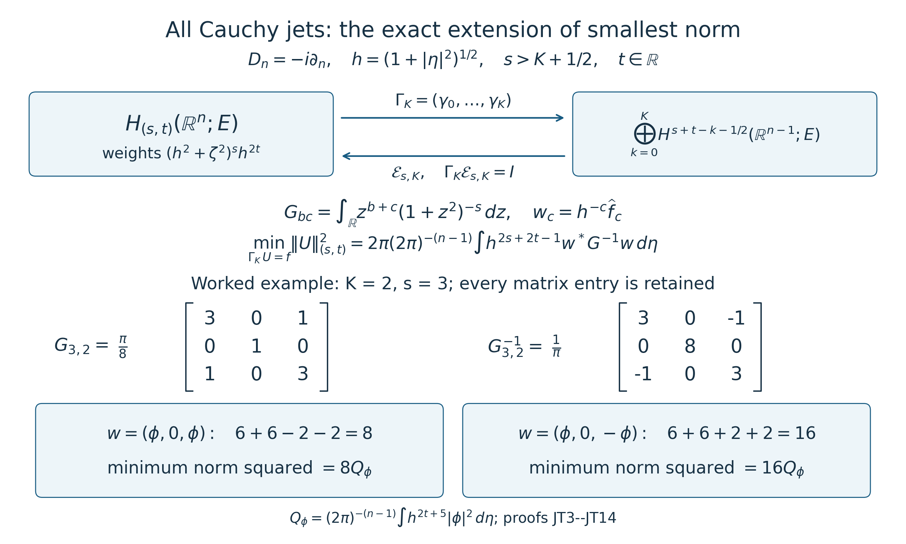

# Mixed symbols on every real two-parameter Sobolev scale

This lesson proves continuity on the full two-parameter Sobolev scale. The orders are arbitrary real numbers, the base variable ranges over all of \(\mathbb R^n\), and the symbol can be a rectangular matrix between fixed finite-dimensional Hermitian spaces. The original weights \(1+|\xi|\) and \(1+|\xi'|\) remain explicit.

## 1. Objects, conventions, and the exact theorem

Fix \(n\geq1\) and finite-dimensional complex Hermitian spaces \(E,F\). Inner products are linear in their first argument; matrix norms are the induced operator norms. Write
\[
 \xi=(\xi',\xi_n)\in\mathbb R^{n-1}\times\mathbb R,
 \quad R=1+|\xi|,\quad T=1+|\xi'|,
 \quad R_0=(1+|\xi|^2)^{1/2},\quad T_0=(1+|\xi'|^2)^{1/2}.
 \tag{MSB1}
\]
When \(n=1\), \(\xi'\) has no coordinates and \(T=T_0=1\). Set
\[
 w_{p,q}(\xi)=R_0(\xi)^pT_0(\xi')^q\qquad(p,q\in\mathbb R).
 \tag{MSB2}
\]
The Fourier convention, including its coefficient, is
\[
 \widehat u(\xi)=\int_{\mathbb R^n}e^{-ix\cdot\xi}u(x)\,dx,
 \qquad u(x)=(2\pi)^{-n}\int_{\mathbb R^n}e^{ix\cdot\xi}\widehat u(\xi)\,d\xi,
 \qquad D_j=-i\partial_j.
 \tag{MSB3}
\]
For a smooth \(a(x,\xi)\in\operatorname{Hom}(E,F)\), define
\[
 p_{m,m',L}(a)=
 \max_{|\alpha|+|\beta|\leq L}\sup_{x,\xi}
 \frac{\|\partial_x^\beta\partial_\xi^\alpha a(x,\xi)\|}
 {R^{m-\alpha_n}T^{m'-|\alpha'|}}.
 \tag{MSB4}
\]
The class \(S^{m,m'}\) consists exactly of those smooth symbols for which every displayed seminorm is finite. There is no restriction of \(x\) to a compact set. Matrix factors are multiplied in their given order.

For \(p,q\in\mathbb R\), define \(H_{(p,q)}(\mathbb R^n;E)\) to be the tempered distributions whose Fourier transform is represented by a locally square-integrable function and for which
\[
 \|u\|_{(p,q)}^2=(2\pi)^{-n}
    \int_{\mathbb R^n}R_0^{2p}T_0^{2q}\|\widehat u(\xi)\|_E^2\,d\xi<\infty.
 \tag{MSB5}
\]
The proof below shows directly that these are complete Hilbert spaces, that Schwartz functions are dense, and that this definition is equivalent to requiring \(w_{p,q}\widehat u\in L^2\) distributionally. The density and distributional conditions therefore do not hide an additional domain assumption.

**Theorem.** For every \(s,t,m,m'\in\mathbb R\) and every \(a\in S^{m,m'}(\operatorname{Hom}(E,F))\), the left operator
\[
 A u(x)=\operatorname{Op}(a)u(x)
 =(2\pi)^{-n}\int e^{ix\cdot\xi}a(x,\xi)\widehat u(\xi)\,d\xi
 \qquad(u\in\mathcal S(\mathbb R^n;E))
 \tag{MSB6}
\]
has a unique bounded extension
\[
 A:H_{(s+m,t+m')}(\mathbb R^n;E)
       \longrightarrow H_{(s,t)}(\mathbb R^n;F).
 \tag{MSB7}
\]
It agrees with the already defined tempered-distribution action of the same left operator. There exist a finite integer \(J\) and a constant \(C\), depending only on \(n,s,t,m,m'\) and the fixed conventions of the course composition and packet estimates, such that
\[
 \|Au\|_{(s,t)}\leq C\,p_{m,m',J}(a)\|u\|_{(s+m,t+m')}.
 \tag{MSB8}
\]
The constant is independent of \(a,u\), and of the base point. The operator-norm proofs used below apply to rectangular matrices without a change in this constant when the coefficient-space norms are fixed Hermitian norms; an entrywise proof would instead give a permissible fixed dimension factor. No infinite-dimensional coefficient-space assertion is needed here.

## 2. Exact bracket correspondence, including negative orders

For \(r\geq0\),
\(1+r^2\leq(1+r)^2\leq2(1+r^2)\). The second difference is \((r-1)^2\). Hence \(R/R_0,T/T_0\in[1,\sqrt2]\). Put \(z_+=\max(z,0)\), \(z_-=\max(-z,0)\). For arbitrary real \(u,v\), taking positive powers or reciprocals as appropriate proves
\[
 2^{-(u_-+v_-)/2}R_0^uT_0^v
 \leq R^uT^v
 \leq2^{(u_++v_+)/2}R_0^uT_0^v.
 \tag{MSB9}
\]
For a derivative \(\alpha\), use exactly \(u=m-\alpha_n\), \(v=m'-|\alpha'|\). Dividing by these positive weights gives the two continuous identity maps between the original symbol seminorms and the bracket seminorms:
\[
 \begin{split}
 p^{R,T}_{m,m';\alpha,\beta}(a)
 &\leq2^{((m-\alpha_n)_-+(m'-|\alpha'|)_-)/2}
       p^{R_0,T_0}_{m,m';\alpha,\beta}(a),\\
 p^{R_0,T_0}_{m,m';\alpha,\beta}(a)
 &\leq2^{((m-\alpha_n)_++(m'-|\alpha'|)_+)/2}
       p^{R,T}_{m,m';\alpha,\beta}(a).
 \end{split}
 \tag{MSB10}
\]
They are identity maps on the actual smooth functions. They preserve the derivatives, base and frequency coordinates, matrix products, and left operator (MSB6); no operation is conjugated or rescaled in this correspondence.

There is an equally exact statement for Sobolev norms. On distributions whose Fourier transform has the function representative in (MSB5), define the additional norm
\[
 \|u\|_{(p,q);R,T}^2=(2\pi)^{-n}\int R^{2p}T^{2q}\|\widehat u\|^2\,d\xi.
\]
Multiplication of (MSB9), with \(u=p,v=q\), by \(\|\widehat u\|\), followed by the squared integral and square root, gives
\[
 2^{-(p_-+q_-)/2}\|u\|_{(p,q)}
 \leq\|u\|_{(p,q);R,T}
 \leq2^{(p_++q_+)/2}\|u\|_{(p,q)}.
 \tag{MSB11}
\]
Thus the two norm presentations have exactly the same vectors. The norm with the original weights does not require multiplying an arbitrary distribution by the nonsmooth function \(1+|\xi|\): it is defined on the already identified Fourier function representatives. The smooth bracket multipliers used below provide the distributional construction. When \(n=1\), all constants from \(q\), \(m'\), or tangential derivative weights in (MSB9)–(MSB11) may be omitted because the corresponding ratio is one.

## 3. Smooth multiplier symbols with finite explicit bounds

We first prove a derivative formula valid for every real exponent. In dimension \(d\geq1\), put \(h_d(\zeta)=(1+|\zeta|^2)^{1/2}\), \(z=\zeta/h_d(\zeta)\). For each multiindex \(\gamma\) and real \(p\), there is a polynomial \(P_{\gamma,p}^{(d)}(z)\) such that
\[
 \partial_\zeta^\gamma h_d(\zeta)^p
 =h_d(\zeta)^{p-|\gamma|}P_{\gamma,p}^{(d)}(\zeta/h_d(\zeta)).
 \tag{MSB12}
\]
Here is a finite, exact construction, which also supplies constants. Start with \(P_{0,p}^{(d)}=1\), and choose a fixed coordinate order for the \(|\gamma|\) differentiations, with each coordinate repeated its specified number of times. Given the polynomial after \(k\) derivatives, differentiation in coordinate \(j\) replaces it by
\[
 P\longmapsto(p-k)z_jP
       +\sum_{\ell=1}^d(\delta_{j\ell}-z_jz_\ell)\partial_{z_\ell}P.
 \tag{MSB13}
\]
Indeed \(\partial_jh_d=z_j\), and
\(\partial_jz_\ell=h_d^{-1}(\delta_{j\ell}-z_jz_\ell)\). The product and chain rules therefore prove (MSB12) at the next step, including its coefficient \(p-k\). This inductive construction works for negative, zero, and nonintegral \(p\) without alteration. Different orders of differentiation give the same value on the displayed arguments because the actual smooth mixed derivatives commute; a single fixed construction is enough for the bounds.

Let \(C^{(d)}_{p,\gamma}\) be the sum of the absolute values of all coefficients of this polynomial. Since every coordinate of \(z\) has modulus at most one,
\[
 |\partial^\gamma h_d^p|
 \leq C^{(d)}_{p,\gamma}h_d^{p-|\gamma|}.
 \tag{MSB14}
\]
For \(d=0\), define \(h_0=1\), take the sole empty multiindex, and set \(C^{(0)}_{p,0}=1\). This states exactly what happens to the tangential factor when \(n=1\).

Leibniz differentiation of \(w_{p,q}=R_0^pT_0^q\) has only terms where all normal derivatives fall on \(R_0^p\). Thus
\[
 \partial_\xi^\alpha w_{p,q}
 =\sum_{\gamma'\leq\alpha'}
    \binom{\alpha'}{\gamma'}
    (\partial_\xi^{(\gamma',\alpha_n)}R_0^p)
    (\partial_{\xi'}^{\alpha'-\gamma'}T_0^q).
 \tag{MSB15}
\]
Using (MSB14) on both factors, each term is bounded by its coefficient constant times
\[
 R_0^{p-\alpha_n-|\gamma'|}
 T_0^{q-|\alpha'|+|\gamma'|}
 =R_0^{p-\alpha_n}T_0^{q-|\alpha'|}
       (T_0/R_0)^{|\gamma'|}
 \leq R_0^{p-\alpha_n}T_0^{q-|\alpha'|}.
\]
The inequality uses \(1\leq T_0\leq R_0\) and does not depend on signs of \(p,q\). Set
\[
 K_{p,q,\alpha}=
 \sum_{\gamma'\leq\alpha'}\binom{\alpha'}{\gamma'}
 C^{(n)}_{p,(\gamma',\alpha_n)}
 C^{(n-1)}_{q,\alpha'-\gamma'},
\]
and
\[
 K_{p,q,L}^{R,T}=
 \max_{|\alpha|\leq L}
 2^{((p-\alpha_n)_-+(q-|\alpha'|)_-)/2}K_{p,q,\alpha}.
 \tag{MSB16}
\]
Equations (MSB10), (MSB15), and the vanishing base derivatives now prove
\[
 w_{p,q}I_E\in S^{p,q}(\operatorname{End}E),
 \qquad p_{p,q,L}(w_{p,q}I_E)\leq K_{p,q,L}^{R,T}.
 \tag{MSB17}
\]
The same proof holds with \(E\) replaced by \(F\), and all real orders, including \((-p,-q)\), are covered. These are explicit finite derivative constants, not merely a formal assertion that order-reducing multipliers belong to a symbol class.

Every derivative of \(w_{p,q}\) and its reciprocal grows at most polynomially. For example the bracket estimate just proved is bounded above by \(K_{p,q,\alpha}R_0^{|p|+|q|+|\alpha|}\), a deliberately nonsharp bound sufficient here. Leibniz differentiation then proves that multiplication by either function preserves Schwartz space continuously: for a fixed seminorm \(\sup_\xi|\xi^\nu\partial^\alpha(w_{p,q}v)|\), finitely many derivatives of \(v\), with finitely increased polynomial weights, bound every term. Both multipliers consequently act continuously on tempered distributions by transposition. Their pointwise product is one, so those operations are inverse maps there as well as on Schwartz space.

## 4. Hilbert spaces, exact multiplier domains, and density

Define the Fourier multiplier
\[
 J_{p,q}u=\mathcal F^{-1}(w_{p,q}\widehat u).
 \tag{MSB18}
\]
The preceding proof makes it a continuous automorphism of both \(\mathcal S\) and \(\mathcal S'\), with inverse \(J_{-p,-q}\). Products satisfy
\[
 J_{p,q}J_{r,v}=J_{p+r,q+v}\quad\hbox{on all of }\mathcal S'.
 \tag{MSB19}
\]
This identity follows from the literal product of the two smooth positive Fourier multipliers, so no unbounded-operator product on an unstated \(L^2\) domain is being taken.

If \(u\in H_{(p,q)}\), Plancherel in the convention (MSB3) gives
\[
 \|J_{p,q}u\|_{L^2}^2=(2\pi)^{-n}\int|w_{p,q}|^2\|\widehat u\|^2
                         =\|u\|_{(p,q)}^2.
 \tag{MSB20}
\]
Conversely, given \(v\in L^2\), the measurable function
\(f=w_{-p,-q}\widehat v\) is locally in \(L^2\) and defines a tempered distribution. In fact \(w_{-p,-q}\leq R_0^{|p|+|q|}\); hence, for any Schwartz function \(\psi\),
\[
 \left|\int\langle f(\xi),\psi(\xi)\rangle\,d\xi\right|
 \leq\|\widehat v\|_2\|R_0^{|p|+|q|}\psi\|_2.
 \tag{MSB21}
\]
The right side is bounded by a Schwartz seminorm: choose any integer \(M>|p|+|q|+n/2\), factor out \(\sup R_0^M\|\psi\|\), and integrate \(R_0^{-2(M-|p|-|q|)}\). That integral is finite, as follows by splitting into the unit ball and dyadic shells with volumes at most a fixed dimensional constant times \(2^{kn}\). Taking the inverse Fourier transform gives \(u=J_{-p,-q}v\in H_{(p,q)}\). Thus
\[
 J_{p,q}:H_{(p,q)}\longrightarrow L^2
 \quad\hbox{is an onto isometry with inverse }J_{-p,-q}.
 \tag{MSB22}
\]
It follows from the completeness of \(L^2\) that the normed space in (MSB5) is complete. The weighted Fourier integral with the Hermitian pairing defines its inner product and is positive definite. The same estimate (MSB21), with \(v=J_{p,q}u\), proves continuous embedding \(H_{(p,q)}\to\mathcal S'\). In particular its vector is uniquely determined by its distribution, not just by an unspecified completion class.

There is no ambiguity in the alternative distributional definition. If a tempered distribution \(u\) satisfies \(w_{p,q}\widehat u=g\in L^2\), multiplication by the smooth inverse gives \(\widehat u=w_{-p,-q}g\); this is the locally square-integrable representative just used. The weighted integral is finite. Conversely the function representative in (MSB5) immediately gives such an \(L^2\) product.

For density, use density of Schwartz functions in \(L^2\), one of the explicitly stated Fourier-analysis entry results in Section 6 of [From symbol estimates to operators on every Sobolev scale](euclidean-symbol-calculus.md). If \(v_j\in\mathcal S\) tends to \(J_{p,q}u\) in \(L^2\), put \(u_j=J_{-p,-q}v_j\). The multiplier bounds prove \(u_j\in\mathcal S\), and (MSB20) proves
\[
 \|u_j-u\|_{(p,q)}=\|v_j-J_{p,q}u\|_2\longrightarrow0.
 \tag{MSB23}
\]
This proves density for every pair of real orders without assuming a nonnegative exponent. More generally, (MSB19)–(MSB20) give the full-domain isometric isomorphism
\[
 J_{a,b}:H_{(p,q)}\longrightarrow H_{(p-a,q-b)},
 \qquad\|J_{a,b}u\|_{(p-a,q-b)}=\|u\|_{(p,q)}.
 \tag{MSB24}
\]
In each case its domain is the entire displayed input space and its inverse is \(J_{-a,-b}\).

## 5. The actual order-zero theorem used here

The finite-derivative estimate in Section 6 of [From symbol estimates to operators on every Sobolev scale](euclidean-symbol-calculus.md), (E23), says the following. If a smooth global left symbol \(c(x,\xi)\) has bounded derivatives through total order \(L_n=4N\), where \(N\) is any fixed integer satisfying \(N>n/2\), then
\[
 \|\operatorname{Op}(c)v\|_{L^2(F)}
 \leq C_{n,N,\phi}
 \max_{|\alpha|+|\beta|\leq4N}
       \|\partial_x^\beta\partial_\xi^\alpha c\|_\infty
       \|v\|_{L^2(E)}.
 \tag{MSB25}
\]
Here \(\phi\) is the single fixed unit-norm Schwartz packet window chosen in that proof. After it and \(N\) have been fixed from \(n\), this is a dimensional constant. The packet proof there, including (E24)–(E27), supplies this estimate. Its hypothesis is a bounded finite collection of derivatives, with no frequency-decay exponent or metric hypothesis.

For precision about that proof's constants and rectangular extension, its packet kernel has norm at most
\(C'_{n,N,\phi}M\langle q-q'\rangle^{-2N}\langle p-p'\rangle^{-2N}\), where \(M\) is the maximum in (MSB25). Applying \((1-\Delta)^N\) in each of the two packet variables differentiates the symbol at most \(4N\) times; all other differentiated factors are fixed Schwartz functions times fixed polynomials. Their absolute integrals define the finite constant \(C'_{n,N,\phi}\), which includes the Fourier coefficient \((2\pi)^{-n}\). The two kernel marginals, with packet measure \((2\pi)^{-n}dq\,dp\), are bounded by
\[
 (2\pi)^{-n}C'_{n,N,\phi}M
       \left(\int_{\mathbb R^n}\langle z\rangle^{-2N}\,dz\right)^2.
 \tag{MSB26}
\]
The integral is finite because \(2N>n\). The scalar kernel bound applied to vector norms and the isometric packet transform give (MSB25), with this marginal constant. This is also why rectangular matrices are permitted: every differentiated matrix is bounded in operator norm, and the resulting scalar majorant controls the norm of a vector input. No products of incompatible coefficient spaces or commuting matrix assumption enters this argument.

Now \(c\in S^{0,0}\) implies
\[
 \|\partial_x^\beta\partial_\xi^\alpha c(x,\xi)\|
 \leq p_{0,0,4N}(c)R^{-\alpha_n}T^{-|\alpha'|}
 \leq p_{0,0,4N}(c)
 \quad(|\alpha|+|\beta|\leq4N),
 \tag{MSB27}
\]
because \(R,T\geq1\). Thus the actual hypotheses of (MSB25) hold. This avoids an invalid claim that the mixed symbol belongs to some classical class with uniform positive isotropic frequency decay; such an inclusion need not hold near fixed tangential frequency and arbitrarily large normal frequency.

## 6. Exact conjugation and the complete continuity proof

We use precisely the mixed composition already proved in Sections 1 and 6 of [Composition of mixed symbols with two different remainder estimates](mixed-symbol-composition.md). For compatible rectangular symbols \(f\in S^{p,q}\), \(g\in S^{r,v}\), it constructs the actual left composition symbol \(C_1(f,g)\in S^{p+r,q+v}\), proves
\[
 \operatorname{Op}(f)\operatorname{Op}(g)
       =\operatorname{Op}(C_1(f,g))\quad\hbox{on }\mathcal S\hbox{ and }\mathcal S',
 \tag{MSB28}
\]
and, for each \(L\), proves a finite-seminorm bound
\[
 p_{p+r,q+v,L}(C_1(f,g))
 \leq C_{L;p,q,r,v,n}\,p_{p,q,J_L}(f)p_{r,v,J_L}(g).
 \tag{MSB29}
\]
The integer \(J_L\) and constant depend only on the indicated fixed orders, dimension, and structural constants established there. The proof checks the precise mixed metric, the quadratic-transform parameter, its finite-seminorm continuity, and the common Schwartz and distribution domains. We use its completed mixed assertion, not an unsupported operator-composition statement for arbitrary general metrics. The lower-order remainder part of that theorem is not required here.

Right composition with a scalar Fourier multiplier is even more direct. Put
\[
 q=w_{-s-m,-t-m'},\qquad d(x,\xi)=a(x,\xi)q(\xi).
 \tag{MSB30}
\]
For \(v\in\mathcal S(E)\), the Fourier transform of \(J_{-s-m,-t-m'}v\) is exactly \(q\widehat v\). Substitution into the absolutely convergent integral (MSB6) gives
\[
 A J_{-s-m,-t-m'}v=\operatorname{Op}(d)v.
 \tag{MSB31}
\]
The same identity holds on \(\mathcal S'\): both operators have continuous Schwartz adjoints, by Section 6 of [Composition of mixed symbols with two different remainder estimates](mixed-symbol-composition.md), so the identity just proved on Schwartz inputs gives equality of their Schwartz adjoints when paired against any second Schwartz vector. Transposing this equality gives the distributional identity. Thus no extension of a product beyond its known distributional domains is assumed.

The derivative product rule, (MSB17), and the exact addition of the two weight exponents give
\[
 d\in S^{-s,-t},\qquad
 p_{-s,-t,L}(d)
 \leq2^L p_{m,m',L}(a)K^{R,T}_{-s-m,-t-m',L}.
 \tag{MSB32}
\]
To check the coefficient bound, only the frequency derivatives may split between \(a\) and \(q\); every base derivative acts on \(a\). The sum of the frequency binomial coefficients is \(2^{|\alpha|}\leq2^L\). In each summand the \(R\) exponent is \(m-\gamma_n-s-m-(\alpha_n-\gamma_n)=-s-\alpha_n\), and the \(T\) exponent is \(-t-|\alpha'|\). This proves exactly the stated mixed order, with no loss.

Apply (MSB28)–(MSB29) to \(f=w_{s,t}I_F\in S^{s,t}\) and \(g=d\in S^{-s,-t}\). Define
\[
 c=C_1(w_{s,t}I_F,d)\in S^{0,0}.
\]
On both \(\mathcal S(E)\) and \(\mathcal S'(E)\) we have the exact identity
\[
 J_{s,t}A J_{-s-m,-t-m'}=\operatorname{Op}(c).
 \tag{MSB33}
\]
Taking \(L=4N\) in (MSB29), and enlarging its finite input order to a common \(J\) if necessary, (MSB17) and (MSB32) yield
\[
 p_{0,0,4N}(c)
 \leq C_{4N;s,t,-s,-t,n}\,2^J
      K^{R,T}_{s,t,J}K^{R,T}_{-s-m,-t-m',J}
      p_{m,m',J}(a).
 \tag{MSB34}
\]
Every factor is independent of \(a,u\) and finite for arbitrary real orders. This formula states the complete constant dependence in (MSB8): multiply its right-hand prefactor by the fixed packet constant \(C_{n,N,\phi}\) in (MSB25). It does not assert an unproved universal optimal numerical constant for either prior theorem.

By (MSB25) and (MSB27), the distribution operator \(\operatorname{Op}(c)\) restricts to an everywhere-defined bounded map \(B:L^2(E)\to L^2(F)\) with norm at most that prefactor. Its agreement with the distribution action follows by approximating an \(L^2\) vector by Schwartz vectors: the bounded extension converges in \(L^2\), hence in \(\mathcal S'\), whereas the previously proved distributional continuity gives the same distribution limit.

Using the isomorphisms in (MSB22), define on the entire input space in (MSB7)
\[
 A_{s,t}=J_{-s,-t}\, B\, J_{s+m,t+m'}.
 \tag{MSB35}
\]
Each arrow now has a stated full domain and codomain:
\[
 H_{(s+m,t+m')}(E)\xrightarrow{\ J_{s+m,t+m'}\ }L^2(E)
 \xrightarrow{\ B\ }L^2(F)
 \xrightarrow{\ J_{-s,-t}\ }H_{(s,t)}(F).
\]
The first and last are isometries. Hence (MSB34) and (MSB25) prove (MSB8) for all input vectors. On Schwartz vectors, (MSB33) and the inverse identity (MSB19) show that (MSB35) is exactly \(A\).

For an arbitrary \(u\in H_{(s+m,t+m')}\), choose the dense Schwartz approximation (MSB23). Then \(Au_j\to A_{s,t}u\) in the target space and hence in \(\mathcal S'\). Also \(u_j\to u\) in \(\mathcal S'\) and the distributional action of \(A\) is continuous, so \(Au_j\to Au\) there. Uniqueness of distributional limits proves \(A_{s,t}u=Au\). This both identifies the extension and proves that choices of \(s,t\) give the same operator on intersections of their domains. If two bounded extensions existed, their difference would vanish on the dense Schwartz subspace and hence everywhere. Uniqueness follows.

In particular (MSB33) has the full Hilbert-space form
\[
 J_{s,t}A J_{-s-m,-t-m'}:L^2(E)\longrightarrow L^2(F),
\]
with domain all of \(L^2(E)\), because the middle \(A\) acts between exactly the two spaces in (MSB7). One must not instead interpret the display as an unspecified product of three possibly unbounded operators on a single \(L^2\) space. The proof has identified every domain and image needed for its meaning.

Finally the statement can be written entirely with the additional original-weight Sobolev norms. Combining (MSB8) and (MSB11) gives
\[
 \|Au\|_{(s,t);R,T}
 \leq 2^{[s_++t_++(s+m)_-+(t+m')_-]/2}
 C\,p_{m,m',J}(a)\|u\|_{(s+m,t+m');R,T}.
 \tag{MSB36}
\]
This proves the theorem in both weight presentations with explicit conversion constants and unchanged objects, not just for integer or nonnegative orders.

## 7. A rectangular multiplier and sharp independent order costs

Let \(B:E\to F\) be a fixed nonzero rectangular matrix, and take
\[
 a(x,\xi)=w_{m,m'}(\xi)B.
 \tag{MSB37}
\]
The multiplier proof shows that it belongs to \(S^{m,m'}\), with seminorm at most \(\|B\|K^{R,T}_{m,m',L}\). The Fourier action and weighted norm are exact:
\[
 \|Au\|_{(s,t)}^2
 =(2\pi)^{-n}\int w_{s+m,t+m'}^2\|B\widehat u\|_F^2\,d\xi
 \leq\|B\|^2\|u\|_{(s+m,t+m')}^2.
 \tag{MSB38}
\]
The operator norm is exactly \(\|B\|\). Indeed, in finite dimension the continuous function \(v\mapsto\|Bv\|\) attains its maximum on the unit sphere. Choose a unit maximizing vector \(v\) and any scalar \(h\in C_c^\infty(\mathbb R^n)\) with \((2\pi)^{-n}\int|h|^2=1\). Set
\(\widehat u=w_{-s-m,-t-m'}h v\). This is a smooth compactly supported Fourier function, hence gives \(u\in\mathcal S\). Its input norm is one and (MSB38) gives output norm \(\|B\|\).

The two target orders cannot in general be independently increased. For any \(\varepsilon>0\), choose the preceding \(h\) supported in the ball of radius \(1/8\), and set
\[
 h_L(\xi)=h(\xi-Le_n),\qquad
 \widehat u_L=w_{-s-m,-t-m'}h_Lv,\qquad L\geq1.
\]
The original input norm is still one. In the stronger target \(H_{(s+\varepsilon,t)}\), the exact cancellation of weights in (MSB38) gives
\[
 \|Au_L\|_{(s+\varepsilon,t)}^2
 =(2\pi)^{-n}\|B\|^2\int R_0^{2\varepsilon}|h_L|^2\,d\xi
 \geq\|B\|^2(L-1/8)^{2\varepsilon}\longrightarrow\infty.
 \tag{MSB39}
\]
Thus an arbitrary positive improvement of the total-frequency target order fails. For \(n\geq2\), shift \(h\) by \(Le_1\) instead and use the stronger target \(H_{(s,t+\varepsilon)}\). The same calculation has \(T_0^{2\varepsilon}\) in place of \(R_0^{2\varepsilon}\), bounded below by \((L-1/8)^{2\varepsilon}\). Hence the tangential order cost is also independently sharp. For \(n=1\), the tangential norm factor is exactly one, so no tangential sharpness claim is made and the theorem is independent of \(t,m'\).

## 8. Solved exercise: an exact nonconstant conjugated symbol

**Exercise.** Fix \(v\in\mathbb R^n\), a nonzero rectangular matrix \(B:E\to F\), and arbitrary real \(m,m',s,t\). For
\[
 a_v(x,\xi)=e^{iv\cdot x}w_{m,m'}(\xi)B,
\]
verify its mixed symbol class, compute its exact conjugated order-zero symbol, and compute the operator norm between the spaces in (MSB7). Give a finite explicit upper bound in terms of \(v,s,t,B\).

**Solution.** Differentiation in \(x\) multiplies by \((iv)^\beta\), and frequency derivatives act on the multiplier already bounded in Section 3. Thus
\[
 p_{m,m',L}(a_v)
 \leq\|B\|\max(1,|v|^L)K^{R,T}_{m,m',L},
 \tag{MSB40}
\]
where the bound \(|v^\beta|\leq\max(1,|v|^L)\) holds for \(|\beta|\leq L\). Every symbol hypothesis holds globally.

The Fourier transform of multiplication by \(e^{iv\cdot x}\) shifts frequency by \(v\). Therefore
\[
 \widehat {A_vu}(\eta+v)=w_{m,m'}(\eta)B\widehat u(\eta).
\]
For the conjugated operator in (MSB33), this gives the exact left symbol
\[
 c_v(x,\xi)=e^{iv\cdot x}
       \frac{w_{s,t}(\xi+v)}{w_{s,t}(\xi)}B.
 \tag{MSB41}
\]
One may also recover it by testing (MSB6): the conjugated Fourier action first multiplies the input at \(\xi\) by the ratio and then shifts it by \(v\). This checks both the sign and the positions of the numerator and denominator. It is not in general equal to the pointwise product \(e^{iv\cdot x}B\).

The elementary triangle inequality in \(\mathbb R^{n+1}\) gives
\(R_0(\eta+v)\leq R_0(\eta)+|v|\leq(1+|v|)R_0(\eta)\). Interchanging \(\eta\) and \(\eta+v\) gives the reciprocal bound. The same reasoning in the tangential variables gives
\[
 (1+|v|)^{-1}\leq\frac{R_0(\eta+v)}{R_0(\eta)}\leq1+|v|,
 \quad
 (1+|v'|)^{-1}\leq\frac{T_0(\eta'+v')}{T_0(\eta')}\leq1+|v'|.
\]
Taking the actual real powers yields
\[
 r_v(\eta):=\frac{w_{s,t}(\eta+v)}{w_{s,t}(\eta)}
 \leq(1+|v|)^{|s|}(1+|v'|)^{|t|}.
 \tag{MSB42}
\]
The ratio is positive and continuous. After changing variables by \(\eta+v\) in the target norm, one obtains
\[
 \|A_vu\|_{(s,t)}^2
 =(2\pi)^{-n}\int r_v(\eta)^2
       \|B[w_{s+m,t+m'}(\eta)\widehat u(\eta)]\|^2\,d\eta.
\]
Consequently the exact operator norm is
\[
 \|A_v\|_{H_{(s+m,t+m')}\to H_{(s,t)}}
 =\|B\|\sup_{\eta\in\mathbb R^n}r_v(\eta)
 \leq\|B\|(1+|v|)^{|s|}(1+|v'|)^{|t|}.
 \tag{MSB43}
\]
The upper bound follows from the integral. To prove equality, choose a maximizing unit vector for \(B\), and a point where the ratio is within any prescribed positive error of its supremum. Continuity supplies a ball on which the ratio remains within twice that error. A normalized smooth Fourier bump supported in that ball, multiplied by \(w_{-s-m,-t-m'}\) and the chosen vector as in Section 7, has unit input norm and gives the matching lower bound. Let the error decrease to zero. This argument also covers a supremum approached only at infinity. The formula keeps all real orders; the absence of \(m,m'\) in the final norm is the proved exact cancellation, not an assumption about their signs.

## 9. Boundary traces with the two weights retained

Later collar arguments require a trace theorem in these spaces, in addition
to operator continuity. Let \(k\geq0\) be an integer, \(s>k+1/2\), and
\(t\in\mathbb R\). For a Schwartz vector define
\(\gamma_{k,a}u=(D_n^ku)|_{x_n=a}\), where \(a\in\mathbb R\). Then

\[
 \gamma_{k,a}:H_{(s,t)}(\mathbb R^n;E)
       \longrightarrow H^{s+t-k-1/2}(\mathbb R^{n-1};E),
 \qquad
 \|\gamma_{k,a}u\|^2
       \leq \frac{c_{s,k}}{2\pi}\|u\|_{(s,t)}^2,
 \tag{MSB44}
\]

uniformly in \(a\), with the finite, positive constant

\[
 c_{s,k}=\int_{\mathbb R}\lambda^{2k}(1+\lambda^2)^{-s}\,d\lambda.
 \tag{MSB45}
\]

The target norm uses the Fourier coefficient \((2\pi)^{-(n-1)}\).
For \(n=1\), the target is \(E\), with its given norm.
The resulting \(E\)-valued boundary section depends continuously on \(a\)
in the displayed target space.

**Proof.** Write \(\xi=(\eta,\zeta)\) and
\(h=(1+|\eta|^2)^{1/2}=T_0(\eta)\). Fourier inversion in the normal
coordinate gives exactly

\[
 \widehat{\gamma_{k,a}u}(\eta)
   =(2\pi)^{-1}\int_{\mathbb R}
          e^{ia\zeta}\zeta^k\widehat u(\eta,\zeta)\,d\zeta.
 \tag{MSB46}
\]

The power \(\zeta^k\) has this sign because \(D_n=-i\partial_n\).
Cauchy--Schwarz with the original factors
\((h^2+\zeta^2)^{s/2}h^t\) yields

\[
 \begin{aligned}
 \|\widehat{\gamma_{k,a}u}(\eta)\|^2
 &\leq (2\pi)^{-2}
   \left(\int_{\mathbb R}
      \zeta^{2k}(h^2+\zeta^2)^{-s}h^{-2t}\,d\zeta\right)
   \left(\int_{\mathbb R}
      (h^2+\zeta^2)^sh^{2t}
          \|\widehat u(\eta,\zeta)\|^2\,d\zeta\right),\\
 \int_{\mathbb R}\zeta^{2k}(h^2+\zeta^2)^{-s}h^{-2t}\,d\zeta
 &=h^{2k+1-2s-2t}
   \int_{\mathbb R}\lambda^{2k}(1+\lambda^2)^{-s}\,d\lambda,
 \qquad \zeta=h\lambda,\quad d\zeta=h\,d\lambda.
 \end{aligned}
 \tag{MSB47}
\]

The last integral is finite near zero since \(k\geq0\), and on the
two real tails since \(2k-2s<-1\). Multiply the first bound by
the exact target weight \(h^{2(s+t-k-1/2)}\) and integrate with
coefficient \((2\pi)^{-(n-1)}\). The factor in the second line
cancels that target weight, and the remaining coefficient is
\((2\pi)^{-(n+1)}c_{s,k}\). Comparing it with the input coefficient
\((2\pi)^{-n}\) proves (MSB44), retaining the constant \(c_{s,k}/(2\pi)\).
When \(n=1\), \(h=1\) and the tangential integral is over the singleton
\(\mathbb R^0\) with mass one; the same calculation proves the stated case.

Schwartz density from (MSB23) extends every \(\gamma_{k,a}\) uniquely.
For a general input its Fourier representative satisfies (MSB46) for
almost every \(\eta\): (MSB47) proves absolute integrability of the
normal integral by Cauchy--Schwarz. If \(a\to b\), apply that same bound
with \(|e^{ia\zeta}-e^{ib\zeta}|^2\) in the first integral. For each
\(\eta\), dominated convergence makes that integral tend to zero;
it is bounded by four times the first integral in (MSB47).
After multiplication by the target weight, its product with the second
integral is dominated by four times \(c_{s,k}\) times the integrable
input Fourier density. A second dominated-convergence application
proves norm continuity in \(a\).

To pass to the half-space, define the restriction space with its
actual quotient norm,

\[
 \begin{aligned}
 \bar H_{(s,t)}(\mathbb R^n_+;E)
 &=\{r^+U:U\in H_{(s,t)}(\mathbb R^n;E)\},\\
 \|u\|_{\bar H_{(s,t)}}&=
    \inf_{r^+U=u}\|U\|_{(s,t)} .
 \end{aligned}
 \tag{MSB48}
\]

The kernel of \(r^+\) is closed in the whole-space Hilbert space.
Indeed, convergence in that Hilbert norm implies distributional convergence
by (MSB21), so vanishing on every test function supported in the open
half-space persists under the limit. The closed-subspace quotient theorem
in [Banach estimates, quotient spaces and compact parameter arguments](banach-foundation-bridges.md)
therefore makes (MSB48) a complete normed restriction space.

If \(r^+W=0\), then \(\gamma_{k,a}W=0\) for \(a>0\).
Here is the distributional justification. Pair (MSB46) with an arbitrary
Schwartz tangential test vector. Its continuous function of \(a\),
integrated against a compactly supported smooth normal test function,
is exactly the pairing of \(D_n^kW\) with the product test function,
by the Fourier formula and the weighted Cauchy--Schwarz bound.
If the normal test function is supported in \(a>0\), this is zero
because \(W\) vanishes on that open half-space. A continuous scalar
function giving zero against all such tests is zero there; otherwise
one small neighborhood of a nonzero value, after multiplication by
its conjugate phase, would give a nonzero integral against a
nonnegative test function. All tangential pairings therefore vanish.
Norm continuity as \(a\downarrow0\) gives \(\gamma_{k,0}W=0\).

Consequently \(\gamma_ku=\gamma_{k,0}U\) is independent of the chosen
whole-space extension \(U\), and taking the infimum in (MSB44) gives

\[
 \gamma_k:\bar H_{(s,t)}(\mathbb R^n_+;E)
        \longrightarrow H^{s+t-k-1/2}(\mathbb R^{n-1};E),
 \qquad
 \|\gamma_ku\|^2\leq\frac{c_{s,k}}{2\pi}
                      \|u\|_{\bar H_{(s,t)}}^2 .
 \tag{MSB49}
\]

For smooth inputs this is the original normal derivative at the boundary.
Restrictions of the dense whole-space Schwartz subspace are dense in
(MSB48), since each extension can be approximated before restriction.
Thus the theorem defines the same trace by density, without taking the
boundary value of an arbitrary distribution. The strict condition
\(s>k+1/2\), both real weights, the normal derivative convention, and
the full restriction domain remain part of the assertion.

## 9.1. Extending all Cauchy jets with the smallest norm

The separate estimates (MSB44) do not yet answer a useful boundary question:
can we prescribe every derivative up to a fixed order, and what is the least
possible cost of doing so? The answer retains the interactions between
different derivatives. These interactions are the entries of a finite Gram
matrix, not independent scalar trace constants.

For this subsection take \(E\ne\{0\}\). For the zero space the extension
and minimum formulas give the unique zero maps; there is no nonzero-data
sharpness assertion. Fix an integer \(K\geq0\), \(s>K+1/2\), and
\(t\in\mathbb R\). Put
\(d=n-1\), \(h=(1+|\eta|^2)^{1/2}\), and define

\[
 \begin{aligned}
 \mathcal T_K^{s+t}
 &=\bigoplus_{k=0}^K H^{s+t-k-1/2}(\mathbb R^d;E),\\
 \Gamma_Ku&=(\gamma_{0,0}u,\ldots,\gamma_{K,0}u),\\
 (G_{s,K})_{bc}
 &=\int_{\mathbb R}z^{b+c}(1+z^2)^{-s}\,dz
       \quad(0\leq b,c\leq K).
 \end{aligned}
 \tag{JT1}
\]

The direct-sum norm is the sum of the squares of the displayed Sobolev
norms. The coefficient of each tangential Fourier integral is
\((2\pi)^{-d}\). When \(d=0\), that integral is over the singleton
with mass one, \(h=1\), and the target is \(E^{K+1}\).

Every integral in (JT1) is absolutely convergent: its highest possible
tail exponent is \(2K-2s<-1\). Odd entries vanish by the reflection
\(z\mapsto-z\). For \(b+c=2l\), substitution \(\tau=z^2\) on both
halves of the line gives the exact value

\[
 \begin{aligned}
 (G_{s,K})_{bc}
 &=\int_0^\infty\tau^{l-1/2}(1+\tau)^{-s}\,d\tau
   =\mathrm B(l+1/2,s-l-1/2),\\
 \mathrm B(u,v)&=\int_0^\infty
          \tau^{u-1}(1+\tau)^{-(u+v)}\,d\tau
       \quad(u,v>0),\\
 a^*G_{s,K}a
 &=\int_{\mathbb R}(1+z^2)^{-s}
            \left|\sum_{b=0}^K a_bz^b\right|^2\,dz>0
                  \quad(a\ne0).
 \end{aligned}
 \tag{JT2}
\]

The last inequality follows because a nonzero polynomial cannot vanish
on every real interval: its highest nonzero coefficient would otherwise
vanish after the corresponding number of differentiations. At a point
where it is nonzero, continuity supplies an interval of positive integral.
Thus the real symmetric matrix \(G_{s,K}\) is positive definite and
invertible. Write \(g_-\) and \(g_+\) for its smallest and largest
eigenvalues, both positive. The finite-dimensional spectral theorem in
[Fourier transforms, finite spectra and convex separation](prerequisite-bridges.md#real-spectral-decomposition)
applies to this actual matrix. For vector coefficients the same calculation
uses \(G_{s,K}\otimes I_E\), preserving the given Hermitian norm on \(E\).

### An explicit right inverse

For \(f=(f_0,\ldots,f_K)\in\mathcal T_K^{s+t}\), set

\[
 \begin{aligned}
 w_c(\eta)&=h^{-c}\widehat f_c(\eta),\\
 \rho_b(\eta)&=\sum_{c=0}^K(G_{s,K}^{-1})_{bc}
                         h^{-c}\widehat f_c(\eta),\\
 \widehat{\mathcal E_{s,K}f}(\eta,\zeta)
 &=2\pi h^{2s-1}(h^2+\zeta^2)^{-s}
       \sum_{b=0}^K\left(\frac\zeta h\right)^b
       \sum_{c=0}^K(G_{s,K}^{-1})_{bc}
                          h^{-c}\widehat f_c(\eta).
 \end{aligned}
 \tag{JT3}
\]

This is the full Fourier formula, with the same normal frequency, derivative
sign and quadratic weights as (MSB46). The normal integral of its \(k\)-th
moment is

\[
 \begin{aligned}
 &(2\pi)^{-1}\int_{\mathbb R}\zeta^k
              \widehat{\mathcal E_{s,K}f}(\eta,\zeta)\,d\zeta\\
 &\quad=h^{2s-1}\sum_{b=0}^K\rho_b(\eta)
        \int_{\mathbb R}\zeta^k
            \left(\frac\zeta h\right)^b
               (h^2+\zeta^2)^{-s}\,d\zeta\\
 &\quad=h^{2s-1}h^{k+1-2s}
           \sum_{b=0}^K(G_{s,K})_{kb}\rho_b(\eta)
        =\widehat f_k(\eta),
       \qquad \zeta=hz,\quad d\zeta=h\,dz.
 \end{aligned}
 \tag{JT4}
\]

Each moment is absolutely convergent since \(k+b\leq2K\). In particular,
\(\Gamma_K\mathcal E_{s,K}=I\); no compatibility relation between the
prescribed derivatives is required.

To prove that (JT3) defines a member of the original volume space, compute
its complete norm rather than estimating each summand separately:

\[
 \begin{aligned}
 \|\mathcal E_{s,K}f\|_{(s,t)}^2
 &=(2\pi)^{-(d+1)}(2\pi)^2
   \int_{\mathbb R^d}h^{4s-2+2t}
   \int_{\mathbb R}(h^2+\zeta^2)^{-s}
         \left\|\sum_{b=0}^K\left(\frac\zeta h\right)^b
                      \rho_b(\eta)\right\|^2\,d\zeta\,d\eta\\
 &=2\pi(2\pi)^{-d}\int_{\mathbb R^d}
         h^{2s+2t-1}\sum_{b,c=0}^K
                 (G_{s,K}^{-1})_{bc}
                    \langle w_b(\eta),w_c(\eta)\rangle_E\,d\eta,\\
 \frac{2\pi}{g_+}\sum_{k=0}^K
          \|f_k\|_{H^{s+t-k-1/2}}^2
 &\leq\|\mathcal E_{s,K}f\|_{(s,t)}^2
 \leq\frac{2\pi}{g_-}\sum_{k=0}^K
          \|f_k\|_{H^{s+t-k-1/2}}^2.
 \end{aligned}
 \tag{JT5}
\]

Here the Hermitian product retains the lesson's convention: it is linear
in its first entry. Since the Gram matrix and its inverse are real symmetric,
the displayed sum is the same real quadratic form in either coordinate order.
The inner normal integral before the substitution is nonnegative; Tonelli
therefore justifies integrating it first. Substitution \(\zeta=hz\)
contributes exactly \(h^{1-2s}\) and the full matrix \(G_{s,K}\).
Since \(\rho=(G_{s,K}^{-1}\otimes I_E)w\), its quadratic form is
the displayed form with \(G_{s,K}^{-1}\). The tangential weight for
\(f_k\) is exactly \(h^{2s+2t-1}h^{-2k}\), proving both bounds.
The weighted Fourier representative has finite norm; (MSB21) makes it a
tempered distribution and (MSB22) places it in \(H_{(s,t)}\). Thus
\(\mathcal E_{s,K}\) is a bounded linear right inverse. Its formula is
independent of \(t\), as the computation proves, while its domain and both
norms still contain the original \(t\).

### Why this extension has the smallest norm

Let \(z\in H_{(s,t)}\) satisfy \(\Gamma_Kz=0\). In the volume inner
product with (JT3), multiplication by the volume weight cancels the factor
\((h^2+\zeta^2)^{-s}\) and leaves the finite polynomial
\(\sum_b h^{-b}\zeta^b\rho_b\). For almost every \(\eta\),
each corresponding normal integral is \(2\pi\widehat{\gamma_{b,0}z}\),
which vanishes. Every summand is integrable over both frequency variables:
use Cauchy--Schwarz on \(\zeta^b\widehat z\), whose reciprocal-weight
integral is (MSB47), and then in \(\eta\), with the weight
\(h^{2s+2t-1}\) and \(\rho_b\). The latter is square integrable by
(JT5) and finite-dimensional positivity. Hence Fubini is legitimate and

\[
 \begin{aligned}
 \langle z,\mathcal E_{s,K}f\rangle_{(s,t)}&=0,\\
 \Gamma_KU=f\quad&\Longrightarrow\quad
 U=\mathcal E_{s,K}f+z,\qquad z\in\ker\Gamma_K,\\
 \|U\|_{(s,t)}^2
 &=\|\mathcal E_{s,K}f\|_{(s,t)}^2+\|z\|_{(s,t)}^2,\\
 H_{(s,t)}&=\ker\Gamma_K\ \mathbin{\perp\!\oplus}\
                 \operatorname{im}\mathcal E_{s,K}.
 \end{aligned}
 \tag{JT6}
\]

The individual trace bounds show that the kernel is closed. The range is
closed too: if \(\mathcal E_{s,K}f_j\to U\), continuity of \(\Gamma_K\)
gives \(f_j\to\Gamma_KU\), and continuity of \(\mathcal E_{s,K}\)
then gives \(U=\mathcal E_{s,K}\Gamma_KU\). Formula (JT6) proves existence
and uniqueness of the extension of smallest norm for every \(f\).

The exact operator norms are

\[
 \|\Gamma_K\|=\sqrt{\frac{g_+}{2\pi}},\qquad
 \|\mathcal E_{s,K}\|=\sqrt{\frac{2\pi}{g_-}}.
 \tag{JT7}
\]

For the first upper bound, apply the first inequality of (JT5) to
\(f=\Gamma_KU\), then use (JT6). The second follows from (JT5).
For equality choose a unit eigenvector \(a\) of \(G_{s,K}\), a unit
vector \(e\in E\), and a nonzero smooth compactly supported tangential
Fourier function \(\phi\). Set
\(\widehat f_k=h^k a_k\phi e\). The direct-sum norm is
\((2\pi)^{-d}\int h^{2s+2t-1}|\phi|^2\,d\eta\), and (JT5)
is \(2\pi\) times that number divided by the eigenvalue.
The eigenvalues \(g_+\) and \(g_-\) respectively attain the two norms.
For \(d=0\), use \(\phi=1\). These norm equalities concern nonzero
\(E\); when \(E=\{0\}\), the operators have norm zero.

### Restriction to the half-space

Define \(\mathcal E_{s,K}^+=r^+\mathcal E_{s,K}\) and let
\(\Gamma_K^+\) be the vector of traces (MSB49). Extension independence
proved there gives \(\Gamma_K^+r^+=\Gamma_K\). If \(u\) has these
jets \(f\), every whole-space extension \(U\) of \(u\) has
\(\Gamma_KU=f\). Thus (JT6), followed by the infimum in (MSB48), gives

\[
 \begin{aligned}
 \Gamma_K^+\mathcal E_{s,K}^+&=I,\\
 \|\mathcal E_{s,K}^+f\|_{\bar H_{(s,t)}}
   &=\|\mathcal E_{s,K}f\|_{(s,t)},\\
 \Gamma_K^+u=f\quad&\Longrightarrow\quad
 \|u\|_{\bar H_{(s,t)}}\geq
                  \|\mathcal E_{s,K}^+f\|_{\bar H_{(s,t)}}.
 \end{aligned}
 \tag{JT8}
\]

The reverse inequality in the second line comes from the particular
extension \(\mathcal E_{s,K}f\). Uniqueness at the minimum also follows
without presuming that a quotient infimum is attained. If a competing
\(u\) has the same minimum norm, take whole-space extensions \(U_j\)
whose norms decrease to that infimum. Formula (JT6) forces
\(U_j-\mathcal E_{s,K}f\to0\) in the whole-space norm. After restriction
the limit is both \(u\) and \(\mathcal E_{s,K}^+f\); they are equal.
The two exact operator norms in (JT7) consequently hold for the half-space
operators as well. This is an ordinary trace theorem with
\(s>K+1/2\), not a trace assertion for every maximal graph domain.

### A single derivative, and the sharp threshold

For one prescribed derivative \(k\), with \(s>k+1/2\), the same
moment calculation reduces to the exact formula

\[
 \begin{aligned}
 \widehat{\mathcal E^{[k,a]}_sf}(\eta,\zeta)
 &=\frac{2\pi}{c_{s,k}}e^{-ia\zeta}
       h^{2s-2k-1}(h^2+\zeta^2)^{-s}\zeta^k\widehat f(\eta),\\
 \gamma_{k,a}\mathcal E^{[k,a]}_s&=I,\\
 \|\mathcal E^{[k,a]}_sf\|_{(s,t)}^2
 &=\frac{2\pi}{c_{s,k}}\|f\|_{H^{s+t-k-1/2}}^2,\\
 \|\gamma_{k,a}\|&=\sqrt{\frac{c_{s,k}}{2\pi}}.
 \end{aligned}
 \tag{JT9}
\]

In the trace formula the two phases cancel. Substitution \(\zeta=hz\)
gives the normal moment \(c_{s,k}h^{2k+1-2s}\), proving the identity
and the norm with all coefficients retained. The same orthogonality
argument proves minimum norm, and nonzero data prove equality in the
operator norm. Thus the constant in (MSB44) is sharp, uniformly in \(a\).

For nonzero \(E\), the strict threshold is necessary. Fix
\(s\leq k+1/2\) and any real
\(t\). Choose a nonzero \(\phi\in C_c^\infty(\mathbb R^d)\) and a
unit vector \(e\in E\). For \(d=0\), take \(\phi=1\). Let
\(\chi\in C_c^\infty(\mathbb R)\) be even, take values in \([0,1]\),
equal one on \([-1,1]\), and vanish outside \([-2,2]\). For \(N\geq1\),
put \(\chi_N(\zeta)=\chi(\zeta/N)\) and define a Schwartz input by

\[
 \begin{aligned}
 \widehat u_N(\eta,\zeta)
 &=\phi(\eta)e\,h^{-2t}\zeta^k
           (h^2+\zeta^2)^{-s}\chi_N(\zeta),\\
 I_N&=\int_{\mathbb R}\zeta^{2k}(1+\zeta^2)^{-s}
                              \chi_N(\zeta)^2\,d\zeta,\\
 J_N(h)&=\int_{\mathbb R}\zeta^{2k}(h^2+\zeta^2)^{-s}
                              \chi_N(\zeta)^2\,d\zeta,\\
 L_N(h)&=\int_{\mathbb R}\zeta^{2k}(h^2+\zeta^2)^{-s}
                              \chi_N(\zeta)\,d\zeta,\\
 \|u_N\|_{(s,t)}^2
 &=(2\pi)^{-(d+1)}\int|\phi(\eta)|^2h^{-2t}J_N(h)\,d\eta,\\
 \|\gamma_{k,0}u_N\|_{H^{s+t-k-1/2}}^2
 &=(2\pi)^{-(d+2)}\int|\phi(\eta)|^2
              h^{2s-2t-2k-1}L_N(h)^2\,d\eta.
 \end{aligned}
 \tag{JT10}
\]

The inverse Fourier transform is Schwartz because its Fourier transform
is smooth and compactly supported. In particular, the trace in (JT10)
is its classical derivative, requiring no low-order trace extension.
Let \(A_\phi=\int|\phi|^2\,d\eta>0\), and choose \(H\geq1\) so
\(1\leq h\leq H\) on its support. Write \(x_+=\max(x,0)\) and
\(x_-=\max(-x,0)\). Keeping both signs of every real order gives

\[
 \begin{aligned}
 H^{-2s_+}(1+\zeta^2)^{-s}
 &\leq(h^2+\zeta^2)^{-s}
       \leq H^{2s_-}(1+\zeta^2)^{-s},\\
 J_N(h)&\leq H^{2s_-}I_N,\qquad
 L_N(h)\geq H^{-2s_+}I_N,\\
 \|u_N\|_{(s,t)}^2
 &\leq(2\pi)^{-(d+1)}A_\phi
                         H^{2t_-+2s_-}I_N,\\
 \|\gamma_{k,0}u_N\|_{H^{s+t-k-1/2}}^2
 &\geq(2\pi)^{-(d+2)}A_\phi
             H^{-(2s-2t-2k-1)_--4s_+}I_N^2,\\
 \frac{\|\gamma_{k,0}u_N\|_{H^{s+t-k-1/2}}^2}
      {\|u_N\|_{(s,t)}^2}
 &\geq\frac{1}{2\pi}
 H^{-(2s-2t-2k-1)_--4s_+-2t_--2s_-}I_N.
 \end{aligned}
 \tag{JT11}
\]

The lower bound for \(L_N\) uses \(\chi_N\geq\chi_N^2\), so every
normal integrand stays nonnegative. For \(N>1\), retaining both real tails,

\[
 \begin{aligned}
 I_N&\geq2^{1-s_+}\int_1^N\zeta^{2k-2s}\,d\zeta\\
 &=2^{1-s_+}
 \begin{cases}
 \log N,&s=k+1/2,\\
 \displaystyle\frac{N^{2k-2s+1}-1}{2k-2s+1},&s<k+1/2.
 \end{cases}
 \end{aligned}
 \tag{JT12}
\]

This diverges, and (JT11) rules out any bounded operator agreeing with
the Schwartz trace on this domain and target. Restricting \(u_N\) to the
half-space cannot increase its quotient norm and keeps its classical jets.
It therefore rules out a bounded half-space trace agreeing with these
classical restrictions too. Taking \(k=K\) proves necessity of
\(s>K+1/2\) for the joint trace. Translation in the normal coordinate
proves the same whole-space obstruction at any \(a\).

### A worked example with interacting derivatives

Take \(K=2\) and \(s=3\). Substitution \(z=\tan\theta\),
\(-\pi/2<\theta<\pi/2\), turns the three even moments into the
integrals of \(\cos^4\theta\), \(\sin^2\theta\cos^2\theta\),
and \(\sin^4\theta\). Their values are respectively
\(3\pi/8,\pi/8,3\pi/8\): expand these functions as
\((3+4\cos2\theta+\cos4\theta)/8\),
\((1-\cos4\theta)/8\), and
\((3-4\cos2\theta+\cos4\theta)/8\), then integrate on that full
interval. All odd moments are zero. Consequently

\[
 G_{3,2}=\frac\pi8
   \begin{pmatrix}3&0&1\\0&1&0\\1&0&3\end{pmatrix},\qquad
 G_{3,2}^{-1}=\frac1\pi
   \begin{pmatrix}3&0&-1\\0&8&0\\-1&0&3\end{pmatrix}.
 \tag{JT13}
\]

Multiplication of the two displayed matrices gives the identity, including
the two off-diagonal cancellations. Let
\(\widehat f_0=\phi e\), \(\widehat f_1=0\), and
\(\widehat f_2=\pm h^2\phi e\). Then \(w=(\phi e,0,\pm\phi e)\).
With \(Q_\phi=(2\pi)^{-d}\int h^{2t+5}|\phi|^2\,d\eta\), the
two complete formulas and their minimum costs are

\[
 \begin{aligned}
 \widehat{\mathcal E_{3,2}f^{+}}(\eta,\zeta)
 &=2\pi h^5(h^2+\zeta^2)^{-3}
      \frac2\pi\left(1+\left(\frac\zeta h\right)^2\right)\phi(\eta)e,\\
 \|\mathcal E_{3,2}f^+\|_{(3,t)}^2
 &=(6+6-2-2)Q_\phi=8Q_\phi,\\
 \widehat{\mathcal E_{3,2}f^{-}}(\eta,\zeta)
 &=2\pi h^5(h^2+\zeta^2)^{-3}
      \frac4\pi\left(1-\left(\frac\zeta h\right)^2\right)\phi(\eta)e,\\
 \|\mathcal E_{3,2}f^-\|_{(3,t)}^2
 &=(6+6+2+2)Q_\phi=16Q_\phi.
 \end{aligned}
 \tag{JT14}
\]

The direct-sum norm of each prescribed vector is \(2Q_\phi\), yet
their least volume norms differ. Discarding the off-diagonal terms would
miss this difference. The smallest and largest eigenvalues of \(G_{3,2}\)
are \(\pi/8\) and \(\pi/2\); (JT7) gives exact joint trace norm
\(1/2\) and extension norm \(4\). This verifies the full example with
the original three jets and every zero and sign retained.

The figure displays (JT3)--(JT6) and the complete example (JT13)--(JT14).
Its arrows are actual bounded maps on the stated spaces. The two costs
are exact, rather than numerical samples. This construction follows
directly from the Fourier convention, weighted Hilbert spaces and trace
proof established in Sections 1--9; the finite-dimensional ingredients
are proved in the prerequisite linked above.

This section is an additional proof of the simultaneous trace extension,
its sharp norm and its sharp threshold. The preceding mixed-symbol mapping
theorem and the following normal-derivative recovery theorem retain their
original statements and proofs. New text and the reproducible figure were
written by Codex and dedicated under CC0 1.0 to the extent rights are
held.

## 10. Recovering normal derivatives on the actual half-space

Let \(m\geq1\) be an integer and \(s,t\in\mathbb R\). The restriction
spaces in (MSB48) satisfy

\[
 \begin{aligned}
 &v\in\bar H_{(s,t)},\qquad
       D_n^mv\in\bar H_{(s-m+1,t-1)}\\
 &\quad\Longrightarrow\quad
 D_n^jv\in\bar H_{(s-j+1,t-1)}\quad(0\leq j\leq m),\\
 &\|D_n^jv\|_{\bar H_{(s-j+1,t-1)}}
 \leq \|D_n^mv\|_{\bar H_{(s-m+1,t-1)}}
              +(2^m-1)\|v\|_{\bar H_{(s,t)}} .
 \end{aligned}
 \tag{MSB50}
\]

Every derivative here is the derivative of the original distribution on
the open half-space. No boundary value is assumed and no sign or integer
condition is imposed on the two Sobolev exponents.

**Proof.** Retain \(D_n^mv\), and introduce the scalar tangential
multiplier \(\Lambda\) with symbol \(h=T_0(\eta)\). Its powers act on
the restriction spaces because tangential multiplication in Fourier
variables commutes with restriction in the normal variable. Form the
actual distribution

\[
 F=(D_n+i\Lambda)^mv
   =D_n^mv+\sum_{j=0}^{m-1}\binom mj i^{m-j}
                    \Lambda^{m-j}D_n^jv .
 \tag{MSB51}
\]

For each lower term and each whole-space extension \(V\) of \(v\),
the ratio of its output weight to the input weight is

\[
 \frac{|\zeta|^j h^{m-j}R_0^{s-m+1}h^{t-1}}{R_0^sh^t}
   =\left(\frac{|\zeta|}{R_0}\right)^j
      \left(\frac h{R_0}\right)^{m-j-1}\leq1
       \quad(0\leq j<m).
 \tag{MSB52}
\]

Thus every lower term is in \(\bar H_{(s-m+1,t-1)}\), with norm at
most \(\|v\|_{\bar H_{(s,t)}}\). Taking infima over extensions and
then the triangle inequality in that quotient gives

\[
 \|F\|_{\bar H_{(s-m+1,t-1)}}
 \leq \|D_n^mv\|_{\bar H_{(s-m+1,t-1)}}
       +\left(\sum_{j=0}^{m-1}\binom mj\right)
                 \|v\|_{\bar H_{(s,t)}}.
 \tag{MSB53}
\]

The sum is exactly \(2^m-1\). Choose any whole-space extension
\(Q\in H_{(s-m+1,t-1)}\) of \(F\), and define \(W\) by the full
Fourier formula

\[
 \widehat W(\eta,\zeta)
       =(\zeta+ih)^{-m}\widehat Q(\eta,\zeta).
 \tag{MSB54}
\]

The multiplier has no pole on the real frequency domain, since \(h\geq1\).
It is a smooth tempered-distribution multiplier, and
\(|\zeta+ih|^m=(h^2+\zeta^2)^{m/2}=R_0^m\). Consequently

\[
 (D_n+i\Lambda)^mW=Q,\qquad
 \|W\|_{(s+1,t-1)}=\|Q\|_{(s-m+1,t-1)}.
 \tag{MSB55}
\]

Also \(H_{(s+1,t-1)}\hookrightarrow H_{(s,t)}\), since the ratio
of the second weight to the first is \(h/R_0\leq1\).
It remains to prove \(r^+W=v\); this is the half-space step that a
whole-space Fourier inequality alone does not supply.

Set \(d=v-r^+W\). It belongs to \(\bar H_{(s,t)}\) and satisfies
\((D_n+i\Lambda)^md=0\) on the open half-space. Fourier transformation
in the tangential variables reduces this to
\((D_n+ih)^md_\eta=0\) for almost every \(\eta\). The fiber assertion
is justified as follows. A whole-space \(H_{(s,t)}\) extension,
by Fubini in its weighted Fourier integral, gives for almost every
\(\eta\) a normal-variable tempered distribution in the corresponding
weighted \(H^s\) space. On compact tangential frequency sets these
normal norms and the ordinary \(H^s\) norm are equivalent with bounded
constants. Pair the equation with a countable dense set of normal
test functions on each interval with rational endpoints whose closure
is contained in \(x_n>0\). These intervals form a countable family
and contain every compact normal test support.
Each resulting tangential function is locally integrable by
Cauchy--Schwarz. Its distribution is zero, so it vanishes almost
everywhere. Remove the union of these countably many null sets;
continuity of distributional pairing then gives the equation for
every normal test function on each such interval.

For fixed \(\eta\), \(D_n+ih=-i(\partial_n-h)\). Multiplication by
\(e^{-hx_n}\) in the open half-line therefore turns the equation
into \(\partial_n^m(e^{-hx_n}d_\eta)=0\). A distribution with first
derivative zero on an interval is constant: a compactly supported
test function of integral zero is the derivative of a compactly
supported test function, so its pairing vanishes. Subtracting a
constant and repeating this fact inductively shows that a distribution
with \(m\)-th derivative zero is a polynomial of degree at most \(m-1\).
Hence

\[
 d_\eta(x_n)=e^{hx_n}\sum_{a=0}^{m-1}c_a(\eta)x_n^a
          \quad(x_n>0).
 \tag{MSB56}
\]

Every fiber also has a tempered whole-line extension. That forces every
coefficient in (MSB56) to be zero. Indeed, if a scalar component of
the polynomial has highest nonzero degree \(a\), pair it with a
nonnegative smooth test function translated from a fixed compact
interval to \(x_n=L\). Its pairing is \(e^{hL}\) times a polynomial
in \(L\) of degree \(a\) with nonzero leading coefficient:
that coefficient is \(c_a\int e^{hx_n}\phi(x_n)\,dx_n\).
A tempered distribution bounds the same translated-test pairing by
a fixed polynomial in \(L\), since each Schwartz seminorm of that
translate grows at most polynomially. The exponential lower growth
contradicts that bound. A nonzero vector coefficient has a nonzero
scalar component, so the argument covers \(E\)-valued fibers as well.
Thus \(d_\eta=0\) almost everywhere, and \(d=0\).

We have proved \(v=r^+W\) for every chosen extension \(Q\) of \(F\).
Taking its norm, then the infimum over \(Q\), and using (MSB53)
proves (MSB50) for \(j=0\). For \(0\leq j\leq m\), the Fourier
weight ratio for \(D_n^jW\) from \(H_{(s+1,t-1)}\) to
\(H_{(s-j+1,t-1)}\) is \((|\zeta|/R_0)^j\leq1\).
Restriction therefore gives every remaining assertion with the same
constant. This completes the proof in the original restriction spaces,
including all negative and nonintegral orders.

## Prerequisites

Read Sections 1–6 of [Composition of mixed symbols with two different remainder estimates](mixed-symbol-composition.md) for the full-domain product and its mixed order bounds; Section 6 of [From symbol estimates to operators on every Sobolev scale](euclidean-symbol-calculus.md) for the finite-derivative estimate and Fourier-analysis entry facts; and Section 1 of [Inverting mixed symbols without commuting matrix factors](mixed-symbol-inversion.md) for the two original frequency weights. The remaining multiplier, norm, conjugation, density and example arguments are proved above.

## References

