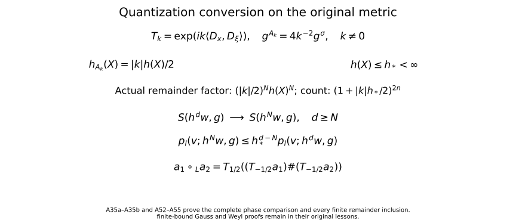

# From Weyl symbols to operators and changes of coordinates

A symbol product becomes an operator calculus when both factors act on a common space. We prove the Schwartz and distribution actions for symplectically temperate symbols, then study conformal changes of scale, affine symplectic coordinates and changes of quantization.

Start with [Localizing symbols with moving metrics](metric-localization.md) for symbol seminorms and partitions, [Quadratic Fourier multipliers at a moving scale](gauss-transform-estimates.md) for the multiplier estimates, [Fourier transforms, finite spectra and convex separation](prerequisite-bridges.md) for Fourier inversion, and [Two measuring scales, one Weyl product](weyl-metric-products.md) for Weyl kernels and products. Basic references are [Lerner, Phase-space metrics] and [Garrett 2014].

The convention is \(D=-i\partial\), on \(W=\mathbb R_x^n\oplus\mathbb R_\xi^n\), \(n\ge1\), with
\[
\sigma((x,\xi),(y,\eta))=\xi\cdot y-x\cdot\eta.
\tag{A1}
\]
Write \(q_X=g_X^\sigma\). A symplectically temperate metric is slowly varying and satisfies, with \(C\ge1\), \(N\ge0\),
\[
q_X(T)\le Cq_Y(T)(1+q_Y(X-Y))^N.
\tag{A2}
\]
A weight is positive, locally \(g\)-continuous, and satisfies
\(m(Y)\le Cm(X)(1+q_Y(X-Y))^N\), with its own constants.

The additional entry requirements are completeness and compact smooth density in \(L^2\), and the usual Lebesgue convergence theorems, as in [Two measuring scales, one Weyl product](weyl-metric-products.md). The needed Hilbert-space integrals are constructed below. For the assertion about bounded sets in the strong distribution dual, the complete-metric Baire proof is [Section6 of the Banach foundations](banach-foundation-bridges.md#AN03-BFD-006); [Section14.3](banach-foundation-bridges.md#AN03-BFD-FRECHET-003) proves the precise common finite-seminorm bound. We prove its needed consequence below. No Schwartz kernel theorem is needed for the direct constructions in this lesson: [Two measuring scales, one Weyl product](weyl-metric-products.md) already defines the symbol-to-kernel map by Fourier transformation.

## 1. Polynomial growth and the two topologies

Let \(e(X)=|X|^2\) in the fixed canonical coordinates; \(e^\sigma=e\). Constants in comparisons with \(e\) may depend on the forms at the origin. There is a finite \(K\) such that
\[
C^{-1}(1+|X|^2)^{-K}e
\le g_X,q_X\le C(1+|X|^2)^K e,
\qquad
C^{-1}(1+|X|^2)^{-K}\le m(X)\le C(1+|X|^2)^K.
\tag{A3}
\]
These statements require no uncertainty inequality.

Indeed, (A2) with \(Y=0\) bounds \(q_X\) by a fixed form times a power of \(1+|X|^2\). In particular \(q_X(X)\) has such a bound. The primal version of (A2), with the other point at the origin, now gives
\(g_X\le Cg_0(1+q_X(X))^N\).
Dualizing the two upper bounds gives both lower bounds. The weight inequality with one point at zero gives its upper bound. Its reciprocal is temperate by Section 2 of [Two measuring scales, one Weyl product](weyl-metric-products.md), giving the lower bound. Enlarging a common \(K\) proves (A3).

Consequently every coordinate derivative of \(a\in S(m,g)\) has polynomial growth, with degree allowed to depend on the derivative order. In particular \(a\) defines a tempered distribution. On a bounded symbol set the growth bound for each fixed derivative is uniform. Thus bounded symbols converging in \(C^\infty_{\rm loc}\) converge in \(\mathcal S'\): pair their zeroth-order common polynomial bound with the rapid decay of a test function, and apply dominated convergence. We call this bounded-set local-smooth topology the **weak symbol topology**, as in [Quadratic Fourier multipliers at a moving scale](gauss-transform-estimates.md).

For \(u\in\mathcal S(\mathbb R^n)\), use the increasing norms
\[
Q_r(u)=\sum_{|\alpha|+|\beta|\le r}\|x^\alpha D^\beta u\|_2.
\tag{A4}
\]
They define the usual Schwartz topology. One direction follows by integrating a sufficiently rapidly decreasing bound. For the other, choose an integer \(s>n/2\). Fourier inversion, Cauchy–Schwarz and Schwartz Plancherel give
\[
\|v\|_\infty\le (2\pi)^{-n}\|\widehat v\|_1
\le C_s\sum_{|\gamma|\le s}\|D^\gamma v\|_2.
\tag{A5}
\]
Apply this to \(v=x^\alpha D^\beta u\) and expand its derivatives. This controls every usual Schwartz seminorm by a finite \(Q_r\). The familiar completeness of Schwartz space also follows directly: uniform limits of all weighted derivatives are compatible derivatives by the fundamental theorem of calculus on coordinate boxes.

On the complex-linear distribution dual \(\mathcal S'\) we use the **strong dual topology**. In particular, the distribution bracket is linear in its test function; Hilbert-space adjoints will be converted to bilinear transposes explicitly. The strong-dual seminorms are
\[
p_B(u)=\sup_{\phi\in B}|\langle u,\phi\rangle|,
\tag{A6}
\]
where \(B\) ranges over bounded subsets of \(\mathcal S\). A bounded subset \(\mathcal U\) of this dual satisfies a common finite-order estimate
\[
|\langle u,\phi\rangle|\le C Q_r(\phi)
\quad(u\in\mathcal U,\ \phi\in\mathcal S).
\tag{A7}
\]
Here is the Baire argument, including the point where that prerequisite enters. Strong boundedness gives pointwise boundedness on each \(\phi\). The closed sets
\(\{\phi:\sup_{u\in\mathcal U}|\langle u,\phi\rangle|\le j\}\), \(j=1,2,\ldots\), cover the complete metrizable space \(\mathcal S\). One has interior. Subtract two points in a small neighborhood inside it to obtain a uniform bound on a neighborhood of zero. That neighborhood contains a set \(Q_r<\varepsilon\); rescaling proves (A7). No assertion of joint continuity of the unrestricted distribution action follows from this argument.

## 2. An affine-invariant Fourier norm

For \(a\in\mathcal S(W)\), set
\[
\|a\|_{\mathcal F L^1}=(2\pi)^{-2n}\|\widehat a\|_{L^1(W^*)}.
\tag{A8}
\]
Then
\[
\|a^w\|_{L^2\to L^2}\le \|a\|_{\mathcal F L^1}.
\tag{A9}
\]
To prove it, write \(a\) by Fourier inversion as the integral of plane waves. Section 5 of [Two measuring scales, one Weyl product](weyl-metric-products.md) gives norm-one operators for every such wave. For \(u\in\mathcal S\), their actions depend continuously on the wave frequency in \(L^2\), by the explicit translation and modulation formulas. Multiply this continuous Hilbert-space-valued function by \(\widehat a\). On every compact cube its Riemann sums converge in \(L^2\): uniform continuity makes the difference between any two sufficiently fine sums arbitrarily small, and \(L^2\) is complete. The norm of each resulting integral is at most the integral of \(|\widehat a|\|u\|_2\). This also bounds differences between integrals over increasing cubes, whose tails tend to zero because \(\widehat a\in L^1\). It constructs the full integral in \(L^2\) and proves its triangle inequality. Pairing with a Schwartz test and using scalar Fourier inversion identifies it with \(a^wu\). Formula (A9) follows, first on Schwartz inputs and then on \(L^2\) by density. Thus no estimate for a general oscillatory kernel or general vector-valued integration theorem is being assumed.

This norm is unchanged by any invertible affine change of the phase-space variables, even one that is not symplectic. If \(b(X)=a(TX+Z)\), then
\[
\widehat b(\Theta)
=|\det T|^{-1}e^{i\langle T^{-t}\Theta,Z\rangle}
\widehat a(T^{-t}\Theta).
\]
Changing variables in its \(L^1\) norm cancels the determinant.

It is also controlled by finitely many Schwartz seminorms. More particularly, if \(a\) is supported in a fixed-radius ball for a positive form \(Q\), centered at \(X_0\), then
\[
\|a^w\|\le C\sum_{j\le s}\sup_X|a|_{j,Q}(X),
\qquad s>n\text{ an integer}.
\tag{A10}
\]
Use an affine map making \(Q\) Euclidean and its center zero. The Fourier \(L^1\) estimate used in (A5), now in dimension \(2n\), requires \(s>(2n)/2=n\). On the fixed support, the derivative \(L^2\) norms are bounded by their suprema. Affine invariance proves (A10) with no determinant of \(Q\) left over.

**Editorial reconstruction: the original support form and every Jacobian.**
Retain the positive form \(Q\), its original coordinate matrix \(G\), the center \(X_0\), and the support condition \(Q(X-X_0)\le R^2\). Write \(d=2n\). Choose an invertible real matrix \(L\) with \(L^tGL=I\), and put \(J=|\det L|\), \(b(z)=a(X_0+Lz)\). This is a comparison map; the original form and symbol remain the objects in (A10). The original Fourier transforms give
\[
\begin{aligned}
\widehat b(\eta)&=J^{-1}e^{i\langle L^{-t}\eta,X_0\rangle}
                  \widehat a(L^{-t}\eta),\\
\widehat a(\Theta)&=J e^{-i\langle\Theta,X_0\rangle}
                    \widehat b(L^t\Theta),\\
\int|\widehat a(\Theta)|\,d\Theta
 &=\int J|\widehat b(L^t\Theta)|\,d\Theta
  =\int J|\widehat b(\eta)|J^{-1}\,d\eta.
\end{aligned}
\tag{AF1}
\]
The inverse Fourier factor is still \((2\pi)^{-d}\). For an integer \(s>d/2\), put \(I_{d,s}=\int(1+|\eta|^2)^{-s}\,d\eta\). It is finite: the unit ball contributes at most its finite volume, and the shell \(2^r\le|\eta|<2^{r+1}\) contributes at most \(\omega_d2^d2^{r(d-2s)}\), a summable geometric series. Cauchy--Schwarz, the full multinomial and Plancherel give
\[
\begin{aligned}
\|a\|_{\mathcal FL^1}
 &\le (2\pi)^{-d/2}I_{d,s}^{1/2}
 \left(\sum_{|\alpha|\le s}
 \frac{s!}{(s-|\alpha|)!\,\alpha!}\|D_z^\alpha b\|_2^2\right)^{1/2},\\
\|D_z^\alpha b\|_2^2
 &=J^{-1}\int_{Q(X-X_0)\le R^2}
  \left|\prod_{r=1}^d\left(\sum_{i=1}^dL_{ir}D_{X_i}\right)^{\alpha_r}a(X)\right|^2dX\\
 &\le J^{-1}(J\omega_dR^d)
                \left(\sup_X|a|_{|\alpha|,Q}(X)\right)^2.
\end{aligned}
\tag{AF2}
\]
Each column \(Le_r\) has original \(Q\)-length one. The full coordinate expansion in the second line is the sum over all \(\beta_{ir}\ge0\) with \(\sum_i\beta_{ir}=\alpha_r\), with coefficient \(\prod_r\alpha_r!\prod_{i,r}L_{ir}^{\beta_{ir}}/\beta_{ir}!\) and derivative \(\prod_iD_{X_i}^{\sum_r\beta_{ir}}a\). Thus no coordinate coefficient or derivative has been removed. The support measure is exactly \(J\omega_dR^d\), and the derivative integral has the separate factor \(J^{-1}\); (AF2) displays both before their cancellation. Applying (A9) proves (A10), with its original operator and original directional seminorms. This arbitrary affine comparison proves a Fourier norm estimate. Unitary covariance of a Weyl operator has the separate symplectic hypothesis in Section6.

## 3. Localized decay and counting

Choose the partition \((\phi_\nu)\) of [Localizing symbols with moving metrics](metric-localization.md) and fixed radii
\(0<a<b<c<r_*\), with supports in \(B_{X_\nu}(a)\). Put
\[
g_\nu=g_{X_\nu},\quad m_\nu=m(X_\nu),\quad
U_\nu=B_{X_\nu}(b),\quad U'_\nu=B_{X_\nu}(c),\quad
a_\nu=\phi_\nu a.
\]
The larger balls have bounded multiplicity. Localization gives
\(\sup|a_\nu|_{j,g_\nu}\le C_jm_\nu p_{\le j}(a;m,g)\).
The notation \(p_{\le j}\) denotes the sum of symbol seminorms of orders at most \(j\).

The form
\[
r_\nu=(e+g_\nu)^\sigma,\qquad
r_\nu(Y)=\min_{Y=U+V}\big(g_\nu^\sigma(U)+|V|^2\big),
\qquad
R_\nu=\inf_{Y\in U_\nu}r_\nu(Y)^{1/2}
\tag{A11}
\]
uses the dual-of-a-sum identity proved in Section 1 of [Two measuring scales, one Weyl product](weyl-metric-products.md). There is no factor2 here, since the primal form is a sum rather than a mean. All forms are positive definite and the balls nonempty, so \(R_\nu\) is finite; it can be zero.

One may replace \(e\) throughout this construction by any fixed positive form \(e_0\). There are constants \(c,C>0\) with \(ce\le e_0\le Ce\). Adding \(g_\nu\), and then dualizing, shows that \((e_0+g_\nu)^\sigma\) and \(r_\nu\) are comparable with constants independent of \(\nu\). Their distances and center-growth bounds are consequently equivalent. Choosing canonical Euclidean coordinates therefore imposes no restriction on the reference form.

**Localized decay.** For each integer \(M\ge0\) there is a finite \(J_M\) such that
\[
\|a_\nu^w u\|_2
\le C_Mm_\nu(1+R_\nu)^{-M}
p_{\le J_M}(a;m,g)Q_M(u).
\tag{A12}
\]
The constants are uniform in \(\nu\).

Here are the geometric and differential details. If \(R_\nu>0\), minimize the \(r_\nu\)-norm on the compact closure of \(U_\nu\). Let \(P\) be a minimizing point. Differentiating along each segment from \(P\) into that closed ellipsoid gives a supporting linear form
\[
L(Y)=r_\nu(P,Y)/r_\nu(P)^{1/2}
=\sigma(Y,t),\qquad
e(t)+g_\nu(t)=1,\qquad
L(Y)\ge R_\nu\quad(Y\in U_\nu).
\tag{A13}
\]
The normalization follows by ordinary quadratic duality, composed with \(\sigma\). In particular \(L_\nu=L(X_\nu)\ge R_\nu\). Positivity on the \(g_\nu\)-ball of radius \(b\) gives
\(\sqrt{g_\nu^\sigma(t)}\le L_\nu/b\).
On the support ball of radius \(a\), therefore,
\(L\ge(1-a/b)L_\nu\).
Differentiating the reciprocal shows explicitly that
\[
\sup|L_\nu/L|_{k,g_\nu}
\le k!\,b^{-k}(1-a/b)^{-k-1}.
\tag{A14}
\]
Division of a supported smooth symbol by \(L\), followed by extension by zero outside \(U_\nu\), is consequently smooth and preserves its support.

The affine Weyl identity of Section 5 of [Two measuring scales, one Weyl product](weyl-metric-products.md), used on the right, is
\[
a_\nu^wu
=(a_\nu/L)^w L^wu
+\frac{i}{2}\{a_\nu/L,L\}^wu,
\qquad
\{a_\nu/L,L\}=-L^{-1}\partial_t a_\nu.
\tag{A15}
\]
There is no derivative of \(L\) in the last expression, since
\(\partial_t L=\sigma(t,t)=0\).
Both new symbols have frozen seminorm bounds with weight
\(m_\nu/L_\nu\); the differentiated one uses one additional source derivative and \(g_\nu(t)^{1/2}\le1\). Repeat (A15) \(M\) times. Every resulting symbol has weight \(m_\nu L_\nu^{-M}\), and every input is \((L^w)^j u\) with \(j\le M\). Since \(|t|\le1\), expanding these powers and commuting coordinates and derivatives bounds their \(L^2\) norms by \(C_MQ_M(u)\). Apply (A10) to each of the finitely many terms. This proves (A12) when \(R_\nu>1\). For \(R_\nu\le1\), (A10) itself proves it after enlarging the constant. Thus zero distance causes no division by zero.

**Polynomial counting.** There are finite constants \(B,P,C\) such that
\[
|X_\nu|^2\le C(1+R_\nu^2)^B,\qquad
\#\{\nu:R_\nu\le r\}\le C(1+r)^P.
\tag{A16}
\]
Consequently
\[
\sum_\nu(1+R_\nu)^{-L}<\infty\qquad(L>P).
\tag{A17}
\]

We give the missing volume argument in full. Let \(T\ge1\) and \(R_\nu^2\le T\). Choose \(Y\in U_\nu\) with \(r_\nu(Y)\le2T\), and take a minimizing decomposition \(Y=U+V\) in (A11). Then
\(g_\nu^\sigma(U)\le2T\) and \(|V|^2\le2T\).
Slow variation gives \(q_Y(U)\le C T\). Formula (A2), comparing \(V\) to \(Y\), implies
\[
q_V\le CT^Nq_Y,\qquad q_V(U)\le CT^{N+1}.
\tag{A18}
\]
By (A3), both \(g_V\) and \(q_V\) lie between
\(C^{-1}T^{-K}e\) and \(CT^Ke\). Hence
\(|U|^2\le CT^{K+N+1}\).
Applying (A2) in the other direction, with its now controlled distance \(q_V(U)\), gives
\[
q_Y\le CT^{K+N(N+1)}e,
\qquad
g_Y\le CT^{K+N}e.
\tag{A19}
\]
Dualizing supplies the lower bounds as well. Take, for example,
\(B=K+(N+1)^2\), enlarged if needed to absorb the preceding fixed exponents. Local comparison with \(g_\nu\), and
\(g_\nu(X_\nu-Y)<b^2\), now give
\[
C^{-1}T^{-B}e\le g_\nu\le CT^Be,\qquad
|Y|^2+|X_\nu|^2\le CT^B.
\tag{A20}
\]

A Euclidean ball centered at this \(Y\) with radius
\(\kappa T^{-B/2}\) lies in \(U'_\nu\), for a fixed small \(\kappa>0\), because its \(g_\nu\)-radius is less than the gap \(c-b\). These small balls inherit the bounded multiplicity of \(U'_\nu\), while all lie in one Euclidean ball of radius \(C T^{B/2}\). Integrating their characteristic functions bounds the number of indices by \(CT^{2nB}\). The argument applies first to every finite subcollection, so it bounds the whole index set. This proves (A16), for example with \(P=4nB\). Its center bound follows by taking \(T=1+R_\nu^2\). Finally split the indices into dyadic bands of \(1+R_\nu\); their contributions in (A17) form a geometric series when \(L>P\). No uncertainty assumption or bound on a vertical part of the metric was used.

## 4. Action on Schwartz functions and distributions

**Theorem 4.1 (Schwartz and distribution action).** If \(g\) is symplectically temperate and \(m\) is a temperate weight for \(g\), then
\[
a^w:\mathcal S\longrightarrow\mathcal S,\qquad
a^w:\mathcal S'\longrightarrow\mathcal S'
\quad(a\in S(m,g))
\tag{A21}
\]
are continuous. For each \(r\) there are finite \(J,t\) such that
\[
Q_r(a^wu)\le C_r p_{\le J}(a;m,g)Q_t(u).
\tag{A22}
\]
The first action is jointly continuous in symbol and function. Both actions depend continuously on a bounded symbol set with its weak symbol topology, uniformly on bounded sets of inputs, using the Schwartz topology or the strong distribution topology respectively. The distribution action is separately continuous and hypocontinuous: fixing a bounded set in either factor gives continuity uniformly over that set. It is not, in general, jointly continuous on the unrestricted product.

To prove (A22) first for \(r=0\), sum (A12). By (A3) and (A16), \(m_\nu\) is bounded by a power of \(1+R_\nu\). Choosing \(M\) larger than that power plus \(P\) makes the sum finite by (A17).

For all output derivatives and moments, let \(F(X)=\sigma(X,t)+d\) be a fixed affine form. The distributional identity
\[
F^w a_\nu^w
=\big(Fa_\nu+\{F,a_\nu\}/(2i)\big)^w
\tag{A23}
\]
holds before any general operator-composition theorem. On the support ball,
\[
|F(X)|\le |F(X_\nu)|+a\sqrt{g_\nu^\sigma(t)},\qquad
|\partial_t a_\nu|_{k,g_\nu}
\le \sqrt{g_\nu(t)}\,|a_\nu|_{k+1,g_\nu}.
\]
Both forms \(g_\nu,g_\nu^\sigma\) obey (A3). Thus the new symbol in (A23) has frozen seminorms bounded by
\(C_km_\nu(1+|X_\nu|^2)^{K_1}p_{\le k+1}(a;m,g)\).
Iterating for any fixed word of \(r\) coordinates and derivatives gives the same assertion with a finite exponent \(K_r\) and \(r\) additional derivatives. Apply (A12) to these new supported symbols, then use (A16) and choose its decay order large enough to dominate the polynomial factors and the counting exponent. This proves (A22) for every word, hence every \(Q_r\).

Each partial sum \(\sum a_\nu^wu\) is Schwartz, and the estimates just proved make the series Cauchy in all Schwartz seminorms. It therefore converges in \(\mathcal S\). The symbol partial sums remain bounded in \(S(m,g)\) and converge locally smoothly to \(a\). By (A3) they converge in \(\mathcal S'\), so continuity of the distributional kernel construction identifies the Schwartz limit with the already defined \(a^wu\). This also proves independence of the partition.

For weak symbol continuity, the summable tails of these estimates are uniform on bounded symbol sets and on bounded sets of Schwartz inputs. Each finite sum is continuous under local smooth convergence: its symbols have fixed compact support, and (A10) and the preceding finite derivative estimates apply. Uniformly small tails and continuous finite sums prove the assertion for \(\mathcal S\).

Let \(C\phi=\overline\phi\). The adjoint identity \((a^w)^*=(\overline a)^w\) gives the bilinear transpose test map \((a^w)^t=C(\overline a)^wC\). Define the extension by
\(\langle a^wu,\phi\rangle=\langle u,(a^w)^t\phi\rangle\).
It agrees with the operator already constructed on regular distributions from Schwartz functions. Conjugation preserves every \(Q_r\), so a bounded set of tests has bounded image under this transpose for fixed \(a\), proving strong-dual continuity through (A6). For symbols in a bounded set, (A22) makes the union of those images bounded, giving uniform continuity in the distribution input. For distributions in a bounded set, apply (A7) and then (A22) to the transpose tests; this gives a finite symbol-seminorm estimate, uniformly over that set. The weak symbol continuity already proved for bounded sets of test functions gives the corresponding strong-dual conclusion. These observations prove all stated hypocontinuity and bounded-set assertions.

The distinction from unrestricted joint continuity is necessary. Already take \(g=e\), \(m=1\), and symbols independent of \(\xi\), so that quantization is ordinary multiplication. A symbol neighborhood controls only finitely many seminorms, say through order \(J\). With a fixed cutoff \(\chi=1\) near zero, the functions
\[
a_k(x)=c k^{-J}\chi(x)e^{ikx_1}
\tag{A24}
\]
lie in that neighborhood for a sufficiently small fixed \(c>0\). Every neighborhood of zero in \(\mathcal S'\) contains a sufficiently small fixed multiple of
\(\partial_{x_1}^{J+1}\delta_0\), because scalar multiplication is continuous. Pairing its product with \(a_k\) against a test equal to one near zero has magnitude proportional to \(k\). Thus no pair of unrestricted input neighborhoods controls even this one scalar output seminorm. The same argument applies to the weak distribution topology. For a bounded set of distributions, (A7) rules out this defect by supplying a common order.

**Theorem 4.2 (operator composition).** Under either the one-metric or the compatible two-metric hypotheses of Theorem 7.1 of [Two measuring scales, one Weyl product](weyl-metric-products.md),
\[
(a\#b)^w=a^wb^w
\quad\hbox{on both }\mathcal S\hbox{ and }\mathcal S'.
\tag{A25}
\]
Choose bounded Schwartz approximants \(a_j,b_j\) from [Localizing symbols with moving metrics](metric-localization.md). The identity holds for them by Section 6 of [Two measuring scales, one Weyl product](weyl-metric-products.md). Formula (A22) makes the family \(a_j^w\) equicontinuous on Schwartz space, while weak symbol continuity gives
\(b_j^wu\to b^wu\) and \(a_j^wb^wu\to a^wb^wu\) in \(\mathcal S\).
Thus their composites converge to \(a^wb^wu\). The symbol products are bounded and converge weakly to \(a\#b\) by Theorem 7.1 of [Two measuring scales, one Weyl product](weyl-metric-products.md); the theorem just proved identifies the other limit with \((a\#b)^wu\). This proves (A25) on \(\mathcal S\) without circularity.

For completeness, Schwartz functions are weakly dense in \(\mathcal S'\). If \(\rho\) is a compact smooth mollifier of integral one and \(\chi\) a compact cutoff equal to one near zero, then
\(\chi(X/R)(u*\rho_{1/R})(X)\) is Schwartz and converges to \(u\) distributionally. On tests this is the convergence
\(\check\rho_{1/R}*(\chi(\cdot/R)\phi)\to\phi\) in \(\mathcal S\), proved by Taylor's formula and the rapid decay seminorms. All fixed operators in (A25) are transposes of continuous Schwartz maps and are therefore weakly continuous on \(\mathcal S'\). The identity extends from the dense subspace to every distribution.

**Editorial extension: the actual operator product for an unbounded cross parameter.**
Retain the compatible metrics \(g_1,g_2\), the original own and cross weight hypotheses of the distinct-metric theorem, their mean \(g=(g_1+g_2)/2\), and their original cross parameter \(H\). No upper bound on \(H\) is needed for the following larger receiving classes. Equations (WG1)--(WG6) in [Two measuring scales, one Weyl product](weyl-metric-products.md) prove
\[
\begin{aligned}
w_\#(X)&=(1+H(X)/4)^{4n},\\
a\#b&\in S(m_1m_2w_\#,g),\\
a\#b-\sum_{j<N}C_j(a,b)&\in S(m_1m_2H^Nw_\#,g).
\end{aligned}
\tag{AO1}
\]
Those proofs retain \(4^{-N}\), the diagonal factor \(2^{l/2}\), the tensor factor \(2^J\), all strict tail thresholds and all derivative orders. Their metric and target-weight comparisons prove that \(g\) is symplectically temperate and the displayed positive weights are legitimate. The Schwartz action (A21)--(A22) has no uncertainty or upper-parameter hypothesis, so it applies to each original input and to this actual target.

Here is the receiving operator proof. Choose the original bounded compact Schwartz approximants \(a_j,b_j\). For fixed \(u\in\mathcal S\), (A22) gives \(b_j^wu\to b^wu\) in every original Schwartz seminorm, and bounds the entire family \(a_j^w\) by one finite input-seminorm estimate in each output seminorm. Therefore
\[
a_j^wb_j^wu-a^wb^wu
=a_j^w(b_j^wu-b^wu)+(a_j^w-a^w)b^wu\longrightarrow0
\quad\hbox{in }\mathcal S.
\tag{AO2}
\]
The Schwartz-symbol kernel identity gives \(a_j^wb_j^wu=(a_j\#b_j)^wu\). The bounded-set continuity of (AO1) gives \(a_j\#b_j\to a\#b\) locally smoothly in a bounded subset of its larger target; (A22) applies there and identifies its Schwartz limit. Hence
\[
(a\#b)^w=a^wb^w:\mathcal S\longrightarrow\mathcal S.
\tag{AO3}
\]
Each fixed operator extends by its bilinear transpose to the strong dual, with \(p_B(Au)\le p_{A^tB}(u)\), since \(A^tB\) is a bounded Schwartz set. It is also weakly continuous. The actual cutoff-and-mollifier density proof following (A25) therefore extends (AO3) to every \(u\in\mathcal S'\). The composite is the continuous map \(\mathcal S'\to\mathcal S'\) on this full original domain. For finite rectangular matrices, its \((i,k)\) entry is \(\sum_{j=1}^q a_{ij}\#b_{jk}\), and the action is \(\sum_{j=1}^q a_{ij}^wb_{jk}^w\); all summands, their order and their finite seminorm bounds remain. This does not replace the distinct-metric cross-weight hypotheses by own temperateness alone.

## 5. Conformal changes of measuring scale

**Theorem 5.1 (conformal enlargement).** Let \(g\) be symplectically temperate. Suppose
\[
G_X=\mu(X)g_X,\qquad \mu\ge1,
\tag{A26}
\]
is slowly varying and satisfies \(G\le G^\sigma\). Then \(G\) is symplectically temperate. No temperateness or ordinary continuity of \(\mu\) is an assumption.

Put \(h_g^2=\sup g/g^\sigma\). The uncertainty condition for \(G\) is
\(\mu^2h_g^2\le1\). We prove
\(G_Y\le C G_X(1+G_Y^\sigma(X-Y))^L\).
Set \(d=X-Y\), \(a=\mu(X)\), \(b=\mu(Y)\), and
\(t=G_Y^\sigma(d)=q_Y(d)/b\).
If \(G_X(d)\) is within the slow-variation radius of \(G\), its local comparison proves the assertion.

Otherwise \(G_X(d)\ge c_G>0\). If \(g_Y(d)\) is within the slow-variation radius of \(g\), then \(g_X\) and \(g_Y\) are comparable and
\[
c_G\le a g_X(d)\le C a g_Y(d)
\le C a h_g(Y)^2q_Y(d)
=C(a/b)\big(b^2h_g(Y)^2\big)t\le C(a/b)t.
\]
Thus \(b/a\le Ct\), and \(G_Y/G_X\le Ct\).
In the remaining case \(g_Y(d)\ge c_g>0\). Since \(G_Y\le G_Y^\sigma\),
\[
b c_g\le b g_Y(d)\le t,\qquad q_Y(d)=bt\le c_g^{-1}t^2.
\]
The original temperateness gives
\[
G_Y=(b/a)(g_Y/g_X)G_X
\le C(1+t)^{2N+1}G_X,
\]
where \(a\ge1\) was used. These three cases prove the theorem with finite structural constants.

### A positive lower bound for the original conformal factor

**Editorial strengthening of Theorem 5.1.** The hypothesis \(\mu\ge1\) can be replaced by \(\mu\ge\mu_0>0\), with any fixed \(\mu_0\). Retain the original \(g\) and \(G=\mu g\); assume exactly as before that \(g\) is symplectically temperate, \(G\) is slowly varying and \(G\le G^\sigma\). Then \(G\) is symplectically temperate, with constants also depending on \(\mu_0\). No differentiability or temperateness of \(\mu\) is added.

Here is the full three-case comparison on these original forms. Put \(d=X-Y\), \(a=\mu(X)\), \(b=\mu(Y)\) and \(t=G_Y^\sigma(d)=q_Y(d)/b\). If \(G_X(d)\) is below its fixed slow-variation radius, local comparison gives \(G_Y\le C G_X\). Otherwise \(G_X(d)\ge c_G>0\). If \(g_Y(d)\) is below its own slow-variation radius, then \(g_X\le Cg_Y\), and
\[
 c_G\le a g_X(d)\le C a h_g(Y)^2q_Y(d)
       =C(a/b)\big(b^2h_g(Y)^2\big)t\le C(a/b)t.
 \tag{A56}
\]
The last inequality is exactly the uncertainty inequality for the original \(G_Y\). It gives \(b/a\le Ct\) and therefore \(G_Y\le CtG_X\). In the remaining case \(g_Y(d)\ge c_g>0\), use \(G_Y\le G_Y^\sigma\) to get
\[
 b c_g\le b g_Y(d)\le t,\quad
 q_Y(d)=bt\le c_g^{-1}t^2,\quad
 \frac ba\le\frac{t}{c_g\mu_0}.
 \tag{A57}
\]
The original own temperateness gives \(g_Y\le Cg_X(1+q_Y(d))^N\). Hence
\[
 G_Y\le \frac{C}{c_g\mu_0}\,
             t(1+c_g^{-1}t^2)^N G_X
       \le C_{\mu_0}(1+t)^{2N+1}G_X.
 \tag{A58}
\]
These three comparisons are precisely temperateness of \(G\) with the distance based at \(Y\). Every form and scalar factor is retained. In particular the result applies when the conformal factor is uniformly positive but smaller than one at some points; no replacement of the original metric is needed.

**Proposition 5.2 (conformal compatibility).** Suppose \(g_1,g_2\) are symplectically temperate, \(g_2=\mu g_1\) for a positive function \(\mu\), and \(h_1,h_2\le1\). Then the pair is compatible in the precise sense of Section 2 of [Two measuring scales, one Weyl product](weyl-metric-products.md) and
\[
h_2=\mu h_1,\qquad H^2=h_1h_2,\qquad H=\sqrt{h_1h_2}\le1.
\tag{A27}
\]
The identities follow from quadratic scaling and the definition of \(H\). To prove the first cross test, write \(q_j=g_j^\sigma\). Own temperateness also has a distance bound based at \(X\):
\[
q_{1,X}\le Cq_{1,Y}(1+q_{1,X}(X-Y))^L.
\]
Indeed the reverse own comparison bounds the \(Y\)-based distance by a power of the \(X\)-based distance, which can be inserted into (A2). If \(g_{1,X}(X-Y)\) is small, slow variation gives the cross comparison directly. If it is at least \(c>0\), use \(\mu(X)h_1(X)=h_2(X)\le1\) to get
\[
q_{2,X}(X-Y)^2
=\mu(X)^{-2}q_{1,X}(X-Y)^2
\ge h_1(X)^2q_{1,X}(X-Y)^2
\ge c\,q_{1,X}(X-Y).
\]
The last displayed own bound is therefore controlled by a power of \(1+q_{2,X}(X-Y)\). This is the first cross test. Interchange the two metrics for the other. Their scalar factor need not be bounded above or below by a fixed constant.

## 6. Affine symplectic covariance

A map \(\chi(X)=SX+Z\) is affine symplectic when
\(\sigma(ST,SU)=\sigma(T,U)\). The following five types generate all such maps:
\[
\begin{gathered}
(x,\xi)\mapsto(x+a,\xi),\qquad
(x,\xi)\mapsto(x,\xi+b),\\
(x_j,\xi_j)\mapsto(\xi_j,-x_j),\\
(x,\xi)\mapsto(Tx,T^{-t}\xi),\qquad
(x,\xi)\mapsto(x,\xi-Ax),\quad A=A^t.
\end{gathered}
\tag{A28}
\]

Here is a block proof that also handles singular position blocks. Translations remove \(Z\). Write the linear symplectic matrix as
\(S=\left(\begin{smallmatrix}A&B\\ C&D\end{smallmatrix}\right)\).
Its first \(n\) columns are linearly independent and \(A^tC=C^tA\). Consequently
\[
(A+iC)^*(A+iC)=A^tA+C^tC
\]
is positive definite: the right side vanishes on a vector only if both \(A\) and \(C\) annihilate it. Thus the real polynomial \(\det(A+tC)\) is not identically zero, since its value at \(t=i\) is nonzero. It has degree at most \(n\), so one of any \(n+1\) distinct real values of \(t\) makes \(A+tC\) invertible. The root bound used here follows by dividing out \(t-t_j\) at each distinct root \(t_j\); each division lowers the degree by one. Left multiplication by the upper shear
\(\left(\begin{smallmatrix}I&tI\\0&I\end{smallmatrix}\right)\) makes the position block invertible. Upper shears are conjugates of lower shears by the product of the pair swaps in (A28).

For an invertible position block, the symplectic identities imply that
\(CA^{-1}\) and \(A^{-1}B\) are symmetric and
\(D=A^{-t}+CA^{-1}B\). Hence
\[
S=
\begin{pmatrix}I&0\\ CA^{-1}&I\end{pmatrix}
\begin{pmatrix}A&0\\0&A^{-t}\end{pmatrix}
\begin{pmatrix}I&A^{-1}B\\0&I\end{pmatrix}.
\tag{A29}
\]
Each factor is generated by (A28); undo the preliminary shear to finish the proof. This uses only determinants, elementary polynomial division and the positive quadratic identity above.

**Theorem 6.1 (affine symplectic covariance).** For every affine symplectic \(\chi\) there is a unitary \(U_\chi\) on \(L^2(\mathbb R^n)\), preserving \(\mathcal S\) and extending to an automorphism of \(\mathcal S'\), such that
\[
U_\chi^{-1}L^wU_\chi=(L\circ\chi)^w,\qquad
U_\chi^{-1}a^wU_\chi=(a\circ\chi)^w.
\tag{A30}
\]
The first identity holds for every real affine \(L\), as an equality of the selfadjoint closures described in Section 5 of [Two measuring scales, one Weyl product](weyl-metric-products.md). The second holds for every tempered symbol \(a\), as an identity \(\mathcal S\to\mathcal S'\). The unitary is unique up to a constant of modulus one.

For the generators, take respectively
\[
\begin{array}{c|c}
\chi& U_\chi u(x)\\ \hline
(x+a,\xi)&u(x-a)\\
(x,\xi+b)&e^{ib\cdot x}u(x)\\
(x_j,\xi_j)\mapsto(\xi_j,-x_j)&\mathcal F_{0,j}u(x)\\
(Tx,T^{-t}\xi)&|\det T|^{-1/2}u(T^{-1}x)\\
(x,\xi-Ax)&e^{-ix\cdot Ax/2}u(x).
\end{array}
\tag{A31}
\]
Here \(\mathcal F_{0,j}\) is the normalized Fourier transform in just the \(j\)-th variable. Change of variables and Plancherel prove unitarity. Differentiation proves preservation of Schwartz space and of its topology; each inverse has the same property. The bilinear transpose \(U_\chi^t=CU_\chi^{-1}C\) therefore defines the distribution extension by \(\langle U_\chi u,\phi\rangle=\langle u,U_\chi^t\phi\rangle\); it agrees with the original map on Schwartz functions. Direct substitution gives the intertwining of \(x_j,D_j\), hence of every affine \(L\). Since Schwartz space is a core for each real affine observable, these identities pass to the selfadjoint closures. Products of the displayed unitaries implement products of the affine maps.

We justify both uniqueness and the distributional extension of covariance. A bounded unitary commuting with all closed \(x_j,D_j\) commutes with their translation and modulation groups. For example, on the domain of \(x_j\), differentiate
\(e^{-itx_j}Ue^{itx_j}u\); domain preservation follows from commutation with the closed operator, and the derivative is zero. Density extends the resulting equality to \(L^2\). The same argument applies to \(D_j\), whose group is the translation group explicitly proved in Section 5 of [Two measuring scales, one Weyl product](weyl-metric-products.md). Thus no prior preservation of \(\mathcal S\) by this unknown unitary has been assumed.

Fourier inversion of \(\phi\in\mathcal S(\mathbb R^n)\) then shows that \(U\) commutes with multiplication by \(\phi\). Fix \(h(x)=e^{-|x|^2}>0\) and set \(b=Uh/h\), initially a locally square-integrable function. For every \(\phi\in C_c^\infty\),
\[
U(\phi h)=\phi Uh=b\phi h.
\]
Since every compact smooth function is of the form \(\phi h\), boundedness gives
\(\|b\psi\|_2\le\|U\|\|\psi\|_2\) for all such \(\psi\).
For a bounded measurable set \(E\), approximate its indicator in \(L^2\) by compact smooth functions and select a subsequence converging almost everywhere. To obtain that subsequence, choose squared errors at most \(2^{-j}\); Tonelli makes the sum of the pointwise squared errors finite almost everywhere. Fatou's inequality gives
\(\int_E|b|^2\le\|U\|^2|E|\). The needed nonnegative Fatou inequality follows from the increasing tail infima: their integrals are bounded by the liminf of the original integrals, and monotone convergence follows from Tonelli applied to their nonnegative successive differences. Applying the resulting set inequality to the intersection of a ball with \(\{|b|>\|U\|+\varepsilon\}\) proves \(|b|\le\|U\|\) almost everywhere. Density now gives \(Uu=bu\) on all \(L^2\). Commutation with translations means
\(b(x+t)=b(x)\) almost everywhere for each fixed \(t\). Convolving with a compact smooth mollifier makes this an everywhere translation-invariant smooth function, hence a constant. Letting the mollifier radius tend to zero in distributions shows that \(b\) itself is constant: the constants converge by testing against one function of integral one. Unitarity makes its modulus one. Comparing any two implementations of \(\chi\) reduces to this commuting case, proving uniqueness.

For covariance of symbols, first exponentiate the affine intertwining. This can be checked without an abstract functional calculus: the explicit affine groups in Section 5 of [Two measuring scales, one Weyl product](weyl-metric-products.md) preserve \(\mathcal S\); differentiating the product of one inverse group with the conjugate of the other gives zero there. Density supplies equality on \(L^2\). Thus (A30) holds for all plane-wave symbols. Fourier inversion and their norm-one operator bounds extend it to Schwartz symbols. Finally, the symbol-to-kernel map, affine pullback of distributions, and conjugation by \(U_\chi\) are continuous in distributional pairings. The weak density proved after (A25) extends (A30) to every \(a\in\mathcal S'(W)\).

An affine pullback here uses the usual distributional change of variables. Symplectic matrices have \(|\det S|=1\), as follows already by taking determinants in \(S^tJS=J\). The conclusion does not supply a canonical simultaneous choice of the phases of all \(U_\chi\); products implement composition but may differ from another chosen implementation by a scalar.

The metric version follows directly. Define
\[
(\chi^*g)_X(T)=g_{\chi(X)}(ST),\qquad \chi^*m=m\circ\chi.
\tag{A32}
\]
Symplectic duality commutes with this pullback, slow variation and temperateness keep the same constants, and \(h_{\chi^*g}=h_g\circ\chi\). The chain rule identifies the symbol seminorms under \(a\mapsto a\circ\chi\). Thus covariance also transports the full metric symbol classes without changing their structural hypotheses.

## 7. Reflection and changes of quantization

Assume now that \(g\) is symplectically temperate, \(g\le g^\sigma\), \(m\) is a temperate weight, and
\[
g_{(x,\xi)}(t,\tau)=g_{(x,\xi)}(t,-\tau).
\tag{A33}
\]
This reflection condition says that the position and frequency directions are orthogonal for \(g\) at each point. It is needed here to keep the same metric class under all quantization changes; it was not needed for (A21).

For every fixed \(k\in\mathbb R\), the distributional Fourier multiplier
\[
T_k=\exp(i k\langle D_x,D_\xi\rangle)
\tag{A34}
\]
is a continuous automorphism of \(S(m,g)\), weakly continuous on bounded symbol sets, with inverse \(T_{-k}\). If \(h^2=\sup g/g^\sigma\), then for every integer \(N\ge0\),
\[
T_k a-\sum_{j<N}\frac{(ik\langle D_x,D_\xi\rangle)^j}{j!}a
\in S(h^Nm,g),
\tag{A35}
\]
with finite source-seminorm estimates for all output derivatives and the same bounded-set continuity.

To check the normalization, the doubled auxiliary phase \(2p\cdot q\) has symmetric representing map \((p,q)\mapsto(q,p)\). Its phase dual at \((t,\tau)\) is \(g^\sigma(t,-\tau)\), which equals \(g^\sigma(t,\tau)\) by (A33) and quadratic inversion. The actual phase \(k p\cdot q\), for \(k\ne0\), therefore has dual
\(4k^{-2}g^\sigma\) and parameter \(|k|h/2\) in the convention of [Quadratic Fourier multipliers at a moving scale](gauss-transform-estimates.md). Retain that phase and the original metric. The finite bound (G24) applies with \(h_*=|k|/2\). For the temperateness hypotheses use
\[
 1+q_X(X-Y)\le\max(1,k^2/4)
                  (1+4k^{-2}q_X(X-Y)).
 \tag{A35a}
\]
Multiplying the phase-dual form itself by its fixed factor cancels on the two sides of each form comparison. Equation (A35a) converts the distance factors, so (G13) holds for the actual phase with constants depending on \(k\). Equations (G24)–(G26) prove, for every \(N,l\ge0\), the complete derivative estimate
\[
 \begin{aligned}
 & \left|\partial_{T_1}\cdots\partial_{T_l}
 \left(T_ka-\sum_{j<N}\frac{(ik\langle D_x,D_\xi\rangle)^j}{j!}a\right)(X)\right|
 \\ &\le C_{N,l,k}\left(\frac{|k|}{2}\right)^N h(X)^N m(X)
       \prod_{r=1}^l g_X(T_r)^{1/2}
       p_{l\le j\le J}(a;m,g).
 \end{aligned}
 \tag{A35b}
\]
Here \(J\) is finite and the counting constant retains \((1+|k|/2)^{2n}\) from (G25). This proves (A35) without changing the metric or omitting the actual phase factor. For \(k=0\), the map is the identity: the remainder is zero for \(N\ge1\), and is \(a\) for \(N=0\), whose Taylor sum is empty.

The Gauss extension agrees with the stated distributional multiplier. Indeed bounded compact approximants converge in \(\mathcal S'\) by (A3); their Gauss images are bounded in the asserted polynomially growing target class and converge locally smoothly. Thus both definitions are limits of the same sequence in distributional pairings. Multiplication of the Fourier multipliers now proves \(T_kT_l=T_{k+l}\), hence the automorphism assertion. No uniform estimate for unbounded \(k\) is claimed.

Let \(\operatorname{Op}_\tau\) have the kernel base point
\((1-\tau)x+\tau y\), as in Section 4 of [Two measuring scales, one Weyl product](weyl-metric-products.md). The kernel coordinate calculation of Section 8 of [Two measuring scales, one Weyl product](weyl-metric-products.md), valid for every tempered symbol, gives
\[
\operatorname{Op}_s(T_{\tau-s}a)=\operatorname{Op}_\tau(a).
\tag{A36}
\]
Uniqueness of the symbol follows by inverse partial Fourier transformation of the kernel. In particular, if \(a,c\) are left and right symbols and \(b\) is their Weyl symbol, then
\[
\begin{gathered}
b=T_{-1/2}a=T_{1/2}c,\qquad
a=T_{1/2}b=T_1c,\\
c=T_{-1}a=T_{-1/2}b.
\end{gathered}
\tag{A37}
\]
All these symbols lie in the same \(S(m,g)\). Combining (A36) with (A21) proves their Schwartz and distribution actions, with precisely the topologies stated in Section 4.

There is an elementary action proof under the additional vertical bound
\[
g_{(x,\xi)}(0,\tau)\le|\tau|^2.
\tag{A38}
\]
It is useful to see exactly what this stronger hypothesis buys. For each fixed \(\beta\), directional symbol estimates and (A3) give
\[
|\partial_\xi^\alpha\partial_x^\beta a(x,\xi)|
\le C_{\alpha,\beta}p_{\le|\alpha|+|\beta|}(a;m,g)
(1+|x|+|\xi|)^{K_\beta},
\tag{A39}
\]
where \(K_\beta\) is independent of \(\alpha\). The vertical factor contributes at most one to each coordinate frequency derivative; the factors from the fixed position derivatives have a polynomial bound. The left operator is
\((2\pi)^{-n}\int e^{ix\cdot\xi}a(x,\xi)\widehat u(\xi)\,d\xi\).
After any fixed output derivatives, multiplication by \((1+|x|^2)^M\) transfers \((1-\Delta_\xi)^M\) onto the amplitude. Formula (A39) leaves only a fixed power of \(1+|x|\), independent of \(M\), and the Schwartz decay of \(\widehat u\) makes the frequency integrals finite. Choosing \(M\) large proves every desired output seminorm with finitely many source seminorms. Adjoint transposition and the quantization changes give the other actions. The more general proof of (A21) removes (A38) entirely, while the reflection condition remains in the same-class quantization theorem.

## 8. Left products and the subprincipal coefficient

Keep the reflected one-metric hypotheses of the preceding section, and take
\(a_j\in S(m_j,g)\), \(j=1,2\). Their left operator composite has left symbol
\[
a_1\circ_L a_2
=T_{1/2}\big((T_{-1/2}a_1)\#(T_{-1/2}a_2)\big)
\in S(m_1m_2,g).
\tag{A40}
\]
This identity follows from (A25) and (A37); it holds on both \(\mathcal S\) and \(\mathcal S'\). For Schwartz symbols it also gives the exact differential-multiplier formula
\[
a_1\circ_L a_2
=\left.\exp(i\langle D_\xi,D_y\rangle)
\big(a_1(x,\xi)a_2(y,\eta)\big)\right|_{(y,\eta)=(x,\xi)}.
\tag{A41}
\]
For general symbols the right side denotes its bounded weak extension, defined by (A40).

Here is the phase calculation. Pulling the outer \(T_{1/2}\) back before restriction replaces its differential variables by \(D_x+D_y,D_\xi+D_\eta\). The three quantization phases and the Weyl phase add to
\[
\begin{split}
&\tfrac12\langle D_x+D_y,D_\xi+D_\eta\rangle
-\tfrac12\langle D_x,D_\xi\rangle-\tfrac12\langle D_y,D_\eta\rangle\\
&\hspace{25mm}
+\tfrac12\big(\langle D_\xi,D_y\rangle-\langle D_x,D_\eta\rangle\big)
=\langle D_\xi,D_y\rangle.
\end{split}
\tag{A42}
\]
All these constant-coefficient operators commute on the product Schwartz space. In Fourier variables the restriction and outer multiplier identity is obtained by replacing the output frequency by the sum of the two input frequencies, so it is valid for their full exponentials as well as for polynomials.

Every finite truncation satisfies
\[
a_1\circ_L a_2-
\sum_{|\alpha|<N}\frac{1}{\alpha!}
(\partial_\xi^\alpha a_1)(D_x^\alpha a_2)
\in S(h^Nm_1m_2,g),
\tag{A43}
\]
with finite seminorm estimates and weak bounded-set continuity. One can obtain this without imposing an unproved direct Gauss estimate for the degenerate phase in (A41). Expand each of the three quantization maps in (A40) and the Weyl product only to order \(N-1\), using their proved remainders. The coefficient of degree \(j\) in a quantization expansion maps \(S(w,g)\) to \(S(h^jw,g)\): it is the difference of remainders of orders \(j\) and \(j+1\). The analogous Weyl coefficient maps two weighted classes to the product weight times \(h^j\). These statements hold for every temperate weight \(w\), including products with powers of \(h\). Thus each discarded term has weight at least \(h^N m_1m_2\); \(h\le1\) permits the inclusion for higher powers. Only finitely many terms and seminorms occur. The terms below degree \(N\) combine by the polynomial identity (A42), giving exactly (A43). This is a finite remainder argument, not an assertion of convergence of an infinite series.

For a classical polyhomogeneous left symbol, write
\(a\sim a_m+a_{m-1}+\cdots\), where the coefficient \(a_{m-j}\) is homogeneous in \(\xi\) of degree \(m-j\) away from zero, with the usual symbol remainder estimates. Formula (A37) and (A35), in the classical \((1,0)\) metric, give
\[
b_m=a_m,\qquad
b_{m-1}=a_{m-1}+\frac{i}{2}
\sum_{\ell=1}^n\partial_{x_\ell}\partial_{\xi_\ell}a_m.
\tag{A44}
\]
The sign follows from \(D_xD_\xi=-\partial_x\partial_\xi\).
Terms of order two in this expansion lower the frequency degree by at least two. Thus \(b_{m-1}\), the next Weyl coefficient, is the subprincipal symbol of the left operator in these coordinates. The calculation is local in \(x\): if the classical estimates are only local, first multiply by a position cutoff equal to one on the region in question and apply the remainder formula there. The finite coefficients agree on that region, and arbitrary-order remainder estimates make the conclusion independent of the cutoff.

For scalar classical operators with principal symbols \(a_0,b_0\) and subprincipal symbols \(a_s,b_s\), the Weyl product and scalar parity imply
\[
\begin{gathered}
(AB)_0=a_0b_0,\qquad
(AB)_s=a_sb_0+a_0b_s+\{a_0,b_0\}/(2i),\\
(A^*)_0=\overline{a_0},\qquad (A^*)_s=\overline{a_s}.
\end{gathered}
\tag{A45}
\]
For the commutator, regarded as an operator of order \(m_A+m_B-1\),
\[
[A,B]_0=\{a_0,b_0\}/i,\qquad
[A,B]_s=\big(\{a_s,b_0\}+\{a_0,b_s\}\big)/i.
\tag{A46}
\]
Indeed the even Weyl terms cancel for scalar symbols, and the first unused odd term lowers the total order by three. The product's order-one part comes from the two next homogeneous coefficients and its first Weyl bracket. Conjugation of a Weyl symbol gives the adjoint identities. These arguments establish every displayed rule, including cases where a displayed leading coefficient vanishes; the declared order then simply has a zero coefficient. No unchanged scalar-cancellation formula is asserted for matrices.

### The same calculus with a finite Planck bound

**Editorial strengthening.** Retain a slowly varying symplectically temperate metric \(g\), the reflection condition (A33), the original temperate weights and every original quantization. Replace the bound \(h\le1\) in Sections 7–8 by
\[
 0<h(X)\le h_*<\infty,\qquad
 h(X)^2=\sup_{T\ne0}g_X(T)/g_X^\sigma(T).
 \tag{A52}
\]
Then every fixed \(T_k\) is still an automorphism of \(S(m,g)\) with all the remainders (A35), the full derivative bounds (A35b), and bounded-set local-smooth continuity. The kernel conversion identities (A36)–(A37), the exact ordered left composite (A40), and its remainders (A43) hold as written. Constants may also depend on \(h_*\). This assertion gives symbol calculus and the Schwartz and distribution actions; it asserts no new \(L^2\) boundedness result.

Here is the full change in the proof. For \(k\ne0\), (A33) still gives the actual phase-dual form \(4k^{-2}g^\sigma\), independently of any uncertainty bound. Equation (A35a) proves its temperateness comparisons. Its actual parameter is now bounded by \(|k|h_*/2\). Apply (G24)–(G26) with precisely that finite bound. The derivative factor remains \((|k|/2)^Nh(X)^N\); the counting constant retains
\[
 (1+|k|h_*/2)^{2n}.
 \tag{A53}
\]
The resulting symbol estimates and continuity identify the distributional multiplier by the same bounded compact approximation. The Fourier multipliers obey the group law, giving the inverse \(T_{-k}\). The case \(k=0\) is the identity with the two remainder cases already stated. Kernel coordinate substitutions, which do not involve a metric inequality, prove (A36)–(A37) unchanged.

For a single metric the two-metric cross parameter in [Two measuring scales, one Weyl product](weyl-metric-products.md) is exactly \(H=h\), and its mean metric is exactly \(g\). The bounded cross-parameter theorem (W43)–(W44), with \(H_*=h_*\), therefore gives every original Weyl remainder with the actual factor \((h(X)/4)^N\). The induced product metric on the diagonal is \(2g\); its order-\(l\) seminorm comparison retains the factor \(2^{l/2}\). Thus all three conversions and the middle product in (A40) exist in their stated weighted classes, with their full finite estimates.

It remains to verify the finite expansion rather than assuming that the old use of \(h\le1\) survives. Local metric comparison proves local continuity of \(h\). Own temperateness and quadratic duality, applied to the quotient defining \(h^2\), give
\(h(Y)\le C h(X)(1+q_Y(X-Y))^L\)
for some finite \(C,L\). Thus every \(h^j w\), for a temperate weight \(w\) and integer \(j\ge0\), is an allowed weight. If \(R_j(k)=T_k-\sum_{r<j}(ik\langle D_x,D_\xi\rangle)^r/r!\), the degree-\(j\) term is exactly \(R_j(k)-R_{j+1}(k)\). The first term has weight \(h^jw\), and the second has weight \(h^{j+1}w\). Their exact inclusion bound is
\[
 p_l(v;h^jw,g)\le h_*\,p_l(v;h^{j+1}w,g),
 \quad v\in S(h^{j+1}w,g).
 \tag{A54}
\]
Hence each degree-\(j\) conversion term maps into \(S(h^jw,g)\), with its constants including this factor. The Weyl coefficients have the identical argument using the difference of two successive proved Weyl remainders and preserving their original ordered products.

Expand each of the three conversions and the Weyl product through degree \(N-1\). Terms containing a remainder gain at least \(h^N\): use the conversion or product on its exact incoming weight, and retain each actual phase scalar in its estimate. Each discarded finite polynomial term has some total degree \(d\ge N\), for which the full inclusion bound is
\[
 p_l(v;h^Nw,g)\le h_*^{d-N}p_l(v;h^dw,g),
 \quad v\in S(h^dw,g).
 \tag{A55}
\]
There are only finitely many such terms and seminorms at each fixed \(N,l\). The terms of degree below \(N\) combine by the exact commuting differential-phase identity (A42), so their sum is precisely
\(\sum_{|\alpha|<N}(\partial_\xi^\alpha a_1)(D_x^\alpha a_2)/\alpha!\),
in the displayed coefficient order. This proves (A43), including every finite factor lost from the former bound-one argument. For \(N=0\) the polynomial sum is empty and (A40) itself gives the required product class. No infinite series or changed metric is used.

**Editorial extension: reflected quantization and left products with no upper Planck bound.**

Retain the original slowly varying symplectically temperate metric \(g\), the reflection condition (A33), its symplectic dual \(q\), its positive parameter \(h^2=\sup g/q\), and every original temperate weight. This paragraph drops the upper bound in (A52) and proves explicitly larger targets. The phrase “local continuity of \(h\)” in the preceding finite-bound proof means local \(g\)-continuity: two-sided comparison on the metric's small balls. It does not assert ordinary continuity of \(X\mapsto h(X)\). The discontinuous metric in Example2 still satisfies that comparison.

Here are the exact weight comparisons. If (A2) gives \(q_X\le Cq_YR^L\), where \(R=1+q_Y(X-Y)\), symplectic duality gives \(g_Y\le Cg_XR^L\) and the same original inequality gives \(q_Y\ge C^{-1}q_XR^{-L}\). Consequently
\[
h(Y)^2\le C^2h(X)^2R^{2L},\qquad
1+c h(Y)\le\max(1,C)(1+c h(X))R^L\quad(c\ge0).
\tag{AU1}
\]
Slow variation compares both original forms and their duals in both directions on a small ball, hence also compares \(h\) and \(1+ch\). All positive products \(mh^N(1+ch)^r\), with fixed nonnegative integers \(N,r\), are therefore legitimate weights. No derivative of a metric or weight is being assumed.

For a fixed \(\kappa\ne0\), the original phase \(\kappa p\cdot q\) has matrix \(B_\kappa=(\kappa/2)\left(\begin{smallmatrix}0&I\\I&0\end{smallmatrix}\right)\), rank \(2n\), phase-dual form \(4\kappa^{-2}q\) under (A33), and actual parameter \(|\kappa|h/2\). Equation (A35a) retains the exact structural conversion factor \(\max(1,\kappa^2/4)^L\). Apply (GW1)--(GW5) of [Quadratic Fourier multipliers at a moving scale](gauss-transform-estimates.md) on the entire original phase space. With
\[
\begin{aligned}
w_\kappa&=(1+|\kappa|h/2)^{2n},\\
Q_j^\kappa&=(i\kappa\langle D_x,D_\xi\rangle)^j/j!,\qquad
R_N^\kappa=T_\kappa-\sum_{j<N}Q_j^\kappa,
\end{aligned}
\tag{AU2}
\]
the full receiving estimates are
\[
\begin{aligned}
p_l(T_\kappa a;mw_\kappa,g)&\le C_{l,\kappa}p_{\le J}(a;m,g),\\
p_l(R_N^\kappa a;mh^Nw_\kappa,g)
 &\le C_{N,l,\kappa}(|\kappa|/2)^Np_{\le J}(a;m,g).
\end{aligned}
\tag{AU3}
\]
One sufficient input order is \(J=l+s+\max(2N,k)\), with \(s>n\) an integer and
\(k>2N_m+lN_g+2N(N_g+1/2)+2n(2N_g+1)\), using the actual phase's structural exponents. These are finite strict thresholds, with the near order and the rank count preserved. The maps are continuous in the symbol seminorms and locally smoothly continuous on bounded source sets. The same polynomial-growth and bounded-approximation argument used after (A35b) identifies them with the original distributional multipliers. Thus \(T_\kappa T_\lambda=T_{\kappa+\lambda}\) on \(\mathcal S'(W)\). For \(\kappa=0\), \(T_0=I\), \(R_0^0=I\), and \(R_N^0=0\) for \(N\ge1\), directly; no zero parameter is treated as a positive target weight.

There is a space on which these original conversion maps are actual automorphisms. Put
\[
v=(1+h)^{2n},\qquad
\mathcal A_m=\bigcup_{j\ge0}S(mv^j,g)\ \subset\ \mathcal S'(W).
\tag{AU4}
\]
The classes increase because \(v\ge1\), so the union is a vector space. For fixed nonzero \(\kappa\), the exact comparisons are
\[
w_\kappa\le\max(1,|\kappa|/2)^{2n}v,\qquad
v\le\max(1,2/|\kappa|)^{2n}w_\kappa.
\tag{AU5}
\]
Applying (AU3) to the actual weight \(mv^j\) maps its level continuously into level \(j+1\). The inverse \(T_{-\kappa}\) does the same; the distributional group law proves both inverse products on \(\mathcal A_m\). This asserts finite-seminorm continuity at each displayed level, without an additional claim about a topology on the union. The full kernel identity (A36) gives all its original quantizations on this space. Each has a continuous action on \(\mathcal S\) and its strong dual, by (A21) on the actual converted symbol class.

The one-metric specialization of (AO1) has \(H=h\), mean metric \(g\), and exact weight \(w_\#=(1+h/4)^{4n}\le v^2\). It maps levels \(j,k\) of \(\mathcal A_{m_1},\mathcal A_{m_2}\) into level \(j+k+2\) of \(\mathcal A_{m_1m_2}\). The actual operator identity (AO3), and the injective symbol-to-kernel Fourier map in the Weyl prerequisite, prove associativity whenever three such factors are composed: both parenthesized symbols belong to level \(j+k+r+4\) and have the same operator. Finite rectangular matrix associativity retains both intermediate finite index sums and their original multiplication order. In particular \(\mathcal A_1\) is an algebra with unit the original constant symbol \(1\); its Weyl kernel is \((2\pi)^{-n}\int e^{i(x-y)\xi}d\xi=\delta(x-y)\), so its two products are the identity by the same injectivity.

We next prove the full finite left remainder without discarding any higher power of an unbounded \(h\). First the individual differential coefficients need bounds that do not borrow a weight from a remainder. Retain any original real quadratic phase \(A(\Xi)=\Xi^tB\Xi\) and positive form \(Q(Z)=Z^tGZ\) at the observation point. Choose \(L^tGL=I\), and use the real spectral theorem to write
\[
L^{-1}BL^{-t}=O\,\operatorname{diag}(\lambda_1,\ldots,\lambda_d)O^t,
\quad E_r=LOe_r,\quad Q(E_r)=1.
\tag{AU6}
\]
This proves the exact original matrix equality \(B=\sum_r\lambda_rE_rE_r^t\), with every signed and zero eigenvalue retained. The phase parameter is \(h_{Q,A}=\max_r|\lambda_r|\), because its defining original quotient is the squared operator norm of this exact comparison matrix (with the finite phase domain retained if \(B\) has a kernel). Since \(D_E=-i\partial_E\), the complete ordered expansion is
\[
\frac{(iA(D))^j}{j!}
=\frac{(-i)^j}{j!}
 \sum_{r_1=1}^d\cdots\sum_{r_j=1}^d
 \lambda_{r_1}\cdots\lambda_{r_j}
 \partial_{E_{r_1}}^2\cdots\partial_{E_{r_j}}^2.
\tag{AU7}
\]
For \(j=0\) it is the identity with one empty product. The sum has \(d^j\) ordered terms. Additional constant directions commute with it. Taking its absolute value at the point bounds it by \(d^jh_{Q,A}^j/j!\) times the input directional seminorm of order \(l+2j\), the actual weight, and \(\prod_{r=1}^lQ(T_r)^{1/2}\). The matrices are chosen only for this pointwise estimate; no derivative of them is taken.

In the original one-metric quantization phases \(\kappa=\pm1/2\), their parameter is exactly \(h/4\). The actual Weyl phase on \(W\times W\) has dimension \(4n\), product metric \(G=g\oplus g\), and parameter \(h/4\) on the diagonal. Its input tensor derivative estimate is (W34), and each diagonal direction \((T,T)\) has length \(\sqrt{2g(T)}\). Therefore (AU7) gives, for all legitimate incoming weights \(w,w_1,w_2\),
\[
\begin{aligned}
p_l(Q_j^{\pm1/2}a;wh^j,g)
 &\le \frac{(2n)^j4^{-j}}{j!}\,p_{l+2j}(a;w,g),\\
p_l(C_j(a,b);w_1w_2h^j,g)
 &\le \frac{(4n)^j4^{-j}}{j!}\,2^{l/2}2^{l+2j}
 p_{\le l+2j}(a;w_1,g)p_{\le l+2j}(b;w_2,g).
\end{aligned}
\tag{AU8}
\]
Every signed differential term is still the original one in (AU7) and (W26); only its bound uses absolute values. These estimates have no extra \(w_\kappa\) or \(w_\#\), and do not use an upper bound on \(h\).

Set \(A=B=T_{-1/2}\), \(C=T_{1/2}\), \(P(a,b)=a\#b\), and
\[
v_0=(1+h/4)^{2n},\qquad
W_L=v_0\,v_0\,v_0^2\,v_0=(1+h/4)^{10n}.
\tag{AU9}
\]
The four displayed factors are respectively the two incoming conversion weights, the middle Weyl weight and the outgoing conversion weight. Equations (AU3) and (AO1) prove the actual continuous bilinear map
\[
a\circ_L b=C\,P(Aa,Bb)\in S(m_1m_2W_L,g).
\tag{AU10}
\]
It is locally smoothly continuous on products of bounded source sets. Converting by (A36), then using (AO3), proves its exact left operator composition on \(\mathcal S\) and \(\mathcal S'\).

Fix \(N\ge1\). Denote the coefficients of \(A,B,C\) by \(A_i,B_j,C_l\), and their remainders by \(R^A_r,R^B_r,R^C_r\); denote the Weyl coefficients by \(P_k=C_k(\cdot,\cdot)\) and its bilinear remainder by \(R^P_r\). Expand first \(A\) through \(N-1\), then \(B\) only through \(N-i-1\), then \(P\) only through \(N-i-j-1\), then \(C\) only through \(N-i-j-k-1\). Bilinearity and these exact finite Taylor identities give
\[
\begin{aligned}
C P(Aa,Bb)&=\sum_{i+j+k+l<N}C_lP_k(A_i a,B_j b)
                    +E_1+E_2+E_3+E_4,\\
E_1&=C P(R_N^A a,Bb),\\
E_2&=\sum_{i<N}C P(A_i a,R_{N-i}^B b),\\
E_3&=\sum_{i+j<N}C R_{N-i-j}^P(A_i a,B_j b),\\
E_4&=\sum_{i+j+k<N}R_{N-i-j-k}^C P_k(A_i a,B_j b).
\end{aligned}
\tag{AU11}
\]
Every remainder index is positive; every index sum is finite. Applying the actual maps to their actual incoming weights and using (AU8) gives the four separate targets
\[
\begin{aligned}
E_1&\in S(m_1m_2h^Nv_0^5,g),&
E_2&\in S(m_1m_2h^Nv_0^4,g),\\
E_3&\in S(m_1m_2h^Nv_0^3,g),&
E_4&\in S(m_1m_2h^Nv_0,g).
\end{aligned}
\tag{AU12}
\]
For example the term in \(E_2\) has incoming weights \(m_1h^i\) and \(m_2h^{N-i}v_0\), the product contributes \(v_0^2\), and the last conversion contributes \(v_0\); its total is exactly \(m_1m_2h^Nv_0^4\). In \(E_3\) the two coefficient gains \(h^i,h^j\) and the product remainder gain \(h^{N-i-j}\) give exactly \(h^N\), followed by \(v_0^2v_0\). In \(E_4\) all three coefficient gains and the last remainder gain sum to \(N\), with only its \(v_0\). The first group has \(h^Nv_0\), \(v_0\), \(v_0^2\), \(v_0\). Since \(v_0\ge1\), all four targets include continuously into the first one with inclusion bound one. Every estimate retains the common phase factor \(4^{-N}\): it is \(4^{-N}\) in the first group, \(4^{-i}4^{-(N-i)}\) in the second, \(4^{-i}4^{-j}4^{-(N-i-j)}\) in the third, and \(4^{-i}4^{-j}4^{-k}4^{-(N-i-j-k)}\) in the fourth. The original factorials, tensor factors, diagonal factors and finitely many input derivative orders remain in their separate bounds.

The remaining polynomial in (AU11) is identified without changing any coefficient order. Replace each phase by a formal scalar times itself. In degree \(d<N\), the coefficient of the four commuting exponentials is precisely the sum over \(i+j+k+l=d\) in (AU11). Pulling \(C_l\) back before diagonal restriction substitutes \(D_x+D_y,D_\xi+D_\eta\). The exact identity (A42) then gives \((i\langle D_\xi,D_y\rangle)^d/d!\). Its full multinomial is
\[
\sum_{|\alpha|=d}\frac{i^d}{\alpha!}
 (D_\xi^\alpha a)(D_x^\alpha b)
=\sum_{|\alpha|=d}\frac1{\alpha!}
 (\partial_\xi^\alpha a)(D_x^\alpha b),
\tag{AU13}
\]
because \(i^d(-i)^d=1\). The factors are multiplied in this displayed order, also for matrices. Thus the actual full conclusion is
\[
\begin{aligned}
\mathcal E_N(a,b)&=a\circ_L b-\sum_{|\alpha|<N}
 \frac{(\partial_\xi^\alpha a)(D_x^\alpha b)}{\alpha!},\\
\mathcal E_N(a,b)&\in S(m_1m_2h^NW_L,g),\\
p_l(\mathcal E_N(a,b);m_1m_2h^NW_L,g)
 &\le 4^{-N}K_{N,l}
 p_{\le J}(a;m_1,g)p_{\le J}(b;m_2,g).
\end{aligned}
\tag{AU14}
\]
Here \(J\) is a finite maximum of the finitely many actual input orders in (AU11), chosen after their strict tail thresholds, and \(K_{N,l}\) retains all the constants just displayed. For \(N=0\), the sum is empty and (AU10) gives the conclusion with phase factor \(4^0=1\). There are no discarded polynomial terms of degree at least \(N\): the adaptive expansion never produces them. Thus neither an inclusion \(h^{d}w\subset h^Nw\) for unbounded \(h\), nor convergence of an infinite formal series, has been assumed.

At union levels \(j,k\), (AU10) maps into level \(j+k+5\), since \(W_L\le v^5\). The operator argument and symbol injectivity prove its associativity with the same ordered finite matrix sums. If the original \(h_*<\infty\) is available, then \(w_\kappa\le(1+|\kappa|h_*/2)^{2n}\) and \(W_L\le(1+h_*/4)^{10n}\); the actual inclusion bounds recover the original smaller classes in (A35), (A40) and (A43). If \(h=1\), the remainder weight has no descending power gain; if \(h\) is unbounded, (AU14) describes exactly its larger target. The earlier figure depicts the finite-bound argument (A52)--(A55), while (AU11)--(AU12) give the different finite expansion needed here.

Equations (A35a)–(A35b), (A52)–(A55) prove every phase and inclusion in the diagram on the original metric. The finite-bound extension uses the complete earlier Gauss and Weyl proofs.

## 9. Four worked examples

**A metric larger than its dual.** Let \(g_X=7e\) and \(m(X)=1+|X|^2\). This constant metric is slowly varying and symplectically temperate, but \(g^\sigma=e/7\), so its uncertainty inequality fails. The weight is temperate: the triangle inequality bounds either ratio of \(1+|X|^2\) and \(1+|Y|^2\) by \(2(1+|X-Y|^2)\), which is bounded by a constant times \(1+q_Y(X-Y)\). The symbol \(a(x,\xi)=|x|^2+|\xi|^2\) belongs to \(S(m,g)\), and (A21) gives its actions on \(\mathcal S\) and \(\mathcal S'\). Here its operator is the familiar differential expression \(|x|^2-\Delta\). These actions do not imply boundedness on \(L^2\): for a nonzero compact smooth \(u\), translate it by \(Re_1\); its \(L^2\) norm stays fixed, whereas its pairing with \((|x|^2-\Delta)u\) after translation grows quadratically in \(R\). In the localization proof, \(r_\nu=e/8\), so the decay variable is an ordinary distance multiplied by \(1/\sqrt8\).

**An unbounded conformal factor.** Set \(s(X)=(1+|X|^2)^{1/2}\), \(g_X=s(X)^{-2}e\), and \(G=e\). The function \(s\) is 1-Lipschitz. Thus a sufficiently small \(g_X\)-displacement changes \(s\) by at most a fixed fraction of \(s(X)\), proving slow variation. The inequalities
\[
\frac{s(X)^2}{s(Y)^2}\le 2(1+|X-Y|^2),\qquad q_Y=s(Y)^2e\ge e
\tag{A47}
\]
prove symplectic temperateness, including the reversed ratio. Now \(G=\mu g\) with \(\mu=s^2\), which is unbounded. The local Planck parameters are \(h_g=s^{-2}\), \(h_G=1\), and the cross parameter is \(H=s^{-1}\). For unit input weights, conformal compatibility yields a product remainder in \(S(s^{-N},(g+G)/2)\) even though one input has Planck parameter identically one. Ordinary continuity of the conformal factor is also unnecessary: the pair \(g=e/4\), \(G=(1+\mathbf1_{\{x_1\ge0\}})g\) satisfies the enlargement hypotheses by uniform comparison with fixed positive forms, including at the jump.

**A quadratic shear of the oscillator.** In one dimension let \(Uu(x)=e^{-3ix^2/2}u(x)\). Direct differentiation gives \(U^{-1}DU=D-3x\). The associated map is \(\chi(x,\xi)=(x,\xi-3x)\), so covariance gives
\[
U^{-1}(x^2+D^2)U
=\big(x^2+(\xi-3x)^2\big)^w
=D^2-3(Dx+xD)+10x^2.
\tag{A48}
\]
The symmetrized middle term is essential. Replacing it by \(-6xD\) loses the constant \(3i\), because \(Dx=xD-i\). Although the final differential expression contains this imaginary constant when written in left order, its Weyl symbol is real and integration by parts shows that its action on \(\mathcal S\) is symmetric. The equality on \(\mathcal S\) is enough to verify the displayed algebra; no assertion about the oscillator's selfadjoint closure or spectral theorem is needed.

**Balancing a first-order differential operator.** Let \(b(x)=2+\sin x\). The left symbol of \(bD\) is \(b\xi\); (A44) gives the next Weyl coefficient \(ib'/2\). The symmetric operator on Schwartz functions
\[
B=\tfrac12(bD+Db)=bD-\tfrac i2b'
\tag{A49}
\]
has left symbol \(b\xi-ib'/2\). Its Weyl symbol is exactly \(b\xi\): all terms after the first quantization correction vanish because the symbol is linear in \(\xi\). Its subprincipal coefficient is therefore zero. This cancellation explains why a next left coefficient alone does not determine the subprincipal symbol.

## 10. Exercises and solutions

**Problem 1.** The norm in (A8) is invariant under all invertible affine maps. Could the covariance theorem also hold for the map \((x,\xi)\mapsto(2x,2\xi)\) in one dimension?

**Solution.** No. Such an implementation, preserving \(\mathcal S\) as in the theorem, would intertwine \(x\) with \(2x\) and \(D\) with \(2D\). Conjugating their commutator on \(\mathcal S\) would give both \(iI\) and \([2x,2D]=4iI\). The contradiction concerns the symplectic form, not the Fourier norm: the change of variables proving invariance of that norm needs only an invertible matrix. Hence an affine-invariant upper bound is weaker than unitary covariance of every symbol.

**Problem 2.** In two dimensions consider the symplectic matrix with blocks
\(A=D=\operatorname{diag}(1,0)\), \(B=\operatorname{diag}(0,1)\), and \(C=\operatorname{diag}(0,-1)\). Carry out the singular-block step of (A29), using the preliminary upper shear with \(t=1\).

**Solution.** Multiplication on the left by \(\left(\begin{smallmatrix}I&I\\0&I\end{smallmatrix}\right)\) gives new blocks
\(A'=A+C=\operatorname{diag}(1,-1)\), \(B'=B+D=I\), \(C'=C\), \(D'=D\). The factorization uses the lower shear matrix \(C'(A')^{-1}=\operatorname{diag}(0,1)\), the cotangent lift of \(A'\), and the upper shear matrix \((A')^{-1}B'=\operatorname{diag}(1,-1)\). Multiplying those three block matrices yields the four new blocks just listed: the lower-right block is
\((A')^{-t}+C'(A')^{-1}B'=\operatorname{diag}(1,-1)+\operatorname{diag}(0,1)=D'\).
Undo the preliminary upper shear. The original map simply exchanges the second coordinate pair; the calculation checks that the general algorithm works even though its position block has rank one.

**Problem 3.** For \(b\in C^\infty(\mathbb R)\) with every derivative bounded, compute the exact left symbol of \(D^2b(x)\). Locate the term that would be lost by using pointwise symbol multiplication.

**Solution.** Apply (A43) to \(a_1=\xi^2\), \(a_2=b(x)\). Only frequency derivatives of orders zero, one and two survive, and they give
\[
\xi^2\circ_L b=b\xi^2-2ib'\xi-b''.
\tag{A50}
\]
Leibniz's rule independently gives \(D^2(bu)=bD^2u-2ib'Du-b''u\), verifying both signs and the factorial in the second derivative term. Pointwise multiplication loses both lower coefficients. The same calculation with \(a_1=\xi\), \(a_2=x\) gives \(\xi\circ_Lx=x\xi-i\); the outer conversion in (A40) changes the Weyl coefficient \(-i/2\) to this left coefficient \(-i\).

**Problem 4.** Take \(g=e\), \(m=1\), \(a(x,\xi)=e^{i(x+\xi)}\) in one dimension. Compute \(T_1a-a\). Does the first remainder in (A35) have a smooth Schwartz kernel? What can further remainder estimates alone say when \(h=1\)?

**Solution.** Since \(D_xD_\xi a=a\), its multiplier definition gives \(T_1a=e^i a\); therefore \(T_1a-a=(e^i-1)a\). The nonzero plane-wave Weyl operator is a modulation followed by translation, with a constant phase; its distribution kernel is supported on a shifted diagonal and is not smooth. When \(h=1\), every remainder space \(S(h^Nm,g)\) equals \(S(1,e)\). Increasing \(N\) still gives finite quantitative estimates, but those spaces alone express no improvement of decay or smoothing. One must also avoid treating a sequence of finite remainder bounds, whose constants depend on \(N\), as convergence of an infinite series.

**Problem 5.** Choose \(\chi\in C_c^\infty(\mathbb R)\) with \(\chi(0)=1\), and put \(a_j(x,\xi)=\chi(x-j)\), \(u_j=\delta_j\). Verify the bounded-set conclusion in (A21) for these moving inputs. Show what fails if \(u_j\) is replaced by \(v_j=e^{j^2}\delta_j\).

**Solution.** The symbols form a bounded set of \(S(1,e)\) and converge locally smoothly to zero. For any bounded test set \(B\) and every integer \(M\), its Schwartz seminorm bounds imply
\(\sup_{\phi\in B}|\phi(j)|\le C_{B,M}(1+j)^{-M}\).
Thus \(u_j\to0\) in the strong dual, the set \(\{u_j\}\) is bounded, and \(a_j^wu_j=u_j\to0\) strongly. By contrast the single Schwartz test \(\phi(x)=e^{-x^2/2}\) gives
\(\langle v_j,\phi\rangle=e^{j^2/2}\), so \(\{v_j\}\) is not even pointwise bounded, and \(a_j^wv_j=v_j\) fails to tend to zero. The boundedness hypothesis has content even when every individual input is tempered.

**Problem 6.** For smooth real \(b,c\) with all derivatives bounded, set
\(A=\frac12(bD+Db)\), \(B=\frac12(cD+Dc)\). Find the left and subprincipal symbols of \([A,B]\) and check them directly.

**Solution.** Put \(f=bc'-b'c\). The principal symbols are \(b\xi,c\xi\), with zero subprincipal symbols by (A49). Their bracket is \(f\xi\). Formulas (A46) therefore predict principal symbol \(-if\xi\) and zero subprincipal coefficient at declared order one. Directly write
\(A=-i(b\partial+b'/2)\) and \(B=-i(c\partial+c'/2)\). In their commutator the second derivative terms cancel, the first derivative coefficient is \(-f\), and the multiplication coefficient is \(-f'/2\). Thus
\[
[A,B]=-ifD-\tfrac12f',\qquad
\text{left symbol}=-if\xi-\tfrac12f'.
\tag{A51}
\]
The correction in (A44) adds \(\frac i2\partial_x\partial_\xi(-if\xi)=f'/2\), so the subprincipal coefficient vanishes as predicted. This calculation remains valid if \(f\) vanishes identically; then the declared leading and next coefficients are both zero.

## 11. Topology and scope

For the Baire argument in Section 1, a complete metric on \(\mathcal S\) is
\(d(u,v)=\sum_{r\ge0}2^{-r-1}\min(1,Q_r(u-v))\). A sequence is Cauchy for this metric exactly when it is Cauchy for every \(Q_r\); the completeness proof in Section 1 supplies the needed hypothesis.

The distribution topology requires an explicit qualification. With the Fréchet symbol topology and the strong dual topology, (A24) disproves unrestricted joint continuity, even under the extra metric bound in (A38); it also disproves that continuity for the weak distribution topology. Section 4 proves separate continuity and hypocontinuity for the strong dual and bounded weak-symbol continuity uniform on strongly bounded inputs. Fixed-symbol maps are weak-dual continuous by transposition. The proof does not assert unrestricted bilinear continuity in another distribution topology.

The \(L^2\) Fourier extension used in Section 2 was proved in [Two measuring scales, one Weyl product](weyl-metric-products.md); Section 2 constructs the remaining Hilbert-space integral.

Boundedness on \(L^2\), compactness and lower bounds for nonnegative symbols need further arguments. Estimate (A22) supplies a common Schwartz domain but does not settle those questions. Uniqueness of the affine implementing unitary up to a scalar also does not, by itself, produce a continuous double cover of the symplectic group.

## References

- [Lerner, Phase-space metrics] Nicolas Lerner, [Metrics in phase space](https://webusers.imj-prg.fr/~nicolas.lerner/ch2booklerner.pdf), author-hosted chapter, Lemma 2.2.21, Corollary 2.3.10 and Theorems 2.3.18–2.3.19.
- [Lerner, Symplectic appendix] Nicolas Lerner, [Appendix on symplectic generators](https://webusers.imj-prg.fr/~nicolas.lerner/ch4booklerner.pdf), Theorem 4.4.3, Proposition 4.4.4, Lemma 4.4.15 and Remark 4.4.19.
- [Garrett 2014] Paul Garrett, [Review of metric spaces](https://www-users.cse.umn.edu/~garrett/m/fun/notes_2012-13/01_metric_spaces.pdf), 2 February 2014, Theorem 4.0.1.
