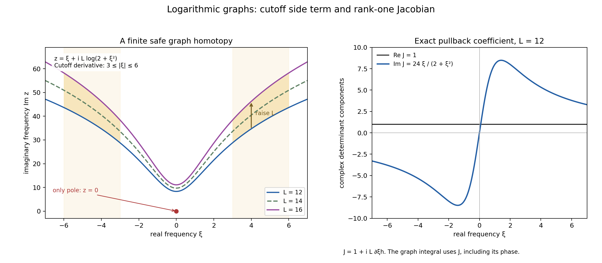
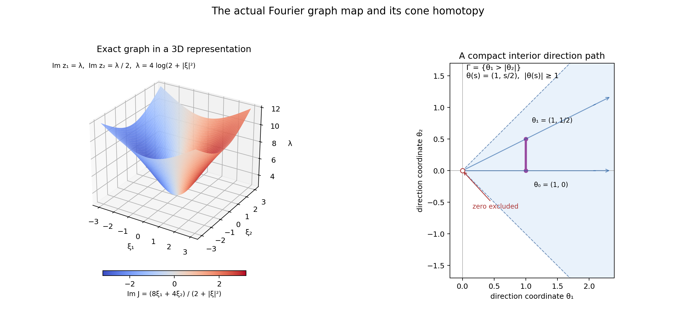
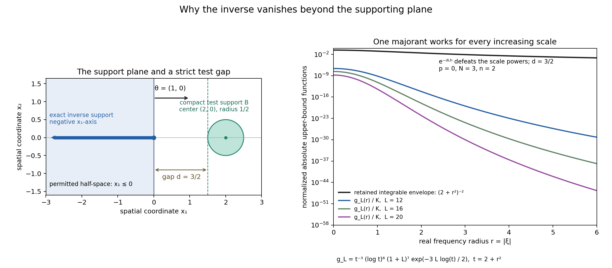

# Logarithmic Fourier graphs construct a cone-supported inverse

*Written and self-checked by GPT-6.1 Sol (OpenAI), Ultra reasoning effort, October 2026. Original exposition and proof details: CC0.*

We construct a distributional inverse of a compact convolution kernel from bounds on the reciprocal of its entire transform. A logarithmic graph keeps the reciprocal away from its poles while allowing the transform of every compactly supported test to make the integral converge. An explicit compact cutoff then proves that changing the graph does not change the distribution. Raising the graph makes tests beyond a supporting plane disappear.

The classical completeness target is Hörmander's compact-kernel converse, *The Analysis of Linear Partial Differential Operators II*, Theorem 16.7.4. No paid proof is needed to read or check the argument below. Its open-cone convention is recorded separately in Section 10. Here the cone excludes zero explicitly.

We assume the definition of a distribution as a complex-linear functional on compact smooth tests with a finite derivative bound on every fixed compact support, and the definition of its support. We use ordinary multivariable differentiation, compact integration by parts, Fubini's theorem for absolutely integrable functions, and dominated convergence. Compact-factor convolution is defined and checked below in Section 7. The required Fourier inversion identity and the cutoff form of Stokes' argument are also proved here. No convolution support equality, Paley–Wiener converse, or transform of an unrestricted distribution is a premise.

Freely readable human sources for the elementary background are Semyon Dyatlov's [distribution notes](https://math.mit.edu/~dyatlov/18.155/155-notes.pdf), Definition 2.1 and Section 2.2, Sections 4.1–4.2, Sections 8.1–8.2, and Proposition 11.14/Theorem 11.15; and Gerd Grubb's [Fourier chapter](https://web.math.ku.dk/~grubb/dist5.pdf), the paragraph after Remark 5.18 and equation (5.38). These are credit and comparison references. All analytic statements actually needed for the construction are proved below.

## 1. Exact statement and conventions

The real dimension is an integer \(n\ge1\). On \(\mathbb C^n\), use the Euclidean norm, with \(\zeta=\xi+i y\), \(\xi,y\in\mathbb R^n\). A nonempty **punctured open convex cone** in this chapter is a subset

\[
\varnothing\ne\Gamma\subset\mathbb R^n\setminus\{0\}
\tag{1.1}
\]

that is open in \(\mathbb R^n\), convex in the ordinary sense, and invariant under every positive dilation. This definition excludes opposite directions. It permits a half-space cone such as \(\{y:y_1>0\}\); its closure need not be pointed. We do not use the ambiguous word “proper” without this definition. A closed angular subcone means a closed dilation-invariant set \(\Gamma_1\subset\Gamma\cup\{0\}\). It contains zero unless it is empty, and its nonzero unit directions form a compact subset of \(\Gamma\).

For a nonempty real set \(B\), write

\[
H_B(y)=\sup_{x\in B}x\cdot y.
\tag{1.2}
\]

The transform of a compact distribution \(\mu\) is

\[
\widehat\mu(\zeta)=\langle\mu(x),e^{-i x\cdot\zeta}\rangle.
\tag{1.3}
\]

A compact smooth cutoff equal to one near \(\operatorname{supp}\mu\) defines this pairing. The test transform with the opposite argument will be denoted by

\[
F_\phi(\zeta)=\widehat\phi(-\zeta)
=\int_{\mathbb R^n}\phi(x)e^{i x\cdot\zeta}\,dx.
\tag{1.4}
\]

In particular \(|e^{i x\cdot(\xi+i y)}|=e^{-x\cdot y}\), so the support exponent in (1.4) is \(H_B(-y)\), not \(H_B(y)\).

**Theorem 1.1 (qualified compact-kernel cone converse).** Let \(\mu\in\mathcal E'(\mathbb R^n)\), and let \(\Gamma\) satisfy (1.1). Suppose that for every closed angular subcone \(\Gamma_1\subset\Gamma\cup\{0\}\) there are numbers \(C\ge1\), \(A\ge0\), and an integer \(p\ge0\) for which \(\widehat\mu\) has no zeros in

\[
y=\operatorname{Im}\zeta\in\Gamma_1,
\qquad |y|>C\log(|\zeta|+2),
\tag{1.5}
\]

and, throughout that region,

\[
|\widehat\mu(\zeta)^{-1}|
\le C(1+|\zeta|)^p e^{A|y|}.
\tag{1.6}
\]

Then there is \(E\in\mathcal D'(\mathbb R^n)\) with

\[
\mu*E=\delta_0.
\tag{1.7}
\]

For every \(\theta\in\Gamma\), its closed support hull \(K=\overline{\operatorname{conv}}(\operatorname{supp}E)\) satisfies

\[
H_K(\theta)<\infty.
\tag{1.8}
\]

More precisely, if \(A\) is a constant in (1.6) for any closed angular subcone containing the ray of \(\theta\), then the constructed \(E\) satisfies

\[
\operatorname{supp}E\subset\{x:x\cdot\theta\le A|\theta|\},
\qquad H_K(\theta)\le A|\theta|.
\tag{1.9}
\]

The constants may depend on the angular subcone. The theorem does not give a uniform bound approaching the boundary of \(\Gamma\), and it makes no assertion that \(E\) is tempered. The same \(E\) is used in every direction in (1.9); constructing unrelated directional inverses would not prove the theorem.

## 2. Entire transforms and the finite test estimate

Put \(S=\operatorname{supp}\mu\). Fix a compact cutoff \(\chi\) equal to one near \(S\). The expression \(\langle\mu,\chi e^{-ix\cdot\zeta}\rangle\) does not depend on \(\chi\), since the difference of two admissible cutoffs vanishes on a neighborhood of \(S\). It is entire. Indeed, about any fixed \(\zeta_0\), the exponential power series converges uniformly on \(\operatorname{supp}\chi\), together with every prescribed finite number of \(x\)-derivatives, for \(\zeta-\zeta_0\) in a fixed compact set. Factorial denominators dominate the powers of the bounded coordinates and the finitely many factors from differentiating. Finite-order continuity of \(\mu\) lets us pair this power series term by term. Thus

\[
\partial_\zeta^\alpha\widehat\mu(\zeta)
=\langle\mu,(-ix)^\alpha e^{-ix\cdot\zeta}\rangle.
\tag{2.1}
\]

The same argument, now ordinary integration on the support of \(\phi\), makes \(F_\phi\) entire. On the open set where \(\widehat\mu\ne0\), put \(q=1/\widehat\mu\). It is holomorphic there. Its denominator is never used outside that open set.

Fix a nonempty compact test support \(B\subset\mathbb R^n\), and set

\[
\|\phi\|_{B,m}
=\max_{|\alpha|\le m}\sup_x|\partial^\alpha\phi(x)|,
\qquad \operatorname{supp}\phi\subset B.
\tag{2.2}
\]

Derivatives of \(\phi\) have support in \(B\). Choose a ball containing \(B\), with volume \(V_B\). For every integer \(N\ge0\), compact integration by parts gives

\[
F_\phi(\xi+i y)
=(1+|\xi|^2)^{-N}
\int e^{i x\cdot\xi}(1-\Delta_x)^N
\bigl(\phi(x)e^{-x\cdot y}\bigr)\,dx.
\tag{2.3}
\]

This follows from \((1-\Delta_x)^N e^{i x\cdot\xi}=(1+|\xi|^2)^N e^{i x\cdot\xi}\); the differentiated amplitude has compact support, so there are no integration boundaries. The product rule shows that each of its derivatives of order at most \(2N\) is a finite sum of

\[
\binom\alpha\beta(\partial^\beta\phi)(x)
(-y)^{\alpha-\beta}e^{-x\cdot y}.
\]

Every summand is bounded by a fixed combinatorial constant times \(\|\phi\|_{B,2N}(1+|y|)^{2N}e^{H_B(-y)}\). Integrating on the containing ball proves the estimate

\[
|F_\phi(\xi+i y)|
\le D_{B,N}\|\phi\|_{B,2N}
(1+|\xi|^2)^{-N}(1+|y|)^{2N}e^{H_B(-y)}.
\tag{2.4}
\]

Here \(D_{B,N}\) is finite and independent of \(\phi,\xi,y\). One may take \(V_B\) times the finite sum of the coefficients of the product-rule expansion. There is no hidden choice of a test-dependent order. If the compact support is empty, the only test is zero and every subsequent bound is immediate.

## 3. Making an entire family of graphs admissible

For \(\xi\in\mathbb R^n\), write

\[
r=|\xi|,\qquad t=2+r^2,\qquad h(\xi)=\log t.
\tag{3.1}
\]

Then \(h\ge\log2\),

\[
\nabla h=\frac{2\xi}{2+|\xi|^2},
\qquad |\nabla h|\le\frac1{\sqrt2},
\qquad h\le\sqrt t.
\tag{3.2}
\]

The gradient bound maximizes \(2r/(2+r^2)\) at \(r=\sqrt2\). For the last inequality, the maximum of \((\log t)/\sqrt t\) for \(t\ge2\) is \(2/e<1\).

Let \(\theta(s)\), \(0\le s\le1\), be a continuously differentiable direction path whose image is a compact subset of \(\Gamma\). Let

\[
m=\min_s|\theta(s)|>0,
\qquad b=\max_s|\theta(s)|<\infty.
\tag{3.3}
\]

The generated closed cone

\[
\Gamma_1=\{\rho\theta(s):\rho\ge0,\ 0\le s\le1\}
\tag{3.4}
\]

is contained in \(\Gamma\cup\{0\}\). To check closedness, a convergent sequence \(\rho_j\theta(s_j)\) is bounded; (3.3) bounds \(\rho_j\), and subsequences of \(\rho_j,s_j\) converge. Their limit has the form in (3.4). Choose the constants \(C,A,p\) from (1.5)–(1.6) for this cone.

Consider the graph family

\[
z_{L,s}(\xi)=\xi+iL\theta(s)h(\xi).
\tag{3.5}
\]

We give an actual uniform height threshold. First,

\[
|z_{L,s}|+2\le r+Lb h+2
\le(r+2)(1+Lb h).
\]

Since \(r+2\le2(2+r^2)=2t\), \(1+Lb h\le(1+Lb)(1+h)\), \(\log(1+h)\le h\), and \(\log2\le h\), this implies

\[
\log(|z_{L,s}|+2)
\le\left(3+\frac{\log(1+Lb)}{\log2}\right)h.
\tag{3.6}
\]

For \(L\ge1\), the elementary integral inequality \(\log v\le2\sqrt v\), \(v\ge1\), gives

\[
\log(1+Lb)\le2\sqrt{1+b}\sqrt L.
\tag{3.7}
\]

Thus every \(L\ge L_*\), where

\[
L_*=1+\max\left\{1,\frac{6C}{m},
\left(\frac{4C\sqrt{1+b}}{m\log2}\right)^2\right\},
\tag{3.8}
\]

satisfies

\[
Lm>C\left(3+\frac{\log(1+Lb)}{\log2}\right).
\tag{3.9}
\]

Indeed, the two terms on the right after (3.7) are each strictly less than \(Lm/2\). Equations (3.6)–(3.9) prove

\[
|\operatorname{Im}z_{L,s}|=L|\theta(s)|h
>C\log(|z_{L,s}|+2).
\tag{3.10}
\]

This holds at \(\xi=0\) as well as at infinity, for all \(s\) and all \(L\ge L_*\). The imaginary directions belong to (3.4). Consequently every such graph and every indicated direction homotopy avoids all zeros of \(\widehat\mu\). A finite compact portion of the homotopy has an open zero-free neighborhood, because its continuous image is compact and \(\widehat\mu\) is continuous and nonzero there. It is on that neighborhood that the holomorphic forms used below are defined.

## 4. The graph Jacobian and distributional continuity

For a fixed real vector \(u\), put

\[
z_u(\xi)=\xi+i u h(\xi),\qquad
J_u(\xi)=\det\bigl(I+i u\otimes\nabla h\bigr).
\tag{4.1}
\]

Multilinearity of the determinant gives the rank-one identity

\[
\det(I+a\otimes v)=1+v\cdot a.
\tag{4.2}
\]

To see every term, write its \(j\)-th column as \(e_j+v_j a\). The term selecting no added column is one. Selecting only the \(j\)-th added column contributes \(v_j a_j\). Any term selecting two added columns has proportional columns and vanishes. This argument works over \(\mathbb C\). Hence

\[
J_u=1+i u\cdot\nabla h,
\qquad |J_u|\le1+\frac{|u|}{\sqrt2}.
\tag{4.3}
\]

The real part is one; there is no singular graph Jacobian. The pullback of \(dz_1\wedge\cdots\wedge dz_n\) under (4.1) is \(J_u\,d\xi_1\wedge\cdots\wedge d\xi_n\), oriented by the real \(\xi\)-coordinates. It is a complex determinant, not an absolute surface-area factor.

Fix \(\theta\in\Gamma\), choose the constants for its ray, and choose \(L\) above the ray version of (3.8). Define

\[
E_{\theta,L}(\phi)
=(2\pi)^{-n}\int_{\mathbb R^n}
q(z_{L\theta}(\xi))F_\phi(z_{L\theta}(\xi))
J_{L\theta}(\xi)\,d\xi.
\tag{4.4}
\]

We prove absolute convergence with one finite derivative order on each fixed compact support \(B\). Put \(R_B=\max_{x\in B}|x|\) and \(U=L|\theta|\). Then

\[
H_B(-L\theta h)\le R_B U h,
\qquad 1+|z_{L\theta}|\le(\sqrt2+U)\sqrt t.
\tag{4.5}
\]

The second inequality uses \(1+r\le\sqrt2\sqrt t\) and (3.2). Also \(1+Uh\le(1/\log2+U)h\), because \(h\ge\log2\). Since \(t/2\le1+r^2\le t\), equations (1.6), (2.4), (4.3), and (4.5) bound the absolute integrand in (4.4) by

\[
D\|\phi\|_{B,2N}
t^{p/2-N+U(A+R_B)}h^{2N}.
\tag{4.6}
\]

Here and below a finite constant \(D\) may change from line to line; in (4.6) it depends on \(B,N,L,\theta,C,A,p,n\), but not on \(\phi,\xi\). For an integer \(k\ge1\), the maximum of \((\log t)^k/t\) over \(t\ge1\) is \((k/e)^k\). Our graph values always have \(t\ge2\), so this gives a valid upper bound. For \(k=0\), one can use \(1\le t\). Thus

\[
h^{2N}\le D_N t.
\tag{4.7}
\]

Choose an integer

\[
N>\frac{p+n}{2}+U(A+R_B)+1.
\tag{4.8}
\]

The exponent of \(t\) after (4.7) is strictly below \(-n/2\). A power \((2+|\xi|^2)^{-a}\) is integrable when \(a>n/2\): it is bounded on the unit ball, and polar coordinates reduce the exterior integral to \(\int_1^\infty r^{n-1-2a}dr\). This proves

\[
|E_{\theta,L}(\phi)|\le D_B\|\phi\|_{B,2N}.
\tag{4.9}
\]

The integral is complex-linear, and (4.9) is its required finite-order bound on the fixed test space \(\mathcal D_B\). Every convergent test sequence has one common compact support and all its derivatives converge uniformly there, so (4.9) gives continuity. Equivalently it satisfies the usual fixed-compact characterization of \(\mathcal D'\). We have constructed a distribution, with the derivative order depending on \(B\); we have not assigned it a global transform or a uniform order at infinity.

## 5. A cutoff proof of graph deformation

Here is the full deformation calculation. Let \(f\) be holomorphic on an open neighborhood of the image of

\[
Z(s,\xi)=\xi+i u(s)h(\xi),\qquad 0\le s\le1,
\tag{5.1}
\]

on every compact \(\xi\)-set, where \(u\) is continuously differentiable. Set \(\Omega=f(z)\,dz_1\wedge\cdots\wedge dz_n\). Holomorphicity implies \(d\Omega=0\): each complex derivative term includes a repeated \(dz_j\), and each anti-holomorphic derivative is zero. Pulling back gives

\[
Z^*\Omega=a(s,\xi)\,d\xi
+ds\wedge\iota_{B(s,\xi)}d\xi,
\tag{5.2}
\]

where \(d\xi=d\xi_1\wedge\cdots\wedge d\xi_n\),

\[
a=f(Z)\det A,\quad
A=I+i u\otimes v,\quad v=\nabla h,
\tag{5.3}
\]

and the \(j\)-th component \(B_j\) is \(f(Z)\) times the determinant of \(A\) with its \(j\)-th column replaced by \(c=\partial_sZ=i u'h\). This follows by evaluating \(\Omega\) on \(\partial_s Z,\partial_{\xi_1}Z,\ldots\) and moving the replaced column to its position; the sign \((-1)^{j-1}\) is precisely the sign in \(\iota_B d\xi\).

One can compute these components without any surface shorthand. From (4.2), \(\det A=1+i u\cdot v\ne0\). Multiplying out verifies

\[
\operatorname{adj}(A)
=(1+i u\cdot v)I-i u\otimes v.
\tag{5.4}
\]

Consequently

\[
B=f(Z)h\bigl(i u'-(u\cdot v)u'+u(v\cdot u')\bigr),
\tag{5.5}
\]

and

\[
|B|\le |f(Z)|h|u'|(1+2|u||v|)
\le |f(Z)|h|u'|(1+\sqrt2|u|).
\tag{5.6}
\]

Differentiating (5.2), with \(ds\) placed before \(d\xi\), gives the exact closed-form identity

\[
\partial_s a=\operatorname{div}_\xi B.
\tag{5.7}
\]

Indeed \(d(a\,d\xi)=ds\wedge(\partial_s a)d\xi\), while \(d(ds\wedge\iota_Bd\xi)=-ds\wedge(\operatorname{div}B)d\xi\). The pullback commutes with exterior differentiation, which here is just the chain rule on its coefficients. Continuous differentiability of \(u\) suffices; the \(\xi\)-derivatives of \(B\) and the \(s\)-derivative of \(a\) exist continuously.

Choose a fixed smooth radial cutoff \(\chi\), equal to one on \(|\xi|\le1\), zero on \(|\xi|\ge2\), and between zero and one. For example, a smooth monotone transition made from \(e^{-1/t}\) gives such a function. Let \(\chi_R(\xi)=\chi(\xi/R)\). Its gradient is supported on \(R\le|\xi|\le2R\), and \(|\nabla\chi_R|\le D_\chi/R\). Compact integration by parts in (5.7) and the fundamental theorem of calculus in \(s\) give

\[
\int\chi_R a(1,\xi)d\xi-
\int\chi_R a(0,\xi)d\xi
=-\int_0^1\int\nabla\chi_R\cdot B\,d\xi\,ds.
\tag{5.8}
\]

This is the compact cutoff version of Stokes' formula, with its endpoint orientations and its side term written out. No assertion about contours at infinity is used in deriving it.

Apply (5.8) with \(f=qF_\phi\), and \(u(s)=L\theta(s)\) for the admissible path in Section 3. All images are zero-free by (3.10); no pole is crossed. Write \(U=\max_s|u(s)|\), \(U'=\max_s|u'(s)|\). The estimates that gave (4.6), now uniform in \(s\), show

\[
|f(Z(s,\xi))|
\le D\|\phi\|_{B,2N}
t^{p/2-N+U(A+R_B)}h^{2N}.
\tag{5.9}
\]

Together with (5.6), the absolute side term in (5.8), for \(R\ge1\), is at most

\[
D\|\phi\|_{B,2N}
R^{n-1}(2+R^2)^{p/2-N+U(A+R_B)}
\bigl(\log(2+4R^2)\bigr)^{2N+1}.
\tag{5.10}
\]

On the annulus, \(t/(2+R^2)\) lies between one and four, so comparison of any fixed real power changes only the constant. Its volume is at most \(D_n R^n\), the cutoff derivative contributes \(R^{-1}\), and (5.6) contributes one power of \(h\); these account for every factor in (5.10). Taking

\[
N>\frac{p+n}{2}+U(A+R_B)+2
\tag{5.11}
\]

makes (5.10) tend to zero. For example the logarithmic power is bounded by a constant times \(2+R^2\), leaving a power of \(R\) with strictly negative exponent. Each endpoint integral converges absolutely by the same choice of \(N\), so dominated convergence removes \(\chi_R\) there. Equation (5.8) proves equality of the two entire graph integrals.

This estimate also applies when \(u(s)=\ell(s)\theta\) and \(\ell(s)\) ranges over a finite interval entirely above the ray threshold (3.8). The ray's constants work throughout, and the finite maxima \(U,U'\) appear in the same calculation. Thus \(E_{\theta,L}\) is independent of all \(L\) above that ray threshold.

For two arbitrary directions \(\theta_0,\theta_1\in\Gamma\), the straight path \(\theta(s)=(1-s)\theta_0+s\theta_1\) lies in \(\Gamma\) by convexity. Its norm has a positive minimum: if it were zero, its value at a minimizing \(s\) would be zero in \(\Gamma\), contrary to (1.1). Use its generated cone (3.4), and choose one \(L\) above its uniform threshold and both individual ray thresholds. First raise either endpoint graph to that common scale using its ray calculation; then use the direction deformation. This proves equality of the endpoint distributions with their originally chosen admissible scales. We may therefore write

\[
E=E_{\theta,L},
\tag{5.12}
\]

independently of \(\theta\in\Gamma\) and its sufficiently large scale. This is where excluding zero from the convex cone is indispensable. Connectedness of unrelated angular components would not replace this particular admissible path.

## 6. Removing a graph for an entire test transform

After reciprocal cancellation, the relevant coefficient will be \(F_\phi\) itself. To reduce its integral to the real plane, use (5.1) with \(u(s)=s u_0\) for any fixed \(u_0\). The coefficient is now entire everywhere, including at \(s=0\); there is no denominator and therefore no zero-free restriction. Estimate (2.4) holds uniformly for \(|u(s)|\le|u_0|\). Its exponential factor is at most \(t^{R_B|u_0|}\). The calculation (5.6)–(5.10) consequently applies with \(p=0\), \(A=0\), and a sufficiently large \(N\). It proves

\[
\int_{\mathbb R^n}F_\phi(z_{u_0}(\xi))J_{u_0}(\xi)d\xi
=\int_{\mathbb R^n}F_\phi(\xi)d\xi.
\tag{6.1}
\]

Both integrals are absolutely convergent. In particular the real integral converges by (2.4) at \(y=0\), with \(N>n/2\).

We prove exactly the inversion value needed here. For \(\varepsilon>0\), Fubini's theorem gives

\[
(2\pi)^{-n}\int e^{-\varepsilon|\xi|^2/2}F_\phi(\xi)d\xi
=\int\phi(x)(2\pi\varepsilon)^{-n/2}
e^{-|x|^2/(2\varepsilon)}dx.
\tag{6.2}
\]

For completeness the Gaussian transform in this calculation follows directly in one dimension. Let \(I_\varepsilon(x)=\int e^{-\varepsilon\xi^2/2}e^{i x\xi}d\xi\). Gaussian decay justifies differentiation and integration by parts. Using \(\partial_\xi e^{-\varepsilon\xi^2/2}=-\varepsilon\xi e^{-\varepsilon\xi^2/2}\) gives \(I_\varepsilon'(x)=-(x/\varepsilon)I_\varepsilon(x)\), whence \(I_\varepsilon(x)=I_\varepsilon(0)e^{-x^2/(2\varepsilon)}\). The positive Gaussian mass is \(I_\varepsilon(0)=\sqrt{2\pi/\varepsilon}\): square its value at \(\varepsilon=1\), use Fubini, and polar coordinates give \(2\pi\int_0^\infty r e^{-r^2/2}dr=2\pi\). Scaling and taking products prove the factor in (6.2) in all dimensions.

On the left of (6.2), dominated convergence uses the integrability of \(F_\phi\). On the right, put \(x=\sqrt\varepsilon v\); its Gaussian kernel has mass one, and \(\phi(\sqrt\varepsilon v)\to\phi(0)\), bounded by \(\|\phi\|_\infty\). Dominated convergence with the fixed integrable Gaussian then proves

\[
(2\pi)^{-n}\int F_\phi(\xi)d\xi=\phi(0).
\tag{6.3}
\]

The borrowed classical normalization and inversion background are credited to Dyatlov, Proposition 11.14 and Theorem 11.15. Equations (6.2)–(6.3) give the whole needed argument here with our sign convention.

## 7. The convolution equation and its reflection sign

For \(\phi\in\mathcal D\), put

\[
g_\phi(x)=\langle\mu(y),\phi(x+y)\rangle.
\tag{7.1}
\]

This is a compact smooth test. To verify it, use a fixed compact cutoff in \(y\) near \(S\) and a finite-order estimate of \(\mu\) on its support. Difference quotients of \(\phi(x+y)\) converge in the required finite \(y\)-derivatives on each compact \(x\)-set. Hence

\[
\partial_x^\alpha g_\phi(x)
=\langle\mu(y),\partial^\alpha\phi(x+y)\rangle.
\tag{7.2}
\]

If \(x\notin B-S\), then \(x+S\) is disjoint from \(B\). Their compactness supplies a neighborhood of \(S\) on which \(\phi(x+\cdot)\) is zero, so \(g_\phi(x)=0\). The same persists in a neighborhood of \(x\). Thus

\[
\operatorname{supp}g_\phi\subset B-S,
\tag{7.3}
\]

a compact set. If \(m_\mu\) is the fixed cutoff finite order of \(\mu\), its product-rule estimate also gives, for each \(k\),

\[
\|g_\phi\|_{B-S,k}
\le D_k\|\phi\|_{B,k+m_\mu}.
\tag{7.4}
\]

The derivatives of the fixed cutoff contribute only fixed constants. This proves continuity of the map \(\mathcal D_B\to\mathcal D_{B-S}\). Consequently \(\phi\mapsto E(g_\phi)\) is a distribution; it defines convolution by the compact factor in the usual tensor formula. Its pairing is

\[
\langle\mu*E,\phi\rangle=\langle E,g_\phi\rangle.
\tag{7.5}
\]

For compact functions this is exactly Fubini's formula with addition \(x+y\); continuity extends the same compact-factor convention to distributions. This agrees with the exact prerequisite *Convolution as addition of supports*, Theorem 1.1, equations (1.4)–(1.8), but no support theorem from that provider is needed here.

The transform identity has an important sign:

\[
F_{g_\phi}(\zeta)=\widehat\mu(\zeta)F_\phi(\zeta).
\tag{7.6}
\]

To justify interchanging \(\mu\) with the integral, retain its fixed cutoff supported in a compact set \(S'\). Only \(x\in B-S'\) can contribute before pairing. On this compact \(x,y\)-set the integral is a limit of Riemann sums in every prescribed finite \(y\)-derivative, because the integrand and its derivatives are continuous uniformly on the compact set. The distribution's finite-order estimate passes it through that limit. For each fixed \(y\), the change of variables \(v=x+y\) then gives

\[
\int\phi(x+y)e^{i x\cdot\zeta}dx
=e^{-i y\cdot\zeta}F_\phi(\zeta).
\tag{7.7}
\]

Pairing with \(\mu(y)\) proves (7.6). This reflected test operation multiplies by \(\widehat\mu(\zeta)\), rather than by \(\widehat\mu(-\zeta)\). It does not take a Fourier transform of \(E\).

Insert (7.6) into the already convergent formula (4.4) for the compact test \(g_\phi\). Since the graph is zero-free, \(q\widehat\mu=1\) at every point of the graph, and hence

\[
\begin{aligned}
\langle\mu*E,\phi\rangle
&=(2\pi)^{-n}\int F_\phi(z_{L\theta}(\xi))J_{L\theta}(\xi)d\xi\\
&=(2\pi)^{-n}\int F_\phi(\xi)d\xi
=\phi(0).
\end{aligned}
\tag{7.8}
\]

The middle identity is (6.1), the last is (6.3). Both sides of each integral identity are absolutely convergent by the earlier estimates. We have proved (1.7). In particular \(E\ne0\) and its support is nonempty.

## 8. Raising the graph proves the supporting-plane bound

Fix \(\theta\in\Gamma\), and use \(C,A,p\) on its ray. Suppose the compact support of \(\phi\) lies strictly beyond the plane in (1.9):

\[
d:=\min_{x\in B}x\cdot\theta-A|\theta|>0.
\tag{8.1}
\]

With \(y=L\theta h\), the combined exponential in (1.6) and (2.4) is at most

\[
e^{A L|\theta|h+H_B(-L\theta h)}
=e^{-dLh}.
\tag{8.2}
\]

The equality uses \(H_B(-\theta)=-\min_{x\in B}x\cdot\theta\). This is the supporting-plane sign in the theorem.

We need a majorant uniform as \(L\to\infty\). Write \(b=|\theta|\), and choose a fixed integer \(N>(p+n)/2+1\). Equations (2.4), (4.3), and (4.5), with the exact exponential (8.2), bound the absolute integrand of (4.4) for all \(L\ge L_*\) by

\[
D\|\phi\|_{B,2N}
t^{p/2-N}h^{2N}(1+L)^{p+2N+1}e^{-dLh}.
\tag{8.3}
\]

All constants here are independent of \(L\). For example \(\sqrt2+Lb\le(\sqrt2+b)(1+L)\), \(1+Lbh\le(1/\log2+b)(1+L)h\), and \(1+Lb/\sqrt2\le(1+b/\sqrt2)(1+L)\), explaining every scale power. Let \(k=p+2N+1\). Since \(h\ge\log2\),

\[
(1+L)^k e^{-dLh/2}
\le (1+L)^k e^{-(d\log2)L/2}
\le D_{k,d}<\infty.
\tag{8.4}
\]

The last finite bound follows, for instance, by expanding \((1+L)^k\) into powers and maximizing \(L^j e^{-cL}\) at \(j/c\) for \(j>0\); its value is \((j/(ce))^j\), and the \(j=0\) term is at most one. Use one half of the negative exponential for (8.4), and bound the other half by one. Equations (4.7), (8.3) give the single integrable majorant

\[
D'\|\phi\|_{B,2N}t^{p/2-N+1}.
\tag{8.5}
\]

Its exponent is below \(-n/2\) by our fixed choice of \(N\). For each fixed \(\xi\), the polynomial in \(L\) in (8.3) times \(e^{-dLh}\) tends to zero. Dominated convergence therefore gives

\[
E_{\theta,L}(\phi)\longrightarrow0
\quad\text{as }L\to\infty.
\tag{8.6}
\]

All these distributions equal \(E\) by Section 5, so \(E(\phi)=0\).

If \(x_0\cdot\theta>A|\theta|\), choose a sufficiently small ball around \(x_0\) on which that inequality remains strict. Every compact smooth test supported there satisfies (8.1). Hence \(E\) vanishes on that ball, and

\[
\operatorname{supp}E\subset\{x:x\cdot\theta\le A|\theta|\}.
\tag{8.7}
\]

Closed half-spaces are convex, so (8.7) contains the closed convex hull \(K\) as well. Its support function is at most \(A|\theta|\). It is not \(-\infty\), since \(K\) contains some support point of the nonzero \(E\). This proves (1.8)–(1.9) for every direction, completing Theorem 1.1. □

The proof allows the constants to change between directions because the distribution was already identified across all the graphs. That order matters. A family of unrelated inverses, each with one finite support direction, would leave (1.8) unproved.

## 9. Exact examples and the graph geometry

**Example 9.1 (a derivative and its chosen side).** In dimension one, let \(\mu=\delta'_0\). Definition (1.3) gives \(\widehat\mu(\zeta)=i\zeta\). On \(\Gamma=(0,\infty)\), the reciprocal has modulus at most \(1/\operatorname{Im}\zeta\). With \(C=2\), \(p=0\), \(A=0\), region (1.5) implies \(\operatorname{Im}\zeta>2\log2\), so (1.6) holds. The theorem yields an inverse supported in \(( -\infty,0]\). A direct inverse is

\[
E_+(\phi)=-\int_{-\infty}^0\phi(x)dx.
\tag{9.1}
\]

Indeed \(\delta'_0*E_+=E_+'\), and \(E_+'(\phi)=\int_{-\infty}^0\phi'(x)dx=\phi(0)\). Its support is exactly \(( -\infty,0]\), since on every negative open interval it is the nonzero constant density \(-1\). The graph construction selects this inverse: it has support in that half-line; subtracting (9.1) gives a distribution \(T\) supported there with \(T'=0\). A distribution with zero derivative is constant, as follows by writing any zero-integral compact test as the derivative of its compact primitive. Subtracting a fixed mass-one test then shows \(T(\phi)=c\int\phi\). A nonzero constant has full-line support, so \(T=0\).

The negative cone \(( -\infty,0)\) selects instead \(E_-(\phi)=\int_0^\infty\phi(x)dx\), whose derivative is also \(\delta_0\). Its support is \([0,\infty)\). Thus changing to a different, disconnected direction cone can change the inverse; \(E_--E_+=1\).

*Figure 1. The one-dimensional example has graphs \(z=\xi+iL\log(2+\xi^2)\), with \(L=12,16\), and an intermediate graph at \(L=14\). The pale full-height vertical bands mark the frequency-coordinate region \(3\le|\xi|\le6\) where the derivative of \(\chi_R\), \(R=3\), can be nonzero. Within those bands, the darker regions between the endpoint graphs show the actual swept homotopy strips that contribute to the cutoff side term. Their upper and lower edges are the endpoint graphs, not assumed pole barriers. The only pole of \(q=1/(i\zeta)\) is the origin. Both graphs, and every scale between them, satisfy \(\operatorname{Im}z>2\log(|z|+2)\): for \(t=2+\xi^2\), \(r\le t\) and \(\log t\le t\), so \(|z|+2\le(L+2)t\); for \(L\ge12\), \((L/2-1)\log2>\log(L+2)\), as at \(L=12\) and by its positive derivative thereafter. The right panel plots the exact complex graph coefficient \(J=1+2iL\xi/(2+\xi^2)\) at \(L=12\). Its real part is one. Every curve is a sample of the displayed exact function; the proof of cutoff decay is (5.8)–(5.11), not the plot.*

[Open Figure 1 at full size](figures/logarithmic-cutoff-and-jacobian.png) · [Vector version](figures/logarithmic-cutoff-and-jacobian.svg).

**Example 9.2 (a compact delay with exponential inverse growth).** Let \(v>0\), \(c>1\), and \(\mu=\delta_0-c\delta_v\) on the line. Then

\[
\widehat\mu(\zeta)=1-ce^{-iv\zeta}.
\tag{9.2}
\]

On the negative cone, if \(y<-(\log(2c))/v\), then \(|ce^{-iv(\xi+i y)}|=ce^{vy}<1/2\), so \(|q|\le2\). Choose \(C\ge\max\{2,\log(2c)/(v\log2)\}\) in (1.5). It implies this negative height condition and supplies (1.6) with \(A=p=0\). The theorem constructs an inverse supported in \([0,\infty)\). Here one can write it directly:

\[
E=\sum_{j=0}^\infty c^j\delta_{jv}.
\tag{9.3}
\]

The sum is locally finite. For a compact test, only finitely many atoms occur, so (9.3) is a distribution. Applying the two delays gives a telescoping cancellation, \((\delta_0-c\delta_v)*E=\delta_0\). The support hull is \([0,\infty)\), with support function zero in every negative direction. Nonetheless \(E\) is not tempered: compact bumps translated to \(jv\), equal to one there and meeting no other atom, pair to \(c^j\), whereas every fixed Schwartz seminorm of those bumps grows only polynomially in \(j\). This example explains why the theorem constructs \(E\) as a functional on compact tests.

The zeros in (9.2) occur at \(\operatorname{Im}\zeta=-(\log c)/v\), \(\operatorname{Re}\zeta=2\pi k/v\). These poles prevent a reciprocal deformation to the real plane. Section 6 deforms to the real plane only after cancellation, when its coefficient is entire.

**Example 9.3 (a two-variable graph and its projection).** With direction \(\theta=(1,1/2)\), \(L=4\), the exact map is

\[
(\xi_1,\xi_2)\longmapsto
(\xi_1+4i\log(2+\xi_1^2+\xi_2^2),
\xi_2+2i\log(2+\xi_1^2+\xi_2^2)).
\tag{9.4}
\]

Its imaginary coordinates satisfy \(\operatorname{Im}z_2=\operatorname{Im}z_1/2\), so plotting \((\xi_1,\xi_2,\lambda)\) with \(\lambda=4\log(2+|\xi|^2)\) gives an exact three-dimensional representation of this particular two-dimensional surface in \(\mathbb C^2\cong\mathbb R^4\). No fourth coordinate is discarded ambiguously: it is recovered from \(\lambda/2\). Its complex Jacobian is

\[
J=1+i\frac{8\xi_1+4\xi_2}{2+\xi_1^2+\xi_2^2}.
\tag{9.5}
\]

*Figure 2. Left: samples of the exact surface (9.4) over the square [-3,3]², using the representation specified there. The plotted height is \(\lambda\), and the color records the imaginary part of the exact Jacobian (9.5), not a surface area or an asserted reciprocal bound. Right: \(\Gamma=\{(\theta_1,\theta_2):\theta_1>|\theta_2|\}\); the segment \(\theta(s)=(1,s/2)\) joins \((1,0)\) to \((1,1/2)\). Its norm is at least one, so its ray cone has compact interior unit directions. The complete homotopy proof is Section 5. The figure fixes a graph map and an angular geometry; it does not assert that \(L=4\) meets an unspecified kernel's logarithmic threshold.*

[Open Figure 2 at full size](figures/two-variable-graph-and-directions.png) · [Vector version](figures/two-variable-graph-and-directions.svg).

*Figure 3. Use the exact model \(\mu=\partial_{x_1}\delta_0\) in \(\mathbb R^2\), \(\theta=(1,0)\), \(A=p=0\), whose inverse is \(-H(-x_1)\otimes\delta_0(x_2)\); its negative-axis support is proved in learner Problem 9. The supporting half-space is \(x_1\le0\). The compact disk \(B=\{|x-(2,0)|\le1/2\}\) has \(\min_B x\cdot\theta=3/2\), so \(d=3/2\). A nonzero smooth bump \(\phi(x)=e^{-1/(1/4-|x-(2,0)|^2)}\) inside that disk, extended by zero, has support exactly \(B\). Right: at \(n=2\), \(N=3\), the absolute graph integrand is bounded by a fixed constant times \(\|\phi\|_{B,6}g_L(r)\), where \(g_L=t^{-3}(\log t)^6(1+L)^7e^{-3L\log(t)/2}\), \(t=2+r^2\). The plotted quantities are these exact upper-bound functions divided by \(K\); they are not measurements of the integrand or its oscillation. With \(c=3\log2/4\), put \(K_0=(7/c)^7e^{-7+c}\), \(K=K_0(6/e)^6\). Maximizing \((1+L)^7e^{-cL}\) and \((\log t)^6/t\), as in (8.4) and (4.7), proves \(g_L/K\le t^{-2}\) for every \(L\ge0\). The retained envelope \(t^{-2}\) is integrable on \(\mathbb R^2\), and the plotted safe scales \(L=12,16,20\) tend pointwise toward zero when increased. Sections 3 and 8, and learner Problems 2, 6, and 9, give the exact threshold, sign, and limit arguments.*

[Open Figure 3 at full size](figures/support-plane-and-uniform-decay.png) · [Vector version](figures/support-plane-and-uniform-decay.svg).

## 10. The original source convention remains a separate audit

The private H2 source statement on PDF page 365 says “open convex cone” without giving a definition on that page. The preceding Section 16.7 context on PDF pages 362–364 discusses support contained in a proper convex cone and hyperbolicity relative to a nonzero direction, but does not supply an explicit all-space exclusion for this converse. A different H1 use, Theorem 3.1.15, PDF page 74/printed page 66, explicitly allows the proof to assume that zero is outside the cone because that theorem is trivial otherwise. The latter is evidence that one must not infer a universal punctured convention from terminology alone. It does not determine the H2 converse's intended scope.

The unresolved abbreviated interface cannot be claimed literally with \(\Gamma=\mathbb R\). For \(\mu=\delta'_0\), the reciprocal \(1/(i\zeta)\) satisfies bounds of form (1.6) beyond logarithmic height in either direction. But an inverse with finite support function at both \(+1\) and \(-1\) would have bounded support, hence compact support. Such an inverse is impossible: choose a compact smooth cutoff \(\chi\) equal to one near its support and at zero. Then \(\langle E',\chi\rangle=-\langle E,\chi'\rangle=0\), whereas \(\delta_0(\chi)=1\).

The two one-sided inverses in Example 9.1 differ by one. A direction homotopy connecting them must cross zero, where the logarithmic region is unavailable, so Section 5 correctly proves no such equality. This calculation identifies an actual convention-sensitive boundary of our result; it is not a claim of an error in the source under its intended convention. The precise qualified Theorem 1.1 is fully written here. The broader original convention remains unresolved, and this candidate does not certify a full unqualified equivalence or recursive prerequisite closure.

## Exercises with complete solutions

### 1. A complex determinant is not a surface-area factor

**Problem.** Let \(n=2\), \(u=(4,2)\), and \(h(\xi)=\log(2+\xi_1^2+\xi_2^2)\). Write the complete derivative matrix of \(z(\xi)=\xi+iuh(\xi)\), expand its determinant, and explain what multiplies \(d\xi_1\wedge d\xi_2\) in the graph integral.

**Solution.** Put \(t=2+\xi_1^2+\xi_2^2\). The matrix is

\[
A=\begin{pmatrix}
1+8i\xi_1/t&8i\xi_2/t\\
4i\xi_1/t&1+4i\xi_2/t
\end{pmatrix}.
\]

Its determinant is

\[
(1+8i\xi_1/t)(1+4i\xi_2/t)
-(8i\xi_2/t)(4i\xi_1/t)
=1+i(8\xi_1+4\xi_2)/t.
\]

The quadratic terms cancel exactly. Thus \(z^*(dz_1\wedge dz_2)=\det(A)d\xi_1\wedge d\xi_2\). The factor is the displayed complex number, including its imaginary part; replacing it by \(|\det A|\) would change the differential form and destroy the closed-form calculation in Section 5. Its real part equals one, so it is never zero.

### 2. A logarithmic height must dominate its own contribution to frequency

**Problem.** For \(\mu=\delta'_0\), \(C=2\), and \(\Gamma=(0,\infty)\), prove that every graph \(z_L(\xi)=\xi+iL\log(2+\xi^2)\), \(L\ge12\), lies in \(\operatorname{Im}z>2\log(|z|+2)\). Also verify the reciprocal bound with \(p=A=0\).

**Solution.** Write \(r=|\xi|\), \(t=2+r^2\), \(h=\log t\). We have \(r\le t\), \(2\le t\), and \(h\le t\), hence \(|z_L|+2\le r+Lh+2\le(L+2)t\). Therefore

\[
2\log(|z_L|+2)\le2\log(L+2)+2h.
\]

It is enough to have \((L/2-1)\log2>\log(L+2)\). At \(L=12\), its left side is \(5\log2=\log32>\log14\). The difference has derivative \(\tfrac12\log2-1/(L+2)>0\) for \(L\ge12\), so the inequality continues to hold. This proves the threshold, including at \(\xi=0\). Moreover \(\widehat\mu(z)=iz\), whose only zero is zero. On the stated region, \(|1/(iz)|\le1/\operatorname{Im}z<1/(2\log2)<2\), proving (1.6) with the same \(C=2\). The contribution \(Lh\) to \(|z|\) has been included in the argument.

### 3. A finite test order can be large and still prove continuity

**Problem.** Suppose a graph in dimension two has already been validated, and on it \(p=3\), \(U=L|\theta|=6\), \(A=1\). Test supports lie in a compact set with \(R_B=2\). Use (4.8) to find a valid test derivative order for absolute convergence. Use (5.11) to find one that also proves the cutoff side term tends to zero. Does this establish a global finite order for \(E\)?

**Solution.** Here \((p+n)/2=5/2\), and \(U(A+R_B)=18\). Condition (4.8) is \(N>21.5\), so \(N=22\) gives a bound through order \(2N=44\) on this fixed compact support. For the side term, (5.11) requires \(N>22.5\); choose \(N=23\), hence order 46. The choice is conservative and no optimality is claimed. It assumes the graph's zero-free threshold has been checked separately; the numbers in this problem do not certify that threshold. As \(B\) changes, \(R_B\), and consequently the required order, may change. This is precisely enough for a distribution in \(\mathcal D'\), and is not a claim of one global finite order or temperedness.

### 4. Compute a moving-graph side coefficient

**Problem.** In dimension two, let \(u(s)=(1,s)\), \(0\le s\le1\), and \(v=\nabla h\). For a holomorphic coefficient \(f\), compute the vector \(B\) in (5.5). Suppose along this homotopy \(|f(Z(s,\xi))|\le D(1+|\xi|^2)^{-4}h^6\). Prove that the side term for \(\chi_R\) tends to zero.

**Solution.** Here \(u'=(0,1)\), \(u\cdot v=v_1+sv_2\), and \(v\cdot u'=v_2\). Thus

\[
B=f(Z)h\left((0,i)-(0,v_1+sv_2)+(v_2,sv_2)\right)
=f(Z)h(v_2,i-v_1).
\]

The bound \(|v|\le1/\sqrt2\) gives \(|B|\le D'|f(Z)|h\). For \(R\ge1\), the annulus \(R\le|\xi|\le2R\) has area at most \(D''R^2\), and \(|\nabla\chi_R|\le D_\chi/R\). The absolute right side of (5.8) is consequently bounded by

\[
D''' R(1+R^2)^{-4}\bigl(\log(2+4R^2)\bigr)^7
=O\bigl(R^{-7}(\log R)^7\bigr),
\]

which tends to zero. This is a compact cutoff estimate, not an appeal to an unspecified contour at infinity. Its holomorphicity assumption must hold on a neighborhood of the entire truncated homotopy; if \(f=qF_\phi\), that requires the explicit no-zero check.

### 5. Find the convolution reflection sign with a translated point mass

**Problem.** Let \(\mu=\delta_a\) in \(\mathbb R^n\). Calculate \(g_\phi\), \(F_{g_\phi}\), and the inverse obtained by the graph formula. Compare its support function with the bound obtained by taking \(A=|a|\).

**Solution.** The reflected test is \(g_\phi(x)=\phi(x+a)\). With \(v=x+a\),

\[
F_{g_\phi}(\zeta)=e^{-ia\cdot\zeta}F_\phi(\zeta)
=\widehat\mu(\zeta)F_\phi(\zeta).
\]

Here \(\widehat\mu=e^{-ia\cdot\zeta}\) has no zeros, and \(q=e^{ia\cdot\zeta}\). The graph formula has coefficient

\[
e^{ia\cdot\zeta}F_\phi(\zeta)
=\int\phi(x)e^{i(x+a)\cdot\zeta}dx.
\]

This is the entire transform factor associated with the test \(\psi(v)=\phi(v-a)\). Equations (6.1)–(6.3) deform it to the real plane and give \(E(\phi)=\psi(0)=\phi(-a)\). Thus \(E=\delta_{-a}\), and \(\mu*E=\delta_0\). Its exact support function is \(H_K(\theta)=-a\cdot\theta\). Since \(|q(\xi+iy)|=e^{-a\cdot y}\le e^{|a||y|}\), the general theorem with \(A=|a|\) gives the valid, possibly nonsharp estimate \(-a\cdot\theta\le|a||\theta|\). The transform multiplier has the sign in (7.6); changing it would yield the wrong point mass.

### 6. Strictly beyond the supporting plane

**Problem.** In (8.1), why is the condition \(d>0\) used rather than \(d\ge0\)? Exhibit an inverse for which the distribution does not vanish on the bounding plane. Prove the uniform scale absorption (8.4) without assuming that each scale integral separately converges.

**Solution.** If \(d>0\), the factor \(e^{-dLh}\) defeats every fixed power of \(L\), uniformly after one half of its decay is used to make a majorant. If \(d=0\), that decay disappears and the same proof fails. The equation \(\delta_0*\delta_0=\delta_0\), with \(A=0\), has inverse \(E=\delta_0\) supported on the plane \(x\cdot\theta=0\). A test nonzero at zero has nonzero pairing, so the conclusion must concern the open half-space \(x\cdot\theta>0\), not the closed one.

For the absorption, set \(c=d\log2/2>0\). Since \(h\ge\log2\), \((1+L)^k e^{-dLh/2}\le(1+L)^k e^{-cL}\). Expand \((1+L)^k=\sum_{j=0}^k\binom kj L^j\). The \(j=0\) term is at most one; for \(j>0\), differentiating \(L^j e^{-cL}\) gives its maximum \((j/(ce))^j\). Their finite sum gives a constant independent of \(L\). The remaining half of the exponential is at most one, leaving the integrable majorant (8.5). That one bound, followed by pointwise decay, is what permits dominated convergence.

### 7. Opposite directions do not select the same derivative inverse

**Problem.** Prove that \(E_+=-H(-x)\) and \(E_-=H(x)\) both satisfy \(E'=\delta_0\). Compute their supports and difference. Prove that no compactly supported inverse exists. Explain exactly which hypothesis of Theorem 1.1 prevents identifying them by a direction deformation.

**Solution.** For a compact smooth test,

\[
E_+'(\phi)=\int_{-\infty}^0\phi'(x)dx=\phi(0),
\qquad E_-'(\phi)=-\int_0^\infty\phi'(x)dx=\phi(0).
\]

The densities are nonzero on every open interval strictly within their respective half-lines, and vanish on the opposite open half-lines. Their supports are therefore exactly \(( -\infty,0]\) and \([0,\infty)\). Their difference pairs as \(\int_0^\infty\phi+\int_{-\infty}^0\phi=\int_\mathbb R\phi\), the constant distribution one. The first has finite support function in positive directions; the second has finite support function in negative directions.

If \(E\) had compact support and \(E'=\delta_0\), choose a compact smooth \(\chi\) equal to one near \(\operatorname{supp}E\cup\{0\}\). Then \(\chi'=0\) near that support, and \(E'(\chi)=-E(\chi')=0\); but \(\delta_0(\chi)=1\). This contradiction proves the obstruction. Ordinary convexity of a cone containing \(+1\) and \(-1\) would put their midpoint zero in it. The punctured cone in Theorem 1.1 excludes zero; hence it cannot contain both directions. In dimension one the punctured union of the two rays is also disconnected and not ordinarily convex. No permitted homotopy connects the two graphs through the required zero-free logarithmic region.

### 8. A delay inverse is unique on its support side, but can grow exponentially

**Problem.** For \(v>0\), \(c>1\), prove every assertion in Example 9.2 and show that the inverse supported in \([0,\infty)\) is unique among distributions with that support. Explain why that uniqueness does not require Fourier transforming the inverse.

**Solution.** The atoms at \(jv\) meet a compact set only finitely often, so \(E(\phi)=\sum_{j\ge0}c^j\phi(jv)\) is locally a finite sum of order-zero distributions. It therefore satisfies a finite local test bound. The shift by \(v\) gives

\[
c\delta_v*E=\sum_{j\ge0}c^{j+1}\delta_{(j+1)v}
=\sum_{j\ge1}c^j\delta_{jv}.
\]

Subtracting from \(E\) leaves \(\delta_0\), exactly in \(\mathcal D'\). Every coefficient is nonzero at a distinct atom, so the support is the discrete set \(v\mathbb N_0\), and its closed convex hull is \([0,\infty)\). Its supporting value is zero at negative directions.

The compact transform is \(1-ce^{-iv\zeta}\). A zero must satisfy \(ce^{vy}=1\) and \(e^{-iv\xi}=1\), giving \(y=-(\log c)/v\), \(\xi=2\pi k/v\). When \(y<-(\log(2c))/v\), the second term has modulus below \(1/2\), so the reciprocal has modulus at most two. Choosing \(C\ge\max\{2,\log(2c)/(v\log2)\}\) makes the theorem's negative logarithmic-height region lie there.

For non-temperedness, choose a fixed compact bump \(\rho\) supported in \((-v/3,v/3)\), with \(\rho(0)=1\), and set \(\rho_j(x)=\rho(x-jv)\). Then \(E(\rho_j)=c^j\). Every fixed Schwartz seminorm of \(\rho_j\) is at most a constant times a power of \(1+j\), since the derivatives are fixed translates and their support lies within \(v/3\) of \(jv\). A continuous tempered functional has a bound by finitely many of those seminorms, contradicting \(c^j\)'s exponential growth.

For uniqueness, subtract two supported inverses to obtain \(T\) supported in \([0,\infty)\) with \(T=c\delta_v*T\). Iterating the distributional equality gives \(T=c^m\delta_{mv}*T\), whose support lies in \([mv,\infty)\). For a fixed compact test choose \(m\) so large that its support lies below \(mv\); its pairing with \(T\) is zero. Every test vanishes this way, so \(T=0\). The argument uses only shifts and support. In particular it identifies the graph-constructed inverse with the explicit sum without introducing a transform of that non-tempered sum.

### 9. A half-space cone in several dimensions

**Problem.** In \(\mathbb R^n\), take \(\mu=\partial_{x_1}\delta_0\), \(\Gamma=\{\theta:\theta_1>0\}\), and

\[
E(\phi)=-\int_{-\infty}^0\phi(s,0,\ldots,0)ds.
\]

Prove the convolution equation, the exact support, and the reciprocal condition on every closed angular subcone. Does \(\overline\Gamma\) have to be pointed?

**Solution.** Integration by parts gives

\[
\partial_{x_1}E(\phi)
=\int_{-\infty}^0\partial_{x_1}\phi(s,0,\ldots,0)ds
=\phi(0).
\]

Thus \(\mu*E=\delta_0\). The distribution vanishes off the closed negative first-coordinate ray, and every neighborhood of a point on that ray contains a test whose restriction to the ray has a nonzero integral. Its support and closed convex hull are that ray. Consequently \(H_K(\theta)=0\) when \(\theta_1\ge0\), and \(+\infty\) when \(\theta_1<0\).

For a closed angular subcone with a nonzero direction, compactness of its unit directions inside \(\Gamma\) gives \(\varepsilon>0\) with \(y_1\ge\varepsilon|y|\) there. The compact transform is \(i\zeta_1\), so it is nonzero when \(y_1>0\), and

\[
|1/(i\zeta_1)|\le1/y_1\le1/(\varepsilon|y|).
\]

Choosing \(C\ge\max\{1,1/(\varepsilon\log2)\}\), the logarithmic region has \(|y|>C\log2\), and the last quantity is at most \(C\). This proves the hypothesis with \(A=p=0\). A cone containing only zero has an empty height region and needs no estimate. For \(n\ge2\), \(\overline\Gamma=\{\theta_1\ge0\}\) contains every line in the hyperplane \(\theta_1=0\). Our open cone excludes zero and opposite interior directions, but its closure need not be pointed. That distinction is why the chapter states its convention explicitly.

### 10. Why one common distribution is necessary

**Problem.** Suppose \(\theta_0,\theta_1\) belong to a cone satisfying (1.1). Prove that the straight segment stays a positive distance from zero, that its generated ray cone is closed, and that graph equality really identifies the original ray constructions even when their reciprocal constants differ.

**Solution.** Convexity puts every segment point in \(\Gamma\); none equals zero. Its norm is continuous on a compact interval, so its minimum \(m\) is attained and positive. If \(\rho_j\theta(s_j)\) converges, its boundedness and \(m>0\) bound \(\rho_j\). Subsequence compactness yields a limit \(\rho\theta(s)\), proving that the generated ray cone is closed. It is contained in \(\Gamma\cup\{0\}\) by dilation invariance.

Use that cone's constants to choose one common scale \(L\) large enough for (3.8); also make it at least the two individual ray thresholds. The original ray graph at \(\theta_0\) can first be raised to \(L\) using its own ray estimate; Section 5 proves equality on that finite safe scale interval. Do the same for \(\theta_1\). The segment deformation at the common scale is uniformly zero-free by the generated cone's estimate, and its cutoff side term vanishes by (5.10). Thus the original constructions agree. Repeating with arbitrary pairs gives one \(E\), so each directional half-space bound applies to its same support. Different constants are allowed; different unidentified inverses would not prove simultaneous support control.

The background credit and exact proof dependencies remain those of the main manuscript. The solved examples use only its proved graph construction, compact-factor convolution, finite test continuity, and the stated support definition. They do not require the unresolved unrestricted source convention or a paid proof.

## References and proof dependencies

- Semyon Dyatlov, *Lecture notes for 18.155: distributions, elliptic regularity, and applications to PDEs*, October 2, 2026, [author-hosted notes](https://math.mit.edu/~dyatlov/18.155/155-notes.pdf). Definition 2.1/Section 2.2: fixed-compact distribution bounds; Sections 4.1–4.2: support and compact cutoffs; Sections 8.1–8.2, especially Proposition 8.6 and Definition 8.9, printed pages 90–91: compact-factor convolution; Proposition 11.14 and Theorem 11.15, printed pages 123–124: Gaussian normalization and Fourier inversion.
- Gerd Grubb, *Distributions and Operators*, Chapter 5, [author-hosted Fourier chapter](https://web.math.ku.dk/~grubb/dist5.pdf). Paragraph after Remark 5.18.14–5.15, especially equation (5.38): compact distribution transform and its entire extension. The finite estimate (2.4) and all graph arguments are proved in this chapter.
- *Convolution as addition of supports*, Theorem 1.1, equations (1.4)–(1.8), exact complete local provider bound in the dependency ledger. Section 7 reproduces the reflected-test construction and continuity actually used. Its broader support theorem and its transitive prerequisites are not newly invoked or recursively recertified here.
- Lars Hörmander, *The Analysis of Linear Partial Differential Operators II*, Theorem 16.7.4, printed page 359: statement/completeness target only. Neither its prose nor its scan is included in the learner payload. Section 10 discusses its cone convention, which remains unresolved.

This manuscript contains the complete analytic construction for the stated punctured-cone theorem.
