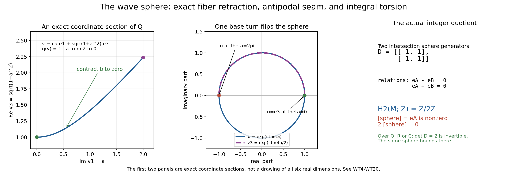

# The four-dimensional wave cycle has nonzero integral torsion

Owner working proof, October 2026. Written by GPT-6.1 Sol (OpenAI), Ultra reasoning. Original exposition: CC0. It strengthens the explicit wave calculation in AH032-2 without changing that frozen proof or asserting the coefficient convention of a private source.

The exact polynomial and direction are

\[
 F(\tau,\eta)=\tau^2-\eta_1^2-\eta_2^2-\eta_3^2,
 \qquad x=N=(1,0,0,0).
 \tag{WT1}
\]

Its affine equatorial complement is identified, using \(\tau=0\), with

\[
 M=\{z\in\mathbb C^3:q(z)\ne0\},\qquad
 q(z)=z_1^2+z_2^2+z_3^2.
 \tag{WT2}
\]

Let \(k_{\mathrm{out}}\) be the real unit sphere in this complement, with its outward orientation. The admitted AH032-2 canonical C8 representative is \(k_x=-k_{\mathrm{out}}\). At every point of this sphere, \(F=-1\ne0\), so the zero equatorial deformation field is allowed. The result concerns these actual finite cycles with ordinary integral singular homology, not compactly supported or Borel--Moore homology.

**Theorem.** In the model (WT1)--(WT2),

\[
 H_2(M;\mathbb Z)\cong\mathbb Z/2\mathbb Z,
 \qquad [k_{\mathrm{out}}]=[k_x]\ne0.
 \tag{WT3}
\]

Both sphere classes have exact order two. Their images in \(H_2(M;\mathbb Q)\), \(H_2(M;\mathbb R)\), and \(H_2(M;\mathbb C)\) vanish. Thus the already constructed rational bounding chain cannot be replaced by an integral bounding chain for the single sphere in this example. No general integral torsion theorem, source-error claim, or general Petrowsky component-constancy statement follows.

## 1. The quadric fiber has an equivariant elementary retraction

Consider \(Q=q^{-1}(1)\). Write \(v=a+ib\), with \(a,b\in\mathbb R^3\). Then

\[
 |a|^2-|b|^2=1,\qquad a\cdot b=0.
 \tag{WT4}
\]

In particular \(a\ne0\). Set \(u=a/|a|\). The map

\[
 (u,b)\longmapsto \sqrt{1+|b|^2}\,u+ib,
 \quad |u|=1,\quad u\cdot b=0
 \tag{WT5}
\]

is a smooth bijection from the tangent bundle of \(S^2\) onto \(Q\), with smooth inverse \(v\mapsto(a/|a|,b)\). Both inverse identities follow directly from (WT4). There is a strong deformation retraction onto the real sphere:

\[
 G_t(v)=\sqrt{1+(1-t)^2|b|^2}\,u+i(1-t)b,
 \qquad 0\le t\le1.
 \tag{WT6}
\]

Equation (WT4) verifies \(q(G_t(v))=1\). At \(t=0\) it is \(v\), at \(t=1\) it is \(u\), and it fixes all real unit vectors. Crucially,

\[
 G_t(-v)=-G_t(v).
 \tag{WT7}
\]

This equivariance makes the next global construction single valued. A retraction using a branch of a square root without this seam check would leave a gap.

## 2. The actual complement retracts onto an antipodal mapping torus

First retract the modulus of \(q\):

\[
 R_t(z)=|q(z)|^{-t/2}z.
 \tag{WT8}
\]

Since the scalar is positive real, \(q(R_t(z))=|q(z)|^{-t}q(z)\ne0\). This is a strong deformation retraction from \(M\) onto \(M_1=\{z:|q(z)|=1\}\), fixing the real unit sphere.

There is a smooth identification

\[
 (Q\times\mathbb R)/((v,\theta)\sim(-v,\theta+2\pi))
 \longrightarrow M_1,
 \qquad [v,\theta]\longmapsto e^{i\theta/2}v.
 \tag{WT9}
\]

It is well defined because multiplying both factors by minus one leaves the product unchanged. Every \(z\in M_1\) has a real lift \(\theta\) of the phase of \(q(z)\); then \(v=e^{-i\theta/2}z\in Q\). Two lifts differ by \(2\pi j\), exactly the stated equivalence. On any proper phase arc one may choose a smooth phase lift, obtaining smooth local inverses. These cover \(M_1\), proving the claimed identification, including its topology.

By (WT7), \([v,\theta]\mapsto[G_t(v),\theta]\) is a well-defined strong deformation retraction. Its final space is

\[
 T=(S^2\times\mathbb R)/((u,\theta)\sim(-u,\theta+2\pi)).
 \tag{WT10}
\]

Thus \(M\simeq T\), by deformations that fix the actual sphere \(k_{\mathrm{out}}\). In the fundamental interval, the identification is \((u,2\pi)\sim(-u,0)\). This is the mapping torus of the antipodal map \(a(u)=-u\). Its base coordinate is \(q=e^{i\theta}\), while its complex sphere rotates only through \(e^{i\theta/2}\).

## 3. The needed integral chain facts, with their proof scope

We use singular chains with coefficients in \(\mathbb Z\), whose basis consists of actual continuous maps from standard simplices. Boundaries use the alternating face formula. The three elementary facts required here can all be proved before using a field coefficient or any period pairing.

**Homotopy invariance.** Triangulate \(\Delta^j\times[0,1]\) by the ordered simplices

\[
 \sum_{r=0}^{j}(-1)^r
 [(v_0,0),\ldots,(v_r,0),(v_r,1),\ldots,(v_j,1)].
 \tag{WT11}
\]

Mapping them by a homotopy defines an integral chain operator \(P\). In its boundary, adjacent interior facets cancel in pairs; the remaining top and bottom facets give \(f_{1\#}-f_{0\#}\), and the lateral facets give \(-P\partial\). Hence \(\partial P+P\partial=f_{1\#}-f_{0\#}\). This is an identity over the integers and proves homotopy invariance. A point has one singular simplex in each degree; its boundary coefficient is \(\sum_{r=0}^j(-1)^r\), equal to one for positive even degree and zero for odd degree. Its positive homology is zero and its degree-zero homology is \(\mathbb Z\). A nonempty contractible space therefore has precisely those groups.

**Small chains.** For an open cover, the subcomplex generated by simplices contained in one covering set has the same integral homology as the full singular complex. Here are the finite details. Affine barycentric subdivision \(S\) of a simplex commutes with its boundary, because shared subdivided facets have opposite orientations and the outer facets are their own subdivisions. Its mesh in positive dimension \(j\) is at most \(j/(j+1)\) times the previous mesh: vertices of a subdivided simplex are barycenters of nested faces, and subtraction of these averages gives that bound times the original diameter. Induction constructs an integral carried chain homotopy \(T\) between \(\mathrm{Id}\) and \(S\): after \(T\) is defined on faces, \(\sigma-S\sigma-T\partial\sigma\) is a cycle in the affine simplex; cone that cycle to its barycenter to define \(T\sigma\). The cone boundary is the cycle for positive degree, and degree zero has \(S=\mathrm{Id}\). Thus \(\partial T+T\partial=\mathrm{Id}-S\), with every image still in the original simplex image. Summing \(T,ST,\ldots,S^{r-1}T\) gives the corresponding identity for \(S^r\). Compactness and a Lebesgue number for the inverse-image cover of each of the finitely many simplices in a chain show that one sufficiently large \(r\) makes all its subdivided simplices small. This proves surjectivity on homology. If a small cycle bounds a full chain, subdivide that chain until it is small; the cycle's original-to-subdivided homotopy is already small by carriedness. This proves injectivity as well. Only finite sums and integer coefficients have been used.

**The two-set sequence.** If \(X=A\cup B\) with \(A,B\) open, let \(C_*(A+B)\) be its small-chain complex. The sequence

\[
 0\longrightarrow C_*(A\cap B)
 \xrightarrow{c\mapsto(c,-c)} C_*(A)\oplus C_*(B)
 \xrightarrow{(b,d)\mapsto b+d} C_*(A+B)
 \longrightarrow0
 \tag{WT12}
\]

is exact. At the middle, cancellation of basis simplices in \(b+d\) requires their images to lie in both sets, so \(b=-d\) belongs to the intersection complex. The other two assertions follow directly from the maps and the definition of small chains.

For clarity, exactness on homology does not require an unproved abstract theorem here. Given a small cycle \(z=b+d\), its boundary equality is \(\partial b=-\partial d\), an intersection cycle. Define its connecting class by \([\partial b]\). Changing the decomposition changes \(\partial b\) by an intersection boundary. Changing \(z\) by a small boundary also changes that class by a boundary. If the connecting class is zero, subtract the appropriate intersection chain from \(b\) and add it to \(d\); both become cycles, proving exactness at the \(X\) term. An intersection cycle has zero image in the two homology groups precisely when it is \(\partial b=-\partial d\), which is the connecting image of \(b+d\); this proves exactness there. Finally, if a pair of cycles \((b,d)\) has sum bounding a small chain, split that bounding chain into an \(A\) part and a \(B\) part. Subtract their boundaries from \(b,d\); the resulting cycles sum to zero, hence are an intersection cycle with opposite signs. This proves exactness at the pair term. Small-chain equivalence identifies the \(X\) groups with full singular homology.

The augmented version gives the reduced sequence too: a degree-zero chain's augmentation is the sum of its coefficients, and the same maps respect it. Nonempty contractible sets have zero reduced homology in every nonnegative degree. These explicit chain facts also agree with the earlier CD3 argument, whose field-coefficient use is not being promoted silently to an integral period-detection result.

## 4. The sphere group and the antipodal sign

Cover \(S^1\) by two open contractible arcs whose intersection has two contractible components. Its reduced degree-zero intersection group is \(\mathbb Z\), generated by the difference of one point in each component. The sequence from (WT12) gives \(H_1(S^1;\mathbb Z)=\mathbb Z\) and all positive higher groups zero. A once positively traversed circle is a generator: split it into the two oriented arc chains, whose connecting boundary is precisely that difference with coefficient one.

Cover \(S^2\) by the open sets \(U=\{u_3>-1/2\}\) and \(V=\{u_3<1/2\}\). Both are contractible by contraction toward their respective pole along normalized straight segments; such segments never pass through zero. Their intersection retracts to the equatorial circle by reducing the latitude to zero while keeping the longitude. The same reduced sequence gives

\[
 H_2(S^2;\mathbb Z)=\mathbb Z,\qquad H_1(S^2;\mathbb Z)=0.
 \tag{WT13}
\]

An explicit outward generator is the eight-face octahedral cycle

\[
 k_{\mathrm{out}}
 =\sum_{\epsilon_1,\epsilon_2,\epsilon_3\in\{\pm1\}}
 (\epsilon_1\epsilon_2\epsilon_3)
 [\epsilon_1e_1,\epsilon_2e_2,\epsilon_3e_3],
 \tag{WT14}
\]

where each face is radially projected from its affine simplex to the real unit sphere. The projection is defined: its affine vector has \(\sum|u_j|=1\), so its norm is at least \(1/\sqrt3\). Shared ordered edges cancel. Splitting this cycle into its northern and southern faces makes its connecting boundary the once positively traversed four-edge equator. If the open cover just used requires chains strictly within its sets, these closed hemispherical face images already satisfy that requirement. The connecting class is the circle generator computed above. Thus (WT14) is the generator in (WT13), with the asserted outward orientation.

Antipodal replacement changes every \(\epsilon_j\) to \(-\epsilon_j\), retains the order of the coordinate axes, and changes their product by minus one. Consequently the equality of actual singular chains is

\[
 a_\# k_{\mathrm{out}}=-k_{\mathrm{out}},\qquad a_*=-1
 \text{ on }H_2(S^2;\mathbb Z).
 \tag{WT15}
\]

No integral orientation has been replaced by a field pairing to obtain this sign.

## 5. Two phase arcs compute the actual sphere class in the complement

Cover the phase circle of (WT10) by the images of the intervals

\[
 I_A=(-\pi/2,3\pi/2),\qquad I_B=(\pi/2,5\pi/2).
 \tag{WT16}
\]

Let \(A,B\) be their inverse images in \(T\). Each trivializes as \(S^2\) times an interval and deformation retracts to its fiber. The intersection has two components. On the component with lifted phase in \((\pi/2,3\pi/2)\), the two coordinates agree. On the component around phase zero, the lift in \(B\) is the lift in \(A\) plus \(2\pi\); its sphere coordinate is therefore the antipodal image of the \(A\) coordinate.

Use outward sphere generators in the \(A\) and \(B\) charts, and use the \(A\)-chart generator on each intersection component. By the sign \((c,-c)\) in (WT12), and by (WT15), the degree-two map is exactly

\[
 \mathbb Z^2\longrightarrow\mathbb Z^2,\qquad
 (r,s)\longmapsto(r+s,-r+s),\qquad
 D=\begin{pmatrix}1&1\\-1&1\end{pmatrix}.
 \tag{WT17}
\]

The intersection's degree-one group is zero by (WT13). Exactness therefore identifies

\[
 H_2(T;\mathbb Z)=\mathbb Z^2/D\mathbb Z^2.
 \tag{WT18}
\]

Writing its two target generators as \(e_A,e_B\), the two relations are \(e_A-e_B=0\) and \(e_A+e_B=0\). They leave the group generated by \(e_A\) with the single relation \(2e_A=0\). This generator is nonzero: the map \((a,b)\mapsto a+b\pmod2\) vanishes on both columns of \(D\), but takes \(e_A\) to one. Equivalently, the integral row operation “row2 plus row1” followed by “column2 minus column1” takes \(D\) to \(\operatorname{diag}(1,2)\).

The actual sphere at phase zero lies in the \(A\) chart. The homology map of its inclusion is the image of \(e_A\) under the pair-to-union map in (WT12), so its class is exactly the nonzero generator, not merely an unspecified element of this group. The two retractions in Section2 fix that sphere; hence the same statement holds in \(M\). Reversing its orientation negates an order-two element and leaves that element unchanged. This proves (WT3) for both named representatives.

The same calculation may instead be made directly over any field of characteristic zero. Matrix \(D\) has determinant two, so it is invertible there; its cokernel vanishes, and the degree-one intersection group is still zero. This proves the stated vanishing over \(\mathbb Q,\mathbb R,\mathbb C\) without invoking a universal-coefficient theorem. Over the field with two elements the matrix has rank one, and the sphere class is again nonzero.

## 6. The explicit bounding cylinder agrees with the group calculation

The already admitted exact cylinder is

\[
 A_{\mathrm{out}}(s,u)=e^{is}u,
 \qquad 0\le s\le\pi,\quad u\in S^2.
 \tag{WT19}
\]

It stays in \(M\), since \(q(A_{\mathrm{out}})=e^{2is}\ne0\). With interval-first orientation, triangulate each of the eight face prisms by (WT11), giving 24 actual three-simplices. Lateral faces cancel and (WT15) gives

\[
 \partial A_{\mathrm{out}}
 =a_\# k_{\mathrm{out}}-k_{\mathrm{out}}
 =-2k_{\mathrm{out}}.
 \tag{WT20}
\]

Its rational multiple \(-A_{\mathrm{out}}/2\) bounds the single outward sphere. Its integral boundary bounds twice that sphere. Section5 proves that no different integral chain can bound the single sphere: that would set the nonzero generator of (WT18) equal to zero. This is a proved obstruction to changing coefficients, rather than merely a warning that the displayed cylinder cannot be divided integrally.

*Figure1.* Left: the actual section of \(Q\) with \(u=e_3\), \(b=ae_1\), so \(v=iae_1+\sqrt{1+a^2}e_3\) and \(q(v)=1\); contraction (WT6) decreases \(a\) from2 to0. The axes retain exactly \(\operatorname{Im}v_1\) and \(\operatorname{Re}v_3\), with the remaining coordinates zero. Middle: the section \(z=e^{i\theta/2}e_3\), \(0\le\theta\le2\pi\), and its exact base phase \(q(z)=e^{i\theta}\). The base makes one full turn while the complex coordinate goes from \(+1\) to \(-1\), explaining the antipodal seam (WT9)--(WT10). Their upper semicircle traces coincide as sets, but their parameter speeds and endpoints differ; the blue base also traverses the lower semicircle. These two panels display exact sections and sampled functions, not a representation of all six real dimensions. Right: the exact two-arc matrix (WT17), its two integer relations and the nonzero order-two sphere generator proved in (WT18). Its field-coefficient disappearance is a matrix calculation; a vanished complex period would not prove the integral class zero. The complete argument and orientations are (WT4)--(WT20), and Hatcher receives the method credits below. Renderer, exact geometry and PNG/SVG outputs are retained beside this proof. No three-dimensional scene is needed for these two-coordinate sections and the algebraic quotient.

## 7. Source credit and limits

Allen Hatcher's freely readable [*Algebraic Topology*, Chapter2](https://pi.math.cornell.edu/~hatcher/AT/ATch2.pdf) credits the standard background: Theorem2.10, printed112--113, for prism homotopy; Proposition2.21, printed119--124, for small chains; the Mayer--Vietoris derivation, printed149--150; Example2.46, printed150, for the sphere calculation; and Example2.48, printed151--152, for the mapping-torus sequence. The present proof gives its needed integral chain arguments and uses an explicit two-arc matrix instead of presuming the mapping-torus result. The polynomial fiber and equivariant deformation (WT4)--(WT10) are calculated here. No novelty priority is claimed.

The exact admitted AH032-2 input has SHA256 B35BF16D5E015814179084DB3791F91876A992B8AF96CBF098D29B161260FAA7. This proof confirms and strengthens its coefficient qualification without modifying those bytes. The private Definition12.6.5 did not name a coefficient ring on its inspected page. This particular counterexample rules out treating rational detection as a proof of integral null homology. It does not decide the intended source convention, general topology, tube injectivity, rational-form cohomology completeness or D7's receiver.
