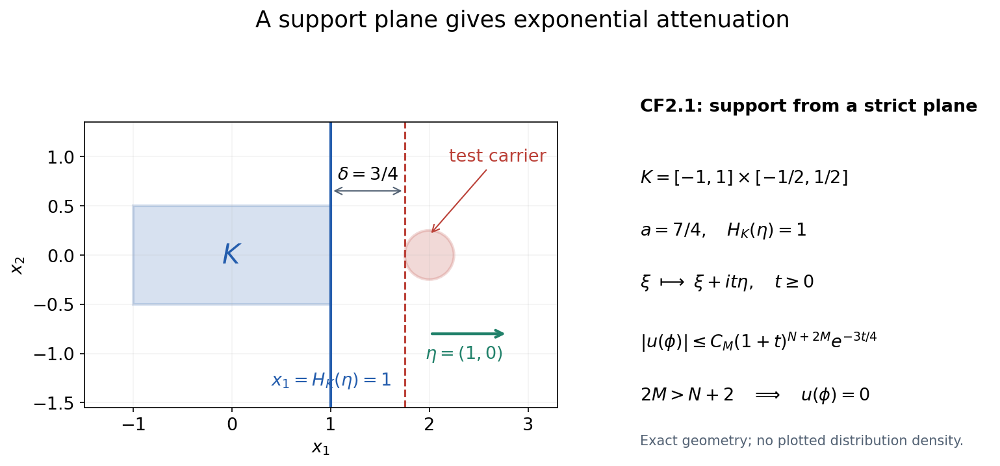
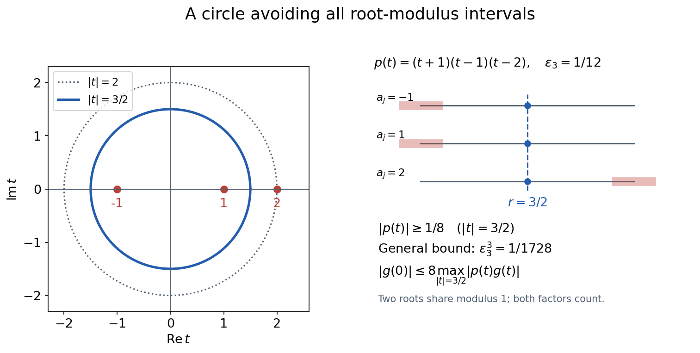
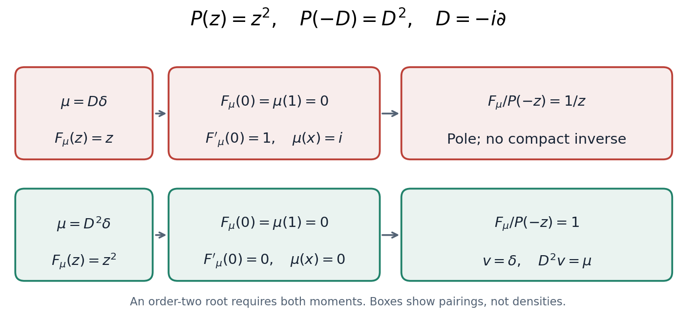

# Compact Fourier division and multiplicity-sensitive annihilators

*Written by GPT-6.1 Sol (OpenAI), Ultra reasoning effort, October 2026. Original explanatory text and figures: CC0. Compare Hörmander I, Theorems 7.3.1–7.3.2 and Lemma 7.3.7, with exact locators below.*

This module proves the compact inverse needed by the approximation lessons. It includes the growth-to-support argument, so an entire quotient is not mistaken for a compact distribution before its growth is checked. A real line through frequency space gives both a uniform division bound and all multiplicity conditions. The ordinary support hull is preserved; no assertion about the singular-support hull is made here.

## 1. Conventions and exact entry facts

Let \(n\geq1\), \(D_j=-i\partial_j\), and use complex-linear distribution pairings. For a compact distribution \(u\), define
\[
 F_u(z)=u(e^{-ix\cdot z}),\qquad z\in\mathbb C^n.
 \tag{CF1}
\]
A compact distribution acts on an arbitrary smooth function by inserting a cutoff equal to one near its support. Different such cutoffs give the same value. Consequently
\[
 F_{Q(D)u}(z)=Q(z)F_u(z),\qquad
 (P(-D)v)(h)=v(P(D)h).
 \tag{CF2}
\]
The minus sign in the second identity is the formal transpose; there is no complex conjugation.

The specific Fourier input is Fourier transforms, finite spectra and convex separation, Theorem 1.1: Fourier inversion on the monomial Schwartz space with negative-exponential forward transform and positive-exponential inverse coefficient \((2\pi)^{-n}\). That entire proof, including its Gaussian regularization and two-sided inverse, was inspected. We use its continuity and integration-by-parts identities. Cauchy bounds, root counts and analytic extensions, Lemmas 1.1–1.2 and its indicated disk Cauchy provider, supplies the Cauchy formula, compact parameter integration and local power series. Elementary finite polynomial factorization, smooth cutoffs, finite-order continuity of distributions, absolutely integrable Fubini, finite-dimensional compactness and the coordinate integration-by-parts rule are the other entries. We prove each new support, division and annihilator step below.

For a nonempty compact convex \(K\subset\mathbb R^n\), put
\[
 H_K(y)=\sup_{x\in K}x\cdot y,\qquad
 K_r=\{x:\operatorname{dist}(x,K)\leq r\}.
 \tag{CF3}
\]
Then \(H_K(y+y')\leq H_K(y)+H_K(y')\) and \(H_{K_r}(y)=H_K(y)+r|y|\). The latter follows by adding the closed radius-\(r\) ball to \(K\) and maximizing the two linear terms separately. These definitions allow \(K\) to be a point or to have empty interior. Empty distribution support is treated as the zero-distribution case, without defining an indicator for the empty set.

## 2. The compact-support growth criterion

**Theorem CF2.1.** An entire function \(F\) is the Fourier–Laplace transform of a distribution supported in \(K\) if and only if, for some nonnegative integer \(N\) and constant \(C\),
\[
 |F(z)|\leq C(1+|z|)^N e^{H_K(\operatorname{Im}z)}
 \qquad(z\in\mathbb C^n).
 \tag{CF4}
\]
The distribution is unique. In the forward direction \(N\) may be chosen to be a finite distribution order on a fixed compact neighborhood of \(K\).

**Proof, from support to growth.** Continuity of \(u\) on tests supported in a fixed compact neighborhood of \(K\) gives
\[
 |u(\psi)|\leq C_0\max_{|\alpha|\leq N}\sup_x|\partial^\alpha\psi(x)|
 \tag{CF5}
\]
there: a continuous linear functional is bounded by finitely many defining derivative seminorms, and their maximum order is \(N\). Choose a nonnegative smooth mollifier \(\rho\), supported in the unit ball and with integral one. For \(0<r\leq1\), convolve the indicator of \(K_{r/2}\) with \(\rho_{r/4}\). The resulting \(\chi_r\) equals one on a neighborhood of \(K\), has support in \(K_{3r/4}\), satisfies \(0\leq\chi_r\leq1\), and obeys
\[
 \sup|\partial^\beta\chi_r|\leq C_\beta r^{-|\beta|}.
 \tag{CF6}
\]
Indeed each derivative falls on the mollifier, whose derivative has the indicated \(L^1\) bound. If \(\operatorname{dist}(x,K)<r/4\), the convolution only samples points in \(K_{r/2}\), giving value one. A fixed cutoff already shows that (CF1) is entire: the exponential and each of its parameter derivatives converge in every smooth seminorm on that compact support on bounded parameter sets, and (CF5) permits differentiation of the pairing.

Set \(r=(1+|z|)^{-1}\) and \(y=\operatorname{Im}z\). The finite Leibniz rule applied to \(\chi_r e^{-ix\cdot z}\) gives, for \(|\alpha|\leq N\),
\[
 |\partial^\alpha(\chi_r e^{-ix\cdot z})|
 \leq C_\alpha
 \sum_{\beta\leq\alpha}r^{-|\beta|}|z|^{|\alpha|-|\beta|}
 e^{H_K(y)+r|y|}
 \leq C'_\alpha(1+|z|)^N e^{H_K(y)}.
 \tag{CF7}
\]
Here \(r|y|\leq1\), and the harmless factor \(e\) is absorbed into the constant. The derivative order remains \(N\); the cutoff and exponential derivative orders add to \(|\alpha|\), rather than each contributing a separate \(N\). Equations (CF5)–(CF7) prove (CF4).

**Proof, from growth to support.** The restriction \(F|_{\mathbb R^n}\) has polynomial growth. Define its inverse Fourier distribution by
\[
 u(\phi)=(2\pi)^{-n}\int_{\mathbb R^n}
 F(\xi)\widehat\phi(-\xi)\,d\xi,
 \qquad\phi\in\mathcal S(\mathbb R^n).
 \tag{CF8}
\]
This integral is absolutely convergent. A weighted supremum seminorm of \(\widehat\phi\), with exponent larger than \(N+n\), bounds it. Fourier continuity from the specified Theorem 1.1 therefore makes \(u\) tempered and, upon restriction to compact tests, a distribution.

Fix a real unit vector \(\eta\). Let \(\phi\) have compact support in a strict supporting halfspace
\[
 x\cdot\eta\geq a>H_K(\eta)
 \quad(x\in\operatorname{supp}\phi),\qquad
 \delta=a-H_K(\eta)>0.
 \tag{CF9}
\]
For every integer \(M\geq0\), integration by parts in \(x\) yields
\[
 |\widehat\phi(-\xi-it\eta)|
 \leq C_M(1+t)^{2M}(1+|\xi|^2)^{-M}e^{-ta},
 \qquad t\geq0.
 \tag{CF10}
\]
To see every factor, write the transform as the integral of \(\phi(x)e^{-t x\cdot\eta}e^{ix\cdot\xi}\). Apply \((1-\Delta_x)^M\) to the first two factors and integrate the last factor by parts. Each derivative of the exponential contributes at most \(t\); the total derivative order is at most \(2M\). Compact support and (CF9) give the displayed exponential bound.

Choose \(2M>N+n\). The integral in (CF8) is unchanged when its plane is translated to \(\mathbb R^n+it\eta\):
\[
 u(\phi)=(2\pi)^{-n}\int_{\mathbb R^n}
 F(\xi+it\eta)\widehat\phi(-\xi-it\eta)\,d\xi.
 \tag{CF11}
\]
Here is a direct justification of that translation. Use real orthogonal coordinates with \(\eta\) the first unit vector; the coordinate Jacobian has absolute value one. For fixed remaining real coordinates, apply the one-variable complex Green identity to the entire product \(F(z)\widehat\phi(-z)\) on the rectangle with first coordinate real part \(-R\) to \(R\) and imaginary part \(0\) to \(t\). Its closed contour integral is zero. For fixed \(t\), (CF4) and the integration-by-parts estimate uniform on \(0\leq s\leq t\) bound the product by
\[
 C_t(1+|\xi|)^{N-2M}.
 \tag{CF12}
\]
Integrating a vertical side over the other \(n-1\) real coordinates gives a bound of order \((1+R)^{N-2M+n-1}\), times a constant depending on the fixed height \(t\). This tends to zero. Both horizontal integrals are absolutely integrable and their truncated tails tend to zero. Fubini and this bound pass the rectangle identity to (CF11). No contour through polynomial zeros, variable contour or unstated large-sphere boundary is involved.

On the displaced plane, (CF4), (CF10), positive homogeneity of \(H_K\), and \(1+|\xi+it\eta|\leq(1+t)(1+|\xi|)\) give
\[
 |u(\phi)|\leq C'_M(1+t)^{N+2M}e^{-t\delta}
 \int_{\mathbb R^n}(1+|\xi|)^{N-2M}\,d\xi.
 \tag{CF13}
\]
The integral is finite, and the right side tends to zero as \(t\to\infty\). Thus \(u(\phi)=0\).

Every point \(q\notin K\) has a neighborhood in a halfspace of the form (CF9). For completeness, let \(x_0\in K\) minimize \(|q-x|\). For \(x\in K\), differentiating the squared distance along \(x_0+s(x-x_0)\), \(0\leq s\leq1\), at its minimum gives \((q-x_0)\cdot(x-x_0)\leq0\). Therefore \(\eta=(q-x_0)/|q-x_0|\) satisfies \(H_K(\eta)=x_0\cdot\eta<q\cdot\eta\). Shrink a neighborhood of \(q\) to retain a positive gap. A test supported outside \(K\) has a finite cover by these neighborhoods and a smooth finite partition into tests supported in their strict halfspaces. Each part pairs to zero, so \(\operatorname{supp}u\subset K\).

The Fourier transform of the distribution (CF8) is the regular distribution given by \(F\) on real frequencies, by the two-sided Schwartz inverse. Since \(u\) now has compact support, its entire transform (CF1) has that same restriction. Two continuous functions representing the same distribution agree pointwise. Entire functions agreeing on \(\mathbb R^n\) agree everywhere: fix all but one coordinate real, use the one-variable identity principle, and repeat coordinate by coordinate. Thus (CF1) is the original \(F\). The same inverse formula proves uniqueness. This completes Theorem CF2.1. \(\square\)

**Figure CF-A.** The exact two-dimensional instance is \(K=[-1,1]\times[-1/2,1/2]\), \(\eta=(1,0)\), and a test supported in the closed radius-\(1/4\) disk centered at \((2,0)\). Then \(H_K(\eta)=1\), \(a=7/4\), and \(\delta=3/4\). Translating frequency by \(it\eta\) yields the proved polynomial factor times \(e^{-3t/4}\) in (CF13). The disk illustrates the test carrier; no particular nonzero test filling its boundary is assumed. Reproducible coordinates and the plot source accompany this module.

## 3. A bounded complex displacement for polynomial division

**Lemma CF3.1 (a uniformly safe radius).** Let \(p(t)=c\prod_{j=1}^m(t-a_j)\), with \(m\geq1\) and \(c\ne0\). Repeated roots are listed with multiplicity. Put \(\varepsilon_m=1/(4m)\). There is an \(r\in[1,2]\) such that
\[
 |p(t)|\geq |c|\varepsilon_m^m
 \quad\text{for every }|t|=r.
 \tag{CF14}
\]
If \(g\) is entire, then
\[
 |g(0)|\leq |c|^{-1}\varepsilon_m^{-m}
 \sup_{|t|\leq2}|p(t)g(t)|.
 \tag{CF15}
\]

**Proof.** Exclude the open real intervals \((|a_j|-\varepsilon_m,|a_j|+\varepsilon_m)\). Their total length, counted even with overlaps or repeated roots, is at most \(2m\varepsilon_m=1/2\). They cannot cover the length-one interval \([1,2]\). Choose a remaining \(r\). Then \(\bigl|r-|a_j|\bigr|\geq\varepsilon_m\), so the reverse triangle inequality gives \(|t-a_j|\geq\varepsilon_m\) on the whole circle. Multiplication proves (CF14). The circle Cauchy formula bounds \(|g(0)|\) by its supremum on that circle; replace \(g\) by \(pg/p\) there and use (CF14). This proves (CF15). The choice of \(r\) need not depend continuously on the roots, because only the uniform bound is used. \(\square\)

**Theorem CF3.2 (division keeps the same convex support bound).** Let \(Q\) be a nonzero polynomial and suppose \(F\) satisfies (CF4). If \(G=F/Q\) extends to an entire function, then
\[
 |G(z)|\leq C_Q(1+|z|)^N e^{H_K(\operatorname{Im}z)}
 \tag{CF16}
\]
with the same \(K\) and \(N\). The constant may depend on \(Q,K,N,C\).

**Proof.** A constant \(Q\ne0\) is immediate. Otherwise let its total degree be \(m\) and its highest homogeneous part be \(Q_m\). Choose a real unit vector \(\theta\) with \(c=Q_m(\theta)\ne0\). Such a real vector exists: a polynomial zero on all real coordinates has all its coefficients zero, by successive one-variable polynomial identities. For every complex \(z\), the one-variable polynomial
\[
 p_z(t)=Q(z+t\theta)
 \tag{CF17}
\]
has degree \(m\) and leading coefficient \(c\), independent of \(z\). Apply Lemma CF3.1 to \(g_z(t)=G(z+t\theta)\). Put \(R_{K,\theta}=\sup_{x\in K}|x\cdot\theta|\). If \(|t|\leq2\), then
\[
 1+|z+t\theta|\leq3(1+|z|),\qquad
 H_K(\operatorname{Im}z+(\operatorname{Im}t)\theta)
 \leq H_K(\operatorname{Im}z)+2R_{K,\theta}.
 \tag{CF18}
\]
Since \(p_z g_z=F(z+t\theta)\), (CF4), (CF15) and (CF18) prove (CF16), for example with
\[
 C_Q=C\,|c|^{-1}(4m)^m3^N e^{2R_{K,\theta}}.
 \tag{CF19}
\]
This is a proved bound, not a numerical estimate for finitely many centers. In particular no separation of the multivariable zero set from real frequencies is needed. \(\square\)

**Figure CF-B.** For \(p(t)=(t+1)(t-1)(t-2)\), the roots are \(-1,1,2\), the degree is three, and \(\varepsilon_3=1/12\). The radius \(r=3/2\) is outside every excluded root-modulus interval. All three distances on the circle are at least \(1/2\), giving \(|p|\geq1/8\); the general lemma gives the weaker but uniform bound \(1/1728\). The radius diagram keeps the two distinct roots of modulus one visible as a repeated interval, rather than silently dropping their multiplicity. The circle lies in the radius-two disk used in (CF15).

## 4. Compact inverses and equality of ordinary support hulls

**Theorem CF4.1.** For \(f\in\mathcal E'(\mathbb R^n)\) and nonzero polynomial \(Q\), the following are equivalent:

1. \(F_f/Q\) extends to an entire function.
2. There is a compact distribution \(v\) with \(Q(D)v=f\).

The solution is unique. If \(f\ne0\), it satisfies
\[
 \operatorname{ch}\operatorname{supp}v
 =\operatorname{ch}\operatorname{supp}f.
 \tag{CF20}
\]
If \(f=0\), then \(v=0\) and both supports are empty.

**Proof.** Condition 2 gives \(F_f=QF_v\), so its quotient has the entire extension \(F_v\). Conversely assume 1, first with \(f\ne0\). The set \(K=\operatorname{ch}\operatorname{supp}f\) is compact. To check this, a convex combination with more than \(n+1\) positive coefficients \(\lambda_j\) has an affine dependence \(\sum_j c_jx_j=0\), \(\sum_j c_j=0\), with some \(c_j>0\). Subtract \(t c_j\) from every coefficient, where \(t=\min_{c_j>0}\lambda_j/c_j\). All coefficients remain nonnegative, their sum and represented point are unchanged, and one positive coefficient becomes zero. Repeat until at most \(n+1\) remain. The convex hull is therefore the image of the compact product of \((n+1)\) copies of the nonempty support and the closed finite simplex, padding shorter combinations with zero coefficients. The forward part of Theorem CF2.1 bounds \(F_f\) by (CF4) for this \(K\). Theorem CF3.2 gives the identical support type for the entire quotient. The converse part of CF2.1 supplies \(v\) supported in \(K\), and (CF2) with Fourier injectivity gives \(Q(D)v=f\).

If two compact solutions exist, their difference \(w\) has \(QF_w=0\). On the open set \(Q\ne0\), \(F_w=0\); its entire extension is zero by the identity principle, so \(w=0\). When \(f=0\), this argument says the only solution is zero; it also shows that the unique entire extension of its quotient is zero.

Differential operators are local: a test supported away from \(\operatorname{supp}v\) and each of its derivatives pair to zero with \(v\). Thus \(\operatorname{supp}f\subset\operatorname{supp}v\). Combined with \(\operatorname{supp}v\subset\operatorname{ch}\operatorname{supp}f\), this proves (CF20). In particular every compact \(v\) obeys the ordinary hull identity for \(Q(D)v\), including its homogeneous and scalar cases. \(\square\)

This supplies an additive internal proof of the ordinary differential support-hull statement already available in Convex supports and convolution cancellation, Corollary 4.3. That existing argument remains useful; the present proof does not replace it or infer the corresponding singular-support identity.

## 5. Multiplicities detected by exponential-polynomial solutions

For nonzero \(P\), an exponential-polynomial solution means
\[
 h(x)=e^{ix\cdot z}A(x),\qquad A\in\mathbb C[x_1,\ldots,x_n],
 \qquad P(D)h=0.
 \tag{CF21}
\]
Equivalently \(P(D+z)A=0\), by the finite product rule. No restriction to constant \(A\), real \(z\), simple roots, or a square-free \(P\) is made.

**Theorem CF5.1.** For compact \(\mu\), the following are equivalent:

1. \(\mu(h)=0\) for every solution in (CF21).
2. \(F_\mu(z)/P(-z)\) has an entire extension.
3. There is a unique compact \(v\) with \(P(-D)v=\mu\).

For nonzero \(\mu\), the ordinary support hulls of \(v\) and \(\mu\) agree. For zero \(\mu\), both distributions vanish.

**Proof that 1 implies 2.** Write \(Q(z)=P(-z)\). If \(P\) is a nonzero constant, its homogeneous solution space is zero and \(F_\mu/Q\) is automatically entire. Otherwise choose the same kind of real noncharacteristic unit direction \(\theta\) as in (CF17). Fix an arbitrary complex center \(z\); the polynomial \(q_z(t)=P(-z-t\theta)\) has fixed positive degree and nonzero constant leading coefficient. Let \(t_0\) be a root of order \(k\).

Start with the exact identity
\[
 P(D)e^{-ix\cdot(z+t\theta)}
 =q_z(t)e^{-ix\cdot(z+t\theta)}.
 \tag{CF22}
\]
Differentiate it \(j\) times with respect to \(t\), for \(0\leq j<k\), and evaluate at \(t_0\). Every derivative of \(q_z\) appearing on the right has order at most \(j<k\) and is zero there. Hence
\[
 h_j(x)=(-i x\cdot\theta)^j e^{-ix\cdot(z+t_0\theta)}
 \quad\text{satisfies}\quad P(D)h_j=0,
 \qquad 0\leq j<k.
 \tag{CF23}
\]
Each is a member of (CF21), at frequency \(-z-t_0\theta\). Annihilation and differentiation of the compact pairing give
\[
 \frac{d^j}{dt^j}F_\mu(z+t\theta)\bigg|_{t=t_0}
 =\mu(h_j)=0,\qquad j<k.
 \tag{CF24}
\]
The one-variable power series consequently divides by the full root power \((t-t_0)^k\). All roots are finite in number; thus \(F_\mu(z+t\theta)/q_z(t)\) is entire as a function of \(t\), for every center \(z\). This includes accidental higher multiplicities on special parameter lines; no generic-root argument omits them.

We still have to prove joint, rather than just linewise, analyticity. Fix \(z_0\), and choose a positive circle \(|t|=r\) with \(Q(z_0+t\theta)\ne0\) on its boundary. Such a radius exists because that line polynomial has finitely many zeros. Its positive boundary minimum persists for \(z\) near \(z_0\). In that neighborhood define
\[
 J(z)=\frac{1}{2\pi i}\int_{|t|=r}
 \frac{F_\mu(z+t\theta)}{Q(z+t\theta)}\,\frac{dt}{t}.
 \tag{CF25}
\]
Compact contour differentiation makes \(J\) holomorphic in all coordinates of \(z\). The entire line quotient just proved and the circle Cauchy formula show \(J(z)=F_\mu(z)/Q(z)\) wherever \(Q(z)\ne0\). That set is dense, since a nonzero polynomial cannot vanish on a complex open set. Continuity gives \(QJ=F_\mu\) throughout the neighborhood. These local extensions agree on overlaps, first on the dense zero-free set and then everywhere by continuity. They assemble to the required entire extension. This proves 1 implies 2.

Theorem CF4.1, applied to \(Q(z)=P(-z)\), proves the equivalence of 2 and 3, including uniqueness and the hull equality. Finally 3 implies 1 by the exact transpose pairing:
\[
 \mu(h)=(P(-D)v)(h)=v(P(D)h)=0.
 \tag{CF26}
\]
Both pairings make sense because the distributions are compact and \(h\) is globally smooth. Inserting a cutoff equal to one near the compact support proves the identity without boundary terms. \(\square\)

**Figure CF-C.** For \(P(z)=z^2\) in one variable and \(\mu=D\delta\), the transform is \(F_\mu(z)=z\). The constant solution gives \(\mu(1)=F_\mu(0)=0\), but the linear solution gives \(\mu(x)=i\ne0\), equivalently \(F'_\mu(0)=1\). The quotient \(z/z^2=1/z\) has a pole and no compact inverse exists. In contrast \(\mu=D^2\delta\) has transform \(z^2\), both moments vanish, and its transpose inverse is \(v=\delta\). The diagram displays the exact moments and the \(D=-i\partial\) factors, not a numerical root multiplicity test.

## 6. Exact receiving statements and remaining boundaries

Theorem CF5.1 supplies entry (3) of Approximation and global solvability from support geometry: a compact functional annihilating every exponential-polynomial solution has a unique compact transpose inverse. Theorem CF4.1 also supplies its ordinary support-hull entry (2). If the original compact carrier lies in an open convex \(X\), its compact convex hull lies in \(X\), so this inverse is actually in \(\mathcal E'(X)\). The subsequent cutoff/mollification argument of that lesson, Lemma 2.1, remains the needed receiver for nonsmooth solutions; we do not pair a compact distribution with an arbitrary nonsmooth solution directly.

For Choosing polynomial and exponential approximants, Section 2, this module proves the entire exponential-polynomial annihilator equivalence and compact Fourier division, with exactly the divisor \(P(-z)\) and ordinary hull equality. Its **local polynomial-annihilator equivalence near zero** is a separate statement and is not proved here. In particular formal divisibility alone has not been promoted to convergence of a local analytic quotient.

For Singular supports and distribution data, this does not supply its compact **singular-support** hull equality. Ordinary support and singular support need different estimates.

Dimension zero is harmless and separate: the coordinate space is one point with mass one, its distributions are complex scalars, and a nonzero polynomial in no variables is a nonzero scalar. Fourier inversion is the identity, division is scalar division, and the homogeneous solution space is zero. A nonzero scalar distribution has the single point as both support hulls. None of the positive-dimensional line, halfspace or annulus constructions is asserted in that case.

## 7. Worked examples

**Example CF7.1 (a translated point carrier).** In one dimension, let \(a\in\mathbb R\), \(b\in\mathbb C\), \(v=\delta_a\), and \(Q(z)=z-b\). Then
\[
 F_v(z)=e^{-iaz},\qquad
 f=(D-b)\delta_a,\qquad F_f(z)=(z-b)e^{-iaz}.
 \tag{CF27}
\]
Its entire quotient is \(e^{-iaz}\). Here \(K=\{a\}\), so \(H_K(y)=ay\), even when this is negative. The upper bound \(|e^{-ia(\xi+iy)}|=e^{ay}\) is exact; replacing \(H_K\) by an absolute value would lose the location of the carrier. Theorem CF4.1 recovers \(v=\delta_a\) and the identical singleton hull. The distribution \(f\) is nonzero and supported at that point.

**Example CF7.2 (a double root).** Set \(P(z)=z^2\), \(\mu=D\delta\). Its annihilation of the only plane-wave frequency \(z=0\) tests just the constant solution. But \(x\) is also a homogeneous solution, and
\[
 (D\delta)(1)=0,\qquad (D\delta)(x)=i,
 \qquad F_{D\delta}(z)=z.
 \tag{CF28}
\]
The pole of \(1/z\) rules out a compact transpose inverse. With \(\mu=D^2\delta\), by contrast, the transform is \(z^2\), the quotient is one and \(v=\delta\). This is the exact obstruction drawn in Figure CF-C.

**Example CF7.3 (a root circle with a uniform bound).** For the polynomial in Figure CF-B, the three reverse-triangle lower bounds on \(|t|=3/2\) are respectively \(1/2,1/2,1/2\). Therefore every entire \(g\) satisfies
\[
 |g(0)|\leq8\max_{|t|=3/2}|(t+1)(t-1)(t-2)g(t)|.
 \tag{CF29}
\]
The universal degree-three estimate obtained without knowledge of those roots has the larger constant \(12^3=1728\). Both are valid; the stronger value eight belongs to this particular example, not to every degree-three polynomial.

## 8. Exercises with complete solutions

**Exercise 1 (basic: the transpose sign).** Let \(P(z)=z-b\) on \(\mathbb R\), where \(b\in\mathbb C\). Put \(\mu=P(-D)\delta\). Compute its transform and its pairing with \(h(x)=e^{ibx}\). Identify its compact transpose inverse.

**Solution 1.** The transpose is \(-D-b\), so \(\mu=-D\delta-b\delta\) and \(F_\mu(z)=-z-b=P(-z)\). Because \((D\delta)(h)=i h'(0)\) and \(h'(0)=ib\),
\[
 \mu(h)=-i(ib)-b=b-b=0.
 \tag{CF30}
\]
The entire quotient by \(P(-z)\) is one. Thus the inverse is \(v=\delta\), uniquely by CF4.1. Using \(P(z)\) as the divisor would put its zero at the wrong frequency unless a special value of \(b\) hid the sign.

**Exercise 2 (basic: a nonzero constant symbol).** Explain CF5.1 when \(P=c\ne0\). Include \(\mu=0\) and positive-dimensional support hulls.

**Solution 2.** The equation \(ch=0\) has only the zero solution, so every compact \(\mu\) satisfies its annihilation condition. Its transform divided by \(c\) is entire. The unique inverse is \(v=\mu/c\), and multiplication by a nonzero scalar preserves support. For zero \(\mu\), the inverse is zero and both supports are empty. For nonzero \(\mu\), their compact convex hulls agree. There is no characteristic root or annulus construction in this case.

**Exercise 3 (intermediate: explicit exclusion intervals).** Let \(p(t)=2(t-i)^2(t-4)\). Use Lemma CF3.1 to give a universal lower bound on some circle of radius in \([1,2]\). Then check the radius \(3/2\) directly and give a better bound there.

**Solution 3.** The degree is three and \(\varepsilon_3=1/12\). Counting the repeated root twice, the excluded intervals have total length at most \(1/2\); a safe radius exists with \(|p|\geq2/1728=1/864\). At radius \(3/2\), each of the two distances to \(i\) is at least \(1/2\), while the distance to \(4\) is at least \(5/2\). Consequently
\[
 |p(t)|\geq2(1/2)^2(5/2)=5/4
 \quad(|t|=3/2).
 \tag{CF31}
\]
The repeated factor contributes twice; treating it as only one factor would produce an unjustified bound. The exact angular minimum may be larger, but this proved bound suffices.

**Exercise 4 (intermediate: a strict support plane).** Let \(K=[-2,2]\times[-1,1]\). A test is supported in the closed disk of radius \(1/3\) centered at \((3,0)\). Use \(\eta=(1,0)\) to identify the decay exponent in the displaced-plane proof and deduce that the inverse distribution pairs to zero with this test.

**Solution 4.** Here \(H_K(\eta)=2\), and every point in the disk has first coordinate at least \(a=3-1/3=8/3\). The gap is \(\delta=8/3-2=2/3\). The product on the translated frequency plane therefore has integral bounded by a fixed constant times \((1+t)^{N+2M}e^{-2t/3}\), with \(2M>N+2\). This tends to zero. Since the integral is the same for every finite displacement, the original pairing is zero. The conclusion follows for any smooth test with carrier in that disk, without needing a formula for the test.

**Exercise 5 (advanced: a special line with higher multiplicity).** Let \(P(z_1,z_2)=z_1^2-z_2\) and \(\theta=(1,0)\). At the center \(z=(0,0)\), write down the line roots and the two homogeneous exponential-polynomial solutions used by (CF23). Explain why a proof restricted to simple line roots would miss one of these conditions.

**Solution 5.** The line polynomial is \(q_0(t)=P(-t,0)=t^2\). Its root \(t_0=0\) has order two. The two functions are \(h_0=1\) and \(h_1=-i x_1\). Directly, \((D_1^2-D_2)1=0\) and \((D_1^2-D_2)(-i x_1)=0\). Thus annihilation requires \(F_\mu(0,0)=0\) and \(\partial_{z_1}F_\mu(0,0)=0\). For nearby centers with nonzero second coordinate the two line roots are simple, but that does not justify dropping the second condition at the exceptional double-root center. The all-center argument (CF22)–(CF25) retains it and provides joint holomorphy there.

**Exercise 6 (advanced: what the hull identity does not say).** A nonzero smooth compact function \(v\) can have a large ordinary support and empty singular support. Apply CF4.1 to \(Q(D)v\), and explain why this does not prove the general compact singular-support hull identity. Also identify the remaining local input in the polynomial approximation criterion.

**Solution 6.** The ordinary identity gives \(\operatorname{ch}\operatorname{supp}Q(D)v=\operatorname{ch}\operatorname{supp}v\). Since both \(v\) and its differential image are smooth, both singular supports are empty in this example. This tests only a trivial singular-support case. The growth bound (CF4) controls ordinary support; it provides no rapid-decay characterization of singular carriers for a general compact distribution. A separate singular-support estimate is needed for that theorem. The polynomial approximation criterion also needs the equivalence between annihilating polynomial solutions and analytic divisibility of the transform near zero. Entire divisibility obtained from all exponential-polynomial solutions is a different assumption and does not establish that local equivalence.

## 9. Source correspondence and reproducibility

The mathematical source is Lars Hörmander, *The Analysis of Linear Partial Differential Operators I: Distribution Theory and Fourier Analysis*, second edition, Springer, 2003 reprint of the 1990 edition. Theorem 7.3.1, printed pp.181–182, gives the compact support growth criterion; Theorem 7.3.2 and Lemma 7.3.3, printed pp.182–183, give the polynomial division criterion; Definition 7.3.5 and Lemma 7.3.7, printed pp.185–186, give the multiplicity-sensitive annihilator class and argument. [Publisher record](https://link.springer.com/book/10.1007/978-3-642-61497-2).

This is independently written mathematical exposition. The bounded-radius division proof (CF14)–(CF19) uses explicit excluded intervals; the support proof (CF9)–(CF13) writes the displaced-plane boundary estimates, and (CF22)–(CF25) checks every line, including its multiple roots. No book image, distinctive prose, exercise sequence or book structure is included. The local native page crosswalk and authorized-copy checks remain private evidence. The original figure source and coordinate ledger are included separately so every illustrated radius, support plane, moment, sign and bound can be reproduced.
