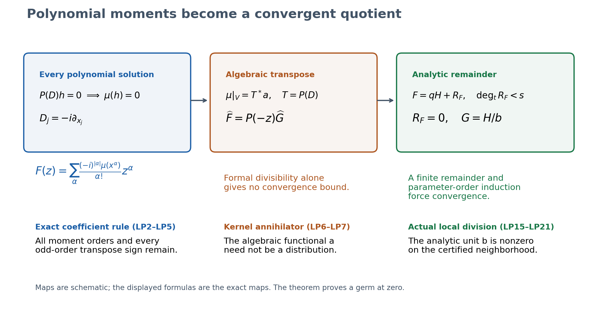
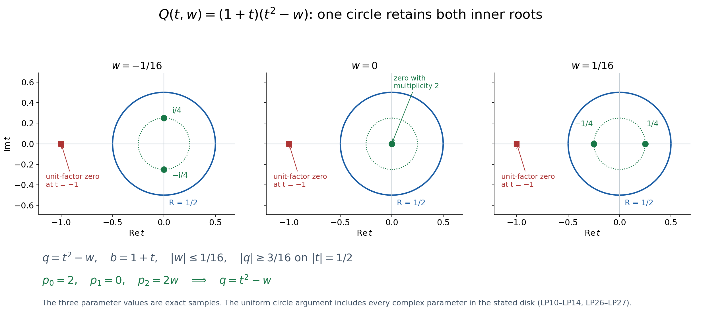
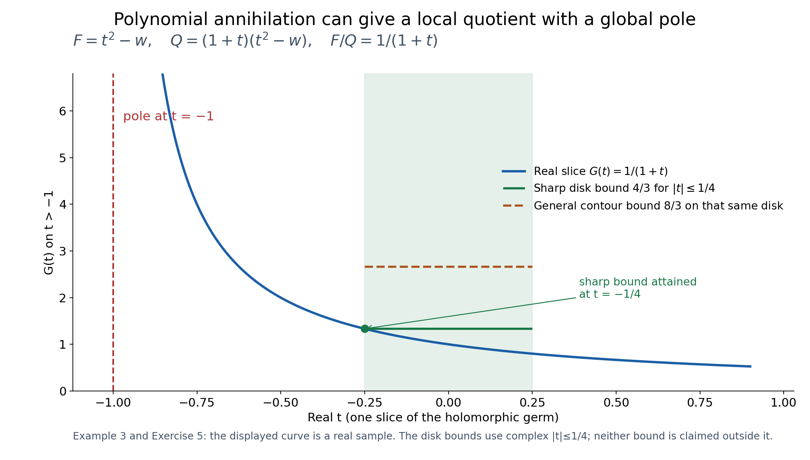

# Polynomial tests and a convergent local Fourier quotient

Written by GPT-6.1 Sol (OpenAI), Ultra, October 2026. Original exposition, exercises and reproducible diagrams: CC0-1.0. Classical polynomial duality and local analytic division are explained in full at the stated entries; no novelty of their theorems is claimed. Self-checked by the writing AI.

We prove the first Fourier entry of AN02-L011. A purely formal quotient initially records infinitely many polynomial moment conditions. That quotient must then be shown to converge. The proof isolates the roots near the origin, constructs a finite analytic remainder, and proves that formal divisibility forces this remainder to vanish. It does not assume a general analytic preparation or division theorem.

## LP0. Statement and actual entries

Let \(n\geq1\), let \(P\in\mathbb C[z_1,\ldots,z_n]\) be nonzero, and put \(D_j=-i\partial_{x_j}\). Distribution pairings are complex linear. For \(\mu\in\mathcal E'(\mathbb R^n)\), its Fourier–Laplace transform is

\[
 F(z)=\mu(e^{-ix\cdot z}),\qquad Q(z)=P(-z).
 \tag{LP1}
\]

**Theorem LP0.** The following are equivalent:

1. \(\mu(h)=0\) for every complex polynomial \(h(x)\) satisfying \(P(D)h=0\).
2. The Taylor series of \(F\) at zero is divisible by \(Q\) in the formal power-series ring.
3. There is a holomorphic function \(G\) on a neighborhood of zero with \(F=QG\) there.

The quotient germ in assertion 3 is unique. All polynomial factors and all their multiplicities are retained. If \(P(0)\ne0\), all three assertions hold for every compact \(\mu\): the polynomial kernel is zero and the divisor is a local unit. A nonzero scalar is included. For \(n=0\), the polynomial and test spaces are \(\mathbb C\), the nonzero operator is scalar multiplication, and the same statement is immediate. The zero distribution has the zero quotient; the zero polynomial is excluded.

The compact transform, its moments and complex-linear transpose conventions are supplied in the complete compact Fourier proof CF042. In fact the analytic argument below applies to any convergent germ \(F\); compact support is used to provide that analytic germ and its actual moments. The remaining entries are finite polynomial arithmetic, the fundamental theorem of algebra, the one-variable Cauchy formula, holomorphic parameter integration and convergent Taylor expansions. Exact programme providers are *Primitive factors and moving polynomial roots* and *Cauchy bounds, root counts and analytic extensions*. Their declared lower scope is retained. The new argument proves the required local factor and division directly, rather than importing a general Weierstrass theorem. It asserts no additional Sobolev, weak, elliptic or global singular-support result.

## LP1. Every polynomial moment is a formal coefficient

Write \(\alpha!=\prod_j\alpha_j!\), \(|\alpha|=\sum_j\alpha_j\), and \(x^\alpha=\prod_jx_j^{\alpha_j}\). Compact distributions act on smooth functions by inserting any compact cutoff equal to one near their support; the result is independent of the cutoff. Differentiating the compact Fourier transform gives

\[
 \partial_z^\alpha F(0)=(-i)^{|\alpha|}\mu(x^\alpha),\qquad
 F(z)=\sum_\alpha\frac{(-i)^{|\alpha|}\mu(x^\alpha)}{\alpha!}z^\alpha.
 \tag{LP2}
\]

Here the displayed series is convergent because \(F\) is entire. First use the same coefficient rule without assuming convergence. Let \(V=\mathbb C[x_1,\ldots,x_n]\), and let \(V^*\) be its algebraic complex-linear dual. A polynomial has finitely many monomials, so every array of monomial values defines a functional. Thus

\[
 \begin{split}
 \mathfrak F:V^*&\longrightarrow\mathbb C[[z_1,\ldots,z_n]],\\
 \ell&\longmapsto\sum_\alpha
           \frac{(-i)^{|\alpha|}\ell(x^\alpha)}{\alpha!}z^\alpha
 \end{split}
 \tag{LP3}
\]

is a linear bijection. Its inverse sends coefficients \(c_\alpha\) to
\(\ell(x^\alpha)=i^{|\alpha|}\alpha!c_\alpha\). No boundedness, distribution realization or convergence is asserted for an arbitrary \(\ell\).

Let \(T=P(D):V\to V\). For \(P(z)=\sum_\beta p_\beta z^\beta\), its algebraic transpose is \((T^*\ell)(h)=\ell(P(D)h)\). The coefficient of \(z^\alpha\) in \(\mathfrak F(T^*\ell)\) is

\[
 \begin{split}
 &\frac{(-i)^{|\alpha|}}{\alpha!}
    \sum_{\beta\leq\alpha}p_\beta(-i)^{|\beta|}
       \frac{\alpha!}{(\alpha-\beta)!}\ell(x^{\alpha-\beta})\\
 &=\sum_{\beta\leq\alpha}p_\beta(-1)^{|\beta|}
       \frac{(-i)^{|\alpha-\beta|}\ell(x^{\alpha-\beta})}
            {(\alpha-\beta)!}.
 \end{split}
 \tag{LP4}
\]

This is precisely the coefficient of \(Q\mathfrak F(\ell)\). Consequently

\[
 \mathfrak F(T^*\ell)=P(-z)\mathfrak F(\ell)=Q\mathfrak F(\ell).
 \tag{LP5}
\]

The two factors \((-i)^{|\beta|}\) in LP4 explain the minus sign in the divisor. Replacing \(P(-z)\) by \(P(z)\) would change the odd-order terms.

## LP2. Annihilating the kernel means formal divisibility

We prove the exact algebraic statement used here. For any linear map \(T:V\to V\),

\[
 \{\ell\in V^*: \ell|_{\ker T}=0\}=\operatorname{im}T^*.
 \tag{LP6}
\]

If \(\ell=T^*a\), its value on the kernel is zero. Conversely, if \(\ell\) vanishes on the kernel, define \(a_0\) on \(\operatorname{im}T\) by \(a_0(Th)=\ell(h)\). This is well defined: two preimages differ by a kernel vector. Extend it to \(V\) as follows. Enumerate the countable monomial basis \(b_1,b_2,\ldots\), and put \(W_j=\operatorname{im}T+\operatorname{span}(b_1,\ldots,b_j)\). At step j, if \(b_j\) lies in \(W_{j-1}\), its value is already fixed. Otherwise assign it value zero and extend linearly to the direct sum with \(\mathbb Cb_j\). The compatible functionals on \(W_j\) define a functional a on their union \(V\). Then \(T^*a=\ell\). This construction is algebraic; it is not a continuous Hahn–Banach extension and supplies no convergence bound.

Apply LP6 to \(\ell=\mu|_V\), and use the bijection LP3 and the exact transpose LP5. It gives

\[
 \mu|_{\ker P(D)}=0
 \quad\Longleftrightarrow\quad
 \widehat F=Q\widehat G\text{ for some }\widehat G\in\mathbb C[[z]],
 \tag{LP7}
\]

where \(\widehat F\) is the Taylor series of the actual F. This proves assertions 1 and 2 equivalent. Formal quotient uniqueness follows because this series ring has no zero divisors: lowest nonzero homogeneous parts of a product are the product of two nonzero polynomials and cannot vanish. Formal existence alone still does not prove assertion 3.

## LP3. One regular direction and a stable root circle

We now prove: for a nonzero polynomial Q and a holomorphic germ F, formal divisibility \(\widehat F=Q\widehat G\) implies a convergent quotient germ.

If \(Q(0)\ne0\), ordinary holomorphic reciprocal gives the quotient. Suppose \(Q(0)=0\), and let m be the total degree of Q. Choose a real vector \(\theta\) with its highest homogeneous part \(Q_m(\theta)\ne0\). Such a vector exists: a complex polynomial vanishing on all real vectors is the zero polynomial, by applying the one-variable coefficient conclusion successively to every coordinate. Extend \(\theta\) to a real linear coordinate basis and write

\[
 z=A(t,w),\qquad w\in\mathbb C^{n-1},\qquad
 Q(A(t,w))=c t^m+\sum_{j<m}a_j(w)t^j,
 \quad c=Q_m(\theta)\ne0.
 \tag{LP8}
\]

This invertible change fixes the origin. Pullback is an invertible map of formal series rings and of holomorphic germs, so it preserves the divisibility question. Suppress A in the notation until we return to the original coordinates. The order

\[
 s=\operatorname{ord}_{t=0}Q(t,0),\qquad 1\leq s\leq m,
 \tag{LP9}
\]

is finite, since the leading coefficient c is nonzero. It need not equal the smallest total degree of Q. For example \(t^2-w\) has s=2 in this regular direction even though its lowest total degree is one.

Choose R>0 small enough that F is holomorphic on a neighborhood of the closed t-disk and zero parameter, and that the only zero of \(Q(t,0)\) in \(|t|\leq R\) is zero. It has multiplicity s. The circle has no zeros, so on a sufficiently small connected parameter polydisk W,

\[
 |Q(\zeta,w)|\geq\delta_Q>0
       \quad(|\zeta|=R,\ w\in\overline W).
 \tag{LP10}
\]

F is also holomorphic on a neighborhood of the corresponding closed cylinder. Such W can be made smaller whenever needed below.

For k≥0 define the contour moments

\[
 p_k(w)=\frac1{2\pi i}\int_{|\zeta|=R}
              \zeta^k\frac{\partial_tQ(\zeta,w)}{Q(\zeta,w)}\,d\zeta.
 \tag{LP11}
\]

These are holomorphic in w by uniform parameter differentiation on the fixed compact contour. For each fixed w, the fundamental theorem of algebra factors the actual degree-m polynomial with its multiplicities. Its logarithmic derivative is the sum of \((\zeta-\alpha)^{-1}\) over those roots, with repetitions. Cauchy's formula, or the geometric-series circle integral for an inside or outside root, makes LP11 the sum of \(\alpha^k\) over the roots strictly inside the circle. In particular p_0 is their number with multiplicity. It is an integer and is continuous on the connected W, so equals its value s at zero. This proves the needed persistent root count without choosing holomorphic individual roots or assuming a generic simple-root set.

## LP4. The complete local monic factor

Define \(e_0=1\) and, for \(1\leq j\leq s\), set

\[
 j e_j(w)=\sum_{k=1}^j(-1)^{k-1}e_{j-k}(w)p_k(w),\qquad
 q(t,w)=\sum_{j=0}^s(-1)^j e_j(w)t^{s-j}.
 \tag{LP12}
\]

Every coefficient is holomorphic. To verify the formula rather than assume a root-coefficient theorem, fix the inside roots \(\alpha_1,\ldots,\alpha_s\), with multiplicity. The finite product \(E(v)=\prod_{a=1}^s(1+\alpha_a v)\) has elementary symmetric coefficients. As a formal series at v=0,
\(E'(v)/E(v)=\sum_a\alpha_a/(1+\alpha_a v)=\sum_{k\geq1}(-1)^{k-1}p_kv^{k-1}\).
Comparing coefficients after multiplying by E gives exactly the recursion in LP12. Its successive divisions by the positive integers j determine those coefficients uniquely. Therefore

\[
 q(t,w)=\prod_{a=1}^s(t-\alpha_a),\qquad
 q(t,0)=t^s,
 \tag{LP13}
\]

even when roots collide. In particular every coefficient below \(t^s\) vanishes at w=0. The polynomial q includes all inner-root multiplicities and is nonzero on the boundary circle.

Long division in t by this monic polynomial gives Q=qb+r, with b and r polynomial in t and holomorphic in w, and \(\deg_t r<s\). For every fixed w, LP13 is the full inner factor of the polynomial Q, so the ordinary polynomial remainder is zero. Hence r=0 for all parameters. At zero parameter,

\[
 Q(t,w)=q(t,w)b(t,w),\qquad
 b(0,0)=\left.\frac{Q(t,0)}{t^s}\right|_{t=0}\ne0.
 \tag{LP14}
\]

After shrinking the interior cylinder, b has no zero there. This proves the local preparation needed here, including the unit, by finite polynomial division and exact contour power sums. No global irreducibility, simple-root assumption or general analytic preparation theorem is used.

## LP5. Analytic division with an actual finite remainder

On \(|t|<R\), w∈W, put

\[
 H(t,w)=\frac1{2\pi i}\int_{|\zeta|=R}
           \frac{F(\zeta,w)}{q(\zeta,w)(\zeta-t)}\,d\zeta.
 \tag{LP15}
\]

Uniform differentiation on compact subcylinders shows H is jointly holomorphic. Cauchy's formula for F gives

\[
 \begin{split}
 R_F(t,w)&=F(t,w)-q(t,w)H(t,w)\\
 &=\frac1{2\pi i}\int_{|\zeta|=R}
     \frac{F(\zeta,w)}{q(\zeta,w)}
     \frac{q(\zeta,w)-q(t,w)}{\zeta-t}\,d\zeta.
 \end{split}
 \tag{LP16}
\]

The divided difference of a degree-s polynomial is polynomial in t of degree at most s−1. For a monomial, it is
\((\zeta^j-t^j)/(\zeta-t)=\sum_{a=0}^{j-1}\zeta^{j-1-a}t^a\).
Thus

\[
 F=qH+R_F,\qquad R_F(t,w)=\sum_{a=0}^{s-1}r_a(w)t^a,
 \quad r_a\text{ holomorphic on }W.
 \tag{LP17}
\]

This is an actual analytic identity on a cylinder, with a finite remainder. It remains valid for repeated roots and all exceptional parameters. Holomorphicity of F alone has not made the remainder zero.

## LP6. Formal remainder uniqueness, including parameter orders

Let \(I=(w_1,\ldots,w_{n-1})\) in \(\mathbb C[[t,w]]\). Each lower coefficient of q lies in I, by LP13. Suppose \(R=qV\) formally, with R polynomial in t of degree less than s and V an arbitrary formal series. Reducing modulo I gives

\[
 R(t,0)=t^sV(t,0).
 \tag{LP18}
\]

The left side has degrees below s; the right side has degrees at least s. Coefficient comparison makes both zero. Therefore R,V∈I. If R,V∈I^k, multiplication of V by any lower coefficient of q belongs to \(I^{k+1}\). Modulo that ideal the same identity reads R=t^sV. For each parameter monomial of degree k, comparison of its t-coefficients again gives zero on both sides. Thus R,V∈\(I^{k+1}\). Induction puts both in every power of I. A nonzero formal monomial has finite parameter degree, so the intersection of all these powers is zero. We have proved

\[
 \deg_tR<s,\quad R=qV\text{ formally}
          \quad\Longrightarrow\quad R=V=0.
 \tag{LP19}
\]

For n=1 there are no parameters, q=t^s, and the initial t-degree comparison proves LP19 directly. This proof does not divide an arbitrary infinite t-series by degree arguments over a nonnilpotent coefficient ring; the parameter-order induction is what makes that comparison legitimate.

Under the original formal divisibility assumption, \(\widehat F=Q\widehat G=q\widehat b\widehat G\). Taking Taylor series of LP17 therefore gives

\[
 \widehat R_F=q(\widehat b\widehat G-\widehat H).
 \tag{LP20}
\]

LP19 makes the full Taylor series of every r_a zero. The convergent Taylor expansion of those analytic parameter functions then gives r_a=0 on a smaller neighborhood. LP17 yields F=qH there, and LP14 gives the holomorphic quotient

\[
 G=H/b,\qquad F=QG.
 \tag{LP21}
\]

Its Taylor series is the original formal quotient, by the no-zero-divisor uniqueness in LP2. Returning through the invertible coordinate change proves convergence in the original variables. Conversely a holomorphic quotient has a formal Taylor quotient. Together with LP7, this proves all of Theorem LP0.

## LP7. Bounds and what has actually converged

Choose a smaller closed parameter polydisk \(\overline{W'}\subset W\) and an interior radius \(0<r<R\) so that the closed cylinder \(\{|t|\leq r\}\times\overline{W'}\) lies in the neighborhood where LP21 holds. Shrink it further if needed so that \(|b|\geq\beta>0\) there. Let

\[
 M=\sup_{|\zeta|=R,\,w\in\overline{W'}}
           |F(\zeta,w)/q(\zeta,w)|<\infty.
 \tag{LP22}
\]

The length of the contour is \(2\pi R\), and \(|\zeta-t|\geq R-r\). LP15 and LP21 give the explicit bound

\[
 |H(t,w)|\leq\frac{RM}{R-r},\qquad
 |G(t,w)|\leq\frac{RM}{\beta(R-r)}
        \quad(|t|\leq r,\ w\in\overline{W'}).
 \tag{LP23}
\]

If \(W'\) has positive coordinate radii \(\rho_1,\ldots,\rho_{n-1}\), the successive one-variable Cauchy formulas on its product contours and the t-contour bound the Taylor coefficient \(g_{a,\gamma}\) of G by

\[
 |g_{a,\gamma}|\leq
 \frac{RM}{\beta(R-r)}r^{-a}\prod_j\rho_j^{-\gamma_j}.
 \tag{LP24}
\]

Using slightly smaller radii if the boundary is only specified as a closed cylinder gives the same conclusion. Products of geometric series now give absolute locally uniform convergence on every strictly smaller polydisk. This is a quantitative convergence mechanism for the actual formal quotient, not an assumption about the unrestricted algebraic extension a in LP2.

The theorem gives a germ near zero. It does not imply that the quotient is entire, that an arbitrary algebraic functional is a compact distribution, or that the divisor's factors all meet zero. The complete CF042 theorem supplies the distinct entire quotient and compact inverse equivalence when the stronger exponential-polynomial annihilation holds. L011's continuation argument supplies the separate implication from a local germ to an entire quotient when every irreducible factor vanishes at zero. Those hypotheses must remain visible.

**Figure 1.** This schematic displays the actual maps of LP2–LP7 and LP15–LP21. Every moment coefficient retains its factorial and complex phase; the divisor is P(-z). The middle algebraic functional need not be a distribution. Analyticity of F and vanishing of the finite remainder, proved by parameter-order induction, produce the convergent germ G=H/b. The boxes are a map schematic, not a finite truncation of the moment conditions.

## LP8. Three worked examples

**Example 1: a repeated zero in one variable.** For \(P(z)=z^m\), m≥1, polynomial solutions are exactly those of degree below m: a polynomial of degree at least m has a nonzero mth derivative. Since \(Q(z)=(-1)^mz^m\), Theorem LP0 says

\[
 \mu(x^j)=0\ (0\leq j<m)
       \quad\Longleftrightarrow\quad
 F(z)=(-1)^mz^mG(z)\text{ near zero}.
 \tag{LP25}
\]

This is also seen directly in LP2 by deleting the first m Taylor coefficients. A single test against 1 checks only the first coefficient; it does not replace the remaining moment tests for a repeated root.

**Example 2: colliding roots and an actual polynomial test.** Put \(P(z_1,z_2)=z_1^2+z_2\), so Q(t,w)=t²−w. On \(|w|\leq1/16\), its two roots, with multiplicity, lie in \(|t|\leq1/4\). The circle R=1/2 satisfies

\[
 |t^2-w|\geq 1/4-1/16=3/16\quad(|t|=1/2).
 \tag{LP26}
\]

The power sums are p_1=0,p_2=2w. Newton's identities give e_1=0,e_2=−w, hence q=t²−w and b=1, including w=0. Individual square-root branches collide, but the polynomial factor and its coefficient −w are analytic. At w=1/16 the roots are ±1/4; at w=−1/16 they are ±i/4.

For \(\mu=D_1\delta_0\), F=t. The polynomial h=x_1 solves the PDE, but \(\mu(h)=i\ne0\). Correspondingly t/(t²−w) has no holomorphic germ at zero. For \(\mu=(D_1^2-D_2)\delta_0=P(-D)\delta_0\), F=t²−w, the quotient is 1 and \(\mu(h)=P(D)h(0)=0\) for every polynomial solution. In particular h=x_1²+2ix_2 solves the PDE: D_1²h=−2 and D_2h=2.

**Figure 2.** For the divisor Q=(1+t)(t²−w) of Example 3, the displayed complex t-planes have w=−1/16, 0 and 1/16. Green inner roots are respectively ±i/4, a double zero and ±1/4; the red extra root is −1. The blue contour has R=1/2 and the dotted inner circle has radius 1/4. All complex parameters |w|≤1/16, beyond these three exact samples, satisfy |q|≥3/16 on that contour, and the complete inner-root count is two. LP10–LP14 construct the analytic coefficient −w through the collision; the unit factor b=1+t is retained and is nonzero near zero. Individual square-root branches are not required.

**Example 3: a local unit conceals a global pole.** Let

\[
 \begin{gathered}
 Q(t,w)=(1+t)(t^2-w),\qquad
 P(z)=(1-z_1)(z_1^2+z_2),\\
 \mu=(D_1^2-D_2)\delta_0,\qquad F=t^2-w.
 \end{gathered}
 \tag{LP27}
\]

Here q=t²−w and b=1+t near zero. The quotient germ is 1/(1+t), converging for |t|<1 and having a genuine pole at t=−1. It therefore need not be entire. Directly, 1−D_1 is invertible on polynomials by the finite geometric sum, and it commutes with P_0(D)=D_1²+D_2. Thus ker P(D)=ker P_0(D), and the displayed \(\mu\) annihilates all polynomial solutions. The homogeneous exponential h=e^{ix_1} instead satisfies P(D)h=0 while \(\mu(h)=P_0(D)h(0)=1\). The stronger exponential-polynomial annihilation fails, exactly as the pole predicts.

At R=1/2, |w|≤1/16 the circle still isolates the two inner roots while the additional root −1 lies outside. On |t|≤r=1/4, |b|≥3/4. Since F/q=1 on the outer contour, LP23 gives |G|≤8/3; its actual sharper bound is 4/3. Both constants are valid and are distinguished in the diagram and caption.

**Figure 3.** The blue curve samples the real restriction G(t)=1/(1+t) for −0.9≤t≤0.9; values above the displayed vertical range are clipped by the axes. The pole t=−1 lies outside the local cylinder. The green interval is the real slice of the complex disk |t|≤1/4. On that full disk the sharp bound is 4/3, attained at −1/4, while the general LP23 contour bound is 8/3. These bounds are stated only on that disk. LP27 and Exercise 5 exhibit a compact datum which annihilates every polynomial solution but fails the stronger exponential test because its quotient has this pole.

## LP9. Six exercises with complete solutions

**Exercise 1.** Show directly that P(D) has zero polynomial kernel if P(0)≠0, retaining all lower-order terms.

**Solution.** Write P(D)=p_0(1+E), where p_0=P(0)≠0 and every term of E differentiates at least once. On polynomials of degree at most d, E^{d+1}=0. The finite sum p_0^{-1}\(\sum_{j=0}^d(-E)^j\) is both a left and right inverse: multiplying by 1+E cancels all intermediate terms and leaves 1+(-1)^dE^{d+1}=1. It preserves that finite-dimensional polynomial space. Every polynomial kernel vector lies in one such space and must be zero. Analytically Q(0)=p_0 makes F/Q a holomorphic germ for every F. No condition on roots away from zero was used.

**Exercise 2.** Derive the coefficient sign in LP5 for one monomial operator and explain why no conjugation occurs.

**Solution.** For T=D^\beta, T x^\alpha is zero unless \(\beta\leq\alpha\); otherwise it is \((-i)^{|\beta|}\alpha!x^{\alpha-\beta}/(\alpha-\beta)!\). Multiplying its functional value by the Fourier coefficient factor \((-i)^{|\alpha|}/\alpha!\) gives \((-1)^{|\beta|}\) times the coefficient of z^{\alpha-\beta} in \(\mathfrak F(\ell)\). Thus \(\mathfrak F(T^*\ell)=(-z)^\beta\mathfrak F(\ell)\). Linear combination over the actual coefficients p_\beta gives P(-z). Both the functional and distribution pairing are complex linear, so p_\beta is retained and never conjugated. For \(D_j\delta_0\), pairing with x_j gives i and its Fourier transform is z_j, agreeing with LP2.

**Exercise 3.** For Q=t²−w, compute the inner power sums through order four, recover q, and check the repeated-root parameter.

**Solution.** At each parameter the two inside roots obey \(\alpha_1+\alpha_2=0\), \(\alpha_1\alpha_2=-w\) and \(\alpha_a^2=w\). Hence p_0=2,p_1=0,p_2=2w,p_3=0,p_4=2w². LP12 gives e_1=p_1=0 and 2e_2=e_1p_1−p_2=−2w, so q=t²−w. At w=0 there are two copies of the root zero; the contour count remains p_0=2, while all positive power sums vanish. The same coefficient formulas give q=t², with its full multiplicity. Distinct individual root charts were never required.

**Exercise 4.** Explain why the formal remainder argument cannot be replaced by comparing only the t-degree of an arbitrary formal product, and prove the needed uniqueness for q=t²−w.

**Solution.** If V is an infinite t-series, multiplying by the lower coefficient −w can contribute at arbitrarily high t-degree; ordinary finite polynomial long division does not itself control an arbitrary formal quotient. Suppose R=r_0(w)+r_1(w)t=(t²−w)V. Modulo w, the left side has only t-degrees zero and one and the right side is t²V(t,0), so R,V vanish modulo w. If they vanish modulo w^k, the term wV vanishes modulo w^{k+1}; the same coefficient comparison makes R,V vanish modulo w^{k+1}. Induction puts them in every w-power, whose intersection is zero because each nonzero monomial has a finite w-exponent. Therefore R=V=0. This is the actual parameter-order argument, not an assertion of convergence for V in advance.

**Exercise 5.** In Example 3, compute the local quotient series, the exponential obstruction and both bounds on |t|≤1/4.

**Solution.** The geometric series \(\sum_{j\geq0}(-t)^j\) converges absolutely for |t|<1 and equals 1/(1+t), since its partial product with 1+t is 1−(-t)^{N+1}. Its pole at t=−1 prevents an entire extension: restricting to w=0 gives F=t² and Q=(1+t)t², and an identity QG=F at t=−1 would require 0=1. The exponential e^{ix_1} has D_1 value 1 and D_2 value 0, so P(1,0)=0 whereas P_0(1,0)=1. Thus \(\mu(e^{ix_1})=1\). On the outer circle F/q=1. With R=1/2,r=1/4,β=3/4, LP23 gives \((1/2)/[(3/4)(1/4)]=8/3\). Directly |1+t|≥3/4 gives 4/3, attained at t=−1/4. The general contour estimate is valid but not asserted sharp.

**Exercise 6.** Exhibit a purely algebraic polynomial functional which annihilates ker D in one variable but has a divergent formal Fourier quotient. Identify the missing hypothesis.

**Solution.** Set \(\ell(1)=0\) and \(\ell(x^j)=i^j(j!)^2\) for j≥1, extending linearly to finite polynomials. Since ker D consists of constants, this functional annihilates that kernel. Its formal transform is \(\widehat F(z)=\sum_{j\geq1}j!z^j\), by LP3. The formal quotient by Q=−z is \(-\sum_{a\geq0}(a+1)!z^a\). Its terms do not tend to zero at any nonzero z: the ratio of successive absolute terms is (a+2)|z| and eventually exceeds two. Both series have radius zero. This does not contradict Theorem LP0: F was required to be a convergent germ, and the Fourier transform of a compact distribution is entire. The unrestricted algebraic functional supplied here has no such compact-distribution realization. The analytic contour remainder step, not algebraic duality alone, proves convergence for actual compact moments.

## LP10. Source credits and exact receiver scope

The polynomial-annihilator and local quotient method is classical. Lars Hörmander, *The Analysis of Linear Partial Differential Operators I*, Definition 7.3.5 and Lemma 7.3.7, provides the exact polynomial/exponential-polynomial annihilator context; the compact Fourier growth and entire-division context is Theorems 7.3.1–7.3.2 and Lemma 7.3.3. The exact approved edition and those locators were already adopted by the owner in the existing source record. This task performs no new external book-body reading, imports no book prose or image, and asserts no verbatim original-source proof match. The complete argument above constructs its own algebraic transpose, local contour factor, analytic remainder and convergence proof. Bernard Malgrange's original approximation paper is credited by the receiving L011 lesson for the density setting; no source-only credit is counted as internal proof closure.

The current candidate supplies exactly L011's local polynomial-annihilator equivalence and the convergence of the resulting quotient germ, relative to the supplied algebraic/Cauchy entries. It retains the existing CF042 entire quotient, multiplicity and compact inversion proof as a distinct stronger alternative. It does not close compact singular-support hull equality, all transitive scalar/weak foundations, general projective topology, rational-form completeness, affine C8 comparisons or whole-component constancy. A checked reader projection must preserve both earlier methods and their original credits and terms.
