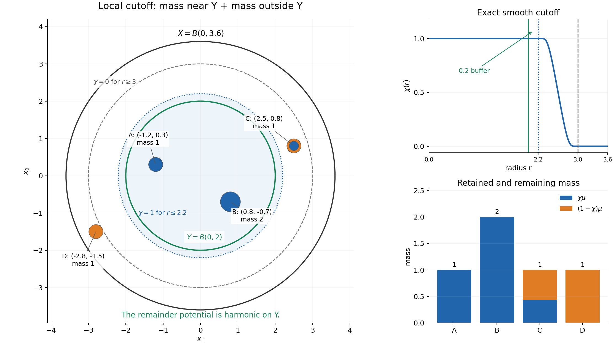
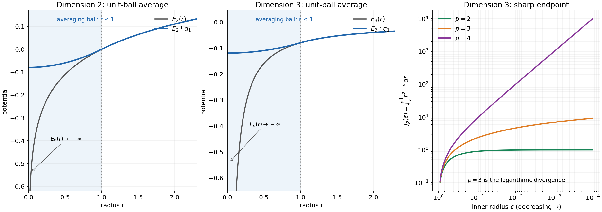

# Local Newtonian potentials and subharmonic regularity

Written by GPT-6.1 Sol (OpenAI), Ultra reasoning effort, October 2026. Original proof exposition and figures: CC0-1.0.

The Laplacian of a subharmonic function is positive. Locally, its mass can be cut off and integrated against one explicit kernel. What remains has zero Laplacian and is smooth. This gives both a precise integrability range and a useful continuity criterion for convolution.

We use ordinary Lebesgue integration, Tonelli's theorem, dominated convergence, polar coordinates, Taylor's formula, the divergence theorem, compact smooth cutoffs and elementary distribution operations. The distribution conventions and written lower arguments are in [Order, positivity and distributional limits, Theorem 4.1](../../prerequisites/order-positivity-and-limits.html#positivity-forces-order-zero), [Tensor products and parameter-dependent distributions, Lemma 1.1 and Theorem 2.1](../../prerequisites/tensor-products-and-parameters.html#pairing-with-a-moving-smooth-test), and [Convolution as addition of supports, Theorems 1.1, 2.1 and 3.1](../../prerequisites/convolution-as-addition-of-supports.html#which-pairs-can-contribute-to-an-output). The measure construction, fundamental kernel and harmonic regularity argument needed here are given below.

## NP1. Statement and conventions

Let \(X\subset\mathbb R^n\) be open, with \(n\ge2\). A subharmonic function is an upper semicontinuous function \(v:X\to[-\infty,\infty)\) satisfying the spherical submean inequality on every closed ball contained in \(X\). Suppose it is not identically \(-\infty\) on any connected component. Write \(s_n=|S^{n-1}|\), and take the fundamental kernel for **\(\Delta\)** to be

\[
 E_n(x)=\begin{cases}
 -\dfrac{|x|^{2-n}}{(n-2)s_n},&n>2,\\[4pt]
 \dfrac{1}{2\pi}\log|x|,&n=2.
 \end{cases}                                                   \tag{NP1.1}
\]

The value at zero is \(-\infty\); the locally integrable kernel defines a distribution independently of that one value. In this sign convention \(\Delta E_n=\delta_0\).

**Theorem NP1 (local potential regularity).** One has

\[
 v\in L^p_{\mathrm{loc}}(X),\qquad
 \begin{cases}
 1\le p<n/(n-2),&n>2,\\
 1\le p<\infty,&n=2.
 \end{cases}                                                   \tag{NP1.2}
\]

Let \(f\in\mathcal E'(\mathbb R^n)\) be a compactly supported distribution, and suppose \(f*E_n\) is represented by a continuous function on \(\mathbb R^n\). Then \(f*v\) is represented by a continuous function on

\[
 \Omega_f=\{x\in\mathbb R^n:x-\operatorname{supp}f\subset X\}.
                                                               \tag{NP1.3}
\]

Here \(f*v\) is the local distribution convolution defined in NP8. If \(f=0\), its support is empty, \(\Omega_f=\mathbb R^n\), and the convolution is zero. The local \(L^1\) assertion also gives \(L^p_{\mathrm{loc}}\) for \(0<p<1\), using \(|t|^p\le1+|t|\). Neither the critical exponent in higher dimension nor \(p=\infty\) in dimension two is included. NP10 gives sharp examples.

The one-dimensional case has a different kernel and is treated explicitly in NP9. The expression \(n/(n-2)\) has no positive admissible exponent when \(n=1\); it must not be read as a one-dimensional bound.

## NP2. From the submean inequality to a positive distribution

First \(v\in L^1_{\mathrm{loc}}(X)\). To prove this without assuming it, choose a point \(a\) where \(v(a)\) is finite and a ball \(\overline{B(a,R)}\subset X\). Upper semicontinuity gives a finite upper bound \(M\) on that ball. For \(0<r<R\), the submean inequality gives

\[
 \frac1{s_n}\int_{S^{n-1}}(M-v(a+r\omega))\,d\omega
 \le M-v(a).
                                                               \tag{NP2.1}
\]

The integrand is nonnegative. Integrating in \(r\) with weight \(s_nr^{n-1}\) proves that \(M-v\), and hence \(v\), is integrable on \(B(a,R)\).

On each component let \(S\) be the points having an integrable neighborhood. It is open and nonempty by the preceding argument. It is relatively closed as well. For \(x\in\overline S\cap X\), choose \(\overline{B(x,4r)}\subset X\). An integrable neighborhood meeting \(B(x,r)\) contains a point \(a\in B(x,r)\) with \(v(a)>-\infty\). Apply the same argument on \(B(a,2r)\), whose closure lies in \(X\) and which contains \(B(x,r)\). Thus \(x\in S\). Connectedness proves the assertion on every component. Compact sets meet finitely many of these integrable neighborhoods.

Choose a nonnegative radial \(\rho\in C_c^\infty(B(0,1))\) of integral one, and set \(\rho_\varepsilon(x)=\varepsilon^{-n}\rho(x/\varepsilon)\). On the interior where it is defined, \(v_\varepsilon=v*\rho_\varepsilon\) is smooth. The submean inequality for \(v\), integrated against \(\rho_\varepsilon\), gives the same inequality for \(v_\varepsilon\); Tonelli applied after subtracting a common local upper bound justifies the interchange. Taylor's formula gives

\[
 \frac1{s_n}\int_{S^{n-1}}v_\varepsilon(x+r\omega)\,d\omega
 =v_\varepsilon(x)+\frac{r^2}{2n}\Delta v_\varepsilon(x)+o(r^2).
                                                               \tag{NP2.2}
\]

It follows that \(\Delta v_\varepsilon\ge0\). Approximate identities converge to \(v\) in local \(L^1\), so for every nonnegative smooth compact test \(\phi\),

\[
 \langle\Delta v,\phi\rangle
 =\lim_{\varepsilon\downarrow0}\int\phi\,\Delta v_\varepsilon\ge0.
                                                               \tag{NP2.3}
\]

The local approximate-identity assertion follows directly from translation continuity in \(L^1\): approximate an integrable function on a compact neighborhood by continuous compactly supported functions, for which translation convergence is uniform, and bound the two approximation errors by their \(L^1\) norms. Distribution convergence follows by integrating against each test.

Radial smoothing also recovers the given values of \(v\): the submean inequality, integrated over radii, gives \(v_\varepsilon(x)\ge v(x)\), while upper semicontinuity gives \(\limsup_{\varepsilon\downarrow0}v_\varepsilon(x)\le v(x)\). This includes \(v(x)=-\infty\).

## NP3. Why a positive distribution is a locally finite measure

We give the representation step as well as the order-zero estimate. Let \(T\) be a positive distribution on a Euclidean open set. For a compact \(K\), choose a nonnegative smooth compact \(\eta\) equal to one near \(K\). Positivity of \(\|\phi\|_\infty\eta\pm\phi\) gives

\[
 |T\phi|\le T\eta\,\|\phi\|_\infty
 \quad(\phi\text{ real},\ \operatorname{supp}\phi\subset K).
                                                               \tag{NP3.1}
\]

For complex tests apply the real inequality to the real part of a constant unit multiple of \(\phi\) whose pairing is positive real. Thus the same bound holds. Uniform smooth approximation on a fixed compact neighborhood extends \(T\) uniquely to a positive functional \(L\) on \(C_c(X)\). Positivity survives approximation by nonnegative smooth functions, obtained by mollification and a cutoff. Its bound is uniform on each fixed compact neighborhood.

For an open set \(U\subset X\) define

\[
 m(U)=\sup\{L\psi:\psi\in C_c(U),\ 0\le\psi\le1\},
 \qquad
 \mu^*(A)=\inf_{U\supset A,\ U\text{ open}}m(U).                \tag{NP3.2}
\]

These quantities can be infinite. They are finite for relatively compact \(U\), by (NP3.1) and a cutoff equal to one on \(\overline U\). If \(U\subset\bigcup_jU_j\), a finite partition of unity on the compact support of any candidate \(\psi\) splits it into nonnegative tests in the \(U_j\), each at most one. Consequently \(m(U)\le\sum_jm(U_j)\). For disjoint open sets the reverse inequality follows by summing any finite selection of nearly maximizing tests. Hence \(m\) is countably additive on disjoint open sets and countably subadditive for open covers. Choosing open supersets with errors summing to an arbitrarily small number proves that \(\mu^*\) is an outer measure. Moreover \(\mu^*(U)=m(U)\) for open \(U\).

This outer measure is metric: if two sets have positive distance, intersect an open superset of their union with disjoint small neighborhoods of the two sets. Additivity on disjoint open sets proves

\[
 \mu^*(A\cup B)=\mu^*(A)+\mu^*(B)
 \quad\text{when }\operatorname{dist}(A,B)>0.                  \tag{NP3.3}
\]

Here is the measurability argument. For a relatively closed set \(F\subset X\) and a set \(A\) with \(\mu^*(A)<\infty\), partition the part of \(A\) at small positive distance from \(F\) into distance annuli

\[
 R_j=A\cap\{1/(j+1)\le d(x,F)<1/j\}.
\]

Every finite collection of even-indexed annuli is separated by positive distances, as is every finite collection of odd-indexed annuli. Formula (NP3.3) bounds each finite sum of their outer measures by \(\mu^*(A)\). Therefore \(\sum_j\mu^*(R_j)<\infty\), and the outer measure of their tails tends to zero. The sets \(A\cap F\) and \(A\cap\{d(x,F)\ge1/N\}\) are separated. Use (NP3.3), then let \(N\to\infty\), to obtain

\[
 \mu^*(A)\ge\mu^*(A\cap F)+\mu^*(A\setminus F).
\]

The reverse inequality is outer subadditivity. If \(\mu^*(A)=\infty\), the required lower inequality is automatic. Thus closed sets, and hence Borel sets, satisfy the outer-measure measurability criterion. For relative closed sets the distance may be taken in the metric space \(X\); any point outside such a set has positive distance from it. The measurable sets form a sigma algebra: complements preserve the criterion, and iterating it for finite disjoint unions followed by outer subadditivity proves countable additivity and closure under countable unions. The restriction \(\mu\) to Borel sets is a locally finite measure, outer regular by construction.

It remains to identify \(L\). For \(0\le\phi\in C_c(X)\), take a relatively compact open \(V\) containing its support, set \(M=\|\phi\|_\infty\), and, if \(M>0\), let \(\delta=M/N\) and \(U_i=\{\phi>i\delta\}\). Choosing nearly maximizing tests in \(U_i\) for \(1\le i\le N\) gives

\[
 \delta\sum_{i=1}^Nm(U_i)\le L\phi,                          \tag{NP3.4}
\]

because their sum times \(\delta\) is pointwise at most \(\phi\). For the reverse estimate write exactly

\[
 \phi=\delta\sum_{i=1}^N\alpha_i,\qquad
 \alpha_i=\min(1,\max(\phi/\delta-i+1,0)).
\]

The first summand is supported in \(V\). For \(i\ge2\), \(\operatorname{supp}\alpha_i\subset U_{i-2}\). Hence

\[
 L\phi\le\delta m(V)+\delta\sum_{i=0}^{N-2}m(U_i).
                                                               \tag{NP3.5}
\]

The difference between the upper and lower bounds is at most \(2\delta m(V)\). The layer-step bounds for \(\int\phi\,d\mu\), using \(\mu(U_i)=m(U_i)\), have the same limit. Letting \(N\to\infty\) proves \(L\phi=\int\phi\,d\mu\). The case \(M=0\) is immediate; decomposition into positive and negative parts, then real and imaginary parts, proves the identity for every continuous compact test.

For open \(U\), (NP3.2) and this identity show inner regularity: each candidate is supported on a compact subset of \(U\), so \(\mu(U)=\sup_{K\subset U,\ K\text{ compact}}\mu(K)\). On a finite-measure region, inner regularity for a Borel set follows by approximating the complement from outside by open sets and first restricting to a compact subset of a surrounding open region; the measure lost is the sum of the two approximation errors. Exhausting \(X\) by relatively compact regions gives the general case. Thus \(\mu\) is Radon. The open-set formula determines it uniquely. Applying this to (NP2.3) gives

\[
 \Delta v=\mu\ge0\quad\text{as distributions}.                \tag{NP3.6}
\]

## NP4. The kernel, its sign and its exact integrability

Away from zero, the radial identity

\[
 \Delta g(r)=g''(r)+(n-1)g'(r)/r
\]

shows \(\Delta E_n=0\). For both cases in (NP1.1),

\[
 E_n'(r)=\frac1{s_nr^{n-1}}.                                  \tag{NP4.1}
\]

Fix \(\phi\in C_c^\infty(\mathbb R^n)\). Green's identity on a large ball with \(\overline{B(0,\varepsilon)}\) removed, with zero outer contribution, yields

\[
 \int_{|x|>\varepsilon}E_n\Delta\phi\,dx
 =\int_{|x|=\varepsilon}
    \bigl[-E_n\partial_r\phi+\phi E_n'(\varepsilon)\bigr]\,dS.
                                                               \tag{NP4.2}
\]

The inner boundary's outward normal is \(-\partial_r\), which explains the signs. The first term is bounded by a constant times \(\varepsilon\) for \(n>2\) and \(\varepsilon|\log\varepsilon|\) for \(n=2\). The second term is the spherical average of \(\phi\) and tends to \(\phi(0)\). The kernel is locally integrable, so the left side tends to \(\langle E_n,\Delta\phi\rangle\). This proves \(\Delta E_n=\delta_0\).

For \(n>2\), put \(a_n=1/((n-2)s_n)\). Polar integration gives the exact formula

\[
 \int_{B(0,R)}|E_n|^p\,dx
 =\frac{s_na_n^pR^{n-p(n-2)}}{n-p(n-2)}
 \quad\text{if }p<n/(n-2).                                    \tag{NP4.3}
\]

At equality the radial integral is \(\int_0^Rdr/r\) and diverges. Above equality it diverges by a power. In dimension two the only issue is the origin, where

\[
 \int_0^{\min(R,1)}r|\log r|^p\,dr
 =\int_{-\log\min(R,1)}^\infty t^pe^{-2t}\,dt<\infty           \tag{NP4.4}
\]

for every finite \(p\ge1\). The kernel is smooth elsewhere. It is unbounded at zero in both dimensional regimes.

## NP5. A direct harmonic smoothing argument

**Lemma NP5 (Weyl's lemma for the Laplacian).** If \(h\in\mathcal D'(U)\) and \(\Delta h=0\), then \(h\) is represented by a smooth harmonic function on \(U\).

**Proof.** Its local mollifications \(h_\varepsilon\) are smooth and satisfy \(\Delta h_\varepsilon=0\). For any smooth harmonic \(g\), differentiation of its spherical mean and the divergence theorem give

\[
 \frac d{dr}\left(\frac1{s_n}\int_{S^{n-1}}g(x+r\omega)\,d\omega\right)
 =\frac1{s_nr^{n-1}}\int_{B(x,r)}\Delta g\,dy=0.                \tag{NP5.1}
\]

Thus every normalized radial smooth averaging kernel \(\eta_r\), supported in \(B(0,r)\), satisfies \(g*\eta_r=g\) where the closed averaging ball lies in the harmonic region.

Fix \(\overline{B(x_0,4r)}\subset U\). For \(x\in B(x_0,r)\) and all sufficiently small \(\varepsilon\), this identity applies to \(h_\varepsilon\) and gives \(h_\varepsilon=h_\varepsilon*\eta_r\). Passing to the distribution limit gives \(h=h*\eta_r\) on \(B(x_0,r)\). To justify the limit, pair with a test in that ball; its convolution with the reflected \(\eta_r\) has one fixed compact support in \(U\), so distribution convergence applies. The right side is the smooth function \(x\mapsto\langle h(y),\eta_r(x-y)\rangle\). Parameter differentiation is justified by one finite-order distribution estimate on the common compact support, exactly as in the linked Lemma 1.1. Its Laplacian is zero because it represents \(h\). Such balls cover \(U\); the representatives agree on overlaps since a continuous function defining the zero distribution is zero. \(\square\)

This proof uses local smoothing and the ordinary mean-value identity. It requires no general elliptic regularity theorem.

## NP6. Potentials of finite compact mass

Let \(\nu\) be a positive finite measure of compact support \(K\), with total mass \(M\). The expression

\[
 P_\nu(x)=\int E_n(x-y)\,d\nu(y)                              \tag{NP6.1}
\]

is locally integrable and finite almost everywhere. It may equal \(-\infty\) at some points. Indeed on every compact output region the positive part of the integrand has a common finite bound, and Tonelli applied to its absolute value gives a finite integral in \(x\). Fubini identifies its distribution with \(E_n*\nu\). Differentiating against a test and using NP4 gives \(\Delta P_\nu=\nu\).

Let \(A\) be a compact output set and choose \(R\) with \(A-K\subset B(0,R)\). For any exponent in (NP1.2), Jensen's inequality for \(\nu/M\), followed by Tonelli, gives, if \(M>0\),

\[
 \begin{aligned}
 \int_A|P_\nu(x)|^p\,dx
 &\le M^{p-1}\int_K\int_A|E_n(x-y)|^p\,dx\,d\nu(y)\\
 &\le M^p\int_{B(0,R)}|E_n(z)|^p\,dz.
 \end{aligned}                                                \tag{NP6.2}
\]

For \(p=1\) the pointwise inequality is the triangle inequality; for \(p>1\) it also follows directly from Hölder's inequality \(\int|E|\,d\nu\le M^{1-1/p}(\int|E|^p\,d\nu)^{1/p}\). One can first truncate the absolute integrand and then pass to the limit; the finite right side guarantees that the defining integral is absolutely convergent for almost every \(x\). If \(M=0\), \(P_\nu=0\). In particular

\[
 \|P_\nu\|_{L^p(A)}\le M\|E_n\|_{L^p(B(0,R))}.               \tag{NP6.3}
\]

For clarity about pointwise examples, the extended kernel in NP4 is subharmonic. One direct verification is to smooth it with a nonnegative radial mollifier. Its smoothed Laplacian is nonnegative, so (NP5.1), now with nonnegative right side, proves the submean inequality. At nonzero points these smoothings tend to the kernel; at zero they tend to \(-\infty\) by the power or logarithmic scaling. On any fixed ball they have a common upper bound. The upper version of Fatou's inequality passes the submean inequality to the limit. The kernel is upper semicontinuous. Integrating this inequality against finite \(\nu\), after subtracting a local upper bound, proves the submean inequality for \(P_\nu\); the same upper Fatou argument proves upper semicontinuity. Therefore \(P_\nu\) is a subharmonic representative of its distribution. When a harmonic function is added, radial mollification as in NP2 proves uniqueness of this representative among subharmonic functions with the same distribution.

## NP7. The local decomposition and the integrability conclusion

Choose any open \(Y\) with \(\overline Y\) compact in \(X\), and \(\chi\in C_c^\infty(X)\) with \(0\le\chi\le1\), equal to one on a neighborhood of \(\overline Y\). Since \(\mu=\Delta v\) is Radon,

\[
 \nu=\chi\mu
\]

is a finite positive measure of compact support. Define the distribution \(h=v-P_\nu\) on \(X\). Then

\[
 \Delta h=(1-\chi)\mu=0\ \text{near }\overline Y,
 \qquad
 v=P_\nu+h\ \text{on }Y.                                    \tag{NP7.1}
\]

By NP5 the remainder is smooth and harmonic there. Equality initially holds as distributions and almost everywhere. The uniqueness observation at the end of NP6 also gives equality of the subharmonic representatives at every point of \(Y\). Formula (NP6.2) and local boundedness of the smooth remainder give (NP1.2). Every compact subset of \(X\) fits into such a \(Y\), by finitely many compact neighborhoods and a cutoff.

*Figure 1.* In dimension two, \(X=B(0,3.6)\), \(Y=B(0,2)\), and the radial cutoff is one on \(r\le2.2\) and zero on \(r\ge3\). The four masses and the exact cutoff formula are specified in NP10, Example 3. Blue discs represent retained fractions \(\chi\mu\), orange rings the fractions \((1-\chi)\mu\). Their areas are proportional to the respective masses. The latter support stays outside \(Y\); its potential is harmonic there. The picture specifies the decomposition of these four atoms, rather than asserting a general measure is atomic. See (NP7.1).

## NP8. Continuous convolution on its exact local domain

Let \(K=\operatorname{supp}f\ne\varnothing\). The set \(\Omega_f\) in (NP1.3) is open: \(x_0-K\) is a compact subset of \(X\), so a small closed ball about \(x_0\), minus \(K\), still lies in \(X\). For \(\phi\in C_c^\infty(\Omega_f)\) define

\[
 \langle f*v,\phi\rangle
 =\left\langle v(y),\left\langle f(t),\phi(y+t)\right\rangle\right\rangle.
                                                               \tag{NP8.1}
\]

The inner function is smooth by the parameter lemma and has support contained in the compact set \(\operatorname{supp}\phi-K\subset X\). A cutoff near \(K\) may be inserted in the inner pairing. Finite-order estimates then prove continuity in the test topology, so (NP8.1) defines a distribution.

Fix \(x_0\in\Omega_f\). Choose a small ball \(B\) about it and a relatively compact open \(Y\subset X\) containing \(\overline B-K\). Use NP7 on \(Y\), so \(v=E_n*\nu+h\) there. Since \(f\) and \(\nu\) are compactly supported, their supports together with the kernel's support satisfy the three-factor properness condition: if the sum belongs to a compact set, the first two coordinates stay compact and the third stays in their compact difference from that output set. Consequently the linked convolution Theorem 3.1, whose proof is the iterated tensor pairing with compact cutoffs, gives

\[
 f*(E_n*\nu)=(f*E_n)*\nu.                                   \tag{NP8.2}
\]

In particular no growth condition on \(E_n\) or on the function \(f*E_n\) at infinity is being assumed. The test and the two compact factors restrict all relevant kernel variables to a compact region.

Write \(F=f*E_n\in C(\mathbb R^n)\). The right side of (NP8.2) is the ordinary function

\[
 Q(x)=\int_{\operatorname{supp}\nu} F(x-y)\,d\nu(y).            \tag{NP8.3}
\]

On a compact output neighborhood all arguments \(x-y\) lie in one compact set. Uniform continuity of \(F\) there gives

\[
 |Q(x)-Q(x')|\le M\sup_{y\in\operatorname{supp}\nu}
 |F(x-y)-F(x'-y)|\longrightarrow0.                            \tag{NP8.4}
\]

Thus \(Q\) is continuous. To treat the remainder, choose \(\alpha\in C_c^\infty(Y)\) equal to one near \(\overline B-K\). Then \(f*h=f*(\alpha h)\) on \(B\) by (NP8.1), and this is smooth: each derivative differentiates the smooth compact function \(\alpha h\), with the compact distribution \(f\) paired afterwards. Hence \(f*v=Q+f*(\alpha h)\) is continuous on \(B\). Such balls cover \(\Omega_f\), and the local representatives agree on overlaps because they represent the same distribution. This proves the continuity conclusion of NP1.

## NP9. The one-dimensional edge

In \(\mathbb R\), use \(E_1(x)=|x|/2\). Its first derivative jumps from \(-1/2\) to \(1/2\), so distributional differentiation gives \(E_1''=\delta_0\). This kernel is locally bounded and continuous. A one-dimensional subharmonic function satisfies the two-endpoint submean inequality; NP2, with the two points of \(S^0\), still gives local integrability and \(v''=\mu\ge0\). NP3 still applies. For every finite compact \(\nu\),

\[
 |(E_1*\nu)(x)-(E_1*\nu)(x')|\le\tfrac12\nu(\mathbb R)|x-x'|.
                                                               \tag{NP9.1}
\]

The local remainder satisfies \(h''=0\), hence is affine; NP5 also proves this, or integrate the zero second derivative twice. Radial smoothing recovers the original values of \(v\), so the decomposition gives a locally continuous, locally bounded function at every point. It is locally convex, since the potential of \(|x|/2\) is convex and the remainder affine. In particular \(v\in L^\infty_{\mathrm{loc}}\), and the convolution continuity proof in NP8 remains valid whenever \(f*E_1\) is continuous. These are direct one-dimensional supplements, not an interpretation of the negative exponent \(1/(1-2)\).

## NP10. Worked examples

**Example 1: one point mass and the sharp exponent.** In three dimensions, \(v(x)=E_3(x)=-1/(4\pi|x|)\) has \(\Delta v=\delta_0\). For \(p<3\),

\[
 \int_{B(0,R)}|v|^p\,dx=(4\pi)^{1-p}\frac{R^{3-p}}{3-p}.
\]

For \(p=3\) the truncated integral over \(\varepsilon<|x|<R\) is \((4\pi)^{-2}\log(R/\varepsilon)\), which diverges. In dimension two, \(E_2=(2\pi)^{-1}\log r\) has every finite local \(L^p\) norm but no local \(L^\infty\) norm near zero. Thus the missing endpoints in NP1 cannot be added for all subharmonic functions.

**Example 2: averaging over a ball removes the point singularity.** Let

\[
 q_a(x)=\frac{\mathbf1_{B(0,a)}(x)}{|B(0,a)|},\qquad a>0,
 \quad F_a=E_n*q_a.
\]

This is a compactly supported measure factor of total mass one. Its potential is continuous. Indeed

\[
 |F_a(x+b)-F_a(x)|
 \le\frac1{|B(0,a)|}\int_{B(0,a)}|E_n(x+b-y)-E_n(x-y)|\,dy,
\]

and, for \(x\) in a compact set, the integral is bounded by the \(L^1\) translation difference of the kernel on one larger compact ball. Translation continuity was proved in NP2. The explicit formulas, with \(r=|x|\), are

\[
 F_a(r)=\begin{cases}
 \dfrac{r^2-na^2/(n-2)}{2s_na^n},&0\le r\le a,\ n>2,\\[4pt]
 E_n(r),&r\ge a,\ n>2,
 \end{cases}                                                   \tag{NP10.1}
\]

and

\[
 F_a(r)=\begin{cases}
 \dfrac{\log a}{2\pi}+\dfrac{r^2-a^2}{4\pi a^2},&0\le r\le a,\ n=2,\\[4pt]
 \dfrac{\log r}{2\pi},&r\ge a,\ n=2.
 \end{cases}                                                   \tag{NP10.2}
\]

For \(r>a\), the function \(y\mapsto E_n(x-y)\) is harmonic on the averaging ball, so NP5.1 gives the exterior formula. Inside, \(\Delta F_a=q_a=n/(s_na^n)\); subtracting \(r^2/(2s_na^n)\) leaves a smooth radial harmonic function, which is constant. To see the last assertion, its radial derivative satisfies \((r^{n-1}g')'=0\); smoothness at zero forces the integration constant to vanish. Continuity at \(r=a\) determines the displayed constants. The derivatives also match there, both being \(1/(s_na^{n-1})\). NP1 therefore says that the ordinary ball average \(q_a*v\) is continuous wherever the entire translated closed ball lies in \(X\).

*Figure 2.* For \(a=1\), the first two panels show the exact radial kernels and ball potentials in (NP1.1), (NP10.1) and (NP10.2), in dimensions two and three. Only the point kernel diverges at zero. The last panel shows, in dimension three, \(J_p(\varepsilon)=\int_\varepsilon^1r^{2-p}\,dr\), with \(p=2,3,4\): respectively \(1-\varepsilon\), \(\log(1/\varepsilon)\) and \(\varepsilon^{-1}-1\). Multiplication by \((4\pi)^{1-p}\) gives the corresponding truncated integral of \(|E_3|^p\). These are analytic formulas sampled for plotting, not numerical evidence replacing the proof.

**Example 3: an exact cutoff decomposition.** In the plane let \(X=B(0,3.6)\), \(Y=B(0,2)\), and

\[
 \mu=\delta_{(-1.2,0.3)}+2\delta_{(0.8,-0.7)}
       +\delta_{(2.5,0.8)}+\delta_{(-2.8,-1.5)}.
\]

Put \(b(t)=e^{-1/t}\) for \(t>0\), and \(b(t)=0\) otherwise. Set \(S(t)=b(1-t)/(b(t)+b(1-t))\); its denominator is positive for all real \(t\). Define \(\chi(x)=S((|x|-2.2)/0.8)\). This is smooth, because it is constant near the origin and has flat transitions at radii 2.2 and three. It equals one for \(r\le2.2\) and zero for \(r\ge3\). The first two atoms are retained in full; the third is split with weight \(S((\sqrt{6.89}-2.2)/0.8)\); the fourth, whose radius is \(\sqrt{10.09}>3\), is omitted. For \(v=E_2*\mu\),

\[
 v=E_2*(\chi\mu)+E_2*((1-\chi)\mu).
\]

The second summand is harmonic throughout \(Y\). Its two possible singularities have radii greater than two, and the cutoff is one on a neighborhood of \(\overline Y\). Figure 1 displays the fractions.

## NP11. Exercises and complete solutions

**Exercise 1.** With the convention \(\Delta E=\delta_0\), compute the outward flux of \(\nabla E_n\) through a sphere and explain why the higher-dimensional kernel is negative.

**Solution.** By (NP4.1), the flux is \(s_nr^{n-1}E_n'(r)=1\). For \(n>2\), the radial primitive tending to zero as \(r\to\infty\) is \(-r^{2-n}/((n-2)s_n)\). Its derivative is positive. The positive kernel \(+r^{2-n}/((n-2)s_n)\) instead has Laplacian \(-\delta_0\). In dimension two the primitive is \((2\pi)^{-1}\log r\), up to an additive constant.

**Exercise 2.** For \(n>2\), determine the integrability of \(E_n\) near zero at, below and above \(p_*=n/(n-2)\).

**Solution.** The radial integrand is \(s_na_n^p r^{n-1-p(n-2)}\). Its exponent is greater than \(-1\) precisely for \(p<p_*\), giving (NP4.3). At \(p=p_*\) its integral is logarithmic and infinite. Above \(p_*\) its exponent is less than \(-1\) and the truncated integral diverges by a power. Thus one atom already rules out both excluded ranges.

**Exercise 3.** Suppose \(\nu\) has mass \(M\) and support in \(B(0,b)\). Bound its potential on \(B(0,c)\).

**Solution.** For \(x\in B(0,c)\), \(y\in B(0,b)\), one has \(|x-y|<b+c\). Formula (NP6.3) therefore gives \(\|E_n*\nu\|_{L^p(B(0,c))}\le M\|E_n\|_{L^p(B(0,b+c))}\) for the stated finite exponents. If \(M=0\), both sides vanish. This bound needs no density or absence of atoms.

**Exercise 4.** Let \(X=B(0,R)\) and \(f=q_a\), with \(0<a<R\). Find \(\Omega_f\) exactly.

**Solution.** The support of \(q_a\) is the closed ball \(\overline{B(0,a)}\). The maximum of \(|x-y|\) over that support is \(|x|+a\), attained opposite \(x\) when \(x\ne0\). Inclusion in the open ball requires \(|x|+a<R\). Thus \(\Omega_f=B(0,R-a)\). Equality at the boundary is excluded because a translated support point lies on \(\partial X\). NP10, Example 2 and NP8 prove continuity of the ball average exactly on this domain.

**Exercise 5.** Check the value, derivative and Laplacian of the interior ball potential in dimensions two and three when \(a=1\).

**Solution.** In two dimensions it is \((r^2-1)/(4\pi)\). At \(r=1\) its value is zero and derivative \(1/(2\pi)\), matching \((2\pi)^{-1}\log r\). Its Laplacian is \(1/\pi\), the normalized unit-disc density. In three dimensions it is \((r^2-3)/(8\pi)\). At one its value is \(-1/(4\pi)\) and derivative \(1/(4\pi)\), matching \(-1/(4\pi r)\). Its Laplacian is \(3/(4\pi)\), the normalized unit-ball density. Matching first derivatives means there is no extra surface measure in the distributional Laplacian.

**Exercise 6.** Why cannot the continuity conclusion be asserted for every compactly supported \(f\)? Give both an order-zero and a derivative example.

**Solution.** Take \(v=E_n\) and \(f=\delta_0\). Then \(f*v=E_n\) is not continuous at zero, and the hypothesis \(f*E_n\in C\) fails. For \(f=\partial_1\delta_0\), convolution gives \(\partial_1E_n\). Away from zero this is \(x_1/(s_n|x|^n)\); it has no continuous extension at zero, and again \(f*E_n\in C\) fails. Compact support permits convolution; it does not by itself remove a singularity.

**Exercise 7.** Verify the one-dimensional uniform interval potential for \(q_a=\mathbf1_{(-a,a)}/(2a)\).

**Solution.** Integrating \(|x-y|/(4a)\) over \(-a<y<a\) gives \(a/4+x^2/(4a)\) for \(|x|\le a\), and \(|x|/2\) for \(|x|\ge a\). Values and first derivatives match at \(\pm a\). The interior second derivative is \(1/(2a)\), the interval density, and the exterior second derivative is zero. This is the continuous one-dimensional counterpart of (NP10.1)–(NP10.2), independently of the higher-dimensional exponent.

## Source credit

The classical target is Lars Hörmander, *The Analysis of Linear Partial Differential Operators II*, Chapter 16, Proposition 16.1.1, printed page 304 (PDF page 317). The proof here gives the local kernel, measure representation and harmonic smoothing arguments explicitly, with original examples and diagrams. The earlier written distribution arguments are linked at the start. The general positive-functional representation principle originates with F. Riesz; the harmonic smoothing lemma is commonly called Weyl's lemma.
