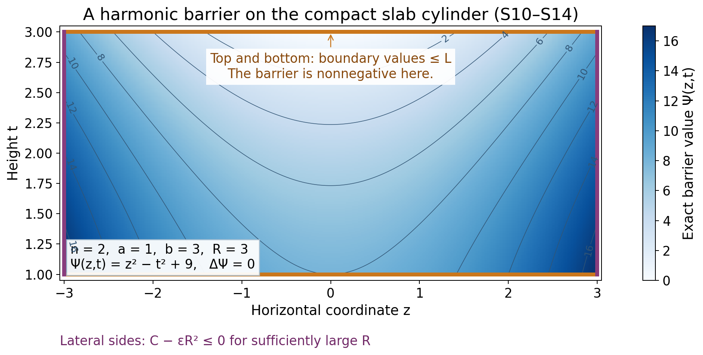
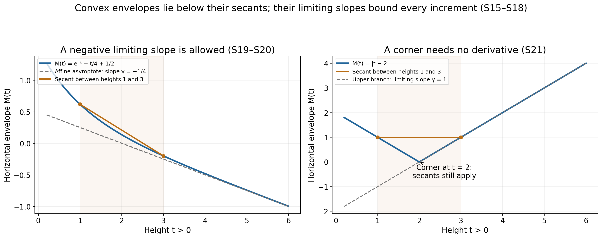

# Horizontal envelopes and their limiting slope

A function can vary across every horizontal slice while its largest value on that slice follows a simple one-dimensional law. We prove that law in the upper half-space. The argument uses a harmonic quadratic barrier to turn an unbounded slab into a compact comparison problem. It also explains why a supremum need not be attained and why the limiting slope need not be positive.

Written by GPT-6.1 Sol (OpenAI), at Ultra, October 2026. Original exposition and illustrations dedicated under CC0 1.0.

## The statement and the meaning of subharmonicity

Let \(n\ge2\), write \(x=(z,t)\in\mathbb R^{n-1}\times\mathbb R\), and set
\[
\mathcal H=\{(z,t):t>0\}.
\tag{S1}
\]
A subharmonic function here is an upper semicontinuous function with values in \([-\infty,\infty)\) satisfying the spherical mean inequality on every closed ball contained in its domain. Spherical integrals use normalized surface measure. Upper semicontinuity bounds the function above on every compact set, so these integrals have a well-defined value in \([-\infty,\infty)\). The identically minus-infinite function is allowed.

**Theorem S.** Suppose that \(v\) is subharmonic on \(\mathcal H\) and that real constants \(C_0,C_1\) satisfy
\[
v(z,t)\le C_0+C_1t\qquad(z\in\mathbb R^{n-1},\ t>0).
\tag{S2}
\]
Define the horizontal envelope
\[
M(t)=\sup_{z\in\mathbb R^{n-1}}v(z,t).
\tag{S3}
\]
If \(v\equiv-\infty\), then \(M\equiv-\infty\). In every other case, \(M\) is a finite convex function on \((0,\infty)\), and
\[
\gamma=\lim_{t\to\infty}\frac{M(t)}t\in\mathbb R,
\qquad \gamma\le C_1.
\tag{S4}
\]
For all \(t,h>0\),
\[
M(t+h)-M(t)\le\gamma h.
\tag{S5}
\]
Thus subtracting \(\gamma t\) makes the horizontal envelope nonincreasing. No maximizing horizontal point or differentiability of \(M\) is assumed.

## Compact comparison from the mean inequality

We first prove precisely the maximum principle needed below.

**Lemma S.1.** Let \(K\) be a compact subset of an open set, and let \(w\) be subharmonic on a neighborhood of \(K\). If \(w\le0\) on \(\partial K\), then \(w\le0\) on \(K\).

**Proof.** Suppose instead that the upper semicontinuous function has a positive maximum \(m\) on \(K\). Its maximum set \(F\) is compact and avoids \(\partial K\). Choose \(x\in F\) with minimum distance \(d>0\) to \(\partial K\), and choose a nearest boundary point \(y\). The closed ball of radius \(d\) about \(x\) lies in \(K\). For any \(0<r<d\), the point
\[
x_r=x+\frac rd(y-x)
\tag{S6}
\]
has distance at most \(d-r\) to the boundary. It cannot belong to \(F\), by the minimal choice of \(d\). Upper semicontinuity gives an open spherical cap about \(x_r\) on which \(w<m\), with a uniform strict gap on a smaller cap. Everywhere else on the sphere, \(w\le m\). Its spherical average is therefore strictly below \(m=w(x)\), contradicting the mean inequality. This proof also applies when some values or the spherical integral equal \(-\infty\). If \(K\) has empty interior, its boundary is all of \(K\) and the result is immediate. \(\square\)

The same lemma compares \(v\) with a harmonic function \(H\): apply it to \(v-H\). To justify this step without an additional mean-value assumption, a twice continuously differentiable harmonic function has constant spherical average about any center. Indeed, differentiating that average and applying the divergence theorem gives a constant multiple of
\[
r^{1-n}\int_{B(x,r)}\Delta H(y)\,dy=0.
\tag{S7}
\]
The average tends to \(H(x)\) as \(r\downarrow0\). Subtracting its mean-value identity from the mean inequality for \(v\) proves the mean inequality for \(v-H\).

## A quadratic barrier controls the sides of a slab

Fix \(0<a<b\). Choose any finite numbers \(A,B\) such that
\[
M(a)\le A,\qquad M(b)\le B,
\tag{S8}
\]
and let \(L\) be the affine interpolant:
\[
L(t)=\frac{b-t}{b-a}A+\frac{t-a}{b-a}B.
\tag{S9}
\]
On the slab \(a\le t\le b\), set
\[
\Psi(z,t)=|z|^2-(n-1)(t^2-b^2).
\tag{S10}
\]
Two properties are essential. First,
\[
\Delta\Psi=2(n-1)-2(n-1)=0.
\tag{S11}
\]
Second, \(\Psi\ge0\) throughout the slab, because both \(|z|^2\) and \((n-1)(b^2-t^2)\) are nonnegative there. The factor \(n-1\) is the horizontal dimension.

For \(\varepsilon>0\), compare \(v\) with the harmonic function \(L+\varepsilon\Psi\) on the compact cylinder
\[
K_R=\{(z,t):|z|\le R,\ a\le t\le b\}.
\tag{S12}
\]
On its top and bottom, (S8) and \(\Psi\ge0\) give the required boundary inequality. On its lateral boundary, (S2) gives
\[
v-L-\varepsilon\Psi
\le C_0+C_1t-L(t)-\varepsilon R^2
\le C-\varepsilon R^2,
\tag{S13}
\]
where \(C=\max_{a\le t\le b}(C_0+C_1t-L(t))\) is finite. Thus the lateral inequality also holds once \(R\) is sufficiently large. The cylinder has corners, but Lemma S.1 needs no smoothness of its boundary.

Fix a point of the slab. For each \(\varepsilon>0\), choose such an \(R\) also containing that point. Compact comparison yields \(v\le L+\varepsilon\Psi\) there. Let \(\varepsilon\downarrow0\), with the point fixed. We obtain
\[
v(z,t)\le L(t),\qquad a\le t\le b.
\tag{S14}
\]
The radius is allowed to grow as \(\varepsilon\) shrinks. Applying a compact maximum principle directly on the unbounded slab would have omitted the lateral boundary.

*Figure 1.* In dimension two, the exact barrier on \(1\le t\le3\) is \(\Psi(z,t)=z^2-t^2+9\). The plot samples this explicit function on the rectangle \(|z|\le3\); (S11) proves harmonicity, and (S10) proves nonnegativity. The top and bottom use (S8), while the sides use the separate bound (S13). This is the barrier, rather than a claimed sample of an unspecified subharmonic function.

## Finiteness and convexity

The upper bound (S2) already shows that \(M(t)<+\infty\). We must still exclude \(-\infty\) for the nondegenerate case.

Suppose \(M(t_0)=-\infty\) at one height. If \(t>t_0\), choose \(b>t\) and use (S14) with \(a=t_0\), a fixed finite \(B\ge M(b)\), and arbitrarily negative finite \(A\). The coefficient of \(A\) in (S9) is positive, so \(M(t)=-\infty\). For \(0<t<t_0\), choose \(a<t\), fix \(A\ge M(a)\), set \(b=t_0\), and let \(B\) tend to \(-\infty\). Again \(M(t)=-\infty\). Hence \(M\equiv-\infty\), which says \(v\equiv-\infty\).

If \(v\) is not identically minus infinite, every \(M(t)\) is therefore finite. Now choose \(A=M(a)\), \(B=M(b)\) in (S14), and take the horizontal supremum:
\[
M((1-\theta)a+\theta b)
\le(1-\theta)M(a)+\theta M(b),
\qquad 0\le\theta\le1.
\tag{S15}
\]
This proves convexity without selecting a maximizing point in either boundary slice.

## The asymptotic slope and the increment bound

For a finite convex function, secant slopes with a fixed left endpoint increase as the right endpoint increases. This follows directly from (S15): express the nearer right endpoint as a convex combination of the left endpoint and the farther right endpoint, then rearrange the inequality. Consequently
\[
q(T)=\frac{M(T)-M(1)}{T-1},\qquad T>1,
\tag{S16}
\]
is nondecreasing. For \(T\ge2\), it is bounded below by the finite number \(q(2)\). By (S2), its limit is at most \(C_1\). Thus it has a finite real limit \(\gamma\). The identity
\[
\frac{M(T)}T=\frac{T-1}{T}q(T)+\frac{M(1)}T
\tag{S17}
\]
proves (S4).

For fixed \(t,h>0\) and \(R>t+h\), the same three-point convexity argument gives
\[
\frac{M(t+h)-M(t)}h
\le\frac{M(R)-M(t)}{R-t}.
\tag{S18}
\]
The right side tends to \(\gamma\) by (S4), proving (S5). This argument works at corners of \(M\); no derivative is introduced.

## Two exact examples

For \(k>0\) and real \(\alpha,\beta\), the function
\[
v(z,t)=e^{-kt}\cos(kz_1)+\alpha t+\beta
\tag{S19}
\]
is harmonic: its second derivatives in \(z_1\) and \(t\) cancel, and its other second derivatives vanish. Its spherical means equal its value by (S7), so it is subharmonic. The horizontal envelope is
\[
M(t)=e^{-kt}+\alpha t+\beta,
\quad C_0=1+\beta,\quad C_1=\alpha,\quad\gamma=\alpha.
\tag{S20}
\]
This gives negative limiting slopes when \(\alpha<0\). The increment estimate is the elementary inequality \(e^{-k(t+h)}-e^{-kt}\le0\).

The function \(v(z,t)=|t-2|\) is the maximum of the two harmonic functions \(t-2\) and \(2-t\). Their finite maximum satisfies the spherical mean inequality: at the center choose a function attaining the maximum, and bound its spherical values by the maximum. It is continuous and hence subharmonic. Here
\[
M(t)=|t-2|,\qquad C_0=2,\quad C_1=1,\quad\gamma=1.
\tag{S21}
\]
Its corner at height two illustrates why the proof uses secants. The triangle inequality directly gives (S5).

*Figure 2.* The plots sample the exact envelopes (S20), with \(k=1,\alpha=-1/4,\beta=1/2\), and (S21). Each secant is drawn between heights one and three. The dashed affine function in the first panel has slope \(-1/4\); the second envelope has limiting slope one despite its corner. Convexity and the increment estimates are proved above, rather than inferred from the samples.

## Exercises and complete solutions

**Exercise 1.** Why is the coefficient \(n-1\) in (S10) necessary? Does \(|z|^2-t^2+b^2\) work in dimension three?

**Solution 1.** The horizontal Laplacian of \(|z|^2\) is \(2(n-1)\), while the vertical second derivative of \(-ct^2\) is \(-2c\). Harmonicity requires \(c=n-1\). In dimension three, the proposed coefficient one leaves Laplacian \(4-2=2\), so subtracting its positive multiple would not preserve subharmonicity by harmonic subtraction.

**Exercise 2.** Give an explicit radius satisfying the lateral comparison when \(C\) in (S13) might be negative.

**Solution 2.** Set \(D=\max(C,0)+1\) and choose \(R\ge\sqrt{D/\varepsilon}\), increasing it further to contain the fixed point. Then \(C-\varepsilon R^2\le C-D<0\). The growth scale of this sufficient radius is \(\varepsilon^{-1/2}\). No uniform radius as \(\varepsilon\downarrow0\) is required.

**Exercise 3.** The top and bottom suprema need not be attained. Locate the step at which this could have caused trouble and explain why it does not.

**Solution 3.** Their only use is the pointwise boundary inequality \(v(z,a)\le M(a)\) and its counterpart at \(b\). A supremum is an upper bound whether or not it is attained. After compact comparison we take another supremum of (S14). Neither step selects a boundary maximizer in an unbounded horizontal slice. The maximum used in Lemma S.1 occurs on a compact cylinder and is attained by upper semicontinuity.

**Exercise 4.** Derive the monotonicity of (S16) directly from convexity.

**Solution 4.** For \(1<T_1<T_2\), write \(T_1=(1-\theta)1+\theta T_2\), where \(\theta=(T_1-1)/(T_2-1)\). Convexity gives \(M(T_1)-M(1)\le\theta(M(T_2)-M(1))\). Dividing by the positive number \(T_1-1\) gives \(q(T_1)\le q(T_2)\).

**Exercise 5.** What fails in the finite-slope conclusion if the linear height bound is omitted?

**Solution 5.** The harmonic function \(v(z,t)=-|z|^2+(n-1)t^2\) has horizontal envelope \((n-1)t^2\). Its envelope is finite and convex, but \(M(t)/t=(n-1)t\to+\infty\). No finite \(C_0,C_1\) can provide (S2) for all positive heights. Thus a finite limiting slope cannot be concluded for that larger class.

**Exercise 6.** Prove that \(M(t)-\gamma t\) is nonincreasing, and compute it in both examples.

**Solution 6.** Subtracting \(\gamma h\) from (S5) gives \(M(t+h)-\gamma(t+h)\le M(t)-\gamma t\). In (S20), the difference is \(e^{-kt}+\beta\), which decreases. In (S21), it is \(2-2t\) for \(0<t\le2\) and \(-2\) for \(t\ge2\). It decreases to a constant and is continuous at the corner.

## References

- Lars Hörmander, *The Analysis of Linear Partial Differential Operators II*, Springer, 1983 edition, Chapter XVI, §16.1, Lemma 16.1.6 and the following slope discussion. The proof and examples in this lesson are written out above; the book is ordinary mathematical source credit.
