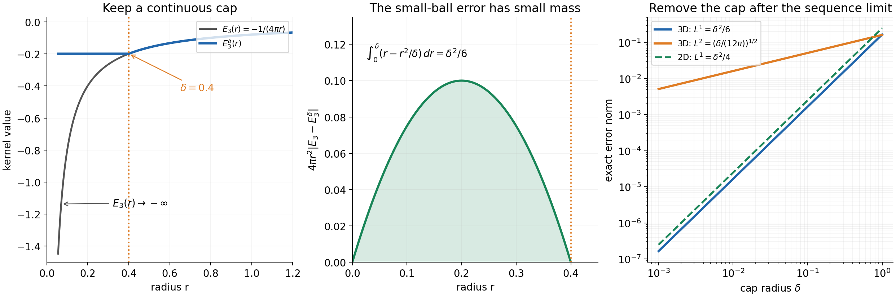
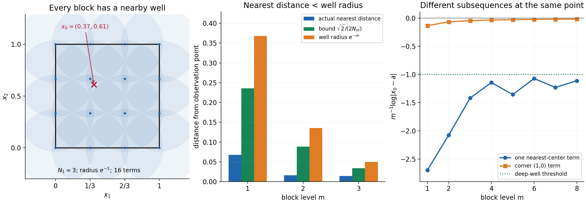

# Distributional limits of subharmonic functions

Written by GPT-6.1 Sol (OpenAI), Ultra reasoning effort, October 2026. Original exposition, examples, solutions and diagrams: CC0-1.0.

A distributional limit need not control individual values. Subharmonicity supplies an upper bound through positive averages. A local positive-measure decomposition supplies stronger norm convergence. A second measure can detect almost every value of the upper limit when its Newtonian potential is continuous. The upper limit matters: the sequence itself can fail to converge at every point even though every finite local norm tends to zero.

The exact written inputs are [Local Newtonian potentials and subharmonic regularity, NP2–NP7](../../AN02-L131.html#NP2): local integrability and radial recovery of a subharmonic representative, its positive Laplacian measure, the signed fundamental kernel, harmonic smoothing, finite-mass potential estimates, and the pointwise local decomposition. [NP9](../../AN02-L131.html#NP9) gives the separate one-dimensional kernel. The uniform finite-order bound for a pointwise bounded family on a fixed compact test support is proved in [Banach estimates, quotient spaces and compact parameter arguments, Section 14.3](../../prerequisites/banach-foundation-bridges.html#a-common-finite-order-for-an-arbitrary-family). Every new convergence, kernel approximation and measurement argument is given below.

## SC1. The precise statement

Let \(X\subset\mathbb R^n\) be open, \(n\ge2\). Let \(v_j,v\) be upper semicontinuous subharmonic functions on \(X\), with no component on which any of these functions is identically \(-\infty\). The spherical submean inequality holds on every closed ball contained in \(X\). Suppose

\[
 v_j\longrightarrow v\quad\text{in }\mathcal D'(X),
 \qquad
 \int_X(v_j-v)\phi\,dx\longrightarrow0
 \quad(\phi\in C_c^\infty(X)).                               \tag{SC1.1}
\]

NP2 supplies the locally integrable representatives in this pairing. Use

\[
 \Delta E_n=\delta_0,\qquad
 E_n(x)=-\frac{|x|^{2-n}}{(n-2)s_n}\ (n>2),\qquad
 E_2(x)=\frac{\log|x|}{2\pi},                                \tag{SC1.2}
\]

where \(s_n\) is the area of the unit sphere.

**Theorem SC1.** For every compact \(K\subset X\),

\[
 \|v_j-v\|_{L^p(K)}\longrightarrow0,\qquad
 \begin{cases}
 1\le p<n/(n-2),&n>2,\\
 1\le p<\infty,&n=2.
 \end{cases}                                                \tag{SC1.3}
\]

Convergence also holds for \(0<p<1\), in the integral metric. At every point,

\[
 \limsup_{j\to\infty}v_j(x)\le v(x),\qquad x\in X.            \tag{SC1.4}
\]

Let \(\sigma\) be a positive Radon measure with compact support in \(X\). Assume that the distribution \(E_n*\sigma\) has a continuous representative on all of \(\mathbb R^n\). Then

\[
 \limsup_{j\to\infty}v_j(x)=v(x)>-\infty
 \quad\text{for }\sigma\text{-almost every }x.                \tag{SC1.5}
\]

Compact support makes the Radon measure finite. For the zero measure the last assertion is vacuous. It concerns the upper limit of the entire sequence, not ordinary pointwise convergence. No critical exponent in dimension greater than two or planar \(L^\infty\) convergence is asserted. The separate one-dimensional statement is in SC10.

## SC2. Uniformity for compact families of smooth tests

**Lemma SC2.** Suppose \(T_j\to0\) in \(\mathcal D'(U)\). Let \(K\) be compact and let \(x\mapsto\phi_x\) be a continuous map from \(K\) to smooth tests with one common compact support \(L\Subset U\), continuous in every derivative supremum seminorm. Then

\[
 \sup_{x\in K}|\langle T_j,\phi_x\rangle|\longrightarrow0.   \tag{SC2.1}
\]

**Proof.** Pairings with each fixed test form a bounded sequence. The exact fixed-support uniform boundedness theorem cited above supplies an integer \(N\) and a constant \(C\), independent of \(j\), such that

\[
 |\langle T_j,\psi\rangle|
 \le C\max_{|\alpha|\le N}\sup_L|\partial^\alpha\psi|
 \quad(\psi\in\mathcal D_L(U)).                             \tag{SC2.2}
\]

Given \(\varepsilon>0\), compactness of the continuous image provides finitely many center tests such that every \(\phi_x\) is within \(\varepsilon/(2(C+1))\) of one center in this seminorm. For large \(j\), the finitely many center pairings are smaller than \(\varepsilon/2\). Apply (SC2.2) to the difference from the center. The sum is smaller than \(\varepsilon\), uniformly in \(x\). \(\square\)

For a fixed smooth compact kernel \(\rho\), the tests \(\partial_x^\alpha\rho(x-\cdot)\) meet these hypotheses wherever their supports stay in \(U\). Continuity follows from the mean-value estimate for every derivative on a common compact set. Thus weak distributional convergence becomes locally uniform convergence of every derivative after convolution with a **fixed** kernel. This assertion does not allow its radius to shrink with \(j\).

**Corollary SC2.** If harmonic distributions \(h_j,h\) on \(U\) converge in \(\mathcal D'(U)\), they converge in \(C^\infty_{\mathrm{loc}}(U)\).

**Proof.** On a compact observation set choose a fixed normalized radial smooth kernel with all its small translates contained in \(U\). NP5 makes the distributions smooth and identifies them there with their averages against this kernel. Apply Lemma SC2 to the translated kernel and every translated derivative. \(\square\)

## SC3. Positive measures and the local decomposition

NP2–NP3 give

\[
 \mu_j=\Delta v_j\ge0,\qquad\mu=\Delta v\ge0,\qquad
 \mu_j\longrightarrow\mu\text{ in }\mathcal D'(X).           \tag{SC3.1}
\]

The convergence follows by testing (SC1.1) on \(\Delta\phi\).

**Lemma SC3.** Positive Radon measures converging on smooth compact tests converge on continuous compact tests. Their masses on each fixed compact subset of \(X\) are uniformly bounded.

**Proof.** For compact \(L\subset X\), choose a smooth nonnegative compact cutoff \(\eta\ge1\) near \(L\). Then \(\mu_j(L)\le\langle\mu_j,\eta\rangle\). The convergent right-hand sequence is bounded, including its finite initial part.

For a continuous compact test \(g\), extend it by zero and mollify, then multiply by a fixed cutoff supported in \(X\) and equal to one near its support. The resulting smooth \(g_\varepsilon\) have one common compact support and converge uniformly to \(g\): convolution changes a continuous compactly supported function by at most its modulus of continuity at the mollifier radius. The mass bound gives

\[
 \left|\int(g-g_\varepsilon)\,d\mu_j\right|
 \le M\|g-g_\varepsilon\|_\infty,                            \tag{SC3.2}
\]

uniformly in \(j\), and likewise for \(\mu\). Take the sequence limit on the fixed smooth test, then let \(\varepsilon\downarrow0\). \(\square\)

Choose \(Y\) with \(\overline Y\Subset X\), and \(0\le\chi\le1\) smooth, compactly supported in \(X\), equal to one near \(\overline Y\). Put

\[
 \nu_j=\chi\mu_j,\quad\nu=\chi\mu,\quad
 P_j=E_n*\nu_j,\quad P=E_n*\nu.                              \tag{SC3.3}
\]

The measures have common compact support \(S=\operatorname{supp}\chi\). Their masses \(m_j=\langle\mu_j,\chi\rangle\) converge to \(m=\langle\mu,\chi\rangle\); choose \(M\) with \(m_j,m\le M\). They converge on every continuous function on a neighborhood of \(S\), by multiplying that function by \(\chi\) and applying Lemma SC3.

Also \(P_j\to P\) in distributions. For a compact smooth output test \(\phi\), the function

\[
 g_\phi(y)=\int E_n(x-y)\phi(x)\,dx
          =\int E_n(z)\phi(z+y)\,dz                          \tag{SC3.4}
\]

is smooth near \(S\). On any fixed compact neighborhood, all derivatives fall on \(\phi\) and all \(z\)-integrals stay in one compact set where \(E_n\) is integrable. Dominated convergence justifies each derivative. The compact-factor pairing therefore gives

\[
 \langle P_j-P,\phi\rangle
 =\langle\mu_j-\mu,\chi g_\phi\rangle\longrightarrow0.        \tag{SC3.5}
\]

NP7 gives pointwise subharmonic decompositions on \(Y\),

\[
 v_j=P_j+h_j,\qquad v=P+h,                                  \tag{SC3.6}
\]

with smooth harmonic remainders. Subtracting (SC3.5) from (SC1.1) gives distributional convergence of those remainders. Corollary SC2 yields

\[
 h_j\longrightarrow h\quad\text{in }C^\infty_{\mathrm{loc}}(Y). \tag{SC3.7}
\]

The decomposition requires neither convexity of \(X\) nor a bound on all Laplacian mass throughout \(X\).

## SC4. A continuous cap for the kernel singularity

For \(\delta>0\), use

\[
 E_n^\delta(x)=E_n(\max(|x|,\delta)),\qquad
 R_\delta=E_n-E_n^\delta.                                   \tag{SC4.1}
\]

At zero the capped kernel has the finite value \(E_n(\delta)\). It is continuous everywhere, though it need not be smooth at the truncation sphere. The error is supported in \(\overline{B(0,\delta)}\).

For \(n>2\), let \(c_n=1/((n-2)s_n)\). Polar coordinates and \(r=\delta t\) give

\[
 \|R_\delta\|_p^p
 =s_nc_n^p\delta^{\,n-p(n-2)}
   \int_0^1(t^{2-n}-1)^p t^{n-1}\,dt.                       \tag{SC4.2}
\]

For \(0<p<n/(n-2)\), the integral is finite: its power near zero is \(n-1-p(n-2)>-1\); near one the difference vanishes linearly. Its positive power of \(\delta\) makes the norm tend to zero.

For \(n=2\),

\[
 \|R_\delta\|_p^p
 =(2\pi)^{1-p}\delta^2
   \int_0^1(\log(1/t))^p t\,dt.                             \tag{SC4.3}
\]

The last integral equals \(\int_0^\infty s^pe^{-2s}\,ds\), by \(t=e^{-s}\), and is finite for every finite \(p>0\). The norm again tends to zero. These norms are over all of \(\mathbb R^n\), since the error vanishes outside its small ball.

**Lemma SC4.** If positive finite measures \(\lambda_j,\lambda\) have common compact support \(S\), uniformly bounded masses and convergence on continuous tests, then for every continuous \(G\),

\[
 G*\lambda_j\longrightarrow G*\lambda
 \quad\text{uniformly on compact output sets}.              \tag{SC4.4}
\]

**Proof.** For fixed \(x\), the continuous pairing \(G(x-\cdot)\) converges. On the compact difference set \(K-S\), uniform continuity gives the common bound

\[
 |G*(\lambda_j-\lambda)(x)-G*(\lambda_j-\lambda)(x')|
 \le(\lambda_j(S)+\lambda(S))
       \sup_{y\in S}|G(x-y)-G(x'-y)|.                       \tag{SC4.5}
\]

A finite net in \(K\) now reduces uniform convergence to finitely many pointwise convergences. \(\square\)

For a fixed \(\delta\), this applies to \(G=E_n^\delta\) and (SC3.3). No smooth-test pairing with the capped kernel is assumed.

*Figure 1.* The three-dimensional kernel is \(E_3(r)=-1/(4\pi r)\), capped at \(\delta=0.4\). Including the sphere area, its radial \(L^1\) error density is \(r-r^2/\delta\) on \(0<r<\delta\), with integral \(\delta^2/6\). The final panel compares the exact rates \(\|R_\delta\|_{L^1(\mathbb R^3)}=\delta^2/6\), \(\|R_\delta\|_{L^2(\mathbb R^3)}=(\delta/(12\pi))^{1/2}\), and \(\|R_\delta\|_{L^1(\mathbb R^2)}=\delta^2/4\). These evaluate (SC4.2)–(SC4.3), whose proof holds for every admissible exponent.

## SC5. Strong local norm convergence

For \(p\ge1\), a finite positive measure \(\lambda\) of mass \(a\) and \(R\in L^p(\mathbb R^n)\) satisfy

\[
 \|R*\lambda\|_p\le a\|R\|_p.                               \tag{SC5.1}
\]

For \(a=0\) this is immediate. For \(p=1\), integrate the triangle inequality and use Tonelli. For \(p>1\), Hölder on the probability measure \(\lambda/a\) gives

\[
 \left|\int R(x-y)\,d\lambda(y)\right|^p
 \le a^{p-1}\int|R(x-y)|^p\,d\lambda(y).
\]

Integrate in \(x\) and use Tonelli and translation invariance. The needed Hölder inequality follows by normalizing the two factors to unit \(L^p\) and \(L^q\) norm, \(q=p/(p-1)\), integrating the scalar inequality \(ab\le a^p/p+b^q/q\), and rescaling; truncation handles infinite initial norms. Thus (SC5.1) does not assume continuity of the potential.

The \(L^p\) triangle inequality used next also follows from this Hölder argument. Finiteness of the sum first follows from \(|A+B|^p\le2^{p-1}(|A|^p+|B|^p)\). For \(p>1\), integrate \((|A|+|B|)|A+B|^{p-1}\) and apply Hölder to each summand; cancel \(\|A+B\|_p^{p-1}\) unless it is zero. This yields \(\|A+B\|_p\le\|A\|_p+\|B\|_p\). For \(p=1\), integrate the pointwise triangle inequality.

For \(K\subset Y\) compact, split the potentials with (SC4.1):

\[
 \begin{aligned}
 \|P_j-P\|_{L^p(K)}
 &\le(m_j+m)\|R_\delta\|_{L^p(\mathbb R^n)}\\
 &\quad+|K|^{1/p}
       \sup_{x\in K}|E_n^\delta*(\nu_j-\nu)(x)|.             
 \end{aligned}
 \tag{SC5.2}
\]

NP6 identifies the potential distributions with their almost-everywhere functions, so these norms and the split are legitimate. For fixed \(\delta\), the second term tends to zero by Lemma SC4. The first is at most \(2M\|R_\delta\|_p\), which tends to zero when \(\delta\downarrow0\). First take the sequence limit with the cap fixed, then remove the cap. Add the uniformly convergent harmonic remainder from (SC3.7). This proves (SC1.3).

Every compact subset of \(X\) fits inside such a relatively compact \(Y\), by finitely many small neighborhoods and a cutoff. For \(0<p<1\), local \(L^1\) convergence also gives

\[
 \int_K|v_j-v|^p\,dx
 \le |K|^{1-p}\left(\int_K|v_j-v|\,dx\right)^p\longrightarrow0. \tag{SC5.3}
\]

This is Hölder for \(|v_j-v|^p\) and one; a zero-volume \(K\) is immediate. For \(p<1\) the integral is used, not a claim that the \(L^p\) expression is a norm.

## SC6. The upper limit at every point

For a nonnegative normalized radial smooth mollifier \(\rho_r\), whose translate at \(x\) stays in \(X\), integrate the spherical submean inequality over radii:

\[
 v_j(x)\le(v_j*\rho_r)(x).                                  \tag{SC6.1}
\]

For fixed \(r\), distributional convergence makes the right side converge at \(x\). Thus

\[
 \limsup_jv_j(x)\le(v*\rho_r)(x).                            \tag{SC6.2}
\]

NP2 proves that these radial smoothings recover the given subharmonic values, including a value \(-\infty\). Let \(r\downarrow0\) to prove (SC1.4). No subsequence or almost-everywhere norm limit was used.

There is also one finite upper bound for all \(v_j\) and \(v\) on each compact \(K\subset X\). Choose one small \(r\) valid throughout \(K\). Lemma SC2 gives uniform convergence of the fixed smoothings there; the limit is smooth and bounded. Include the finite initial part and use (SC6.1). This is an upper bound, not an absolute bound on deep negative wells.

## SC7. Testing with a continuous-potential measure

Let \(T=\operatorname{supp}\sigma\Subset X\), and choose \(Y\) containing \(T\) in the decomposition above. We prove

\[
 v_j,v\in L^1(\sigma),\qquad
 \int v_j\,d\sigma\longrightarrow\int v\,d\sigma.            \tag{SC7.1}
\]

First, the canonical integral potential \(P_\sigma=E_n*\sigma\) is subharmonic by NP6. Its distribution agrees with the continuous representative \(F\). Radially mollifying the equal distributions gives equal smooth functions. NP2 recovers \(P_\sigma\) pointwise, while continuity of \(F\) gives locally uniform recovery of \(F\). Consequently

\[
 P_\sigma(y)=F(y)\in\mathbb R\quad\text{at every }y.          \tag{SC7.2}
\]

Thus a merely almost-everywhere continuous representative cannot conceal an infinite integral value at a point of \(S\).

On \(T-S\), the positive part of \(E_n\) has a finite upper bound \(B\). For \(n>2\), take \(B=0\); in dimension two a ball of radius \(R\ge1\) containing that difference set gives \(B=(2\pi)^{-1}\log R\). The even kernel and (SC7.2) imply, for \(y\in S\),

\[
 \begin{aligned}
 \int_T|E_n(x-y)|\,d\sigma(x)
 &=2\int_T E_n(x-y)^+\,d\sigma(x)-F(y)\\
 &\le2B\sigma(T)+\sup_S|F|.                                 
 \end{aligned}
 \tag{SC7.3}
\]

The positive part is finite, and the finite value of \(F(y)\) forces the negative part to be finite too. This justifies the identity before taking the bound.

Integrating (SC7.3) against \(\nu_j\) or \(\nu\) proves absolute product-kernel integrability. Fubini therefore yields

\[
 \int_T P_j\,d\sigma=\int_S F\,d\nu_j,\qquad
 \int_T P\,d\sigma=\int_S F\,d\nu.                           \tag{SC7.4}
\]

Both potentials belong to \(L^1(\sigma)\). The right-hand integrals converge by Lemma SC3 and continuity on \(S\). The harmonic remainders converge uniformly on \(T\), so their integrals converge against finite \(\sigma\). The pointwise identities (SC3.6) prove (SC7.1). In particular \(v\) is finite \(\sigma\)-almost everywhere. Only boundedness of \(F\) on \(S\) is needed, not a global bound.

## SC8. Equality for the upper limit

Choose \(C\) above the common upper bound of \(v_j,v\) on \(T\). Fatou applies to the nonnegative functions \(C-v_j\):

\[
 \int_T(C-\limsup_jv_j)\,d\sigma
 \le\liminf_j\int_T(C-v_j)\,d\sigma
 =\int_T(C-v)\,d\sigma<\infty.                              \tag{SC8.1}
\]

Equation (SC1.4) gives the reverse pointwise comparison \(C-\limsup_jv_j\ge C-v\). The two functions have equal finite integrals and a nonnegative difference, so they agree almost everywhere: otherwise one of the sets where the difference exceeds \(1/k\) would have positive measure and give a positive integral. This proves (SC1.5) and completes the theorem. It gives no equality for the lower limit.

## SC9. Worked examples and the limits of the result

**Example 1: a strict exceptional value.** On a planar open disc containing zero, put \(v_j(x)=j^{-1}\log|x|\) and \(v=0\). NP4 gives convergence to zero in every finite local \(L^p\), hence in distributions. Each function is subharmonic, and \(v_j(0)=-\infty\). Thus \(\limsup_jv_j(0)=-\infty<0\). For \(\sigma=\delta_0\), the potential is \(E_2\), which is not continuous at zero. Positivity and compact support of the measuring measure alone do not suffice.

**Example 2: no pointwise convergence anywhere.** Let \(X=(0,1)^2\). For every positive integer \(m\), define

\[
 N_m=\lceil e^m\rceil,\qquad
 G_m=\{(k/N_m,\ell/N_m):0\le k,\ell\le N_m\}.                \tag{SC9.1}
\]

List all points of \(G_1\), then all of \(G_2\), and so on, in a fixed order within each finite block. For a term belonging to center \(a\in G_m\), use

\[
 u_{m,a}(x)=\frac1m\log|x-a|,\qquad\log0=-\infty.           \tag{SC9.2}
\]

This is one sequence; its block number tends to infinity with its index. Each term is subharmonic. A boundary center gives a smooth harmonic function throughout \(X\).

For compact \(K\subset X\), the translated logarithmic kernels have uniformly bounded finite \(L^p(K)\) norms for all \(a\in[0,1]^2\): after translating the integration variable, the domains lie inside one fixed ball, and NP4 bounds the integral of \(|\log|z||^p\) there. The factor \(1/m\) proves strong local convergence to zero for every finite \(p\ge1\), and then in distributions.

At every fixed \(x\in X\), round each coordinate of \(N_mx\) to a nearest integer. The resulting center \(a_m\) satisfies

\[
 |x-a_m|\le\frac{\sqrt2}{2N_m}<e^{-m},\qquad
 u_{m,a_m}(x)\le-1.                                        \tag{SC9.3}
\]

A zero distance gives \(-\infty\). Thus the lower limit is at most \(-1\) everywhere. All distances in the square are at most \(\sqrt2\), so every term is at most \((\log\sqrt2)/m\), tending to zero. By choosing a far endpoint in each coordinate, one of the four corners has distance at least \(1/\sqrt2\) from \(x\). Its distance is also at most \(\sqrt2\), so its logarithm divided by \(m\) tends to zero. Choosing that corner once in each block supplies a subsequence. Consequently

\[
 \limsup_j u_j(x)=0,\qquad\liminf_j u_j(x)\le-1
 \quad\text{at every }x\in X.                              \tag{SC9.4}
\]

Different observation points may choose different nearby terms from a block; one center need not work for the whole square.

Take as an admissible measuring measure the normalized area measure of the disc centered at \((1/2,1/2)\) with radius \(1/4\). Its support is compact in \(X\); NP10 of L131 gives its globally continuous logarithmic potential. Thus ordinary convergence fails at every point of a measure satisfying exactly (SC1.5)'s hypothesis. The upper-limit equality still holds everywhere.

*Figure 2.* At level \(m\), the mesh is \(1/N_m\), and a well has value at most \(-1\) within distance \(e^{-m}\) of its center. The left panel shows the whole \(m=1\) grid and its covering discs. The middle panel shows the exact nearest-center distances for \(x_0=(0.37,0.61)\) at three levels, each bounded by \(\sqrt2/(2N_m)\). The right panel samples one nearest-center value and the value at the fixed distant corner \((1,0)\), for \(1\le m\le8\). The full sequence contains all \((N_m+1)^2\) centers at each level. The finite samples illustrate the proof in (SC9.3)–(SC9.4), which applies to every level and every point.

**Example 3: a lower-dimensional measuring measure.** In the plane let \(\sigma\) be uniform probability measure on the circle of radius \(a>0\), inside an open disc \(X\) of larger radius. Its potential is

\[
 (E_2*\sigma)(x)=\frac1{2\pi}\log\max(|x|,a).                \tag{SC9.5}
\]

To verify the formula, for \(r<a\) factor \(a\) from \(|r-ae^{i\theta}|\). For fixed \(q=r/a<1\), the absolutely uniformly convergent series

\[
 \log|1-qe^{i\theta}|
 =-\sum_{k\ge1}\frac{q^k}{k}\cos(k\theta)
\]

has zero angular mean. It is the real part of the logarithmic power series: differentiating gives the geometric series, and the value at zero fixes the integration constant. For \(r>a\), factor \(r\) and use \(q=a/r\).

For \(r\) near \(a\), the bound \(|r-ae^{i\theta}|\ge a|\sin\theta|\), together with a fixed finite upper bound, dominates the absolute logarithm by an integrable function. Indeed \(|\log|\sin\theta||\) is integrable: near each of its finitely many zeros, \(|\sin\theta|\) is at least a positive constant times distance to that zero, and \(\int_0^b|\log t|\,dt<\infty\). Dominated convergence proves that the circle value is the limit of the interior formula. This establishes (SC9.5) and global continuity. The theorem therefore controls the upper limit for arc-length almost every point on the circle, although its planar Lebesgue measure is zero.

**Example 4: excluded norm endpoints.** In three dimensions take \(a_j=(1/j,0,0)\), \(v_j(x)=E_3(x-a_j)\) and \(v(x)=E_3(x)\), on a ball containing the centers. Local \(L^1\) translation continuity from NP2 gives distributional convergence. For fixed \(j\), \(v\) is bounded near \(a_j\), while \(v_j\) has its \(1/r\) singularity. On a sufficiently small punctured ball there,

\[
 |v_j-v|\ge\frac1{8\pi r}.
\]

The integral of its \(p\)-th power is infinite for \(p\ge3\), by \(\int_0^b r^{2-p}\,dr\). Thus the critical exponent cannot be added. Translated planar logarithmic kernels similarly have unbounded differences near their new centers, excluding general \(L^\infty\) convergence in the plane.

## SC10. A separate one-dimensional statement

NP9 uses \(E_1(x)=|x|/2\) and proves that nontrivial one-dimensional subharmonic functions are locally continuous and convex. This kernel is already continuous, so Lemma SC4 gives uniform local convergence of its cut-off positive-measure potentials without truncation. Corollary SC2 handles the harmonic remainders. Therefore distributional convergence of these one-dimensional functions implies local uniform convergence, every finite local \(L^p\) convergence, and pointwise convergence.

Every positive finite compact measure has a continuous \(E_1\)-potential: its change between arguments \(x,x'\) is at most \(\sigma(\mathbb R)|x-x'|/2\), by integrating the Lipschitz bound for \(|x|/2\). These are direct supplements. The expression \(1/(1-2)\) in the higher-dimensional integrability formula supplies no positive exponent.

## SC11. Exercises with complete solutions

**Exercise 1.** Compute the three kernel-cap errors in Figure 1.

**Solution.** In dimension three,

\[
 \|R_\delta\|_1
 =4\pi\int_0^\delta\frac1{4\pi}(r^{-1}-\delta^{-1})r^2\,dr
 =\int_0^\delta(r-r^2/\delta)\,dr=\delta^2/6.
\]

The squared \(L^2\) error is

\[
 \|R_\delta\|_2^2
 =\frac1{4\pi}\int_0^\delta(1-r/\delta)^2\,dr
 =\frac{\delta}{12\pi}.
\]

Take the square root. In the plane,
\(\|R_\delta\|_1=\int_0^\delta r\log(\delta/r)\,dr=\delta^2/4\).
The last integral follows by parts; its boundary term \(r^2\log r\) tends to zero.

**Exercise 2.** Why would choosing a shrinking radius \(\delta_j\) at the outset leave a gap in (SC5.2)? Give the correct argument.

**Solution.** Lemma SC4 concerns a fixed continuous kernel, not a family whose singularity becomes sharper with \(j\). Given \(\varepsilon>0\), first choose one \(\delta\) with \(2M\|R_\delta\|_p<\varepsilon/2\). For that cap choose \(J\) so that the second term of (SC5.2) is below \(\varepsilon/2\) whenever \(j\ge J\). This proves convergence without requiring a rate for weak convergence of the measures.

**Exercise 3.** Prove uniform convergence of the gradients of a distributionally convergent harmonic sequence on a compact interior set.

**Solution.** A fixed radial mean-value kernel represents each first derivative by pairing with the corresponding translated kernel derivative. The tests have one common compact support and depend continuously on the point in all smooth seminorms. Lemma SC2 gives uniform convergence of the finitely many gradient components. The proof never differentiates a merely pointwise limit.

**Exercise 4.** Where is positivity used in the passage from smooth-test to continuous-test convergence?

**Solution.** The cutoff bound \(\mu_j(L)\le\langle\mu_j,\eta\rangle\) makes local masses uniformly bounded. It controls the uniform-approximation error in (SC3.2). Smooth-test convergence for signed measures does not by itself supply a total-variation bound, so that displayed argument would be unavailable. No mass bound outside the fixed compact neighborhood is needed.

**Exercise 5.** Show that a positive compact measure with continuous Newtonian potential has no atoms when \(n\ge2\).

**Solution.** An atom of mass \(b>0\) at \(a\) contributes \(bE_n(0)=-\infty\) to the canonical potential there. In higher dimensions every other contribution is nonpositive. In the plane the positive part is bounded by compact support and finite mass. Thus the potential at \(a\) is \(-\infty\), contradicting (SC7.2). This is a necessary condition; it does not say every non-atomic measure has a continuous potential.

**Exercise 6.** Justify the two subsequences of the grid-block example and its failure of convergence for the admissible disc measure.

**Solution.** Rounding coordinates gives a center within \(\sqrt2/(2N_m)<e^{-m}\), hence a term at most \(-1\) in each block. Choosing a far endpoint in each coordinate gives a corner at distance between \(1/\sqrt2\) and \(\sqrt2\), whose logarithm divided by \(m\) tends to zero. Every term has upper bound \((\log\sqrt2)/m\). Thus the upper limit is zero and the lower limit is at most \(-1\) at every point. The disc measure has a continuous potential by NP10, and the failures occur everywhere on its support. Only the upper limit is promised by the theorem.

**Exercise 7.** Derive the almost-everywhere upper-limit equality without pointwise convergence or domination of negative parts.

**Solution.** Use a common finite upper bound \(C\). Fatou applies to \(C-v_j\ge0\), giving (SC8.1). The everywhere inequality gives \(C-\limsup v_j\ge C-v\). Their integrals are equal and finite by (SC7.1); sets where their nonnegative difference exceeds \(1/k\) show that difference vanishes almost everywhere. Integrability of \(v\) also gives its almost-everywhere finiteness. No bound on negative spikes or on the lower limit was used.

## SC12. Source credit

The classical statement is Lars Hörmander, *The Analysis of Linear Partial Differential Operators II: Differential Operators with Constant Coefficients*, Proposition 16.1.2, printed pages 304–305. The first edition appeared in 1983; the second printing is 1990, and the edition used here is the 2005 reprint. Both pointwise conclusions are upper-limit conclusions. The proof, cap estimates, grid-block example, circle computation, solutions and diagrams here are independently written. The exact earlier kernel and positive-measure arguments are credited and linked at the start.
