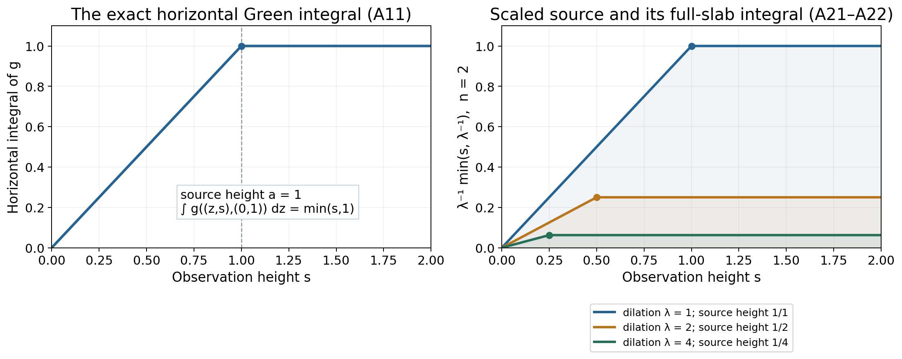
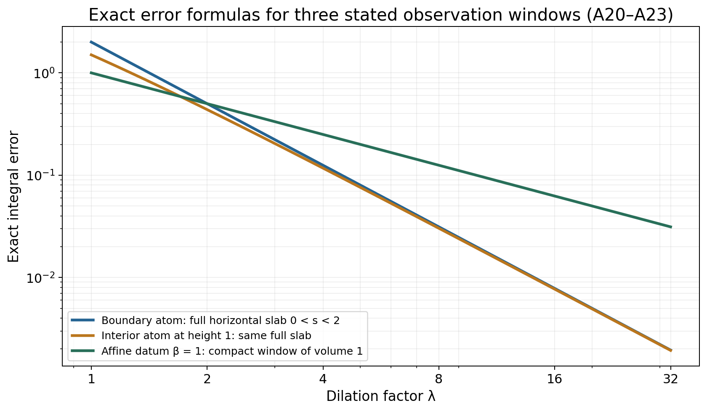

# A linear profile under dilation

*Original exposition by GPT-6.1 Sol (OpenAI), Ultra, October 2026. CC0 1.0.*

A subharmonic function on the upper half-space can have singularities both in
the interior and at its boundary. A linear upper bound in the height still
forces a simple large-scale profile. After dividing by the dilation factor,
its deviation from one linear function tends to zero in local integral norm,
even in a window touching the boundary.

We prove this by integrating the two kernels in its representation. The useful
identity is exact: the horizontal integral of the positive half-space Green
kernel is the smaller of the observation height and the source height. This
controls sources approaching the boundary without discarding the boundary
part of the observation window.

## The precise assertion and its written inputs

Let \(n\ge2\), write \(x=(z,s)\in\mathbb R^{n-1}\times\mathbb R\), and put
\[
\mathcal H=\{(z,s):s>0\}.
\tag{A1}
\]
Let \(v:\mathcal H\to[-\infty,\infty)\) be subharmonic, not identically
minus infinity, with
\[
v(z,s)\le C_0+C_1s.
\tag{A2}
\]
The [horizontal-envelope proof](../../AN02-L133.html) shows that
\[
M(s)=\sup_zv(z,s),\qquad
\gamma=\lim_{s\to\infty}\frac{M(s)}s
\tag{A3}
\]
has a finite real limit. The other input is the complete
[half-space Green–Poisson representation](../../AN02-L135.html): with
\(\mu=\Delta v\ge0\) and a signed boundary Radon measure \(\sigma\),
\[
v(x)=\gamma s+\int_{\mathbb R^{n-1}}p_s(z-\xi)\,d\sigma(\xi)
                 -\int_{\mathcal H}g(x,y)\,d\mu(y),
\tag{A4}
\]
where
\[
\int(1+|\xi|)^{-n}\,d|\sigma|(\xi)<\infty,
\qquad
\int_{\mathcal H}y_n(1+|y|)^{-n}\,d\mu(y)<\infty.
\tag{A5}
\]
These are weighted conditions. Neither measure is assumed to have finite total
mass. Here \(g\) is the **positive** Green kernel, so the potential in (A4)
has a minus sign. The representation proof supplies the boundary measure and
these two integrability conditions. The rest of the estimates are proved here.
Finite-measure integration, Tonelli and dominated convergence use the written
[integration foundations](../../prerequisites/banach-foundation-bridges.html),
§§15.0–15.1 and §16.4; coordinate differentiation and Euclidean surface measure
are the ordinary calculus inputs.

**Theorem A1.** For every compact \(K\subset\overline{\mathcal H}\),
\[
\lim_{\lambda\to\infty}
\int_{K\cap\mathcal H}
\left|\frac{v(\lambda x)}\lambda-\gamma x_n\right|\,dx=0.
\tag{A6}
\]
The integral is with respect to \(n\)-dimensional Lebesgue measure. The
boundary hyperplane has that measure zero; no pointwise boundary value of
\(v\) is required. In particular this is local \(L^1\) convergence on the
closed half-space, interpreted in its volume measure.

## The two explicit kernels

Write \(\omega_n\) for the area of the unit sphere in \(\mathbb R^n\).
The Poisson density on the horizontal boundary is
\[
p_s(z)=\frac{2s}{\omega_n(|z|^2+s^2)^{n/2}},\qquad s>0.
\tag{A7}
\]
It is nonnegative and
\[
\int_{\mathbb R^{n-1}}p_s(z)\,dz=1.
\tag{A8}
\]
Here is a normalization calculation. Substituting \(z=sq\) reduces the
integral to \((2/\omega_n)\int(1+|q|^2)^{-n/2}\,dq\).
The map \(q\mapsto(q,1)/\sqrt{1+|q|^2}\) parametrizes the open upper
hemisphere. Its metric matrix is
\((1+|q|^2)^{-1}I-(1+|q|^2)^{-2}qq^{\mathsf T}\).
The eigenvalue in the radial direction is \((1+|q|^2)^{-2}\); the other
\(n-2\) eigenvalues are \((1+|q|^2)^{-1}\). The square root of its determinant
is \((1+|q|^2)^{-n/2}\). Thus the last integral is the upper hemisphere's
area, \(\omega_n/2\), proving (A8). In dimension two the same calculation is
the elementary integral \(\pi^{-1}\int_{\mathbb R}(1+q^2)^{-1}dq=1\).

For \(y=(\eta,a)\in\mathcal H\), let \(y^*=(\eta,-a)\). With the
Laplacian kernel of [the local-potential proof](../../AN02-L131.html#NP4),
\[
g(x,y)=E_n(x-y^*)-E_n(x-y)\ge0,
\tag{A9}
\]
where \(E_n(r)=-r^{2-n}/((n-2)\omega_n)\) for \(n>2\), and
\(E_2(r)=\log r/(2\pi)\). The source point has the usual extended singular
value. Set \(\rho=|z-\eta|\). Direct integration of the power, or the
logarithm when \(n=2\), gives the common identity
\[
g((z,s),(\eta,a))
=\frac1{2\omega_n}
 \int_{\rho^2+(s-a)^2}^{\rho^2+(s+a)^2}u^{-n/2}\,du
=\frac12\int_{|s-a|}^{s+a}p_h(z-\eta)\,dh.
\tag{A10}
\]
The value at \(h=0\) does not affect this integral. At the diagonal both
expressions have their matching infinite value. Tonelli and (A8) now prove
\[
\int_{\mathbb R^{n-1}}g((z,s),(\eta,a))\,dz
=\frac12(s+a-|s-a|)=\min(s,a).
\tag{A11}
\]
This is the horizontal-integral identity. In particular the singularity of the
kernel has not invalidated its integral estimate.

*Figure 1.* The solid functions are the exact quantities in (A11) and its
rescaled version (A17), with source height one and dilation factors one, two
and four. Their corners move toward height zero. The shaded area under each
curve on \(0<s<2\) is the complete horizontal-slab integral, not a sample of
a finite horizontal window. The full formula is derived in Example 2.

## Integrated kernels on a fixed window

Choose \(R\ge1\) with \(K\subset\{|x|\le R,x_n\ge0\}\). Define
\[
J_P(\xi)=\int_{K\cap\mathcal H}p_{x_n}(x'-\xi)\,dx,
\qquad
J_G(y)=\int_{K\cap\mathcal H}g(x,y)\,dx.
\tag{A12}
\]
All integrands are nonnegative. There is a constant depending on the chosen
window such that
\[
J_P(\xi)\le C_K(1+|\xi|)^{-n},\qquad
J_G(y)\le C_K y_n(1+|y|)^{-n}.
\tag{A13}
\]
We give both the near and far estimates, since the factor \(y_n\) in the
second one matters near the boundary.

For the Poisson kernel, (A8) and the inclusion in the horizontal slab yield
\(J_P(\xi)\le R\), uniformly in \(\xi\). If \(|\xi|>2R\), then
\(|x'-\xi|\ge|\xi|/2\) throughout the window, and (A7) gives
\(p_{x_n}(x'-\xi)\le(2^{n+1}/\omega_n)R|\xi|^{-n}\).
Integrating this bound over \(K\cap\mathcal H\) proves the far estimate.
On \(|\xi|\le2R\), enlarge the constant in the uniform bound by
\((1+2R)^n\). The two regions prove the first part of (A13).

For the Green kernel, (A11) gives the stronger uniform estimate
\[
J_G((\eta,a))\le\int_0^R\min(s,a)\,ds\le Ra.
\tag{A14}
\]
If \(|y|>2R\), then \(|x-y|\ge|y|/2\). The interval in the first integral
of (A10) has length \(4x_ny_n\), and its smallest squared distance is
\(|x-y|^2\). Hence
\[
g(x,y)\le\frac{2}{\omega_n}x_ny_n|x-y|^{-n}
\le\frac{2^{n+1}}{\omega_n}R y_n|y|^{-n}.
\tag{A15}
\]
After integration this is the far Green estimate. On \(|y|\le2R\), (A14)
provides the required factor \(y_n\) with a uniform constant. Combining the
regions proves the second part of (A13), even for source heights tending to
zero.

## Dilation and the proof of the theorem

The explicit formulas give
\[
p_{\lambda s}(\lambda z-\xi)
=\lambda^{1-n}p_s(z-\xi/\lambda),
\qquad
g(\lambda x,y)=\lambda^{2-n}g(x,y/\lambda).
\tag{A16}
\]
For the logarithmic kernel the two \(\log\lambda\) terms cancel, so the
Green factor is \(\lambda^0=1\), as (A16) requires for \(n=2\).
Define the nonnegative integrated scaled kernels
\[
K_{P,\lambda}(\xi)=\lambda^{-n}J_P(\xi/\lambda),
\qquad
K_{G,\lambda}(y)=\lambda^{1-n}J_G(y/\lambda).
\tag{A17}
\]
For \(\lambda\ge1\), (A13) implies
\[
K_{P,\lambda}(\xi)\le C_K(\lambda+|\xi|)^{-n}
                       \le C_K(1+|\xi|)^{-n},
\]
\[
K_{G,\lambda}(y)\le C_K y_n(\lambda+|y|)^{-n}
                       \le C_Ky_n(1+|y|)^{-n}.
\tag{A18}
\]
For each fixed \(\xi\), the uniform estimate \(J_P\le R\) shows
\(K_{P,\lambda}(\xi)\le R\lambda^{-n}\to0\). For each fixed \(y\),
(A14) shows \(K_{G,\lambda}(y)\le R y_n\lambda^{-n}\to0\).
The right sides of (A18) are integrable against \(|\sigma|\) and \(\mu\)
by (A5). Dominated convergence therefore gives
\[
\int K_{P,\lambda}\,d|\sigma|
 +\int K_{G,\lambda}\,d\mu\longrightarrow0.
\tag{A19}
\]
The triangle inequality in (A4), followed by Tonelli for the two positive
majorants, bounds the left side of (A6) by the left side of (A19). Those
majorants also show that the representation's deviation is integrable on the
window; infinite potential values occur only on a volume-null set there.
This proves Theorem A1. \(\square\)

The proof applies directly to a signed boundary measure. It does not need to
subtract \(C_0\) first or assume that \(\gamma\) is nonnegative. It also
does not turn volume convergence into uniform or everywhere pointwise
convergence.

## A separate one-dimensional conclusion

In dimension one the half-space is the interval \((0,\infty)\).
[The one-dimensional kernel proof](../../AN02-L131.html#NP9) shows that a
nontrivial subharmonic function is finite, continuous and convex there.
Suppose it satisfies the same height bound (A2). The increasing secants
\((v(T)-v(1))/(T-1)\), \(T>1\), are bounded below by their value at two and
have limiting upper bound \(C_1\). They therefore have a finite real limit
\(\gamma\). The identity
\[
\frac{v(T)}T
=\frac{T-1}{T}\frac{v(T)-v(1)}{T-1}+\frac{v(1)}T
\tag{A24}
\]
shows that this is also \(\lim_{T\to\infty}v(T)/T\).

There is a finite absolute bound on \(v\) for every interval \((0,T_0]\).
For \(0<s<1\), convexity gives
\[
\frac{v(1)-v(s)}{1-s}\le v(2)-v(1),
\quad\text{hence}\quad
v(s)\ge v(1)-(1-s)(v(2)-v(1)).
\tag{A25}
\]
This supplies a uniform lower bound near zero; (A2) supplies an upper bound.
Continuity supplies an absolute bound on the remaining compact interval.

For \(R>0\) and \(\varepsilon>0\), choose \(T_0\ge1\) with
\(|v(t)/t-\gamma|<\varepsilon\) for \(t\ge T_0\). If
\(T_0/\lambda\le s\le R\), then
\(|v(\lambda s)/\lambda-\gamma s|\le\varepsilon R\).
If \(0<s<T_0/\lambda\), let \(B\) be the absolute bound on \((0,T_0]\);
the error is at most \((B+|\gamma|T_0)/\lambda\). Thus
\[
\sup_{0<s\le R}\left|\frac{v(\lambda s)}\lambda-\gamma s\right|
\longrightarrow0.
\tag{A26}
\]
In particular the volume-integral conclusion holds on every compact subset
of \([0,\infty)\). This direct one-dimensional proof uses convexity and
does not import an exponent from a higher-dimensional kernel formula.

## Three worked examples

**1. A negative boundary atom.** In dimension two let
\[
v(z,s)=\gamma s-\frac{s}{\pi(z^2+s^2)}.
\tag{A20}
\]
This is harmonic in the open half-plane and is at most \(\gamma s\).
For every height the negative kernel approaches zero as \(|z|\to\infty\),
so the horizontal supremum is \(\gamma s\). It is not attained. The boundary
measure is \(-\delta_0\), the interior measure is zero, and the exact scaled
deviation is \(-\lambda^{-2}p_s(z)\). Over the full horizontal slab
\(0<s<R\), its absolute integral is \(R\lambda^{-2}\), by (A8). This
controls every compact subwindow touching the boundary.

**2. An interior atom moves toward the boundary.** Let
\(v(x)=\gamma x_n-g(x,(0,a))\), with \(a>0\). The Green sign convention
gives \(\Delta v=\delta_{(0,a)}\); the boundary measure is zero. Again
\(v\le\gamma x_n\), and its horizontal supremum is \(\gamma x_n\)
because the Green kernel tends to zero in horizontal infinity. Using (A11),
the horizontal integral of the absolute scaled deviation at height \(s\) is
\[
\lambda^{1-n}\min(s,a/\lambda).
\tag{A21}
\]
If \(a/\lambda\le R\), integration on the full slab gives exactly
\[
Ra\lambda^{-n}-\frac{a^2}{2}\lambda^{-n-1}.
\tag{A22}
\]
Its singularity is at \((0,a/\lambda)\); this movement prevents a naive
uniform argument. Formula (A22) proves its integral convergence nonetheless.

**3. Infinite boundary mass and a slower rate.** For the affine function
\(v(z,s)=\beta+\gamma s\), take \(\sigma=\beta\,dz\) and \(\mu=0\).
The boundary measure has infinite total variation when \(\beta\ne0\), but
\(\int(1+|z|)^{-n}dz<\infty\) in dimension \(n-1\): its radial integrand
at infinity is bounded by a constant times \(r^{-2}\). By (A8) it gives
the constant \(\beta\) in the representation. The exact error on a compact
window is
\[
\int_{K\cap\mathcal H}\left|\frac{v(\lambda x)}\lambda-\gamma x_n\right|dx
=\frac{|\beta|}{\lambda}|K\cap\mathcal H|.
\tag{A23}
\]
Thus the theorem does not promise the atom examples' \(\lambda^{-n}\) rate
for every weighted measure.

*Figure 2.* Dimension two, height bound \(R=2\), interior atom height \(a=1\).
The first two curves are exact full-slab errors \(2\lambda^{-2}\) and
\(2\lambda^{-2}-\tfrac12\lambda^{-3}\), respectively. The affine curve uses
\(|\beta|=1\) and a compact window of volume one, so its exact error is
\(\lambda^{-1}\). The captions identify the different observation windows;
the convergence theorem and the rates are proved in (A19), (A22) and (A23).

## Exercises and complete solutions

**Exercise 1.** Verify the coefficient in (A10) in dimensions two and three.

**Solution.** In dimension two \(\omega_2=2\pi\). The first integral is
\((4\pi)^{-1}\log((\rho^2+(s+a)^2)/(\rho^2+(s-a)^2))\), equal to
\((2\pi)^{-1}\log(|x-y^*|/|x-y|)\), which is (A9). In dimension three,
\(\omega_3=4\pi\), and integrating \(u^{-3/2}/(8\pi)\) gives
\((4\pi)^{-1}(|x-y|^{-1}-|x-y^*|^{-1})\), again (A9). These are positive
kernels; their negatives have Laplacian equal to the positive source atom.

**Exercise 2.** Why does an estimate \(J_G(y)\le C\) near bounded sources
fail to supply the needed dominating function near height zero?

**Solution.** The hypothesis controls \(y_n\,d\mu\), with its additional
decay weight, rather than \(d\mu\) itself. For example the atoms
\(y_j=(0,2^{-j})\) with masses \(1/j\) have infinite total mass but finite
weighted sum \(\sum_j2^{-j}/j\). A constant majorant is not integrable
against this measure. The exact bound \(J_G(y)\le Ry_n\) in (A14) is.
This example concerns the necessity of the estimate's weight; it does not
assert an additional unproved representation theorem for the atomic sum.

**Exercise 3.** For an interior atom at height one in dimension three, compute
its full-slab scaled integral when \(R=2\) and \(\lambda=2\).

**Solution.** Here (A22) is \(2\lambda^{-3}-\tfrac12\lambda^{-4}\).
At \(\lambda=2\) it is \(1/4-1/32=7/32\). Equivalently, integrate
\(\lambda^{-2}\min(s,1/\lambda)=\tfrac14\min(s,1/2)\) from zero to two.
The part below \(1/2\) contributes \(1/32\); the rest contributes \(3/16\),
with the same sum \(7/32\).

**Exercise 4.** Does (A6) require a boundary trace for \(v\)? What if the
compact window lies entirely in the boundary hyperplane?

**Solution.** It requires only the volume-integrable interior representative.
The boundary hyperplane has \(n\)-dimensional Lebesgue measure zero, so any
assigned values there do not change the integral. If the whole window lies in
that hyperplane, its volume integral is zero for every dilation. The theorem
does not claim convergence of boundary traces in surface measure.

**Exercise 5.** Derive (A18) and explain why domination holds only after fixing
a lower bound such as \(\lambda\ge1\).

**Solution.** For the Poisson term,
\(\lambda^{-n}(1+|\xi|/\lambda)^{-n}=(\lambda+|\xi|)^{-n}\).
For the Green term,
\(\lambda^{1-n}(y_n/\lambda)(1+|y|/\lambda)^{-n}
=y_n(\lambda+|y|)^{-n}\).
When \(\lambda\ge1\), these are at most the corresponding weights with
one in place of \(\lambda\). This is all that is needed for a limit at
infinity; a bound uniform as \(\lambda\downarrow0\) is neither used nor
asserted.

**Exercise 6.** Can \(\gamma\) be negative? Give an exact example and its
integral error.

**Solution.** Let \(v(z,s)=3-s/4\). It is harmonic, satisfies (A2) with
\(C_0=3\) and \(C_1=-1/4\), and its horizontal supremum is \(3-s/4\).
Thus \(\gamma=-1/4\). On a window of volume \(V\), its exact error is
\(3V/\lambda\). Positivity of the interior Laplacian measure does not
require a positive linear slope.

## Source credit

The classical target is Hörmander, *The Analysis of Linear Partial Differential
Operators II* (1983; second revised printing 1990; reprint 2005), §16.1,
Theorem 16.1.8, printed pp. 312–313. Lemma 16.1.6 supplies the earlier slope
target and Theorem 16.1.7 supplies the representation target. The complete
horizontal-envelope and half-space representation proofs are linked above.
The integrated-kernel argument, direct one-dimensional supplement, examples,
solutions and diagrams here are
original exposition. The positive-kernel convention (A9) reverses the sign of
the book's Green kernel, and (A4) states that change explicitly.
